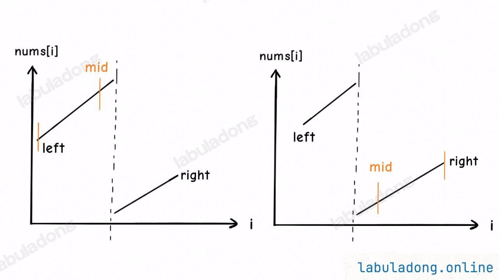
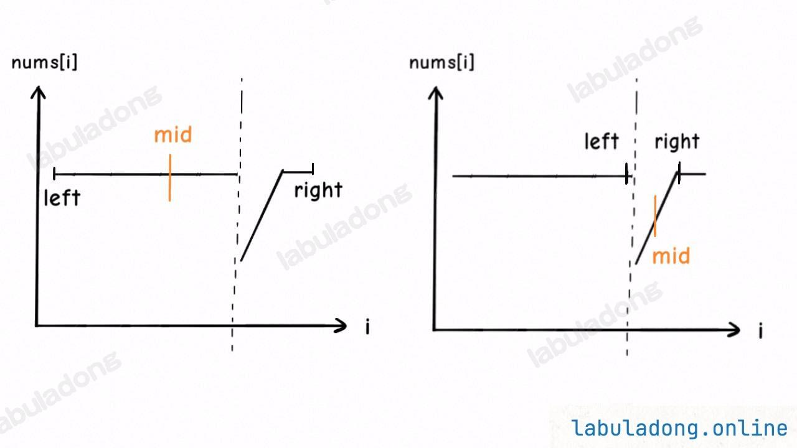
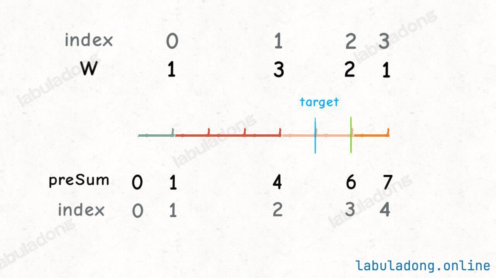

## 力扣算法

### 丑数III

https://leetcode.cn/problems/ugly-number-iii/

```java
class Solution {
    public int nthUglyNumber(int n, int a, int b, int c) {
        // 题目说本题结果在 [1, 2 * 10^9] 范围内，
        // 所以就按照这个范围初始化两端都闭的搜索区间
        int left = 1, right = (int) 2e9;
        // 搜索左侧边界的二分搜索
        while (left <= right) {
            int mid = left + (right - left) / 2;
            if (f(mid, a, b, c) < n) {
                // [1..mid] 中符合条件的元素个数不足 n，所以目标在右半边
                left = mid + 1;
            } else {
                // [1..mid] 中符合条件的元素个数大于 n，所以目标在左半边
                right = mid - 1;
            }
        }
        return left;
    }

    // 计算最大公因数（辗转相除/欧几里得算法）
    long gcd(long a, long b) {
        if (a < b) {
            // 保证 a > b
            return gcd(b, a);
        }
        if (b == 0) {
            return a;
        }
        return gcd(b, a % b);
    }

    // 最小公倍数
    long lcm(long a, long b) {
        // 最小公倍数就是乘积除以最大公因数
        return a * b / gcd(a, b);
    }

    // 计算 [1..num] 之间有多少个能够被 a 或 b 或 c 整除的数字
    long f(int num, int a, int b, int c) {
        long setA = num / a, setB = num / b, setC = num / c;
        long setAB = num / lcm(a, b);
        long setAC = num / lcm(a, c);
        long setBC = num / lcm(b, c);
        long setABC = num / lcm(lcm(a, b), c);
        // 集合论定理：A + B + C - A ∩ B - A ∩ C - B ∩ C + A ∩ B ∩ C
        return setA + setB + setC - setAB - setAC - setBC + setABC;
    }
}
```


### 二分搜索

**二分思想的核心在于快速收缩搜索区间**

#### 基本的二分搜索

```java
class Solution {
    // 标准的二分搜索框架，搜索目标元素的索引，若不存在则返回 -1
    public int search(int[] nums, int target) {
        int left = 0;
        // 注意
        int right = nums.length - 1;

        while(left <= right) {
            int mid = left + (right - left) / 2;
            if(nums[mid] == target) {
                return mid;   
            } else if (nums[mid] < target) {
                // 注意
                left = mid + 1;
            } else if (nums[mid] > target) {
                // 注意
                right = mid - 1;
            }
        }
        return -1;
    }
}
```

#### 寻找左侧边界的二分搜索

1. **寻找大于或等于目标值的最小索引**
2. **寻找小于目标值的最大索引(上面的索引-1)**

```java
int left_bound(int[] nums, int target) {
    int left = 0, right = nums.length - 1;
    // 搜索区间为 [left, right]
    while (left <= right) {
        int mid = left + (right - left) / 2;
        if (nums[mid] < target) {
            // 搜索区间变为 [mid+1, right]
            left = mid + 1;
        } else if (nums[mid] > target) {
            // 搜索区间变为 [left, mid-1]
            right = mid - 1;
        } else if (nums[mid] == target) {
            // 收缩右侧边界
            right = mid - 1;
        }
    }
    // 判断 target 是否存在于 nums 中
    // 如果越界，target 肯定不存在，返回 -1
    if (left < 0 || left >= nums.length) {
        return -1;
    }
    // 判断一下 nums[left] 是不是 target
    return nums[left] == target ? left : -1;
}
```

**如果 `target` 不存在，搜索左侧边界的二分搜索返回的索引是大于 `target` 的最小索引**。

**当目标元素 `target` 不存在数组 `nums` 中时，搜索左侧边界的二分搜索的返回值可以做以下几种解读**：

1、返回的这个值是 `nums` 中大于等于 `target` 的最小元素索引。

2、返回的这个值是 `target` 应该插入在 `nums` 中的索引位置。

3、返回的这个值是 `nums` 中小于 `target` 的元素个数。

```java
//nums = [2,3,5,7], target = 4，left_bound 函数返回值是 2，因为元素 5 是大于 4 的最小元素。

//当 target 存在，比如输入 [4,6,8,8,8,10], target = 8    
//left_bound 返回 2，减一就是 1，元素 6 就是小于 8 的最大元素
```

话说回来，`left_bound` 的这个行为有一个好处。比方说现在让你写一个 `floor` 函数，就可以直接用 `left_bound` 函数来实现：

```java
// 在一个有序数组中，找到「小于 target 的最大元素的索引」
// 比如说输入 nums = [1,2,2,2,3]，target = 2，函数返回 0，因为 1 是小于 2 的最大元素。
// 再比如输入 nums = [1,2,3,5,6]，target = 4，函数返回 2，因为 3 是小于 4 的最大元素。
int floor(int[] nums, int target) {
    // 当 target 不存在，比如输入 [4,6,8,10], target = 7
    // left_bound 返回 2，减一就是 1，元素 6 就是小于 7 的最大元素
    // 当 target 存在，比如输入 [4,6,8,8,8,10], target = 8
    // left_bound 返回 2，减一就是 1，元素 6 就是小于 8 的最大元素
    return left_bound(nums, target) - 1;
}
```

#### 寻找右侧边界的二分查找

1. **寻找小于或等于目标值的最大索引**
2. **寻找大于目标值的最小索引(上面的索引+1)**

```java
int right_bound(int[] nums, int target) {
    int left = 0, right = nums.length - 1;
    while (left <= right) {
        int mid = left + (right - left) / 2;
        if (nums[mid] < target) {
            left = mid + 1;
        } else if (nums[mid] > target) {
            right = mid - 1;
        } else if (nums[mid] == target) {
            // 这里改成收缩左侧边界即可
            left = mid + 1;
        }
    }
    // 最后改成返回 right
    if (right < 0 || right >= nums.length) {
        return -1;
    }
    return nums[right] == target ? right : -1;
}
```

**如果 `target` 不存在，搜索右侧边界的二分搜索返回的索引是小于 `target` 的最大索引**。

```java
//比如 nums = [2,3,5,7], target = 4，right_bound 函数返回值是 1，因为元素 3 是小于 4 的最大元素。
```


#### 运用二分搜索的套路框架

**1、确定 `x, f(x), target` 分别是什么，并写出函数 `f` 的代码**。

**2、找到 `x` 的取值范围作为二分搜索的搜索区间，初始化 `left` 和 `right` 变量**。

**3、根据题目的要求，确定应该使用搜索左侧还是搜索右侧的二分搜索算法，写出解法代码**。

```java
// 函数 f 是关于自变量 x 的单调函数
int f(int x) {
    // ...
}

// 主函数，在 f(x) == target 的约束下求 x 的最值
int solution(int[] nums, int target) {
    if (nums.length == 0) return -1;
    // 问自己：自变量 x 的最小值是多少？
    int left = ...;
    // 问自己：自变量 x 的最大值是多少？
    int right = ... + 1;
    
    while (left < right) {
        int mid = left + (right - left) / 2;
        if (f(mid) == target) {
            // 问自己：题目是求左边界还是右边界？
            // ...
        } else if (f(mid) < target) {
            // 问自己：怎么让 f(x) 大一点？
            // ...
        } else if (f(mid) > target) {
            // 问自己：怎么让 f(x) 小一点？
            // ...
        }
    }
    return left;
}
```


##### 爱吃香蕉的珂珂

https://leetcode.cn/problems/koko-eating-bananas/description/

1.**根据题目的目标确定单调函数关系**，当前的函数关系是时间和速度的单调递减函数，即`f(香蕉数量) = h(小时) * k(根/小时)`，香蕉总数是固定的，那么计算`h(小时)`，就需要通过`f(h) = sum / h`，即吃掉所有的香蕉最慢需要多长时间，但是题目中吃掉一堆香蕉时，如果此堆香蕉数量小于k，那么不会吃下一堆的，所以需要每一堆逐个计算时间，即遍历每个香蕉堆。

2.**确定左右边界**，最慢就是1根/小时，最快就是一个小时吃一堆，即香蕉堆的最大值。

3.**根据单调递增/递减来写出二分搜索**，本题是单调递减函数，k越大，h越小。

```java
class Solution {
    public int minEatingSpeed(int[] piles, int h) {
        int left = 1, right = max(piles);
        while (left <= right) {
            int mid = left + (right - left) / 2;
            long f = f(piles, mid);
            if (f > h) {
                left = mid + 1;
            } else if (f <= h) {
                right = mid - 1;
            }
        }
        return left;
    }

    // f(x) 随着 x 的增加单调递减
    long f(int[] piles, int x) {
        long hours = 0;
        for (int pile : piles) {
            hours += pile / x;
            if (pile % x > 0) {
                hours++;
            }
        }
        return hours;
    }

    private int max(int[] piles) {
        int max = Integer.MIN_VALUE;
        for (int pile : piles) {
            max = Math.max(pile, max);
        }
        return max;
    }
}
```


##### 重塑矩阵

https://leetcode.cn/problems/reshape-the-matrix/description/

**任何多维数组都可以被映射到一维，所以甭管几维数组，你统一把多维的坐标转化成一维，然后再从一维坐标转化到多维**。

```java
class Solution {
    public int[][] matrixReshape(int[][] mat, int r, int c) {
        int m = mat.length, n = mat[0].length;
        // 如果想成功 reshape，元素个数应该相同
        if (r * c != m * n) {
            return mat;
        }

        int[][] res = new int[r][c];
        for (int i = 0; i < m * n; i++) {
            set(res, i, get(mat, i));
        }
        return res;
    }

    // 通过一维坐标访问二维数组中的元素
    int get(int[][] matrix, int index) {
        int m = matrix.length, n = matrix[0].length;
        // 计算二维中的横纵坐标
        int i = index / n, j = index % n;
        return matrix[i][j];
    }

    // 通过一维坐标设置二维数组中的元素
    void set(int[][] matrix, int index, int value) {
        int m = matrix.length, n = matrix[0].length;
        // 计算二维中的横纵坐标
        int i = index / n, j = index % n;
        matrix[i][j] = value;
    }
}
```


##### 搜索二维矩阵 II

https://leetcode.cn/problems/search-a-2d-matrix-ii/submissions/612117953/

这道题说 `matrix` 从上到下递增，从左到右递增，显然左上角是最小元素，右下角是最大元素。**我们如果想高效在 `matrix` 中搜索一个元素，肯定需要从某个角开始**，从右上角开始，规定只能向左或向下移动，如果向左移动，元素在减小，如果向下移动，元素在增大，这样的话我们就可以根据当前位置的元素和 `target` 的相对大小来判断应该往哪移动，不断接近从而找到 `target` 的位置。

```java
class Solution {
    public boolean searchMatrix(int[][] matrix, int target) {
        int m = matrix.length, n = matrix[0].length;
        // 初始化在右上角
        int i = 0, j = n - 1;
        while (i < m && j >= 0) {
            if (matrix[i][j] == target) {
                return true;
            }
            if (matrix[i][j] < target) {
                // 需要大一点，往下移动
                i++;
            } else {
                // 需要小一点，往左移动
                j--;
            }
        }
        // while 循环中没有找到，则 target 不存在
        return false;
    }
}
```


##### 匹配子序列的单词数

1. 常规匹配子序列中，会同时遍历源字符串和目标字符串，`i`为源字符串下标，`j`为目标字符串下标，每判断一个`j`都需要回到`i`中线性遍历
2. 处理字符串匹配时，可以考虑在源字符串上建立类似 `c->[0,2,4,5] `这样的索引，这样的话可以使用二分搜索快速定位`>i`的后面是否还有目标字符存在
3. 利用左侧边界查找，寻找大于或等于目标值的数字
4. 利用右侧边界查找，寻找小于或等于目标值的数字

https://leetcode.cn/problems/number-of-matching-subsequences/

```java
class Solution {
    public int numMatchingSubseq(String s, String[] words) {
        // 对 s 进行预处理，记录 char -> 该 char 的索引列表
        ArrayList<Integer>[] charToIndexes = new ArrayList[256];
        for (int i = 0; i < s.length(); i++) {
            char c = s.charAt(i);
            if (charToIndexes[c] == null) {
                charToIndexes[c] = new ArrayList<>();
            }
            charToIndexes[c].add(i);
        }

        int res = 0;
        for (String word : words) {
            // 字符串 word 上的指针 i
            int i = 0;
            // 字符串 s 上的指针 j
            int j = 0;
            // 现在判断 word 是否是 s 的子序列
            // 借助 charToIndexes 查找 word 中每个字符在 s 中的索引
            while (i < word.length()) {
                char c = word.charAt(i);
                // 整个 s 压根儿没有字符 word[i]
                if (charToIndexes[c] == null) {
                    break;
                }
                // 二分搜索大于等于 j 的最小索引
                // 即在 s[j..] 中搜索等于 word[i] 的最小索引
                int pos = left_bound(charToIndexes[c], j);
                if (pos == charToIndexes[c].size()) {
                    break;
                }
                j = charToIndexes[c].get(pos);
                // 如果找到，即 word[i] == s[j]，继续往后匹配
                j++;
                i++;
            }
            // 如果 word 完成匹配，则是 s 的子序列
            if (i == word.length()) {
                res++;
            }
        }

        return res;
    }

    // 查找左侧边界的二分查找
    int left_bound(ArrayList<Integer> arr, int target) {
        int left = 0, right = arr.size();
        while (left < right) {
            int mid = left + (right - left) / 2;
            if (target > arr.get(mid)) {
                left = mid + 1;
            } else {
                right = mid;
            }
        }
        return left;
    }
}
```


##### 二分搜索+数组双指针

###### 找到 K 个最接近的元素

1. 寻找左侧边界来确定大于等于目标值的下标索引
2. 使用双指针向两侧查找符合条件的数字，绝对值的比较可以不用`Math.abs`，使用大的数字-小的就是绝对值。
3. 如果涉及到排序，考虑双向链表两头插数据，一个大数据，一个小数据，结果就是有序的

https://leetcode.cn/problems/find-k-closest-elements/description/

```java
class Solution {
    public List<Integer> findClosestElements(int[] arr, int k, int x) {
        // 二分搜索找到 x 的位置
        int p = left_bound(arr, x);
        // 两端都开的区间 (left, right)
        int left = p - 1, right = p;
        LinkedList<Integer> res = new LinkedList<>();
        // 扩展区间，直到区间内包含 k 个元素
        while (right - left - 1 < k) {
            if (left == -1) {
                res.addLast(arr[right]);
                right++;
            } else if (right == arr.length) {
                res.addFirst(arr[left]);
                left--;
            } else if (x - arr[left] > arr[right] - x) {
                res.addLast(arr[right]);
                right++;
            } else {
                res.addFirst(arr[left]);
                left--;
            }
        }
        return res;
    }

    // 搜索左侧边界的二分搜索
    int left_bound(int[] nums, int target) {
        int left = 0;
        int right = nums.length;

        while (left < right) {
            int mid = left + (right - left) / 2;
            if (nums[mid] == target) {
                right = mid;
            } else if (nums[mid] < target) {
                left = mid + 1;
            } else if (nums[mid] > target) {
                right = mid;
            }
        }
        return left;
    }
}
```


##### 寻找峰值

https://leetcode.cn/problems/find-peak-element/

- 因为题目必然存在一个峰值，且任意相邻的两个数字都不相等
- 如果`nums[index]>nums[index+1]`说明顶峰可能存在`index`本身及其左侧，反之存在右侧
- 那么就沿着顶峰的趋势不断缩小范围，使用二分查找

```java
class Solution {
    public int findPeakElement(int[] nums) {
        // 取两端都闭的二分搜索
        int left = 0, right = nums.length - 1;
        // 因为题目必然有解，所以设置 left == right 为结束条件
        while (left < right) {
            int mid = left + (right - left) / 2;
            if (nums[mid] > nums[mid + 1]) {
                // mid 本身就是峰值或其左侧有一个峰值
                right = mid;
            } else {
                // mid 右侧有一个峰值
                left = mid + 1;
            }
        }
        return left;
    }
}
```


##### 搜索旋转排序数组

https://leetcode.cn/problems/search-in-rotated-sorted-array/



- 旋转的数组将数组分割成了两个部分，也就是存在一个断崖
- 使用二分搜索，如果`nums[mid]==target`就直接返回结果，否则需要判断`mid`在断崖的左侧还是右侧
- 如果`nums[mid]>nums[left]`则位于左侧断崖，`left->mid`是有序的，`target`如果处于当前范围内，那么缩小范围搜索，否则`right=mid+1`去另一半重新判断在哪侧断崖
- 如果`nums[mid]<num[right]`则位于右侧断崖，`mid->right`是有序的，`target`如果处于当前范围内，那么缩小范围搜索，否则`left=mid-1`去另一半重新判断在哪侧断崖
- 缩小到指定断崖部分后，二分查找目标值即可

```java
class Solution {
    public int search(int[] nums, int target) {
        // 左右都闭的搜索区间
        int left = 0, right = nums.length - 1;
        // 因为是闭区间，所以结束条件为 left > right
        while (left <= right) {
            int mid = left + (right - left) / 2;
            // 首先检查 nums[mid]，是否找到 target
            if (nums[mid] == target) {
                return mid;
            }
            if (nums[mid] >= nums[left]) {
                // mid 落在断崖左边，此时 nums[left..mid] 有序
                if (target >= nums[left] && target < nums[mid]) {
                    // target 落在 [left..mid-1] 中
                    right = mid - 1;
                } else {
                    // target 落在 [mid+1..right] 中
                    left = mid + 1;
                }
            } else {
                // mid 落在断崖右边，此时 nums[mid..right] 有序
                if (target <= nums[right] && target > nums[mid]) {
                    // target 落在 [mid+1..right] 中
                    left = mid + 1;
                } else {
                    // target 落在 [left..mid-1] 中
                    right = mid - 1;
                }
            }
        }
        // while 结束还没找到，说明 target 不存在
        return -1;
    }
}
```


##### 搜索旋转排序数组 II

https://leetcode.cn/problems/search-in-rotated-sorted-array-ii/



```java
class Solution {
    public boolean search(int[] nums, int target) {
        int left = 0, right = nums.length - 1;
        while (left <= right) {
            // 本题需要在计算 mid 之前收缩左右边界去重
            while (left < right && nums[left] == nums[left + 1]) {
                left++;
            }
            while (left < right && nums[right] == nums[right - 1]) {
                right--;
            }
            // 其余逻辑和第 33 题完全相同
            int mid = left + (right - left) / 2;
            if (nums[mid] == target) {
                return true;
            }
            if (nums[mid] >= nums[left]) {
                // mid 落在断崖左边，此时 nums[left..mid] 有序
                if (target >= nums[left] && target < nums[mid]) {
                    // target 落在 [left..mid-1] 中
                    right = mid - 1;
                } else {
                    // target 落在 [mid+1..right] 中
                    left = mid + 1;
                }
            } else {
                // mid 落在断崖右边，此时 nums[mid..right] 有序
                if (target <= nums[right] && target > nums[mid]) {
                    // target 落在 [mid+1..right] 中
                    left = mid + 1;
                } else {
                    // target 落在 [left..mid-1] 中
                    right = mid - 1;
                }
            }
        }
        // while 结束还没找到，说明 target 不存在
        return false;
    }
}
```


### 质数

https://leetcode.cn/problems/prime-in-diagonal/description/

```java
class Solution {
    public int diagonalPrime(int[][] nums) {
        int ans = 0;
        int n = nums.length;
        for (int i = 0; i < n; i++) {
            int a = nums[i][i];
            int b = nums[i][n - 1 - i];
            if (isPrime(a)) {
                ans = Math.max(ans, a);
            }
            if (isPrime(b)) {
                ans = Math.max(ans, b);
            }
        }
        return ans;
    }

    //快速判断质数的方式
    private boolean isPrime(int num) {
        if (num == 1) {
            return false;
        } else if (num <= 3) {
            return true;
        } else if (num % 2 == 0 || num % 3 == 0) {
            return false;
        }
        int i = 5, k = 2;
        while (i * i <= num) {
            if (num % i == 0) {
                return false;
            }
            i += k;
            k = 6 - k ;
        }
        return true;
    }
}
```


### 带权重的随机选择

https://leetcode.cn/problems/random-pick-with-weight/description/



- 将每个值的权重概率抽象成一个前缀和数组，这样对应的区间就代表了随机选择此数字的概率
- 在数组总和中随机选择一个数字，必定落在前缀和数组的某个区间内，那么需要查找当前区间所属的数字是哪个，要查找大于此数字的最小索引
- 二分搜索的左侧边界搜索可以查找一个指定数字不存在的情况下，大于此数字的最小索引
- 那么就可以通过二分搜索确定当前区间的所属数字是哪个，返回`index-1`，下标0没有意义，所以需要避免搜索下标0，搜索范围从`1->sum`

```JAVA
class Solution {

    int[] arr;
    Random random = new Random();
    int sum;

    public Solution(int[] w) {
        arr = new int[w.length + 1];
        for (int i = 1; i < arr.length; i++) {
            arr[i] = arr[i - 1] + w[i - 1];
        }
        sum = arr[arr.length - 1];
    }

    public int pickIndex() {
        int pickNum = random.nextInt(sum) + 1;
        int left = 1, right = arr.length - 1;
        while (left <= right) {
            int mid = left + (right - left) / 2;
            if (arr[mid] >= pickNum) {
                right = mid - 1;
            } else {
                left = mid + 1;
            }
        }
        return left - 1;
    }
}
```


### 田忌赛马

https://leetcode.cn/problems/advantage-shuffle/description/

- **如果田忌的一号选手比不过齐王的一号选手**，那其他马肯定是白给了，显然这种情况应该用田忌垫底的马去送人头，降低己方损失，保存实力，增加接下来比赛的胜率。
- **但如果田忌的一号选手能比得过齐王的一号选手**，那就和齐王硬刚好了，反正这把田忌可以赢。
- **将齐王和田忌的马按照战斗力排序，然后按照排名一一对比。如果田忌的马能赢，那就比赛，如果赢不了，那就换个垫底的来送人头，保存实力**。

```java
class Solution {
    public int[] advantageCount(int[] nums1, int[] nums2) {
        int n = nums1.length;
        // 给 nums2 降序排序
        PriorityQueue<int[]> maxpq = new PriorityQueue<>(
            (int[] pair1, int[] pair2) -> { 
                return pair2[1] - pair1[1];
            }
        );
        for (int i = 0; i < n; i++) {
            maxpq.offer(new int[]{i, nums2[i]});
        }
        // 给 nums1 升序排序
        Arrays.sort(nums1);

        // nums1[left] 是最小值，nums1[right] 是最大值
        int left = 0, right = n - 1;
        int[] res = new int[n];

        while (!maxpq.isEmpty()) {
            int[] pair = maxpq.poll();
            // maxval 是 nums2 中的最大值，i 是对应索引
            int i = pair[0], maxval = pair[1];
            if (maxval < nums1[right]) {
                // 如果 nums1[right] 能胜过 maxval，那就自己上
                res[i] = nums1[right];
                right--;
            } else {
                // 否则用最小值混一下，养精蓄锐
                res[i] = nums1[left];
                left++;
            }
        }
        return res;
    }
}
```


### 栈

#### 逆波兰表达式求值

https://leetcode.cn/problems/evaluate-reverse-polish-notation/description/

- 采用正向遍历法，遇到符号计算前两个数字，再将计算结果放入栈中，最终栈中剩余的数字就是最后的计算结果


```java
class Solution {
    public int evalRPN(String[] tokens) {
        Stack<Integer> stk = new Stack<>();
        for (String token : tokens) {
            if ("+-*/".contains(token)) {
                // 是个运算符，从栈顶拿出两个数字进行运算，运算结果入栈
                int a = stk.pop(), b = stk.pop();
                switch (token) {
                    case "+":
                        stk.push(a + b);
                        break;
                    case "*":
                        stk.push(a * b);
                        break;
                    // 对于减法和除法，顺序别搞反了，第二个数是被除（减）数
                    case "-":
                        stk.push(b - a);
                        break;
                    case "/":
                        stk.push(b / a);
                        break;
                }
            } else {
                // 是个数字，直接入栈即可
                stk.push(Integer.parseInt(token));
            }
        }
        // 最后栈中剩下一个数字，即是计算结果
        return stk.pop();
    }
}
```

