## 力扣算法

### 丑数III

https://leetcode.cn/problems/ugly-number-iii/

```java
class Solution {
    public int nthUglyNumber(int n, int a, int b, int c) {
        // 题目说本题结果在 [1, 2 * 10^9] 范围内，
        // 所以就按照这个范围初始化两端都闭的搜索区间
        int left = 1, right = (int) 2e9;
        // 搜索左侧边界的二分搜索
        while (left <= right) {
            int mid = left + (right - left) / 2;
            if (f(mid, a, b, c) < n) {
                // [1..mid] 中符合条件的元素个数不足 n，所以目标在右半边
                left = mid + 1;
            } else {
                // [1..mid] 中符合条件的元素个数大于 n，所以目标在左半边
                right = mid - 1;
            }
        }
        return left;
    }

    // 计算最大公因数（辗转相除/欧几里得算法）
    long gcd(long a, long b) {
        if (a < b) {
            // 保证 a > b
            return gcd(b, a);
        }
        if (b == 0) {
            return a;
        }
        return gcd(b, a % b);
    }

    // 最小公倍数
    long lcm(long a, long b) {
        // 最小公倍数就是乘积除以最大公因数
        return a * b / gcd(a, b);
    }

    // 计算 [1..num] 之间有多少个能够被 a 或 b 或 c 整除的数字
    long f(int num, int a, int b, int c) {
        long setA = num / a, setB = num / b, setC = num / c;
        long setAB = num / lcm(a, b);
        long setAC = num / lcm(a, c);
        long setBC = num / lcm(b, c);
        long setABC = num / lcm(lcm(a, b), c);
        // 集合论定理：A + B + C - A ∩ B - A ∩ C - B ∩ C + A ∩ B ∩ C
        return setA + setB + setC - setAB - setAC - setBC + setABC;
    }
}
```


### 二分搜索

**二分思想的核心在于快速收缩搜索区间**

#### 基本的二分搜索

```java
class Solution {
    // 标准的二分搜索框架，搜索目标元素的索引，若不存在则返回 -1
    public int search(int[] nums, int target) {
        int left = 0;
        // 注意
        int right = nums.length - 1;

        while(left <= right) {
            int mid = left + (right - left) / 2;
            if(nums[mid] == target) {
                return mid;   
            } else if (nums[mid] < target) {
                // 注意
                left = mid + 1;
            } else if (nums[mid] > target) {
                // 注意
                right = mid - 1;
            }
        }
        return -1;
    }
}
```

#### 寻找左侧边界的二分搜索

1. **寻找大于或等于目标值的最小索引**
2. **寻找小于目标值的最大索引(上面的索引-1)**

```java
int left_bound(int[] nums, int target) {
    int left = 0, right = nums.length - 1;
    // 搜索区间为 [left, right]
    while (left <= right) {
        int mid = left + (right - left) / 2;
        if (nums[mid] < target) {
            // 搜索区间变为 [mid+1, right]
            left = mid + 1;
        } else if (nums[mid] > target) {
            // 搜索区间变为 [left, mid-1]
            right = mid - 1;
        } else if (nums[mid] == target) {
            // 收缩右侧边界
            right = mid - 1;
        }
    }
    // 判断 target 是否存在于 nums 中
    // 如果越界，target 肯定不存在，返回 -1
    if (left < 0 || left >= nums.length) {
        return -1;
    }
    // 判断一下 nums[left] 是不是 target
    return nums[left] == target ? left : -1;
}
```

**如果 `target` 不存在，搜索左侧边界的二分搜索返回的索引是大于 `target` 的最小索引**。

**当目标元素 `target` 不存在数组 `nums` 中时，搜索左侧边界的二分搜索的返回值可以做以下几种解读**：

1、返回的这个值是 `nums` 中大于等于 `target` 的最小元素索引。

2、返回的这个值是 `target` 应该插入在 `nums` 中的索引位置。

3、返回的这个值是 `nums` 中小于 `target` 的元素个数。

```java
//nums = [2,3,5,7], target = 4，left_bound 函数返回值是 2，因为元素 5 是大于 4 的最小元素。

//当 target 存在，比如输入 [4,6,8,8,8,10], target = 8    
//left_bound 返回 2，减一就是 1，元素 6 就是小于 8 的最大元素
```

话说回来，`left_bound` 的这个行为有一个好处。比方说现在让你写一个 `floor` 函数，就可以直接用 `left_bound` 函数来实现：

```java
// 在一个有序数组中，找到「小于 target 的最大元素的索引」
// 比如说输入 nums = [1,2,2,2,3]，target = 2，函数返回 0，因为 1 是小于 2 的最大元素。
// 再比如输入 nums = [1,2,3,5,6]，target = 4，函数返回 2，因为 3 是小于 4 的最大元素。
int floor(int[] nums, int target) {
    // 当 target 不存在，比如输入 [4,6,8,10], target = 7
    // left_bound 返回 2，减一就是 1，元素 6 就是小于 7 的最大元素
    // 当 target 存在，比如输入 [4,6,8,8,8,10], target = 8
    // left_bound 返回 2，减一就是 1，元素 6 就是小于 8 的最大元素
    return left_bound(nums, target) - 1;
}
```

#### 寻找右侧边界的二分查找

1. **寻找小于或等于目标值的最大索引**
2. **寻找大于目标值的最小索引(上面的索引+1)**

```java
int right_bound(int[] nums, int target) {
    int left = 0, right = nums.length - 1;
    while (left <= right) {
        int mid = left + (right - left) / 2;
        if (nums[mid] < target) {
            left = mid + 1;
        } else if (nums[mid] > target) {
            right = mid - 1;
        } else if (nums[mid] == target) {
            // 这里改成收缩左侧边界即可
            left = mid + 1;
        }
    }
    // 最后改成返回 right
    if (right < 0 || right >= nums.length) {
        return -1;
    }
    return nums[right] == target ? right : -1;
}
```

**如果 `target` 不存在，搜索右侧边界的二分搜索返回的索引是小于 `target` 的最大索引**。

```java
//比如 nums = [2,3,5,7], target = 4，right_bound 函数返回值是 1，因为元素 3 是小于 4 的最大元素。
```


#### 运用二分搜索的套路框架

**1、确定 `x, f(x), target` 分别是什么，并写出函数 `f` 的代码**。

**2、找到 `x` 的取值范围作为二分搜索的搜索区间，初始化 `left` 和 `right` 变量**。

**3、根据题目的要求，确定应该使用搜索左侧还是搜索右侧的二分搜索算法，写出解法代码**。

```java
// 函数 f 是关于自变量 x 的单调函数
int f(int x) {
    // ...
}

// 主函数，在 f(x) == target 的约束下求 x 的最值
int solution(int[] nums, int target) {
    if (nums.length == 0) return -1;
    // 问自己：自变量 x 的最小值是多少？
    int left = ...;
    // 问自己：自变量 x 的最大值是多少？
    int right = ... + 1;
    
    while (left < right) {
        int mid = left + (right - left) / 2;
        if (f(mid) == target) {
            // 问自己：题目是求左边界还是右边界？
            // ...
        } else if (f(mid) < target) {
            // 问自己：怎么让 f(x) 大一点？
            // ...
        } else if (f(mid) > target) {
            // 问自己：怎么让 f(x) 小一点？
            // ...
        }
    }
    return left;
}
```


##### 爱吃香蕉的珂珂

https://leetcode.cn/problems/koko-eating-bananas/description/

1.**根据题目的目标确定单调函数关系**，当前的函数关系是时间和速度的单调递减函数，即`f(香蕉数量) = h(小时) * k(根/小时)`，香蕉总数是固定的，那么计算`h(小时)`，就需要通过`f(h) = sum / h`，即吃掉所有的香蕉最慢需要多长时间，但是题目中吃掉一堆香蕉时，如果此堆香蕉数量小于k，那么不会吃下一堆的，所以需要每一堆逐个计算时间，即遍历每个香蕉堆。

2.**确定左右边界**，最慢就是1根/小时，最快就是一个小时吃一堆，即香蕉堆的最大值。

3.**根据单调递增/递减来写出二分搜索**，本题是单调递减函数，k越大，h越小。

```java
class Solution {
    public int minEatingSpeed(int[] piles, int h) {
        int left = 1, right = max(piles);
        while (left <= right) {
            int mid = left + (right - left) / 2;
            long f = f(piles, mid);
            if (f > h) {
                left = mid + 1;
            } else if (f <= h) {
                right = mid - 1;
            }
        }
        return left;
    }

    // f(x) 随着 x 的增加单调递减
    long f(int[] piles, int x) {
        long hours = 0;
        for (int pile : piles) {
            hours += pile / x;
            if (pile % x > 0) {
                hours++;
            }
        }
        return hours;
    }

    private int max(int[] piles) {
        int max = Integer.MIN_VALUE;
        for (int pile : piles) {
            max = Math.max(pile, max);
        }
        return max;
    }
}
```


##### 重塑矩阵

https://leetcode.cn/problems/reshape-the-matrix/description/

**任何多维数组都可以被映射到一维，所以甭管几维数组，你统一把多维的坐标转化成一维，然后再从一维坐标转化到多维**。

```java
class Solution {
    public int[][] matrixReshape(int[][] mat, int r, int c) {
        int m = mat.length, n = mat[0].length;
        // 如果想成功 reshape，元素个数应该相同
        if (r * c != m * n) {
            return mat;
        }

        int[][] res = new int[r][c];
        for (int i = 0; i < m * n; i++) {
            set(res, i, get(mat, i));
        }
        return res;
    }

    // 通过一维坐标访问二维数组中的元素
    int get(int[][] matrix, int index) {
        int m = matrix.length, n = matrix[0].length;
        // 计算二维中的横纵坐标
        int i = index / n, j = index % n;
        return matrix[i][j];
    }

    // 通过一维坐标设置二维数组中的元素
    void set(int[][] matrix, int index, int value) {
        int m = matrix.length, n = matrix[0].length;
        // 计算二维中的横纵坐标
        int i = index / n, j = index % n;
        matrix[i][j] = value;
    }
}
```


##### 搜索二维矩阵 II

https://leetcode.cn/problems/search-a-2d-matrix-ii/submissions/612117953/

这道题说 `matrix` 从上到下递增，从左到右递增，显然左上角是最小元素，右下角是最大元素。**我们如果想高效在 `matrix` 中搜索一个元素，肯定需要从某个角开始**，从右上角开始，规定只能向左或向下移动，如果向左移动，元素在减小，如果向下移动，元素在增大，这样的话我们就可以根据当前位置的元素和 `target` 的相对大小来判断应该往哪移动，不断接近从而找到 `target` 的位置。

```java
class Solution {
    public boolean searchMatrix(int[][] matrix, int target) {
        int m = matrix.length, n = matrix[0].length;
        // 初始化在右上角
        int i = 0, j = n - 1;
        while (i < m && j >= 0) {
            if (matrix[i][j] == target) {
                return true;
            }
            if (matrix[i][j] < target) {
                // 需要大一点，往下移动
                i++;
            } else {
                // 需要小一点，往左移动
                j--;
            }
        }
        // while 循环中没有找到，则 target 不存在
        return false;
    }
}
```


##### 匹配子序列的单词数

1. 常规匹配子序列中，会同时遍历源字符串和目标字符串，`i`为源字符串下标，`j`为目标字符串下标，每判断一个`j`都需要回到`i`中线性遍历
2. 处理字符串匹配时，可以考虑在源字符串上建立类似 `c->[0,2,4,5] `这样的索引，这样的话可以使用二分搜索快速定位`>i`的后面是否还有目标字符存在
3. 利用左侧边界查找，寻找大于或等于目标值的数字
4. 利用右侧边界查找，寻找小于或等于目标值的数字

https://leetcode.cn/problems/number-of-matching-subsequences/

```java
class Solution {
    public int numMatchingSubseq(String s, String[] words) {
        // 对 s 进行预处理，记录 char -> 该 char 的索引列表
        ArrayList<Integer>[] charToIndexes = new ArrayList[256];
        for (int i = 0; i < s.length(); i++) {
            char c = s.charAt(i);
            if (charToIndexes[c] == null) {
                charToIndexes[c] = new ArrayList<>();
            }
            charToIndexes[c].add(i);
        }

        int res = 0;
        for (String word : words) {
            // 字符串 word 上的指针 i
            int i = 0;
            // 字符串 s 上的指针 j
            int j = 0;
            // 现在判断 word 是否是 s 的子序列
            // 借助 charToIndexes 查找 word 中每个字符在 s 中的索引
            while (i < word.length()) {
                char c = word.charAt(i);
                // 整个 s 压根儿没有字符 word[i]
                if (charToIndexes[c] == null) {
                    break;
                }
                // 二分搜索大于等于 j 的最小索引
                // 即在 s[j..] 中搜索等于 word[i] 的最小索引
                int pos = left_bound(charToIndexes[c], j);
                if (pos == charToIndexes[c].size()) {
                    break;
                }
                j = charToIndexes[c].get(pos);
                // 如果找到，即 word[i] == s[j]，继续往后匹配
                j++;
                i++;
            }
            // 如果 word 完成匹配，则是 s 的子序列
            if (i == word.length()) {
                res++;
            }
        }

        return res;
    }

    // 查找左侧边界的二分查找
    int left_bound(ArrayList<Integer> arr, int target) {
        int left = 0, right = arr.size();
        while (left < right) {
            int mid = left + (right - left) / 2;
            if (target > arr.get(mid)) {
                left = mid + 1;
            } else {
                right = mid;
            }
        }
        return left;
    }
}
```


##### 二分搜索+数组双指针

###### 找到 K 个最接近的元素

1. 寻找左侧边界来确定大于等于目标值的下标索引
2. 使用双指针向两侧查找符合条件的数字，绝对值的比较可以不用`Math.abs`，使用大的数字-小的就是绝对值。
3. 如果涉及到排序，考虑双向链表两头插数据，一个大数据，一个小数据，结果就是有序的

https://leetcode.cn/problems/find-k-closest-elements/description/

```java
class Solution {
    public List<Integer> findClosestElements(int[] arr, int k, int x) {
        // 二分搜索找到 x 的位置
        int p = left_bound(arr, x);
        // 两端都开的区间 (left, right)
        int left = p - 1, right = p;
        LinkedList<Integer> res = new LinkedList<>();
        // 扩展区间，直到区间内包含 k 个元素
        while (right - left - 1 < k) {
            if (left == -1) {
                res.addLast(arr[right]);
                right++;
            } else if (right == arr.length) {
                res.addFirst(arr[left]);
                left--;
            } else if (x - arr[left] > arr[right] - x) {
                res.addLast(arr[right]);
                right++;
            } else {
                res.addFirst(arr[left]);
                left--;
            }
        }
        return res;
    }

    // 搜索左侧边界的二分搜索
    int left_bound(int[] nums, int target) {
        int left = 0;
        int right = nums.length;

        while (left < right) {
            int mid = left + (right - left) / 2;
            if (nums[mid] == target) {
                right = mid;
            } else if (nums[mid] < target) {
                left = mid + 1;
            } else if (nums[mid] > target) {
                right = mid;
            }
        }
        return left;
    }
}
```


##### 寻找峰值

https://leetcode.cn/problems/find-peak-element/

- 因为题目必然存在一个峰值，且任意相邻的两个数字都不相等
- 如果`nums[index]>nums[index+1]`说明顶峰可能存在`index`本身及其左侧，反之存在右侧
- 那么就沿着顶峰的趋势不断缩小范围，使用二分查找

```java
class Solution {
    public int findPeakElement(int[] nums) {
        // 取两端都闭的二分搜索
        int left = 0, right = nums.length - 1;
        // 因为题目必然有解，所以设置 left == right 为结束条件
        while (left < right) {
            int mid = left + (right - left) / 2;
            if (nums[mid] > nums[mid + 1]) {
                // mid 本身就是峰值或其左侧有一个峰值
                right = mid;
            } else {
                // mid 右侧有一个峰值
                left = mid + 1;
            }
        }
        return left;
    }
}
```


##### 搜索旋转排序数组

https://leetcode.cn/problems/search-in-rotated-sorted-array/


- 旋转的数组将数组分割成了两个部分，也就是存在一个断崖
- 使用二分搜索，如果`nums[mid]==target`就直接返回结果，否则需要判断`mid`在断崖的左侧还是右侧
- 如果`nums[mid]>nums[left]`则位于左侧断崖，`left->mid`是有序的，`target`如果处于当前范围内，那么缩小范围搜索，否则`right=mid+1`去另一半重新判断在哪侧断崖
- 如果`nums[mid]<num[right]`则位于右侧断崖，`mid->right`是有序的，`target`如果处于当前范围内，那么缩小范围搜索，否则`left=mid-1`去另一半重新判断在哪侧断崖
- 缩小到指定断崖部分后，二分查找目标值即可

```java
class Solution {
    public int search(int[] nums, int target) {
        // 左右都闭的搜索区间
        int left = 0, right = nums.length - 1;
        // 因为是闭区间，所以结束条件为 left > right
        while (left <= right) {
            int mid = left + (right - left) / 2;
            // 首先检查 nums[mid]，是否找到 target
            if (nums[mid] == target) {
                return mid;
            }
            if (nums[mid] >= nums[left]) {
                // mid 落在断崖左边，此时 nums[left..mid] 有序
                if (target >= nums[left] && target < nums[mid]) {
                    // target 落在 [left..mid-1] 中
                    right = mid - 1;
                } else {
                    // target 落在 [mid+1..right] 中
                    left = mid + 1;
                }
            } else {
                // mid 落在断崖右边，此时 nums[mid..right] 有序
                if (target <= nums[right] && target > nums[mid]) {
                    // target 落在 [mid+1..right] 中
                    left = mid + 1;
                } else {
                    // target 落在 [left..mid-1] 中
                    right = mid - 1;
                }
            }
        }
        // while 结束还没找到，说明 target 不存在
        return -1;
    }
}
```


##### 搜索旋转排序数组 II

https://leetcode.cn/problems/search-in-rotated-sorted-array-ii/


```java
class Solution {
    public boolean search(int[] nums, int target) {
        int left = 0, right = nums.length - 1;
        while (left <= right) {
            // 本题需要在计算 mid 之前收缩左右边界去重
            while (left < right && nums[left] == nums[left + 1]) {
                left++;
            }
            while (left < right && nums[right] == nums[right - 1]) {
                right--;
            }
            // 其余逻辑和第 33 题完全相同
            int mid = left + (right - left) / 2;
            if (nums[mid] == target) {
                return true;
            }
            if (nums[mid] >= nums[left]) {
                // mid 落在断崖左边，此时 nums[left..mid] 有序
                if (target >= nums[left] && target < nums[mid]) {
                    // target 落在 [left..mid-1] 中
                    right = mid - 1;
                } else {
                    // target 落在 [mid+1..right] 中
                    left = mid + 1;
                }
            } else {
                // mid 落在断崖右边，此时 nums[mid..right] 有序
                if (target <= nums[right] && target > nums[mid]) {
                    // target 落在 [mid+1..right] 中
                    left = mid + 1;
                } else {
                    // target 落在 [left..mid-1] 中
                    right = mid - 1;
                }
            }
        }
        // while 结束还没找到，说明 target 不存在
        return false;
    }
}
```


### 质数

https://leetcode.cn/problems/prime-in-diagonal/description/

```java
class Solution {
    public int diagonalPrime(int[][] nums) {
        int ans = 0;
        int n = nums.length;
        for (int i = 0; i < n; i++) {
            int a = nums[i][i];
            int b = nums[i][n - 1 - i];
            if (isPrime(a)) {
                ans = Math.max(ans, a);
            }
            if (isPrime(b)) {
                ans = Math.max(ans, b);
            }
        }
        return ans;
    }

    //快速判断质数的方式
    private boolean isPrime(int num) {
        if (num == 1) {
            return false;
        } else if (num <= 3) {
            return true;
        } else if (num % 2 == 0 || num % 3 == 0) {
            return false;
        }
        int i = 5, k = 2;
        while (i * i <= num) {
            if (num % i == 0) {
                return false;
            }
            i += k;
            k = 6 - k ;
        }
        return true;
    }
}
```


### 带权重的随机选择

https://leetcode.cn/problems/random-pick-with-weight/description/


- 将每个值的权重概率抽象成一个前缀和数组，这样对应的区间就代表了随机选择此数字的概率
- 在数组总和中随机选择一个数字，必定落在前缀和数组的某个区间内，那么需要查找当前区间所属的数字是哪个，要查找大于此数字的最小索引
- 二分搜索的左侧边界搜索可以查找一个指定数字不存在的情况下，大于此数字的最小索引
- 那么就可以通过二分搜索确定当前区间的所属数字是哪个，返回`index-1`，下标0没有意义，所以需要避免搜索下标0，搜索范围从`1->sum`

```JAVA
class Solution {

    int[] arr;
    Random random = new Random();
    int sum;

    public Solution(int[] w) {
        arr = new int[w.length + 1];
        for (int i = 1; i < arr.length; i++) {
            arr[i] = arr[i - 1] + w[i - 1];
        }
        sum = arr[arr.length - 1];
    }

    public int pickIndex() {
        int pickNum = random.nextInt(sum) + 1;
        int left = 1, right = arr.length - 1;
        while (left <= right) {
            int mid = left + (right - left) / 2;
            if (arr[mid] >= pickNum) {
                right = mid - 1;
            } else {
                left = mid + 1;
            }
        }
        return left - 1;
    }
}
```


### 田忌赛马

https://leetcode.cn/problems/advantage-shuffle/description/

- **如果田忌的一号选手比不过齐王的一号选手**，那其他马肯定是白给了，显然这种情况应该用田忌垫底的马去送人头，降低己方损失，保存实力，增加接下来比赛的胜率。
- **但如果田忌的一号选手能比得过齐王的一号选手**，那就和齐王硬刚好了，反正这把田忌可以赢。
- **将齐王和田忌的马按照战斗力排序，然后按照排名一一对比。如果田忌的马能赢，那就比赛，如果赢不了，那就换个垫底的来送人头，保存实力**。

```java
class Solution {
    public int[] advantageCount(int[] nums1, int[] nums2) {
        int n = nums1.length;
        // 给 nums2 降序排序
        PriorityQueue<int[]> maxpq = new PriorityQueue<>(
            (int[] pair1, int[] pair2) -> { 
                return pair2[1] - pair1[1];
            }
        );
        for (int i = 0; i < n; i++) {
            maxpq.offer(new int[]{i, nums2[i]});
        }
        // 给 nums1 升序排序
        Arrays.sort(nums1);

        // nums1[left] 是最小值，nums1[right] 是最大值
        int left = 0, right = n - 1;
        int[] res = new int[n];

        while (!maxpq.isEmpty()) {
            int[] pair = maxpq.poll();
            // maxval 是 nums2 中的最大值，i 是对应索引
            int i = pair[0], maxval = pair[1];
            if (maxval < nums1[right]) {
                // 如果 nums1[right] 能胜过 maxval，那就自己上
                res[i] = nums1[right];
                right--;
            } else {
                // 否则用最小值混一下，养精蓄锐
                res[i] = nums1[left];
                left++;
            }
        }
        return res;
    }
}
```


### 栈

#### 逆波兰表达式求值

https://leetcode.cn/problems/evaluate-reverse-polish-notation/description/

- 采用正向遍历法，遇到符号计算前两个数字，再将计算结果放入栈中，最终栈中剩余的数字就是最后的计算结果


```java
class Solution {
    public int evalRPN(String[] tokens) {
        Stack<Integer> stk = new Stack<>();
        for (String token : tokens) {
            if ("+-*/".contains(token)) {
                // 是个运算符，从栈顶拿出两个数字进行运算，运算结果入栈
                int a = stk.pop(), b = stk.pop();
                switch (token) {
                    case "+":
                        stk.push(a + b);
                        break;
                    case "*":
                        stk.push(a * b);
                        break;
                    // 对于减法和除法，顺序别搞反了，第二个数是被除（减）数
                    case "-":
                        stk.push(b - a);
                        break;
                    case "/":
                        stk.push(b / a);
                        break;
                }
            } else {
                // 是个数字，直接入栈即可
                stk.push(Integer.parseInt(token));
            }
        }
        // 最后栈中剩下一个数字，即是计算结果
        return stk.pop();
    }
}
```

#### 文件的最长绝对路径

https://leetcode.cn/problems/longest-absolute-file-path/

```java
class Solution {
    public int lengthLongestPath(String input) {
        // 这个栈存储之前的父路径。实际上这里只用存父路径的长度就够了，这个优化留给你吧
        Deque<String> stack = new LinkedList<>();
        int maxLen = 0;
        for (String part : input.split("\n")) {
            int level = part.lastIndexOf("\t") + 1;
            // 让栈中只保留当前目录的父路径
            while (level < stack.size()) {
                stack.removeLast();
            }
            stack.addLast(part.substring(level));
            // 如果是文件，就计算路径长度
            if (part.contains(".")) {
                int sum = stack.stream().mapToInt(String::length).sum();
                // 加上父路径的分隔符
                sum += stack.size() - 1;
                maxLen = Math.max(maxLen, sum);
            }
        }
        return maxLen;
    }
}
```


#### 最小栈

https://leetcode.cn/problems/min-stack/

**每个元素入栈时，还要记下来当前栈中的最小值**。比方说，可以用一个额外的栈 `minStk` 来记录栈中每个元素入栈时的栈中的最小元素是多少，这样每次删除元素时就能快速得到剩余栈中的最小元素了。

```java
// 原始思路
class MinStack1 {
    // 记录栈中的所有元素
    Stack<Integer> stk = new Stack<>();
    // 阶段性记录栈中的最小元素
    Stack<Integer> minStk = new Stack<>();

    public void push(int val) {
        stk.push(val);
        // 维护 minStk 栈顶为全栈最小元素
        if (minStk.isEmpty() || val <= minStk.peek()) {
            // 新插入的这个元素就是全栈最小的
            minStk.push(val);
        } else {
            // 插入的这个元素比较大
            minStk.push(minStk.peek());
        }
    }
    
    public void pop() {
        stk.pop();
        minStk.pop();
    }
    
    public int top() {
        return stk.peek();
    }
    
    public int getMin() {
        // minStk 栈顶为全栈最小元素
        return minStk.peek();
    }
}
// 优化版
class MinStack {
    // 记录栈中的所有元素
    Stack<Integer> stk = new Stack<>();
    // 阶段性记录栈中的最小元素
    Stack<Integer> minStk = new Stack<>();

    public void push(int val) {
        stk.push(val);
        // 维护 minStk 栈顶为全栈最小元素
        if (minStk.isEmpty() || val <= minStk.peek()) {
            // 新插入的这个元素就是全栈最小的
            minStk.push(val);
        }
    }

    public void pop() {
        // 注意 Java 的语言特性，比较 Integer 相等要用 equals 方法
        if (stk.peek().equals(minStk.peek())) {
            // 弹出的元素是全栈最小的
            minStk.pop();
        }
        stk.pop();
    }

    public int top() {
        return stk.peek();
    }

    public int getMin() {
        // minStk 栈顶为全栈最小元素
        return minStk.peek();
    }
}
```


#### 最大频率栈

https://leetcode.cn/problems/maximum-frequency-stack/

- 通过记录当前的最大频率、每个数字出现的频率以及每个频率下的数字
- 放置时对各个数值更新，记录当前的最大频率
- 移除时依据最大频率来获取对应频率下的后进先出的栈顺序，当栈为空时下降一个频率级别

```java
class FreqStack {
    // 记录 FreqStack 中元素的最大频率
    int maxFreq = 0;
    // 记录 FreqStack 中每个 val 对应的出现频率，后文就称为 VF 表
    HashMap<Integer, Integer> valToFreq = new HashMap<>();
    // 记录频率 freq 对应的 val 列表，后文就称为 FV 表
    HashMap<Integer, Stack<Integer>> freqToVals = new HashMap<>();

    public void push(int val) {
        // 修改 VF 表：val 对应的 freq 加一
        int freq = valToFreq.getOrDefault(val, 0) + 1;
        valToFreq.put(val, freq);
        // 修改 FV 表：在 freq 对应的列表加上 val
        freqToVals.putIfAbsent(freq, new Stack<>());
        freqToVals.get(freq).push(val);
        // 更新 maxFreq
        maxFreq = Math.max(maxFreq, freq);
    }

    public int pop() {
        // 修改 FV 表：pop 出一个 maxFreq 对应的元素 v
        Stack<Integer> vals = freqToVals.get(maxFreq);
        int v = vals.pop();
        // 修改 VF 表：v 对应的 freq 减一
        int freq = valToFreq.get(v) - 1;
        valToFreq.put(v, freq);
        // 更新 maxFreq
        if (vals.isEmpty()) {
            // 如果 maxFreq 对应的元素空了
            maxFreq--;
        }
        return v;
    }
}
```


#### 使括号有效的最小添加

https://leetcode.cn/problems/minimum-add-to-make-parentheses-valid/description/

- 维护两个变量，一个是左括号的需求量，一个是右括号的需求量
- 当遇到左括号时，右括号的需求量+1，当遇到右括号时，右括号的需求量-1，同时如果右括号的需求量达到-1，那么代表需要一个左括号，左括号需求量+1
- 左右括号的需求量就代表了要插入多少次括号

```java
class Solution {
    public int minAddToMakeValid(String s) {
        // res 记录插入次数
        int res = 0;
        // need 变量记录右括号的需求量
        int need = 0;

        for (int i = 0; i < s.length(); i++) {
            if (s.charAt(i) == '(') {
                // 对右括号的需求 + 1
                need++;
            }

            if (s.charAt(i) == ')') {
                // 对右括号的需求 - 1
                need--;

                if (need == -1) {
                    need = 0;
                    // 需插入一个左括号
                    res++;
                }
            }
        }

        return res + need;
    }
}
```


#### 平衡括号串的最少插入

https://leetcode.cn/problems/minimum-insertions-to-balance-a-parentheses-string/description/

- **通过一个 `need` 变量记录对右括号的需求数，根据 `need` 的变化来判断是否需要插入**。
- **当遇到左括号时，若对右括号的需求量为奇数，需要插入 1 个右括号**。

```java
class Solution {
    public int minInsertions(String s) {
        int res = 0, need = 0;
        for (int i = 0; i < s.length(); i++) {
            if (s.charAt(i) == '(') {
                need += 2;
                if (need % 2 == 1) {
                    res++;
                    need--;
                }
            }

            if (s.charAt(i) == ')') {
                need--;
                if (need == -1) {
                    res++;
                    need = 1;
                }
            }
        }
        return res + need;
    }
}
```


### 队列

#### 设计循环队列

- 利用数组设计循环队列，新增时维护尾部，删除时维护头部，使用`index%cap`的技巧新增/删除数据

```java
class MyCircularQueue {
    int[] arr;
    int cap, size, index, first;

    public MyCircularQueue(int k) {
        arr = new int[k];
        cap = k;
        size = 0;
        index = -1;
        first = 0;
    }

    public boolean enQueue(int value) {
        if (size == cap) {
            return false;
        }
        index = (index + 1) % cap;
        arr[index] = value;
        size++;
        return true;
    }

    public boolean deQueue() {
        if (size == 0) {
            return false;
        }
        arr[first] = 0;
        first = (first + 1) % cap;
        size--;
        return true;
    }

    public int Front() {
        if (size == 0) {
            return -1;
        }
        return arr[first];
    }

    public int Rear() {
        if (size == 0) {
            return -1;
        }
        return arr[index];
    }

    public boolean isEmpty() {
        return size == 0;
    }

    public boolean isFull() {
        return size == cap;
    }
}
```

#### 设计循环双端队列

```java
class MyCircularDeque {

    int[] arr;
    int size, cap, first, last;

    public MyCircularDeque(int k) {
        arr = new int[k];
        size = 0;
        cap = k;
        first = -1;
        last = -1;
    }

    public boolean insertFront(int value) {
        if (isFull()) {
            return false;
        }
        if (first == -1) {
            first = 0;
            last = first;
        } else {
            first = (first - 1 + cap) % cap;
        }
        arr[first] = value;
        size++;
        return true;
    }

    public boolean insertLast(int value) {
        if (isFull()) {
            return false;
        }
        if (last == -1) {
            last = 0;
            first = last;
        } else {
            last = (last + 1) % cap;
        }
        arr[last] = value;
        size++;
        return true;
    }

    public boolean deleteFront() {
        if (isEmpty()) {
            return false;
        }
        arr[first] = 0;
        first = (first + 1) % cap;
        size--;
        if (isEmpty()) {
            first = last = -1;
        }
        return true;
    }

    public boolean deleteLast() {
        if (isEmpty()) {
            return false;
        }
        arr[last] = 0;
        last = (last - 1 + cap) % cap;
        size--;
        if (isEmpty()) {
            first = last = -1;
        }
        return true;
    }

    public int getFront() {
        if (isEmpty()) {
            return -1;
        }
        return arr[first];
    }

    public int getRear() {
        if (isEmpty()) {
            return -1;
        }
        return arr[last];
    }

    public boolean isEmpty() {
        return size == 0;
    }

    public boolean isFull() {
        return size == cap;
    }
}

```


#### 设计前中后队列

```java
class FrontMiddleBackQueue {
    // 用两个列表表示队列的左右两部分，一遍从中间操作元素
    LinkedList<Integer> left = new LinkedList<>();
    LinkedList<Integer> right = new LinkedList<>();
    // 如果是奇数个元素，维护左边少右边多，所以：
    // 1、如果有偶数个元素时，pushMiddle 优先向右边添加
    // 2、如果有奇数个元素时，popMiddle 优先从右边删除
    // 3、如果只有 1 个元素，popFront 的时候，要去右边删除
    // 要把以上三个特点写到代码里，才能保证细节不出错

    // 维护左边少右边多的状态，每次增删元素之后都要执行一次
    private void balance() {
        // 右边最多比左边多一个元素
        if (right.size() > left.size() + 1) {
            // 右边多，匀一个给左边
            left.addLast(right.removeFirst());
        }
        if (left.size() > right.size()) {
            // 左边多，匀一个给右边
            right.addFirst(left.removeLast());
        }
    }

    public void pushFront(int val) {
        left.addFirst(val);
        balance();
    }

    public void pushMiddle(int val) {
        if (size() % 2 == 0) {
            // 如果有偶数个元素时，pushMiddle 优先向右边添加
            right.addFirst(val);
        } else {
            left.addLast(val);
        }
        balance();
    }

    public void pushBack(int val) {
        right.addLast(val);
        balance();
    }

    public int popFront() {
        if (size() == 0) {
            return -1;
        }
        if (size() == 1) {
            // 如果只有 1 个元素，popFront 的时候，要去右边删除
            return right.removeFirst();
        }
        int e = left.removeFirst();
        balance();
        return e;
    }

    public int popMiddle() {
        if (size() == 0) {
            return -1;
        }
        int e;
        if (size() % 2 == 0) {
            e = left.removeLast();
        } else {
            // 如果有奇数个元素时，popMiddle 优先从右边删除
            e = right.removeFirst();
        }
        balance();
        return e;
    }

    public int popBack() {
        if (size() == 0) {
            return -1;
        }
        int e = right.removeLast();
        balance();
        return e;
    }

    public int size() {
        return left.size() + right.size();
    }
}
```


#### 买票需要的时间

- 如果这个人初始在第 k 个人的前方，或者这个人恰好为第 k 个人，即 i≤k，此时在第 k 个人买完票之前他最多可以购买` tickets[k]` 张。考虑到他想要购买的票数，那么他买票所需时间即为 `min(tickets[k],tickets[i])`；

- 如果这个人初始在第 k 个人的后方，即` i>k`，此时在第 k 个人买完票之前他最多可以购买 `tickets[k]−1` 张。考虑到他想要购买的票数，那么他买票所需时间即为 `min(tickets[k]−1,tickets[i])`。
- 卖出票的张数就是经过的秒数

```java
class Solution {
    public int timeRequiredToBuy(int[] tickets, int k) {
        int res = 0;
        for (int i = 0; i < tickets.length; i++) {
            if (i <= k) {
                // 前面的人最多买了 tickets[k] 张票
                res += Math.min(tickets[k], tickets[i]);
            } else {
                // 后面的人最多买了 tickets[k] - 1 张票
                res += Math.min(tickets[k] - 1, tickets[i]);
            }
        }
        return res;
    }
}
```


### 单调栈

单调栈实际上就是栈，只是利用了一些巧妙的逻辑，使得每次新元素入栈后，栈内的元素都保持有序（单调递增或单调递减）。单调栈用途不太广泛，只处理一类典型的问题，比如「下一个更大元素」，「上一个更小元素」等。

```java
        
//利用从左往右递减的单调栈可以找到上一个更大元素和下一个更大的元素
//同理从右往左递减的单调栈可以找到上一个更大元素和下一个更大的元素

//从左往右递增的单调栈可以找到上一个更小元素和下一个更小元素
//同理从右往左递增的单调栈可以找到上一个更小元素和下一个更小元素
	    int[] left = new int[nums.length], right = new int[nums.length];
        Arrays.fill(left, -1);
        Arrays.fill(right, -1);
        Stack<Integer> stack = new Stack<>();
        TreeNode[] treeNodes = new TreeNode[nums.length];
        for (int i = 0; i < nums.length; i++) {
            while (!stack.isEmpty() && nums[i] > nums[stack.peek()]) {
                right[stack.pop()] = nums[i];
            }
            if (!stack.isEmpty()) {
                left[i] = stack.peek();
            }
            stack.push(i);
        }
```


#### 下一个更大元素 I

https://leetcode.cn/problems/next-greater-element-i/

- 处理下一个更大元素，倒序遍历，利用单调栈存储一个单调递增的相对顺序，查找下一个更大元素时通过比较栈顶元素的大小来决定是否`pop()`出栈

```java
class Solution {
    public int[] nextGreaterElement(int[] nums1, int[] nums2) {
        Stack<Integer> stack = new Stack<>();
        HashMap<Integer, Integer> map = new HashMap<>();
        for (int i = nums2.length - 1; i >= 0; i--) {
            int t = nums2[i];
            while (!stack.isEmpty() && stack.peek() < t) {
                stack.pop();
            }
            int value = stack.isEmpty() ? -1 : stack.peek();
            map.put(t, value);
            stack.push(t);
        }
        int[] res = new int[nums1.length];
        for (int i = 0; i < nums1.length; i++) {
            res[i] = map.get(nums1[i]);
        }
        return res;
    }
}
```

#### 每日温度

https://leetcode.cn/problems/daily-temperatures/

```java
class Solution {
    public int[] dailyTemperatures(int[] temperatures) {
        Stack<int[]> stack = new Stack<>();
        for(int i = temperatures.length-1;i>=0;i--){
            int t = temperatures[i];
            while(!stack.isEmpty() && stack.peek()[0]<=t){
                stack.pop();
            }
            temperatures[i] = stack.isEmpty()?0:stack.peek()[1] - i;
            stack.push(new int[]{t,i});
        }
        return temperatures;
    }
}
```

#### 下一个更大元素 II

https://leetcode.cn/problems/next-greater-element-ii/description/

**对于这种需求，常用套路就是将数组长度翻倍**

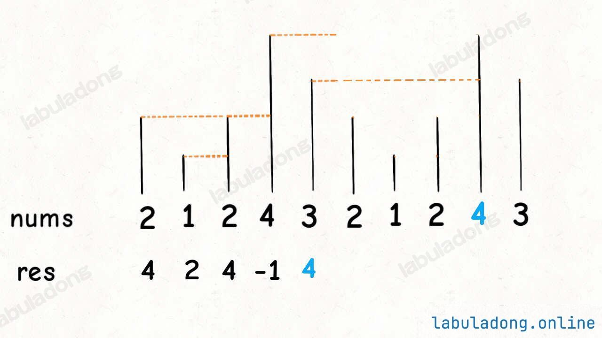

```JAVA
class Solution {
    public int[] nextGreaterElements(int[] nums) {
        int n = nums.length;
        int[] res = new int[n];
        Stack<Integer> s = new Stack<>();
        // 数组长度加倍模拟环形数组
        for (int i = 2 * n - 1; i >= 0; i--) {
            // 索引 i 要求模，其他的和模板一样
            while (!s.isEmpty() && s.peek() <= nums[i % n]) {
                s.pop();
            }
            res[i % n] = s.isEmpty() ? -1 : s.peek();
            s.push(nums[i % n]);
        }
        return res;
    }
}
```


#### 链表中的下一个更大节点

https://leetcode.cn/problems/next-greater-node-in-linked-list/

```java
class Solution {

    Stack<Integer> stack = new Stack<>();
    Deque<Integer> ans = new LinkedList<>();

    public int[] nextLargerNodes(ListNode head) {
        stack.clear();
        ans.clear();
        traverseNode(head);
        return ans.stream().mapToInt(Integer::intValue).toArray();
    }

    private void traverseNode(ListNode head) {
        if (head == null) {
            return;
        }
        traverseNode(head.next);
        while (!stack.isEmpty() && stack.peek() <= head.val) {
            stack.pop();
        }
        ans.addFirst(stack.isEmpty() ? 0 : stack.peek());
        stack.push(head.val);
    }
}
```


#### 队列中可以看到的人数

https://leetcode.cn/problems/number-of-visible-people-in-a-queue/


```java
class Solution {
    public int[] canSeePersonsCount(int[] heights) {
        int n = heights.length;
        int[] res = new int[n];
        // int[] 记录 {身高，小于等于该身高的人数} 二元组
        Stack<Integer> stk = new Stack<>();
        for (int i = n - 1; i >= 0; i--) {
            // 记录右侧比自己矮的人
            int count = 0;
            // 单调栈模板，计算下一个更大或相等元素（身高）
            while (!stk.isEmpty() && heights[i] > stk.peek()) {
                stk.pop();
                count++;
            }
            // 不仅可以看到比自己矮的人，如果后面存在更高的的人，也可以看到这个高人
            res[i] = stk.isEmpty() ? count : count + 1;
            stk.push(heights[i]);
        }
        return res;
    }
}
```


#### 商品折扣后的最终价格

https://leetcode.cn/problems/final-prices-with-a-special-discount-in-a-shop/description/

- 寻找下一个更小或者相等的元素


```java
class Solution {
    public int[] finalPrices(int[] prices) {
        Stack<Integer> stack = new Stack<>();
        for (int i = prices.length - 1; i >= 0; i--) {
            int price = prices[i];
            while (!stack.isEmpty() && stack.peek() > prices[i]) {
                stack.pop();
            }
            prices[i] = stack.isEmpty() ? prices[i] : prices[i] - stack.peek();
            stack.push(price);
        }
        return prices;
    }
}
```


#### 股票价格跨度

https://leetcode.cn/problems/online-stock-span/

```JAVA
class StockSpanner {

    Stack<int[]> stack = new Stack<>();
    int index = 0;

    public StockSpanner() {

    }

    public int next(int price) {
        while (!stack.isEmpty() && stack.peek()[0] <= price) {
            stack.pop();
        }
        int ans = 0;
        if (!stack.isEmpty()) {
            int[] peek = stack.peek();
            ans = index - peek[1];
        } else {
            ans = index + 1;
        }
        stack.push(new int[] { price, index++ });
        return ans;
    }
}
```

#### 移掉 K 位数字

https://leetcode.cn/problems/remove-k-digits/

如果想让结果尽可能小，那么清除数字分两步：

1、先删除 `num` 中的若干数字，使得 `num` 从左到右每一位都单调递增。比如 `14329` 转化成 `129`，这需要使用到 单调栈技巧。

2、`num` 中的每一位变成单调递增的之后，如果 `k` 还大于 0（还可以继续删除）的话，则删除尾部的数字，比如 `129` 删除成 `12`。

```JAVA
class Solution {
    public String removeKdigits(String num, int k) {
        Stack<Character> stk = new Stack<>();
        for (char c : num.toCharArray()) {
            // 单调栈代码模板
            while (!stk.isEmpty() && c < stk.peek() && k > 0) {
                stk.pop();
                k--;
            }
            // 防止 0 作为数字的开头
            if (stk.isEmpty() && c == '0') {
                continue;
            }
            stk.push(c);
        }

        // 此时栈中元素单调递增，若 k 还没用完的话删掉栈顶元素
        while (k > 0 && !stk.isEmpty()) {
            stk.pop();
            k--;
        }
        // 若最后没剩下数字，就是 0
        if (stk.isEmpty()) {
            return "0";
        }
        // 将栈中字符转化成字符串
        StringBuilder sb = new StringBuilder();
        while (!stk.isEmpty()) {
            sb.append(stk.pop());
        }
        // 出栈顺序和字符串顺序是反的
        return sb.reverse().toString();
    }
}
```

#### 车队

https://leetcode.cn/problems/car-fleet/

- **如果车 `x` 排在 车 `y` 后面，且 `x` 到达终点所需时间比 `y` 少，则 `x` 必然会被 `y` 卡住，形成车队**。

- 假设计算出的 `time` 数组为 `[12, 3, 7, 1, 2]`，那么观察数组的单调性变化，最后肯定会形成三个车队，他们到达终点的时间分别是 12, 7, 2。

```java
class Solution {
    public int carFleet(int target, int[] position, int[] speed) {
        int n = position.length;
        int[][] cars = new int[n][2];
        for (int i = 0; i < n; i++) {
            cars[i][0] = position[i];
            cars[i][1] = speed[i];
        }
        // 按照初始位置，从小到大排序
        Arrays.sort(cars, (int[] a, int[] b) -> {
            return Integer.compare(a[0], b[0]);
        });
        // 计算每辆车到达终点的时间
        double[] time = new double[n];
        for (int i = 0; i < n; i++) {
            int[] car = cars[i];
            time[i] = (double) (target - car[0]) / car[1];
        }

        // 使用单调栈计算车队的数量
        // Stack<Double> stk = new Stack<>();
        // for (double t : time) {
        //     while (!stk.isEmpty() && t >= stk.peek()) {
        //         stk.pop();
        //     }
        //     stk.push(t);
        // }
        // return stk.size();

        // 避免使用栈模拟，倒序遍历取递增序列就是答案
        int res = 0;
        double maxTime = 0;
        for (int i = n - 1; i >= 0; i--) {
            if (time[i] > maxTime) {
                maxTime = time[i];
                res++;
            }
        }
        return res;
    }
}
```

#### 最短无序连续子数组

https://leetcode.cn/problems/shortest-unsorted-continuous-subarray/


单调递增栈会筛选出递增的元素序列，换句话说，每加入一个新元素 `x`，就会弹出栈顶大于 `x` 的其他元素，直到栈顶元素小于 `x` 为止。

反过来，单调递减栈会筛选出递减的元素序列，换句话说，每加入一个新元素 `x`，就会弹出栈顶小于 `x` 的其他元素，直到栈顶元素大于 `x` 为止。

综上，如果正序遍历 `nums`，维护一个递增栈，那么弹出的元素就是乱序的元素；如果反向遍历 `nums`，维护一个递减栈，那么弹出的元素就是乱序的元素。

```java
// 排序解法
class Solution {
    public int findUnsortedSubarray(int[] nums) {
        int[] temp = Arrays.copyOf(nums, nums.length);
        Arrays.sort(temp);
        int left = Integer.MAX_VALUE, right = Integer.MIN_VALUE;
        for (int i = 0; i < nums.length; i++) {
            if (temp[i] != nums[i]) {
                left = i;
                break;
            }
        }
        for (int i = nums.length - 1; i >= 0; i--) {
            if (temp[i] != nums[i]) {
                right = i;
                break;
            }
        }
        if (left == Integer.MAX_VALUE && right == Integer.MIN_VALUE) {
            // nums 本来就是有序的
            return 0;
        }
        return right - left + 1;
    }
}

// 单调栈解法
class Solution2 {
    public int findUnsortedSubarray(int[] nums) {
        int n = nums.length;
        int left = Integer.MAX_VALUE, right = Integer.MIN_VALUE;
        // 递增栈，存储元素索引
        Stack<Integer> incrStk = new Stack<>();
        for (int i = 0; i < n; i++) {
            while (!incrStk.isEmpty() && nums[incrStk.peek()] > nums[i]) {
                // 弹出的元素都是乱序元素，其中最小的索引就是乱序子数组的左边界
                left = Math.min(left, incrStk.pop());
            }
            incrStk.push(i);
        }
        // 递减栈，存储元素索引
        Stack<Integer> decrStk = new Stack<>();
        for (int i = n - 1; i >= 0; i--) {
            while (!decrStk.isEmpty() && nums[decrStk.peek()] < nums[i]) {
                // 弹出的元素都是乱序元素，其中最大的索引就是乱序子数组的右边界
                right = Math.max(right, decrStk.pop());
            }
            decrStk.push(i);
        }
        if (left == Integer.MAX_VALUE && right == Integer.MIN_VALUE) {
            // 说明单调栈没有弹出任何元素，即 nums 本来就是有序的
            return 0;
        }
        return right - left + 1;
    }
}
```


### 单调队列

#### 滑动窗口最大值

单调栈/队列是一种寻找最大/小值的方法

```java
// 单调队列的实现
class MonotonicQueue {
    LinkedList<Integer> maxq = new LinkedList<>();
    public void push(int n) {
        // 将小于 n 的元素全部删除
        while (!maxq.isEmpty() && maxq.getLast() < n) {
            maxq.pollLast();
        }
        // 然后将 n 加入尾部
        maxq.addLast(n);
    }
    
    public int max() {
        return maxq.getFirst();
    }
    
    public void pop(int n) {
        if (n == maxq.getFirst()) {
            maxq.pollFirst();
        }
    }
}

class Solution {
    int[] maxSlidingWindow(int[] nums, int k) {
        MonotonicQueue window = new MonotonicQueue();
        List<Integer> res = new ArrayList<>();
        
        for (int i = 0; i < nums.length; i++) {
            if (i < k - 1) {
                // 先填满窗口的前 k - 1
                window.push(nums[i]);
            } else {
                // 窗口向前滑动，加入新数字
                window.push(nums[i]);
                // 记录当前窗口的最大值
                res.add(window.max());
                // 移出旧数字
                window.pop(nums[i - k + 1]);
            }
        }
        // 需要转成 int[] 数组再返回
        int[] arr = new int[res.size()];
        for (int i = 0; i < res.size(); i++) {
            arr[i] = res.get(i);
        }
        return arr;
    }
}
```

#### 绝对差不超过限制的最长连续子数组

https://leetcode.cn/problems/longest-continuous-subarray-with-absolute-diff-less-than-or-equal-to-limit/


```java
class Solution {
    public int longestSubarray(int[] nums, int limit) {
        int left = 0, right = 0;
        int windowSize = 0, res = 0;
        MonotonicQueue<Integer> window = new MonotonicQueue<>();
        // 滑动窗口模板
        while (right < nums.length) {
            // 扩大窗口，更新窗口最值
            window.push(nums[right]);
            right++;
            windowSize++;
            while (window.max() - window.min() > limit) {
                // 缩小窗口，更新窗口最值
                window.pop();
                left++;
                windowSize--;
            }
            // 在窗口收缩判断完之后才更新答案
            res = Math.max(res, windowSize);
        }
        return res;
    }
}


// 下面给出的是单调队列的通用实现，运行速度可能较慢，你可以自行简化提升速度
// 单调队列的详细解析见
// https://labuladong.online/algo/problem-set/monotonic-queue/
class MonotonicQueue<E extends Comparable<E>> {
    // 常规队列，存储所有元素
    LinkedList<E> q = new LinkedList<>();
    // 元素降序排列的单调队列，头部是最大值
    LinkedList<E> maxq = new LinkedList<>();
    // 元素升序排列的单调队列，头部是最小值
    LinkedList<E> minq = new LinkedList<>();

    public void push(E elem) {
        // 维护常规队列，直接在队尾插入元素
        q.addLast(elem);

        // 维护 maxq，将小于 elem 的元素全部删除
        while (!maxq.isEmpty() && maxq.getLast().compareTo(elem) < 0) {
            maxq.pollLast();
        }
        maxq.addLast(elem);

        // 维护 minq，将大于 elem 的元素全部删除
        while (!minq.isEmpty() && minq.getLast().compareTo(elem) > 0) {
            minq.pollLast();
        }
        minq.addLast(elem);
    }

    public E max() {
        // maxq 的头部是最大元素
        return maxq.getFirst();
    }

    public E min() {
        // minq 的头部是最大元素
        return minq.getFirst();
    }

    public E pop() {
        // 从标准队列头部弹出需要删除的元素
        E deleteVal = q.pollFirst();
        assert deleteVal != null;

        // 由于 push 的时候会删除元素，deleteVal 可能已经被删掉了
        if (deleteVal.equals(maxq.getFirst())) {
            maxq.pollFirst();
        }
        if (deleteVal.equals(minq.getFirst())) {
            minq.pollFirst();
        }
        return deleteVal;
    }

    public int size() {
        // 标准队列的大小即是当前队列的大小
        return q.size();
    }

    public boolean isEmpty() {
        return q.isEmpty();
    }
}
```


#### 和至少为 K 的最短子数组

```java
class Solution {
    public int shortestSubarray(int[] nums, int k) {
        int n = nums.length;
        // 看题目的数据范围，前缀和数组中元素可能非常大，所以用 long 类型
        long[] preSum = new long[n + 1];
        preSum[0] = 0;
        // 计算 nums 的前缀和数组
        for (int i = 1; i <= n; i++) {
            preSum[i] = preSum[i - 1] + nums[i - 1];
        }
        // 单调队列结构辅助滑动窗口算法
        MonotonicQueue<Long> window = new MonotonicQueue<>();
        int right = 0, left = 0;
        int len = Integer.MAX_VALUE;
        // 开始执行滑动窗口算法框架
        while (right < preSum.length) {
            // 扩大窗口，元素入队
            window.push(preSum[right]);
            right++;
            // 若新进入窗口的元素和窗口中的最小值之差大于等于 k，
            // 说明得到了符合条件的子数组，缩小窗口，使子数组长度尽可能小
            while (right < preSum.length && !window.isEmpty()
                    && preSum[right] - window.min() >= k) {
                // 更新答案
                len = Math.min(len, right - left);
                // 缩小窗口
                window.pop();
                left++;
            }
        }
        return len == Integer.MAX_VALUE ? -1 : len;
    }
}

// 下面给出的是单调队列的通用实现，运行速度可能较慢，你可以自行简化提升速度
// 单调队列的详细解析见
// https://labuladong.online/algo/problem-set/monotonic-queue/
class MonotonicQueue<E extends Comparable<E>> {
    // 常规队列，存储所有元素
    LinkedList<E> q = new LinkedList<>();
    // 元素降序排列的单调队列，头部是最大值
    LinkedList<E> maxq = new LinkedList<>();
    // 元素升序排列的单调队列，头部是最小值
    LinkedList<E> minq = new LinkedList<>();

    public void push(E elem) {
        // 维护常规队列，直接在队尾插入元素
        q.addLast(elem);

        // 维护 maxq，将小于 elem 的元素全部删除
        while (!maxq.isEmpty() && maxq.getLast().compareTo(elem) < 0) {
            maxq.pollLast();
        }
        maxq.addLast(elem);

        // 维护 minq，将大于 elem 的元素全部删除
        while (!minq.isEmpty() && minq.getLast().compareTo(elem) > 0) {
            minq.pollLast();
        }
        minq.addLast(elem);
    }

    public E max() {
        // maxq 的头部是最大元素
        return maxq.getFirst();
    }

    public E min() {
        // minq 的头部是最大元素
        return minq.getFirst();
    }

    public E pop() {
        // 从标准队列头部弹出需要删除的元素
        E deleteVal = q.pollFirst();
        assert deleteVal != null;

        // 由于 push 的时候会删除元素，deleteVal 可能已经被删掉了
        if (deleteVal.equals(maxq.getFirst())) {
            maxq.pollFirst();
        }
        if (deleteVal.equals(minq.getFirst())) {
            minq.pollFirst();
        }
        return deleteVal;
    }

    public int size() {
        // 标准队列的大小即是当前队列的大小
        return q.size();
    }

    public boolean isEmpty() {
        return q.isEmpty();
    }
}
```


#### 环形子数组的最大和

- 前缀和快速查找两个元素间的和
- 滑动窗口维护查找元素的范围
- 单调队列查找当前窗口中最小前缀和

```java
class Solution {
    public int maxSubarraySumCircular(int[] nums) {
        int n = nums.length;
        // 模拟环状的 nums 数组
        int[] preSum = new int[2 * n + 1];
        preSum[0] = 0;
        // 计算环状 nums 的前缀和
        for (int i = 1; i < preSum.length; i++) {
            preSum[i] = preSum[i - 1] + nums[(i - 1) % n];
        }
        // 记录答案
        int maxSum = Integer.MIN_VALUE;
        // 维护一个滑动窗口，以便根据窗口中的最小值计算最大子数组和
        MonotonicQueue<Integer> window = new MonotonicQueue<>();
        window.push(0);
        for (int i = 1; i < preSum.length; i++) {
            maxSum = Math.max(maxSum, preSum[i] - window.min());
            // 维护窗口的大小为 nums 数组的大小
            if (window.size() == n) {
                window.pop();
            }
            window.push(preSum[i]);
        }

        return maxSum;
    }
}

// 下面给出的是单调队列的通用实现，运行速度可能较慢，你可以自行简化提升速度
// 单调队列的详细解析见
// https://labuladong.online/algo/problem-set/monotonic-queue/
class MonotonicQueue<E extends Comparable<E>> {
    // 常规队列，存储所有元素
    LinkedList<E> q = new LinkedList<>();
    // 元素降序排列的单调队列，头部是最大值
    LinkedList<E> maxq = new LinkedList<>();
    // 元素升序排列的单调队列，头部是最小值
    LinkedList<E> minq = new LinkedList<>();

    public void push(E elem) {
        // 维护常规队列，直接在队尾插入元素
        q.addLast(elem);

        // 维护 maxq，将小于 elem 的元素全部删除
        while (!maxq.isEmpty() && maxq.getLast().compareTo(elem) < 0) {
            maxq.pollLast();
        }
        maxq.addLast(elem);

        // 维护 minq，将大于 elem 的元素全部删除
        while (!minq.isEmpty() && minq.getLast().compareTo(elem) > 0) {
            minq.pollLast();
        }
        minq.addLast(elem);
    }

    public E max() {
        // maxq 的头部是最大元素
        return maxq.getFirst();
    }

    public E min() {
        // minq 的头部是最大元素
        return minq.getFirst();
    }

    public E pop() {
        // 从标准队列头部弹出需要删除的元素
        E deleteVal = q.pollFirst();
        assert deleteVal != null;

        // 由于 push 的时候会删除元素，deleteVal 可能已经被删掉了
        if (deleteVal.equals(maxq.getFirst())) {
            maxq.pollFirst();
        }
        if (deleteVal.equals(minq.getFirst())) {
            minq.pollFirst();
        }
        return deleteVal;
    }

    public int size() {
        // 标准队列的大小即是当前队列的大小
        return q.size();
    }

    public boolean isEmpty() {
        return q.isEmpty();
    }
}
```


### 二叉树

#### 填充每个节点的下一个右侧节点指针

https://leetcode.cn/problems/populating-next-right-pointers-in-each-node/

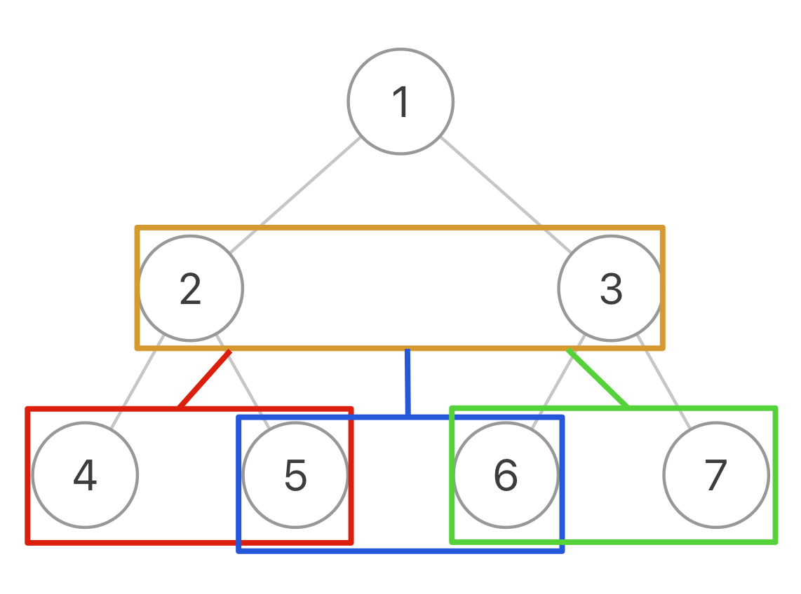

- 所以我们可以在二叉树的基础上进行抽象，你把图中的每一个方框看做一个节点：**这样，一棵二叉树被抽象成了一棵三叉树，三叉树上的每个节点就是原先二叉树的两个相邻节点**。

```java
class Solution {
    // 主函数
    public Node connect(Node root) {
        if (root == null) return null;
        // 遍历「三叉树」，连接相邻节点
        traverse(root.left, root.right);
        return root;
    }

    // 三叉树遍历框架
    void traverse(Node node1, Node node2) {
        if (node1 == null || node2 == null) {
            return;
        }
        // *** 前序位置 ***
        // 将传入的两个节点穿起来
        node1.next = node2;
        
        // 连接相同父节点的两个子节点
        traverse(node1.left, node1.right);
        traverse(node2.left, node2.right);
        // 连接跨越父节点的两个子节点
        traverse(node1.right, node2.left);
    }
}
```

#### 二叉树展开为链表

https://leetcode.cn/problems/flatten-binary-tree-to-linked-list/


- 先利用 `flatten(x.left)` 和 `flatten(x.right)` 将 `x` 的左右子树拉平。
- 将 `x` 的右子树接到左子树下方，然后将整个左子树作为右子树。

```JAVA
class Solution {
    // 定义：将以 root 为根的树拉平为链表
    public void flatten(TreeNode root) {
        // base case
        if (root == null) return;
        
        // 利用定义，把左右子树拉平
        flatten(root.left);
        flatten(root.right);

        // *** 后序遍历位置 ***
        // 1、左右子树已经被拉平成一条链表
        TreeNode left = root.left;
        TreeNode right = root.right;
        
        // 2、将左子树作为右子树
        root.left = null;
        root.right = left;

        // 3、将原先的右子树接到当前右子树的末端
        TreeNode p = root;
        while (p.right != null) {
            p = p.right;
        }
        p.right = right;
    }
}
```

#### 最大二叉树

https://leetcode.cn/problems/maximum-binary-tree/

```java

//递归分解子问题解法
class Solution {
    public TreeNode constructMaximumBinaryTree(int[] nums) {
        return buildTree(nums, 0, nums.length - 1);
    }

    public TreeNode buildTree(int[] nums, int left, int right) {
        if (left < 0 || right >= nums.length || left > right) {
            return null;
        }
        int max = Integer.MIN_VALUE, maxIndex = left;
        for (int i = left; i <= right; i++) {
            if (nums[i] > max) {
                max = nums[i];
                maxIndex = i;
            }
        }

        TreeNode leftNode = buildTree(nums, left, maxIndex - 1);
        TreeNode rightNode = buildTree(nums, maxIndex + 1, right);

        TreeNode treeNode = new TreeNode();
        treeNode.left = leftNode;
        treeNode.right = rightNode;
        treeNode.val = max;
        return treeNode;
    }
}

//单调栈解法
class Solution {
    public TreeNode constructMaximumBinaryTree(int[] nums) {
        int n = nums.length;
        Deque<Integer> stack = new ArrayDeque<Integer>();
        int[] left = new int[n];
        int[] right = new int[n];
        Arrays.fill(left, -1);
        Arrays.fill(right, -1);
        TreeNode[] tree = new TreeNode[n];
        for (int i = 0; i < n; ++i) {
            tree[i] = new TreeNode(nums[i]);
            while (!stack.isEmpty() && nums[i] > nums[stack.peek()]) {
                //精华部分
                right[stack.pop()] = i;
            }
            if (!stack.isEmpty()) {
                left[i] = stack.peek();
            }
            stack.push(i);
        }

        //组装树@todo
        TreeNode root = null;
        for (int i = 0; i < n; ++i) {
            if (left[i] == -1 && right[i] == -1) {
                root = tree[i];
            } else if (right[i] == -1 || (left[i] != -1 && nums[left[i]] < nums[right[i]])) {
                tree[left[i]].right = tree[i];
            } else {
                tree[right[i]].left = tree[i];
            }
        }
        return root;
    }
}
```

#### 从前序与中序遍历序列构造二叉树

https://leetcode.cn/problems/construct-binary-tree-from-preorder-and-inorder-traversal/

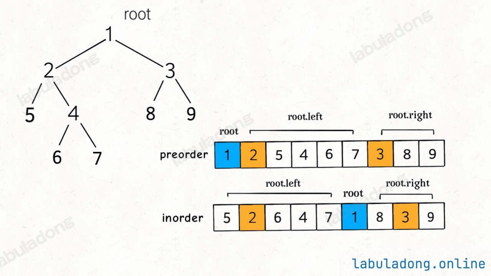

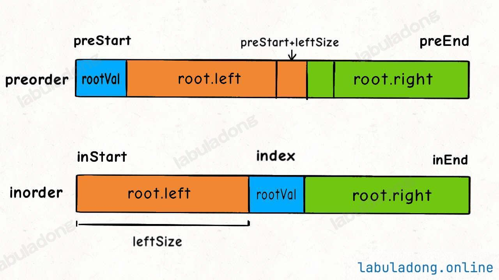


```java
class Solution {
    // 存储 inorder 中值到索引的映射
    HashMap<Integer, Integer> valToIndex = new HashMap<>();

    public TreeNode buildTree(int[] preorder, int[] inorder) {
        for (int i = 0; i < inorder.length; i++) {
            valToIndex.put(inorder[i], i);
        }
        return build(preorder, 0, preorder.length - 1,
                    inorder, 0, inorder.length - 1);
    }

    // build 函数的定义：
    // 若前序遍历数组为 preorder[preStart..preEnd]，
    // 中序遍历数组为 inorder[inStart..inEnd]，
    // 构造二叉树，返回该二叉树的根节点
    TreeNode build(int[] preorder, int preStart, int preEnd, 
               int[] inorder, int inStart, int inEnd) {

        if (preStart > preEnd) {
            return null;
        }

        // root 节点对应的值就是前序遍历数组的第一个元素
        int rootVal = preorder[preStart];
        // rootVal 在中序遍历数组中的索引
        int index = valToIndex.get(rootVal);

        int leftSize = index - inStart;

        // 先构造出当前根节点
        TreeNode root = new TreeNode(rootVal);
        // 递归构造左右子树
        root.left = build(preorder, preStart + 1, preStart + leftSize,
                        inorder, inStart, index - 1);

        root.right = build(preorder, preStart + leftSize + 1, preEnd,
                        inorder, index + 1, inEnd);
        return root;
    }
}
```


#### 从中序与后序遍历序列构造二叉树


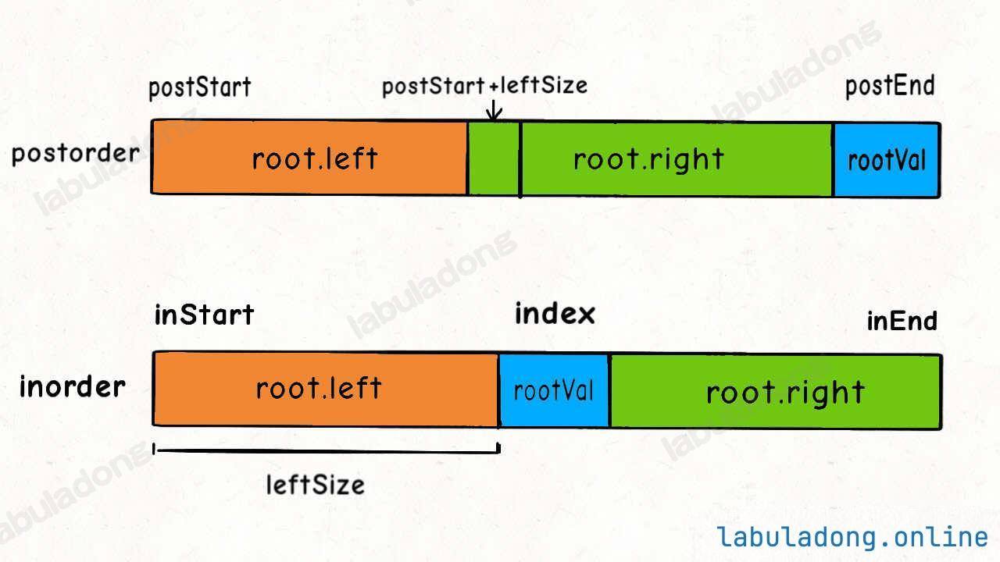


```java
class Solution {
    // 存储 inorder 中值到索引的映射
    HashMap<Integer, Integer> valToIndex = new HashMap<>();

    public TreeNode buildTree(int[] inorder, int[] postorder) {
        for (int i = 0; i < inorder.length; i++) {
            valToIndex.put(inorder[i], i);
        }
        return build(inorder, 0, inorder.length - 1,
                    postorder, 0, postorder.length - 1);
    }

    // 定义：中序遍历数组为 inorder[inStart..inEnd]，
    // 后序遍历数组为 postorder[postStart..postEnd]，
    // build 函数构造这个二叉树并返回该二叉树的根节点
    TreeNode build(int[] inorder, int inStart, int inEnd,
                int[] postorder, int postStart, int postEnd) {

        if (inStart > inEnd) {
            return null;
        }
        // root 节点对应的值就是后序遍历数组的最后一个元素
        int rootVal = postorder[postEnd];
        // rootVal 在中序遍历数组中的索引
        int index = valToIndex.get(rootVal);
        // 左子树的节点个数
        int leftSize = index - inStart;
        TreeNode root = new TreeNode(rootVal);
        // 递归构造左右子树
        root.left = build(inorder, inStart, index - 1,
                         postorder, postStart, postStart + leftSize - 1);
        
        root.right = build(inorder, index + 1, inEnd,
                          postorder, postStart + leftSize, postEnd - 1);
        return root;
    }
}
```

#### 根据前序和后序遍历构造二叉树

有多种可能的还原结果，你可以返回任意一种

**1、首先把前序遍历结果的第一个元素或者后序遍历结果的最后一个元素确定为根节点的值**。

**2、然后把前序遍历结果的第二个元素作为左子树的根节点的值**。

**3、在后序遍历结果中寻找左子树根节点的值，从而确定了左子树的索引边界，进而确定右子树的索引边界，递归构造左右子树即可**。

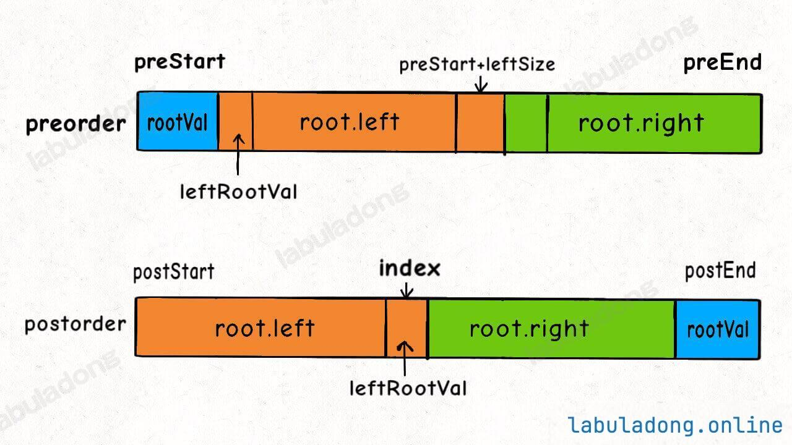

```java
class Solution {
    // 存储 postorder 中值到索引的映射
    HashMap<Integer, Integer> valToIndex = new HashMap<>();

    public TreeNode constructFromPrePost(int[] preorder, int[] postorder) {
        for (int i = 0; i < postorder.length; i++) {
            valToIndex.put(postorder[i], i);
        }
        return build(preorder, 0, preorder.length - 1,
                    postorder, 0, postorder.length - 1);
    }

    // 定义：根据 preorder[preStart..preEnd] 和 postorder[postStart..postEnd]
    // 构建二叉树，并返回根节点。
    TreeNode build(int[] preorder, int preStart, int preEnd,
                   int[] postorder, int postStart, int postEnd) {
        if (preStart > preEnd) {
            return null;
        }
        if (preStart == preEnd) {
            return new TreeNode(preorder[preStart]);
        }

        // root 节点对应的值就是前序遍历数组的第一个元素
        int rootVal = preorder[preStart];
        // root.left 的值是前序遍历第二个元素
        // 通过前序和后序遍历构造二叉树的关键在于通过左子树的根节点
        // 确定 preorder 和 postorder 中左右子树的元素区间
        int leftRootVal = preorder[preStart + 1];
        // leftRootVal 在后序遍历数组中的索引
        int index = valToIndex.get(leftRootVal);
        // 左子树的元素个数
        int leftSize = index - postStart + 1;

        // 先构造出当前根节点
        TreeNode root = new TreeNode(rootVal);
        // 递归构造左右子树
        // 根据左子树的根节点索引和元素个数推导左右子树的索引边界
        root.left = build(preorder, preStart + 1, preStart + leftSize,
                postorder, postStart, index);
        root.right = build(preorder, preStart + leftSize + 1, preEnd,
                postorder, index + 1, postEnd - 1);

        return root;
    }
}
```


#### 寻找重复的子树

https://leetcode.cn/problems/find-duplicate-subtrees/description/


**1、以我为根的这棵二叉树（子树）长啥样**？

二叉树的前序/中序/后序/层序遍历结果可以描述二叉树的结构，可以通过拼接字符串的方式把二叉树序列化

**2、以其他节点为根的子树都长啥样**？

借助一个外部数据结构，让每个节点把自己子树的序列化结果存进去

```java
class Solution {
    // 记录所有子树以及出现的次数
    HashMap<String, Integer> subTrees = new HashMap<>();
    // 记录重复的子树根节点
    LinkedList<TreeNode> res = new LinkedList<>();

    // 主函数
    public List<TreeNode> findDuplicateSubtrees(TreeNode root) {
        serialize(root);
        return res;
    }

    // 辅助函数
    String serialize(TreeNode root) {
        if (root == null) {
            return "#";
        }

        // 先算左右子树的序列化结果
        String left = serialize(root.left);
        String right = serialize(root.right);

        String myself = left + "," + right+ "," + root.val;
        
        int freq = subTrees.getOrDefault(myself, 0);
        // 多次重复也只会被加入结果集一次
        if (freq == 1) {
            res.add(root);
        }
        // 给子树对应的出现次数加一
        subTrees.put(myself, freq + 1);
        return myself;
    }
}
```


#### 二叉树的序列化与反序列化

**当二叉树中节点的值不存在重复时**：

1. 如果你的序列化结果中**不包含空指针的信息**，且你只给出**一种**遍历顺序，那么你无法还原出唯一的一棵二叉树。

2. 如果你的序列化结果中**不包含空指针的信息**，且你会给出**两种**遍历顺序，分两种情况：

   2.1. 如果你给出的是前序和中序，或者后序和中序，那么你可以还原出唯一的一棵二叉树。

   2.2. 如果你给出前序和后序，那么你无法还原出唯一的一棵二叉树。

3. 如果你的序列化结果中**包含空指针的信息**，且你只给出**一种**遍历顺序，也要分两种情况：

   3.1. 如果你给出的是前序或者后序，那么你可以还原出唯一的一棵二叉树。

   3.2. 如果你给出的是中序，那么你无法还原出唯一的一棵二叉树。


**前序遍历解法**


```JAVA
class Codec {
    String SEP = ",";
    String NULL = "#";

    // 主函数，将字符串反序列化为二叉树结构
    public TreeNode deserialize(String data) {
        // 将字符串转化成列表
        LinkedList<String> nodes = new LinkedList<>();
        for (String s : data.split(SEP)) {
            nodes.addLast(s);
        }
        return _deserialize(nodes);
    }

    // 辅助函数，通过 nodes 列表构造二叉树
    TreeNode _deserialize(LinkedList<String> nodes) {
        if (nodes.isEmpty()) return null;

        // ****** 前序位置 ********
        // 列表最左侧就是根节点
        String first = nodes.removeFirst();
        if (first.equals(NULL)) return null;
        TreeNode root = new TreeNode(Integer.parseInt(first));
        // *********************

        root.left = _deserialize(nodes);
        root.right = _deserialize(nodes);

        return root;
    }
}
```

**后序遍历解法**


```java
class Codec {
    String SEP = ",";
    String NULL = "#";

    // 主函数，将二叉树序列化为字符串
    public String serialize(TreeNode root) {
        StringBuilder sb = new StringBuilder();
        _serialize(root, sb);
        return sb.toString();
    }

    void _serialize(TreeNode root, StringBuilder sb) {
        if (root == null) {
            sb.append(NULL).append(SEP);
            return;
        }
        
        _serialize(root.left, sb);
        _serialize(root.right, sb);

        // ****** 后序位置 ********
        sb.append(root.val).append(SEP);
        // ***********************
    }

    // 主函数，将字符串反序列化为二叉树结构
    public TreeNode deserialize(String data) {
        LinkedList<String> nodes = new LinkedList<>();
        for (String s : data.split(SEP)) {
            nodes.addLast(s);
        }
        return _deserialize(nodes);
    }

    // 辅助函数，通过 nodes 列表构造二叉树
    TreeNode _deserialize(LinkedList<String> nodes) {
        if (nodes.isEmpty()) return null;
        // 从后往前取出元素
        String last = nodes.removeLast();
        if (last.equals(NULL)) return null;
        TreeNode root = new TreeNode(Integer.parseInt(last));
        // 先构造右子树，后构造左子树
        root.right = _deserialize(nodes);
        root.left = _deserialize(nodes);
        
        return root;
    }
}
```


**层序遍历解法**

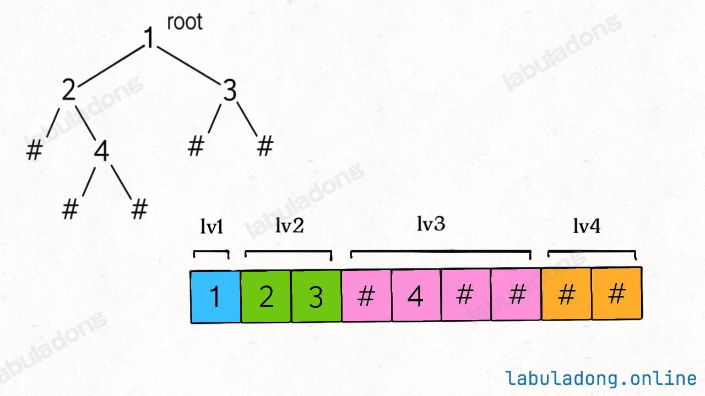

```java
class Codec {
    String SEP = ",";
    String NULL = "#";

    // 将字符串反序列化为二叉树结构
    public TreeNode deserialize(String data) {
        if (data.isEmpty()) return null;
        String[] nodes = data.split(SEP);
        // 第一个元素就是 root 的值
        TreeNode root = new TreeNode(Integer.parseInt(nodes[0]));
        // 队列 q 记录父节点，将 root 加入队列
        Queue<TreeNode> q = new LinkedList<>();
        q.offer(root);

        // index 变量记录正在序列化的节点在数组中的位置
        int index = 1;
        while (!q.isEmpty()) {
            int sz = q.size();
            for (int i = 0; i < sz; i++) {
                TreeNode parent = q.poll();
                // 为父节点构造左侧子节点
                String left = nodes[index++];
                if (!left.equals(NULL)) {
                    parent.left = new TreeNode(Integer.parseInt(left));
                    q.offer(parent.left);
                }
                // 为父节点构造右侧子节点
                String right = nodes[index++];
                if (!right.equals(NULL)) {
                    parent.right = new TreeNode(Integer.parseInt(right));
                    q.offer(parent.right);
                }
            }
        }
        return root;
    }
}
```


#### 遍历思想

##### 二叉树的所有路径

https://leetcode.cn/problems/binary-tree-paths/description/

```java
class Solution {
    public List<String> binaryTreePaths(TreeNode root) {
        // 遍历一遍二叉树就能出结果了
        traverse(root);
        return res;
    }

    // 记录 traverse 函数递归时的路径
    LinkedList<String> path = new LinkedList<>();
    // 记录所有从根节点到叶子节点的路径
    LinkedList<String> res = new LinkedList<>();

    void traverse(TreeNode root) {
        if (root == null) {
            return;
        }
        // root 是叶子节点
        if (root.left == null && root.right == null) {
            path.addLast(root.val + "");
            // 将这条路径装入 res
            res.addLast(String.join("->", path));
            path.removeLast();
            return;
        }
        // 前序遍历位置
        path.addLast(root.val + "");
        // 递归遍历左右子树
        traverse(root.left);
        traverse(root.right);
        // 后序遍历位置
        path.removeLast();
    }
}
```

##### 求根节点到叶节点数字之和

https://leetcode.cn/problems/sum-root-to-leaf-numbers/

```java
class Solution {
    StringBuilder path = new StringBuilder();
    int res = 0;

    public int sumNumbers(TreeNode root) {
        // 遍历一遍二叉树就能出结果
        traverse(root);
        return res;
    }

    // 二叉树遍历函数
    void traverse(TreeNode root) {
        if (root == null) {
            return;
        }
        // 前序遍历位置，记录节点值
        path.append(root.val);
        if (root.left == null && root.right == null) {
            // 到达叶子节点，累加路径和
            res += Integer.parseInt(path.toString());
        }
        // 二叉树递归框架，遍历左右子树
        traverse(root.left);
        traverse(root.right);

        // 后续遍历位置，撤销节点值
        path.deleteCharAt(path.length() - 1);

    }
}
```


##### 二叉树的右视图

https://leetcode.cn/problems/binary-tree-right-side-view/

```java
class Solution {
    List<Integer> res = new LinkedList<>();
    public List<Integer> rightSideView(TreeNode root) {
        traverse(root, 0);
        return res;
    }
    private void traverse(TreeNode root, int level) {
        if (root == null) {
            return;
        }
        if (res.size() == level) {
            res.add(root.val);
        }
        traverse(root.right, level + 1);
        traverse(root.left, level + 1);
    }
}
```

##### 从叶结点开始的最小字符串

https://leetcode.cn/problems/smallest-string-starting-from-leaf/


```java
class Solution {
    public String smallestFromLeaf(TreeNode root) {
        traverse(root);
        return res;
    }
    // 遍历过程中的路径
    StringBuilder path = new StringBuilder();
    String res = null;

    // 二叉树遍历函数
    void traverse(TreeNode root) {
        if (root == null) {
            return;
        }
        if (root.left == null && root.right == null) {
            // 找到叶子结点，比较字典序最小的路径
            // 结果字符串是从叶子向根，所以需要反转
            path.append((char) ('a' + root.val));
            path.reverse();

            String s = path.toString();
            if (res == null || res.compareTo(s) > 0) {
                // 如果字典序更小，则更新 res
                res = s;
            }

            // 恢复，正确维护 path 中的元素
            path.reverse();
            path.deleteCharAt(path.length() - 1);
            return;
        }
        // 前序位置
        path.append((char) ('a' + root.val));

        traverse(root.left);
        traverse(root.right);

        // 后序位置
        path.deleteCharAt(path.length() - 1);
    }
}
```

##### 从根到叶的二进制数之和

https://leetcode.cn/problems/sum-of-root-to-leaf-binary-numbers/

```java
class Solution {
    public int sumRootToLeaf(TreeNode root) {
        traverse(root);
        return res;
    }

    int path = 0;
    int res = 0;

    void traverse(TreeNode root) {
        if (root == null) {
            return;
        }
        if (root.left == null && root.right == null) {
            // 叶子节点
            res += path << 1 | root.val;
            return;
        }
        // 前序位置
        path = path << 1 | root.val;
        traverse(root.left);
        traverse(root.right);
        // 后序位置
        path = path >> 1;
    }
}
```

##### 二叉树中的伪回文路径

https://leetcode.cn/problems/pseudo-palindromic-paths-in-a-binary-tree/

遍历一遍二叉树就能得到每条路径上的数字，但这题的考点在于，如何判断一组数字是否存在一个回文串组合？

稍加思考不难想到：**如果一组数字中，只有最多一个数字出现的次数为奇数，剩余数字的出现次数均为偶数，那么这组数字可以组成一个回文串**。

题目说了 `1 <= root.val <= 9`，所以我们可以用一个大小为 10 的 `count` 数组做计数器来记录每条路径上的元素出现次数，到达叶子节点之后根据元素出现的次数判断是否可以构成回文串。

当然，我们也可以用更巧妙的位运算来实现上述逻辑：

- 首先用到异或运算的特性，1 ^ 1 = 0, 0 ^ 0 = 0, 1 ^ 0 = 1。
- 其次用到 `n & (n - 1)` 去除二进制最后一个 1 的技巧

```java
class Solution {
    public int pseudoPalindromicPaths(TreeNode root) {
        traverse(root);
        return res;
    }
    // 计数数组，题目说了 1 <= root.val <= 9
    int[] count = new int[10];
    int res = 0;

    // 二叉树遍历函数
    void traverse(TreeNode root) {
        if (root == null) {
            return;
        }
        if (root.left == null && root.right == null) {
            // 遇到叶子节点，判断路径是否是伪回文串
            count[root.val]++;
            // 如果路径上出现奇数次的数字个数大于 1，
            // 则不可能组成回文串，反之则可以组成回文串
            int odd = 0;
            for (int n : count) {
                if (n % 2 == 1) {
                    odd++;
                }
            }
            if (odd <= 1) {
                res++;
            }
            count[root.val]--;
            return;
        }

        count[root.val]++;
        // 二叉树遍历框架
        traverse(root.left);
        traverse(root.right);

        count[root.val]--;
    }
}

// 用位运算代替数组计数，进一步提升效率
class Solution2 {
    public int pseudoPalindromicPaths(TreeNode root) {
        traverse(root);
        return res;
    }

    // 用位运算记录路径上的元素
    int count = 0;
    int res = 0;

    // 二叉树遍历函数
    void traverse(TreeNode root) {
        if (root == null) {
            return;
        }
        if (root.left == null && root.right == null) {
            // 遇到叶子节点，判断路径是否是伪回文串
            count = count ^ (1 << root.val);
            // 判断二进制中只有一位 1，原理见 https://labuladong.online/algo/frequency-interview/bitwise-operation/
            if ((count & (count - 1)) == 0) {
                res++;
            }
            count = count ^ (1 << root.val);
            return;
        }
        count = count ^ (1 << root.val);
        // 二叉树遍历框架
        traverse(root.left);
        traverse(root.right);

        count = count ^ (1 << root.val);
    }
}
```

##### 左叶子之和

https://leetcode.cn/problems/sum-of-left-leaves/

```java
class Solution {

    public int sumOfLeftLeaves(TreeNode root) {
        traverse(root);
        return sum;
    }

    // 记录左叶子之和
    int sum = 0;
    // 二叉树遍历函数
    void traverse(TreeNode root) {
        if (root == null) {
            return;
        }

        if (root.left != null &&
            root.left.left == null && root.left.right == null) {
            // 找到左侧的叶子节点，记录累加值
            sum += root.left.val;
        }

        // 递归框架
        traverse(root.left);
        traverse(root.right);
    }
}
```

##### 在二叉树中增加一行

https://leetcode.cn/problems/add-one-row-to-tree/

```java
class Solution {
    private int targetVal, targetDepth;

    public TreeNode addOneRow(TreeNode root, int val, int depth) {
        targetVal = val;
        targetDepth = depth;
        // 插入到第一行的话特殊对待一下
        if (targetDepth == 1) {
            TreeNode newRoot = new TreeNode(targetVal);
            newRoot.left = root;
            return newRoot;
        }
        // 遍历二叉树，走到对应行进行插入
        traverse(root);

        return root;
    }

    private int curDepth = 0;

    void traverse(TreeNode root) {
        if (root == null) {
            return;
        }
        // 前序遍历
        curDepth++;
        if (curDepth == targetDepth - 1) {
            // 进行插入
            TreeNode newLeft = new TreeNode(targetVal);
            TreeNode newRight = new TreeNode(targetVal);
            newLeft.left = root.left;
            newRight.right = root.right;
            root.left = newLeft;
            root.right = newRight;
        }

        traverse(root.left);
        traverse(root.right);

        // 后序遍历
        curDepth--;
    }
}
```

##### 翻转二叉树以匹配先序遍历

https://leetcode.cn/problems/flip-binary-tree-to-match-preorder-traversal/

用 `traverse` 函数遍历整棵二叉树，对比前序遍历结果，如果节点的值对不上，就无解；如果子树对不上 `voyage`，就尝试翻转子树。

```java
class Solution {
    public List<Integer> flipMatchVoyage(TreeNode root, int[] voyage) {
        this.voyage = voyage;
        // 遍历的过程中尝试进行反转
        traverse(root);

        if (canFlip) {
            return res;
        }
        return Arrays.asList(-1);
    }


    List<Integer> res = new LinkedList<>();
    int i = 0;
    int[] voyage;
    boolean canFlip = true;

    void traverse(TreeNode root) {
        if (root == null || !canFlip) {
            return;
        }
        if (root.val != voyage[i++]) {
            // 节点的 val 对不上，必然无解
            canFlip = false;
            return;
        }
        if (root.left != null && root.left.val != voyage[i]) {
            // 前序遍历结果不对，尝试翻转左右子树
            TreeNode temp = root.left;
            root.left = root.right;
            root.right = temp;
            // 记录翻转节点
            res.add(root.val);
        }

        traverse(root.left);
        traverse(root.right);
    }
}
```


##### 二叉树的垂序遍历

把这些坐标收集起来，依据题目要求进行排序，组装成题目要求的返回数据格式即可。

https://leetcode.cn/problems/vertical-order-traversal-of-a-binary-tree/

```java
class Solution {
    // 记录每个节点和对应的坐标 (row, col)
    class Triple {
        public int row, col;
        public TreeNode node;

        public Triple(TreeNode node, int row, int col) {
            this.node = node;
            this.row = row;
            this.col = col;
        }
    }

    public List<List<Integer>> verticalTraversal(TreeNode root) {
        // 遍历二叉树，并且为所有节点生成对应的坐标
        traverse(root, 0, 0);
        // 根据题意，根据坐标值对所有节点进行排序：
        // 按照 col 从小到大排序，col 相同的话按 row 从小到大排序，
        // 如果 col 和 row 都相同，按照 node.val 从小到大排序。
        Collections.sort(nodes, (Triple a, Triple b) -> {
            if (a.col == b.col && a.row == b.row) {
                return a.node.val - b.node.val;
            }
            if (a.col == b.col) {
                return a.row - b.row;
            }
            return a.col - b.col;
        });
        // 将排好序的节点组装成题目要求的返回格式
        LinkedList<List<Integer>> res = new LinkedList<>();
        // 记录上一列编号，初始化一个特殊值
        int preCol = Integer.MIN_VALUE;
        for (int i = 0; i < nodes.size(); i++) {
            Triple cur = nodes.get(i);
            if (cur.col != preCol) {
                // 开始记录新的一列
                res.addLast(new LinkedList<>());
                preCol = cur.col;
            }
            res.getLast().add(cur.node.val);
        }

        return res;
    }

    ArrayList<Triple> nodes = new ArrayList<>();
    // 二叉树遍历函数，记录所有节点对应的坐标
    void traverse(TreeNode root, int row, int col) {
        if (root == null) {
            return;
        }
        // 记录坐标
        nodes.add(new Triple(root, row, col));
        // 二叉树遍历框架
        traverse(root.left, row + 1, col - 1);
        traverse(root.right, row + 1, col + 1);
    }
}
```


##### 二叉树的堂兄弟节点

https://leetcode.cn/problems/cousins-in-binary-tree/


```java
class Solution {
    TreeNode parentX = null;
    TreeNode parentY = null;
    int depthX = 0, depthY = 0;
    int x, y;

    public boolean isCousins(TreeNode root, int x, int y) {
        this.x = x;
        this.y = y;
        traverse(root, 0, null);
        if (depthX == depthY && parentX != parentY) {
            // 判断 x，y 是否是表兄弟节点
            return true;
        }
        return false;
    }

    public void traverse(TreeNode root, int depth, TreeNode parent) {
        if (root == null) {
            return;
        }
        if (root.val == x) {
            // 找到 x，记录它的深度和父节点
            parentX = parent;
            depthX = depth;
        }
        if (root.val == y) {
            // 找到 y，记录它的深度和父节点
            parentY = parent;
            depthY = depth;
        }
        traverse(root.left, depth + 1, root);
        traverse(root.right, depth + 1, root);
    }
}
```

##### 祖父节点值为偶数的节点和

https://leetcode.cn/problems/sum-of-nodes-with-even-valued-grandparent/

```java
class Solution {
    int sum = 0;

    public int sumEvenGrandparent(TreeNode root) {
        traverse(root, null, null);
        return sum;
    }

    private void traverse(TreeNode root, TreeNode father, TreeNode grandfather) {
        if (root == null) {
            return;
        }
        if (grandfather != null && grandfather.val % 2 == 0) {
            sum += root.val;
        }
        traverse(root.left, root, father);
        traverse(root.right, root, father);
    }
}
```

##### 统计二叉树中好节点的数目

https://leetcode.cn/problems/count-good-nodes-in-binary-tree/

```java
class Solution {
    public int goodNodes(TreeNode root) {
        traverse(root, root.val);
        return count;
    }

    int count = 0;

    // 二叉树遍历函数，pathMax 参数记录从根节点到当前节点路径中的最大值
    void traverse(TreeNode root, int pathMax) {
        if (root == null) {
            return;
        }
        if (pathMax <= root.val) {
            // 找到一个「好节点」
            count++;
        }
        // 更新路径上的最大值
        pathMax = Math.max(pathMax, root.val);

        traverse(root.left, pathMax);
        traverse(root.right, pathMax);
    }
}
```


##### 路径总和 III

https://leetcode.cn/problems/path-sum-iii/

要计算路径上的和为目标和，快速计算任意范围和首先要想到前缀和，将父子节点抽象成一个数组，构造前缀和。

要计算目标和路径的数量，某路径的和 = 某路径的末节点前缀和 - 某路径初始节点的前一个节点的前缀和

在遍历二叉树时，要判断当前路径中是否存在目标和的路径，就可以使用map将历史路径的前缀和与对应的路径数量存储起来，用 当前节点前缀和 - 目标和 = 某路径的和

此时某路径和的数量 就是 目标和的路径数量

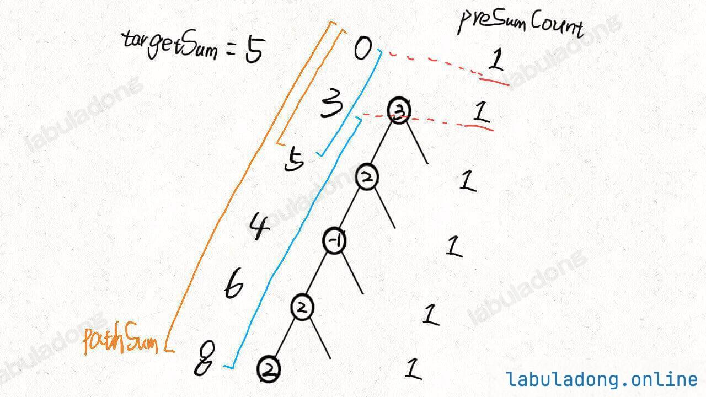


```java
class Solution {
    // 记录前缀和
    // 定义：从二叉树的根节点开始，路径和为 pathSum 的路径有 preSumCount.get(pathSum) 个
    HashMap<Long, Integer> preSumCount = new HashMap<>();

    long pathSum, targetSum;
    int res = 0;

    public int pathSum(TreeNode root, int targetSum) {
        if (root == null) {
            return 0;
        }
        this.pathSum = 0;
        this.targetSum = targetSum;
        this.preSumCount.put(0L, 1);
        traverse(root);
        return res;
    }

    void traverse(TreeNode root) {
        if (root == null) {
            return;
        }
        // 前序遍历位置
        pathSum += root.val;
        // 从二叉树的根节点开始，路径和为 pathSum - targetSum 的路径条数
        // 就是路径和为 targetSum 的路径条数
        res += preSumCount.getOrDefault(pathSum - targetSum, 0);
        // 记录从二叉树的根节点开始，路径和为 pathSum 的路径条数
        preSumCount.put(pathSum, preSumCount.getOrDefault(pathSum, 0) + 1);

        traverse(root.left);
        traverse(root.right);

        // 后序遍历位置
        preSumCount.put(pathSum, preSumCount.get(pathSum) - 1);
        pathSum -= root.val;
    }
}
```

##### 找树左下角的值

二叉树递归框架代码是先递归左子树，后递归右子树，所以**到最大深度时第一次遇到的节点就是左下角的节点**。

https://leetcode.cn/problems/find-bottom-left-tree-value/

```java
class Solution {
    // 记录二叉树的最大深度
    int maxDepth = 0;
    // 记录 traverse 递归遍历到的深度
    int depth = 0;
    TreeNode res = null;

    public int findBottomLeftValue(TreeNode root) {
        traverse(root);
        return res.val;
    }

    void traverse(TreeNode root) {
        if (root == null) {
            return;
        }
        // 前序遍历位置
        depth++;
        if (depth > maxDepth) {
            // 到最大深度时第一次遇到的节点就是左下角的节点
            maxDepth = depth;
            res = root;
        }
        traverse(root.left);
        traverse(root.right);
        // 后序遍历位置
        depth--;
    }
}
```

##### 在受污染的二叉树中查找元素

https://leetcode.cn/problems/find-elements-in-a-contaminated-binary-tree/

```java
class FindElements {
    // 帮助 find 函数快速判断
    HashSet<Integer> values = new HashSet<>();

    public FindElements(TreeNode root) {
        // 还原二叉树中的值
        traverse(root, 0);

    }

    // 二叉树遍历函数
    void traverse(TreeNode root, int val) {
        if (root == null) {
            return;
        }
        root.val = val;
        values.add(val);

        traverse(root.left, 2 * val + 1);
        traverse(root.right, 2 * val + 2);
    }

    public boolean find(int target) {
        return values.contains(target);
    }
}

//利用目标值和二叉树的规律推算是否存在
//https://leetcode.cn/problems/find-elements-in-a-contaminated-binary-tree/solutions/2681672/liang-chong-fang-fa-ha-xi-biao-wei-yun-s-6m7w/
class FindElements {
    private TreeNode root;

    public FindElements(TreeNode root) {
        this.root = root;
    }

    public boolean find(int target) {
        target++;
        TreeNode cur = root; // 从根节点出发
        for (int i = 30 - Integer.numberOfLeadingZeros(target); i >= 0; i--) { // 从次高位开始枚举
            int bit = (target >> i) & 1; // target 第 i 位的比特值
            cur = bit == 0 ? cur.left : cur.right;
            if (cur == null) { // 走到空节点，说明 target 不在二叉树中
                return false;
            }
        }
        return true; // 没有走到空节点，说明 target 在二叉树中
    }
}
```

##### 字典序排数

https://leetcode.cn/problems/lexicographical-numbers/

首先看 1 这个节点，1 可以生出二位数 10, 11, 12...

其中 10 又可以生出 100, 101, 102...，11 又可以生出 110, 111, 112...

每个节点最多可以生出 10 个节点，这就是一个十叉树。

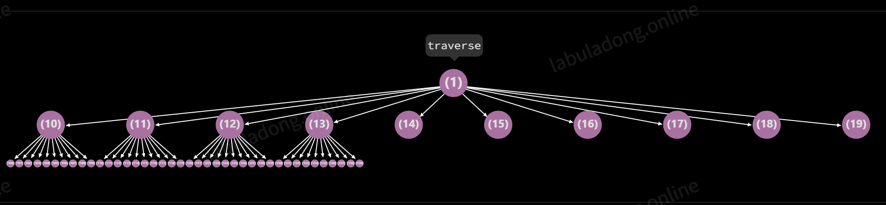

```java
class Solution {

    List<Integer> res = new ArrayList<>();

    public List<Integer> lexicalOrder(int n) {
        // 总共有 9 棵多叉树，从 1 开始
        for (int i = 1; i < 10; i++) {
            traverse(i, n);
        }
        return res;
    }

    // 多叉树遍历框架，前序位置收集所有小于 n 的节点
    void traverse(int root, int n) {
        if (root > n) {
            return;
        }
        res.add(root);

        for (int child = root * 10; child < root * 10 + 10; child++) {
            traverse(child, n);
        }
    }

}
```


##### 二叉树寻路

https://leetcode.cn/problems/path-in-zigzag-labelled-binary-tree/description/

对于满二叉树的任意节点，其所在的**层数 `d`** 满足：$2^d \leq x < 2^{d+1}$
两边取以 2 为底的对数：$d \leq \log_2(x) < d+1$
因此，层数 `d` 等于 $log_2(x)$ 的**整数部分**，即：$d = \lfloor \log_2(x) \rfloor$

Java 的 `Math.log()` 方法默认计算**自然对数**（以 e 为底）。为了计算以 2 为底的对数，需要使用**换底公式**：$ \log_2(x) = \frac{\ln(x)}{\ln(2)} $

$ln$是以e为底，$log$或者$lg$是以10为底

如果没有逆序存在的满二叉树，父节点的值=子节点的值/2

```java
class Solution {
    public List<Integer> pathInZigZagTree(int label) {
        ArrayList<Integer> path = new ArrayList<>();
        while (label >= 1) {
            path.add(label);
            label = label / 2;

            int depth = log(label);
            int[] range = getLevelRange(depth);
            // 由于之字形分布，根据上层的节点取值范围，修正父节点
            label = range[1] - (label - range[0]);
        }
        // 反转成从根节点到目标节点的路径
        Collections.reverse(path);
        return path;
    }

    // 获取第 n 层节点的取值范围
    private int[] getLevelRange(int n) {
        int p = (int) Math.pow(2, n);
        return new int[]{p, 2 * p - 1};
    }

    int log(int x) {
        return (int) (Math.log(x) / Math.log(2));
    }
}
```


##### 二叉树着色游戏

根据游戏规则，对方先选一个节点之后，你的最优策略就是紧贴着对方的那个节点选择，也就是说你应该选择节点 `x` 的左右子节点或者父节点。

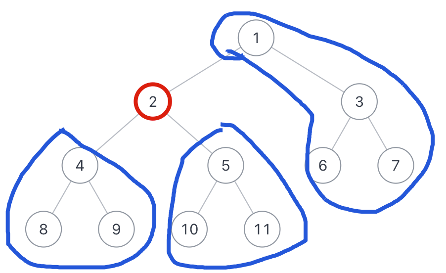

你如果想赢，必须占据超过 `n / 2` 的节点，也就是说，如果这三个蓝色区域中节点数最多的那个区域中的节点个数大于 `n / 2`，你能赢，否则你就输。

```java
class Solution {
    public boolean btreeGameWinningMove(TreeNode root, int n, int x) {
        TreeNode node = find(root, x);
        int leftCount = count(node.left);
        int rightCount = count(node.right);
        int otherCount = n - 1 - leftCount - rightCount;

        return Math.max(leftCount, Math.max(rightCount, otherCount)) > n / 2;
    }

    // 定义：在以 root 为根的二叉树中搜索值为 x 的节点并返回
    TreeNode find(TreeNode root, int x) {
        if (root == null) {
            return null;
        }
        if (root.val == x) {
            return root;
        }
        // 去左子树找
        TreeNode left = find(root.left, x);
        if (left != null) {
            return left;
        }
        // 左子树找不到的话去右子树找
        return find(root.right, x);
    }

    // 定义：计算以 root 为根的二叉树的节点总数
    int count(TreeNode root) {
        if (root == null) {
            return 0;
        }
        return 1 + count(root.left) + count(root.right);
    }
}
```

##### 从二叉树一个节点到另一个节点每一步的方向

这题的思路比较巧妙，主要分三步：

1、分别记录从根节点到 `startValue` 和 `destValue` 的路径 `startPath` 和 `destPath`。

2、然后去除 `startPath` 和 `destPath` 的公共前缀。

3、最后将 `startPath` 全部变成 `U`，把 `startPath` 和 `destPath` 接在一起，就是题目要求的路径了。

```java
class Solution {
    public String getDirections(TreeNode root, int startValue, int destValue) {
        this.startValue = startValue;
        this.destValue = destValue;
        // 寻找走到 startValue 和 destValue 的方向路径
        traverse(root);
        // 去除两个方向路径的公共前缀
        int p = 0, m = startPath.length(), n = destPath.length();
        while (p < m && p < n
                && startPath.charAt(p) == destPath.charAt(p)) {
            p++;
        }
        startPath = startPath.substring(p);
        destPath = destPath.substring(p);
        // 将走向 startValue 的方向路径全部变成 U
        startPath = "U".repeat(startPath.length());
        // 组合 startPath 和 destPath 就得到了答案
        return startPath + destPath;
    }

    StringBuilder path = new StringBuilder();
    String startPath, destPath;
    int startValue, destValue;

    // 二叉树遍历函数
    void traverse(TreeNode root) {
        if (root == null) {
            return;
        }
        if (root.val == startValue) {
            startPath = path.toString();
        } else if (root.val == destValue) {
            destPath = path.toString();
        }

        // 二叉树遍历框架
        path.append('L');
        traverse(root.left);
        path.deleteCharAt(path.length() - 1);

        path.append('R');
        traverse(root.right);
        path.deleteCharAt(path.length() - 1);
    }
}
```

##### 另一棵树的子树

```java
class Solution {
    public boolean isSubtree(TreeNode root, TreeNode subRoot) {
        if (root == null) {
            return subRoot == null;
        }
        // 判断以 root 为根的二叉树是否和 subRoot 相同
        if (isSameTree(root, subRoot)) {
            return true;
        }
        // 去左右子树中判断是否有和 subRoot 相同的子树
        return isSubtree(root.left, subRoot) || isSubtree(root.right, subRoot);
    }

    public boolean isSameTree(TreeNode p, TreeNode q) {
        // 判断一对节点是否相同
        if (p == null && q == null) {
            return true;
        }
        if (p == null || q == null) {
            return false;
        }
        if (p.val != q.val) {
            return false;
        }
        // 判断其他节点是否相同
        return isSameTree(p.left, q.left) && isSameTree(p.right, q.right);
    }
}
```

##### 二叉树中的链表

本质上，`isSubPath` 就是在遍历二叉树的所有节点，对每个节点用 `check` 函数判断是否能够将链表嵌进去。

```java
class Solution {
    public boolean isSubPath(ListNode head, TreeNode root) {
        // base case
        if (head == null) return true;
        if (root == null) return false;
        // 当找到一个二叉树节点的值等于链表头结点时
        if (head.val == root.val) {
            // 判断是否能把链表嵌进去
            if (check(head, root)) {
                return true;
            }
        }
        // 继续去遍历其他节点尝试嵌入链表
        return isSubPath(head, root.left) || isSubPath(head, root.right);
    }

    // 检查是否能够将链表嵌入二叉树
    boolean check(ListNode head, TreeNode root) {
        if (head == null) return true;
        if (root == null) return false;

        if (head.val != root.val) {
           return false;
        }
 	    return check(head.next, root.left) || check(head.next, root.right);
    }
}
```


#### 分解思想

##### 验证二叉树的前序序列化

每个非空的二叉树节点都会产生两条边，并消耗一条边；而每个空节点只会消耗一条边：

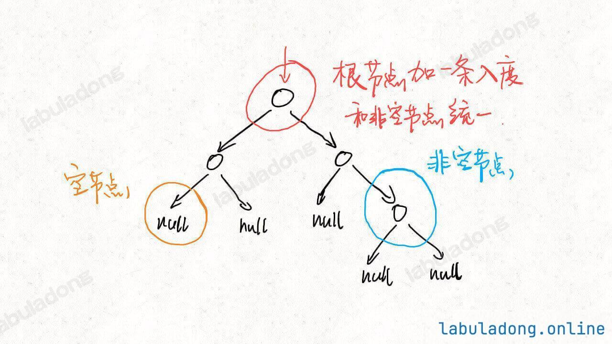

```java
class Solution {
    public boolean isValidSerialization(String preorder) {
        // 一条指向根节点的虚拟边
        int edge = 1;
        for (String node : preorder.split(",")) {
            // 任何时候，边数都不能小于 0
            if (node.equals("#")) {
                // 空指针消耗一条空闲边
                edge -= 1;
                if (edge < 0) {
                    return false;
                }
            } else {
                // 非空节点消耗一条空闲边，增加两条空闲边
                edge -= 1;
                if (edge < 0) {
                    return false;
                }
                edge += 2;
            }
        }
        // 最后不应该存在空闲边
        return edge == 0;
    }
}

class Solution2 {
    public boolean isValidSerialization(String preorder) {
        // 将字符串转化成列表
        LinkedList<String> nodes = new LinkedList<>();
        for (String s : preorder.split(",")) {
            nodes.addLast(s);
        }
        return deserialize(nodes) && nodes.isEmpty();
    }

    // 改造后的前序遍历反序列化函数
    // 详细解析：https://labuladong.online/algo/data-structure/serialize-and-deserialize-binary-tree/
    boolean deserialize(LinkedList<String> nodes) {
        if (nodes.isEmpty()) {
            return false;
        }

        // ***** 前序遍历位置 *****
        // 列表最左侧就是根节点
        String first = nodes.removeFirst();
        if (first.equals("#")) return true;
        // *********************

        return deserialize(nodes) && deserialize(nodes);
    }
}
```

##### 所有可能的满二叉树

生成一棵 `n` 个节点的满二叉树，首先要固定根节点，然后组装左右子树，根节点加上左右子树节点之和应该等于 `n`。

当 n 是奇数时，n 个结点的真二叉树满足左子树和右子树的结点数都是奇数，此时左子树和右子树的结点数之和是 n−1，假设左子树的数目为 i，则左子树的节点数目则为 n−1−i，则可以推出左子树与右子树的节点数目序列为：$[(1,n−2),(3,n−4),(5,n−6),⋯,(n−2,1)]$
假设我们分别构节点数目为 i 和节点数目为 n−1−i 的真二叉树，即可构造出 n 个结点的真二叉树。我们可以利用分治来构造真二叉树，分治的终止条件是 n=1。

- 当 n=1 时，此时只有一个结点的二叉树是真二叉树；
- 当 n>1 时，分别枚举左子树和右子树的根结点数，然后递归地构造左子树和右子树，并返回左子树与右子树的根节点列表。确定左子树与右子树的根节点列表后，分别枚举不同的左子树的根节点与右子树的根节点，从而可以构造出真二叉树的根节点。

```java
class Solution {
    // 备忘录，记录 n 个节点能够组合成的所有可能二叉树
    List<TreeNode>[] memo;

    public List<TreeNode> allPossibleFBT(int n) {
        if (n % 2 == 0) {
            // 题目描述的满二叉树不可能是偶数个节点
            return new LinkedList<>();
        }
        memo = new LinkedList[n + 1];
        return build(n);
    }

    // 定义：输入一个 n，生成节点树为 n 的所有可能的满二叉树
    public List<TreeNode> build(int n) {
        List<TreeNode> res = new LinkedList<>();
        // base case
        if (n == 1) {
            res.add(new TreeNode(0));
            return res;
        }
        if (memo[n] != null) {
            // 避免冗余计算
            return memo[n];
        }

        // 递归生成所有符合条件的左右子树
        for (int i = 1; i < n; i += 2) {
            int j = n - i - 1;
            // 利用函数定义，生成左右子树
            List<TreeNode> leftSubTrees = build(i);
            List<TreeNode> rightSubTrees = build(j);
            // 左右子树的不同排列也能构成不同的二叉树
            for (TreeNode left : leftSubTrees) {
                for (TreeNode right : rightSubTrees) {
                    // 生成根节点
                    TreeNode root = new TreeNode(0);
                    // 组装出一种可能的二叉树形状
                    root.left = left;
                    root.right = right;
                    // 加入结果列表
                    res.add(root);
                }
            }
        }
        // 存入备忘录
        memo[n] = res;
        return res;
    }

}
```

##### 最大二叉树 II

```java
class Solution {
    public TreeNode insertIntoMaxTree(TreeNode root, int val) {
        if (root == null) {
            return new TreeNode(val);
        }
        if (root.val < val) {
            // 如果 val 是整棵树最大的，那么原来的这棵树应该是 val 节点的左子树，
            // 因为 val 节点是接在原始数组 a 的最后一个元素
            TreeNode temp = root;
            root = new TreeNode(val);
            root.left = temp;
        } else {
            // 如果 val 不是最大的，那么就应该在右子树上，
            // 因为 val 节点是接在原始数组 a 的最后一个元素
            root.right = insertIntoMaxTree(root.right, val);
        }
        return root;
    }
}
```

##### 删点成林

```java
class Solution {
    Set<Integer> delSet = new HashSet<>();
    // 记录森林的根节点
    List<TreeNode> res = new LinkedList<>();

    public List<TreeNode> delNodes(TreeNode root, int[] to_delete) {
        if (root == null) return new LinkedList<>();
        for (int d : to_delete) {
            delSet.add(d);
        }
        doDelete(root, false);
        return res;
    }

    // 定义：输入一棵二叉树，删除 delSet 中的节点，返回删除完成后的根节点
    private TreeNode doDelete(TreeNode root, boolean hasParent) {
        if (root == null) {
            return null;
        }
        // 判断是否需要被删除
        boolean deleted = delSet.contains(root.val);
        if (!deleted && !hasParent) {
            // 没有父节点且不需要被删除，就是一个新的根节点
            res.add(root);
        }
        // 去左右子树进行删除
        root.left = doDelete(root.left, !deleted);
        root.right = doDelete(root.right, !deleted);
        // 如果需要被删除，返回 null 给父节点
        return deleted ? null : root;
    }
}
```


##### 对称二叉树

https://leetcode.cn/problems/symmetric-tree/

```java
class Solution {
    public boolean isSymmetric(TreeNode root) {
        if (root == null) return true;
        // 检查两棵子树是否对称
        return check(root.left, root.right);
    }

    // 定义：判断输入的两棵树是否是镜像对称的
    boolean check(TreeNode left, TreeNode right) {
        if (left == null || right == null) {
            return left == right;
        }
        // 两个根节点需要相同
        if (left.val != right.val) return false;
        // 左右子树也需要镜像对称
        return check(left.right, right.left) && check(left.left, right.right);
    }
}
```


##### 翻转等价二叉树

https://leetcode.cn/problems/flip-equivalent-binary-trees/

```java
class Solution {
    // 定义：输入两棵二叉树，判断这两棵二叉树是否是翻转等价的
    public boolean flipEquiv(TreeNode root1, TreeNode root2) {
        // 判断 root1 和 root2 两个节点是否能够匹配
        if (root1 == null && root2 == null) {
            return true;
        }
        if (root1 == null || root2 == null) {
            return false;
        }
        if (root1.val != root2.val) {
            return false;
        }
        // 根据函数定义，判断子树是否能够匹配
        // 不翻转、翻转两种情况满足一种即可算是匹配
        return (
                // 不翻转子树
                flipEquiv(root1.left, root2.left) && flipEquiv(root1.right, root2.right)
        ) || (
                // 反转子树
                flipEquiv(root1.left, root2.right) && flipEquiv(root1.right, root2.left)
        );
    }
}
```

##### 二叉树的直径

https://leetcode.cn/problems/diameter-of-binary-tree/description/

二叉树的最大直径等于 左右子树最大深度的和

定义一个函数，获取以root节点的最大深度，在后序遍历位置顺便计算 左右子树最大深度的和 更新最大直径

```java
class Solution {
    int maxDiameter = 0;

    public int diameterOfBinaryTree(TreeNode root) {
        maxDepth(root);
        return maxDiameter;
    }

    int maxDepth(TreeNode root) {
        if (root == null) {
            return 0;
        }
        int leftMax = maxDepth(root.left);
        int rightMax = maxDepth(root.right);
        // 后序遍历位置顺便计算最大直径
        maxDiameter = Math.max(maxDiameter, leftMax + rightMax);
        return 1 + Math.max(leftMax, rightMax);
    }
}
```

##### 二叉树中的最大路径和

https://leetcode.cn/problems/binary-tree-maximum-path-sum/

二叉树的最大路径和 = （以左右子树为起点的最大单边路径的和 + 当前根节点的值）的最大值

定义一个函数，返回以root节点为起点的最大单边路径和

```java
class Solution {
    int res = Integer.MIN_VALUE;

    public int maxPathSum(TreeNode root) {
        if (root == null) {
            return 0;
        }
        // 计算单边路径和时顺便计算最大路径和
        oneSideMax(root);
        return res;
    }

    // 定义：计算从根节点 root 为起点的最大单边路径和
    int oneSideMax(TreeNode root) {
        if (root == null) {
            return 0;
        }
        //遇到负值时 抛弃
        int leftMaxSum = Math.max(0, oneSideMax(root.left));
        int rightMaxSum = Math.max(0, oneSideMax(root.right));
        // 后序遍历位置，顺便更新最大路径和
        int pathMaxSum = root.val + leftMaxSum + rightMaxSum;
        res = Math.max(res, pathMaxSum);
        // 实现函数定义，左右子树的最大单边路径和加上根节点的值
        // 就是从根节点 root 为起点的最大单边路径和
        return Math.max(leftMaxSum, rightMaxSum) + root.val;
    }
}
```


#### 两种思路


##### N 叉树的最大深度

https://leetcode.cn/problems/maximum-depth-of-n-ary-tree/

```java
// 分解问题的思路
class Solution {
    public int maxDepth(Node root) {
        if (root == null) {
            return 0;
        }
        int subTreeMaxDepth = 0;
        for (Node child : root.children) {
            subTreeMaxDepth = Math.max(subTreeMaxDepth, maxDepth(child));
        }
        return 1 + subTreeMaxDepth;
    }
}

// 遍历的思路
class Solution2 {
    public int maxDepth(Node root) {
        traverse(root);
        return res;
    }

    // 记录递归遍历到的深度
    int depth = 0;
    // 记录最大的深度
    int res = 0;

    void traverse(Node root) {
        if (root == null) {
            return;
        }
        // 前序遍历位置
        depth++;
        res = Math.max(res, depth);

        for (Node child : root.children) {
            traverse(child);
        }
        // 后序遍历位置
        depth--;
    }
}
```

##### 路径总和

https://leetcode.cn/problems/path-sum/

```java
class Solution {
    // 解法一、分解问题的思路
    // 定义：输入一个根节点，返回该根节点到叶子节点是否存在一条和为 targetSum 的路径
    public boolean hasPathSum(TreeNode root, int targetSum) {
        // base case
        if (root == null) {
            return false;
        }
        // root.left == root.right 等同于 root.left == null && root.right == null
        if (root.left == root.right && root.val == targetSum) {
            return true;
        }

        return hasPathSum(root.left, targetSum - root.val)
                || hasPathSum(root.right, targetSum - root.val);
    }

    // 解法二、遍历二叉树的思路
    int target;
    boolean found = false;
    // 记录遍历过程中的路径和
    int curSum = 0;

    public boolean hasPathSum_2(TreeNode root, int targetSum) {
        if (root == null) {
            return false;
        }
        this.target = targetSum;
        traverse(root);
        return found;
    }

    // 二叉树遍历函数
    void traverse(TreeNode root) {
        if (root == null) {
            return;
        }
        // 前序遍历位置
        curSum += root.val;
        if (root.left == null && root.right == null) {
            if (curSum == target) {
                found = true;
            }
        }

        traverse(root.left);
        traverse(root.right);

        // 后序遍历位置
        curSum -= root.val;
    }
}
```

##### 路径总和 II

https://leetcode.cn/problems/path-sum-ii/

```JAVA
class Solution {
    List<List<Integer>> res = new LinkedList<>();

    public List<List<Integer>> pathSum(TreeNode root, int sum) {
        if (root == null) return res;
        traverse(root, sum, new LinkedList<>());
        return res;
    }

    // 遍历二叉树
    private void traverse(TreeNode root, int sum, LinkedList<Integer> path) {
        if (root == null) return;

        int remain = sum - root.val;

        if (root.left == null && root.right == null) {
            if (remain == 0) {
                // 找到一条路径
                path.addLast(root.val);
                res.add(new LinkedList<>(path));
                path.removeLast();
            }
            return;
        }

        // 维护路径列表
        path.addLast(root.val);
        traverse(root.left, remain, path);
        path.removeLast();

        path.addLast(root.val);
        traverse(root.right, remain, path);
        path.removeLast();
    }
}

// 分解问题的思维模式
class Solution2 {
    public List<List<Integer>> pathSum(TreeNode root, int targetSum) {
        List<List<Integer>> rootAnswers = new LinkedList<>();
        if (root == null) {
            return rootAnswers;
        }

        // 如果是叶子节点并且值等于 targetSum，则找到一条路径
        if (root.left == null && root.right == null && root.val == targetSum) {
            LinkedList<Integer> path = new LinkedList<>();
            path.add(root.val);
            rootAnswers.add(path);
            return rootAnswers;
        }

        // 分别递归左右子树，找到子树中和为 targetSum - root.val 的路径
        List<List<Integer>> leftAnswers = pathSum(root.left, targetSum - root.val);
        List<List<Integer>> rightAnswers = pathSum(root.right, targetSum - root.val);

        // 左右子树的路径加上根节点，就是和为 targetSum 的路径
        for (List<Integer> answer : leftAnswers) {
            // 因为底层使用的是 LinkedList，所以这个操作的复杂度是 O(1)
            answer.add(0, root.val);
            rootAnswers.add(answer);
        }
        for (List<Integer> answer : rightAnswers) {
            // 因为底层使用的是 LinkedList，所以这个操作的复杂度是 O(1)
            answer.add(0, root.val);
            rootAnswers.add(answer);
        }

        return rootAnswers;
    }
}
```

##### 合并二叉树

https://leetcode.cn/problems/merge-two-binary-trees/

```java
class Solution {
    // 分解问题的思维模式
    // 定义：输入两棵树的根节点，返回合并后的树的根节点
    public TreeNode mergeTrees(TreeNode root1, TreeNode root2) {
        // 如果一棵树非空，那么合并后就是另一棵树
        if (root1 == null) {
            return root2;
        }
        if (root2 == null) {
            return root1;
        }
        // 两棵树都有的节点，叠加节点值
        root1.val += root2.val;
        // 利用函数定义，子树合并后接到
        root1.left = mergeTrees(root1.left, root2.left);
        root1.right = mergeTrees(root1.right, root2.right);

        return root1;
    }
}

class Solution2 {
    
    // 遍历的思维模式
    public TreeNode mergeTrees(TreeNode root1, TreeNode root2) {
        if (root1 == null) {
            return root2;
        }
        // 遍历 root1，顺便把 root2 的节点合并过来
        traverse(root1, root2);
        return root1;
    }

    void traverse(TreeNode root1, TreeNode root2) {
        if (root1 == null || root2 == null) {
            return;
        }

        if (root1 != null && root2 != null) {
            // 两棵树都有的节点，叠加节点值
            root1.val += root2.val;
        }

        // 如果 root1 没有子树而 root2 有，那么就把 root2 的子树接到 root1 上
        // 注意接完之后把 root2 的子树置为 null，免得错误计算节点累加值
        if (root1.left == null && root2.left != null) {
            root1.left = root2.left;
            root2.left = null;
        }
        if (root1.right == null && root2.right != null) {
            root1.right = root2.right;
            root2.right = null;
        }

        // 递归遍历左右子节点，root2 的节点也跟着同步移动
        traverse(root1.left, root2.left);
        traverse(root1.right, root2.right);
    }
}
```


##### 递增顺序搜索树

https://leetcode.cn/problems/increasing-order-search-tree/

```java
class Solution {
    // 输入一棵 BST，返回一个有序「链表」
    public TreeNode increasingBST(TreeNode root) {
        if (root == null) {
            return null;
        }
        // 先把左右子树拉平
        TreeNode left = increasingBST(root.left);
        root.left = null;
        TreeNode right = increasingBST(root.right);
        root.right = right;
        // 左子树为空的话，就不用处理了
        if (left == null) {
            return root;
        }
        // 左子树非空，需要把根节点和右子树接到左子树末尾
        TreeNode p = left;
        while (p != null && p.right != null) {
            p = p.right;
        }
        p.right = root;

        return left;
    }
}
```


##### 二叉搜索树的范围和

```java
// 遍历的思路
class Solution {

    int sum = 0;

    public int rangeSumBST(TreeNode root, int low, int high) {
        if (root == null) return 0;
        // 遍历一遍 BST 计算区间元素和
        traverse(root, low, high);
        return sum;
    }

    void traverse(TreeNode root, int low, int high) {
        if (root == null) {
            return;
        }
        if (root.val < low) {
            // 目标区间在右子树
            traverse(root.right, low, high);
        } else if (root.val > high) {
            // 目标区间在左子树
            traverse(root.left, low, high);
        } else {
            // root.val 落在目标区间，累加 sum
            sum += root.val;
            // 继续遍历左右子树
            traverse(root.right, low, high);
            traverse(root.left, low, high);
        }
    }
}

// 分解问题的思路
class Solution2 {
    // 定义：输入一个 BST，计算值落在 [low, high] 之间的元素之和
    public int rangeSumBST(TreeNode root, int low, int high) {
        if (root == null) return 0;
        if (root.val < low) {
            // 目标区间在右子树
            return rangeSumBST(root.right, low, high);
        } else if (root.val > high) {
            // 目标区间在左子树
            return rangeSumBST(root.left, low, high);
        } else {
            // 以 root 为根的这棵 BST 落在 [low, high] 之间的元素之和，
            // 等于 root.val 加上左右子树落在区间的元素之和
            return root.val
                    + rangeSumBST(root.left, low, high)
                    + rangeSumBST(root.right, low, high);
        }
    }
}
```

##### 找出克隆二叉树中的相同节点

https://leetcode.cn/problems/find-a-corresponding-node-of-a-binary-tree-in-a-clone-of-that-tree/

```java
// 遍历的思路
class Solution {
    // 定义：找到 original 中 target 节点在 cloned 树中对应的节点
    public final TreeNode getTargetCopy(final TreeNode original, final TreeNode cloned, final TreeNode target) {
        this.target = target;
        traverse(original, cloned);
        return res;
    }

    TreeNode target, res;

    // 二叉树遍历函数
    void traverse(TreeNode original, TreeNode cloned) {
        if (original == null || res != null) {
            return;
        }
        if (original == target) {
            res = cloned;
            return;
        }
        // 二叉树遍历框架
        traverse(original.left, cloned.left);
        traverse(original.right, cloned.right);
    }
}

// 分解问题的思路
class Solution2 {
    // 定义：找到 original 中 target 节点在 cloned 树中对应的节点
    public final TreeNode getTargetCopy(final TreeNode original, final TreeNode cloned, final TreeNode target) {
        if (original == null) {
            return null;
        }
        // 找到目标节点
        if (target == original) {
            return cloned;
        }
        // 去左子树找
        TreeNode left = getTargetCopy(original.left, cloned.left, target);
        if (left != null) {
            return left;
        }
        // 左子树找不到的话去右子树找
        return getTargetCopy(original.right, cloned.right, target);
    }
}
```


#### 后序遍历

##### 平衡二叉树

只计算一次最大深度，计算的过程中在后序遍历位置顺便判断二叉树是否平衡

```java
class Solution {
    public boolean isBalanced(TreeNode root) {
        maxDepth(root);
        return isBalanced;
    }

    // 记录二叉树是否平衡
    boolean isBalanced = true;

    // 输入一个节点，返回以该节点为根的二叉树的最大深度
    int maxDepth(TreeNode root) {
        if (root == null) {
            return 0;
        }
        // if (!isBalanced) {
        // 随便返回一个值即可，旨在结束递归
        //     return -666;
        // }

        int leftMaxDepth = maxDepth(root.left);
        int rightMaxDepth = maxDepth(root.right);

        // 后序遍历位置
        // 如果左右最大深度大于 1，就不是平衡二叉树
        if (Math.abs(rightMaxDepth - leftMaxDepth) > 1) {
            isBalanced = false;
        }

        return 1 + Math.max(leftMaxDepth, rightMaxDepth);
    }
}
```


##### 出现次数最多的子树元素和

https://leetcode.cn/problems/most-frequent-subtree-sum/

`sum` 函数根据子树的元素和推导出原树的所有元素和，只不过在后序遍历位置添加一些统计工作，便于找出出现频率最高的子树和。

```java
class Solution {
    // sum -> count
    HashMap<Integer, Integer> sumToCount = new HashMap<>();

    public int[] findFrequentTreeSum(TreeNode root) {
        // 遍历二叉树，记录所有子树和及出现频率
        sum(root);
        // 找到最大的出现频率
        int maxCount = 0;
        for (int count : sumToCount.values()) {
            maxCount = Math.max(maxCount, count);
        }
        // 找到最大出现频率对应的的子树和
        ArrayList<Integer> res = new ArrayList<>();
        for (Integer key : sumToCount.keySet()) {
            if (sumToCount.get(key) == maxCount) {
                res.add(key);
            }
        }
        // 转化为 Java 数组
        int[] arr = new int[res.size()];
        for (int i = 0; i < arr.length; i++) {
            arr[i] = res.get(i);
        }
        return arr;
    }

    // 定义：输入一个节点，返回以该节点为根的二叉树所有节点之和
    int sum(TreeNode root) {
        if (root == null) {
            return 0;
        }
        int leftSum = sum(root.left);
        int rightSum = sum(root.right);
        int res = root.val + leftSum + rightSum;

        // 后序遍历位置，顺手记录子树和对应的频率
        sumToCount.put(res, sumToCount.getOrDefault(res, 0) + 1);
        return res;
    }
}
```


##### 二叉树的坡度

https://leetcode.cn/problems/binary-tree-tilt/

`sum` 函数记录二叉树的节点之和，在后序位置顺便计算二叉树的「坡度」即可。

```java
class Solution {
    public int findTilt(TreeNode root) {
        sum(root);
        return res;
    }

    int res = 0;

    // 定义：输入一棵二叉树，返回这棵二叉树所有元素的和
    int sum(TreeNode root) {
        if (root == null) {
            return 0;
        }

        int leftSum = sum(root.left);
        int rightSum = sum(root.right);
        // 后序位置
        res += Math.abs(leftSum - rightSum);
        return leftSum + rightSum + root.val;
    }
}
```

##### 二叉树剪枝

https://leetcode.cn/problems/binary-tree-pruning/

这道题的难点在于要一直剪枝，直到没有值为 0 的叶子节点为止，只有从后序遍历位置自底向上处理才能获得最高的效率。

```java
class Solution {
    // 定义：输入一棵二叉树，返回的二叉树叶子节点都是 1
    public TreeNode pruneTree(TreeNode root) {
        if (root == null) {
            return null;
        }
        // 二叉树递归框架
        root.left = pruneTree(root.left);
        root.right = pruneTree(root.right);

        // 后序遍历位置，判断自己是否是值为 0 的叶子节点
        if (root.val == 0 && root.left == null && root.right == null) {
            // 返回值会被父节点接收，相当于把自己删掉了
            return null;
        }
        // 如果不是，正常返回
        return root;
    }
}
```


##### 删除给定值的叶子节点

https://leetcode.cn/problems/delete-leaves-with-a-given-value/

```java
class Solution {
    //给定一个二叉树，返回剪掉叶子节点是target的树
    public TreeNode removeLeafNodes(TreeNode root, int target) {
        if (root == null) return null;
        // 二叉树递归框架
        // 如果左右子节点需要被删除，先递归删除它们
        root.left = removeLeafNodes(root.left, target);
        root.right = removeLeafNodes(root.right, target);
        // 后序遍历位置，此时节点 root 直到自己是否需要被删除
        if (root.val == target && root.left == null && root.right == null) {
            return null;
        }
        return root;
    }
}
```

##### 最长同值路径

https://leetcode.cn/problems/longest-univalue-path/

`maxLen` 相当于求值为 `parentVal` 的节点的最大深度。


```java
class Solution {
    int res = 0;
    public int longestUnivaluePath(TreeNode root) {
        if (root == null) {
            return 0;
        }
        // 在后序遍历的位置更新 res
        maxLen(root, root.val);
        return res;
    }

    // 定义：计算以 root 为根的这棵二叉树中，从 root 开始值为 parentVal 的最长树枝长度
    private int maxLen(TreeNode root, int parentVal) {
        if (root == null) {
            return 0;
        }
        // 利用函数定义，计算左右子树值为 root.val 的最长树枝长度
        int leftLen = maxLen(root.left, root.val);
        int rightLen = maxLen(root.right, root.val);

        // 后序遍历位置顺便更新全局变量
        // 同值路径就是左右同值树枝长度之和
        res = Math.max(res, leftLen + rightLen);
        // 如果 root 本身和上级值不同，那么整棵子树都不可能有同值树枝
        if (root.val != parentVal) {
            return 0;
        }
        // 实现函数的定义：
        // 以 root 为根的二叉树从 root 开始值为 parentVal 的最长树枝长度
        // 等于左右子树的最长树枝长度的最大值加上 root 节点本身
        return  1 + Math.max(leftLen, rightLen);
    }
}
```


##### 具有所有最深节点的最小子树

https://leetcode.cn/problems/smallest-subtree-with-all-the-deepest-nodes/

求那些「最深」的叶子节点的最近公共祖先

如果左右子树一样深，那么当前节点就是最近公共祖先；如果左右子树不一样深，那么最深叶子节点的最近公共祖先肯定在左右子树上。

```java
class Solution {
    class Result {
        public TreeNode node;
        public int depth;

        public Result(TreeNode node, int depth) {
            // 记录最近公共祖先节点 node
            this.node = node;
            // 记录以 node 为根的二叉树最大深度
            this.depth = depth;
        }
    }

    public TreeNode subtreeWithAllDeepest(TreeNode root) {
        Result res = maxDepth(root);
        return res.node;
    }

    // 定义：输入一棵二叉树，返回该二叉树的最大深度以及最深叶子节点的最近公共祖先节点
    Result maxDepth(TreeNode root) {
        if (root == null) {
            return new Result(null, 0);
        }
        Result left = maxDepth(root.left);
        Result right = maxDepth(root.right);
        if (left.depth == right.depth) {
            // 当左右子树的最大深度相同时，这个根节点是新的最近公共祖先
            // 以当前 root 节点为根的子树深度是子树深度 + 1
            return new Result(root, left.depth + 1);
        }
        // 左右子树的深度不同，则最近公共祖先在 depth 较大的一边
        Result res = left.depth > right.depth ? left : right;
        // 正确维护二叉树的最大深度
        res.depth++;

        return res;
    }
}
```

##### 节点与其祖先之间的最大差值

https://leetcode.cn/problems/maximum-difference-between-node-and-ancestor/

每个节点需要知道左右子树的最小值和最大值，然后就能算出「以自己为祖先」的最大差值。

```java
class Solution {
    public int maxAncestorDiff(TreeNode root) {
        getMinMax(root);
        return res;
    }

    int res = 0;

    // 定义：输入一棵二叉树，返回该二叉树中节点的最小值和最大值，
    // 第一个元素是最小值，第二个值是最大值
    int[] getMinMax(TreeNode root) {
        if (root == null) {
            return new int[]{Integer.MAX_VALUE, Integer.MIN_VALUE};
        }
        int[] leftMinMax = getMinMax(root.left);
        int[] rightMinMax = getMinMax(root.right);
        // 以 root 为根的这棵树的最大值和最小值可以通过左右子树的最大最小值推导出来
        int rootMin = min(root.val, leftMinMax[0], rightMinMax[0]);
        int rootMax = max(root.val, leftMinMax[1], rightMinMax[1]);
        // 在后序位置顺便判断所有差值的最大值
        res = max(res, rootMax - root.val, root.val - rootMin);

        return new int[]{rootMin, rootMax};
    }

    int min(int a, int b, int c) {
        return Math.min(Math.min(a, b), c);
    }

    int max(int a, int b, int c) {
        return Math.max(Math.max(a, b), c);
    }
}
```

##### 分裂二叉树的最大乘积

https://leetcode.cn/problems/maximum-product-of-splitted-binary-tree/

在二叉树中切出一个小二叉树（子树），计算这个子树节点之和与剩下的节点之和的乘积。

任何子树的节点之和都可以在后序位置获得，而剩下的其他节点之和就是整棵二叉树的节点之和减去子树节点之和。

```java
class Solution {
    public int maxProduct(TreeNode root) {
        // 先利用求和函数得到整棵树的节点之和
        treeSum = getSum(root);
        // 再次调用，利用后序位置计算子树之积
        getSum(root);
        return (int) (res % (1e9 + 7));
    }

    long res = 0;
    int treeSum = 0;

    int getSum(TreeNode root) {
        if (root == null) {
            return 0;
        }
        int leftSum = getSum(root.left);
        int rightSum = getSum(root.right);
        int rootSum = leftSum + rightSum + root.val;
        // 后序位置计算乘积
        res = Math.max(res, (long) rootSum * (treeSum - rootSum));
        return rootSum;
    }
}
```


##### 二叉树中的最长交错路径

https://leetcode.cn/problems/longest-zigzag-path-in-a-binary-tree/


```java
class Solution {
    public int longestZigZag(TreeNode root) {
        getPathLen(root);
        return res;
    }

    int res = 0;

    // 输入二叉树的根节点 root，返回两个值
    // 第一个是从 root 开始向左走的最长交错路径长度，
    // 第一个是从 root 开始向右走的最长交错路径长度
    int[] getPathLen(TreeNode root) {
        if (root == null) {
            return new int[]{-1, -1};
        }
        int[] left = getPathLen(root.left);
        int[] right = getPathLen(root.right);
        // 后序位置，根据左右子树的交错路径长度推算根节点的交错路径长度
        int rootPathLen1 = left[1] + 1;
        int rootPathLen2 = right[0] + 1;
        // 更新全局最大值
        res = Math.max(res, Math.max(rootPathLen1, rootPathLen2));

        return new int[]{rootPathLen1, rootPathLen2};
    }
}
```


##### 根据二叉树创建字符串

https://leetcode.cn/problems/construct-string-from-binary-tree/

```java
class Solution {
    // 定义：输入以 root 的二叉树，返回描述该二叉树的字符串
    public String tree2str(TreeNode root) {
        // base case
        if (root == null) return "";
        if (root.left == null && root.right == null) {
            return root.val + "";
        }
        // 递归生成左右子树的字符串
        String leftStr = tree2str(root.left);
        String rightStr = tree2str(root.right);

        // 后序代码位置
        // 根据左右子树字符串组装出前序遍历的顺序
        // 按题目要求处理 root 只有一边有子树的情况
        if (root.left != null && root.right == null) {
            // 省略空的右子树
            return root.val + "(" + leftStr + ")";
        }
        if (root.left == null && root.right != null) {
            // 空的左子树不能省略
            return root.val + "()" + "(" + rightStr + ")";
        }
        // 按题目要求处理 root 左右子树都不空的情况
        return root.val + "(" + leftStr + ")" + "(" + rightStr + ")";
    }
}
```


##### 收集树上所有苹果的最少时间

https://leetcode.cn/problems/minimum-time-to-collect-all-apples-in-a-tree/

题目输入的是若干条边的形式，我们首先需要用 [图论算法基础](https://labuladong.online/algo/data-structure-basic/graph-basic/) 中讲到的表示无向图的邻接表来存储这棵多叉树。

构造出了多叉树，这道题显然要用分解问题的思维模式，并利用后序位置的妙用。

为什么？假设你站在这棵树中的某个节点上，你脚底下有多棵子树，你要去这些子树里面找苹果对不对？

你如果知道了在一棵子树中找苹果的最小步数，假设为 `x`，那么算上你进出这棵子树的 2 步，`x + 2` 就是从你进入这棵子树找苹果的最小步数。

当然，你脚底下可能有多棵子树都有苹果，所以就会有 `x1 + 2, x2 + 2...` 这些结果加起来，不就是在以你这个节点为根的整棵树找苹果的最小步数了么

```java
class Solution {
    // 邻接表形式，存储着一棵多叉树
    HashMap<Integer, List<Integer>> graph = new HashMap<>();
    HashSet<Integer> visited = new HashSet<>();

    List<Boolean> hasApple;

    public int minTime(int n, int[][] edges, List<Boolean> hasApple) {
        // 构造多叉树结构
        for (int i = 0; i < n; i++) {
            graph.put(i, new ArrayList<>());
        }
        for (int[] edge : edges) {
            int a = edge[0], b = edge[1];
            graph.get(a).add(b);
            graph.get(b).add(a);
        }

        this.hasApple = hasApple;

        // 根据 collect 函数的定义，返回题目想要的结果
        int res = collect(0);
        return res == -1 ? 0 : res;
    }

    // 定义：遍历以 root 为根的这棵多叉树，返回收集其中的所有苹果所需的最少步数（时间）
    // 如果返回的是 -1，说明以 root 为根的这棵多叉树中没有苹果
    int collect(int root) {
        if (visited.contains(root)) {
            return -1;
        }
        visited.add(root);

        // 去子树看看是否找到了苹果
        int sum = 0;
        for (int child : graph.get(root)) {
            int subTime = collect(child);
            if (subTime != -1) {
                // 这棵子树中有苹果，从 root 进入和离开这棵子树，需要额外的两步
                sum += subTime + 2;
            }
        }
        // 在后序位置对当前节点的情况和子树返回的信息进行处理：
        if (sum > 0) {
            // 子树中发现苹果，直接返回，sum 已经算上了本节点出入子树的步数
            return sum;
        }
        if (sum == 0 && hasApple.get(root)) {
            // 子树中没找到苹果，但 root 节点本身就是苹果，需要 0 步
            return 0;
        }
        // 以 root 为根的这棵多叉树中不存在苹果，按照定义返回 -1
        return -1;
    }
}
```


##### 监控二叉树

https://leetcode.cn/problems/binary-tree-cameras/

如何保证安装的摄像头数量尽可能少呢？显然就是要尽可能分散，让每个摄像头物尽其用。

具体来说就是自底向上安装摄像头，在叶子节点的父节点上安装摄像头，然后每隔两层再安装（因为每个摄像头都可以管三层）。

那么一个节点在什么情况下需要被安装摄像头呢？显然是当这个节点的子节点处于 uncover 的状态的时候必须安装摄像头，以便覆盖子节点。

```java
class Solution {
    public int minCameraCover(TreeNode root) {
        setCamera(root, false);
        return res;
    }

    int res = 0;

    // 定义：输入以 root 为根的二叉树，以最优策略在这棵二叉树上放置摄像头，
    // 然后返回 root 节点的情况：
    // 返回 -1 代表 root 为空，返回 0 代表 root 未被 cover，
    // 返回 1 代表 root 已经被 cover，返回 2 代表 root 上放置了摄像头。
    int setCamera(TreeNode root, boolean hasParent) {
        if (root == null) {
            return -1;
        }
        // 获取左右子节点的情况
        int left = setCamera(root.left, true);
        int right = setCamera(root.right, true);

        // 根据左右子节点的情况和父节点的情况判断当前节点应该做的事情
        if (left == -1 && right == -1) {
            // 当前节点是叶子节点
            if (hasParent) {
                // 有父节点的话，让父节点来 cover 自己
                return 0;
            }
            // 没有父节点的话，自己 set 一个摄像头
            res++;
            return 2;
        }

        if (left == 0 || right == 0) {
            // 左右子树存在没有被 cover 的
            // 必须在当前节点 set 一个摄像头
            res += 1;
            return 2;
        }

        if (left == 2 || right == 2) {
            // 左右子树只要有一个 set 了摄像头
            // 当前节点就已经是 cover 状态了
            return 1;
        }

        // 剩下 left == 1 && right == 1 的情况
        // 即当前节点的左右子节点都被 cover
        if (hasParent) {
            // 如果有父节点的话，可以等父节点 cover 自己
            return 0;
        } else {
            // 没有父节点，只能自己 set 一个摄像头
            res++;
            return 2;
        }
    }
}
```

##### 在二叉树中分配硬币

https://leetcode.cn/problems/distribute-coins-in-binary-tree/

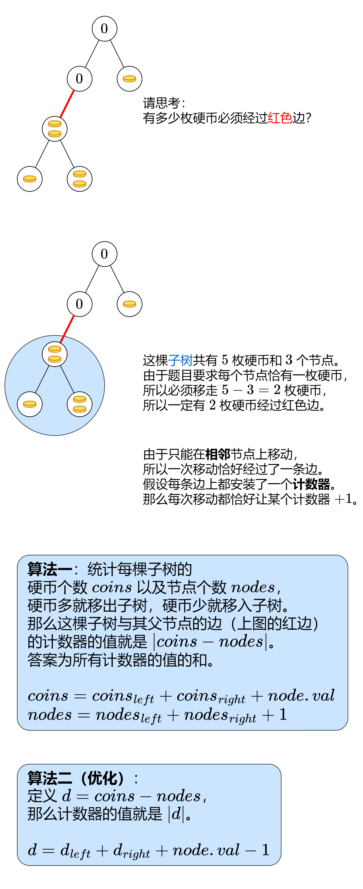


每枚硬币移动的路径长度并不好计算，但是把这些路径**叠起来**，转换成每条边经过了多少枚硬币，就容易计算了

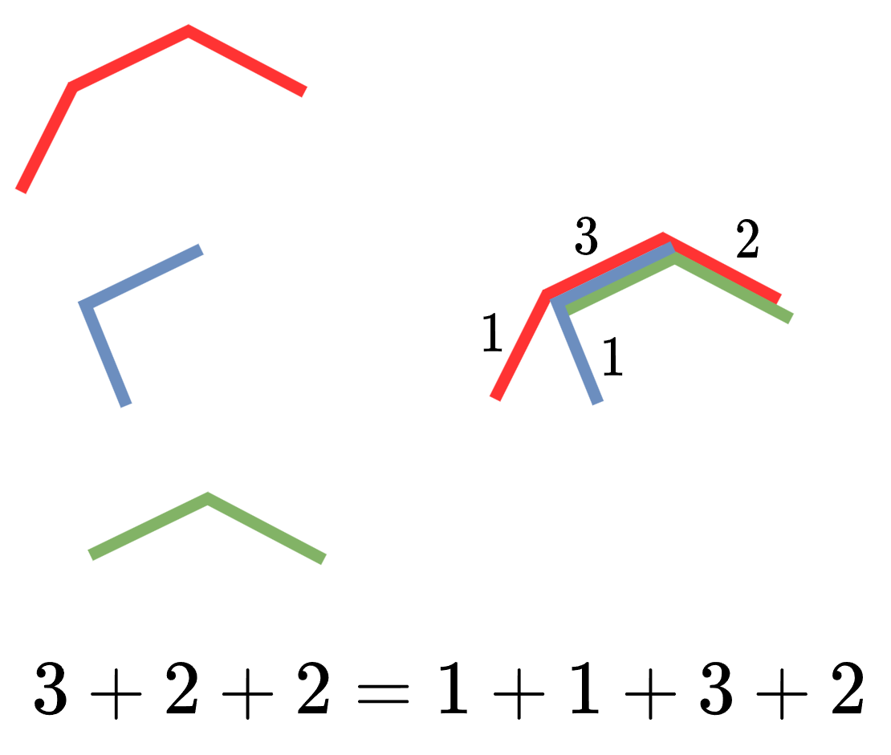

```java
class Solution {
    public int distributeCoins(TreeNode root) {
        moveCount(root);
        return ans;
    }

    int ans = 0;

    public int[] moveCount(TreeNode root) {
        if (root == null) {
            return new int[]{0, 0};
        }
        int[] left = moveCount(root.left);
        int[] right = moveCount(root.right);
        int nodes = left[0] + right[0] + 1;
        int coins = left[1] + right[1] + root.val;
        ans += Math.abs(coins - nodes);
        return new int[]{nodes, coins};
    }
}
```

##### 根到叶路径上的不足节点

https://leetcode.cn/problems/insufficient-nodes-in-root-to-leaf-paths/

首先，对于一个叶子节点，它本身就是以自己为根的这棵二叉树的路径，那么这条路径是否小于 `limit` 的约束是很显然的，如果小于 `limit`，说明它需要被删除。

然后，对于一个非叶子节点 `x`，它是否是一个「不足节点」，或者说是否存在一条不满足 `limit` 约束的路径穿过这个节点，其实可以根据子树推导出来。

如果 `x` 的左右子节点都被删除，那么就说明 `x` 的左右子树上的路径都不满足 `limit` 的约束，也就是说所有穿过 `x` 的路径都不满足约束，即 `x` 也应该被删除

```java
class Solution {
    // 定义：输入一个节点 root，和约束 limit，
    // 删除以 root 为根的二叉树中的「不足节点」，返回删除完成后的二叉树根节点
    public TreeNode sufficientSubset(TreeNode root, int limit) {
        if (root == null) {
            return null;
        }
        // 前序位置，接收父节点传递的 limit 约束决定叶子结点是否需要被删除
        if (root.left == null && root.right == null) {
            if (root.val < limit) {
                // 对于叶子节点，如果低于 limit 说明需要被删除
                return null;
            }
            return root;
        }
        // 先对左右子树进行删除，接收返回值
        TreeNode left = sufficientSubset(root.left, limit - root.val);
        TreeNode right = sufficientSubset(root.right, limit - root.val);
        // 后序位置，根据子树的删除情况决定自己是否需要被删除
        if (left == null && right == null) {
            // 如果左右子树不满足 limit - root.val 的约束，那么就存在经过 root
            // 节点的路径不满足约束，也就说明 root 节点是「不足节点」，需要被删掉
            return null;
        }
        root.left = left;
        root.right = right;
        return root;
    }
}
```

##### 统计最高分的节点数目

https://leetcode.cn/problems/count-nodes-with-the-highest-score/

简单说，一个节点的 **分数 = 左子树节点个数 x 右子树节点个数 x 除自己外其他节点个数**。

只要写个 `countNode` 函数，在后序位置可以得到左右子树的节点个数 `leftCount` 和 `rightCount`，然后除自己外其他节点个数 `otherCount` 就等于总的节点个数 `n` 减掉左右子树的节点个数再减掉当前节点，最后求个乘积就能算出当前节点的「分数」了。

当然，这道题还有个难点就是：题目给的 `parents` 数组不是我们经常见到的二叉树形式。

但问题不大，我们可以把 `parents` 数组转化成类似 [图论基础](https://labuladong.online/algo/data-structure-basic/graph-basic/) 中讲到的邻接表结构

```java
class Solution {
    // 用邻接表表示的一棵二叉树
    int[][] tree;
    HashMap<Long, Integer> scoreToCount = new HashMap<>();

    public int countHighestScoreNodes(int[] parents) {
        this.tree = buildTree(parents);
        countNode(0);
        // 计算最大分数出现的次数
        long maxScore = 0;
        for (long score : scoreToCount.keySet()) {
            maxScore = Math.max(maxScore, score);
        }
        return scoreToCount.get(maxScore);
    }

    // 计算二叉树中的节点个数
    int countNode(int root) {
        if (root == -1) {
            return 0;
        }
        // 二叉树中节点总数
        int n = tree.length;
        int leftCount = countNode(tree[root][0]);
        int rightCount = countNode(tree[root][1]);

        // 后序位置，计算每个节点的「分数」
        int otherCount = n - leftCount - rightCount - 1;
        // 注意，这里要把 int 转化成 long，否则会产生溢出！！！
        long score = (long)Math.max(leftCount, 1)
                * Math.max(rightCount, 1) * Math.max(otherCount, 1);
        // 给分数 score 计数
        scoreToCount.put(score, scoreToCount.getOrDefault(score, 0) + 1);

        return leftCount + rightCount + 1;
    }

    // 将 parents 数组转化成常规二叉树（邻接表形式）
    int[][] buildTree(int[] parents) {
        int n = parents.length;
        // 表节点 x 的左子节点为 tree[x][0]，节点 x 的右子节点为 tree[x][1]
        // 若 tree[x][0] 或 tree[x][1] 等于 -1 则代表空指针
        int[][] tree = new int[n][2];
        for (int i = 0; i < n; i++) {
            // 先都初始化成空指针
            tree[i][0] = tree[i][1] = -1;
        }
        // 根据 parents 数组构建二叉树（跳过 parents[0] 根节点）
        for (int i = 1; i < n; i++) {
            int parent_i = parents[i];
            if (tree[parent_i][0] == -1) {
                tree[parent_i][0] = i;
            } else {
                tree[parent_i][1] = i;
            }
        }
        return tree;
    }
}
```


#### 层序遍历

##### 二叉树的层序遍历

https://leetcode.cn/problems/binary-tree-level-order-traversal/


```java
class Solution {
    public List<List<Integer>> levelOrder(TreeNode root) {
        List<List<Integer>> res = new LinkedList<>();
        if (root == null) {
            return res;
        }

        Queue<TreeNode> q = new LinkedList<>();
        q.offer(root);
        // while 循环控制从上向下一层层遍历
        while (!q.isEmpty()) {
            int sz = q.size();
            // 记录这一层的节点值
            List<Integer> level = new LinkedList<>();
            // for 循环控制每一层从左向右遍历
            for (int i = 0; i < sz; i++) {
                TreeNode cur = q.poll();
                level.add(cur.val);
                if (cur.left != null)
                    q.offer(cur.left);
                if (cur.right != null)
                    q.offer(cur.right);
            }
            res.add(level);
        }
        return res;
    }
}
```


##### 二叉树的层序遍历 II

https://leetcode.cn/problems/binary-tree-level-order-traversal-ii/

```java
class Solution {
    public List<List<Integer>> levelOrderBottom(TreeNode root) {
        LinkedList<List<Integer>> res = new LinkedList<>();
        if (root == null) {
            return res;
        }

        Queue<TreeNode> q = new LinkedList<>();
        q.offer(root);
        // while 循环控制从上向下一层层遍历
        while (!q.isEmpty()) {
            int sz = q.size();
            // 记录这一层的节点值
            List<Integer> level = new LinkedList<>();
            // for 循环控制每一层从左向右遍历
            for (int i = 0; i < sz; i++) {
                TreeNode cur = q.poll();
                level.add(cur.val);
                if (cur.left != null)
                    q.offer(cur.left);
                if (cur.right != null)
                    q.offer(cur.right);
            }
            // 把每一层添加到头部，就是自底向上的层序遍历。
            res.addFirst(level);
        }
        return res;
    }
}
```

##### 二叉树的锯齿形层序遍历

https://leetcode.cn/problems/binary-tree-zigzag-level-order-traversal/

```java
class Solution {
    public List<List<Integer>> zigzagLevelOrder(TreeNode root) {
        List<List<Integer>> res = new LinkedList<>();
        if (root == null) {
            return res;
        }

        Queue<TreeNode> q = new LinkedList<>();
        q.offer(root);
        // 为 true 时向右，false 时向左
        boolean flag = true;

        // while 循环控制从上向下一层层遍历
        while (!q.isEmpty()) {
            int sz = q.size();
            // 记录这一层的节点值
            LinkedList<Integer> level = new LinkedList<>();
            // for 循环控制每一层从左向右遍历
            for (int i = 0; i < sz; i++) {
                TreeNode cur = q.poll();
                // 实现 z 字形遍历
                if (flag) {
                    level.addLast(cur.val);
                } else {
                    level.addFirst(cur.val);
                }
                if (cur.left != null)
                    q.offer(cur.left);
                if (cur.right != null)
                    q.offer(cur.right);
            }
            // 切换方向
            flag = !flag;
            res.add(level);
        }
        return res;
    }
}
```


##### 填充每个节点的下一个右侧节点指针 II

https://leetcode.cn/problems/populating-next-right-pointers-in-each-node-ii/

```java
class Solution {
    public Node connect(Node root) {
        if (root == null) {
            return null;
        }
        // 二叉树层序遍历框架
        Queue<Node> q = new LinkedList<>();
        q.offer(root);
        while (!q.isEmpty()) {
            int sz = q.size();
            // 遍历一层
            Node pre = null;
            for (int i = 0; i < sz; i++) {
                Node cur = q.poll();
                // 链接当前层所有节点的 next 指针
                if (pre != null) {
                    pre.next = cur;
                }
                pre = cur;
                // 将下一层节点装入队列
                if (cur.left != null) {
                    q.offer(cur.left);
                }
                if (cur.right != null) {
                    q.offer(cur.right);
                }
            }
        }
        return root;
    }
}
```


##### 二叉树最大宽度

https://leetcode.cn/problems/maximum-width-of-binary-tree/

**这道题的解题关键是要给二叉树节点按行进行编号**，然后你就可以通过每一行的最左侧节点和最右侧节点的编号推算出这一行的宽度，进而算出最大宽度：

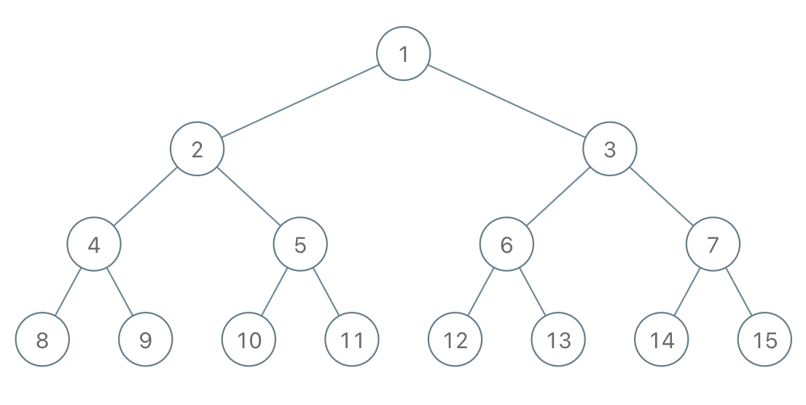

假设父节点的编号是 `x`，左子节点就是 `2 * x`，右子节点就是 `2 * x + 1`。

```java
// 层序遍历思路
class Solution {
    // 记录节点和对应编号
    class Pair {
        TreeNode node;
        int id;

        public Pair( TreeNode node, int id) {
            this.node = node;
            this.id = id;
        }
    }

    public int widthOfBinaryTree(TreeNode root) {
        if (root == null) {
            return 0;
        }
        // 记录最大的宽度
        int maxWidth = 0;
        // 标准 BFS 层序遍历算法
        Queue<Pair> q = new LinkedList<>();
        q.offer(new Pair(root, 1));
        // 从上到下遍历整棵树
        while (!q.isEmpty()) {
            int sz = q.size();
            int start = 0, end = 0;
            // 从左到右遍历每一行
            for (int i = 0; i < sz; i++) {
                Pair cur = q.poll();
                TreeNode curNode = cur.node;
                int curId = cur.id;
                // 记录当前行第一个和最后一个节点的编号
                if (i == 0) {
                    start = curId;
                }
                if (i == sz - 1) {
                    end = curId;
                }
                // 左右子节点入队，同时记录对应节点的编号
                if (curNode.left != null) {
                    q.offer(new Pair(curNode.left, curId * 2));
                }
                if (curNode.right != null) {
                    q.offer(new Pair(curNode.right, curId * 2 + 1));
                }
            }
            // 用当前行的宽度更新最大宽度
            maxWidth = Math.max(maxWidth, end - start + 1);
        }

        return maxWidth;
    }
}

// 递归遍历思路
class Solution2 {
    public int widthOfBinaryTree(TreeNode root) {
        if (root == null) {
            return 0;
        }
        traverse(root, 1, 1);
        return maxWidth;
    }
    // 记录最左侧节点的编号
    ArrayList<Integer> firstId = new ArrayList<>();
    int maxWidth = 1;

    // 二叉树遍历函数
    void traverse(TreeNode root, int id, int depth) {
        if (root == null) {
            return;
        }

        if (firstId.size() == depth - 1) {
            // 因为代码是先 traverse(root.left) 后 traverse(root.right)，
            // 所以第一次到达这个深度一定是最左侧的节点，记录其编号
            firstId.add(id);
        } else {
            // 这个深度的其他节点，负责计算更新当前深度的最大宽度
            maxWidth = Math.max(maxWidth, id - firstId.get(depth - 1) + 1);
        }

        traverse(root.left, id * 2, depth + 1);
        traverse(root.right, id * 2 + 1, depth + 1);
    }
}
```

##### 在每个树行中找最大值

https://leetcode.cn/problems/find-largest-value-in-each-tree-row/

```java
class Solution {
    public List<Integer> largestValues(TreeNode root) {
        List<Integer> res = new LinkedList<>();
        if (root == null) {
            return res;
        }

        Queue<TreeNode> q = new LinkedList<>();
        q.offer(root);
        // while 循环控制从上向下一层层遍历
        while (!q.isEmpty()) {
            int sz = q.size();
            // 记录这一层的最大值
            int levelMax = Integer.MIN_VALUE;
            // for 循环控制每一层从左向右遍历
            for (int i = 0; i < sz; i++) {
                TreeNode cur = q.poll();
                levelMax = Math.max(levelMax, cur.val);
                if (cur.left != null)
                    q.offer(cur.left);
                if (cur.right != null)
                    q.offer(cur.right);
            }
            res.add(levelMax);
        }
        return res;
    }
}

class Solution_DFS {
    // 一定要用 array 存储，因为要用索引随机访问
    ArrayList<Integer> res = new ArrayList<>();

    public List<Integer> largestValues(TreeNode root) {
        if (root == null) {
            return res;
        }
        traverse(root, 0);
        return res;
    }

    // 遍历二叉树
    void traverse(TreeNode root, int depth) {
        if (root == null) {
            return;
        }
        if (res.size() <= depth) {
            res.add(root.val);
        } else {
            // 记录当前行的最大值
            res.set(depth, Math.max(res.get(depth), root.val));
        }
        traverse(root.left, depth + 1);
        traverse(root.right, depth + 1);
    }
}
```


##### 二叉树的层平均值

https://leetcode.cn/problems/average-of-levels-in-binary-tree/

```java
class Solution {
    public List<Double> averageOfLevels(TreeNode root) {
        List<Double> res = new LinkedList<>();
        if (root == null) return res;

        Queue<TreeNode> q = new LinkedList<>();
        q.offer(root);
        while (!q.isEmpty()) {
            int size = q.size();
            // 记录当前层所有节点之和
            double sum = 0;
            for (int i = 0; i < size; i++) {
                TreeNode cur = q.poll();
                if (cur.left != null) {
                    q.offer(cur.left);
                }
                if (cur.right != null) {
                    q.offer(cur.right);
                }
                sum += cur.val;
            }
            // 记录当前行的平均值
            res.add(1.0 * sum / size);
        }

        return res;
    }
}
```


##### 二叉树的完全性检验

这题的关键是对完全二叉树特性的理解，**如果按照 BFS 层序遍历的方式遍历完全二叉树，队列最后留下的应该都是空指针**：

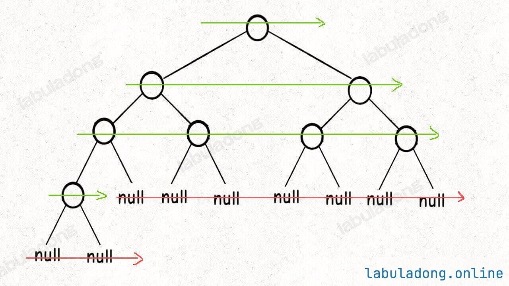

```java
class Solution {
    public boolean isCompleteTree(TreeNode root) {
        Queue<TreeNode> q = new LinkedList<>();
        q.offer(root);
        // 遍历完所有非空节点时变成 true
        boolean end = false;
        // while 循环控制从上向下一层层遍历
        while (!q.isEmpty()) {
            int sz = q.size();
            // for 循环控制每一层从左向右遍历
            for (int i = 0; i < sz; i++) {
                TreeNode cur = q.poll();
                if (cur == null) {
                    // 第一次遇到 null 时 end 变成 true
                    // 如果之后的所有节点都是 null，则说明是完全二叉树
                    end = true;
                } else {
                    if (end) {
                        // end 为 true 时遇到非空节点说明不是完全二叉树
                        return false;
                    }
                    // 将下一层节点放入队列，不用判断是否非空
                    q.offer(cur.left);
                    q.offer(cur.right);
                }
            }
        }
        return true;
    }
}
```


##### 最大层内元素和

```java
class Solution {
    public int maxLevelSum(TreeNode root) {
        if (root == null) return 0;
        Queue<TreeNode> q = new LinkedList<>();
        q.offer(root);
        // 记录 BFS 走到的层数
        int depth = 1;
        // 记录元素和最大的那一行和最大元素和
        int res = 0, maxSum = Integer.MIN_VALUE;

        while (!q.isEmpty()) {
            int sz = q.size();
            int levelSum = 0;
            // 遍历这一层
            for (int i = 0; i < sz; i++) {
                TreeNode cur = q.poll();
                levelSum += cur.val;

                if (cur.left != null)
                    q.offer(cur.left);
                if (cur.right != null)
                    q.offer(cur.right);
            }
            if (levelSum > maxSum) {
                // 更新最大元素和
                res = depth;
                maxSum = levelSum;
            }
            depth++;
        }
        return res;
    }
}
```


##### 层数最深叶子节点的和

https://leetcode.cn/problems/deepest-leaves-sum/

```java
class Solution {
    public int deepestLeavesSum(TreeNode root) {
        if (root == null) return 0;
        Queue<TreeNode> q = new LinkedList<>();
        q.offer(root);

        int sum = 0;
        while (!q.isEmpty()) {
            sum = 0;
            int sz = q.size();
            for (int i = 0; i < sz; i++) {
                TreeNode cur = q.poll();
                // 累加一层的节点之和
                sum += cur.val;
                if (cur.left != null)
                    q.offer(cur.left);
                if (cur.right != null)
                    q.offer(cur.right);
            }
        }
        // 现在就是最后一层的节点值和
        return sum;
    }
}
```

##### 奇偶树

https://leetcode.cn/problems/even-odd-tree/

```java
class Solution {
    public boolean isEvenOddTree(TreeNode root) {
        if (root == null) {
            return true;
        }

        Queue<TreeNode> q = new LinkedList<>();
        q.offer(root);
        // 记录奇偶层数
        boolean even = true;
        // while 循环控制从上向下一层层遍历
        while (!q.isEmpty()) {
            int sz = q.size();
            // 记录前一个节点，便于判断是否递增/递减
            int prev = even ? Integer.MIN_VALUE : Integer.MAX_VALUE;
            // for 循环控制每一层从左向右遍历
            for (int i = 0; i < sz; i++) {
                TreeNode cur = q.poll();
                if (even) {
                    // 偶数层
                    if (prev >= cur.val || cur.val % 2 == 0) {
                        return false;
                    }
                } else {
                    // 奇数层
                    if (prev <= cur.val || cur.val % 2 == 1) {
                        return false;
                    }
                }
                prev = cur.val;

                if (cur.left != null) {
                    q.offer(cur.left);
                }
                if (cur.right != null) {
                    q.offer(cur.right);
                }
            }
            // 奇偶层数切换
            even = !even;
        }
        return true;
    }
}
```

##### 完全二叉树插入器

https://leetcode.cn/problems/complete-binary-tree-inserter/

```java
class CBTInserter {
    // 这个队列只记录完全二叉树底部可以进行插入的节点
    private Queue<TreeNode> q = new LinkedList<>();
    private TreeNode root;

    public CBTInserter(TreeNode root) {
        this.root = root;
        // 进行普通的 BFS，目的是找到底部可插入的节点
        Queue<TreeNode> temp = new LinkedList<>();
        temp.offer(root);
        while (!temp.isEmpty()) {
            TreeNode cur = temp.poll();
            if (cur.left != null) {
                temp.offer(cur.left);
            }
            if (cur.right != null) {
                temp.offer(cur.right);
            }
            if (cur.right == null || cur.left == null) {
                // 找到完全二叉树底部可以进行插入的节点
                q.offer(cur);
            }
        }
    }

    public int insert(int val) {
        TreeNode node = new TreeNode(val);
        TreeNode cur = q.peek();
        // 进行插入
        if (cur.left == null) {
            cur.left = node;
        } else if (cur.right == null) {
            cur.right = node;
            q.poll();
        }
        // 新节点的左右节点也是可以插入的
        q.offer(node);
        return cur.val;
    }

    public TreeNode get_root() {
        return root;
    }
}
```


##### 叶子相似的树

https://leetcode.cn/problems/leaf-similar-trees/

```java
class Solution {
    public boolean leafSimilar(TreeNode root1, TreeNode root2) {
        LeafIterator it1 = new LeafIterator(root1);
        LeafIterator it2 = new LeafIterator(root2);
        // 逐一对比叶子节点
        while (it1.hasNext() && it2.hasNext()) {
            if (it1.next().val != it2.next().val) {
                return false;
            }
        }
        // 最后应该都完成遍历
        return !it1.hasNext() && !it2.hasNext();
    }
}

// 一个生成二叉树叶子节点的迭代器
class LeafIterator {
    // 模拟递归过程
    private Stack<TreeNode> stk = new Stack<>();

    public LeafIterator(TreeNode root) {
        stk.push(root);
    }

    public boolean hasNext() {
        return !stk.isEmpty();
    }

    public TreeNode next() {
        while (!stk.isEmpty()) {
            TreeNode cur = stk.pop();
            if (cur.left == null && cur.right == null) {
                // 发现一个叶子结点
                return cur;
            }
            // 先入栈 root.right
            if (cur.right != null) {
                stk.push(cur.right);
            }
            if (cur.left != null) {
                stk.push(cur.left);
            }
        }
        return null;
    }
}
```


##### 二叉树中所有距离为 K 的结点

https://leetcode.cn/problems/all-nodes-distance-k-in-binary-tree/


```java
class Solution {
    // 记录父节点：node.val -> parentNode
    // 题目说了树中所有节点值都是唯一的，所以可以用 node.val 代表 TreeNode
    HashMap<Integer, TreeNode> parent = new HashMap<>();

    public List<Integer> distanceK(TreeNode root, TreeNode target, int k) {
        // 遍历所有节点，记录每个节点的父节点
        traverse(root, null);

        // 开始从 target 节点施放 BFS 算法，找到距离为 k 的节点
        Queue<TreeNode> q = new LinkedList<>();
        HashSet<Integer> visited = new HashSet<>();
        q.offer(target);
        visited.add(target.val);
        // 记录离 target 的距离
        int dist = 0;
        List<Integer> res = new LinkedList<>();

        while (!q.isEmpty()) {
            int sz = q.size();
            for (int i = 0; i < sz; i++) {
                TreeNode cur = q.poll();
                if (dist == k) {
                    // 找到距离起点 target 距离为 k 的节点
                    res.add(cur.val);
                }
                // 向父节点、左右子节点扩散
                TreeNode parentNode = parent.get(cur.val);
                if (parentNode != null && !visited.contains(parentNode.val)) {
                    visited.add(parentNode.val);
                    q.offer(parentNode);
                }
                if (cur.left != null && !visited.contains(cur.left.val)) {
                    visited.add(cur.left.val);
                    q.offer(cur.left);
                }
                if (cur.right != null && !visited.contains(cur.right.val)) {
                    visited.add(cur.right.val);
                    q.offer(cur.right);
                }
            }
            // 向外扩展一圈
            dist++;
        }

        return res;
    }

    private void traverse(TreeNode root, TreeNode parentNode) {
        if (root == null) {
            return;
        }
        parent.put(root.val, parentNode);
        // 二叉树递归框架
        traverse(root.left, root);
        traverse(root.right, root);
    }
}
```


### 二叉搜索树BST

- 对于 BST 的每一个节点 `node`，左子树节点的值都比 `node` 的值要小，右子树节点的值都比 `node` 的值大。
- 对于 BST 的每一个节点 `node`，它的左侧子树和右侧子树都是 BST。
- BST的中序遍历是一个升序遍历，也可以通过先遍历右子树来形成一个降序遍历。


#### TreeMap

```java
import java.util.LinkedList;
import java.util.NoSuchElementException;

public class MyTreeMap<K extends Comparable<K>, V> {

    private class TreeNode {
        K key;
        V val;
        TreeNode left, right;
        // 记录，以该节点为根的 BST 有多少个节点
        int size;

        TreeNode(K key, V val) {
            this.key = key;
            this.val = val;
            this.size = 1;
            left = right = null;
        }
    }

    private TreeNode root = null;

    public MyTreeMap() {
    }

    // **** 增/改 ****

    // 添加 key -> val 键值对，如果键 key 已存在，则将值修改为 val
    public V put(K key, V val) {
        if (key == null) {
            throw new IllegalArgumentException("key is null");
        }

        V oldVal = get(key);

        root = put(root, key, val);

        return oldVal;
    }

    private TreeNode put(TreeNode node, K key, V val) {
        if (node == null) {
            // 找不到 key（不存在）
            return new TreeNode(key, val);
        }
        int cmp = node.key.compareTo(key);

        if (cmp > 0) {
            // node.key > key，去左子树搜索 key
            node.left = put(node.left, key, val);
        } else if (cmp < 0) {
            // node.key < key
            node.right = put(node.right, key, val);
        } else {
            // node.key == key，找到了
            node.val = val;
        }

        // 维护每个节点的 size 变量
        node.size = size(node.left) + size(node.right) + 1;

        return node;
    }

    // **** 删 ****

    // 删除 key 并返回对应的 val
    public V remove(K key) {
        if (key == null) {
            throw new IllegalArgumentException("key is null");
        }
        if (!containsKey(key)) {
            return null;
        }

        V deletedVal = get(key);
        root = remove(root, key);

        return deletedVal;
    }

    private TreeNode remove(TreeNode node, K key) {
        int cmp = node.key.compareTo(key);
        if (cmp > 0) {
            // node.key > key，去左子树找
            node.left = remove(node.left, key);
        } else if (cmp < 0) {
            // node.key < key，去右子树找
            node.right = remove(node.right, key);
        } else {
            // node.key == key，找到了 key，进行删除

            // 1. node 是叶子节点，左右子树都是 null
            // 2. node 左右子树有一个非空
            if (node.left == null) {
                return node.right;
            }
            if (node.right == null) {
                return node.left;
            }

            // 3. node 左右子树都是非空的
            // 3.1 得到左子树最大的那个节点的指针 leftMax
            TreeNode leftMax = maxNode(node.left);
            // 3.2 删除左子树最大的那个节点
            node.left = removeMax(node.left);
            // 3.3 用 leftMax 替换 node
            leftMax.left = node.left;
            leftMax.right = node.right;
            node = leftMax;
        }

        // 维护每个节点的 size 变量
        node.size = size(node.left) + size(node.right) + 1;
        return node;
    }

    // 删除并返回 BST 中最小的那个 key
    public void removeMin() {
        if (isEmpty()) {
            throw new NoSuchElementException();
        }
        root = removeMin(root);
    }

    // 删除并返回以 node 为根的 BST 中最小的那个节点
    private TreeNode removeMin(TreeNode node) {
        if (node.left == null) {
            // 已经走到最左边的 TreeNode
            return node.right;
        }
        node.left = removeMin(node.left);

        // 维护每个节点的 size 变量
        node.size = size(node.left) + size(node.right) + 1;

        return node;
    }

    // 删除并返回 BST 中最大的那个 key
    public void removeMax() {
        if (isEmpty()) {
            throw new NoSuchElementException();
        }
        root = removeMax(root);
    }

    // 删除并返回以 node 为根的 BST 中最大的那个节点
    private TreeNode removeMax(TreeNode node) {
        if (node.right == null) {
            // 已经走到最右边的 TreeNode
            return node.left;
        }
        node.right = removeMax(node.right);

        // 维护每个节点的 size 变量
        node.size = size(node.left) + size(node.right) + 1;

        return node;
    }

    // **** 查 ****

    // 返回 key 对应的 val，如果 key 不存在，则返回 null
    public V get(K key) {
        if (key == null) {
            throw new IllegalArgumentException("key is null");
        }

        TreeNode x = get(root, key);
        if (x == null) {
            // key 不存在
            return null;
        }

        return x.val;
    }

    // 在以 node 为根的 BST 中查找 key
    private TreeNode get(TreeNode node, K key) {
        if (node == null) {
            // key 不存在
            return null;
        }

        int cmp = node.key.compareTo(key);

        // node.key > key
        if (cmp > 0) {
            return get(node.left, key);
        }

        // node.key < key
        if (cmp < 0) {
            return get(node.right, key);
        }

        // node.key == key
        return node;
    }

    // 返回小于等于 key 的最大的键
    public K floorKey(K key) {
        if (key == null) {
            throw new IllegalArgumentException("key is null");
        }
        if (isEmpty()) {
            throw new NoSuchElementException();
        }

        TreeNode x = floorKey(root, key);
        return x.key;
    }

    private TreeNode floorKey(TreeNode node, K key) {
        if (node == null) {
            // key 不存在
            return null;
        }

        int cmp = node.key.compareTo(key);

        // node.key > key，去左子树找
        if (cmp > 0) {
            return floorKey(node.left, key);
        }

        // node.key < key，去右子树找
        if (cmp < 0) {
            TreeNode x = floorKey(node.right, key);
            if (x == null) {
                return node;
            }
            return x;
        }

        // node.key == key
        return node;
    }

    // 返回大于等于 key 的最小的键
    public K ceilingKey(K key) {
        if (key == null) {
            throw new IllegalArgumentException("key is null");
        }
        if (isEmpty()) {
            throw new NoSuchElementException();
        }

        TreeNode x = ceilingKey(root, key);
        return x.key;
    }

    private TreeNode ceilingKey(TreeNode node, K key) {
        if (node == null) {
            // key 不存在
            return null;
        }

        int cmp = node.key.compareTo(key);

        // node.key > key，去左子树找
        if (cmp > 0) {
            TreeNode x = ceilingKey(node.left, key);
            if (x == null) {
                return node;
            }
            return x;
        }

        // node.key < key，去右子树找
        if (cmp < 0) {
            return ceilingKey(node.right, key);
        }

        // node.key == key
        return node;
    }

    // 返回小于 key 的键的个数
    public int rank(K key) {
        if (key == null) {
            throw new IllegalArgumentException();
        }

        return rank(root, key);
    }

    // 返回以 node 为根的 BST 中小于 key 的键的个数
    private int rank(TreeNode node, K key) {
        if (node == null) {
            return 0;
        }
        int cmp = key.compareTo(node.key);

        if (cmp < 0) {
            // key < node.key
            // 和 node 以及 node.right 没啥关系了
            // 因为它们太大了
            return rank(node.left, key);
        } else if (cmp > 0) {
            // key > node.key
            // node 和 node.left 左子树都是比 key 小的
            return size(node.left) + 1 + rank(node.right, key);
        } else {
            // key == node.key
            return size(node.left);
        }
    }

    // 返回索引为 i 的键，i 从 0 开始计算
    public K select(int i) {
        if (i < 0 || i >= size()) {
            throw new IllegalArgumentException();
        }

        TreeNode x = select(root, i);
        return x.key;
    }

    // 返回以 node 为根的 BST 中索引为 i 的那个节点
    private TreeNode select(TreeNode node, int i) {
        int n = size(node.left);

        if (n > i) {
            // n == 10, i == 3
            return select(node.left, i);
        } else if (n < i) {
            // n == 3, i == 10
            return select(node.right, i - n - 1);
        } else {
            // i == n
            // node 就是索引为 i 的那个节点
            return node;
        }
    }

    // 返回 BST 中最大的键
    public K maxKey() {
        if (isEmpty()) {
            throw new NoSuchElementException();
        }
        TreeNode p = maxNode(root);
        return p.key;
    }

    private TreeNode maxNode(TreeNode p) {
        while (p.right != null) {
            p = p.right;
        }
        return p;
    }

    // 返回 BST 中最小的键
    public K minKey() {
        if (isEmpty()) {
            throw new NoSuchElementException();
        }

        TreeNode p = minNode(root);
        return p.key;
    }

    private TreeNode minNode(TreeNode p) {
        while (p.left != null) {
            p = p.left;
        }
        return p;
    }

    // 判断 key 是否存在 Map 中
    public boolean containsKey(K key) {
        if (key == null) {
            throw new IllegalArgumentException("key is null");
        }

        return get(root, key) != null;
    }

    // **** 工具函数 ****

    // 从小到大返回所有键
    public Iterable<K> keys() {
        if (isEmpty()) {
            return new LinkedList<>();
        }
        LinkedList<K> list = new LinkedList<>();
        traverse(root, list);
        return list;
    }

    // 中序遍历 BST
    private void traverse(TreeNode node, LinkedList<K> list) {
        if (node == null) {
            return;
        }
        traverse(node.left, list);
        // 中序遍历
        list.addLast(node.key);
        traverse(node.right, list);
    }

    // 从小到大返回闭区间 [min, max] 中的键
    public Iterable<K> keys(K min, K max) {
        if (min == null) throw new IllegalArgumentException("min is null");
        if (max == null) throw new IllegalArgumentException("max is null");

        LinkedList<K> list = new LinkedList<>();
        traverse(root, list, min, max);
        return list;
    }

    // 中序遍历 BST
    private void traverse(TreeNode node, LinkedList<K> list, K min, K max) {
        if (node == null) {
            return;
        }

        int cmpMin = min.compareTo(node.key);
        int cmpMax = max.compareTo(node.key);

        if (cmpMin < 0) {
            // min < node.key
            traverse(node.left, list, min, max);
        }

        // 中序遍历 min <= node.key <= max
        if (cmpMin <= 0 && cmpMax >= 0) {
            list.addLast(node.key);
        }

        if (cmpMax > 0) {
            // max > node.key
            traverse(node.right, list, min, max);
        }
    }

    public int size() {
        return size(root);
    }

    // 返回以 node 节点为根的 BST 有多少节点
    private int size(TreeNode node) {
        if (node == null) {
            return 0;
        }
        return node.size;
    }

    public boolean isEmpty() {
        return size() == 0;
    }

}
```


#### 二叉搜索树中第K小的元素

https://leetcode.cn/problems/kth-smallest-element-in-a-bst/


**优化思路**

**每个节点需要记录，以自己为根的这棵二叉树有多少个节点**。

比如说你让我查找排名为 `k` 的元素，当前节点知道自己排名第 `m`，那么我可以比较 `m` 和 `k` 的大小：

1、如果 `m == k`，显然就是找到了第 `k` 个元素，返回当前节点就行了。

2、如果 `k < m`，那说明排名第 `k` 的元素在左子树，所以可以去左子树搜索第 `k` 个元素。

3、如果 `k > m`，那说明排名第 `k` 的元素在右子树，所以可以去右子树搜索第 `k - m - 1` 个元素。

```java
class Solution {
    int kthSmallest(TreeNode root, int k) {
        // 利用 BST 的中序遍历特性
        traverse(root, k);
        return res;
    }

    // 记录结果
    int res = 0;
    // 记录当前元素的排名
    int rank = 0;
    void traverse(TreeNode root, int k) {
        if (root == null) {
            return;
        }
        traverse(root.left, k);

        // 中序代码位置
        rank++;
        if (k == rank) {
            // 找到第 k 小的元素
            res = root.val;
            return;
        }

        traverse(root.right, k);
    }
}
```


#### 把二叉搜索树转换为累加树

https://leetcode.cn/problems/convert-bst-to-greater-tree/

BST的中序遍历是一个升序遍历，也可以通过先遍历右子树来形成一个降序遍历。


```java
class Solution {
    TreeNode convertBST(TreeNode root) {
        traverse(root);
        return root;
    }

    // 记录累加和
    int sum = 0;
    void traverse(TreeNode root) {
        if (root == null) {
            return;
        }
        traverse(root.right);
        // 维护累加和
        sum += root.val;
        // 将 BST 转化成累加树
        root.val = sum;
        traverse(root.left);
    }
}
```

#### 验证二叉搜索树

https://leetcode.cn/problems/validate-binary-search-tree/

**根据 BST 的定义，`root` 的整个左子树都要小于 `root.val`，整个右子树都要大于 `root.val`**。

```java
class Solution {
    public boolean isValidBST(TreeNode root) {
        return _isValidBST(root, null, null);
    }

    // 定义：该函数返回 root 为根的子树的所有节点是否满足 max.val > root.val > min.val
    public boolean _isValidBST(TreeNode root, TreeNode min, TreeNode max) {
        // base case
        if (root == null) return true;
        // 若 root.val 不符合 max 和 min 的限制，说明不是合法 BST
        if (min != null && root.val <= min.val) return false;
        if (max != null && root.val >= max.val) return false;
        // 根据定义，限定左子树的最大值是 root.val，右子树的最小值是 root.val
        return _isValidBST(root.left, min, root) 
            && _isValidBST(root.right, root, max);
    }
}
```


#### 二叉搜索树中的搜索

https://leetcode.cn/problems/search-in-a-binary-search-tree/

```java
TreeNode searchBST(TreeNode root, int target) {
    if (root == null) {
        return null;
    }
    // 去左子树搜索
    if (root.val > target) {
        return searchBST(root.left, target);
    }
    // 去右子树搜索
    if (root.val < target) {
        return searchBST(root.right, target);
    }
    // 当前节点就是目标值
    return root;
}
```


#### 二叉搜索树中的插入操作

https://leetcode.cn/problems/insert-into-a-binary-search-tree/


```java
class Solution {
    public TreeNode insertIntoBST(TreeNode root, int val) {
        if (root == null) {
            return new TreeNode(val);
        }
        if (root.val > val) {
            root.left = insertIntoBST(root.left, val);
        } else {
            root.right = insertIntoBST(root.right, val);
        }
        return root;
    }
}
```


#### 删除二叉搜索树中的节点

https://leetcode.cn/problems/delete-node-in-a-bst/


```java
class Solution {
    public TreeNode deleteNode(TreeNode root, int key) {
        if (root == null) {
            return null;
        }
        //找到对应的节点后 将左子树整个加到右子树的最左子节点的左侧
        if (root.val == key) {
            TreeNode newRoot;
            TreeNode left = root.left;
            TreeNode right = root.right;
            TreeNode p = right;
            while (p != null && p.left != null) {
                p = p.left;
            }
            if (right == null) {
                newRoot = left;
            } else {
                p.left = left;
                newRoot = right;
            }
            return newRoot;
        } else if (root.val > key) {
            root.left = deleteNode(root.left, key);
        } else {
            root.right = deleteNode(root.right, key);
        }
        return root;
    }
}
```


#### 不同的二叉搜索树

https://leetcode.cn/problems/unique-binary-search-trees/description/

```java
class Solution {
    // 主函数
    public int numTrees(int n) {
        // 计算闭区间 [1, n] 组成的 BST 个数
        return count(1, n);
    }

    // 计算闭区间 [lo, hi] 组成的 BST 个数
    int count(int lo, int hi) {
        // base case
        if (lo > hi) return 1;

        int res = 0;
        for (int i = lo; i <= hi; i++) {
            // i 的值作为根节点 root
            int left = count(lo, i - 1);
            int right = count(i + 1, hi);
            // 左右子树的组合数乘积是 BST 的总数
            res += left * right;
        }
        
        return res;
    }
}
```


#### 不同的二叉搜索树 II

https://leetcode.cn/problems/unique-binary-search-trees-ii/description/

1、穷举 `root` 节点的所有可能。

2、递归构造出左右子树的所有有效 BST。

3、给 `root` 节点穷举所有左右子树的组合。

```java
class Solution {
    // 主函数
    public List<TreeNode> generateTrees(int n) {
        if (n == 0) return new LinkedList<>();
        // 构造闭区间 [1, n] 组成的 BST 
        return build(1, n);
    }

    // 构造闭区间 [lo, hi] 组成的 BST
    List<TreeNode> build(int lo, int hi) {
        List<TreeNode> res = new LinkedList<>();
        // base case
        if (lo > hi) {
            // 这里需要装一个 null 元素，这样才能让下面的两个内层 for 循环都能进入，正确地创建出叶子节点
            // 举例来说吧，什么时候会进到这个 if 语句？当你创建叶子节点的时候，对吧。
            // 那么如果你这里不加 null，直接返回空列表，那么下面的内层两个 for 循环都无法进入
            // 你的那个叶子节点就没有创建出来，看到了吗？所以这里要加一个 null，确保下面能把叶子节点做出来
            res.add(null);
            return res;
        }

        // 1、穷举 root 节点的所有可能。
        for (int i = lo; i <= hi; i++) {
            // 2、递归构造出左右子树的所有有效 BST。
            List<TreeNode> leftTree = build(lo, i - 1);
            List<TreeNode> rightTree = build(i + 1, hi);
            // 3、给 root 节点穷举所有左右子树的组合。
            for (TreeNode left : leftTree) {
                for (TreeNode right : rightTree) {
                    // i 作为根节点 root 的值
                    TreeNode root = new TreeNode(i);
                    root.left = left;
                    root.right = right;
                    res.add(root);
                }
            }
        }
        
        return res;
    }
}
```


#### 二叉搜索子树的最大键值和

输入的是一棵普通二叉树，有没有可能其中不存在 BST？

不会的，因为按照 BST 的定义，任何一个单独的节点肯定是 BST，也就是说，再不济，**二叉树最下面的叶子节点肯定都是 BST**。

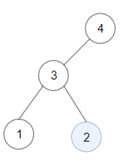

1、我肯定得知道左右子树是不是合法的 BST，如果下面的这俩儿子有一个不是 BST，以我为根的这棵树肯定不会是 BST，对吧。

2、如果左右子树都是合法的 BST，我得瞅瞅左右子树加上自己还是不是合法的 BST 了。因为按照 BST 的定义，当前节点的值应该大于左子树的最大值，小于右子树的最小值，否则就破坏了 BST 的性质。

3、因为题目要计算最大的节点之和，如果左右子树加上我自己还是一棵合法的 BST，也就是说以我为根的整棵树是一棵 BST，那我需要知道我们这棵 BST 的所有节点值之和是多少，方便和别的 BST 争个高下，对吧。


- 判断左右子树是否是BST
- 如果左右子树都是BST，那么自己**节点的值应该大于左子树的最大值，小于右子树的最小值**才是一颗BST
- 如果我是一颗BST，计算节点和


```java
class Solution {
    // 记录 BST 最大节点之和
    int maxSum = 0;

    public int maxSumBST(TreeNode root) {
        findMaxMinSum(root);
        return maxSum;
    }

    //`res[0]` 记录以 `root` 为根的二叉树是否是 BST，若为 1 则说明是 BST，若为 0 则说明不是 BST；
	//`res[1]` 记录以 `root` 为根的二叉树所有节点中的最小值；
	//`res[2]` 记录以 `root` 为根的二叉树所有节点中的最大值；
	//`res[3]` 记录以 `root` 为根的二叉树所有节点值之和。
    // 计算以 root 为根的二叉树的最大值、最小值、节点和
    int[] findMaxMinSum(TreeNode root) {
        // base case
        if (root == null) {
            return new int[] {
                1, Integer.MAX_VALUE, Integer.MIN_VALUE, 0
            };
        }
        
        // 递归计算左右子树
        int[] left = findMaxMinSum(root.left);
        int[] right = findMaxMinSum(root.right);

        // ******* 后序遍历位置 *******
        // 通过 left 和 right 推导返回值
        // 并且正确更新 maxSum 变量
        int[] res = new int[4];
        // 这个 if 在判断以 root 为根的二叉树是不是 BST
        if (left[0] == 1 && right[0] == 1 &&
            root.val > left[2] && root.val < right[1]) {
            // 以 root 为根的二叉树是 BST
            res[0] = 1;
            // 计算以 root 为根的这棵 BST 的最小值
            res[1] = Math.min(left[1], root.val);
            // 计算以 root 为根的这棵 BST 的最大值
            res[2] = Math.max(right[2], root.val);
            // 计算以 root 为根的这棵 BST 所有节点之和
            res[3] = left[3] + right[3] + root.val;
            // 更新全局变量
            maxSum = Math.max(maxSum, res[3]);
        } else {
            // 以 root 为根的二叉树不是 BST
            res[0] = 0;
            // 其他的值都没必要计算了，因为用不到
        }
        // ************************

        return res;
    }
}
```


### 最近公共祖先系列

#### 二叉树的最近公共祖先

https://leetcode.cn/problems/lowest-common-ancestor-of-a-binary-tree/

以每个节点作为根节点，去查看自己的左右子树中是否同时包含p和q，如果同时包含，那么当前这个节点就是p和q的最近公共祖先

```java
class Solution {
    public TreeNode lowestCommonAncestor(TreeNode root, TreeNode p, TreeNode q) {
        // base case
        if (root == null) return null;
        if (root == p || root == q) return root;

        TreeNode left = lowestCommonAncestor(root.left, p, q);
        TreeNode right = lowestCommonAncestor(root.right, p, q);
        // 情况 1
        if (left != null && right != null) {
            return root;
        }
        // 情况 2
        if (left == null && right == null) {
            return null;
        }
        // 情况 3
        return left == null ? right : left;
    }
}
```


#### 二叉树的最近公共祖先 IV

https://leetcode.cn/problems/lowest-common-ancestor-of-a-binary-tree-iv/

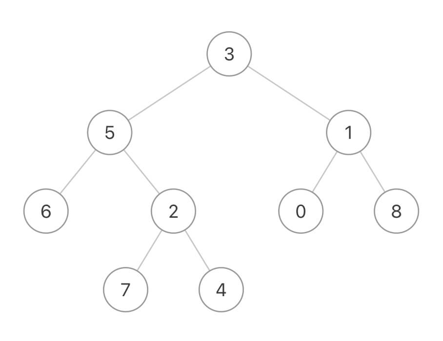

以每个节点作为根节点，去查看自己的左右子树中是否同时包含目标节点集合中的任意一个，如果同时包含，那么当前这个节点就是所有目标节点的最近公共祖先

```java
class Solution {
    public TreeNode lowestCommonAncestor(TreeNode root, TreeNode[] nodes) {
        HashSet<Integer> set = new HashSet<>();
        // 转化到集合中
        for (TreeNode node : nodes) {
            set.add(node.val);
        }
        return LCA(root, set);
    }

    private TreeNode LCA(TreeNode root, HashSet<Integer> set) {
        // base case
        if (root == null) return null;
        if (set.contains(root.val)) return root;

        TreeNode left = LCA(root.left, set);
        TreeNode right = LCA(root.right, set);
        // 情况 1
        if (left != null && right != null) {
            return root;
        }
        // 情况 2
        if (left == null && right == null) {
            return null;
        }
        // 情况 3
        return left == null ? right : left;
    }
}
```


#### 二叉树的最近公共祖先 II

https://leetcode.cn/problems/lowest-common-ancestor-of-a-binary-tree-ii/

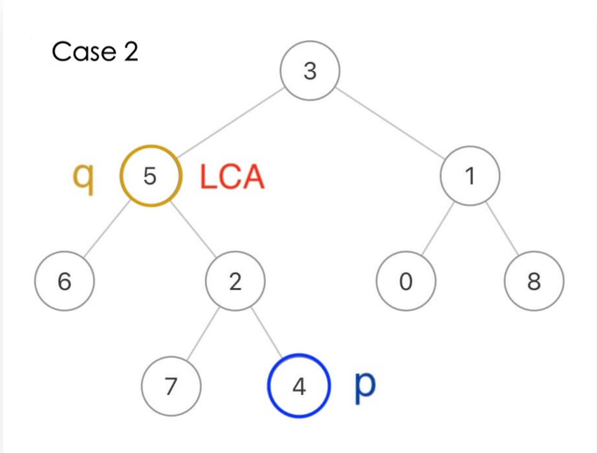

思路相同，以任意节点为根节点，查找左右子树中是否同时包含p和q，同时包含的情况下当前节点就是最近公共祖先，不同的是将当前节点的判断放到后序位置上，不会打断整棵树的遍历工作。

```java
class Solution {
    public TreeNode lowestCommonAncestor(TreeNode root, TreeNode p, TreeNode q) {
        TreeNode res = LCA(root, p, q);
        if (foundP && foundQ) {
            return res;
        }
        return null;
    }

    boolean foundP = false, foundQ = false;

    // 定义：输入一棵二叉树，返回这棵二叉树中 `p` 和 `q` 的最近公共祖先。
    TreeNode LCA(TreeNode root, TreeNode p, TreeNode q) {
        // base case
        if (root == null) return null;

        TreeNode left = LCA(root.left, p, q);
        TreeNode right = LCA(root.right, p, q);

        if (root == p || root == q) {
            if (root == p) foundP = true;
            if (root == q) foundQ = true;
            return root;
        }
        // 情况 1
        if (left != null && right != null) {
            return root;
        }
        // 情况 2
        if (left == null && right == null) {
            return null;
        }
        // 情况 3
        return left == null ? right : left;
    }
}
```

#### 二叉搜索树的最近公共祖先

https://leetcode.cn/problems/lowest-common-ancestor-of-a-binary-search-tree/

**但对于 BST 来说，根本不需要老老实实去遍历子树，由于 BST 左小右大的性质，将当前节点的值与 `val1` 和 `val2` 作对比即可判断当前节点是不是 `LCA`**：

假设 `val1 < val2`，那么 `val1 <= root.val <= val2` 则说明当前节点就是 `LCA`；若 `root.val` 比 `val1` 还小，则需要去值更大的右子树寻找 `LCA`；若 `root.val` 比 `val2` 还大，则需要去值更小的左子树寻找 `LCA`。

```java
class Solution {
    public TreeNode lowestCommonAncestor(TreeNode root, TreeNode p, TreeNode q) {
        if (root == null) return null;
        if (p.val > q.val) {
            // 保证 p.val <= q.val，便于后续情况讨论
            return lowestCommonAncestor(root, q, p);
        }
        if (root.val >= p.val && root.val <= q.val) {
            // p <= root <= q
            // 即 p 和 q 分别在 root 的左右子树，那么 root 就是 LCA
            return root;
        }
        if (root.val > q.val) {
            // p 和 q 都在 root 的左子树，那么 LCA 在左子树
            return lowestCommonAncestor(root.left, p, q);
        } else {
            // p 和 q 都在 root 的右子树，那么 LCA 在右子树
            return lowestCommonAncestor(root.right, p, q);
        }
    }
}
```


### 计算完全二叉树的节点数

#### 完全二叉树的节点个数

https://leetcode.cn/problems/count-complete-tree-nodes/

**一棵完全二叉树的两棵子树，至少有一棵是满二叉树**：

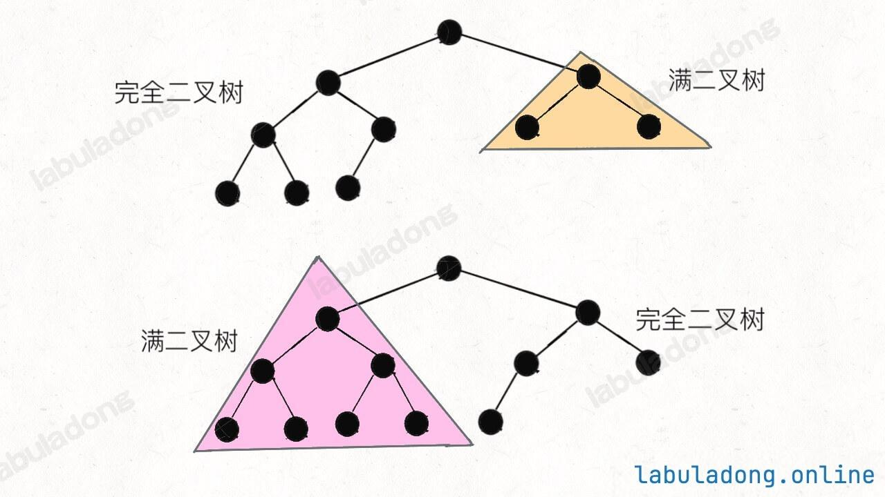

```java
class Solution {
    public int countNodes(TreeNode root) {
        TreeNode l = root, r = root;
        // 记录左、右子树的高度
        int hl = 0, hr = 0;
        while (l != null) {
            l = l.left;
            hl++;
        }
        while (r != null) {
            r = r.right;
            hr++;
        }
        // 如果左右子树的高度相同，则是一棵满二叉树
        if (hl == hr) {
            return (int) Math.pow(2, hl) - 1;
        }
        // 如果左右高度不同，则按照普通二叉树的逻辑计算
        return 1 + countNodes(root.left) + countNodes(root.right);
    }
}
```


### 惰性展开多叉树

#### 扁平化嵌套列表迭代器

嵌套列表即是一颗多叉树，遍历所有多叉树的叶子节点，将结果加入到集合中即可。

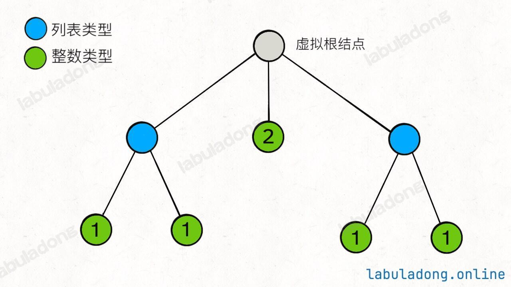

```java
class NestedIterator implements Iterator<Integer> {

    private Iterator<Integer> it;
    
    public NestedIterator(List<NestedInteger> nestedList) {
        // 存放将 nestedList 打平的结果
        List<Integer> result = new LinkedList<>();
        for (NestedInteger node : nestedList) {
            // 以每个节点为根遍历
            traverse(node, result);
        }
        // 得到 result 列表的迭代器
        this.it = result.iterator();
    }

    public Integer next() {
        return it.next();
    }

    public boolean hasNext() {
        return it.hasNext();
    }    
    
    // 遍历以 root 为根的多叉树，将叶子节点的值加入 result 列表
    private void traverse(NestedInteger root, List<Integer> result) {
        if (root.isInteger()) {
            // 到达叶子节点
            result.add(root.getInteger());
            return;
        }
        // 遍历框架
        for (NestedInteger child : root.getList()) {
            traverse(child, result);
        }
    }
}
```

一次性算出了所有叶子节点的值，全部装到 `result` 列表，也就是内存中，`next` 和 `hasNext` 方法只是在对 `result` 列表做迭代。如果输入的规模非常大，构造函数中的计算就会很慢，而且很占用内存。一般的迭代器求值应该是「惰性的」，也就是说，如果你要一个结果，我就算一个（或是一小部分）结果出来，而不是一次把所有结果都算出来。

**调用 `hasNext` 时，如果 `nestedList` 的第一个元素是列表类型，则不断展开这个元素，直到第一个元素是整数类型**。

```java
public class NestedIterator implements Iterator<Integer> {
    private LinkedList<NestedInteger> list;

    public NestedIterator(List<NestedInteger> nestedList) {
        // 不直接用 nestedList 的引用，是因为不能确定它的底层实现
        // 必须保证是 LinkedList，否则下面的 addFirst 会很低效
        list = new LinkedList<>(nestedList);
    }

    public Integer next() {
        // hasNext 方法保证了第一个元素一定是整数类型
        return list.remove(0).getInteger();
    }

    public boolean hasNext() {
        // 循环拆分列表元素，直到列表第一个元素是整数类型
        while (!list.isEmpty() && !list.get(0).isInteger()) {
            // 当列表开头第一个元素是列表类型时，进入循环
            List<NestedInteger> first = list.remove(0).getList();
            // 将第一个列表打平并按顺序添加到开头
            for (int i = first.size() - 1; i >= 0; i--) {
                list.addFirst(first.get(i));
            }
        }
        return !list.isEmpty();
    }
}
```


### 归并排序

#### 


### 快速排序

#### 排序数组

**快速排序是先将一个元素排好序，然后再将剩下的元素排好序**。

```java
class Quick {

    public static void sort(int[] nums) {
        // 为了避免出现耗时的极端情况，先随机打乱
        shuffle(nums);
        // 排序整个数组（原地修改）
        sort(nums, 0, nums.length - 1);
    }

    private static void sort(int[] nums, int lo, int hi) {
        if (lo >= hi) {
            return;
        }
        // 对 nums[lo..hi] 进行切分
        // 使得 nums[lo..p-1] <= nums[p] < nums[p+1..hi]
        int p = partition(nums, lo, hi);

        sort(nums, lo, p - 1);
        sort(nums, p + 1, hi);
    }

    // 对 nums[lo..hi] 进行切分
    private static int partition(int[] nums, int lo, int hi) {
        int pivot = nums[lo];
        // 关于区间的边界控制需格外小心，稍有不慎就会出错
        // 我这里把 i, j 定义为开区间，同时定义：
        // [lo, i) <= pivot；(j, hi] > pivot
        // 之后都要正确维护这个边界区间的定义
        int i = lo + 1, j = hi;
        // 当 i > j 时结束循环，以保证区间 [lo, hi] 都被覆盖
        while (i <= j) {
            while (i < hi && nums[i] <= pivot) {
                i++;
                // 此 while 结束时恰好 nums[i] > pivot
            }
            while (j > lo && nums[j] > pivot) {
                j--;
                // 此 while 结束时恰好 nums[j] <= pivot
            }

            if (i >= j) {
                break;
            }
            // 此时 [lo, i) <= pivot && (j, hi] > pivot
            // 交换 nums[j] 和 nums[i]
            swap(nums, i, j);
            // 此时 [lo, i] <= pivot && [j, hi] > pivot
        }
        // 最后将 pivot 放到合适的位置，即 pivot 左边元素较小，右边元素较大
        swap(nums, lo, j);
        return j;
    }

    // 洗牌算法，将输入的数组随机打乱
    private static void shuffle(int[] nums) {
        Random rand = new Random();
        int n = nums.length;
        for (int i = 0 ; i < n; i++) {
            // 生成 [i, n - 1] 的随机数
            int r = i + rand.nextInt(n - i);
            swap(nums, i, r);
        }
    }
    
    // 原地交换数组中的两个元素
    private static void swap(int[] nums, int i, int j) {
        int temp = nums[i];
        nums[i] = nums[j];
        nums[j] = temp;
    }
}
```

#### 数组中的第K个最大元素

```java
class Solution {
    public int findKthLargest(int[] nums, int k) {
        // 首先随机打乱数组
        shuffle(nums);
        int lo = 0, hi = nums.length - 1;
        // 转化成「排名第 k 的元素」
        k = nums.length - k;
        while (lo <= hi) {
            // 在 nums[lo..hi] 中选一个切分点
            int p = partition(nums, lo, hi);
            if (p < k) {
                // 第 k 大的元素在 nums[p+1..hi] 中
                lo = p + 1;
            } else if (p > k) {
                // 第 k 大的元素在 nums[lo..p-1] 中
                hi = p - 1;
            } else {
                // 找到第 k 大元素
                return nums[p];
            }
        }
        return -1;
    }

    // 对 nums[lo..hi] 进行切分
    private static int partition(int[] nums, int lo, int hi) {
        int pivot = nums[lo];
        // 关于区间的边界控制需格外小心，稍有不慎就会出错
        // 我这里把 i, j 定义为开区间，同时定义：
        // [lo, i) <= pivot；(j, hi] > pivot
        // 之后都要正确维护这个边界区间的定义
        int i = lo + 1, j = hi;
        // 当 i > j 时结束循环，以保证区间 [lo, hi] 都被覆盖
        while (i <= j) {
            while (i < hi && nums[i] <= pivot) {
                i++;
                // 此 while 结束时恰好 nums[i] > pivot
            }
            while (j > lo && nums[j] > pivot) {
                j--;
                // 此 while 结束时恰好 nums[j] <= pivot
            }

            if (i >= j) {
                break;
            }
            // 此时 [lo, i) <= pivot && (j, hi] > pivot
            // 交换 nums[j] 和 nums[i]
            swap(nums, i, j);
            // 此时 [lo, i] <= pivot && [j, hi] > pivot
        }
        // 最后将 pivot 放到合适的位置，即 pivot 左边元素较小，右边元素较大
        swap(nums, lo, j);
        return j;
    }

    // 洗牌算法，将输入的数组随机打乱
    private static void shuffle(int[] nums) {
        Random rand = new Random();
        int n = nums.length;
        for (int i = 0; i < n; i++) {
            // 生成 [i, n - 1] 的随机数
            int r = i + rand.nextInt(n - i);
            swap(nums, i, r);
        }
    }

    // 原地交换数组中的两个元素
    private static void swap(int[] nums, int i, int j) {
        int temp = nums[i];
        nums[i] = nums[j];
        nums[j] = temp;
    }
}
```

### 数据结构设计

#### LRU

```java
class LRUCache {

    LinkedHashMap<Integer, Integer> cache = new LinkedHashMap<>();
    int capacity;

    public LRUCache(int capacity) {
        this.capacity = capacity;
    }

    public int get(int key) {
        if (!cache.containsKey(key)) {
            return -1;
        }
        Integer value = cache.get(key);
        cache.remove(key);
        cache.put(key, value);
        return value;
    }

    public void put(int key, int value) {
        cache.remove(key);
        if (capacity <= cache.size()) {
            Map.Entry<Integer, Integer> head = cache.entrySet().iterator().next();
            cache.remove(head.getKey());
        }
        cache.put(key, value);
    }
}
```

#### LFU

```java
class LFUCache {

    int capacity;
    int minF = 0;
    HashMap<Integer, Integer> kv = new HashMap<>();
    HashMap<Integer, Integer> kf = new HashMap<>();
    HashMap<Integer, LinkedHashSet<Integer>> fk = new HashMap<>();

    public LFUCache(int capacity) {
        this.capacity = capacity;
    }

    public int get(int key) {
        if (kv.containsKey(key)) {
            incrF(key);
            return kv.get(key);
        }
        return -1;
    }

    private void incrF(int key) {
        Integer oldF = kf.get(key);
        kf.put(key, oldF + 1);
        fk.putIfAbsent(oldF + 1, new LinkedHashSet<>());
        fk.get(oldF + 1).add(key);

        fk.get(oldF).remove(key);
        if (fk.get(oldF).isEmpty()) {
            fk.remove(oldF);
            if (minF == oldF) {
                minF = oldF + 1;
            }
        }
    }

    public void put(int key, int value) {
        if (kv.containsKey(key)) {
            incrF(key);
            kv.put(key, value);
            return;
        }
        if (capacity <= kv.size()) {
            removeLastest();
        }
        kv.put(key, value);
        kf.put(key, 1);
        fk.putIfAbsent(1, new LinkedHashSet<>());
        fk.get(1).add(key);
        minF = 1;
    }

    private void removeLastest() {
        Integer removeKey = fk.get(minF).iterator().next();
        kv.remove(removeKey);
        kf.remove(removeKey);
        fk.get(minF).remove(removeKey);
        if (fk.get(minF).isEmpty()) {
            fk.remove(minF);
        }
    }
}
```

#### 常数时间删除/查找数组中的任意元素

##### O(1) 时间插入、删除和获取随机元素

```java
class RandomizedSet {
    // 存储元素的值
    private List<Integer> nums;
    // 记录每个元素对应在 nums 中的索引
    private Map<Integer, Integer> valToIndex;
    private Random rand;

    public RandomizedSet() {
        nums = new ArrayList<>();
        valToIndex = new HashMap<>();
        rand = new Random();
    }

    public boolean insert(int val) {
        // 若 val 已存在，不用再插入
        if (valToIndex.containsKey(val)) {
            return false;
        }
        // 若 val 不存在，插入到 nums 尾部，
        // 并记录 val 对应的索引值
        valToIndex.put(val, nums.size());
        nums.add(val);
        return true;
    }

    public boolean remove(int val) {
        // 若 val 不存在，不用再删除
        if (!valToIndex.containsKey(val)) {
            return false;
        }
        // 先拿到 val 的索引
        int index = valToIndex.get(val);
        int lastElement = nums.get(nums.size() - 1);
        // 将最后一个元素对应的索引修改为 index
        valToIndex.put(lastElement, index);
        // 交换 val 和最后一个元素
        nums.set(index, lastElement);
        // 在数组中删除元素 val
        nums.remove(nums.size() - 1);
        // 删除元素 val 对应的索引
        valToIndex.remove(val);
        return true;
    }

    public int getRandom() {
        // 随机获取 nums 中的一个元素
        return nums.get(rand.nextInt(nums.size()));
    }
}
```


##### 黑名单中的随机数

```java
class Solution {
    private int sz;
    private Map<Integer, Integer> mapping;
    private Random rand;

    public Solution(int N, int[] blacklist) {
        sz = N - blacklist.length;
        mapping = new HashMap<>();
        rand = new Random();

        for (int b : blacklist) {
            mapping.put(b, 666);
        }

        int last = N - 1;
        for (int b : blacklist) {
            // 如果 b 已经在区间 [sz, N)
            // 可以直接忽略
            if (b >= sz) {
                continue;
            }
            while (mapping.containsKey(last)) {
                last--;
            }
            mapping.put(b, last);
            last--;
        }
    }

    public int pick() {
        // 随机选取一个索引
        int index = rand.nextInt(sz);
        // 这个索引命中了黑名单，
        // 需要被映射到其他位置
        if (mapping.containsKey(index)) {
            return mapping.get(index);
        }
        // 若没命中黑名单，则直接返回
        return index;
    }
}
```


#### 优先级队列

##### 合并 K 个升序链表

```java
class Solution {
    public ListNode mergeKLists(ListNode[] lists) {
        if (lists.length == 0) return null;
        // 虚拟头结点
        ListNode dummy = new ListNode(-1);
        ListNode p = dummy;
        // 优先级队列，最小堆
        PriorityQueue<ListNode> pq = new PriorityQueue<>(
            lists.length, (a, b)->(a.val - b.val));
        // 将 k 个链表的头结点加入最小堆
        for (ListNode head : lists) {
            if (head != null)
                pq.add(head);
        }

        while (!pq.isEmpty()) {
            // 获取最小节点，接到结果链表中
            ListNode node = pq.poll();
            p.next = node;
            if (node.next != null) {
                pq.add(node.next);
            }
            // p 指针不断前进
            p = p.next;
        }
        return dummy.next;
    }
}
```

##### 查找和最小的 K 对数字

```java
class Solution {
    public List<List<Integer>> kSmallestPairs(int[] nums1, int[] nums2, int k) {
        // 存储三元组 (num1[i], nums2[i], i)
        // i 记录 nums2 元素的索引位置，用于生成下一个节点
        PriorityQueue<int[]> pq = new PriorityQueue<>((a, b) -> {
            // 按照数对的元素和升序排序
            return (a[0] + a[1]) - (b[0] + b[1]);
        });
        // 按照 23 题的逻辑初始化优先级队列
        for (int i = 0; i < nums1.length; i++) {
            pq.offer(new int[]{nums1[i], nums2[0], 0});
        }

        List<List<Integer>> res = new ArrayList<>();
        // 执行合并多个有序链表的逻辑
        while (!pq.isEmpty() && k > 0) {
            int[] cur = pq.poll();
            k--;
            // 链表中的下一个节点加入优先级队列
            int next_index = cur[2] + 1;
            if (next_index < nums2.length) {
                pq.add(new int[]{cur[0], nums2[next_index], next_index});
            }

            List<Integer> pair = new ArrayList<>();
            pair.add(cur[0]);
            pair.add(cur[1]);
            res.add(pair);
        }
        return res;
    }
}
```

##### 有序矩阵中第 K 小的元素

```java
class Solution {
    public int kthSmallest(int[][] matrix, int k) {
        // 存储二元组 (matrix[i][j], i, j)
        // i, j 记录当前元素的索引位置，用于生成下一个节点
        PriorityQueue<int[]> pq = new PriorityQueue<>((a, b) -> {
            // 按照元素大小升序排序
            return a[0] - b[0];
        });


        // 初始化优先级队列，把每一行的第一个元素装进去
        for (int i = 0; i < matrix.length; i++) {
            pq.offer(new int[]{matrix[i][0], i, 0});
        }

        int res = -1;
        // 执行合并多个有序链表的逻辑，找到第 k 小的元素
        while (!pq.isEmpty() && k > 0) {
            int[] cur = pq.poll();
            res = cur[0];
            k--;
            // 链表中的下一个节点加入优先级队列
            int i = cur[1], j = cur[2];
            if (j + 1 < matrix[i].length) {
                pq.add(new int[]{matrix[i][j + 1], i, j + 1});
            }
        }
        return res;
    }
}
```

##### 超级丑数

```java
class Solution {
    public int nthSuperUglyNumber(int n, int[] primes) {
        // 优先队列中装三元组 int[] {product, prime, pi}
        // 其中 product 代表链表节点的值，prime 是计算下一个节点所需的质数因子，pi 代表链表上的指针
        PriorityQueue<int[]> pq = new PriorityQueue<>((a, b) -> {
            return a[0] - b[0];
        });

        // 把多条链表的头结点加入优先级队列
        for (int i = 0; i < primes.length; i++) {
            pq.offer(new int[]{ 1, primes[i], 1 });
        }

        // 可以理解为最终合并的有序链表（结果链表）
        int[] ugly = new int[n + 1];
        // 可以理解为结果链表上的指针
        int p = 1;

        while (p <= n) {
            // 取三个链表的最小结点
            int[] pair = pq.poll();
            int product = pair[0];
            int prime = pair[1];
            int index = pair[2];

            // 避免结果链表出现重复元素
            if (product != ugly[p - 1]) {
                // 接到结果链表上
                ugly[p] = product;
                p++;
            }

            // 生成下一个节点加入优先级队列
            int[] nextPair = new int[]{ugly[index] * prime, prime, index + 1};
            pq.offer(nextPair);
        }
        return ugly[n];
    }
}
```

##### 设计推特

```java
class Twitter {
    // 全局时间戳
    int globalTime = 0;
    // 记录用户 ID 到用户示例的映射
    HashMap<Integer, User> idToUser = new HashMap<>();

    // Tweet 类
    class Tweet {
        private int id;
        // 时间戳用于对信息流按照时间排序
        private int timestamp;
        // 指向下一条 tweet，类似单链表结构
        private Tweet next;

        public Tweet(int id) {
            this.id = id;
            // 新建一条 tweet 时记录并更新时间戳
            this.timestamp = globalTime++;
        }

        public int getId() {
            return id;
        }

        public int getTimestamp() {
            return timestamp;
        }

        public Tweet getNext() {
            return next;
        }

        public void setNext(Tweet next) {
            this.next = next;
        }
    }

    // 用户类
    class User {
        // 记录该用户的 id 以及发布的 tweet
        private int id;
        private Tweet tweetHead;
        // 记录该用户的关注者
        private HashSet<User> followedUserSet;

        public User(int id) {
            this.id = id;
            this.tweetHead = null;
            this.followedUserSet = new HashSet<>();
        }

        public int getId() {
            return id;
        }

        public Tweet getTweetHead() {
            return tweetHead;
        }

        public HashSet<User> getFollowedUserSet() {
            return followedUserSet;
        }

        public boolean equals(User other) {
            return this.id == other.id;
        }

        // 关注其他人
        public void follow(User other) {
            followedUserSet.add(other);
        }

        // 取关其他人
        public void unfollow(User other) {
            followedUserSet.remove(other);
        }

        // 发布一条 tweet
        public void post(Tweet tweet) {
            // 把新发布的 tweet 作为链表头节点
            tweet.setNext(tweetHead);
            tweetHead = tweet;
        }
    }

    public void postTweet(int userId, int tweetId) {
        // 如果这个用户还不存在，新建用户
        if (!idToUser.containsKey(userId)) {
            idToUser.put(userId, new User(userId));
        }
        User user = idToUser.get(userId);
        user.post(new Tweet(tweetId));
    }

    public List<Integer> getNewsFeed(int userId) {
        List<Integer> res = new LinkedList<>();
        if (!idToUser.containsKey(userId)) {
            return res;
        }
        // 获取该用户关注的用户列表
        User user = idToUser.get(userId);
        Set<User> followedUserSet = user.getFollowedUserSet();
        // 每个用户的 tweet 是一条按时间排序的链表
        // 现在执行合并多条有序链表的逻辑，找出时间线中的最近 10 条动态
        PriorityQueue<Tweet> pq = new PriorityQueue<>((a, b) -> {
            // 按照每条 tweet 的发布时间降序排序（最近发布的排在事件流前面）
            return b.timestamp - a.timestamp;
        });
        // 该用户自己的 tweet 也在时间线内
        if (user.getTweetHead() != null) {
            pq.offer(user.getTweetHead());
        }
        for (User other : followedUserSet) {
            if (other.getTweetHead() != null) {
                pq.offer(other.tweetHead);
            }
        }
        // 合并多条有序链表
        int count = 0;
        while (!pq.isEmpty() && count < 10) {
            Tweet tweet = pq.poll();
            res.add(tweet.getId());
            if (tweet.getNext() != null) {
                pq.offer(tweet.getNext());
            }
            count++;
        }
        return res;
    }

    public void follow(int followerId, int followeeId) {
        // 如果用户还不存在，则新建用户
        if (!idToUser.containsKey(followerId)) {
            idToUser.put(followerId, new User(followerId));
        }
        if (!idToUser.containsKey(followeeId)) {
            idToUser.put(followeeId, new User(followeeId));
        }

        User follower = idToUser.get(followerId);
        User followee = idToUser.get(followeeId);
        // 关注者关注被关注者
        follower.follow(followee);
    }

    public void unfollow(int followerId, int followeeId) {
        if (!idToUser.containsKey(followerId) || !idToUser.containsKey(followeeId)) {
            return;
        }
        User follower = idToUser.get(followerId);
        User followee = idToUser.get(followeeId);
        // 关注者取关被关注者
        follower.unfollow(followee);
    }
}
```

##### 数组中的第 K 个最大元素

```java
class Solution {
    public int findKthLargest(int[] nums, int k) {
        // 小顶堆，堆顶是最小元素
        PriorityQueue<Integer> pq = new PriorityQueue<>();
        for (int e : nums) {
            // 每个元素都要过一遍二叉堆
            pq.offer(e);
            // 堆中元素多于 k 个时，删除堆顶元素
            if (pq.size() > k) {
                pq.poll();
            }
        }
        // pq 中剩下的是 nums 中 k 个最大元素，
        // 堆顶是最小的那个，即第 k 个最大元素
        return pq.peek();
    }
}
```

##### 根据字符出现频率排序

```java
class Solution {
    public String frequencySort(String s) {
        char[] chars = s.toCharArray();
        // s 中的字符 -> 该字符出现的频率
        HashMap<Character, Integer> charToFreq = new HashMap<>();
        for (char ch : chars) {
            charToFreq.put(ch, charToFreq.getOrDefault(ch, 0) + 1);
        }

        PriorityQueue<Map.Entry<Character, Integer>>
                pq = new PriorityQueue<>((entry1, entry2) -> {
            // 队列按照键值对中的值（字符出现频率）从大到小排序
            return entry2.getValue().compareTo(entry1.getValue());
        });

        // 按照字符频率排序
        for (Map.Entry<Character, Integer> entry : charToFreq.entrySet()) {
            pq.offer(entry);
        }

        StringBuilder sb = new StringBuilder();
        while (!pq.isEmpty()) {
            // 把频率最高的字符排在前面
            Map.Entry<Character, Integer> entry = pq.poll();
            String part = String.valueOf(entry.getKey()).repeat(entry.getValue());
            sb.append(part);
        }

        return sb.toString();
    }
}
```

##### 数据流中的第 K 大元素

```java
class KthLargest {

    private int k;
    // 默认是小顶堆
    private PriorityQueue<Integer> pq = new PriorityQueue<>();

    public KthLargest(int k, int[] nums) {
        // 将 nums 装入小顶堆，保留下前 k 大的元素
        for (int e : nums) {
            pq.offer(e);
            if (pq.size() > k) {
                pq.poll();
            }
        }
        this.k = k;
    }

    public int add(int val) {
        // 维护小顶堆只保留前 k 大的元素
        pq.offer(val);
        if (pq.size() > k) {
            pq.poll();
        }
        // 堆顶就是第 k 大元素（即倒数第 k 小的元素）
        return pq.peek();
    }
}
```


##### 前 K 个高频元素

```java
// 用优先级队列解决这道题
class Solution {
    public int[] topKFrequent(int[] nums, int k) {
        // nums 中的元素 -> 该元素出现的频率
        HashMap<Integer, Integer> valToFreq = new HashMap<>();
        for (int v : nums) {
            valToFreq.put(v, valToFreq.getOrDefault(v, 0) + 1);
        }

        PriorityQueue<Map.Entry<Integer, Integer>>
                pq = new PriorityQueue<>((entry1, entry2) -> {
            // 队列按照键值对中的值（元素出现频率）从小到大排序
            return entry1.getValue().compareTo(entry2.getValue());
        });

        for (Map.Entry<Integer, Integer> entry : valToFreq.entrySet()) {
            pq.offer(entry);
            if (pq.size() > k) {
                // 弹出最小元素，维护队列内是 k 个频率最大的元素
                pq.poll();
            }
        }

        int[] res = new int[k];
        for (int i = k - 1; i >= 0; i--) {
            // res 数组中存储前 k 个最大元素
            res[i] = pq.poll().getKey();
        }

        return res;
    }
}
```

##### 前K个高频单词

```java
class Solution {
    public List<String> topKFrequent(String[] words, int k) {
        // 字符串 -> 该字符串出现的频率
        HashMap<String, Integer> wordToFreq = new HashMap<>();
        for (String word : words) {
            wordToFreq.put(word, wordToFreq.getOrDefault(word, 0) + 1);
        }

        PriorityQueue<Map.Entry<String, Integer>> pq = new PriorityQueue<>(
                (entry1, entry2) -> {
                    if (entry1.getValue().equals(entry2.getValue())) {
                        // 如果出现频率相同，按照字符串字典序排序
                        return entry2.getKey().compareTo(entry1.getKey());
                    }
                    // 队列按照字符串出现频率从小到大排序
                    return entry1.getValue().compareTo(entry2.getValue());
                });

        // 按照字符串频率升序排序
        for (Map.Entry<String, Integer> entry : wordToFreq.entrySet()) {
            pq.offer(entry);
            if (pq.size() > k) {
                // 维护出现频率最多的 k 个单词
                pq.poll();
            }
        }

        // 把出现次数最多的 k 个字符串返回
        LinkedList<String> res = new LinkedList<>();
        while (!pq.isEmpty()) {
            res.addFirst(pq.poll().getKey());
        }
        return res;
    }
}
```

##### 座位预约管理系统

```java
class SeatManager {
    // 利用优先级队列自动排序，队头的元素就是最小的
    PriorityQueue<Integer> pq = new PriorityQueue<>();

    public SeatManager(int n) {
        // 初始化所有空闲座位
        for (int i = 1; i <= n; i++) {
            pq.offer(i);
        }
    }

    public int reserve() {
        // 拿出队头元素（最小）
        return pq.poll();
    }

    public void unreserve(int i) {
        pq.offer(i);
    }
}
```

##### 数据流的中位数


```java
class MedianFinder {
    private PriorityQueue<Integer> large;
    private PriorityQueue<Integer> small;

    public MedianFinder() {
        // 小顶堆
        large = new PriorityQueue<>();
        // 大顶堆
        small = new PriorityQueue<>((a, b) -> {
            return b - a;
        });
    }

    public double findMedian() {
        // 如果元素不一样多，多的那个堆的堆顶元素就是中位数
        if (large.size() < small.size()) {
            return small.peek();
        } else if (large.size() > small.size()) {
            return large.peek();
        }
        // 如果元素一样多，两个堆堆顶元素的平均数是中位数
        return (large.peek() + small.peek()) / 2.0;
    }

    public void addNum(int num) {
        if (small.size() >= large.size()) {
            small.offer(num);
            large.offer(small.poll());
        } else {
            large.offer(num);
            small.offer(large.poll());
        }
    }
}
```

##### 优势洗牌

```java
class Solution {
    public int[] advantageCount(int[] nums1, int[] nums2) {
        int n = nums1.length;
        // 给 nums2 降序排序
        PriorityQueue<int[]> maxpq = new PriorityQueue<>(
                (int[] pair1, int[] pair2) -> {
                    return pair2[1] - pair1[1];
                }
        );
        for (int i = 0; i < n; i++) {
            maxpq.offer(new int[]{i, nums2[i]});
        }
        // 给 nums1 升序排序
        Arrays.sort(nums1);

        // nums1[left] 是最小值，nums1[right] 是最大值
        int left = 0, right = n - 1;
        int[] res = new int[n];

        while (!maxpq.isEmpty()) {
            int[] pair = maxpq.poll();
            // maxval 是 nums2 中的最大值，i 是对应索引
            int i = pair[0], maxval = pair[1];
            if (maxval < nums1[right]) {
                // 如果 nums1[right] 能胜过 maxval，那就自己上
                res[i] = nums1[right];
                right--;
            } else {
                // 否则用最小值混一下，养精蓄锐
                res[i] = nums1[left];
                left++;
            }
        }
        return res;
    }
}
```

##### 单线程 CPU

```java
class Solution {

    class Task {
        int num;
        int enqueueTime;
        int processingTime;

        public Task(int num, int enqueueTime, int processingTime) {
            this.num = num;
            this.enqueueTime = enqueueTime;
            this.processingTime = processingTime;
        }
    }


    public int[] getOrder(int[][] tasks) {
        PriorityQueue<Task> pq = new PriorityQueue<>((o1, o2) -> {
            if (o1.processingTime == o2.processingTime) {
                return o1.num - o2.num;
            } else {
                return o1.processingTime - o2.processingTime;
            }
        });
        List<Task> taskList = new ArrayList<>();
        for (int i = 0; i < tasks.length; i++) {
            taskList.add(new Task(i, tasks[i][0], tasks[i][1]));
        }
        taskList.sort(Comparator.comparingInt(o -> o.enqueueTime));

        int time = 0, i = 0;
        List<Integer> res = new ArrayList<>();
        while (res.size() < tasks.length) {
            if (!pq.isEmpty()) {
                Task task = pq.poll();
                time += task.processingTime;
                res.add(task.num);
            } else {
                time = taskList.get(i).enqueueTime;
            }
            for (; i < taskList.size() && taskList.get(i).enqueueTime <= time; i++) {
                pq.offer(taskList.get(i));
            }
        }

        int[] resInt = new int[res.size()];
        for (int j = 0; j < resInt.length; j++) {
            resInt[j] = res.get(j);
        }
        return resInt;
    }
}
```


### 基本线段树

线段树是 [二叉树结构](https://labuladong.online/algo/data-structure-basic/binary-tree-basic/) 的衍生，用于高效解决数组的区间查询和区间动态修改问题。

线段树可以在 O(log⁡N) 的时间复杂度查询**任意长度**的区间元素聚合值，在 O(log⁡N) 的时间复杂度对**任意长度**的区间元素进行动态修改，其中 N 为数组中的元素个数。这棵二叉树的叶子节点是数组中的元素，非叶子节点就是索引区间（线段）的汇总信息，也就是「线段树」这个名字的由来。


> 其实这种预计算的思路是非常常见的，不仅是求最小值，求和、求最大值、求乘积等场景，都可以通过预计算数组来优化查询效率。
>
> 后面的章节你就会学到，这种技巧可以统一归为 [前缀和技巧](https://labuladong.online/algo/data-structure/prefix-sum/)，主要用于处理区间查询问题。
>
> 但这个技巧有它的局限性，即 `nums` 数组本身不能变化。一旦 `nums[i]` 变化了，那么 `suffixMin[0..i]` 的值都会失效，需要 O(N)*O*(*N*) 的时间复杂度重新计算 `suffixMin` 数组。
>
> **对于这种希望对整个区间进行查询，同时支持动态修改元素的场景，是线段树结构的应用场景**。

```java
import java.util.function.BinaryOperator;

// 线段树节点
class SegmentNode {
    // 该节点表示的区间范围 [l, r]
    int l, r;
    // [l, r] 区间元素的聚合值（如区间和、区间最大值等）
    int mergeVal;
    SegmentNode left, right;

    public SegmentNode(int mergeVal, int l, int r) {
        this.mergeVal = mergeVal;
        this.l = l;
        this.r = r;
    }
}

public class SegmentTree {
    private final SegmentNode root;
    private final BinaryOperator<Integer> merger;

    // 创建线段树
    // 输入数组 nums 和一个聚合函数 merger，merger 用于计算区间的聚合值
    public SegmentTree(int[] nums, BinaryOperator<Integer> merger) {
        this.merger = merger;
        this.root = build(nums, 0, nums.length - 1);
    }

    // 定义：将 nums[l..r] 中的元素构建成线段树，返回根节点
    private SegmentNode build(int[] nums, int l, int r) {
        // 区间内只有一个元素，直接返回
        if (l == r) {
            return new SegmentNode(nums[l], l, r);
        }
        // 从中间切分，递归构建左右子树
        int mid = l + (r - l) / 2;
        SegmentNode left = build(nums, l, mid);
        SegmentNode right = build(nums, mid + 1, r);
        // 根据左右子树的聚合值，计算当前根节点的聚合值
        SegmentNode node = new SegmentNode(merger.apply(left.mergeVal, right.mergeVal), l, r);
        // 组装左右子树
        node.left = left;
        node.right = right;
        return node;
    }

    public void update(int index, int value) {
        update(root, index, value);
    }

    private void update(SegmentNode node, int index, int value) {
        if (node.l == node.r) {
            // 找到了目标叶子节点，更新值
            node.mergeVal = value;
            return;
        }

        int mid = node.l + (node.r - node.l) / 2;
        if (index <= mid) {
            // 若 index 较小，则去左子树更新
            update(node.left, index, value);
        } else {
            // 若 index 较大，则去右子树更新
            update(node.right, index, value);
        }
        // 后序位置，左右子树已经更新完毕，更新当前节点的聚合值
        node.mergeVal = merger.apply(node.left.mergeVal, node.right.mergeVal);
    }

    public int query(int qL, int qR) {
        return query(root, qL, qR);
    }

    private int query(SegmentNode node, int qL, int qR) {
        if (qL > qR) {
            throw new IllegalArgumentException("Invalid query range");
        }

        if (node.l == qL && node.r == qR) {
            // 命中了目标区间，直接返回
            return node.mergeVal;
        }

        // 未直接命中区间，需要继续向下查找
        int mid = node.l + (node.r - node.l) / 2;
        if (qR <= mid) {
            // node.l <= qL <= qR <= mid
            // 目标区间完全在左子树中
            return query(node.left, qL, qR);
        } else if (qL > mid) {
            // mid < qL <= qR <= node.r
            // 目标区间完全在右子树中
            return query(node.right, qL, qR);
        } else {
            // node.l <= qL <= mid < qR <= node.r
            // 目标区间横跨左右子树
            // 将查询区间拆分成 [qL, mid] 和 [mid + 1, qR] 两部分，分别向左右子树查询
            // 最后将左右子树的查询结果合并
            return merger.apply(
                    query(node.left, qL, mid),
                    query(node.right, mid + 1, qR)
            );
        }
    }

    public static void main(String[] args) {
        int[] arr = {1, 3, 5, 7, 9};
        // 示例，创建一棵求和线段树
        SegmentTree st = new SegmentTree(arr, (a, b) -> a + b);

        System.out.println(st.query(1, 3)); // 3 + 5 + 7 = 15
        st.update(2, 10);
        System.out.println(st.query(1, 3)); // 3 + 10 + 7 = 20
    }
}
```

#### 动态线段树

这个实现的区别是，不需要你在一开始就输入一个数组，只需要输入线段树的区间范围，并给定一个默认值。

比方说你输入区间范围为 `[0, 1000000]`，默认值为 `0`，就相当于输入了一个大小为 `1000001` 的数组，其中每个元素的值都是 `0`。

`DynamicSegmentTree` 并不会在初始化的时候真的开辟这么大的内存空间来存储 `1000001` 个节点，而是在更新元素的时候，根据需要动态地创建节点，这就是所谓的「动态开点」。

```java
class SegmentNode {
    int l, r;
    int mergeVal;
    SegmentNode left, right;

    public SegmentNode(int l, int r, int mergeVal) {
        this.l = l;
        this.r = r;
        this.mergeVal = mergeVal;
    }
}

class DynamicSegmentTree {
    private final SegmentNode root;
    private final BinaryOperator<Integer> merger;
    private final int defaultValue;

    // start, end 表示线段树的区间范围，defaultValue 表示区间的默认值
    // merger 表示聚合函数
    public DynamicSegmentTree(int start, int end, BinaryOperator<Integer> merger, int defaultValue) {
        this.merger = merger;
        this.defaultValue = defaultValue;
        // 只创建根节点，初始值均为 defaultValue
        this.root = new SegmentNode(start, end, defaultValue);
    }

    // 检查当前节点是否需要创建子节点
    private void initChildrenIfNeeded(SegmentNode node) { 
        if (node.l == node.r) {
            // 叶子节点，无需创建子节点
            return;
        }
        int mid = node.l + (node.r - node.l) / 2;
        if (node.left == null) {
            // 左子节点为空，创建左子节点
            node.left = new SegmentNode(node.l, mid, defaultValue);
        }
        if (node.right == null) {
            // 右子节点为空，创建右子节点
            node.right = new SegmentNode(mid + 1, node.r, defaultValue);
        }
    }

    // 单点更新：将下标 index 的值更新为 value
    public void update(int index, int value) {
        update(root, index, value);
    }

    private void update(SegmentNode node, int index, int value) {
        if (node.l == node.r) {
            node.mergeVal = value;
            return;
        }
        // 动态创建子节点
        initChildrenIfNeeded(node); 
        int mid = node.l + (node.r - node.l) / 2;
        if (index <= mid) {
            update(node.left, index, value);
        } else {
            update(node.right, index, value);
        }
        node.mergeVal = merger.apply(node.left.mergeVal, node.right.mergeVal);
    }

    // 区间查询：返回区间 [qL, qR] 的聚合值
    public int query(int qL, int qR) {
        if(qL > qR) {
            throw new IllegalArgumentException("Invalid query range");
        }
        return query(root, qL, qR);
    }

    private int query(SegmentNode node, int qL, int qR) {
        if (node.r < qL || node.l > qR) {
            throw new IllegalArgumentException("Invalid query range");
        }
        if (qL <= node.l && node.r <= qR) {
            return node.mergeVal;
        }
        int mid = node.l + (node.r - node.l) / 2;
        if (qR <= mid) {
            return query(node.left, qL, qR);
        } else if (qL > mid) {
            return query(node.right, qL, qR);
        } else {
            return merger.apply(
                    query(node.left, qL, mid),
                    query(node.right, mid + 1, qR)
            );
        }
    }
}
```

#### 懒更新线段树

**懒更新的思路是，没必要上来就去更新区间的所有叶子节点，而是先把更新记录到非叶子节点（懒标记）。等到之后的操作经过懒标记节点时，再顺手把懒标记逐渐更新到叶子节点（懒标记下推）**。

```java
// 线段树节点，维护区间 [l, r] 的元素和以及懒标记信息
class SegmentNode {
    int l, r;
    int sum;
    SegmentNode left, right;
    
    // 表示当前节点是否存在赋值懒标记
    boolean hasLazyAssign; 
    // 懒更新中赋值的值
    int lazyAssign; 

    public SegmentNode(int l, int r, int value) {
        this.l = l;
        this.r = r;
        this.sum = value;
        this.hasLazyAssign = false;
    }
}

public class AssignSegmentTree {

    private final SegmentNode root;
    private final int defaultValue;

    // 构造方法
    // start, end 表示线段树的区间范围，defaultValue 表示每个区间初始的默认值
    public AssignSegmentTree(int start, int end, int defaultValue) {
        this.defaultValue = defaultValue;
        int initSum = (end - start + 1) * defaultValue;
        this.root = new SegmentNode(start, end, initSum);
    }

    // 当需要访问子节点时，如果子节点不存在，则动态创建
    private void initChildrenIfNeeded(SegmentNode node) {
        if (node.l == node.r) {
            // 叶子节点，无需划分
            return;
        }
        if (node.left == null || node.right == null) {
            int mid = node.l + (node.r - node.l) / 2;
            if (node.left == null) {
                node.left = new SegmentNode(node.l, mid, defaultValue);
            }
            if (node.right == null) {
                node.right = new SegmentNode(mid + 1, node.r, defaultValue);
            }
        }
    }

    // 下传懒标记，将当前节点的赋值懒标记传递给左右子节点
    private void pushDown(SegmentNode node) { 
        if (!node.hasLazyAssign) {
            return;
        }
        
        // 把懒标记下推到左子节点
        node.left.lazyAssign = node.lazyAssign;
        node.left.hasLazyAssign = true;
        node.left.sum = (node.left.r - node.left.l + 1) * node.lazyAssign;

        // 把懒标记下推到右子节点
        node.right.lazyAssign = node.lazyAssign;
        node.right.hasLazyAssign = true;
        node.right.sum = (node.right.r - node.right.l + 1) * node.lazyAssign;

        // 清除当前节点的懒标记
        node.hasLazyAssign = false;
    }

    // 单点赋值 val，时间复杂度 O(logN)
    public void assign(int index, int val) {
        // 直接复用区间赋值方法
        rangeUpdate(index, index, val);
    }

    // 将闭区间 [qL, qR] 赋值为 val，时间复杂度 O(logN)
    public void rangeUpdate(int qL, int qR, int val) {
        _rangeUpdate(root, qL, qR, val);
    }

    private void _rangeUpdate(SegmentNode node, int qL, int qR, int val) {
        if (node.r < qL || node.l > qR) {
            throw new IllegalArgumentException("Invalid update range");
        }
        // 当前节点区间完全被更新区间覆盖，则更新该节点并打上懒标记
        if (qL <= node.l && node.r <= qR) { 
            node.sum = (node.r - node.l + 1) * val;
            node.lazyAssign = val;
            node.hasLazyAssign = true;
            return;
        }

        initChildrenIfNeeded(node);

        // 部分覆盖，需要先下传懒标记，再递归更新左右子节点
        pushDown(node); 

        int mid = node.l + (node.r - node.l) / 2;
        if (qR <= mid) {
            // node.l <= qL <= qR <= mid
            // 目标区间完全在左子树中
            _rangeUpdate(node.left, qL, qR, val);
        } else if (qL > mid) {
            // node.l <= mid < qL <= qR <= node.r
            // 目标区间完全在右子树中
            _rangeUpdate(node.right, qL, qR, val);
        } else {
            // node.l <= qL <= mid < qR <= node.r
            // 目标区间跨越左右子树
            _rangeUpdate(node.left, qL, mid, val);
            _rangeUpdate(node.right, mid + 1, qR, val);
        }
        // 更新当前节点的区间和
        node.sum = node.left.sum + node.right.sum;
    }

    // 查询闭区间 [qL, qR] 的元素和，时间复杂度 O(logN)
    public int query(int qL, int qR) {
        return _query(root, qL, qR);
    }

    private int _query(SegmentNode node, int qL, int qR) {
        if (node.r < qL || node.l > qR) {
            throw new IllegalArgumentException("Invalid query range");
        }
        // 当前节点区间完全包含于查询区间，直接返回区间和
        if (qL <= node.l && node.r <= qR) {
            return node.sum;
        }

        initChildrenIfNeeded(node);
        // 下传懒标记以确保左右子节点的数据正确
        pushDown(node); 

        // 未直接命中区间，需要继续向下查找
        int mid = node.l + (node.r - node.l) / 2;
        if (qR <= mid) {
            // node.l <= qL <= qR <= mid
            // 目标区间完全在左子树中
            return _query(node.left, qL, qR);
        } else if (qL > mid) {
            // node.l <= mid < qL <= qR <= node.r
            // 目标区间完全在右子树中
            return _query(node.right, qL, qR);
        } else {
            // node.l <= qL <= mid < qR <= node.r
            // 目标区间跨越左右子树
            // 将查询区间拆分成 [qL, mid] 和 [mid + 1, qR] 两部分，分别向左右子树查询
            // 最后将左右子树的查询结果合并
            return _query(node.left, qL, mid) + _query(node.right, mid + 1, qR);
        }
    }

    public static void main(String[] args) {
        // 构建区间 [0, 9] 的赋值线段树，初始值均为 0
        AssignSegmentTree tree = new AssignSegmentTree(0, 9, 0);
        // [0,0,0,0,0,0,0,0,0,0]

        tree.rangeUpdate(2, 5, 7);
        // [0,0,7,7,7,7,7,0,0,0]
        
        // 7 * 4 = 28
        System.out.println("sum of [0,9]: " + tree.query(0, 9) + " expected: 28");

        tree.rangeUpdate(0, 3, 5);
        // [5,5,5,5,7,7,0,0,0,0]

        // 5 * 4 + 7 * 2 = 34
        System.out.println("sum of [0,5]: " + tree.query(0, 5) + " expected: 34");

        tree.rangeUpdate(5, 9, 2);
        // [5,5,5,5,7,2,2,2,2,2]

        // 5 * 4 + 7 * 2 + 2 * 5 = 37
        System.out.println("sum of [0,9]: " + tree.query(0, 9) + " expected: 37");

        // 单点查询索引 5 的值
        System.out.println("value of index 5: " + tree.query(5, 5) + " expected: 2");

        // 5 + 5 = 10
        System.out.println("sum of [1,2]: " + tree.query(1, 2) + " expected: 10");
    }
}
```


### 前缀树

Trie 树就是 [多叉树结构](https://labuladong.online/algo/data-structure-basic/n-ary-tree-traverse-basic/) 的延伸，是一种针对字符串进行特殊优化的数据结构。

Trie 树在处理字符串相关操作时有诸多优势，比如节省公共字符串前缀的内存空间、方便处理前缀操作、支持通配符匹配等。

```java
class TrieMap<V> {
    // ASCII 码个数
    private static final int R = 256;
    // 当前存在 Map 中的键值对个数
    private int size = 0;
    // Trie 树的根节点
    private TrieNode<V> root = null;

    private static class TrieNode<V> {
        V val = null;
        TrieNode<V>[] children = new TrieNode[R];
    }

    // **** 增/改 ****

    // 在 map 中添加或修改键值对
    public void put(String key, V val) {
        if (!containsKey(key)) {
            // 新增键值对
            size++;
        }
        // 需要一个额外的辅助函数，并接收其返回值
        root = put(root, key, val, 0);
    }

    // 定义：向以 node 为根的 Trie 树中插入 key[i..]，返回插入完成后的根节点
    private TrieNode<V> put(TrieNode<V> node, String key, V val, int i) {
        if (node == null) {

            // 如果树枝不存在，新建
            node = new TrieNode<>();
        }
        if (i == key.length()) {
            // key 的路径已插入完成，将值 val 存入节点
            node.val = val;
            return node;
        }
        char c = key.charAt(i);
        // 递归插入子节点，并接收返回值
        node.children[c] = put(node.children[c], key, val, i + 1);
        return node;
    }

    // **** 删 ****

    // 在 Map 中删除 key
    public void remove(String key) {
        if (!containsKey(key)) {
            return;
        }
        // 递归修改数据结构要接收函数的返回值
        root = remove(root, key, 0);
        size--;
    }

    // 定义：在以 node 为根的 Trie 树中删除 key[i..]，返回删除后的根节点
    private TrieNode<V> remove(TrieNode<V> node, String key, int i) {
        if (node == null) {
            return null;
        }
        if (i == key.length()) {
            // 找到了 key 对应的 TrieNode，删除 val
            node.val = null;
        } else {
            char c = key.charAt(i);
            // 递归去子树进行删除
            node.children[c] = remove(node.children[c], key, i + 1);
        }

        // 后序位置，递归路径上的节点可能需要被清理
        if (node.val != null) {
            // 如果该 TireNode 存储着 val，不需要被清理
            return node;
        }
        // 检查该 TrieNode 是否还有后缀
        for (int c = 0; c < R; c++) {
            if (node.children[c] != null) {
                // 只要存在一个子节点（后缀树枝），就不需要被清理
                return node;
            }
        }
        // 既没有存储 val，也没有后缀树枝，则该节点需要被清理
        return null;
    }

    // **** 查 ****

    // 搜索 key 对应的值，不存在则返回 null
    public V get(String key) {
        // 从 root 开始搜索 key
        TrieNode<V> x = getNode(root, key);
        if (x == null || x.val == null) {
            // x 为空或 x 的 val 字段为空都说明 key 没有对应的值
            return null;
        }
        return x.val;
    }

    // 判断 key 是否存在在 Map 中
    public boolean containsKey(String key) {
        return get(key) != null;
    }

    // 判断是和否存在前缀为 prefix 的键
    public boolean hasKeyWithPrefix(String prefix) {
        // 只要能找到一个节点，就是存在前缀
        return getNode(root, prefix) != null;
    }

    // 在所有键中寻找 query 的最短前缀
    public String shortestPrefixOf(String query) {
        TrieNode<V> p = root;
        // 从节点 node 开始搜索 key
        for (int i = 0; i < query.length(); i++) {
            if (p == null) {
                // 无法向下搜索
                return "";
            }
            if (p.val != null) {
                // 找到一个键是 query 的前缀
                return query.substring(0, i);
            }
            // 向下搜索
            char c = query.charAt(i);
            p = p.children[c];
        }

        if (p != null && p.val != null) {
            // 如果 query 本身就是一个键
            return query;
        }
        return "";
    }

    // 在所有键中寻找 query 的最长前缀
    public String longestPrefixOf(String query) {
        TrieNode<V> p = root;
        // 记录前缀的最大长度
        int max_len = 0;

        // 从节点 node 开始搜索 key
        for (int i = 0; i < query.length(); i++) {
            if (p == null) {
                // 无法向下搜索
                break;
            }
            if (p.val != null) {
                // 找到一个键是 query 的前缀，更新前缀的最大长度
                max_len = i;
            }
            // 向下搜索
            char c = query.charAt(i);
            p = p.children[c];
        }

        if (p != null && p.val != null) {
            // 如果 query 本身就是一个键
            return query;
        }
        return query.substring(0, max_len);
    }

    // 搜索前缀为 prefix 的所有键
    public List<String> keysWithPrefix(String prefix) {
        List<String> res = new LinkedList<>();
        // 找到匹配 prefix 在 Trie 树中的那个节点
        TrieNode<V> x = getNode(root, prefix);

        if (x == null) {
            return res;
        }
        // DFS 遍历以 x 为根的这棵 Trie 树
        traverse(x, new StringBuilder(prefix), res);
        return res;
    }

    // 遍历以 node 节点为根的 Trie 树，找到所有键
    private void traverse(TrieNode<V> node, StringBuilder path, List<String> res) {
        if (node == null) {
            // 到达 Trie 树底部叶子结点
            return;
        }

        if (node.val != null) {
            // 找到一个 key，添加到结果列表中
            res.add(path.toString());
        }

        // 回溯算法遍历框架
        for (char c = 0; c < R; c++) {
            // 做选择
            path.append(c);
            traverse(node.children[c], path, res);
            // 撤销选择
            path.deleteCharAt(path.length() - 1);
        }
    }

    // 通配符 . 匹配任意字符
    public List<String> keysWithPattern(String pattern) {
        List<String> res = new LinkedList<>();
        traverse(root, new StringBuilder(), pattern, 0, res);
        return res;
    }

    // 遍历函数，尝试在「以 node 为根的 Trie 树中」匹配 pattern[i..]
    private void traverse(TrieNode<V> node, StringBuilder path, String pattern, int i, List<String> res) {
        if (node == null) {
            // 树枝不存在，即匹配失败
            return;
        }
        if (i == pattern.length()) {
            // pattern 匹配完成
            if (node.val != null) {
                // 如果这个节点存储着 val，则找到一个匹配的键
                res.add(path.toString());
            }
            return;
        }
        char c = pattern.charAt(i);

        if (c == '.') {
            // pattern[i] 是通配符，可以变化成任意字符
            // 多叉树（回溯算法）遍历框架
            for (char j = 0; j < R; j++) {
                path.append(j);
                traverse(node.children[j], path, pattern, i + 1, res);
                path.deleteCharAt(path.length() - 1);
            }
        } else {
            // pattern[i] 是普通字符 c
            path.append(c);
            traverse(node.children[c], path, pattern, i + 1, res);
            path.deleteCharAt(path.length() - 1);
        }
    }

    // 判断是和否存在前缀为 prefix 的键
    public boolean hasKeyWithPattern(String pattern) {
        // 从 root 节点开始匹配 pattern[0..]
        return hasKeyWithPattern(root, pattern, 0);
    }

    // 函数定义：从 node 节点开始匹配 pattern[i..]，返回是否成功匹配
    private boolean hasKeyWithPattern(TrieNode<V> node, String pattern, int i) {
        if (node == null) {
            // 树枝不存在，即匹配失败
            return false;
        }
        if (i == pattern.length()) {
            // 模式串走到头了，看看匹配到的是否是一个键
            return node.val != null;
        }
        char c = pattern.charAt(i);
        // 没有遇到通配符
        if (c != '.') {
            // 从 node.children[c] 节点开始匹配 pattern[i+1..]
            return hasKeyWithPattern(node.children[c], pattern, i + 1);
        }
        // 遇到通配符
        for (int j = 0; j < R; j++) {
            // pattern[i] 可以变化成任意字符，尝试所有可能，只要遇到一个匹配成功就返回
            if (hasKeyWithPattern(node.children[j], pattern, i + 1)) {
                return true;
            }
        }
        // 都没有匹配
        return false;
    }

    // 从节点 node 开始搜索 key，如果存在返回对应节点，否则返回 null
    private TrieNode<V> getNode(TrieNode<V> node, String key) {

        TrieNode<V> p = node;
        // 从节点 node 开始搜索 key
        for (int i = 0; i < key.length(); i++) {
            if (p == null) {
                // 无法向下搜索
                return null;
            }
            // 向下搜索
            char c = key.charAt(i);
            p = p.children[c];
        }
        return p;
    }

    public int size() {
        return size;
    }
}
```


### 其他设计题

#### 设计考场座位分配算法

#### 按递增顺序显示卡牌

**那么进一步的想法就是模拟这个翻牌的逆过程**，题目给的翻牌过程如下：

你精心设计好牌堆 `res` 的顺序，翻开 `res` 顶部的那张牌放到牌堆 `sorted` 顶部，然后把 `res` 的下一张牌放到 `res` 最底下，不断重复，最终的 `sorted` 的点数是递增的。

你想一下这个翻牌的逆过程：

现在有一个点数**递减**的牌堆 `sorted`，你先把牌堆 `res` 中最底部的那张牌（如果有的话）放到 `res` 的顶部，然后拿出 `sorted` 顶部的牌，放到 `res` 顶部，不断重复，直到 `sorted` 为空，此时 `res` 的顺序即为答案。

```JAVA
class Solution {
    public int[] deckRevealedIncreasing(int[] deck) {
        int n = deck.length;
        // 链表头部代表牌堆顶，尾部代表牌堆底
        LinkedList<Integer> res = new LinkedList<>();
        // 升序排列，然后从倒着遍历，就是点数递减
        Arrays.sort(deck);
        for (int i = n - 1; i >= 0; i--) {
            if (!res.isEmpty()) {
                res.addFirst(res.removeLast());
            }
            res.addFirst(deck[i]);;
        }

        // 将双链表转化成 Java 的数组
        int[] arr = new int[n];
        int i = 0;
        for (int e : res) {
            arr[i++] = e;
        }
        return arr;
    }
}
```

#### 无法吃午餐的学生数量

```java
class Solution {
    public int countStudents(int[] students, int[] sandwiches) {
        // studentCount[0 or 1] 分别代表吃 0 和吃 1的学生数量
        int[] studentCount = new int[2];
        for (int type : students) {
            studentCount[type]++;
        }
        // 遍历三明治栈，若栈顶的三明治无法被取走，则剩下的人都吃不上了
        for (int type : sandwiches) {
            if (studentCount[type] == 0) {
                // 两种喜好加起来就是剩下的学生数量
                return studentCount[0] + studentCount[1];
            }
            studentCount[type]--;
        }
        return 0;
    }
}
```

#### 窥视迭代器

```java
class PeekingIterator implements Iterator<Integer> {
	private Iterator<Integer> iter;
	// 把迭代器的下一个元素提前拿出来并缓存起来
	private Integer nextElem;

	public PeekingIterator(Iterator<Integer> iterator) {
		this.iter = iterator;
		this.nextElem = iterator.next();
	}

	public Integer peek() {
		return nextElem;
	}

	@Override
	public Integer next() {
		Integer res = nextElem;
		// 更新 nextElem
		if (iter.hasNext()) {
			nextElem = iter.next();
		} else {
			nextElem = null;
		}
		return res;
	}

	@Override
	public boolean hasNext() {
		return nextElem != null;
	}
}
```


### 数据压缩和霍夫曼树

霍夫曼树是二叉树结构的经典应用，它是一种最优前缀编码树，常用于数据压缩。

**如何构造一棵二叉编码树，使得所有非叶子节点的频率之和最小**？

霍夫曼树的构造流程是这样的：

1. 计算每个字符出现的频率，每个字符构成一个叶子节点。将所有叶子节点插入 [优先级队列](https://labuladong.online/algo/data-structure-basic/binary-heap-basic/) 中，频率最小的叶子节点优先出队。
2. 取出频率最小的两个叶子节点，合并成一个非叶子节点，该节点的频率为两个子节点频率之和。
3. 将新节点重新插入到优先级队列中，继续按照频率从小到大排序。
4. 重复步骤 2 和 3，直到优先级队列中只剩下一个节点，即霍夫曼树的根节点。

**这是典型的贪心思想，每次都选择频率最小的两个节点进行合并，最后得到的二叉编码树中，所有非叶子节点的频率之和最小**。

```java
// HuffmanNode 类代表霍夫曼树中的一个节点
// 它实现了 Comparable 接口，以便在优先队列中根据频率排序
// 叶子节点包含一个字符和它的频率
// 非叶子节点不包含字符，只包含其子节点的总频率
class HuffmanNode implements Comparable<HuffmanNode> {
    char character;
    int frequency;
    HuffmanNode left;
    HuffmanNode right;

    // 非叶子节点的构造函数
    public HuffmanNode(int frequency, HuffmanNode left, HuffmanNode right) {
        // 非叶子节点没有字符，用 \0 表示
        this.character = '\0';
        this.frequency = frequency;
        this.left = left;
        this.right = right;
    }

    // 叶子节点的构造函数
    public HuffmanNode(char character, int frequency) {
        this.character = character;
        this.frequency = frequency;
        this.left = null;
        this.right = null;
    }

    // 判断是否为叶子节点
    public boolean isLeaf() {
        return this.left == null && this.right == null;
    }

    @Override
    public int compareTo(HuffmanNode other) {
        return this.frequency - other.frequency;
    }
}

// 实现霍夫曼编码的压缩和解压缩功能
public class HuffmanCoderExample {

    // 压缩方法，输入带压缩文件路径，生成压缩文件和码表文件
    public static void compress(String inputFilePath, String compressedFilePath, String codeTableFilePath)
            throws IOException {
        // 1. 读取输入文件并计算字符频率，得到字符频率表
        String inputContent = Files.readString(Paths.get(inputFilePath), StandardCharsets.UTF_8);

        if (inputContent.isEmpty()) {
            throw new IllegalArgumentException("Cannot compress empty file");
        }

        Map<Character, Integer> frequencyMap = new HashMap<>();
        for (char c : inputContent.toCharArray()) {
            frequencyMap.put(c, frequencyMap.getOrDefault(c, 0) + 1);
        }

        // 2. 构建霍夫曼树
        HuffmanNode root = buildHuffmanTree(frequencyMap);

        // 3. 生成霍夫曼编码表，即字符与编码的映射表
        Map<Character, String> huffmanCodes = new HashMap<>();
        generateCodes(root, "", huffmanCodes);

        // 4. 将码表写入文件，方便解压缩时使用
        writeCodeTable(codeTableFilePath, huffmanCodes, inputContent.length());

        // 5. 使用位写入器进行压缩，避免生成完整的二进制字符串
        try (FileOutputStream fos = new FileOutputStream(compressedFilePath)) {
            BitWriter bitWriter = new BitWriter(fos);
            for (char c : inputContent.toCharArray()) {
                String code = huffmanCodes.get(c);
                bitWriter.writeCode(code);
            }
            // 写入最后不满8位的字节
            bitWriter.flush();
        }
    }

    // 解压缩方法，读取压缩文件、码表文件，生成解压后的文件
    public static void decompress(String compressedFilePath, String codeTableFilePath, String decompressedFilePath)
            throws IOException {
        // 1. 读取码表文件
        Map<String, Character> codeToCharMap = new HashMap<>();
        long totalChars = readCodeTable(codeTableFilePath, codeToCharMap);

        if (totalChars == 0) {
            throw new IllegalArgumentException("Cannot decompress empty file");
        }

        // 2. 读取压缩文件
        byte[] compressedBytes;
        try (FileInputStream fis = new FileInputStream(compressedFilePath)) {
            compressedBytes = fis.readAllBytes();
        }

        // 3. 使用位读取器进行逐位解压缩，避免生成完整的二进制字符串
        BitReader bitReader = new BitReader(compressedBytes);
        StringBuilder decompressedContent = new StringBuilder();
        StringBuilder currentCode = new StringBuilder();
        long decodedCharCount = 0;

        while (bitReader.hasNext() && decodedCharCount < totalChars) {
            // 逐位读取并构建当前编码
            currentCode.append(bitReader.readBit());

            // 检查当前编码是否匹配码表中的某个编码
            if (codeToCharMap.containsKey(currentCode.toString())) {
                // 成功解码了一个字符，添加到结果中
                char decodedChar = codeToCharMap.get(currentCode.toString());
                decompressedContent.append(decodedChar);
                decodedCharCount++;
                // 重置当前编码
                currentCode.setLength(0);
            }
        }

        // 将解压缩的内容写入文件
        Files.writeString(Paths.get(decompressedFilePath), decompressedContent.toString(), StandardCharsets.UTF_8);
    }

    // 根据字符频率构建霍夫曼树
    private static HuffmanNode buildHuffmanTree(Map<Character, Integer> frequencyMap) {
        // 将所有节点加入优先级队列，频率最低的节点优先出队
        PriorityQueue<HuffmanNode> pq = new PriorityQueue<>();
        for (Character c : frequencyMap.keySet()) {
            pq.add(new HuffmanNode(c, frequencyMap.get(c)));
        }

        if (pq.size() == 1) {
            // 输入文件只包含一种字符是特殊情况
            // 此时只有左子节点，没有右子节点
            // 所以要特殊处理，避免出现空指针异常
            HuffmanNode singleNode = pq.poll();
            return new HuffmanNode(singleNode.frequency, singleNode, null);
        }

        while (pq.size() > 1) {
            // 取出频率最低的两个节点
            HuffmanNode left = pq.poll();
            HuffmanNode right = pq.poll();
            // 合并成一个新节点，其频率为两个子节点频率之和
            HuffmanNode parent = new HuffmanNode(left.frequency + right.frequency, left, right);
            // 将新节点加入队列
            pq.add(parent);
        }
        return pq.poll();
    }

    // 递归遍历霍夫曼树，生成霍夫曼码表
    private static void generateCodes(HuffmanNode root, String path, Map<Character, String> huffmanCodes) {
        if (root == null) {
            return;
        }
        if (root.isLeaf()) {
            huffmanCodes.put(root.character, path.isEmpty() ? "0" : path);
            return;
        }

        // 遍历左子节点，编码路径加 '0'
        generateCodes(root.left, path + '0', huffmanCodes);

        // 遍历右子节点，编码路径加 '1'
        generateCodes(root.right, path + '1', huffmanCodes);
    }

    // 将码表写入文件
    private static void writeCodeTable(String filePath, Map<Character, String> huffmanCodes, long totalChars)
            throws IOException {
        // 格式：
        // total_chars=<原始文件总字符数>
        // <字符的 utf8 编码>:<霍夫曼编码>
        try (FileWriter writer = new FileWriter(filePath)) {
            writer.write("total_chars=" + totalChars + "\n");
            for (Map.Entry<Character, String> entry : huffmanCodes.entrySet()) {
                writer.write((int) entry.getKey() + ":" + entry.getValue() + "\n");
            }
        }
    }

    // 读取码表，并返回原始文件总字符数
    private static long readCodeTable(String filePath, Map<String, Character> codeToCharMap) throws IOException {
        List<String> lines = Files.readAllLines(Paths.get(filePath));
        if (lines.isEmpty()) {
            return 0;
        }

        String firstLine = lines.get(0);
        if (!firstLine.startsWith("total_chars=")) {
            throw new IOException("Invalid code table format: missing total_chars.");
        }
        long totalChars = Long.parseLong(firstLine.substring("total_chars=".length()));

        for (int i = 1; i < lines.size(); i++) {
            String line = lines.get(i);
            String[] parts = line.split(":", 2);
            if (parts.length == 2) {
                char character = (char) Integer.parseInt(parts[0]);
                String code = parts[1];
                codeToCharMap.put(code, character);
            }
        }
        return totalChars;
    }


    // 演示霍夫曼编码的压缩和解压缩流程
    public static void main(String[] args) throws IOException {
        String inputFile = "input.txt";
        String compressedFile = "compressed.bin";
        String codeTableFile = "compressed.htable";
        String decompressedFile = "decompressed.txt";

        // --- 步骤 1: 压缩文件 ---
        System.out.println("Reading input file: " + inputFile);
        compress(inputFile, compressedFile, codeTableFile);
        System.out.println("  Compressed file: " + compressedFile);
        System.out.println("  Code table file: " + codeTableFile);

        // 显示压缩统计信息
        File originalFile = new File(inputFile);
        File compressedFileObj = new File(compressedFile);
        long originalSize = originalFile.length();
        long compressedSize = compressedFileObj.length();
        double compressionRatio = (double) compressedSize / originalSize;
        double spaceSavings = (1 - compressionRatio) * 100;

        System.out.println("Statistics:");
        System.out.printf("  Original file size: %d bytes\n", originalSize);
        System.out.printf("  Compressed file size: %d bytes\n", compressedSize);
        System.out.printf("  Space savings: %.2f%%\n", spaceSavings);
        System.out.printf("  Compression ratio: %.2f\n", compressionRatio);
        System.out.println("---------------------\n");

        // --- 步骤 2: 解压缩文件 ---
        System.out.println("Reading compressed file: " + compressedFile);
        System.out.println("Reading code table file: " + codeTableFile);
        decompress(compressedFile, codeTableFile, decompressedFile);
        System.out.println("Decompression successful!");
        System.out.println("  Output file: " + decompressedFile);
        System.out.println("---------------------\n");

        // --- 步骤 3: 验证文件完整性 ---
        String originalContent = Files.readString(Paths.get(inputFile), StandardCharsets.UTF_8);
        String decompressedContent = Files.readString(Paths.get(decompressedFile), StandardCharsets.UTF_8);

        if (originalContent.equals(decompressedContent)) {
            System.out.println("✓ Verification successful");
        } else {
            System.out.println("✗ Verification failed: Original and decompressed files differ!");
        }
        System.out.println("---------------------\n");
    }
}
```

### 实现计算器

```java
class Solution {
    public int calculate(String s) {
        // key 是左括号的索引，value 是对应的右括号的索引
        Map<Integer, Integer> rightIndex = new HashMap<>();
        // 利用栈结构来找到对应的括号
        Stack<Integer> stack = new Stack<>();
        for (int i = 0; i < s.length(); i++) {
            if (s.charAt(i) == '(') {
                stack.push(i);
            } else if (s.charAt(i) == ')') {
                rightIndex.put(stack.pop(), i);
            }
        }
        return _calculate(s, 0, s.length() - 1, rightIndex);
    }

    // 定义：返回 s[start..end] 内的表达式的计算结果
    private int _calculate(String s, int start, int end, Map<Integer, Integer> rightIndex) {
        // 需要把字符串转成双端队列方便操作
        Stack<Integer> stk = new Stack<>();
        // 记录算式中的数字
        int num = 0;
        // 记录 num 前的符号，初始化为 +
        char sign = '+';
        for (int i = start; i <= end; i++) {
            char c = s.charAt(i);
            if (Character.isDigit(c)) {
                num = 10 * num + (c - '0');
            }
            if (c == '(') {
                // 递归计算括号内的表达式
                num = _calculate(s, i + 1, rightIndex.get(i) - 1, rightIndex);
                i = rightIndex.get(i);
            }
            if (c == '+' || c == '-' || c == '*' || c == '/' || i == end) {
                int pre;
                switch (sign) {
                    case '+':
                        stk.push(num);
                        break;
                    case '-':
                        stk.push(-num);
                        break;
                    // 只要拿出前一个数字做对应运算即可
                    case '*':
                        pre = stk.pop();
                        stk.push(pre * num);
                        break;
                    case '/':
                        pre = stk.pop();
                        stk.push(pre / num);
                        break;
                }
                // 更新符号为当前符号，数字清零
                sign = c;
                num = 0;
            }
        }
        // 将栈中所有结果求和就是答案
        int res = 0;
        while (!stk.isEmpty()) {
            res += stk.pop();
        }
        return res;
    }
}
```


### 数组去重问题

单调栈

```java
class Solution {
    public String removeDuplicateLetters(String s) {
        Stack<Character> stk = new Stack<>();

        // 维护一个计数器记录字符串中字符的数量
        // 因为输入为 ASCII 字符，大小 256 够用了
        int[] count = new int[256];
        for (int i = 0; i < s.length(); i++) {
            count[s.charAt(i)]++;
        }

        boolean[] inStack = new boolean[256];
        for (char c : s.toCharArray()) {
            // 每遍历过一个字符，都将对应的计数减一
            count[c]--;

            if (inStack[c]) continue;

            while (!stk.isEmpty() && stk.peek() > c) {
                // 若之后不存在栈顶元素了，则停止 pop
                if (count[stk.peek()] == 0) {
                    break;
                }
                // 若之后还有，则可以 pop
                inStack[stk.pop()] = false;
            }
            stk.push(c);
            inStack[c] = true;
        }

        StringBuilder sb = new StringBuilder();
        while (!stk.empty()) {
            sb.append(stk.pop());
        }
        return sb.reverse().toString();
    }
}
```


### 图论

一幅图结构由若干 **节点 (Vertex)** 和 **边 (Edge)** 构成，其中：

- 每个节点有一个唯一 ID。
- 边可以是有向的（有向图，Directional Graph），也可以是无向的（无向图，Undirected Graph）。
- 边上可以有权重（加权图，Weighted Graph），也可以没有权重（无权图，Unweighted Graph）。

对于图中的每个节点，有一个**度 (degree)** 的概念。

在无向图中，度就是每个节点相连的边的条数。由于有向图的边有方向，所以有向图中每个节点的度被细分为**入度 (indegree) 和出度（outdegree）**


#### 子图

**子图 (Subgraph)**：如果图 G′的所有节点和边都包含在图 G中，则称 G′ 是 G的一个子图。简单来说，子图是从原图中删除一些节点和边后得到的图。


**生成子图 (Spanning Subgraph)**：包含原图中所有节点，但只包含部分边的子图。


**导出子图 (Induced Subgraph)**：选择原图的一部分节点，以及这些节点之间在原图中的所有边所构成的子图。


#### 连通性

在图论中，连通性是一个非常重要的概念，它描述了图中节点之间是否存在路径。

##### 无向图的连通性

**连通图 (Connected Graph)**: 如果无向图中任意两个节点之间都存在一条路径，我们称这个图是连通的。


上图是一个连通图，从任意一个节点出发，都能到达其他所有节点。

**连通分量 (Connected Component)**：对于非连通的无向图，其中的多个连通子图被称为连通分量，一个图可以有多个连通分量。


节点 `1~5` 形成一个连通分量，节点 `6,7` 形成另一个连通分量。

##### 有向图的连通性

**强连通图 (Strongly Connected Graph)**：如果有向图中任意两个节点之间都存在一条有向路径，我们称这个图是强连通的。从任意节点出发都能到达其他所有节点。


**弱连通图 (Weakly Connected Graph)**：如果将有向图中的所有有向边都变成无向边后，该图变成连通的，那么原来的有向图就是弱连通的。

下面这幅图不是强连通的（无法从节点 `4` 到达节点 `1`），但它是弱连通的，因为忽略边的方向后，所有节点之间都是连通的。


**强连通分量 (Strongly Connected Component, SCC)**：有向图中的若干个最大的强连通子图称为强连通分量。

下面这幅图有两个强连通分量：节点 `1~3` 形成一个强连通分量，节点 `4~6` 形成另一个强连通分量。


#### 邻接表和邻接矩阵


#### 图的DFS/BFS

https://labuladong.online/algo/data-structure-basic/graph-traverse-basic/


#### 二分图

二分图的顶点集可分割为两个互不相交的子集，图中每条边依附的两个顶点都分属于这两个子集，且两个子集内的顶点不相邻。


#### 欧拉图

**欧拉路径（Eulerian Path）**：在图中找到一条路径，使得每条边都被遍历恰好一次的路径。

**欧拉回路（Eulerian Circuit）**：欧拉路径的特殊情况，即起点和终点是同一个节点的欧拉路径。

根据这两个概念，我们可以对图进行分类，分为三类：

- **欧拉图（Eulerian Graph）**：存在欧拉回路的图
- **半欧拉图（Semi-Eulerian Graph）**：存在欧拉路径但不存在欧拉回路的图
- **非欧拉图（Non-Eulerian Graph）**：既不存在欧拉路径也不存在欧拉回路的图

##### 无向图

对于无向连通图：

欧拉图（存在欧拉回路）的充要条件是 **所有节点的度数都是偶数**。

半欧拉图（存在欧拉路径）的充要条件是 **有且仅有两个节点的度数为奇数**。


##### 有向图

欧拉图（存在欧拉回路）的充要条件是 **每个节点的入度等于出度**。

半欧拉图（存在欧拉路径）的充要条件是 **有一个节点出度比入度多 1，有一个节点入度比出度多 1，其余节点入度等于出度**。


##### 寻找欧拉路径的算法

Hierholzer 算法是用于计算欧拉路径/欧拉回路的算法，其本质就是遍历图结构**所有边**的 DFS 算法的**逆后序**遍历结果。

1、根据每个节点的度数，确定欧拉路径/欧拉回路的起点。

2、从起点开始执行**遍历所有边的 DFS 算法，记录后序遍历结果**。

3、最后，**将后序遍历结果反转**，即可得到欧拉路径/欧拉回路。对于无向图，由于边没有方向的区别，所以即便不反转，结果也是对的。


```java
// 记录后序遍历结果
List<Integer> postOrder = new ArrayList<>();

// 从起点 s 开始遍历图的所有边
void traverseEdges(Graph graph, int s) {
    // base case
    if (s < 0 || s >= graph.size()) {
        return;
    }
    
    while (!graph.neighbors(s).isEmpty()) {
        Edge e = graph.neighbors(s).get(0);
        // 直接删除这条边
        graph.removeEdge(s, e.to);
        traverseEdges(graph, e.to);
    }

    // [!code highlight:2]
    // 后序位置，将当前节点添加到路径中
    postOrder.add(s);
}

// 根据度数确定起点
int start = findStartNode(graph);

// 从起点开始执行 DFS 算法
traverseEdges(graph, start);

// 将后序遍历结果反转，即可得到欧拉路径/回路
Collections.reverse(postOrder);


// 无向图的 findStartNode 函数实现
private static int findStartNode(Graph graph) {
    int start = 0;
    // 记录奇数度节点的数量
    int oddDegreeCount = 0;
    for (int i = 0; i < graph.size(); i++) {
        if (graph.neighbors(i).size() % 2 == 1) {
            oddDegreeCount++;
            start = i;
        }
    }
    // 如果奇数度节点的数量不是 0 或 2，则不存在欧拉路径
    if (oddDegreeCount != 0 && oddDegreeCount != 2) {
        return -1;
    }
    // 如果奇数度节点的数量是 0，则任意节点都可以作为起点，此时 start=0
    // 如果奇数度节点的数量是 2，任意一个奇数度节点作为起点，此时 start 就是奇数度节点
    return start;
}


// 有向图的 findStartNode 函数实现
private static int findStartNode(Graph graph) {
    // 记录每个节点的入度和出度
    int[] inDegree = new int[graph.size()];
    int[] outDegree = new int[graph.size()];
    for (int i = 0; i < graph.size(); i++) {
        for (Edge edge : graph.neighbors(i)) {
            inDegree[edge.to]++;
            outDegree[i]++;
        }
    }
    // 如果每个节点的入度出度都相同，则存在欧拉回路，任意节点都可以作为起点
    boolean allSame = true;
    for (int i = 0; i < graph.size(); i++) {
        if (inDegree[i] != outDegree[i]) {
            allSame = false;
            break;
        }
    }
    if (allSame) {
        // 任意节点都可以作为起点，就让我们以 0 作为起点吧
        return 0;
    }

    // 现在寻找是否存在节点 x 和 y 满足：
    // inDegree[x] - outDegree[x] = 1 && inDegree[y] - outDegree[y] = -1
    // 且其他节点的入度和出度都相等
    // 如果存在，则 x 是起点，y 是终点
    int x = -1, y = -1;
    for (int i = 0; i < graph.size(); i++) {
        int delta = inDegree[i] - outDegree[i];
        if (delta == 0) {
            continue;
        }
        if (delta != 1 && delta != -1) {
            // 不存在欧拉路径
            return -1;
        }
        if (delta == 1 && x == -1) {
            x = i;
        } else if (delta == -1 && y == -1) {
            y = i;
        } else {
            // 不存在欧拉路径
            return -1;
        }
    }

    if (x != -1 && y != -1) {
        // 存在欧拉路径，x 是起点
        return x;
    }

    return -1;
}


```


#### 环检测及拓扑排序算法

##### 环检测算法（DFS 版本）


###### 207.课程表

用一个 `hasCycle` 变量记录是否存在环，**当重复遍历到 `onPath` 中的节点时，就说明遇到了环，设置 `hasCycle = true`**。如果我们发现一个节点之前被遍历过，就可以直接跳过，不用再重复遍历了。

```java
class Solution {
    // 记录一次递归堆栈中的节点
    boolean[] onPath;
    // 记录节点是否被遍历过
    boolean[] visited;
    // 记录图中是否有环
    boolean hasCycle = false;

    public boolean canFinish(int numCourses, int[][] prerequisites) {
        List<Integer>[] graph = buildGraph(numCourses, prerequisites);
        
        onPath = new boolean[numCourses];
        visited = new boolean[numCourses];
        
        for (int i = 0; i < numCourses; i++) {
            // 遍历图中的所有节点
            traverse(graph, i);
        }
        // 只要没有循环依赖可以完成所有课程
        return !hasCycle;
    }

    // 图遍历函数，遍历所有路径
    void traverse(List<Integer>[] graph, int s) {
        if (hasCycle) {
            // 如果已经找到了环，也不用再遍历了
            return;
        }

        if (onPath[s]) {
            // s 已经在递归路径上，说明成环了
            hasCycle = true; /**<extend up -150> */
            return;
        }
        
        if (visited[s]) {
            // 不用再重复遍历已遍历过的节点
            return;
        }

        // 前序代码位置
        visited[s] = true;
        onPath[s] = true;
        for (int t : graph[s]) {
            traverse(graph, t);
        }
        // 后序代码位置
        onPath[s] = false;
    }


    List<Integer>[] buildGraph(int numCourses, int[][] prerequisites) {
        // 图中共有 numCourses 个节点
        List<Integer>[] graph = new LinkedList[numCourses];
        for (int i = 0; i < numCourses; i++) {
            graph[i] = new LinkedList<>();
        }
        for (int[] edge : prerequisites) {
            int from = edge[1], to = edge[0];
            // 添加一条从 from 指向 to 的有向边
            // 边的方向是「被依赖」关系，即修完课程 from 才能修课程 to
            graph[from].add(to);
        }
        return graph;
    }
}
```


##### 拓扑排序算法（DFS 版本）


拓扑排序**直观地说就是，让你把一幅图「拉平」，而且这个「拉平」的图里面，所有箭头方向都是一致的**。**把图结构后序遍历的结果进行反转，就是拓扑排序的结果**。

###### 210.课程表 II

```java
class Solution {
    // 记录后序遍历结果
    List<Integer> postorder = new ArrayList<>();
    // 记录是否存在环
    boolean hasCycle = false;
    boolean[] visited, onPath;

    // 主函数
    public int[] findOrder(int numCourses, int[][] prerequisites) {
        List<Integer>[] graph = buildGraph(numCourses, prerequisites);
        visited = new boolean[numCourses];
        onPath = new boolean[numCourses];
        // 遍历图
        for (int i = 0; i < numCourses; i++) {
            traverse(graph, i);
        }
        // 有环图无法进行拓扑排序
        if (hasCycle) {
            return new int[]{};
        }
        // 逆后序遍历结果即为拓扑排序结果
        Collections.reverse(postorder);
        int[] res = new int[numCourses];
        for (int i = 0; i < numCourses; i++) {
            res[i] = postorder.get(i);
        }
        return res;
    }

    // 图遍历函数
    void traverse(List<Integer>[] graph, int s) {
        if (onPath[s]) {
            // 发现环
            hasCycle = true;
        }
        if (visited[s] || hasCycle) {
            return;
        }
        // 前序遍历位置
        onPath[s] = true;
        visited[s] = true;
        for (int t : graph[s]) {
            traverse(graph, t);
        }
        // 后序遍历位置
        postorder.add(s);
        onPath[s] = false;
    }

    // 建图函数
    List<Integer>[] buildGraph(int numCourses, int[][] prerequisites) {
        // 代码见前文
    }
}
```


#### Union-Find 并查集算法

并查集（Union-Find）算法是一个专门针对「动态连通性」的算法

##### 动态连通性

简单说，动态连通性其实可以抽象成给一幅图连线。


```java
class UF {
    // 将 p 和 q 连接
    public void union(int p, int q);
    // 判断 p 和 q 是否连通
    public boolean connected(int p, int q);
    // 返回图中有多少个连通分量
    public int count();
}
```

这里所说的「连通」是一种等价关系，也就是说具有如下三个性质：

1、自反性：节点 `p` 和 `p` 是连通的。

2、对称性：如果节点 `p` 和 `q` 连通，那么 `q` 和 `p` 也连通。

3、传递性：如果节点 `p` 和 `q` 连通，`q` 和 `r` 连通，那么 `p` 和 `r` 也连通。

比如说之前那幅图，0～9 任意两个**不同**的点都不连通，调用 `connected` 都会返回 false，连通分量为 10 个。

如果现在调用 `union(0, 1)`，那么 0 和 1 被连通，连通分量降为 9 个。

再调用 `union(1, 2)`，这时 0,1,2 都被连通，调用 `connected(0, 2)` 也会返回 true，连通分量变为 8 个。


##### UF算法

```java
class UF {
    // 连通分量个数
    private int count;
    // 存储每个节点的父节点
    private int[] parent;
    // 记录每棵树的「重量」（节点数量）
    private int[] size;

    // n 为图中节点的个数
    public UF(int n) {
        this.count = n;
        parent = new int[n];
        size = new int[n];
        for (int i = 0; i < n; i++) {
            parent[i] = i;
            size[i] = 1;
        }
    }
    
    // 将节点 p 和节点 q 连通
    public void union(int p, int q) {
        int rootP = find(p);
        int rootQ = find(q);
        
        if (rootP == rootQ)
            return;
        
        // 把小树接到大树下面，更平衡
        if (size[rootP] > size[rootQ]) {
            parent[rootQ] = rootP;
            size[rootP] += size[rootQ];
        } else {
            parent[rootP] = rootQ;
            size[rootQ] += size[rootP];
        }
        // 两个连通分量合并成一个连通分量
        count--;
    }

    // 判断节点 p 和节点 q 是否连通
    public boolean connected(int p, int q) {
        int rootP = find(p);
        int rootQ = find(q);
        return rootP == rootQ;
    }

    // 使用路径压缩
    public int find(int x) {
        if (parent[x] != x) {
            parent[x] = find(parent[x]);
        }
        return parent[x];
    }

    // 返回图中的连通分量个数
    public int count() {
        return count;
    }

    // 返回节点 x 所在连通分量的节点总数
    public int size(int x) {
        int root = find(x);
        return size[root];
    }
}
```


##### 130. 被围绕的区域

**你可以把那些不需要被替换的 `O` 看成一个拥有独门绝技的门派，它们有一个共同「祖师爷」叫 `dummy`，这些 `O` 和 `dummy` 互相连通，而那些需要被替换的 `O` 与 `dummy` 不连通**。


```java
class Solution {
    public void solve(char[][] board) {
        if (board.length == 0) return;

        int m = board.length;
        int n = board[0].length;
        // 给 dummy 留一个额外位置
        UF uf = new UF(m * n + 1);
        int dummy = m * n;
        // 将首列和末列的 O 与 dummy 连通
        for (int i = 0; i < m; i++) {
            if (board[i][0] == 'O')
                uf.union(i * n, dummy);
            if (board[i][n - 1] == 'O')
                uf.union(i * n + n - 1, dummy);
        }
        // 将首行和末行的 O 与 dummy 连通
        for (int j = 0; j < n; j++) { /**<extend up -150> */
            if (board[0][j] == 'O')
                uf.union(j, dummy);
            if (board[m - 1][j] == 'O')
                uf.union(n * (m - 1) + j, dummy);
        }
        // 方向数组 d 是上下左右搜索的常用手法
        int[][] d = new int[][]{{1, 0}, {0, 1}, {0, -1}, {-1, 0}};
        for (int i = 1; i < m - 1; i++)
            for (int j = 1; j < n - 1; j++)
                if (board[i][j] == 'O')
                    // 将此 O 与上下左右的 O 连通
                    for (int k = 0; k < 4; k++) {
                        int x = i + d[k][0];
                        int y = j + d[k][1];
                        if (board[x][y] == 'O')
                            uf.union(x * n + y, i * n + j);
                    }
        // 所有不和 dummy 连通的 O，都要被替换
        for (int i = 1; i < m - 1; i++)
            for (int j = 1; j < n - 1; j++)
                if (!uf.connected(dummy, i * n + j))
                    board[i][j] = 'X';
    }
}

class UF {
    // 记录连通分量个数
    private int count;
    // 存储若干棵树
    private int[] parent;
    // 记录树的“重量”
    private int[] size;

    public UF(int n) {
        this.count = n;
        parent = new int[n];
        size = new int[n];
        for (int i = 0; i < n; i++) {
            parent[i] = i;
            size[i] = 1;
        }
    }

    // 将 p 和 q 连通
    public void union(int p, int q) {
        int rootP = find(p);
        int rootQ = find(q);
        if (rootP == rootQ)
            return;

        // 小树接到大树下面，较平衡
        if (size[rootP] > size[rootQ]) {
            parent[rootQ] = rootP;
            size[rootP] += size[rootQ];
        } else {
            parent[rootP] = rootQ;
            size[rootQ] += size[rootP];
        }
        count--;
    }

    // 判断 p 和 q 是否互相连通
    public boolean connected(int p, int q) {
        int rootP = find(p);
        int rootQ = find(q);
        // 处于同一棵树上的节点，相互连通
        return rootP == rootQ;
    }

    // 返回节点 x 的根节点
    private int find(int x) {
        while (parent[x] != x) {
            // 进行路径压缩
            parent[x] = parent[parent[x]];
            x = parent[x];
        }
        return x;
    }

    public int count() {
        return count;
    }
}
```


##### 990. 等式方程的可满足性

**核心思想是，将 `equations` 中的算式根据 `==` 和 `!=` 分成两部分，先处理 `==` 算式，使得他们通过相等关系各自勾结成门派（连通分量）；然后处理 `!=` 算式，检查不等关系是否破坏了相等关系的连通性**。


```java
class Solution {
    public boolean equationsPossible(String[] equations) {
        UF uf = new UF(26);
        for (String equation : equations) {
            char a = equation.charAt(0);
            char b = equation.charAt(3);
            if (equation.charAt(1) == '=') {
                uf.union(a - 'a', b - 'a');
            }
        }
        for (String equation : equations) {
            char a = equation.charAt(0);
            char b = equation.charAt(3);
            if (equation.charAt(1) == '!') {
                if (uf.connected(a - 'a', b - 'a')) {
                    return false;
                }
            }
        }
        return true;
    }
}
class UF {
    // 记录连通分量个数
    private int count;
    // 存储若干棵树
    private int[] parent;
    // 记录树的“重量”
    private int[] size;

    public UF(int n) {
        this.count = n;
        parent = new int[n];
        size = new int[n];
        for (int i = 0; i < n; i++) {
            parent[i] = i;
            size[i] = 1;
        }
    }

    // 将 p 和 q 连通
    public void union(int p, int q) {
        int rootP = find(p);
        int rootQ = find(q);
        if (rootP == rootQ)
            return;

        // 小树接到大树下面，较平衡
        if (size[rootP] > size[rootQ]) {
            parent[rootQ] = rootP;
            size[rootP] += size[rootQ];
        } else {
            parent[rootP] = rootQ;
            size[rootQ] += size[rootP];
        }
        count--;
    }

    // 判断 p 和 q 是否互相连通
    public boolean connected(int p, int q) {
        int rootP = find(p);
        int rootQ = find(q);
        // 处于同一棵树上的节点，相互连通
        return rootP == rootQ;
    }

    // 返回节点 x 的根节点
    private int find(int x) {
        while (parent[x] != x) {
            // 进行路径压缩
            parent[x] = parent[parent[x]];
            x = parent[x];
        }
        return x;
    }

    public int count() {
        return count;
    }
}
```

##### 547. 省份数量

```java
class Solution {
    public int findCircleNum(int[][] isConnected) {
        int n = isConnected.length;
        UF uf = new UF(n);
        for (int i = 0; i < n; i++) {
            for (int j = i + 1; j < n; j++) {
                // 如果两个城市是相连的，那么它们属于同一个连通分量
                if (isConnected[i][j] == 1) {
                    uf.union(i, j);
                }
            }
        }
        return uf.count();
    }
}

class UF {
    // 连通分量个数
    private int count;
    // 存储每个节点的父节点
    private int[] parent;

    // n 为图中节点的个数
    public UF(int n) {
        this.count = n;
        parent = new int[n];
        for (int i = 0; i < n; i++) {
            parent[i] = i;
        }
    }

    // 将节点 p 和节点 q 连通
    public void union(int p, int q) {
        int rootP = find(p);
        int rootQ = find(q);

        if (rootP == rootQ)
            return;

        parent[rootQ] = rootP;
        // 两个连通分量合并成一个连通分量
        count--;
    }

    // 判断节点 p 和节点 q 是否连通
    public boolean connected(int p, int q) {
        int rootP = find(p);
        int rootQ = find(q);
        return rootP == rootQ;
    }

    public int find(int x) {
        if (parent[x] != x) {
            parent[x] = find(parent[x]);
        }
        return parent[x];
    }

    // 返回图中的连通分量个数
    public int count() {
        return count;
    }
}
```

##### 1361. 验证二叉树

```java
// 用 Union Find 算法判断
class Solution {
    public boolean validateBinaryTreeNodes(int n, int[] leftChild, int[] rightChild) {
        // 记录每个节点的入度
        int[] indegree = new int[n];
        for (int i = 0; i < n; i++) {
            if (leftChild[i] != -1) {
                indegree[leftChild[i]]++;
            }
            if (rightChild[i] != -1) {
                indegree[rightChild[i]]++;
            }
        }
        // 按道理应该有且只有根节点的入度为 0，
        // 其他节点的入度都必须为 1
        int root = -1;
        for (int i = 0; i < n; i++) {
            if (indegree[i] == 0) {
                if (root != -1) {
                    // 有多个入度为 0 的节点
                    return false;
                }
                root = i;
            } else if (indegree[i] != 1) {
                // 除了根节点外其他节点的入度都必须为 1
                return false;
            }
        }

        // 如果没有根节点，那肯定不是合法二叉树
        if (root == -1) {
            return false;
        }

        // 启动 Union-Find 并查集算法，
        // 保证树中只有一个联通分量且不成环
        UF uf = new UF(n);
        for (int i = 0; i < n; i++) {
            int left = leftChild[i];
            int right = rightChild[i];

            if (left != -1) {
                if (uf.connected(i, left)) {
                    // 成环
                    return false;
                }
                uf.union(i, left);
            }
            if (right != -1) {
                if (uf.connected(i, right)) {
                    // 成环
                    return false;
                }
                uf.union(i, right);
            }
        }
        // 要保证只有一个连通分量
        return uf.count() == 1;
    }

    class UF {
        // 记录连通分量个数
        private int count;
        // 存储若干棵树
        private int[] parent;
        // 记录树的“重量”
        private int[] size;

        public UF(int n) {
            this.count = n;
            parent = new int[n];
            size = new int[n];
            for (int i = 0; i < n; i++) {
                parent[i] = i;
                size[i] = 1;
            }
        }

        // 将 p 和 q 连通
        public void union(int p, int q) {
            int rootP = find(p);
            int rootQ = find(q);
            if (rootP == rootQ)
                return;

            // 小树接到大树下面，较平衡
            if (size[rootP] > size[rootQ]) {
                parent[rootQ] = rootP;
                size[rootP] += size[rootQ];
            } else {
                parent[rootP] = rootQ;
                size[rootQ] += size[rootP];
            }
            count--;
        }

        // 判断 p 和 q 是否互相连通
        public boolean connected(int p, int q) {
            int rootP = find(p);
            int rootQ = find(q);
            // 处于同一棵树上的节点，相互连通
            return rootP == rootQ;
        }

        // 返回节点 x 的根节点
        private int find(int x) {
            while (parent[x] != x) {
                // 进行路径压缩
                parent[x] = parent[parent[x]];
                x = parent[x];
            }
            return x;
        }

        public int count() {
            return count;
        }
    }
}

// 用 DFS 遍历算法判断
class Solution2 {
    public boolean validateBinaryTreeNodes(int n, int[] leftChild, int[] rightChild) {
        // 记录每个节点的入度
        int[] indegree = new int[n];
        for (int i = 0; i < n; i++) {
            if (leftChild[i] != -1) {
                indegree[leftChild[i]]++;
            }
            if (rightChild[i] != -1) {
                indegree[rightChild[i]]++;
            }
        }
        // 按道理应该有且只有根节点的入度为 0，
        // 其他节点的入度都必须为 1
        int root = -1;
        for (int i = 0; i < n; i++) {
            if (indegree[i] == 0) {
                if (root != -1) {
                    // 有多个入度为 0 的节点
                    return false;
                }
                root = i;
            } else if (indegree[i] != 1) {
                // 除了根节点外其他节点的入度都必须为 1
                return false;
            }
        }

        // 如果没有根节点，那肯定不是合法二叉树
        if (root == -1) {
            return false;
        }

        // 为了凸显二叉树遍历框架，我把这些都作为全局变量
        this.leftChild = leftChild;
        this.rightChild = rightChild;
        this.visited = new boolean[n];

        // 用二叉树遍历框架进行遍历，
        // 保证树中只有一个联通分量且不成环
        traverse(root);
        // 遍历过程中发现成环了，说明肯定不是二叉树
        if (hasCycle) {
            return false;
        }
        // 如果一次遍历没有经过所有节点，也说明不是二叉树
        for (int i = 0; i < n; i++) {
            if (visited[i] != true) {
                return false;
            }
        }
        // 能通过上面的检测，判定是一棵二叉树
        return true;
    }

    int[] leftChild, rightChild;
    // 记录遍历过的节点，防止成环
    boolean[] visited;
    boolean hasCycle = false;

    // 二叉树遍历函数
    void traverse(int root) {
        if (root == -1 || hasCycle) {
            return;
        }
        // 走了回头路，说明成环了
        if (visited[root]) {
            hasCycle = true;
            return;
        }
        visited[root] = true;

        traverse(leftChild[root]);
        traverse(rightChild[root]);
    }
}
```

##### 947. 移除最多的同行或同列石头

```java
class Solution {
    public int removeStones(int[][] stones) {
        int n = stones.length;

        // 一维坐标 -> 节点 ID
        HashMap<Integer, Integer> codeToId = new HashMap<>();
        for (int i = 0; i < n; i++) {
            codeToId.put(encode(stones[i]), i);
        }

        // 记录每一行每一列有哪些节点
        HashMap<Integer, List<Integer>> colIndexToCodes = new HashMap<>();
        HashMap<Integer, List<Integer>> rowIndexToCodes = new HashMap<>();
        for (int[] point : stones) {
            int x = point[0], y = point[1];
            rowIndexToCodes.putIfAbsent(x, new ArrayList<>());
            colIndexToCodes.putIfAbsent(y, new ArrayList<>());
            rowIndexToCodes.get(x).add(encode(point));
            colIndexToCodes.get(y).add(encode(point));
        }

        // 启动 union find 算法
        UF uf = new UF(n);

        // 把每一列的节点连通
        for (int index : colIndexToCodes.keySet()) {
            List<Integer> col = colIndexToCodes.get(index);
            int firstId = codeToId.get(col.get(0));
            for (int i = 1; i < col.size(); i++) {
                int otherId = codeToId.get(col.get(i));
                uf.union(firstId, otherId);
            }
        }

        // 把每一行的节点连通
        for (int index : rowIndexToCodes.keySet()) {
            List<Integer> row = rowIndexToCodes.get(index);
            int firstId = codeToId.get(row.get(0));
            for (int i = 1; i < row.size(); i++) {
                int otherId = codeToId.get(row.get(i));
                uf.union(firstId, otherId);
            }
        }
        // 石头总数 - 连通分量数量就是被消除的石头个数
        return n - uf.count();
    }

    // 将二维坐标转化成一维索引
    int encode(int[] point) {
        return point[0] * 10000 + point[1];
    }

}

// union find 算法模板
class UF {
    // 连通分量个数
    private int count;
    // 存储每个节点的父节点
    private int[] parent;

    // n 为图中节点的个数
    public UF(int n) {
        this.count = n;
        parent = new int[n];
        for (int i = 0; i < n; i++) {
            parent[i] = i;
        }
    }

    // 将节点 p 和节点 q 连通
    public void union(int p, int q) {
        int rootP = find(p);
        int rootQ = find(q);

        if (rootP == rootQ) {
            return;
        }

        parent[rootQ] = rootP;
        // 两个连通分量合并成一个连通分量
        count--;
    }

    // 判断节点 p 和节点 q 是否连通
    public boolean connected(int p, int q) {
        int rootP = find(p);
        int rootQ = find(q);
        return rootP == rootQ;
    }

    public int find(int x) {
        if (parent[x] != x) {
            parent[x] = find(parent[x]);
        }
        return parent[x];
    }

    // 返回图中的连通分量个数
    public int count() {
        return count;
    }
}
```

#### Dijkstra 算法

Dijkstra 算法是一种用于计算图中单源最短路径的算法，**其本质是标准 BFS 算法 + 贪心思想**。

如果图中包含负权重边，会让贪心思想失效，所以 **Dijkstra 只能处理不包含负权重边的图**。

Dijkstra 算法和标准的 BFS 算法的区别只有两个：

1. 标准 BFS 算法使用普通队列，Dijkstra 算法使用优先级队列，让距离起点更近的节点优先出队（贪心思想的体现）。
2. 标准 BFS 算法使用一个 `visited` 数组记录访问过的节点，确保算法不会陷入死循环；Dijkstra 算法使用一个 `distTo` 数组，确保算法不会陷入死循环，同时记录起点到其他节点的最短路径。

```java
class State {
    // 当前节点 ID
    int node;
    // 从起点 s 到当前 node 节点的最小路径权重和
    int distFromStart;

    public State(int node, int distFromStart) {
        this.node = node;
        this.distFromStart = distFromStart;
    }
}

// 输入不包含负权重边的加权图 graph 和起点 src
// 返回从起点 src 到其他节点的最小路径权重和
int[] dijkstra(Graph graph, int src) {
    // 记录从起点 src 到其他节点的最小路径权重和
    // distTo[i] 表示从起点 src 到节点 i 的最小路径权重和
    int[] distTo = new int[graph.size()];
    // 都初始化为正无穷，表示未计算
    Arrays.fill(distTo, Integer.MAX_VALUE);

    // 优先级队列，distFromStart 较小的节点排在前面
    Queue<State> pq = new PriorityQueue<>((a, b) -> {
        return a.distFromStart - b.distFromStart;
    });

    // 从起点 src 开始进行 BFS
    pq.offer(new State(src, 0));
    distTo[src] = 0;

    while (!pq.isEmpty()) {
        State state = pq.poll();
        int curNode = state.node;
        int curDistFromStart = state.distFromStart;

        if (distTo[curNode] < curDistFromStart) { // [!code highlight:5]
            // 在 Dijkstra 算法中，队列中可能存在重复的节点 state
            // 所以要在元素出队时进行判断，去除较差的重复节点
            continue;
        }

        for (Edge e : graph.neighbors(curNode)) {
            int nextNode = e.to;
            int nextDistFromStart = curDistFromStart + e.weight;

            if (distTo[nextNode] <= nextDistFromStart) {
                continue;
            }

            // [!code highlight:6]
            // 将 nextNode 节点加入优先级队列
            pq.offer(new State(nextNode, nextDistFromStart));
            // 记录 nextNode 节点到起点的最小路径权重和
            distTo[nextNode] = nextDistFromStart;
        }
    }

    return distTo;
}
```

##### 743. 网络延迟时间

```java
class Solution {
    class State {
        // 当前节点 ID
        int node;
        // 从起点 s 到当前 node 节点的最小路径权重和
        int distFromStart;

        public State(int node, int distFromStart) {
            this.node = node;
            this.distFromStart = distFromStart;
        }
    }

    // Dijkstra 算法模板 https://labuladong.online/algo/data-structure/dijkstra/
    int[] dijkstra(List<int[]>[] graph, int src) {
        int n = graph.length;
        int[] distTo = new int[n];
        Arrays.fill(distTo, Integer.MAX_VALUE);

        Queue<State> pq = new PriorityQueue<>((a, b) -> {
            return a.distFromStart - b.distFromStart;
        });

        pq.offer(new State(src, 0));
        distTo[src] = 0;

        while (!pq.isEmpty()) {
            State state = pq.poll();
            int curNode = state.node;
            int curDistFromStart = state.distFromStart;

            if (distTo[curNode] < curDistFromStart) {
                continue;
            }

            for (int[] e : graph[curNode]) {
                int nextNode = e[0];
                int nextDistFromStart = curDistFromStart + e[1];

                if (distTo[nextNode] <= nextDistFromStart) {
                    continue;
                }
                pq.offer(new State(nextNode, nextDistFromStart));
                distTo[nextNode] = nextDistFromStart;
            }
        }

        return distTo;
    }

    public int networkDelayTime(int[][] times, int n, int k) {
        // 节点编号是从 1 开始的，所以要一个大小为 n + 1 的邻接表
        List<int[]>[] graph = new LinkedList[n + 1];
        for (int i = 1; i <= n; i++) {
            graph[i] = new LinkedList<>();
        }
        // 构造图
        for (int[] edge : times) {
            int from = edge[0];
            int to = edge[1];
            int weight = edge[2];
            // from -> List<(to, weight)>
            // 邻接表存储图结构，同时存储权重信息
            graph[from].add(new int[] { to, weight });
        }

        int[] distTo = dijkstra(graph, k);

        // 找到最长的那条最短路径
        int res = 0;
        for (int i = 1; i <= n; i++) {
            if (distTo[i] == Integer.MAX_VALUE) {
                // 有节点不可达
                return -1;
            }
            res = Math.max(res, distTo[i]);
        }
        return res;
    }
}
```

##### 1631. 最小体力消耗路径

```java
class Solution {
    public int minimumEffortPath(int[][] heights) {
        // Dijkstra 算法，计算 (0, 0) 到 (m - 1, n - 1) 的最小体力消耗
        return dijkstra(heights);
    }

    // 记录当前位置和从起点到当前位置的最小体力消耗
    class State {
        int row;
        int col;
        int effortFromStart;

        public State(int row, int col, int effortFromStart) {
            this.row = row;
            this.col = col;
            this.effortFromStart = effortFromStart;
        }
    }

    // Dijkstra 算法模板 https://labuladong.online/algo/data-structure/dijkstra/
    int dijkstra(int[][] matrix) {
        int m = matrix.length, n = matrix[0].length;
        // 记录从起点 (0, 0) 到每个节点的最小体力消耗
        int[][] distTo = new int[m][n];
        for (int[] row : distTo) {
            Arrays.fill(row, Integer.MAX_VALUE);
        }

        Queue<State> pq = new PriorityQueue<>((a, b) -> {
            return a.effortFromStart - b.effortFromStart;
        });

        // 从起点 (0, 0) 开始进行 dijkstra 算法
        pq.offer(new State(0, 0, 0));
        distTo[0][0] = 0;

        while (!pq.isEmpty()) {
            State state = pq.poll();
            int curRow = state.row;
            int curCol = state.col;
            int curEffortFromStart = state.effortFromStart;

            // 已经存在更优路径，则跳过
            if (distTo[curRow][curCol] < curEffortFromStart) {
                continue;
            }

            // 判断是否已经到达目标点
            if (curRow == m - 1 && curCol == n - 1) {
                return distTo[curRow][curCol];
            }

            for (int[] neighbor : adj(matrix, curRow, curCol)) {
                int nextRow = neighbor[0];
                int nextCol = neighbor[1];
                int nextEffortFromStart = Math.max(curEffortFromStart, Math.abs(matrix[nextRow][nextCol] - matrix[curRow][curCol]));

                // 已经存在更优路径，则跳过
                if (distTo[nextRow][nextCol] <= nextEffortFromStart) {
                    continue;
                }
                pq.offer(new State(nextRow, nextCol, nextEffortFromStart));
                distTo[nextRow][nextCol] = nextEffortFromStart;
            }
        }

        return -1;
    }

    // 返回坐标 (x, y) 的上下左右相邻坐标
    List<int[]> adj(int[][] matrix, int x, int y) {
        // 方向数组，上下左右的坐标偏移量
        int[][] dirs = new int[][] { { 0, 1 }, { 1, 0 }, { 0, -1 }, { -1, 0 } };
        int m = matrix.length, n = matrix[0].length;
        // 存储相邻节点
        List<int[]> neighbors = new ArrayList<>();
        for (int[] dir : dirs) {
            int nx = x + dir[0];
            int ny = y + dir[1];
            if (nx >= m || nx < 0 || ny >= n || ny < 0) {
                // 索引越界
                continue;
            }
            neighbors.add(new int[] { nx, ny });
        }
        return neighbors;
    }
}
```


##### 1514. 概率最大的路径

```java
class Solution {
    public double maxProbability(int n, int[][] edges, double[] succProb, int start, int end) {
        List<double[]>[] graph = new LinkedList[n];
        for (int i = 0; i < n; i++) {
            graph[i] = new LinkedList<>();
        }
        // 构造无向图
        for (int i = 0; i < edges.length; i++) {
            int from = edges[i][0];
            int to = edges[i][1];
            double weight = succProb[i];
            // 无向图其实就是双向图
            graph[from].add(new double[] { (double) to, weight });
            graph[to].add(new double[] { (double) from, weight });
        }

        double res = dijkstra(graph, start, end);
        // 如果 res 为 -1，说明没有从 start 到 end 的路径
        return res == -1 ? 0 : res;
    }

    class State {
        int node;
        double probFromStart;

        public State(int node, double probFromStart) {
            this.node = node;
            this.probFromStart = probFromStart;
        }
    }

    // Dijkstra 算法模板 https://labuladong.online/algo/data-structure/dijkstra/
    double dijkstra(List<double[]>[] graph, int src, int dst) {
        double[] probTo = new double[graph.length];
        // 初始化为最小值
        Arrays.fill(probTo, 0.0);

        Queue<State> pq = new PriorityQueue<>((a, b) -> {
            // 从大到小排序，概率大的排前面
            return Double.compare(b.probFromStart, a.probFromStart);
        });

        pq.offer(new State(src, 1.0));
        probTo[src] = 1.0;

        while (!pq.isEmpty()) {
            State state = pq.poll();
            int curNode = (int) state.node;
            double curProbFromStart = state.probFromStart;

            // 已经存在更优路径，则跳过
            if (probTo[curNode] > curProbFromStart) {
                continue;
            }
            // 判断是否已经到达目标点
            if (curNode == dst) {
                return probTo[curNode];
            }

            for (double[] e : graph[curNode]) {
                int nextNode = (int) e[0];
                double nextProbFromStart = curProbFromStart * e[1];

                // 已经存在更优路径，则跳过
                if (probTo[nextNode] >= nextProbFromStart) {
                    continue;
                }
                pq.offer(new State(nextNode, nextProbFromStart));
                probTo[nextNode] = nextProbFromStart;
            }
        }

        return -1;
    }
}
```

##### 1368. 使网格图至少有一条有效路径的最小代价

```java
class Solution {
    class State {
        int x, y;
        int costFromStart;

        public State(int x, int y, int costFromStart) {
            this.x = x;
            this.y = y;
            this.costFromStart = costFromStart;
        }
    }

    int[] getDelta(int directionId) {
        // 1 -> right, 2 -> left, 3 -> down, 4 -> up
        if (directionId == 1) {
            return new int[]{0, 1};
        }
        if (directionId == 2) {
            return new int[]{0, -1};
        }
        if (directionId == 3) {
            return new int[]{1, 0};
        }
        return new int[]{-1, 0};
    }

    int dijkstra(int[][] graph) {
        int m = graph.length;
        int n = graph[0].length;
        int[][] distTo = new int[m][n];
        for (int[] row : distTo) {
            Arrays.fill(row, Integer.MAX_VALUE);
        }

        Queue<State> pq = new PriorityQueue<>((a, b) -> {
            return a.costFromStart - b.costFromStart;
        });

        pq.offer(new State(0, 0, 0));
        distTo[0][0] = 0;

        int[][] dirs = new int[][]{{0, 1}, {1, 0}, {0, -1}, {-1, 0}};

        while (!pq.isEmpty()) {
            State state = pq.poll();
            int curX = state.x;
            int curY = state.y;
            int curCostFromStart = state.costFromStart;

            // 已经存在更优路径，则跳过
            if (distTo[curX][curY] < curCostFromStart) {
                continue;
            }
            // 判断是否已经到达目标点
            if (curX == m - 1 && curY == n - 1) {
                return distTo[curX][curY];
            }

            for (int directionId = 1; directionId <= 4; directionId++) {
                int[] delta = getDelta(directionId);
                int nextX = curX + delta[0];
                int nextY = curY + delta[1];
                if (nextX < 0 || nextX >= m || nextY < 0 || nextY >= n) {
                    continue;
                }
                // 如果当前方向和目标方向不一致，则需要花费 1 的代价
                int nextCostFromStart = curCostFromStart;
                if (graph[curX][curY] != directionId) {
                    nextCostFromStart += 1;
                }

                // 已经存在更优路径，则跳过
                if (distTo[nextX][nextY] <= nextCostFromStart) {
                    continue;
                }
                pq.offer(new State(nextX, nextY, nextCostFromStart));
                distTo[nextX][nextY] = nextCostFromStart;
            }
        }

        return -1;
    }

    public int minCost(int[][] grid) {
        return dijkstra(grid);
    }
}
```


##### 带限制的最短路径问题

```java
class State {
    int node;
    // 从起点到当前节点的路径权重和
    int distFromStart;
    // 从起点到当前节点经过的边的条数
    int edgesFromStart; // [!code highlight]

    public State(int node, int distFromStart, int edgesFromStart) {
        this.node = node;
        this.distFromStart = distFromStart;
        this.edgesFromStart = edgesFromStart;
    }
}

int[][] dijkstra(Graph graph, int src, int k) {
    // distTo[i][j] 的值就是起点 src 到达节点 i 的最短路径权重和，且经过的边数不超过 j
    int[][] distTo = new int[graph.length][k + 1]; // [!code highlight]
    for (int i = 0; i < graph.length; i++) {
        Arrays.fill(distTo[i], Integer.MAX_VALUE);
    }

    Queue<State> pq = new PriorityQueue<>((a, b) -> {
        return a.distFromStart - b.distFromStart;
    });

    pq.offer(new State(src, 0, 0));
    distTo[src][0] = 0;

    while (!pq.isEmpty()) {
        State state = pq.poll();
        int curNode = state.node;
        int curDistFromStart = state.distFromStart;
        int curEdgesFromStart = state.edgesFromStart;

        if (distTo[curNode][curEdgesFromStart] < curDistFromStart) {
            continue;
        }

        for (int[] e : graph[curNode]) {
            int nextNode = e[0];
            int nextDistFromStart = curDistFromStart + e[1];
            int nextEdgesFromStart = curEdgesFromStart + 1;

            // 若已超过 k 条边，或无法优化路径权重和，直接跳过
            if (nextEdgesFromStart > k || distTo[nextNode][nextEdgesFromStart] < nextDistFromStart) { // [!code highlight]
                continue;
            }

            pq.offer(new State(nextNode, nextDistFromStart, nextEdgesFromStart));
            distTo[nextNode][nextEdgesFromStart] = nextDistFromStart;
        }
    }

    return distTo;
}
```

###### 787. K 站中转内最便宜的航班

```java
class Solution {
    public int findCheapestPrice(int n, int[][] flights, int src, int dst, int K) {
        List<int[]>[] graph = new LinkedList[n];
        for (int i = 0; i < n; i++) {
            graph[i] = new LinkedList<>();
        }
        for (int[] edge : flights) {
            int from = edge[0];
            int to = edge[1];
            int price = edge[2];
            graph[from].add(new int[]{to, price});
        }

        // 注意 K 要加一
        return dijkstra(graph, src, dst, K + 1);
    }

    class State {
        int node;
        int distFromStart;
        int edgesFromStart;

        public State(int node, int distFromStart, int edgesFromStart) {
            this.node = node;
            this.distFromStart = distFromStart;
            this.edgesFromStart = edgesFromStart;
        }
    }

    // Dijkstra 算法模板 https://labuladong.online/algo/data-structure/dijkstra-follow-up/
    int dijkstra(List<int[]>[] graph, int src, int dst, int k) {
        int[][] distTo = new int[graph.length][k + 1];
        for (int i = 0; i < graph.length; i++) {
            Arrays.fill(distTo[i], Integer.MAX_VALUE);
        }

        Queue<State> pq = new PriorityQueue<>((a, b) -> {
            return a.distFromStart - b.distFromStart;
        });

        pq.offer(new State(src, 0, 0));

        while (!pq.isEmpty()) {
            State state = pq.poll();
            int curNode = state.node;
            int curDistFromStart = state.distFromStart;
            int curEdgesFromStart = state.edgesFromStart;

            if (distTo[curNode][curEdgesFromStart] < curDistFromStart) {
                continue;
            }

            if (curNode == dst) {
                return distTo[dst][curEdgesFromStart];
            }

            for (int[] e : graph[curNode]) {
                int nextNode = e[0];
                int nextDistFromStart = curDistFromStart + e[1];
                int nextEdgesFromStart = curEdgesFromStart + 1;

                if (nextEdgesFromStart > k || distTo[nextNode][nextEdgesFromStart] <= nextDistFromStart) {
                    continue;
                }

                distTo[nextNode][nextEdgesFromStart] = nextDistFromStart;
                pq.offer(new State(nextNode, nextDistFromStart, nextEdgesFromStart));
            }
        }

        return -1;
    }
}
```


##### 图结构最短路径算法


#### Kruskal 最小生成树算法

Kruskal 算法是求解无向图中最小生成树的经典算法。

其本质是贪心思想，先排序，再借助并查集判断是否形成环。

**将所有边按照权重从小到大排序，从权重最小的边开始遍历，如果这条边和 `mst` 中的其它边不会形成环，则这条边是最小生成树的一部分，将它加入 `mst` 集合；否则，这条边不是最小生成树的一部分，不要把它加入 `mst` 集合**。


##### 1584. 连接所有点的最小费用

```java
class Solution {
    public int minCostConnectPoints(int[][] points) {
        int n = points.length;
        // 生成所有边及权重
        List<int[]> edges = new ArrayList<>();
        for (int i = 0; i < n; i++) {
            for (int j = i + 1; j < n; j++) {
                int xi = points[i][0], yi = points[i][1];
                int xj = points[j][0], yj = points[j][1];
                // 用坐标点在 points 中的索引表示坐标点
                edges.add(new int[]{
                        i, j, Math.abs(xi - xj) + Math.abs(yi - yj)
                });
            }
        }
        // 将边按照权重从小到大排序
        Collections.sort(edges, (a, b) -> {
            return a[2] - b[2];
        });
        // 执行 Kruskal 算法
        int mst = 0;
        UF uf = new UF(n);
        for (int[] edge : edges) {
            int u = edge[0];
            int v = edge[1];
            int weight = edge[2];
            // 若这条边会产生环，则不能加入 mst
            if (uf.connected(u, v)) {
                continue;
            }
            // 若这条边不会产生环，则属于最小生成树
            mst += weight;
            uf.union(u, v);
        }
        return mst;
    }

    class UF {
        // 连通分量个数
        private int count;
        // 存储一棵树
        private int[] parent;
        // 记录树的「重量」
        private int[] size;

        // n 为图中节点的个数
        public UF(int n) {
            this.count = n;
            parent = new int[n];
            size = new int[n];
            for (int i = 0; i < n; i++) {
                parent[i] = i;
                size[i] = 1;
            }
        }

        // 将节点 p 和节点 q 连通
        public void union(int p, int q) {
            int rootP = find(p);
            int rootQ = find(q);
            if (rootP == rootQ)
                return;

            // 小树接到大树下面，较平衡
            if (size[rootP] > size[rootQ]) {
                parent[rootQ] = rootP;
                size[rootP] += size[rootQ];
            } else {
                parent[rootP] = rootQ;
                size[rootQ] += size[rootP];
            }
            // 两个连通分量合并成一个连通分量
            count--;
        }

        // 判断节点 p 和节点 q 是否连通
        public boolean connected(int p, int q) {
            int rootP = find(p);
            int rootQ = find(q);
            return rootP == rootQ;
        }

        // 返回节点 x 的连通分量根节点
        private int find(int x) {
            while (parent[x] != x) {
                // 进行路径压缩
                parent[x] = parent[parent[x]];
                x = parent[x];
            }
            return x;
        }

        // 返回图中的连通分量个数
        public int count() {
            return count;
        }
    }
}
```


##### 最小生成树

给定一个无向连通图 G*G*，其**生成树**是 G*G* 的一个子图，它包含 G*G* 中的所有顶点，并且是一棵树（即无环连通图）。**最小生成树**就是边权重总和最小的生成树。

- 包含原图中的所有顶点。
- 边的数量为顶点数减一（`V-1`条边）。
- 连通且无环。


#### Prim 最小生成树算法

Prim 算法的本质是 BFS + 贪心思想，一边排序一边组装最小生成树，相当于 Kruskal 算法先排序后组装的动态过程。


```java
class State {
    // 当前节点 ID
    int node;
    // 进入该节点的边的权重
    int weight;

    public State(int node, int weight) {
        this.node = node;
        this.weight = weight;
    }
}

// 输入加权无环图 graph（可包含负权重边）
// 返回最小生成树的权重和
int prim(Graph graph) {
    // 记录最小生成树的权重和
    int weightSum = 0;

    // [!code highlight:2]
    // 记录每个节点是否被访问过，默认初始化为 false
    boolean[] visited = new boolean[graph.length];

    // 优先级队列，weight 较小的节点排在前面
    Queue<State> pq = new PriorityQueue<>((a, b) -> {
        return a.weight - b.weight;
    });

    // 可以从任意一个节点开始构建最小生成树
    pq.offer(new State(0, 0)); // [!code highlight]

    while (!pq.isEmpty()) {
        State state = pq.poll();
        int curNode = state.node;
        int curWeight = state.weight;

        if (visited[curNode]) {
            continue;
        }

        // curNode 节点第一次出队时，就找到了一条最小生成树的边
        // 更新最小生成树的权重和
        weightSum += curWeight; // [!code highlight:2]
        visited[curNode] = true;

        for (Edge e : graph.neighbors(curNode)) {
            int nextNode = e.to;
            int nextWeight = e.weight; 

            if (visited[nextNode]) {
                continue;
            }
            
            pq.offer(new State(nextNode, nextWeight));
        }
    }

    // 最后检查是否所有节点都被访问过
    // 如果存在未被访问的节点，说明图不是连通的，返回 -1
    for (int i = 0; i < visited.length; i++) { // [!code highlight:5]
        if (!visited[i]) {
            return -1;
        }
    }

    return weightSum;
}
```


##### 1584.连接所有点的最小费用

```java
class Solution {
    public int minCostConnectPoints(int[][] points) {
        int n = points.length;
        List<int[]>[] graph = buildGraph(n, points);

    // 使用 Prim 最小生成树算法
    // https://labuladong.online/algo/data-structure/prim/
        return prim(graph);
    }
    

    class State {
        // 当前节点 ID，本题中是 points 中的索引
        int node;
        // 进入该节点的边的权重
        int weight;

        public State(int node, int weight) {
            this.node = node;
            this.weight = weight;
        }
    }

    int prim(List<int[]>[] graph) {
        int weightSum = 0;
        boolean[] visited = new boolean[graph.length];

        // 优先级队列，weight 较小的节点排在前面
        Queue<State> pq = new PriorityQueue<>((a, b) -> {
            return a.weight - b.weight;
        });

        // 可以从任意一个节点开始构建最小生成树
        pq.offer(new State(0, 0));

        while (!pq.isEmpty()) {
            State state = pq.poll();
            int curNode = state.node;
            int curWeight = state.weight;

            if (visited[curNode]) {
                continue;
            }

            weightSum += curWeight;
            visited[curNode] = true;

            for (int[] neighbor : graph[curNode]) {
                int nextNode = neighbor[0];
                int nextWeight = neighbor[1];

                if (visited[nextNode]) {
                    continue;
                }
                pq.offer(new State(nextNode, nextWeight));
            }
        }

        for (int i = 0; i < visited.length; i++) {
            if (!visited[i]) {
                return -1;
            }
        }

        return weightSum;
    }
    
    // 构造无向图邻接表
    List<int[]>[] buildGraph(int n, int[][] points) {
        List<int[]>[] graph = new LinkedList[n];
        for (int i = 0; i < n; i++) {
            graph[i] = new LinkedList<>();
        }
        // 生成所有边及权重
        for (int i = 0; i < n; i++) {
            for (int j = i + 1; j < n; j++) {
                int xi = points[i][0], yi = points[i][1];
                int xj = points[j][0], yj = points[j][1];
                int weight = Math.abs(xi - xj) + Math.abs(yi - yj);
                // 用 points 中的索引表示坐标点
                graph[i].add(new int[] { j, weight });
                graph[j].add(new int[] { i, weight });
            }
        }
        return graph;
    }
}
```


### DFS/回溯

**抽象地说，解决一个回溯问题，实际上就是遍历一棵决策树的过程，树的每个叶子节点存放着一个合法答案。你把整棵树遍历一遍，把叶子节点上的答案都收集起来，就能得到所有的合法答案**。

**站在回溯树的一个节点上**，你只需要思考 3 个问题：

1. 路径：也就是已经做出的选择。
2. 选择列表：也就是你当前可以做的选择。
3. 结束条件：也就是到达决策树底层，无法再做选择的条件。


```java
result = []
def backtrack(路径, 选择列表):
    if 满足结束条件:
        result.add(路径)
        return
    
    for 选择 in 选择列表:
        做选择
        backtrack(路径, 选择列表)
        撤销选择
```


#### 37.解数独

```java
class Solution {
    // 标记是否已经找到可行解
    boolean found = false;

    public void solveSudoku(char[][] board) {
        backtrack(board, 0);
    }

    // 路径：board 中小于 index 的位置所填的数字
    // 选择列表：数字 1~9
    // 结束条件：整个 board 都填满数字
    void backtrack(char[][] board, int index) {
        if (found) {
            // 已经找到一个可行解，立即结束
            return;
        }

        int m = 9, n = 9;
        int i = index / n, j = index % n;
        if (index == m * n) {
            // 找到一个可行解，触发 base case
            found = true;
            return;
        }

        if (board[i][j] != '.') {
            // 如果有预设数字，不用我们穷举
            backtrack(board, index + 1);
            return;
        }

        for (char ch = '1'; ch <= '9'; ch++) {
            // 剪枝：如果遇到不合法的数字，就跳过
            if (!isValid(board, i, j, ch))
                continue;

            // 做选择
            board[i][j] = ch;

            backtrack(board, index + 1);
            if (found) {
                // 如果找到一个可行解，立即结束
                // 不要撤销选择，否则 board[i][j] 会被重置为 '.'
                return;
            }

            // 撤销选择
            board[i][j] = '.';
        }
    }

    // 判断是否可以在 (r, c) 位置放置数字 num
    boolean isValid(char[][] board, int r, int c, char num) {
        for (int i = 0; i < 9; i++) {
            // 判断行是否存在重复
            if (board[r][i] == num) return false;
            // 判断列是否存在重复
            if (board[i][c] == num) return false;
            // 判断 3 x 3 方框是否存在重复
            if (board[(r/3)*3 + i/3][(c/3)*3 + i%3] == num)
                return false;
        }
        return true;
    }
}
```


#### 51.N皇后

N 皇后问题的穷举对象是棋盘中的行，每一行都持有一个皇后，可以选择把皇后放在该行的任意一列。

```java
class Solution {
    private List<List<String>> res = new ArrayList<>();

    // 输入棋盘边长 n，返回所有合法的放置
    public List<List<String>> solveNQueens(int n) {
        // '.' 表示空，'Q' 表示皇后，初始化空棋盘。
        List<String> board = new ArrayList<>();
        for (int i = 0; i < n; i++) {
            board.add(".".repeat(n));
        }
        backtrack(board, 0);
        return res;
    }

    // 路径：board 中小于 row 的那些行都已经成功放置了皇后
    // 选择列表：第 row 行的所有列都是放置皇后的选择
    // 结束条件：row 超过 board 的最后一行
    private void backtrack(List<String> board, int row) {
        // 触发结束条件
        if (row == board.size()) {
            res.add(new ArrayList<>(board));
            return;
        }

        int n = board.get(row).length();
        for (int col = 0; col < n; col++) {
            // 排除不合法选择
            if (!isValid(board, row, col)) {
                continue;
            }
            // 做选择
            char[] newRow = board.get(row).toCharArray();
            newRow[col] = 'Q';
            board.set(row, new String(newRow));
            // 进入下一行决策
            backtrack(board, row + 1);
            // 撤销选择
            newRow[col] = '.';
            board.set(row, new String(newRow));
        }
    }

    // 是否可以在 board[row][col] 放置皇后？
    private boolean isValid(List<String> board, int row, int col) {
        int n = board.size();
        // 检查列是否有皇后互相冲突
        for (int i = 0; i < row; i++) {
            if (board.get(i).charAt(col) == 'Q')
                return false;
        }
        // 检查右上方是否有皇后互相冲突
        for (int i = row - 1, j = col + 1; i >= 0 && j < n; i--, j++) {
            if (board.get(i).charAt(j) == 'Q')
                return false;
        }
        // 检查左上方是否有皇后互相冲突
        for (int i = row - 1, j = col - 1; i >= 0 && j >= 0; i--, j--) {
            if (board.get(i).charAt(j) == 'Q')
                return false;
        }
        return true;
    }
}
```


#### 排列/组合/子集问题

无论是排列、组合还是子集问题，简单说无非就是让你从序列 `nums` 中以给定规则取若干元素，主要有以下几种变体：

**形式一、元素无重不可复选，即 `nums` 中的元素都是唯一的，每个元素最多只能被使用一次，这也是最基本的形式**。

以组合为例，如果输入 `nums = [2,3,6,7]`，和为 7 的组合应该只有 `[7]`。

**形式二、元素可重不可复选，即 `nums` 中的元素可以存在重复，每个元素最多只能被使用一次**。

以组合为例，如果输入 `nums = [2,5,2,1,2]`，和为 7 的组合应该有两种 `[2,2,2,1]` 和 `[5,2]`。

**形式三、元素无重可复选，即 `nums` 中的元素都是唯一的，每个元素可以被使用若干次**。

以组合为例，如果输入 `nums = [2,3,6,7]`，和为 7 的组合应该有两种 `[2,2,3]` 和 `[7]`。


##### 子集（元素无重不可复选）

```java
class Solution {

    List<List<Integer>> res = new LinkedList<>();
    // 记录回溯算法的递归路径
    LinkedList<Integer> track = new LinkedList<>();

    // 主函数
    public List<List<Integer>> subsets(int[] nums) {
        backtrack(nums, 0);
        return res;
    }

    // 回溯算法核心函数，遍历子集问题的回溯树
    void backtrack(int[] nums, int start) {

        // 前序位置，每个节点的值都是一个子集
        res.add(new LinkedList<>(track));
        
        // 回溯算法标准框架
        for (int i = start; i < nums.length; i++) {
            // 做选择
            track.addLast(nums[i]);
            // 通过 start 参数控制树枝的遍历，避免产生重复的子集
            backtrack(nums, i + 1);
            // 撤销选择
            track.removeLast();
        }
    }
}
```

##### 组合（元素无重不可复选）

**大小为 `k` 的组合就是大小为 `k` 的子集**。

```java
class Solution {

    List<List<Integer>> res = new LinkedList<>();
    // 记录回溯算法的递归路径
    LinkedList<Integer> track = new LinkedList<>();

    // 主函数
    public List<List<Integer>> combine(int n, int k) {
        backtrack(1, n, k);
        return res;
    }

    void backtrack(int start, int n, int k) {
        // base case
        if (k == track.size()) {
            // 遍历到了第 k 层，收集当前节点的值
            res.add(new LinkedList<>(track));
            return;
        }
        
        // 回溯算法标准框架
        for (int i = start; i <= n; i++) {
            // 选择
            track.addLast(i);
            // 通过 start 参数控制树枝的遍历，避免产生重复的子集
            backtrack(i + 1, n, k);
            // 撤销选择
            track.removeLast();
        }
    }
}
```


##### 排列（元素无重不可复选）

**排列问题本身就是让你穷举元素的位置，`nums[i]` 之后也可以出现 `nums[i]` 左边的元素，需要额外使用 `used` 数组来标记哪些元素还可以被选择**。

```java
class Solution {

    List<List<Integer>> res = new LinkedList<>();
    // 记录回溯算法的递归路径
    LinkedList<Integer> track = new LinkedList<>();
    // track 中的元素会被标记为 true
    boolean[] used;

    // 主函数，输入一组不重复的数字，返回它们的全排列
    public List<List<Integer>> permute(int[] nums) {
        used = new boolean[nums.length];
        backtrack(nums);
        return res;
    }

    // 回溯算法核心函数
    void backtrack(int[] nums) {
        // base case，到达叶子节点
        if (track.size() == nums.length) {
            // 收集叶子节点上的值
            res.add(new LinkedList(track));
            return;
        }

        // 回溯算法标准框架
        for (int i = 0; i < nums.length; i++) {
            // 已经存在 track 中的元素，不能重复选择
            if (used[i]) {
                continue;
            }
            // 做选择
            used[i] = true;
            track.addLast(nums[i]);
            // 进入下一层回溯树
            backtrack(nums);
            // 取消选择
            track.removeLast();
            used[i] = false;
        }
    }
}
```


##### 子集/组合（元素可重不可复选）


**在代码上，需要先进行排序，让相同的元素靠在一起，如果发现 `nums[i] == nums[i-1]`，则跳过**：

```java
class Solution {

    List<List<Integer>> res = new LinkedList<>();
    LinkedList<Integer> track = new LinkedList<>();

    public List<List<Integer>> subsetsWithDup(int[] nums) {
        // 先排序，让相同的元素靠在一起
        Arrays.sort(nums);
        backtrack(nums, 0);
        return res;
    }

    void backtrack(int[] nums, int start) {
        // 前序位置，每个节点的值都是一个子集
        res.add(new LinkedList<>(track));
        
        for (int i = start; i < nums.length; i++) {
            // 剪枝逻辑，值相同的相邻树枝，只遍历第一条
            if (i > start && nums[i] == nums[i - 1]) {
                continue;
            }
            track.addLast(nums[i]);
            backtrack(nums, i + 1);
            track.removeLast();
        }
    }
}
```

**组合问题和子集问题是等价的**

```java
class Solution {

    List<List<Integer>> res = new LinkedList<>();
    // 记录回溯的路径
    LinkedList<Integer> track = new LinkedList<>();
    // 记录 track 中的元素之和
    int trackSum = 0;

    public List<List<Integer>> combinationSum2(int[] candidates, int target) {
        if (candidates.length == 0) {
            return res;
        }
        // 先排序，让相同的元素靠在一起
        Arrays.sort(candidates);
        backtrack(candidates, 0, target);
        return res;
    }

    // 回溯算法主函数
    void backtrack(int[] nums, int start, int target) {
        // base case，达到目标和，找到符合条件的组合
        if (trackSum == target) {
            res.add(new LinkedList<>(track));
            return;
        }
        // base case，超过目标和，直接结束
        if (trackSum > target) {
            return;
        }

        // 回溯算法标准框架
        for (int i = start; i < nums.length; i++) {
            // 剪枝逻辑，值相同的树枝，只遍历第一条
            if (i > start && nums[i] == nums[i - 1]) {
                continue;
            }
            // 做选择
            track.add(nums[i]);
            trackSum += nums[i];
            // 递归遍历下一层回溯树
            backtrack(nums, i + 1, target);
            // 撤销选择
            track.removeLast();
            trackSum -= nums[i];
        }
    }
}
```

##### 排列（元素可重不可复选）

一个节点出现了相同的树枝，如果不作处理，这些相同树枝下面的子树也会长得一模一样，所以会出现重复的排列。因为排序之后所有相等的元素都挨在一起，所以只要用 `prevNum` 记录前一条树枝的值，就可以避免遍历值相同的树枝，从而避免产生相同的子树，最终避免出现重复的排列。


```java
class Solution {
    List<List<Integer>> res = new ArrayList<>();
    LinkedList<Integer> path = new LinkedList<>();
    boolean[] visited;

    public List<List<Integer>> permuteUnique(int[] nums) {
        visited = new boolean[nums.length];
        Arrays.sort(nums);
        backtrack(nums);
        return res;
    }

    private void backtrack(int[] nums) {
        if (path.size() == nums.length) {
            res.add(new ArrayList<>(path));
            return;
        }

        // 记录之前树枝上元素的值
        // 题目说 -10 <= nums[i] <= 10，所以初始化为特殊值
        int prev = -666;
        for (int i = 0; i < nums.length; i++) {
            // 排除不合法的选择
            if (visited[i]) {
                continue;
            }
            if (prev == nums[i]) {
                continue;
            }
            path.add(nums[i]);
            // 记录这条树枝上的值
            prev = nums[i];
            visited[i] = true;
            backtrack(nums);
            path.removeLast();
            visited[i] = false;
        }
    }
}
```

##### 子集/组合（元素无重可复选）


```java
class Solution {

    List<List<Integer>> res = new LinkedList<>();
    // 记录回溯的路径
    LinkedList<Integer> track = new LinkedList<>();
    // 记录 track 中的路径和
    int trackSum = 0;

    public List<List<Integer>> combinationSum(int[] candidates, int target) {
        if (candidates.length == 0) {
            return res;
        }
        backtrack(candidates, 0, target);
        return res;
    }

    // 回溯算法主函数
    void backtrack(int[] nums, int start, int target) {
        // base case，找到目标和，记录结果
        if (trackSum == target) {
            res.add(new LinkedList<>(track));
            return;
        }
        // base case，超过目标和，停止向下遍历
        if (trackSum > target) {
            return;
        }
        // 回溯算法标准框架
        for (int i = start; i < nums.length; i++) {
            // 选择 nums[i]
            trackSum += nums[i];
            track.add(nums[i]);
            // 递归遍历下一层回溯树
            backtrack(nums, i, target);
            // 同一元素可重复使用，注意参数
            // 撤销选择 nums[i]
            trackSum -= nums[i];
            track.removeLast();
        }
    }
}
```


##### 排列（元素无重可复选）

```java
class Solution {

    List<List<Integer>> res = new LinkedList<>();
    LinkedList<Integer> track = new LinkedList<>();

    public List<List<Integer>> permuteRepeat(int[] nums) {
        backtrack(nums);
        return res;
    }

    // 回溯算法核心函数
    void backtrack(int[] nums) {
        // base case，到达叶子节点
        if (track.size() == nums.length) {
            // 收集叶子节点上的值
            res.add(new LinkedList(track));
            return;
        }

        // 回溯算法标准框架
        for (int i = 0; i < nums.length; i++) {
            // 做选择
            track.add(nums[i]);
            // 进入下一层回溯树
            backtrack(nums);
            // 取消选择
            track.removeLast();
        }
    }
}
```


#### 回溯和DFS

**它俩的本质是一样的，都是「遍历」思维下的暴力穷举算法。唯一的区别在于关注点不同，回溯算法的关注点在「树枝」，DFS 算法的关注点在「节点」**。

```java
// 回溯算法框架模板
void backtrack(...) {
    if (reached the leaf node) {
        // 到达叶子节点，结束递归
        return;
    }

    for (int i = 0; i < n; i++;) { 
        // 做选择
        ...

        backtrack(...)

        // 撤销选择
        ...
    }
}


// DFS 算法框架模板
void dfs(...) {
    if (reached the leaf node) {
        // 到达叶子节点，结束递归
        return;
    }
    // 做选择
    ...
    for (int i = 0; i < n; i++) {
        dfs(...)
    }
    // 撤销选择
    ...
}
```


#### 岛屿问题

**岛屿系列题目的核心考点就是用 DFS/BFS 算法遍历二维数组**。

##### 200.岛屿数量

```java
class Solution {
    // 主函数，计算岛屿数量
    int numIslands(char[][] grid) {
        int res = 0;
        int m = grid.length, n = grid[0].length;
        // 遍历 grid
        for (int i = 0; i < m; i++) {
            for (int j = 0; j < n; j++) {
                if (grid[i][j] == '1') {
                    // 每发现一个岛屿，岛屿数量加一
                    res++;
                    // 然后使用 DFS 将岛屿淹了
                    dfs(grid, i, j);
                }
            }
        }
        return res;
    }

    // 从 (i, j) 开始，将与之相邻的陆地都变成海水
    void dfs(char[][] grid, int i, int j) {
        int m = grid.length, n = grid[0].length;
        if (i < 0 || j < 0 || i >= m || j >= n) {
            // 超出索引边界
            return;
        }
        if (grid[i][j] == '0') {
            // 已经是海水了
            return;
        }
        // 将 (i, j) 变成海水
        grid[i][j] = '0';
        // 淹没上下左右的陆地
        dfs(grid, i + 1, j);
        dfs(grid, i, j + 1);
        dfs(grid, i - 1, j);
        dfs(grid, i, j - 1);
    }
}
```


##### 1254.统计封闭岛屿的数目

**把上一题中那些靠边的岛屿排除掉，剩下的就是「封闭岛屿」**

```java
class Solution {
    // 主函数：计算封闭岛屿的数量
    public int closedIsland(int[][] grid) {
        int m = grid.length, n = grid[0].length;
        for (int j = 0; j < n; j++) {
            // 把靠上边的岛屿淹掉
            dfs(grid, 0, j);
            // 把靠下边的岛屿淹掉
            dfs(grid, m - 1, j);
        }
        for (int i = 0; i < m; i++) {
            // 把靠左边的岛屿淹掉
            dfs(grid, i, 0);
            // 把靠右边的岛屿淹掉
            dfs(grid, i, n - 1);
        }
        // 遍历 grid，剩下的岛屿都是封闭岛屿
        int res = 0;
        for (int i = 0; i < m; i++) {
            for (int j = 0; j < n; j++) {
                if (grid[i][j] == 0) {
                    res++;
                    dfs(grid, i, j);
                }
            }
        }
        return res;
    }

    // 从 (i, j) 开始，将与之相邻的陆地都变成海水
    void dfs(int[][] grid, int i, int j) {
        int m = grid.length, n = grid[0].length;
        if (i < 0 || j < 0 || i >= m || j >= n) {
            return;
        }
        if (grid[i][j] == 1) {
            // 已经是海水了
            return;
        }
        // 将 (i, j) 变成海水
        grid[i][j] = 1;
        // 淹没上下左右的陆地
        dfs(grid, i + 1, j);
        dfs(grid, i, j + 1);
        dfs(grid, i - 1, j);
        dfs(grid, i, j - 1);
    }
}
```


##### 695.岛屿的最大面积

```java
class Solution {
    int area = 0;
    int maxArea = 0;
    int[][] dx = new int[][]{{1, 0}, {0, 1}, {-1, 0}, {0, -1}};

    public int maxAreaOfIsland(int[][] grid) {
        int m = grid.length;
        int n = grid[0].length;
        for (int i = 0; i < m; i++) {
            for (int j = 0; j < n; j++) {
                if (grid[i][j] == 1) {
                    area = 0;
                    dfs(grid, i, j);
                    maxArea = Math.max(maxArea, area);
                }
            }
        }
        return maxArea;
    }

    private void dfs(int[][] grid, int i, int j) {
        if (i < 0 || j < 0 || i >= grid.length || j >= grid[0].length) {
            return;
        }
        if (grid[i][j] == 0) {
            return;
        }
        area++;
        grid[i][j] = 0;
        for (int[] ints : dx) {
            int x = ints[0] + i;
            int y = ints[1] + j;
            dfs(grid, x, y);
        }
    }
}
```


### BFS


### 其他

#### 10进制转N进制

除N取余法，即每次将整数部分除以N，余数为该位权上的数，而商继续除以N，余数又为上一个位权上的数，这个步骤一直持续下去，直到商为0为止，最后读数时候，从最后一个余数读起，一直到最前面的一个余数。 

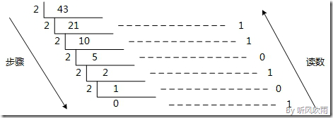

#### 快速幂

```java
    // 快速幂求出 x^y % mod
    public long quickmul(int x, long y) {
        long ret = 1;
        long mul = x;
        while (y > 0) {
            if (y % 2 == 1) {
                ret = ret * mul % mod;
            }
            mul = mul * mul % mod;
            y /= 2;
        }

        return ret;
    }
```

#### 二维转一维

对于一个 `MxN` 的二维数组，可以把二维坐标 `(i, j)` 映射到一维坐标 `index = i * N + j`，反之可以通过 `i = index / N` 和 `j = index % N` 得到原来的二维坐标。


