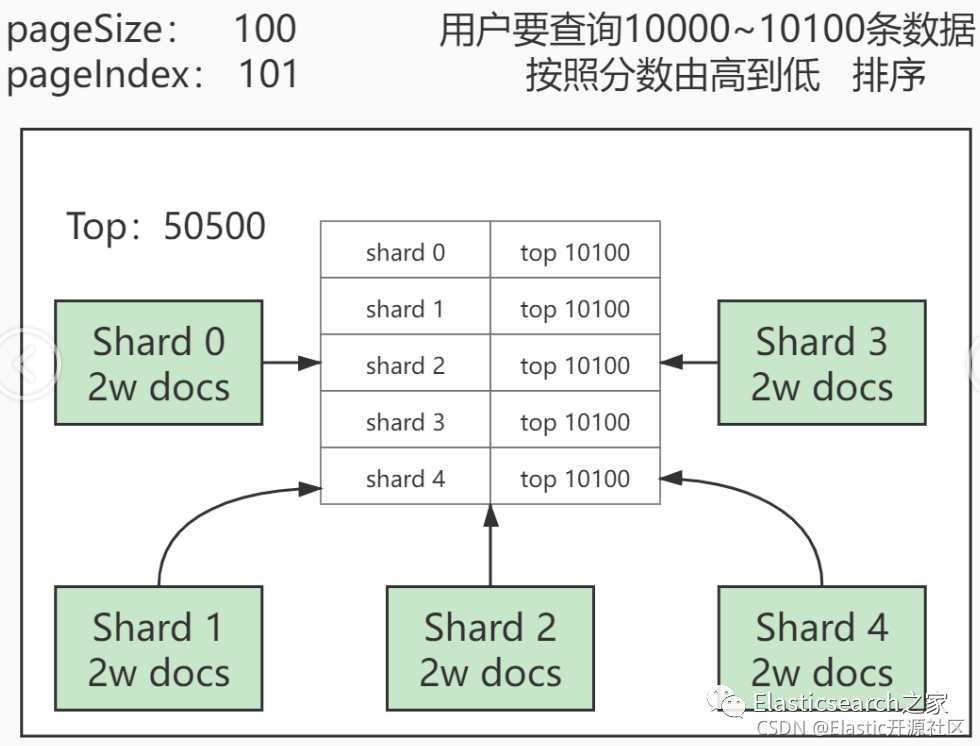
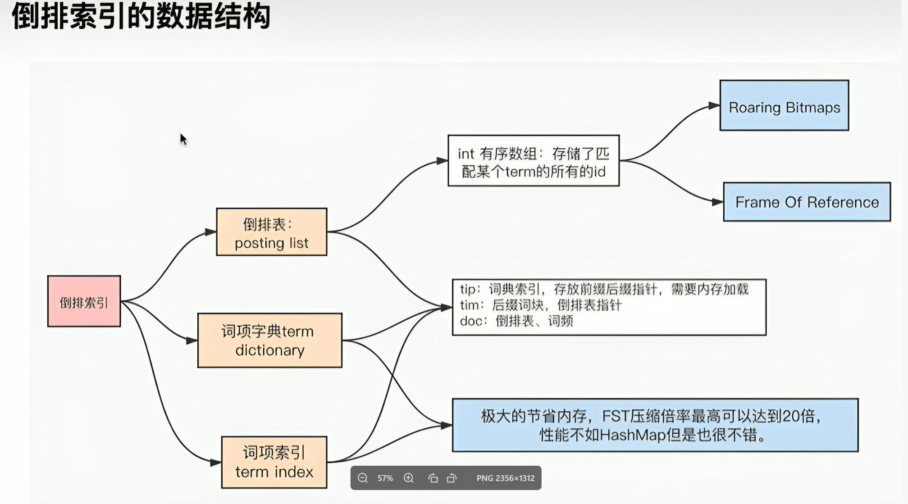
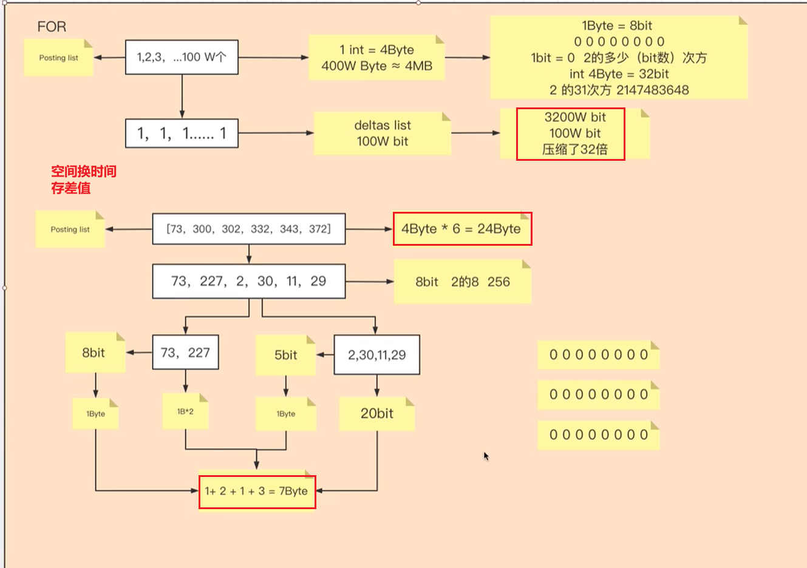
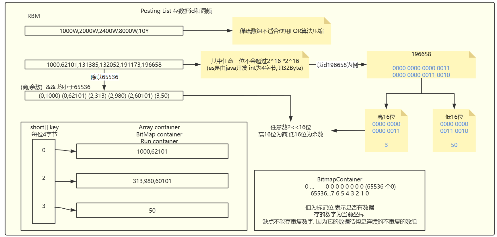

## ES

### 下载es

- jdk兼容性：https://www.elastic.co/cn/support/matrix#matrix_jvm
- 操作系统兼容性：https://www.elastic.co/cn/support/matrix
- 自身兼容性：https://www.elastic.co/cn/support/matrix#matrix_compatibility
- 下载地址：https://www.elastic.co/cn/downloads/elasticsearch

```yaml
#vim config/elasticsearch.yml
#集群名称
cluster.name: es 
#节点名称
node.name: node-1 
#数据和日志的存储目录
path.data: /mnt/hgfs/shareLinux/es/data
path.logs: /mnt/hgfs/shareLinux/es/logs
#设置绑定的ip，设置为0.0.0.0可以让任何计算机节点访问
network.host: 0.0.0.0
#默认端口
http.port: 9200 
#设置在集群中的所有节点名称
cluster.initial_master_nodes: ["node-1"]
```

```sh
vim elasticsearch-7.7.0/config/jvm.options
【Xms启动时占用内存大小，Xmx运行时最大可用内存大小。默认都是1g】
-Xms256m
-Xmx256m


vim /etc/sysctl.conf

【最后添加以下配置：注意等号两边有空格】 
vm.max_map_count = 655360
【保存完毕后，从指定的文件加载系统参数（不指定即从/etc/sysctl.conf中加载）】
sysctl -p


vim /etc/security/limits.conf

【末尾加上一下内容，首单词是用户名】
andy soft nofile 65536
andy hard nofile 65536
andy soft nproc 4096
andy hard nproc 4096


done < <(env)
【<改成三连，括号改成单引号】
done <<<'env'


chown -R elasticsearch:elasticsearch /var/lib/elasticsearch：将 /var/lib/elasticsearch 目录及其子目录的所有权赋予 elasticsearch 用户和组。
chmod -R 755 /var/lib/elasticsearch：将该目录及其子目录的权限设置为 755，即用户有读、写、执行权限，组和其他用户有读、执行权限。
```


### 下载kibana

- 下载地址：https://www.elastic.co/downloads/past-releases/kibana-7-10-1
- 验证地址：http://localhost:5601

```yaml
# Kibana is served by a back end server. This setting specifies the port to use.                                                                                                                                                                          
server.port: 5601                                                                                                                                                                                                                                         
                                                                                                                                                                                                                                                          
# Specifies the address to which the Kibana server will bind. IP addresses and host names are both valid values.                                                                                                                                          
# The default is 'localhost', which usually means remote machines will not be able to connect.                                                                                                                                                            
# To allow connections from remote users, set this parameter to a non-loopback address.                                                                                                                                                                   
server.host: "10.1.24.135"                                                                                                                                                                                                                                                                                                                                                                                                                            
                                                                                                                                                                                                                                                          
# Specifies locale to be used for all localizable strings, dates and number formats.                                                                                                                                                                      
# Supported languages are the following: English - en , by default , Chinese - zh-CN .                                                                                                                                                                    
i18n.locale: "zh-CN" 
```

### 安装Head

从Chrome网上应用店安装Elasticsearch Head


### 基本概念

#### 索引


##### 索引CRUD

@todo

- 创建索引：`PUT /index?pretty`
- 查询索引：`GET _cat/indices?v`_
- 删除索引：`DELETE /index?pretty`
- 插入数据：

```http
PUT /index/_doc/id
{    
Json数据
}
```

- 全量替换指定字段更新
- 删除数据 `DELETE /index/type/id`

#### Mapping

ES中的mapping有点类似与RDB中“表结构”的概念，在MySQL中，表结构里包含了字段名称，字段的类型还有索引信息等。在Mapping里也包含了一些属性，比如字段名称、类型、字段使用的分词器、是否评分、是否创建索引等属性，并且在ES中一个字段可以有`多个`类型。

- 查看Mapping `GET /index/_mappings`

##### 数据类型

###### 数字类型

long	integer	short	byte	double	float	half_float	scaled_float   unsigned_long


###### Keywords

- **keyword**：适用于索引结构化的字段，可以用于过滤、排序、聚合。keyword类型的字段只能通过精确值（exact value）搜索到。Id应该用keyword
- constant_keyword：始终包含相同值的关键字字段

- wildcard：可针对类似grep的[通配符查询](https://www.elastic.co/guide/en/elasticsearch/reference/7.10/query-dsl-wildcard-query.html)优化日志行和类似的关键字值

- 关键字字段通常用于[排序](https://www.elastic.co/guide/en/elasticsearch/reference/7.10/sort-search-results.html)， [汇总](https://www.elastic.co/guide/en/elasticsearch/reference/7.10/search-aggregations.html)和[Term查询](https://www.elastic.co/guide/en/elasticsearch/reference/7.10/term-level-queries.html)，例如[`term`](https://www.elastic.co/guide/en/elasticsearch/reference/7.10/query-dsl-term-query.html)。


###### Dates

包括[`date`](https://www.elastic.co/guide/en/elasticsearch/reference/7.10/date.html)和 [`date_nanos`](https://www.elastic.co/guide/en/elasticsearch/reference/7.10/date_nanos.html)

###### alias

为现有字段定义别名

###### binary

https://www.elastic.co/guide/en/elasticsearch/reference/current/binary.html

######  range

integer_range、float_range、long_range、double_range、date_range

###### text

当一个字段是要被全文搜索的，比如Email内容、产品描述，这些字段应该使用text类型。设置text类型以后，字段内容会被分析，在生成倒排索引以前，字符串会被分析器分成一个一个词项。text类型的字段不用于排序，很少用于聚合。（解释一下为啥不会为text创建正排索引：大量堆空间，尤其是在加载高基数text字段时。字段数据一旦加载到堆中，就在该段的生命周期内保持在那里。同样，加载字段数据是一个昂贵的过程，可能导致用户遇到延迟问题。这就是默认情况下禁用字段数据的原因）


##### 对象关系类型

- ###### object

  用于单个JSON对象

- ###### nested

  用于JSON对象数组

- ######  flattened

  允许将整个JSON对象索引为单个字段。


##### 结构化类型

- ######  geo-point

  纬度/经度积分

- ###### geo-shape

  用于多边形等复杂形状

- ###### point

  笛卡尔坐标点

- ###### shape

  笛卡尔任意几何图形


##### 特殊类型

- **IP地址：ip 用于IPv4和IPv6地址**
- [completion](#completion-suggester)：提供自动完成建议**
- tocken_count：计算字符串中令牌的数量
-  [murmur3](https://www.elastic.co/guide/en/elasticsearch/plugins/7.7/mapper-murmur3.html)：在索引时计算值的哈希并将其存储在索引中

- [annotated-text](https://www.elastic.co/guide/en/elasticsearch/plugins/7.7/mapper-annotated-text.html)：索引包含特殊标记的文本（通常用于标识命名实体）
-  [percolator](https://www.elastic.co/guide/en/elasticsearch/reference/current/percolator.html)：接受来自query-dsl的查询

-  join：为同一索引内的文档定义父/子关系

-  [rank features](https://www.elastic.co/guide/en/elasticsearch/reference/current/rank-features.html)：记录数字功能以提高查询时的点击率。

-  [dense vector](https://www.elastic.co/guide/en/elasticsearch/reference/current/dense-vector.html)：记录浮点值的密集向量。

-  [sparse vector](https://www.elastic.co/guide/en/elasticsearch/reference/current/sparse-vector.html)：记录浮点值的稀疏向量。

-  [search-as-you-type](https://www.elastic.co/guide/en/elasticsearch/reference/current/search-as-you-type.html)：针对查询优化的文本字段，以实现按需输入的完成

- [histogram](https://www.elastic.co/guide/en/elasticsearch/reference/current/histogram.html)：histogram 用于百分位数聚合的预聚合数值。
- [constant keyword](https://www.elastic.co/guide/en/elasticsearch/reference/current/constant-keyword.html)：keyword当所有文档都具有相同值时的情况的 专业化。

##### array

在Elasticsearch中，数组不需要专用的字段数据类型。默认情况下，任何字段都可以包含零个或多个值，但是，数组中的所有值都必须具有相同的数据类型。

##### date_nanos：date plus 纳秒


##### 映射类型

###### 动态映射

- #### 整数				     =>	long

- #### 浮点数			     =>	float		

- #### true || false	 =>	boolean

- #### 日期		             =>	date

- #### 数组                     =>    取决于数组中的第一个有效值

- #### 对象                     =>    object

- #### 字符串                 =>    如果不是数字和日期类型，那会被映射为text和keyword两个类型

  除了上述字段类型之外，其他类型都必须显示映射，也就是必须手工指定，因为其他类型ES无法自动识别。

###### 静态映射

```http
PUT /product
{
	"mappings": {
    "properties": {
    	"field": {
      	"mapping_parameter": "parameter_value"
	   	}
   	}
 	}
}
```


###### 映射参数

- **index：是否对创建对当前字段创建倒排索引，默认true，如果不创建索引，该字段不会通过索引被搜索到,但是仍然会在source元数据中展示**

- **analyzer：指定分析器（character filter、tokenizer、Token filters）。**

- boost：对当前字段相关度的评分权重，默认1

- coerce：是否允许强制类型转换  true “1”=> 1  false “1”=< 1

- copy_to：该参数允许将多个字段的值复制到组字段中，然后可以将其作为单个字段进行查询

- **doc_values：为了提升排序和聚合效率，默认true，如果确定不需要对字段进行排序或聚合，也不需要通过脚本访问字段值，则可以禁用doc值以节省磁盘		空间（不支持text和annotated_text）**

- dynamic：控制是否可以动态添加新字段

  true 新检测到的字段将添加到映射中。（默认）

  false 新检测到的字段将被忽略。这些字段将不会被索引，因此将无法搜索，但仍会出现在_source返回的匹配项中。这些字段不会添加到映射中，必须显式添加新字段。

  strict 如果检测到新字段，则会引发异常并拒绝文档。必须将新字段显式添加到映射中

- **eager_global_ordinals：用于聚合的字段上，优化聚合性能。**

  Frozen indices（冻结索引）：有些索引使用率很高，会被保存在内存中，有些使用率特别低，宁愿在使用的时候重新创建，在使用完毕后丢弃数据，Frozen indices的数据命中频率小，不适用于高搜索负载，数据不会被保存在内存中，堆空间占用比普通索引少得多，Frozen indices是只读的，请求可能是秒级或者分钟级。**eager_global_ordinals不适用于Frozen indices**

- **enable**：是否创建倒排索引，可以对字段操作，也可以对索引操作，如果不创建索引，让然可以检索并在_source元数据中展示，谨慎使用，该状态无法修改。

```http
    PUT my_index
    {
      "mappings": {
        "enabled": false
      }
    }
```

- **fielddata：查询时内存数据结构，在首次用当前字段聚合、排序或者在脚本中使用时，需要字段为fielddata数据结构，并且创建倒排索引保存到堆中**
- **fields：给field创建多字段，用于不同目的（全文检索或者聚合分析排序）**
- format：格式化

```http
  "date": {
     "type":  "date",
     "format": "yyyy-MM-dd"
   }
```

- ignore_above：超过长度将被忽略

- ignore_malformed：忽略类型错误

- index_options：控制将哪些信息添加到反向索引中以进行搜索和突出显示。仅用于text字段

- Index_phrases：提升exact_value查询速度，但是要消耗更多磁盘空间

- Index_prefixes：前缀搜索

- min_chars：前缀最小长度，>0，默认2（包含）

  max_chars：前缀最大长度，<20，默认5（包含）

- meta：附加元数据

- normalizer：

- **norms：是否禁用评分（在filter和聚合字段上应该禁用）。**

- null_value：为null值设置默认值**

- position_increment_gap：

- proterties：除了mapping还可用于object的属性设置

- **search_analyzer：设置单独的查询时分析器：**

- similarity：为字段设置相关度算法，支持BM25、claassic（TF-IDF）、boolean

- store：设置字段是否仅查询

- **term_vector：**运维参数


#### Query DSL

##### Query String

- #### 查询所有：

  GET /product/_search

- #### 带参数：

  GET /product/_search?q=name:xiaomi

- #### 分页：

  GET /product/_search?from=0&size=2&sort=price:asc

- #### 精准匹配 exact value

  GET /product/_search?q=date:2021-06-01

- #### _all搜索 相当于在所有有索引的字段中检索

  GET /product/_search?q=2021-06-01

##### 全文检索-Fulltext query

**对查询条件进行分词**

```json
GET index/_search
{
  "query": {
    ***
  }
}


GET product/_search
{
  "query": {
    "match_all": {} 没有任何条件，查全部
  }
}


GET product/_search
{
  "query": {
    "match_all": {}
  }
}

GET product/_search
{
  "query": {
    "multi_match": {
      "query": "shouji",
      "fields": ["tags","desc"] 在这两个字段中match
    }
  }
}


GET product/_search
{
  "query": {
    "match_phrase": {
      "desc": {
        "query": "shouji de", 
        "slop": 1
      }
    }
  }
}

```

- #### match：匹配包含某个term的子句

- #### match_all：匹配所有结果的子句

- #### multi_match：多字段条件 查询多个字段的match

- #### match_phrase：短语查询 

  会对输入做分词，但是需要结果中也包含所有的分词，并且顺序要求一致。

  `slop (default 0)`：来指定额外加几个词也可以命中。

##### 精准查询-Term query

**不对查询条件进行分词**

- #### term：匹配和搜索词项完全相等的结果

  - term和match_phrase区别:

    match_phrase 会将检索关键词分词, match_phrase的分词结果必须在被检索字段的分词中都包含，而且顺序必须相同，而且默认必须都是连续的 

    term搜索不会将搜索词分词

  - term和keyword区别 

    term是对于搜索词不分词,

    keyword是字段类型,是对于source data中的字段值不分词

  - 当查询的字段是已经被分词的字段时，term的全字段匹配无法通过精准匹配查到结果

    ```json
    例如 当product索引中存在一个字段name,类型是text 可以被索引
    name为 zhang san
    那么在es中 存储name的表就会是
    zhang -> doc
    san -> doc
    当我们使用term的zhang san全匹配时,无法匹配到任何一个值，所以没有结果
    分别使用zhang和san匹配时，才能匹配到对应的文档
    ```

  

- #### terms：匹配和搜索词项列表中任意项匹配的结果

  相当于查询多个term，任意匹配一个就可以

  ```json
  GET product/_search
  {
    "query": {
      "terms": {
        "tags": [
          "buka",
          "fashao"
        ]
      }
    }
  }
  ```

- #### range：范围查找

```json
GET product/_search
{
  "query": {
   "range": {
     "price": {
       "gte": 10,
       "lte": 4000
     }
   }
  }
}
```

##### 过滤器-Filter

```json
GET _search
{
  "query": {
    "constant_score": {
      "filter": {
        "term": {
          "status": "active"
        }
      }
    }
  }
}
```

- filter：query和filter的主要区别在： filter是结果导向的而query是过程导向。query倾向于“当前文档和查询的语句的相关度”而filter倾向于“当前文档和查询的条件是不是相符”。即在查询过程中，**query是要对查询的每个结果计算相关性得分的，而filter不会**。另外filter有相应的缓存机制，可以提高查询效率。


`constant_score` 查询能够为匹配查询条件的所有文档赋予相同的固定分数，这在不想让文档的相关性得分影响搜索结果排序时很有用

```JSON
    "query": {
        "constant_score": {
            "filter": {
                "term": {
                    "category": "books"
                }
            },
            "boost": 2.5
        }
    }
```

文档需要同时满足 `title` 字段匹配 `python programming` 以及 `category` 字段为 `books` 的条件，而且满足 `category` 为 `books` 的文档会额外获得 2.5 的分数加成。

```JSON
{
    "query": {
        "bool": {
            "must": [
                {
                    "match": {
                        "title": "python programming"
                    }
                },
                {
                    "constant_score": {
                        "filter": {
                            "term": {
                                "category": "books"
                            }
                        },
                        "boost": 2.5
                    }
                }
            ]
        }
    }
}    
```


##### 组合查询-Bool query

**bool**：可以组合多个查询条件，bool查询也是采用more_matches_is_better的机制，因此满足must和should子句的文档将会合并起来计算分值

- **must**：必须满足子句（查询）必须出现在匹配的文档中，并将有助于得分。
- **filter**：过滤器 不计算相关度分数，cache☆子句（查询）必须出现在匹配的文档中。但是不像 must查询的分数将被忽略。Filter子句在[filter上下文](https://www.elastic.co/guide/en/elasticsearch/reference/current/query-filter-context.html)中执行，这意味着计分被忽略，并且子句被考虑用于缓存。filter可以在全文检索计算得分前筛选数据，提升检索性能
- **should**：可能满足 or子句（查询）应出现在匹配的文档中。
- **must_not**：必须不满足 不计算相关度分数  not子句（查询）不得出现在匹配的文档中。子句在[过滤器上下文](https://www.elastic.co/guide/en/elasticsearch/reference/current/query-filter-context.html)中执行，这意味着计分被忽略，并且子句被视为用于缓存。由于忽略计分，0因此将返回所有文档的分数。

 **minimum_should_match**：参数指定should返回的文档必须匹配的子句的数量或百分比。如果bool查询包含至少一个should子句，而没有must或 filter子句，则默认值为1。否则，默认值为0

```http
GET product/_search
{
  "_source": false,
  "query": {
    "bool": {
      "filter": [  
        {
          "range": {
            "price": {
              "lte": "10000"
            }
          }
        }
      ],
      "should": [
        {
          "match_phrase": {
            "name": "nfc phone"
          }
        },
        {
          "match": {
            "name": "erji"
          }
        },
        {
          "bool": {
            "must": [
              {
                "range": {
                  "price": {
                    "gte": 900,
                    "lte": 3000
                  }
                }
              }
            ]
          }
        }
      ],
      "minimum_should_match": 2
    }
  }
}
```


#### 聚合查询-Aggregations

聚合（aggs）不同于普通查询，是目前学到的第二种大的查询分类，第一种即“query”，因此在代码中的第一层嵌套由“query”变为了“aggs”。**用于进行聚合的字段必须是exact value，分词字段不可进行聚合**，对于text字段如果需要使用聚合，需要开启fielddata，但是通常不建议，因为fielddata是将聚合使用的数据结构由磁盘（doc_values）变为了堆内存（field_data），大数据的聚合操作很容易导致OOM，详细原理会在进阶篇中阐述。

- 分桶聚合（Bucket agregations）：类比SQL中的group by的作用，主要用于统计不同类型数据的数量
- 指标聚合（Metrics agregations）：主要用于最大值、最小值、平均值、字段之和等指标的统计
- 管道聚合（Pipeline agregations）：用于对聚合的结果进行二次聚合，如要统计绑定数量最多的标签bucket，就是要先按照标签进行分桶，再在分桶的结果上计算最大值。

##### 分桶聚合（Bucket agregations）

```JSON
//部分mapping
        "tags" : {
          "type" : "text", //会被分词 不会创建正排索引
          "fields" : {
            "keyword" : {
              "type" : "keyword", //这里创建了一个keyword类型字段 这样在keyword中就不会被分词 keyword类型的会创建正排索引 
              "ignore_above" : 256
            }
          }
        }


//只有有正排索引的字段才能被分桶查询，text类型的字段不会创建正排索引，除非使用fielddata=true
//加上fielddata=true后，text类型的字段会被先分词，所以分桶查询的并不能得到完整字符串的分组，而是一个个分词的分组

//分桶聚合查询
GET product/_search
{
  "aggs": {
    "my_agg": {
      "terms": {
        "field": "tags.keyword", //不会被分词 
        "size": 30,
        "order": {
          "_count": "asc"
        }
      }
    }
  },
  "size": 0
}

```


##### 指标聚合（Metrics agregations）

平均值：Avg、最大值：Max、最小值：Min、求和：Sum、详细信息：Stats、数量：Value count 去重：cardinality

```json
GET product/_search
{
  "size": 0, 
  "aggs": {
    "max_price": {
      "max": {
        "field": "price"
      }
    },
    "min_price": {
      "min": {
        "field": "price"
      }
    },
    "avg_price": {
      "avg": {
        "field": "price"
      }
    }
  }
}
```


##### 管道聚合（Pipeline agregations）

```json
//查询商品分类的平均价格的最低平均价格
GET product/_search
{
  "size": 0,
  "aggs": {
    "my_bucket": {
      "terms": {
        "field": "type.keyword",
        "size": 10
      },
      "aggs": {
        "my_avg": {
          "avg": {
            "field": "price"
          }
        }
      }
    },
    "my_min_bucket": {
      "min_bucket": {
        "buckets_path": "my_bucket>my_avg"
      }
    }
  }
}

```


##### 复杂查询语法

###### 嵌套聚合

语法：

```json
GET product/_search
{
  "size": 0,
  "aggs": {
    "<agg_name>": {
      "<agg_type>": {
        "field": "<field_name>"
      },
      "aggs": {
        "<agg_name_child>": {
          "<agg_type>": {
            "field": "<field_name>"
          }
        }
      }
    }
  }
}
```

用途：用于在某种聚合的计算结果之上再次聚合，如统计不同类型商品的平均价格，就是在按照商品类型桶聚合之后，在其结果之上计算平均价格

###### 聚合和查询的相互关系

**基于query或filter的聚合**

语法：

```json
GET product/_search
{
  "query": {
    ...
  }, 
  "aggs": {
    ...
  }
}
```

注意：以上语法，执行顺序为先query后aggs，顺序和谁在上谁在下没有关系。query中可以是查询、也可以是filter、或者bool query

**基于聚合结果的查询**

```json
GET product/_search
{
  "aggs": {
    ...
  },
  "post_filter": {
    ...
  }
}
```

注意：以上语法，执行顺序为先aggs后post_filter，顺序和谁在上谁在下没有关系。

**查询条件的作用域**

```json
GET product/_search
{
  "size": 10,
  "query": {
    ...
  },
  "aggs": {
    "avg_price": {
      ...
    },
    "all_avg_price": {
      "global": {},
      "aggs": {
        ...
      }
    }
  }
}
```

上面例子中，avg_price的计算结果是基于query的查询结果的，而all_avg_price的聚合是基于all data的，如果有filter，取filter和query的交集聚合

###### 聚合排序

**排序规则：**

order_type：_count（数量） _key（聚合结果的key值） _term（废弃但是仍然可用，使用\_key代替）

```json
GET product/_search
{
  "aggs": {
    "type_agg": {
      "terms": {
        "field": "tags",
        "order": {
          "<order_type>": "desc"
        },
        "size": 10
      }
    }
  }
}
```

**多级排序：**即排序的优先级，按照外层优先的顺序

```json
GET product/_search?size=0
{
  "aggs": {
    "first_sort": {
      ...
      "aggs": {
        "second_sort": {
          ...
        }
      }
    }
  }
}
```

上例中，先按照first_sort排序，再按照second_sort排序

**多层排序：**即按照多层聚合中的里层某个聚合的结果进行排序

```json
GET product/_search
{
  "size": 0,
  "aggs": {
    "tag_avg_price": {
      "terms": {
        "field": "type.keyword",
        "order": {
          "agg_stats>my_stats.sum": "desc"
        }
      },
      "aggs": {
        "agg_stats": {
         	...
          "aggs": {
            "my_stats": {
              "extended_stats": {
                ...
              }
            }
          }
        }
      }
    }
  }
}
```

上例中，按照里层聚合“my_stats”进行排序

###### 常用的查询函数

**histogram：直方图或柱状图统计**

用途：用于区间统计，如不同价格商品区间的销售情况

语法：

```json
GET product/_search?size=0
{
  "aggs": {
    "<histogram_name>": {
      "histogram": {
        "field": "price", 				#字段名称
        "interval": 1000,					#区间间隔
        "keyed": true,						#返回数据的结构化类型
        "min_doc_count": <num>,		#返回桶的最小文档数阈值，即文档数小于num的桶不会被输出
        "missing": 1999						#空值的替换值，即如果文档对应字段的值为空，则默认输出1999（参数值）
      }
    }
  }
}
```

**date-histogram：基于日期的直方图，比如统计一年每个月的销售额**

语法：

```json
GET product/_search?size=0
{
  "aggs": {
    "my_date_histogram": {
      "date_histogram": {
        "field": "createtime",					#字段需为date类型
        "<interval_type>": "month",			#时间间隔的参数可选项
        "format": "yyyy-MM", 						#日期的格式化输出
        "extended_bounds": {						#输出空桶
          "min": "2020-01",
          "max": "2020-12"
        }
      }
    }
  }
}
```

interval_type：时间间隔的参数可选项

- fixed_interval：ms（毫秒）s（秒）m（分钟）h（小时）d（天），注意单位需要带上具体的数值，如2d为两天。需要当心当单位过小，会导致输出桶过多而导致服务崩溃。

- calendar_interval：month、year

- interval：（废弃，但是仍然可用）


**percentile 百分位统计 或者 饼状图**

[计算结果为何为近似值](https://www.elastic.co/guide/en/elasticsearch/reference/7.10/search-aggregations-metrics-percentile-aggregation.html)。

1. percentiles：用于评估当前数值分布情况，比如99 percentile 是 1000 ， 是指 99%的数值都在1000以内。常见的一个场景就是我们制定 SLA 的时候常说 99% 的请求延迟都在100ms 以内，这个时候你就可以用 99 percentile 来查一下，看一下 99 percenttile 的值如果在 100ms 以内，就代表SLA达标了。

   语法：

   ```json
   GET product/_search?size=0
   {
     "aggs": {
       "<percentiles_name>": {
         "percentiles": {
           "field": "price",
           "percents": [
     				percent1，				#区间的数值，如5、10、30、50、99 即代表5%、10%、30%、50%、99%的数值分布
     				percent2，
     				...
           ]
         }
       }
     }
   }
   ```

2. percentile_ranks： percentile rank 其实就是percentiles的反向查询，比如我想看一下 1000、3000 在当前数值中处于哪一个范围内，你查一下它的 rank，发现是95，99，那么说明有95%的数值都在1000以内，99%的数值都在3000以内。

   ```json
   GET product/_search?size=0
   {
     "aggs": {
       "<percentiles_name>": {
         "percentile_ranks": {
           "field": "<field_value>",
           "values": [
             rank1,
             rank2,
             ...
           ]
         }
       }
     }
   }
   ```


#### 脚本查询

##### 概念

Scripting是Elasticsearch支持的一种专门用于复杂场景下支持自定义编程的强大的脚本功能，ES支持多种脚本语言，如painless，其语法类似于Java,也有注释、关键字、类型、变量、函数等，其就要相对于其他脚本高出几倍的性能，并且安全可靠，可以用于内联和存储脚本。

##### 支持的语言

1. **groovy**：ES 1.4.x-5.0的默认脚本语言

2. **painless**：JavaEE使用java语言开发，.Net使用C#/F#语言开发，Flutter使用Dart语言开发，同样，ES 5.0+版本后的Scripting使用的语言默认就是painless，painless是一种专门用于Elasticsearch的简单,用于内联和存储脚本，是ES 5.0+的默认脚本语言，类似于Java,也有注释、关键字、类型、变量、函数等，是一种安全的脚本语言。并且是Elasticsearch的默认脚本语言。

3. **其他**：

   [expression](https://www.elastic.co/guide/en/elasticsearch/reference/current/modules-scripting-expression.html)：每个文档的开销较低：表达式的作用更多，可以非常快速地执行，甚至比编写native脚本还要快，支持javascript语法的子集：单个表达式。缺点：只能访问数字，布尔值，日期和geo_point字段，存储的字段不可用

   [mustache](https://www.elastic.co/guide/en/elasticsearch/reference/current/search-template.html)：提供模板参数化查询

##### 特点

1. 语法简单，学习成本低
2. 灵活度高，可编程能力强
3. 性能相较于其他脚本语言很高
4. 安全性好
5. 独立语言，虽然易学但仍需单独学习
6. 相较于DSL性能低
7. 不适用于复杂的业务场景

**应用场景：各种复杂的应用场景，如自定义评分、自定义聚合查询等。**

- 正则:

  早先某些版本正则表达式默认情况下处于禁用模式，因为它绕过了painless的针对长时间运行和占用内存脚本的保护机制。而且有深度对战行为。如果需要开启正则，需要配置：script.painless.regex.enabled: true

  **注意**：通常正则的使用范围比较小，应用范围基本限制在数据量比较小和并发量比较小的应用场景下。

- doc['field'].value和params\['\_source']['field']：

  理解之间的区别是很重要的，doc['field'].value和params\['\_source']['field']。首先，使用doc关键字，将导致该字段的条件被加载到内存（缓存），这将导致更快的执行，但更多的内存消耗。此外，doc[...]符号只允许简单类型（不能返回一个复杂类型(JSON对象或者nested类型)），只有在非分析或单个词条的基础上有意义。但是，doc如果可能，使用仍然是从文档访问值的推荐方式，因为\_source每次使用时都必须加载并解析。使用_source非常缓慢


#### 文档批量操作

##### 基础操作

**创建**

```json
PUT test_index/_doc/1  //既是创建也是全量更新
{
  "test_field":"test",
  "test_title":"title"
}

//创建 如果存在就报错
PUT test_index/_create/4?filter_path=items.*.error
{
  "test_field":"test",
  "test_title":"title"
}

//创建 自动生成id
POST product/_doc
{
  "name":"xxx"
}

```


**删除**

```json
//懒删除
DELETE test_index/_doc/3
```


**更新**

```json
PUT /test_index/_doc/1 //既是创建也是全量更新
{
  "test_field": "test 2",
  "test_title": "title 2"
}

//部分更新
POST product/_doc/1
{
  "doc":{
    "name":"xxx"
  }
}


//部分更新
POST /test_index/_update/1
{
  "doc": {
    "test_title": "test 3"
  }
}

//既是创建也是全量更新
PUT /test_index/_doc/5?op_type=index&filter_path=items.*.error
{
  "test_field": "test 2",
  "test_title": "title 2",
  "test_name": "title 2"
}
```


##### 批量操作

**批量查询**

```json
GET /_mget
{
  "docs": [
    {
      "_index": "product",
      "_id": 2
    },
    {
      "_index": "product",
      "_id": 3
    }
  ]
}

GET product/_mget
{
  "ids":[2,3,4],
  "_source":[]
}
```

**批量增删改**

```json
#POST /_bulk
#POST /<index>/_bulk
#{"action": {"metadata"}}
#{"data"}


#加?filter_path=items.*.error  只显示失败的
POST /_bulk?filter_path=items.*.error
{ "delete": { "_index": "product2",  "_id": "1" }}
{ "create": { "_index": "product2",  "_id": "2" }}
{ "name":    "_bulk create 2" }
{ "create": { "_index": "product2",  "_id": "12" }}
{ "name":    "_bulk create 12" }
{ "index":  { "_index": "product2",  "_id": "3" }}
{ "name":    "index product2 " }
{ "index":  { "_index": "product2",  "_id": "13" }}
{ "name":    "index product2" }
{ "update": { "_index": "product2",  "_id": "4","retry_on_conflict" : "3"} }
{ "doc" : {"test_field2" : "bulk test1"} }
```


#### 模糊查询

##### 前缀搜索：prefix

以xx开头的搜索，不计算相关度评分。

- 前缀搜索匹配的是term(分词后的词项)，而不是field(整段文本)。
- 前缀搜索的性能很差
- 前缀搜索没有缓存
- 前缀搜索尽可能把前缀长度设置的更长

```json
GET <index>/_search
{
  "query": {
    "prefix": {
      "<field>": {
        "value": "<word_prefix>"
      }
    }
  }
}
//如果在mapping中设置了此字段 那么会将当前文本拆分最短2个 最长5的前缀 来加快前缀匹配的速度 
index_prefixes: 默认   "min_chars" : 2,   "max_chars" : 5 
```

##### 通配符：wildcard

通配符运算符是匹配一个或多个字符的占位符。例如，*通配符运算符匹配零个或多个字符。您可以将通配符运算符与其他字符结合使用以创建通配符模式。

通配符匹配的也是term(分词后的词项)，而不是field(整段文本)。

```json
GET <index>/_search
{
  "query": {
    "wildcard": {
      "<field>": {
        "value": "<word_with_wildcard>"
      }
    }
  }
}
```

##### 正则：regexp

regexp查询的性能可以根据提供的正则表达式而有所不同。为了提高性能，应避免使用通配符模式，如.*或 .*?+未经前缀或后缀

```json
GET <index>/_search
{
  "query": {
    "regexp": {
      "<field>": {
        "value": "<regex>",
        "flags": "ALL",
      }
    }
  }
}
```

**flags**

- ALL

  启用所有可选操作符。

- COMPLEMENT

  启用~操作符。可以使用~对下面最短的模式进行否定。例如

  a~bc  # matches 'adc' and 'aec' but not 'abc'

- INTERVAL

  启用<>操作符。可以使用<>匹配数值范围。例如

  foo<1-100>    # matches 'foo1', 'foo2' ... 'foo99', 'foo100'

  foo<01-100>   # matches 'foo01', 'foo02' ... 'foo99', 'foo100'

- INTERSECTION

  启用&操作符，它充当AND操作符。如果左边和右边的模式都匹配，则匹配成功。例如:

  aaa.+&.+bbb  # matches 'aaabbb'

- ANYSTRING

  启用@操作符。您可以使用@来匹配任何整个字符串。
  您可以将@操作符与&和~操作符组合起来，创建一个“everything except”逻辑。例如:

  @&~(abc.+)  # matches everything except terms beginning with 'abc'

##### 模糊查询：fuzzy

混淆字符 (**b**ox → fox)							缺少字符 (**b**lack → lack)

多出字符 (sic → sic**k**)							 颠倒次序 (a**c**t → **c**at)

```json
GET <index>/_search
{
  "query": {
    "fuzzy": {
      "<field>": {
        "value": "<keyword>"
      }
    }
  }
}
```

- value：（必须，关键词）

- fuzziness：编辑距离，（0，1，2）并非越大越好，召回率高但结果不准确

  1) 两段文本之间的Damerau-Levenshtein距离是使一个字符串与另一个字符串匹配所需的插入、删除、替换和调换的数量

  2) 距离公式：Levenshtein是lucene的，es改进版：Damerau-Levenshtein，

  axe=>aex  Levenshtein=2  Damerau-Levenshtein=1

- transpositions：（可选，布尔值）指示编辑是否包括两个相邻字符的变位（ab→ba）。默认为true。

```json
//match也支持模糊查询 但match会对query进行分词 每个词允许的编辑距离是fuzziness
//fuzzy不会对query做分词
GET product_en/_search
{
  "query": {
    "match": {
      "desc": {
        "query": "shoujei zheng",
        "fuzziness": 1
      }
    }
  }
}

```


##### 短语前缀：match_phrase_prefix

**match_phrase**：

- match_phrase会分词
- 被检索字段必须包含match_phrase中的所有词项并且顺序必须是相同的
- 被检索字段包含的match_phrase中的词项之间不能有其他词项


**match_phrase_prefix**

**概念**：

​	match_phrase_prefix与match_phrase相同,但是它多了一个特性,就是它允许在文本的最后一个词项(term)上的前缀匹配,如果 是一个单词,比如a,它会匹配文档字段所有以a开头的文档,如果是一个短语,比如 "this is ma" ,他会**先**在倒排索引中做以ma做**前缀搜索**,**然后**在匹配到的doc中做**match_phrase查询**

```json
GET product_en/_search
{
  "query": {
    "match_phrase_prefix": {
      "desc": {
        "query": "shouji d",
        "slop": 1
      }
    }
  }
}
```

**参数**

- analyzer 指定何种分析器来对该短语进行分词处理

- max_expansions 限制前缀匹配的最大词项数量

  即便设置max_expansions:1，由于一个分词可能对应多个doc，那么前缀实际匹配到的词内部的doc也可能是多个，结果>1

  在多个分片中，max_expansions只对单个分片生效，这意味着当聚合多个分片的结果时，结果依然>1

- boost 用于设置该查询的权重

- slop 允许短语间的词项(term)间隔：slop 参数告诉 match_phrase 查询词条相隔多远时仍然能将文档视为匹配 什么是相隔多远？ 意思是说为了让查询和文档匹配你需要移动词条多少次？

  ```json
  // source: shouji zhong de hongzhaji
  // query:  de zhong shouji hongzhaji
  
  // de shouji/zhong  hongzhaji  1次
  // shouji/de zhong  hongzhaji  2次
  // shouji zhong/de  hongzhaji  3次
  // shouji zhong de  hongzhaji  4次
  
  /代表两个词占用一个位置
  ```

  

**原理解析**：https://www.elastic.co/cn/blog/found-fuzzy-search#performance-considerations


##### N-gram

从分词角度，创建不同长度的前缀词索引

**tokenizer**

分词器中的ngram

```json
GET _analyze
{
  "tokenizer": "ngram",
  "text": "reba always loves me"
}
```

**token filter**

令牌过滤器中的ngram

```json
GET _analyze
{
  "tokenizer": "ik_max_word",
  "filter": [ "ngram" ],
  "text": "reba always loves me"
}
//在ik_max_word将词进行分词切分后，对每个词项进行ngram的切分工作
//min_gram =1   "max_gram": 1
//r a l m

//min_gram =1   "max_gram": 2
//r a l m
//re al lo me

//min_gram =2   "max_gram": 3
//re al lo me
//eb lw ov me
//ba ay ve me
// ...
//reb alw lov me

```

- min_gram：创建索引所拆分字符的最小阈值
- max_gram：创建索引所拆分字符的最大阈值

**两种令牌过滤器**

- ngram：**从每一个字符开始**,按照步长,进行分词,适合前缀中缀检索
- edge_ngram：**从第一个字符开始**,按照步长,进行分词,适合前缀匹配场景


#### 搜索推荐

搜索一般都会要求具有“搜索推荐”或者叫“搜索补全”的功能，即在用户输入搜索的过程中，进行自动补全或者纠错。以此来提高搜索文档的匹配精准度，进而提升用户的搜索体验，这就是Suggest。

##### term suggester

term suggester正如其名，只基于tokenizer之后的单个term去匹配建议词，并不会考虑多个term之间的关系

```json
POST <index>/_search
{ 
  "suggest": {
    "<suggest_name>": {
      "text": "<search_content>",
      "term": {
        "suggest_mode": "<suggest_mode>",
        "field": "<field_name>"
      }
    }
  }
}
```

**Options**：

- **text**：用户搜索的文本
- **field**：要从哪个字段选取推荐数据
- **analyzer**：使用哪种分词器
- **size**：每个建议返回的最大结果数
- **sort**：如何按照提示词项排序，参数值只可以是以下两个枚举：
  - **score**：分数>词频>词项本身
  - **frequency**：词频>分数>词项本身
- **suggest_mode**：搜索推荐的推荐模式，参数值亦是枚举：
  - missing：默认值，仅为不在索引中的词项生成建议词
  - popular：仅返回与搜索词文档词频或文档词频更高的建议词
  - always：根据 建议文本中的词项 推荐 任何匹配的建议词
- **max_edits**：可以具有最大偏移距离候选建议以便被认为是建议。只能是1到2之间的值。任何其他值都将导致引发错误的请求错误。默认为2
- **prefix_length**：前缀匹配的时候，必须满足的最少字符
- **min_word_length**：最少包含的单词数量
- **min_doc_freq**：最少的文档频率 筛选freq > min_doc_freq的展示
- **max_term_freq**：最大的词频

##### phrase suggester

term suggester可以对单个term进行建议或者纠错，不会考虑多个term之间的关系，但是phrase suggester在term suggester的基础上，考虑多个term之间的关系，比如是否同时出现一个索引原文中，相邻程度以及词频等等。

Options：

- real_word_error_likelihood： 此选项的默认值为 0.95。此选项告诉 Elasticsearch 索引中 5% 的术语拼写错误。这意味着随着这个参数的值越来越低，Elasticsearch 会将越来越多存在于索引中的术语视为拼写错误，即使它们是正确的
- max_errors：为了形成更正，最多被认为是拼写错误的术语的最大百分比。默认值为 1
- confidence：默认值为 1.0，最大值也是。该值充当与建议分数相关的阈值。只有得分超过此值的建议才会显示。例如，置信度为 1.0 只会返回得分高于输入短语的建议
- collate：告诉 Elasticsearch 根据指定的查询检查每个建议，以修剪索引中不存在匹配文档的建议。在这种情况下，它是一个匹配查询。由于此查询是模板查询，因此搜索查询是当前建议，位于查询中的参数下。可以在查询下的“params”对象中添加更多字段。同样，当参数“prune”设置为true时，我们将在响应中增加一个字段“collate_match”，指示建议结果中是否存在所有更正关键字的匹配
- direct_generator：phrase suggester使用候选生成器生成给定文本中每个项可能的项的列表。单个候选生成器类似于为文本中的每个单独的调用term suggester。生成器的输出随后与建议候选项中的候选项结合打分。目前只支持一种候选生成器，即direct_generator。建议API接受密钥直接生成器下的生成器列表；列表中的每个生成器都按原始文本中的每个项调用。

```json
//需要设置自定义的分词器到具体的字段上
PUT test
{
  "settings": {
    "index": {
      "analysis": {
        "analyzer": {
          "trigram": {
            "type": "custom",
            "tokenizer": "standard",
            "filter": [
              "lowercase",
              "shingle"
            ]
          }
        },
        "filter": {
          "shingle": {
            "type": "shingle", //主要要用shingle来进行拆分词 和n-gram类似 n-gram针对字符 shingle针对词
            "min_shingle_size": 2,
            "max_shingle_size": 3
          }
        }
      }
    }
  },
  "mappings": {
    "properties": {
      "title": {
        "type": "text",
        "fields": {
          "trigram": {
            "type": "text",
            "analyzer": "trigram" //设置自定义分词器
          }
        }
      }
    }
  }
}


GET /_analyze
{
  "tokenizer": "standard",
  "filter": [
    {
      "type": "shingle",
      "min_shingle_size": 2,
      "max_shingle_size": 3
    }
  ],
  "text": "lucene and elasticsearch"
}
//lucene
//lucene and
//lucene and elasticsearch
//and
//and elasticsearch
//elasticsearch
```


##### completion suggester

**最常用的**

自动补全，自动完成，支持三种查询【前缀查询（prefix）模糊查询（fuzzy）正则表达式查询（regex)】 ，主要针对的应用场景就是"Auto Completion"。 此场景下用户每输入一个字符的时候，就需要即时发送一次查询请求到后端查找匹配项，在用户输入速度较高的情况下对后端响应速度要求比较苛刻。因此实现上它和前面两个Suggester采用了不同的数据结构，索引并非通过倒排来完成，而是将analyze过的数据编码成FST和索引一起存放。对于一个open状态的索引，FST会被ES整个装载到内存里的，进行前缀查找速度极快。但是FST只能用于前缀查找，这也是Completion Suggester的局限所在。

- completion：es的一种特有类型，专门为suggest提供，基于内存，性能很高。

  ```json
  PUT suggest_carinfo
  {
    "mappings": {
      "properties": {
          "title": {
            "type": "text",
            "analyzer": "ik_max_word",
            "fields": {
              "suggest": {
                "type": "completion",
                "analyzer": "ik_max_word"
              }
            }
          },
          "content": {
            "type": "text",
            "analyzer": "ik_max_word"
          }
        }
    }
  }
  ```

- prefix query：基于前缀查询的搜索提示，是最常用的一种搜索推荐查询。

  - prefix：客户端搜索词

  - field：建议词字段

  - size：需要返回的建议词数量（默认5）

  - skip_duplicates：是否过滤掉重复建议，默认false

    ```json
    POST suggest_carinfo/_search
    {
      "suggest": {
        "car_suggest": {
          "prefix": "宝马5系",
          "completion": {
            "field": "title.suggest",
            "skip_duplicates":true,
            "fuzzy": {
              "fuzziness": 1
            }
          }
        }
      }
    }
    ```

    

- fuzzy query

  - fuzziness：允许的偏移量，默认auto

  - transpositions：如果设置为true，则换位计为一次更改而不是两次更改，默认为true。

  - min_length：返回模糊建议之前的最小输入长度，默认 3

  - prefix_length：输入的最小长度（不检查模糊替代项）默认为 1

  - unicode_aware：如果为true，则所有度量（如模糊编辑距离，换位和长度）均以Unicode代码点而不是以字节为单位。这比原始字节略慢，因此默认情况下将其设置为false。

    ```json
    POST suggest_carinfo/_search
    {
      "suggest": {
        "car_suggest": {
          "prefix": "宝马5系",
          "completion": {
            "field": "title.suggest",
            "skip_duplicates":true,
            "fuzzy": {
              "fuzziness": 1
            }
          }
        }
      }
    }
    ```

    

- regex query：可以用正则表示前缀，不建议使用

```json
POST suggest_carinfo/_search
{
  "suggest": {
    "car_suggest": {
      "regex": "nir",
      "completion": {
        "field": "title.suggest",
        "size": 10
      }
    }
  }
}
```


##### context suggester

完成建议者会考虑索引中的所有文档，但是通常来说，我们在进行智能推荐的时候最好通过某些条件过滤，并且有可能会针对某些特性提升权重。

- contexts：上下文对象，可以定义多个
  - name：`context`的名字，用于区分同一个索引中不同的`context`对象。需要在查询的时候指定当前name
  - type：`context`对象的类型，目前支持两种：category和geo，分别用于对suggest  item分类和指定地理位置。
  - boost：权重值，用于提升排名
- path：如果没有path，相当于在PUT数据的时候需要指定context.name字段，如果在Mapping中指定了path，在PUT数据的时候就不需要了，因为           Mapping是一次性的，而PUT数据是频繁操作，这样就简化了代码。

```json
PUT place
{
  "mappings": {
    "properties": {
      "suggest": {
        "type": "completion",
        "contexts": [
          {
            "name": "place_type",
            "type": "category"
          },
          {
            "name": "location",
            "type": "geo",
            "precision": 4
          }
        ]
      }
    }
  }
}
PUT place/_doc/1
{
  "suggest": {
    "input": [ "timmy's", "starbucks", "dunkin donuts" ], //将这些词与cafe和food类绑定
    "contexts": {
      "place_type": [ "cafe", "food" ]                    
    }
  }
}

POST place/_search?pretty
{
  "suggest": {
    "place_suggestion": {
      "prefix": "tim",
      "completion": {
        "field": "suggest",
        "contexts": {
          "place_type": [                             
            { "context": "cafe" }, //筛选cafe类中前缀为sta的推荐词
            { "context": "money", "boost": 2 } //筛选money类中前缀为sta的推荐词 +2分 优先推荐
          ]
        }
      }
    }
  }
}


# 地理位置筛选器
PUT place/_doc/3
{
  "suggest": {
    "input": "timmy's",
    "contexts": {
      "location": [
        {
          "lat": 43.6624803,
          "lon": -79.3863353
        },
        {
          "lat": 43.6624718,
          "lon": -79.3873227
        }
      ]
    }
  }
}
POST place/_search
{
  "suggest": {
    "place_suggestion": {
      "prefix": "tim",
      "completion": {
        "field": "suggest",
        "contexts": {
          "location": {
            "lat": 43.662,
            "lon": -79.380
          }
        }
      }
    }
  }
}
```


#### 数据建模

##### 嵌套类型：Nested

nested属于object类型的一种，是Elasticsearch中用于复杂类型对象数组的索引操作。Elasticsearch没有内部对象的概念，因此，ES在存储复杂类型的时候会把对象的复杂层次结果扁平化为一个键值对列表。

**比如**：

```json
PUT my-index-000001/_doc/1
{
  "group" : "fans",
  "user" : [ 
    {
      "first" : "John",
      "last" :  "Smith"
    },
    {
      "first" : "Alice",
      "last" :  "White"
    }
  ]
} 
```

上面的文档被创建之后，user数组中的每个json对象会以下面的形式存储

```json
{
  "group" :        "fans",
  "user.first" : [ "alice", "john" ],
  "user.last" :  [ "smith", "white" ]
}
```

`user.first`和`user.last`字段被扁平化为多值字段，`first`和`last`之间的关联丢失。

**使用nested为复杂类型创建mapping：**

```json
PUT order
{
  "mappings": {
    "properties": {
      "goods_list": {
        "type": "nested", //指定nested
        "properties": {
          "name": { //指定内部的name属性的结构
            "type": "text",
            "analyzer": "ik_max_word",
            "fields": {
              "keyword": {
                "type": "keyword",
                "ignore_above": 256
              }
            }
          }
        }
      }
    }
  }
}
```

**查询**：

```json
GET /order/_search
{
  "query": {
    "nested": {
      "path": "goods_list",
      "query": {
        "bool": {
          "must": [
            {
              "match": { //都会计算一个分数
                "goods_list.name": "小米10"
              }
            },
            {
              "match": { //计算一个分数
                "goods_list.price": 4999
              }
            }
          ]
        }
      },
      "score_mode" : "max" //取上面俩分数的最大值
    }
  }
}
```

**Optins:**

- path：nested对象的查询深度
- score_mode：评分计算方式
  - avg （默认）：使用所有匹配的子对象的平均相关性得分。
  - max：使用所有匹配的子对象中的最高相关性得分。
  - min：使用所有匹配的子对象中最低的相关性得分。
  - none：不要使用匹配的子对象的相关性分数。该查询为父文档分配得分为0。
  - sum：将所有匹配的子对象的相关性得分相加。

##### 父子级关系：Join

连接数据类型是一个特殊字段，它在同一索引的文档中创建父/子关系。关系部分在文档中定义了一组可能的关系，每个关系是一个父名和一个子名。父/子关系可以定义如下

```json
PUT <index_name>
{
  "mappings": {
    "properties": {
      "<join_field_name>": { 
        "type": "join",
        "relations": {
          "<parent_name>": "<child_name>" 
        }
      }
    }
  }
}

PUT msb_depart
{
  "mappings": {
    "properties": {
      "msb_join_field": {
        "type": "join",
        "relations": {
          "depart": "employee"
        }
      },
      "my_id": {
        "type": "keyword"
      }
    }
  }
}

PUT msb_depart/_doc/1
{
  "my_id": 1,
  "name":"教学部",
  "msb_join_field":{
    "name":"depart"
  }
}

PUT msb_depart/_doc/3?routing=1&refresh
{
  "my_id": 3,
  "name":"马老师",
  "msb_join_field":{
    "name":"employee",
    "parent":1
  }
}

# 搜索周老师所在部门
GET msb_depart/_search
{
  "query": {
    "has_child": {
      "type": "employee",
      "query": {
        "match": {
          "name.keyword": "周老师"
        }
      }
    }
  }
}
# 搜索咨询部所有老师
GET msb_depart/_search
{
  "query": {
    "has_parent": {
      "parent_type": "depart",
      "query": {
        "match": {
          "name.keyword": "咨询部"
        }
      }
    }
  }
}
# 搜索部门id为2的部门员工
GET msb_depart/_search
{
  "query": {
    "parent_id":{
      "type":"employee",
      "id":2
    }
  }
}
```

**使用场景**

`join`类型不能像关系数据库中的表链接那样去用，不论是`has_child`或者是`has_parent`查询都会对索引的查询性能有严重的负面影响。并且会触发[global ordinals](https://www.elastic.co/guide/en/elasticsearch/reference/7.12/eager-global-ordinals.html#_what_are_global_ordinals)

`join`**唯一**合适应用场景是：当索引数据包含一对多的关系，并且其中一个实体的数量远远超过另一个的时候。比如：`老师`有`一万个学生`

**注意**

- 在索引父子级关系数据的时候必须传入routing参数，即指定把数据存入哪个分片，因为父文档和子文档必须在同一个分片上，因此，在获取、删除或更新子文档时需要提供相同的路由值。
- 每个索引只允许有一个`join`类型的字段映射
- 一个元素可以有多个子元素但只有一个父元素
- 可以向现有连接字段添加新关系
- 也可以向现有元素添加子元素，但前提是该元素已经是父元素


##### 数据建模

**概念**

数据模型是描述现实世界某种现象或者状态的物理抽象，比如我们之前用`FSA`来描述`周老师的一天`这种现象，就是把现实世界抽象成某种模型。现实世界有很多重要的关联关系：博客帖子有一些评论，银行账户有多次交易记录，客户有多个银行账户，订单有多个订单明细，文件目录有多个文件和子目录。

关系型数据库关联关系：

- 每个实体（或 行 ，在关系世界中）可以被`主键`唯一标识。
- 实体`规范化 `（范式）。唯一实体的数据只存储一次，而相关实体只存储它的主键。只能在一个具体位置修改这个实体的数据。
- 实体可以进行关联查询，可以跨实体搜索。
- 单个实体的变化是`原子性`，`一致性`，`隔离性`， 和`持久性`。 （可以在 [*ACID Transactions*](http://en.wikipedia.org/wiki/ACID_transactions) 中查看更多细节。）
- 大多数关系数据库支持跨多个实体的 ACID 事务。

但是关系型数据库有其局限性，包括对全文检索有限的支持能力。 实体关联查询时间消耗是很昂贵的，关联的越多，消耗就越昂贵。特别是跨服务器进行实体关联时成本极其昂贵，基本不可用。 但单个的服务器上又存在数据量的限制。

Elasticsearch ，和大多数 NoSQL 数据库类似，是扁平化的。索引是独立文档的集合体。 文档是否匹配搜索请求取决于它是否包含所有的所需信息。

Elasticsearch 中单个文档的数据变更是 [ACIDic](http://en.wikipedia.org/wiki/ACID_transactions) 的， 而涉及多个文档的事务则不是。当一个事务部分失败时，无法回滚索引数据到前一个状态。

扁平化有以下优势：

- 索引过程是快速和无锁的。
- 搜索过程是快速和无锁的。
- 因为每个文档相互都是独立的，大规模数据可以在多个节点上进行分布。

但关联关系仍然非常重要。某些时候，我们需要缩小扁平化和现实世界关系模型的差异。以下四种常用的方法，用来在 Elasticsearch 中进行关系型数据的管理：

- [Application-side joins](https://www.elastic.co/guide/cn/elasticsearch/guide/current/application-joins.html)
- [Data denormalization](https://www.elastic.co/guide/cn/elasticsearch/guide/current/denormalization.html)
- [Nested objects](https://www.elastic.co/guide/cn/elasticsearch/guide/current/nested-objects.html)
- [Parent/child relationships](https://www.elastic.co/guide/cn/elasticsearch/guide/current/parent-child.html)

**对象和实体**

对象和实体的关系就是现实世界和数据模型的映射，我们在做Java开发的时候经常用到的POJO的领域模型就是这种关系：

分层领域模型规约：

- DO（ Data Object）：与数据库表结构一一对应，通过DAO层向上传输数据源对象。
- DTO（ Data Transfer Object）：数据传输对象，Service或Manager向外传输的对象。
- BO（ Business Object）：业务对象。 由Service层输出的封装业务逻辑的对象。
- AO（ Application Object）：应用对象。 在Web层与Service层之间抽象的复用对象模型，极为贴近展示层，复用度不高。
- VO（ View Object）：显示层对象，通常是Web向模板渲染引擎层传输的对象。
- POJO（ Plain Ordinary Java Object）：在本手册中， POJO专指只有setter/getter/toString的简单类，包括DO/DTO/BO/VO等。
- Query：数据查询对象，各层接收上层的查询请求。 注意超过2个参数的查询封装，禁止使用Map类来传输。

领域模型命名规约：

- 数据对象：xxxDO，xxx即为数据表名。
- 数据传输对象：xxxDTO，xxx为业务领域相关的名称。
- 展示对象：xxxVO，xxx一般为网页名称。
- POJO是DO/DTO/BO/VO的统称，禁止命名成xxxPOJO。

**数据建模的过程**

- 概念：需求 => 抽象。即把实际的用户需求抽象为某种数据模型，比如我们在存储`倒排表`的时候，就是把”储存倒排表“这个需求抽象成`FST`的这种抽象的数据模型。
- 逻辑：抽象 => 具体。仍然以”存储倒排表“为例，FST模型构建完成之后，我们需要把其抽象变成具体的代码和对象，把实现变为肉眼可见的东西。
- 物理：具体 => 落地。同上，当我们有了逻辑之后，就可以通过具体的对象、属性编程实实在在的数据文件，保存在你的磁盘里。

**数据建模的包含的内容**

- ##### 关联关系处理（index relations）：

  - ##### **数据模型的关联**：我们通过在我们的应用程序中实现联接可以（部分）模拟关系数据库。应用层联接的主要优点是可以对数据进行标准化处理。只能在 `user` 文档中修改用户的名称。缺点是，为了在搜索时联接文档，必须运行额外的查询

  - **非规范化数据**：使用 Elasticsearch 得到最好的搜索性能的方法是有目的的通过在索引时进行非规范化 [denormalizing](http://en.wikipedia.org/wiki/Denormalization)。对每个文档保持一定数量的冗余副本可以在需要访问时避免进行关联

  - **稀疏字段**：避免稀疏字段文档

  - **并发问题**：全局锁、文档锁、树锁（独占锁、共享锁）、乐观锁、悲观锁

- Object类型：通俗点就是通过字段冗余，以一张大宽表来实现粗粒度的index，这样可以充分发挥扁平化的优势。但是这是以牺牲索引性能及灵活度为代价的。使用的前提：冗余的字段应该是很少改变的；比较适合与一对少量关系的处理。当业务数据库并非采用非规范化设计时，这时要将数据同步到作为二级索引库的ES中，就很难使用上述增量同步方案，必须进行定制化开发，基于特定业务进行应用开发来处理join关联和实体拼接

- **嵌套对象**：索引性能和查询性能二者不可兼得，必须进行取舍。嵌套文档将实体关系嵌套组合在单文档内部（类似与json的一对多层级结构），这种方式牺牲索引性能（文档内任一属性变化都需要重新索引该文档）来换取查询性能，可以同时返回关系实体，比较适合于一对少量的关系处理。当使用嵌套文档时，使用通用的查询方式是无法访问到的，必须使用合适的查询方式（nested query、nested filter、nested facet等），很多场景下，使用嵌套文档的复杂度在于索引阶段对关联关系的组织拼装

- **父子级关系**：父子文档牺牲了一定的查询性能来换取索引性能，适用于一对多的关系处理。其通过两种type的文档来表示父子实体，父子文档的索引是独立的。父-子文档ID映射存储在 Doc Values 中。当映射完全在内存中时， Doc Values 提供对映射的快速处理能力，另一方面当映射非常大时，可以通过溢出到磁盘提供足够的扩展能力。 在查询parent-child替代方案时，发现了一种filter-terms的语法，要求某一字段里有关联实体的ID列表。基本的原理是在terms的时候，对于多项取值，如果在另外的index或者type里已知主键id的情况下，某一字段有这些值，可以直接嵌套查询。具体可参考官方文档的示例：通过用户里的粉丝关系，微博和用户的关系，来查询某个用户的粉丝发表的微博列表。

- **扩展性**：

  - 分片分配感知
  - 索引模板
  - 索引生命周期
  - 冷热架构
  - 分片管理和规划
  - 滚动索引和别名
  - 跨集群搜索


#### 分词器-analyzer

analyzer由以下三个部分组成

- 令牌过滤器（token filter）
- 字符过滤器（character filter）
- 分词器 （tokenizer）


##### 字符过滤器-character filter

分词之前的预处理，过滤无用字符

- [HTML Strip Character Filter](https://www.elastic.co/guide/en/elasticsearch/reference/current/analysis-htmlstrip-charfilter.html)：html_strip
  - 参数：escaped_tags  需要保留的html标签

```json
PUT my_index
{
  "settings": {
    "analysis": {
      "char_filter": {
        "my_char_filter":{
          "type":"html_strip",
          "escaped_tags":["a"]
        }
      },
      "analyzer": {
        "my_analyzer":{
          "tokenizer":"keyword",
          "char_filter":["my_char_filter"]
        }
      }
    }
  }
}
GET my_index/_analyze
{
  "analyzer": "my_analyzer",
  "text": "<p>I&apos;m so <a>happy</a>!</p>"
}
```

- [Mapping Character Filter](https://www.elastic.co/guide/en/elasticsearch/reference/current/analysis-mapping-charfilter.html)：type mapping

```java
PUT my_index
{
  "settings": {
    "analysis": {
      "char_filter": {
        "my_char_filter":{
          "type":"mapping",
          "mappings":[
            "滚 => *",
            "垃 => *",
            "圾 => *"
            ]
        }
      },
      "analyzer": {
        "my_analyzer":{
          "tokenizer":"keyword",
          "char_filter":["my_char_filter"]
        }
      }
    }
  }
}
GET my_index/_analyze
{
  "analyzer": "my_analyzer",
  "text": "你就是个垃圾！滚"
}
```

- [Pattern Replace Character Filter](https://www.elastic.co/guide/en/elasticsearch/reference/current/analysis-pattern-replace-charfilter.html)：type pattern_replace

```JAVA
PUT my_index
{
  "settings": {
    "analysis": {
      "char_filter": {
        "my_char_filter":{
          "type":"pattern_replace",
          "pattern":"(\\d{3})\\d{4}(\\d{4})",
          "replacement":"$1****$2"
        }
      },
      "analyzer": {
        "my_analyzer":{
          "tokenizer":"keyword",
          "char_filter":["my_char_filter"]
        }
      }
    }
  }
}
GET my_index/_analyze
{
  "analyzer": "my_analyzer",
  "text": "您的手机号是17611001200"
}
```


##### 令牌过滤器-token filter

令牌过滤器是在分词器分词后，对每个词做处理

停用词、时态转换、大小写转换、同义词转换、语气词处理等。比如：has=>have  him=>he  apples=>apple  the/oh/a=>干掉

**同义词转换**

```json
PUT /test_index
{
  "settings": {
      "analysis": {
        "filter": {
          "my_synonym": {
            "type": "synonym",
            "synonyms": ["赵,钱,孙,李=>吴","周=>王"]
          }
        },
        "analyzer": {
          "my_analyzer": {
            "tokenizer": "standard",
            "filter": [ "my_synonym" ]
          }
        }
      }
  }
}
GET test_index/_analyze
{
  "analyzer": "my_analyzer",
  "text": ["赵,钱,孙,李","周"]
}
```

**大小写转换**

```java
GET test_index/_analyze
{
  "tokenizer": "standard",
  "filter": ["lowercase"], 
  "text": ["AASD ASDA SDASD ASDASD"]
}
GET test_index/_analyze
{
  "tokenizer": "standard",
  "filter": ["uppercase"], 
  "text": ["asdasd asd asg dsfg gfhjsdf asfdg g"]
}

GET test_index/_analyze
{
  "tokenizer": "standard",
  "filter": {
    "type": "condition",
    "filter":"uppercase",
    "script": {
      "source": "token.getTerm().length() < 5"
    }
  }, 
  "text": ["asdasd asd asg dsfg gfhjsdf asfdg g"]
}
```

**停用词**

```java
PUT /test_index
{
  "settings": {
      "analysis": {
        "analyzer": {
          "my_analyzer": {
            "type": "standard",
            "stopwords":["me","you"]
          }
        }
      }
  }
}
GET test_index/_analyze
{
  "analyzer": "my_analyzer", 
  "text": ["Teacher me and you in the china"]
}
```


##### 分词器-tokenizer

将字符串做词拆分

```json
#分词器 tokenizer
GET test_index/_analyze
{
  "tokenizer": "ik_max_word",
  "text": ["我爱北京天安门","天安门上太阳升"]
}
```


##### 常见分词器

- standard analyzer：默认分词器，中文支持的不理想，会逐字拆分。
- pattern tokenizer：以正则匹配分隔符，把文本拆分成若干词项。
- simple pattern tokenizer：以正则匹配词项，速度比pattern tokenizer快。
- whitespace analyzer：以空白符分隔	Tim_cookie

##### 自定义分词器

- char_filter：内置或自定义字符过滤器 。
- token filter：内置或自定义token filter 。
- tokenizer：内置或自定义分词器。

```json
#自定义分词器
DELETE custom_analysis
PUT custom_analysis
{
  "settings": {
    "analysis": {
      "char_filter": {
        "my_char_filter": {
          "type": "mapping",
          "mappings": [
            "& => and",
            "| => or"
          ]
        },
        "html_strip_char_filter":{
          "type":"html_strip",
          "escaped_tags":["a"]
        }
      },
      "filter": {
        "my_stopword": {
          "type": "stop",
          "stopwords": [
            "is",
            "in",
            "the",
            "a",
            "at",
            "for"
          ]
        }
      },
      "tokenizer": {
        "my_tokenizer": {
          "type": "pattern",
          "pattern": "[ ,.!?]"
        }
      }, 
      "analyzer": {
        "my_analyzer":{
          "type":"custom",
          "char_filter":["my_char_filter","html_strip_char_filter"],
          "filter":["my_stopword","lowercase"],
          "tokenizer":"my_tokenizer"
        }
      }
    }
  }
}

GET custom_analysis/_analyze
{
  "analyzer": "my_analyzer",
  "text": ["What is ,<a>as.df</a>  ss<p> in ? &</p> | is ! in the a at for "]
}
```


##### 规范化-normalization

normalizer与analyzer的作用类似，都是对字段进行处理，但是不同之处在于normalizer不会对字段进行分词，normalizer只能被设置到keyword类型上

```json
PUT test1
{
  "mappings": {
    "properties": {
      "name": {
        "type": "text",
        "analyzer": "my_analyzer", 
        "fields": {
          "keyword": {
            "type": "keyword",
            "normalizer": "my_normalizer" //keyword字段使用my_normalizer做规范化
          }
        }
      },
      "title": {
        "type": "text",
        "analyzer": "standard",
        "fields": {
          "keyword": {
            "type": "keyword"
          }
        }
      }
    }
  },
  "settings": {
    "analysis": {
      "normalizer": {
        "my_normalizer": { //规范化
          "filter": ["lowercase"], //小写
          "char_filter": [] //没有字符过滤器
        }
      },
      "analyzer": {
        "my_analyzer": {
          "filter":  ["lowercase"],
          "tokenizer": "standard"
        }
      }
    }
  }
}

```


##### 中文分词器

1. #### 安装和部署

   - ik下载地址：https://github.com/medcl/elasticsearch-analysis-ik
   - 创建插件文件夹 cd your-es-root/plugins/ && mkdir ik
   - 将插件解压缩到文件夹 your-es-root/plugins/ik
   - 重新启动es

2. ####  IK文件描述

   - IKAnalyzer.cfg.xml：IK分词配置文件

- 主词库：main.dic

  - 英文停用词：stopword.dic，不会建立在倒排索引中

  - 特殊词库：

    - quantifier.dic：特殊词库：计量单位等
    - suffix.dic：特殊词库：行政单位
    - surname.dic：特殊词库：百家姓
    - preposition：特殊词库：语气词

  - 自定义词库：网络词汇、流行词、自造词等

    在ik文件中创建custom.dic 设置自定义的词汇 配置IKAnalyzer.cfg.xml

3. #### ik提供的两种analyzer:

   1.  ik_max_word会将文本做最细粒度的拆分，比如会将“中华人民共和国国歌”拆分为“中华人民共和国,中华人民,中华,华人,人民共和国,人民,人,民,共和国,共和,和,国国,国歌”，会穷尽各种可能的组合，适合 Term Query；
   2.  ik_smart: 会做最粗粒度的拆分，比如会将“中华人民共和国国歌”拆分为“中华人民共和国,国歌”，适合 Phrase 查询。


##### 热更新

远程词库文件

1. 优点：上手简单
2. 缺点：
   1. 词库的管理不方便，要操作直接操作磁盘文件，检索页很麻烦
   2. 文件的读写没有专门的优化性能不好
   3. 多一层接口调用和网络传输

```xml
<?xml version="1.0" encoding="UTF-8"?>
<!DOCTYPE properties SYSTEM "http://java.sun.com/dtd/properties.dtd">
<properties>
	<entry key="ext_dict">custom/mydict.dic;custom/single_word_low_freq.dic</entry>
	<entry key="ext_stopwords">custom/ext_stopword.dic</entry>
	<entry key="remote_ext_dict">location</entry>
	<entry key="remote_ext_stopwords">http://xxx.com/xxx.dic</entry>
</properties>
```


ik访问数据库

1. MySQL驱动版本兼容性
   1. https://dev.mysql.com/doc/connector-j/8.0/en/connector-j-versions.html
   2. https://dev.mysql.com/doc/connector-j/5.1/en/connector-j-versions.html
2. 驱动下载地址
   1. https://mvnrepository.com/artifact/mysql/mysql-connector-java


#### 客户端

ES的客户端分为两大类 JavaAPI和REST API

**Java API**

- Transport Client（5.x）
- Java API Client (8.x)

**REST API**

- High Level REST Client（7.x）（6.7.x）（6.3.x）
- Low Level REST Client (5.x)


##### Java API

###### Transport Client


**生命周期（ES 0.9 - ES 7.x）**

`Java API`使用的客户端名称叫`TransportClient`，从7.0.0开始，官方已经不建议使用`TransportClient`作为ES的Java客户端了，并且从8.0会被彻底删除。

**注意事项**

- `TransportClient` 使用`transport`模块（**9300端口**）远程连接到 Elasticsearch 集群，客户端并不加入集群，而是通过获取单个或者多个transport地址来以轮询的方式与他们通信。
- `TransportClient`**使用`transport`协议**与Elasticsearch节点通信，如果客户端的版本和与其通信的ES实例的版本不同，就会出现兼容性问题。而`low-level REST`使用的是HTTP协议，可以与任意版本ES集群通信。`high-level REST`是基于`low-level REST`的。

**Maven依赖**

```xml
<dependency>
    <groupId>org.elasticsearch.client</groupId>
    <artifactId>transport</artifactId>
    <version>7.12.1</version>
</dependency>
```

**使用**

```java
// 创建客户端连接
TransportClient client = new PreBuiltTransportClient(Settings.EMPTY)
        .addTransportAddress(new TransportAddress(InetAddress.getByName("host1"), 9300))
        .addTransportAddress(new TransportAddress(InetAddress.getByName("host2"), 9300));

// 关闭客户端
client.close();
```

**嗅探器**

```java
Settings settings = Settings.builder()
        .put("client.transport.sniff", true).build();
TransportClient client = new PreBuiltTransportClient(settings);
```


###### Java API Client


##### REST API

`RestClient` 是线程安全的，`RestClient`使用 Elasticsearch 的 HTTP 服务，默认为`9200`端口，这一点和`transport client`不同。


###### Java Low-level REST client

第一个 5.0.0 版 Java REST 客户端，之所以称为低级客户端，是因为它几乎没有帮助 Java 用户构建请求或解析响应。它处理请求的路径和查询字符串构造，但它将 JSON 请求和响应主体视为必须由用户处理的不透明字节数组。

**特点**

- 与任何 Elasticsearch 版本兼容
  - ES 5.0.0只是发布第一个`Java Low-level REST client`时的ES版本（2016年），不代表其向前只兼容到5.0，`Java Low-level REST client`基于Apache HTTP 客户端，它允许使用 HTTP 与任何版本的 Elasticsearch 集群进行通信。
- 最小化依赖
- 跨所有可用节点的负载平衡
- 在节点故障和特定响应代码的情况下进行故障转移
- 连接失败惩罚（是否重试失败的节点取决于它连续失败的次数；失败的尝试越多，客户端在再次尝试同一节点之前等待的时间就越长）
- 持久连接
- 请求和响应的跟踪记录
- 可选的集群节点自动发现（也称为嗅探）

**Maven依赖**

```xml
<dependency>
    <groupId>org.elasticsearch.client</groupId>
    <artifactId>elasticsearch-rest-client</artifactId>
    <version>7.12.0</version>
</dependency>
```

**初始化**

```java
RestClient restClient = RestClient.builder(
    new HttpHost("localhost1", 9200, "http"),
    new HttpHost("localhost2", 9200, "http")).build();
```

**资源释放**

```java
restClient.close();
```

**嗅探器**

允许从正在运行的 Elasticsearch 集群中自动发现节点并将它们设置为现有 RestClient 实例的最小库

**Maven依赖**

```
<dependency>
    <groupId>org.elasticsearch.client</groupId>
    <artifactId>elasticsearch-rest-client-sniffer</artifactId>
    <version>7.12.1</version>
</dependency>
```

**代码**

```java
// 默认每五分钟发现一次
RestClient restClient = RestClient.builder(
    new HttpHost("localhost", 9200, "http"))
    .build();
Sniffer sniffer = Sniffer.builder(restClient).build();
```

**资源释放**

`Sniffer` 对象应该与`RestClient` 具有相同的生命周期，并在客户端之前关闭。

```java
sniffer.close();
restClient.close();
```

**设置嗅探间隔**

```java
RestClient restClient = RestClient.builder(
    new HttpHost("localhost", 9200, "http"))
    .build();
// 设置嗅探间隔为60000毫秒
Sniffer sniffer = Sniffer.builder(restClient)
    .setSniffIntervalMillis(60000).build();
```

**失败时重启嗅探**

启用失败时嗅探，也就是在每次失败后，节点列表会立即更新，而不是在接下来的普通嗅探轮中更新。在这种情况下，首先需要创建一个 SniffOnFailureListener 并在 RestClient 创建时提供。此外，一旦稍后创建嗅探器，它需要与同一个 SniffOnFailureListener 实例相关联，它将在每次失败时收到通知，并使用嗅探器执行额外的嗅探轮

```java
SniffOnFailureListener sniffOnFailureListener =
    new SniffOnFailureListener();
RestClient restClient = RestClient.builder(
    new HttpHost("localhost", 9200))
    .setFailureListener(sniffOnFailureListener) //将失败侦听器设置为 RestClient 实例 
    .build();
Sniffer sniffer = Sniffer.builder(restClient)
    .setSniffAfterFailureDelayMillis(30000) //在嗅探失败时，不仅节点在每次失败后都会更新，而且还会比平常更早安排额外的嗅探轮次，默认情况下是在失败后一分钟，假设事情会恢复正常并且我们想要检测尽快地。可以在 Sniffer 创建时通过 setSniffAfterFailureDelayMillis 方法自定义所述间隔。请注意，如果如上所述未启用故障嗅探，则最后一个配置参数无效。
    .build();
sniffOnFailureListener.setSniffer(sniffer); //将 Sniffer 实例设置为失败侦听器
```


###### Java High Level REST Client

**生命周期（ES 5.0.0-alpha4至今）**

Java 高级 REST 客户端在 Java 低级 REST 客户端之上运行。它的主要目标是公开 API 特定的方法，接受请求对象作为参数并返回响应对象，以便请求编组和响应解组由客户端本身处理。要求Elasticsearch版本为`2.0`或者更高。


```java
public class Test {

    @SneakyThrows
    public static void main(String[] args) {

        SniffOnFailureListener sniffOnFailureListener = new SniffOnFailureListener();

        //region 初始化
        RestClientBuilder builder = RestClient.builder(new HttpHost("10.1.24.135", 9200, "http"))
                .setFailureListener(sniffOnFailureListener);

        RestHighLevelClient highLevelClient = new RestHighLevelClient(builder);

        Sniffer sniffer = Sniffer.builder(highLevelClient.getLowLevelClient()).setSniffIntervalMillis(5000)
                .setSniffAfterFailureDelayMillis(30000)
                .build();

        sniffOnFailureListener.setSniffer(sniffer);

        //endregion

        sniffer.close();
        highLevelClient.close();
    }
}

```


##### 客户端优缺点及兼容性建议

阅读：https://www.elastic.co/cn/blog/benchmarking-rest-client-transport-client

###### Java API

- **优点**：
  - 性能略好：
  - 吞吐量大：`Transport Client`的批量索引吞吐量比HTTP 客户端大 4% 到 7%（实验室条件）
- **缺点**：
  - 重依赖：并非单独意义上的“客户端”，其依赖于lucene、log4j2等，可能会产生依赖冲突
  - 不安全：Java API通过传输层调用服务，不安全。
  - 重耦合：和ES核心服务有共同依赖，版本兼容性要求高。

###### REST API

- **优点**

  - 安全：`REST API`使用单一的集群入口点，可以通过 HTTPS 保障数据安全性，传输层只用于内部节点到节点的通信。

  - 易用：客户端只通过 REST 层而不是通过传输层调用服务，可以大大简化代码编写

- **缺点**
  - 性能略逊于`Java API`，但是差距不大


------

- ##### Low level Client

  - **优点**：
    - 轻依赖：Apache HTTP 异步客户端及其传递依赖项（Apache HTTP 客户端、Apache HTTP Core、Apache HTTP Core NIO、Apache Commons Codec 和 Apache Commons Logging）
    - 兼容性强：兼容所有ES版本
  - **缺点**：
    - 功能少：显而易见，轻量化带来的必然后果

- ##### High level Client

  - **优点**：
    - 功能强大：支持所有ES的API调用。
    - 松耦合：客户端和ES核心服务完全独立，无共同依赖。
    - 接口稳定：REST API 比与 Elasticsearch 版本完全匹配的`Transport Client`接口稳定得多。
  - **缺点**：
    - 兼容性中等：基于Low Level Client，只向后兼容ES的大版本，比如6.0的客户端兼容6.x（即6.0之后的版本），但是6.1的客户端未必支持所有6.0ES的API，但是这并不是什么大问题，咱们使用相同版本的客户端和服务端即可，而且不会带来其他问题。


#### Spring Data Elasticsearch

**是什么**

Spring Data 的目的是用统一的接口，适配所有不同的存储类型。

Spring Data Elasticsearch是Spring Data的一个子项目，该项目旨在为新数据存储提供熟悉且一致的基于 Spring 的编程模型，同时保留特定于存储的功能和功能。Spring Data Elasticsearch是一个以 POJO 为中心的模型，用于与 Elastichsearch 文档交互并轻松编写 Repository 风格的数据访问层

**特点**

- Spring 配置支持使用基于 Java 的`@Configuration`类或用于 ES 客户端实例的 XML 命名空间。
- `ElasticsearchTemplate`提高执行常见 ES 操作的生产力的助手类。包括文档和 POJO 之间的集成对象映射。
- 功能丰富的对象映射与 Spring 的转换服务集成
- 基于注释的映射元数据但可扩展以支持其他元数据格式
- `Repository`接口的自动实现，包括对自定义查找器方法的支持。
- 对存储库的 CDI 支持

**官网**

https://spring.io/projects/spring-data-elasticsearch

**兼容性**

https://docs.spring.io/spring-data/elasticsearch/docs/4.2.1/reference/html/#preface.requirements

**文档地址**

https://docs.spring.io/spring-data/elasticsearch/docs/4.2.1/reference/html/#reference

**优缺点**

- 优点：用统一的接口，适配所有不同的存储类型，学习成本低。
- 缺点：适配的版本要比原生的 API 要慢。这个取决于 Spring Data Elasticsearch 团队的开发速度。无法使用ES的一些新特性

**Maven Repository**

```xml
<dependency>
  <groupId>org.springframework.boot</groupId>
  <artifactId>spring-boot-starter-data-elasticsearch</artifactId>
</dependency>
```

**注解**

```java
@Document：在类级别应用，以指示该类是映射到数据库的候选类。最重要的属性包括：

indexName：用于存储此实体的索引的名称。它可以包含类似于“日志-#{T（java.time.LocalDate）.now（）.toString（）}”

type :映射类型。如果未设置，则使用该类的小写简单名称。（自4.0版起已弃用）

createIndex：标记是否在存储库引导时创建索引。默认值为true。请参阅自动创建带有相应映射的索引

versionType：版本管理的配置。默认值为外部 .

@Id：在字段级别应用，以标记用于标识的字段。

@Transient：默认情况下，存储或检索文档时，所有字段都映射到文档，此批注不包括该字段。

@PersistenceConstructor：标记在从数据库实例化对象时要使用的给定构造函数（甚至是包受保护的构造函数）。构造函数参数按名称映射到检索文档中的键值。

@Field：应用于字段级别并定义字段的属性，大多数属性映射到相应的Elasticsearch映射定义（以下列表不完整，请查看注释Javadoc以获取完整的参考）：

name：将在Elasticsearch文档中表示的字段的名称，如果未设置，则使用Java字段名称。

type：字段类型，可以是Text，关键字，Long，Integer，Short，Byte，Double，Float，Half_Float，Scaled_Float，日期，日期Nanos，Boolean，Binary，Integer_Range，Float_Range，Long_Range，DoubleˉRange，DateˉRange，Object，Nested，Ip，TokenCount，percollator，flatten，搜索。请参阅Elasticsearch映射类型

format：一个或多个内置日期格式，请参阅下一节格式数据映射 .

pattern：一个或多个自定义日期格式，请参阅下一节格式数据映射 .

store：标志是否应将原始字段值存储在Elasticsearch中，默认值为假 .

analyzer ,搜索分析器 ,normalizer用于指定自定义分析器和规格化器。

@GeoPoint：将字段标记为地理点如果字段是GeoPoint班级
```

**操作类型**

Spring Data Elasticsearch 使用多个接口来定义可以针对 Elasticsearch 索引调用的操作。

- `IndexOperations`定义索引级别的操作，例如创建或删除索引。
- `DocumentOperations`定义基于 id 存储、更新和检索实体的操作。
- `SearchOperations`定义使用查询搜索多个实体的操作
- `ElasticsearchOperations`结合了`DocumentOperations`和`SearchOperations`接口。

**High Level REST Client**

```java
@Configuration
public class RestClientConfig extends AbstractElasticsearchConfiguration {

    @Override
    @Bean
    public RestHighLevelClient elasticsearchClient() {

        final ClientConfiguration clientConfiguration = ClientConfiguration.builder()  
            .connectedTo("localhost:9200")
            .build();

        return RestClients.create(clientConfiguration).rest();                         
    }
}

@Autowired
RestHighLevelClient highLevelClient;
RestClient lowLevelClient = highLevelClient.lowLevelClient();                        


IndexRequest request = new IndexRequest("spring-data")
  .id(randomID())
  .source(singletonMap("feature", "high-level-rest-client"))
  .setRefreshPolicy(IMMEDIATE);

IndexResponse response = highLevelClient.index(request,RequestOptions.DEFAULT); 
```


### 分布式原理

**1、单机服务有哪些问题**

- 单机服务性能有限
- 可用性差
- 维护不便

**2、分布式的好处**

- 高可用性：集群可容忍部分节点宕机而保持服务的可用性和数据的完整性
- 易扩展：当集群的性能不满足业务要求时，可以方便快速的扩容集群，而无需停止服务。
- 高性能：集群通过负载均衡器分摊并发请求压力，可以大大提高集群的吞吐能力和并发能力。

**核心配置**

- cluster.name: 集群名称，唯一确定一个集群。
- node.name：节点名称，一个集群中的节点名称是唯一固定的，不同节点不能同名。
- node.master: 主节点属性值
- node.data: 数据节点属性值
- network.host： 本节点的绑定ip，及提供服务的ip地址
- http.port: 本节点的http端口
- transport.port：9300——集群之间通信的端口，若不指定默认：9300
- discovery.seed_hosts: 节点发现需要配置一些种子节点，与7.X之前老版本：disvoery.zen.ping.unicast.hosts类似，一般配置集群中的全部节点
- cluster.initial_master_nodes：指定集群初次选举中用到的具有主节点资格的节点，称为集群引导，只在第一次形成集群时需要。

**可执行以下命令启动一个9节点集群**

```shell
./elasticsearch -Ecluster.name=msb_cluster -Enode.name=node1 -Enode.roles=master -Epath.data=../node1/data -Epath.logs=../node1/logs -Ehttp.port=9201 -Etransport.port=9301 -d -Ediscovery.seed_hosts=localhost:9301,localhost:9302,localhost:9303,localhost:9304,localhost:9305,localhost:9306,localhost:9307,localhost:9308,localhost:9309 -Ecluster.initial_master_nodes=node1,node2,node3
./elasticsearch -Ecluster.name=msb_cluster -Enode.name=node2 -Enode.roles=master -Epath.data=../node2/data -Epath.logs=../node2/logs -Ehttp.port=9202 -Etransport.port=9302 -d -Ediscovery.seed_hosts=localhost:9301,localhost:9302,localhost:9303,localhost:9304,localhost:9305,localhost:9306,localhost:9307,localhost:9308,localhost:9309 -Ecluster.initial_master_nodes=node1,node2,node3
./elasticsearch -Ecluster.name=msb_cluster -Enode.name=node3 -Enode.roles=master -Epath.data=../node3/data -Epath.logs=../node3/logs -Ehttp.port=9203 -Etransport.port=9303 -d -Ediscovery.seed_hosts=localhost:9301,localhost:9302,localhost:9303,localhost:9304,localhost:9305,localhost:9306,localhost:9307,localhost:9308,localhost:9309 -Ecluster.initial_master_nodes=node1,node2,node3
./elasticsearch -Ecluster.name=msb_cluster -Enode.name=node4 -Enode.roles=data -Epath.data=../node4/data -Epath.logs=../node4/logs -Ehttp.port=9204 -Etransport.port=9304 -d -Ediscovery.seed_hosts=localhost:9301,localhost:9302,localhost:9303,localhost:9304,localhost:9305,localhost:9306,localhost:9307,localhost:9308,localhost:9309
./elasticsearch -Ecluster.name=msb_cluster -Enode.name=node5 -Enode.roles=data -Epath.data=../node5/data -Epath.logs=../node5/logs -Ehttp.port=9205 -Etransport.port=9305 -d -Ediscovery.seed_hosts=localhost:9301,localhost:9302,localhost:9303,localhost:9304,localhost:9305,localhost:9306,localhost:9307,localhost:9308,localhost:9309
./elasticsearch -Ecluster.name=msb_cluster -Enode.name=node6 -Enode.roles=data -Epath.data=../node6/data -Epath.logs=../node6/logs -Ehttp.port=9206 -Etransport.port=9306 -d -Ediscovery.seed_hosts=localhost:9301,localhost:9302,localhost:9303,localhost:9304,localhost:9305,localhost:9306,localhost:9307,localhost:9308,localhost:9309
./elasticsearch -Ecluster.name=msb_cluster -Enode.name=node7 -Enode.roles=data -Epath.data=../node7/data -Epath.logs=../node7/logs -Ehttp.port=9207 -Etransport.port=9307 -d -Ediscovery.seed_hosts=localhost:9301,localhost:9302,localhost:9303,localhost:9304,localhost:9305,localhost:9306,localhost:9307,localhost:9308,localhost:9309
./elasticsearch -Ecluster.name=msb_cluster -Enode.name=node8 -Enode.roles=data -Epath.data=../node8/data -Epath.logs=../node8/logs -Ehttp.port=9208 -Etransport.port=9308 -d -Ediscovery.seed_hosts=localhost:9301,localhost:9302,localhost:9303,localhost:9304,localhost:9305,localhost:9306,localhost:9307,localhost:9308,localhost:9309
./elasticsearch -Ecluster.name=msb_cluster -Enode.name=node9 -Enode.roles=data -Epath.data=../node9/data -Epath.logs=../node9/logs -Ehttp.port=9209 -Etransport.port=9309 -d -Ediscovery.seed_hosts=localhost:9301,localhost:9302,localhost:9303,localhost:9304,localhost:9305,localhost:9306,localhost:9307,localhost:9308,localhost:9309
```

**开发模式和生产模式**

- **开发模式**：开发模式是默认配置（未配置集群发现设置），如果用户只是出于学习目的，而引导检查会把很多用户挡在门外，所以ES提供了一个设置项discovery.type=single-node。此项配置为指定节点为单节点发现以绕过引导检查。
- **生产模式**：当用户修改了有关集群的相关配置会触发生产模式，在生产模式下，服务启动会触发ES的引导检查或者叫启动检查（bootstrap checks）（或者叫启动检查），所谓引导检查就是在服务启动之前对一些重要的配置项进行检查，检查其配置值是否是合理的。引导检查包括对JVM大小、内存锁、虚拟内存、最大线程数、集群发现相关配置等相关的检查，如果某一项或者几项的配置不合理，ES会拒绝启动服务，并且在开发模式下的某些警告信息会升级成错误信息输出。引导检查十分严格，之所以宁可拒绝服务也要阻止用户启动服务是为了防止用户在对ES的基本使用不了解的前提下启动服务而导致的后期性能问题无法解决或者解决起来很麻烦。因为一旦服务以某种不合理的配置启动，时间久了之后可能会产生较大的性能问题，但此时集群已经变得难以维护，ES为了避免这种情况而做出了引导检查的设置。这种设定虽然增加了用户的使用门槛，但是避免了日后产生更大的问题

**单节点模式**

单节点启动，节点会选举自己成为active master节点，会绕过引导检查。

```yaml
discovery.type: single-node
```

**引导检查—Bootstrap Checks**

在启用生产模式时，节点启动之前ES会自动对节点的相关配置逐项检查，目的是避免开发者在对其配置项不了解的前提下做出不合理的配置。如果配置不符合性能或者兼容性要求，ES会阻止服务启动以保证服务的性能和可用性。

检查项：

- **堆大小检查**
- **文件描述符检查**
- **内存锁检查**
- **最大线程数检查**
- **最大文件大小检查**
- 虚拟内存检查
- 文件系统映射数检查
- 客户端JVM检查
- 串行收集器检查
- 系统调用过滤器检查
- OnError和OnOOMError检查
- 早期访问检查
- 所有权限检查
- **发现配置检查**

#### 主从模式

Elasticsearch为什么使用主从模式（Leader/Follower）？Elasticsearch使用的主从架构模式，其实除此之外，还可以使用分布式哈希表（DHT），其区别在于：

- 主从模式适合节点数量不多，并且节点的状态改变（加入集群或者离开集群）不频繁的情况。
- 分布式哈希表支持每小时数千个节点的加入或离开，响应约为4-10跳。

ES的应用场景一般来说单个集群中一般不会有太多节点（一般来说不超过一千个），节点的数量远远小于单个节点（只的是主节点）所能维护的连接数。并且通常主节点不必经常处理节点的加入和离开，处于相对稳定的对等网络中，因此使用主从模式。

#### 节点

**候选节点/投票节点（master-eligible，有时候也叫master节点）**

默认情况下，master-eligible节点是那些在集群状态发布期间参与选举并执行某些任务的节点，配置了master角色的节点都是有效的投票节点，可以参与选举也可以投票

**仅投票节点**

配置了master和voting_only角色的节点将成为仅投票节点，仅投票节点虽然也是候选节点，但是在选举过程中仅可以投票而不参与竞选。不过仅投票节点可以同时也是数据节点，这样的话，其不具备被选举为Master的资格，但是参与投票，可以在选举过程中发挥关键票的作用。

**主节点（active master）**

- 避免重负载：主节点负责轻量级集群范围的操作，例如创建或删除索引、跟踪哪些节点是集群的一部分以及决定将哪些分片分配给哪些节点。拥有一个稳定的主节点对于集群健康很重要。当选的主节点拥有履行其职责所需的资源，这对于集群的健康非常重要。如果所选的主节点承载了其他任务，那么集群将不能很好地运行。避免 master 被其他任务超载的最可靠方法是将所有符合 master 的节点配置为仅具有 master 角色的专用 master 节点，使它们能够专注于管理集群。专用master节点仍将充当协调节点，将请求从客户端路由到集群中的其他节点，但是不要以负载均衡器的目的而设置候选节点。
- 一般来说，如果小型或轻负载集群的主节点具有其他角色和职责，则其可能运行良好，但是一旦您的集群包含多个节点，使用专用的主节点通常是有意义的。
- 任何不是 `voting-only`的 `master-eligible`节点都可以被选举为 `active master`。
- 主节点必须有一个 `path.data`目录，其内容在重启后仍然存在，就像数据节点一样，因为这是存储集群元数据的地方。集群元数据描述了如何读取存储在数据节点上的数据，因此如果丢失，则无法读取存储在数据节点上的数据。
- 高可用性 (HA) 集群需要至少三个候选节点，其中至少两个不是仅投票节点。这样即使其中一个节点发生故障，也可以保证剩下的节点能够选举出一个主节点。

**数据节点**

数据节点保存包含已编入索引的文档的分片。数据节点处理数据相关操作，如 CRUD、搜索和聚合。这些操作是 I/O 密集型、内存密集型和 CPU 密集型的。监控这些资源并在它们过载时添加更多数据节点非常重要。

**协调节点**

- 如果主动关闭了master、data和ingest的角色配置，当前节点就剩下一个只能路由请求、处理搜索减少阶段和分发批量索引功能的**仅协调节点**。本质上，仅协调节点的就相当于一个智能负载均衡器。换句话说，你是没有办法配置一个不具备协调转发能力的节点的。
- 仅协调节点过多会增加集群负担，因为主节更新集群状态必须等待每个节点的确认，而仅协调节点从这个角度上讲纯粹是一种负担。数据节点可以愉快地完成转发任务。

#### ES常见模块：Mudules

**Cluster**

Cluster模块是Master节点执行集群管理的封装实现，管理集群状态，维护集群级（除了集群级，还有索引级分片级等级别）的配置信息。其主要功能包括：

- 管理集群状态，将新生成的集群状态发布到集群的所有节点
- 调用allocation模块执行分片分配感知，决策分片分配行为
- 在集群各个节点直接迁移分片，保证数据平衡，shard rebalance

**Allocation**

此模块是实现了对节点分片的分配感知策略，新节点加入离开、动态扩容都需要分片分配感知，此模块由主节点调用，常见的使用场景如：跨机架强制感知实现高可用，冷热集群架构设计等。

**Bootstrap**

引导检查模块，不再赘述

**Ingest**

预处理模块负责数据索引之前的一些预操作，比如数据类型处理、数据的结构转换等，很多场景下课替代logstash处理管道消息，Elastic认证考试考点之一。

**Monitor**

监控功能提供了一种方式来了解 Elasticsearch 集群的运行状况和性能

**Discovery**

发现模块负责管理如发现集群中新加入的节点，或者节点退出之后将状态信息移除，起作用类似于ZooKeeper。发现木块是用于elasticsearch和的内置发现模块 默认值。它提供单播发现，但可以扩展到 支持云环境和其他形式的发现

**Gateway**

负责说对收到Master广播下来的集群状态数据的持久化存储，并在集群完全重启时恢复他们

**Indices**

索引模块管理全局级索引配置，不包括索引级及索引以下级。集群启动阶段需要主副本分片恢复就是在这个模块完成的

**HTTP**

HTTP模块允许通过JSON over HTTP的方式访问ES的API，HTTP模块本质上是完全异步的，这一位置没有阻塞线程等待响应。使用异步通信进行HTTP的好处是解决了C10k的问题。

**Transport**

传输模块用于集群内部节点通信。传输模块使用TCP协议，每个节点都与其他节点维持若干个TCP长连接，通信本质也是完全异步的。


#### 分片：Shard

Shard 即数据分片，是ES的数据载体。在ES中数据分为primary shard（主分片）和replica shard（副本分片），每一个primary承载单个索引的一部分数据，分布于各个节点，replica为某个primary的副本，即备份。分片分配的原则是尽量均匀的分配在集群中的各个节点，以最大程度降低部分shard在出现意外时对整个集群乃至服务造成的影响。

每个分片就是一个Lucene的实例，具有完整的功能。

##### 分片创建策略

分片产生的目的是为了实现分布式，而分布式的好处之一就是实现“高可用性”（还包括高性能如提高吞吐量等会再后面内容展开讲），分片的分配策略极大程度上都是围绕如何提高可用性而来的，如**分片分配感知**、**强制感知**等。

互联网开发没有“银弹”，分片的数量分配也没有适用于所有场景的最佳值，创建分片策略的最佳方法是使用您在生产中看到的相同查询和索引负载在生产硬件上对生产数据进行基准测试。分片的分配策略主要从两个指标来衡量：即数量和单个分片的大小。

**分片分配策略**

- ES使用数据分片（shard）来提高服务的可用性，将数据分散保存在不同的节点上以降低当单个节点发生故障时对数据完整性的影响，同时使用副本（repiica）来保证数据的完整性。关于分片的默认分配策略，在7.x之前，默认5个primary shard，每个primary shard默认分配一个replica，即5主1副，而7.x之后，默认1主1副
- ES在分配单个索引的分片时会将每个分片尽可能分配到更多的节点上。但是，实际情况取决于集群拥有的分片和索引的数量以及它们的大小，不一定总是能均匀地分布。
- Paimary只能在索引创建时配置数量，而replica可以在任何时间分配，并且primary支持读和写操作，而replica只支持客户端的读取操作，数据由es自动管理，从primary同步。
- ES不允许Primary和它的Replica放在同一个节点中，并且同一个节点不接受完全相同的两个Replica
- 同一个节点允许多个索引的分片同时存在。

**分片的数量**

- **避免分片过多**：大多数搜索会命中多个分片。每个分片在单个 CPU 线程上运行搜索。虽然分片可以运行多个并发搜索，但跨大量分片的[搜索](https://www.elastic.co/guide/en/elasticsearch/reference/7.13/modules-threadpool.html)会耗尽节点的[搜索线程池](https://www.elastic.co/guide/en/elasticsearch/reference/7.13/modules-threadpool.html)。这会导致低吞吐量和缓慢的搜索速度。
- **分片越少越好**：每个分片都使用内存和 CPU 资源。在大多数情况下，一小组大分片比许多小分片使用更少的资源。

**分片的大小决策**

- **分片的合理容量**：10GB-50GB。虽然不是硬性限制，但 10GB 到 50GB 之间的分片往往效果很好。根据网络和用例，也许可以使用更大的分片。在索引的生命周期管理中，一般设置50GB为单个索引的最大阈值。
- **堆内存容量和分片数量的关联**：小于20分片/每GB堆内存，一个节点可以容纳的分片数量与节点的堆内存成正比。例如，一个拥有 30GB 堆内存的节点最多应该有 600 个分片。如果节点超过每 GB 20 个分片，考虑添加另一个节点。

查询当前节点堆内存大小：

```json
GET _cat/nodes?v=true&h=heap.current
```

- 避免重负载节点：如果分配给特定节点的分片过多，会造成当前节点为**重负载节点**

##### 重要的配置

**自定义节点属性**

```yaml
node.attr.{attribute}
```

如何查看节点属性？

```json
GET _cat/nodeattrs?v
```

**索引级配置**

- index.routing.allocation.include.{attribute}：表示索引可以分配在包含多个值中其中一个的节点上。
- index.routing.allocation.require.{attribute}：表示索引要分配在包含索引指定值的节点上（通常一般设置一个值）。
- index.routing.allocation.exclude.{attribute}：表示索引只能分配在不包含所有指定值的节点上。

```json
//索引创建之前执行
PUT <index_name>
{
  "settings": {
    "number_of_shards": 3,
    "number_of_replicas": 1,
    "index.routing.allocation.include._name": "node1"
  }
}
```

**集群级配置**

elasticsearch修改集群范围设置提供两种方式，

- persistent：永久性修改，persistent相关的修改保存在了 `/path.data/cluster.name/nodes/0/_state/global-n.st`，如果想删除设置，删除此文件即可。
- transient：集群重启后失效。

```json
PUT _cluster/settings
{
  "persistent": {
    "cluster.routing.allocation.awareness.attributes": "rack_id"
  }
}
```


##### 索引分片分配：Index Shard Allocation


**分片均衡策略：shard rebalance**

当集群在每个节点上具有相同数量的分片而没有集中在任何节点上时，集群是平衡的。Elasticsearch 运行一个称为**rebalancing** 的自动过程，它在集群中的节点之间移动分片以改善其平衡。重新平衡遵循所有其他分片分配规则，例如[分配过滤](https://www.elastic.co/guide/en/elasticsearch/reference/7.13/modules-cluster.html#cluster-shard-allocation-filtering)和[强制意识](https://www.elastic.co/guide/en/elasticsearch/reference/7.13/modules-cluster.html#forced-awareness)，这可能会阻止它完全平衡集群。在这种情况下，重新平衡会努力在您配置的规则内实现最平衡的集群。如果您使用[数据层](https://www.elastic.co/guide/en/elasticsearch/reference/7.13/data-tiers.html)然后 Elasticsearch 会自动应用分配过滤规则将每个分片放置在适当的层中。这些规则意味着平衡器在每一层内独立工作。

**cluster.routing.rebalance.enable**

([动态](https://www.elastic.co/guide/en/elasticsearch/reference/7.13/settings.html#dynamic-cluster-setting)) 为特定类型的分片启用或禁用重新平衡：

- `all` -（默认）允许对所有类型的分片进行分片平衡。
- `primaries` - 只允许主分片的分片平衡。
- `replicas` - 仅允许对副本分片进行分片平衡。
- `none` - 任何索引都不允许进行任何类型的分片平衡。

**cluster.routing.allocation.allow_rebalance**

([动态](https://www.elastic.co/guide/en/elasticsearch/reference/7.13/settings.html#dynamic-cluster-setting)) 指定何时允许分片重新平衡：

- `always` - 始终允许重新平衡。
- `indices_primaries_active` - 仅当集群中的所有主节点都已分配时。
- `indices_all_active` -（默认）仅当集群中的所有分片（主分片和副本）都被分配时。


**延迟分配策略（默认1m）：**

当节点出于任何原因（有意或无意）离开集群时，主节点会做出以下反应

- 将副本分片提升为主分片以替换节点上的任何主分片。
- 分配副本分片以替换丢失的副本（假设有足够的节点）。
- 在其余节点之间均匀地重新平衡分片。

这些操作旨在通过确保尽快完全复制每个分片来保护集群免受数据丢失。即使我们在[节点级别](https://www.elastic.co/guide/en/elasticsearch/reference/7.2/recovery.html)和[集群级别](https://www.elastic.co/guide/en/elasticsearch/reference/7.2/shards-allocation.html)限制并发恢复 ，这种“分片洗牌”仍然会给集群带来很多额外的负载，如果丢失的节点可能很快就会返回，这可能是不必要的


**分片过滤：即（[Shard allocation filtering](https://www.elastic.co/guide/en/elasticsearch/reference/7.13/shard-allocation-filtering.html)），控制那个分片分配给哪个节点。**

- index.routing.allocation.include.{attribute}：表示索引可以分配在包含多个值中其中一个的至少节点上。
- index.routing.allocation.require.{attribute}：表示索引要分配在包含索引指定值的节点上（通常一般设置一个值）。
- index.routing.allocation.exclude.{attribute}：表示索引只能分配在不包含所有指定值的节点上。


##### 分片分配感知：Shard Allocation Awareness

Shard Allocation Awareness的设计初衷是为了提高服务的可用性，通过自定义节点属性作为感知属性，让 Elasticsearch 在分配分片时将物理硬件配置考虑在内。如果 Elasticsearch 知道哪些节点位于同一物理服务器上、同一机架中或同一区域中，则它可以分离主副本分片，以最大程度地降低在发生故障时丢失数据的风险。

**启用分片感知策略**

配置节点属性

```
node.attr.rack_id: rack1
```

通过以下设置告诉主节点在分配分片的时候需要考虑哪些属性。这些信息会保存在每个候选节点的集群状态信息中

```json
PUT _cluster/settings
{
  "persistent": {
    "cluster.routing.allocation.awareness.attributes": "rack_id"
  }
}
```

##### 强制感知策略：Forced awareness

默认情况下，如果一个区域发生故障，Elasticsearch 会将所有故障的副本分片分配给其他区域。但是剩余区域可能没有足够的性能冗余来承载这些分片。

为了防止在发生故障时单个位置过载，您可以设置为 `cluster.routing.allocation.awareness.force`不分配副本，直到另一个位置的节点可用。

**部署强制感知策略**

设置强制感知策略，告诉主节点当前通过某个属性来划分区域，并且告知区域有哪些值

```
cluster.routing.allocation.awareness.attributes: zone
cluster.routing.allocation.awareness.force.zone.values: zone1,zone2
```


#### 高可用性 ★★★

高可用性即：High Availability（HA），高可用性是分布式系统架构设计的重要因素之一，简单来说，可用性越高的集群在发生意外情况（如断电、节点宕机）的时候，服务发生故障而不可用的可能性越低，也就是降低了意外情况而对整体服务产生的影响的可能性。

##### 高可用性原理

- 通过“分布式”的概念实现多个节点的负载均衡，并且使服务具备可扩展能力。
- 通过针对分片、节点的一列策略降低单个故障点对整体服务产生的影响。
- 通过**容灾机制**，尽可能把故障点还原，以恢复服务的最大可用性。

##### ES的容灾机制

**容错性**可以理解系统容忍的局部发生异常情况的比率和当异常发生时自行恢复的能力。在 `ES`中表现为对节点宕机的处理机制。

步骤：

1. **Master选举**：选出集群中的Leader。
2. Replica容错：新的 `Active Master`会将丢失的Primary的某个Replica提升为Primary。
3. 尝试恢复故障节点：Master尝试恢复故障节点。
4. 数据同步：Master将宕机期间丢失的数据同步到重启节点对应的分片上去，从而使服务恢复正常。

##### Master节点和投票节点

###### 主节点职责

负责轻量级集群范围的操作，比如：

- 创建或删除索引
- 规划和执行分片策略
- 发布、修改集群状态

选择的主节点拥有履行其职责所需的资源，这对于集群的健康非常重要。如果选择的主节点被其他任务重载，那么集群将无法正常运行。避免主机因其他任务而过载的最可靠方法是将所有符合主机条件的节点配置为 `dedicated master`

###### 如何设置 `dedicated master`

```yaml
node.roles: [ master ]
```

###### 投票节点

每个候选节点默认有**选举权**和**被选举权**，称之为投票节点。投票节点可以参加Master竞选，同时也可以参加投票。

但是有一种投票节点比较特殊，其只具备选举权而不具备被选举权，也就是“仅投票”节点，仅投票节点只能在Master选举过程中参与投票，而不能参加竞选。仅投票在某些场景下发挥着极其重要的作用：

- 当现有票数不足以选出Master的时候，充当决胜票。
- 在小型集群中仅投票节点可同时作为数据节点避免资源浪费

###### 如何配置仅投票节点

```yaml
node.roles: [ master, voting_only ]
```

##### 高可用性集群：

高可用性的中心思想就是采取一切可能的策略，降低集群中任意一部分节点出现问题后导致服务整体不可用的概率。其包含数据的完整性，集群的存活概率以及选主等。

###### 小规模集群

- 单节点集群：

  一般用于学习或者开发、测试环境，不推荐在生产环境中使用单节点集群。由于集群只有单个节点，为了适应这一点，ES默认会给集群分配所有角色。单节点角色不具备高可用性，并且无法分配副本分片。为了使集群保持健康，单节点模式下创建索引，需要使用[`index.number_of_replicas`](https://www.elastic.co/guide/en/elasticsearch/reference/7.13/index-modules.html#dynamic-index-settings)设置副本数量为0。

- 两节点集群：

  - 如果出于硬件成本考虑，集群中只允许有两个节点，那么一般来说最好把两个节点都设置成数据节点。您还应该通过设置索引确保每个分片都在两个节点上冗余存储。每个非可搜索快照索引上的 `Number_of_replicas`为1。这是默认行为，但可能会被[索引模板](https://www.elastic.co/guide/en/elasticsearch/reference/7.13/index-templates.html)覆盖。[Auto-expand replicas](https://www.elastic.co/guide/en/elasticsearch/reference/7.13/index-modules.html#dynamic-index-settings)也可以达到同样的效果，但是在这么小的集群中没有必要使用这个功能。
  - 推荐在两个节点之一设置 `node.master: false`明确告知其不具备候选节点资格。目的是为了确定哪个节点是主节点。集群可以容忍另一个不具备候选资格的节点的丢失。如果不做此设置，这时两个节点都会具有候选资格，但是其中一个节点如果宕机，由于选主需要票数过半（票数>N/2+1），也就是票数必须是两票才能选出active master，所以会导致无法选主。此时集群无法容忍任何一个节点宕机
  - 默认情况下，ES会为每个节点分配所有角色，如果手动分配角色，一般建议为每个节点分配所有角色，如果其中一个节点宕机，另一个节点可以取而代之。
  - 两个节点的集群，只允许其中一个固定的节点宕机，而不是任意一个节点。因为如果允许两个节点可以独立选举，那么如果集群由于网络或者其他原因导致节点连接断开，那么两个节点没办法确定另一个节点是否是宕机了，也就是会产生所谓的”脑裂“问题，而产生多主的情况。Elasticsearch 避免了这种情况并通过不选择任何一个节点作为主节点来保护数据，直到该节点可以确保它具有最新的集群状态并且集群中没有其他主节点。这可能导致集群在连接恢复之前没有主节点。

- 三节点集群 <HA的最低配置>：

  - 三节点部署：如果整个集群中所有节点一共只有三个，建议把三个节点全部部署为数据节点和候选节点。虽然active master节点一般只负责轻量级任务不做数据节点。但是通常来说三节点集群一般不会承载很大的业务量，也就不必考虑那么多了。这也是处于成本考虑不得已而为之。三节点集群的容错能力是1，即允许一台节点故障。
  - 二加一部署：即两个候选节点，一个仅投票节点，若干数据节点。这种配置的最大好处就是在保证高可用的前提下性价比更高，适用于小规模集群。由于在避免脑裂的前提下，要选举出主节点的最小节点数量是3，也就是选主的必要条件是票数过半也就是2票。而候选节点一般是不负责其他的任务的，也就不会为其分配data角色，那么集群通常会出现三个节点不存放数据的局面。此时会产生造成资源浪费。因为 `active master`只存在一个，另外两个master作为候选节点，在及群众仅仅是充当了负载均衡器。为了避免这种资源浪费，通常的做法是把其中一个候选节点设置为仅投票节点，即 `node.roles: [ data, master, voting_only ]`，此时，当前节点在选举过程中，仅有选举权而没有被选举权，这样就可以同时给他分配数据节点的角色，因为其不会被选举为 `active master`。三节点集群中，三个节点必须都具有 `master`角色，并且仅投票节点最多只能有一个。仅投票节点由叫 `仲裁节点`起着 `决胜票`的作用。

- 多节点集群

  - 一旦集群增长到三个以上的节点，可以开始根据它们的职责对这些节点做职责专一化。主要根据需要配置尽可能多的[数据节点](https://www.elastic.co/guide/en/elasticsearch/reference/7.13/modules-node.html#data-node)、[预处理节点](https://www.elastic.co/guide/en/elasticsearch/reference/7.13/ingest.html)、[机器学习节点](https://www.elastic.co/guide/en/elasticsearch/reference/7.13/modules-node.html#ml-node)等来均衡工作负载。随着集群变大，一般建议给每个角色使用专用节点，以便为每个任务独立扩展资源。

    但是，最好将集群中候选节点数量限制为三个。主节点不像其他节点类型那样扩展，因为集群总是只选择其中之一作为集群的主节点。如果有太多候选节点，那么主选举可能需要更长的时间才能完成。在较大的集群中，一般建议把候选节点设置为专用候选节点，即不分配其他角色，并避免向这些专用节点发送任何客户端请求。以免候选节点被不必要的额外工作所拖累导致集群服务不稳定。

    但是可以把候选节点之一配置为[仅投票节点](https://www.elastic.co/guide/en/elasticsearch/reference/7.13/modules-node.html#voting-only-node)以便它永远不会被选为主节点。例如，集群可能有两个专用的候选节点和一个既是数据节点又是仅投票的候选节点的第三个节点。这第三个仅投票节点将在Master选举中投出决胜票，但是自己永远不会被选举为active master。

###### 大规模集群

- 单集群
  - 避免跨数据中心：ES对网络和宽带要求较高，并且一般来说要尽量避免服务跨多个数据中心。因为一旦遇到分区恢复问题，它必须重新同步任何丢失的数据并重新平衡集群。如果一定要跨多个数据中心，建议在每个数据中心部署独立集群，然后配置[跨集群搜索](https://www.elastic.co/guide/en/elasticsearch/reference/7.13/modules-cross-cluster-search.html)或[跨集群复制](https://www.elastic.co/guide/en/elasticsearch/reference/7.13/xpack-ccr.html)。
  - 部署分片分配感知：为了降低当集群出现单个或区域节点（比如一个机架）宕机对整个服务造成的影响，一般策略是通过[分配感知来实现](https://www.elastic.co/guide/en/elasticsearch/reference/7.13/allocation-awareness.html)。
- 双区集群：
  - 如果集群部署在两个区域比如两个机房内，应该在每个区域中拥有不同数量的候选节点，这样在其中一个区域出现问题的时候，会增加另一个区域的存活概率。比如两个机房部署同一个集群，那么两个机房的候选节点避免相等，因为此时如果一个机房意外断电，两个机房的服务都会停止。配置单数投票节点可避免此问题。此时其中一个机房断电，服务可用的概率为50%。
  - 双区集群理论上能容忍一个区域的数据丢失，但不是任意一个区域，打个比方：服务部署在两个机房，机房A和机房B，要么是仅允许A机房出现故障而不允许B机房出现故障，也就是A机房断电服务可用，但是B机房断电服务中断；要么是仅允许B机房出现故障而不允许A机房出现故障，也就是B机房断电服务可用，但是A机房断电服务中断。从高可用的角度想，我们更希望任意一个机房断电，另一个机房的服务都不受影响，但是这是不可能的。因为没有断电的机房不知道出现故障的机房是断网了还是断电了，也就不知道应该是发起独立选举还是等待下去。如果两个机房都可以独立选主，那么就无法避免脑裂，可能会产生两个机房选出active master。解决办法是在两个区域中都配置一个仅投票节点并在独立的第三个区域添加一个额外的候选节点。这样两个区域其中之一断电，额外的投票节点就可以投出关键票。这个额外的节点也叫 `专用tiebreaker`节点，此节点可以用低配服务器。
- 多区集群
  - 如果集群中有三个区域，那么每个区域中应该有一个候选节点。如果集群包含三个以上的区域，那么应该选择其中的三个区域，并在这三个区域中的每一个区域中放置一个候选节点。这意味着即使其中一个区域发生故障，集群仍然可以选举主节点。
- 多集群
  - Elasticsearch是主从结构，主节点能管理的节点上线一般不超过一千个，如果继续增加节点，可能会导致active master不稳定，如果集群想突破集群规模带来的性能瓶颈，一般可配置多集群，利用跨集群搜索单个超大集群拆分成多个小集群（相对小，千节点级别）来完成对集群的性能扩展。

###### 总结

- 集群应该至少有两个区域包含数据节点。
- 除了主分片之外，每个 不是[可搜索快照索引的索引](https://www.elastic.co/guide/en/elasticsearch/reference/7.13/searchable-snapshots.html)都应该有每个主分片的至少一个副本。
- 分片分配感知配置为避免将分片的所有副本集中在单个区域内。
- 集群至少有三个候选节点。这些节点中至少有两个不是仅投票节点，均衡分配在至少三个区域中。
- 客户端被配置为将其请求发送到多个区域中的节点，或者被配置为使用负载平衡器来平衡一组适当的节点之间的请求。

#### Master选举 ★★★★

##### 设计思路

所有分布式系统都需要解决数据的一致性问题，处理这类问题一般采取两种策略：

- 避免数据不一致情况的发生
- 定义数据不一致后的处理策略

分布式一致性解读：

我们可以通过一个简单的例子解释：
假设我们有一个单节点系统，对于此示例，你可以认为我们的节点是一个只存储一个值的数据库服务器。我们还有一个客户端去向服务器发送存储的值，在单节点的时候，存的这个值很容易达成一致或者共识。但是，如果我们有多个节点，那么怎么达成共识呢？这就是分布式一致性的问题。

##### ES的选举算法

ES基于Bully和Paxos两种算法实现，而并非就是两种算法或之一。 ES 7.x 基于以上算法，加入了基于Raft的优化。

- Bully：Bully是Leader选举的基本算法之一，基本原理就是按照节点ID进行排序，任何时候当前Leader的节点ID都是集群中最高节点ID。该算法非常易于实现但是当Leader处于不稳定状态的时候，如因负载过重而假死，此时可能会触发选主，选出第二大ID的节点为新的Leader。ES通过推迟选举直到Master失效（Master放弃Active Master资格触发选举）来解决问题，但是会产生双主或多主（也就是脑裂）问题。
- Paxos：Paxos非常强大，在选举方面的灵活性比Bully算法有很大的优势，但是其原理非常复杂。
- Raft：Raft是一种使用较为广泛的分布式一致性的协议，在Raft中，节点可能的状态有三种：
  - Leader：主节点
  - Candidate：候选节点
  - Follower：跟随节点

所有的节点开始都是跟随节点。如果跟随节点收不89到领导节点的信号，则他们可以成为候选节点候选节点接着请求其他节点投票节点将以他们的投票回复候选节点如果候选节点获取到大多数节点的投票，则他将会成为领导节点此过程称为Leader选举。此时，所有对系统的修改将通过Leader节点进行。任意改变将以entry的形式添加到节点的日志中。这个日志的entry此时是没有提交的，所以，它不会更新节点的值。为了提交entry，节点首先会备份至跟随节点，然后leader等待，知直到多数节点将entry写入（自己的日志），此时Leader节点将提交entry，并且节点的数据被修改，接着Leader通知其他跟随者entry已经被提交了。此时集群的系统状态称为一致的。这个过程称为日志复制

在Raft中有两个设置超时时间的地方去控制选举
**选举超时**：
此时间就是跟随节点等待Leader信号直到成为候选节点的时间。选举超时时间随机设置在150ms到300ms之间。当选举超时以后，跟随节点成为候选节点，然后为自己发起一轮新的选举，并且向其他节点发起投票请求。如果收到请求的节点本轮没有发出投票，则候选节点的投票。并且节点重置选举超时时间
一旦候选节点收到大多数投票，那么他将成为Leader。Leader开始对其他跟随节点发送追加entry的消息。这些消息按心跳超时指定的时间间隔发送。跟随节点接着响应每一个追加entry的消息。在选举任期持续直到跟随节点停止接收到心跳消息，并成为候选节点。
**重新选举**：
和Leader选举一样。要求大多数投票，保证了本期选举只能有一个Leader被选中。如果两个节点同时成为候选节点，则会发送分裂投票。
**分裂投票**：
两个节点在同一期间都开始选举，并且每个都在其他节点之前到达一个单一节点。此时，每个候选节点都有两票，并且本次投票无法再收到更多投票，则节点将等待新的选举并重试。

##### 几个重要概念

###### 候选节点与投票节点

- **候选节点：**具备 `master`角色的节点默认都有“被选举权”，即是一个候选节点。候选节点可以参与Master选举过程
- **投票节点：**每个候选节点默认都有投票权，即每个候选节点默认都是一个投票节点，但如果配置了“voting_only ”的候选节点将只有选举权而没有被选举权，即仅投票节点。

###### 有效选票与法定票数

- **有效选票**：包括非候选节点的所有节点都会参与选举并参与投票，但是只有投票节点的投票才是有效投票。
- **法定票数**：即当选Master所需的最小票数，可通过：discovery.zen.minimum_master_nodes配置，通常情况下法定票数为投票数过半（不包含一半）。为了避免平票而导致脑裂，一般候选节点数量一般设置为奇数，即便是偶数，系统默认也会阉割掉其中一个节点的投票权，以保证不出选平票或多主。

##### 选举过程

###### 节点失效监测：FaultDetection类

在源码的描述文件中有这样一段描述：

```
There are two fault detection processes running. The first is by the
master, to ping all the other nodes in the cluster and verify that they
are alive. And on the other end, each node pings to master to verify if
its still alive or an election process needs to be initiated
```

1. NodesFaultDetection：即NodesFD，用于定期检查集群中的节点是否存活。
2. MasterFaultDetection：即MasterFD，作用是定期检查Master节点是否存活。

##### 脑裂问题：

- 何为脑裂：双主或多主
- 解决办法：discovery.zen.minimum_master_nodes=N/2+1，N为有效投票节点数。


### 深度分页

**从`10万`名高考生中查询成绩为`10001-10100`位的`100`名考生的信息。** 看似简单的查询其实并不简单，我们来画图解释一下：



假设10万名考生的考试信息被存放在一个`exam_info`索引中，由于索引数据在写入时并无法判断在执行业务查询时的具体排序规则，因此排序是随机的。而由于ES的[分片](https://so.csdn.net/so/search?q=分片&spm=1001.2101.3001.7020)和数据分配策略为了提高数据在检索时的准确度，会把数据尽可能均匀的分布在不同的分片。假设此时我们有五个分片，每个分片中承载`2万`条有效数据。按照需求我们需要去除成绩在`10001`到`10100`的一百名考生的信息，就要先按照成绩进行倒序排列。然后按照`page_size: 100`&`page_index: 101`进行查询。即查询按照成绩排序，第`101页`的100位学员信息。

单机数据库的查询逻辑很简单，先按照把10万学生成绩排序，然后从`前10100`条数据数据中取出第`10001-10100`条。即按照100为一页的第101页数据。

但是分布式数据库不同于单机数据库，学员成绩是被分散保存在每个分片中的，你无法保证要查询的这一百位学员的成绩一定都在某一个分片中，结果很有可能是存在于每个分片。换句话说，你从任意一个分片中取出的`前10100`位学员的成绩，都不一定是总成绩的`前10100`。更不幸的是，唯一的解决办法是从每个分片中取出当前分片的`前10100`名学员成绩，然后汇总成`50500`条数据再次排序，然后从排序后的这`50500`个成绩中查询前`10100`的成绩，此时才能保证一定是整个索引中的成绩的前`10100`名。


#### 深度分页会带来什么问题

从上面案例中不难看出，每次有序的查询都会在每个分片中执行单独的查询，然后进行数据的二次排序，而这个二次排序的过程是发生在heap中的，也就是说当你单次查询的数量越大，那么堆内存中汇总的数据也就越多，对内存的压力也就越大。这里的单次查询的数据量取决于你查询的是第几条数据而不是查询了几条数据，比如你希望查询的是第`10001-10100`这一百条数据，但是ES必须将前`10100`全部取出进行二次查询。因此，如果查询的数据排序越靠后，就越容易导致OOM（Out Of Memory）情况的发生，频繁的深分页查询会导致频繁的FGC。ES为了避免用户在不了解其内部原理的情况下而做出错误的操作，设置了一个阈值，即`max_result_window`，其默认值为`10000`，其作用是为了保护堆内存不被错误操作导致溢出。

**max_result_window**是分页返回的最大数值，默认值为10000。max_result_window本身是对JVM的一种保护机制，通过设定一个合理的阈值，避免初学者分页查询时由于单页数据过大而导致OOM。


#### 深度分页问题的常见解决方案

##### 尝试避免深度分页

- 删除了“`跳页`”功能，其目的就是为了避免用户使用深度分页检索。

  删除跳页，可以阻挡那些刻意去尝试深度分页的“恶意用户”，真正想通过搜索引擎来完成自己检索需求的用户，通常来说都会首先查看第一页数据，因为搜索引擎是按照“`相关度评分`”进行排名的，也就是说，第一页的数据很往往是最符合用户预期结果的

- 限制查询页数为指定前100页

##### 滚动查询：Scroll Search

官方已不推荐使用滚动查询进行深度分页查询，因为无法保存索引状态。单个[滚动搜索](https://www.elastic.co/guide/en/elasticsearch/reference/7.13/paginate-search-results.html#scroll-search-results)请求中检索大量结果，即非“C端业务”场景

```json
GET <index>/_search?scroll=1m
{
  "size": 100
}
//为了使用滚动，初始搜索请求应该 `scroll`在查询字符串中指定参数，该 参数告诉 Elasticsearch 应该保持“搜索上下文”多长时间，例如 `?scroll=1m`。结果如下：
{
  "_scroll_id" : "DXF1ZXJ5QW5kRmV0Y2gBAAAAAAABVWsWN3Q4dDJjcVVRQ0NBbllGMmFqN0ZVZw==",  
  "took" : 0,
  "timed_out" : false,
  "_shards" : {
    "total" : 1,
    "successful" : 1,
    "skipped" : 0,
    "failed" : 0
  },
  "hits" : {
    "total" : {
      "value" : 21921750,
      "relation" : "eq"
    },
    "max_score" : 1.0,
    "hits" : [
      ...
    ]
  }
}
//上述请求的结果包含一个 _scroll_id，应将其传递给 scrollAPI 以检索下一批结果。

//滚动返回在初始搜索请求时与搜索匹配的所有文档。它会忽略对这些文档的任何后续更改。该 scroll_id标识一个搜索上下文它记录身边的一切Elasticsearch需要返回正确的文件。搜索上下文由初始请求创建，并由后续请求保持活动状态。
```

| `d`      | Days         |
| -------- | ------------ |
| `h`      | Hours        |
| `m`      | Minutes      |
| `s`      | Seconds      |
| `ms`     | Milliseconds |
| `micros` | Microseconds |
| `nanos`  | Nanoseconds  |


- Scroll上下文的存活时间是滚动的，下次执行查询会刷新，也就是说，不需要足够长来处理所有数据，它只需要足够长来处理前一批结果。保持旧段处于活动状态意味着需要更多的磁盘空间和文件句柄。确保您已将节点配置为具有充足的空闲文件句柄。
- 为防止因打开过多Scrolls而导致的问题，不允许用户打开超过一定限制的Scrolls。默认情况下，打开Scrolls的最大数量为 500。此限制可以通过 `search.max_open_scroll_context`集群设置进行更新 。
- `scroll`超过超时后，搜索上下文会自动删除。然而，保持Scrolls打开是有代价的，因此一旦不再使用该 `clear-scroll`API ，就应明确清除Scroll上下文

```json
//清除单个
DELETE /_search/scroll
{
  "scroll_id" : "DXF1ZXJ5QW5kRmV0Y2gBAAAAAAAAAD4WYm9laVYtZndUQlNsdDcwakFMNjU1QQ=="
}
//清除多个
DELETE /_search/scroll
{
  "scroll_id" : [
    "scroll_id1",
    "scroll_id2"
  ]
}
//清除所有
DELETE /_search/scroll/_all

```

##### Search After

- 不支持向前搜索
- 每次只能向后搜索1页数据
- 适用于C端业务

```json
POST twitter/_search
{
    "size": 10,
    "query": {
        "match" : {
            "title" : "elasticsearch"
        }
    },
    "sort": [
        {"date": "asc"},
        {"_id": "desc"} //每个文档具有一个唯一值的字段应该用作排序规范的仲裁器。否则，具有相同排序值的文档的排序顺序将是未定义的。建议的方法是使用字段_id，它肯定包含每个文档的一个唯一值。
    ]
}
```

上面的请求会为每一个文档返回一个包含sort排序值的数组。这些sort排序值可以被用于 search_after 参数里以便抓取下一页的数据。比如，我们可以使用最后的一个文档的sort排序值，将它传递给 search_after 参数：

```json
GET twitter/_search
{
    "size": 10,
    "query": {
        "match" : {
            "title" : "elasticsearch"
        }
    },
    "search_after": [1463538857, "654323"],
    "sort": [
        {"date": "asc"},
        {"_id": "desc"}
    ]
}
```

search_after不是自由跳转到随机页面而是并行滚动多个查询的解决方案。它与滚动API非常相似，但与它不同，**search_after参数是无状态的，它始终针对最新版本的搜索器进行解析**。因此，排序顺序可能会在步行期间发生变化，具体取决于索引的更新和删除。


### 倒排索引



#### 数据结构

- 词项索引：FST
- 词项字典：FST
- 倒排表：跳跃表/位图


#### 倒排表

倒排表中存储了匹配某个term的所有文档id，底层数据结构可能采用跳跃表和位图，使用压缩算法进行了压缩


##### 压缩算法

针对文档id的**数字数组的压缩算法**

###### FOR: Frame Of Reference

针对稠密数字数组，数字之间的差值较小，上下浮动不大




###### RBM: RoaringBitmap




#### 词项字典

存放在磁盘中的字典，存储了全部词项，关联倒排表，使用FST存储。


#### 词项索引

存放在内存中的索引，只存储部分词的前缀，用于快速索引词项字典。

例如：对于词项apple和banana，词项索引中可能只存储a,b两个前缀指向对应前缀的词项字典

##### FST（Finit state Transducers）

FST最重要的功能是可以实现Key到Value的映射，相当于HashMap<Key,Value>，共享前缀和共享后缀的特性可以大量节省空间。


#### 为什么不用B+树

**全文搜索效率**

- B + 树更适合处理**精确匹配和范围查询**，对于全文搜索而言，若使用 B + 树，需要对每个可能的查询词组合都构建索引，这会导致索引数量呈指数级增长，不仅占用大量的存储空间，而且在进行全文搜索时，需要遍历大量的索引节点，效率非常低
- 倒排索引将每个词项与包含该词项的文档列表关联起来，在进行全文搜索时，只需要找出查询词对应的文档列表，然后进行交集、并集等操作，就可以快速定位到包含查询词的文档。这种方式在处理全文搜索时具有很高的效率，能够快速响应大量的搜索请求。

**文本处理能力**

- B + 树主要是基于键值对的索引结构，对于文本数据的处理能力有限。它无法对文本进行分词、词干提取、同义词处理等操作，而这些操作对于全文搜索来说是非常重要的。
- 倒排索引在构建过程中会对文本进行分词处理，将文本拆分成一个个独立的词项，同时还可以进行词干提取、同义词处理等操作，将不同形式的词映射到同一个词项上，从而提高搜索的准确性和召回率。

**动态更新**

- B + 树在进行动态更新时，需要对树进行节点的分裂和合并操作，以保证树的平衡性。对于大规模的数据和频繁的更新操作，这些操作会导致性能下降，并且可能会产生大量的磁盘 I/O。
- 倒排索引在处理动态更新时更加灵活。ES 采用了增量更新的方式，将新的数据添加到一个新的索引段中，而不是直接修改原有的索引。当索引段达到一定的大小后，会进行合并操作，将多个索引段合并成一个更大的索引段。这种方式减少了对原有索引的修改，提高了更新的效率。

**分布式处理**

- 在分布式环境下，B + 树的维护和查询会面临很多挑战。B + 树是一种有序的树形结构，节点之间存在严格的父子关系，在进行数据插入、删除和更新时，需要对树进行频繁的调整，以保证树的平衡性。在分布式系统中，这种调整会涉及到多个节点之间的通信和协调，增加了系统的复杂性和延迟。
- 倒排索引天然适合分布式处理。ES 将数据分片存储在多个节点上，每个分片都有自己的倒排索引。在进行搜索时，可以并行地在多个分片上进行查询，然后将结果合并返回。这种分布式架构使得 ES 能够处理大规模的数据和高并发的搜索请求，具有很好的扩展性和容错性。


#### 搜索引擎

- 全文搜索引擎
- 垂直搜索引擎

**特点**

- 查询速度快

  高效的压缩算法 快速的编解码速度

- 结果准确

  BM25 TF-IDF

- 检索结果丰富

  召回率


### 高级检索


