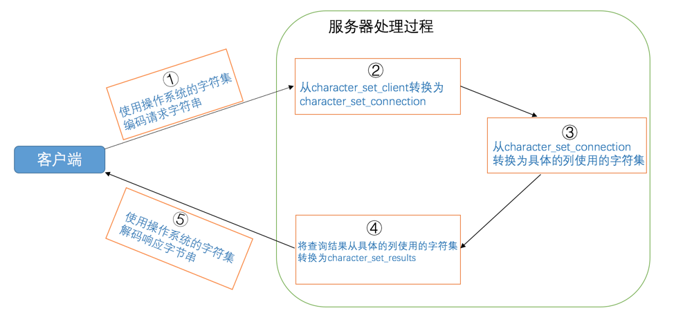
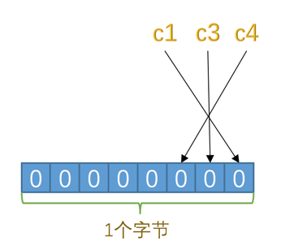

# mysql

## 入门知识

### 客户端/服务器架构

mysql其实是由两部分组成的，一部分是客户端程序，一部分是服务器程序。`MySQL`服务器进程的默认名称为`mysqld`， 而我们常用的`MySQL`客户端进程的默认名称为`mysql`。

### bin目录下的可执行文件

```shell
.
├── mysql
├── mysql.server -> ../support-files/mysql.server
├── mysqladmin
├── mysqlbinlog
├── mysqlcheck
├── mysqld
├── mysqld_multi
├── mysqld_safe
├── mysqldump
├── mysqlimport
├── mysqlpump
... (省略其他文件)
0 directories, 40 files
```

#### 服务器进程命令

- mysqld

  `mysqld`这个可执行文件就代表着`MySQL`服务器程序，运行这个可执行文件就可以直接启动一个服务器进程。

- mysqld_safe

  `mysqld_safe`是一个启动脚本，它会间接的调用`mysqld`，而且还顺便启动了另外一个监控进程，这个监控进程在服务器进程挂了的时候，可以帮助重启它。另外，使用`mysqld_safe`启动服务器程序时，它会将服务器程序的出错信息和其他诊断信息重定向到某个文件中，产生出错日志，这样可以方便我们找出发生错误的原因。

- mysql.server

  `mysql.server`也是一个启动脚本，它会间接的调用`mysqld_safe`，在调用`mysql.server`时在后边指定`start`参数就可以启动服务器程序

- mysqld_multi

  其实我们一台计算机上也可以运行多个服务器实例，也就是运行多个`MySQL`服务器进程。`mysql_multi`可执行文件可以对每一个服务器进程的启动或停止进行监控。

#### 客户端进程命令

`bin`目录下有许多客户端程序，比方说`mysqladmin`、`mysqldump`、`mysqlcheck`，最重要的是`mysql`

```shell
mysql -h主机名  -u用户名 -p密码
```

| 参数名 | 含义                                                         |
| ------ | ------------------------------------------------------------ |
| `-h`   | 表示服务器进程所在计算机的域名或者IP地址，如果服务器进程就运行在本机的话，可以省略这个参数，或者填`localhost`或者`127.0.0.1`。也可以写作 `--host=主机名`的形式。 |
| `-u`   | 表示用户名。也可以写作 `--user=用户名`的形式。               |
| `-p`   | 表示密码。也可以写作 `--password=密码`的形式。               |


### 客户端进程和服务器进程的通信方式

#### TCP/IP

`MySQL`采用`TCP`作为服务器和客户端之间的网络通信协议。`MySQL`服务器启动的时候会默认申请`3306`端口号，

```shell
## 如果`3306`端口号已经被别的进程占用了，那可以在启动服务器程序的命令行里添加`-P`参数来明确指定一下端口号
mysqld -P3307
```

```shell
## 客户端连接时也可以指定端口号
mysql -h127.0.0.1 -uroot -P3307 -p
```

#### Unix域套接字文件

如果我们的服务器进程和客户端进程都运行在同一台操作系统为类`Unix`的机器上的话，我们可以使用`Unix域套接字文件`来进行进程间通信。如果我们在启动客户端程序的时候指定的主机名为`localhost`，或者指定了`--protocol=socket`的启动参数，那服务器程序和客户端程序之间就可以通过`Unix`域套接字文件来进行通信了。`MySQL`服务器程序默认监听的`Unix`域套接字文件路径为`/tmp/mysql.sock`，客户端程序也默认连接到这个`Unix`域套接字文件。如果我们想改变这个默认路径，可以在启动服务器程序时指定`socket`参数，就像这样：

```shell
mysqld --socket=/tmp/a.txt
```

如果客户端程序想通过`UNIX`域套接字文件进行通信的话，也需要显式的指定连接到的`UNIX`域套接字文件路径，就像这样：

```shell
mysql -hlocalhost -uroot --socket=/tmp/a.txt -p
```


### 服务器处理客户端请求

不论客户端进程和服务器进程是采用哪种方式进行通信，最后实现的效果都是：客户端进程向服务器进程发送一段文本（MySQL语句），服务器进程处理后再向客户端进程发送一段文本（处理结果）。服务器程序处理来自客户端的查询请求大致需要经过三个部分，分别是`连接管理`、`解析与优化`、`存储引擎`。


#### 连接管理

每当有一个客户端进程连接到服务器进程时，服务器进程都会创建一个线程来专门处理与这个客户端的交互，当该客户端退出时会与服务器断开连接，服务器并不会立即把与该客户端交互的线程销毁掉，而是把它缓存起来，在另一个新的客户端再进行连接时，把这个缓存的线程分配给该新客户端。

在客户端程序发起连接的时候，需要携带主机信息、用户名、密码，服务器程序会对客户端程序提供的这些信息进行认证，如果认证失败，服务器程序会拒绝连接。

如果客户端程序和服务器程序不运行在一台计算机上，我们还可以采用使用了`SSL`（安全套接字）的网络连接进行通信，来保证数据传输的安全性。

#### 解析与优化

##### 查询缓存

`MySQL`服务器程序处理查询请求的过程会把刚刚处理过的查询请求和结果`缓存`起来，如果下一次有一模一样的请求过来，直接从缓存中查找结果，这个查询缓存可以在不同客户端之间共享，也就是说如果客户端A刚刚查询了一个语句，而客户端B之后发送了同样的查询请求，那么客户端B的这次查询就可以直接使用查询缓存中的数据。

- 如果两个查询请求在任何字符上的不同（例如：空格、注释、大小写），都会导致缓存不会命中。
- 如果查询请求中包含某些系统函数、用户自定义变量和函数、一些系统表，如 mysql 、information_schema、 performance_schema 数据库中的表，那这个请求就不会被缓存
- MySQL的缓存系统会监测涉及到的每张表，只要该表的结构或者数据被修改，如对该表使用了`INSERT`、 `UPDATE`、`DELETE`、`TRUNCATE TABLE`、`ALTER TABLE`、`DROP TABLE`或 `DROP DATABASE`语句，那使用该表的所有高速缓存查询都将变为无效并从高速缓存中删除！

> 小贴士：虽然查询缓存有时可以提升系统性能，但也不得不因维护这块缓存而造成一些开销，比如每次都要去查询缓存中检索，查询请求处理完需要更新查询缓存，维护该查询缓存对应的内存区域。从MySQL 5.7.20开始，不推荐使用查询缓存，并在MySQL 8.0中删除。


##### 语法解析

如果查询缓存没有命中，接下来就需要进入正式的查询阶段了。因为客户端程序发送过来的请求只是一段文本而已，所以`MySQL`服务器程序首先要对这段文本做分析，判断请求的语法是否正确，然后从文本中将要查询的表、各种查询条件都提取出来放到`MySQL`服务器内部使用的一些数据结构上来。

##### 查询优化

语法解析之后，服务器程序获得到了需要的信息，比如要查询的列是哪些，表是哪个，搜索条件是什么等等，但光有这些是不够的，因为我们写的`MySQL`语句执行起来效率可能并不是很高，`MySQL`的优化程序会对我们的语句做一些优化，如外连接转换为内连接、表达式简化、子查询转为连接等等的一堆东西。优化的结果就是生成一个执行计划，这个执行计划表明了应该使用哪些索引进行查询，表之间的连接顺序是什么样的。我们可以使用`EXPLAIN`语句来查看某个语句的执行计划。

#### 存储引擎

​	截止到服务器程序完成了查询优化为止，还没有真正的去访问真实的数据表，**`MySQL`服务器把数据的存储和提取操作都封装到了一个叫`存储引擎`的模块**里。我们知道`表`是由一行一行的记录组成的，但这只是一个逻辑上的概念，物理上如何表示记录，怎么从表中读取数据，怎么把数据写入具体的物理存储器上，这都是`存储引擎`负责的事情。为了实现不同的功能，`MySQL`提供了各式各样的`存储引擎`，不同`存储引擎`管理的表具体的存储结构可能不同，采用的存取算法也可能不同。

​	为了管理方便，人们把`连接管理`、`查询缓存`、`语法解析`、`查询优化`这些并不涉及真实数据存储的功能划分为`MySQL server`的功能，把真实存取数据的功能划分为`存储引擎`的功能。各种不同的存储引擎向上面的`MySQL server`层提供统一的调用接口（也就是存储引擎API），包含了几十个底层函数，像"读取索引第一条内容"、"读取索引下一条内容"、"插入记录"等等。

##### 常见的存储引擎

| 存储引擎     | 描述                                 |
| ------------ | ------------------------------------ |
| `ARCHIVE`    | 用于数据存档（行被插入后不能再修改） |
| `BLACKHOLE`  | 丢弃写操作，读操作会返回空内容       |
| `CSV`        | 在存储数据时，以逗号分隔各个数据项   |
| `FEDERATED`  | 用来访问远程表                       |
| **`InnoDB`** | **具备外键支持功能的事务存储引擎**   |
| **`MEMORY`** | **置于内存的表**                     |
| `MERGE`      | 用来管理多个MyISAM表构成的表集合     |
| **`MyISAM`** | **主要的非事务处理存储引擎**         |
| `NDB`        | MySQL集群专用存储引擎                |

##### 存储引擎支持的功能

| Feature                               | MyISAM | Memory  | InnoDB | Archive | NDB   |
| ------------------------------------- | ------ | ------- | ------ | ------- | ----- |
| B-tree indexes                        | yes    | yes     | yes    | no      | no    |
| Backup/point-in-time recovery         | yes    | yes     | yes    | yes     | yes   |
| Cluster database support              | no     | no      | no     | no      | yes   |
| Clustered indexes                     | no     | no      | yes    | no      | no    |
| Compressed data                       | yes    | no      | yes    | yes     | no    |
| Data caches                           | no     | N/A     | yes    | no      | yes   |
| Encrypted data                        | yes    | yes     | yes    | yes     | yes   |
| Foreign key support                   | no     | no      | yes    | no      | yes   |
| Full-text search indexes              | yes    | no      | yes    | no      | no    |
| Geospatial data type support          | yes    | no      | yes    | yes     | yes   |
| Geospatial indexing support           | yes    | no      | yes    | no      | no    |
| Hash indexes                          | no     | yes     | no     | no      | yes   |
| Index caches                          | yes    | N/A     | yes    | no      | yes   |
| Locking granularity                   | Table  | Table   | Row    | Row     | Row   |
| MVCC                                  | no     | no      | yes    | no      | no    |
| Query cache support                   | yes    | yes     | yes    | yes     | yes   |
| Replication support                   | yes    | Limited | yes    | yes     | yes   |
| Storage limits                        | 256TB  | RAM     | 64TB   | None    | 384EB |
| T-tree indexes                        | no     | no      | no     | no      | yes   |
| Transactions                          | no     | no      | yes    | no      | yes   |
| Update statistics for data dictionary | yes    | yes     | yes    | yes     | yes   |

##### 设置表存储引擎

```mysql
##创建表时
CREATE TABLE 表名(
    建表语句;
) ENGINE = 存储引擎名称;

##修改表存储引擎
ALTER TABLE 表名 ENGINE = 存储引擎名称;

```


### 启动选项和系统变量

#### 启动选项

每个MySQL程序都有许多不同的选项。大多数程序提供了一个`--help`选项，你可以查看该程序支持的全部启动选项以及它们的默认值。例如，使用`mysql --help`可以看到`mysql`程序支持的启动选项，`mysqld_safe --help`可以看到`mysqld_safe`程序支持的启动选项。查看`mysqld`支持的启动选项有些特别，需要使用`mysqld --verbose --help`。

```shell
mysqld --启动选项1[=值1] --启动选项2[=值2] ... --启动选项n[=值n]
mysqld --skip_networking
mysqld --default-storage-engine=MyISAM
```

**常见的启动选项**

```shell
mysqld --verbose --help #更多的启动选项使用这个命令查看
```

| 长形式       | 短形式 | 含义     |
| ------------ | ------ | -------- |
| `--host`     | `-h`   | 主机名   |
| `--user`     | `-u`   | 用户名   |
| `--password` | `-p`   | 密码     |
| `--port`     | `-P`   | 端口     |
| `--version`  | `-V`   | 版本信息 |

**配置文件**

在命令行中设置启动选项只对当次启动生效，我们也可以把需要设置的启动选项都写在配置文件中，每次启动服务器的时候都从这个文件里加载相应的启动选项。

在类`UNIX`操作系统中，`MySQL`会按照下列路径来寻找配置文件：

**如果我们在多个配置文件中设置了相同的启动选项，那以最后一个配置文件中的为准。**

| 路径名                | 备注                                                         |
| --------------------- | ------------------------------------------------------------ |
| `/etc/my.cnf`         |                                                              |
| `/etc/mysql/my.cnf`   |                                                              |
| `SYSCONFDIR/my.cnf`   |                                                              |
| `$MYSQL_HOME/my.cnf`  | 特定于服务器的选项（仅限服务器）                             |
| `defaults-extra-file` | 命令行指定的额外配置文件路径 `mysqld --defaults-extra-file=C:\Users\xiaohaizi\my_extra_file.txt` |
| `~/.my.cnf`           | 用户特定选项                                                 |
| `~/.mylogin.cnf`      | 用户特定的登录路径选项（仅限客户端）                         |

如果我们不想让`MySQL`到上表中的路径中搜索配置文件，可以指定

```shell
mysqld --defaults-file=/tmp/myconfig.txt
```

**配置文件内容**

```shell
[server]
option1            #这是option1，该选项不需要选项值
option2 = value2      #这是option2，该选项需要选项值

[mysqld]
(具体的启动选项...)
#我们可以在选项组的名称后加上特定的MySQL版本号，比如对于[mysqld]选项组来说，我们可以定义一个[mysqld-5.7]的选项组，它的含义和[mysqld]一样，只不过只有版本号为5.7的mysqld程序才能使用这个选项组中的选项。

[mysqld_safe]
(具体的启动选项...)

[client]
(具体的启动选项...)

[mysql]
(具体的启动选项...)

[mysqladmin]
(具体的启动选项...)
```

| 启动命令       | 类别       | 能读取的组                               |
| -------------- | ---------- | ---------------------------------------- |
| `mysqld`       | 启动服务器 | `[mysqld]`、`[server]`                   |
| `mysqld_safe`  | 启动服务器 | `[mysqld]`、`[server]`、`[mysqld_safe]`  |
| `mysql.server` | 启动服务器 | `[mysqld]`、`[server]`、`[mysql.server]` |
| `mysql`        | 启动客户端 | `[mysql]`、`[client]`                    |
| `mysqladmin`   | 启动客户端 | `[mysqladmin]`、`[client]`               |
| `mysqldump`    | 启动客户端 | `[mysqldump]`、`[client]`                |

```shell
#如果在同一个配置文件中，不同组里出现了同样的配置项，将以最后一个出现的组中的启动选项为准
[server]
default-storage-engine=InnoDB

[mysqld]
default-storage-engine=MyISAM
```

**如果同一个启动选项既出现在命令行中，又出现在配置文件中，那么以命令行中的启动选项为准**


#### 系统变量

`MySQL`服务器程序运行过程中会用到许多影响程序行为的变量，它们被称为`MySQL`系统变量，每个系统变量都有一个默认值，**我们可以使用命令行或者配置文件中的选项在启动服务器时改变一些系统变量的值。大多数的系统变量的值可以进行动态修改而无需停止并重启服务。**

```mysql
# 查看全局/当前会话下的系统变量值分别是多少
SHOW [GLOBAL|SESSION] VARIABLES [LIKE 匹配的模式];

SHOW VARIABLES like 'max_connections';  #默认是151个客户端连接
SHOW VARIABLES LIKE 'default_storage_engine'; #默认是innodb
SHOW VARIABLES LIKE 'default%';
```


**系统变量的作用范围**

- `GLOBAL`：全局变量，影响服务器的整体操作。
- `SESSION`：会话变量，影响某个客户端连接的操作。（注：`SESSION`有个别名叫`LOCAL`）

```mysql
#运行过程中设置系统变量
SET [GLOBAL|SESSION] 系统变量名 = 值;
SET [@@(GLOBAL|SESSION).]var_name = XXX;

#设置全局变量
语句一：SET GLOBAL default_storage_engine = MyISAM;
语句二：SET @@GLOBAL.default_storage_engine = MyISAM;

#设置会话变量
语句一：SET SESSION default_storage_engine = MyISAM;
语句二：SET @@SESSION.default_storage_engine = MyISAM;
语句三：SET default_storage_engine = MyISAM;

```

- 并不是所有系统变量都具有`GLOBAL`和`SESSION`的作用范围。

  - 有一些系统变量只具有`GLOBAL`作用范围，比方说`max_connections`，表示服务器程序支持同时最多有多少个客户端程序进行连接。
  - 有一些系统变量只具有`SESSION`作用范围，比如`insert_id`，表示在对某个包含`AUTO_INCREMENT`列的表进行插入时，该列初始的值。
  - 有一些系统变量的值既具有`GLOBAL`作用范围，也具有`SESSION`作用范围，比如我们前面用到的`default_storage_engine`，而且其实大部分的系统变量都是这样的，

- 有些系统变量是只读的，并不能设置值。

    比方说`version`，表示当前`MySQL`的版本，我们客户端是不能设置它的值的，只能在`SHOW VARIABLES`语句里查看。

#### 状态变量

为了让我们更好的了解服务器程序的运行情况，`MySQL`服务器程序中维护了很多关于程序运行状态的变量，它们被称为`状态变量`。状态变量不可设置。

`状态变量`也有`GLOBAL`和`SESSION`两个作用范围

```mysql
#查询全局/当前会话下的状态变量值
SHOW [GLOBAL|SESSION] STATUS [LIKE 匹配的模式];

SHOW STATUS LIKE 'thread%';
```


### 字符集和比较规则

#### 常见字符集

- `ASCII`字符集

共收录128个字符，包括空格、标点符号、数字、大小写字母和一些不可见字符。由于总共才128个字符，所以可以使用1个字节来进行编码，我们看一些字符的编码方式：

```
'L' ->  01001100（十六进制：0x4C，十进制：76）
'M' ->  01001101（十六进制：0x4D，十进制：77）
```

- `ISO 8859-1`字符集

    共收录256个字符，是在`ASCII`字符集的基础上又扩充了128个西欧常用字符(包括德法两国的字母)，也可以使用1个字节来进行编码。这个字符集也有一个别名`latin1`。

- `GB2312`字符集

    收录了汉字以及拉丁字母、希腊字母、日文平假名及片假名字母、俄语西里尔字母。其中收录汉字6763个，其他文字符号682个。同时这种字符集又兼容`ASCII`字符集，所以在编码方式上显得有些奇怪：

  - 如果该字符在`ASCII`字符集中，则采用1字节编码。
  - 否则采用2字节编码。

    这种表示一个字符需要的字节数可能不同的编码方式称为`变长编码方式`。比方说字符串`'爱u'`，其中`'爱'`需要用2个字节进行编码，编码后的十六进制表示为`0xB0AE`，`'u'`需要用1个字节进行编码，编码后的十六进制表示为`0x75`，所以拼合起来就是`0xB0AE75`。

- `GBK`字符集

    `GBK`字符集只是在收录字符范围上对`GB2312`字符集作了扩充，编码方式上兼容`GB2312`。

- `utf8`字符集

    收录地球上能想到的所有字符，而且还在不断扩充。这种字符集兼容`ASCII`字符集，采用变长编码方式，编码一个字符需要使用1～4个字节，比方说这样：

  ```
  'L' ->  01001100（十六进制：0x4C）
  '啊' ->  111001011001010110001010（十六进制：0xE5958A）
  ```

  > 其实准确的说，utf8只是Unicode字符集的一种编码方案，Unicode字符集可以采用utf8、utf16、utf32这几种编码方案，utf8使用1～4个字节编码一个字符，utf16使用2个或4个字节编码一个字符，utf32使用4个字节编码一个字符。

    对于同一个字符，不同字符集也可能有不同的编码方式。比如对于汉字`'我'`来说，`ASCII`字符集中根本没有收录这个字符，`utf8`和`gb2312`字符集对汉字`我`的编码方式如下：

  ```
  utf8编码：111001101000100010010001 (3个字节，十六进制表示是：0xE68891)
  gb2312编码：1100111011010010 (2个字节，十六进制表示是：0xCED2)
  ```

#### MySQL中支持的字符集和排序规则

##### 字符集

**MySQL中的utf8和utf8mb4**

 我们上面说`utf8`字符集表示一个字符需要使用1～4个字节，但是我们常用的一些字符使用1～3个字节就可以表示了，所以在MySQL中对`utf8`字符集做了处理。

- `utf8mb3`：阉割过的`utf8`字符集，只使用1～3个字节表示字符。能保存常用的字符，不全
- `utf8mb4`：正宗的`utf8`字符集，使用1～4个字节表示字符。能保存所有字符，包括emoji表情等

```mysql
#查看MySQL中支持的字符集
SHOW (CHARACTER SET|CHARSET) [LIKE 匹配的模式];

mysql> SHOW CHARSET;
+----------+---------------------------------+---------------------+--------+
| Charset  | Description                     | Default collation   | Maxlen |
+----------+---------------------------------+---------------------+--------+
| big5     | Big5 Traditional Chinese        | big5_chinese_ci     |      2 |
...
| latin1   | cp1252 West European            | latin1_swedish_ci   |      1 |
| latin2   | ISO 8859-2 Central European     | latin2_general_ci   |      1 |
...
| ascii    | US ASCII                        | ascii_general_ci    |      1 |
...
| gb2312   | GB2312 Simplified Chinese       | gb2312_chinese_ci   |      2 |
...
| gbk      | GBK Simplified Chinese          | gbk_chinese_ci      |      2 |
| latin5   | ISO 8859-9 Turkish              | latin5_turkish_ci   |      1 |
...
| utf8     | UTF-8 Unicode                   | utf8_general_ci     |      3 |
| ucs2     | UCS-2 Unicode                   | ucs2_general_ci     |      2 |
...
| latin7   | ISO 8859-13 Baltic              | latin7_general_ci   |      1 |
| utf8mb4  | UTF-8 Unicode                   | utf8mb4_general_ci  |      4 |
| utf16    | UTF-16 Unicode                  | utf16_general_ci    |      4 |
| utf16le  | UTF-16LE Unicode                | utf16le_general_ci  |      4 |
...
| utf32    | UTF-32 Unicode                  | utf32_general_ci    |      4 |
| binary   | Binary pseudo charset           | binary              |      1 |
...
| gb18030  | China National Standard GB18030 | gb18030_chinese_ci  |      4 |
+----------+---------------------------------+---------------------+--------+
41 rows in set (0.01 sec)

```


##### 排序规则

每个字符集对应着若干种排序规则，也有一个默认的排序规则

- 比较规则名称以与其关联的字符集的名称开头。如上图的查询结果的比较规则名称都是以`utf8`开头的。

- 后边紧跟着该比较规则主要作用于哪种语言，比如`utf8_polish_ci`表示以波兰语的规则比较，`utf8_spanish_ci`是以西班牙语的规则比较，`utf8_general_ci`是一种通用的比较规则。

- 名称后缀意味着该比较规则是否区分语言中的重音、大小写什么的，具体可以用的值如下：

- | 后缀   | 英文释义             | 描述             |
  | ------ | -------------------- | ---------------- |
  | `_ai`  | `accent insensitive` | 不区分重音       |
  | `_as`  | `accent sensitive`   | 区分重音         |
  | `_ci`  | `case insensitive`   | 不区分大小写     |
  | `_cs`  | `case sensitive`     | 区分大小写       |
  | `_bin` | `binary`             | 以二进制方式比较 |

```mysql
# 查看所有的排序规则
SHOW COLLATION [LIKE 匹配的模式];


mysql> SHOW COLLATION LIKE 'utf8\_%';
+--------------------------+---------+-----+---------+----------+---------+
| Collation                | Charset | Id  | Default | Compiled | Sortlen |
+--------------------------+---------+-----+---------+----------+---------+
| utf8_general_ci          | utf8    |  33 | Yes     | Yes      |       1 |
| utf8_bin                 | utf8    |  83 |         | Yes      |       1 |
| utf8_unicode_ci          | utf8    | 192 |         | Yes      |       8 |
| utf8_icelandic_ci        | utf8    | 193 |         | Yes      |       8 |
| utf8_latvian_ci          | utf8    | 194 |         | Yes      |       8 |
| utf8_romanian_ci         | utf8    | 195 |         | Yes      |       8 |
| utf8_slovenian_ci        | utf8    | 196 |         | Yes      |       8 |
| utf8_polish_ci           | utf8    | 197 |         | Yes      |       8 |
| utf8_estonian_ci         | utf8    | 198 |         | Yes      |       8 |
| utf8_spanish_ci          | utf8    | 199 |         | Yes      |       8 |
| utf8_swedish_ci          | utf8    | 200 |         | Yes      |       8 |
| utf8_turkish_ci          | utf8    | 201 |         | Yes      |       8 |
| utf8_czech_ci            | utf8    | 202 |         | Yes      |       8 |
| utf8_danish_ci           | utf8    | 203 |         | Yes      |       8 |
| utf8_lithuanian_ci       | utf8    | 204 |         | Yes      |       8 |
| utf8_slovak_ci           | utf8    | 205 |         | Yes      |       8 |
| utf8_spanish2_ci         | utf8    | 206 |         | Yes      |       8 |
| utf8_roman_ci            | utf8    | 207 |         | Yes      |       8 |
| utf8_persian_ci          | utf8    | 208 |         | Yes      |       8 |
| utf8_esperanto_ci        | utf8    | 209 |         | Yes      |       8 |
| utf8_hungarian_ci        | utf8    | 210 |         | Yes      |       8 |
| utf8_sinhala_ci          | utf8    | 211 |         | Yes      |       8 |
| utf8_german2_ci          | utf8    | 212 |         | Yes      |       8 |
| utf8_croatian_ci         | utf8    | 213 |         | Yes      |       8 |
| utf8_unicode_520_ci      | utf8    | 214 |         | Yes      |       8 |
| utf8_vietnamese_ci       | utf8    | 215 |         | Yes      |       8 |
| utf8_general_mysql500_ci | utf8    | 223 |         | Yes      |       1 |
+--------------------------+---------+-----+---------+----------+---------+
27 rows in set (0.00 sec)

```


##### 各级别的字符集和比较规则

`MySQL`有4个级别的字符集和比较规则，分别是：

- 服务器级别
- 数据库级别
- 表级别
- 列级别

**服务器级别**

| 系统变量               | 描述                 |
| ---------------------- | -------------------- |
| `character_set_server` | 服务器级别的字符集   |
| `collation_server`     | 服务器级别的比较规则 |

```mysql
mysql> SHOW VARIABLES LIKE 'character_set_server';
+----------------------+-------+
| Variable_name        | Value |
+----------------------+-------+
| character_set_server | utf8  |
+----------------------+-------+
1 row in set (0.00 sec)

mysql> SHOW VARIABLES LIKE 'collation_server';
+------------------+-----------------+
| Variable_name    | Value           |
+------------------+-----------------+
| collation_server | utf8_general_ci |
+------------------+-----------------+
1 row in set (0.00 sec)
```

**数据库级别**

```mysql
CREATE DATABASE 数据库名
    [[DEFAULT] CHARACTER SET 字符集名称]
    [[DEFAULT] COLLATE 比较规则名称];

ALTER DATABASE 数据库名
    [[DEFAULT] CHARACTER SET 字符集名称]
    [[DEFAULT] COLLATE 比较规则名称];
    
CREATE DATABASE charset_demo_db
    CHARACTER SET gb2312
    COLLATE gb2312_chinese_ci;
#如果不指定字符集和排序规则，将使用服务器级别的字符集和比较规则作为数据库的字符集和比较规则    
```

如果想查看当前数据库使用的字符集和比较规则，可以查看下面两个系统变量的值（前提是使用`USE`语句选择当前默认数据库，如果没有默认数据库，则变量与相应的服务器级系统变量具有相同的值）：

| 系统变量                 | 描述                 |
| ------------------------ | -------------------- |
| `character_set_database` | 当前数据库的字符集   |
| `collation_database`     | 当前数据库的比较规则 |

```mysql
#切换数据库
mysql> USE charset_demo_db;
Database changed

mysql> SHOW VARIABLES LIKE 'character_set_database';
+------------------------+--------+
| Variable_name          | Value  |
+------------------------+--------+
| character_set_database | gb2312 |
+------------------------+--------+
1 row in set (0.00 sec)

mysql> SHOW VARIABLES LIKE 'collation_database';
+--------------------+-------------------+
| Variable_name      | Value             |
+--------------------+-------------------+
| collation_database | gb2312_chinese_ci |
+--------------------+-------------------+
1 row in set (0.00 sec)

mysql>
```

**表级别**

```mysql
CREATE TABLE 表名 (列的信息)
    [[DEFAULT] CHARACTER SET 字符集名称]
    [COLLATE 比较规则名称]]

ALTER TABLE 表名
    [[DEFAULT] CHARACTER SET 字符集名称]
    [COLLATE 比较规则名称]
    
CREATE TABLE t
(
    col VARCHAR(10)
) CHARACTER SET utf8
  COLLATE utf8_general_ci;    
#如果创建和修改表的语句中没有指明字符集和比较规则，将使用该表所在数据库的字符集和比较规则作为该表的字符集和比较规则。  
```

**列级别**

对于存储字符串的列，同一个表中的不同的列也可以有不同的字符集和比较规则。

```mysql
CREATE TABLE 表名(
    列名 字符串类型 [CHARACTER SET 字符集名称] [COLLATE 比较规则名称],
    其他列...
);

ALTER TABLE 表名 MODIFY 列名 字符串类型 [CHARACTER SET 字符集名称] [COLLATE 比较规则名称];

ALTER TABLE t MODIFY col VARCHAR(10) CHARACTER SET gbk COLLATE gbk_chinese_ci;

#如果在创建和修改的语句中没有指明字符集和比较规则，将使用该列所在表的字符集和比较规则作为该列的字符集和比较规则。
#如果修改字符集，修改前的字符集是utf8，其中包含了汉字，修改后的字符集是ascii，那么就会报错
```


##### 仅修改字符集或仅修改比较规则

- 只修改字符集，则比较规则将变为修改后的字符集默认的比较规则。
- 只修改比较规则，则字符集将变为修改后的比较规则对应的字符集。


#### 客户端和服务器通信中的字符集

##### 乱码

 我们知道字符`'我'`在`utf8`字符集编码下的字节串长这样：`0xE68891`，如果一个程序把这个字节串发送到另一个程序里，另一个程序用不同的字符集去解码这个字节串，假设使用的是`gbk`字符集来解释这串字节，解码过程就是这样的：

1. 首先看第一个字节`0xE6`，它的值大于`0x7F`（十进制：127），说明是两字节编码，继续读一字节后是`0xE688`，然后从`gbk`编码表中查找字节为`0xE688`对应的字符，发现是字符`'鎴'`
2. 继续读一个字节`0x91`，它的值也大于`0x7F`，再往后读一个字节发现木有了，所以这是半个字符。
3. 所以`0xE68891`被`gbk`字符集解释成一个字符`'鎴'`和半个字符。

  假设用`iso-8859-1`，也就是`latin1`字符集去解释这串字节，解码过程如下：

1. 先读第一个字节`0xE6`，它对应的`latin1`字符为`æ`。
2. 再读第二个字节`0x88`，它对应的`latin1`字符为`ˆ`。
3. 再读第二个字节`0x91`，它对应的`latin1`字符为`‘`。
4. 所以整串字节`0xE68891`被`latin1`字符集解释后的字符串就是`'我'`

  可见，如果对于同一个字符串编码和解码使用的字符集不一样，会产生意想不到的结果，作为人类的我们看上去就像是产生了乱码一样。

##### 字符集转换

> 如果接收`0xE68891`这个字节串的程序按照`utf8`字符集进行解码，然后又把它按照`gbk`字符集进行编码，最后编码后的字节串就是`0xCED2`，我们把这个过程称为`字符集的转换`，也就是字符串`'我'`从`utf8`字符集转换为`gbk`字符集。、

MySQL从发送请求到返回结果这个过程中伴随着多次字符集的转换，在这个过程中会用到3个系统变量

| 系统变量                   | 描述                                                         |
| -------------------------- | ------------------------------------------------------------ |
| `character_set_client`     | 服务器解码请求时使用的字符集                                 |
| `character_set_connection` | 服务器处理请求时会把请求字符串从`character_set_client`转为`character_set_connection` |
| `character_set_results`    | 服务器向客户端返回数据时使用的字符集                         |


**MySQL字符转换过程**

- 客户端使用`utf8`字符集编码请求字符串成为二进制，发送给MySQL服务器
- MySQL服务器收到请求二进制，以`character_set_client`的字符集解码成为字符串
- 将以`character_set_client`解码的字符串，以`character_set_connection`编码解码，即从`character_set_client`转换成`character_set_connection`字符集
- 再比对表中列使用的字符集，如果不一致，则从`character_set_connection`编码转换成为列字符集编码
- 查询结果
- 将查询结果从列字符集合转换成`character_set_results`字符集发送给客户端
- 客户端使用`utf8`字符集解码响应字符串



```mysql
# 便捷设置以下三种字符集
SET NAMES 字符集名;

SET character_set_client = 字符集名;
SET character_set_connection = 字符集名;
SET character_set_results = 字符集名;

```


#### 比较规则的应用

`比较规则`的作用通常体现比较字符串大小的表达式以及对某个字符串列进行排序中，所以有时候也称为`排序规则`。

```mysql
# 使用gbk_chinese_ci排序规则
mysql> SELECT * FROM t ORDER BY col;
+------+
| col  |
+------+
| a    |
| A    |
| b    |
| B    |
| 我   |
+------+
5 rows in set (0.00 sec)
```


## 基础知识

### InnoDB记录结构

#### InnoDB页

为了平衡内存和磁盘之间的速度差，MySQL将数据划分为若干个页，以页作为磁盘和内存之间交互的基本单位，**InnoDB中页的大小一般为 16KB**。也就是在一般情况下，一次最少从磁盘中读取16KB的内容到内存中，一次最少把内存中的16KB内容刷新到磁盘中。

#### InnoDB行格式

我们平时是以记录为单位来向表中插入数据的，这些记录在磁盘上的存放方式也被称为`行格式`或者`记录格式`。

innoDB中存在四种行格式：`Compact`、`Redundant`、`Dynamic`和`Compressed`行格式

```mysql
# 创建/修改表时指定行格式
CREATE TABLE 表名 (列的信息) ROW_FORMAT=行格式名称
    
ALTER TABLE 表名 ROW_FORMAT=行格式名称
```


##### Compact

一条完整的记录其实可以被分为**记录的额外信息**和**记录的真实数据**两大部分


###### 记录的额外信息

这部分信息是服务器为了描述这条记录而不得不额外添加的一些信息，这些额外信息分为3类，分别是**变长字段长度列表**、**NULL值列表**和**记录头信息**

**变长字段长度列表**

MySQL中支持一些变长的数据类型(如：VARCHAR、TEXT、VARBINARY、BLOB)，变长字段的实际存储分为两部分：**真正的数据内容**和**占用的字节数**

在Compact格式中，**把所有变长字段的真实数据占用的字节长度都存放在记录的开头部位，从而形成一个变长字段长度列表，各变长字段数据占用的字节数按照列的顺序逆序存放**

例如 01 03 04 则表示 列3 列2 列1的字节长度分别为 1、3、4


变长字段数据占用的字节数可以使用1个字节或者2个字节存储，具体规则：

1. 假设某个字符集中表示一个字符最多需要使用的字节数为`W`，也就是使用`SHOW CHARSET`语句的结果中的`Maxlen`列，比方说`utf8`字符集中的`W`就是`3`，`gbk`字符集中的`W`就是`2`，`ascii`字符集中的`W`就是`1`。
2. 对于变长类型`VARCHAR(M)`来说，这种类型表示能存储最多`M`个字符（注意是字符不是字节），所以这个类型能表示的字符串最多占用的字节数就是`M×W`。
3. 假设它实际存储的字符串占用的字节数是`L`。

  所以确定使用1个字节还是2个字节表示真正字符串占用的字节数的规则就是这样：

- 如果`M×W <= 255`，那么使用1个字节来表示真正字符串占用的字节数。

- 如果`M×W > 255`，则分为两种情况：

  - 如果`L <= 127`，则用1个字节来表示真正字符串占用的字节数。
  - 如果`L > 127`，则用2个字节来表示真正字符串占用的字节数。

  当L<=127时，某变长字段的长度就是 `0000 0001`，第一位为`0`表示只有一个字节，去掉一个标识位共7个bit标识长度，最大127

  当L>127时，某变长字段的长度就是 `1000 0001 0010 0011`，第一位为`1`，标识两个字节，去掉1个标识符共15个bit表示长度，最大2的15次方-1

**变长字段长度列表中只存储值为 非NULL 的列内容占用的长度，值为 NULL 的列的长度是不储存的 。**


**NULL值列表**

将行记录中的所有NULL值集中存储，不占用真实的数据空间，将所有允许存储NULL值的列记为一个bit倒序存放，不足一个字节的高位补0。

如果不存在允许存储NULL值的列，此列表也就不存在。

例如：c1、c2、c3分别对应三个bit位，代表当前行记录中对应列是否为NULL



展示在对应的NULL值列表如图所示：


**记录头信息**

除了`变长字段长度列表`、`NULL值列表`之外，还有一个用于描述记录的`记录头信息`，它是由固定的`5`个字节组成。也就是`40`个二进制位


| 名称           | 大小（单位：bit） | 描述                                                         |
| -------------- | ----------------- | ------------------------------------------------------------ |
| `预留位1`      | `1`               | 没有使用                                                     |
| `预留位2`      | `1`               | 没有使用                                                     |
| `delete_mask`  | `1`               | 标记该记录是否被删除                                         |
| `min_rec_mask` | `1`               | B+树的每层非叶子节点中的最小记录都会添加该标记               |
| `n_owned`      | `4`               | 表示当前记录拥有的记录数                                     |
| `heap_no`      | `13`              | 表示当前记录在记录堆的位置信息                               |
| `record_type`  | `3`               | 表示当前记录的类型，`0`表示普通记录，`1`表示B+树非叶子节点记录，`2`表示最小记录，`3`表示最大记录 |
| `next_record`  | `16`              | 表示下一条记录的相对位置                                     |

展示在对应的记录头信息如图所示：


###### 记录的真实数据


## 查询与优化


## 事务和锁


## 常见问题

### 有字段只有四个枚举值，适不适合添加索引


如果索引的区分度很小，假设字段的值分布均匀，那么无论搜索哪个值都可能得到一半的数据。在这些情况下，还不如不要索引，因为 MySQL 还有一个查询优化器，查询优化器发现某个值出现在表的数据行中的百分比（惯用的百分比界线是"30%"）很高的时候，它一般会忽略索引，进行全表扫描。区分度就是某个字段 column 不同值的个数「除以」表的总行数，计算公式如下：


比如，性别的区分度就很小，不适合建立索引或不适合排在联合索引列的靠前的位置，而 UUID 这类字段就比较适合做索引或排在联合索引列的靠前的位置。但是也要看具体的场景，如果 4 个枚举值里面，有一个枚举值占总数据的 20%，然后有业务需求需要查询这个枚举值的记录，那么这种场景下还是适合添加索引的，因为数据占比小的枚举值是能用到索引的。

**随机IO 顺序IO**

@todo 放到操作系统里 磁盘读取 