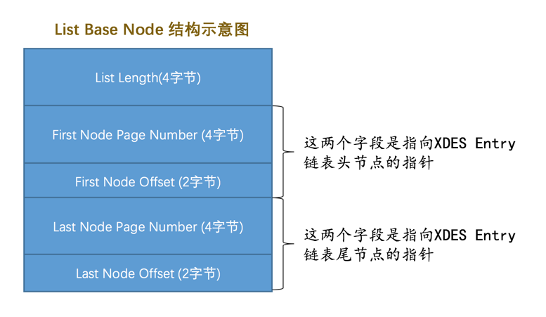

# mysql

## 入门知识

### 客户端/服务器架构

mysql其实是由两部分组成的，一部分是客户端程序，一部分是服务器程序。`MySQL`服务器进程的默认名称为`mysqld`， 而我们常用的`MySQL`客户端进程的默认名称为`mysql`。

### bin目录下的可执行文件

```shell
.
├── mysql
├── mysql.server -> ../support-files/mysql.server
├── mysqladmin
├── mysqlbinlog
├── mysqlcheck
├── mysqld
├── mysqld_multi
├── mysqld_safe
├── mysqldump
├── mysqlimport
├── mysqlpump
... (省略其他文件)
0 directories, 40 files
```

#### 服务器进程命令

- mysqld

  `mysqld`这个可执行文件就代表着`MySQL`服务器程序，运行这个可执行文件就可以直接启动一个服务器进程。

- mysqld_safe

  `mysqld_safe`是一个启动脚本，它会间接的调用`mysqld`，而且还顺便启动了另外一个监控进程，这个监控进程在服务器进程挂了的时候，可以帮助重启它。另外，使用`mysqld_safe`启动服务器程序时，它会将服务器程序的出错信息和其他诊断信息重定向到某个文件中，产生出错日志，这样可以方便我们找出发生错误的原因。

- mysql.server

  `mysql.server`也是一个启动脚本，它会间接的调用`mysqld_safe`，在调用`mysql.server`时在后边指定`start`参数就可以启动服务器程序

- mysqld_multi

  其实我们一台计算机上也可以运行多个服务器实例，也就是运行多个`MySQL`服务器进程。`mysql_multi`可执行文件可以对每一个服务器进程的启动或停止进行监控。

#### 客户端进程命令

`bin`目录下有许多客户端程序，比方说`mysqladmin`、`mysqldump`、`mysqlcheck`，最重要的是`mysql`

```shell
mysql -h主机名  -u用户名 -p密码
```

| 参数名 | 含义                                                         |
| ------ | ------------------------------------------------------------ |
| `-h`   | 表示服务器进程所在计算机的域名或者IP地址，如果服务器进程就运行在本机的话，可以省略这个参数，或者填`localhost`或者`127.0.0.1`。也可以写作 `--host=主机名`的形式。 |
| `-u`   | 表示用户名。也可以写作 `--user=用户名`的形式。               |
| `-p`   | 表示密码。也可以写作 `--password=密码`的形式。               |


### 客户端进程和服务器进程的通信方式

#### TCP/IP

`MySQL`采用`TCP`作为服务器和客户端之间的网络通信协议。`MySQL`服务器启动的时候会默认申请`3306`端口号，

```shell
## 如果`3306`端口号已经被别的进程占用了，那可以在启动服务器程序的命令行里添加`-P`参数来明确指定一下端口号
mysqld -P3307
```

```shell
## 客户端连接时也可以指定端口号
mysql -h127.0.0.1 -uroot -P3307 -p
```

#### Unix域套接字文件

如果我们的服务器进程和客户端进程都运行在同一台操作系统为类`Unix`的机器上的话，我们可以使用`Unix域套接字文件`来进行进程间通信。如果我们在启动客户端程序的时候指定的主机名为`localhost`，或者指定了`--protocol=socket`的启动参数，那服务器程序和客户端程序之间就可以通过`Unix`域套接字文件来进行通信了。`MySQL`服务器程序默认监听的`Unix`域套接字文件路径为`/tmp/mysql.sock`，客户端程序也默认连接到这个`Unix`域套接字文件。如果我们想改变这个默认路径，可以在启动服务器程序时指定`socket`参数，就像这样：

```shell
mysqld --socket=/tmp/a.txt
```

如果客户端程序想通过`UNIX`域套接字文件进行通信的话，也需要显式的指定连接到的`UNIX`域套接字文件路径，就像这样：

```shell
mysql -hlocalhost -uroot --socket=/tmp/a.txt -p
```


### 服务器处理客户端请求

不论客户端进程和服务器进程是采用哪种方式进行通信，最后实现的效果都是：客户端进程向服务器进程发送一段文本（MySQL语句），服务器进程处理后再向客户端进程发送一段文本（处理结果）。服务器程序处理来自客户端的查询请求大致需要经过三个部分，分别是`连接管理`、`解析与优化`、`存储引擎`。


#### 连接管理

每当有一个客户端进程连接到服务器进程时，服务器进程都会创建一个线程来专门处理与这个客户端的交互，当该客户端退出时会与服务器断开连接，服务器并不会立即把与该客户端交互的线程销毁掉，而是把它缓存起来，在另一个新的客户端再进行连接时，把这个缓存的线程分配给该新客户端。

在客户端程序发起连接的时候，需要携带主机信息、用户名、密码，服务器程序会对客户端程序提供的这些信息进行认证，如果认证失败，服务器程序会拒绝连接。

如果客户端程序和服务器程序不运行在一台计算机上，我们还可以采用使用了`SSL`（安全套接字）的网络连接进行通信，来保证数据传输的安全性。

#### 解析与优化

##### 查询缓存

`MySQL`服务器程序处理查询请求的过程会把刚刚处理过的查询请求和结果`缓存`起来，如果下一次有一模一样的请求过来，直接从缓存中查找结果，这个查询缓存可以在不同客户端之间共享，也就是说如果客户端A刚刚查询了一个语句，而客户端B之后发送了同样的查询请求，那么客户端B的这次查询就可以直接使用查询缓存中的数据。

- 如果两个查询请求在任何字符上的不同（例如：空格、注释、大小写），都会导致缓存不会命中。
- 如果查询请求中包含某些系统函数、用户自定义变量和函数、一些系统表，如 mysql 、information_schema、 performance_schema 数据库中的表，那这个请求就不会被缓存
- MySQL的缓存系统会监测涉及到的每张表，只要该表的结构或者数据被修改，如对该表使用了`INSERT`、 `UPDATE`、`DELETE`、`TRUNCATE TABLE`、`ALTER TABLE`、`DROP TABLE`或 `DROP DATABASE`语句，那使用该表的所有高速缓存查询都将变为无效并从高速缓存中删除！

> 小贴士：虽然查询缓存有时可以提升系统性能，但也不得不因维护这块缓存而造成一些开销，比如每次都要去查询缓存中检索，查询请求处理完需要更新查询缓存，维护该查询缓存对应的内存区域。从MySQL 5.7.20开始，不推荐使用查询缓存，并在MySQL 8.0中删除。


##### 语法解析

如果查询缓存没有命中，接下来就需要进入正式的查询阶段了。因为客户端程序发送过来的请求只是一段文本而已，所以`MySQL`服务器程序首先要对这段文本做分析，判断请求的语法是否正确，然后从文本中将要查询的表、各种查询条件都提取出来放到`MySQL`服务器内部使用的一些数据结构上来。

##### 查询优化

语法解析之后，服务器程序获得到了需要的信息，比如要查询的列是哪些，表是哪个，搜索条件是什么等等，但光有这些是不够的，因为我们写的`MySQL`语句执行起来效率可能并不是很高，`MySQL`的优化程序会对我们的语句做一些优化，如外连接转换为内连接、表达式简化、子查询转为连接等等的一堆东西。优化的结果就是生成一个执行计划，这个执行计划表明了应该使用哪些索引进行查询，表之间的连接顺序是什么样的。我们可以使用`EXPLAIN`语句来查看某个语句的执行计划。

#### 存储引擎

​	截止到服务器程序完成了查询优化为止，还没有真正的去访问真实的数据表，**`MySQL`服务器把数据的存储和提取操作都封装到了一个叫`存储引擎`的模块**里。我们知道`表`是由一行一行的记录组成的，但这只是一个逻辑上的概念，物理上如何表示记录，怎么从表中读取数据，怎么把数据写入具体的物理存储器上，这都是`存储引擎`负责的事情。为了实现不同的功能，`MySQL`提供了各式各样的`存储引擎`，不同`存储引擎`管理的表具体的存储结构可能不同，采用的存取算法也可能不同。

​	为了管理方便，人们把`连接管理`、`查询缓存`、`语法解析`、`查询优化`这些并不涉及真实数据存储的功能划分为`MySQL server`的功能，把真实存取数据的功能划分为`存储引擎`的功能。各种不同的存储引擎向上面的`MySQL server`层提供统一的调用接口（也就是存储引擎API），包含了几十个底层函数，像"读取索引第一条内容"、"读取索引下一条内容"、"插入记录"等等。

##### 常见的存储引擎

| 存储引擎     | 描述                                 |
| ------------ | ------------------------------------ |
| `ARCHIVE`    | 用于数据存档（行被插入后不能再修改） |
| `BLACKHOLE`  | 丢弃写操作，读操作会返回空内容       |
| `CSV`        | 在存储数据时，以逗号分隔各个数据项   |
| `FEDERATED`  | 用来访问远程表                       |
| **`InnoDB`** | **具备外键支持功能的事务存储引擎**   |
| **`MEMORY`** | **置于内存的表**                     |
| `MERGE`      | 用来管理多个MyISAM表构成的表集合     |
| **`MyISAM`** | **主要的非事务处理存储引擎**         |
| `NDB`        | MySQL集群专用存储引擎                |

##### 存储引擎支持的功能

| Feature                               | MyISAM | Memory  | InnoDB | Archive | NDB   |
| ------------------------------------- | ------ | ------- | ------ | ------- | ----- |
| B-tree indexes                        | yes    | yes     | yes    | no      | no    |
| Backup/point-in-time recovery         | yes    | yes     | yes    | yes     | yes   |
| Cluster database support              | no     | no      | no     | no      | yes   |
| Clustered indexes                     | no     | no      | yes    | no      | no    |
| Compressed data                       | yes    | no      | yes    | yes     | no    |
| Data caches                           | no     | N/A     | yes    | no      | yes   |
| Encrypted data                        | yes    | yes     | yes    | yes     | yes   |
| Foreign key support                   | no     | no      | yes    | no      | yes   |
| Full-text search indexes              | yes    | no      | yes    | no      | no    |
| Geospatial data type support          | yes    | no      | yes    | yes     | yes   |
| Geospatial indexing support           | yes    | no      | yes    | no      | no    |
| Hash indexes                          | no     | yes     | no     | no      | yes   |
| Index caches                          | yes    | N/A     | yes    | no      | yes   |
| Locking granularity                   | Table  | Table   | Row    | Row     | Row   |
| MVCC                                  | no     | no      | yes    | no      | no    |
| Query cache support                   | yes    | yes     | yes    | yes     | yes   |
| Replication support                   | yes    | Limited | yes    | yes     | yes   |
| Storage limits                        | 256TB  | RAM     | 64TB   | None    | 384EB |
| T-tree indexes                        | no     | no      | no     | no      | yes   |
| Transactions                          | no     | no      | yes    | no      | yes   |
| Update statistics for data dictionary | yes    | yes     | yes    | yes     | yes   |

##### 设置表存储引擎

```mysql
##创建表时
CREATE TABLE 表名(
    建表语句;
) ENGINE = 存储引擎名称;

##修改表存储引擎
ALTER TABLE 表名 ENGINE = 存储引擎名称;

```


### 启动选项和系统变量

#### 启动选项

每个MySQL程序都有许多不同的选项。大多数程序提供了一个`--help`选项，你可以查看该程序支持的全部启动选项以及它们的默认值。例如，使用`mysql --help`可以看到`mysql`程序支持的启动选项，`mysqld_safe --help`可以看到`mysqld_safe`程序支持的启动选项。查看`mysqld`支持的启动选项有些特别，需要使用`mysqld --verbose --help`。

```shell
mysqld --启动选项1[=值1] --启动选项2[=值2] ... --启动选项n[=值n]
mysqld --skip_networking
mysqld --default-storage-engine=MyISAM
```

**常见的启动选项**

```shell
mysqld --verbose --help #更多的启动选项使用这个命令查看
```

| 长形式       | 短形式 | 含义     |
| ------------ | ------ | -------- |
| `--host`     | `-h`   | 主机名   |
| `--user`     | `-u`   | 用户名   |
| `--password` | `-p`   | 密码     |
| `--port`     | `-P`   | 端口     |
| `--version`  | `-V`   | 版本信息 |

**配置文件**

在命令行中设置启动选项只对当次启动生效，我们也可以把需要设置的启动选项都写在配置文件中，每次启动服务器的时候都从这个文件里加载相应的启动选项。

在类`UNIX`操作系统中，`MySQL`会按照下列路径来寻找配置文件：

**如果我们在多个配置文件中设置了相同的启动选项，那以最后一个配置文件中的为准。**

| 路径名                | 备注                                                         |
| --------------------- | ------------------------------------------------------------ |
| `/etc/my.cnf`         |                                                              |
| `/etc/mysql/my.cnf`   |                                                              |
| `SYSCONFDIR/my.cnf`   |                                                              |
| `$MYSQL_HOME/my.cnf`  | 特定于服务器的选项（仅限服务器）                             |
| `defaults-extra-file` | 命令行指定的额外配置文件路径 `mysqld --defaults-extra-file=C:\Users\xiaohaizi\my_extra_file.txt` |
| `~/.my.cnf`           | 用户特定选项                                                 |
| `~/.mylogin.cnf`      | 用户特定的登录路径选项（仅限客户端）                         |

如果我们不想让`MySQL`到上表中的路径中搜索配置文件，可以指定

```shell
mysqld --defaults-file=/tmp/myconfig.txt
```

**配置文件内容**

```shell
[server]
option1            #这是option1，该选项不需要选项值
option2 = value2      #这是option2，该选项需要选项值

[mysqld]
(具体的启动选项...)
#我们可以在选项组的名称后加上特定的MySQL版本号，比如对于[mysqld]选项组来说，我们可以定义一个[mysqld-5.7]的选项组，它的含义和[mysqld]一样，只不过只有版本号为5.7的mysqld程序才能使用这个选项组中的选项。

[mysqld_safe]
(具体的启动选项...)

[client]
(具体的启动选项...)

[mysql]
(具体的启动选项...)

[mysqladmin]
(具体的启动选项...)
```

| 启动命令       | 类别       | 能读取的组                               |
| -------------- | ---------- | ---------------------------------------- |
| `mysqld`       | 启动服务器 | `[mysqld]`、`[server]`                   |
| `mysqld_safe`  | 启动服务器 | `[mysqld]`、`[server]`、`[mysqld_safe]`  |
| `mysql.server` | 启动服务器 | `[mysqld]`、`[server]`、`[mysql.server]` |
| `mysql`        | 启动客户端 | `[mysql]`、`[client]`                    |
| `mysqladmin`   | 启动客户端 | `[mysqladmin]`、`[client]`               |
| `mysqldump`    | 启动客户端 | `[mysqldump]`、`[client]`                |

```shell
#如果在同一个配置文件中，不同组里出现了同样的配置项，将以最后一个出现的组中的启动选项为准
[server]
default-storage-engine=InnoDB

[mysqld]
default-storage-engine=MyISAM
```

**如果同一个启动选项既出现在命令行中，又出现在配置文件中，那么以命令行中的启动选项为准**


#### 系统变量

`MySQL`服务器程序运行过程中会用到许多影响程序行为的变量，它们被称为`MySQL`系统变量，每个系统变量都有一个默认值，**我们可以使用命令行或者配置文件中的选项在启动服务器时改变一些系统变量的值。大多数的系统变量的值可以进行动态修改而无需停止并重启服务。**

```mysql
# 查看全局/当前会话下的系统变量值分别是多少
SHOW [GLOBAL|SESSION] VARIABLES [LIKE 匹配的模式];

SHOW VARIABLES like 'max_connections';  #默认是151个客户端连接
SHOW VARIABLES LIKE 'default_storage_engine'; #默认是innodb
SHOW VARIABLES LIKE 'default%';
```


**系统变量的作用范围**

- `GLOBAL`：全局变量，影响服务器的整体操作。
- `SESSION`：会话变量，影响某个客户端连接的操作。（注：`SESSION`有个别名叫`LOCAL`）

```mysql
#运行过程中设置系统变量
SET [GLOBAL|SESSION] 系统变量名 = 值;
SET [@@(GLOBAL|SESSION).]var_name = XXX;

#设置全局变量
语句一：SET GLOBAL default_storage_engine = MyISAM;
语句二：SET @@GLOBAL.default_storage_engine = MyISAM;

#设置会话变量
语句一：SET SESSION default_storage_engine = MyISAM;
语句二：SET @@SESSION.default_storage_engine = MyISAM;
语句三：SET default_storage_engine = MyISAM;

```

- 并不是所有系统变量都具有`GLOBAL`和`SESSION`的作用范围。

  - 有一些系统变量只具有`GLOBAL`作用范围，比方说`max_connections`，表示服务器程序支持同时最多有多少个客户端程序进行连接。
  - 有一些系统变量只具有`SESSION`作用范围，比如`insert_id`，表示在对某个包含`AUTO_INCREMENT`列的表进行插入时，该列初始的值。
  - 有一些系统变量的值既具有`GLOBAL`作用范围，也具有`SESSION`作用范围，比如我们前面用到的`default_storage_engine`，而且其实大部分的系统变量都是这样的，

- 有些系统变量是只读的，并不能设置值。

    比方说`version`，表示当前`MySQL`的版本，我们客户端是不能设置它的值的，只能在`SHOW VARIABLES`语句里查看。

#### 状态变量

为了让我们更好的了解服务器程序的运行情况，`MySQL`服务器程序中维护了很多关于程序运行状态的变量，它们被称为`状态变量`。状态变量不可设置。

`状态变量`也有`GLOBAL`和`SESSION`两个作用范围

```mysql
#查询全局/当前会话下的状态变量值
SHOW [GLOBAL|SESSION] STATUS [LIKE 匹配的模式];

SHOW STATUS LIKE 'thread%';
```


### 字符集和比较规则

#### 常见字符集

- `ASCII`字符集

共收录128个字符，包括空格、标点符号、数字、大小写字母和一些不可见字符。由于总共才128个字符，所以可以使用1个字节来进行编码，我们看一些字符的编码方式：

```
'L' ->  01001100（十六进制：0x4C，十进制：76）
'M' ->  01001101（十六进制：0x4D，十进制：77）
```

- `ISO 8859-1`字符集

    共收录256个字符，是在`ASCII`字符集的基础上又扩充了128个西欧常用字符(包括德法两国的字母)，也可以使用1个字节来进行编码。这个字符集也有一个别名`latin1`。

- `GB2312`字符集

    收录了汉字以及拉丁字母、希腊字母、日文平假名及片假名字母、俄语西里尔字母。其中收录汉字6763个，其他文字符号682个。同时这种字符集又兼容`ASCII`字符集，所以在编码方式上显得有些奇怪：

  - 如果该字符在`ASCII`字符集中，则采用1字节编码。
  - 否则采用2字节编码。

    这种表示一个字符需要的字节数可能不同的编码方式称为`变长编码方式`。比方说字符串`'爱u'`，其中`'爱'`需要用2个字节进行编码，编码后的十六进制表示为`0xB0AE`，`'u'`需要用1个字节进行编码，编码后的十六进制表示为`0x75`，所以拼合起来就是`0xB0AE75`。

- `GBK`字符集

    `GBK`字符集只是在收录字符范围上对`GB2312`字符集作了扩充，编码方式上兼容`GB2312`。

- `utf8`字符集

    收录地球上能想到的所有字符，而且还在不断扩充。这种字符集兼容`ASCII`字符集，采用变长编码方式，编码一个字符需要使用1～4个字节，比方说这样：

  ```
  'L' ->  01001100（十六进制：0x4C）
  '啊' ->  111001011001010110001010（十六进制：0xE5958A）
  ```

  > 其实准确的说，utf8只是Unicode字符集的一种编码方案，Unicode字符集可以采用utf8、utf16、utf32这几种编码方案，utf8使用1～4个字节编码一个字符，utf16使用2个或4个字节编码一个字符，utf32使用4个字节编码一个字符。

    对于同一个字符，不同字符集也可能有不同的编码方式。比如对于汉字`'我'`来说，`ASCII`字符集中根本没有收录这个字符，`utf8`和`gb2312`字符集对汉字`我`的编码方式如下：

  ```
  utf8编码：111001101000100010010001 (3个字节，十六进制表示是：0xE68891)
  gb2312编码：1100111011010010 (2个字节，十六进制表示是：0xCED2)
  ```

#### MySQL中支持的字符集和排序规则

##### 字符集

**MySQL中的utf8和utf8mb4**

 我们上面说`utf8`字符集表示一个字符需要使用1～4个字节，但是我们常用的一些字符使用1～3个字节就可以表示了，所以在MySQL中对`utf8`字符集做了处理。

- `utf8mb3`：阉割过的`utf8`字符集，只使用1～3个字节表示字符。能保存常用的字符，不全
- `utf8mb4`：正宗的`utf8`字符集，使用1～4个字节表示字符。能保存所有字符，包括emoji表情等

```mysql
#查看MySQL中支持的字符集
SHOW (CHARACTER SET|CHARSET) [LIKE 匹配的模式];

mysql> SHOW CHARSET;
+----------+---------------------------------+---------------------+--------+
| Charset  | Description                     | Default collation   | Maxlen |
+----------+---------------------------------+---------------------+--------+
| big5     | Big5 Traditional Chinese        | big5_chinese_ci     |      2 |
...
| latin1   | cp1252 West European            | latin1_swedish_ci   |      1 |
| latin2   | ISO 8859-2 Central European     | latin2_general_ci   |      1 |
...
| ascii    | US ASCII                        | ascii_general_ci    |      1 |
...
| gb2312   | GB2312 Simplified Chinese       | gb2312_chinese_ci   |      2 |
...
| gbk      | GBK Simplified Chinese          | gbk_chinese_ci      |      2 |
| latin5   | ISO 8859-9 Turkish              | latin5_turkish_ci   |      1 |
...
| utf8     | UTF-8 Unicode                   | utf8_general_ci     |      3 |
| ucs2     | UCS-2 Unicode                   | ucs2_general_ci     |      2 |
...
| latin7   | ISO 8859-13 Baltic              | latin7_general_ci   |      1 |
| utf8mb4  | UTF-8 Unicode                   | utf8mb4_general_ci  |      4 |
| utf16    | UTF-16 Unicode                  | utf16_general_ci    |      4 |
| utf16le  | UTF-16LE Unicode                | utf16le_general_ci  |      4 |
...
| utf32    | UTF-32 Unicode                  | utf32_general_ci    |      4 |
| binary   | Binary pseudo charset           | binary              |      1 |
...
| gb18030  | China National Standard GB18030 | gb18030_chinese_ci  |      4 |
+----------+---------------------------------+---------------------+--------+
41 rows in set (0.01 sec)

```


##### 排序规则

每个字符集对应着若干种排序规则，也有一个默认的排序规则

- 比较规则名称以与其关联的字符集的名称开头。如上图的查询结果的比较规则名称都是以`utf8`开头的。

- 后边紧跟着该比较规则主要作用于哪种语言，比如`utf8_polish_ci`表示以波兰语的规则比较，`utf8_spanish_ci`是以西班牙语的规则比较，`utf8_general_ci`是一种通用的比较规则。

- 名称后缀意味着该比较规则是否区分语言中的重音、大小写什么的，具体可以用的值如下：

- | 后缀   | 英文释义             | 描述             |
  | ------ | -------------------- | ---------------- |
  | `_ai`  | `accent insensitive` | 不区分重音       |
  | `_as`  | `accent sensitive`   | 区分重音         |
  | `_ci`  | `case insensitive`   | 不区分大小写     |
  | `_cs`  | `case sensitive`     | 区分大小写       |
  | `_bin` | `binary`             | 以二进制方式比较 |

```mysql
# 查看所有的排序规则
SHOW COLLATION [LIKE 匹配的模式];


mysql> SHOW COLLATION LIKE 'utf8\_%';
+--------------------------+---------+-----+---------+----------+---------+
| Collation                | Charset | Id  | Default | Compiled | Sortlen |
+--------------------------+---------+-----+---------+----------+---------+
| utf8_general_ci          | utf8    |  33 | Yes     | Yes      |       1 |
| utf8_bin                 | utf8    |  83 |         | Yes      |       1 |
| utf8_unicode_ci          | utf8    | 192 |         | Yes      |       8 |
| utf8_icelandic_ci        | utf8    | 193 |         | Yes      |       8 |
| utf8_latvian_ci          | utf8    | 194 |         | Yes      |       8 |
| utf8_romanian_ci         | utf8    | 195 |         | Yes      |       8 |
| utf8_slovenian_ci        | utf8    | 196 |         | Yes      |       8 |
| utf8_polish_ci           | utf8    | 197 |         | Yes      |       8 |
| utf8_estonian_ci         | utf8    | 198 |         | Yes      |       8 |
| utf8_spanish_ci          | utf8    | 199 |         | Yes      |       8 |
| utf8_swedish_ci          | utf8    | 200 |         | Yes      |       8 |
| utf8_turkish_ci          | utf8    | 201 |         | Yes      |       8 |
| utf8_czech_ci            | utf8    | 202 |         | Yes      |       8 |
| utf8_danish_ci           | utf8    | 203 |         | Yes      |       8 |
| utf8_lithuanian_ci       | utf8    | 204 |         | Yes      |       8 |
| utf8_slovak_ci           | utf8    | 205 |         | Yes      |       8 |
| utf8_spanish2_ci         | utf8    | 206 |         | Yes      |       8 |
| utf8_roman_ci            | utf8    | 207 |         | Yes      |       8 |
| utf8_persian_ci          | utf8    | 208 |         | Yes      |       8 |
| utf8_esperanto_ci        | utf8    | 209 |         | Yes      |       8 |
| utf8_hungarian_ci        | utf8    | 210 |         | Yes      |       8 |
| utf8_sinhala_ci          | utf8    | 211 |         | Yes      |       8 |
| utf8_german2_ci          | utf8    | 212 |         | Yes      |       8 |
| utf8_croatian_ci         | utf8    | 213 |         | Yes      |       8 |
| utf8_unicode_520_ci      | utf8    | 214 |         | Yes      |       8 |
| utf8_vietnamese_ci       | utf8    | 215 |         | Yes      |       8 |
| utf8_general_mysql500_ci | utf8    | 223 |         | Yes      |       1 |
+--------------------------+---------+-----+---------+----------+---------+
27 rows in set (0.00 sec)

```


##### 各级别的字符集和比较规则

`MySQL`有4个级别的字符集和比较规则，分别是：

- 服务器级别
- 数据库级别
- 表级别
- 列级别

**服务器级别**

| 系统变量               | 描述                 |
| ---------------------- | -------------------- |
| `character_set_server` | 服务器级别的字符集   |
| `collation_server`     | 服务器级别的比较规则 |

```mysql
mysql> SHOW VARIABLES LIKE 'character_set_server';
+----------------------+-------+
| Variable_name        | Value |
+----------------------+-------+
| character_set_server | utf8  |
+----------------------+-------+
1 row in set (0.00 sec)

mysql> SHOW VARIABLES LIKE 'collation_server';
+------------------+-----------------+
| Variable_name    | Value           |
+------------------+-----------------+
| collation_server | utf8_general_ci |
+------------------+-----------------+
1 row in set (0.00 sec)
```

**数据库级别**

```mysql
CREATE DATABASE 数据库名
    [[DEFAULT] CHARACTER SET 字符集名称]
    [[DEFAULT] COLLATE 比较规则名称];

ALTER DATABASE 数据库名
    [[DEFAULT] CHARACTER SET 字符集名称]
    [[DEFAULT] COLLATE 比较规则名称];
    
CREATE DATABASE charset_demo_db
    CHARACTER SET gb2312
    COLLATE gb2312_chinese_ci;
#如果不指定字符集和排序规则，将使用服务器级别的字符集和比较规则作为数据库的字符集和比较规则    
```

如果想查看当前数据库使用的字符集和比较规则，可以查看下面两个系统变量的值（前提是使用`USE`语句选择当前默认数据库，如果没有默认数据库，则变量与相应的服务器级系统变量具有相同的值）：

| 系统变量                 | 描述                 |
| ------------------------ | -------------------- |
| `character_set_database` | 当前数据库的字符集   |
| `collation_database`     | 当前数据库的比较规则 |

```mysql
#切换数据库
mysql> USE charset_demo_db;
Database changed

mysql> SHOW VARIABLES LIKE 'character_set_database';
+------------------------+--------+
| Variable_name          | Value  |
+------------------------+--------+
| character_set_database | gb2312 |
+------------------------+--------+
1 row in set (0.00 sec)

mysql> SHOW VARIABLES LIKE 'collation_database';
+--------------------+-------------------+
| Variable_name      | Value             |
+--------------------+-------------------+
| collation_database | gb2312_chinese_ci |
+--------------------+-------------------+
1 row in set (0.00 sec)

mysql>
```

**表级别**

```mysql
CREATE TABLE 表名 (列的信息)
    [[DEFAULT] CHARACTER SET 字符集名称]
    [COLLATE 比较规则名称]]

ALTER TABLE 表名
    [[DEFAULT] CHARACTER SET 字符集名称]
    [COLLATE 比较规则名称]
    
CREATE TABLE t
(
    col VARCHAR(10)
) CHARACTER SET utf8
  COLLATE utf8_general_ci;    
#如果创建和修改表的语句中没有指明字符集和比较规则，将使用该表所在数据库的字符集和比较规则作为该表的字符集和比较规则。  
```

**列级别**

对于存储字符串的列，同一个表中的不同的列也可以有不同的字符集和比较规则。

```mysql
CREATE TABLE 表名(
    列名 字符串类型 [CHARACTER SET 字符集名称] [COLLATE 比较规则名称],
    其他列...
);

ALTER TABLE 表名 MODIFY 列名 字符串类型 [CHARACTER SET 字符集名称] [COLLATE 比较规则名称];

ALTER TABLE t MODIFY col VARCHAR(10) CHARACTER SET gbk COLLATE gbk_chinese_ci;

#如果在创建和修改的语句中没有指明字符集和比较规则，将使用该列所在表的字符集和比较规则作为该列的字符集和比较规则。
#如果修改字符集，修改前的字符集是utf8，其中包含了汉字，修改后的字符集是ascii，那么就会报错
```


##### 仅修改字符集或仅修改比较规则

- 只修改字符集，则比较规则将变为修改后的字符集默认的比较规则。
- 只修改比较规则，则字符集将变为修改后的比较规则对应的字符集。


#### 客户端和服务器通信中的字符集

##### 乱码

 我们知道字符`'我'`在`utf8`字符集编码下的字节串长这样：`0xE68891`，如果一个程序把这个字节串发送到另一个程序里，另一个程序用不同的字符集去解码这个字节串，假设使用的是`gbk`字符集来解释这串字节，解码过程就是这样的：

1. 首先看第一个字节`0xE6`，它的值大于`0x7F`（十进制：127），说明是两字节编码，继续读一字节后是`0xE688`，然后从`gbk`编码表中查找字节为`0xE688`对应的字符，发现是字符`'鎴'`
2. 继续读一个字节`0x91`，它的值也大于`0x7F`，再往后读一个字节发现木有了，所以这是半个字符。
3. 所以`0xE68891`被`gbk`字符集解释成一个字符`'鎴'`和半个字符。

  假设用`iso-8859-1`，也就是`latin1`字符集去解释这串字节，解码过程如下：

1. 先读第一个字节`0xE6`，它对应的`latin1`字符为`æ`。
2. 再读第二个字节`0x88`，它对应的`latin1`字符为`ˆ`。
3. 再读第二个字节`0x91`，它对应的`latin1`字符为`‘`。
4. 所以整串字节`0xE68891`被`latin1`字符集解释后的字符串就是`'我'`

  可见，如果对于同一个字符串编码和解码使用的字符集不一样，会产生意想不到的结果，作为人类的我们看上去就像是产生了乱码一样。

##### 字符集转换

> 如果接收`0xE68891`这个字节串的程序按照`utf8`字符集进行解码，然后又把它按照`gbk`字符集进行编码，最后编码后的字节串就是`0xCED2`，我们把这个过程称为`字符集的转换`，也就是字符串`'我'`从`utf8`字符集转换为`gbk`字符集。、

MySQL从发送请求到返回结果这个过程中伴随着多次字符集的转换，在这个过程中会用到3个系统变量

| 系统变量                   | 描述                                                         |
| -------------------------- | ------------------------------------------------------------ |
| `character_set_client`     | 服务器解码请求时使用的字符集                                 |
| `character_set_connection` | 服务器处理请求时会把请求字符串从`character_set_client`转为`character_set_connection` |
| `character_set_results`    | 服务器向客户端返回数据时使用的字符集                         |


**MySQL字符转换过程**

- 客户端使用`utf8`字符集编码请求字符串成为二进制，发送给MySQL服务器
- MySQL服务器收到请求二进制，以`character_set_client`的字符集解码成为字符串
- 将以`character_set_client`解码的字符串，以`character_set_connection`编码解码，即从`character_set_client`转换成`character_set_connection`字符集
- 再比对表中列使用的字符集，如果不一致，则从`character_set_connection`编码转换成为列字符集编码
- 查询结果
- 将查询结果从列字符集合转换成`character_set_results`字符集发送给客户端
- 客户端使用`utf8`字符集解码响应字符串


```mysql
# 便捷设置以下三种字符集
SET NAMES 字符集名;

SET character_set_client = 字符集名;
SET character_set_connection = 字符集名;
SET character_set_results = 字符集名;

```


#### 比较规则的应用

`比较规则`的作用通常体现比较字符串大小的表达式以及对某个字符串列进行排序中，所以有时候也称为`排序规则`。

```mysql
# 使用gbk_chinese_ci排序规则
mysql> SELECT * FROM t ORDER BY col;
+------+
| col  |
+------+
| a    |
| A    |
| b    |
| B    |
| 我   |
+------+
5 rows in set (0.00 sec)
```


## 基础知识

### InnoDB记录结构

#### InnoDB页

为了平衡内存和磁盘之间的速度差，MySQL将数据划分为若干个页，以页作为磁盘和内存之间交互的基本单位，**InnoDB中页的大小一般为 16KB**。也就是在一般情况下，一次最少从磁盘中读取16KB的内容到内存中，一次最少把内存中的16KB内容刷新到磁盘中。

#### InnoDB行格式

我们平时是以记录为单位来向表中插入数据的，这些记录在磁盘上的存放方式也被称为`行格式`或者`记录格式`。

innoDB中存在四种行格式：`Compact`、`Redundant`、`Dynamic`和`Compressed`行格式

```mysql
# 创建/修改表时指定行格式
CREATE TABLE 表名 (列的信息) ROW_FORMAT=行格式名称
    
ALTER TABLE 表名 ROW_FORMAT=行格式名称
```


##### Compact

一条完整的记录其实可以被分为**记录的额外信息**和**记录的真实数据**两大部分


###### 记录的额外信息

这部分信息是服务器为了描述这条记录而不得不额外添加的一些信息，这些额外信息分为3类，分别是**变长字段长度列表**、**NULL值列表**和**记录头信息**

**变长字段长度列表**

MySQL中支持一些变长的数据类型(如：VARCHAR、TEXT、VARBINARY、BLOB)，变长字段的实际存储分为两部分：**真正的数据内容**和**占用的字节数**

在Compact格式中，**把所有变长字段的真实数据占用的字节长度都存放在记录的开头部位，从而形成一个变长字段长度列表，各变长字段数据占用的字节数按照列的顺序逆序存放**

例如 01 03 04 则表示 列3 列2 列1的字节长度分别为 1、3、4


变长字段数据占用的字节数可以使用1个字节或者2个字节存储，具体规则：

1. 假设某个字符集中表示一个字符最多需要使用的字节数为`W`，也就是使用`SHOW CHARSET`语句的结果中的`Maxlen`列，比方说`utf8`字符集中的`W`就是`3`，`gbk`字符集中的`W`就是`2`，`ascii`字符集中的`W`就是`1`。
2. 对于变长类型`VARCHAR(M)`来说，这种类型表示能存储最多`M`个字符（注意是字符不是字节），所以这个类型能表示的字符串最多占用的字节数就是`M×W`。
3. 假设它实际存储的字符串占用的字节数是`L`。

  所以确定使用1个字节还是2个字节表示真正字符串占用的字节数的规则就是这样：

- 如果`M×W <= 255`，那么使用1个字节来表示真正字符串占用的字节数。

- 如果`M×W > 255`，则分为两种情况：

  - 如果`L <= 127`，则用1个字节来表示真正字符串占用的字节数。
  - 如果`L > 127`，则用2个字节来表示真正字符串占用的字节数。

  当L<=127时，某变长字段的长度就是 `0000 0001`，第一位为`0`表示只有一个字节，去掉一个标识位共7个bit标识长度，最大127

  当L>127时，某变长字段的长度就是 `1000 0001 0010 0011`，第一位为`1`，标识两个字节，去掉1个标识符共15个bit表示长度，最大2的15次方-1

**变长字段长度列表中只存储值为 非NULL 的列内容占用的长度，值为 NULL 的列的长度是不储存的 。**


**NULL值列表**

将行记录中的所有NULL值集中存储，不占用真实的数据空间，将所有允许存储NULL值的列记为一个bit倒序存放，不足一个字节的高位补0。

如果不存在允许存储NULL值的列，此列表也就不存在。

例如：c1、c2、c3分别对应三个bit位，代表当前行记录中对应列是否为NULL


展示在对应的NULL值列表如图所示：


**记录头信息**

除了`变长字段长度列表`、`NULL值列表`之外，还有一个用于描述记录的`记录头信息`，它是由固定的`5`个字节组成。也就是`40`个二进制位


| 名称           | 大小（单位：bit） | 描述                                                         |
| -------------- | ----------------- | ------------------------------------------------------------ |
| `预留位1`      | `1`               | 没有使用                                                     |
| `预留位2`      | `1`               | 没有使用                                                     |
| `delete_mask`  | `1`               | 标记该记录是否被删除                                         |
| `min_rec_mask` | `1`               | B+树的每层非叶子节点中的最小记录都会添加该标记               |
| `n_owned`      | `4`               | 表示当前记录拥有的记录数                                     |
| `heap_no`      | `13`              | 表示当前记录在记录堆的位置信息                               |
| `record_type`  | `3`               | 表示当前记录的类型，`0`表示普通记录，`1`表示B+树非叶子节点记录，`2`表示最小记录，`3`表示最大记录 |
| `next_record`  | `16`              | 表示下一条记录的相对位置                                     |

展示在对应的记录头信息如图所示：


###### 记录的真实数据

除了用户自定义的列的数据以外，MySQL会为每行数据添加额外三个**隐藏列**

| 列名             | 是否必须 | 占用空间 | 描述                   |
| ---------------- | -------- | -------- | ---------------------- |
| `row_id`         | 否       | `6`字节  | 行ID，唯一标识一条记录 |
| `transaction_id` | 是       | `6`字节  | 事务ID                 |
| `roll_pointer`   | 是       | `7`字节  | 回滚指针               |

`InnoDB`表对主键的生成策略：优先使用用户自定义主键作为主键，如果用户没有定义主键，则选取一个`Unique`键作为主键，如果表中连`Unique`键都没有定义的话，则`InnoDB`会为表默认添加一个名为`row_id`的隐藏列作为主键。


1. 表`record_format_demo`使用的是`ascii`字符集，所以`0x61616161`就表示字符串`'aaaa'`，`0x626262`就表示字符串`'bbb'`，以此类推。
2. 注意第1条记录中`c3`列的值，它是`CHAR(10)`类型的，它实际存储的字符串是：`'cc'`，而`ascii`字符集中的字节表示是`'0x6363'`，虽然表示这个字符串只占用了2个字节，但整个`c3`列仍然占用了10个字节的空间，除真实数据以外的8个字节的统统都用空格字符填充，空格字符在`ascii`字符集的表示就是`0x20`。
3. 注意第2条记录中`c3`和`c4`列的值都为`NULL`，它们被存储在了前面的`NULL值列表`处，在记录的真实数据处就不再冗余存储，从而节省存储空间。

**CHAR(M)列的存储格式**

`CHAR`类型是固定长度的字符类型。在存储时，它会按照定义的长度`M`来分配空间，不足`M`个字符时会用空格填充。

- 定长字符集

  当列采用的是定长字符集时，该列占用的字节数不会被加到变长字段长度列表

- 变长字符集

  采用变长字符集时，该列占用的字节数也会被加到变长字段长度列表

  变长字符集的`CHAR(M)`类型的列要求至少占用`M`个字节

对于 **CHAR(M)** 类型的列来说，当列采用的是定长字符集时，该列占用的字节数不会被加到变长字段长度列表，而如果采用变长字符集时，该列占用的字节数也会被加到变长字段长度列表。

变长字符集的`CHAR(M)`类型的列要求至少占用`M`个字节，而`VARCHAR(M)`却没有这个要求。

比方说对于使用`utf8`字符集的`CHAR(10)`的列来说，该列存储的数据字节长度的范围是10～30个字节。即使我们向该列中存储一个空字符串也会占用`10`个字节，这是怕将来更新该列的值的字节长度大于原有值的字节长度而小于10个字节时，可以在该记录处直接更新，而不是在存储空间中重新分配一个新的记录空间，导致原有的记录空间成为所谓的碎片。


##### Redundant行格式

`Redundant`行格式是`MySQL5.0`之前用的一种行格式


##### Dynamic和Compressed行格式

MySQL版本5.7的默认行格式就是`Dynamic`

这两个格式和`Compact`行格式挺像，只不过在处理`行溢出`数据时，它们不会在记录的真实数据处存储字段真实数据的前`768`个字节，而是把所有的字节都存储到其他页面中，只在记录的真实数据处存储其他页面的地址，就像这样：


`Compressed`行格式和`Dynamic`不同的一点是，`Compressed`行格式会采用压缩算法对页面进行压缩，以节省空间。


#### 行溢出数据

**行大小限制**

除了`BLOB`或者`TEXT`类型的列之外，其他所有的列（不包括隐藏列和记录头信息，包括变长字段长度列表和NULL值列表）占用的字节长度加起来不能超过`65535`个字节。

```mysql
mysql> CREATE TABLE varchar_size_demo(
    ->      c VARCHAR(65532)
    -> ) CHARSET=ascii ROW_FORMAT=Compact;
Query OK, 0 rows affected (0.02 sec)
```

如果`VARCHAR(M)`类型的列使用的不是`ascii`字符集，那`M`的最大取值取决于该字符集表示一个字符最多需要的字节数。在列的值允许为`NULL`的情况下，`gbk`字符集表示一个字符最多需要`2`个字节，那在该字符集下，`M`的最大取值就是`32766`（也就是：65532/2），也就是说最多能存储`32766`个字符；`utf8`字符集表示一个字符最多需要`3`个字节，那在该字符集下，`M`的最大取值就是`21844`，就是说最多能存储`21844`（也就是：65532/3）个字符。


**行溢出**

```mysql
mysql> CREATE TABLE varchar_size_demo(
    ->       c VARCHAR(65532)
    -> ) CHARSET=ascii ROW_FORMAT=Compact;
Query OK, 0 rows affected (0.01 sec)

mysql> INSERT INTO varchar_size_demo(c) VALUES(REPEAT('a', 65532));
Query OK, 1 row affected (0.00 sec)
```

`MySQL`中磁盘和内存交互的基本单位是`页`，也就是说`MySQL`是以`页`为基本单位来管理存储空间的，我们的记录都会被分配到某个`页`中存储。而一个页的大小一般是`16KB`，也就是`16384`字节，而一个`VARCHAR(M)`类型的列就最多可以存储`65532`个字节，这样就可能造成一个页存放不了一条记录的尴尬情况。

在`Compact`和`Reduntant`行格式中，对于占用存储空间非常大的列，在`记录的真实数据`处只会存储该列的一部分数据，把剩余的数据分散存储在几个其他的页中，然后`记录的真实数据`处用20个字节存储指向这些页的地址（当然这20个字节中还包括这些分散在其他页面中的数据的占用的字节数），从而可以找到剩余数据所在的页，如图所示：


**不只是 VARCHAR(M) 类型的列，其他的 TEXT、BLOB 类型的列在存储数据非常多的时候也会发生`行溢出`**


### InnoDB数据页结构

`页`的概念，它是`InnoDB`管理存储空间的基本单位，一个页的大小一般是`16KB`。

页的类型分为多种

| 类型名称                  | 十六进制 | 描述                             |
| ------------------------- | -------- | -------------------------------- |
| `FIL_PAGE_TYPE_ALLOCATED` | 0x0000   | 最新分配，还没使用               |
| `FIL_PAGE_UNDO_LOG`       | 0x0002   | Undo日志页                       |
| `FIL_PAGE_INODE`          | 0x0003   | 段信息节点                       |
| `FIL_PAGE_IBUF_FREE_LIST` | 0x0004   | Insert Buffer空闲列表            |
| `FIL_PAGE_IBUF_BITMAP`    | 0x0005   | Insert Buffer位图                |
| `FIL_PAGE_TYPE_SYS`       | 0x0006   | 系统页                           |
| `FIL_PAGE_TYPE_TRX_SYS`   | 0x0007   | 事务系统数据                     |
| `FIL_PAGE_TYPE_FSP_HDR`   | 0x0008   | 表空间头部信息                   |
| `FIL_PAGE_TYPE_XDES`      | 0x0009   | 扩展描述页                       |
| `FIL_PAGE_TYPE_BLOB`      | 0x000A   | BLOB页                           |
| `FIL_PAGE_INDEX`          | 0x45BF   | 索引页，也就是我们所说的`数据页` |

#### 数据页的结构

数据页代表的这块`16KB`大小的存储空间可以被划分为多个部分，不同部分有不同的功能，各个部分如图所示：


| 名称                 | 中文名             | 占用空间大小 | 简单描述                 |
| -------------------- | ------------------ | ------------ | ------------------------ |
| `File Header`        | 文件头部           | `38`字节     | 页的一些通用信息         |
| `Page Header`        | 页面头部           | `56`字节     | 数据页专有的一些信息     |
| `Infimum + Supremum` | 最小记录和最大记录 | `26`字节     | 两个虚拟的行记录         |
| `User Records`       | 用户记录           | 不确定       | 实际存储的行记录内容     |
| `Free Space`         | 空闲空间           | 不确定       | 页中尚未使用的空间       |
| `Page Directory`     | 页面目录           | 不确定       | 页中的某些记录的相对位置 |
| `File Trailer`       | 文件尾部           | `8`字节      | 校验页是否完整           |


##### 记录在页中的存储(User Records + Infimum + Supremum)

在页的7个组成部分中，我们自己存储的记录会按照我们指定的`行格式`存储到`User Records`部分。但是在一开始生成页的时候，其实并没有`User Records`这个部分，每当我们插入一条记录，都会从`Free Space`部分，也就是尚未使用的存储空间中申请一个记录大小的空间划分到`User Records`部分，当`Free Space`部分的空间全部被`User Records`部分替代掉之后，也就意味着这个页使用完了，如果还有新的记录插入的话，就需要去申请新的页了，这个过程的图示如下：


###### 记录头信息

```mysql
mysql> CREATE TABLE page_demo(
    ->     c1 INT,
    ->     c2 INT,
    ->     c3 VARCHAR(10000),
    ->     PRIMARY KEY (c1)
    -> ) CHARSET=ascii ROW_FORMAT=Compact;
Query OK, 0 rows affected (0.03 sec)
```

创建表后的行结构就是这样的，在指定了主键的情况下，不会再有**row_id**隐藏列


| 名称           | 大小（单位：bit） | 描述                                                         |
| -------------- | ----------------- | ------------------------------------------------------------ |
| `预留位1`      | `1`               | 没有使用                                                     |
| `预留位2`      | `1`               | 没有使用                                                     |
| `delete_mask`  | `1`               | 标记该记录是否被删除                                         |
| `min_rec_mask` | `1`               | B+树的每层非叶子节点中的最小记录都会添加该标记               |
| `n_owned`      | `4`               | 表示当前记录拥有的记录数                                     |
| `heap_no`      | `13`              | 表示当前记录在记录堆的位置信息                               |
| `record_type`  | `3`               | 表示当前记录的类型，`0`表示普通记录，`1`表示B+树非叶节点记录，`2`表示最小记录，`3`表示最大记录 |
| `next_record`  | `16`              | 表示下一条记录的相对位置                                     |

简化一下行格式：


这些记录在`页`的`User Records`部分中的表示简化如图所示（使用十进制表示记录头信息中的各个列）：


**delete_mask**

标记着当前记录是否被删除，占用1个bit，1代表被删除

> 这些被删除的记录之所以不立即从磁盘上移除，是因为移除它们之后把其他的记录在磁盘上重新排列需要性能消耗，所以只是打一个删除标记而已，所有被删除掉的记录都会组成一个所谓的`垃圾链表`，在这个链表中的记录占用的空间称之为所谓的`可重用空间`，之后如果有新记录插入到表中的话，可能把这些被删除的记录占用的存储空间覆盖掉。

**min_rec_mask**

B+树的每层非叶子节点中的最小记录都会添加该标记，占用1个bit


**n_owned**


**heap_no**

这个属性表示当前记录在本`页`中的位置，占用13个bit

- 值为0的记录默认是代表`最小记录`的伪记录
- 值为1的记录默认是代表`最大记录`的伪记录
- 大于1的值才是用户自定义的记录

这两天伪记录都是由5字节大小的`记录头信息`和8字节大小的一个固定的部分组成


它们并不存放在`页`的`User Records`部分，他们被单独放在一个称为`Infimum + Supremum`的部分，如图所示：


最小记录和最大记录的`heap_no`值分别是`0`和`1`，也就是说它们的位置最靠前。

**record_type**

这个属性表示当前记录的类型，一共有4种类型的记录，`0`表示普通记录，`1`表示B+树非叶节点记录，`2`表示最小记录，`3`表示最大记录。


**next_record**

表示从当前记录的真实数据到下一条记录的真实数据的地址偏移量

例如第一条记录的`next_record`值为`32`，意味着从第一条记录的真实数据的地址处向后找`32`个字节便是下一条记录的真实数据。

`下一条记录`指得是按照主键值由小到大的顺序的下一条记录，**Infimum记录（最小记录）** 的下一条记录就是本页中主键值最小的用户记录，而本页中主键值最大的用户记录的下一条记录就是 **Supremum记录（最大记录）**，记录按照主键从小到大的顺序形成了一个单链表。`最大记录`的`next_record`的值为`0`


如果删掉第2条记录后：


- 第2条记录并没有从存储空间中移除，而是把该条记录的`delete_mask`值设置为`1`。
- 第2条记录的`next_record`值变为了0，意味着该记录没有下一条记录了。
- 第1条记录的`next_record`指向了第3条记录。
- `最大记录`的`n_owned`值从`5`变成了`4`

不论我们怎么对页中的记录做增删改操作，InnoDB始终会维护一条记录的单链表，链表中的各个节点是按照主键值由小到大的顺序连接起来的

我们再次插入一条记录到表中


`InnoDB`并没有因为新记录的插入而为它申请新的存储空间，而是直接复用了原来被删除记录的存储空间，当数据页中存在多条被删除掉的记录时，这些记录的next_record属性将会把这些被删除掉的记录组成一个垃圾链表，以备之后重用这部分存储空间。


##### Page Directory（页目录）

我们平常想从一本书中查找某个内容的时候，一般会先看目录，找到需要查找的内容对应的书的页码，然后到对应的页码查看内容。

1. 将所有正常的记录（包括最大和最小记录，不包括标记为已删除的记录）划分为几个组。
2. 每个组的最后一条记录（也就是组内最大的那条记录）的头信息中的`n_owned`属性表示该记录拥有多少条记录，也就是该组内共有几条记录。
3. 将每个组的最后一条记录的地址偏移量单独提取出来按顺序存储到靠近`页`的尾部的地方，这个地方就是所谓的`Page Directory`，也就是`页目录`。页面目录中的这些地址偏移量被称为`槽`（英文名：`Slot`），所以这个页面目录就是由`槽`组成的。


**对于最小记录所在的分组只能有 1 条记录，最大记录所在的分组拥有的记录条数只能在 1~8 条之间，剩下的分组中记录的条数范围只能在是 4~8 条之间。**

页目录的分划过程：

- 初始情况下一个数据页里只有最小记录和最大记录两条记录，它们分属于两个分组。
- 之后每插入一条记录，都会从`页目录`中找到主键值比本记录的主键值大并且差值最小的槽，然后把该槽对应的记录的`n_owned`值加1，表示本组内又添加了一条记录，直到该组中的记录数等于8个。
- 在一个组中的记录数等于8个后再插入一条记录时，会将组中的记录拆分成两个组，一个组中4条记录，另一个5条记录。这个过程会在`页目录`中新增一个`槽`来记录这个新增分组中最大的那条记录的偏移量。


**查找过程**

1. 通过二分法确定该记录所在的槽，并找到该槽中主键值最小的那条记录。
2. 通过记录的`next_record`属性遍历该槽所在的组中的各个记录。


##### Page Header（页面头部）

一个数据页中存储的记录的状态信息，占用固定的`56`个字节

| 名称                | 占用空间大小 | 描述                                                         |
| ------------------- | ------------ | ------------------------------------------------------------ |
| `PAGE_N_DIR_SLOTS`  | `2`字节      | 在页目录中的槽数量                                           |
| `PAGE_HEAP_TOP`     | `2`字节      | 还未使用的空间最小地址，也就是说从该地址之后就是`Free Space` |
| `PAGE_N_HEAP`       | `2`字节      | 本页中的记录的数量（包括最小和最大记录以及标记为删除的记录） |
| `PAGE_FREE`         | `2`字节      | 第一个已经标记为删除的记录地址（各个已删除的记录通过`next_record`也会组成一个单链表，这个单链表中的记录可以被重新利用） |
| `PAGE_GARBAGE`      | `2`字节      | 已删除记录占用的字节数                                       |
| `PAGE_LAST_INSERT`  | `2`字节      | 最后插入记录的位置                                           |
| `PAGE_DIRECTION`    | `2`字节      | 记录插入的方向                                               |
| `PAGE_N_DIRECTION`  | `2`字节      | 一个方向连续插入的记录数量                                   |
| `PAGE_N_RECS`       | `2`字节      | 该页中记录的数量（不包括最小和最大记录以及被标记为删除的记录） |
| `PAGE_MAX_TRX_ID`   | `8`字节      | 修改当前页的最大事务ID，该值仅在二级索引中定义               |
| `PAGE_LEVEL`        | `2`字节      | 当前页在B+树中所处的层级                                     |
| `PAGE_INDEX_ID`     | `8`字节      | 索引ID，表示当前页属于哪个索引                               |
| `PAGE_BTR_SEG_LEAF` | `10`字节     | B+树叶子段的头部信息，仅在B+树的Root页定义                   |
| `PAGE_BTR_SEG_TOP`  | `10`字节     | B+树非叶子段的头部信息，仅在B+树的Root页定义                 |

- `PAGE_DIRECTION`

    假如新插入的一条记录的主键值比上一条记录的主键值大，我们说这条记录的插入方向是右边，反之则是左边。用来表示最后一条记录插入方向的状态就是`PAGE_DIRECTION`。

- `PAGE_N_DIRECTION`

    假设连续几次插入新记录的方向都是一致的，`InnoDB`会把沿着同一个方向插入记录的条数记下来，这个条数就用`PAGE_N_DIRECTION`这个状态表示。当然，如果最后一条记录的插入方向改变了的话，这个状态的值会被清零重新统计。


其中的`PAGE_BTR_SEG_LEAF`和`PAGE_BTR_SEG_TOP`都占用10个字节，它们其实对应一个叫`Segment Header`的结构


| 名称                              | 占用字节数 | 描述                            |
| --------------------------------- | ---------- | ------------------------------- |
| `Space ID of the INODE Entry `    | `4`        | INODE Entry结构所在的表空间ID   |
| `Page Number of the INODE Entry ` | `4`        | INODE Entry结构所在的页页号     |
| `Byte Offset of the INODE Ent`    | `2`        | INODE Entry结构在该页中的偏移量 |

`PAGE_BTR_SEG_LEAF`记录着叶子节点段对应的`INODE Entry`结构的地址是哪个表空间的哪个页的哪个偏移量，`PAGE_BTR_SEG_TOP`记录着非叶子节点段对应的`INODE Entry`结构的地址是哪个表空间的哪个页的哪个偏移量。这样子索引和其对应的段的关系就建立起来了。只有根页面有这两个值。


##### File Header（文件头部）

`Page Header`是专门针对`数据页`记录的各种状态信息，`File Header`针对各种类型的页都通用，占用固定的`38`个字节

| 名称                               | 占用空间大小 | 描述                                                         |
| ---------------------------------- | ------------ | ------------------------------------------------------------ |
| `FIL_PAGE_SPACE_OR_CHKSUM`         | `4`字节      | 页的校验和（checksum值）                                     |
| `FIL_PAGE_OFFSET`                  | `4`字节      | 页号                                                         |
| `FIL_PAGE_PREV`                    | `4`字节      | 上一个页的页号                                               |
| `FIL_PAGE_NEXT`                    | `4`字节      | 下一个页的页号                                               |
| `FIL_PAGE_LSN`                     | `8`字节      | 页面被最后修改时对应的日志序列位置（英文名是：Log Sequence Number） |
| `FIL_PAGE_TYPE`                    | `2`字节      | 该页的类型                                                   |
| `FIL_PAGE_FILE_FLUSH_LSN`          | `8`字节      | 仅在系统表空间的一个页中定义，代表文件至少被刷新到了对应的LSN值 |
| `FIL_PAGE_ARCH_LOG_NO_OR_SPACE_ID` | `4`字节      | 页属于哪个表空间                                             |

- `FIL_PAGE_SPACE_OR_CHKSUM`

    这个代表当前页面的校验和（checksum）。什么是个校验和？就是对于一个很长很长的字节串来说，我们会通过某种算法来计算一个比较短的值来代表这个很长的字节串，这个比较短的值就称为`校验和`。这样在比较两个很长的字节串之前先比较这两个长字节串的校验和，如果校验和都不一样两个长字节串肯定是不同的，所以省去了直接比较两个比较长的字节串的时间损耗。

- `FIL_PAGE_OFFSET`

    每一个`页`都有一个单独的页号，`InnoDB`通过页号来可以唯一定位一个`页`。这个页号由4个字节组成，也就是32个比特位，所以一个表空间最多可以拥有2³²个页，如果按照页的默认大小16KB来算，一个表空间最多支持64TB的数据。

- `FIL_PAGE_TYPE`

    这个代表当前`页`的类型，我们前面说过，`InnoDB`为了不同的目的而把页分为不同的类型，我们上面介绍的其实都是存储记录的`数据页`，其实还有很多别的类型的页，具体如下表：

| 类型名称                  | 十六进制 | 描述                             |
| ------------------------- | -------- | -------------------------------- |
| `FIL_PAGE_TYPE_ALLOCATED` | 0x0000   | 最新分配，还没使用               |
| `FIL_PAGE_UNDO_LOG`       | 0x0002   | Undo日志页                       |
| `FIL_PAGE_INODE`          | 0x0003   | 段信息节点                       |
| `FIL_PAGE_IBUF_FREE_LIST` | 0x0004   | Insert Buffer空闲列表            |
| `FIL_PAGE_IBUF_BITMAP`    | 0x0005   | Insert Buffer位图                |
| `FIL_PAGE_TYPE_SYS`       | 0x0006   | 系统页                           |
| `FIL_PAGE_TYPE_TRX_SYS`   | 0x0007   | 事务系统数据                     |
| `FIL_PAGE_TYPE_FSP_HDR`   | 0x0008   | 表空间头部信息                   |
| `FIL_PAGE_TYPE_XDES`      | 0x0009   | 扩展描述页                       |
| `FIL_PAGE_TYPE_BLOB`      | 0x000A   | BLOB页                           |
| `FIL_PAGE_INDEX`          | 0x45BF   | 索引页，也就是我们所说的`数据页` |


- `FIL_PAGE_PREV`和`FIL_PAGE_NEXT`

`FIL_PAGE_PREV`和`FIL_PAGE_NEXT`就分别代表本页的上一个和下一个页的页号，这样就可以建立一个双向链表把许许多多的页就都串联起来

并不是所有类型的页都有上一个和下一个页的属性，`数据页`（也就是类型为`FIL_PAGE_INDEX`的页）是有这两个属性


##### File Trailer

所有类型的页通用的，占用8个字节

- 前4个字节代表页的校验和

  这个部分是和`File Header`中的校验和相对应的。每当一个页面在内存中修改了，在同步之前就要把它的校验和算出来，因为`File Header`在页面的前面，所以校验和会被首先同步到磁盘，当完全写完时，校验和也会被写到页的尾部，如果完全同步成功，则页的首部和尾部的校验和应该是一致的。如果写了一半儿断电了，那么在`File Header`中的校验和就代表着已经修改过的页，而在`File Trialer`中的校验和代表着原先的页，二者不同则意味着同步中间出了错。

- 后4个字节代表页面被最后修改时对应的日志序列位置（LSN）

  这个部分也是为了校验页的完整性的


> **双写机制**
>
> 当 InnoDB 修改内存中的数据页并准备同步到磁盘时：
>
> 1. 计算校验和
>    - 在将页写入磁盘前，InnoDB 计算页的校验和（如 InnoDB 使用`FNV-1a`或`crc32`算法）。
> 2. 写入双写缓冲区（Doublewrite Buffer）
>    - 首先将页写入共享表空间中的双写缓冲区（连续存储，共 2MB，包含 128 个页）。
>    - 双写缓冲区的写入是顺序 I/O，效率较高。
> 3. 同步到磁盘
>    - 校验和被写入页的头部（File Header），并同步到磁盘。
>    - 接着将整个页数据写入实际的数据文件位置。
> 4. 更新页尾校验和
>    - 当页完全写入磁盘后，将相同的校验和写入页的尾部（File Trailer）。
>
> **为什么需要双写？**
>
> **磁盘扇区大小限制**：现代磁盘扇区通常为 4KB，但 InnoDB 页大小为 16KB。
>
> - 若系统在写入 16KB 页时断电，可能导致部分扇区（如第 2 个 4KB 扇区）未写入，造成**页分裂（Page Split）**
>
> **校验和不一致的处理**
>
> 1. **从双写缓冲区恢复**：使用双写缓冲区中的完整备份页覆盖损坏页。
> 2. **重做日志（Redo Log）应用**：若双写缓冲区不可用，通过重做日志（WAL 机制）重新应用事务。
>
> 关键点：先写备份、 redo记录操作、校验和


### B+树索引

#### InnoDB中的索引方案

##### 聚簇索引

InnoDB中的索引方案复用了数据页的设计，将存储用户记录的部分存储目录项记录，使用记录头信息中的`record_type`区分

- `目录项记录`的`record_type`值是1，而普通用户记录的`record_type`值是0。
- 只有在存储`目录项记录`的页中的主键最小的`目录项记录`的`min_rec_mask`值为`1`，其他别的记录的`min_rec_mask`值都是`0`。
- 索引页中以主键排序分组成为槽，分配的数据页编号可能并不是连续的，这些页在存储空间里可能并不挨着，索引页直接通过双向链表从小到大关联
- 在对页中的记录进行增删改操作的过程中，我们必须通过一些诸如记录移动的操作来始终保证这个状态一直成立：下一个数据页中用户记录的主键值必须大于上一个页中用户记录的主键值。这个过程我们也可以称为`页分裂`。
- 目录项中只包含 主键+页号，用户数据项包含全部数据


**搜索过程**

- 确定索引页

  由根索引页中的槽二分查找确定下一层索引页

- 确定数据页

  由最下层索引页的槽二分查找确定数据页

- 在数据页中查找

  在数据页中通过槽进行二分查找，找到对应槽，从槽中最小主键遍历查找整个槽，返回结果

一般情况下，我们用到的`B+`树都不会超过4层，那我们通过主键值去查找某条记录最多只需要做4个页面内的查找（查找3个目录项页和一个用户记录页）

##### 二级索引

以指定列作为排序列，构建的索引就是二级索引

- 数据页内以指定列从小到大构建单向链表，数据页中只有 指定列(c2)+主键(c1) 两列数据
- 数据页直接以指定列从小到大构建双向链表
- 同一层的索引页之间以指定列从小到大构建双向链表，索引页中只有 指定列+主键+页号


**搜索过程**

- 确定索引页

  根据根索引页从小到大排序的槽查找下一层索引页

- 确定数据页

  根据索引页从小到大排序的槽查找数据页

- 查找数据页

  在数据页中通过槽进行二分查找，找到对应槽，从槽中最小主键遍历查找整个槽，找到 指定列和对应主键

- 回表

  利用主键查询聚簇索引中的数据

###### 联合索引

也可以同时以多个列的大小作为排序规则，也就是同时为多个列建立索引，以c2和c3建立索引为例

- 先把各个记录和页按照`c2`列进行排序，在记录的`c2`列相同的情况下，采用`c3`列进行排序
- 索引页目录项记录存储 c2 + c3 + 主键(c1) + 页号 ，数据页存储 c2 + c3 + c1


##### 注意事项

**根页面万年不动窝**

一个B+树索引的根节点自诞生之日起，便不会再移动

- 每当为某个表创建一个`B+`树索引的时候，都会为这个索引创建一个`根节点`页面。最开始表中没有数据的时候，每个`B+`树索引对应的`根节点`中既没有用户记录，也没有目录项记录。
- 随后向表中插入用户记录时，先把用户记录存储到这个`根节点`中。
- 当`根节点`中的可用空间用完时继续插入记录，此时会将`根节点`中的所有记录复制到一个新分配的页，比如`页a`中，然后对这个新页进行`页分裂`的操作，得到另一个新页，比如`页b`。这时新插入的记录根据键值（也就是聚簇索引中的主键值，二级索引中对应的索引列的值）的大小就会被分配到`页a`或者`页b`中，而`根节点`便升级为存储目录项记录的页。

**索引项中目录项记录的唯一性**

我们需要保证在B+树的同一层内节点的目录项记录除`页号`这个字段以外是唯一的，所以对于二级索引的内节点的目录项记录的内容实际上是由三个部分构成的：

- 索引列的值
- 主键值
- 页号

为了引入主键值是为了在插入数据时，遇到多个页面的索引列的值相同，无法确定插入哪个页面的情况

> 如果`c2`列的值相同的话，可以接着比较主键值，因为`B+`树同一层中不同目录项记录的`c2列 + 主键`的值肯定是不一样的，所以最后肯定能定位唯一的一条目录项记录，在本例中最后确定新记录应该被插入到`页5`中。

**一个页面最少存储2条记录**

如果一个页面只能存储一条记录，那么会出现大量的页面，那么B+树的层级会非常的深，不利于查询


#### MyISAM中的索引方案

`MyISAM`的索引方案虽然也使用树形结构，但是却将索引和数据分开存储

- 将表中的记录按照记录的插入顺序单独存储在一个文件中，称之为`数据文件`。这个文件并不划分为若干个数据页，我们可以通过行号而快速访问到一条记录。
- 插入数据的时候并没有刻意按照主键大小排序，所以我们并不能在这些数据上使用二分法进行查找


`MyISAM`存储引擎的表会把索引信息另外存储到一个称为索引文件，索引的叶子节点并不存储完整的数据，而是存储 主键 + 行号，在查询时需要通过行号回表

> MyISAM的行格式有定长记录格式（Static）、变长记录格式（Dynamic）、压缩记录格式（Compressed）。采用定长记录格式，也就是一条记录占用存储空间的大小是固定的，这样就可以轻松算出某条记录在数据文件中的地址偏移量。但是变长记录格式就不行了，MyISAM会直接在索引叶子节点处存储该条记录在数据文件中的地址偏移量。通过这个可以看出，MyISAM的回表操作是十分快速的，因为是拿着地址偏移量直接到文件中取数据的，反观InnoDB是通过获取主键之后再去聚簇索引里边儿找记录，虽然说也不慢，但还是比不上直接用地址去访问。 


#### 索引的使用

##### 索引CRUD

```mysql
CREATE TALBE 表名 (
    各种列的信息 ··· , 
    [KEY|INDEX] 索引名 (需要被索引的单个列或多个列)
)

ALTER TABLE 表名 ADD [INDEX|KEY] 索引名 (需要被索引的单个列或多个列);

ALTER TABLE 表名 DROP [INDEX|KEY] 索引名;
```

##### 索引的代价

- 空间上的代价

  每建立一个索引都要为它建立一棵`B+`树，每一棵`B+`树的每一个节点都是一个数据页，一个页默认会占用`16KB`的存储空间。

- 时间上的代价

  每次对表中的数据进行增、删、改操作时，都需要去修改各个`B+`树索引。`B+`树每层节点都是按照索引列的值从小到大的顺序排序而组成了双向链表，增、删、改操作可能会对节点和记录的排序造成破坏，存储引擎需要额外的时间进行一些记录移位，页面分裂、页面回收等操作来维护好节点和记录的排序

##### B+树索引适用的条件

```mysql
## 建立person_info表
CREATE TABLE person_info(
    id INT NOT NULL auto_increment,
    name VARCHAR(100) NOT NULL,
    birthday DATE NOT NULL,
    phone_number CHAR(11) NOT NULL,
    country varchar(100) NOT NULL,
    PRIMARY KEY (id),
    ## 以name, birthday, phone_number建立索引
    KEY idx_name_birthday_phone_number (name, birthday, phone_number)
);
```


- 先按照`name`列的值进行排序。
- 如果`name`列的值相同，则按照`birthday`列的值进行排序。
- 如果`birthday`列的值也相同，则按照`phone_number`的值进行排序。

**只要页面和记录是排好序的，我们就可以通过二分法来快速定位查找**


###### 全值匹配

```mysql
SELECT * FROM person_info WHERE name = 'Ashburn' AND birthday = '1990-09-27' AND phone_number = '15123983239';
#这两个语句效果一样 都会使用索引 查询优化器会匹配到
SELECT * FROM person_info WHERE birthday = '1990-09-27' AND phone_number = '15123983239' AND name = 'Ashburn';
```

- 因为`B+`树的数据页和记录先是按照`name`列的值进行排序的，所以先可以很快定位`name`列的值是`Ashburn`的记录位置。
- 在`name`列相同的记录里又是按照`birthday`列的值进行排序的，所以在`name`列的值是`Ashburn`的记录里又可以快速定位`birthday`列的值是`'1990-09-27'`的记录。


###### 匹配左边的列

```mysql
# 也可以不用包含全部联合索引中的列，只包含左边的就行
SELECT * FROM person_info WHERE name = 'Ashburn';
# 也可以使用索引
SELECT * FROM person_info WHERE name = 'Ashburn' AND birthday = '1990-09-27';
# 无法使用索引 索引是先基于name排序的 无法直接找到birthday
SELECT * FROM person_info WHERE birthday = '1990-09-27';

```

**如果我们想使用联合索引中尽可能多的列，搜索条件中的各个列必须是联合索引中从最左边连续的列。**


###### 匹配列前缀

为某个列建立索引的意思其实就是在对应的`B+`树的记录中使用该列的值进行排序

```mysql
# 比方说person_info表上建立的联合索引idx_name_birthday_phone_number会先用name列的值进行排序，所以这个联合索引对应的B+树中的记录的name列的排列就是这样的：
Aaron
Aaron
...
Aaron
Asa
Ashburn
...
Ashburn
Baird
Barlow
...
Barlow

#比较字符串大小就用到了该列的字符集和比较规则
#这些字符串的前n个字符，也就是前缀都是排好序的，所以对于字符串类型的索引列来说，我们只匹配它的前缀也是可以快速定位

SELECT * FROM person_info WHERE name LIKE 'As%'; # 可以使用索引

SELECT * FROM person_info WHERE name LIKE '%As%'; # 无法使用索引

```

###### 匹配范围值

所有记录都是按照索引列的值从小到大的顺序排好序的，所以这极大的方便我们查找索引列的值在某个范围内的记录。

```mysql
SELECT * FROM person_info WHERE name > 'Asa' AND name < 'Barlow';
```

- 找到`name`值为`Asa`的记录。
- 找到`name`值为`Barlow`的记录。
- 由于所有记录都是由链表连起来的（记录之间用单链表，数据页之间用双链表），所以他们之间的记录都可以很容易的取出来喽～
- 找到这些记录的主键值，再到`聚簇索引`中`回表`查找完整的记录。

**如果对多个列同时进行范围查找的话，只有对索引最左边的那个列进行范围查找的时候才能用到`B+`树索引**

```mysql
SELECT * FROM person_info WHERE name > 'Asa' AND name < 'Barlow' AND birthday > '1980-01-01';
```

1. 通过条件`name > 'Asa' AND name < 'Barlow' `来利用索引对`name`进行范围，查找的结果可能有多条`name`值不同的记录
2. 对这些记录全部通过`birthday > '1980-01-01'`条件过滤。

这样子对于联合索引`idx_name_birthday_phone_number`来说，只能用到`name`列的部分，而用不到`birthday`列的部分，因为只有`name`值相同的情况下才能用`birthday`列的值进行排序

###### 精确匹配某一列并范围匹配另外一列

对于同一个联合索引来说，虽然对多个列都进行范围查找时只能用到最左边那个索引列，但是如果左边的列是精确查找，则右边的列可以进行范围查找，比方说这样：

```mysql
SELECT * FROM person_info WHERE name = 'Ashburn' AND birthday > '1980-01-01' AND birthday < '2000-12-31' AND phone_number > '15100000000';
```

1. `name = 'Ashburn'`，对`name`列进行精确查找，当然可以使用`B+`树索引了。
2. `birthday > '1980-01-01' AND birthday < '2000-12-31'`，由于`name`列是精确查找，所以通过`name = 'Ashburn'`条件查找后得到的结果的`name`值都是相同的，它们会再按照`birthday`的值进行排序。所以此时对`birthday`列进行范围查找是可以用到`B+`树索引的。
3. `phone_number > '15100000000'`，通过`birthday`的范围查找的记录的`birthday`的值可能不同，所以这个条件无法再利用`B+`树索引了，只能遍历上一步查询得到的记录。


###### 索引用于排序

如果需要通过`ORDER BY`子句按照某种规则进行排序。一般情况下，我们只能把记录都加载到内存中，再用一些排序算法，比如快速排序、归并排序、等等排序等等在内存中对这些记录进行排序，有的时候可能查询的结果集太大以至于不能在内存中进行排序的话，还可能暂时借助磁盘的空间来存放中间结果，排序操作完成后再把排好序的结果集返回到客户端。在`MySQL`中，把这种在内存中或者磁盘上进行排序的方式统称为文件排序（英文名：`filesort`）

但是如果`ORDER BY`子句里使用到了我们的索引列，就有可能省去在内存或文件中排序的步骤

```mysql
SELECT * FROM person_info ORDER BY name, birthday, phone_number LIMIT 10; #排序顺序命中索引 无需文件排序
```

**`ORDER BY`的子句后边的列的顺序必须按照索引列的顺序给出，否则无法命中索引**

```mysql
SELECT * FROM person_info WHERE name = 'A' ORDER BY birthday, phone_number LIMIT 10; #排序顺序和索引排序顺序不同 文件排序
```


###### 不可以使用索引进行排序的几种情况


**ASC、DESC混用**

对于使用联合索引进行排序的场景，我们要求各个排序列的排序顺序是一致的，也就是要么各个列都是`ASC`规则排序，要么都是`DESC`规则排序。

`idx_name_birthday_phone_number`联合索引中记录的结构:

- 先按照记录的`name`列的值进行升序排列。
- 如果记录的`name`列的值相同，再按照`birthday`列的值进行升序排列。
- 如果记录的`birthday`列的值相同，再按照`phone_number`列的值进行升序排列。

如果查询中的各个排序列的排序顺序是一致的，比方说下面这两种情况：

- `ORDER BY name, birthday LIMIT 10`

    这种情况直接从索引的最左边开始往右读10行记录就可以了。

- `ORDER BY name DESC, birthday DESC LIMIT 10`

    这种情况直接从索引的最右边开始往左读10行记录就可以了。

- ```mysql
  # 但是如果我们查询的需求是先按照name列进行升序排列，再按照birthday列进行降序排列的话 就没法使用索引了
  SELECT * FROM person_info ORDER BY name, birthday DESC LIMIT 10;
  ```


**WHERE子句中出现非排序使用到的索引列**

```mysql
# 如果WHERE子句中出现了非排序使用到的索引列，那么排序依然是使用不到索引的
SELECT * FROM person_info WHERE country = 'China' ORDER BY name LIMIT 10;
```

这个查询只能先把符合搜索条件`country = 'China'`的记录提取出来后再进行排序，是使用不到索引。


**排序列包含非同一个索引的列**

```mysql
# name和country并不属于一个联合索引中的列，所以无法使用索引进行排序
SELECT * FROM person_info ORDER BY name, country LIMIT 10;
```


**排序列使用了复杂的表达式**

```mysql
# 要想使用索引进行排序操作，必须保证索引列是以单独列的形式出现，而不是修饰过的形式
SELECT * FROM person_info ORDER BY UPPER(name) LIMIT 10;
```


###### 索引用于分组


```mysql
SELECT name, birthday, phone_number, COUNT(*) FROM person_info GROUP BY name, birthday, phone_number
```

这个查询语句相当于做了3次分组操作：

1. 先把记录按照`name`值进行分组，所有`name`值相同的记录划分为一组。
2. 将每个`name`值相同的分组里的记录再按照`birthday`的值进行分组，将`birthday`值相同的记录放到一个小分组里，所以看起来就像在一个大分组里又化分了好多小分组。
3. 再将上一步中产生的小分组按照`phone_number`的值分成更小的分组，所以整体上看起来就像是先把记录分成一个大分组，然后把`大分组`分成若干个`小分组`，然后把若干个`小分组`再细分成更多的`小小分组`。

  然后针对那些`小小分组`进行统计，比如在我们这个查询语句中就是统计每个`小小分组`包含的记录条数。如果没有索引的话，这个分组过程全部需要在内存里实现，而如果有了索引的话，恰巧这个分组顺序又和我们的`B+`树中的索引列的顺序是一致的，而我们的`B+`树索引又是按照索引列排好序的，可以直接使用`B+`树索引进行分组。

  和使用`B+`树索引进行排序是一个道理，分组列的顺序也需要和索引列的顺序一致，也可以只使用索引列中左边的列进行分组，


##### 回表的代价

```mysql
SELECT * FROM person_info WHERE name > 'Asa' AND name < 'Barlow';
```

1. 从索引`idx_name_birthday_phone_number`对应的`B+`树中取出`name`值在`Asa`～`Barlow`之间的用户记录。
2. 由于索引`idx_name_birthday_phone_number`对应的`B+`树用户记录中只包含`name`、`birthday`、`phone_number`、`id`这4个字段，而查询列表是`*`，意味着要查询表中所有字段，也就是还要包括`country`字段。这时需要把从上一步中获取到的每一条记录的`id`字段都到聚簇索引对应的`B+`树中找到完整的用户记录，也就是我们通常所说的`回表`，然后把完整的用户记录返回给查询用户。


由于索引`idx_name_birthday_phone_number`对应的`B+`树中的记录首先会按照`name`列的值进行排序，所以值在`Asa`～`Barlow`之间的记录在磁盘中的存储是相连的，集中分布在一个或几个数据页中，我们可以很快的把这些连着的记录从磁盘中读出来，这种读取方式我们也可以称为`顺序I/O`。根据第1步中获取到的记录的`id`字段的值可能并不相连，而在聚簇索引中记录是根据`id`（也就是主键）的顺序排列的，所以根据这些并不连续的`id`值到聚簇索引中访问完整的用户记录可能分布在不同的数据页中，这样读取完整的用户记录可能要访问更多的数据页，这种读取方式我们也可以称为`随机I/O`。一般情况下，顺序I/O比随机I/O的性能高很多

- 会使用到两个`B+`树索引，一个二级索引，一个聚簇索引。
- 访问二级索引使用`顺序I/O`，访问聚簇索引使用`随机I/O`。

**需要回表的记录越多，使用二级索引的性能就越低**


那什么时候采用全表扫描的方式，什么时候使用采用`二级索引 + 回表`的方式去执行查询呢？

- 查询优化器会事先对表中的记录计算一些统计数据，然后再利用这些统计数据根据查询的条件来计算一下需要回表的记录数，需要回表的记录数越多，就越倾向于使用全表扫描，反之倾向于使用`二级索引 + 回表`的方式。

- 限制查询获取较少的记录数会让优化器更倾向于选择使用`二级索引 + 回表`的方式进行查询

  ```mysql
  SELECT * FROM person_info WHERE name > 'Asa' AND name < 'Barlow' LIMIT 10; # 限制10条数据
  ```

- 查询条件为*，这意味着要将数据排序后全部回表进行查询，不如直接进行文件排序，不会用到索引

- ```mysql
  SELECT * FROM person_info ORDER BY name, birthday, phone_number;
  
  #限制数量 可以使优化器倾向于 二级索引+回表
  SELECT * FROM person_info ORDER BY name, birthday, phone_number LIMIT 10;
  
  
  explain SELECT * FROM person_info WHERE name > 'Asa' AND name < 'Barlow' LIMIT 10;
  explain SELECT * FROM person_info WHERE name > 'Asa' AND name < 'Barlow';
  
  explain SELECT * FROM person_info ORDER BY name, birthday, phone_number;
  explain SELECT * FROM person_info ORDER BY name, birthday, phone_number limit 10;
  ```


##### 更好的创建和使用索引


###### 只为用于搜索、排序或分组的列创建索引

只为出现在`WHERE`子句中的列、连接子句中的连接列，或者出现在`ORDER BY`或`GROUP BY`子句中的列创建索引


###### 考虑索引列中不重复值的个数

`列的基数`指的是某一列中不重复数据的个数，**最好为那些列的基数大的列建立索引，为基数太小列的建立索引效果可能不好**


###### 索引列的类型尽量小

尽量让索引列使用较小的类型

- 数据类型越小，在查询时进行的比较操作越快（这是CPU层次）
- 数据类型越小，索引占用的存储空间就越少，在一个数据页内就可以放下更多的记录，从而减少磁盘`I/O`带来的性能损耗，也就意味着可以把更多的数据页缓存在内存中，从而加快读写效率。

这个建议对于表的主键来说更加适用，因为不仅是聚簇索引中会存储主键值，其他所有的二级索引的节点处都会存储一份记录的主键值，如果主键适用更小的数据类型，也就意味着节省更多的存储空间和更高效的`I/O`。

###### 索引字符串值的前缀

假设我们的字符串很长，那存储一个字符串就需要占用很大的存储空间。在我们需要为这个字符串列建立索引时，那就意味着在对应的`B+`树中有这么两个问题：

- `B+`树索引中的记录需要把该列的完整字符串存储起来，而且字符串越长，在索引中占用的存储空间越大。
- 如果`B+`树索引中索引列存储的字符串很长，那在做字符串比较时会占用更多的时间。

只对字符串的前几个字符进行索引：

```mysql
CREATE TABLE person_info(
    name VARCHAR(100) NOT NULL,
    birthday DATE NOT NULL,
    phone_number CHAR(11) NOT NULL,
    country varchar(100) NOT NULL,
    KEY idx_name_birthday_phone_number (name(10), birthday, phone_number) # 只对name字段的前10个字符进行索引
);    
```

**索引列前缀对排序的影响**

如果使用了索引列前缀，只把`name`列的前10个字符放到了二级索引中

```mysql
SELECT * FROM person_info ORDER BY name LIMIT 10;
```

因为二级索引中不包含完整的`name`列信息，所以无法对前十个字符相同，后边的字符不同的记录进行排序，也就是使用索引列前缀的方式无法支持使用索引排序，只好用文件排序。


###### 覆盖索引

为了彻底告别`回表`操作带来的性能损耗，**最好在查询列表里只包含索引列**

```mysql
SELECT name, birthday, phone_number FROM person_info  
    WHERE name > 'Asa' AND name < 'Barlow';
    
#虽然这个查询中没有LIMIT子句，但是采用了覆盖索引，所以查询优化器就会直接使用idx_name_birthday_phone_number索引进行排序，而不需要回表操作    
SELECT name, birthday, phone_number  FROM person_info   
    ORDER BY name, birthday, phone_number;

```


###### 让索引列以列名的形式在搜索条件中单独出现

1. `WHERE my_col * 2 < 4`
2. `WHERE my_col < 4/2`

第1个`WHERE`子句中`my_col`列并不是以单独列的形式出现的，而是以`my_col * 2`这样的表达式的形式出现的，存储引擎会依次遍历所有的记录，计算这个表达式的值是不是小于`4`，所以这种情况下是使用不到为`my_col`列建立的`B+`树索引的。而第2个`WHERE`子句中`my_col`列并是以单独列的形式出现的，这样的情况可以直接使用`B+`树索引。

**如果索引列在比较表达式中不是以单独列的形式出现，而是以某个表达式，或者函数调用形式出现的话，是用不到索引的。**


###### 主键插入顺序

- 数据页和记录是按照记录主键值从小到大的顺序进行排序，所以如果我们插入的记录的主键值是依次增大的话，那我们每插满一个数据页就换到下一个数据页继续插
- 但是如果插入的主键值忽大忽小，就会带来大量的页面分裂和记录移位


### MySQL的数据目录

像 InnoDB 、 MyISAM 这样的存储引擎都是把表存储在文件系统上的，`数据目录`是用来存储`MySQL`在运行过程中产生的数据

```mysql
#通过系统变量可以查询mysql的数据目录位置
mysql> SHOW VARIABLES LIKE 'datadir';
+---------------+-----------------------+
| Variable_name | Value                 |
+---------------+-----------------------+
| datadir       | /usr/local/var/mysql/ |
+---------------+-----------------------+
1 row in set (0.00 sec)
```

```shell
#数据目录
[root@localhost mysql]# ll
总用量 122956
-rw-r-----. 1 mysql mysql       56 5月   7 14:12 auto.cnf
-rw-------. 1 mysql mysql     1676 5月   7 14:12 ca-key.pem
-rw-r--r--. 1 mysql mysql     1112 5月   7 14:12 ca.pem
drwxr-x---. 2 mysql mysql     4096 5月  14 14:39 charset_demo_db
-rw-r--r--. 1 mysql mysql     1112 5月   7 14:12 client-cert.pem
-rw-------. 1 mysql mysql     1676 5月   7 14:12 client-key.pem
-rw-r-----. 1 mysql mysql      436 5月   7 14:12 ib_buffer_pool
-rw-r-----. 1 mysql mysql 12582912 5月  13 13:51 ibdata1
-rw-r-----. 1 mysql mysql 50331648 5月  13 13:51 ib_logfile0
-rw-r-----. 1 mysql mysql 50331648 5月   7 14:12 ib_logfile1
-rw-r-----. 1 mysql mysql 12582912 5月  14 14:39 ibtmp1
drwxr-x---. 2 mysql mysql     4096 5月   7 14:12 mysql
srwxrwxrwx. 1 mysql mysql        0 5月   7 14:12 mysql.sock
-rw-------. 1 mysql mysql        6 5月   7 14:12 mysql.sock.lock
drwxr-x---. 2 mysql mysql     8192 5月   7 14:12 performance_schema
-rw-------. 1 mysql mysql     1676 5月   7 14:12 private_key.pem
-rw-r--r--. 1 mysql mysql      452 5月   7 14:12 public_key.pem
-rw-r--r--. 1 mysql mysql     1112 5月   7 14:12 server-cert.pem
-rw-------. 1 mysql mysql     1676 5月   7 14:12 server-key.pem
drwxr-x---. 2 mysql mysql     8192 5月   7 14:12 sys
drwxr-x---. 2 mysql mysql       78 5月   7 15:38 test
```

#### 数据库的存储

- 每个数据库都对应数据目录下的一个文件夹
- MySQL会在数据库文件夹下创建一个名为`db.opt`的文件，保存该数据库的各种属性，例如字符集和比较规则

```shell
#charset_demo_db数据库下对应的文件
[root@localhost charset_demo_db]# ll
总用量 960
-rw-r-----. 1 mysql mysql     65 5月   8 14:14 db.opt
-rw-r-----. 1 mysql mysql   8608 5月  13 11:11 index_demo.frm
-rw-r-----. 1 mysql mysql  98304 5月  13 11:11 index_demo.ibd
-rw-r-----. 1 mysql mysql  16800 5月  12 14:32 page_demo.frm
-rw-r-----. 1 mysql mysql  98304 5月  12 14:41 page_demo.ibd
-rw-r-----. 1 mysql mysql   8706 5月  13 13:51 person_info.frm
-rw-r-----. 1 mysql mysql 114688 5月  13 13:51 person_info.ibd
-rw-r-----. 1 mysql mysql   8634 5月  12 11:12 record_format_demo.frm
-rw-r-----. 1 mysql mysql  98304 5月  12 11:12 record_format_demo.ibd
-rw-r-----. 1 mysql mysql   8706 5月  14 14:39 test_myisam.frm
-rw-r-----. 1 mysql mysql      0 5月  14 14:39 test_myisam.MYD
-rw-r-----. 1 mysql mysql   1024 5月  14 14:39 test_myisam.MYI
-rw-r-----. 1 mysql mysql   8558 5月   8 14:16 t.frm
-rw-r-----. 1 mysql mysql  98304 5月   8 14:30 t.ibd
-rw-r-----. 1 mysql mysql  74090 5月  12 13:41 varchar_size_demo2.frm
-rw-r-----. 1 mysql mysql  98304 5月  12 13:41 varchar_size_demo2.ibd
-rw-r-----. 1 mysql mysql  74090 5月  12 11:47 varchar_size_demo.frm
-rw-r-----. 1 mysql mysql 131072 5月  12 13:34 varchar_size_demo.ibd
```


#### 表的存储

表的存储在MySQL中分成两个部分

1. 表结构的定义

   `表结构`就是该表的名称是什么，表里边有多少列，每个列的数据类型是什么，有什么约束条件和索引，用的是什么字符集和比较规则等建表信息

   ```shell
   表名.frm
   ```

2. 表中的数据


##### Innodb表数据的存储

`InnoDB`其实是使用`页`为基本单位来管理存储空间的，默认的`页`大小为`16KB`。

MySQL定义了一种表空间的概念，它可以对应文件系统上一个或多个真实文件，每一个表空间可以被划分成多个页，具体的数据都存放在页中

###### 系统表空间

这个所谓的`系统表空间`可以对应文件系统上一个或多个实际的文件，默认情况下，`InnoDB`会在`数据目录`下创建一个名为`ibdata1`的文件，大小为`12M`的自扩展文件，这个文件就是对应的`系统表空间`在文件系统上的表示。

```mysql
#如果要修改表空间文件 在MySQL启动时配置对应的文件路径以及它们的大小
[server]
innodb_data_file_path=data1:512M;data2:512M:autoextend
```

从MySQL5.5.7到MySQL5.6.6之间的各个版本中，我们表中的数据都会被默认存储到这个 ***系统表空间\***。

###### 独立表空间

在MySQL5.6.6以及之后的版本中，InnoDB默认为每一个表建立一个独立表空间，会在该表所属数据库对应的子目录下创建一个表示该`独立表空间`的文件，文件名和表名相同，名称为`表名.ibd`

```shell
#charset_demo_db数据库下对应的文件
[root@localhost charset_demo_db]# ll
总用量 960
-rw-r-----. 1 mysql mysql     65 5月   8 14:14 db.opt
-rw-r-----. 1 mysql mysql   8608 5月  13 11:11 index_demo.frm
-rw-r-----. 1 mysql mysql  98304 5月  13 11:11 index_demo.ibd
-rw-r-----. 1 mysql mysql  16800 5月  12 14:32 page_demo.frm
-rw-r-----. 1 mysql mysql  98304 5月  12 14:41 page_demo.ibd
-rw-r-----. 1 mysql mysql   8706 5月  13 13:51 person_info.frm
-rw-r-----. 1 mysql mysql 114688 5月  13 13:51 person_info.ibd
-rw-r-----. 1 mysql mysql   8634 5月  12 11:12 record_format_demo.frm
-rw-r-----. 1 mysql mysql  98304 5月  12 11:12 record_format_demo.ibd
-rw-r-----. 1 mysql mysql   8706 5月  14 14:39 test_myisam.frm
-rw-r-----. 1 mysql mysql      0 5月  14 14:39 test_myisam.MYD
-rw-r-----. 1 mysql mysql   1024 5月  14 14:39 test_myisam.MYI
-rw-r-----. 1 mysql mysql   8558 5月   8 14:16 t.frm
-rw-r-----. 1 mysql mysql  98304 5月   8 14:30 t.ibd
-rw-r-----. 1 mysql mysql  74090 5月  12 13:41 varchar_size_demo2.frm
-rw-r-----. 1 mysql mysql  98304 5月  12 13:41 varchar_size_demo2.ibd
-rw-r-----. 1 mysql mysql  74090 5月  12 11:47 varchar_size_demo.frm
-rw-r-----. 1 mysql mysql 131072 5月  12 13:34 varchar_size_demo.ibd
```

比如说想将表数据都存储到`系统表空间`时，可以在启动`MySQL`服务器的时候这样配置：

```mysql
#当innodb_file_per_table的值为0时，代表使用系统表空间；当innodb_file_per_table的值为1时，代表使用独立表空间。
[server]
innodb_file_per_table=0
```


###### 其他类型表空间

通用表空间（general tablespace）、undo表空间（undo tablespace）、临时表空间（temporary tablespace)


##### MyISAM表数据的存储

在MyISAM中，数据和索引都是分开的，索引都是二级索引，所以在文件系统中也是使用不同的文件来存储数据文件和索引文件

MyISAM中没有表空间的概念，表数据都存放到对应的数据库子目录下

```shell
-rw-r-----. 1 mysql mysql   8706 5月  14 14:39 test_myisam.frm #表格式
-rw-r-----. 1 mysql mysql      0 5月  14 14:39 test_myisam.MYD #数据文件
-rw-r-----. 1 mysql mysql   1024 5月  14 14:39 test_myisam.MYI #索引文件
```


#### 视图的存储

`MySQL`中的视图其实是虚拟的表，也就是某个查询语句的一个别名，存储视图不需要存储真实数据，只存储表结构，只会存储一个`视图名.frm`的文件。


#### 其他文件

- 服务器进程文件。

    `MySQL`服务器会把自己的进程ID写入到一个文件中。

- 服务器日志文件。

    常规的查询日志、错误日志、二进制日志、redo日志等等各种日志

- 默认/自动生成的SSL和RSA证书和密钥文件。

#### 文件系统对数据库的影响

`MySQL`的数据都是存在文件系统中，所以受制于文件系统的限制

- 数据库名称和表名称不得超过文件系统所允许的最大长度。

- 文件长度受文件系统最大长度限制

- 特殊字符

  为了避免因为数据库名和表名出现某些特殊字符而造成文件系统不支持的情况，`MySQL`会把数据库名和表名中所有除数字和拉丁字母以外的所有字符在文件名里都映射成 `@+编码值`的形式作为文件名。比方说我们创建的表的名称为`'test?'`，由于`?`不属于数字或者拉丁字母，所以会被映射成编码值，所以这个表对应的`.frm`文件的名称就变成了`test@003f.frm`。

#### 系统数据库

- `mysql`

    核心数据库，它存储了MySQL的用户账户和权限信息，一些存储过程、事件的定义信息，一些运行过程中产生的日志信息，一些帮助信息以及时区信息等。

- `information_schema`

    这个数据库保存着MySQL服务器维护的所有其他数据库的信息，比如有哪些表、哪些视图、哪些触发器、哪些列、哪些索引等等。这些信息并不是真实的用户数据，而是一些描述性信息，有时候也称之为元数据。

- `performance_schema`

  这个数据库里主要保存MySQL服务器运行过程中的一些状态信息，算是对MySQL服务器的一个性能监控。包括统计最近执行了哪些语句，在执行过程的每个阶段都花费了多长时间，内存的使用情况等等信息。

- `sys`

    这个数据库主要是通过视图的形式把`information_schema `和`performance_schema`结合起来，让程序员可以更方便的了解MySQL服务器的一些性能信息。

### InnoDB的表空间

#### 独立表空间结构

##### 区（extent）的概念

> 在使用以页为基本单位的管理中，如果具有相关联的页的物理位置相距太远，就会造成大量的随机IO，为了解决这个问题，在分配空间时以区为单位，一次申请足够多页的空间，让相关联的页的物理位置尽可能在一块磁盘块或者相近磁盘块中，减少随机IO，增加顺序IO。

对于16KB的页来说，连续的64个页就是一个`区`，一个区默认占用1MB空间大小，不论是系统表空间还是独立表空间，都可以看成是由若干个区组成的，每256个区被划分成一组。


**区中特殊的页**


`extent 0`这个区最开始的3个页的类型是固定的

- `FSP_HDR`类型：这个类型的页是用来登记整个表空间的一些整体属性以及本组所有的`区`，也就是`extent 0` ~ `extent 255`这256个区的属性，整个表空间只有一个`FSP_HDR`类型的页。
- `IBUF_BITMAP`类型：这个类型的页是存储本组所有的区的所有页关于`INSERT BUFFER`的信息。
- `INODE`类型：这个类型的页存储了许多称为`INODE Entry`的数据结构，`INODE Entry`类型的就是各个段

其余各组第一个区的最开始的2个页的类型是固定的

- `XDES`类型：全称是`extent descriptor`，用来登记本组256个区的属性，也就是说对于在`extent 256`区中的该类型页存储的就是`extent 256` ~ `extent 511`这些区的属性，对于在`extent 512`区中的该类型页存储的就是`extent 512` ~ `extent 767`这些区的属性。上面介绍的`FSP_HDR`类型的页其实和`XDES`类型的页的作用类似，只不过`FSP_HDR`类型的页还会额外存储一些表空间的属性。
- `IBUF_BITMAP`类型

**区的分类**

碎片区和附属某个段的区

- 空闲的区：现在还没有用到这个区中的任何页。直属于表空间
- 有剩余空间的碎片区：表示碎片区中还有可用的页。直属于表空间
- 没有剩余空间的碎片区：表示碎片区中的所有页都被使用，没有空闲页。直属于表空间
- 附属于某个段的区。每一个索引都可以分为叶子节点段和非叶子节点段，除此之外InnoDB还会另外定义一些特殊作用的段，在这些段中的数据量很大时将使用区来作为基本的分配单位。

| 状态名      | 含义                 |
| ----------- | -------------------- |
| `FREE`      | 空闲的区             |
| `FREE_FRAG` | 有剩余空间的碎片区   |
| `FULL_FRAG` | 没有剩余空间的碎片区 |
| `FSEG`      | 附属于某个段的区     |


**碎片区**

一个碎片（fragment）区的概念，也就是在一个碎片区中，并不是所有的页都是为了存储同一个段的数据而存在的，而是碎片区中的页可以用于不同的目的，比如有些页用于段A，有些页用于段B，有些页甚至哪个段都不属于。碎片区直属于表空间，并不属于任何一个段。所以此后为某个段分配存储空间的策略是这样的：

- 在刚开始向表中插入数据的时候，段是从某个碎片区以单个页为单位来分配存储空间的。
- 当某个段已经占用了32个碎片区页之后，就会以完整的区为单位来分配存储空间。


**区的结构**

每一个区都对应着一个`XDES Entry`结构


- `Segment ID`（8字节）

    每一个段都有一个唯一的编号，用ID表示，此处的`Segment ID`字段表示就是该区所在的段。当然前提是该区已经被分配给某个段了，不然的话该字段的值没什么意义。

- `List Node`（12字节）

   这个部分可以将若干个`XDES Entry`结构串联成一个链表

  - `Pre Node Page Number`和`Pre Node Offset`的组合就是指向前一个`XDES Entry`的指针
  - `Next Node Page Number`和`Next Node Offset`的组合就是指向后一个`XDES Entry`的指针

- `State`（4字节）

    这个字段表明区的状态。分别是：`FREE`、`FREE_FRAG`、`FULL_FRAG`和`FSEG`。

- `Page State Bitmap`（16字节）

    这个部分共占用16个字节，也就是128个比特位。我们说一个区默认有64个页，这128个比特位被划分为64个部分，每个部分2个比特位，对应区中的一个页。比如`Page State Bitmap`部分的第1和第2个比特位对应着区中的第1个页，第3和第4个比特位对应着区中的第2个页，依此类推，`Page State Bitmap`部分的第127和128个比特位对应着区中的第64个页。这两个比特位的第一个位表示对应的页是否是空闲的，第二个比特位还没有用。

**`FSP_HDR`类型页**

第一个组的第一个页，当然也是表空间的第一个页，页号为`0`。这个页的类型是`FSP_HDR`，它存储了表空间的一些整体属性以及第一个组内256个区的对应的`XDES Entry`结构

| 名称                | 中文名       | 占用空间大小 | 简单描述                         |
| ------------------- | ------------ | ------------ | -------------------------------- |
| `File Header`       | 文件头部     | `38`字节     | 页的一些通用信息                 |
| `File Space Header` | 表空间头部   | `112`字节    | 表空间的一些整体属性信息         |
| `XDES Entry`        | 区描述信息   | `10240`字节  | 存储本组256个区对应的属性信息    |
| `Empty Space`       | 尚未使用空间 | `5986`字节   | 用于页结构的填充，没什么实际意义 |
| `File Trailer`      | 文件尾部     | `8`字节      | 校验页是否完整                   |


**File Space Header部分**


| 名称                                      | 占用空间大小 | 描述                                                         |
| ----------------------------------------- | ------------ | ------------------------------------------------------------ |
| `Space ID`                                | `4`字节      | 表空间的ID                                                   |
| `Not Used`                                | `4`字节      | 这4个字节未被使用，可以忽略                                  |
| `Size`                                    | `4`字节      | 当前表空间占有的页数                                         |
| `FREE Limit`                              | `4`字节      | 尚未被初始化的最小页号，大于或等于这个页号的区对应的XDES Entry结构都没有被加入FREE链表 |
| `Space Flags`                             | `4`字节      | 表空间的一些占用存储空间比较小的属性                         |
| `FRAG_N_USED`                             | `4`字节      | FREE_FRAG链表中已使用的页数量                                |
| `List Base Node for FREE List`            | `16`字节     | FREE链表的基节点                                             |
| `List Base Node for FREE_FRAG List`       | `16`字节     | FREE_FREG链表的基节点                                        |
| `List Base Node for FULL_FRAG List`       | `16`字节     | FULL_FREG链表的基节点                                        |
| `Next Unused Segment ID`                  | `8`字节      | 当前表空间中下一个未使用的 Segment ID                        |
| `List Base Node for SEG_INODES_FULL List` | `16`字节     | SEG_INODES_FULL链表的基节点                                  |
| `List Base Node for SEG_INODES_FREE List` | `16`字节     | SEG_INODES_FREE链表的基节点                                  |

- `List Base Node for FREE List`、`List Base Node for FREE_FRAG List`、`List Base Node for FULL_FRAG List`。

    分别是直属于表空间的`FREE`链表的基节点、`FREE_FRAG`链表的基节点、`FULL_FRAG`链表的基节点，这三个链表的基节点在表空间的位置是固定的，就是在表空间的第一个页（也就是`FSP_HDR`类型的页）的`File Space Header`部分。

- `FRAG_N_USED`

    这个字段表明在`FREE_FRAG`链表中已经使用的页数量，方便之后在链表中查找空闲的页。

- `FREE Limit`

    我们知道表空间都对应着具体的磁盘文件，一开始我们创建表空间的时候对应的磁盘文件中都没有数据，所以我们需要对表空间完成一个初始化操作，包括为表空间中的区建立`XDES Entry`结构，为各个段建立`INODE Entry`结构，建立各种链表等等的各种操作。我们可以一开始就为表空间申请一个特别大的空间，但是实际上有绝大部分的区是空闲的，我们可以选择把所有的这些空闲区对应的`XDES Entry`结构加入`FREE`链表，也可以选择只把一部分的空闲区加入`FREE`链表，等什么时候空闲链表中的`XDES Entry`结构对应的区不够使了，再把之前没有加入`FREE`链表的空闲区对应的`XDES Entry`结构加入`FREE`链表，中心思想就是什么时候用到什么时候初始化，设计`InnoDB`的大佬采用的就是后者，他们为表空间定义了`FREE Limit`这个字段，在该字段表示的页号之前的区都被初始化了，之后的区尚未被初始化。

- `Next Unused Segment ID`

    该字段表明当前表空间中最大的段ID的下一个ID，在创建新段的时候赋予新段一个唯一的ID值就直接使用这个字段的值。

- `Space Flags`

    4个字节，32个比特位大小，存储了好多表空间的属性，详细情况如下表：

  | 标志名称        | 占用的空间（单位：bit） | 描述                                     |
  | --------------- | ----------------------- | ---------------------------------------- |
  | `POST_ANTELOPE` | 1                       | 表示文件格式是否大于`ANTELOPE`           |
  | `ZIP_SSIZE`     | 4                       | 表示压缩页的大小                         |
  | `ATOMIC_BLOBS`  | 1                       | 表示是否自动把值非常长的字段放到BLOB页里 |
  | `PAGE_SSIZE`    | 4                       | 页大小                                   |
  | `DATA_DIR`      | 1                       | 表示表空间是否是从默认的数据目录中获取的 |
  | `SHARED`        | 1                       | 是否为共享表空间                         |
  | `TEMPORARY`     | 1                       | 是否为临时表空间                         |
  | `ENCRYPTION`    | 1                       | 表空间是否加密                           |
  | `UNUSED`        | 18                      | 没有使用到的比特位                       |

- `List Base Node for SEG_INODES_FULL List`和`List Base Node for SEG_INODES_FREE List`

    每个段对应的`INODE Entry`结构会集中存放到一个类型位`INODE`的页中，如果表空间中的段特别多，则会有多个`INODE Entry`结构，可能一个页放不下，这些`INODE`类型的页会组成两种列表：

  - `SEG_INODES_FULL`链表，该链表中的`INODE`类型的页都已经被`INODE Entry`结构填充满了，没空闲空间存放额外的`INODE Entry`了。

  - `SEG_INODES_FREE`链表，该链表中的`INODE`类型的页都已经仍有空闲空间来存放`INODE Entry`结构。

    

**`XDES`类型的页**

每组开头的一个页记录着本组内所有的区对应的`XDES Entry`结构


##### 段（segment）的概念

> 以区为单位申请空间时，如果将B+树的叶子节点和非叶子节点混合存储在一个区中，因为在范围查找时，非叶子节点检索时更多需要查找下一个非叶子节点，叶子节点更多需要查找下一个叶子节点，混合存放可能还是造成物理位置的不相邻，因此将某个特定的区以及一些碎片页指定给叶子节点/非叶子节点，这样的称之为段。

存放叶子节点的区的集合就算是一个`段`（`segment`），存放非叶子节点的区的集合也算是一个`段`。也就是说一个索引会生成2个段，一个叶子节点段，一个非叶子节点段，还包括碎片区中页。段是一些零散的页以及一些完整的区的集合。

**`INODE`类型的页**

`INODE`类型的页就是为了存储`INODE Entry`结构


**INODE Entry结构**


- `Segment ID`

    就是指这个`INODE Entry`结构对应的段的编号（ID）。

- `NOT_FULL_N_USED`

    这个字段指的是在`NOT_FULL`链表中已经使用了多少个页。下次从`NOT_FULL`链表分配空闲页时可以直接根据这个字段的值定位到。而不用从链表中的第一个页开始遍历着寻找空闲页。

- 3个`List Base Node`

    分别为段的`FREE`链表、`NOT_FULL`链表、`FULL`链表定义了`List Base Node`，这样我们想查找某个段的某个链表的头节点和尾节点的时候，就可以直接到这个部分找到对应链表的`List Base Node`。

  - `FREE`链表：同一个段中，所有页都是空闲的区对应的`XDES Entry`结构会被加入到这个链表。注意和直属于表空间的`FREE`链表区别开了，此处的`FREE`链表是附属于某个段的。
  - `NOT_FULL`链表：同一个段中，仍有空闲空间的区对应的`XDES Entry`结构会被加入到这个链表。
  - `FULL`链表：同一个段中，已经没有空闲空间的区对应的`XDES Entry`结构会被加入到这个链表。

- `Magic Number`：

    这个值是用来标记这个`INODE Entry`是否已经被初始化了（初始化的意思就是把各个字段的值都填进去了）。如果这个数字是值的`97937874`，表明该`INODE Entry`已经初始化，否则没有被初始化。（不用纠结这个值有什么特殊含义，人家规定的）。

- `Fragment Array Entry`

    我们前面强调过无数次：段是一些零散页和一些完整的区的集合，每个`Fragment Array Entry`结构都对应着一个零散的页，这个结构一共4个字节，表示一个零散页的页号。

  

**List Base Node**



- `List Length`表明该链表一共有多少节点，
- `First Node Page Number`和`First Node Offset`表明该链表的头节点在表空间中的位置。
- `Last Node Page Number`和`Last Node Offset`表明该链表的尾节点在表空间中的位置。


#### 系统表空间结构

系统表空间和独立表空间的前三个页（页号分别为`0`、`1`、`2`，类型分别是`FSP_HDR`、`IBUF_BITMAP`、`INODE`）的类型是一致的，只是页号为`3`～`7`的页是系统表空间特有的

| 页号 | 页类型    | 英文描述               | 描述                        |
| ---- | --------- | ---------------------- | --------------------------- |
| `3`  | `SYS`     | Insert Buffer Header   | 存储Insert Buffer的头部信息 |
| `4`  | `INDEX`   | Insert Buffer Root     | 存储Insert Buffer的根页     |
| `5`  | `TRX_SYS` | Transction System      | 事务系统的相关信息          |
| `6`  | `SYS`     | First Rollback Segment | 第一个回滚段的页            |
| `7`  | `SYS`     | Data Dictionary Header | 数据字典头部信息            |


系统表空间的`extent 1`和`extent 2`这两个区，也就是页号从`64`~`191`这128个页被称为`Doublewrite buffer`，也就是**双写缓冲区**。

**InnoDB数据字典**

InnoDB存储引擎特意定义了一些列的内部系统表（internal system table）来记录用户表的元数据，**它们都是以`B+`树的形式保存在系统表空间的某些页中**

| 表名               | 描述                                                       |
| ------------------ | ---------------------------------------------------------- |
| `SYS_TABLES`       | 整个InnoDB存储引擎中所有的表的信息                         |
| `SYS_COLUMNS`      | 整个InnoDB存储引擎中所有的列的信息                         |
| `SYS_INDEXES`      | 整个InnoDB存储引擎中所有的索引的信息                       |
| `SYS_FIELDS`       | 整个InnoDB存储引擎中所有的索引对应的列的信息               |
| `SYS_FOREIGN`      | 整个InnoDB存储引擎中所有的外键的信息                       |
| `SYS_FOREIGN_COLS` | 整个InnoDB存储引擎中所有的外键对应列的信息                 |
| `SYS_TABLESPACES`  | 整个InnoDB存储引擎中所有的表空间信息                       |
| `SYS_DATAFILES`    | 整个InnoDB存储引擎中所有的表空间对应文件系统的文件路径信息 |
| `SYS_VIRTUAL`      | 整个InnoDB存储引擎中所有的虚拟生成列的信息                 |


**Data Dictionary Header页**

页号为`7`的页来记录这4个表SYS_TABLES`、`SYS_COLUMNS`、`SYS_INDEXES`、`SYS_FIELDS的聚簇索引和二级索引对应的`B+树`位置，页类型为`SYS`，记录了`Data Dictionary Header`，也就是数据字典的头部信息。

| 名称                     | 中文名           | 占用空间大小 | 简单描述                                                     |
| ------------------------ | ---------------- | ------------ | ------------------------------------------------------------ |
| `File Header`            | 文件头部         | `38`字节     | 页的一些通用信息                                             |
| `Data Dictionary Header` | 数据字典头部信息 | `56`字节     | 记录一些基本系统表的根页位置以及InnoDB存储引擎的一些全局信息 |
| `Segment Header`         | 段头部信息       | `10`字节     | 记录本页所在段对应的INODE Entry位置信息                      |
| `Empty Space`            | 尚未使用空间     | `16272`字节  | 用于页结构的填充，没什么实际意义                             |
| `File Trailer`           | 文件尾部         | `8`字节      | 校验页是否完整                                               |


- `Max Row ID`：我们说过如果我们不显式的为表定义主键，而且表中也没有`UNIQUE`索引，那么`InnoDB`存储引擎会默认为我们生成一个名为`row_id`的列作为主键。因为它是主键，所以每条记录的`row_id`列的值不能重复。原则上只要一个表中的`row_id`列不重复就可以了，也就是说表a和表b拥有一样的`row_id`列也没什么关系，不过设计InnoDB的大佬只提供了这个`Max Row ID`字段，不论哪个拥有`row_id`列的表插入一条记录时，该记录的`row_id`列的值就是`Max Row ID`对应的值，然后再把`Max Row ID`对应的值加1，也就是说这个`Max Row ID`是全局共享的。
- `Max Table ID`：InnoDB存储引擎中的所有的表都对应一个唯一的ID，每次新建一个表时，就会把本字段的值作为该表的ID，然后自增本字段的值。
- `Max Index ID`：InnoDB存储引擎中的所有的索引都对应一个唯一的ID，每次新建一个索引时，就会把本字段的值作为该索引的ID，然后自增本字段的值。
- `Max Space ID`：InnoDB存储引擎中的所有的表空间都对应一个唯一的ID，每次新建一个表空间时，就会把本字段的值作为该表空间的ID，然后自增本字段的值。
- `Mix ID Low(Unused)`：这个字段没什么用，跳过。
- `Root of SYS_TABLES clust index`：本字段代表`SYS_TABLES`表聚簇索引的根页的页号。
- `Root of SYS_TABLE_IDS sec index`：本字段代表`SYS_TABLES`表为`ID`列建立的二级索引的根页的页号。
- `Root of SYS_COLUMNS clust index`：本字段代表`SYS_COLUMNS`表聚簇索引的根页的页号。
- `Root of SYS_INDEXES clust index`本字段代表`SYS_INDEXES`表聚簇索引的根页的页号。
- `Root of SYS_FIELDS clust index`：本字段代表`SYS_FIELDS`表聚簇索引的根页的页号。
- `Unused`：这4个字节没用，跳过。

用户是不能直接访问`InnoDB`的这些内部系统表，系统数据库`information_schema`中提供了一些以`innodb_sys`开头的表，并不是真正的内部系统表，而是在存储引擎启动时读取这些以`SYS`开头的系统表，以`INNODB_SYS`开头的表和以`SYS`开头的表中的字段并不完全一样

```mysql
mysql> USE information_schema;
Database changed

mysql> SHOW TABLES LIKE 'innodb_sys%';
+--------------------------------------------+
| Tables_in_information_schema (innodb_sys%) |
+--------------------------------------------+
| INNODB_SYS_DATAFILES                       |
| INNODB_SYS_VIRTUAL                         |
| INNODB_SYS_INDEXES                         |
| INNODB_SYS_TABLES                          |
| INNODB_SYS_FIELDS                          |
| INNODB_SYS_TABLESPACES                     |
| INNODB_SYS_FOREIGN_COLS                    |
| INNODB_SYS_COLUMNS                         |
| INNODB_SYS_FOREIGN                         |
| INNODB_SYS_TABLESTATS                      |
+--------------------------------------------+
10 rows in set (0.00 sec)
```


#### 整合图片


## 查询与优化

### 单表访问方法


## 事务和锁


## 常见问题

### 有字段只有四个枚举值，适不适合添加索引


如果索引的区分度很小，假设字段的值分布均匀，那么无论搜索哪个值都可能得到一半的数据。在这些情况下，还不如不要索引，因为 MySQL 还有一个查询优化器，查询优化器发现某个值出现在表的数据行中的百分比（惯用的百分比界线是"30%"）很高的时候，它一般会忽略索引，进行全表扫描。区分度就是某个字段 column 不同值的个数「除以」表的总行数，计算公式如下：


比如，性别的区分度就很小，不适合建立索引或不适合排在联合索引列的靠前的位置，而 UUID 这类字段就比较适合做索引或排在联合索引列的靠前的位置。但是也要看具体的场景，如果 4 个枚举值里面，有一个枚举值占总数据的 20%，然后有业务需求需要查询这个枚举值的记录，那么这种场景下还是适合添加索引的，因为数据占比小的枚举值是能用到索引的。

**随机IO 顺序IO**

@todo 放到操作系统里 磁盘读取 