# mysql

## 入门知识

### 客户端/服务器架构

mysql其实是由两部分组成的，一部分是客户端程序，一部分是服务器程序。`MySQL`服务器进程的默认名称为`mysqld`， 而我们常用的`MySQL`客户端进程的默认名称为`mysql`。

### bin目录下的可执行文件

```shell
.
├── mysql
├── mysql.server -> ../support-files/mysql.server
├── mysqladmin
├── mysqlbinlog
├── mysqlcheck
├── mysqld
├── mysqld_multi
├── mysqld_safe
├── mysqldump
├── mysqlimport
├── mysqlpump
... (省略其他文件)
0 directories, 40 files
```

#### 服务器进程命令

- mysqld

  `mysqld`这个可执行文件就代表着`MySQL`服务器程序，运行这个可执行文件就可以直接启动一个服务器进程。

- mysqld_safe

  `mysqld_safe`是一个启动脚本，它会间接的调用`mysqld`，而且还顺便启动了另外一个监控进程，这个监控进程在服务器进程挂了的时候，可以帮助重启它。另外，使用`mysqld_safe`启动服务器程序时，它会将服务器程序的出错信息和其他诊断信息重定向到某个文件中，产生出错日志，这样可以方便我们找出发生错误的原因。

- mysql.server

  `mysql.server`也是一个启动脚本，它会间接的调用`mysqld_safe`，在调用`mysql.server`时在后边指定`start`参数就可以启动服务器程序

- mysqld_multi

  其实我们一台计算机上也可以运行多个服务器实例，也就是运行多个`MySQL`服务器进程。`mysql_multi`可执行文件可以对每一个服务器进程的启动或停止进行监控。

#### 客户端进程命令

`bin`目录下有许多客户端程序，比方说`mysqladmin`、`mysqldump`、`mysqlcheck`，最重要的是`mysql`

```shell
mysql -h主机名  -u用户名 -p密码
```

| 参数名 | 含义                                                         |
| ------ | ------------------------------------------------------------ |
| `-h`   | 表示服务器进程所在计算机的域名或者IP地址，如果服务器进程就运行在本机的话，可以省略这个参数，或者填`localhost`或者`127.0.0.1`。也可以写作 `--host=主机名`的形式。 |
| `-u`   | 表示用户名。也可以写作 `--user=用户名`的形式。               |
| `-p`   | 表示密码。也可以写作 `--password=密码`的形式。               |


### 客户端进程和服务器进程的通信方式

#### TCP/IP

`MySQL`采用`TCP`作为服务器和客户端之间的网络通信协议。`MySQL`服务器启动的时候会默认申请`3306`端口号，

```shell
## 如果`3306`端口号已经被别的进程占用了，那可以在启动服务器程序的命令行里添加`-P`参数来明确指定一下端口号
mysqld -P3307
```

```shell
## 客户端连接时也可以指定端口号
mysql -h127.0.0.1 -uroot -P3307 -p
```

#### Unix域套接字文件

如果我们的服务器进程和客户端进程都运行在同一台操作系统为类`Unix`的机器上的话，我们可以使用`Unix域套接字文件`来进行进程间通信。如果我们在启动客户端程序的时候指定的主机名为`localhost`，或者指定了`--protocol=socket`的启动参数，那服务器程序和客户端程序之间就可以通过`Unix`域套接字文件来进行通信了。`MySQL`服务器程序默认监听的`Unix`域套接字文件路径为`/tmp/mysql.sock`，客户端程序也默认连接到这个`Unix`域套接字文件。如果我们想改变这个默认路径，可以在启动服务器程序时指定`socket`参数，就像这样：

```shell
mysqld --socket=/tmp/a.txt
```

如果客户端程序想通过`UNIX`域套接字文件进行通信的话，也需要显式的指定连接到的`UNIX`域套接字文件路径，就像这样：

```shell
mysql -hlocalhost -uroot --socket=/tmp/a.txt -p
```


### 服务器处理客户端请求

不论客户端进程和服务器进程是采用哪种方式进行通信，最后实现的效果都是：客户端进程向服务器进程发送一段文本（MySQL语句），服务器进程处理后再向客户端进程发送一段文本（处理结果）。服务器程序处理来自客户端的查询请求大致需要经过三个部分，分别是`连接管理`、`解析与优化`、`存储引擎`。


#### 连接管理

每当有一个客户端进程连接到服务器进程时，服务器进程都会创建一个线程来专门处理与这个客户端的交互，当该客户端退出时会与服务器断开连接，服务器并不会立即把与该客户端交互的线程销毁掉，而是把它缓存起来，在另一个新的客户端再进行连接时，把这个缓存的线程分配给该新客户端。

在客户端程序发起连接的时候，需要携带主机信息、用户名、密码，服务器程序会对客户端程序提供的这些信息进行认证，如果认证失败，服务器程序会拒绝连接。

如果客户端程序和服务器程序不运行在一台计算机上，我们还可以采用使用了`SSL`（安全套接字）的网络连接进行通信，来保证数据传输的安全性。

#### 解析与优化

##### 查询缓存

`MySQL`服务器程序处理查询请求的过程会把刚刚处理过的查询请求和结果`缓存`起来，如果下一次有一模一样的请求过来，直接从缓存中查找结果，这个查询缓存可以在不同客户端之间共享，也就是说如果客户端A刚刚查询了一个语句，而客户端B之后发送了同样的查询请求，那么客户端B的这次查询就可以直接使用查询缓存中的数据。

- 如果两个查询请求在任何字符上的不同（例如：空格、注释、大小写），都会导致缓存不会命中。
- 如果查询请求中包含某些系统函数、用户自定义变量和函数、一些系统表，如 mysql 、information_schema、 performance_schema 数据库中的表，那这个请求就不会被缓存
- MySQL的缓存系统会监测涉及到的每张表，只要该表的结构或者数据被修改，如对该表使用了`INSERT`、 `UPDATE`、`DELETE`、`TRUNCATE TABLE`、`ALTER TABLE`、`DROP TABLE`或 `DROP DATABASE`语句，那使用该表的所有高速缓存查询都将变为无效并从高速缓存中删除！

> 小贴士：虽然查询缓存有时可以提升系统性能，但也不得不因维护这块缓存而造成一些开销，比如每次都要去查询缓存中检索，查询请求处理完需要更新查询缓存，维护该查询缓存对应的内存区域。从MySQL 5.7.20开始，不推荐使用查询缓存，并在MySQL 8.0中删除。


##### 语法解析

如果查询缓存没有命中，接下来就需要进入正式的查询阶段了。因为客户端程序发送过来的请求只是一段文本而已，所以`MySQL`服务器程序首先要对这段文本做分析，判断请求的语法是否正确，然后从文本中将要查询的表、各种查询条件都提取出来放到`MySQL`服务器内部使用的一些数据结构上来。

##### 查询优化

语法解析之后，服务器程序获得到了需要的信息，比如要查询的列是哪些，表是哪个，搜索条件是什么等等，但光有这些是不够的，因为我们写的`MySQL`语句执行起来效率可能并不是很高，`MySQL`的优化程序会对我们的语句做一些优化，如外连接转换为内连接、表达式简化、子查询转为连接等等的一堆东西。优化的结果就是生成一个执行计划，这个执行计划表明了应该使用哪些索引进行查询，表之间的连接顺序是什么样的。我们可以使用`EXPLAIN`语句来查看某个语句的执行计划。

#### 存储引擎

​	截止到服务器程序完成了查询优化为止，还没有真正的去访问真实的数据表，**`MySQL`服务器把数据的存储和提取操作都封装到了一个叫`存储引擎`的模块**里。我们知道`表`是由一行一行的记录组成的，但这只是一个逻辑上的概念，物理上如何表示记录，怎么从表中读取数据，怎么把数据写入具体的物理存储器上，这都是`存储引擎`负责的事情。为了实现不同的功能，`MySQL`提供了各式各样的`存储引擎`，不同`存储引擎`管理的表具体的存储结构可能不同，采用的存取算法也可能不同。

​	为了管理方便，人们把`连接管理`、`查询缓存`、`语法解析`、`查询优化`这些并不涉及真实数据存储的功能划分为`MySQL server`的功能，把真实存取数据的功能划分为`存储引擎`的功能。各种不同的存储引擎向上面的`MySQL server`层提供统一的调用接口（也就是存储引擎API），包含了几十个底层函数，像"读取索引第一条内容"、"读取索引下一条内容"、"插入记录"等等。

##### 常见的存储引擎

| 存储引擎     | 描述                                 |
| ------------ | ------------------------------------ |
| `ARCHIVE`    | 用于数据存档（行被插入后不能再修改） |
| `BLACKHOLE`  | 丢弃写操作，读操作会返回空内容       |
| `CSV`        | 在存储数据时，以逗号分隔各个数据项   |
| `FEDERATED`  | 用来访问远程表                       |
| **`InnoDB`** | **具备外键支持功能的事务存储引擎**   |
| **`MEMORY`** | **置于内存的表**                     |
| `MERGE`      | 用来管理多个MyISAM表构成的表集合     |
| **`MyISAM`** | **主要的非事务处理存储引擎**         |
| `NDB`        | MySQL集群专用存储引擎                |

##### 存储引擎支持的功能

| Feature                               | MyISAM | Memory  | InnoDB | Archive | NDB   |
| ------------------------------------- | ------ | ------- | ------ | ------- | ----- |
| B-tree indexes                        | yes    | yes     | yes    | no      | no    |
| Backup/point-in-time recovery         | yes    | yes     | yes    | yes     | yes   |
| Cluster database support              | no     | no      | no     | no      | yes   |
| Clustered indexes                     | no     | no      | yes    | no      | no    |
| Compressed data                       | yes    | no      | yes    | yes     | no    |
| Data caches                           | no     | N/A     | yes    | no      | yes   |
| Encrypted data                        | yes    | yes     | yes    | yes     | yes   |
| Foreign key support                   | no     | no      | yes    | no      | yes   |
| Full-text search indexes              | yes    | no      | yes    | no      | no    |
| Geospatial data type support          | yes    | no      | yes    | yes     | yes   |
| Geospatial indexing support           | yes    | no      | yes    | no      | no    |
| Hash indexes                          | no     | yes     | no     | no      | yes   |
| Index caches                          | yes    | N/A     | yes    | no      | yes   |
| Locking granularity                   | Table  | Table   | Row    | Row     | Row   |
| MVCC                                  | no     | no      | yes    | no      | no    |
| Query cache support                   | yes    | yes     | yes    | yes     | yes   |
| Replication support                   | yes    | Limited | yes    | yes     | yes   |
| Storage limits                        | 256TB  | RAM     | 64TB   | None    | 384EB |
| T-tree indexes                        | no     | no      | no     | no      | yes   |
| Transactions                          | no     | no      | yes    | no      | yes   |
| Update statistics for data dictionary | yes    | yes     | yes    | yes     | yes   |

##### 设置表存储引擎

```mysql
##创建表时
CREATE TABLE 表名(
    建表语句;
) ENGINE = 存储引擎名称;

##修改表存储引擎
ALTER TABLE 表名 ENGINE = 存储引擎名称;

```


### 启动选项和系统变量

#### 启动选项

每个MySQL程序都有许多不同的选项。大多数程序提供了一个`--help`选项，你可以查看该程序支持的全部启动选项以及它们的默认值。例如，使用`mysql --help`可以看到`mysql`程序支持的启动选项，`mysqld_safe --help`可以看到`mysqld_safe`程序支持的启动选项。查看`mysqld`支持的启动选项有些特别，需要使用`mysqld --verbose --help`。

```shell
mysqld --启动选项1[=值1] --启动选项2[=值2] ... --启动选项n[=值n]
mysqld --skip_networking
mysqld --default-storage-engine=MyISAM
```

**常见的启动选项**

```shell
mysqld --verbose --help #更多的启动选项使用这个命令查看
```

| 长形式       | 短形式 | 含义     |
| ------------ | ------ | -------- |
| `--host`     | `-h`   | 主机名   |
| `--user`     | `-u`   | 用户名   |
| `--password` | `-p`   | 密码     |
| `--port`     | `-P`   | 端口     |
| `--version`  | `-V`   | 版本信息 |

**配置文件**

在命令行中设置启动选项只对当次启动生效，我们也可以把需要设置的启动选项都写在配置文件中，每次启动服务器的时候都从这个文件里加载相应的启动选项。

在类`UNIX`操作系统中，`MySQL`会按照下列路径来寻找配置文件：

**如果我们在多个配置文件中设置了相同的启动选项，那以最后一个配置文件中的为准。**

| 路径名                | 备注                                                         |
| --------------------- | ------------------------------------------------------------ |
| `/etc/my.cnf`         |                                                              |
| `/etc/mysql/my.cnf`   |                                                              |
| `SYSCONFDIR/my.cnf`   |                                                              |
| `$MYSQL_HOME/my.cnf`  | 特定于服务器的选项（仅限服务器）                             |
| `defaults-extra-file` | 命令行指定的额外配置文件路径 `mysqld --defaults-extra-file=C:\Users\xiaohaizi\my_extra_file.txt` |
| `~/.my.cnf`           | 用户特定选项                                                 |
| `~/.mylogin.cnf`      | 用户特定的登录路径选项（仅限客户端）                         |

如果我们不想让`MySQL`到上表中的路径中搜索配置文件，可以指定

```shell
mysqld --defaults-file=/tmp/myconfig.txt
```

**配置文件内容**

```shell
[server]
option1            #这是option1，该选项不需要选项值
option2 = value2      #这是option2，该选项需要选项值

[mysqld]
(具体的启动选项...)
#我们可以在选项组的名称后加上特定的MySQL版本号，比如对于[mysqld]选项组来说，我们可以定义一个[mysqld-5.7]的选项组，它的含义和[mysqld]一样，只不过只有版本号为5.7的mysqld程序才能使用这个选项组中的选项。

[mysqld_safe]
(具体的启动选项...)

[client]
(具体的启动选项...)

[mysql]
(具体的启动选项...)

[mysqladmin]
(具体的启动选项...)
```

| 启动命令       | 类别       | 能读取的组                               |
| -------------- | ---------- | ---------------------------------------- |
| `mysqld`       | 启动服务器 | `[mysqld]`、`[server]`                   |
| `mysqld_safe`  | 启动服务器 | `[mysqld]`、`[server]`、`[mysqld_safe]`  |
| `mysql.server` | 启动服务器 | `[mysqld]`、`[server]`、`[mysql.server]` |
| `mysql`        | 启动客户端 | `[mysql]`、`[client]`                    |
| `mysqladmin`   | 启动客户端 | `[mysqladmin]`、`[client]`               |
| `mysqldump`    | 启动客户端 | `[mysqldump]`、`[client]`                |

```shell
#如果在同一个配置文件中，不同组里出现了同样的配置项，将以最后一个出现的组中的启动选项为准
[server]
default-storage-engine=InnoDB

[mysqld]
default-storage-engine=MyISAM
```

**如果同一个启动选项既出现在命令行中，又出现在配置文件中，那么以命令行中的启动选项为准**


#### 系统变量

`MySQL`服务器程序运行过程中会用到许多影响程序行为的变量，它们被称为`MySQL`系统变量，每个系统变量都有一个默认值，**我们可以使用命令行或者配置文件中的选项在启动服务器时改变一些系统变量的值。大多数的系统变量的值可以进行动态修改而无需停止并重启服务。**

```mysql
# 查看全局/当前会话下的系统变量值分别是多少
SHOW [GLOBAL|SESSION] VARIABLES [LIKE 匹配的模式];

SHOW VARIABLES like 'max_connections';  #默认是151个客户端连接
SHOW VARIABLES LIKE 'default_storage_engine'; #默认是innodb
SHOW VARIABLES LIKE 'default%';
```


**系统变量的作用范围**

- `GLOBAL`：全局变量，影响服务器的整体操作。
- `SESSION`：会话变量，影响某个客户端连接的操作。（注：`SESSION`有个别名叫`LOCAL`）

```mysql
#运行过程中设置系统变量
SET [GLOBAL|SESSION] 系统变量名 = 值;
SET [@@(GLOBAL|SESSION).]var_name = XXX;

#设置全局变量
语句一：SET GLOBAL default_storage_engine = MyISAM;
语句二：SET @@GLOBAL.default_storage_engine = MyISAM;

#设置会话变量
语句一：SET SESSION default_storage_engine = MyISAM;
语句二：SET @@SESSION.default_storage_engine = MyISAM;
语句三：SET default_storage_engine = MyISAM;

```

- 并不是所有系统变量都具有`GLOBAL`和`SESSION`的作用范围。

  - 有一些系统变量只具有`GLOBAL`作用范围，比方说`max_connections`，表示服务器程序支持同时最多有多少个客户端程序进行连接。
  - 有一些系统变量只具有`SESSION`作用范围，比如`insert_id`，表示在对某个包含`AUTO_INCREMENT`列的表进行插入时，该列初始的值。
  - 有一些系统变量的值既具有`GLOBAL`作用范围，也具有`SESSION`作用范围，比如我们前面用到的`default_storage_engine`，而且其实大部分的系统变量都是这样的，

- 有些系统变量是只读的，并不能设置值。

    比方说`version`，表示当前`MySQL`的版本，我们客户端是不能设置它的值的，只能在`SHOW VARIABLES`语句里查看。

#### 状态变量

为了让我们更好的了解服务器程序的运行情况，`MySQL`服务器程序中维护了很多关于程序运行状态的变量，它们被称为`状态变量`。状态变量不可设置。

`状态变量`也有`GLOBAL`和`SESSION`两个作用范围

```mysql
#查询全局/当前会话下的状态变量值
SHOW [GLOBAL|SESSION] STATUS [LIKE 匹配的模式];

SHOW STATUS LIKE 'thread%';
```


### 字符集和比较规则

#### 常见字符集

- `ASCII`字符集

共收录128个字符，包括空格、标点符号、数字、大小写字母和一些不可见字符。由于总共才128个字符，所以可以使用1个字节来进行编码，我们看一些字符的编码方式：

```
'L' ->  01001100（十六进制：0x4C，十进制：76）
'M' ->  01001101（十六进制：0x4D，十进制：77）
```

- `ISO 8859-1`字符集

    共收录256个字符，是在`ASCII`字符集的基础上又扩充了128个西欧常用字符(包括德法两国的字母)，也可以使用1个字节来进行编码。这个字符集也有一个别名`latin1`。

- `GB2312`字符集

    收录了汉字以及拉丁字母、希腊字母、日文平假名及片假名字母、俄语西里尔字母。其中收录汉字6763个，其他文字符号682个。同时这种字符集又兼容`ASCII`字符集，所以在编码方式上显得有些奇怪：

  - 如果该字符在`ASCII`字符集中，则采用1字节编码。
  - 否则采用2字节编码。

    这种表示一个字符需要的字节数可能不同的编码方式称为`变长编码方式`。比方说字符串`'爱u'`，其中`'爱'`需要用2个字节进行编码，编码后的十六进制表示为`0xB0AE`，`'u'`需要用1个字节进行编码，编码后的十六进制表示为`0x75`，所以拼合起来就是`0xB0AE75`。

- `GBK`字符集

    `GBK`字符集只是在收录字符范围上对`GB2312`字符集作了扩充，编码方式上兼容`GB2312`。

- `utf8`字符集

    收录地球上能想到的所有字符，而且还在不断扩充。这种字符集兼容`ASCII`字符集，采用变长编码方式，编码一个字符需要使用1～4个字节，比方说这样：

  ```
  'L' ->  01001100（十六进制：0x4C）
  '啊' ->  111001011001010110001010（十六进制：0xE5958A）
  ```

  > 其实准确的说，utf8只是Unicode字符集的一种编码方案，Unicode字符集可以采用utf8、utf16、utf32这几种编码方案，utf8使用1～4个字节编码一个字符，utf16使用2个或4个字节编码一个字符，utf32使用4个字节编码一个字符。

    对于同一个字符，不同字符集也可能有不同的编码方式。比如对于汉字`'我'`来说，`ASCII`字符集中根本没有收录这个字符，`utf8`和`gb2312`字符集对汉字`我`的编码方式如下：

  ```
  utf8编码：111001101000100010010001 (3个字节，十六进制表示是：0xE68891)
  gb2312编码：1100111011010010 (2个字节，十六进制表示是：0xCED2)
  ```

#### MySQL中支持的字符集和排序规则

##### 字符集

**MySQL中的utf8和utf8mb4**

 我们上面说`utf8`字符集表示一个字符需要使用1～4个字节，但是我们常用的一些字符使用1～3个字节就可以表示了，所以在MySQL中对`utf8`字符集做了处理。

- `utf8mb3`：阉割过的`utf8`字符集，只使用1～3个字节表示字符。能保存常用的字符，不全
- `utf8mb4`：正宗的`utf8`字符集，使用1～4个字节表示字符。能保存所有字符，包括emoji表情等

```mysql
#查看MySQL中支持的字符集
SHOW (CHARACTER SET|CHARSET) [LIKE 匹配的模式];

mysql> SHOW CHARSET;
+----------+---------------------------------+---------------------+--------+
| Charset  | Description                     | Default collation   | Maxlen |
+----------+---------------------------------+---------------------+--------+
| big5     | Big5 Traditional Chinese        | big5_chinese_ci     |      2 |
...
| latin1   | cp1252 West European            | latin1_swedish_ci   |      1 |
| latin2   | ISO 8859-2 Central European     | latin2_general_ci   |      1 |
...
| ascii    | US ASCII                        | ascii_general_ci    |      1 |
...
| gb2312   | GB2312 Simplified Chinese       | gb2312_chinese_ci   |      2 |
...
| gbk      | GBK Simplified Chinese          | gbk_chinese_ci      |      2 |
| latin5   | ISO 8859-9 Turkish              | latin5_turkish_ci   |      1 |
...
| utf8     | UTF-8 Unicode                   | utf8_general_ci     |      3 |
| ucs2     | UCS-2 Unicode                   | ucs2_general_ci     |      2 |
...
| latin7   | ISO 8859-13 Baltic              | latin7_general_ci   |      1 |
| utf8mb4  | UTF-8 Unicode                   | utf8mb4_general_ci  |      4 |
| utf16    | UTF-16 Unicode                  | utf16_general_ci    |      4 |
| utf16le  | UTF-16LE Unicode                | utf16le_general_ci  |      4 |
...
| utf32    | UTF-32 Unicode                  | utf32_general_ci    |      4 |
| binary   | Binary pseudo charset           | binary              |      1 |
...
| gb18030  | China National Standard GB18030 | gb18030_chinese_ci  |      4 |
+----------+---------------------------------+---------------------+--------+
41 rows in set (0.01 sec)

```


##### 排序规则

每个字符集对应着若干种排序规则，也有一个默认的排序规则

- 比较规则名称以与其关联的字符集的名称开头。如上图的查询结果的比较规则名称都是以`utf8`开头的。

- 后边紧跟着该比较规则主要作用于哪种语言，比如`utf8_polish_ci`表示以波兰语的规则比较，`utf8_spanish_ci`是以西班牙语的规则比较，`utf8_general_ci`是一种通用的比较规则。

- 名称后缀意味着该比较规则是否区分语言中的重音、大小写什么的，具体可以用的值如下：

- | 后缀   | 英文释义             | 描述             |
  | ------ | -------------------- | ---------------- |
  | `_ai`  | `accent insensitive` | 不区分重音       |
  | `_as`  | `accent sensitive`   | 区分重音         |
  | `_ci`  | `case insensitive`   | 不区分大小写     |
  | `_cs`  | `case sensitive`     | 区分大小写       |
  | `_bin` | `binary`             | 以二进制方式比较 |

```mysql
# 查看所有的排序规则
SHOW COLLATION [LIKE 匹配的模式];


mysql> SHOW COLLATION LIKE 'utf8\_%';
+--------------------------+---------+-----+---------+----------+---------+
| Collation                | Charset | Id  | Default | Compiled | Sortlen |
+--------------------------+---------+-----+---------+----------+---------+
| utf8_general_ci          | utf8    |  33 | Yes     | Yes      |       1 |
| utf8_bin                 | utf8    |  83 |         | Yes      |       1 |
| utf8_unicode_ci          | utf8    | 192 |         | Yes      |       8 |
| utf8_icelandic_ci        | utf8    | 193 |         | Yes      |       8 |
| utf8_latvian_ci          | utf8    | 194 |         | Yes      |       8 |
| utf8_romanian_ci         | utf8    | 195 |         | Yes      |       8 |
| utf8_slovenian_ci        | utf8    | 196 |         | Yes      |       8 |
| utf8_polish_ci           | utf8    | 197 |         | Yes      |       8 |
| utf8_estonian_ci         | utf8    | 198 |         | Yes      |       8 |
| utf8_spanish_ci          | utf8    | 199 |         | Yes      |       8 |
| utf8_swedish_ci          | utf8    | 200 |         | Yes      |       8 |
| utf8_turkish_ci          | utf8    | 201 |         | Yes      |       8 |
| utf8_czech_ci            | utf8    | 202 |         | Yes      |       8 |
| utf8_danish_ci           | utf8    | 203 |         | Yes      |       8 |
| utf8_lithuanian_ci       | utf8    | 204 |         | Yes      |       8 |
| utf8_slovak_ci           | utf8    | 205 |         | Yes      |       8 |
| utf8_spanish2_ci         | utf8    | 206 |         | Yes      |       8 |
| utf8_roman_ci            | utf8    | 207 |         | Yes      |       8 |
| utf8_persian_ci          | utf8    | 208 |         | Yes      |       8 |
| utf8_esperanto_ci        | utf8    | 209 |         | Yes      |       8 |
| utf8_hungarian_ci        | utf8    | 210 |         | Yes      |       8 |
| utf8_sinhala_ci          | utf8    | 211 |         | Yes      |       8 |
| utf8_german2_ci          | utf8    | 212 |         | Yes      |       8 |
| utf8_croatian_ci         | utf8    | 213 |         | Yes      |       8 |
| utf8_unicode_520_ci      | utf8    | 214 |         | Yes      |       8 |
| utf8_vietnamese_ci       | utf8    | 215 |         | Yes      |       8 |
| utf8_general_mysql500_ci | utf8    | 223 |         | Yes      |       1 |
+--------------------------+---------+-----+---------+----------+---------+
27 rows in set (0.00 sec)

```


##### 各级别的字符集和比较规则

`MySQL`有4个级别的字符集和比较规则，分别是：

- 服务器级别
- 数据库级别
- 表级别
- 列级别

**服务器级别**

| 系统变量               | 描述                 |
| ---------------------- | -------------------- |
| `character_set_server` | 服务器级别的字符集   |
| `collation_server`     | 服务器级别的比较规则 |

```mysql
mysql> SHOW VARIABLES LIKE 'character_set_server';
+----------------------+-------+
| Variable_name        | Value |
+----------------------+-------+
| character_set_server | utf8  |
+----------------------+-------+
1 row in set (0.00 sec)

mysql> SHOW VARIABLES LIKE 'collation_server';
+------------------+-----------------+
| Variable_name    | Value           |
+------------------+-----------------+
| collation_server | utf8_general_ci |
+------------------+-----------------+
1 row in set (0.00 sec)
```

**数据库级别**

```mysql
CREATE DATABASE 数据库名
    [[DEFAULT] CHARACTER SET 字符集名称]
    [[DEFAULT] COLLATE 比较规则名称];

ALTER DATABASE 数据库名
    [[DEFAULT] CHARACTER SET 字符集名称]
    [[DEFAULT] COLLATE 比较规则名称];
    
CREATE DATABASE charset_demo_db
    CHARACTER SET gb2312
    COLLATE gb2312_chinese_ci;
#如果不指定字符集和排序规则，将使用服务器级别的字符集和比较规则作为数据库的字符集和比较规则    
```

如果想查看当前数据库使用的字符集和比较规则，可以查看下面两个系统变量的值（前提是使用`USE`语句选择当前默认数据库，如果没有默认数据库，则变量与相应的服务器级系统变量具有相同的值）：

| 系统变量                 | 描述                 |
| ------------------------ | -------------------- |
| `character_set_database` | 当前数据库的字符集   |
| `collation_database`     | 当前数据库的比较规则 |

```mysql
#切换数据库
mysql> USE charset_demo_db;
Database changed

mysql> SHOW VARIABLES LIKE 'character_set_database';
+------------------------+--------+
| Variable_name          | Value  |
+------------------------+--------+
| character_set_database | gb2312 |
+------------------------+--------+
1 row in set (0.00 sec)

mysql> SHOW VARIABLES LIKE 'collation_database';
+--------------------+-------------------+
| Variable_name      | Value             |
+--------------------+-------------------+
| collation_database | gb2312_chinese_ci |
+--------------------+-------------------+
1 row in set (0.00 sec)

mysql>
```

**表级别**

```mysql
CREATE TABLE 表名 (列的信息)
    [[DEFAULT] CHARACTER SET 字符集名称]
    [COLLATE 比较规则名称]]

ALTER TABLE 表名
    [[DEFAULT] CHARACTER SET 字符集名称]
    [COLLATE 比较规则名称]
    
CREATE TABLE t
(
    col VARCHAR(10)
) CHARACTER SET utf8
  COLLATE utf8_general_ci;    
#如果创建和修改表的语句中没有指明字符集和比较规则，将使用该表所在数据库的字符集和比较规则作为该表的字符集和比较规则。  
```

**列级别**

对于存储字符串的列，同一个表中的不同的列也可以有不同的字符集和比较规则。

```mysql
CREATE TABLE 表名(
    列名 字符串类型 [CHARACTER SET 字符集名称] [COLLATE 比较规则名称],
    其他列...
);

ALTER TABLE 表名 MODIFY 列名 字符串类型 [CHARACTER SET 字符集名称] [COLLATE 比较规则名称];

ALTER TABLE t MODIFY col VARCHAR(10) CHARACTER SET gbk COLLATE gbk_chinese_ci;

#如果在创建和修改的语句中没有指明字符集和比较规则，将使用该列所在表的字符集和比较规则作为该列的字符集和比较规则。
#如果修改字符集，修改前的字符集是utf8，其中包含了汉字，修改后的字符集是ascii，那么就会报错
```


##### 仅修改字符集或仅修改比较规则

- 只修改字符集，则比较规则将变为修改后的字符集默认的比较规则。
- 只修改比较规则，则字符集将变为修改后的比较规则对应的字符集。


#### 客户端和服务器通信中的字符集

##### 乱码

 我们知道字符`'我'`在`utf8`字符集编码下的字节串长这样：`0xE68891`，如果一个程序把这个字节串发送到另一个程序里，另一个程序用不同的字符集去解码这个字节串，假设使用的是`gbk`字符集来解释这串字节，解码过程就是这样的：

1. 首先看第一个字节`0xE6`，它的值大于`0x7F`（十进制：127），说明是两字节编码，继续读一字节后是`0xE688`，然后从`gbk`编码表中查找字节为`0xE688`对应的字符，发现是字符`'鎴'`
2. 继续读一个字节`0x91`，它的值也大于`0x7F`，再往后读一个字节发现木有了，所以这是半个字符。
3. 所以`0xE68891`被`gbk`字符集解释成一个字符`'鎴'`和半个字符。

  假设用`iso-8859-1`，也就是`latin1`字符集去解释这串字节，解码过程如下：

1. 先读第一个字节`0xE6`，它对应的`latin1`字符为`æ`。
2. 再读第二个字节`0x88`，它对应的`latin1`字符为`ˆ`。
3. 再读第二个字节`0x91`，它对应的`latin1`字符为`‘`。
4. 所以整串字节`0xE68891`被`latin1`字符集解释后的字符串就是`'我'`

  可见，如果对于同一个字符串编码和解码使用的字符集不一样，会产生意想不到的结果，作为人类的我们看上去就像是产生了乱码一样。

##### 字符集转换

> 如果接收`0xE68891`这个字节串的程序按照`utf8`字符集进行解码，然后又把它按照`gbk`字符集进行编码，最后编码后的字节串就是`0xCED2`，我们把这个过程称为`字符集的转换`，也就是字符串`'我'`从`utf8`字符集转换为`gbk`字符集。、

MySQL从发送请求到返回结果这个过程中伴随着多次字符集的转换，在这个过程中会用到3个系统变量

| 系统变量                   | 描述                                                         |
| -------------------------- | ------------------------------------------------------------ |
| `character_set_client`     | 服务器解码请求时使用的字符集                                 |
| `character_set_connection` | 服务器处理请求时会把请求字符串从`character_set_client`转为`character_set_connection` |
| `character_set_results`    | 服务器向客户端返回数据时使用的字符集                         |


**MySQL字符转换过程**

- 客户端使用`utf8`字符集编码请求字符串成为二进制，发送给MySQL服务器
- MySQL服务器收到请求二进制，以`character_set_client`的字符集解码成为字符串
- 将以`character_set_client`解码的字符串，以`character_set_connection`编码解码，即从`character_set_client`转换成`character_set_connection`字符集
- 再比对表中列使用的字符集，如果不一致，则从`character_set_connection`编码转换成为列字符集编码
- 查询结果
- 将查询结果从列字符集合转换成`character_set_results`字符集发送给客户端
- 客户端使用`utf8`字符集解码响应字符串


```mysql
# 便捷设置以下三种字符集
SET NAMES 字符集名;

SET character_set_client = 字符集名;
SET character_set_connection = 字符集名;
SET character_set_results = 字符集名;

```


#### 比较规则的应用

`比较规则`的作用通常体现比较字符串大小的表达式以及对某个字符串列进行排序中，所以有时候也称为`排序规则`。

```mysql
# 使用gbk_chinese_ci排序规则
mysql> SELECT * FROM t ORDER BY col;
+------+
| col  |
+------+
| a    |
| A    |
| b    |
| B    |
| 我   |
+------+
5 rows in set (0.00 sec)
```


## 基础知识

### InnoDB记录结构

#### InnoDB页

为了平衡内存和磁盘之间的速度差，MySQL将数据划分为若干个页，以页作为磁盘和内存之间交互的基本单位，**InnoDB中页的大小一般为 16KB**。也就是在一般情况下，一次最少从磁盘中读取16KB的内容到内存中，一次最少把内存中的16KB内容刷新到磁盘中。

#### InnoDB行格式

我们平时是以记录为单位来向表中插入数据的，这些记录在磁盘上的存放方式也被称为`行格式`或者`记录格式`。

innoDB中存在四种行格式：`Compact`、`Redundant`、`Dynamic`和`Compressed`行格式

```mysql
# 创建/修改表时指定行格式
CREATE TABLE 表名 (列的信息) ROW_FORMAT=行格式名称
    
ALTER TABLE 表名 ROW_FORMAT=行格式名称
```


##### Compact

一条完整的记录其实可以被分为**记录的额外信息**和**记录的真实数据**两大部分


###### 记录的额外信息

这部分信息是服务器为了描述这条记录而不得不额外添加的一些信息，这些额外信息分为3类，分别是**变长字段长度列表**、**NULL值列表**和**记录头信息**

**变长字段长度列表**

MySQL中支持一些变长的数据类型(如：VARCHAR、TEXT、VARBINARY、BLOB)，变长字段的实际存储分为两部分：**真正的数据内容**和**占用的字节数**

在Compact格式中，**把所有变长字段的真实数据占用的字节长度都存放在记录的开头部位，从而形成一个变长字段长度列表，各变长字段数据占用的字节数按照列的顺序逆序存放**

例如 01 03 04 则表示 列3 列2 列1的字节长度分别为 1、3、4


变长字段数据占用的字节数可以使用1个字节或者2个字节存储，具体规则：

1. 假设某个字符集中表示一个字符最多需要使用的字节数为`W`，也就是使用`SHOW CHARSET`语句的结果中的`Maxlen`列，比方说`utf8`字符集中的`W`就是`3`，`gbk`字符集中的`W`就是`2`，`ascii`字符集中的`W`就是`1`。
2. 对于变长类型`VARCHAR(M)`来说，这种类型表示能存储最多`M`个字符（注意是字符不是字节），所以这个类型能表示的字符串最多占用的字节数就是`M×W`。
3. 假设它实际存储的字符串占用的字节数是`L`。

  所以确定使用1个字节还是2个字节表示真正字符串占用的字节数的规则就是这样：

- 如果`M×W <= 255`，那么使用1个字节来表示真正字符串占用的字节数。

- 如果`M×W > 255`，则分为两种情况：

  - 如果`L <= 127`，则用1个字节来表示真正字符串占用的字节数。
  - 如果`L > 127`，则用2个字节来表示真正字符串占用的字节数。

  当L<=127时，某变长字段的长度就是 `0000 0001`，第一位为`0`表示只有一个字节，去掉一个标识位共7个bit标识长度，最大127

  当L>127时，某变长字段的长度就是 `1000 0001 0010 0011`，第一位为`1`，标识两个字节，去掉1个标识符共15个bit表示长度，最大2的15次方-1

**变长字段长度列表中只存储值为 非NULL 的列内容占用的长度，值为 NULL 的列的长度是不储存的 。**


**NULL值列表**

将行记录中的所有NULL值集中存储，不占用真实的数据空间，将所有允许存储NULL值的列记为一个bit倒序存放，不足一个字节的高位补0。

如果不存在允许存储NULL值的列，此列表也就不存在。

例如：c1、c2、c3分别对应三个bit位，代表当前行记录中对应列是否为NULL


展示在对应的NULL值列表如图所示：


**记录头信息**

除了`变长字段长度列表`、`NULL值列表`之外，还有一个用于描述记录的`记录头信息`，它是由固定的`5`个字节组成。也就是`40`个二进制位


| 名称           | 大小（单位：bit） | 描述                                                         |
| -------------- | ----------------- | ------------------------------------------------------------ |
| `预留位1`      | `1`               | 没有使用                                                     |
| `预留位2`      | `1`               | 没有使用                                                     |
| `delete_mask`  | `1`               | 标记该记录是否被删除                                         |
| `min_rec_mask` | `1`               | B+树的每层非叶子节点中的最小记录都会添加该标记               |
| `n_owned`      | `4`               | 表示当前记录拥有的记录数                                     |
| `heap_no`      | `13`              | 表示当前记录在记录堆的位置信息                               |
| `record_type`  | `3`               | 表示当前记录的类型，`0`表示普通记录，`1`表示B+树非叶子节点记录，`2`表示最小记录，`3`表示最大记录 |
| `next_record`  | `16`              | 表示下一条记录的相对位置                                     |

展示在对应的记录头信息如图所示：


###### 记录的真实数据

除了用户自定义的列的数据以外，MySQL会为每行数据添加额外三个**隐藏列**

| 列名             | 是否必须 | 占用空间 | 描述                   |
| ---------------- | -------- | -------- | ---------------------- |
| `row_id`         | 否       | `6`字节  | 行ID，唯一标识一条记录 |
| `transaction_id` | 是       | `6`字节  | 事务ID                 |
| `roll_pointer`   | 是       | `7`字节  | 回滚指针               |

`InnoDB`表对主键的生成策略：优先使用用户自定义主键作为主键，如果用户没有定义主键，则选取一个`Unique`键作为主键，如果表中连`Unique`键都没有定义的话，则`InnoDB`会为表默认添加一个名为`row_id`的隐藏列作为主键。

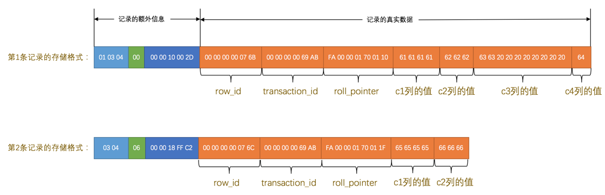

1. 表`record_format_demo`使用的是`ascii`字符集，所以`0x61616161`就表示字符串`'aaaa'`，`0x626262`就表示字符串`'bbb'`，以此类推。
2. 注意第1条记录中`c3`列的值，它是`CHAR(10)`类型的，它实际存储的字符串是：`'cc'`，而`ascii`字符集中的字节表示是`'0x6363'`，虽然表示这个字符串只占用了2个字节，但整个`c3`列仍然占用了10个字节的空间，除真实数据以外的8个字节的统统都用空格字符填充，空格字符在`ascii`字符集的表示就是`0x20`。
3. 注意第2条记录中`c3`和`c4`列的值都为`NULL`，它们被存储在了前面的`NULL值列表`处，在记录的真实数据处就不再冗余存储，从而节省存储空间。

**CHAR(M)列的存储格式**

`CHAR`类型是固定长度的字符类型。在存储时，它会按照定义的长度`M`来分配空间，不足`M`个字符时会用空格填充。

- 定长字符集

  当列采用的是定长字符集时，该列占用的字节数不会被加到变长字段长度列表

- 变长字符集

  采用变长字符集时，该列占用的字节数也会被加到变长字段长度列表

  变长字符集的`CHAR(M)`类型的列要求至少占用`M`个字节

对于 **CHAR(M)** 类型的列来说，当列采用的是定长字符集时，该列占用的字节数不会被加到变长字段长度列表，而如果采用变长字符集时，该列占用的字节数也会被加到变长字段长度列表。

变长字符集的`CHAR(M)`类型的列要求至少占用`M`个字节，而`VARCHAR(M)`却没有这个要求。

比方说对于使用`utf8`字符集的`CHAR(10)`的列来说，该列存储的数据字节长度的范围是10～30个字节。即使我们向该列中存储一个空字符串也会占用`10`个字节，这是怕将来更新该列的值的字节长度大于原有值的字节长度而小于10个字节时，可以在该记录处直接更新，而不是在存储空间中重新分配一个新的记录空间，导致原有的记录空间成为所谓的碎片。


##### Redundant行格式

`Redundant`行格式是`MySQL5.0`之前用的一种行格式


##### Dynamic和Compressed行格式

MySQL版本5.7的默认行格式就是`Dynamic`

这两个格式和`Compact`行格式挺像，只不过在处理`行溢出`数据时，它们不会在记录的真实数据处存储字段真实数据的前`768`个字节，而是把所有的字节都存储到其他页面中，只在记录的真实数据处存储其他页面的地址，就像这样：


`Compressed`行格式和`Dynamic`不同的一点是，`Compressed`行格式会采用压缩算法对页面进行压缩，以节省空间。


#### 行溢出数据

**行大小限制**

除了`BLOB`或者`TEXT`类型的列之外，其他所有的列（不包括隐藏列和记录头信息，包括变长字段长度列表和NULL值列表）占用的字节长度加起来不能超过`65535`个字节。

```mysql
mysql> CREATE TABLE varchar_size_demo(
    ->      c VARCHAR(65532)
    -> ) CHARSET=ascii ROW_FORMAT=Compact;
Query OK, 0 rows affected (0.02 sec)
```

如果`VARCHAR(M)`类型的列使用的不是`ascii`字符集，那`M`的最大取值取决于该字符集表示一个字符最多需要的字节数。在列的值允许为`NULL`的情况下，`gbk`字符集表示一个字符最多需要`2`个字节，那在该字符集下，`M`的最大取值就是`32766`（也就是：65532/2），也就是说最多能存储`32766`个字符；`utf8`字符集表示一个字符最多需要`3`个字节，那在该字符集下，`M`的最大取值就是`21844`，就是说最多能存储`21844`（也就是：65532/3）个字符。


**行溢出**

```mysql
mysql> CREATE TABLE varchar_size_demo(
    ->       c VARCHAR(65532)
    -> ) CHARSET=ascii ROW_FORMAT=Compact;
Query OK, 0 rows affected (0.01 sec)

mysql> INSERT INTO varchar_size_demo(c) VALUES(REPEAT('a', 65532));
Query OK, 1 row affected (0.00 sec)
```

`MySQL`中磁盘和内存交互的基本单位是`页`，也就是说`MySQL`是以`页`为基本单位来管理存储空间的，我们的记录都会被分配到某个`页`中存储。而一个页的大小一般是`16KB`，也就是`16384`字节，而一个`VARCHAR(M)`类型的列就最多可以存储`65532`个字节，这样就可能造成一个页存放不了一条记录的尴尬情况。

在`Compact`和`Reduntant`行格式中，对于占用存储空间非常大的列，在`记录的真实数据`处只会存储该列的一部分数据，把剩余的数据分散存储在几个其他的页中，然后`记录的真实数据`处用20个字节存储指向这些页的地址（当然这20个字节中还包括这些分散在其他页面中的数据的占用的字节数），从而可以找到剩余数据所在的页，如图所示：


**不只是 VARCHAR(M) 类型的列，其他的 TEXT、BLOB 类型的列在存储数据非常多的时候也会发生`行溢出`**


### InnoDB数据页结构

`页`的概念，它是`InnoDB`管理存储空间的基本单位，一个页的大小一般是`16KB`。

页的类型分为多种

| 类型名称                  | 十六进制 | 描述                             |
| ------------------------- | -------- | -------------------------------- |
| `FIL_PAGE_TYPE_ALLOCATED` | 0x0000   | 最新分配，还没使用               |
| `FIL_PAGE_UNDO_LOG`       | 0x0002   | Undo日志页                       |
| `FIL_PAGE_INODE`          | 0x0003   | 段信息节点                       |
| `FIL_PAGE_IBUF_FREE_LIST` | 0x0004   | Insert Buffer空闲列表            |
| `FIL_PAGE_IBUF_BITMAP`    | 0x0005   | Insert Buffer位图                |
| `FIL_PAGE_TYPE_SYS`       | 0x0006   | 系统页                           |
| `FIL_PAGE_TYPE_TRX_SYS`   | 0x0007   | 事务系统数据                     |
| `FIL_PAGE_TYPE_FSP_HDR`   | 0x0008   | 表空间头部信息                   |
| `FIL_PAGE_TYPE_XDES`      | 0x0009   | 扩展描述页                       |
| `FIL_PAGE_TYPE_BLOB`      | 0x000A   | BLOB页                           |
| `FIL_PAGE_INDEX`          | 0x45BF   | 索引页，也就是我们所说的`数据页` |

#### 数据页的结构

数据页代表的这块`16KB`大小的存储空间可以被划分为多个部分，不同部分有不同的功能，各个部分如图所示：


| 名称                 | 中文名             | 占用空间大小 | 简单描述                 |
| -------------------- | ------------------ | ------------ | ------------------------ |
| `File Header`        | 文件头部           | `38`字节     | 页的一些通用信息         |
| `Page Header`        | 页面头部           | `56`字节     | 数据页专有的一些信息     |
| `Infimum + Supremum` | 最小记录和最大记录 | `26`字节     | 两个虚拟的行记录         |
| `User Records`       | 用户记录           | 不确定       | 实际存储的行记录内容     |
| `Free Space`         | 空闲空间           | 不确定       | 页中尚未使用的空间       |
| `Page Directory`     | 页面目录           | 不确定       | 页中的某些记录的相对位置 |
| `File Trailer`       | 文件尾部           | `8`字节      | 校验页是否完整           |


##### 记录在页中的存储(User Records + Infimum + Supremum)

在页的7个组成部分中，我们自己存储的记录会按照我们指定的`行格式`存储到`User Records`部分。但是在一开始生成页的时候，其实并没有`User Records`这个部分，每当我们插入一条记录，都会从`Free Space`部分，也就是尚未使用的存储空间中申请一个记录大小的空间划分到`User Records`部分，当`Free Space`部分的空间全部被`User Records`部分替代掉之后，也就意味着这个页使用完了，如果还有新的记录插入的话，就需要去申请新的页了，这个过程的图示如下：


###### 记录头信息

```mysql
mysql> CREATE TABLE page_demo(
    ->     c1 INT,
    ->     c2 INT,
    ->     c3 VARCHAR(10000),
    ->     PRIMARY KEY (c1)
    -> ) CHARSET=ascii ROW_FORMAT=Compact;
Query OK, 0 rows affected (0.03 sec)
```

创建表后的行结构就是这样的，在指定了主键的情况下，不会再有**row_id**隐藏列


| 名称           | 大小（单位：bit） | 描述                                                         |
| -------------- | ----------------- | ------------------------------------------------------------ |
| `预留位1`      | `1`               | 没有使用                                                     |
| `预留位2`      | `1`               | 没有使用                                                     |
| `delete_mask`  | `1`               | 标记该记录是否被删除                                         |
| `min_rec_mask` | `1`               | B+树的每层非叶子节点中的最小记录都会添加该标记               |
| `n_owned`      | `4`               | 表示当前记录拥有的记录数                                     |
| `heap_no`      | `13`              | 表示当前记录在记录堆的位置信息                               |
| `record_type`  | `3`               | 表示当前记录的类型，`0`表示普通记录，`1`表示B+树非叶节点记录，`2`表示最小记录，`3`表示最大记录 |
| `next_record`  | `16`              | 表示下一条记录的相对位置                                     |

简化一下行格式：


这些记录在`页`的`User Records`部分中的表示简化如图所示（使用十进制表示记录头信息中的各个列）：


**delete_mask**

标记着当前记录是否被删除，占用1个bit，1代表被删除

> 这些被删除的记录之所以不立即从磁盘上移除，是因为移除它们之后把其他的记录在磁盘上重新排列需要性能消耗，所以只是打一个删除标记而已，所有被删除掉的记录都会组成一个所谓的`垃圾链表`，在这个链表中的记录占用的空间称之为所谓的`可重用空间`，之后如果有新记录插入到表中的话，可能把这些被删除的记录占用的存储空间覆盖掉。

**min_rec_mask**

B+树的每层非叶子节点中的最小记录都会添加该标记，占用1个bit


**n_owned**


**heap_no**

这个属性表示当前记录在本`页`中的位置，占用13个bit

- 值为0的记录默认是代表`最小记录`的伪记录
- 值为1的记录默认是代表`最大记录`的伪记录
- 大于1的值才是用户自定义的记录

这两天伪记录都是由5字节大小的`记录头信息`和8字节大小的一个固定的部分组成


它们并不存放在`页`的`User Records`部分，他们被单独放在一个称为`Infimum + Supremum`的部分，如图所示：


最小记录和最大记录的`heap_no`值分别是`0`和`1`，也就是说它们的位置最靠前。

**record_type**

这个属性表示当前记录的类型，一共有4种类型的记录，`0`表示普通记录，`1`表示B+树非叶节点记录，`2`表示最小记录，`3`表示最大记录。


**next_record**

表示从当前记录的真实数据到下一条记录的真实数据的地址偏移量

例如第一条记录的`next_record`值为`32`，意味着从第一条记录的真实数据的地址处向后找`32`个字节便是下一条记录的真实数据。

`下一条记录`指得是按照主键值由小到大的顺序的下一条记录，**Infimum记录（最小记录）** 的下一条记录就是本页中主键值最小的用户记录，而本页中主键值最大的用户记录的下一条记录就是 **Supremum记录（最大记录）**，记录按照主键从小到大的顺序形成了一个单链表。`最大记录`的`next_record`的值为`0`


如果删掉第2条记录后：


- 第2条记录并没有从存储空间中移除，而是把该条记录的`delete_mask`值设置为`1`。
- 第2条记录的`next_record`值变为了0，意味着该记录没有下一条记录了。
- 第1条记录的`next_record`指向了第3条记录。
- `最大记录`的`n_owned`值从`5`变成了`4`

不论我们怎么对页中的记录做增删改操作，InnoDB始终会维护一条记录的单链表，链表中的各个节点是按照主键值由小到大的顺序连接起来的

我们再次插入一条记录到表中


`InnoDB`并没有因为新记录的插入而为它申请新的存储空间，而是直接复用了原来被删除记录的存储空间，当数据页中存在多条被删除掉的记录时，这些记录的next_record属性将会把这些被删除掉的记录组成一个垃圾链表，以备之后重用这部分存储空间。


##### Page Directory（页目录）

我们平常想从一本书中查找某个内容的时候，一般会先看目录，找到需要查找的内容对应的书的页码，然后到对应的页码查看内容。

1. 将所有正常的记录（包括最大和最小记录，不包括标记为已删除的记录）划分为几个组。
2. 每个组的最后一条记录（也就是组内最大的那条记录）的头信息中的`n_owned`属性表示该记录拥有多少条记录，也就是该组内共有几条记录。
3. 将每个组的最后一条记录的地址偏移量单独提取出来按顺序存储到靠近`页`的尾部的地方，这个地方就是所谓的`Page Directory`，也就是`页目录`。页面目录中的这些地址偏移量被称为`槽`（英文名：`Slot`），所以这个页面目录就是由`槽`组成的。


**对于最小记录所在的分组只能有 1 条记录，最大记录所在的分组拥有的记录条数只能在 1~8 条之间，剩下的分组中记录的条数范围只能在是 4~8 条之间。**

页目录的分划过程：

- 初始情况下一个数据页里只有最小记录和最大记录两条记录，它们分属于两个分组。
- 之后每插入一条记录，都会从`页目录`中找到主键值比本记录的主键值大并且差值最小的槽，然后把该槽对应的记录的`n_owned`值加1，表示本组内又添加了一条记录，直到该组中的记录数等于8个。
- 在一个组中的记录数等于8个后再插入一条记录时，会将组中的记录拆分成两个组，一个组中4条记录，另一个5条记录。这个过程会在`页目录`中新增一个`槽`来记录这个新增分组中最大的那条记录的偏移量。


**查找过程**

1. 通过二分法确定该记录所在的槽，并找到该槽中主键值最小的那条记录。
2. 通过记录的`next_record`属性遍历该槽所在的组中的各个记录。


##### Page Header（页面头部）

一个数据页中存储的记录的状态信息，占用固定的`56`个字节

| 名称                | 占用空间大小 | 描述                                                         |
| ------------------- | ------------ | ------------------------------------------------------------ |
| `PAGE_N_DIR_SLOTS`  | `2`字节      | 在页目录中的槽数量                                           |
| `PAGE_HEAP_TOP`     | `2`字节      | 还未使用的空间最小地址，也就是说从该地址之后就是`Free Space` |
| `PAGE_N_HEAP`       | `2`字节      | 本页中的记录的数量（包括最小和最大记录以及标记为删除的记录） |
| `PAGE_FREE`         | `2`字节      | 第一个已经标记为删除的记录地址（各个已删除的记录通过`next_record`也会组成一个单链表，这个单链表中的记录可以被重新利用） |
| `PAGE_GARBAGE`      | `2`字节      | 已删除记录占用的字节数                                       |
| `PAGE_LAST_INSERT`  | `2`字节      | 最后插入记录的位置                                           |
| `PAGE_DIRECTION`    | `2`字节      | 记录插入的方向                                               |
| `PAGE_N_DIRECTION`  | `2`字节      | 一个方向连续插入的记录数量                                   |
| `PAGE_N_RECS`       | `2`字节      | 该页中记录的数量（不包括最小和最大记录以及被标记为删除的记录） |
| `PAGE_MAX_TRX_ID`   | `8`字节      | 修改当前页的最大事务ID，该值仅在二级索引中定义               |
| `PAGE_LEVEL`        | `2`字节      | 当前页在B+树中所处的层级                                     |
| `PAGE_INDEX_ID`     | `8`字节      | 索引ID，表示当前页属于哪个索引                               |
| `PAGE_BTR_SEG_LEAF` | `10`字节     | B+树叶子段的头部信息，仅在B+树的Root页定义                   |
| `PAGE_BTR_SEG_TOP`  | `10`字节     | B+树非叶子段的头部信息，仅在B+树的Root页定义                 |

- `PAGE_DIRECTION`

    假如新插入的一条记录的主键值比上一条记录的主键值大，我们说这条记录的插入方向是右边，反之则是左边。用来表示最后一条记录插入方向的状态就是`PAGE_DIRECTION`。

- `PAGE_N_DIRECTION`

    假设连续几次插入新记录的方向都是一致的，`InnoDB`会把沿着同一个方向插入记录的条数记下来，这个条数就用`PAGE_N_DIRECTION`这个状态表示。当然，如果最后一条记录的插入方向改变了的话，这个状态的值会被清零重新统计。


其中的`PAGE_BTR_SEG_LEAF`和`PAGE_BTR_SEG_TOP`都占用10个字节，它们其实对应一个叫`Segment Header`的结构


| 名称                              | 占用字节数 | 描述                            |
| --------------------------------- | ---------- | ------------------------------- |
| `Space ID of the INODE Entry `    | `4`        | INODE Entry结构所在的表空间ID   |
| `Page Number of the INODE Entry ` | `4`        | INODE Entry结构所在的页页号     |
| `Byte Offset of the INODE Ent`    | `2`        | INODE Entry结构在该页中的偏移量 |

`PAGE_BTR_SEG_LEAF`记录着叶子节点段对应的`INODE Entry`结构的地址是哪个表空间的哪个页的哪个偏移量，`PAGE_BTR_SEG_TOP`记录着非叶子节点段对应的`INODE Entry`结构的地址是哪个表空间的哪个页的哪个偏移量。这样子索引和其对应的段的关系就建立起来了。只有根页面有这两个值。


##### File Header（文件头部）

`Page Header`是专门针对`数据页`记录的各种状态信息，`File Header`针对各种类型的页都通用，占用固定的`38`个字节

| 名称                               | 占用空间大小 | 描述                                                         |
| ---------------------------------- | ------------ | ------------------------------------------------------------ |
| `FIL_PAGE_SPACE_OR_CHKSUM`         | `4`字节      | 页的校验和（checksum值）                                     |
| `FIL_PAGE_OFFSET`                  | `4`字节      | 页号                                                         |
| `FIL_PAGE_PREV`                    | `4`字节      | 上一个页的页号                                               |
| `FIL_PAGE_NEXT`                    | `4`字节      | 下一个页的页号                                               |
| `FIL_PAGE_LSN`                     | `8`字节      | 页面被最后修改时对应的日志序列位置（英文名是：Log Sequence Number） |
| `FIL_PAGE_TYPE`                    | `2`字节      | 该页的类型                                                   |
| `FIL_PAGE_FILE_FLUSH_LSN`          | `8`字节      | 仅在系统表空间的一个页中定义，代表文件至少被刷新到了对应的LSN值 |
| `FIL_PAGE_ARCH_LOG_NO_OR_SPACE_ID` | `4`字节      | 页属于哪个表空间                                             |

- `FIL_PAGE_SPACE_OR_CHKSUM`

    这个代表当前页面的校验和（checksum）。什么是个校验和？就是对于一个很长很长的字节串来说，我们会通过某种算法来计算一个比较短的值来代表这个很长的字节串，这个比较短的值就称为`校验和`。这样在比较两个很长的字节串之前先比较这两个长字节串的校验和，如果校验和都不一样两个长字节串肯定是不同的，所以省去了直接比较两个比较长的字节串的时间损耗。

- `FIL_PAGE_OFFSET`

    每一个`页`都有一个单独的页号，`InnoDB`通过页号来可以唯一定位一个`页`。这个页号由4个字节组成，也就是32个比特位，所以一个表空间最多可以拥有2³²个页，如果按照页的默认大小16KB来算，一个表空间最多支持64TB的数据。

- `FIL_PAGE_TYPE`

    这个代表当前`页`的类型，我们前面说过，`InnoDB`为了不同的目的而把页分为不同的类型，我们上面介绍的其实都是存储记录的`数据页`，其实还有很多别的类型的页，具体如下表：

| 类型名称                  | 十六进制 | 描述                             |
| ------------------------- | -------- | -------------------------------- |
| `FIL_PAGE_TYPE_ALLOCATED` | 0x0000   | 最新分配，还没使用               |
| `FIL_PAGE_UNDO_LOG`       | 0x0002   | Undo日志页                       |
| `FIL_PAGE_INODE`          | 0x0003   | 段信息节点                       |
| `FIL_PAGE_IBUF_FREE_LIST` | 0x0004   | Insert Buffer空闲列表            |
| `FIL_PAGE_IBUF_BITMAP`    | 0x0005   | Insert Buffer位图                |
| `FIL_PAGE_TYPE_SYS`       | 0x0006   | 系统页                           |
| `FIL_PAGE_TYPE_TRX_SYS`   | 0x0007   | 事务系统数据                     |
| `FIL_PAGE_TYPE_FSP_HDR`   | 0x0008   | 表空间头部信息                   |
| `FIL_PAGE_TYPE_XDES`      | 0x0009   | 扩展描述页                       |
| `FIL_PAGE_TYPE_BLOB`      | 0x000A   | BLOB页                           |
| `FIL_PAGE_INDEX`          | 0x45BF   | 索引页，也就是我们所说的`数据页` |


- `FIL_PAGE_PREV`和`FIL_PAGE_NEXT`

`FIL_PAGE_PREV`和`FIL_PAGE_NEXT`就分别代表本页的上一个和下一个页的页号，这样就可以建立一个双向链表把许许多多的页就都串联起来

并不是所有类型的页都有上一个和下一个页的属性，`数据页`（也就是类型为`FIL_PAGE_INDEX`的页）是有这两个属性


##### File Trailer

所有类型的页通用的，占用8个字节

- 前4个字节代表页的校验和

  这个部分是和`File Header`中的校验和相对应的。每当一个页面在内存中修改了，在同步之前就要把它的校验和算出来，因为`File Header`在页面的前面，所以校验和会被首先同步到磁盘，当完全写完时，校验和也会被写到页的尾部，如果完全同步成功，则页的首部和尾部的校验和应该是一致的。如果写了一半儿断电了，那么在`File Header`中的校验和就代表着已经修改过的页，而在`File Trialer`中的校验和代表着原先的页，二者不同则意味着同步中间出了错。

- 后4个字节代表页面被最后修改时对应的日志序列位置（LSN）

  这个部分也是为了校验页的完整性的


> **双写机制**
>
> 当 InnoDB 修改内存中的数据页并准备同步到磁盘时：
>
> 1. 计算校验和
>    - 在将页写入磁盘前，InnoDB 计算页的校验和（如 InnoDB 使用`FNV-1a`或`crc32`算法）。
> 2. 写入双写缓冲区（Doublewrite Buffer）
>    - 首先将页写入共享表空间中的双写缓冲区（连续存储，共 2MB，包含 128 个页）。
>    - 双写缓冲区的写入是顺序 I/O，效率较高。
> 3. 同步到磁盘
>    - 校验和被写入页的头部（File Header），并同步到磁盘。
>    - 接着将整个页数据写入实际的数据文件位置。
> 4. 更新页尾校验和
>    - 当页完全写入磁盘后，将相同的校验和写入页的尾部（File Trailer）。
>
> **为什么需要双写？**
>
> **磁盘扇区大小限制**：现代磁盘扇区通常为 4KB，但 InnoDB 页大小为 16KB。
>
> - 若系统在写入 16KB 页时断电，可能导致部分扇区（如第 2 个 4KB 扇区）未写入，造成**页分裂（Page Split）**
>
> **校验和不一致的处理**
>
> 1. **从双写缓冲区恢复**：使用双写缓冲区中的完整备份页覆盖损坏页。
> 2. **重做日志（Redo Log）应用**：若双写缓冲区不可用，通过重做日志（WAL 机制）重新应用事务。
>
> 关键点：先写备份、 redo记录操作、校验和


### B+树索引

#### InnoDB中的索引方案

##### 聚簇索引

InnoDB中的索引方案复用了数据页的设计，将存储用户记录的部分存储目录项记录，使用记录头信息中的`record_type`区分

- `目录项记录`的`record_type`值是1，而普通用户记录的`record_type`值是0。
- 只有在存储`目录项记录`的页中的主键最小的`目录项记录`的`min_rec_mask`值为`1`，其他别的记录的`min_rec_mask`值都是`0`。
- 索引页中以主键排序分组成为槽，分配的数据页编号可能并不是连续的，这些页在存储空间里可能并不挨着，索引页直接通过双向链表从小到大关联
- 在对页中的记录进行增删改操作的过程中，我们必须通过一些诸如记录移动的操作来始终保证这个状态一直成立：下一个数据页中用户记录的主键值必须大于上一个页中用户记录的主键值。这个过程我们也可以称为`页分裂`。
- 目录项中只包含 主键+页号，用户数据项包含全部数据


**搜索过程**

- 确定索引页

  由根索引页中的槽二分查找确定下一层索引页

- 确定数据页

  由最下层索引页的槽二分查找确定数据页

- 在数据页中查找

  在数据页中通过槽进行二分查找，找到对应槽，从槽中最小主键遍历查找整个槽，返回结果

一般情况下，我们用到的`B+`树都不会超过4层，那我们通过主键值去查找某条记录最多只需要做4个页面内的查找（查找3个目录项页和一个用户记录页）

##### 二级索引

以指定列作为排序列，构建的索引就是二级索引

- 数据页内以指定列从小到大构建单向链表，数据页中只有 指定列(c2)+主键(c1) 两列数据
- 数据页直接以指定列从小到大构建双向链表
- 同一层的索引页之间以指定列从小到大构建双向链表，索引页中只有 指定列+主键+页号


**搜索过程**

- 确定索引页

  根据根索引页从小到大排序的槽查找下一层索引页

- 确定数据页

  根据索引页从小到大排序的槽查找数据页

- 查找数据页

  在数据页中通过槽进行二分查找，找到对应槽，从槽中最小主键遍历查找整个槽，找到 指定列和对应主键

- 回表

  利用主键查询聚簇索引中的数据

###### 联合索引

也可以同时以多个列的大小作为排序规则，也就是同时为多个列建立索引，以c2和c3建立索引为例

- 先把各个记录和页按照`c2`列进行排序，在记录的`c2`列相同的情况下，采用`c3`列进行排序
- 索引页目录项记录存储 c2 + c3 + 主键(c1) + 页号 ，数据页存储 c2 + c3 + c1


##### 注意事项

**根页面万年不动窝**

一个B+树索引的根节点自诞生之日起，便不会再移动

- 每当为某个表创建一个`B+`树索引的时候，都会为这个索引创建一个`根节点`页面。最开始表中没有数据的时候，每个`B+`树索引对应的`根节点`中既没有用户记录，也没有目录项记录。
- 随后向表中插入用户记录时，先把用户记录存储到这个`根节点`中。
- 当`根节点`中的可用空间用完时继续插入记录，此时会将`根节点`中的所有记录复制到一个新分配的页，比如`页a`中，然后对这个新页进行`页分裂`的操作，得到另一个新页，比如`页b`。这时新插入的记录根据键值（也就是聚簇索引中的主键值，二级索引中对应的索引列的值）的大小就会被分配到`页a`或者`页b`中，而`根节点`便升级为存储目录项记录的页。

**索引项中目录项记录的唯一性**

我们需要保证在B+树的同一层内节点的目录项记录除`页号`这个字段以外是唯一的，所以对于二级索引的内节点的目录项记录的内容实际上是由三个部分构成的：

- 索引列的值
- 主键值
- 页号

为了引入主键值是为了在插入数据时，遇到多个页面的索引列的值相同，无法确定插入哪个页面的情况

> 如果`c2`列的值相同的话，可以接着比较主键值，因为`B+`树同一层中不同目录项记录的`c2列 + 主键`的值肯定是不一样的，所以最后肯定能定位唯一的一条目录项记录，在本例中最后确定新记录应该被插入到`页5`中。

**一个页面最少存储2条记录**

如果一个页面只能存储一条记录，那么会出现大量的页面，那么B+树的层级会非常的深，不利于查询


#### MyISAM中的索引方案

`MyISAM`的索引方案虽然也使用树形结构，但是却将索引和数据分开存储

- 将表中的记录按照记录的插入顺序单独存储在一个文件中，称之为`数据文件`。这个文件并不划分为若干个数据页，我们可以通过行号而快速访问到一条记录。
- 插入数据的时候并没有刻意按照主键大小排序，所以我们并不能在这些数据上使用二分法进行查找


`MyISAM`存储引擎的表会把索引信息另外存储到一个称为索引文件，索引的叶子节点并不存储完整的数据，而是存储 主键 + 行号，在查询时需要通过行号回表

> MyISAM的行格式有定长记录格式（Static）、变长记录格式（Dynamic）、压缩记录格式（Compressed）。采用定长记录格式，也就是一条记录占用存储空间的大小是固定的，这样就可以轻松算出某条记录在数据文件中的地址偏移量。但是变长记录格式就不行了，MyISAM会直接在索引叶子节点处存储该条记录在数据文件中的地址偏移量。通过这个可以看出，MyISAM的回表操作是十分快速的，因为是拿着地址偏移量直接到文件中取数据的，反观InnoDB是通过获取主键之后再去聚簇索引里边儿找记录，虽然说也不慢，但还是比不上直接用地址去访问。 


#### 索引的使用

##### 索引CRUD

```mysql
CREATE TALBE 表名 (
    各种列的信息 ··· , 
    [KEY|INDEX] 索引名 (需要被索引的单个列或多个列)
)

ALTER TABLE 表名 ADD [INDEX|KEY] 索引名 (需要被索引的单个列或多个列);

ALTER TABLE 表名 DROP [INDEX|KEY] 索引名;
```

##### 索引的代价

- 空间上的代价

  每建立一个索引都要为它建立一棵`B+`树，每一棵`B+`树的每一个节点都是一个数据页，一个页默认会占用`16KB`的存储空间。

- 时间上的代价

  每次对表中的数据进行增、删、改操作时，都需要去修改各个`B+`树索引。`B+`树每层节点都是按照索引列的值从小到大的顺序排序而组成了双向链表，增、删、改操作可能会对节点和记录的排序造成破坏，存储引擎需要额外的时间进行一些记录移位，页面分裂、页面回收等操作来维护好节点和记录的排序

##### B+树索引适用的条件

```mysql
## 建立person_info表
CREATE TABLE person_info(
    id INT NOT NULL auto_increment,
    name VARCHAR(100) NOT NULL,
    birthday DATE NOT NULL,
    phone_number CHAR(11) NOT NULL,
    country varchar(100) NOT NULL,
    PRIMARY KEY (id),
    ## 以name, birthday, phone_number建立索引
    KEY idx_name_birthday_phone_number (name, birthday, phone_number)
);
```


- 先按照`name`列的值进行排序。
- 如果`name`列的值相同，则按照`birthday`列的值进行排序。
- 如果`birthday`列的值也相同，则按照`phone_number`的值进行排序。

**只要页面和记录是排好序的，我们就可以通过二分法来快速定位查找**


###### 全值匹配

```mysql
SELECT * FROM person_info WHERE name = 'Ashburn' AND birthday = '1990-09-27' AND phone_number = '15123983239';
#这两个语句效果一样 都会使用索引 查询优化器会匹配到
SELECT * FROM person_info WHERE birthday = '1990-09-27' AND phone_number = '15123983239' AND name = 'Ashburn';
```

- 因为`B+`树的数据页和记录先是按照`name`列的值进行排序的，所以先可以很快定位`name`列的值是`Ashburn`的记录位置。
- 在`name`列相同的记录里又是按照`birthday`列的值进行排序的，所以在`name`列的值是`Ashburn`的记录里又可以快速定位`birthday`列的值是`'1990-09-27'`的记录。


###### 匹配左边的列

```mysql
# 也可以不用包含全部联合索引中的列，只包含左边的就行
SELECT * FROM person_info WHERE name = 'Ashburn';
# 也可以使用索引
SELECT * FROM person_info WHERE name = 'Ashburn' AND birthday = '1990-09-27';
# 无法使用索引 索引是先基于name排序的 无法直接找到birthday
SELECT * FROM person_info WHERE birthday = '1990-09-27';

```

**如果我们想使用联合索引中尽可能多的列，搜索条件中的各个列必须是联合索引中从最左边连续的列。**


###### 匹配列前缀

为某个列建立索引的意思其实就是在对应的`B+`树的记录中使用该列的值进行排序

```mysql
# 比方说person_info表上建立的联合索引idx_name_birthday_phone_number会先用name列的值进行排序，所以这个联合索引对应的B+树中的记录的name列的排列就是这样的：
Aaron
Aaron
...
Aaron
Asa
Ashburn
...
Ashburn
Baird
Barlow
...
Barlow

#比较字符串大小就用到了该列的字符集和比较规则
#这些字符串的前n个字符，也就是前缀都是排好序的，所以对于字符串类型的索引列来说，我们只匹配它的前缀也是可以快速定位

SELECT * FROM person_info WHERE name LIKE 'As%'; # 可以使用索引

SELECT * FROM person_info WHERE name LIKE '%As%'; # 无法使用索引

```

###### 匹配范围值

所有记录都是按照索引列的值从小到大的顺序排好序的，所以这极大的方便我们查找索引列的值在某个范围内的记录。

```mysql
SELECT * FROM person_info WHERE name > 'Asa' AND name < 'Barlow';
```

- 找到`name`值为`Asa`的记录。
- 找到`name`值为`Barlow`的记录。
- 由于所有记录都是由链表连起来的（记录之间用单链表，数据页之间用双链表），所以他们之间的记录都可以很容易的取出来喽～
- 找到这些记录的主键值，再到`聚簇索引`中`回表`查找完整的记录。

**如果对多个列同时进行范围查找的话，只有对索引最左边的那个列进行范围查找的时候才能用到`B+`树索引**

```mysql
SELECT * FROM person_info WHERE name > 'Asa' AND name < 'Barlow' AND birthday > '1980-01-01';
```

1. 通过条件`name > 'Asa' AND name < 'Barlow' `来利用索引对`name`进行范围，查找的结果可能有多条`name`值不同的记录
2. 对这些记录全部通过`birthday > '1980-01-01'`条件过滤。

这样子对于联合索引`idx_name_birthday_phone_number`来说，只能用到`name`列的部分，而用不到`birthday`列的部分，因为只有`name`值相同的情况下才能用`birthday`列的值进行排序

###### 精确匹配某一列并范围匹配另外一列

对于同一个联合索引来说，虽然对多个列都进行范围查找时只能用到最左边那个索引列，但是如果左边的列是精确查找，则右边的列可以进行范围查找，比方说这样：

```mysql
SELECT * FROM person_info WHERE name = 'Ashburn' AND birthday > '1980-01-01' AND birthday < '2000-12-31' AND phone_number > '15100000000';
```

1. `name = 'Ashburn'`，对`name`列进行精确查找，当然可以使用`B+`树索引了。
2. `birthday > '1980-01-01' AND birthday < '2000-12-31'`，由于`name`列是精确查找，所以通过`name = 'Ashburn'`条件查找后得到的结果的`name`值都是相同的，它们会再按照`birthday`的值进行排序。所以此时对`birthday`列进行范围查找是可以用到`B+`树索引的。
3. `phone_number > '15100000000'`，通过`birthday`的范围查找的记录的`birthday`的值可能不同，所以这个条件无法再利用`B+`树索引了，只能遍历上一步查询得到的记录。


###### 索引用于排序

如果需要通过`ORDER BY`子句按照某种规则进行排序。一般情况下，我们只能把记录都加载到内存中，再用一些排序算法，比如快速排序、归并排序、等等排序等等在内存中对这些记录进行排序，有的时候可能查询的结果集太大以至于不能在内存中进行排序的话，还可能暂时借助磁盘的空间来存放中间结果，排序操作完成后再把排好序的结果集返回到客户端。在`MySQL`中，把这种在内存中或者磁盘上进行排序的方式统称为文件排序（英文名：`filesort`）

但是如果`ORDER BY`子句里使用到了我们的索引列，就有可能省去在内存或文件中排序的步骤

```mysql
SELECT * FROM person_info ORDER BY name, birthday, phone_number LIMIT 10; #排序顺序命中索引 无需文件排序
```

**`ORDER BY`的子句后边的列的顺序必须按照索引列的顺序给出，否则无法命中索引**

```mysql
SELECT * FROM person_info WHERE name = 'A' ORDER BY birthday, phone_number LIMIT 10; #排序顺序和索引排序顺序不同 文件排序
```


###### 不可以使用索引进行排序的几种情况


**ASC、DESC混用**

对于使用联合索引进行排序的场景，我们要求各个排序列的排序顺序是一致的，也就是要么各个列都是`ASC`规则排序，要么都是`DESC`规则排序。

`idx_name_birthday_phone_number`联合索引中记录的结构:

- 先按照记录的`name`列的值进行升序排列。
- 如果记录的`name`列的值相同，再按照`birthday`列的值进行升序排列。
- 如果记录的`birthday`列的值相同，再按照`phone_number`列的值进行升序排列。

如果查询中的各个排序列的排序顺序是一致的，比方说下面这两种情况：

- `ORDER BY name, birthday LIMIT 10`

    这种情况直接从索引的最左边开始往右读10行记录就可以了。

- `ORDER BY name DESC, birthday DESC LIMIT 10`

    这种情况直接从索引的最右边开始往左读10行记录就可以了。

- ```mysql
  # 但是如果我们查询的需求是先按照name列进行升序排列，再按照birthday列进行降序排列的话 就没法使用索引了
  SELECT * FROM person_info ORDER BY name, birthday DESC LIMIT 10;
  ```


**WHERE子句中出现非排序使用到的索引列**

```mysql
# 如果WHERE子句中出现了非排序使用到的索引列，那么排序依然是使用不到索引的
SELECT * FROM person_info WHERE country = 'China' ORDER BY name LIMIT 10;
```

这个查询只能先把符合搜索条件`country = 'China'`的记录提取出来后再进行排序，是使用不到索引。


**排序列包含非同一个索引的列**

```mysql
# name和country并不属于一个联合索引中的列，所以无法使用索引进行排序
SELECT * FROM person_info ORDER BY name, country LIMIT 10;
```


**排序列使用了复杂的表达式**

```mysql
# 要想使用索引进行排序操作，必须保证索引列是以单独列的形式出现，而不是修饰过的形式
SELECT * FROM person_info ORDER BY UPPER(name) LIMIT 10;
```


###### 索引用于分组


```mysql
SELECT name, birthday, phone_number, COUNT(*) FROM person_info GROUP BY name, birthday, phone_number
```

这个查询语句相当于做了3次分组操作：

1. 先把记录按照`name`值进行分组，所有`name`值相同的记录划分为一组。
2. 将每个`name`值相同的分组里的记录再按照`birthday`的值进行分组，将`birthday`值相同的记录放到一个小分组里，所以看起来就像在一个大分组里又化分了好多小分组。
3. 再将上一步中产生的小分组按照`phone_number`的值分成更小的分组，所以整体上看起来就像是先把记录分成一个大分组，然后把`大分组`分成若干个`小分组`，然后把若干个`小分组`再细分成更多的`小小分组`。

  然后针对那些`小小分组`进行统计，比如在我们这个查询语句中就是统计每个`小小分组`包含的记录条数。如果没有索引的话，这个分组过程全部需要在内存里实现，而如果有了索引的话，恰巧这个分组顺序又和我们的`B+`树中的索引列的顺序是一致的，而我们的`B+`树索引又是按照索引列排好序的，可以直接使用`B+`树索引进行分组。

  和使用`B+`树索引进行排序是一个道理，分组列的顺序也需要和索引列的顺序一致，也可以只使用索引列中左边的列进行分组，


##### 回表的代价

```mysql
SELECT * FROM person_info WHERE name > 'Asa' AND name < 'Barlow';
```

1. 从索引`idx_name_birthday_phone_number`对应的`B+`树中取出`name`值在`Asa`～`Barlow`之间的用户记录。
2. 由于索引`idx_name_birthday_phone_number`对应的`B+`树用户记录中只包含`name`、`birthday`、`phone_number`、`id`这4个字段，而查询列表是`*`，意味着要查询表中所有字段，也就是还要包括`country`字段。这时需要把从上一步中获取到的每一条记录的`id`字段都到聚簇索引对应的`B+`树中找到完整的用户记录，也就是我们通常所说的`回表`，然后把完整的用户记录返回给查询用户。


由于索引`idx_name_birthday_phone_number`对应的`B+`树中的记录首先会按照`name`列的值进行排序，所以值在`Asa`～`Barlow`之间的记录在磁盘中的存储是相连的，集中分布在一个或几个数据页中，我们可以很快的把这些连着的记录从磁盘中读出来，这种读取方式我们也可以称为`顺序I/O`。根据第1步中获取到的记录的`id`字段的值可能并不相连，而在聚簇索引中记录是根据`id`（也就是主键）的顺序排列的，所以根据这些并不连续的`id`值到聚簇索引中访问完整的用户记录可能分布在不同的数据页中，这样读取完整的用户记录可能要访问更多的数据页，这种读取方式我们也可以称为`随机I/O`。一般情况下，顺序I/O比随机I/O的性能高很多

- 会使用到两个`B+`树索引，一个二级索引，一个聚簇索引。
- 访问二级索引使用`顺序I/O`，访问聚簇索引使用`随机I/O`。

**需要回表的记录越多，使用二级索引的性能就越低**


那什么时候采用全表扫描的方式，什么时候使用采用`二级索引 + 回表`的方式去执行查询呢？

- 查询优化器会事先对表中的记录计算一些统计数据，然后再利用这些统计数据根据查询的条件来计算一下需要回表的记录数，需要回表的记录数越多，就越倾向于使用全表扫描，反之倾向于使用`二级索引 + 回表`的方式。

- 限制查询获取较少的记录数会让优化器更倾向于选择使用`二级索引 + 回表`的方式进行查询

  ```mysql
  SELECT * FROM person_info WHERE name > 'Asa' AND name < 'Barlow' LIMIT 10; # 限制10条数据
  ```

- 查询条件为*，这意味着要将数据排序后全部回表进行查询，不如直接进行文件排序，不会用到索引

- ```mysql
  SELECT * FROM person_info ORDER BY name, birthday, phone_number;
  
  #限制数量 可以使优化器倾向于 二级索引+回表
  SELECT * FROM person_info ORDER BY name, birthday, phone_number LIMIT 10;
  
  
  explain SELECT * FROM person_info WHERE name > 'Asa' AND name < 'Barlow' LIMIT 10;
  explain SELECT * FROM person_info WHERE name > 'Asa' AND name < 'Barlow';
  
  explain SELECT * FROM person_info ORDER BY name, birthday, phone_number;
  explain SELECT * FROM person_info ORDER BY name, birthday, phone_number limit 10;
  ```


##### 更好的创建和使用索引


###### 只为用于搜索、排序或分组的列创建索引

只为出现在`WHERE`子句中的列、连接子句中的连接列，或者出现在`ORDER BY`或`GROUP BY`子句中的列创建索引


###### 考虑索引列中不重复值的个数

`列的基数`指的是某一列中不重复数据的个数，**最好为那些列的基数大的列建立索引，为基数太小列的建立索引效果可能不好**


###### 索引列的类型尽量小

尽量让索引列使用较小的类型

- 数据类型越小，在查询时进行的比较操作越快（这是CPU层次）
- 数据类型越小，索引占用的存储空间就越少，在一个数据页内就可以放下更多的记录，从而减少磁盘`I/O`带来的性能损耗，也就意味着可以把更多的数据页缓存在内存中，从而加快读写效率。

这个建议对于表的主键来说更加适用，因为不仅是聚簇索引中会存储主键值，其他所有的二级索引的节点处都会存储一份记录的主键值，如果主键适用更小的数据类型，也就意味着节省更多的存储空间和更高效的`I/O`。

###### 索引字符串值的前缀

假设我们的字符串很长，那存储一个字符串就需要占用很大的存储空间。在我们需要为这个字符串列建立索引时，那就意味着在对应的`B+`树中有这么两个问题：

- `B+`树索引中的记录需要把该列的完整字符串存储起来，而且字符串越长，在索引中占用的存储空间越大。
- 如果`B+`树索引中索引列存储的字符串很长，那在做字符串比较时会占用更多的时间。

只对字符串的前几个字符进行索引：

```mysql
CREATE TABLE person_info(
    name VARCHAR(100) NOT NULL,
    birthday DATE NOT NULL,
    phone_number CHAR(11) NOT NULL,
    country varchar(100) NOT NULL,
    KEY idx_name_birthday_phone_number (name(10), birthday, phone_number) # 只对name字段的前10个字符进行索引
);    
```

**索引列前缀对排序的影响**

如果使用了索引列前缀，只把`name`列的前10个字符放到了二级索引中

```mysql
SELECT * FROM person_info ORDER BY name LIMIT 10;
```

因为二级索引中不包含完整的`name`列信息，所以无法对前十个字符相同，后边的字符不同的记录进行排序，也就是使用索引列前缀的方式无法支持使用索引排序，只好用文件排序。


###### 覆盖索引

为了彻底告别`回表`操作带来的性能损耗，**最好在查询列表里只包含索引列**

```mysql
SELECT name, birthday, phone_number FROM person_info  
    WHERE name > 'Asa' AND name < 'Barlow';
    
#虽然这个查询中没有LIMIT子句，但是采用了覆盖索引，所以查询优化器就会直接使用idx_name_birthday_phone_number索引进行排序，而不需要回表操作    
SELECT name, birthday, phone_number  FROM person_info   
    ORDER BY name, birthday, phone_number;

```


###### 让索引列以列名的形式在搜索条件中单独出现

1. `WHERE my_col * 2 < 4`
2. `WHERE my_col < 4/2`

第1个`WHERE`子句中`my_col`列并不是以单独列的形式出现的，而是以`my_col * 2`这样的表达式的形式出现的，存储引擎会依次遍历所有的记录，计算这个表达式的值是不是小于`4`，所以这种情况下是使用不到为`my_col`列建立的`B+`树索引的。而第2个`WHERE`子句中`my_col`列并是以单独列的形式出现的，这样的情况可以直接使用`B+`树索引。

**如果索引列在比较表达式中不是以单独列的形式出现，而是以某个表达式，或者函数调用形式出现的话，是用不到索引的。**


###### 主键插入顺序

- 数据页和记录是按照记录主键值从小到大的顺序进行排序，所以如果我们插入的记录的主键值是依次增大的话，那我们每插满一个数据页就换到下一个数据页继续插
- 但是如果插入的主键值忽大忽小，就会带来大量的页面分裂和记录移位


### MySQL的数据目录

像 InnoDB 、 MyISAM 这样的存储引擎都是把表存储在文件系统上的，`数据目录`是用来存储`MySQL`在运行过程中产生的数据

```mysql
#通过系统变量可以查询mysql的数据目录位置
mysql> SHOW VARIABLES LIKE 'datadir';
+---------------+-----------------------+
| Variable_name | Value                 |
+---------------+-----------------------+
| datadir       | /usr/local/var/mysql/ |
+---------------+-----------------------+
1 row in set (0.00 sec)
```

```shell
#数据目录
[root@localhost mysql]# ll
总用量 122956
-rw-r-----. 1 mysql mysql       56 5月   7 14:12 auto.cnf
-rw-------. 1 mysql mysql     1676 5月   7 14:12 ca-key.pem
-rw-r--r--. 1 mysql mysql     1112 5月   7 14:12 ca.pem
drwxr-x---. 2 mysql mysql     4096 5月  14 14:39 charset_demo_db
-rw-r--r--. 1 mysql mysql     1112 5月   7 14:12 client-cert.pem
-rw-------. 1 mysql mysql     1676 5月   7 14:12 client-key.pem
-rw-r-----. 1 mysql mysql      436 5月   7 14:12 ib_buffer_pool
-rw-r-----. 1 mysql mysql 12582912 5月  13 13:51 ibdata1
-rw-r-----. 1 mysql mysql 50331648 5月  13 13:51 ib_logfile0
-rw-r-----. 1 mysql mysql 50331648 5月   7 14:12 ib_logfile1
-rw-r-----. 1 mysql mysql 12582912 5月  14 14:39 ibtmp1
drwxr-x---. 2 mysql mysql     4096 5月   7 14:12 mysql
srwxrwxrwx. 1 mysql mysql        0 5月   7 14:12 mysql.sock
-rw-------. 1 mysql mysql        6 5月   7 14:12 mysql.sock.lock
drwxr-x---. 2 mysql mysql     8192 5月   7 14:12 performance_schema
-rw-------. 1 mysql mysql     1676 5月   7 14:12 private_key.pem
-rw-r--r--. 1 mysql mysql      452 5月   7 14:12 public_key.pem
-rw-r--r--. 1 mysql mysql     1112 5月   7 14:12 server-cert.pem
-rw-------. 1 mysql mysql     1676 5月   7 14:12 server-key.pem
drwxr-x---. 2 mysql mysql     8192 5月   7 14:12 sys
drwxr-x---. 2 mysql mysql       78 5月   7 15:38 test
```

#### 数据库的存储

- 每个数据库都对应数据目录下的一个文件夹
- MySQL会在数据库文件夹下创建一个名为`db.opt`的文件，保存该数据库的各种属性，例如字符集和比较规则

```shell
#charset_demo_db数据库下对应的文件
[root@localhost charset_demo_db]# ll
总用量 960
-rw-r-----. 1 mysql mysql     65 5月   8 14:14 db.opt
-rw-r-----. 1 mysql mysql   8608 5月  13 11:11 index_demo.frm
-rw-r-----. 1 mysql mysql  98304 5月  13 11:11 index_demo.ibd
-rw-r-----. 1 mysql mysql  16800 5月  12 14:32 page_demo.frm
-rw-r-----. 1 mysql mysql  98304 5月  12 14:41 page_demo.ibd
-rw-r-----. 1 mysql mysql   8706 5月  13 13:51 person_info.frm
-rw-r-----. 1 mysql mysql 114688 5月  13 13:51 person_info.ibd
-rw-r-----. 1 mysql mysql   8634 5月  12 11:12 record_format_demo.frm
-rw-r-----. 1 mysql mysql  98304 5月  12 11:12 record_format_demo.ibd
-rw-r-----. 1 mysql mysql   8706 5月  14 14:39 test_myisam.frm
-rw-r-----. 1 mysql mysql      0 5月  14 14:39 test_myisam.MYD
-rw-r-----. 1 mysql mysql   1024 5月  14 14:39 test_myisam.MYI
-rw-r-----. 1 mysql mysql   8558 5月   8 14:16 t.frm
-rw-r-----. 1 mysql mysql  98304 5月   8 14:30 t.ibd
-rw-r-----. 1 mysql mysql  74090 5月  12 13:41 varchar_size_demo2.frm
-rw-r-----. 1 mysql mysql  98304 5月  12 13:41 varchar_size_demo2.ibd
-rw-r-----. 1 mysql mysql  74090 5月  12 11:47 varchar_size_demo.frm
-rw-r-----. 1 mysql mysql 131072 5月  12 13:34 varchar_size_demo.ibd
```


#### 表的存储

表的存储在MySQL中分成两个部分

1. 表结构的定义

   `表结构`就是该表的名称是什么，表里边有多少列，每个列的数据类型是什么，有什么约束条件和索引，用的是什么字符集和比较规则等建表信息

   ```shell
   表名.frm
   ```

2. 表中的数据


##### Innodb表数据的存储

`InnoDB`其实是使用`页`为基本单位来管理存储空间的，默认的`页`大小为`16KB`。

MySQL定义了一种表空间的概念，它可以对应文件系统上一个或多个真实文件，每一个表空间可以被划分成多个页，具体的数据都存放在页中

###### 系统表空间

这个所谓的`系统表空间`可以对应文件系统上一个或多个实际的文件，默认情况下，`InnoDB`会在`数据目录`下创建一个名为`ibdata1`的文件，大小为`12M`的自扩展文件，这个文件就是对应的`系统表空间`在文件系统上的表示。

```mysql
#如果要修改表空间文件 在MySQL启动时配置对应的文件路径以及它们的大小
[server]
innodb_data_file_path=data1:512M;data2:512M:autoextend
```

从MySQL5.5.7到MySQL5.6.6之间的各个版本中，我们表中的数据都会被默认存储到这个 ***系统表空间\***。

###### 独立表空间

在MySQL5.6.6以及之后的版本中，InnoDB默认为每一个表建立一个独立表空间，会在该表所属数据库对应的子目录下创建一个表示该`独立表空间`的文件，文件名和表名相同，名称为`表名.ibd`

```shell
#charset_demo_db数据库下对应的文件
[root@localhost charset_demo_db]# ll
总用量 960
-rw-r-----. 1 mysql mysql     65 5月   8 14:14 db.opt
-rw-r-----. 1 mysql mysql   8608 5月  13 11:11 index_demo.frm
-rw-r-----. 1 mysql mysql  98304 5月  13 11:11 index_demo.ibd
-rw-r-----. 1 mysql mysql  16800 5月  12 14:32 page_demo.frm
-rw-r-----. 1 mysql mysql  98304 5月  12 14:41 page_demo.ibd
-rw-r-----. 1 mysql mysql   8706 5月  13 13:51 person_info.frm
-rw-r-----. 1 mysql mysql 114688 5月  13 13:51 person_info.ibd
-rw-r-----. 1 mysql mysql   8634 5月  12 11:12 record_format_demo.frm
-rw-r-----. 1 mysql mysql  98304 5月  12 11:12 record_format_demo.ibd
-rw-r-----. 1 mysql mysql   8706 5月  14 14:39 test_myisam.frm
-rw-r-----. 1 mysql mysql      0 5月  14 14:39 test_myisam.MYD
-rw-r-----. 1 mysql mysql   1024 5月  14 14:39 test_myisam.MYI
-rw-r-----. 1 mysql mysql   8558 5月   8 14:16 t.frm
-rw-r-----. 1 mysql mysql  98304 5月   8 14:30 t.ibd
-rw-r-----. 1 mysql mysql  74090 5月  12 13:41 varchar_size_demo2.frm
-rw-r-----. 1 mysql mysql  98304 5月  12 13:41 varchar_size_demo2.ibd
-rw-r-----. 1 mysql mysql  74090 5月  12 11:47 varchar_size_demo.frm
-rw-r-----. 1 mysql mysql 131072 5月  12 13:34 varchar_size_demo.ibd
```

比如说想将表数据都存储到`系统表空间`时，可以在启动`MySQL`服务器的时候这样配置：

```mysql
#当innodb_file_per_table的值为0时，代表使用系统表空间；当innodb_file_per_table的值为1时，代表使用独立表空间。
[server]
innodb_file_per_table=0
```


###### 其他类型表空间

通用表空间（general tablespace）、undo表空间（undo tablespace）、临时表空间（temporary tablespace)


##### MyISAM表数据的存储

在MyISAM中，数据和索引都是分开的，索引都是二级索引，所以在文件系统中也是使用不同的文件来存储数据文件和索引文件

MyISAM中没有表空间的概念，表数据都存放到对应的数据库子目录下

```shell
-rw-r-----. 1 mysql mysql   8706 5月  14 14:39 test_myisam.frm #表格式
-rw-r-----. 1 mysql mysql      0 5月  14 14:39 test_myisam.MYD #数据文件
-rw-r-----. 1 mysql mysql   1024 5月  14 14:39 test_myisam.MYI #索引文件
```


#### 视图的存储

`MySQL`中的视图其实是虚拟的表，也就是某个查询语句的一个别名，存储视图不需要存储真实数据，只存储表结构，只会存储一个`视图名.frm`的文件。


#### 其他文件

- 服务器进程文件。

    `MySQL`服务器会把自己的进程ID写入到一个文件中。

- 服务器日志文件。

    常规的查询日志、错误日志、二进制日志、redo日志等等各种日志

- 默认/自动生成的SSL和RSA证书和密钥文件。

#### 文件系统对数据库的影响

`MySQL`的数据都是存在文件系统中，所以受制于文件系统的限制

- 数据库名称和表名称不得超过文件系统所允许的最大长度。

- 文件长度受文件系统最大长度限制

- 特殊字符

  为了避免因为数据库名和表名出现某些特殊字符而造成文件系统不支持的情况，`MySQL`会把数据库名和表名中所有除数字和拉丁字母以外的所有字符在文件名里都映射成 `@+编码值`的形式作为文件名。比方说我们创建的表的名称为`'test?'`，由于`?`不属于数字或者拉丁字母，所以会被映射成编码值，所以这个表对应的`.frm`文件的名称就变成了`test@003f.frm`。

#### 系统数据库

- `mysql`

    核心数据库，它存储了MySQL的用户账户和权限信息，一些存储过程、事件的定义信息，一些运行过程中产生的日志信息，一些帮助信息以及时区信息等。

- `information_schema`

    这个数据库保存着MySQL服务器维护的所有其他数据库的信息，比如有哪些表、哪些视图、哪些触发器、哪些列、哪些索引等等。这些信息并不是真实的用户数据，而是一些描述性信息，有时候也称之为元数据。

- `performance_schema`

  这个数据库里主要保存MySQL服务器运行过程中的一些状态信息，算是对MySQL服务器的一个性能监控。包括统计最近执行了哪些语句，在执行过程的每个阶段都花费了多长时间，内存的使用情况等等信息。

- `sys`

    这个数据库主要是通过视图的形式把`information_schema `和`performance_schema`结合起来，让程序员可以更方便的了解MySQL服务器的一些性能信息。

### InnoDB的表空间

#### 独立表空间结构

##### 区（extent）的概念

> 在使用以页为基本单位的管理中，如果具有相关联的页的物理位置相距太远，就会造成大量的随机IO，为了解决这个问题，在分配空间时以区为单位，一次申请足够多页的空间，让相关联的页的物理位置尽可能在一块磁盘块或者相近磁盘块中，减少随机IO，增加顺序IO。

对于16KB的页来说，连续的64个页就是一个`区`，一个区默认占用1MB空间大小，不论是系统表空间还是独立表空间，都可以看成是由若干个区组成的，每256个区被划分成一组。


**区中特殊的页**


`extent 0`这个区最开始的3个页的类型是固定的

- `FSP_HDR`类型：这个类型的页是用来登记整个表空间的一些整体属性以及本组所有的`区`，也就是`extent 0` ~ `extent 255`这256个区的属性，整个表空间只有一个`FSP_HDR`类型的页。
- `IBUF_BITMAP`类型：这个类型的页是存储本组所有的区的所有页关于`INSERT BUFFER`的信息。
- `INODE`类型：这个类型的页存储了许多称为`INODE Entry`的数据结构，`INODE Entry`类型的就是各个段

其余各组第一个区的最开始的2个页的类型是固定的

- `XDES`类型：全称是`extent descriptor`，用来登记本组256个区的属性，也就是说对于在`extent 256`区中的该类型页存储的就是`extent 256` ~ `extent 511`这些区的属性，对于在`extent 512`区中的该类型页存储的就是`extent 512` ~ `extent 767`这些区的属性。上面介绍的`FSP_HDR`类型的页其实和`XDES`类型的页的作用类似，只不过`FSP_HDR`类型的页还会额外存储一些表空间的属性。
- `IBUF_BITMAP`类型

**区的分类**

碎片区和附属某个段的区

- 空闲的区：现在还没有用到这个区中的任何页。直属于表空间
- 有剩余空间的碎片区：表示碎片区中还有可用的页。直属于表空间
- 没有剩余空间的碎片区：表示碎片区中的所有页都被使用，没有空闲页。直属于表空间
- 附属于某个段的区。每一个索引都可以分为叶子节点段和非叶子节点段，除此之外InnoDB还会另外定义一些特殊作用的段，在这些段中的数据量很大时将使用区来作为基本的分配单位。

| 状态名      | 含义                 |
| ----------- | -------------------- |
| `FREE`      | 空闲的区             |
| `FREE_FRAG` | 有剩余空间的碎片区   |
| `FULL_FRAG` | 没有剩余空间的碎片区 |
| `FSEG`      | 附属于某个段的区     |


**碎片区**

一个碎片（fragment）区的概念，也就是在一个碎片区中，并不是所有的页都是为了存储同一个段的数据而存在的，而是碎片区中的页可以用于不同的目的，比如有些页用于段A，有些页用于段B，有些页甚至哪个段都不属于。碎片区直属于表空间，并不属于任何一个段。所以此后为某个段分配存储空间的策略是这样的：

- 在刚开始向表中插入数据的时候，段是从某个碎片区以单个页为单位来分配存储空间的。
- 当某个段已经占用了32个碎片区页之后，就会以完整的区为单位来分配存储空间。


**区的结构**

每一个区都对应着一个`XDES Entry`结构


- `Segment ID`（8字节）

    每一个段都有一个唯一的编号，用ID表示，此处的`Segment ID`字段表示就是该区所在的段。当然前提是该区已经被分配给某个段了，不然的话该字段的值没什么意义。

- `List Node`（12字节）

   这个部分可以将若干个`XDES Entry`结构串联成一个链表

  - `Pre Node Page Number`和`Pre Node Offset`的组合就是指向前一个`XDES Entry`的指针
  - `Next Node Page Number`和`Next Node Offset`的组合就是指向后一个`XDES Entry`的指针

- `State`（4字节）

    这个字段表明区的状态。分别是：`FREE`、`FREE_FRAG`、`FULL_FRAG`和`FSEG`。

- `Page State Bitmap`（16字节）

    这个部分共占用16个字节，也就是128个比特位。我们说一个区默认有64个页，这128个比特位被划分为64个部分，每个部分2个比特位，对应区中的一个页。比如`Page State Bitmap`部分的第1和第2个比特位对应着区中的第1个页，第3和第4个比特位对应着区中的第2个页，依此类推，`Page State Bitmap`部分的第127和128个比特位对应着区中的第64个页。这两个比特位的第一个位表示对应的页是否是空闲的，第二个比特位还没有用。

**`FSP_HDR`类型页**

第一个组的第一个页，当然也是表空间的第一个页，页号为`0`。这个页的类型是`FSP_HDR`，它存储了表空间的一些整体属性以及第一个组内256个区的对应的`XDES Entry`结构

| 名称                | 中文名       | 占用空间大小 | 简单描述                         |
| ------------------- | ------------ | ------------ | -------------------------------- |
| `File Header`       | 文件头部     | `38`字节     | 页的一些通用信息                 |
| `File Space Header` | 表空间头部   | `112`字节    | 表空间的一些整体属性信息         |
| `XDES Entry`        | 区描述信息   | `10240`字节  | 存储本组256个区对应的属性信息    |
| `Empty Space`       | 尚未使用空间 | `5986`字节   | 用于页结构的填充，没什么实际意义 |
| `File Trailer`      | 文件尾部     | `8`字节      | 校验页是否完整                   |


**File Space Header部分**

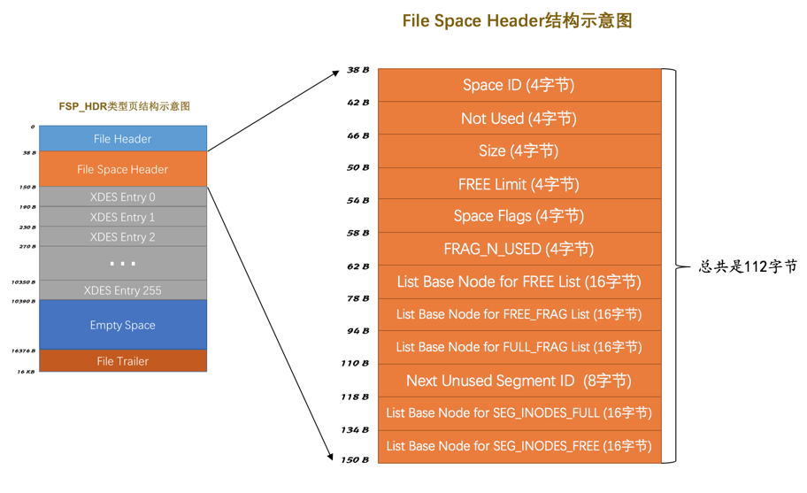

| 名称                                      | 占用空间大小 | 描述                                                         |
| ----------------------------------------- | ------------ | ------------------------------------------------------------ |
| `Space ID`                                | `4`字节      | 表空间的ID                                                   |
| `Not Used`                                | `4`字节      | 这4个字节未被使用，可以忽略                                  |
| `Size`                                    | `4`字节      | 当前表空间占有的页数                                         |
| `FREE Limit`                              | `4`字节      | 尚未被初始化的最小页号，大于或等于这个页号的区对应的XDES Entry结构都没有被加入FREE链表 |
| `Space Flags`                             | `4`字节      | 表空间的一些占用存储空间比较小的属性                         |
| `FRAG_N_USED`                             | `4`字节      | FREE_FRAG链表中已使用的页数量                                |
| `List Base Node for FREE List`            | `16`字节     | FREE链表的基节点                                             |
| `List Base Node for FREE_FRAG List`       | `16`字节     | FREE_FREG链表的基节点                                        |
| `List Base Node for FULL_FRAG List`       | `16`字节     | FULL_FREG链表的基节点                                        |
| `Next Unused Segment ID`                  | `8`字节      | 当前表空间中下一个未使用的 Segment ID                        |
| `List Base Node for SEG_INODES_FULL List` | `16`字节     | SEG_INODES_FULL链表的基节点                                  |
| `List Base Node for SEG_INODES_FREE List` | `16`字节     | SEG_INODES_FREE链表的基节点                                  |

- `List Base Node for FREE List`、`List Base Node for FREE_FRAG List`、`List Base Node for FULL_FRAG List`。

    分别是直属于表空间的`FREE`链表的基节点、`FREE_FRAG`链表的基节点、`FULL_FRAG`链表的基节点，这三个链表的基节点在表空间的位置是固定的，就是在表空间的第一个页（也就是`FSP_HDR`类型的页）的`File Space Header`部分。

- `FRAG_N_USED`

    这个字段表明在`FREE_FRAG`链表中已经使用的页数量，方便之后在链表中查找空闲的页。

- `FREE Limit`

    我们知道表空间都对应着具体的磁盘文件，一开始我们创建表空间的时候对应的磁盘文件中都没有数据，所以我们需要对表空间完成一个初始化操作，包括为表空间中的区建立`XDES Entry`结构，为各个段建立`INODE Entry`结构，建立各种链表等等的各种操作。我们可以一开始就为表空间申请一个特别大的空间，但是实际上有绝大部分的区是空闲的，我们可以选择把所有的这些空闲区对应的`XDES Entry`结构加入`FREE`链表，也可以选择只把一部分的空闲区加入`FREE`链表，等什么时候空闲链表中的`XDES Entry`结构对应的区不够使了，再把之前没有加入`FREE`链表的空闲区对应的`XDES Entry`结构加入`FREE`链表，中心思想就是什么时候用到什么时候初始化，设计`InnoDB`的大佬采用的就是后者，他们为表空间定义了`FREE Limit`这个字段，在该字段表示的页号之前的区都被初始化了，之后的区尚未被初始化。

- `Next Unused Segment ID`

    该字段表明当前表空间中最大的段ID的下一个ID，在创建新段的时候赋予新段一个唯一的ID值就直接使用这个字段的值。

- `Space Flags`

    4个字节，32个比特位大小，存储了好多表空间的属性，详细情况如下表：

  | 标志名称        | 占用的空间（单位：bit） | 描述                                     |
  | --------------- | ----------------------- | ---------------------------------------- |
  | `POST_ANTELOPE` | 1                       | 表示文件格式是否大于`ANTELOPE`           |
  | `ZIP_SSIZE`     | 4                       | 表示压缩页的大小                         |
  | `ATOMIC_BLOBS`  | 1                       | 表示是否自动把值非常长的字段放到BLOB页里 |
  | `PAGE_SSIZE`    | 4                       | 页大小                                   |
  | `DATA_DIR`      | 1                       | 表示表空间是否是从默认的数据目录中获取的 |
  | `SHARED`        | 1                       | 是否为共享表空间                         |
  | `TEMPORARY`     | 1                       | 是否为临时表空间                         |
  | `ENCRYPTION`    | 1                       | 表空间是否加密                           |
  | `UNUSED`        | 18                      | 没有使用到的比特位                       |

- `List Base Node for SEG_INODES_FULL List`和`List Base Node for SEG_INODES_FREE List`

    每个段对应的`INODE Entry`结构会集中存放到一个类型位`INODE`的页中，如果表空间中的段特别多，则会有多个`INODE Entry`结构，可能一个页放不下，这些`INODE`类型的页会组成两种列表：

  - `SEG_INODES_FULL`链表，该链表中的`INODE`类型的页都已经被`INODE Entry`结构填充满了，没空闲空间存放额外的`INODE Entry`了。

  - `SEG_INODES_FREE`链表，该链表中的`INODE`类型的页都已经仍有空闲空间来存放`INODE Entry`结构。

    

**`XDES`类型的页**

每组开头的一个页记录着本组内所有的区对应的`XDES Entry`结构


##### 段（segment）的概念

> 以区为单位申请空间时，如果将B+树的叶子节点和非叶子节点混合存储在一个区中，因为在范围查找时，非叶子节点检索时更多需要查找下一个非叶子节点，叶子节点更多需要查找下一个叶子节点，混合存放可能还是造成物理位置的不相邻，因此将某个特定的区以及一些碎片页指定给叶子节点/非叶子节点，这样的称之为段。

存放叶子节点的区的集合就算是一个`段`（`segment`），存放非叶子节点的区的集合也算是一个`段`。也就是说一个索引会生成2个段，一个叶子节点段，一个非叶子节点段，还包括碎片区中页。段是一些零散的页以及一些完整的区的集合。

**`INODE`类型的页**

`INODE`类型的页就是为了存储`INODE Entry`结构


**INODE Entry结构**


- `Segment ID`

    就是指这个`INODE Entry`结构对应的段的编号（ID）。

- `NOT_FULL_N_USED`

    这个字段指的是在`NOT_FULL`链表中已经使用了多少个页。下次从`NOT_FULL`链表分配空闲页时可以直接根据这个字段的值定位到。而不用从链表中的第一个页开始遍历着寻找空闲页。

- 3个`List Base Node`

    分别为段的`FREE`链表、`NOT_FULL`链表、`FULL`链表定义了`List Base Node`，这样我们想查找某个段的某个链表的头节点和尾节点的时候，就可以直接到这个部分找到对应链表的`List Base Node`。

  - `FREE`链表：同一个段中，所有页都是空闲的区对应的`XDES Entry`结构会被加入到这个链表。注意和直属于表空间的`FREE`链表区别开了，此处的`FREE`链表是附属于某个段的。
  - `NOT_FULL`链表：同一个段中，仍有空闲空间的区对应的`XDES Entry`结构会被加入到这个链表。
  - `FULL`链表：同一个段中，已经没有空闲空间的区对应的`XDES Entry`结构会被加入到这个链表。

- `Magic Number`：

    这个值是用来标记这个`INODE Entry`是否已经被初始化了（初始化的意思就是把各个字段的值都填进去了）。如果这个数字是值的`97937874`，表明该`INODE Entry`已经初始化，否则没有被初始化。（不用纠结这个值有什么特殊含义，人家规定的）。

- `Fragment Array Entry`

    我们前面强调过无数次：段是一些零散页和一些完整的区的集合，每个`Fragment Array Entry`结构都对应着一个零散的页，这个结构一共4个字节，表示一个零散页的页号。

  

**List Base Node**


- `List Length`表明该链表一共有多少节点，
- `First Node Page Number`和`First Node Offset`表明该链表的头节点在表空间中的位置。
- `Last Node Page Number`和`Last Node Offset`表明该链表的尾节点在表空间中的位置。


#### 系统表空间结构

系统表空间和独立表空间的前三个页（页号分别为`0`、`1`、`2`，类型分别是`FSP_HDR`、`IBUF_BITMAP`、`INODE`）的类型是一致的，只是页号为`3`～`7`的页是系统表空间特有的

| 页号 | 页类型    | 英文描述               | 描述                        |
| ---- | --------- | ---------------------- | --------------------------- |
| `3`  | `SYS`     | Insert Buffer Header   | 存储Insert Buffer的头部信息 |
| `4`  | `INDEX`   | Insert Buffer Root     | 存储Insert Buffer的根页     |
| `5`  | `TRX_SYS` | Transction System      | 事务系统的相关信息          |
| `6`  | `SYS`     | First Rollback Segment | 第一个回滚段的页            |
| `7`  | `SYS`     | Data Dictionary Header | 数据字典头部信息            |


系统表空间的`extent 1`和`extent 2`这两个区，也就是页号从`64`~`191`这128个页被称为`Doublewrite buffer`，也就是**双写缓冲区**。

**InnoDB数据字典**

InnoDB存储引擎特意定义了一些列的内部系统表（internal system table）来记录用户表的元数据，**它们都是以`B+`树的形式保存在系统表空间的某些页中**

| 表名               | 描述                                                       |
| ------------------ | ---------------------------------------------------------- |
| `SYS_TABLES`       | 整个InnoDB存储引擎中所有的表的信息                         |
| `SYS_COLUMNS`      | 整个InnoDB存储引擎中所有的列的信息                         |
| `SYS_INDEXES`      | 整个InnoDB存储引擎中所有的索引的信息                       |
| `SYS_FIELDS`       | 整个InnoDB存储引擎中所有的索引对应的列的信息               |
| `SYS_FOREIGN`      | 整个InnoDB存储引擎中所有的外键的信息                       |
| `SYS_FOREIGN_COLS` | 整个InnoDB存储引擎中所有的外键对应列的信息                 |
| `SYS_TABLESPACES`  | 整个InnoDB存储引擎中所有的表空间信息                       |
| `SYS_DATAFILES`    | 整个InnoDB存储引擎中所有的表空间对应文件系统的文件路径信息 |
| `SYS_VIRTUAL`      | 整个InnoDB存储引擎中所有的虚拟生成列的信息                 |


**Data Dictionary Header页**

页号为`7`的页来记录这4个表SYS_TABLES`、`SYS_COLUMNS`、`SYS_INDEXES`、`SYS_FIELDS的聚簇索引和二级索引对应的`B+树`位置，页类型为`SYS`，记录了`Data Dictionary Header`，也就是数据字典的头部信息。

| 名称                     | 中文名           | 占用空间大小 | 简单描述                                                     |
| ------------------------ | ---------------- | ------------ | ------------------------------------------------------------ |
| `File Header`            | 文件头部         | `38`字节     | 页的一些通用信息                                             |
| `Data Dictionary Header` | 数据字典头部信息 | `56`字节     | 记录一些基本系统表的根页位置以及InnoDB存储引擎的一些全局信息 |
| `Segment Header`         | 段头部信息       | `10`字节     | 记录本页所在段对应的INODE Entry位置信息                      |
| `Empty Space`            | 尚未使用空间     | `16272`字节  | 用于页结构的填充，没什么实际意义                             |
| `File Trailer`           | 文件尾部         | `8`字节      | 校验页是否完整                                               |


- `Max Row ID`：我们说过如果我们不显式的为表定义主键，而且表中也没有`UNIQUE`索引，那么`InnoDB`存储引擎会默认为我们生成一个名为`row_id`的列作为主键。因为它是主键，所以每条记录的`row_id`列的值不能重复。原则上只要一个表中的`row_id`列不重复就可以了，也就是说表a和表b拥有一样的`row_id`列也没什么关系，不过设计InnoDB的大佬只提供了这个`Max Row ID`字段，不论哪个拥有`row_id`列的表插入一条记录时，该记录的`row_id`列的值就是`Max Row ID`对应的值，然后再把`Max Row ID`对应的值加1，也就是说这个`Max Row ID`是全局共享的。
- `Max Table ID`：InnoDB存储引擎中的所有的表都对应一个唯一的ID，每次新建一个表时，就会把本字段的值作为该表的ID，然后自增本字段的值。
- `Max Index ID`：InnoDB存储引擎中的所有的索引都对应一个唯一的ID，每次新建一个索引时，就会把本字段的值作为该索引的ID，然后自增本字段的值。
- `Max Space ID`：InnoDB存储引擎中的所有的表空间都对应一个唯一的ID，每次新建一个表空间时，就会把本字段的值作为该表空间的ID，然后自增本字段的值。
- `Mix ID Low(Unused)`：这个字段没什么用，跳过。
- `Root of SYS_TABLES clust index`：本字段代表`SYS_TABLES`表聚簇索引的根页的页号。
- `Root of SYS_TABLE_IDS sec index`：本字段代表`SYS_TABLES`表为`ID`列建立的二级索引的根页的页号。
- `Root of SYS_COLUMNS clust index`：本字段代表`SYS_COLUMNS`表聚簇索引的根页的页号。
- `Root of SYS_INDEXES clust index`本字段代表`SYS_INDEXES`表聚簇索引的根页的页号。
- `Root of SYS_FIELDS clust index`：本字段代表`SYS_FIELDS`表聚簇索引的根页的页号。
- `Unused`：这4个字节没用，跳过。

用户是不能直接访问`InnoDB`的这些内部系统表，系统数据库`information_schema`中提供了一些以`innodb_sys`开头的表，并不是真正的内部系统表，而是在存储引擎启动时读取这些以`SYS`开头的系统表，以`INNODB_SYS`开头的表和以`SYS`开头的表中的字段并不完全一样

```mysql
mysql> USE information_schema;
Database changed

mysql> SHOW TABLES LIKE 'innodb_sys%';
+--------------------------------------------+
| Tables_in_information_schema (innodb_sys%) |
+--------------------------------------------+
| INNODB_SYS_DATAFILES                       |
| INNODB_SYS_VIRTUAL                         |
| INNODB_SYS_INDEXES                         |
| INNODB_SYS_TABLES                          |
| INNODB_SYS_FIELDS                          |
| INNODB_SYS_TABLESPACES                     |
| INNODB_SYS_FOREIGN_COLS                    |
| INNODB_SYS_COLUMNS                         |
| INNODB_SYS_FOREIGN                         |
| INNODB_SYS_TABLESTATS                      |
+--------------------------------------------+
10 rows in set (0.00 sec)
```


#### 整合图片


## 查询与优化

### 单表访问方法

`MySQL`执行查询语句的方式称之为`访问方法`或者`访问类型`。同一个查询语句可能可以使用多种不同的访问方法来执行，虽然最后的查询结果都是一样的，但是执行的时间可能相差非常大。

```mysql
#举例表
CREATE TABLE single_table (
    id INT NOT NULL AUTO_INCREMENT,
    key1 VARCHAR(100),
    key2 INT,
    key3 VARCHAR(100),
    key_part1 VARCHAR(100),
    key_part2 VARCHAR(100),
    key_part3 VARCHAR(100),
    common_field VARCHAR(100),
    PRIMARY KEY (id),
    KEY idx_key1 (key1),
    UNIQUE KEY idx_key2 (key2),
    KEY idx_key3 (key3),
    KEY idx_key_part(key_part1, key_part2, key_part3)
) Engine=InnoDB CHARSET=utf8;
```

#### const

当使用等值查找聚簇索引或者唯一索引来查找唯一一条记录时，访问方法为`const`

**聚簇索引等值查询**

```mysql
#使用主键查询等值查询
SELECT * FROM single_table WHERE id = 1438;
```

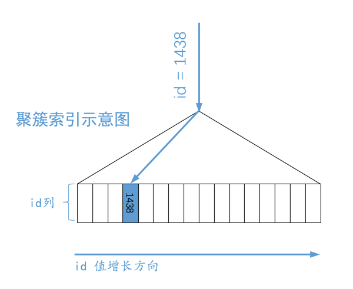


**唯一索引等值查询**

```mysql
#使用唯一索引等值查询
SELECT * FROM single_table WHERE key2 = 3841;
```

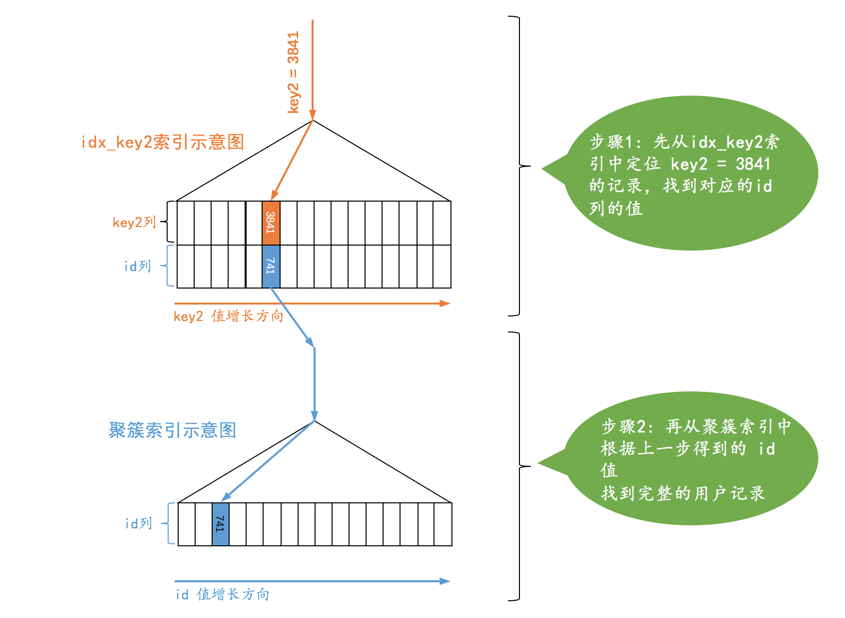

对于唯一二级索引来说，查询该列为`NULL`值的情况比较特殊，因为唯一二级索引列允许有多个 NULL 值，所以实际上使用的是`ref`

```mysql
#NULL值并不唯一，所以访问方式是ref
SELECT * FROM single_table WHERE key2 IS NULL;
```


#### ref

当对某个普通的二级索引列与常数进行等值查询 或者 二级索引列值为`NULL`的查询时，使用`ref`访问方法

> 使用二级索引来执行查询的代价取决于等值匹配到的二级索引记录条数。如果匹配的记录较少，则回表的代价还是比较低的，所以`MySQL`可能选择使用索引而不是全表扫描的方式来执行查询。

**对某个普通的二级索引列与常数进行等值查询**

```mysql
#普通二级索引 值abc可能有多个
SELECT * FROM single_table WHERE key1 = 'abc';
```


**二级索引列值为`NULL`的情况**

不论是普通的二级索引，还是唯一二级索引，它们的索引列对包含`NULL`值的数量并不限制，所以我们采用`key IS NULL`这种形式的搜索条件最多只能使用`ref`的访问方法。


**联合索引的情况**

对于某个包含多个索引列的二级索引来说，只要是最左边的连续索引列是与常数的等值比较就可能采用`ref`的访问方法，比方说下面这几个查询：

```mysql
SELECT * FROM single_table WHERE key_part1 = 'god like';

SELECT * FROM single_table WHERE key_part1 = 'god like' AND key_part2 = 'legendary';

SELECT * FROM single_table WHERE key_part1 = 'god like' AND key_part2 = 'legendary' AND key_part3 = 'penta kill';

#最左边的连续索引列并不全部是等值比较 不是ref
SELECT * FROM single_table WHERE key_part1 = 'god like' AND key_part2 > 'legendary';

```


#### ref_or_null

有时候我们不仅想找出某个二级索引列的值等于某个常数的记录，还想把该列的值为`NULL`的记录也找出来，当使用二级索引而不是全表扫描的方式执行该查询时，这种类型的查询使用的访问方法就称为`ref_or_null`

```mysql
# 等值查询 + NULL
SELECT * FROM single_demo WHERE key1 = 'abc' OR key1 IS NULL;
```


#### range

当搜索条件不只是要求索引列与常数的等值匹配，而是索引列需要匹配若干个单点或某些范围的值，这种访问方法称之为`range`

```mysql
SELECT * FROM single_table WHERE key2 IN (1438, 6328) OR (key2 >= 38 AND key2 <= 79);
```


#### index

当查询列和搜索列的字段只包含在某个索引中时，可以通过直接查询二级索引得到结果，不需要回表，这样的访问方式称之为`index`

```mysql
SELECT key_part1, key_part2, key_part3 FROM single_table WHERE key_part2 = 'abc';
```

- 它的查询列表只有3个列：`key_part1`, `key_part2`, `key_part3`，而索引`idx_key_part`又包含这三个列。
- 搜索条件中只有`key_part2`列。这个列也包含在索引`idx_key_part`中。

由于二级索引记录比聚簇索记录小的多（聚簇索引记录要存储所有用户定义的列以及所谓的隐藏列，而二级索引记录只需要存放索引列和主键），而且这个过程也不用进行回表操作，所以直接遍历二级索引比直接遍历聚簇索引的成本要小很多


#### all

对于`InnoDB`表来说也就是直接扫描聚簇索引，这种使用全表扫描执行查询的方式称之为：`all`


##### 注意事项

一般情况下，只能利用单个二级索引执行查询，优化器一般会根据`single_table`表的统计数据来判断到底使用哪个条件到对应的二级索引中查询扫描的行数会更少，选择那个扫描行数较少的条件到对应的二级索引中查询，然后将从该二级索引中查询到的结果经过回表得到完整的用户记录后再根据其余的`WHERE`条件过滤记录。

```mysql
SELECT * FROM single_table WHERE key1 = 'abc' AND key2 > 1000;
```


**复杂搜索条件下找出范围匹配的区间**

```mysql
SELECT * FROM single_table WHERE 
        (key1 > 'xyz' AND key2 = 748 ) OR
        (key1 < 'abc' AND key1 > 'lmn') OR
        (key1 LIKE '%suf' AND key1 > 'zzz' AND (key2 < 8000 OR common_field = 'abc')) ;
```

- 首先查看`WHERE`子句中的搜索条件都涉及到了哪些列，哪些列可能使用到索引。

  这个查询的搜索条件涉及到了`key1`、`key2`、`common_field`这3个列，然后`key1`列有普通的二级索引`idx_key1`，`key2`列有唯一二级索引`idx_key2`。

- 对于那些可能用到的索引，分析它们的范围区间。

  我们需要把那些用不到该索引的搜索条件暂时移除掉，直接把它们替换为`TRUE`

假设我们使用`idx_key2`执行查询

```mysql
(TRUE AND key2 = 748 ) OR
(TRUE AND TRUE) OR
(TRUE AND TRUE AND (key2 < 8000 OR TRUE))

#化简之后的搜索条件
key2 = 748 OR TRUE

#即
TRUE

#这个结果也就意味着如果我们要使用idx_key2索引执行查询语句的话，需要扫描idx_key2二级索引的所有记录，然后再回表，所以这种情况下不会使用idx_key2索引的。
```


#### index_merge

`MySQL`在一般情况下执行一个查询时最多只会用到单个二级索引，特殊情况下使用到多个索引来完成一次查询的执行方法称之为：`index merge`

> 当两个索引搜索的记录都按照主键有序的时候，优化器才会根据成本将索引合并纳入考虑
>
> 有序集合的交集并集都很快，并且回表时有序集合可以带来更多的顺序IO
>
> 
>
> ```mysql
> # mysql中的唯一键是通过索引唯一键来实现的，唯一键和普通键中允许存在多个NULL值
> CREATE TABLE test_unique
> (
>     id   INT NOT NULL AUTO_INCREMENT,
>   	#实际上就是在key1上建立了一个unique的二级索引
>     key1 int unique,
>     PRIMARY KEY (id)
> ) Engine = InnoDB
>   CHARSET = utf8;
>   
> ```

- intersection索引合并针对的是单独根据某个二级索引的记录数量太大，回表的成本太大，多个索引求交集可以降低回表数量，有序回表，降低随机IO
- union索引合并针对的是单独根据某个二级索引的记录数量小，多个索引取并集后，可以有序回表，降低随机IO

##### intersection索引合并

某个查询可以使用多个二级索引，将从多个二级索引中查询到的结果取交集，适用于使用不同索引的搜索条件之间使用`AND`连接起来的情况


###### 二级索引等值匹配

二级索引列是等值匹配的情况，对于联合索引来说，在联合索引中的每个列都必须等值匹配，不能出现只匹配部分列的情况。

```mysql
#使用了交集索引合并
SELECT * FROM single_table WHERE key1 = 'a' AND key_part1 = 'a' AND key_part2 = 'b' AND key_part3 = 'c';

#不是等值
SELECT * FROM single_table WHERE key1 > 'a' AND key_part1 = 'a' AND key_part2 = 'b' AND key_part3 = 'c';
#联合索引全部列都要匹配
SELECT * FROM single_table WHERE key1 = 'a' AND key_part1 = 'a';

```

> 原理：两个有序集合取交集比两个无序集合取交集更快
>
> 当两个索引都使用等值匹配时，记录按照主键从小到大排序，对于两个从小到大排序的集合取交集
>
> p1： 1，3，5
>
> p2： 2，3，5
>
> - 2与1进行比较，不等于，1丢弃
> - 2与3进行比较，不等于，2丢弃
> - 3与3进行比较，等于，3是一个交集
>
> 无序集合求交集需要遍历所有元素


###### 主键列可以是范围匹配

```mysql
SELECT * FROM single_table WHERE id > 100 AND key1 = 'a';
```

因为二级索引中的记录是 索引列+主键+页号，所以此SQL的执行方式如下：

- 利用key1的索引查找值为a的所有记录
- 利用主键筛选 id>100的记录
- 回表查其他字段


##### union索引合并

`Union`是并集的意思，适用于使用不同索引的搜索条件之间使用`OR`连接起来的情况


###### 二级索引等值匹配

二级索引列是等值匹配的情况，对于联合索引来说，在联合索引中的每个列都必须等值匹配，不能出现只出现匹配部分列的情况。

```mysql
#使用并集索引合并
SELECT * FROM single_table WHERE key1 = 'a' OR ( key_part1 = 'a' AND key_part2 = 'b' AND key_part3 = 'c');

#不是等值匹配
SELECT * FROM single_table WHERE key1 > 'a' OR (key_part1 = 'a' AND key_part2 = 'b' AND key_part3 = 'c');
#只有部分列
SELECT * FROM single_table WHERE key1 = 'a' OR key_part1 = 'a';
```


###### 主键列可以是范围匹配

```mysqL
select * from single_table where key1 = 'a' or  id > 9000;
```

- 对于key1来说，值为a的记录按照主键排序，先查找所有值为a的有序集合
- 对于id来说，主键也是有序的，找出id>9000的有序集合
- 两个有序列表求并集，有序列表顺序IO回表查其他字段


###### 使用`Intersection`索引合并的搜索条件

```mysql
SELECT * FROM single_table WHERE key_part1 = 'a' AND key_part2 = 'b' AND key_part3 = 'c' OR (key1 = 'a' AND key3 = 'b');
```

- 先按照搜索条件`key1 = 'a' AND key3 = 'b'`从索引`idx_key1`和`idx_key3`中使用`Intersection`索引合并的方式得到一个主键集合。
- 再按照搜索条件`key_part1 = 'a' AND key_part2 = 'b' AND key_part3 = 'c'`从联合索引`idx_key_part`中得到另一个主键集合。
- 采用`Union`索引合并的方式把上述两个主键集合取并集，然后进行回表操作，将结果返回给用户。


当然，查询条件符合了这些情况也不一定就会采用`Union`索引合并，也得看优化器的心情。优化器只有在单独根据搜索条件从某个二级索引中获取的记录数比较少，通过`Union`索引合并后进行访问的代价比全表扫描更小时才会使用`Union`索引合并。


##### sort-union索引合并

`Union`索引合并的使用条件太苛刻，必须保证各个二级索引列在进行等值匹配的条件下才可能被用到

```mysql
#这个无法用到union索引合并 不过可以用到sort-union索引排序
SELECT * FROM single_table WHERE key1 < 'a' OR key3 > 'z'
```

- 先根据`key1 < 'a'`条件从`idx_key1`二级索引总获取记录，并按照记录的主键值进行排序
- 再根据`key3 > 'z'`条件从`idx_key3`二级索引总获取记录，并按照记录的主键值进行排序
- 因为上述的两个二级索引主键值都是排好序的，剩下的操作和`Union`索引合并方式就一样了。

我们把上述这种先按照二级索引记录的主键值进行排序，之后按照`Union`索引合并方式执行的方式称之为`Sort-Union`索引合并


### 连接的原理

```mysql
#例子表
mysql> CREATE TABLE t1 (m1 int, n1 char(1));
Query OK, 0 rows affected (0.02 sec)

mysql> CREATE TABLE t2 (m2 int, n2 char(1));
Query OK, 0 rows affected (0.02 sec)

mysql> INSERT INTO t1 VALUES(1, 'a'), (2, 'b'), (3, 'c');
Query OK, 3 rows affected (0.00 sec)
Records: 3  Duplicates: 0  Warnings: 0

mysql> INSERT INTO t2 VALUES(2, 'b'), (3, 'c'), (4, 'd');
Query OK, 3 rows affected (0.00 sec)
Records: 3  Duplicates: 0  Warnings: 0
```

#### 连接

连接查询的结果集中包含一个表中的每一条记录与另一个表中的每一条记录相互匹配的组合，像这样的结果集就可以称之为`笛卡尔积`。

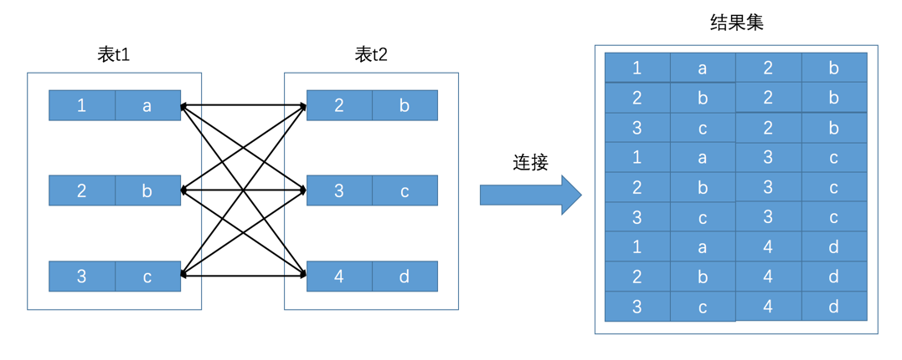

##### 连接过程

```mysql
SELECT * FROM t1, t2 WHERE t1.m1 > 1 AND t1.m1 = t2.m2 AND t2.n2 < 'd';
```

- 首先确定第一个需要查询的表，这个表称之为`驱动表`。只需要选取代价最小的那种访问方法去执行单表查询语句就好了（就是说从const、ref、ref_or_null、range、index、all这些执行方法中选取代价最小的去执行查询）。

  

- 针对上一步骤中从驱动表产生的结果集中的每一条记录，分别需要到`t2`表中查找匹配的记录。因为是根据`t1`表中的记录去找`t2`表中的记录，所以`t2`表也可以被称之为`被驱动表`。上一步骤从驱动表中得到了2条记录，所以需要查询2次`t2`表。

  此时涉及两个表的列的过滤条件`t1.m1 = t2.m2`就派上用场了：

  - 当`t1.m1 = 2`时，过滤条件`t1.m1 = t2.m2`就相当于`t2.m2 = 2`，所以此时`t2`表相当于有了`t2.m2 = 2`、`t2.n2 < 'd'`这两个过滤条件，然后到`t2`表中执行单表查询。

  - 当`t1.m1 = 3`时，过滤条件`t1.m1 = t2.m2`就相当于`t2.m2 = 3`，所以此时`t2`表相当于有了`t2.m2 = 3`、`t2.n2 < 'd'`这两个过滤条件，然后到`t2`表中执行单表查询。

    

- 每查询到一条完整的记录包括驱动表和被驱动表，就会直接返回给用户，并不会在内存中保存结果集。

在两表连接查询中，驱动表只需要访问一次，被驱动表可能被访问多次。

##### 内连接与外连接

- 对于`内连接`的两个表，驱动表中的记录在被驱动表中找不到匹配的记录，该记录不会加入到最后的结果集。

  ```mysql
  SELECT * FROM t1 [INNER | CROSS] JOIN t2 [ON 连接条件] [WHERE 普通过滤条件];
   SELECT * FROM t1, t2;
  ```

- 对于`外连接`的两个表，驱动表中的记录即使在被驱动表中没有匹配的记录，也仍然需要加入到结果集。

  ```mysql
  SELECT * FROM t1 LEFT [OUTER] JOIN t2 ON 连接条件 [WHERE 普通过滤条件];
  SELECT * FROM t1 RIGHT [OUTER] JOIN t2 ON 连接条件 [WHERE 普通过滤条件];
  ```


对于内连接来说，驱动表和被驱动表是可以互换的，并不会影响最后的查询结果。

左外连接和右外连接的驱动表和被驱动表不能轻易互换。


#### 连接的原理

##### 嵌套循环连接(Nested-Loop Join)

驱动表只访问一次，但被驱动表却可能被多次访问，访问次数取决于对驱动表执行单表查询后的结果集中的记录条数的连接执行方式称之为`嵌套循环连接`（`Nested-Loop Join`）

- 步骤1：选取驱动表，使用与驱动表相关的过滤条件，选取代价最低的单表访问方法来执行对驱动表的单表查询。
- 步骤2：对上一步骤中查询驱动表得到的结果集中每一条记录，都分别到被驱动表中查找匹配的记录。

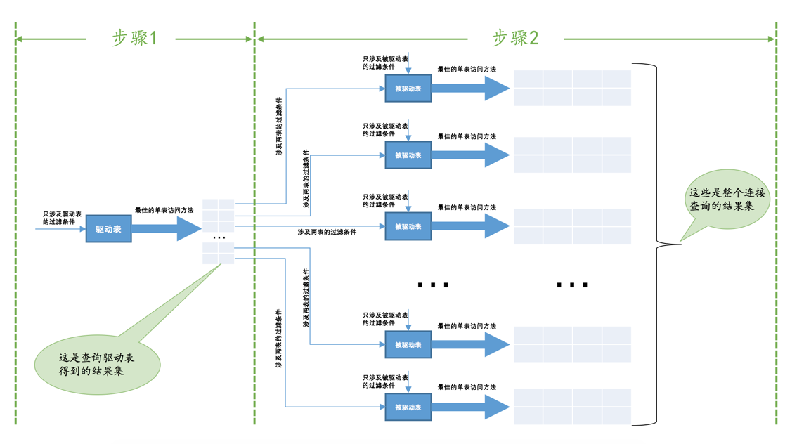


##### 使用索引加快连接速度(Index Nested-Loop Join)

在`嵌套循环连接`的`步骤2`中可能需要访问多次被驱动表，如果访问被驱动表的方式都是全表扫描的话性能非常差，查询`t2`表其实就相当于一次单表扫描，我们可以利用索引来加快查询速度，在连接的列上加上索引，可以使得在对被驱动表单表查询时走索引，加快查询速度

> 在单表中使用主键值或者唯一二级索引列的值进行等值查找的方式称之为`const`，在连接查询中对被驱动表使用主键值或者唯一二级索引列的值进行等值查找的查询执行方式称之为：`eq_ref`。
>

即使不能使用`eq_ref`、`ref`、`ref_or_null`或者`range`这些访问方法执行对被驱动表的查询的话，如果查询列表和过滤条件中可能只涉及被驱动表的部分列，而这些列都在索引中，那么也可以使用`index`的方式进行查询（索引的体积小，常驻内存，查询速度快）。


##### 基于块的嵌套循环连接(Block Nested-Loop Join)

加入了`join buffer`的嵌套循环连接算法称之为`基于块的嵌套连接`（Block Nested-Loop Join）


在现实生活中，表中的数据可能达到成千上万，对表的扫描过程需要在内存中进行，如果内存不足以加载全部记录时，后面的记录就要替换掉前面的记录。

如果在扫描被驱动表时，被驱动表的数据量较大，对于每一条驱动表记录，都需要从磁盘从头到尾一条条读取全部的被驱动表记录匹配筛选，I/O的代价非常大，所以需要用**块的嵌套循环连接**尽量减少访问被驱动表的次数，**在被驱动表的记录加载到内存的时候，一次性和多条驱动表中的记录做匹配。**

`join buffer`就是执行连接查询前申请的一块固定大小的内存，把若干条驱动表结果集中的记录装进去，每一条被驱动表的记录一次性和`join buffer`中的多条驱动表记录做匹配。


`join buffer`的大小是可以通过启动参数或者系统变量`join_buffer_size`进行配置，默认大小为`262144字节`（也就是`256KB`），驱动表的记录并不是所有列都会被放到`join buffer`中，只有查询列表中的列和过滤条件中的列才会被放到`join buffer`中，精确查询条件和查询字段可以使`join buffer`中存放更多驱动表记录，一次比对的数量更多，速度更快。


### 成本优化

`MySQL`执行一个查询可以有不同的执行方案，它会选择其中成本最低，或者说代价最低的那种方案去真正的执行查询。

一条查询语句的执行成本是由下面这两个方面组成的：

- `I/O`成本

    我们的表经常使用的`MyISAM`、`InnoDB`存储引擎都是将数据和索引都存储到磁盘上的，当我们想查询表中的记录时，需要先把数据或者索引加载到内存中然后再操作。这个从磁盘到内存这个加载的过程损耗的时间称之为`I/O`成本。

- `CPU`成本

    读取以及检测记录是否满足对应的搜索条件、对结果集进行排序等这些操作损耗的时间称之为`CPU`成本。

对于`InnoDB`存储引擎来说，页是磁盘和内存之间交互的基本单位，规定读取一个页面花费的成本默认是`1.0`，读取以及检测一条记录是否符合搜索条件的成本默认是`0.2`。


#### 单表查询的成本

##### 基于成本的优化步骤

在一条单表查询语句真正执行之前，`MySQL`的查询优化器会找出执行该语句所有可能使用的方案，对比之后找出成本最低的方案，这个成本最低的方案就是所谓的`执行计划`

1. 根据搜索条件，找出所有可能使用的索引
2. 计算全表扫描的代价
3. 计算使用不同索引执行查询的代价
4. 对比各种执行方案的代价，找出成本最低的那一个

```mysql
SELECT * FROM single_table WHERE 
    key1 IN ('a', 'b', 'c') AND 
    key2 > 10 AND key2 < 1000 AND 
    key3 > key2 AND 
    key_part1 LIKE '%hello%' AND
    common_field = '123';
```

###### 找出所有可能使用的索引

只要索引列和常数使用`=`、`<=>`、`IN`、`NOT IN`、`IS NULL`、`IS NOT NULL`、`>`、`<`、`>=`、`<=`、`BETWEEN`、`!=`（不等于也可以写成`<>`）或者`LIKE`操作符连接起来，就可以产生一个所谓的`范围区间`，也就是说这些搜索条件都可能使用到索引，一个查询中可能使用到的索引称之为`possible keys`

- `key1 IN ('a', 'b', 'c')`，这个搜索条件可以使用二级索引`idx_key1`。
- `key2 > 10 AND key2 < 1000`，这个搜索条件可以使用二级索引`idx_key2`。
- `key3 > key2`，这个搜索条件的索引列由于没有和常数比较，所以并不能使用到索引。
- `key_part1 LIKE '%hello%'`，`key_part1`通过`LIKE`操作符和以通配符开头的字符串做比较，不可以适用索引。
- `common_field = '123'`，由于该列上没有索引，所以不会用到索引。

`possible keys`只有`idx_key1`和`idx_key2`


###### 计算全表扫描的代价

对于`InnoDB`存储引擎来说，全表扫描的意思就是把聚簇索引中的记录都依次和给定的搜索条件做匹配，需要加载聚簇索引叶子节点的全部数据页到内存中

查询成本=`I/O`成本（需要加载多少个页）+`CPU`成本(需要读取检索多少条记录)


**IO成本**

```mysql
#通过表统计信息可以得到表中的大致数据量和大致数据大小

mysql> SHOW TABLE STATUS LIKE 'single_table'\G
*************************** 1. row ***************************
           Name: single_table
         Engine: InnoDB
        Version: 10
     Row_format: Dynamic
           Rows: 9693 #表中大概的数据量 不精准
 Avg_row_length: 163
    Data_length: 1589248 #使用MyISAM存储引擎的表来说，该值就是数据文件的大小，对于使用InnoDB存储引擎的表来说，该值就相当于聚簇索引占用的存储空间大小
Max_data_length: 0
   Index_length: 2752512
      Data_free: 4194304
 Auto_increment: 10001
    Create_time: 2018-12-10 13:37:23
    Update_time: 2018-12-10 13:38:03
     Check_time: NULL
      Collation: utf8_general_ci
       Checksum: NULL
 Create_options:
        Comment:
1 row in set (0.01 sec)

```

由于每个页面是16KB大小，那么`页面总数 = 1589248 ➗ 16 ➗ 1024 = 97 `

IO成本 ：`97  x  1.0 + 1.1 = 98.1` 其中`1.1`是微调数字

CPU成本：`9693 x 0.2 + 1.0 = 1939.6` 其中1.0是微调数字

总成本：`98.1 + 1939.6 = 2037.7`

> 我们前面说过表中的记录其实都存储在聚簇索引对应B+树的叶子节点中，所以只要我们通过根节点获得了最左边的叶子节点，就可以沿着叶子节点组成的双向链表把所有记录都查看一遍。也就是说全表扫描这个过程其实有的B+树内节点是不需要访问的，但是设计MySQL的大佬们在计算全表扫描成本时直接使用聚簇索引占用的页面数作为计算I/O成本的依据，是不区分内节点和叶子节点的。

###### 计算使用不同索引执行查询的代价

`MySQL`查询优化器先分析使用唯一二级索引的成本，再分析使用普通索引的成本，idx_key2是唯一二级索引

**使用idx_key2执行查询的成本分析**

  `idx_key2`对应的搜索条件是：`key2 > 10 AND key2 < 1000`，也就是说对应的范围区间就是：`(10, 1000)`


对于使用`二级索引 + 回表`方式的查询，查询的成本依赖两个方面的数据：

- 范围区间数量

  不论某个范围区间的二级索引到底占用了多少页面，查询优化器粗暴的认为读取索引的一个范围区间的`I/O`成本和读取一个页面是相同的。本例中使用`idx_key2`的范围区间只有一个：`(10, 1000)`，所以相当于访问这个范围区间的二级索引付出的`I/O`成本就是：

  ```mysql
  1 x 1.0 = 1.0
  ```

- 需要回表的记录数

  找到`(10, 1000)`范围的最左记录和最右记录

  - 如果两个记录相隔不到10个页面，直接遍历中间的页面读取PageHeader中的PAGE_N_RECS属性加和统计数量

  - 相差较大的时候，沿着最左记录往右读10个页面计算每个页面的平均记录数量，再通过叶子节点的上一层节点来统计两条记录间的页面数量，平均数量*页面数量 = 记录数

    

    ```mysql
    #95条记录 0.01是微调
    95 x 0.2 + 0.01 = 19.01
    ```

  - 根据这些记录里的主键值到聚簇索引中做回表操作

    MySQL认为每次回表操作都相当于访问一个页面，也就是说二级索引范围区间有多少记录，就需要进行多少次回表操作，也就是需要进行多少次页面`I/O`。

    ```mysql
    95 x 1.0 = 95.0
    ```

  - 回表操作后得到的完整用户记录，然后再检测其他搜索条件是否成立

    ```mysql
    95 x 0.2 = 19.0
    ```


`I/O`成本：

```mysql
1.0 + 95 x 1.0 = 96.0 (范围区间的数量 + 预估的二级索引记录条数)
```

`CPU`成本：

```mysql
95 x 0.2 + 0.01 + 95 x 0.2 = 38.01 （读取二级索引记录的成本 + 读取并检测回表后聚簇索引记录的成本）
```

总成本：

```mysql
96.0 + 38.01 = 134.01
```


- 全表扫描的成本：`2037.7`
- 使用`idx_key2`的成本：`134.01`
- 使用`idx_key1`的成本：`168.21`

使用`idx_key2`的成本最低，所以当然选择`idx_key2`


##### 基于索引统计数据的成本计算

```mysql
SELECT * FROM single_table WHERE key1 IN ('aa1', 'aa2', 'aa3', ... , 'zzz');
```

这个查询使用的索引是key1，在计算成本时，需要对每个范围区间进行记录数统计，利用索引上的最左记录和最右记录统计数量的方法称之为`index dive`

但是当范围区间的数量过大，例如`in ()`中有20000个参数，`index dive`统计的成本可能过大，超过系统变量`eq_range_index_dive_limit`的限制（默认是200），就会使用索引统计数据来进行估算。

```mysql
mysql> SHOW VARIABLES LIKE '%dive%';
+---------------------------+-------+
| Variable_name             | Value |
+---------------------------+-------+
| eq_range_index_dive_limit | 200   |
+---------------------------+-------+
1 row in set (0.08 sec)
```

`MySQL`也会为表中的每一个索引维护一份统计数据，查看某个表中索引的统计数据可以使用`SHOW INDEX FROM 表名`的语法

```mysql
mysql> SHOW INDEX FROM single_table;
+--------------+------------+--------------+--------------+-------------+-----------+-------------+----------+--------+------+------------+---------+---------------+
| Table        | Non_unique | Key_name     | Seq_in_index | Column_name | Collation | Cardinality | Sub_part | Packed | Null | Index_type | Comment | Index_comment |
+--------------+------------+--------------+--------------+-------------+-----------+-------------+----------+--------+------+------------+---------+---------------+
| single_table |          0 | PRIMARY      |            1 | id          | A         |       9693  |     NULL | NULL   |      | BTREE      |         |               |
| single_table |          0 | idx_key2     |            1 | key2        | A         |       9693  |     NULL | NULL   | YES  | BTREE      |         |               |
| single_table |          1 | idx_key1     |            1 | key1        | A         |        968 |     NULL | NULL   | YES  | BTREE      |         |               |
| single_table |          1 | idx_key3     |            1 | key3        | A         |        799 |     NULL | NULL   | YES  | BTREE      |         |               |
| single_table |          1 | idx_key_part |            1 | key_part1   | A         |        9673 |     NULL | NULL   | YES  | BTREE      |         |               |
| single_table |          1 | idx_key_part |            2 | key_part2   | A         |        9999 |     NULL | NULL   | YES  | BTREE      |         |               |
| single_table |          1 | idx_key_part |            3 | key_part3   | A         |       10000 |     NULL | NULL   | YES  | BTREE      |         |               |
+--------------+------------+--------------+--------------+-------------+-----------+-------------+----------+--------+------+------------+---------+---------------+
7 rows in set (0.01 sec)
```

| 属性名          | 描述                                                         |
| --------------- | ------------------------------------------------------------ |
| `Table`         | 索引所属表的名称。                                           |
| `Non_unique`    | 索引列的值是否是唯一的，聚簇索引和唯一二级索引的该列值为`0`，普通二级索引该列值为`1`。 |
| `Key_name`      | 索引的名称。                                                 |
| `Seq_in_index`  | 索引列在索引中的位置，从1开始计数。比如对于联合索引`idx_key_part`，来说，`key_part1`、`key_part2`和`key_part3`对应的位置分别是1、2、3。 |
| `Column_name`   | 索引列的名称。                                               |
| `Collation`     | 索引列中的值是按照何种排序方式存放的，值为`A`时代表升序存放，为`NULL`时代表降序存放。 |
| `Cardinality`   | 索引列中不重复值的数量。估计值。                             |
| `Sub_part`      | 对于存储字符串或者字节串的列来说，有时候我们只想对这些串的前`n`个字符或字节建立索引，这个属性表示的就是那个`n`值。如果对完整的列建立索引的话，该属性的值就是`NULL`。 |
| `Packed`        | 索引列如何被压缩，`NULL`值表示未被压缩。这个属性我们暂时不了解，可以先忽略掉。 |
| `Null`          | 该索引列是否允许存储`NULL`值。                               |
| `Index_type`    | 使用索引的类型，我们最常见的就是`BTREE`，其实也就是`B+`树索引。 |
| `Comment`       | 索引列注释信息。                                             |
| `Index_comment` | 索引注释信息。                                               |


使用索引统计数据：

- 使用`SHOW TABLE STATUS`展示出的`Rows`值，也就是一个表中有多少条记录。

- 使用`SHOW INDEX`语句展示出的`Cardinality`属性，得出表中的不重复数量有多少。

  `一个值的重复次数 ≈ Rows ÷ Cardinality`

- 范围区间的个数 * 一个值重复的次数 = 范围区间的记录数

索引统计数据非常不精确


#### 连接查询的成本

`MySQL`中连接查询采用的是嵌套循环连接算法，驱动表会被访问一次，被驱动表可能会被访问多次，所以对于两表连接查询来说，它的查询成本由下面两个部分构成：

- 单次查询驱动表的成本
- 多次查询被驱动表的成本（具体查询多少次取决于对驱动表查询的结果集中有多少条记录）


##### 两表连接的成本分析

连接查询总成本 = 单次访问驱动表的成本 + 驱动表扇出数 x 单次访问被驱动表的成本

- 对于左（外）连接和右（外）连接查询，它们的驱动表是固定的
  - 分别为驱动表和被驱动表选择成本最低的访问方法。
- 对于内连接，驱动表和被驱动表的位置是可以互换的
  - 不同的表作为驱动表最终的查询成本可能是不同的，也就是需要考虑最优的表连接顺序。
  - 然后分别为驱动表和被驱动表选择成本最低的访问方法。


##### 多表连接的成本分析

对于`n`表连接的话，则有 `n × (n-1) × (n-2) × ··· × 1`种连接顺序，也就是`n!`

有`n`个表进行连接，`MySQL`查询优化器要每一种连接顺序的成本都计算一遍，不过可以通过以下方法减少计算量：

- 提前结束某种顺序的成本评估

  如果在分析某个连接顺序的成本时，该成本已经超过当前最小的连接查询成本，直接放弃后续计算

- 系统变量`optimizer_search_depth`

  连接表的个数小于该值，那么就继续穷举分析每一种连接顺序的成本，否则只对与`optimizer_search_depth`值相同数量的表进行穷举分析。

  ```mysql
  show variables like '%optimizer_search_depth%'
  optimizer_search_depth,62
  ```

- 根据某些规则压根儿就不考虑某些连接顺序

  `启发式规则`（就是根据以往经验指定的一些规则），凡是不满足这些规则的连接顺序就不分析，系统变量`optimizer_prune_level`来控制是否启用启发式规则


#### 调节成本常数

```mysql
SHOW TABLES FROM mysql LIKE '%cost%';
```

  在`server`层进行连接管理、查询缓存、语法解析、查询优化等操作，在存储引擎层执行具体的数据存取操作，关于这些操作对应的`成本常数`就存储在了`server_cost`表中，而依赖于存储引擎的一些操作对应的`成本常数`就存储在了`engine_cost`表中。

**mysql.server_cost表**

```mysql
mysql> SELECT * FROM mysql.server_cost;
+------------------------------+------------+---------------------+---------+
| cost_name                    | cost_value | last_update         | comment |
+------------------------------+------------+---------------------+---------+
| disk_temptable_create_cost   |       NULL | 2018-01-20 12:03:21 | NULL    |
| disk_temptable_row_cost      |       NULL | 2018-01-20 12:03:21 | NULL    |
| key_compare_cost             |       NULL | 2018-01-20 12:03:21 | NULL    |
| memory_temptable_create_cost |       NULL | 2018-01-20 12:03:21 | NULL    |
| memory_temptable_row_cost    |       NULL | 2018-01-20 12:03:21 | NULL    |
| row_evaluate_cost            |       NULL | 2018-01-20 12:03:21 | NULL    |
+------------------------------+------------+---------------------+---------+
6 rows in set (0.05 sec)

```

| 成本常数名称                   | 默认值 | 描述                                                         |
| ------------------------------ | ------ | ------------------------------------------------------------ |
| `disk_temptable_create_cost`   | `40.0` | 创建基于磁盘的临时表的成本，如果增大这个值的话会让优化器尽量少的创建基于磁盘的临时表。 |
| `disk_temptable_row_cost`      | `1.0`  | 向基于磁盘的临时表写入或读取一条记录的成本，如果增大这个值的话会让优化器尽量少的创建基于磁盘的临时表。 |
| `key_compare_cost`             | `0.1`  | 两条记录做比较操作的成本，多用在排序操作上，如果增大这个值的话会提升`filesort`的成本，让优化器可能更倾向于使用索引完成排序而不是`filesort`。 |
| `memory_temptable_create_cost` | `2.0`  | 创建基于内存的临时表的成本，如果增大这个值的话会让优化器尽量少的创建基于内存的临时表。 |
| `memory_temptable_row_cost`    | `0.2`  | 向基于内存的临时表写入或读取一条记录的成本，如果增大这个值的话会让优化器尽量少的创建基于内存的临时表。 |
| `row_evaluate_cost`            | `0.2`  | 这个就是我们之前一直使用的检测一条记录是否符合搜索条件的成本，增大这个值可能让优化器更倾向于使用索引而不是直接全表扫描。 |

> MySQL在执行诸如DISTINCT查询、分组查询、Union查询以及某些特殊条件下的排序查询都可能在内部先创建一个临时表，使用这个临时表来辅助完成查询（比如对于DISTINCT查询可以建一个带有UNIQUE索引的临时表，直接把需要去重的记录插入到这个临时表中，插入完成之后的记录就是结果集了）。在数据量大的情况下可能创建基于磁盘的临时表，也就是为该临时表使用MyISAM、InnoDB等存储引擎，在数据量不大时可能创建基于内存的临时表，也就是使用Memory存储引擎。创建临时表和对这个临时表进行写入和读取的操作代价还是很高的。

**mysql.engine_cost表**

```mysql
mysql> SELECT * FROM mysql.engine_cost;
+-------------+-------------+------------------------+------------+---------------------+---------+
| engine_name | device_type | cost_name              | cost_value | last_update         | comment |
+-------------+-------------+------------------------+------------+---------------------+---------+
| default     |           0 | io_block_read_cost     |       NULL | 2018-01-20 12:03:21 | NULL    |
| default     |           0 | memory_block_read_cost |       NULL | 2018-01-20 12:03:21 | NULL    |
+-------------+-------------+------------------------+------------+---------------------+---------+
2 rows in set (0.05 sec)
```

| 成本常数名称             | 默认值 | 描述                                                         |
| ------------------------ | ------ | ------------------------------------------------------------ |
| `io_block_read_cost`     | `1.0`  | 从磁盘上读取一个块对应的成本。请注意我使用的是`块`，而不是`页`这个词儿。对于`InnoDB`存储引擎来说，一个`页`就是一个块，不过对于`MyISAM`存储引擎来说，默认是以`4096`字节作为一个块的。增大这个值会加重`I/O`成本，可能让优化器更倾向于选择使用索引执行查询而不是执行全表扫描。 |
| `memory_block_read_cost` | `1.0`  | 与上一个参数类似，只不过衡量的是从内存中读取一个块对应的成本。 |


### InnoDB统计数据是如何收集的

通过`SHOW TABLE STATUS`可以看到关于表的统计数据，通过`SHOW INDEX`可以看到关于索引的统计数据

`InnoDB`提供了两种存储统计数据的方式：

- 永久性的统计数据

    这种统计数据存储在磁盘上，也就是服务器重启之后这些统计数据还在。

- 非永久性的统计数据

    这种统计数据存储在内存中，当服务器关闭时这些这些统计数据就都被清除掉了，等到服务器重启之后，在某些适当的场景下才会重新收集这些统计数据。

在`MySQL 5.6.6`之后，默认是通过`innodb_stats_persistent`参数控制统计数据默认被存储到磁盘中


#### 基于磁盘的永久性统计数据

```mysql
#基于磁盘的永久性统计数据 实际上是存储到了mysql数据库中的这两个表中
mysql> SHOW TABLES FROM mysql LIKE 'innodb%';
+---------------------------+
| Tables_in_mysql (innodb%) |
+---------------------------+
| innodb_index_stats        |
| innodb_table_stats        |
+---------------------------+
2 rows in set (0.01 sec)
```

- `innodb_table_stats`存储了关于表的统计数据，每一条记录对应着一个表的统计数据。
- `innodb_index_stats`存储了关于索引的统计数据，每一条记录对应着一个索引的一个统计项的统计数据。

##### innodb_table_stats

| 字段名                     | 描述                               |
| -------------------------- | ---------------------------------- |
| `database_name`            | 数据库名                           |
| `table_name`               | 表名                               |
| `last_update`              | 本条记录最后更新时间               |
| `n_rows`                   | 表中记录的条数(估计值)             |
| `clustered_index_size`     | 表的聚簇索引占用的页面数量(估计值) |
| `sum_of_other_index_sizes` | 表的其他索引占用的页面数量(估计值) |


- n_rows统计项的收集

  按照一定算法选取几个叶子节点页面，计算每个页面中主键值记录数量，然后计算平均一个页面中主键值的记录数量乘以全部叶子节点的数量就算是该表的`n_rows`值。

  `innodb_stats_persistent_sample_pages`的系统变量来控制使用永久性的统计数据时，计算统计数据时采样的页面数量。该值设置的越大，统计出的`n_rows`值越精确，但是统计耗时也就最久；该值设置的越小，统计出的`n_rows`值越不精确，但是统计耗时特别少。该系统变量的默认值是`20`

- clustered_index_size和sum_of_other_index_sizes统计项的收集

  从系统表`SYS_INDEXES`里找到索引根页面的信息，从根页面的`Page Header`里找到叶子节点段和非叶子节点段对应的`Segment Header`，利用`Segment Header`找到对应表空间中的`INODE`页中的`INODE-Entry`，`INODE-Entry`中包含了本段`FULL、NOT_FULL、FREE`的区的链表以及零散的页，每个区64个页(以区为单位申请空间中有一些页可能并没有使用)，由此可以大致统计出当前索引占用的页数。


##### innodb_index_stats

| 字段名             | 描述                           |
| ------------------ | ------------------------------ |
| `database_name`    | 数据库名                       |
| `table_name`       | 表名                           |
| `index_name`       | 索引名                         |
| `last_update`      | 本条记录最后更新时间           |
| `stat_name`        | 统计项的名称                   |
| `stat_value`       | 对应的统计项的值               |
| `sample_size`      | 为生成统计数据而采样的页面数量 |
| `stat_description` | 对应的统计项的描述             |

```mysql
mysql> SELECT * FROM mysql.innodb_index_stats WHERE table_name = 'single_table';
+---------------+--------------+--------------+---------------------+--------------+------------+-------------+-----------------------------------+
| database_name | table_name   | index_name   | last_update         | stat_name    | stat_value | sample_size | stat_description                  |
+---------------+--------------+--------------+---------------------+--------------+------------+-------------+-----------------------------------+
| xiaohaizi     | single_table | PRIMARY      | 2018-12-14 14:24:46 | n_diff_pfx01 |       9693 |          20 | id                                |
| xiaohaizi     | single_table | PRIMARY      | 2018-12-14 14:24:46 | n_leaf_pages |         91 |        NULL | Number of leaf pages in the index |
| xiaohaizi     | single_table | PRIMARY      | 2018-12-14 14:24:46 | size         |         97 |        NULL | Number of pages in the index      |
| xiaohaizi     | single_table | idx_key1     | 2018-12-14 14:24:46 | n_diff_pfx01 |        968 |          28 | key1                              |
| xiaohaizi     | single_table | idx_key1     | 2018-12-14 14:24:46 | n_diff_pfx02 |      10000 |          28 | key1,id                           |
| xiaohaizi     | single_table | idx_key1     | 2018-12-14 14:24:46 | n_leaf_pages |         28 |        NULL | Number of leaf pages in the index |
| xiaohaizi     | single_table | idx_key1     | 2018-12-14 14:24:46 | size         |         29 |        NULL | Number of pages in the index      |
| xiaohaizi     | single_table | idx_key2     | 2018-12-14 14:24:46 | n_diff_pfx01 |      10000 |          16 | key2                              |
| xiaohaizi     | single_table | idx_key2     | 2018-12-14 14:24:46 | n_leaf_pages |         16 |        NULL | Number of leaf pages in the index |
| xiaohaizi     | single_table | idx_key2     | 2018-12-14 14:24:46 | size         |         17 |        NULL | Number of pages in the index      |
| xiaohaizi     | single_table | idx_key3     | 2018-12-14 14:24:46 | n_diff_pfx01 |        799 |          31 | key3                              |
| xiaohaizi     | single_table | idx_key3     | 2018-12-14 14:24:46 | n_diff_pfx02 |      10000 |          31 | key3,id                           |
| xiaohaizi     | single_table | idx_key3     | 2018-12-14 14:24:46 | n_leaf_pages |         31 |        NULL | Number of leaf pages in the index |
| xiaohaizi     | single_table | idx_key3     | 2018-12-14 14:24:46 | size         |         32 |        NULL | Number of pages in the index      |
| xiaohaizi     | single_table | idx_key_part | 2018-12-14 14:24:46 | n_diff_pfx01 |       9673 |          64 | key_part1                         |
| xiaohaizi     | single_table | idx_key_part | 2018-12-14 14:24:46 | n_diff_pfx02 |       9999 |          64 | key_part1,key_part2               |
| xiaohaizi     | single_table | idx_key_part | 2018-12-14 14:24:46 | n_diff_pfx03 |      10000 |          64 | key_part1,key_part2,key_part3     |
| xiaohaizi     | single_table | idx_key_part | 2018-12-14 14:24:46 | n_diff_pfx04 |      10000 |          64 | key_part1,key_part2,key_part3,id  |
| xiaohaizi     | single_table | idx_key_part | 2018-12-14 14:24:46 | n_leaf_pages |         64 |        NULL | Number of leaf pages in the index |
| xiaohaizi     | single_table | idx_key_part | 2018-12-14 14:24:46 | size         |         97 |        NULL | Number of pages in the index      |
+---------------+--------------+--------------+---------------------+--------------+------------+-------------+-----------------------------------+
20 rows in set (0.03 sec)
```


- `n_leaf_pages`：表示该索引的叶子节点占用多少页面。

- `size`：表示该索引共占用多少页面。

- `n_diff_pfxNN`：表示对应的索引列不重复的值有多少。`NN`可以被替换为`01`、`02`、`03`... 这样的数字。

  比如对于`idx_key_part`来说（联合索引`idx_key_part`由`key_part1、key_part2、key_part3、id`组成）：

  - `n_diff_pfx01`表示的是统计`key_part1`这单单一个列不重复的值有多少。
  - `n_diff_pfx02`表示的是统计`key_part1、key_part2`这两个列组合起来不重复的值有多少。
  - `n_diff_pfx03`表示的是统计`key_part1、key_part2、key_part3`这三个列组合起来不重复的值有多少。
  - `n_diff_pfx04`表示的是统计`key_part1、key_part2、key_part3、id`这四个列组合起来不重复的值有多少。


##### 定期更新统计数据

两种更新统计数据的方式：

- 开启`innodb_stats_auto_recalc`

  系统变量`innodb_stats_auto_recalc`决定着服务器是否自动重新计算统计数据，它的默认值是`ON`，每个表都维护了一个变量，该变量记录着对该表进行增删改的记录条数，如果发生变动的记录数量超过了表大小的`10%`，那么服务器会重新进行一次统计数据的计算，自动重新计算统计数据的过程是异步发生。

- 手动调用`ANALYZE TABLE`语句来更新统计信息，同步发生

  ```mysql
  mysql> ANALYZE TABLE single_table;
  +------------------------+---------+----------+----------+
  | Table                  | Op      | Msg_type | Msg_text |
  +------------------------+---------+----------+----------+
  | xiaohaizi.single_table | analyze | status   | OK       |
  +------------------------+---------+----------+----------+
  1 row in set (0.08 sec)
  ```

#### 基于内存的非永久性统计数据

非永久性的统计数据采样的页面数量是由`innodb_stats_transient_sample_pages`控制的，这个系统变量的默认值是`8`。MySQL新版不再依赖基于内存统计，因为内存统计的数据经常变化，导致执行计划不稳定。


#### innodb_stats_method

名为`innodb_stats_method`的系统变量，在计算某个索引列不重复值的数量时如何对待`NULL`值，这个系统变量有三个候选值：

- `nulls_equal`：认为所有`NULL`值都是相等的。这个值也是`innodb_stats_method`的默认值。

    如果某个索引列中`NULL`值特别多的话，这种统计方式会让优化器认为某个列中平均一个值重复次数特别多，所以倾向于不使用索引进行访问。

- `nulls_unequal`：认为所有`NULL`值都是不相等的。每个NULL值都是唯一的。

    如果某个索引列中`NULL`值特别多的话，这种统计方式会让优化器认为某个列中平均一个值重复次数特别少，所以倾向于使用索引进行访问。

- `nulls_ignored`：直接把`NULL`值忽略掉。


### 基于规则的优化

#### 条件化简

我们编写的查询语句的搜索条件本质上是一个表达式，这些表达式可能比较繁杂，或者不能高效的执行，`MySQL`的查询优化器会为我们简化这些表达式。

##### 移除不必要的括号

```mysql
((a = 5 AND b = c) OR ((a > c) AND (c < 5)))
#优化器会把那些用不到的括号给干掉
(a = 5 and b = c) OR (a > c AND c < 5)
```

##### 常量传递（constant_propagation）

```mysql
a = 5
#当这个表达式和其他涉及列a的表达式使用AND连接起来时，可以将其他表达式中的a的值替换为5
a = 5 AND b > a
#就可以被转换为：
a = 5 AND b > 5
```

##### 等值传递（equality_propagation）

```mysql
#多个列之间存在等值匹配的关系
a = b and b = c and c = 5
#这个表达式可以被简化为：
a = 5 and b = 5 and c = 5
```

##### 移除没用的条件（trivial_condition_removal）

```mysql
#对于一些明显永远为TRUE或者FALSE的表达式，优化器会移除掉它们
(a < 1 and b = b) OR (a = 6 OR 5 != 5)
#b = b这个表达式永远为TRUE，5 != 5这个表达式永远为FALSE
(a < 1 and TRUE) OR (a = 6 OR FALSE)
#可以继续被简化为：
a < 1 OR a = 6
```

##### 表达式计算

```mysql
#如果表达式中只包含常量的话，它的值会被先计算出来
a = 5 + 1
#被化简成：
a = 6

#如果某个列并不是以单独的形式作为表达式的操作数时，比如出现在函数中，出现在某个更复杂表达式中，就像这样：
ABS(a) > 5
-a < -8
#优化器是不会尝试对这些表达式进行化简的。
```

**只有搜索条件中索引列和常数使用某些运算符连接起来才可能使用到索引，所以如果可以的话，最好让索引列以单独的形式出现在表达式中。**


##### HAVING子句和WHERE子句的合并

如果查询语句中没有出现诸如`SUM`、`MAX`等等的聚集函数以及`GROUP BY`子句，优化器就把`HAVING`子句和`WHERE`子句合并起来。


##### 常量表检测

- 查询的表中一条记录没有，或者只有一条记录。
- 使用主键等值匹配或者唯一二级索引列等值匹配作为搜索条件来查询某个表。

通过这两种方式查询的表称之为`常量表`（英文名：`constant tables`）。优化器在分析一个查询语句时，先首先执行常量表查询，然后把查询中涉及到该表的条件全部替换成常数，最后再分析其余表的查询成本，比方说这个查询语句：

```mysql
SELECT * FROM table1 INNER JOIN table2
    ON table1.column1 = table2.column2 
    WHERE table1.primary_key = 1;
    
#在分析对table2表的查询成本之前，就会执行对table1表的查询，并把查询中涉及table1表的条件都替换掉
SELECT table1表记录的各个字段的常量值, table2.* FROM table1 INNER JOIN table2 
    ON table1表column1列的常量值 = table2.column2;
    
```


#### 外连接消除

`内连接`的驱动表和被驱动表的位置可以相互转换，而`左（外）连接`和`右（外）连接`的驱动表和被驱动表是固定的。这就导致`内连接`可能通过优化表的连接顺序来降低整体的查询成本，而`外连接`却无法优化表的连接顺序。

```mysql
mysql> SELECT * FROM t1 INNER JOIN t2 ON t1.m1 = t2.m2 WHERE t2.m2 = 2;
+------+------+------+------+
| m1   | n1   | m2   | n2   |
+------+------+------+------+
|    2 | b    |    2 | b    |
+------+------+------+------+
1 row in set (0.00 sec)
```

在外连接查询中，指定的`WHERE`子句中包含被驱动表中的列不为`NULL`值的条件称之为`空值拒绝`（英文名：`reject-NULL`）。在被驱动表的WHERE子句符合空值拒绝的条件后，外连接和内连接可以相互转换。这种转换带来的好处就是查询优化器可以通过评估表的不同连接顺序的成本，选出成本最低的那种连接顺序来执行查询。


#### 子查询优化


##### 子查询语法

子查询可以在一个外层查询的各种位置出现:

- `SELECT`子句中

  ```mysql
  mysql> SELECT (SELECT m1 FROM t1 LIMIT 1);
  +-----------------------------+
  | (SELECT m1 FROM t1 LIMIT 1) |
  +-----------------------------+
  |                           1 |
  +-----------------------------+
  1 row in set (0.00 sec)
  ```

- `FROM`子句中

  由子查询结果集组成的表称之为`派生表`

  ```mysql
  SELECT m, n FROM (SELECT m2 + 1 AS m, n2 AS n FROM t2 WHERE m2 > 2) AS t;
  +------+------+
  | m    | n    |
  +------+------+
  |    4 | c    |
  |    5 | d    |
  +------+------+
  2 rows in set (0.00 sec)
  ```

- `WHERE`或`ON`子句中

  ```mysql
  mysql> SELECT * FROM t1 WHERE m1 IN (SELECT m2 FROM t2);
  +------+------+
  | m1   | n1   |
  +------+------+
  |    2 | b    |
  |    3 | c    |
  +------+------+
  2 rows in set (0.00 sec)
  ```

- `ORDER BY`子句中

  虽然语法支持，但没意义

- `GROUP BY`子句中

  虽然语法支持，但没意义


###### 按返回的结果集区分子查询

子查询本身也算是一个查询，所以可以按照它们返回的不同结果集类型而把这些子查询分为不同的类型：

- 标量子查询

  只返回一个单一值的子查询称之为`标量子查询`

  ```mysql
  SELECT (SELECT m1 FROM t1 LIMIT 1);
  SELECT * FROM t1 WHERE m1 = (SELECT MIN(m2) FROM t2);
  ```

- 行子查询

  返回一条记录的子查询，这条记录需要包含多个列

  ```mysql
  SELECT * FROM t1 WHERE (m1, n1) = (SELECT m2, n2 FROM t2 LIMIT 1);
  ```

- 列子查询

  列子查询自然就是查询出一个列的数据，这个列的数据需要包含多条记录

  ```mysql
  SELECT * FROM t1 WHERE m1 IN (SELECT m2 FROM t2);
  ```

- 表子查询

  子查询的结果既包含很多条记录，又包含很多个列

  ```mysql
  SELECT * FROM t1 WHERE (m1, n1) IN (SELECT m2, n2 FROM t2);
  ```

###### 按与外层查询关系来区分子查询

- 不相关子查询

    如果子查询可以单独运行出结果，而不依赖于外层查询的值，我们就可以把这个子查询称之为`不相关子查询`

- 相关子查询

    如果子查询的执行需要依赖于外层查询的值，我们就可以把这个子查询称之为`相关子查询`。比如：

  ```mysql
  SELECT * FROM t1 WHERE m1 IN (SELECT m2 FROM t2 WHERE n1 = n2);
  ```


###### 子查询在布尔表达式中的使用


- 使用`=`、`>`、`<`、`>=`、`<=`、`<>`、`!=`、`<=>`作为布尔表达式的操作符

  ```mysql
  # 操作数 comparison_operator (子查询)
  ```

  里的`操作数`可以是某个列名，或者是一个常量，或者是一个更复杂的表达式，甚至可以是另一个子查询。但是需要注意的是，这里的子查询只能是标量子查询或者行子查询，也就是子查询的结果只能返回一个单一的值或者只能是一条记录。

  ```mysql
  SELECT * FROM t1 WHERE m1 < (SELECT MIN(m2) FROM t2); #标量子查询
  SELECT * FROM t1 WHERE (m1, n1) = (SELECT m2, n2 FROM t2 LIMIT 1); #行子查询
  ```

- [NOT] IN/ANY/SOME/ALL子查询

  对于列子查询和表子查询来说，它们的结果集中包含很多条记录，这些记录相当于是一个集合，所以就不能单纯的和另外一个操作数使用`comparison_operator`来组成布尔表达式了，`MySQL`通过下面的语法来支持某个操作数和一个集合组成一个布尔表达式：

  - `IN`或者`NOT IN`

    ```mysql
    操作数 [NOT] IN (子查询)
    
    #用来判断某个操作数在不在由子查询结果集组成的集合中
    SELECT * FROM t1 WHERE (m1, n2) IN (SELECT m2, n2 FROM t2);
    ```

  - ANY/SOME

    ```mysql
    操作数 comparison_operator ANY/SOME(子查询)
    
    #只要子查询结果集中存在某个值和给定的操作数做comparison_operator比较结果为TRUE，那么整个表达式的结果就为TRUE
    SELECT * FROM t1 WHERE m1 > ANY(SELECT m2 FROM t2);
    #上面的查询本质上等价于这个查询
    SELECT * FROM t1 WHERE m1 > (SELECT MIN(m2) FROM t2);
    ```

    =ANY相当于判断子查询结果集中是否存在某个值和给定的操作数相等，它的含义和IN是相同的

  - ALL

    ```mysql
    操作数 comparison_operator ALL(子查询)
    
    #子查询结果集中所有的值和给定的操作数做comparison_operator比较结果为TRUE，那么整个表达式的结果就为TRUE
    SELECT * FROM t1 WHERE m1 > ALL(SELECT m2 FROM t2);
    #上面的查询本质上等价于这个查询
    SELECT * FROM t1 WHERE m1 > (SELECT MAX(m2) FROM t2);
    ```

- EXISTS子查询

  判断子查询的结果集中是否有记录

  ```mysql
  [NOT] EXISTS (子查询)
  
  #对于子查询(SELECT 1 FROM t2)来说，我们并不关心这个子查询最后到底查询出的结果是什么，只要这个查询中有记录那么整个EXISTS表达式的结果就为TRUE。
  SELECT * FROM t1 WHERE EXISTS (SELECT 1 FROM t2);
  ```

###### 子查询语法注意事项

- 子查询必须用小括号扩起来。

  ```mysql
  mysql> SELECT SELECT m1 FROM t1;
  
  ERROR 1064 (42000): You have an error in your SQL syntax; check the manual that corresponds to your MySQL server version for the right syntax to use near 'SELECT m1 FROM t1' at line 1
  ```

- 在`SELECT`子句中的子查询必须是标量子查询

  ```mysql
  mysql> SELECT (SELECT m1, n1 FROM t1);
  
  ERROR 1241 (21000): Operand should contain 1 column(s)
  ```

- 对于`[NOT] IN/ANY/SOME/ALL`子查询来说，子查询中不允许有`LIMIT`语句。

  ```mysql
  mysql> SELECT * FROM t1 WHERE m1 IN (SELECT * FROM t2 LIMIT 2);
  
  ERROR 1235 (42000): This version of MySQL doesn't yet support 'LIMIT & IN/ALL/ANY/SOME subquery'
  ```

- 不允许在一条语句中增删改某个表的记录时同时还对该表进行子查询。

  ```mysql
  mysql> DELETE FROM t1 WHERE m1 < (SELECT MAX(m1) FROM t1);
  
  ERROR 1093 (HY000): You can't specify target table 't1' for update in FROM clause
  ```


##### 子查询执行

###### 标量子查询、行子查询的执行方式

我们经常在下面两个场景中使用到标量子查询或者行子查询：

- `SELECT`子句中，在查询列表中的子查询必须是标量子查询。
- 子查询使用`=`、`>`、`<`、`>=`、`<=`、`<>`、`!=`、`<=>`等操作符和某个操作数组成一个布尔表达式，这样的子查询必须是标量子查询或者行子查询。


1. 对于不相关标量子查询或者行子查询

   ```mysql
   SELECT * FROM s1 
       WHERE key1 = (SELECT common_field FROM s2 WHERE key3 = 'a' LIMIT 1);
   ```

   - 先单独执行`(SELECT common_field FROM s2 WHERE key3 = 'a' LIMIT 1)`这个子查询。
   - 然后在将上一步子查询得到的结果当作外层查询的参数再执行外层查询`SELECT * FROM s1 WHERE key1 = ...`。

   对于包含不相关的标量子查询或者行子查询的查询语句来说，MySQL会分别独立的执行外层查询和子查询，就当作两个单表查询。

2. 对于相关的标量子查询或者行子查询

   ```mysql
   SELECT * FROM s1 WHERE 
       key1 = (SELECT common_field FROM s2 WHERE s1.key3 = s2.key3 LIMIT 1);
   ```

   - 先从外层查询中获取一条记录，也就是先从`s1`表中获取一条记录。
   - 拿着上述步骤的记录中的key3，去s2中查询一条记录
   - 获取从s2中的记录，取出common_field列，和s1的key1作比较
   - 如果符合条件，s1的记录加入结果集


###### IN子查询优化

对于`s1`表的某条记录来说，我们只关心在`s2`表中是否存在与之匹配的记录是否存在，而不关心具体有多少条记录与之匹配，最终的结果集中只保留`s1`表的记录，这样的就是`半连接`（英文名：`semi-join`），半连接和内连接的不同之处在于，驱动表中的数据在内连接中可能会多次被加入到结果集中，而半连接中只会加入一次。

IN子查询优化的核心就是针对子查询利用半连接来将子查询转换成连接查询，利用连接查询的不同成本来提高查询效率，半连接的策略有如下：

- Table pullout （子查询中的表上拉）

  当子查询的查询列表处只有主键或者唯一索引列时，可以直接把子查询中的表`上拉`到外层查询的`FROM`子句中，并把子查询中的搜索条件合并到外层查询的搜索条件中

  ```mysql
  SELECT * FROM s1 
      WHERE key2 IN (SELECT key2 FROM s2 WHERE key3 = 'a');
      
  #由于key2列是s2表的唯一二级索引列，所以我们可以直接把s2表上拉到外层查询的FROM子句中
  
  SELECT s1.* FROM s1 INNER JOIN s2 
      ON s1.key2 = s2.key2 
      WHERE s2.key3 = 'a';
  #主键或者唯一索引列中的数据本身不重复，所以对于同一条s1表中的记录，不可能找到两条以上的符合s1.key2 = s2.key2的记录，此时半连接和内连接等价
  ```

- DuplicateWeedout execution strategy （重复值消除）

  ```mysql
  SELECT * FROM s1 
      WHERE key1 IN (SELECT common_field FROM s2 WHERE key3 = 'a');
  #转换为半连接查询后，s1表中的某条记录可能在s2表中有多条匹配的记录，为了消除重复，我们可以建立一个临时结果表，消除重复的s1记录
  SELECT s1.* FROM s1 SEMI JOIN s2
      ON s1.key1 = s2.common_field
      WHERE key3 = 'a';
  ```

- LooseScan execution strategy （松散索引扫描）

  ```mysql
  SELECT * FROM s1 
      WHERE key3 IN (SELECT key1 FROM s2 WHERE key1 > 'a' AND key1 < 'b');
      
  #对于子查询中查询列表和查询条件都在索引中的情况，在转换成半连接后，只取值相同的记录的第一条去做匹配操作
  ```
  
  
  
- Semi-join Materialization execution strategy (半连接物化策略)

  只针对于不相关子查询，相关子查询无法物化表

  ```mysqL
  SELECT * FROM s1 
      WHERE key1 IN (SELECT common_field FROM s2 WHERE key3 = 'a');
  #将子查询转换成物化表，利用去重的物化表来进行连接
  SELECT s1.* FROM s1 INNER JOIN materialized_table ON key1 = m_val;
  ```

  

- FirstMatch execution strategy （首次匹配）

  先取一条外层查询的中的记录，然后到子查询的表中寻找符合匹配条件的记录，如果能找到一条，则将该外层查询的记录放入最终的结果集并且停止查找更多匹配的记录，如果找不到则把该外层查询的记录丢弃掉；

  ```mysql
  SELECT * FROM s1 
    WHERE key1 IN (SELECT common_field FROM s2 WHERE s1.key3 = s2.key3);
    #转为半连接
  SELECT s1.* FROM s1 SEMI JOIN s2 
      ON s1.key1 = s2.common_field AND s1.key3 = s2.key3;
    #相关子查询可以使用DuplicateWeedout、LooseScan、FirstMatch、table pullout等半连接执行策略来执行查询，不能使用物化表
  ```


**semi-join的适用条件**

- 该子查询必须是和`IN`语句组成的布尔表达式，并且在外层查询的`WHERE`或者`ON`子句中出现。
- 外层查询也可以有其他的搜索条件，只不过和`IN`子查询的搜索条件必须使用`AND`连接起来。
- 该子查询必须是一个单一的查询，不能是由若干查询由`UNION`连接起来的形式。
- 该子查询不能包含`GROUP BY`或者`HAVING`语句或者聚集函数。


**不适用于semi-join的情况**

- 外层查询的WHERE条件中有其他搜索条件与IN子查询组成的布尔表达式使用`OR`连接起来
- 使用`NOT IN`而不是`IN`的情况
- 在`SELECT`子句中的IN子查询的情况
- 子查询中包含`GROUP BY`、`HAVING`或者聚集函数的情况
- 子查询中包含`UNION`的情况


**优化不能转为`semi-join`查询的子查询**

- 对于不相关子查询来说，可以尝试把它们物化之后再参与查询

  ```mysql
  SELECT * FROM s1 
      WHERE key1 NOT IN (SELECT common_field FROM s2 WHERE key3 = 'a')
  ```

- 不管子查询是相关的还是不相关的，都可以把`IN`子查询尝试专为`EXISTS`子查询

  如果`IN`子查询不满足转换为`semi-join`的条件，又不能转换为物化表或者转换为物化表的成本太大，那么它就会被转换为`EXISTS`查询。

  ```mysql
  SELECT * FROM s1
      WHERE key1 IN (SELECT key3 FROM s2 where s1.common_field = s2.common_field) 
          OR key2 > 1000;
  #转为EXISTS子查询
  SELECT * FROM s1
      WHERE EXISTS (SELECT 1 FROM s2 where s1.common_field = s2.common_field AND s2.key3 = s1.key1) 
          OR key2 > 1000;
          
  ```


**总结**

- 如果`IN`子查询符合转换为`semi-join`的条件，查询优化器会优先把该子查询为`semi-join`，然后再考虑下面5种执行半连接的策略中哪个成本最低：

  - Table pullout

  - DuplicateWeedout

  - LooseScan

  - Materialization

  - FirstMatch

    选择成本最低的那种执行策略来执行子查询。

- 如果`IN`子查询不符合转换为`semi-join`的条件，那么查询优化器会从下面两种策略中找出一种成本更低的方式执行子查询：

  - 先将子查询物化之后再执行查询
  - 执行`IN to EXISTS`转换。


**物化表**

对于不相关的`IN`子查询，如果按照常规的思路，先执行子查询，再将参数传递给外层查询，会带来两个问题：

- 结果集太多，可能内存中都放不下
- 对于外层查询来说，如果子查询的结果集太多，那就意味着`IN`子句中的参数特别多
  - 无法有效的使用索引，只能对外层查询进行全表扫描。
  - 对外层查询执行全表扫描时，由于`IN`子句中的参数太多，这会导致检测一条记录是否符合和`IN`子句中的参数匹配花费的时间太长。

```mysql
SELECT * FROM s1 
    WHERE key1 IN (SELECT common_field FROM s2 WHERE key3 = 'a');
```

不直接将不相关子查询的结果集当作外层查询的参数，而是将该结果集写入一个临时表里。将子查询结果集中的记录保存到临时表的过程称之为`物化`，正因为物化表中的记录都建立了索引（基于内存的物化表有哈希索引，基于磁盘的有B+树索引），通过索引执行`IN`语句判断某个操作数在不在子查询结果集中变得非常快，从而提升了子查询语句的性能。

- 该临时表的列就是子查询结果集中的列。
- 写入临时表的记录会被去重。
- 一般情况下子查询结果集不会大的离谱，所以会为它建立基于内存的使用`Memory`存储引擎的临时表，而且会为该表建立哈希索引。
- 如果子查询的结果集非常大，超过了系统变量`tmp_table_size`或者`max_heap_table_size`，临时表会转而使用基于磁盘的存储引擎来保存结果集中的记录，索引类型也对应转变为`B+`树索引。

**物化表转连接**

```mysql
SELECT * FROM s1 
    WHERE key1 IN (SELECT common_field FROM s2 WHERE key3 = 'a');
```

当我们把子查询进行物化之后，假设子查询物化表的名称为`materialized_table`，该物化表存储的子查询结果集的列为`m_val`，那么这个查询其实可以从下面两种角度来看待：

- 从表`s1`的角度来看待：对于`s1`表中的每条记录来说，如果该记录的`key1`列的值在子查询对应的物化表中，则该记录会被加入最终的结果集。

  

- 从子查询物化表的角度来看待：对于子查询物化表的每个值来说，如果能在`s1`表中找到对应的`key1`列的值与该值相等的记录，那么就把这些记录加入到最终的结果集。

  

也就是说其实上面的查询就相当于表`s1`和子查询物化表`materialized_table`进行内连接：

```mysql
SELECT s1.* FROM s1 INNER JOIN materialized_table ON key1 = m_val;
```

转化成内连接之后查询优化器可以评估不同连接顺序需要的成本是多少，选取成本最低的那种查询方式执行查询。


###### ANY/ALL子查询优化

 如果ANY/ALL子查询是不相关子查询的话，它们在很多场合都能转换成我们熟悉的方式去执行，比方说：

| 原始表达式                    | 转换为                         |
| ----------------------------- | ------------------------------ |
| < ANY (SELECT inner_expr ...) | < (SELECT MAX(inner_expr) ...) |
| > ANY (SELECT inner_expr ...) | > (SELECT MIN(inner_expr) ...) |
| < ALL (SELECT inner_expr ...) | < (SELECT MIN(inner_expr) ...) |
| > ALL (SELECT inner_expr ...) | > (SELECT MAX(inner_expr) ...) |


###### [NOT\] EXISTS子查询的执行

如果`[NOT] EXISTS`子查询是不相关子查询

```mysql
SELECT * FROM s1 
    WHERE EXISTS (SELECT 1 FROM s2 WHERE key1 = 'a') 
        OR key2 > 100;
#执行子查询后        
SELECT * FROM s1 
    WHERE TRUE OR key2 > 100;
#重写语句
SELECT * FROM s1 
    WHERE TRUE;

```

- 先执行子查询
- 根据子查询结果重写查询语句


对于相关的`[NOT] EXISTS`子查询来说

```mysql
SELECT * FROM s1 
    WHERE EXISTS (SELECT 1 FROM s2 WHERE s1.common_field = s2.common_field);
```

- 先从外层查询中获取一条记录，本例中也就是先从`s1`表中获取一条记录。
- 然后从上一步骤中获取的那条记录中找出子查询中涉及到的值，本例中就是从`s1`表中获取的那条记录中找出`s1.common_field`列的值，然后执行子查询。
- 最后根据子查询的查询结果来检测外层查询`WHERE`子句的条件是否成立，如果成立，就把外层查询的那条记录加入到结果集，否则就丢弃。

如果s2.common_field上有索引的话，也可以加快查询速度


###### 对于派生表的优化

把子查询放在外层查询的`FROM`子句后，那么这个子查询的结果相当于一个`派生表`

```mysql
SELECT * FROM  (
        SELECT id AS d_id,  key3 AS d_key3 FROM s2 WHERE key1 = 'a'
    ) AS derived_s1 WHERE d_key3 = 'a';
```

- 把派生表物化

  我们可以将派生表的结果集写到一个内部的临时表中，然后就把这个物化表当作普通表一样参与查询。当然，在对派生表进行物化时，使用了一种称为延迟物化的策略，也就是在查询中真正使用到派生表时才回去尝试物化派生表

  ```mysql
  # 如果采用物化派生表的方式来执行这个查询的话，那么执行时首先会到s1表中找出满足s1.key2 = 1的记录，如果压根儿找不到，说明参与连接的s1表记录就是空的，所以整个查询的结果集就是空的，所以也就没有必要去物化查询中的派生表了。
  SELECT * FROM (
          SELECT * FROM s1 WHERE key1 = 'a'
      ) AS derived_s1 INNER JOIN s2
      ON derived_s1.key1 = s2.key1
      WHERE s2.key2 = 1;
  ```

- 将派生表和外层的表合并，也就是将查询重写为没有派生表的形式

  ```mysql
  SELECT * FROM (SELECT * FROM s1 WHERE key1 = 'a') AS derived_s1;
  #合并重写
  SELECT * FROM s1 WHERE key1 = 'a';
  
  SELECT * FROM (
          SELECT * FROM s1 WHERE key1 = 'a'
      ) AS derived_s1 INNER JOIN s2
      ON derived_s1.key1 = s2.key1
      WHERE s2.key2 = 1;
  #合并重写
  SELECT * FROM s1 INNER JOIN s2 
      ON s1.key1 = s2.key1
      WHERE s1.key1 = 'a' AND s2.key2 = 1;
  
  ```

  当派生表中有这些语句就不可以和外层查询合并：

  - 聚集函数，比如MAX()、MIN()、SUM()什么的
  - DISTINCT
  - GROUP BY
  - HAVING
  - LIMIT
  - UNION 或者 UNION ALL
  - 派生表对应的子查询的`SELECT`子句中含有另一个子查询


`MySQL`在执行带有派生表的时候，优先尝试把派生表和外层查询合并掉，如果不行的话，再把派生表物化掉执行查询。


### Explain详解

`MySQL`查询优化器的各种基于成本和规则的优化会后生成一个所谓的`执行计划`，`EXPLAIN`关键字可以查看某个查询语句的具体执行计划。

```mysql
mysql> EXPLAIN SELECT 1;
+----+-------------+-------+------------+------+---------------+------+---------+------+------+----------+----------------+
| id | select_type | table | partitions | type | possible_keys | key  | key_len | ref  | rows | filtered | Extra          |
+----+-------------+-------+------------+------+---------------+------+---------+------+------+----------+----------------+
|  1 | SIMPLE      | NULL  | NULL       | NULL | NULL          | NULL | NULL    | NULL | NULL |     NULL | No tables used |
+----+-------------+-------+------------+------+---------------+------+---------+------+------+----------+----------------+
1 row in set, 1 warning (0.01 sec)
```

| 列名            | 描述                                                       |
| --------------- | ---------------------------------------------------------- |
| `id`            | 在一个大的查询语句中每个`SELECT`关键字都对应一个唯一的`id` |
| `select_type`   | `SELECT`关键字对应的那个查询的类型                         |
| `table`         | 表名                                                       |
| `partitions`    | 匹配的分区信息                                             |
| `type`          | 针对单表的访问方法                                         |
| `possible_keys` | 可能用到的索引                                             |
| `key`           | 实际上使用的索引                                           |
| `key_len`       | 实际使用到的索引长度                                       |
| `ref`           | 当使用索引列等值查询时，与索引列进行等值匹配的对象信息     |
| `rows`          | 预估的需要读取的记录条数                                   |
| `filtered`      | 某个表经过搜索条件过滤后剩余记录条数的百分比               |
| `Extra`         | 一些额外的信息                                             |


#### table

EXPLAIN语句输出的每条记录都对应着某个单表的访问方法，该条记录的table列代表着该表的表名

```mysql
mysql> EXPLAIN SELECT * FROM s1 INNER JOIN s2;
+----+-------------+-------+------------+------+---------------+------+---------+------+------+----------+---------------------------------------+
| id | select_type | table | partitions | type | possible_keys | key  | key_len | ref  | rows | filtered | Extra                                 |
+----+-------------+-------+------------+------+---------------+------+---------+------+------+----------+---------------------------------------+
|  1 | SIMPLE      | s1    | NULL       | ALL  | NULL          | NULL | NULL    | NULL | 9688 |   100.00 | NULL                                  |
|  1 | SIMPLE      | s2    | NULL       | ALL  | NULL          | NULL | NULL    | NULL | 9954 |   100.00 | Using join buffer (Block Nested Loop) |
+----+-------------+-------+------------+------+---------------+------+---------+------+------+----------+---------------------------------------+
2 rows in set, 1 warning (0.01 sec)

```


#### id

查询语句中每出现一个`SELECT`关键字，`MySQL`就会为它分配一个唯一的`id`值

在一条查询语句中会出现多个`SELECT`关键字:

- 查询中包含子查询的情况

  查询优化器可能对涉及子查询的查询语句进行重写，从而转换为连接查询。

  ```mysql
  mysql> EXPLAIN SELECT * FROM s1 WHERE key1 IN (SELECT key3 FROM s2 WHERE common_field = 'a');
  +----+-------------+-------+------------+------+---------------+----------+---------+-------------------+------+----------+------------------------------+
  | id | select_type | table | partitions | type | possible_keys | key      | key_len | ref               | rows | filtered | Extra                        |
  +----+-------------+-------+------------+------+---------------+----------+---------+-------------------+------+----------+------------------------------+
  |  1 | SIMPLE      | s2    | NULL       | ALL  | idx_key3      | NULL     | NULL    | NULL              | 9954 |    10.00 | Using where; Start temporary |
  |  1 | SIMPLE      | s1    | NULL       | ref  | idx_key1      | idx_key1 | 303     | xiaohaizi.s2.key3 |    1 |   100.00 | End temporary                |
  +----+-------------+-------+------------+------+---------------+----------+---------+-------------------+------+----------+------------------------------+
  2 rows in set, 1 warning (0.00 sec)
  #s1和s2表对应的记录的id值全部是1，这就表明了查询优化器将子查询转换为了连接查询。
  ```

- 查询中包含`UNION`语句的情况

  `UNION`子句查询的将结果集合并起来并去重，在内部创建了一个名为`<union1, 2>`的临时表

  ```mysql
  mysql> explain SELECT * FROM s1  UNION SELECT * FROM s2;
  +----+--------------+------------+------------+------+---------------+------+---------+------+-------+----------+-----------------+
  | id | select_type  | table      | partitions | type | possible_keys | key  | key_len | ref  | rows  | filtered | Extra           |
  +----+--------------+------------+------------+------+---------------+------+---------+------+-------+----------+-----------------+
  |  1 | PRIMARY      | s1         | NULL       | ALL  | NULL          | NULL | NULL    | NULL |  9934 |   100.00 | NULL            |
  |  2 | UNION        | s2         | NULL       | ALL  | NULL          | NULL | NULL    | NULL | 10200 |   100.00 | NULL            |
  |  3 | UNION RESULT | <union1,2> | NULL       | ALL  | NULL          | NULL | NULL    | NULL |  NULL |     NULL | Using temporary |
  +----+--------------+------------+------------+------+---------------+------+---------+------+-------+----------+-----------------+
  3 rows in set, 1 warning (0.00 sec)
  ```

  `UNION ALL`就不需要为最终的结果集进行去重，所以没有第三条记录

  ```mysql
  mysql> explain SELECT * FROM s1  UNION all SELECT * FROM s2;
  +----+-------------+-------+------------+------+---------------+------+---------+------+-------+----------+-------+
  | id | select_type | table | partitions | type | possible_keys | key  | key_len | ref  | rows  | filtered | Extra |
  +----+-------------+-------+------------+------+---------------+------+---------+------+-------+----------+-------+
  |  1 | PRIMARY     | s1    | NULL       | ALL  | NULL          | NULL | NULL    | NULL |  9934 |   100.00 | NULL  |
  |  2 | UNION       | s2    | NULL       | ALL  | NULL          | NULL | NULL    | NULL | 10200 |   100.00 | NULL  |
  +----+-------------+-------+------------+------+---------------+------+---------+------+-------+----------+-------+
  2 rows in set, 1 warning (0.00 sec)
  ```

  


在连接查询的执行计划中，每个表都会对应一条记录，这些记录的id列的值是相同的，出现在前面的表表示驱动表，出现在后边的表表示被驱动表。

```mysql
mysql> EXPLAIN SELECT * FROM s1 INNER JOIN s2;
+----+-------------+-------+------------+------+---------------+------+---------+------+------+----------+---------------------------------------+
| id | select_type | table | partitions | type | possible_keys | key  | key_len | ref  | rows | filtered | Extra                                 |
+----+-------------+-------+------------+------+---------------+------+---------+------+------+----------+---------------------------------------+
|  1 | SIMPLE      | s1    | NULL       | ALL  | NULL          | NULL | NULL    | NULL | 9688 |   100.00 | NULL                                  |
|  1 | SIMPLE      | s2    | NULL       | ALL  | NULL          | NULL | NULL    | NULL | 9954 |   100.00 | Using join buffer (Block Nested Loop) |
+----+-------------+-------+------------+------+---------------+------+---------+------+------+----------+---------------------------------------+
2 rows in set, 1 warning (0.01 sec)
```


#### select_type

`MySQL`为每一个`SELECT`关键字代表的小查询都定义了一个称之为`select_type`的属性，意思是我们只要知道了某个小查询的`select_type`属性，就知道了这个小查询在整个大查询中扮演了一个什么角色

| 名称                   | 描述                                                         |
| ---------------------- | ------------------------------------------------------------ |
| `SIMPLE`               | Simple SELECT (not using UNION or subqueries)                |
| `PRIMARY`              | Outermost SELECT                                             |
| `UNION`                | Second or later SELECT statement in a UNION                  |
| `UNION RESULT`         | Result of a UNION                                            |
| `SUBQUERY`             | First SELECT in subquery                                     |
| `DEPENDENT SUBQUERY`   | First SELECT in subquery, dependent on outer query           |
| `DEPENDENT UNION`      | Second or later SELECT statement in a UNION, dependent on outer query |
| `DERIVED`              | Derived table                                                |
| `MATERIALIZED`         | Materialized subquery                                        |
| `UNCACHEABLE SUBQUERY` | A subquery for which the result cannot be cached and must be re-evaluated for each row of the outer query |
| `UNCACHEABLE UNION`    | The second or later select in a UNION that belongs to an uncacheable subquery (see UNCACHEABLE SUBQUERY) |


- SIMPLE

  查询语句中不包含`UNION`或者子查询的查询都算作是`SIMPLE`类型，连接查询也算是`SIMPLE`类型

  ```mysql
  mysql> EXPLAIN SELECT * FROM s1;
  +----+-------------+-------+------------+------+---------------+------+---------+------+------+----------+-------+
  | id | select_type | table | partitions | type | possible_keys | key  | key_len | ref  | rows | filtered | Extra |
  +----+-------------+-------+------------+------+---------------+------+---------+------+------+----------+-------+
  |  1 | SIMPLE      | s1    | NULL       | ALL  | NULL          | NULL | NULL    | NULL | 9688 |   100.00 | NULL  |
  +----+-------------+-------+------------+------+---------------+------+---------+------+------+----------+-------+
  1 row in set, 1 warning (0.00 sec)
  ```

- PRIMARY

  对于包含`UNION`、`UNION ALL`或者子查询的大查询来说，它是由几个小查询组成的，其中最左边的那个查询的`select_type`值就是`PRIMARY`

  ```mysql
  mysql> EXPLAIN SELECT * FROM s1 UNION SELECT * FROM s2;
  +----+--------------+------------+------------+------+---------------+------+---------+------+------+----------+-----------------+
  | id | select_type  | table      | partitions | type | possible_keys | key  | key_len | ref  | rows | filtered | Extra           |
  +----+--------------+------------+------------+------+---------------+------+---------+------+------+----------+-----------------+
  |  1 | PRIMARY      | s1         | NULL       | ALL  | NULL          | NULL | NULL    | NULL | 9688 |   100.00 | NULL            |
  |  2 | UNION        | s2         | NULL       | ALL  | NULL          | NULL | NULL    | NULL | 9954 |   100.00 | NULL            |
  | NULL | UNION RESULT | <union1,2> | NULL       | ALL  | NULL          | NULL | NULL    | NULL | NULL |     NULL | Using temporary |
  +----+--------------+------------+------------+------+---------------+------+---------+------+------+----------+-----------------+
  3 rows in set, 1 warning (0.00 sec)
  ```

- UNION

  对于包含`UNION`或者`UNION ALL`的大查询来说，它是由几个小查询组成的，其中除了最左边的那个小查询以外，其余的小查询的`select_type`值就是`UNION`

- UNION RESULT

  `MySQL`选择使用临时表来完成`UNION`查询的去重工作，针对该临时表的查询的`select_type`就是`UNION RESULT`

- SUBQUERY

  如果包含子查询的查询语句不能够转为对应的`semi-join`的形式，并且该子查询是不相关子查询，并且查询优化器决定采用将该子查询物化的方案来执行该子查询时，子查询的`select_type`就是`SUBQUERY`

  ```mysql
  mysql> EXPLAIN SELECT * FROM s1 WHERE key1 IN (SELECT key1 FROM s2) OR key3 = 'a';
  +----+-------------+-------+------------+-------+---------------+----------+---------+------+------+----------+-------------+
  | id | select_type | table | partitions | type  | possible_keys | key      | key_len | ref  | rows | filtered | Extra       |
  +----+-------------+-------+------------+-------+---------------+----------+---------+------+------+----------+-------------+
  |  1 | PRIMARY     | s1    | NULL       | ALL   | idx_key3      | NULL     | NULL    | NULL | 9688 |   100.00 | Using where |
  |  2 | SUBQUERY    | s2    | NULL       | index | idx_key1      | idx_key1 | 303     | NULL | 9954 |   100.00 | Using index |
  +----+-------------+-------+------------+-------+---------------+----------+---------+------+------+----------+-------------+
  2 rows in set, 1 warning (0.00 sec)
  ```

- DEPENDENT SUBQUERY

  如果包含子查询的查询语句不能够转为对应的`semi-join`的形式，并且该子查询是相关子查询，则该子查询的`select_type`就是`DEPENDENT SUBQUERY`

  ```mysql
  mysql> EXPLAIN SELECT * FROM s1 WHERE key1 IN (SELECT key1 FROM s2 WHERE s1.key2 = s2.key2) OR key3 = 'a';
  +----+--------------------+-------+------------+------+-------------------+----------+---------+-------------------+------+----------+-------------+
  | id | select_type        | table | partitions | type | possible_keys     | key      | key_len | ref               | rows | filtered | Extra       |
  +----+--------------------+-------+------------+------+-------------------+----------+---------+-------------------+------+----------+-------------+
  |  1 | PRIMARY            | s1    | NULL       | ALL  | idx_key3          | NULL     | NULL    | NULL              | 9688 |   100.00 | Using where |
  |  2 | DEPENDENT SUBQUERY | s2    | NULL       | ref  | idx_key2,idx_key1 | idx_key2 | 5       | xiaohaizi.s1.key2 |    1 |    10.00 | Using where |
  +----+--------------------+-------+------------+------+-------------------+----------+---------+-------------------+------+----------+-------------+
  2 rows in set, 2 warnings (0.00 sec)
  
  #这种情况下就是外层执行一次 内层查一次
  ```

  select_type为DEPENDENT SUBQUERY的查询可能会被执行多次

- DEPENDENT UNION

  在包含`UNION`或者`UNION ALL`的大查询中，如果各个小查询都依赖于外层查询的话，那除了最左边的那个小查询之外，其余的小查询的`select_type`的值就是`DEPENDENT UNION`

  ```mysql
  mysql> EXPLAIN SELECT * FROM s1 WHERE key1 IN (SELECT key1 FROM s2 WHERE key1 = 'a' UNION SELECT key1 FROM s1 WHERE key1 = 'b');
  +----+--------------------+------------+------------+------+---------------+----------+---------+-------+------+----------+--------------------------+
  | id | select_type        | table      | partitions | type | possible_keys | key      | key_len | ref   | rows | filtered | Extra                    |
  +----+--------------------+------------+------------+------+---------------+----------+---------+-------+------+----------+--------------------------+
  |  1 | PRIMARY            | s1         | NULL       | ALL  | NULL          | NULL     | NULL    | NULL  | 9688 |   100.00 | Using where              |
  |  2 | DEPENDENT SUBQUERY | s2         | NULL       | ref  | idx_key1      | idx_key1 | 303     | const |   12 |   100.00 | Using where; Using index |
  |  3 | DEPENDENT UNION    | s1         | NULL       | ref  | idx_key1      | idx_key1 | 303     | const |    8 |   100.00 | Using where; Using index |
  | NULL | UNION RESULT       | <union2,3> | NULL       | ALL  | NULL          | NULL     | NULL    | NULL  | NULL |     NULL | Using temporary          |
  +----+--------------------+------------+------------+------+---------------+----------+---------+-------+------+----------+--------------------------+
  4 rows in set, 1 warning (0.03 sec)
  ```

- DERIVED

  对于采用物化的方式执行的包含派生表的查询，该派生表对应的子查询的`select_type`就是`DERIVED`

  ```mysql
  mysql> EXPLAIN SELECT * FROM (SELECT key1, count(*) as c FROM s1 GROUP BY key1) AS derived_s1 where c > 1;
  +----+-------------+------------+------------+-------+---------------+----------+---------+------+------+----------+-------------+
  | id | select_type | table      | partitions | type  | possible_keys | key      | key_len | ref  | rows | filtered | Extra       |
  +----+-------------+------------+------------+-------+---------------+----------+---------+------+------+----------+-------------+
  |  1 | PRIMARY     | <derived2> | NULL       | ALL   | NULL          | NULL     | NULL    | NULL | 9688 |    33.33 | Using where |
  |  2 | DERIVED     | s1         | NULL       | index | idx_key1      | idx_key1 | 303     | NULL | 9688 |   100.00 | Using index |
  +----+-------------+------------+------------+-------+---------------+----------+---------+------+------+----------+-------------+
  2 rows in set, 1 warning (0.00 sec)
  ```

- MATERIALIZED

  当查询优化器在执行包含子查询的语句时，选择将子查询物化之后与外层查询进行连接查询时，该子查询对应的`select_type`属性就是`MATERIALIZED`

  ```mysql
  mysql> EXPLAIN SELECT * FROM s1 WHERE key1 IN (SELECT key1 FROM s2);
  +----+--------------+-------------+------------+--------+---------------+------------+---------+-------------------+------+----------+-------------+
  | id | select_type  | table       | partitions | type   | possible_keys | key        | key_len | ref               | rows | filtered | Extra       |
  +----+--------------+-------------+------------+--------+---------------+------------+---------+-------------------+------+----------+-------------+
  |  1 | SIMPLE       | s1          | NULL       | ALL    | idx_key1      | NULL       | NULL    | NULL              | 9688 |   100.00 | Using where |
  |  1 | SIMPLE       | <subquery2> | NULL       | eq_ref | <auto_key>    | <auto_key> | 303     | xiaohaizi.s1.key1 |    1 |   100.00 | NULL        |
  |  2 | MATERIALIZED | s2          | NULL       | index  | idx_key1      | idx_key1   | 303     | NULL              | 9954 |   100.00 | Using index |
  +----+--------------+-------------+------------+--------+---------------+------------+---------+-------------------+------+----------+-------------+
  3 rows in set, 1 warning (0.01 sec)
  ```


#### type

一条记录就代表着`MySQL`对某个表的执行查询时的访问方法，其中的`type`列就表明了这个访问方法是什么

> 完整的访问方法：system`，`const`，`eq_ref`，`ref`，`fulltext`，`ref_or_null`，`index_merge`，`unique_subquery`，`index_subquery`，`range`，`index`，`ALL

```mysql
mysql> EXPLAIN SELECT * FROM s1 WHERE key1 = 'a';
+----+-------------+-------+------------+------+---------------+----------+---------+-------+------+----------+-------+
| id | select_type | table | partitions | type | possible_keys | key      | key_len | ref   | rows | filtered | Extra |
+----+-------------+-------+------------+------+---------------+----------+---------+-------+------+----------+-------+
|  1 | SIMPLE      | s1    | NULL       | ref  | idx_key1      | idx_key1 | 303     | const |    8 |   100.00 | NULL  |
+----+-------------+-------+------------+------+---------------+----------+---------+-------+------+----------+-------+
1 row in set, 1 warning (0.04 sec)
```

- system

  当表中只有一条记录并且该表使用的存储引擎的统计数据是精确的，比如MyISAM、Memory，那么对该表的访问方法就是`system`

  ```mysql
  mysql> CREATE TABLE t(i int) Engine=MyISAM;
  Query OK, 0 rows affected (0.05 sec)
  
  mysql> INSERT INTO t VALUES(1);
  Query OK, 1 row affected (0.01 sec)
  
  
  mysql> EXPLAIN SELECT * FROM t;
  +----+-------------+-------+------------+--------+---------------+------+---------+------+------+----------+-------+
  | id | select_type | table | partitions | type   | possible_keys | key  | key_len | ref  | rows | filtered | Extra |
  +----+-------------+-------+------------+--------+---------------+------+---------+------+------+----------+-------+
  |  1 | SIMPLE      | t     | NULL       | system | NULL          | NULL | NULL    | NULL |    1 |   100.00 | NULL  |
  +----+-------------+-------+------------+--------+---------------+------+---------+------+------+----------+-------+
  1 row in set, 1 warning (0.00 sec)
  ```

- const

  当我们根据主键或者唯一二级索引列与常数进行等值匹配时，对单表的访问方法就是`const`

  ```mysql
  mysql> EXPLAIN SELECT * FROM s1 WHERE id = 5;
  +----+-------------+-------+------------+-------+---------------+---------+---------+-------+------+----------+-------+
  | id | select_type | table | partitions | type  | possible_keys | key     | key_len | ref   | rows | filtered | Extra |
  +----+-------------+-------+------------+-------+---------------+---------+---------+-------+------+----------+-------+
  |  1 | SIMPLE      | s1    | NULL       | const | PRIMARY       | PRIMARY | 4       | const |    1 |   100.00 | NULL  |
  +----+-------------+-------+------------+-------+---------------+---------+---------+-------+------+----------+-------+
  1 row in set, 1 warning (0.01 sec)
  ```

- eq_ref

  在连接查询时，如果被驱动表是通过主键或者唯一二级索引列等值匹配的方式进行访问的（如果该主键或者唯一二级索引是联合索引的话，所有的索引列都必须进行等值比较），则对该被驱动表的访问方法就是`eq_ref`

  ```mysql
  mysql> EXPLAIN SELECT * FROM s1 INNER JOIN s2 ON s1.id = s2.id;
  +----+-------------+-------+------------+--------+---------------+---------+---------+-----------------+------+----------+-------+
  | id | select_type | table | partitions | type   | possible_keys | key     | key_len | ref             | rows | filtered | Extra |
  +----+-------------+-------+------------+--------+---------------+---------+---------+-----------------+------+----------+-------+
  |  1 | SIMPLE      | s1    | NULL       | ALL    | PRIMARY       | NULL    | NULL    | NULL            | 9688 |   100.00 | NULL  |
  |  1 | SIMPLE      | s2    | NULL       | eq_ref | PRIMARY       | PRIMARY | 4       | xiaohaizi.s1.id |    1 |   100.00 | NULL  |
  +----+-------------+-------+------------+--------+---------------+---------+---------+-----------------+------+----------+-------+
  2 rows in set, 1 warning (0.01 sec)
  ```

- ref

  当通过普通的二级索引列与常量进行等值匹配时来查询某个表，那么对该表的访问方法就可能是`ref`

- ref_or_null

  当对普通二级索引进行等值匹配查询，该索引列的值也可以是`NULL`值时，那么对该表的访问方法就可能是`ref_or_null`

  ```mysql
  mysql> EXPLAIN SELECT * FROM s1 WHERE key1 = 'a' OR key1 IS NULL;
  +----+-------------+-------+------------+-------------+---------------+----------+---------+-------+------+----------+-----------------------+
  | id | select_type | table | partitions | type        | possible_keys | key      | key_len | ref   | rows | filtered | Extra                 |
  +----+-------------+-------+------------+-------------+---------------+----------+---------+-------+------+----------+-----------------------+
  |  1 | SIMPLE      | s1    | NULL       | ref_or_null | idx_key1      | idx_key1 | 303     | const |    9 |   100.00 | Using index condition |
  +----+-------------+-------+------------+-------------+---------------+----------+---------+-------+------+----------+-----------------------+
  1 row in set, 1 warning (0.01 sec)
  ```

- index_merge

  在某些场景下可以使用`Intersection`、`Union`、`Sort-Union`这三种索引合并的方式来执行查询

  ```mysql
  mysql> EXPLAIN SELECT * FROM s1 WHERE key1 = 'a' OR key3 = 'a';
  +----+-------------+-------+------------+-------------+-------------------+-------------------+---------+------+------+----------+---------------------------------------------+
  | id | select_type | table | partitions | type        | possible_keys     | key               | key_len | ref  | rows | filtered | Extra                                       |
  +----+-------------+-------+------------+-------------+-------------------+-------------------+---------+------+------+----------+---------------------------------------------+
  |  1 | SIMPLE      | s1    | NULL       | index_merge | idx_key1,idx_key3 | idx_key1,idx_key3 | 303,303 | NULL |   14 |   100.00 | Using union(idx_key1,idx_key3); Using where |
  +----+-------------+-------+------------+-------------+-------------------+-------------------+---------+------+------+----------+---------------------------------------------+
  1 row in set, 1 warning (0.01 sec)
  ```

- unique_subquery

  `unique_subquery`是针对在一些包含`IN`子查询的查询语句中，如果查询优化器决定将`IN`子查询转换为`EXISTS`子查询，而且子查询可以使用到主键进行等值匹配的话，那么该子查询执行计划的`type`列的值就是`unique_subquery`

  ```MYSQL
  mysql> EXPLAIN SELECT * FROM s1 WHERE key2 IN (SELECT id FROM s2 where s1.key1 = s2.key1) OR key3 = 'a';
  +----+--------------------+-------+------------+-----------------+------------------+---------+---------+------+------+----------+-------------+
  | id | select_type        | table | partitions | type            | possible_keys    | key     | key_len | ref  | rows | filtered | Extra       |
  +----+--------------------+-------+------------+-----------------+------------------+---------+---------+------+------+----------+-------------+
  |  1 | PRIMARY            | s1    | NULL       | ALL             | idx_key3         | NULL    | NULL    | NULL | 9688 |   100.00 | Using where |
  |  2 | DEPENDENT SUBQUERY | s2    | NULL       | unique_subquery | PRIMARY,idx_key1 | PRIMARY | 4       | func |    1 |    10.00 | Using where |
  +----+--------------------+-------+------------+-----------------+------------------+---------+---------+------+------+----------+-------------+
  2 rows in set, 2 warnings (0.00 sec)
  ```

- index_subquery

  `index_subquery`与`unique_subquery`类似，只不过访问子查询中的表时使用的是普通的索引

  ```MYSQL
  mysql> EXPLAIN SELECT * FROM s1 WHERE common_field IN (SELECT key3 FROM s2 where s1.key1 = s2.key1) OR key3 = 'a';
  +----+--------------------+-------+------------+----------------+-------------------+----------+---------+------+------+----------+-------------+
  | id | select_type        | table | partitions | type           | possible_keys     | key      | key_len | ref  | rows | filtered | Extra       |
  +----+--------------------+-------+------------+----------------+-------------------+----------+---------+------+------+----------+-------------+
  |  1 | PRIMARY            | s1    | NULL       | ALL            | idx_key3          | NULL     | NULL    | NULL | 9688 |   100.00 | Using where |
  |  2 | DEPENDENT SUBQUERY | s2    | NULL       | index_subquery | idx_key1,idx_key3 | idx_key3 | 303     | func |    1 |    10.00 | Using where |
  +----+--------------------+-------+------------+----------------+-------------------+----------+---------+------+------+----------+-------------+
  2 rows in set, 2 warnings (0.01 sec)
  ```

- range

  如果使用索引获取某些`范围区间`的记录，那么就可能使用到`range`访问方法

  ```MYSQL
  mysql> EXPLAIN SELECT * FROM s1 WHERE key1 IN ('a', 'b', 'c');
  +----+-------------+-------+------------+-------+---------------+----------+---------+------+------+----------+-----------------------+
  | id | select_type | table | partitions | type  | possible_keys | key      | key_len | ref  | rows | filtered | Extra                 |
  +----+-------------+-------+------------+-------+---------------+----------+---------+------+------+----------+-----------------------+
  |  1 | SIMPLE      | s1    | NULL       | range | idx_key1      | idx_key1 | 303     | NULL |   27 |   100.00 | Using index condition |
  +----+-------------+-------+------------+-------+---------------+----------+---------+------+------+----------+-----------------------+
  1 row in set, 1 warning (0.01 sec)
  ```

- index

  当我们可以使用索引覆盖，该表的访问方法就是`index`

  ```MYSQL
  mysql> EXPLAIN SELECT key_part2 FROM s1 WHERE key_part3 = 'a';
  +----+-------------+-------+------------+-------+---------------+--------------+---------+------+------+----------+--------------------------+
  | id | select_type | table | partitions | type  | possible_keys | key          | key_len | ref  | rows | filtered | Extra                    |
  +----+-------------+-------+------------+-------+---------------+--------------+---------+------+------+----------+--------------------------+
  |  1 | SIMPLE      | s1    | NULL       | index | NULL          | idx_key_part | 909     | NULL | 9688 |    10.00 | Using where; Using index |
  +----+-------------+-------+------------+-------+---------------+--------------+---------+------+------+----------+--------------------------+
  1 row in set, 1 warning (0.00 sec)
  ```

- ALL

  全表扫描

一般来说，这些访问方法按照它们的顺序性能依次变差，其中除了`All`这个访问方法外，其余的访问方法都能用到索引。


#### possible_keys和key

`possible_keys`列表示在某个查询语句中，对某个表执行单表查询时可能用到的索引有哪些，`key`列表示实际用到的索引有哪些

```mysql
mysql> EXPLAIN SELECT * FROM s1 WHERE key1 > 'z' AND key3 = 'a';
+----+-------------+-------+------------+------+-------------------+----------+---------+-------+------+----------+-------------+
| id | select_type | table | partitions | type | possible_keys     | key      | key_len | ref   | rows | filtered | Extra       |
+----+-------------+-------+------------+------+-------------------+----------+---------+-------+------+----------+-------------+
|  1 | SIMPLE      | s1    | NULL       | ref  | idx_key1,idx_key3 | idx_key3 | 303     | const |    6 |     2.75 | Using where |
+----+-------------+-------+------------+------+-------------------+----------+---------+-------+------+----------+-------------+
1 row in set, 1 warning (0.01 sec)
```

possible_keys列中的值并不是越多越好，可能使用的索引越多，查询优化器计算查询成本时就得花费更长时间，所以如果可以的话，尽量删除那些用不到的索引。

#### key_len

`key_len`列表示当优化器决定使用某个索引执行查询时，该索引记录的最大长度，它是由这三个部分构成的：

- 对于使用固定长度类型的索引列来说，它实际占用的存储空间的最大长度就是该固定值，对于指定字符集的变长类型的索引列来说，比如某个索引列的类型是`VARCHAR(100)`，使用的字符集是`utf8`，那么该列实际占用的最大存储空间就是`100 × 3 = 300`个字节。
- 如果该索引列可以存储`NULL`值，则`key_len`比不可以存储`NULL`值时多1个字节。
- 对于变长字段来说，都会有2个字节的空间来存储该变长列的实际长度。

```mysql
mysql> EXPLAIN SELECT * FROM s1 WHERE key1 = 'a';
+----+-------------+-------+------------+------+---------------+----------+---------+-------+------+----------+-------+
| id | select_type | table | partitions | type | possible_keys | key      | key_len | ref   | rows | filtered | Extra |
+----+-------------+-------+------------+------+---------------+----------+---------+-------+------+----------+-------+
|  1 | SIMPLE      | s1    | NULL       | ref  | idx_key1      | idx_key1 | 303     | const |    8 |   100.00 | NULL  |
+----+-------------+-------+------------+------+---------------+----------+---------+-------+------+----------+-------+
1 row in set, 1 warning (0.00 sec)
```

由于`key1`列的类型是`VARCHAR(100)`，所以该列实际最多占用的存储空间就是`300`字节，又因为该列允许存储`NULL`值，所以`key_len`需要加`1`，又因为该列是可变长度列，所以`key_len`需要加`2`，所以最后`ken_len`的值就是`303`。


#### ref

当使用索引列等值匹配的条件去执行查询时，也就是在访问方法是`const`、`eq_ref`、`ref`、`ref_or_null`、`unique_subquery`、`index_subquery`其中之一时，`ref`列展示的就是与索引列作等值匹配的是一个常数或者是某个列或者是函数。

```mysql
mysql> EXPLAIN SELECT * FROM s1 WHERE key1 = 'a';
+----+-------------+-------+------------+------+---------------+----------+---------+-------+------+----------+-------+
| id | select_type | table | partitions | type | possible_keys | key      | key_len | ref   | rows | filtered | Extra |
+----+-------------+-------+------------+------+---------------+----------+---------+-------+------+----------+-------+
|  1 | SIMPLE      | s1    | NULL       | ref  | idx_key1      | idx_key1 | 303     | const |    8 |   100.00 | NULL  |
+----+-------------+-------+------------+------+---------------+----------+---------+-------+------+----------+-------+
1 row in set, 1 warning (0.01 sec)
#可以看到ref列的值是const，表明在使用idx_key1索引执行查询时，与key1列作等值匹配的对象是一个常数
```

```mysql
mysql> EXPLAIN SELECT * FROM s1 INNER JOIN s2 ON s1.id = s2.id;
+----+-------------+-------+------------+--------+---------------+---------+---------+-----------------+------+----------+-------+
| id | select_type | table | partitions | type   | possible_keys | key     | key_len | ref             | rows | filtered | Extra |
+----+-------------+-------+------------+--------+---------------+---------+---------+-----------------+------+----------+-------+
|  1 | SIMPLE      | s1    | NULL       | ALL    | PRIMARY       | NULL    | NULL    | NULL            | 9688 |   100.00 | NULL  |
|  1 | SIMPLE      | s2    | NULL       | eq_ref | PRIMARY       | PRIMARY | 4       | xiaohaizi.s1.id |    1 |   100.00 | NULL  |
+----+-------------+-------+------------+--------+---------------+---------+---------+-----------------+------+----------+-------+
2 rows in set, 1 warning (0.00 sec)
#可以看到对被驱动表s2的访问方法是eq_ref，而对应的ref列的值是xiaohaizi.s1.id，这说明在对被驱动表进行访问时会用到PRIMARY索引，也就是聚簇索引与一个列进行等值匹配的条件，于s2表的id作等值匹配的对象就是xiaohaizi.s1.id列
```

```mysql
mysql> EXPLAIN SELECT * FROM s1 INNER JOIN s2 ON s2.key1 = UPPER(s1.key1);
+----+-------------+-------+------------+------+---------------+----------+---------+------+------+----------+-----------------------+
| id | select_type | table | partitions | type | possible_keys | key      | key_len | ref  | rows | filtered | Extra                 |
+----+-------------+-------+------------+------+---------------+----------+---------+------+------+----------+-----------------------+
|  1 | SIMPLE      | s1    | NULL       | ALL  | NULL          | NULL     | NULL    | NULL | 9688 |   100.00 | NULL                  |
|  1 | SIMPLE      | s2    | NULL       | ref  | idx_key1      | idx_key1 | 303     | func |    1 |   100.00 | Using index condition |
+----+-------------+-------+------------+------+---------------+----------+---------+------+------+----------+-----------------------+
2 rows in set, 1 warning (0.00 sec)
#可以看到对s2表采用ref访问方法执行查询，然后在查询计划的ref列里输出的是func，说明与s2表的key1列进行等值匹配的对象是一个函数。
```


#### rows

如果查询优化器决定使用全表扫描的方式对某个表执行查询时，执行计划的`rows`列就代表预计需要扫描的行数，如果使用索引来执行查询时，执行计划的`rows`列就代表预计扫描的索引记录行数。

```mysql
mysql> EXPLAIN SELECT * FROM s1 WHERE key1 > 'z';
+----+-------------+-------+------------+-------+---------------+----------+---------+------+------+----------+-----------------------+
| id | select_type | table | partitions | type  | possible_keys | key      | key_len | ref  | rows | filtered | Extra                 |
+----+-------------+-------+------------+-------+---------------+----------+---------+------+------+----------+-----------------------+
|  1 | SIMPLE      | s1    | NULL       | range | idx_key1      | idx_key1 | 303     | NULL |  266 |   100.00 | Using index condition |
+----+-------------+-------+------------+-------+---------------+----------+---------+------+------+----------+-----------------------+
1 row in set, 1 warning (0.00 sec)
```

#### filtered

 之前在分析连接查询的成本时提出过一个`condition filtering`的概念，就是`MySQL`在计算驱动表扇出时采用的一个策略：

- 如果使用的是全表扫描的方式执行的单表查询，那么计算驱动表扇出时需要估计出满足搜索条件的记录到底有多少条。
- 如果使用的是索引执行的单表扫描，那么计算驱动表扇出的时候需要估计出满足除使用到对应索引的搜索条件外的其他搜索条件的记录有多少条。

```mysql
mysql> EXPLAIN SELECT * FROM s1 WHERE key1 > 'z' AND common_field = 'a';
+----+-------------+-------+------------+-------+---------------+----------+---------+------+------+----------+------------------------------------+
| id | select_type | table | partitions | type  | possible_keys | key      | key_len | ref  | rows | filtered | Extra                              |
+----+-------------+-------+------------+-------+---------------+----------+---------+------+------+----------+------------------------------------+
|  1 | SIMPLE      | s1    | NULL       | range | idx_key1      | idx_key1 | 303     | NULL |  266 |    10.00 | Using index condition; Using where |
+----+-------------+-------+------------+-------+---------------+----------+---------+------+------+----------+------------------------------------+
1 row in set, 1 warning (0.00 sec)
#从执行计划的key列中可以看出来，该查询使用idx_key1索引来执行查询，从rows列可以看出满足key1 > 'z'的记录有266条。执行计划的filtered列就代表查询优化器预测在这266条记录中，有多少条记录满足其余的搜索条件，也就是common_field = 'a'这个条件的百分比。此处filtered列的值是10.00，说明查询优化器预测在266条记录中有10.00%的记录满足common_field = 'a'这个条件。
```


```mysql
mysql> EXPLAIN SELECT * FROM s1 INNER JOIN s2 ON s1.key1 = s2.key1 WHERE s1.common_field = 'a';
+----+-------------+-------+------------+------+---------------+----------+---------+-------------------+------+----------+-------------+
| id | select_type | table | partitions | type | possible_keys | key      | key_len | ref               | rows | filtered | Extra       |
+----+-------------+-------+------------+------+---------------+----------+---------+-------------------+------+----------+-------------+
|  1 | SIMPLE      | s1    | NULL       | ALL  | idx_key1      | NULL     | NULL    | NULL              | 9688 |    10.00 | Using where |
|  1 | SIMPLE      | s2    | NULL       | ref  | idx_key1      | idx_key1 | 303     | xiaohaizi.s1.key1 |    1 |   100.00 | NULL        |
+----+-------------+-------+------------+------+---------------+----------+---------+-------------------+------+----------+-------------+
2 rows in set, 1 warning (0.00 sec)
#从执行计划中可以看出来，查询优化器打算把s1当作驱动表，s2当作被驱动表。我们可以看到驱动表s1表的执行计划的rows列为9688， filtered列为10.00，这意味着驱动表s1的扇出值就是9688 × 10.00% = 968.8，这说明还要对被驱动表执行大约968次查询。
```

#### Extra

`Extra`列是用来说明一些额外信息的，我们可以通过这些额外信息来更准确的理解`MySQL`到底将如何执行给定的查询语句。

- No tables used

  当查询语句的没有`FROM`子句时将会提示该额外信息

  ```mysql
  mysql> EXPLAIN SELECT 1;
  +----+-------------+-------+------------+------+---------------+------+---------+------+------+----------+----------------+
  | id | select_type | table | partitions | type | possible_keys | key  | key_len | ref  | rows | filtered | Extra          |
  +----+-------------+-------+------------+------+---------------+------+---------+------+------+----------+----------------+
  |  1 | SIMPLE      | NULL  | NULL       | NULL | NULL          | NULL | NULL    | NULL | NULL |     NULL | No tables used |
  +----+-------------+-------+------------+------+---------------+------+---------+------+------+----------+----------------+
  1 row in set, 1 warning (0.00 sec)
  ```

- Impossible WHERE

  查询语句的`WHERE`子句永远为`FALSE`时将会提示该额外信息

  ```mysql
  mysql> EXPLAIN SELECT * FROM s1 WHERE 1 != 1;
  +----+-------------+-------+------------+------+---------------+------+---------+------+------+----------+------------------+
  | id | select_type | table | partitions | type | possible_keys | key  | key_len | ref  | rows | filtered | Extra            |
  +----+-------------+-------+------------+------+---------------+------+---------+------+------+----------+------------------+
  |  1 | SIMPLE      | NULL  | NULL       | NULL | NULL          | NULL | NULL    | NULL | NULL |     NULL | Impossible WHERE |
  +----+-------------+-------+------------+------+---------------+------+---------+------+------+----------+------------------+
  1 row in set, 1 warning (0.01 sec)
  ```

- No matching min/max row

  当查询列表处有`MIN`或者`MAX`聚集函数，但是并没有符合`WHERE`子句中的搜索条件的记录时，将会提示该额外信息

  ```mysql
  mysql> EXPLAIN SELECT MIN(key1) FROM s1 WHERE key1 = 'abcdefg';
  +----+-------------+-------+------------+------+---------------+------+---------+------+------+----------+-------------------------+
  | id | select_type | table | partitions | type | possible_keys | key  | key_len | ref  | rows | filtered | Extra                   |
  +----+-------------+-------+------------+------+---------------+------+---------+------+------+----------+-------------------------+
  |  1 | SIMPLE      | NULL  | NULL       | NULL | NULL          | NULL | NULL    | NULL | NULL |     NULL | No matching min/max row |
  +----+-------------+-------+------------+------+---------------+------+---------+------+------+----------+-------------------------+
  1 row in set, 1 warning (0.00 sec)
  ```

- Using index

  在可以使用索引覆盖的情况下，在`Extra`列将会提示该额外信息。

  ```mysql
  mysql> EXPLAIN SELECT key1 FROM s1 WHERE key1 = 'a';
  +----+-------------+-------+------------+------+---------------+----------+---------+-------+------+----------+-------------+
  | id | select_type | table | partitions | type | possible_keys | key      | key_len | ref   | rows | filtered | Extra       |
  +----+-------------+-------+------------+------+---------------+----------+---------+-------+------+----------+-------------+
  |  1 | SIMPLE      | s1    | NULL       | ref  | idx_key1      | idx_key1 | 303     | const |    8 |   100.00 | Using index |
  +----+-------------+-------+------------+------+---------------+----------+---------+-------+------+----------+-------------+
  1 row in set, 1 warning (0.00 sec)
  ```

- Using index condition

  如果在查询语句的执行过程中将要使用`索引条件下推`这个特性，在`Extra`列中将会显示`Using index condition`

  ```mysql
  mysql> EXPLAIN SELECT * FROM s1 WHERE key1 > 'z' AND key1 LIKE '%b';
    +----+-------------+-------+------------+-------+---------------+----------+---------+------+------+----------+-----------------------+
    | id | select_type | table | partitions | type  | possible_keys | key      | key_len | ref  | rows | filtered | Extra                 |
    +----+-------------+-------+------------+-------+---------------+----------+---------+------+------+----------+-----------------------+
    |  1 | SIMPLE      | s1    | NULL       | range | idx_key1      | idx_key1 | 303     | NULL |  266 |   100.00 | Using index condition |
    +----+-------------+-------+------------+-------+---------------+----------+---------+------+------+----------+-----------------------+
    1 row in set, 1 warning (0.01 sec)
  
  ```

  常规步骤是：

  - 先根据`key1 > 'z'`这个条件，从二级索引`idx_key1`中获取到对应的二级索引记录。
  - 根据上一步骤得到的二级索引记录中的主键值进行回表，找到完整的用户记录再检测该记录是否符合`key1 LIKE '%a'`这个条件，将符合条件的记录加入到最后的结果集。

  虽然`key1 LIKE '%a'`不能组成范围区间参与`range`访问方法的执行，但这个条件毕竟只涉及到了`key1`列，所以`MySQL`把上面的步骤改进了一下：

  - 先根据`key1 > 'z'`这个条件，定位到二级索引`idx_key1`中对应的二级索引记录。
  - 对于指定的二级索引记录，先不着急回表，而是先检测一下该记录是否满足`key1 LIKE '%a'`这个条件，如果这个条件不满足，则该二级索引记录压根儿就没必要回表。
  - 对于满足`key1 LIKE '%a'`这个条件的二级索引记录执行回表操作。

- Using where

  当我们使用全表扫描来执行对某个表的查询，并且该语句的`WHERE`子句中有针对该表的搜索条件时，在`Extra`列中会提示上述额外信息。

  ```mysql
  mysql> EXPLAIN SELECT * FROM s1 WHERE common_field = 'a';
  +----+-------------+-------+------------+------+---------------+------+---------+------+------+----------+-------------+
  | id | select_type | table | partitions | type | possible_keys | key  | key_len | ref  | rows | filtered | Extra       |
  +----+-------------+-------+------------+------+---------------+------+---------+------+------+----------+-------------+
  |  1 | SIMPLE      | s1    | NULL       | ALL  | NULL          | NULL | NULL    | NULL | 9688 |    10.00 | Using where |
  +----+-------------+-------+------------+------+---------------+------+---------+------+------+----------+-------------+
  1 row in set, 1 warning (0.01 sec)
  ```

  当使用索引访问来执行对某个表的查询，并且该语句的`WHERE`子句中有除了该索引包含的列之外的其他搜索条件时，在`Extra`列中也会提示上述额外信息。比如下面这个查询虽然使用`idx_key1`索引执行查询，但是搜索条件中除了包含`key1`的搜索条件`key1 = 'a'`，还有包含`common_field`的搜索条件，所以`Extra`列会显示`Using where`的提示：

  ```mysql
  mysql> EXPLAIN SELECT * FROM s1 WHERE key1 = 'a' AND common_field = 'a';
  +----+-------------+-------+------------+------+---------------+----------+---------+-------+------+----------+-------------+
  | id | select_type | table | partitions | type | possible_keys | key      | key_len | ref   | rows | filtered | Extra       |
  +----+-------------+-------+------------+------+---------------+----------+---------+-------+------+----------+-------------+
  |  1 | SIMPLE      | s1    | NULL       | ref  | idx_key1      | idx_key1 | 303     | const |    8 |    10.00 | Using where |
  +----+-------------+-------+------------+------+---------------+----------+---------+-------+------+----------+-------------+
  1 row in set, 1 warning (0.00 sec)
  ```

- Using join buffer (Block Nested Loop)

  在连接查询执行过程中，当被驱动表不能有效的利用索引加快访问速度，`MySQL`一般会为其分配一块名叫`join buffer`的内存块来加快查询速度，也就是我们所讲的`基于块的嵌套循环算法`

  ```mysql
  mysql> EXPLAIN SELECT * FROM s1 INNER JOIN s2 ON s1.common_field = s2.common_field;
  +----+-------------+-------+------------+------+---------------+------+---------+------+------+----------+----------------------------------------------------+
  | id | select_type | table | partitions | type | possible_keys | key  | key_len | ref  | rows | filtered | Extra                                              |
  +----+-------------+-------+------------+------+---------------+------+---------+------+------+----------+----------------------------------------------------+
  |  1 | SIMPLE      | s1    | NULL       | ALL  | NULL          | NULL | NULL    | NULL | 9688 |   100.00 | NULL                                               |
  |  1 | SIMPLE      | s2    | NULL       | ALL  | NULL          | NULL | NULL    | NULL | 9954 |    10.00 | Using where; Using join buffer (Block Nested Loop) |
  +----+-------------+-------+------------+------+---------------+------+---------+------+------+----------+----------------------------------------------------+
  2 rows in set, 1 warning (0.03 sec)
  ```

  - `Using join buffer (Block Nested Loop)`：这是因为对表`s2`的访问不能有效利用索引，只好退而求其次，使用`join buffer`来减少对`s2`表的访问次数，从而提高性能。
  - `Using where`：可以看到查询语句中有一个`s1.common_field = s2.common_field`条件，因为`s1`是驱动表，`s2`是被驱动表，所以在访问`s2`表时，`s1.common_field`的值已经确定下来了，所以实际上查询`s2`表的条件就是`s2.common_field = 一个常数`，所以提示了`Using where`额外信息。

- `Using intersect(...)`、`Using union(...)`和`Using sort_union(...)`

  如果执行计划的`Extra`列出现了`Using intersect(...)`提示，说明准备使用`Intersect`索引合并的方式执行查询，括号中的`...`表示需要进行索引合并的索引名称；如果出现了`Using union(...)`提示，说明准备使用`Union`索引合并的方式执行查询；出现了`Using sort_union(...)`提示，说明准备使用`Sort-Union`索引合并的方式执行查询。

  ```MYSQL
  mysql> EXPLAIN SELECT * FROM s1 WHERE key1 = 'a' AND key3 = 'a';
  +----+-------------+-------+------------+-------------+-------------------+-------------------+---------+------+------+----------+-------------------------------------------------+
  | id | select_type | table | partitions | type        | possible_keys     | key               | key_len | ref  | rows | filtered | Extra                                           |
  +----+-------------+-------+------------+-------------+-------------------+-------------------+---------+------+------+----------+-------------------------------------------------+
  |  1 | SIMPLE      | s1    | NULL       | index_merge | idx_key1,idx_key3 | idx_key3,idx_key1 | 303,303 | NULL |    1 |   100.00 | Using intersect(idx_key3,idx_key1); Using where |
  +----+-------------+-------+------------+-------------+-------------------+-------------------+---------+------+------+----------+-------------------------------------------------+
  1 row in set, 1 warning (0.01 sec)
  ```

- Zero limit

  当我们的`LIMIT`子句的参数为`0`时，将会提示该额外信息

  ```mysql
  mysql> EXPLAIN SELECT * FROM s1 LIMIT 0;
  +----+-------------+-------+------------+------+---------------+------+---------+------+------+----------+------------+
  | id | select_type | table | partitions | type | possible_keys | key  | key_len | ref  | rows | filtered | Extra      |
  +----+-------------+-------+------------+------+---------------+------+---------+------+------+----------+------------+
  |  1 | SIMPLE      | NULL  | NULL       | NULL | NULL          | NULL | NULL    | NULL | NULL |     NULL | Zero limit |
  +----+-------------+-------+------------+------+---------------+------+---------+------+------+----------+------------+
  1 row in set, 1 warning (0.00 sec)
  ```

- Using filesort

  很多情况下排序操作无法使用到索引，只能在内存中（记录较少的时候）或者磁盘中（记录较多的时候）进行排序，`MySQL`把这种在内存中或者磁盘上进行排序的方式统称为文件排序（英文名：`filesort`）。如果某个查询需要使用文件排序的方式执行查询，就会在执行计划的`Extra`列中显示`Using filesort`提示

  ```mysql
  mysql> EXPLAIN SELECT * FROM s1 ORDER BY common_field LIMIT 10;
  +----+-------------+-------+------------+------+---------------+------+---------+------+------+----------+----------------+
  | id | select_type | table | partitions | type | possible_keys | key  | key_len | ref  | rows | filtered | Extra          |
  +----+-------------+-------+------------+------+---------------+------+---------+------+------+----------+----------------+
  |  1 | SIMPLE      | s1    | NULL       | ALL  | NULL          | NULL | NULL    | NULL | 9688 |   100.00 | Using filesort |
  +----+-------------+-------+------------+------+---------------+------+---------+------+------+----------+----------------+
  1 row in set, 1 warning (0.00 sec)
  ```

- Using temporary

  在许多查询的执行过程中，`MySQL`可能会借助临时表来完成一些功能，比如去重、排序之类的，比如我们在执行许多包含`DISTINCT`、`GROUP BY`、`UNION`等子句的查询过程中，如果不能有效利用索引来完成查询，`MySQL`很有可能寻求通过建立内部的临时表来执行查询。如果查询中使用到了内部的临时表，在执行计划的`Extra`列将会显示`Using temporary`提示

  ```mysql
  mysql> EXPLAIN SELECT DISTINCT common_field FROM s1;
  +----+-------------+-------+------------+------+---------------+------+---------+------+------+----------+-----------------+
  | id | select_type | table | partitions | type | possible_keys | key  | key_len | ref  | rows | filtered | Extra           |
  +----+-------------+-------+------------+------+---------------+------+---------+------+------+----------+-----------------+
  |  1 | SIMPLE      | s1    | NULL       | ALL  | NULL          | NULL | NULL    | NULL | 9688 |   100.00 | Using temporary |
  +----+-------------+-------+------------+------+---------------+------+---------+------+------+----------+-----------------+
  1 row in set, 1 warning (0.00 sec)
  ```

  ```mysql
  mysql> EXPLAIN SELECT common_field, COUNT(*) AS amount FROM s1 GROUP BY common_field;
  +----+-------------+-------+------------+------+---------------+------+---------+------+------+----------+---------------------------------+
  | id | select_type | table | partitions | type | possible_keys | key  | key_len | ref  | rows | filtered | Extra                           |
  +----+-------------+-------+------------+------+---------------+------+---------+------+------+----------+---------------------------------+
  |  1 | SIMPLE      | s1    | NULL       | ALL  | NULL          | NULL | NULL    | NULL | 9688 |   100.00 | Using temporary; Using filesort |
  +----+-------------+-------+------------+------+---------------+------+---------+------+------+----------+---------------------------------+
  1 row in set, 1 warning (0.00 sec)
  ```

  `MySQL`会在包含`GROUP BY`子句的查询中默认添加上`ORDER BY`子句，如果我们并不想为包含`GROUP BY`子句的查询进行排序，需要我们显式的写上`ORDER BY NULL`

- Start temporary, End temporary

  我们前面介绍子查询的时候说过，查询优化器会优先尝试将`IN`子查询转换成`semi-join`，而`semi-join`又有好多种执行策略，当执行策略为`DuplicateWeedout`时，也就是通过建立临时表来实现为外层查询中的记录进行去重操作时，驱动表查询执行计划的`Extra`列将显示`Start temporary`提示

- LooseScan

  在将`In`子查询转为`semi-join`时，如果采用的是`LooseScan`执行策略，则在驱动表执行计划的`Extra`列就是显示`LooseScan`提示

- FirstMatch(tbl_name)

  在将`In`子查询转为`semi-join`时，如果采用的是`FirstMatch`执行策略，则在被驱动表执行计划的`Extra`列就是显示`FirstMatch(tbl_name)`提示


#### Json格式的执行计划

```mysql
mysql> EXPLAIN FORMAT=JSON SELECT * FROM s1 INNER JOIN s2 ON s1.key1 = s2.key2 WHERE s1.common_field = 'a'\G
*************************** 1. row ***************************

EXPLAIN: {
  "query_block": {
    "select_id": 1,     # 整个查询语句只有1个SELECT关键字，该关键字对应的id号为1
    "cost_info": {
      "query_cost": "3197.16"   # 整个查询的执行成本预计为3197.16
    },
    "nested_loop": [    # 几个表之间采用嵌套循环连接算法执行
    
    # 以下是参与嵌套循环连接算法的各个表的信息
      {
        "table": {
          "table_name": "s1",   # s1表是驱动表
          "access_type": "ALL",     # 访问方法为ALL，意味着使用全表扫描访问
          "possible_keys": [    # 可能使用的索引
            "idx_key1"
          ],
          "rows_examined_per_scan": 9688,   # 查询一次s1表大致需要扫描9688条记录
          "rows_produced_per_join": 968,    # 驱动表s1的扇出是968
          "filtered": "10.00",  # condition filtering代表的百分比
          "cost_info": {
            "read_cost": "1840.84",     # 
            "eval_cost": "193.76",      # 
            "prefix_cost": "2034.60",   # 单次查询s1表总共的成本
            "data_read_per_join": "1M"  # 读取的数据量
          },
          "used_columns": [     # 执行查询中涉及到的列
            "id",
            "key1",
            "key2",
            "key3",
            "key_part1",
            "key_part2",
            "key_part3",
            "common_field"
          ],
          
          # 对s1表访问时针对单表查询的条件
          "attached_condition": "((`xiaohaizi`.`s1`.`common_field` = 'a') and (`xiaohaizi`.`s1`.`key1` is not null))"
        }
      },
      {
        "table": {
          "table_name": "s2",   # s2表是被驱动表
          "access_type": "ref",     # 访问方法为ref，意味着使用索引等值匹配的方式访问
          "possible_keys": [    # 可能使用的索引
            "idx_key2"
          ],
          "key": "idx_key2",    # 实际使用的索引
          "used_key_parts": [   # 使用到的索引列
            "key2"
          ],
          "key_length": "5",    # key_len
          "ref": [      # 与key2列进行等值匹配的对象
            "xiaohaizi.s1.key1"
          ],
          "rows_examined_per_scan": 1,  # 查询一次s2表大致需要扫描1条记录
          "rows_produced_per_join": 968,    # 被驱动表s2的扇出是968（由于后边没有多余的表进行连接，所以这个值也没什么用）
          "filtered": "100.00",     # condition filtering代表的百分比
          
          # s2表使用索引进行查询的搜索条件
          "index_condition": "(`xiaohaizi`.`s1`.`key1` = `xiaohaizi`.`s2`.`key2`)",
          "cost_info": {
            "read_cost": "968.80",      # 
            "eval_cost": "193.76",      # 
            "prefix_cost": "3197.16",   # 单次查询s1、多次查询s2表总共的成本
            "data_read_per_join": "1M"  # 读取的数据量
          },
          "used_columns": [     # 执行查询中涉及到的列
            "id",
            "key1",
            "key2",
            "key3",
            "key_part1",
            "key_part2",
            "key_part3",
            "common_field"
          ]
        }
      }
    ]
  }
}
1 row in set, 2 warnings (0.00 sec)
```


#### Extented EXPLAIN

在我们使用`EXPLAIN`语句查看了某个查询的执行计划后，紧接着还可以使用`SHOW WARNINGS`语句查看与这个查询的执行计划有关的一些扩展信息

```mysql
mysql> EXPLAIN SELECT s1.key1, s2.key1 FROM s1 LEFT JOIN s2 ON s1.key1 = s2.key1 WHERE s2.common_field IS NOT NULL;
+----+-------------+-------+------------+------+---------------+----------+---------+-------------------+------+----------+-------------+
| id | select_type | table | partitions | type | possible_keys | key      | key_len | ref               | rows | filtered | Extra       |
+----+-------------+-------+------------+------+---------------+----------+---------+-------------------+------+----------+-------------+
|  1 | SIMPLE      | s2    | NULL       | ALL  | idx_key1      | NULL     | NULL    | NULL              | 9954 |    90.00 | Using where |
|  1 | SIMPLE      | s1    | NULL       | ref  | idx_key1      | idx_key1 | 303     | xiaohaizi.s2.key1 |    1 |   100.00 | Using index |
+----+-------------+-------+------------+------+---------------+----------+---------+-------------------+------+----------+-------------+
2 rows in set, 1 warning (0.00 sec)

mysql> SHOW WARNINGS\G
*************************** 1. row ***************************
  Level: Note
   Code: 1003
Message: /* select#1 */ select `xiaohaizi`.`s1`.`key1` AS `key1`,`xiaohaizi`.`s2`.`key1` AS `key1` from `xiaohaizi`.`s1` join `xiaohaizi`.`s2` where ((`xiaohaizi`.`s1`.`key1` = `xiaohaizi`.`s2`.`key1`) and (`xiaohaizi`.`s2`.`common_field` is not null))
1 row in set (0.00 sec)
```

当`Code`值为`1003`时，`Message`字段展示的信息类似于查询优化器将我们的查询语句重写后的语句


### optimizer trace

`optimizer trace`用于查看优化器生成执行计划的整个过程

```mysql
mysql> SHOW VARIABLES LIKE 'optimizer_trace';
+-----------------+--------------------------+
| Variable_name   | Value                    |
+-----------------+--------------------------+
| optimizer_trace | enabled=off,one_line=off |
+-----------------+--------------------------+
1 row in set (0.02 sec)
#默认关闭

#手动开启
# 1. 打开optimizer trace功能 (默认情况下它是关闭的):
SET optimizer_trace="enabled=on";

# 2. 这里输入你自己的查询语句
SELECT ...; 

# 3. 从OPTIMIZER_TRACE表中查看上一个查询的优化过程
SELECT * FROM information_schema.OPTIMIZER_TRACE;

# 4. 可能你还要观察其他语句执行的优化过程，重复上面的第2、3步
...

# 5. 当你停止查看语句的优化过程时，把optimizer trace功能关闭
SET optimizer_trace="enabled=off";


```

```mysql
*************************** 1. row ***************************
# 分析的查询语句是什么
QUERY: SELECT * FROM s1 WHERE
    key1 > 'z' AND
    key2 < 1000000 AND
    key3 IN ('a', 'b', 'c') AND
    common_field = 'abc'

# 优化的具体过程
TRACE: {
  "steps": [
    {
      "join_preparation": {     # prepare阶段
        "select#": 1,
        "steps": [
          {
            "IN_uses_bisection": true
          },
          {
            "expanded_query": "/* select#1 */ select `s1`.`id` AS `id`,`s1`.`key1` AS `key1`,`s1`.`key2` AS `key2`,`s1`.`key3` AS `key3`,`s1`.`key_part1` AS `key_part1`,`s1`.`key_part2` AS `key_part2`,`s1`.`key_part3` AS `key_part3`,`s1`.`common_field` AS `common_field` from `s1` where ((`s1`.`key1` > 'z') and (`s1`.`key2` < 1000000) and (`s1`.`key3` in ('a','b','c')) and (`s1`.`common_field` = 'abc'))"
          }
        ] /* steps */
      } /* join_preparation */
    },
    {
      "join_optimization": {    # optimize阶段
        "select#": 1,
        "steps": [
          {
            "condition_processing": {   # 处理搜索条件
              "condition": "WHERE",
              # 原始搜索条件
              "original_condition": "((`s1`.`key1` > 'z') and (`s1`.`key2` < 1000000) and (`s1`.`key3` in ('a','b','c')) and (`s1`.`common_field` = 'abc'))",
              "steps": [
                {
                  # 等值传递转换
                  "transformation": "equality_propagation",
                  "resulting_condition": "((`s1`.`key1` > 'z') and (`s1`.`key2` < 1000000) and (`s1`.`key3` in ('a','b','c')) and (`s1`.`common_field` = 'abc'))"
                },
                {
                  # 常量传递转换    
                  "transformation": "constant_propagation",
                  "resulting_condition": "((`s1`.`key1` > 'z') and (`s1`.`key2` < 1000000) and (`s1`.`key3` in ('a','b','c')) and (`s1`.`common_field` = 'abc'))"
                },
                {
                  # 去除没用的条件
                  "transformation": "trivial_condition_removal",
                  "resulting_condition": "((`s1`.`key1` > 'z') and (`s1`.`key2` < 1000000) and (`s1`.`key3` in ('a','b','c')) and (`s1`.`common_field` = 'abc'))"
                }
              ] /* steps */
            } /* condition_processing */
          },
          {
            # 替换虚拟生成列
            "substitute_generated_columns": {
            } /* substitute_generated_columns */
          },
          {
            # 表的依赖信息
            "table_dependencies": [
              {
                "table": "`s1`",
                "row_may_be_null": false,
                "map_bit": 0,
                "depends_on_map_bits": [
                ] /* depends_on_map_bits */
              }
            ] /* table_dependencies */
          },
          {
            "ref_optimizer_key_uses": [
            ] /* ref_optimizer_key_uses */
          },
          {
          
            # 预估不同单表访问方法的访问成本
            "rows_estimation": [
              {
                "table": "`s1`",
                "range_analysis": {
                  "table_scan": {   # 全表扫描的行数以及成本
                    "rows": 9688,
                    "cost": 2036.7
                  } /* table_scan */,
                  
                  # 分析可能使用的索引
                  "potential_range_indexes": [
                    {
                      "index": "PRIMARY",   # 主键不可用
                      "usable": false,
                      "cause": "not_applicable"
                    },
                    {
                      "index": "idx_key2",  # idx_key2可能被使用
                      "usable": true,
                      "key_parts": [
                        "key2"
                      ] /* key_parts */
                    },
                    {
                      "index": "idx_key1",  # idx_key1可能被使用
                      "usable": true,
                      "key_parts": [
                        "key1",
                        "id"
                      ] /* key_parts */
                    },
                    {
                      "index": "idx_key3",  # idx_key3可能被使用
                      "usable": true,
                      "key_parts": [
                        "key3",
                        "id"
                      ] /* key_parts */
                    },
                    {
                      "index": "idx_key_part",  # idx_keypart不可用
                      "usable": false,
                      "cause": "not_applicable"
                    }
                  ] /* potential_range_indexes */,
                  "setup_range_conditions": [
                  ] /* setup_range_conditions */,
                  "group_index_range": {
                    "chosen": false,
                    "cause": "not_group_by_or_distinct"
                  } /* group_index_range */,
                  
                  # 分析各种可能使用的索引的成本
                  "analyzing_range_alternatives": {
                    "range_scan_alternatives": [
                      {
                        # 使用idx_key2的成本分析
                        "index": "idx_key2",
                        # 使用idx_key2的范围区间
                        "ranges": [
                          "NULL < key2 < 1000000"
                        ] /* ranges */,
                        "index_dives_for_eq_ranges": true,   # 是否使用index dive
                        "rowid_ordered": false,     # 使用该索引获取的记录是否按照主键排序
                        "using_mrr": false,     # 是否使用mrr
                        "index_only": false,    # 是否是索引覆盖访问
                        "rows": 12,     # 使用该索引获取的记录条数
                        "cost": 15.41,  # 使用该索引的成本
                        "chosen": true  # 是否选择该索引
                      },
                      {
                        # 使用idx_key1的成本分析
                        "index": "idx_key1",
                        # 使用idx_key1的范围区间
                        "ranges": [
                          "z < key1"
                        ] /* ranges */,
                        "index_dives_for_eq_ranges": true,   # 同上
                        "rowid_ordered": false,   # 同上
                        "using_mrr": false,   # 同上
                        "index_only": false,   # 同上
                        "rows": 266,   # 同上
                        "cost": 320.21,   # 同上
                        "chosen": false,   # 同上
                        "cause": "cost"   # 因为成本太大所以不选择该索引
                      },
                      {
                        # 使用idx_key3的成本分析
                        "index": "idx_key3",
                        # 使用idx_key3的范围区间
                        "ranges": [
                          "a <= key3 <= a",
                          "b <= key3 <= b",
                          "c <= key3 <= c"
                        ] /* ranges */,
                        "index_dives_for_eq_ranges": true,   # 同上
                        "rowid_ordered": false,   # 同上
                        "using_mrr": false,   # 同上
                        "index_only": false,   # 同上
                        "rows": 21,   # 同上
                        "cost": 28.21,   # 同上
                        "chosen": false,   # 同上
                        "cause": "cost"   # 同上
                      }
                    ] /* range_scan_alternatives */,
                    
                    # 分析使用索引合并的成本
                    "analyzing_roworder_intersect": {
                      "usable": false,
                      "cause": "too_few_roworder_scans"
                    } /* analyzing_roworder_intersect */
                  } /* analyzing_range_alternatives */,
                  
                  # 对于上述单表查询s1最优的访问方法
                  "chosen_range_access_summary": {
                    "range_access_plan": {
                      "type": "range_scan",
                      "index": "idx_key2",
                      "rows": 12,
                      "ranges": [
                        "NULL < key2 < 1000000"
                      ] /* ranges */
                    } /* range_access_plan */,
                    "rows_for_plan": 12,
                    "cost_for_plan": 15.41,
                    "chosen": true
                  } /* chosen_range_access_summary */
                } /* range_analysis */
              }
            ] /* rows_estimation */
          },
          {
            
            # 分析各种可能的执行计划
            #（对多表查询这可能有很多种不同的方案，单表查询的方案上面已经分析过了，直接选取idx_key2就好）
            "considered_execution_plans": [
              {
                "plan_prefix": [
                ] /* plan_prefix */,
                "table": "`s1`",
                "best_access_path": {
                  "considered_access_paths": [
                    {
                      "rows_to_scan": 12,
                      "access_type": "range",
                      "range_details": {
                        "used_index": "idx_key2"
                      } /* range_details */,
                      "resulting_rows": 12,
                      "cost": 17.81,
                      "chosen": true
                    }
                  ] /* considered_access_paths */
                } /* best_access_path */,
                "condition_filtering_pct": 100,
                "rows_for_plan": 12,
                "cost_for_plan": 17.81,
                "chosen": true
              }
            ] /* considered_execution_plans */
          },
          {
            # 尝试给查询添加一些其他的查询条件
            "attaching_conditions_to_tables": {
              "original_condition": "((`s1`.`key1` > 'z') and (`s1`.`key2` < 1000000) and (`s1`.`key3` in ('a','b','c')) and (`s1`.`common_field` = 'abc'))",
              "attached_conditions_computation": [
              ] /* attached_conditions_computation */,
              "attached_conditions_summary": [
                {
                  "table": "`s1`",
                  "attached": "((`s1`.`key1` > 'z') and (`s1`.`key2` < 1000000) and (`s1`.`key3` in ('a','b','c')) and (`s1`.`common_field` = 'abc'))"
                }
              ] /* attached_conditions_summary */
            } /* attaching_conditions_to_tables */
          },
          {
            # 再稍稍的改进一下执行计划
            "refine_plan": [
              {
                "table": "`s1`",
                "pushed_index_condition": "(`s1`.`key2` < 1000000)",
                "table_condition_attached": "((`s1`.`key1` > 'z') and (`s1`.`key3` in ('a','b','c')) and (`s1`.`common_field` = 'abc'))"
              }
            ] /* refine_plan */
          }
        ] /* steps */
      } /* join_optimization */
    },
    {
      "join_execution": {    # execute阶段
        "select#": 1,
        "steps": [
        ] /* steps */
      } /* join_execution */
    }
  ] /* steps */
}

# 因优化过程文本太多而丢弃的文本字节大小，值为0时表示并没有丢弃
MISSING_BYTES_BEYOND_MAX_MEM_SIZE: 0

# 权限字段
INSUFFICIENT_PRIVILEGES: 0

1 row in set (0.00 sec)
```

- `prepare`阶段
- `optimize`阶段
- `execute`阶段

对于单表查询来说，我们主要关注`optimize`阶段的`"rows_estimation"`这个过程，这个过程深入分析了对单表查询的各种执行方案的成本；对于多表连接查询来说，我们更多需要关注`"considered_execution_plans"`这个过程，这个过程里会写明各种不同的连接方式所对应的成本。


### InnoDB的Buffer Pool

在`MySQL`服务器启动的时候向操作系统申请了一片连续的内存，这片内存叫做`Buffer Pool`（中文名是`缓冲池`）。默认情况下`Buffer Pool`只有`128M`大小，配置`innodb_buffer_pool_size`参数的值来改变大小。

```mysql
[server]
innodb_buffer_pool_size = 268435456
```

#### Buffer Pool内部组成

`Buffer Pool`中默认的缓存页大小和在磁盘上默认的页大小是一样的，都是`16KB`，每一个缓存页都创建了一些所谓的`控制信息`，这些控制信息包括该页所属的表空间编号、页号、缓存页在`Buffer Pool`中的地址、链表节点信息、一些锁信息以及`LSN`信息，每个缓存页对应的控制信息占用的内存大小是相同的，我们就把每个页对应的控制信息占用的一块内存称为一个`控制块`，控制块和缓存页是一一对应的，它们都被存放到 Buffer Pool 中，其中控制块被存放到 Buffer Pool 的前面，缓存页被存放到 Buffer Pool 后边


在分配足够多的控制块和缓存页后，可能剩余的那点儿空间不够一对控制块和缓存页的大小就会产生碎片


#### free链表的管理

把所有空闲的缓存页对应的控制块作为一个节点放到一个链表中，这个链表也可以被称作`free链表`（或者说空闲链表）。刚刚完成初始化的`Buffer Pool`中所有的缓存页都是空闲的，所以每一个缓存页对应的控制块都会被加入到`free链表`中，`free链表`的基节点包含头尾指针和节点数量等信息，`free链表`不在`Buffer Pool`申请的一大片连续内存空间之内，而是单独申请的一块内存空间。


每当需要从磁盘中加载一个页到`Buffer Pool`中时，就从`free链表`中取一个空闲的缓存页，并且把该缓存页对应的`控制块`的信息填上（就是该页所在的表空间、页号之类的信息），然后把该缓存页对应的`free链表`节点从链表中移除，表示该缓存页已经被使用了

#### 缓存页的哈希处理

利用hash表来快速确定页在不在`buffer pool`中，`表空间号 + 页号`作为`key`，`缓存页`作为`value`，在需要访问某个页的数据时，先从哈希表中根据`表空间号 + 页号`看看有没有对应的缓存页，如果有，直接使用该缓存页就好，如果没有，那就从`free链表`中选一个空闲的缓存页，然后把磁盘中对应的页加载到该缓存页的位置。

#### flush链表的管理

如果我们修改了`Buffer Pool`中某个缓存页的数据，那它就和磁盘上的页不一致了，这样的缓存页也被称为`脏页`（英文名：`dirty page`），利用一个存储脏页的链表，凡是修改过的缓存页对应的控制块都会作为一个节点加入到一个链表中，因为这个链表节点对应的缓存页都是需要被刷新到磁盘上的，所以也叫`flush链表`


#### LRU链表的管理

常见的LRU链表淘汰最近不频繁使用的页，将最近频繁使用的页放在链表头部，最近不频繁使用的页放在链表尾部，当访问新的页需要加入到`buffer pool`中时，从链表尾部淘汰一个最近不频繁使用的页，把这个页加入到链表头部

由于存在下面两种情况，需要对LRU链表做改进：

- `InnoDB`提供了一个服务—`预读`（英文名：`read ahead`）。所谓`预读`，就是`InnoDB`认为执行当前的请求可能之后会读取某些页面，就预先把它们加载到`Buffer Pool`中。根据触发方式的不同，`预读`又可以细分为下面两种：

  - 线性预读

    `InnoDB`的提供了一个系统变量`innodb_read_ahead_threshold`，如果顺序访问了某个区（`extent`）的页面超过这个系统变量的值，就会触发一次`异步`读取下一个区中全部的页面到`Buffer Pool`的请求

  - 随机预读

    如果`Buffer Pool`中已经缓存了某个区的13个连续的页面，不论这些页面是不是顺序读取的，都会触发一次`异步`读取本区中所有其的页面到`Buffer Pool`的请求。`innodb_random_read_ahead`系统变量，它的默认值为`OFF`，也就意味着`InnoDB`并不会默认开启随机预读的功能

- 扫描全表的查询语句

  如果这个表中记录非常多的话，那该表会占用特别多的`页`，当需要访问这些页时，会把它们统统都加载到`Buffer Pool`中，会将整个LRU的链表全部更换


以上情况的问题：

- 加载到`Buffer Pool`中的页不一定被用到。
- 如果非常多的使用频率偏低的页被同时加载到`Buffer Pool`时，可能会把那些使用频率非常高的页从`Buffer Pool`中淘汰掉。


为了解决上述问题，`LRU链表`按照一定比例分成两截

- 一部分存储使用频率非常高的缓存页，所以这一部分链表也叫做`热数据`，或者称`young区域`。

- 另一部分存储使用频率不是很高的缓存页，所以这一部分链表也叫做`冷数据`，或者称`old区域`。

  ```mysql
  mysql> SHOW VARIABLES LIKE 'innodb_old_blocks_pct';
  +-----------------------+-------+
  | Variable_name         | Value |
  +-----------------------+-------+
  | innodb_old_blocks_pct | 37    |
  +-----------------------+-------+
  1 row in set (0.01 sec)
  #默认old区域在LRU链表中所占的比例为37%
  ```

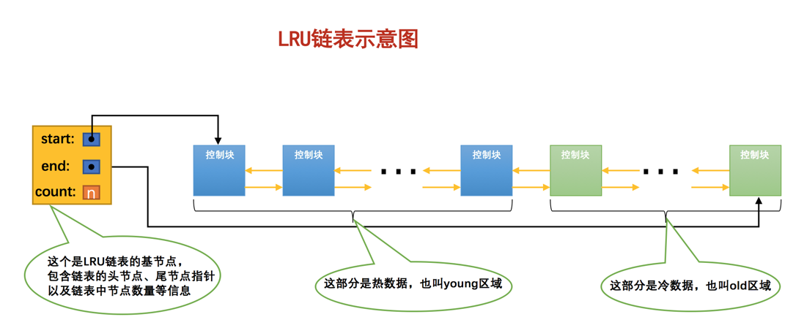

- 针对预读的页面可能不进行后续访情况的优化

  当磁盘上的某个页面在初次加载到Buffer Pool中的某个缓存页时，该缓存页对应的控制块会被放到old区域的头部。这样针对预读到`Buffer Pool`却不进行后续访问的页面就会被逐渐从`old`区域逐出，而不会影响`young`区域中被使用比较频繁的缓存页。

- 针对全表扫描时，短时间内访问大量使用频率非常低的页面情况的优化

  在进行全表扫描时，虽然首次被加载到`Buffer Pool`的页被放到了`old`区域的头部，但是后续会被马上访问到，还是会放到`young`区域的头部去，所以在对某个处在`old`区域的缓存页进行第一次访问时就在它对应的控制块中记录下来这个访问时间，如果后续的访问时间与第一次访问的时间在某个时间间隔内，那么该页面就不会被从old区域移动到young区域的头部，否则将它移动到young区域的头部。

  ```mysql
  mysql> SHOW VARIABLES LIKE 'innodb_old_blocks_time';
  +------------------------+-------+
  | Variable_name          | Value |
  +------------------------+-------+
  | innodb_old_blocks_time | 1000  |
  +------------------------+-------+
  1 row in set (0.01 sec)
  #默认是1000ms 也就是说在1000ms之内间隔的访问不会移动到young区域，在1000ms之外再访问那就要移动到young区域了
  ```

**更进一步优化LRU链表**

每次访问一个缓存页就要把它移动到`LRU链表`的头部，这样开销太大，毕竟在`young`区域的缓存页都是热点数据，也就是可能被经常访问的，这样频繁的对`LRU链表`进行节点移动操作不太好，为了解决这个问题其实我们还可以提出一些优化策略，比如只有被访问的缓存页位于`young`区域的`1/4`的后边，才会被移动到`LRU链表`头部，这样就可以降低调整`LRU链表`的频率，从而提升性能（也就是说如果某个缓存页对应的节点在`young`区域的`1/4`中，再次访问该缓存页时也不会将其移动到`LRU`链表头部）。


#### 刷新脏页到磁盘

- 异步：

  后台有专门的线程每隔一段时间负责把脏页刷新到磁盘，这样可以不影响用户线程处理正常的请求。主要有两种刷新路径：

  - 从`LRU链表`的冷数据中刷新一部分页面到磁盘。

      后台线程会定时从`LRU链表`尾部开始扫描一些页面，扫描的页面数量可以通过系统变量`innodb_lru_scan_depth`来指定，如果从里边儿发现脏页，会把它们刷新到磁盘。这种刷新页面的方式被称之为`BUF_FLUSH_LRU`。

  - 从`flush链表`中刷新一部分页面到磁盘。

      后台线程也会定时从`flush链表`中刷新一部分页面到磁盘，刷新的速率取决于当时系统是不是很繁忙。这种刷新页面的方式被称之为`BUF_FLUSH_LIST`。

- 同步：

  有时候后台线程刷新脏页的进度比较慢，导致用户线程在准备加载一个磁盘页到`Buffer Pool`时没有可用的缓存页，这时就会尝试看看`LRU链表`尾部有没有可以直接释放掉的未修改页面，如果没有的话会不得不将`LRU链表`尾部的一个脏页同步刷新到磁盘（和磁盘交互是很慢的，这会降低处理用户请求的速度）。这种刷新单个页面到磁盘中的刷新方式被称之为`BUF_FLUSH_SINGLE_PAGE`。

#### 多个Buffer Pool实例

`Buffer Pool`本质是`InnoDB`向操作系统申请的一块连续的内存空间，在多线程环境下，访问`Buffer Pool`中的各种链表都需要加锁处理什么的，在`Buffer Pool`特别大而且多线程并发访问特别高的情况下，单一的`Buffer Pool`可能会影响请求的处理速度。多个`Buffer Pool`多线程并发访问时并不会相互影响，提高并发处理能力。

通过设置`innodb_buffer_pool_instances`的值来修改`Buffer Pool`实例的个数

```mysql
[server]
innodb_buffer_pool_instances = 2
# 每个Buffer Pool实例实际占多少内存空间 = innodb_buffer_pool_size/innodb_buffer_pool_instances
#当innodb_buffer_pool_size的值小于1G的时候设置多个实例是无效的，InnoDB会默认把innodb_buffer_pool_instances 的值修改为1
```


#### innodb_buffer_pool_chunk_size

`MySQL`在`5.7.5`以及之后的版本中支持了在服务器运行过程中调整`Buffer Pool`大小的功能，但是有一个问题，就是每次当我们要重新调整`Buffer Pool`大小时，都需要重新向操作系统申请一块连续的内存空间，然后将旧的`Buffer Pool`中的内容复制到这一块新空间，这是极其耗时的。

所以`MySQL`决定不再一次性为某个`Buffer Pool`实例向操作系统申请一大片连续的内存空间，而是以一个所谓的`chunk`为单位向操作系统申请空间。也就是说一个`Buffer Pool`实例其实是由若干个`chunk`组成的，一个`chunk`就代表一片连续的内存空间，里边儿包含了若干缓存页与其对应的控制块

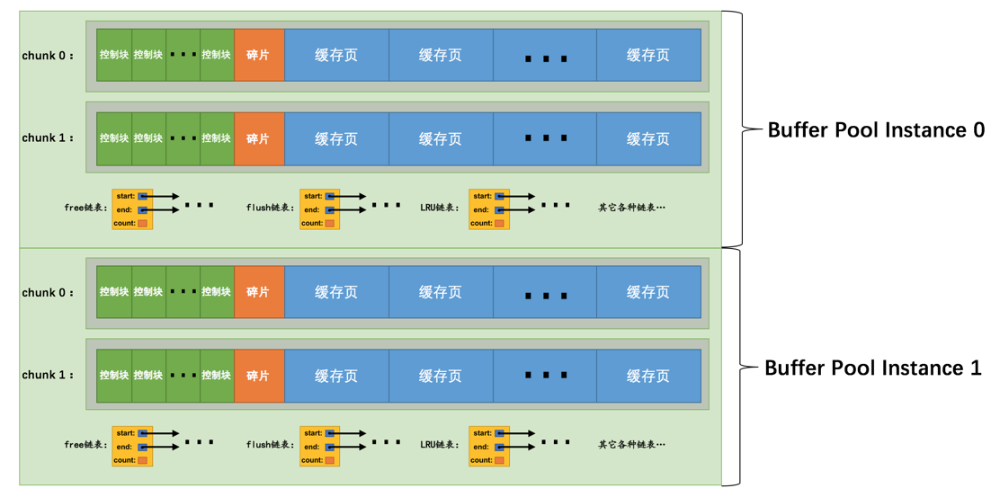

通过`innodb_buffer_pool_chunk_size`启动参数设置chunk的大小，它的默认值是`134217728`，也就是`128M`

#### 查看Buffer Pool的状态信息

```mysql
mysql> SHOW ENGINE INNODB STATUS\G

(...省略前面的许多状态)
----------------------
BUFFER POOL AND MEMORY
----------------------
Total memory allocated 13218349056;
Dictionary memory allocated 4014231
Buffer pool size   786432
Free buffers       8174
Database pages     710576
Old database pages 262143
Modified db pages  124941
Pending reads 0
Pending writes: LRU 0, flush list 0, single page 0
Pages made young 6195930012, not young 78247510485
108.18 youngs/s, 226.15 non-youngs/s
Pages read 2748866728, created 29217873, written 4845680877
160.77 reads/s, 3.80 creates/s, 190.16 writes/s
Buffer pool hit rate 956 / 1000, young-making rate 30 / 1000 not 605 / 1000
Pages read ahead 0.00/s, evicted without access 0.00/s, Random read ahead 0.00/s
LRU len: 710576, unzip_LRU len: 118
I/O sum[134264]:cur[144], unzip sum[16]:cur[0]
--------------
(...省略后边的许多状态)

mysql>

```

- `Total memory allocated`：代表`Buffer Pool`向操作系统申请的连续内存空间大小，包括全部控制块、缓存页、以及碎片的大小。

- `Dictionary memory allocated`：为数据字典信息分配的内存空间大小，注意这个内存空间和`Buffer Pool`没什么关系，不包括在`Total memory allocated`中。

- `Buffer pool size`：代表该`Buffer Pool`可以容纳多少缓存`页`，注意，单位是`页`！

- `Free buffers`：代表当前`Buffer Pool`还有多少空闲缓存页，也就是`free链表`中还有多少个节点。

- `Database pages`：代表`LRU`链表中的页的数量，包含`young`和`old`两个区域的节点数量。

- `Old database pages`：代表`LRU`链表`old`区域的节点数量。

- `Modified db pages`：代表脏页数量，也就是`flush链表`中节点的数量。

- `Pending reads`：正在等待从磁盘上加载到`Buffer Pool`中的页面数量。

    当准备从磁盘中加载某个页面时，会先为这个页面在`Buffer Pool`中分配一个缓存页以及它对应的控制块，然后把这个控制块添加到`LRU`的`old`区域的头部，但是这个时候真正的磁盘页并没有被加载进来，`Pending reads`的值会跟着加1。

- `Pending writes LRU`：即将从`LRU`链表中刷新到磁盘中的页面数量。

- `Pending writes flush list`：即将从`flush`链表中刷新到磁盘中的页面数量。

- `Pending writes single page`：即将以单个页面的形式刷新到磁盘中的页面数量。

- `Pages made young`：代表`LRU`链表中曾经从`old`区域移动到`young`区域头部的节点数量。

- `Page made not young`：在将`innodb_old_blocks_time`设置的值大于0时，首次访问或者后续访问某个处在`old`区域的节点时由于不符合时间间隔的限制而不能将其移动到`young`区域头部时，`Page made not young`的值会加1。

- `youngs/s`：代表每秒从`old`区域被移动到`young`区域头部的节点数量。

- `non-youngs/s`：代表每秒由于不满足时间限制而不能从`old`区域移动到`young`区域头部的节点数量。

- `Pages read`、`created`、`written`：代表读取，创建，写入了多少页。后边跟着读取、创建、写入的速率。

- `Buffer pool hit rate`：表示在过去某段时间，平均访问1000次页面，有多少次该页面已经被缓存到`Buffer Pool`了。

- `young-making rate`：表示在过去某段时间，平均访问1000次页面，有多少次访问使页面移动到`young`区域的头部了。

- `not (young-making rate)`：表示在过去某段时间，平均访问1000次页面，有多少次访问没有使页面移动到`young`区域的头部。

- `LRU len`：代表`LRU链表`中节点的数量。

- `unzip_LRU`：代表`unzip_LRU链表`中节点的数量（由于我们没有具体介绍过这个链表，现在可以忽略它的值）。

- `I/O sum`：最近50s读取磁盘页的总数。

- `I/O cur`：现在正在读取的磁盘页数量。

- `I/O unzip sum`：最近50s解压的页面数量。

- `I/O unzip cur`：正在解压的页面数量。


## 事务和锁


### 事务

需要保证`原子性`、`隔离性`、`一致性`和`持久性`的一个或多个数据库操作称之为一个`事务`（英文名是：`transaction`）。


#### 原子性

 现实世界中转账操作是一个不可分割的操作，也就是说要么压根儿就没转，要么转账成功，不能存在中间的状态，也就是转了一半的这种情况。设计数据库的大佬们把这种要么全做，要么全不做的规则称之为`原子性`。

现实世界中的一个不可分割的操作却可能对应着数据库世界若干条不同的操作，数据库中的一条操作也可能被分解成若干个步骤，为了保证在数据库世界中某些操作的原子性，数据库需要来保证如果在执行操作的过程中发生了错误，把已经做了的操作恢复成没执行之前的样子


#### 隔离性

现实世界中的两次状态转换应该是互不影响的，不论T1先执行还是T2先执行都对最后的结果没有影响


但是真实的数据库中`T1`和`T2`的操作可能交替执行，比如这样：


所以对于现实世界中状态转换对应的某些数据库操作来说，不仅要保证这些操作以`原子性`的方式执行完成，而且要保证其它的状态转换不会影响到本次状态转换，这个规则被称之为`隔离性`。

这时数据库就需要采取一些措施来让访问相同数据（上例中的A账户和B账户）的不同状态转换（上例中的`T1`和`T2`）对应的数据库操作的执行顺序有一定规律。


#### 一致性

原子性、隔离性和持久性都是为了确保一致性，一致性是指数据在状态变换的前后都是符合现实世界的逻辑正确。


#### 持久性

当现实世界的一个状态转换完成后，这个转换的结果将永久的保留，这个规则称为`持久性`。

当把现实世界的状态转换映射到数据库世界时，`持久性`意味着该转换对应的数据库操作所修改的数据都应该在磁盘上保留下来，不论之后发生了什么事故，本次转换造成的影响都不应该被丢失掉。


#### 事务状态

- 活动的（active）

    事务对应的数据库操作正在执行过程中时，我们就说该事务处在`活动的`状态。

- 部分提交的（partially committed）

    当事务中的最后一个操作执行完成，但由于操作都在内存中执行，所造成的影响并没有刷新到磁盘时，我们就说该事务处在`部分提交的`状态。

- 失败的（failed）

    当事务处在`活动的`或者`部分提交的`状态时，可能遇到了某些错误（数据库自身的错误、操作系统错误或者直接断电等）而无法继续执行，或者人为的停止当前事务的执行，我们就说该事务处在`失败的`状态。

- 中止的（aborted）

    如果事务执行了半截而变为`失败的`状态，比如我们前面介绍的狗哥向猫爷转账的事务，当狗哥账户的钱被扣除，但是猫爷账户的钱没有增加时遇到了错误，从而当前事务处在了`失败的`状态，那么就需要把已经修改的狗哥账户余额调整为未转账之前的金额，换句话说，就是要撤销失败事务对当前数据库造成的影响。书面一点的话，我们把这个撤销的过程称之为`回滚`。当`回滚`操作执行完毕时，也就是数据库恢复到了执行事务之前的状态，我们就说该事务处在了`中止的`状态。

- 提交的（committed）

    当一个处在`部分提交的`状态的事务将修改过的数据都同步到磁盘上之后，我们就可以说该事务处在了`提交的`状态。


#### MySQL中的事务语法

##### 开启事务

- BEGIN [WORK];

  ```mysql
  mysql> BEGIN;
  Query OK, 0 rows affected (0.00 sec)
  
  mysql> 加入事务的语句...
  ```

- START TRANSACTION;

  ```mysql
  mysql> START TRANSACTION;
  Query OK, 0 rows affected (0.00 sec)
  
  mysql> 加入事务的语句...
  ```

  后面可以跟多个修饰符：

  ```MYSQL
  START TRANSACTION READ WRITE, WITH CONSISTENT SNAPSHOT;
  ```

  - `READ ONLY`：标识当前事务是一个只读事务，也就是属于该事务的数据库操作只能读取数据，而不能修改数据。
  - `READ WRITE`：标识当前事务是一个读写事务，也就是属于该事务的数据库操作既可以读取数据，也可以修改数据。
  - `WITH CONSISTENT SNAPSHOT`：启动一致性读。

##### 提交事务

```mysql
COMMIT [WORK]
```


##### 手动中止事务

```mysql
ROLLBACK [WORK]
```

##### 支持事务的存储引擎

目前只有`InnoDB`和`NDB`存储引擎支持，对该使用不支持事务的存储引擎的表所做的修改将无法进行回滚

##### 自动提交

`MySQL`中有一个系统变量`autocommit`，默认情况下，如果我们不显式的使用`START TRANSACTION`或者`BEGIN`语句开启一个事务，那么每一条语句都算是一个独立的事务，这种特性称之为事务的`自动提交`。

```mysql
mysql> SHOW VARIABLES LIKE 'autocommit';
+---------------+-------+
| Variable_name | Value |
+---------------+-------+
| autocommit    | ON    |
+---------------+-------+
1 row in set (0.01 sec)
```

关闭自动提交

- 显式的的使用`START TRANSACTION`或者`BEGIN`语句开启一个事务。

    这样在本次事务提交或者回滚前会暂时关闭掉自动提交的功能。

- 把系统变量`autocommit`的值设置为`OFF`，就像这样：

  ```mysql
  SET autocommit = OFF;
  ```


##### 隐式提交

因为某些特殊的语句而导致事务提交的情况称为`隐式提交`，这些会导致事务隐式提交的语句包括：

- 定义或修改数据库对象的数据定义语言（Data definition language，缩写为：`DDL`）。

   所谓的数据库对象，指的就是`数据库`、`表`、`视图`、`存储过程`等等这些东西。当我们使用`CREATE`、`ALTER`、`DROP`等语句去修改这些所谓的数据库对象时，就会隐式的提交前面语句所属于的事务

  ```mysql
  BEGIN;
  
  SELECT ... # 事务中的一条语句
  UPDATE ... # 事务中的一条语句
  ... # 事务中的其它语句
  
  CREATE TABLE ... # 此语句会隐式的提交前面语句所属于的事务
  ```

- 隐式使用或修改`mysql`数据库中的表

  当我们使用`ALTER USER`、`CREATE USER`、`DROP USER`、`GRANT`、`RENAME USER`、`REVOKE`、`SET PASSWORD`等语句时也会隐式的提交前面语句所属于的事务。

- 事务控制或关于锁定的语句

  当我们在一个事务还没提交或者回滚时就又使用`START TRANSACTION`或者`BEGIN`语句开启了另一个事务时，会隐式的提交上一个事务

  ```mysql
  BEGIN;
  
  SELECT ... # 事务中的一条语句
  UPDATE ... # 事务中的一条语句
  ... # 事务中的其它语句
  
  BEGIN; # 此语句会隐式的提交前面语句所属于的事务
  ```

  或者当前的`autocommit`系统变量的值为`OFF`，我们手动把它调为`ON`时，也会隐式的提交前面语句所属的事务。

  或者使用`LOCK TABLES`、`UNLOCK TABLES`等关于锁定的语句也会隐式的提交前面语句所属的事务。

- 加载数据的语句

  使用`LOAD DATA`语句来批量往数据库中导入数据时，也会隐式的提交前面语句所属的事务。

- 关于`MySQL`复制的一些语句

  使用`START SLAVE`、`STOP SLAVE`、`RESET SLAVE`、`CHANGE MASTER TO`等语句时也会隐式的提交前面语句所属的事务。

- 其它的一些语句

  使用`ANALYZE TABLE`、`CACHE INDEX`、`CHECK TABLE`、`FLUSH`、 `LOAD INDEX INTO CACHE`、`OPTIMIZE TABLE`、`REPAIR TABLE`、`RESET`等语句也会隐式的提交前面语句所属的事务。

##### 保存点

`保存点`（英文：`savepoint`）的概念，就是在事务对应的数据库语句中打几个点，我们在调用`ROLLBACK`语句时可以指定会滚到哪个点，而不是回到最初的原点。

```mysql
SAVEPOINT 保存点名称;

#回滚到指定的保存点
ROLLBACK [WORK] TO [SAVEPOINT] 保存点名称;
#删除保存点
RELEASE SAVEPOINT 保存点名称;
```

### redo日志

redo日志为了保证数据库的持久性，对于一个已经提交的事务，在事务提交后即使系统发生了崩溃，这个事务对数据库中所做的更改也不能丢失。

为了保证持久性，我们需要在事务提交完成之前把该事务所修改的所有页面都刷新到磁盘，但是这样会带来两个问题：

- 刷新一个完整的数据页太浪费了

  如果仅仅只对数据页中的几个字节进行修改，刷新整个数据页到磁盘中太浪费了

- 随机IO刷起来比较慢

  修改的页面并不连续，需要随机IO刷新到磁盘中，对于机械硬盘更加明显

实际上没必要把全部修改的数据页刷新到磁盘，只需要将修改的内容记录下来，在系统崩溃后根据修改内容恢复数据即可，这个记录叫做`redo`日志。

- `redo`日志占用的空间非常小

    存储表空间ID、页号、偏移量以及需要更新的值所需的存储空间是很小的

- `redo`日志是顺序写入磁盘的

    在执行事务的过程中，每执行一条语句，就可能产生若干条`redo`日志，这些日志是按照产生的顺序写入磁盘的，也就是使用顺序IO。

#### redo日志格式

`redo`日志的通用结构

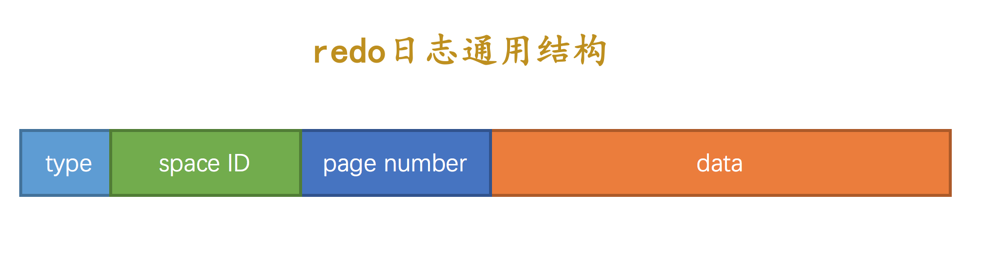

- `type`：该条`redo`日志的类型。

    在`MySQL 5.7.21`版本中，`redo`日志有53种不同的类型

- `space ID`：表空间ID。

- `page number`：页号。

- `data`：该条`redo`日志的具体内容。

##### 简单的redo日志

`redo`日志中只需要记录一下在某个页面的某个偏移量处修改了几个字节的值，具体被修改的内容是什么，这种极其简单的`redo`日志称之为`物理日志`

- `MLOG_1BYTE`（`type`字段对应的十进制数字为`1`）：表示在页面的某个偏移量处写入1个字节的`redo`日志类型。
- `MLOG_2BYTE`（`type`字段对应的十进制数字为`2`）：表示在页面的某个偏移量处写入2个字节的`redo`日志类型。
- `MLOG_4BYTE`（`type`字段对应的十进制数字为`4`）：表示在页面的某个偏移量处写入4个字节的`redo`日志类型。
- `MLOG_8BYTE`（`type`字段对应的十进制数字为`8`）：表示在页面的某个偏移量处写入8个字节的`redo`日志类型。
- `MLOG_WRITE_STRING`（`type`字段对应的十进制数字为`30`）：表示在页面的某个偏移量处写入一串数据。

在进行插入数据时，如果需要`row_id`的隐藏列，就需要从`Max Row ID`中获取当前自增量，在`Max Row ID`每自增256的倍数时，才会被写回到系统表空间的第7页号的`Max Row ID`中，产生的修改`Max Row ID`的`redo`记录就是`MLOG_8BYTE`类型

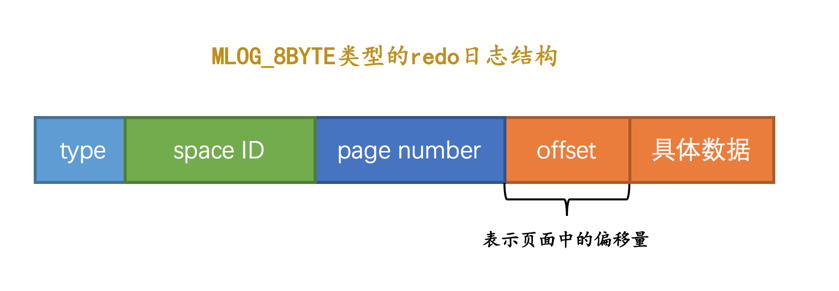

`MLOG_WRITE_STRING`类型


##### 复杂的redo日志

执行一条sql语句会修改系统数据页面和用户数据页面

插入一条数据时，对用户B+树的常见更新：

- 表中包含多少个索引，一条`INSERT`语句就可能更新多少棵`B+`树。
- 针对某一棵`B+`树来说，既可能更新叶子节点页面，也可能更新内节点页面，也可能创建新的页面（在该记录插入的叶子节点的剩余空间比较少，不足以存放该记录时，会进行页面的分裂，在内节点页面中添加`目录项记录`）。
- 可能更新`Page Directory`中的槽信息。
- `Page Header`中的各种页面统计信息，比如`PAGE_N_DIR_SLOTS`表示的槽数量可能会更改，`PAGE_HEAP_TOP`代表的还未使用的空间最小地址可能会更改，`PAGE_N_HEAP`代表的本页面中的记录数量可能会更改，等等，各种信息都可能会被修改。
- 数据页里的记录是按照索引列从小到大的顺序组成一个单向链表的，每插入一条记录，还需要更新上一条记录的记录头信息中的`next_record`属性来维护这个单向链表。


复杂的日志类型：

复杂日志类型仅靠存储的物理数据无法进行恢复，还需要依靠逻辑上的固定函数来恢复数据

> Redundant是一种比较原始的行格式，它就是非紧凑的。而Compact、Dynamic以及Compressed行格式是较新的行格式，它们是紧凑的（占用更小的存储空间）。

- `MLOG_REC_INSERT`（对应的十进制数字为`9`）：表示插入一条使用非紧凑行格式的记录时的`redo`日志类型。
- `MLOG_COMP_REC_INSERT`（对应的十进制数字为`38`）：表示插入一条使用紧凑行格式的记录时的`redo`日志类型。
- `MLOG_COMP_PAGE_CREATE`（`type`字段对应的十进制数字为`58`）：表示创建一个存储紧凑行格式记录的页面的`redo`日志类型。
- `MLOG_COMP_REC_DELETE`（`type`字段对应的十进制数字为`42`）：表示删除一条使用紧凑行格式记录的`redo`日志类型。
- `MLOG_COMP_LIST_START_DELETE`（`type`字段对应的十进制数字为`44`）：表示从某条给定记录开始删除页面中的一系列使用紧凑行格式记录的`redo`日志类型。
- `MLOG_COMP_LIST_END_DELETE`（`type`字段对应的十进制数字为`43`）：与`MLOG_COMP_LIST_START_DELETE`类型的`redo`日志呼应，表示删除一系列记录直到`MLOG_COMP_LIST_END_DELETE`类型的`redo`日志对应的记录为止。`MLOG_ZIP_PAGE_COMPRESS`（`type`字段对应的十进制数字为`51`）：表示压缩一个数据页的`redo`日志类型。

以`MLOG_COMP_REC_INSERT`类型为例子，插入一条紧凑行格式记录时


该`redo`记录没有记录完全对系统表空间数据、用户数据页中的`PAGE_N_DIR_SLOTS、PAGE_HEAP_TOP、PAGE_N_HEAP`等数据，当进行数据恢复时会调用某个插入函数，以`redo`记录作为参数来更新恢复数据。


#### Mini-Transaction

针对某些操作，必须是不可分割的原子操作，即多条redo记录以组的形式必须全部都执行或者都不执行。对底层页面中的一次原子访问的过程称之为一个`Mini-Transaction`，简称`mtr`。

- 有的需要保证原子性的操作会生成多条`redo`日志，比如向某个索引对应的`B+`树中进行一次悲观插入就需要生成许多条`redo`日志。

  在该组中的最后一条`redo`日志后边加上一条特殊类型的`redo`日志，该类型名称为`MLOG_MULTI_REC_END`

  

- 有的需要保证原子性的操作只生成一条`redo`日志，比如更新`Max Row ID`属性的操作就只会生成一条`redo`日志。

  使用`redo`日志中的`type`类型字段的第一个bit位，如果`type`字段的第一个比特位为`1`，代表该需要保证原子性的操作只产生了单一的一条`redo`日志，否则表示该需要保证原子性的操作产生了一系列的`redo`日志。

  


一个事务可以包含若干条语句，每一条语句其实是由若干个`mtr`组成，每一个`mtr`又可以包含若干条`redo`日志


#### redo日志的写入过程

##### redo log block

`mtr`生成的`redo`日志都放在了大小为`512字节`的`页`中，这个用来存储`redo`日志的页称为`block`。


**log block header和log block trailer**


- `LOG_BLOCK_HDR_NO`：每一个block都有一个大于0的唯一标号，本属性就表示该标号值。
- `LOG_BLOCK_HDR_DATA_LEN`：表示block中已经使用了多少字节，初始值为`12`（因为`log block body`从第12个字节处开始）。随着往block中写入的redo日志越来也多，本属性值也跟着增长。如果`log block body`已经被全部写满，那么本属性的值被设置为`512`。
- `LOG_BLOCK_FIRST_REC_GROUP`：一条`redo`日志也可以称之为一条`redo`日志记录（`redo log record`），一个`mtr`会生产多条`redo`日志记录，这些`redo`日志记录被称之为一个`redo`日志记录组（`redo log record group`）。`LOG_BLOCK_FIRST_REC_GROUP`就代表该block中第一个`mtr`生成的`redo`日志记录组的偏移量（其实也就是这个block里第一个`mtr`生成的第一条`redo`日志的偏移量）。
- `LOG_BLOCK_CHECKPOINT_NO`：表示`checkpoint`的序号。
- `LOG_BLOCK_CHECKSUM`：表示block的校验值，用于正确性校验


##### redo日志缓冲区

类似`Buffer Pool`，为了解决`redo`日志写入磁盘缓慢的问题，服务器启动时申请了称之为`redo log buffer`的连续内存空间，翻译成中文就是`redo日志缓冲区`，也可以简称为`log buffer`。通过启动参数`innodb_log_buffer_size`设置`log buffer`的大小，默认是16MB


##### redo日志写入log buffer

向`log buffer`中写入`redo`日志的过程是顺序的，也就是先往前面的block中写，当该block的空闲空间用完之后再往下一个block中写。MySQL中提供了`buf_free`的全局变量来指明后续的`redo`日志写到`log buffer`中的哪个位置


`redo`日志的写入以`mtr`形式，每个`mtr`运行时产生的`redo`日志先存放在其他地方，当该`mtr`结束时将一组`mtr`写入到`log buffer`中，不同事务之间的`mtr`写入没有规律，可能是交替写入`log buffer`中的


#### redo日志文件


##### redo日志刷盘时机

- `log buffer`空间不足时

    `log buffer`的大小是有限的（通过系统变量`innodb_log_buffer_size`指定），如果当前写入`log buffer`的`redo`日志量已经占满了`log buffer`总容量的大约一半左右，就需要把这些日志刷新到磁盘上。

- 事务提交时

    之所以使用`redo`日志主要是因为它占用的空间少，还是顺序写，在事务提交时可以不把修改过的`Buffer Pool`页面刷新到磁盘，但是为了保证持久性，必须要把修改这些页面对应的`redo`日志刷新到磁盘。

- 后台线程不停的刷刷刷

    后台有一个线程，大约每秒都会刷新一次`log buffer`中的`redo`日志到磁盘。

- 正常关闭服务器时

- 做`checkpoint`时

##### redo日志文件组

`MySQL`的数据目录（使用`SHOW VARIABLES LIKE 'datadir'`查看）下默认有两个名为`ib_logfile0`和`ib_logfile1`的文件，`log buffer`中的日志默认情况下就是刷新到这两个磁盘文件中。

- `innodb_log_group_home_dir`

    该参数指定了`redo`日志文件所在的目录，默认值就是当前的数据目录。

- `innodb_log_file_size`

    该参数指定了每个`redo`日志文件的大小，在`MySQL 5.7.21`这个版本中的默认值为`48MB`，

- `innodb_log_files_in_group`

    该参数指定`redo`日志文件的个数，默认值为2，最大值为100。

磁盘上的`redo`日志文件不只一个，而是以一个`日志文件组`的形式出现的。这些文件以`ib_logfile[数字]`（`数字`可以是`0`、`1`、`2`...）的形式进行命名。在将`redo`日志写入`日志文件组`时，是从`ib_logfile0`开始写，如果`ib_logfile0`写满了，就接着`ib_logfile1`写，依此类推。如果写到最后一个文件就重新转到`ib_logfile0`继续写，所以整个过程如下图所示：


##### redo日志文件格式

将log buffer中的redo日志刷新到磁盘的本质就是把block的镜像写入日志文件中，所以`redo`日志文件其实也是由若干个`512`字节大小的block组成。

`redo`日志文件组中的每个文件大小都一样，格式也一样，都是由两部分组成：

- 前2048个字节，也就是前4个block是用来存储一些管理信息的。
- 从第2048字节往后是用来存储`log buffer`中的block镜像的。


每个`redo`日志文件前2048个字节，也就是前4个特殊block的格式


**log file header**


| 属性名                 | 长度（单位：字节） | 描述                                                         |
| ---------------------- | ------------------ | ------------------------------------------------------------ |
| `LOG_HEADER_FORMAT`    | `4`                | `redo`日志的版本，在`MySQL 5.7.21`中该值永远为1              |
| `LOG_HEADER_PAD1`      | `4`                | 做字节填充用的，没什么实际意义                               |
| `LOG_HEADER_START_LSN` | `8`                | 标记本`redo`日志文件开始的LSN值，也就是文件偏移量为2048字节初对应的LSN值 |
| `LOG_HEADER_CREATOR`   | `32`               | 一个字符串，标记本`redo`日志文件的创建者是谁。正常运行时该值为`MySQL`的版本号，比如：`"MySQL 5.7.21"`，使用`mysqlbackup`命令创建的`redo`日志文件的该值为`"ibbackup"`和创建时间。 |
| `LOG_BLOCK_CHECKSUM`   | `4`                | 本block的校验值，所有block都有                               |


**checkpoint1**


| 属性名                        | 长度（单位：字节） | 描述                                                         |
| ----------------------------- | ------------------ | ------------------------------------------------------------ |
| `LOG_CHECKPOINT_NO`           | `8`                | 服务器做`checkpoint`的编号，每做一次`checkpoint`，该值就加1。 |
| `LOG_CHECKPOINT_LSN`          | `8`                | 服务器做`checkpoint`结束时对应的`LSN`值，系统奔溃恢复时将从该值开始。 |
| `LOG_CHECKPOINT_OFFSET`       | `8`                | 上个属性中的`LSN`值在`redo`日志文件组中的偏移量              |
| `LOG_CHECKPOINT_LOG_BUF_SIZE` | `8`                | 服务器在做`checkpoint`操作时对应的`log buffer`的大小         |
| `LOG_BLOCK_CHECKSUM`          | `4`                | 本block的校验值，所有block都有                               |


#### Log Sequeue Number

自系统开始运行，就不断的在修改页面，也就意味着会不断的生成`redo`日志，为了记录已经写入的`redo`日志量，`MySQL`设计了日志序列号(Log Sequeue Number)，初始值为8704。

- 系统第一次启动后初始化`log buffer`时，`buf_free`（就是标记下一条`redo`日志应该写入到`log buffer`的位置的变量）就会指向第一个`block`的偏移量为12字节（`log block header`的大小）的地方，那么`lsn`值也会跟着增加12：

  

- 如果某个`mtr`产生的一组`redo`日志占用的存储空间比较小，也就是待插入的block剩余空闲空间能容纳这个`mtr`提交的日志时，`lsn`增长的量就是该`mtr`生成的`redo`日志占用的字节数，就像这样：

  

- 如果某个`mtr`产生的一组`redo`日志占用的存储空间比较大，也就是待插入的block剩余空闲空间不足以容纳这个`mtr`提交的日志时，`lsn`增长的量就是该`mtr`生成的`redo`日志占用的字节数加上额外占用的`log block header`和`log block trailer`的字节数，就像这样：

  

每一组由mtr生成的redo日志都有一个唯一的LSN值与其对应，LSN值越小，说明redo日志产生的越早。


##### flushed_to_disk_lsn

`redo`日志是首先写到`log buffer`中，之后才会被刷新到磁盘上的`redo`日志文件。所以MySQL提出了一个称之为`buf_next_to_write`的全局变量，标记当前`log buffer`中已经有哪些日志被刷新到磁盘中了。相应的，设计`InnoDB`的大佬提出了一个表示刷新到磁盘中的`redo`日志量的全局变量，称之为`flushed_to_disk_lsn`。


当有新的`redo`日志写入到`log buffer`时，首先`lsn`的值会增长，但`flushed_to_disk_lsn`不变，随后随着不断有`log buffer`中的日志被刷新到磁盘上，`flushed_to_disk_lsn`的值也跟着增长。如果两者的值相同时，说明log buffer中的所有redo日志都已经刷新到磁盘中了。

##### lsn值和redo日志文件偏移量的对应关系


初始时的`LSN`值是`8704`，对应文件偏移量`2048`，之后每个`mtr`向磁盘中写入多少字节日志，`lsn`的值就增长多少。

##### flush链表中的LSN

一个`mtr`代表一次对底层页面的原子访问，在访问过程中可能会产生一组不可分割的`redo`日志，在`mtr`结束时，会把这一组`redo`日志写入到`log buffer`中。除此之外，在`mtr`结束时还要把在mtr执行过程中可能修改过的页面加入到Buffer Pool的flush链表。


当第一次修改某个缓存在`Buffer Pool`中的页面时，就会把这个页面对应的控制块插入到`flush链表`的头部，之后再修改该页面时由于它已经在`flush`链表中了，就不再次插入了。也就是说flush链表中的脏页是按照页面的第一次修改时间从大到小进行排序的。在这个过程中会在缓存页对应的控制块中记录两个关于页面何时修改的属性：

- `oldest_modification`：如果某个页面被加载到`Buffer Pool`后进行第一次修改，那么就将修改该页面的`mtr`开始时对应的`lsn`值写入这个属性。
- `newest_modification`：每修改一次页面，都会将修改该页面的`mtr`结束时对应的`lsn`值写入这个属性。也就是说该属性表示页面最近一次修改后对应的系统`lsn`值。


flush链表中的脏页按照修改发生的时间顺序进行排序，也就是按照oldest_modification代表的LSN值进行排序，被多次更新的页面不会重复插入到flush链表中，但是会更新newest_modification属性的值。

##### checkpoint

redo日志只是为了系统奔溃后恢复脏页用的，如果对应的脏页已经刷新到了磁盘，也就是说即使现在系统奔溃，那么在重启后也用不着使用redo日志恢复该页面了，所以该redo日志也就没有存在的必要了，那么它占用的磁盘空间就可以被后续的redo日志所重用。也就是说：判断某些redo日志占用的磁盘空间是否可以覆盖的依据就是它对应的脏页是否已经刷新到磁盘


如图，虽然`mtr_1`和`mtr_2`生成的`redo`日志都已经被写到了磁盘上，但是它们修改的脏页仍然留在`Buffer Pool`中，所以它们生成的`redo`日志在磁盘上的空间是不可以被覆盖的。之后随着系统的运行，如果`页a`被刷新到了磁盘，那么它对应的控制块就会从`flush链表`中移除

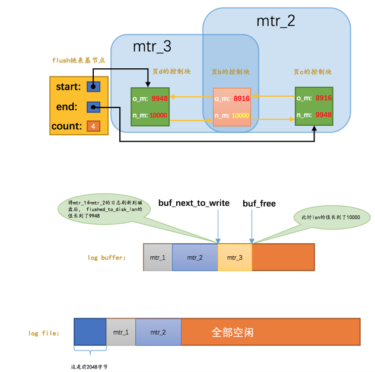

 这样`mtr_1`生成的`redo`日志就没有用了，它们占用的磁盘空间就可以被覆盖掉了。设计`InnoDB`的大佬提出了一个全局变量`checkpoint_lsn`来代表当前系统中可以被覆盖的`redo`日志总量是多少，这个变量初始值也是`8704`。

  比方说现在`页a`被刷新到了磁盘，`mtr_1`生成的`redo`日志就可以被覆盖了，所以我们可以进行一个增加`checkpoint_lsn`的操作，我们把这个过程称之为做一次`checkpoint`。做一次`checkpoint`其实可以分为两个步骤：

- 计算一下当前系统中可以被覆盖的`redo`日志对应的`lsn`值最大是多少。

  `redo`日志可以被覆盖，意味着它对应的脏页被刷到了磁盘，只要我们计算出当前系统中被最早修改的脏页对应的`oldest_modification`值，那凡是在系统lsn值小于该节点的oldest_modification值时产生的redo日志都是可以被覆盖掉的，我们就把该脏页的`oldest_modification`赋值给`checkpoint_lsn`。

- 将`checkpoint_lsn`和对应的`redo`日志文件组偏移量以及此次`checkpint`的编号写到日志文件的管理信息（就是`checkpoint1`或者`checkpoint2`）中。

  关于checkpoint的信息只会被写到日志文件组的第一个日志文件的管理信息中。

一般情况下都是后台的线程在对`LRU链表`和`flush链表`进行刷脏操作，这主要因为刷脏操作比较慢。但是如果当前系统修改页面的操作十分频繁，这样就导致写日志操作十分频繁，系统`lsn`值增长过快。如果后台的刷脏操作不能将脏页刷出，那么系统无法及时做`checkpoint`，可能就需要用户线程同步的从`flush链表`中把那些最早修改的脏页（`oldest_modification`最小的脏页）刷新到磁盘，这样这些脏页对应的`redo`日志就没用了，然后就可以去做`checkpoint`了。

##### 查看系统中的各种LSN值

`SHOW ENGINE INNODB STATUS`

```mysql
mysql> SHOW ENGINE INNODB STATUS\G

(...省略前面的许多状态)
LOG
---
Log sequence number 124476971
Log flushed up to   124099769
Pages flushed up to 124052503
Last checkpoint at  124052494
0 pending log flushes, 0 pending chkp writes
24 log i/o's done, 2.00 log i/o's/second
----------------------
(...省略后边的许多状态)
```

- `Log sequence number`：代表系统中的`lsn`值，也就是当前系统已经写入的`redo`日志量，包括写入`log buffer`中的日志。
- `Log flushed up to`：代表`flushed_to_disk_lsn`的值，也就是当前系统已经写入磁盘的`redo`日志量。
- `Pages flushed up to`：代表`flush链表`中被最早修改的那个页面对应的`oldest_modification`属性值。
- `Last checkpoint at`：当前系统的`checkpoint_lsn`值。

##### innodb_flush_log_at_trx_commit的用法

为了保证事务的`持久性`，用户线程在事务提交时需要将该事务执行过程中产生的所有`redo`日志都刷新到磁盘上。会很明显的降低数据库性能。如果对事务的`持久性`要求不是那么强烈的话，可以选择修改一个称为`innodb_flush_log_at_trx_commit`的系统变量的值，该变量有3个可选的值：

- `0`：当该系统变量值为0时，表示在事务提交时不立即向磁盘中同步`redo`日志，这个任务是交给后台线程做的。

    这样很明显会加快请求处理速度，但是如果事务提交后服务器挂了，后台线程没有及时将`redo`日志刷新到磁盘，那么该事务对页面的修改会丢失。

- `1`：当该系统变量值为1时，表示在事务提交时需要将`redo`日志同步到磁盘，可以保证事务的`持久性`。`1`也是`innodb_flush_log_at_trx_commit`的默认值。

- `2`：当该系统变量值为2时，表示在事务提交时需要将`redo`日志写到操作系统的缓冲区中，但并不需要保证将日志真正的刷新到磁盘。

    这种情况下如果数据库挂了，操作系统没挂的话，事务的`持久性`还是可以保证的，但是操作系统也挂了的话，那就不能保证`持久性`了。

#### 崩溃恢复

在服务器不挂的情况下，`redo`日志是性能的拖累，但是数据库崩溃时，MySQL就可以在重启时根据`redo`日志中的记录就可以将页面恢复到系统奔溃前的状态。

##### 确定恢复的起点

`checkpoint_lsn`之前的`redo`日志都可以被覆盖，也就是说这些`redo`日志对应的脏页都已经被刷新到磁盘中了，既然它们已经被刷盘，我们就没必要恢复它们了。对于`checkpoint_lsn`之后的`redo`日志，它们对应的脏页可能没被刷盘，也可能被刷盘了，我们不能确定，所以需要从`checkpoint_lsn`开始读取`redo`日志来恢复页面。

  当然，`redo`日志文件组的第一个文件的管理信息中有两个block都存储了`checkpoint_lsn`的信息，我们当然是要选取最近发生的那次checkpoint的信息。衡量`checkpoint`发生时间早晚的信息就是所谓的`checkpoint_no`，我们只要把`checkpoint1`和`checkpoint2`这两个block中的`checkpoint_no`值读出来比一下大小，哪个的`checkpoint_no`值更大，说明哪个block存储的就是最近的一次`checkpoint`信息。这样我们就能拿到最近发生的`checkpoint`对应的`checkpoint_lsn`值以及它在`redo`日志文件组中的偏移量`checkpoint_offset`。

##### 确定恢复的终点

普通block的`log block header`部分有一个称之为`LOG_BLOCK_HDR_DATA_LEN`的属性，该属性值记录了当前block里使用了多少字节的空间。对于被填满的block来说，该值永远为`512`。如果该属性的值不为`512`，它就是此次奔溃恢复中需要扫描的最后一个block。


##### 怎么恢复

- 使用哈希表

  根据`redo`日志的`space ID`和`page number`属性计算出散列值，把`space ID`和`page number`相同的`redo`日志放到哈希表的同一个槽里，如果有多个`space ID`和`page number`都相同的`redo`日志，那么它们之间使用链表连接起来，按照生成的先后顺序链接起来的，之后就可以遍历哈希表，因为对同一个页面进行修改的`redo`日志都放在了一个槽里，所以可以一次性将一个页面修复好（避免了很多读取页面的随机IO），这样可以加快恢复速度。

  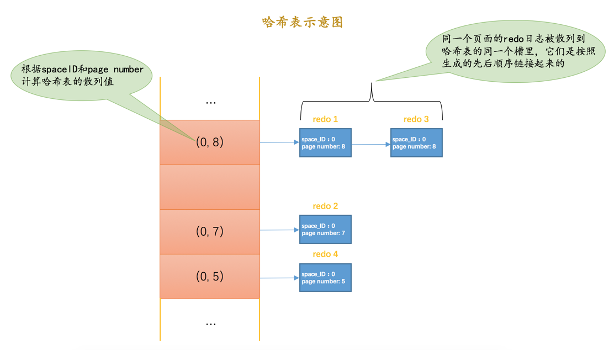

- 跳过已经刷新到磁盘的页面

  `checkpoint_lsn`之前的`redo`日志对应的脏页确定都已经刷到磁盘了，但是`checkpoint_lsn`之后的`redo`日志我们不能确定是否已经刷到磁盘，主要是因为在最近做的一次`checkpoint`后，可能后台线程又不断的从`LRU链表`和`flush链表`中将一些脏页刷出`Buffer Pool`。

  每个页面都有一个称之为`File Header`的部分，在`File Header`里有一个称之为`FIL_PAGE_LSN`的属性，该属性记载了最近一次修改页面时对应的`lsn`值（其实就是页面控制块中的`newest_modification`值）。如果在做了某次`checkpoint`之后有脏页被刷新到磁盘中，那么该页对应的`FIL_PAGE_LSN`代表的`lsn`值肯定大于`checkpoint_lsn`的值，凡是符合这种情况的页面就不需要重复执行lsn值小于`FIL_PAGE_LSN`的redo日志了，所以更进一步提升了奔溃恢复的速度。


### undo日志

#### 事务id

- 我们可以通过`START TRANSACTION READ ONLY`语句开启一个只读事务。
  - 在只读事务中不可以对普通的表（其他事务也能访问到的表）进行增、删、改操作，但可以对临时表做增、删、改操作。
  - 对于只读事务来说，只有在它第一次对某个用户创建的临时表执行增、删、改操作时才会为这个事务分配一个`事务id`，否则的话是不分配`事务id`的。
- 我们可以通过`START TRANSACTION READ WRITE`语句开启一个读写事务，或者使用`BEGIN`、`START TRANSACTION`语句开启的事务默认也算是读写事务。
  - 在读写事务中可以对表执行增删改查操作。
  - 对于读写事务来说，只有在它第一次对某个表（包括用户创建的临时表）执行增、删、改操作时才会为这个事务分配一个`事务id`，否则的话也是不分配`事务id`的。
  - 有的时候虽然我们开启了一个读写事务，但是在这个事务中全是查询语句，并没有执行增、删、改的语句，那也就意味着这个事务并不会被分配一个`事务id`。

##### 事务id的生成

这个`事务id`本质上就是一个数字，它的分配策略和我们前面提到的对隐藏列`row_id`（当用户没有为表创建主键和`UNIQUE`键时`InnoDB`自动创建的列）的分配策略大抵相同，具体策略如下：

- 服务器会在内存中维护一个全局变量，每当需要为某个事务分配一个`事务id`时，就会把该变量的值当作`事务id`分配给该事务，并且把该变量自增1。
- 每当这个变量的值为`256`的倍数时，就会将该变量的值刷新到系统表空间的页号为`5`的页面中一个称之为`Max Trx ID`的属性处，这个属性占用`8`个字节的存储空间。
- 当系统下一次重新启动时，会将上面提到的`Max Trx ID`属性加载到内存中，将该值加上256之后赋值给我们前面提到的全局变量（因为在上次关机时该全局变量的值可能大于`Max Trx ID`属性值）。

  这样就可以保证整个系统中分配的`事务id`值是一个递增的数字。先被分配`id`的事务得到的是较小的`事务id`，后被分配`id`的事务得到的是较大的`事务id`。

##### trx_id隐藏列

聚簇索引的记录除了会保存完整的用户数据以外，而且还会自动添加名为trx_id、roll_pointer的隐藏列，如果用户没有在表中定义主键以及UNIQUE键，还会自动添加一个名为row_id的隐藏列。


其中的`trx_id`列就是某个对这个聚簇索引记录做改动的语句所在的事务对应的`事务id`


#### undo日志的格式

为了实现事务的`原子性`，`InnoDB`存储引擎在实际进行增、删、改一条记录时，都需要先把对应的`undo日志`记下来。这些`undo日志`会被从`0`开始编号，这个编号也被称之为`undo no`。

这些`undo日志`是被记录到类型为`FIL_PAGE_UNDO_LOG`（对应的十六进制是`0x0002`）的页面中。这些页面可以从系统表空间中分配，也可以从一种专门存放`undo日志`的表空间，也就是所谓的`undo tablespace`中分配。


##### INSERT操作对应的undo日志

类型为`TRX_UNDO_INSERT_REC`的`undo日志`，用于在插入数据后的回滚。将该条数据删除掉。


- `undo no`在一个事务中是从`0`开始递增的，也就是说只要事务没提交，每生成一条`undo日志`，那么该条日志的`undo no`就增1。
- 如果记录中的主键只包含一个列，那么在类型为`TRX_UNDO_INSERT_REC`的`undo日志`中只需要把该列占用的存储空间大小和真实值记录下来，如果记录中的主键包含多个列，那么每个列占用的存储空间大小和对应的真实值都需要记录下来（图中的`len`就代表列占用的存储空间大小，`value`就代表列的真实值）。

```mysql
BEGIN;  # 显式开启一个事务，假设该事务的id为100

# 插入两条记录
INSERT INTO undo_demo(id, key1, col) 
    VALUES (1, 'AWM', '狙击枪'), (2, 'M416', '步枪');
```

第一条`undo日志`的`undo no`为`0`，记录主键占用的存储空间长度为`4`，真实值为`1`。


##### DELETE操作对应的undo日志

我们知道插入到页面中的记录会根据记录头信息中的`next_record`属性组成一个单向链表，我们把这个链表称之为`正常记录链表`；被删除的记录其实也会根据记录头信息中的`next_record`属性组成一个链表，这个链表中的记录占用的存储空间可以被重新利用，所以也称这个链表为`垃圾链表`。`Page Header`部分有一个称之为`PAGE_FREE`的属性，它指向由被删除记录组成的垃圾链表中的头节点。


假设现在我们准备使用`DELETE`语句把`正常记录链表`中的最后一条记录给删除掉，其实这个删除的过程需要经历两个阶段：

- 阶段一：仅仅将记录的`delete_mask`标识位设置为`1`，其他的不做修改（其实会修改记录的`trx_id`、`roll_pointer`这些隐藏列的值）。设计`InnoDB`的大佬把这个阶段称之为`delete mark`。

  `正常记录链表`中的最后一条记录的`delete_mask`值被设置为`1`，但是并没有被加入到`垃圾链表`。也就是此时记录处于一个`中间状态`，在删除语句所在的事务提交之前，被删除的记录一直都处于这种所谓的`中间状态`。（为了MVCC）


- 阶段二：当该删除语句所在的事务提交之后，会有专门的线程（purge）后来真正的把记录删除掉。所谓真正的删除就是把该记录从`正常记录链表`中移除，并且加入到`垃圾链表`中，然后还要调整一些页面的其他信息，比如页面中的用户记录数量`PAGE_N_RECS`、上次插入记录的位置`PAGE_LAST_INSERT`、垃圾链表头节点的指针`PAGE_FREE`、页面中可重用的字节数量`PAGE_GARBAGE`、还有页目录的一些信息等等。设计`InnoDB`的大佬把这个阶段称之为`purge`。

  把`阶段二`执行完了，这条记录就算是真正的被删除掉了。这条已删除记录占用的存储空间也可以被重新利用了。


> 小贴士：页面的Page Header部分有一个PAGE_GARBAGE属性，该属性记录着当前页面中可重用存储空间占用的总字节数。每当有已删除记录被加入到垃圾链表后，都会把这个PAGE_GARBAGE属性的值加上该已删除记录占用的存储空间大小。PAGE_FREE指向垃圾链表的头节点，之后每当新插入记录时，首先判断PAGE_FREE指向的头节点代表的已删除记录占用的存储空间是否足够容纳这条新插入的记录，如果不可以容纳，就直接向页面中申请新的空间来存储这条记录（是的，你没看错，并不会尝试遍历整个垃圾链表，找到一个可以容纳新记录的节点）。如果可以容纳，那么直接重用这条已删除记录的存储空间，并且把PAGE_FREE指向垃圾链表中的下一条已删除记录。但是这里有一个问题，如果新插入的那条记录占用的存储空间大小小于垃圾链表的头节点占用的存储空间大小，那就意味头节点对应的记录占用的存储空间里有一部分空间用不到，这部分空间就被称之为碎片空间。那这些碎片空间岂不是永远都用不到了么？其实也不是，这些碎片空间占用的存储空间大小会被统计到PAGE_GARBAGE属性中，这些碎片空间在整个页面快使用完前并不会被重新利用，不过当页面快满时，如果再插入一条记录，此时页面中并不能分配一条完整记录的空间，这时候会首先看一看PAGE_GARBAGE的空间和剩余可利用的空间加起来是不是可以容纳下这条记录，如果可以的话，InnoDB会尝试重新组织页内的记录，重新组织的过程就是先开辟一个临时页面，把页面内的记录依次插入一遍，因为依次插入时并不会产生碎片，之后再把临时页面的内容复制到本页面，这样就可以把那些碎片空间都解放出来（很显然重新组织页面内的记录比较耗费性能）。


在删除语句所在的事务提交之前，只会经历`阶段一`，也就是`delete mark`阶段，所以只需考虑对删除操作的`阶段一`做的影响进行回滚。TRX_UNDO_DEL_MARK_REC`类型的`undo日志


- 在对一条记录进行`delete mark`操作前，需要把该记录的旧的`trx_id`和`roll_pointer`隐藏列的值都给记到对应的`undo日志`中来，就是我们图中显示的`old trx_id`和`old roll_pointer`属性。这样有一个好处，那就是可以通过`undo日志`的`old roll_pointer`找到记录在修改之前对应的`undo`日志。比方说在一个事务中，我们先插入了一条记录，然后又执行对该记录的删除操作，这个过程的示意图就是这样：


- 与类型为`TRX_UNDO_INSERT_REC`的`undo日志`不同，类型为`TRX_UNDO_DEL_MARK_REC`的`undo`日志还多了一个`索引列各列信息`的内容，也就是说如果某个列被包含在某个索引中，那么它的相关信息就应该被记录到这个`索引列各列信息`部分，所谓的相关信息包括该列在记录中的位置（用`pos`表示），该列占用的存储空间大小（用`len`表示），该列实际值（用`value`表示）。所以`索引列各列信息`存储的内容实质上就是`<pos, len, value>`的一个列表。这部分信息主要是用在事务提交后，对该`中间状态记录`做真正删除的阶段二，也就是`purge`阶段中使用的

```mysql
BEGIN;  # 显式开启一个事务，假设该事务的id为100

# 插入两条记录
INSERT INTO undo_demo(id, key1, col) 
    VALUES (1, 'AWM', '狙击枪'), (2, 'M416', '步枪');
    
# 删除一条记录    
DELETE FROM undo_demo WHERE id = 1; 

```


- 因为这条`undo`日志是`id`为`100`的事务中产生的第3条`undo`日志，所以它对应的`undo no`就是`2`。

- 在对记录做`delete mark`操作时，记录的`trx_id`隐藏列的值是`100`（也就是说对该记录最近的一次修改就发生在本事务中），所以把`100`填入`old trx_id`属性中。然后把记录的`roll_pointer`隐藏列的值取出来，填入`old roll_pointer`属性中，这样就可以通过`old roll_pointer`属性值找到最近一次对该记录做改动时产生的`undo日志`。

- 由于`undo_demo`表中有2个索引：一个是聚簇索引，一个是二级索引`idx_key1`。只要是包含在索引中的列，那么这个列在记录中的位置（`pos`），占用存储空间大小（`len`）和实际值（`value`）就需要存储到`undo日志`中。

  对于主键来说，只包含一个`id`列，存储到`undo日志`中的相关信息分别是：

  - `pos`：`id`列是主键，也就是在记录的第一个列，它对应的`pos`值为`0`。`pos`占用1个字节来存储。
  - `len`：`id`列的类型为`INT`，占用4个字节，所以`len`的值为`4`。`len`占用1个字节来存储。
  - `value`：在被删除的记录中`id`列的值为`1`，也就是`value`的值为`1`。`value`占用4个字节来存储。

  对于`idx_key1`来说，只包含一个`key1`列，存储到`undo日志`中的相关信息分别是：

  - `pos`：`key1`列是排在`id`列、`trx_id`列、`roll_pointer`列之后的，它对应的`pos`值为`3`。`pos`占用1个字节来存储。
  - `len`：`key1`列的类型为`VARCHAR(100)`，使用`utf8`字符集，被删除的记录实际存储的内容是`AWM`，所以一共占用3个字节，也就是所以`len`的值为`3`。`len`占用1个字节来存储。
  - `value`：在被删除的记录中`key1`列的值为`AWM`，也就是`value`的值为`AWM`。`value`占用3个字节来存储。

##### UPDATE操作对应的undo日志

###### 不更新主键的情况

**就地更新（in-place update）**

更新记录时，对于被更新的每个列来说，如果更新后的列和更新前的列占用的存储空间都一样大，那么就可以进行`就地更新`，也就是直接在原记录的基础上修改对应列的值。再次强调一边，是每个列在更新前后占用的存储空间一样大，有任何一个被更新的列更新前比更新后占用的存储空间大，或者更新前比更新后占用的存储空间小都不能进行`就地更新`。

```mysql
UPDATE undo_demo 
    SET key1 = 'M249', col = '机枪' 
    WHERE id = 2;
```

由于各个被更新的列在更新前后占用的存储空间是一样大的，所以这样的语句可以执行`就地更新`。

**先删除掉旧记录，再插入新记录**

在不更新主键的情况下，如果有任何一个被更新的列更新前和更新后占用的存储空间大小不一致，那么就需要先把这条旧的记录从聚簇索引页面中删除掉，然后再根据更新后列的值创建一条新的记录插入到页面中。

> 请注意一下，我们这里所说的`删除`并不是`delete mark`操作，而是真正的删除掉，也就是把这条记录从`正常记录链表`中移除并加入到`垃圾链表`中，并且修改页面中相应的统计信息（比如`PAGE_FREE`、`PAGE_GARBAGE`等这些信息）。不过这里做真正删除操作的线程并不是在介绍`DELETE`语句中做`purge`操作时使用的另外专门的线程，而是由用户线程同步执行真正的删除操作，真正删除之后紧接着就要根据各个列更新后的值创建的新记录插入。
>
>  这里如果新创建的记录占用的存储空间大小不超过旧记录占用的空间，那么可以直接重用被加入到`垃圾链表`中的旧记录所占用的存储空间，否则的话需要在页面中新申请一段空间以供新记录使用，如果本页面内已经没有可用的空间的话，那就需要进行页面分裂操作，然后再插入新记录。

 针对`UPDATE`不更新主键的情况（包括上面所说的就地更新和先删除旧记录再插入新记录），设计`InnoDB`的大佬们设计了一种类型为`TRX_UNDO_UPD_EXIST_REC`的`undo日志`，它的完整结构如下：


- `n_updated`属性表示本条`UPDATE`语句执行后将有几个列被更新，后边跟着的`<pos, old_len, old_value>`分别表示被更新列在记录中的位置、更新前该列占用的存储空间大小、更新前该列的真实值。
- 如果在`UPDATE`语句中更新的列包含索引列，那么也会添加`索引列各列信息`这个部分，否则的话是不会添加这个部分的。

```mysql
BEGIN;  # 显式开启一个事务，假设该事务的id为100

# 插入两条记录
INSERT INTO undo_demo(id, key1, col) 
    VALUES (1, 'AWM', '狙击枪'), (2, 'M416', '步枪');
    
# 删除一条记录    
DELETE FROM undo_demo WHERE id = 1; 

# 更新一条记录
UPDATE undo_demo
    SET key1 = 'M249', col = '机枪'
    WHERE id = 2;

```


- 因为这条`undo日志`是`id`为`100`的事务中产生的第4条`undo日志`，所以它对应的`undo no`就是3。
- 这条日志的`roll_pointer`指向`undo no`为`1`的那条日志，也就是插入主键值为`2`的记录时产生的那条`undo日志`，也就是最近一次对该记录做改动时产生的`undo日志`。
- 由于本条`UPDATE`语句中更新了索引列`key1`的值，所以需要记录一下`索引列各列信息`部分，也就是把主键和`key1`列更新前的信息填入。


###### 更新主键的情况

针对`UPDATE`语句中更新了记录主键值的这种情况，`InnoDB`在聚簇索引中分了两步处理：

- 将旧记录进行`delete mark`操作

  这里是delete mark操作！也就是说在`UPDATE`语句所在的事务提交前，对旧记录只做一个`delete mark`操作，在事务提交后才由专门的线程做purge操作，把它加入到垃圾链表中。

- 根据更新后各列的值创建一条新记录，并将其插入到聚簇索引中（需重新定位插入的位置）。

  由于更新后的记录主键值发生了改变，所以需要重新从聚簇索引中定位这条记录所在的位置，然后把它插进去。

针对`UPDATE`语句更新记录主键值的这种情况，在对该记录进行`delete mark`操作前，会记录一条类型为`TRX_UNDO_DEL_MARK_REC`的`undo日志`；之后插入新记录时，会记录一条类型为`TRX_UNDO_INSERT_REC`的`undo日志`，也就是说每对一条记录的主键值做改动时，会记录2条`undo日志`。


#### undo日志存储与写入

##### 通用链表结构

 在某个表空间内，我们可以通过一个页的页号和在页内的偏移量来唯一定位一个节点的位置，这两个信息也就相当于指向这个节点的一个指针。所以：

- `Pre Node Page Number`和`Pre Node Offset`的组合就是指向前一个节点的指针
- `Next Node Page Number`和`Next Node Offset`的组合就是指向后一个节点的指针。


为了更好的管理链表，还提出了一个基节点的结构，里边存储了这个链表的`头节点`、`尾节点`以及链表长度信息，基节点的结构示意图如下：


- `List Length`表明该链表一共有多少节点。
- `First Node Page Number`和`First Node Offset`的组合就是指向链表头节点的指针。
- `Last Node Page Number`和`Last Node Offset`的组合就是指向链表尾节点的指针。


##### FIL_PAGE_UNDO_LOG页面

`FIL_PAGE_UNDO_LOG`类型的页面是专门用来存储`undo日志`的，这种类型的页面的通用结构如下图所示（以默认的`16KB`大小为例）：


`File Header`和`File Trailer`是各种页面都有的通用结构，`Undo Page Header`是`Undo页面`所特有的


- `TRX_UNDO_PAGE_TYPE`：本页面准备存储什么种类的`undo日志`。

  我们前面介绍了好几种类型的`undo日志`，它们可以被分为两个大类：

  - `TRX_UNDO_INSERT`（使用十进制`1`表示）：类型为`TRX_UNDO_INSERT_REC`的`undo日志`属于此大类，一般由`INSERT`语句产生，或者在`UPDATE`语句中有更新主键的情况也会产生此类型的`undo日志`。

  - `TRX_UNDO_UPDATE`（使用十进制`2`表示），除了类型为`TRX_UNDO_INSERT_REC`的`undo日志`，其他类型的`undo日志`都属于这个大类，比如我们前面说的`TRX_UNDO_DEL_MARK_REC`、`TRX_UNDO_UPD_EXIST_REC`什么的，一般由`DELETE`、`UPDATE`语句产生的`undo日志`属于这个大类。

    这个`TRX_UNDO_PAGE_TYPE`属性可选的值就是上面的两个，用来标记本页面用于存储哪个大类的`undo日志`，不同大类的`undo日志`不能混着存储，比如一个`Undo页面`的`TRX_UNDO_PAGE_TYPE`属性值为`TRX_UNDO_INSERT`，那么这个页面就只能存储类型为`TRX_UNDO_INSERT_REC`的`undo日志`，其他类型的`undo日志`就不能放到这个页面中了。

- `TRX_UNDO_PAGE_START`：表示在当前页面中是从什么位置开始存储`undo日志`的，或者说表示第一条`undo日志`在本页面中的起始偏移量。
- `TRX_UNDO_PAGE_FREE`：与上面的`TRX_UNDO_PAGE_START`对应，表示当前页面中存储的最后一条`undo`日志结束时的偏移量，或者说从这个位置开始，可以继续写入新的`undo日志`。
- `TRX_UNDO_PAGE_NODE`：代表一个`List Node`结构


##### Undo页面链表

###### 单个事务中的Undo页面链表

在一个事务执行过程中可能产生很多`undo日志`，这些日志可能一个页面放不下，需要放到多个页面中，这些页面就通过我们上面介绍的`TRX_UNDO_PAGE_NODE`属性连成了链表：


同一个`Undo页面`要么只存储`TRX_UNDO_INSERT`大类的`undo日志`，要么只存储`TRX_UNDO_UPDATE`大类的`undo日志`，不能混着存，所以在一个事务执行过程中就可能需要2个`Undo页面`的链表，一个称之为`insert undo链表`，另一个称之为`update undo链表`，画个示意图就是这样：


另外，设计`InnoDB`的大佬规定对普通表和临时表的记录改动时产生的`undo日志`要分别记录，所以在一个事务中最多有4个以`Undo页面`为节点组成的链表：


当然，并不是在事务一开始就会为这个事务分配这4个链表，具体分配策略如下：

- 刚刚开启事务时，一个`Undo页面`链表也不分配。
- 当事务执行过程中向普通表中插入记录或者执行更新记录主键的操作之后，就会为其分配一个`普通表的insert undo链表`。
- 当事务执行过程中删除或者更新了普通表中的记录之后，就会为其分配一个`普通表的update undo链表`。
- 当事务执行过程中向临时表中插入记录或者执行更新记录主键的操作之后，就会为其分配一个`临时表的insert undo链表`。
- 当事务执行过程中删除或者更新了临时表中的记录之后，就会为其分配一个`临时表的update undo链表`。


###### 多个事务中的Undo页面链表

为了尽可能提高`undo日志`的写入效率，不同事务执行过程中产生的undo日志需要被写入到不同的Undo页面链表中。

比方说现在有事务`id`分别为`1`、`2`的两个事务，我们分别称之为`trx 1`和`trx 2`，假设在这两个事务执行过程中：

- `trx 1`对普通表做了`DELETE`操作，对临时表做了`INSERT`和`UPDATE`操作。

  `InnoDB`会为`trx 1`分配3个链表，分别是：

  - 针对普通表的`update undo链表`
  - 针对临时表的`insert undo链表`
  - 针对临时表的`update undo链表`。

- `trx 2`对普通表做了`INSERT`、`UPDATE`和`DELETE`操作，没有对临时表做改动。

  `InnoDB`会为`trx 2`分配2个链表，分别是：

  - 针对普通表的`insert undo链表`
  - 针对普通表的`update undo链表`。

  综上所述，在`trx 1`和`trx 2`执行过程中，`InnoDB`共需为这两个事务分配5个`Undo页面`链表，画个图就是这样：


##### undo日志具体写入过程

###### 段（Segment）的概念

`段`是一个逻辑上的概念，本质上是由若干个零散页面和若干个完整的区组成的。每一个段对应一个`INODE Entry`结构，这个`INODE Entry`结构描述了这个段的各种信息，比如段的`ID`，段内的各种链表基节点，零散页面的页号有哪些等信息，为了定位一个`INODE Entry`，设计`InnoDB`的大佬设计了一个`Segment Header`的结构：


  整个`Segment Header`占用10个字节大小，各个属性的意思如下：

- `Space ID of the INODE Entry`：`INODE Entry`结构所在的表空间ID。
- `Page Number of the INODE Entry`：`INODE Entry`结构所在的页面页号。
- `Byte Offset of the INODE Ent`：`INODE Entry`结构在该页面中的偏移量


###### Undo Log Segment Header

每一个`Undo页面`链表都对应着一个`段`，称之为`Undo Log Segment`。也就是说链表中的页面都是从这个段里边申请的，所以他们在`Undo页面`链表的第一个页面，也就是上面提到的`first undo page`中设计了一个称之为`Undo Log Segment Header`的部分，这个部分中包含了该链表对应的段的`segment header`信息以及其他的一些关于这个段的信息，所以`Undo`页面链表的第一个页面其实长这样：


- `TRX_UNDO_STATE`：本`Undo页面`链表处在什么状态。

  一个`Undo Log Segment`可能处在的状态包括：

  - `TRX_UNDO_ACTIVE`：活跃状态，也就是一个活跃的事务正在往这个段里边写入`undo日志`。
  - `TRX_UNDO_CACHED`：被缓存的状态。处在该状态的`Undo页面`链表等待着之后被其他事务重用。
  - `TRX_UNDO_TO_FREE`：对于`insert undo`链表来说，如果在它对应的事务提交之后，该链表不能被重用，那么就会处于这种状态。
  - `TRX_UNDO_TO_PURGE`：对于`update undo`链表来说，如果在它对应的事务提交之后，该链表不能被重用，那么就会处于这种状态。
  - `TRX_UNDO_PREPARED`：包含处于`PREPARE`阶段的事务产生的`undo日志`。

- `TRX_UNDO_LAST_LOG`：本`Undo页面`链表中最后一个`Undo Log Header`的位置。

- `TRX_UNDO_FSEG_HEADER`：本`Undo页面`链表对应的段的`Segment Header`信息

- `TRX_UNDO_PAGE_LIST`：`Undo页面`链表的基节点。


###### Undo Log Header


- `TRX_UNDO_TRX_ID`：生成本组`undo日志`的事务`id`。
- `TRX_UNDO_TRX_NO`：事务提交后生成的一个需要序号，使用此序号来标记事务的提交顺序（先提交的此序号小，后提交的此序号大）。
- `TRX_UNDO_DEL_MARKS`：标记本组`undo`日志中是否包含由于`Delete mark`操作产生的`undo日志`。
- `TRX_UNDO_LOG_START`：表示本组`undo`日志中第一条`undo日志`的在页面中的偏移量。
- `TRX_UNDO_XID_EXISTS`：本组`undo日志`是否包含XID信息。
- `TRX_UNDO_DICT_TRANS`：标记本组`undo日志`是不是由DDL语句产生的。
- `TRX_UNDO_TABLE_ID`：如果`TRX_UNDO_DICT_TRANS`为真，那么本属性表示DDL语句操作的表的`table id`。
- `TRX_UNDO_NEXT_LOG`：下一组的`undo日志`在页面中开始的偏移量。
- `TRX_UNDO_PREV_LOG`：上一组的`undo日志`在页面中开始的偏移量。
- `TRX_UNDO_HISTORY_NODE`：一个12字节的`List Node`结构，代表一个称之为`History`链表的节点。

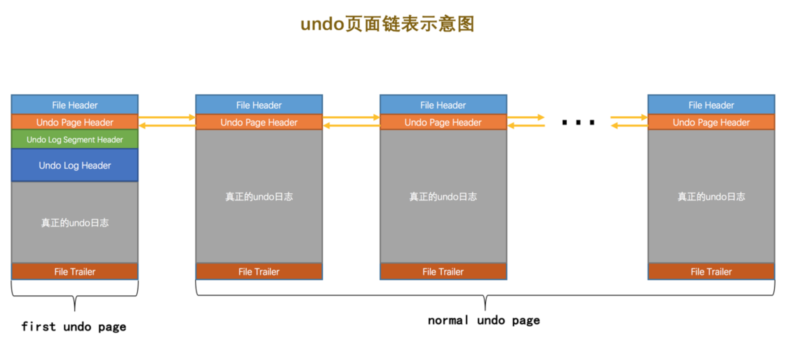


###### 重用Undo页面

我们前面说为了能提高并发执行的多个事务写入`undo日志`的性能，设计`InnoDB`的大佬决定为每个事务单独分配相应的`Undo页面`链表（最多可能单独分配4个链表）。但是这样也造成了一些问题，比如其实大部分事务执行过程中可能只修改了一条或几条记录，针对某个`Undo页面`链表只产生了非常少的`undo日志`，这些`undo日志`可能只占用一丢丢存储空间，每开启一个事务就新创建一个`Undo页面`链表（虽然这个链表中只有一个页面）来存储这么一丢丢`undo日志`岂不是太浪费了，于是设计`InnoDB`的大佬本着勤俭节约的优良传统，决定在事务提交后在某些情况下重用该事务的`Undo页面`链表。一个`Undo页面`链表是否可以被重用的条件很简单：

- 该链表中只包含一个`Undo页面`。

    如果一个事务执行过程中产生了非常多的`undo日志`，那么它可能申请非常多的页面加入到`Undo页面`链表中。在该事物提交后，如果将整个链表中的页面都重用，那就意味着即使新的事务并没有向该`Undo页面`链表中写入很多`undo日志`，那该链表中也得维护非常多的页面，那些用不到的页面也不能被别的事务所使用，这样就造成了另一种浪费。所以设计`InnoDB`的大佬们规定，只有在`Undo页面`链表中只包含一个`Undo页面`时，该链表才可以被下一个事务所重用。

- 该`Undo页面`已经使用的空间小于整个页面空间的3/4。

  `Undo页面`链表按照存储的`undo日志`所属的大类可以被分为`insert undo链表`和`update undo链表`两种，这两种链表在被重用时的策略也是不同的

  - insert undo链表

    `insert undo链表`中只存储类型为`TRX_UNDO_INSERT_REC`的`undo日志`，这种类型的`undo日志`在事务提交之后就没用了，就可以被清除掉。所以在某个事务提交后，重用这个事务的`insert undo链表`（这个链表中只有一个页面）时，可以直接把之前事务写入的一组`undo日志`覆盖掉，从头开始写入新事务的一组`undo日志`，如下图所示：

    

  - update undo链表

      在一个事务提交后，它的`update undo链表`中的`undo日志`也不能立即删除掉（这些日志用于MVCC）。所以如果之后的事务想重用`update undo链表`时，就不能覆盖之前事务写入的`undo日志`。这样就相当于在同一个`Undo页面`中写入了多组的`undo日志`，效果看起来就是这样：

    


##### 回滚段

我们现在知道一个事务在执行过程中最多可以分配4个`Undo页面`链表，在同一时刻不同事务拥有的`Undo页面`链表是不一样的，所以在同一时刻系统里其实可以有许许多多个`Undo页面`链表存在。为了更好的管理这些链表，设计`InnoDB`的大佬又设计了一个称之为`Rollback Segment Header`的页面，在这个页面中存放了各个`Undo页面`链表的`frist undo page`的`页号`，他们把这些`页号`称之为`undo slot`。

`Rollback Segment Header`的页面


每一个`Rollback Segment Header`页面都对应着一个段，这个段就称为`Rollback Segment`，翻译过来就是`回滚段`。与我们之前介绍的各种段不同的是，这个`Rollback Segment`里其实只有一个页面

- `TRX_RSEG_MAX_SIZE`：本`Rollback Segment`中所有`Undo页面`链表中的`Undo页面`数量之和不能超过`TRX_RSEG_MAX_SIZE`代表的值。

- `TRX_RSEG_HISTORY_SIZE`：`History`链表占用的页面数量。

- `TRX_RSEG_HISTORY`：`History`链表的基节点。

- `TRX_RSEG_FSEG_HEADER`：本`Rollback Segment`对应的10字节大小的`Segment Header`结构，通过它可以找到本段对应的`INODE Entry`。

- `TRX_RSEG_UNDO_SLOTS`：各个`Undo页面`链表的`first undo page`的`页号`集合，也就是`undo slot`集合。

  一个页号占用`4`个字节，对于`16KB`大小的页面来说，这个`TRX_RSEG_UNDO_SLOTS`部分共存储了`1024`个`undo slot`，所以共需`1024 × 4 = 4096`个字节。

###### 从回滚段中申请Undo页面链表

初始情况下，由于未向任何事务分配任何`Undo页面`链表，所以对于一个`Rollback Segment Header`页面来说，它的各个`undo slot`都被设置成了一个特殊的值：`FIL_NULL`（对应的十六进制就是`0xFFFFFFFF`），表示该`undo slot`不指向任何页面。

  随着时间的流逝，开始有事务需要分配`Undo页面`链表了，就从回滚段的第一个`undo slot`开始，看看该`undo slot`的值是不是`FIL_NULL`：

- 如果是`FIL_NULL`，那么在表空间中新创建一个段（也就是`Undo Log Segment`），然后从段里申请一个页面作为`Undo页面`链表的`first undo page`，然后把该`undo slot`的值设置为刚刚申请的这个页面的地址，这样也就意味着这个`undo slot`被分配给了这个事务。
- 如果不是`FIL_NULL`，说明该`undo slot`已经指向了一个`undo链表`，也就是说这个`undo slot`已经被别的事务占用了，那就跳到下一个`undo slot`，判断该`undo slot`的值是不是`FIL_NULL`，重复上面的步骤。

  一个`Rollback Segment Header`页面中包含`1024`个`undo slot`，如果这`1024`个`undo slot`的值都不为`FIL_NULL`，这就意味着这`1024`个`undo slot`被分配给了某个事务，此时由于新事务无法再获得新的`Undo页面`链表，就会回滚这个事务并且给用户报错：

```mysql
Too many active concurrent transactions
```

当一个事务提交时，它所占用的`undo slot`有两种命运：

- 如果该`undo slot`指向的`Undo页面`链表符合被重用的条件（就是上面说的`Undo页面`链表只占用一个页面并且已使用空间小于整个页面的3/4）。

    该`undo slot`就处于被缓存的状态，设计`InnoDB`的大佬规定这时该`Undo页面`链表的`TRX_UNDO_STATE`属性（该属性在`first undo page`的`Undo Log Segment Header`部分）会被设置为`TRX_UNDO_CACHED`。

      被缓存的`undo slot`都会被加入到一个链表，根据对应的`Undo页面`链表的类型不同，也会被加入到不同的链表：

  - 如果对应的`Undo页面`链表是`insert undo链表`，则该`undo slot`会被加入`insert undo cached链表`。

  - 如果对应的`Undo页面`链表是`update undo链表`，则该`undo slot`会被加入`update undo cached链表`。

      一个回滚段就对应着上述两个`cached链表`，如果有新事务要分配`undo slot`时，先从对应的`cached链表`中找。如果没有被缓存的`undo slot`，才会到回滚段的`Rollback Segment Header`页面中再去找。

- 如果该`undo slot`指向的`Undo页面`链表不符合被重用的条件，那么针对该`undo slot`对应的`Undo页面`链表类型不同，也会有不同的处理：

  - 如果对应的`Undo页面`链表是`insert undo链表`，则该`Undo页面`链表的`TRX_UNDO_STATE`属性会被设置为`TRX_UNDO_TO_FREE`，之后该`Undo页面`链表对应的段会被释放掉（也就意味着段中的页面可以被挪作他用），然后把该`undo slot`的值设置为`FIL_NULL`。
  - 如果对应的`Undo页面`链表是`update undo链表`，则该`Undo页面`链表的`TRX_UNDO_STATE`属性会被设置为`TRX_UNDO_TO_PRUGE`，则会将该`undo slot`的值设置为`FIL_NULL`，然后将本次事务写入的一组`undo`日志放到所谓的`History链表`中

###### 多个回滚段

我们说一个事务执行过程中最多分配`4`个`Undo页面`链表，而一个回滚段里只有`1024`个`undo slot`。我们即使假设一个读写事务执行过程中只分配`1`个`Undo页面`链表，那`1024`个`undo slot`也只能支持`1024`个读写事务同时执行，所以设计`InnoDB`的大佬一口气定义了`128`个回滚段，也就相当于有了`128 × 1024 = 131072`个`undo slot`。

每个回滚段都对应着一个`Rollback Segment Header`页面，有128个回滚段，自然就要有128个`Rollback Segment Header`页面，在系统表空间的第`5`号页面的某个区域包含了128个8字节大小的格子：


每个8字节的格子的构造就像这样：


- 4字节大小的`Space ID`，代表一个表空间的ID。不同的回滚段可能分布在不同的表空间中。
- 4字节大小的`Page number`，代表一个页号。也就是说每个8字节大小的`格子`相当于一个指针，指向某个表空间中的某个页面，这些页面就是`Rollback Segment Header`。


在系统表空间的第`5`号页面中存储了128个`Rollback Segment Header`页面地址，每个`Rollback Segment Header`就相当于一个回滚段。在`Rollback Segment Header`页面中，又包含`1024`个`undo slot`，每个`undo slot`都对应一个`Undo页面`链表。我们画个示意图：


###### 回滚段的分类

我们把这128个回滚段给编一下号，最开始的回滚段称之为`第0号回滚段`，之后依次递增，最后一个回滚段就称之为`第127号回滚段`。这128个回滚段可以被分成两大类：

- 第`0`号、第`33～127`号回滚段属于一类。其中第`0`号回滚段必须在系统表空间中（就是说第`0`号回滚段对应的`Rollback Segment Header`页面必须在系统表空间中），第`33～127`号回滚段既可以在系统表空间中，也可以在自己配置的`undo`表空间中。

    如果一个事务在执行过程中由于对普通表的记录做了改动需要分配`Undo页面`链表时，必须从这一类的段中分配相应的`undo slot`。

- 第`1～32`号回滚段属于一类。这些回滚段必须在临时表空间（对应着数据目录中的`ibtmp1`文件）中。

    如果一个事务在执行过程中由于对临时表的记录做了改动需要分配`Undo页面`链表时，必须从这一类的段中分配相应的`undo slot`。

 也就是说如果一个事务在执行过程中既对普通表的记录做了改动，又对临时表的记录做了改动，那么需要为这个记录分配2个回滚段，再分别到这两个回滚段中分配对应的`undo slot`。

>  不知道大家有没有疑惑，为什么要把针对普通表和临时表来划分不同种类的`回滚段`呢？这个还得从`Undo页面`本身说起，我们说`Undo页面`其实是类型为`FIL_PAGE_UNDO_LOG`的页面的简称，说到底它也是一个普通的页面。我们前面说过，在修改页面之前一定要先把对应的`redo日志`写上，这样在系统奔溃重启时才能恢复到奔溃前的状态。我们向`Undo页面`写入`undo日志`本身也是一个写页面的过程，设计`InnoDB`的大佬为此还设计了许多种`redo日志`的类型，比方说`MLOG_UNDO_HDR_CREATE`、`MLOG_UNDO_INSERT`、`MLOG_UNDO_INIT`等等等等，也就是说我们对`Undo页面`做的任何改动都会记录相应类型的`redo日志`。但是对于临时表来说，因为修改临时表而产生的`undo日志`只需要在系统运行过程中有效，如果系统奔溃了，那么在重启时也不需要恢复这些`undo`日志所在的页面，所以在写针对临时表的`Undo页面`时，并不需要记录相应的`redo日志`。总结一下针对普通表和临时表划分不同种类的`回滚段`的原因：在修改针对普通表的回滚段中的Undo页面时，需要记录对应的redo日志，而修改针对临时表的回滚段中的Undo页面时，不需要记录对应的redo日志。

##### 为事务分配Undo页面链表详细过程

- 事务在执行过程中对普通表的记录首次做改动之前，首先会到系统表空间的第`5`号页面中分配一个回滚段（其实就是获取一个`Rollback Segment Header`页面的地址）。一旦某个回滚段被分配给了这个事务，那么之后该事务中再对普通表的记录做改动时，就不会重复分配了。

    使用传说中的`round-robin`（循环使用）方式来分配回滚段。比如当前事务分配了第`0`号回滚段，那么下一个事务就要分配第`33`号回滚段，下下个事务就要分配第`34`号回滚段，简单一点的说就是这些回滚段被轮着分配给不同的事务（就是这么简单粗暴，没什么好说的）。

- 在分配到回滚段后，首先看一下这个回滚段的两个`cached链表`有没有已经缓存了的`undo slot`，比如如果事务做的是`INSERT`操作，就去回滚段对应的`insert undo cached链表`中看看有没有缓存的`undo slot`；如果事务做的是`DELETE`操作，就去回滚段对应的`update undo cached链表`中看看有没有缓存的`undo slot`。如果有缓存的`undo slot`，那么就把这个缓存的`undo slot`分配给该事务。

- 如果没有缓存的`undo slot`可供分配，那么就要到`Rollback Segment Header`页面中找一个可用的`undo slot`分配给当前事务。

    从`Rollback Segment Header`页面中分配可用的`undo slot`的方式我们上面也说过了，就是从第`0`个`undo slot`开始，如果该`undo slot`的值为`FIL_NULL`，意味着这个`undo slot`是空闲的，就把这个`undo slot`分配给当前事务，否则查看第`1`个`undo slot`是否满足条件，依次类推，直到最后一个`undo slot`。如果这`1024`个`undo slot`都没有值为`FIL_NULL`的情况，就直接报错喽（一般不会出现这种情况）～

- 找到可用的`undo slot`后，如果该`undo slot`是从`cached链表`中获取的，那么它对应的`Undo Log Segment`已经分配了，否则的话需要重新分配一个`Undo Log Segment`，然后从该`Undo Log Segment`中申请一个页面作为`Undo页面`链表的`first undo page`。

- 然后事务就可以把`undo日志`写入到上面申请的`Undo页面`链表了！

如果一个事务在执行过程中既对普通表的记录做了改动，又对临时表的记录做了改动，那么需要为这个记录分配2个回滚段。并发执行的不同事务其实也可以被分配相同的回滚段，只要分配不同的undo slot就可以了。


#### roll_pointer隐藏列的含义

本质上就是一个指向记录对应的`undo日志`的一个指针。比方说我们上面向`undo_demo`表里插入了2条记录，每条记录都有与其对应的一条`undo日志`。记录被存储到了类型为`FIL_PAGE_INDEX`的页面中（就是我们前面一直所说的`数据页`），`undo日志`被存放到了类型为`FIL_PAGE_UNDO_LOG`的页面中。效果如图所示：


#### 回滚段相关配置

**配置回滚段数量**

我们前面说系统中一共有`128`个回滚段，其实这只是默认值，我们可以通过启动参数`innodb_rollback_segments`来配置回滚段的数量，可配置的范围是`1~128`。但是这个参数并不会影响针对临时表的回滚段数量，针对临时表的回滚段数量一直是`32`，也就是说：

- 如果我们把`innodb_rollback_segments`的值设置为`1`，那么只会有1个针对普通表的可用回滚段，但是仍然有32个针对临时表的可用回滚段。
- 如果我们把`innodb_rollback_segments`的值设置为`2～33`之间的数，效果和将其设置为`1`是一样的。
- 如果我们把`innodb_rollback_segments`设置为大于`33`的数，那么针对普通表的可用回滚段数量就是该值减去32。

**配置undo表空间**

默认情况下，针对普通表设立的回滚段（第`0`号以及第`33~127`号回滚段）都是被分配到系统表空间的。其中的第第`0`号回滚段是一直在系统表空间的，但是第`33~127`号回滚段可以通过配置放到自定义的`undo表空间`中。但是这种配置只能在系统初始化（创建数据目录时）的时候使用，一旦初始化完成，之后就不能再次更改了。我们看一下相关启动参数：

- 通过`innodb_undo_directory`指定`undo表空间`所在的目录，如果没有指定该参数，则默认`undo表空间`所在的目录就是数据目录。

- 通过`innodb_undo_tablespaces`定义`undo表空间`的数量。该参数的默认值为`0`，表明不创建任何`undo表空间`。

    第`33~127`号回滚段可以平均分布到不同的`undo表空间`中。

  比如我们在系统初始化时指定的`innodb_rollback_segments`为`35`，`innodb_undo_tablespaces`为`2`，这样就会将第`33`、`34`号回滚段分别分布到一个`undo表空间`中。

  设立`undo表空间`的一个好处就是在`undo表空间`中的文件大到一定程度时，可以自动的将该`undo表空间`截断（truncate）成一个小文件。而系统表空间的大小只能不断的增大，却不能截断。


### 事务的隔离级别与MVCC

#### 事务隔离级别

##### 事务并发执行遇到的问题

- 脏写（`Dirty Write`）

  如果一个事务修改了另一个未提交事务修改过的数据，那就意味着发生了`脏写`

  

- 脏读（`Dirty Read`）

  如果一个事务读到了另一个未提交事务修改过的数据，那就意味着发生了`脏读`

  

- 不可重复读（Non-Repeatable Read）

  如果一个事务只能读到另一个已经提交的事务修改过的数据，并且其他事务每对该数据进行一次修改并提交后，该事务都能查询得到最新值，那就意味着发生了`不可重复读`

  

- 幻读（Phantom）

  如果一个事务先根据某些条件查询出一些记录，之后另一个事务又向表中插入了符合这些条件的记录，原先的事务再次按照该条件查询时，能把另一个事务插入的记录也读出来，那就意味着发生了`幻读`


##### SQL标准中的四种隔离级别

- `READ UNCOMMITTED`：未提交读。
- `READ COMMITTED`：已提交读。
- `REPEATABLE READ`：可重复读。
- `SERIALIZABLE`：可串行化。

| 隔离级别           | 脏读         | 不可重复读   | 幻读         |
| ------------------ | ------------ | ------------ | ------------ |
| `READ UNCOMMITTED` | Possible     | Possible     | Possible     |
| `READ COMMITTED`   | Not Possible | Possible     | Possible     |
| `REPEATABLE READ`  | Not Possible | Not Possible | Possible     |
| `SERIALIZABLE`     | Not Possible | Not Possible | Not Possible |

> `脏写`是怎么回事儿？怎么里边都没写呢？这是因为脏写这个问题太严重了，不论是哪种隔离级别，都不允许脏写的情况发生。

##### MySQL中支持的四种隔离级别

 不同的数据库厂商对`SQL标准`中规定的四种隔离级别支持不一样，比方说`Oracle`就只支持`READ COMMITTED`和`SERIALIZABLE`隔离级别。本书中所讨论的`MySQL`虽然支持4种隔离级别，但与`SQL标准`中所规定的各级隔离级别允许发生的问题却有些出入，MySQL在REPEATABLE READ隔离级别下，是可以禁止幻读问题的发生的，`MySQL`的默认隔离级别为`REPEATABLE READ`

```mysql
SET [GLOBAL|SESSION] TRANSACTION ISOLATION LEVEL level;

level: {
     REPEATABLE READ
   | READ COMMITTED
   | READ UNCOMMITTED
   | SERIALIZABLE
}

## 使用GLOBAL关键字（在全局范围影响）：
SET GLOBAL TRANSACTION ISOLATION LEVEL SERIALIZABLE;
## 只对执行完该语句之后产生的会话起作用。
## 当前已经存在的会话无效。

## 使用SESSION关键字（在会话范围影响）：
SET SESSION TRANSACTION ISOLATION LEVEL SERIALIZABLE;
## 对当前会话的所有后续的事务有效
## 该语句可以在已经开启的事务中间执行，但不会影响当前正在执行的事务。
## 如果在事务之间执行，则对后续的事务有效。

## 上述两个关键字都不用（只对执行语句后的下一个事务产生影响）：
SET TRANSACTION ISOLATION LEVEL SERIALIZABLE;
## 只对当前会话中下一个即将开启的事务有效。
## 下一个事务执行完后，后续事务将恢复到之前的隔离级别。
## 该语句不能在已经开启的事务中间执行，会报错的。


mysql> SHOW VARIABLES LIKE 'transaction_isolation';
+-----------------------+-----------------+
| Variable_name         | Value           |
+-----------------------+-----------------+
| transaction_isolation | REPEATABLE-READ |
+-----------------------+-----------------+
1 row in set (0.02 sec)

```


#### MVCC原理

##### 版本链

对于使用`InnoDB`存储引擎的表来说，它的聚簇索引记录中都包含两个必要的隐藏列

- `trx_id`：每次一个事务对某条聚簇索引记录进行改动时，都会把该事务的`事务id`赋值给`trx_id`隐藏列。
- `roll_pointer`：每次对某条聚簇索引记录进行改动时，都会把旧的版本写入到`undo日志`中，然后这个隐藏列就相当于一个指针，可以通过它来找到该记录修改前的信息。

每次对记录进行改动，都会记录一条`undo日志`，每条`undo日志`也都有一个`roll_pointer`属性（`INSERT`操作对应的`undo日志`没有该属性，因为该记录并没有更早的版本），可以将这些`undo日志`都连起来，串成一个链表，所以现在的情况就像下图一样：


对该记录每次更新后，都会将旧值放到一条`undo日志`中，就算是该记录的一个旧版本，随着更新次数的增多，所有的版本都会被`roll_pointer`属性连接成一个链表，我们把这个链表称之为`版本链`，版本链的头节点就是当前记录最新的值。另外，每个版本中还包含生成该版本时对应的`事务id`


##### ReadView

- 对于使用`READ UNCOMMITTED`隔离级别的事务来说，由于可以读到未提交事务修改过的记录，所以直接读取记录的最新版本就好了；
- 对于使用`SERIALIZABLE`隔离级别的事务来说，设计`InnoDB`的大佬规定使用加锁的方式来访问记录；
- 对于使用`READ COMMITTED`和`REPEATABLE READ`隔离级别的事务来说，都必须保证读到已经提交了的事务修改过的记录，也就是说假如另一个事务已经修改了记录但是尚未提交，是不能直接读取最新版本的记录的，核心问题就是：需要判断一下版本链中的哪个版本是当前事务可见的。

`ReadView`中主要包含4个比较重要的内容：

- `m_ids`：表示在生成`ReadView`时当前系统中活跃的读写事务的`事务id`列表。
- `min_trx_id`：表示在生成`ReadView`时当前系统中活跃的读写事务中最小的`事务id`，也就是`m_ids`中的最小值。
- `max_trx_id`：表示生成`ReadView`时系统中应该分配给下一个事务的`id`值。
- `creator_trx_id`：表示生成该`ReadView`的事务的`事务id`。

在访问某条记录时，只需要按照下面的步骤判断记录的某个版本是否可见：

- 如果被访问版本的`trx_id`属性值与`ReadView`中的`creator_trx_id`值相同，意味着当前事务在访问它自己修改过的记录，所以该版本可以被当前事务访问。

  ```
  小贴士：只有在对表中的记录做改动时（执行INSERT、DELETE、UPDATE这些语句时）才会为事务分配事务id，否则在一个只读事务中的事务id值都默认为0。
  ```

- 如果被访问版本的`trx_id`属性值小于`ReadView`中的`min_trx_id`值，表明生成该版本的事务在当前事务生成`ReadView`前已经提交，所以该版本可以被当前事务访问。

- 如果被访问版本的`trx_id`属性值大于`ReadView`中的`max_trx_id`值，表明生成该版本的事务在当前事务生成`ReadView`后才开启，所以该版本不可以被当前事务访问。

- 如果被访问版本的`trx_id`属性值在`ReadView`的`min_trx_id`和`max_trx_id`之间，那就需要判断一下`trx_id`属性值是不是在`m_ids`列表中，如果在，说明创建`ReadView`时生成该版本的事务还是活跃的，该版本不可以被访问；如果不在，说明创建`ReadView`时生成该版本的事务已经被提交，该版本可以被访问。

如果某个版本的数据对当前事务不可见的话，那就顺着版本链找到下一个版本的数据，继续按照上面的步骤判断可见性，依此类推，直到版本链中的最后一个版本。如果最后一个版本也不可见的话，那么就意味着该条记录对该事务完全不可见，查询结果就不包含该记录。


在`MySQL`中，`READ COMMITTED`和`REPEATABLE READ`隔离级别的的一个非常大的区别就是它们生成ReadView的时机不同。

- 使用READ COMMITTED隔离级别的事务在每次查询开始时都会生成一个独立的ReadView。
- 使用REPEATABLE READ的事务只在第一次进行普通SELECT操作前生成一个ReadView，之后的查询操作都重复使用这个ReadView就好了。


#### purge

- `insert undo`在事务提交之后就可以被释放掉了，而`update undo`由于还需要支持`MVCC`，不能立即删除掉。
  - undo页面中包括`Undo Log Header`，其中`TRX_UNDO_HISTORY_NODE`字段是`History`链表的节点，当一个事务提交以后，就会将这一组undo日志的链表节点加入到`History`链表的头节点去。
  - 一个回滚段包含一个`Rollback Segment Header`页面，`History`链表的基节点在`Rollback Segment Header`中，也就是说一个回滚段对应一个`History`链表
    - `TRX_RSEG_HISTORY_SIZE`：`History`链表占用的页面数量。
    - `TRX_RSEG_HISTORY`：`History`链表的基节点。

- 为了支持`MVCC`，对于`delete mark`操作来说，仅仅是在记录上打一个删除标记，并没有真正将它删除掉（加入垃圾链表）。

  undo页面中包括`Undo Log Header`，其中`TRX_UNDO_DEL_MARKS`属性用于标记本组undo


##### 删除时机

update undo日志和被标记删除的记录都是为了MVCC而存在的，只要系统中最早产生的ReadView不再访问它们，这些记录也就没有用了。当系统中最早产生的ReadView对应的事务提交了，ReadView就不会再被使用了。

- 在一个事务提交时，会给这个事务生成一个事务no的值（与事务id不同），用来表示事务提交的先后顺序，先提交的事务no小，后提交的事务no大。

  undo页面中`Undo Log Header`中的`TRX_UNDO_TRX_NO`用于存储提交本组undo日志的事务no，`History`链表也是按照事务no值来排序各组undo日志。

- ReadView中还包括一个事务no的属性值，ReadView创建时将当前系统最大的事务no+1赋值，整个系统中的ReadView按照事务no顺序串成一个链表

purge线程执行时

- 把系统中最早生成的ReadView取出来，如果不存在ReadView，就创建一个ReadView，新创建的ReadView的事务no一定比当前已经提交的事务no要大
- 从`History`链表中取出事务no最小的一组undo日志，如果当前ReadView的事务no比undo日志的事务no要大，证明当前undo日志已经对所有事务可见，可以删除，从`History`链表移除，释放存储空间。
- 如果当前undo日志中包含delete mark的记录，那么将对应的记录移动到索引页的垃圾链表。

> 这里我们需要注意的一点，当前系统中系统最早生成的ReadView决定了purge操作中可以清理哪些update undo日志以及打了删除标记的记录。如果某个事物使用的`REPEATABLE READ`隔离级别，那么该事务一直复用最初产生的ReadView。假如这个事务运行了很久，一直没有提交，那么最早产生的ReadView会一直不释放。系统中updtae undo日志和打了删除标记的记录就会越来越多，表空间对应的文件也会越来越大，一条记录的版本链将越来越长，从而影响系统的性能。
>


### 锁


## 常见问题

### 有字段只有四个枚举值，适不适合添加索引


如果索引的区分度很小，假设字段的值分布均匀，那么无论搜索哪个值都可能得到一半的数据。在这些情况下，还不如不要索引，因为 MySQL 还有一个查询优化器，查询优化器发现某个值出现在表的数据行中的百分比（惯用的百分比界线是"30%"）很高的时候，它一般会忽略索引，进行全表扫描。区分度就是某个字段 column 不同值的个数「除以」表的总行数，计算公式如下：


比如，性别的区分度就很小，不适合建立索引或不适合排在联合索引列的靠前的位置，而 UUID 这类字段就比较适合做索引或排在联合索引列的靠前的位置。但是也要看具体的场景，如果 4 个枚举值里面，有一个枚举值占总数据的 20%，然后有业务需求需要查询这个枚举值的记录，那么这种场景下还是适合添加索引的，因为数据占比小的枚举值是能用到索引的。


### 临时表

`Using temporary` 是执行计划（Execution Plan）里的内部操作提示，不等于用户创建的临时表。

> MySQL **在执行过程中自动创建了一个内部临时表** 来保存中间结果（例如排序、分组、去重等操作），以便继续处理查询。

🔹 这些“临时表”是由 MySQL 引擎自己生成的，
 🔹 存在于**内存或磁盘的临时空间**中，
 🔹 **不会出现在 `SHOW TABLES` 里**，
 🔹 **会在查询结束后立即销毁**。

用户创建的临时表（Temporary Table）

```mysql
CREATE TEMPORARY TABLE temp_data (...);
```


| 项目                     | “Using temporary”  | 用户创建的临时表 (`CREATE TEMPORARY TABLE`) |
| ------------------------ | ------------------ | ------------------------------------------- |
| 谁创建的                 | MySQL 自动创建     | 用户手动创建                                |
| 是否可见                 | ❌ 不可见           | ✅ 可见（当前会话）                          |
| 存在时间                 | 查询执行期间       | 会话结束前                                  |
| 存储位置                 | 内存或磁盘临时空间 | 临时数据库目录（tmpdir）                    |
| 用途                     | 执行计划中间结果   | 业务逻辑中存放中间数据                      |
| 能否手动操作             | ❌ 不能             | ✅ 可以执行增删改查                          |
| 是否出现在 `SHOW TABLES` | ❌ 不会             | ✅ 会（仅当前会话）                          |


