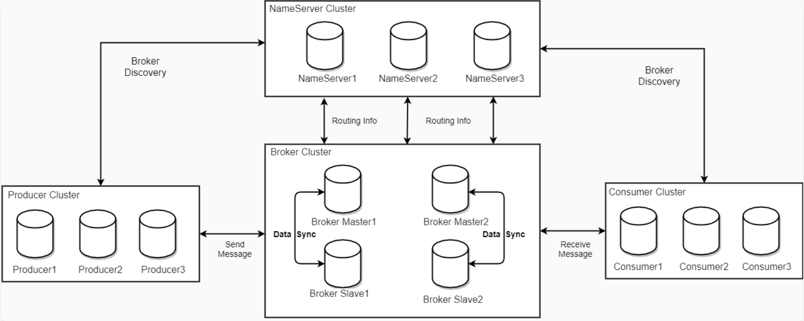
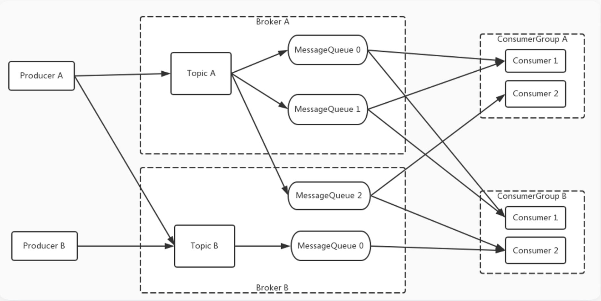
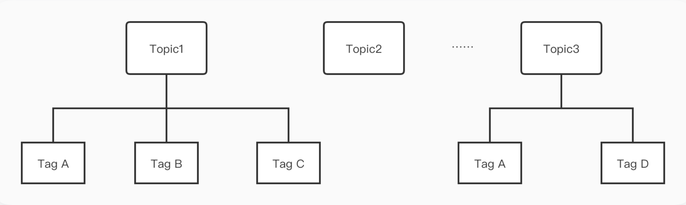
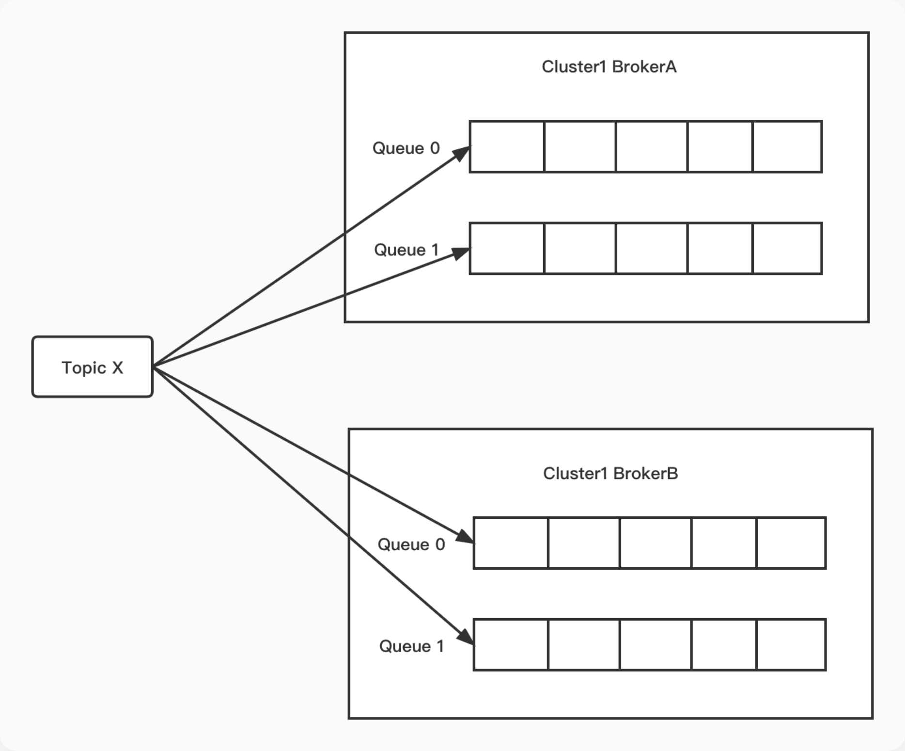
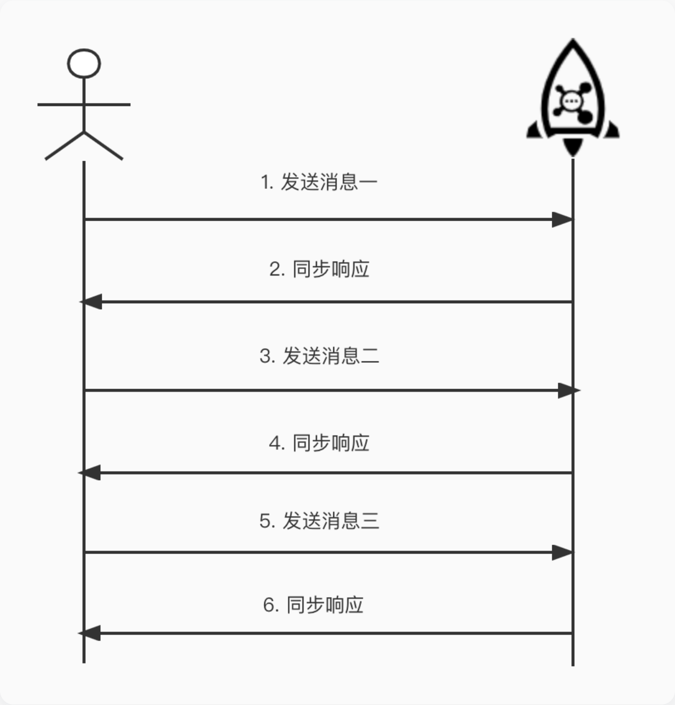
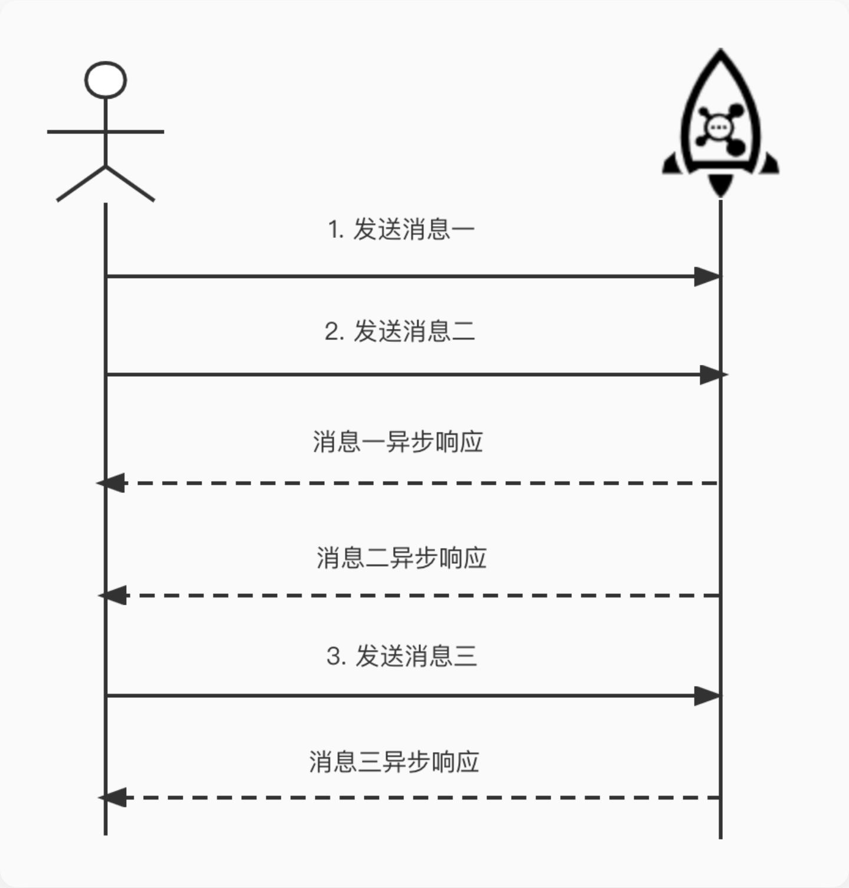
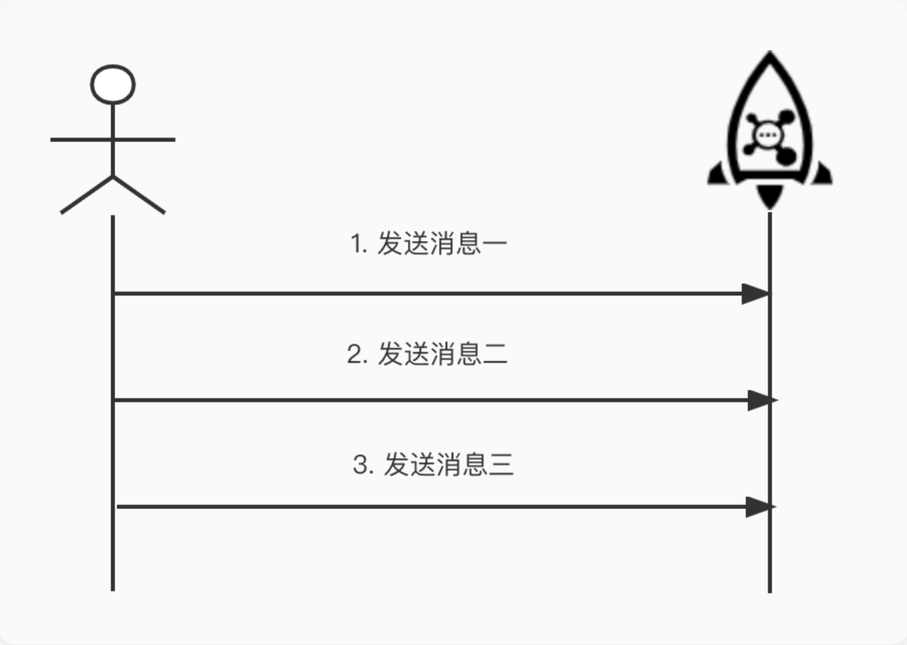

# rocketmq


## 部署模型



### 生产者 Producer

发布消息的角色。Producer通过 MQ 的负载均衡模块选择相应的 Broker 集群队列进行消息投递，投递的过程支持快速失败和重试。

### 消费者 Consumer

消息消费的角色。

- 支持以推（push），拉（pull）两种模式对消息进行消费。
- 同时也支持**集群方式**和广播方式的消费。
- 提供实时消息订阅机制，可以满足大多数用户的需求。

### 名字服务器 **NameServer**

NameServer是一个简单的 Topic 路由注册中心，支持 Topic、Broker 的动态注册与发现。

主要包括两个功能：

- **Broker管理**，NameServer接受Broker集群的注册信息并且保存下来作为路由信息的基本数据。然后提供心跳检测机制，检查Broker是否还存活；
- **路由信息管理**，每个NameServer将保存关于 Broker 集群的整个路由信息和用于客户端查询的队列信息。Producer和Consumer通过NameServer就可以知道整个Broker集群的路由信息，从而进行消息的投递和消费。

NameServer通常会有多个实例部署，各实例间相互不进行信息通讯。Broker是向每一台NameServer注册自己的路由信息，所以每一个NameServer实例上面都保存一份完整的路由信息。当某个NameServer因某种原因下线了，客户端仍然可以向其它NameServer获取路由信息。

### 代理服务器 Broker

Broker主要负责消息的存储、投递和查询以及服务高可用保证。

NameServer几乎无状态节点，因此可集群部署，节点之间无任何信息同步。Broker部署相对复杂。

在 Master-Slave 架构中，Broker 分为 Master 与 Slave。一个Master可以对应多个Slave，但是一个Slave只能对应一个Master。Master 与 Slave 的对应关系通过指定相同的BrokerName，不同的BrokerId 来定义，BrokerId为0表示Master，非0表示Slave。Master也可以部署多个。


> - 每个 **Broker** 与 **NameServer** 集群中的所有节点建立长连接，定时注册 Topic 信息到所有 NameServer。
> - **Producer** 与 **NameServer** 集群中的其中一个节点建立长连接，定期从 NameServer 获取Topic路由信息，并向提供 Topic 服务的 Master 建立长连接，且定时向 Master 发送心跳。Producer 完全无状态。
> - **Consumer** 与 **NameServer** 集群中的其中一个节点建立长连接，定期从 NameServer 获取 Topic 路由信息，并向提供 Topic 服务的 Master、Slave 建立长连接，且定时向 Master、Slave发送心跳。Consumer 既可以从 Master 订阅消息，也可以从Slave订阅消息。


## 消息模型



- 为了消息写入能力的**水平扩展**，RocketMQ 对 Topic进行了分区，这种操作被称为**队列**（MessageQueue）。
- 为了消费能力的**水平扩展**，ConsumerGroup的概念应运而生。
- 相同的ConsumerGroup下的消费者主要有两种负载均衡模式，即**广播模式**，和**集群模式**（图中是最常用的集群模式）。
- 在集群模式下，同一个 ConsumerGroup 中的 Consumer 实例是负载均衡消费，如图中 ConsumerGroupA 订阅 TopicA，TopicA 对应 3个队列，则 GroupA 中的 Consumer1 消费的是 MessageQueue 0和 MessageQueue 1的消息，Consumer2是消费的是MessageQueue2的消息。
- 在广播模式下，同一个 ConsumerGroup 中的每个 Consumer 实例都处理全部的队列。需要注意的是，广播模式下因为每个 Consumer 实例都需要处理全部的消息，因此这种模式仅推荐在通知推送、配置同步类小流量场景使用。

### 消息

- **topic**，表示要发送的消息的主题。
- **body** 表示消息的存储内容
- **properties** 表示消息属性
- **transactionId** 会在事务消息中使用。

| 字段名         | 默认值 | 必要性 | 说明                                                         |
| -------------- | ------ | ------ | ------------------------------------------------------------ |
| Topic          | null   | 必填   | 消息所属 topic 的名称                                        |
| Body           | null   | 必填   | 消息体                                                       |
| Tags           | null   | 选填   | 消息标签，方便服务器过滤使用。目前只支持每个消息设置一个     |
| Keys           | null   | 选填   | 代表这条消息的业务关键词                                     |
| Flag           | 0      | 选填   | 完全由应用来设置，RocketMQ 不做干预                          |
| DelayTimeLevel | 0      | 选填   | 消息延时级别，0 表示不延时，大于 0 会延时特定的时间才会被消费 |
| WaitStoreMsgOK | true   | 选填   | 表示消息是否在服务器落盘后才返回应答。                       |

```java
        Message msg = new Message("TestTopic", "TagA", "keys", 1, "Hello RocketMQ".getBytes(), false);
```


#### Tag

Topic 与 Tag 都是业务上用来归类的标识，区别在于 Topic 是一级分类，而 Tag 可以理解为是二级分类。使用 Tag 可以实现对 Topic 中的消息进行过滤。



针对消息分类，可以选择创建多个 Topic，或者在同一个 Topic 下创建多个 Tag。但通常情况下，不同的 Topic 之间的消息没有必然的联系，而 Tag 则用来区分同一个 Topic 下相互关联的消息，例如全集和子集的关系、流程先后的关系。

#### Keys

Apache RocketMQ 每个消息可以在业务层面的设置唯一标识码 keys 字段，方便将来定位消息丢失问题。 Broker 端会为每个消息创建索引（哈希索引），应用可以通过 topic、key 来查询这条消息内容，以及消息被谁消费。由于是哈希索引，请务必保证 key 尽可能唯一，这样可以避免潜在的哈希冲突。

```java
   // 订单Id
   String orderId = "20034568923546";
   message.setKeys(orderId);
```

#### 队列

为了支持高并发和水平扩展，需要对 Topic 进行分区，在 RocketMQ 中这被称为队列，一个 Topic 可能有多个队列，并且可能分布在不同的 Broker 上。




### 消息类型

#### 普通消息

Apache RocketMQ可用于以三种方式发送消息：**同步、异步和单向传输**。前两种消息类型是可靠的，因为无论它们是否成功发送都有响应。

> Producer的send方法本身支持内部重试，重试逻辑如下：
>
> - 至多重试2次（同步发送为2次，异步发送为0次）。
> - 如果发送失败，则轮转到下一个Broker。这个方法的总耗时时间不超过sendMsgTimeout设置的值，默认10s。
> - 如果本身向broker发送消息产生超时异常，就不会再重试。


##### 同步发送

同步发送是最常用的方式，是指消息发送方发出一条消息后，会在收到服务端同步响应之后才发下一条消息的通讯方式，可靠的同步传输被广泛应用于各种场景，如重要的通知消息、短消息通知等。



```java
public class SyncProducer {
  public static void main(String[] args) throws Exception {
    // 初始化一个producer并设置Producer group name
    DefaultMQProducer producer = new DefaultMQProducer("please_rename_unique_group_name"); //（1）
    // 设置NameServer地址
    producer.setNamesrvAddr("localhost:9876");  //（2）
    // 启动producer
    producer.start();
    for (int i = 0; i < 100; i++) {
      // 创建一条消息，并指定topic、tag、body等信息，tag可以理解成标签，对消息进行再归类，RocketMQ可以在消费端对tag进行过滤
      Message msg = new Message("TopicTest" /* Topic */,
        "TagA" /* Tag */,
        ("Hello RocketMQ " + i).getBytes(RemotingHelper.DEFAULT_CHARSET) /* Message body */
        );   //（3）
      // 利用producer进行发送，并同步等待发送结果
      SendResult sendResult = producer.send(msg);   //（4）
      System.out.printf("%s%n", sendResult);
    }
    // 一旦producer不再使用，关闭producer
    producer.shutdown();
  }
}
```

##### 异步发送

异步发送是指发送方发出一条消息后，不等服务端返回响应，接着发送下一条消息的通讯方式。



```java
public class AsyncProducer {
  public static void main(String[] args) throws Exception {
    // 初始化一个producer并设置Producer group name
    DefaultMQProducer producer = new DefaultMQProducer("please_rename_unique_group_name");
    // 设置NameServer地址
    producer.setNamesrvAddr("localhost:9876");
    // 启动producer
    producer.start();
    producer.setRetryTimesWhenSendAsyncFailed(0);
    int messageCount = 100;
    final CountDownLatch countDownLatch = new CountDownLatch(messageCount);
    for (int i = 0; i < messageCount; i++) {
      try {
          final int index = i;
          // 创建一条消息，并指定topic、tag、body等信息，tag可以理解成标签，对消息进行再归类，RocketMQ可以在消费端对tag进行过滤
          Message msg = new Message("TopicTest",
            "TagA",
            "Hello world".getBytes(RemotingHelper.DEFAULT_CHARSET));
          // 异步发送消息, 发送结果通过callback返回给客户端
          producer.send(msg, new SendCallback() {
            @Override
            public void onSuccess(SendResult sendResult) {
              System.out.printf("%-10d OK %s %n", index,
                sendResult.getMsgId());
              countDownLatch.countDown();
            }
            @Override
            public void onException(Throwable e) {
              System.out.printf("%-10d Exception %s %n", index, e);
              e.printStackTrace();
              countDownLatch.countDown();
            }
          });
        } catch (Exception e) {
            e.printStackTrace();
            countDownLatch.countDown();
        }
    }
    //异步发送，如果要求可靠传输，必须要等回调接口返回明确结果后才能结束逻辑，否则立即关闭Producer可能导致部分消息尚未传输成功
    countDownLatch.await(5, TimeUnit.SECONDS);
    // 一旦producer不再使用，关闭producer
    producer.shutdown();
  }
}
```

##### 单向模式发送

发送方只负责发送消息，不等待服务端返回响应且没有回调函数触发，即只发送请求不等待应答。此方式发送消息的过程耗时非常短，一般在微秒级别。适用于某些耗时非常短，但对可靠性要求并不高的场景，例如日志收集。



```java
public class OnewayProducer {
  public static void main(String[] args) throws Exception{
    // 初始化一个producer并设置Producer group name
    DefaultMQProducer producer = new DefaultMQProducer("please_rename_unique_group_name");
    // 设置NameServer地址
    producer.setNamesrvAddr("localhost:9876");
    // 启动producer
    producer.start();
    for (int i = 0; i < 100; i++) {
      // 创建一条消息，并指定topic、tag、body等信息，tag可以理解成标签，对消息进行再归类，RocketMQ可以在消费端对tag进行过滤
      Message msg = new Message("TopicTest" /* Topic */,
        "TagA" /* Tag */,
        ("Hello RocketMQ " + i).getBytes(RemotingHelper.DEFAULT_CHARSET) /* Message body */
      );
      // 由于在oneway方式发送消息时没有请求应答处理，如果出现消息发送失败，则会因为没有重试而导致数据丢失。若数据不可丢，建议选用可靠同步或可靠异步发送方式。
      producer.sendOneway(msg);
    }
     // 一旦producer不再使用，关闭producer
     producer.shutdown();
  }
}
```


#### 顺序消息

顺序消息是一种对消息发送和消费顺序有严格要求的消息。

对于一个指定的Topic，消息严格按照先进先出（FIFO）的原则进行消息发布和消费，即先发布的消息先消费，后发布的消息后消费。在 Apache RocketMQ 中支持分区顺序消息，如下图所示。我们可以按照某一个标准对消息进行分区（比如图中的ShardingKey），同一个ShardingKey的消息会被分配到同一个队列中，并按照顺序被消费。

**生产顺序性：** RocketMQ 通过生产者和服务端的协议保障单个生产者串行地发送消息，并按序存储和持久化。如需保证消息生产的顺序性，则必须满足以下条件：

- 单一生产者： 消息生产的顺序性仅支持单一生产者，不同生产者分布在不同的系统，即使设置相同的分区键，不同生产者之间产生的消息也无法判定其先后顺序。
- 串行发送：生产者客户端支持多线程安全访问，但如果生产者使用多线程并行发送，则不同线程间产生的消息将无法判定其先后顺序。

满足以上条件的生产者，将顺序消息发送至服务端后，会保证设置了同一分区键的消息，按照发送顺序存储在同一队列中。服务端顺序存储逻辑如下：


```java
public class Producer {
    public static void main(String[] args) throws UnsupportedEncodingException {
        try {
            DefaultMQProducer producer = new DefaultMQProducer("please_rename_unique_group_name");
            producer.start();

            String[] tags = new String[] {"TagA", "TagB", "TagC", "TagD", "TagE"};
            for (int i = 0; i < 100; i++) {
                int orderId = i % 10;
                Message msg =
                    new Message("TopicTest", tags[i % tags.length], "KEY" + i,
                        ("Hello RocketMQ " + i).getBytes(RemotingHelper.DEFAULT_CHARSET));
                SendResult sendResult = producer.send(msg, new MessageQueueSelector() {
                    @Override
                    public MessageQueue select(List<MessageQueue> mqs, Message msg, Object arg) {
                        Integer id = (Integer) arg;
                        //通过参数arg选择将消息发送到哪个队列中去
                        int index = id % mqs.size();
                        return mqs.get(index);
                    }
                }, orderId);

                System.out.printf("%s%n", sendResult);
            }

            producer.shutdown();
        } catch (MQClientException | RemotingException | MQBrokerException | InterruptedException e) {
            e.printStackTrace();
        }
    }
}
```

##### 顺序消息的一致性

一个 Broker 可能管理若干队列。如果这个 Broker 掉线，有两种可能：

1. **队列总数发生变化**
   - 为了可用性，RocketMQ 可能把这个 Broker 的队列摘掉（不可用）。
   - 这样，新的消息会被路由到其他 Broker 的队列上。
   - 但是，这样同一个 ShardingKey 的消息 **前后就不在同一个队列** 了 → 造成 **乱序**。
2. **队列总数不变**
   - 仍然认为这个 Broker 的队列存在。
   - 那么新的消息会继续路由到这个队列上 → 但是由于 Broker 掉线，消息发送失败。
   - 这样虽然 **顺序能保证**，但 **可用性降低**（消息发不出去）。

**RocketMQ 的两种模式**

1. **默认模式（可用性优先）**

   - Broker 掉线后，队列会变化，消息会转发到别的 Broker 的队列。
   - 结果：系统还能继续用，但是顺序可能乱掉。

2. **严格顺序模式（顺序优先）**

   - 创建 Topic 时加 `-o true`：

     ```
     sh bin/mqadmin updateTopic -c DefaultCluster -t TopicTest -o true -n 127.0.0.1:9876
     ```

     表示这个 Topic 是严格顺序的。

   - NameServer 中还要开启：

     - `orderMessageEnable=true`
     - `returnOrderTopicConfigToBroker=true`

   - 结果：Broker 掉线时，队列不会改变，消息仍然发往原来的队列，但可能失败（可用性下降）。


#### 延迟消息

延迟消息发送是指消息发送到Apache RocketMQ后，并不期望立马投递这条消息，而是延迟一定时间后才投递到Consumer进行消费。


| 投递等级（delay level） | 延迟时间 | 投递等级（delay level） | 延迟时间 |
| ----------------------- | -------- | ----------------------- | -------- |
| 1                       | 1s       | 10                      | 6min     |
| 2                       | 5s       | 11                      | 7min     |
| 3                       | 10s      | 12                      | 8min     |
| 4                       | 30s      | 13                      | 9min     |
| 5                       | 1min     | 14                      | 10min    |
| 6                       | 2min     | 15                      | 20min    |
| 7                       | 3min     | 16                      | 30min    |
| 8                       | 4min     | 17                      | 1h       |
| 9                       | 5min     | 18                      | 2h       |

```java
public class ScheduledMessageProducer {
    public static void main(String[] args) throws Exception {
        // Instantiate a producer to send scheduled messages
        DefaultMQProducer producer = new DefaultMQProducer("ExampleProducerGroup");
        // Launch producer
        producer.start();
        int totalMessagesToSend = 100;
        for (int i = 0; i < totalMessagesToSend; i++) {
            Message message = new Message("TestTopic", ("Hello scheduled message " + i).getBytes());
            // This message will be delivered to consumer 10 seconds later.
            message.setDelayTimeLevel(3);
            // Send the message
            producer.send(message);
        }
        
        // Shutdown producer after use.
        producer.shutdown();
    }
    
}
```

> 延时消息的实现逻辑需要先经过定时存储等待触发，延时时间到达后才会被投递给消费者。因此，如果将大量延时消息的定时时间设置为同一时刻，则到达该时刻后会有大量消息同时需要被处理，会造成系统压力过大，导致消息分发延迟，影响定时精度。


#### 批量消息

在对吞吐率有一定要求的情况下，Apache RocketMQ可以将一些消息聚成一批以后进行发送，可以增加吞吐率，并减少API和网络调用次数。

> 这里调用非常简单，将消息打包成 `Collection<Message> msgs` 传入方法中即可，需要注意的是批量消息的大小不能超过 1MiB（否则需要自行分割），其次同一批 batch 中 topic 必须相同。


```java
public class SimpleBatchProducer {

    public static void main(String[] args) throws Exception {
        DefaultMQProducer producer = new DefaultMQProducer("BatchProducerGroupName");
        producer.start();

        //If you just send messages of no more than 1MiB at a time, it is easy to use batch
        //Messages of the same batch should have: same topic, same waitStoreMsgOK and no schedule support
        String topic = "BatchTest";
        List<Message> messages = new ArrayList<>();
        messages.add(new Message(topic, "Tag", "OrderID001", "Hello world 0".getBytes()));
        messages.add(new Message(topic, "Tag", "OrderID002", "Hello world 1".getBytes()));
        messages.add(new Message(topic, "Tag", "OrderID003", "Hello world 2".getBytes()));

        producer.send(messages);
    }
}
```


#### 事务消息

基于 RocketMQ 的分布式事务消息功能，在普通消息基础上，支持二阶段的提交能力。将二阶段提交和本地事务绑定，实现全局提交结果的一致性。


1. 生产者将半事务消息发送至 `RocketMQ Broker`。
2. `RocketMQ Broker` 将消息持久化成功之后，向生产者返回 Ack 确认消息已经发送成功，此时消息暂不能投递，为半事务消息。
3. 生产者开始执行本地事务逻辑。
4. 生产者根据本地事务执行结果向服务端提交二次确认结果（Commit或是Rollback），服务端收到确认结果后处理逻辑如下：

- 二次确认结果为Commit：服务端将半事务消息标记为可投递，并投递给消费者。
- 二次确认结果为Rollback：服务端将回滚事务，不会将半事务消息投递给消费者。

1. 在断网或者是生产者应用重启的特殊情况下，若服务端未收到发送者提交的二次确认结果，或服务端收到的二次确认结果为Unknown未知状态，经过固定时间后，服务端将对消息生产者即生产者集群中任一生产者实例发起消息回查。
2. :::note 需要注意的是，服务端仅仅会按照参数尝试指定次数，超过次数后事务会强制回滚，因此未决事务的回查时效性非常关键，需要按照业务的实际风险来设置 :::

事务消息**回查**步骤如下： 7. 生产者收到消息回查后，需要检查对应消息的本地事务执行的最终结果。 8. 生产者根据检查得到的本地事务的最终状态再次提交二次确认，服务端仍按照步骤4对半事务消息进行处理。

> 事务消息有回查机制，回查时Broker端如果发现原始生产者已经崩溃，则会联系同一生产者组的其他生产者实例回查本地事务执行情况以Commit或Rollback半事务消息。

```java
public class TransactionProducer {
    public static void main(String[] args) throws MQClientException, InterruptedException {
        TransactionListener transactionListener = new TransactionListenerImpl();
        TransactionMQProducer producer = new TransactionMQProducer("please_rename_unique_group_name");
        ExecutorService executorService = new ThreadPoolExecutor(2, 5, 100, TimeUnit.SECONDS, new ArrayBlockingQueue<Runnable>(2000), new ThreadFactory() {
            @Override
            public Thread newThread(Runnable r) {
                Thread thread = new Thread(r);
                thread.setName("client-transaction-msg-check-thread");
                return thread;
            }
        });

        producer.setExecutorService(executorService);
        producer.setTransactionListener(transactionListener);
        producer.start();

        String[] tags = new String[] {"TagA", "TagB", "TagC", "TagD", "TagE"};
        for (int i = 0; i < 10; i++) {
            try {
                Message msg =
                    new Message("TopicTest", tags[i % tags.length], "KEY" + i,
                        ("Hello RocketMQ " + i).getBytes(RemotingHelper.DEFAULT_CHARSET));
                SendResult sendResult = producer.sendMessageInTransaction(msg, null);
                System.out.printf("%s%n", sendResult);

                Thread.sleep(10);
            } catch (MQClientException | UnsupportedEncodingException e) {
                e.printStackTrace();
            }
        }

        for (int i = 0; i < 100000; i++) {
            Thread.sleep(1000);
        }
        producer.shutdown();
    }

    static class TransactionListenerImpl implements TransactionListener {
        private AtomicInteger transactionIndex = new AtomicInteger(0);

        private ConcurrentHashMap<String, Integer> localTrans = new ConcurrentHashMap<>();

        @Override
        public LocalTransactionState executeLocalTransaction(Message msg, Object arg) {
            int value = transactionIndex.getAndIncrement();
            int status = value % 3;
            localTrans.put(msg.getTransactionId(), status);
            return LocalTransactionState.UNKNOW;
        }

        @Override
        public LocalTransactionState checkLocalTransaction(MessageExt msg) {
            Integer status = localTrans.get(msg.getTransactionId());
            if (null != status) {
                switch (status) {
                    case 0:
                        return LocalTransactionState.UNKNOW;
                    case 1:
                        return LocalTransactionState.COMMIT_MESSAGE;
                    case 2:
                        return LocalTransactionState.ROLLBACK_MESSAGE;
                    default:
                        return LocalTransactionState.COMMIT_MESSAGE;
                }
            }
            return LocalTransactionState.COMMIT_MESSAGE;
        }
    }
}
```

`executeLocalTransaction` 是半事务消息发送成功后，执行本地事务的方法，具体执行完本地事务后，可以在该方法中返回以下三种状态：

- `LocalTransactionState.COMMIT_MESSAGE`：提交事务，允许消费者消费该消息
- `LocalTransactionState.ROLLBACK_MESSAGE`：回滚事务，消息将被丢弃不允许消费。
- `LocalTransactionState.UNKNOW`：暂时无法判断状态，等待固定时间以后Broker端根据回查规则向生产者进行消息回查。

`checkLocalTransaction`是由于二次确认消息没有收到，Broker端回查事务状态的方法。回查规则：本地事务执行完成后，若Broker端收到的本地事务返回状态为LocalTransactionState.UNKNOW，或生产者应用退出导致本地事务未提交任何状态。则Broker端会向消息生产者发起事务回查，第一次回查后仍未获取到事务状态，则之后每隔一段时间会再次回查。


## 消费者

在 Apache RocketMQ 有两种消费模式，分别是：

- 集群消费模式：当使用集群消费模式时，RocketMQ 认为任意一条消息只需要被消费组内的任意一个消费者处理即可。
- 广播消费模式：当使用广播消费模式时，RocketMQ 会将每条消息推送给消费组所有的消费者，保证消息至少被每个消费者消费一次。

集群消费模式适用于每条消息只需要被处理一次的场景，也就是说整个消费组会Topic收到全量的消息，而消费组内的消费分担消费这些消息，因此可以通过扩缩消费者数量，来提升或降低消费能力


广播消费模式适用于每条消息需要被消费组的每个消费者处理的场景，也就是说消费组内的每个消费者都会收到订阅Topic的全量消息，因此即使扩缩消费者数量也无法提升或降低消费能力


### 负载均衡

Apache RocketMQ 提供了多种集群模式下的分配策略，包括平均分配策略、机房优先分配策略、一致性hash分配策略等，可以通过如下代码进行设置相应负载均衡策略

```java
 consumer.setAllocateMessageQueueStrategy(new AllocateMessageQueueAveragely());
```

默认的分配策略是平均分配，这也是最常见的策略。平均分配策略下消费组内的消费者会按照类似分页的策略均摊消费。

在平均分配的算法下，可以通过增加消费者的数量来提高消费的并行度。


Topic的总队列数小于消费者的数量时，消费者将分配不到队列，即使消费者再多也无法提升消费能力。


### 消费点位

在Apache RocketMQ中每个队列都会记录自己的最小位点、最大位点。针对于消费组，还有消费位点的概念，在集群模式下，消费位点是由客户端提给交服务端保存的，在广播模式下，消费位点是由客户端自己保存的。

> 一般情况下消费位点正常更新，不会出现消息重复，但如果消费者发生崩溃或有新的消费者加入群组，就会触发重平衡，重平衡完成后，每个消费者可能会分配到新的队列，而不是之前处理的队列。为了能继续之前的工作，消费者需要读取每个队列最后一次的提交的消费位点，然后从消费位点处继续拉取消息。但在实际执行过程中，由于客户端提交给服务端的消费位点并不是实时的，所以重平衡就可能会导致消息少量重复。


### 推、拉和长轮询

MQ的消费模式可以大致分为两种，一种是推Push，一种是拉Pull。

- Push是服务端主动推送消息给客户端，优点是及时性较好，但如果客户端没有做好流控，一旦服务端推送大量消息到客户端时，就会导致客户端消息堆积甚至崩溃。
- Pull是客户端需要主动到服务端取数据，优点是客户端可以依据自己的消费能力进行消费，但拉取的频率也需要用户自己控制，拉取频繁容易造成服务端和客户端的压力，拉取间隔长又容易造成消费不及时。


#### PUSH

```java
public class Consumer {
  public static void main(String[] args) throws InterruptedException, MQClientException {
    // 初始化consumer，并设置consumer group name
    DefaultMQPushConsumer consumer = new DefaultMQPushConsumer("please_rename_unique_group_name");
   
    // 设置NameServer地址 
    consumer.setNamesrvAddr("localhost:9876");
    //订阅一个或多个topic，并指定tag过滤条件，这里指定*表示接收所有tag的消息
    consumer.subscribe("TopicTest", "*");
    //注册回调接口来处理从Broker中收到的消息
    consumer.registerMessageListener(new MessageListenerConcurrently() {
      @Override
      public ConsumeConcurrentlyStatus consumeMessage(List<MessageExt> msgs, ConsumeConcurrentlyContext context) {
        System.out.printf("%s Receive New Messages: %s %n", Thread.currentThread().getName(), msgs);
        // 返回消息消费状态，ConsumeConcurrentlyStatus.CONSUME_SUCCESS为消费成功
        return ConsumeConcurrentlyStatus.CONSUME_SUCCESS;
      }
    });
    // 启动Consumer
    consumer.start();
    System.out.printf("Consumer Started.%n");
  }
}
```

我们可以通过以下代码来设置采用集群模式，RocketMQ Push Consumer默认为集群模式，同一个消费组内的消费者分担消费。

```java
consumer.setMessageModel(MessageModel.CLUSTERING);
```

通过以下代码来设置采用广播模式，广播模式下，消费组内的每一个消费者都会消费全量消息。

```java
consumer.setMessageModel(MessageModel.BROADCASTING);
```

##### 并发消费和顺序消费

通过在注册消费回调接口时传入MessageListenerConcurrently接口的实现来完成。在并发消费中，可能会有多个线程同时消费一个队列的消息，因此即使发送端通过发送顺序消息保证消息在同一个队列中按照FIFO的顺序，也无法保证消息实际被顺序消费。

RocketMQ提供了顺序消费的方式， 顺序消费设置与并发消费API层面只有一处不同，在注册消费回调接口时传入MessageListenerOrderly接口的实现。

```java
consumer.registerMessageListener(new MessageListenerOrderly() {
            AtomicLong consumeTimes = new AtomicLong(0);
            @Override
            public ConsumeOrderlyStatus consumeMessage(List<MessageExt> msgs, ConsumeOrderlyContext context) {
                System.out.printf("%s Receive New Messages: %s %n", Thread.currentThread().getName(), msgs);
                this.consumeTimes.incrementAndGet();
                if ((this.consumeTimes.get() % 2) == 0) {
                    return ConsumeOrderlyStatus.SUCCESS;
                } else if ((this.consumeTimes.get() % 5) == 0) {
                    context.setSuspendCurrentQueueTimeMillis(3000);
                    return ConsumeOrderlyStatus.SUSPEND_CURRENT_QUEUE_A_MOMENT;
                }
                return ConsumeOrderlyStatus.SUCCESS;
            }
        });
```

##### 消息过滤

消息过滤是指消息生产者向Topic中发送消息时，设置消息属性对消息进行分类，消费者订阅Topic时，根据消息属性设置过滤条件对消息进行过滤，只有符合过滤条件的消息才会被投递到消费端进行消费。

| 过滤方式  | 说明                                                         | 场景                                                         |
| --------- | ------------------------------------------------------------ | ------------------------------------------------------------ |
| Tag过滤   | 消费者订阅的Tag和发送者设置的消息Tag相互匹配，则消息被投递给消费端进行消费。 | 简单过滤场景。一条消息支持设置一个Tag，仅需要对Topic中的消息进行一级分类并过滤时可以使用此方式。 |
| SQL92过滤 | 发送者设置Tag或消息属性，消费者订阅满足SQL92过滤表达式的消息被投递给消费端进行消费。 | 复杂过滤场景。一条消息支持设置多个属性，可根据SQL语法自定义组合多种类型的表达式对消息进行多级分类并实现多维度的过滤。 |

###### Tag过滤

Tag在生产者章节已经介绍过，用于对某个Topic下的消息进行分类。生产者在发送消息时，指定消息的Tag，消费者需根据已经指定的Tag来进行订阅。


对于物流系统和支付系统来说，它们都只订阅单个Tag，此时只需要在调用subscribe接口时明确标明Tag即可。

```java
consumer.subscribe("TagFilterTest", "TagA");
```

对于实时计算系统来说，它订阅交易Topic下所有的消息，Tag用星号（*）表示即可。

```java
consumer.subscribe("TagFilterTest", "*");
```

对于交易成功率分析系统来说，它订阅了订单和支付两个Tag的消息，在多个Tag之间用两个竖线（||）分隔即可。

```java
consumer.subscribe("TagFilterTest", "TagA||TagB");
```

这里需要注意的是，如果同一个消费者多次订阅某个Topic下的Tag，以最后一次订阅为准。

```java
//如下错误代码中，Consumer只能订阅到TagFilterTest下TagB的消息，而不能订阅TagA的消息。
consumer.subscribe("TagFilterTest", "TagA");
consumer.subscribe("TagFilterTest", "TagB");
```


###### SQL92过滤

SQL92过滤是在消息发送时设置消息的Tag或自定义属性，消费者订阅时使用SQL语法设置过滤表达式，根据自定义属性或Tag过滤消息。

> Tag属于一种特殊的消息属性，在SQL语法中，Tag的属性值为TAGS。 开启属性过滤首先要在Broker端设置配置enablePropertyFilter=true，该值默认为false。


地域将作为自定义属性设置在消息中。

- 消息发送端： 设置消息的自定义属性。

```java
Message msg = new Message("topic", "tagA", "Hello MQ".getBytes());
// 设置自定义属性A，属性值为1。
msg.putUserProperties("a", "1");
```

- 消息消费端： 使用SQL语法设置过滤表达式，并根据自定义属性过滤消息。

```java
consumer.subscribe("SqlFilterTest",
    MessageSelector.bySql("(TAGS is not null and TAGS in ('TagA', 'TagB'))" +
        "and (a is not null and a between 0 and 3)"));
```

##### 消息重试和死信队列

###### 消息重试

若Consumer消费某条消息失败，则RocketMQ会在重试间隔时间后，将消息重新投递给Consumer消费，若达到最大重试次数后消息还没有成功被消费，则消息将被投递至死信队列

> 消息重试只针对集群消费模式生效；广播消费模式不提供失败重试特性，即消费失败后，失败消息不再重试，继续消费新的消息
>
> - 最大重试次数：消息消费失败后，可被重复投递的最大次数。
>
>   ```java
>   consumer.setMaxReconsumeTimes(10);
>   ```
>
> - 重试间隔：消息消费失败后再次被投递给Consumer消费的间隔时间，只在顺序消费中起作用。
>
>   ```java
>   consumer.setSuspendCurrentQueueTimeMillis(5000);
>   ```

顺序消费和并发消费的重试机制并不相同，顺序消费消费失败后会先在客户端本地重试直到最大重试次数，这样可以避免消费失败的消息被跳过，消费下一条消息而打乱顺序消费的顺序，而并发消费消费失败后会将消费失败的消息重新投递回服务端，再等待服务端重新投递回来，在这期间会正常消费队列后面的消息。

> 并发消费失败后并不是投递回原Topic，而是投递到一个特殊Topic，其命名为%RETRY%ConsumerGroupName，集群模式下并发消费每一个ConsumerGroup会对应一个特殊Topic，并会订阅该Topic。 两者参数差别如下

| 消费类型 | 重试间隔                                                     | 最大重试次数                                                 |
| -------- | ------------------------------------------------------------ | ------------------------------------------------------------ |
| 顺序消费 | 间隔时间可通过自定义设置，SuspendCurrentQueueTimeMillis      | 最大重试次数可通过自定义参数MaxReconsumeTimes取值进行配置。该参数取值无最大限制。若未设置参数值，默认最大重试次数为Integer.MAX |
| 并发消费 | 间隔时间根据重试次数阶梯变化，取值范围：1秒～2小时。不支持自定义配置 | 最大重试次数可通过自定义参数MaxReconsumeTimes取值进行配置。默认值为16次，该参数取值无最大限制，建议使用默认值 |

并发消费重试间隔如下，可以看到与延迟消息第三个等级开始的时间完全一致。

| 第几次重试 | 与上次重试的间隔时间 | 第几次重试 | 与上次重试的间隔时间 |
| ---------- | -------------------- | ---------- | -------------------- |
| 1          | 10s                  | 9          | 7min                 |
| 2          | 30s                  | 10         | 8min                 |
| 3          | 1min                 | 11         | 9min                 |
| 4          | 2min                 | 12         | 10min                |
| 5          | 3min                 | 13         | 20min                |
| 6          | 4min                 | 14         | 30min                |
| 7          | 5min                 | 15         | 1h                   |
| 8          | 6min                 | 16         | 2h                   |


###### 死信队列

当一条消息初次消费失败，RocketMQ会自动进行消息重试，达到最大重试次数后，若消费依然失败，则表明消费者在正常情况下无法正确地消费该消息。此时，该消息不会立刻被丢弃，而是将其发送到该消费者对应的特殊队列中，这类消息称为死信消息（Dead-Letter Message），存储死信消息的特殊队列称为死信队列（Dead-Letter Queue），死信队列是死信Topic下分区数唯一的单独队列。如果产生了死信消息，那对应的ConsumerGroup的死信Topic名称为%DLQ%ConsumerGroupName，死信队列的消息将不会再被消费。


#### PULL

在RocketMQ中有两种Pull方式，一种是比较原始`Pull Consumer`，它不提供相关的订阅方法，需要调用pull方法时指定队列进行拉取，并需要自己更新位点。另一种是`Lite Pull Consumer`，它提供了Subscribe和Assign两种方式，使用起来更加方便。

##### Pull Consumer

```java
public class PullConsumerTest {
  public static void main(String[] args) throws MQClientException {
    DefaultMQPullConsumer consumer = new DefaultMQPullConsumer("please_rename_unique_group_name_5");
    consumer.setNamesrvAddr("127.0.0.1:9876");
    consumer.start();
    try {
      MessageQueue mq = new MessageQueue();
      mq.setQueueId(0);
      mq.setTopic("TopicTest");
      mq.setBrokerName("jinrongtong-MacBook-Pro.local");
      long offset = 26;
      PullResult pullResult = consumer.pull(mq, "*", offset, 32);
      if (pullResult.getPullStatus().equals(PullStatus.FOUND)) {
        System.out.printf("%s%n", pullResult.getMsgFoundList());
        consumer.updateConsumeOffset(mq, pullResult.getNextBeginOffset());
      }
    } catch (Exception e) {
      e.printStackTrace();
    }
    consumer.shutdown();
  }
}
//首先需要初始化DefaultMQPullConsumer并启动，然后构造需要拉取的队列MessageQueue，除了构造外也可以如下所示调用fetchSubscribeMessageQueues方法获取某个Topic的所有队列，然后挑选队列进行拉取。
Set<MessageQueue> queueSet =  consumer.fetchSubscribeMessageQueues("TopicTest");
```

FOUND表示拉取到消息，NO_NEW_MSG表示没有发现新消息，NO_MATCHED_MSG表示没有匹配的消息，OFFSET_ILLEGAL表示传入的拉取位点是非法的，有可能偏大或偏小。如果拉取状态是FOUND，我们可以通过`pullResult`的`getMsgFoundList`方法获取拉取到的消息列表。最后，如果消费完成，通过`updateConsumeOffset`方法更新消费位点。

##### Lite Pull Consumer

Lite Pull Consumer是RocketMQ 4.6.0推出的Pull Consumer，相比于原始的Pull Consumer更加简单易用，它提供了Subscribe和Assign两种模式，Subscribe模式示例如下

```java
public class LitePullConsumerSubscribe {
    public static volatile boolean running = true;
    public static void main(String[] args) throws Exception {
        DefaultLitePullConsumer litePullConsumer = new DefaultLitePullConsumer("lite_pull_consumer_test");
        litePullConsumer.subscribe("TopicTest", "*");
        litePullConsumer.setPullBatchSize(20);
        litePullConsumer.start();
        try {
            while (running) {
                List<MessageExt> messageExts = litePullConsumer.poll();
                System.out.printf("%s%n", messageExts);
            }
        } finally {
            litePullConsumer.shutdown();
        }
    }
}
```

首先还是初始化`DefaultLitePullConsumer`并设置`ConsumerGroupName`，调用subscribe方法订阅topic并启动。与Push Consumer不同的是，`LitePullConsumer`拉取消息调用的是轮询poll接口，如果能拉取到消息则返回对应的消息列表，否则返回null。通过`setPullBatchSize`可以设置每一次拉取的最大消息数量，此外如果不额外设置，`LitePullConsumer`默认是自动提交位点。在subscribe模式下，同一个消费组下的多个`LitePullConsumer`会负载均衡消费，与PushConsumer一致。


如下是Assign模式的示例

```java
public class LitePullConsumerAssign {
    public static volatile boolean running = true;
    public static void main(String[] args) throws Exception {
        DefaultLitePullConsumer litePullConsumer = new DefaultLitePullConsumer("please_rename_unique_group_name");
        litePullConsumer.setAutoCommit(false);
        litePullConsumer.start();
        Collection<MessageQueue> mqSet = litePullConsumer.fetchMessageQueues("TopicTest");
        List<MessageQueue> list = new ArrayList<>(mqSet);
        List<MessageQueue> assignList = new ArrayList<>();
        for (int i = 0; i < list.size() / 2; i++) {
            assignList.add(list.get(i));
        }
        litePullConsumer.assign(assignList);
        litePullConsumer.seek(assignList.get(0), 10);
        try {
            while (running) {
                List<MessageExt> messageExts = litePullConsumer.poll();
                System.out.printf("%s %n", messageExts);
                litePullConsumer.commitSync();
            }
        } finally {
            litePullConsumer.shutdown();
        }
    }
}
```


[最佳实践](https://rocketmq.apache.org/zh/docs/4.x/bestPractice/01bestpractice)

### 消费过程幂等

RocketMQ无法避免消息重复（Exactly-Once），所以如果业务对消费重复非常敏感，务必要在业务层面进行去重处理。可以借助关系数据库进行去重。首先需要确定消息的唯一键，可以是msgId，也可以是消息内容中的唯一标识字段，例如订单Id等。在消费之前判断唯一键是否在关系数据库中存在。如果不存在则插入，并消费，否则跳过。（实际过程要考虑原子性问题，判断是否存在可以尝试插入，如果报主键冲突，则插入失败，直接跳过）

msgId一定是全局唯一标识符，但是实际使用中，可能会存在相同的消息有两个不同msgId的情况（消费者主动重发、因客户端重投机制导致的重复等），这种情况就需要使业务字段进行重复消费。

### 批量方式消费

某些业务流程如果支持批量方式消费，则可以很大程度上提高消费吞吐量，例如订单扣款类应用，一次处理一个订单耗时 1 s，一次处理 10 个订单可能也只耗时 2 s，这样即可大幅度提高消费的吞吐量，通过设置 consumer的 consumeMessageBatchMaxSize 返个参数，默认是 1，即一次只消费一条消息，例如设置为 N，那么每次消费的消息数小于等于 N。


## Broker

| 参数名                  | 默认值                    | 说明                                                         |
| ----------------------- | ------------------------- | ------------------------------------------------------------ |
| listenPort              | 10911                     | 接受客户端连接的监听端口                                     |
| namesrvAddr             | null                      | nameServer 地址                                              |
| brokerIP1               | 网卡的 InetAddress        | 当前 broker 监听的 IP                                        |
| brokerIP2               | 跟 brokerIP1 一样         | 存在主从 broker 时，如果在 broker 主节点上配置了 brokerIP2 属性，broker 从节点会连接主节点配置的 brokerIP2 进行同步 |
| brokerName              | null                      | broker 的名称                                                |
| brokerClusterName       | DefaultCluster            | 本 broker 所属的 Cluster 名称                                |
| brokerId                | 0                         | broker id, 0 表示 master, 其他的正整数表示 slave             |
| storePathCommitLog      | $HOME/store/commitlog/    | 存储 commit log 的路径                                       |
| storePathConsumerQueue  | $HOME/store/consumequeue/ | 存储 consume queue 的路径                                    |
| mappedFileSizeCommitLog | 1024 *1024* 1024(1G)      | commit log 的映射文件大小                                    |
| deleteWhen              | 04                        | 在每天的什么时间删除已经超过文件保留时间的 commit log        |
| fileReservedTime        | 72                        | 以小时计算的文件保留时间                                     |
| brokerRole              | ASYNC_MASTER              | SYNC_MASTER/ASYNC_MASTER/SLAVE                               |
| flushDiskType           | ASYNC_FLUSH               | SYNC_FLUSH/ASYNC_FLUSH SYNC_FLUSH 模式下的 broker 保证在收到确认生产者之前将消息刷盘。ASYNC_FLUSH 模式下的 broker 则利用刷盘一组消息的模式，可以取得更好的性能。 |

Broker 的默认日志路径在 ${user.home}/logs/rocketmqlogs/ 下，可以通过修改二进制包中 conf 文件夹下的 xx.logback.xml 文件来进行日志级别和路径的修改


## 消息轨迹

| Producer端       | Consumer端        | Broker端     |
| ---------------- | ----------------- | ------------ |
| 生产实例信息     | 消费实例信息      | 消息的Topic  |
| 发送消息时间     | 投递时间,投递轮次 | 消息存储位置 |
| 消息是否发送成功 | 消息是否消费成功  | 消息的Key值  |
| 发送耗时         | 消费耗时          | 消息的Tag值  |


### 消息轨迹配置文件

```properties
brokerClusterName=DefaultCluster
brokerName=broker-a
brokerId=0
deleteWhen=04
fileReservedTime=48
brokerRole=ASYNC_MASTER
flushDiskType=ASYNC_FLUSH
storePathRootDir=/data/rocketmq/rootdir-a-m
storePathCommitLog=/data/rocketmq/commitlog-a-m
autoCreateSubscriptionGroup=true
## if msg tracing is open,the flag will be true
traceTopicEnable=true
listenPort=10911
brokerIP1=XX.XX.XX.XX1
namesrvAddr=XX.XX.XX.XX:9876
```

RocketMQ集群中每一个Broker节点均用于存储Client端收集并发送过来的消息轨迹数据。对于消息轨迹数据量较大的场景，可以在RocketMQ集群中选择其中一个Broker节点专用于存储消息轨迹，使得用户普通的消息数据与消息轨迹数据的物理IO完全隔离，互不影响。在该模式下，RocketMQ集群中至少有两个Broker节点，其中一个Broker节点定义为存储消息轨迹数据的服务端。

### 消息轨迹Topic

#### 系统级的TraceTopic

在默认情况下，消息轨迹数据是存储于系统级的TraceTopic中(其名称为：**RMQ_SYS_TRACE_TOPIC**)。该Topic在Broker节点启动时，会自动创建出来（如上所叙，需要在Broker端的配置文件中将**traceTopicEnable**的开关变量设置为**true**）。

```java
		//发送消息时开启消息轨迹
        DefaultMQProducer producer = new DefaultMQProducer("ProducerGroupName",true);
        producer.setNamesrvAddr("XX.XX.XX.XX1");
        producer.start();
            try {
                {
                    Message msg = new Message("TopicTest",
                        "TagA",
                        "OrderID188",
                        "Hello world".getBytes(RemotingHelper.DEFAULT_CHARSET));
                    SendResult sendResult = producer.send(msg);
                    System.out.printf("%s%n", sendResult);
                }

            } catch (Exception e) {
                e.printStackTrace();
            }
		//订阅消息时开启消息轨迹
        DefaultMQPushConsumer consumer = new DefaultMQPushConsumer("CID_JODIE_1",true);
        consumer.subscribe("TopicTest", "*");
        consumer.setConsumeFromWhere(ConsumeFromWhere.CONSUME_FROM_FIRST_OFFSET);
        consumer.setConsumeTimestamp("20181109221800");
        consumer.registerMessageListener(new MessageListenerConcurrently() {
            @Override
            public ConsumeConcurrentlyStatus consumeMessage(List<MessageExt> msgs, ConsumeConcurrentlyContext context) {
                System.out.printf("%s Receive New Messages: %s %n", Thread.currentThread().getName(), msgs);
                return ConsumeConcurrentlyStatus.CONSUME_SUCCESS;
            }
        });
        consumer.start();
        System.out.printf("Consumer Started.%n");
```


#### 用户自定义的TraceTopic

如果用户不准备将消息轨迹的数据存储于系统级的默认TraceTopic，也可以自己定义并创建用户级的Topic来保存轨迹（即为创建普通的Topic用于保存消息轨迹数据）。

```java
        //其中Topic_test11111需要用户自己预先创建，来保存消息轨迹；
        DefaultMQProducer producer = new DefaultMQProducer("ProducerGroupName",true,"Topic_test11111");
        //......

        DefaultMQPushConsumer consumer = new DefaultMQPushConsumer("CID_JODIE_1",true,"Topic_test11111");
        //......
```

## 权限控制

权限控制（ACL）主要为RocketMQ提供Topic资源级别的用户访问控制。用户在使用RocketMQ权限控制时，可以在Client客户端通过 RPCHook注入AccessKey和SecretKey签名；同时，将对应的权限控制属性（包括Topic访问权限、IP白名单和AccessKey和SecretKey签名等）设置在distribution/conf/plain_acl.yml的配置文件中。Broker端对AccessKey所拥有的权限进行校验，校验不过，抛出异常； 

### 权限定义

对RocketMQ的Topic资源访问权限控制定义主要如下表所示，分为以下四种

| 权限 | 含义              |
| ---- | ----------------- |
| DENY | 拒绝              |
| ANY  | PUB 或者 SUB 权限 |
| PUB  | 发送权限          |
| SUB  | 订阅权限          |


### 权限定义的关键属性

| 字段                       | 取值                      | 含义                    |
| -------------------------- | ------------------------- | ----------------------- |
| globalWhiteRemoteAddresses | *;192.168.*.*;192.168.0.1 | 全局IP白名单            |
| accessKey                  | 字符串                    | Access Key              |
| secretKey                  | 字符串                    | Secret Key              |
| whiteRemoteAddress         | *;192.168.*.*;192.168.0.1 | 用户IP白名单            |
| admin                      | true;false                | 是否管理员账户          |
| defaultTopicPerm           | DENY;PUB;SUB;PUB\|SUB     | 默认的Topic权限         |
| defaultGroupPerm           | DENY;PUB;SUB;PUB\|SUB     | 默认的ConsumerGroup权限 |
| topicPerms                 | topic=权限                | 各个Topic的权限         |
| groupPerms                 | group=权限                | 各个ConsumerGroup的权限 |

### 权限开启配置文件

```properties
brokerClusterName=DefaultCluster
brokerName=broker-a
brokerId=0
deleteWhen=04
fileReservedTime=48
brokerRole=ASYNC_MASTER
flushDiskType=ASYNC_FLUSH
storePathRootDir=/data/rocketmq/rootdir-a-m
storePathCommitLog=/data/rocketmq/commitlog-a-m
autoCreateSubscriptionGroup=true
## if acl is open,the flag will be true
aclEnable=true
listenPort=10911
brokerIP1=XX.XX.XX.XX1
namesrvAddr=XX.XX.XX.XX:9876
```


### 权限控制

RocketMQ的权限控制存储的默认实现是基于yml配置文件。用户可以动态修改权限控制定义的属性，而不需重新启动Broker服务节点。

#### 权限解析

Broker端对客户端的RequestCommand请求进行解析，拿到需要鉴权的属性字段。 主要包括： 

1. AccessKey：类似于用户名，代指用户主体，权限数据与之对应； 
2. Signature：客户根据 SecretKey 签名得到的串，服务端再用SecretKey进行签名验证；

#### 权限校验

Broker端对权限的校验逻辑主要分为以下几步： 

1. 检查是否命中全局 IP 白名单；如果是，则认为校验通过；否则走 2； 
2. 检查是否命中用户 IP 白名单；如果是，则认为校验通过；否则走 3； 
3. 校验签名，校验不通过，抛出异常；校验通过，则走 4； 
4. 对用户请求所需的权限 和 用户所拥有的权限进行校验；不通过，抛出异常； 用户所需权限的校验需要注意已下内容： 
   1. 特殊的请求例如 UPDATE_AND_CREATE_TOPIC 等，只能由 admin 账户进行操作； 
   2. 对于某个资源，如果有显性配置权限，则采用配置的权限；如果没有显性配置权限，则采用默认的权限；

(1)如果ACL与高可用部署(Master/Slave架构)同时启用，那么需要在Broker Master节点的distribution/conf/plain_acl.yml配置文件中 设置全局白名单信息，即为将Slave节点的ip地址设置至Master节点plain_acl.yml配置文件的全局白名单中。

(2)如果ACL与高可用部署(多副本Dledger架构)同时启用，由于出现节点宕机时，Dledger Group组内会自动选主，那么就需要将Dledger Group组 内所有Broker节点的plain_acl.yml配置文件的白名单设置所有Broker节点的ip地址。

```yaml
globalWhiteRemoteAddresses:
  - 10.10.103.*
  - 192.168.0.*

accounts:
  - accessKey: RocketMQ
    secretKey: 12345678
    whiteRemoteAddress:
    admin: false
    defaultTopicPerm: DENY
    defaultGroupPerm: SUB
    topicPerms:
      - topicA=DENY
      - topicB=PUB|SUB
      - topicC=SUB
    groupPerms:
      # the group should convert to retry topic
      - groupA=DENY
      - groupB=PUB|SUB
      - groupC=SUB

  - accessKey: rocketmq2
    secretKey: 12345678
    whiteRemoteAddress: 192.168.1.*
    # if it is admin, it could access all resources
    admin: true
```


