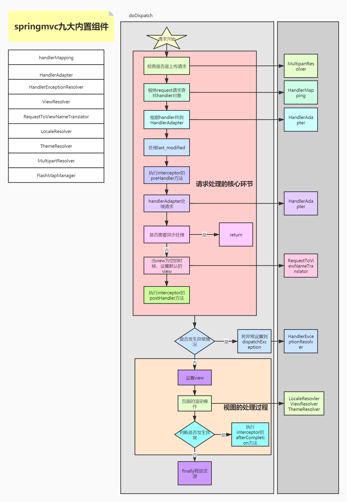
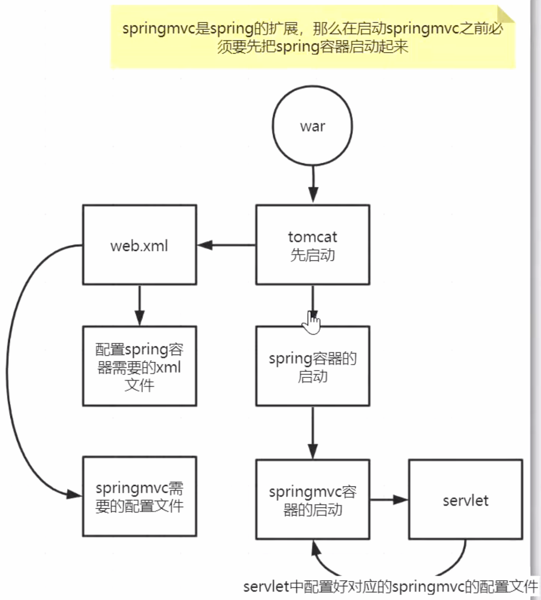
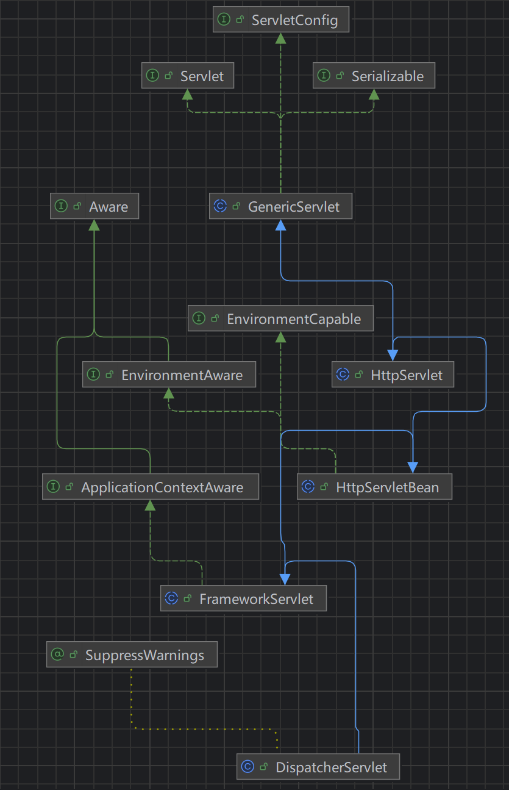

## springmvc

整个springmvc实际上就是一个特殊的servlet



## 启动流程

tomcat负责加载web.xml的配置文件

- spring容器启动加载spring.xml文件
- springmvc容器启动加载springmvc.xml文件，springmvc容器继承spring容器，可以使用父容器的bean。




### spring容器启动

整个`web.xml`文件通过tomcat进行读取解析，`listener`标签中的`ContextLoaderListener`负责spring容器的启动。

- tomcat调度执行`ContextLoaderListener`中的`contextInitialized`方法
- 执行父类`ContextLoader`中的`initWebApplicationContext`方法
- 通过`ContextLoader.properties`获取默认的spring容器类`XmlWebApplicationContext`
- 初始化设置`XmlWebApplicationContext`，调用`refresh`方法刷新容器

**web.xml文件**

```xml
<?xml version="1.0" encoding="UTF-8"?>
<web-app xmlns="http://xmlns.jcp.org/xml/ns/javaee"
         xmlns:xsi="http://www.w3.org/2001/XMLSchema-instance"
         xsi:schemaLocation="http://xmlns.jcp.org/xml/ns/javaee http://xmlns.jcp.org/xml/ns/javaee/web-app_4_0.xsd"
         version="4.0">
    
<!--    用于spring容器的文件配置-->
    <context-param>
        <param-name>contextConfigLocation</param-name>
        <param-value>classpath:spring-config.xml</param-value>
    </context-param>

<!--   DispatcherServlet配置 启动springmvc的入口-->
    <servlet>
        <servlet-name>mvc-test</servlet-name>
        <servlet-class>org.springframework.web.servlet.DispatcherServlet</servlet-class>
        <!--SpringMVC配置文件-->
        <init-param>
            <param-name>contextConfigLocation</param-name>
            <param-value>classpath:springmvc-config.xml</param-value>
        </init-param>
        <load-on-startup>1</load-on-startup>
        <multipart-config>
            <max-file-size>20848820</max-file-size>
            <max-request-size>418018841</max-request-size>
            <file-size-threshold>1048576</file-size-threshold>
        </multipart-config>
    </servlet>

    <servlet-mapping>
        <servlet-name>mvc-test</servlet-name>
        <url-pattern>/</url-pattern>
    </servlet-mapping>

<!--    启动spring容器的入口-->
    <listener>
        <listener-class>org.springframework.web.context.ContextLoaderListener</listener-class>
    </listener>
</web-app>
```

**ContextLoaderListener**

```java

public class ContextLoaderListener extends ContextLoader implements ServletContextListener {

	
	public ContextLoaderListener() {
	}

	
	public ContextLoaderListener(WebApplicationContext context) {
		super(context);
	}


    //tomcat负责调度当前listener，调用初始化方法contextInitialized
	/**
	 * Initialize the root web application context.
	 */
	@Override
	public void contextInitialized(ServletContextEvent event) {
		initWebApplicationContext(event.getServletContext());
	}


	/**
	 * Close the root web application context.
	 */
	@Override
	public void contextDestroyed(ServletContextEvent event) {
		closeWebApplicationContext(event.getServletContext());
		ContextCleanupListener.cleanupAttributes(event.getServletContext());
	}

}

```

**ContextLoader**

```java
public class ContextLoader {

	public static final String CONFIG_LOCATION_PARAM = "contextConfigLocation";

	public static final String CONTEXT_CLASS_PARAM = "contextClass";
    
	private static final String DEFAULT_STRATEGIES_PATH = "ContextLoader.properties";

	@Nullable
	private static Properties defaultStrategies;
    
	@Nullable
	private WebApplicationContext context;

    
    //创建初始化spring容器
	public WebApplicationContext initWebApplicationContext(ServletContext servletContext) {
		if (servletContext.getAttribute(WebApplicationContext.ROOT_WEB_APPLICATION_CONTEXT_ATTRIBUTE) != null) {
			throw new IllegalStateException(
					"Cannot initialize context because there is already a root application context present - " +
					"check whether you have multiple ContextLoader* definitions in your web.xml!");
		}

		servletContext.log("Initializing Spring root WebApplicationContext");
		Log logger = LogFactory.getLog(ContextLoader.class);
		if (logger.isInfoEnabled()) {
			logger.info("Root WebApplicationContext: initialization started");
		}
		long startTime = System.currentTimeMillis();

		try {
			// Store context in local instance variable, to guarantee that
			// it is available on ServletContext shutdown.
			if (this.context == null) {
                  //创建spring容器
				this.context = createWebApplicationContext(servletContext);
			}
			if (this.context instanceof ConfigurableWebApplicationContext cwac && !cwac.isActive()) {
				// The context has not yet been refreshed -> provide services such as
				// setting the parent context, setting the application context id, etc
                 //设置父类，没有设置为null
				if (cwac.getParent() == null) {
					// The context instance was injected without an explicit parent ->
					// determine parent for root web application context, if any.
					ApplicationContext parent = loadParentContext(servletContext);
					cwac.setParent(parent);
				}
                 //刷新spring容器
				configureAndRefreshWebApplicationContext(cwac, servletContext);
			}
			servletContext.setAttribute(WebApplicationContext.ROOT_WEB_APPLICATION_CONTEXT_ATTRIBUTE, this.context);

			ClassLoader ccl = Thread.currentThread().getContextClassLoader();
			if (ccl == ContextLoader.class.getClassLoader()) {
				currentContext = this.context;
			}
			else if (ccl != null) {
				currentContextPerThread.put(ccl, this.context);
			}

			if (logger.isInfoEnabled()) {
				long elapsedTime = System.currentTimeMillis() - startTime;
				logger.info("Root WebApplicationContext initialized in " + elapsedTime + " ms");
			}

			return this.context;
		}
		catch (RuntimeException | Error ex) {
			logger.error("Context initialization failed", ex);
			servletContext.setAttribute(WebApplicationContext.ROOT_WEB_APPLICATION_CONTEXT_ATTRIBUTE, ex);
			throw ex;
		}
	}
    
    //创建spring容器
	protected WebApplicationContext createWebApplicationContext(ServletContext sc) {
		Class<?> contextClass = determineContextClass(sc);
		if (!ConfigurableWebApplicationContext.class.isAssignableFrom(contextClass)) {
			throw new ApplicationContextException("Custom context class [" + contextClass.getName() +
					"] is not of type [" + ConfigurableWebApplicationContext.class.getName() + "]");
		}
         //反射创建spring容器
		return (ConfigurableWebApplicationContext) BeanUtils.instantiateClass(contextClass);
	}
    
    //获取spring容器的类
	protected Class<?> determineContextClass(ServletContext servletContext) {
        //如果设置了contextClass属性标签 那么用contextClass的
		String contextClassName = servletContext.getInitParameter(CONTEXT_CLASS_PARAM);
		if (contextClassName != null) {
			try {
				return ClassUtils.forName(contextClassName, ClassUtils.getDefaultClassLoader());
			}
			catch (ClassNotFoundException ex) {
				throw new ApplicationContextException(
						"Failed to load custom context class [" + contextClassName + "]", ex);
			}
		}
		else {
			if (defaultStrategies == null) {
				// Load default strategy implementations from properties file.
				// This is currently strictly internal and not meant to be customized
				// by application developers.
				try {
                      //通过ContextLoader.properties获取默认的spring容器类
					ClassPathResource resource = new ClassPathResource(DEFAULT_STRATEGIES_PATH, ContextLoader.class);
					defaultStrategies = PropertiesLoaderUtils.loadProperties(resource);
				}
				catch (IOException ex) {
					throw new IllegalStateException("Could not load 'ContextLoader.properties': " + ex.getMessage());
				}
			}
             //默认是XmlWebApplicationContext
			contextClassName = defaultStrategies.getProperty(WebApplicationContext.class.getName());
			try {
				return ClassUtils.forName(contextClassName, ContextLoader.class.getClassLoader());
			}
			catch (ClassNotFoundException ex) {
				throw new ApplicationContextException(
						"Failed to load default context class [" + contextClassName + "]", ex);
			}
		}
	}
    
	protected void configureAndRefreshWebApplicationContext(ConfigurableWebApplicationContext wac, ServletContext sc) {
	    //设置spring容器的id
        if (ObjectUtils.identityToString(wac).equals(wac.getId())) {
			// The application context id is still set to its original default value
			// -> assign a more useful id based on available information
			String idParam = sc.getInitParameter(CONTEXT_ID_PARAM);
			if (idParam != null) {
				wac.setId(idParam);
			}
			else {
				// Generate default id...
				wac.setId(ConfigurableWebApplicationContext.APPLICATION_CONTEXT_ID_PREFIX +
						ObjectUtils.getDisplayString(sc.getContextPath()));
			}
		}

        //设置servlet上下文
		wac.setServletContext(sc);
         //获取web.xml中配置的spring容器的配置文件contextConfigLocation
		String configLocationParam = sc.getInitParameter(CONFIG_LOCATION_PARAM);
		if (configLocationParam != null) {
             //设置到spring容器中
			wac.setConfigLocation(configLocationParam);
		}

		// The wac environment's #initPropertySources will be called in any case when the context
		// is refreshed; do it eagerly here to ensure servlet property sources are in place for
		// use in any post-processing or initialization that occurs below prior to #refresh
		ConfigurableEnvironment env = wac.getEnvironment();
		if (env instanceof ConfigurableWebEnvironment cwe) {
			cwe.initPropertySources(sc, null);
		}

		customizeContext(sc, wac);
         //容器刷新
		wac.refresh();
	}


}
```


### springmvc容器启动

springmvc容器的入口是基于`DispatcherServlet`的初始化

- `DispatcherServlet`继承了`FrameworkServlet`，`FrameworkServlet`继承了`HttpServletBean`，tomcat启动调用`HttpServletBean`的`init`方法
- `FrameworkServlet`中重写了`initServletBean`方法，对springmvc容器进行创建，将spring作为父容器设置到springmvc容器中
- 刷新springmvc容器，加载配置文件。




**HttpServletBean**

```java
public abstract class HttpServletBean extends HttpServlet implements EnvironmentCapable, EnvironmentAware {
    
    //tomcat启动调用`HttpServletBean`的`init`方法
	@Override
	public final void init() throws ServletException {

         //将requiredProperties中的属性包装进入当前DispatcherServlet中
		// Set bean properties from init parameters.
		PropertyValues pvs = new ServletConfigPropertyValues(getServletConfig(), this.requiredProperties);
		if (!pvs.isEmpty()) {
			try {
				BeanWrapper bw = PropertyAccessorFactory.forBeanPropertyAccess(this);
				ResourceLoader resourceLoader = new ServletContextResourceLoader(getServletContext());
				bw.registerCustomEditor(Resource.class, new ResourceEditor(resourceLoader, getEnvironment()));
				initBeanWrapper(bw);
				bw.setPropertyValues(pvs, true);
			}
			catch (BeansException ex) {
				if (logger.isErrorEnabled()) {
					logger.error("Failed to set bean properties on servlet '" + getServletName() + "'", ex);
				}
				throw ex;
			}
		}

        //初始化springmvc容器
		// Let subclasses do whatever initialization they like.
		initServletBean();
	}
    
    
    protected void initServletBean() throws ServletException {
	}
}
```


**FrameworkServlet**

```java
public abstract class FrameworkServlet extends HttpServletBean implements ApplicationContextAware {

    
	@Override
	protected final void initServletBean() throws ServletException {
		getServletContext().log("Initializing Spring " + getClass().getSimpleName() + " '" + getServletName() + "'");
		if (logger.isInfoEnabled()) {
			logger.info("Initializing Servlet '" + getServletName() + "'");
		}
		long startTime = System.currentTimeMillis();

		try {
             //创建springmvc容器
			this.webApplicationContext = initWebApplicationContext();
			initFrameworkServlet();
		}
		catch (ServletException | RuntimeException ex) {
			logger.error("Context initialization failed", ex);
			throw ex;
		}

		if (logger.isDebugEnabled()) {
			String value = this.enableLoggingRequestDetails ?
					"shown which may lead to unsafe logging of potentially sensitive data" :
					"masked to prevent unsafe logging of potentially sensitive data";
			logger.debug("enableLoggingRequestDetails='" + this.enableLoggingRequestDetails +
					"': request parameters and headers will be " + value);
		}

		if (logger.isInfoEnabled()) {
			logger.info("Completed initialization in " + (System.currentTimeMillis() - startTime) + " ms");
		}
	}

	protected WebApplicationContext initWebApplicationContext() {
        //获取spring容器当作父容器
		WebApplicationContext rootContext =
				WebApplicationContextUtils.getWebApplicationContext(getServletContext());
		WebApplicationContext wac = null;

        //如果有springmvc容器 直接初始化
		if (this.webApplicationContext != null) {
			// A context instance was injected at construction time -> use it
			wac = this.webApplicationContext;
			if (wac instanceof ConfigurableWebApplicationContext cwac && !cwac.isActive()) {
				// The context has not yet been refreshed -> provide services such as
				// setting the parent context, setting the application context id, etc
				if (cwac.getParent() == null) {
					// The context instance was injected without an explicit parent -> set
					// the root application context (if any; may be null) as the parent
					cwac.setParent(rootContext);
				}
				configureAndRefreshWebApplicationContext(cwac);
			}
		}
         //没有springmvc容器，在属性中查找一下
		if (wac == null) {
			// No context instance was injected at construction time -> see if one
			// has been registered in the servlet context. If one exists, it is assumed
			// that the parent context (if any) has already been set and that the
			// user has performed any initialization such as setting the context id
			wac = findWebApplicationContext();
		}
        //没有springmvc容器，创建
		if (wac == null) {
			// No context instance is defined for this servlet -> create a local one
			wac = createWebApplicationContext(rootContext);
		}

		if (!this.refreshEventReceived) {
			// Either the context is not a ConfigurableApplicationContext with refresh
			// support or the context injected at construction time had already been
			// refreshed -> trigger initial onRefresh manually here.
			synchronized (this.onRefreshMonitor) {
				onRefresh(wac);
			}
		}

		if (this.publishContext) {
			// Publish the context as a servlet context attribute.
			String attrName = getServletContextAttributeName();
			getServletContext().setAttribute(attrName, wac);
		}

		return wac;
	}

    
    //创建一个springmvc容器
	protected WebApplicationContext createWebApplicationContext(@Nullable ApplicationContext parent) {
        //获取到XmlWebApplicationContext
		Class<?> contextClass = getContextClass();
		if (!ConfigurableWebApplicationContext.class.isAssignableFrom(contextClass)) {
			throw new ApplicationContextException(
					"Fatal initialization error in servlet with name '" + getServletName() +
					"': custom WebApplicationContext class [" + contextClass.getName() +
					"] is not of type ConfigurableWebApplicationContext");
		}
         //创建XmlWebApplicationContext
		ConfigurableWebApplicationContext wac =
				(ConfigurableWebApplicationContext) BeanUtils.instantiateClass(contextClass);

        //设置环境
		wac.setEnvironment(getEnvironment());
        //将spring容器设置为springmvc的父容器
		wac.setParent(parent);
        //设置contextConfigLocation中的配置文件
		String configLocation = getContextConfigLocation();
		if (configLocation != null) {
			wac.setConfigLocation(configLocation);
		}
        //配置刷新springmvc容器
		configureAndRefreshWebApplicationContext(wac);

		return wac;
	}
    
    //配置刷新springmvc容器
	protected void configureAndRefreshWebApplicationContext(ConfigurableWebApplicationContext wac) {
		if (ObjectUtils.identityToString(wac).equals(wac.getId())) {
			// The application context id is still set to its original default value
			// -> assign a more useful id based on available information
			if (this.contextId != null) {
				wac.setId(this.contextId);
			}
			else {
				// Generate default id...
				wac.setId(ConfigurableWebApplicationContext.APPLICATION_CONTEXT_ID_PREFIX +
						ObjectUtils.getDisplayString(getServletContext().getContextPath()) + '/' + getServletName());
			}
		}
		//设置servlet上下文
		wac.setServletContext(getServletContext());
        //设置当前DispatchServlet的配置
		wac.setServletConfig(getServletConfig());
		wac.setNamespace(getNamespace());
        //设置一个ContextRefreshEvent时间的监听器
		wac.addApplicationListener(new SourceFilteringListener(wac, new ContextRefreshListener()));

		// The wac environment's #initPropertySources will be called in any case when the context
		// is refreshed; do it eagerly here to ensure servlet property sources are in place for
		// use in any post-processing or initialization that occurs below prior to #refresh
		ConfigurableEnvironment env = wac.getEnvironment();
		if (env instanceof ConfigurableWebEnvironment cwe) {
			cwe.initPropertySources(getServletContext(), getServletConfig());
		}

		postProcessWebApplicationContext(wac);
		applyInitializers(wac);
        //刷新springmvc容器
		wac.refresh();
	}
    
}
```


### 初始化九大内置组件

- 在springmvc容器刷新时，加入`SourceFilteringListener`监听器，用于在`ContextRefreshedEvent`事件触发时回调

- `ContextRefreshListener`中调用`FrameworkServlet.this.onApplicationEvent(event);`方法

- 调用`DispatcherServlet`中的`onRefresh`方法，再调用`initStrategies`方法对九大内置组件进行初始化

  **`initMultipartResolver`**：初始化 **文件上传解析器**，用于识别和处理 `multipart/form-data` 类型的请求（例如表单文件上传）。

  **`initLocaleResolver`**：初始化 **区域解析器**，根据请求头、Cookie 或 Session 判断当前用户的语言和地区设置，用于国际化。

  **`initThemeResolver`**：初始化 **主题解析器**，决定当前 Web 应用使用的主题（如样式、配色、模板资源等）。

  **`initHandlerMappings`**：初始化 **处理器映射器**，将请求的 URL 与对应的控制器（Handler）建立映射关系，用来找到执行请求的控制器。

  **`initHandlerAdapters`**：初始化 **处理器适配器**，负责调用不同类型的控制器方法，将请求参数绑定并执行对应的业务逻辑。

  **`initHandlerExceptionResolvers`**：初始化 **异常解析器**，在控制器抛出异常时负责捕获并将其转换为合适的错误响应或视图。

  **`initRequestToViewNameTranslator`**：初始化 **请求到视图名转换器**，在控制器未显式返回视图名时自动根据请求路径推断视图名称。

  **`initViewResolvers`**：初始化 **视图解析器**，根据控制器返回的视图名解析出具体的视图资源（如 JSP、Thymeleaf、Freemarker 模板等）。

  **`initFlashMapManager`**：初始化 **Flash 属性管理器**，用于在重定向请求之间暂存一次性数据（如操作成功消息或表单参数）。

**SourceFilteringListener**

```java
public class SourceFilteringListener implements GenericApplicationListener {

    //触发事件
	@Override
	public void onApplicationEvent(ApplicationEvent event) {
        //触发事件的容器是否是springmvc容器
		if (event.getSource() == this.source) {
			onApplicationEventInternal(event);
		}
	}

	protected void onApplicationEventInternal(ApplicationEvent event) {
		if (this.delegate == null) {
			throw new IllegalStateException(
					"Must specify a delegate object or override the onApplicationEventInternal method");
		}
         //调用ContextRefreshListener
		this.delegate.onApplicationEvent(event);
	}

}
```

**FrameworkServlet**

```java
public abstract class FrameworkServlet extends HttpServletBean implements ApplicationContextAware {

	private class ContextRefreshListener implements ApplicationListener<ContextRefreshedEvent> {

		@Override
		public void onApplicationEvent(ContextRefreshedEvent event) {
            //调用FrameworkServlet中的onApplicationEvent
			FrameworkServlet.this.onApplicationEvent(event);
		}
	}

	public void onApplicationEvent(ContextRefreshedEvent event) {
		this.refreshEventReceived = true;
		synchronized (this.onRefreshMonitor) {
            //调用onRefresh
			onRefresh(event.getApplicationContext());
		}
	}
    //DispatcherServlet重写onRefresh
	protected void onRefresh(ApplicationContext context) {
		// For subclasses: do nothing by default.
	}
}
```

**DispatcherServlet**

```java
public class DispatcherServlet extends FrameworkServlet {

	@Override
	protected void onRefresh(ApplicationContext context) {
		initStrategies(context);
	}

    //初始化九大组件
	protected void initStrategies(ApplicationContext context) {
		initMultipartResolver(context);
		initLocaleResolver(context);
		initThemeResolver(context);
		initHandlerMappings(context);
		initHandlerAdapters(context);
		initHandlerExceptionResolvers(context);
		initRequestToViewNameTranslator(context);
		initViewResolvers(context);
		initFlashMapManager(context);
	}
    
    //初始化文件上传解析器
	private void initMultipartResolver(ApplicationContext context) {
		try {
			this.multipartResolver = context.getBean(MULTIPART_RESOLVER_BEAN_NAME, MultipartResolver.class);
			if (logger.isTraceEnabled()) {
				logger.trace("Detected " + this.multipartResolver);
			}
			else if (logger.isDebugEnabled()) {
				logger.debug("Detected " + this.multipartResolver.getClass().getSimpleName());
			}
		}
		catch (NoSuchBeanDefinitionException ex) {
			// Default is no multipart resolver.
			this.multipartResolver = null;
			if (logger.isTraceEnabled()) {
				logger.trace("No MultipartResolver '" + MULTIPART_RESOLVER_BEAN_NAME + "' declared");
			}
		}
	}
    
    //初始化区域解析器
    private void initLocaleResolver(ApplicationContext context) {
		try {
			this.localeResolver = context.getBean(LOCALE_RESOLVER_BEAN_NAME, LocaleResolver.class);
			if (logger.isTraceEnabled()) {
				logger.trace("Detected " + this.localeResolver);
			}
			else if (logger.isDebugEnabled()) {
				logger.debug("Detected " + this.localeResolver.getClass().getSimpleName());
			}
		}
		catch (NoSuchBeanDefinitionException ex) {
             //容器中没有的情况下通过DispatcherServlet.properties获取默认的
			// We need to use the default.
			this.localeResolver = getDefaultStrategy(context, LocaleResolver.class);
			if (logger.isTraceEnabled()) {
				logger.trace("No LocaleResolver '" + LOCALE_RESOLVER_BEAN_NAME +
						"': using default [" + this.localeResolver.getClass().getSimpleName() + "]");
			}
		}
	}
    //初始化主题解析器
	@Deprecated
	private void initThemeResolver(ApplicationContext context) {
		try {
			this.themeResolver = context.getBean(THEME_RESOLVER_BEAN_NAME, ThemeResolver.class);
			if (logger.isTraceEnabled()) {
				logger.trace("Detected " + this.themeResolver);
			}
			else if (logger.isDebugEnabled()) {
				logger.debug("Detected " + this.themeResolver.getClass().getSimpleName());
			}
		}
		catch (NoSuchBeanDefinitionException ex) {
			// We need to use the default.
			this.themeResolver = getDefaultStrategy(context, ThemeResolver.class);
			if (logger.isTraceEnabled()) {
				logger.trace("No ThemeResolver '" + THEME_RESOLVER_BEAN_NAME +
						"': using default [" + this.themeResolver.getClass().getSimpleName() + "]");
			}
		}
	}
    //初始化 处理器映射器
	private void initHandlerMappings(ApplicationContext context) {
		this.handlerMappings = null;

		if (this.detectAllHandlerMappings) {
			// Find all HandlerMappings in the ApplicationContext, including ancestor contexts.
			Map<String, HandlerMapping> matchingBeans =
					BeanFactoryUtils.beansOfTypeIncludingAncestors(context, HandlerMapping.class, true, false);
			if (!matchingBeans.isEmpty()) {
				this.handlerMappings = new ArrayList<>(matchingBeans.values());
				// We keep HandlerMappings in sorted order.
				AnnotationAwareOrderComparator.sort(this.handlerMappings);
			}
		}
		else {
			try {
				HandlerMapping hm = context.getBean(HANDLER_MAPPING_BEAN_NAME, HandlerMapping.class);
				this.handlerMappings = Collections.singletonList(hm);
			}
			catch (NoSuchBeanDefinitionException ex) {
				// Ignore, we'll add a default HandlerMapping later.
			}
		}

		// Ensure we have at least one HandlerMapping, by registering
		// a default HandlerMapping if no other mappings are found.
		if (this.handlerMappings == null) {
			this.handlerMappings = getDefaultStrategies(context, HandlerMapping.class);
			if (logger.isTraceEnabled()) {
				logger.trace("No HandlerMappings declared for servlet '" + getServletName() +
						"': using default strategies from DispatcherServlet.properties");
			}
		}

		for (HandlerMapping mapping : this.handlerMappings) {
			if (mapping.usesPathPatterns()) {
				this.parseRequestPath = true;
				break;
			}
		}
	}

	/**
	 * Initialize the HandlerAdapters used by this class.
	 * <p>If no HandlerAdapter beans are defined in the BeanFactory for this namespace,
	 * we default to SimpleControllerHandlerAdapter.
	 */
    //初始化 处理器适配器
	private void initHandlerAdapters(ApplicationContext context) {
		this.handlerAdapters = null;

		if (this.detectAllHandlerAdapters) {
			// Find all HandlerAdapters in the ApplicationContext, including ancestor contexts.
			Map<String, HandlerAdapter> matchingBeans =
					BeanFactoryUtils.beansOfTypeIncludingAncestors(context, HandlerAdapter.class, true, false);
			if (!matchingBeans.isEmpty()) {
				this.handlerAdapters = new ArrayList<>(matchingBeans.values());
				// We keep HandlerAdapters in sorted order.
				AnnotationAwareOrderComparator.sort(this.handlerAdapters);
			}
		}
		else {
			try {
				HandlerAdapter ha = context.getBean(HANDLER_ADAPTER_BEAN_NAME, HandlerAdapter.class);
				this.handlerAdapters = Collections.singletonList(ha);
			}
			catch (NoSuchBeanDefinitionException ex) {
				// Ignore, we'll add a default HandlerAdapter later.
			}
		}

		// Ensure we have at least some HandlerAdapters, by registering
		// default HandlerAdapters if no other adapters are found.
		if (this.handlerAdapters == null) {
			this.handlerAdapters = getDefaultStrategies(context, HandlerAdapter.class);
			if (logger.isTraceEnabled()) {
				logger.trace("No HandlerAdapters declared for servlet '" + getServletName() +
						"': using default strategies from DispatcherServlet.properties");
			}
		}
	}

	/**
	 * Initialize the HandlerExceptionResolver used by this class.
	 * <p>If no bean is defined with the given name in the BeanFactory for this namespace,
	 * we default to no exception resolver.
	 */
    //初始化异常解析器
	private void initHandlerExceptionResolvers(ApplicationContext context) {
		this.handlerExceptionResolvers = null;

		if (this.detectAllHandlerExceptionResolvers) {
			// Find all HandlerExceptionResolvers in the ApplicationContext, including ancestor contexts.
			Map<String, HandlerExceptionResolver> matchingBeans = BeanFactoryUtils
					.beansOfTypeIncludingAncestors(context, HandlerExceptionResolver.class, true, false);
			if (!matchingBeans.isEmpty()) {
				this.handlerExceptionResolvers = new ArrayList<>(matchingBeans.values());
				// We keep HandlerExceptionResolvers in sorted order.
				AnnotationAwareOrderComparator.sort(this.handlerExceptionResolvers);
			}
		}
		else {
			try {
				HandlerExceptionResolver her =
						context.getBean(HANDLER_EXCEPTION_RESOLVER_BEAN_NAME, HandlerExceptionResolver.class);
				this.handlerExceptionResolvers = Collections.singletonList(her);
			}
			catch (NoSuchBeanDefinitionException ex) {
				// Ignore, no HandlerExceptionResolver is fine too.
			}
		}

		// Ensure we have at least some HandlerExceptionResolvers, by registering
		// default HandlerExceptionResolvers if no other resolvers are found.
		if (this.handlerExceptionResolvers == null) {
			this.handlerExceptionResolvers = getDefaultStrategies(context, HandlerExceptionResolver.class);
			if (logger.isTraceEnabled()) {
				logger.trace("No HandlerExceptionResolvers declared in servlet '" + getServletName() +
						"': using default strategies from DispatcherServlet.properties");
			}
		}
	}

	/**
	 * Initialize the RequestToViewNameTranslator used by this servlet instance.
	 * <p>If no implementation is configured then we default to DefaultRequestToViewNameTranslator.
	 */
    //初始化请求到视图名转换器
	private void initRequestToViewNameTranslator(ApplicationContext context) {
		try {
			this.viewNameTranslator =
					context.getBean(REQUEST_TO_VIEW_NAME_TRANSLATOR_BEAN_NAME, RequestToViewNameTranslator.class);
			if (logger.isTraceEnabled()) {
				logger.trace("Detected " + this.viewNameTranslator.getClass().getSimpleName());
			}
			else if (logger.isDebugEnabled()) {
				logger.debug("Detected " + this.viewNameTranslator);
			}
		}
		catch (NoSuchBeanDefinitionException ex) {
			// We need to use the default.
			this.viewNameTranslator = getDefaultStrategy(context, RequestToViewNameTranslator.class);
			if (logger.isTraceEnabled()) {
				logger.trace("No RequestToViewNameTranslator '" + REQUEST_TO_VIEW_NAME_TRANSLATOR_BEAN_NAME +
						"': using default [" + this.viewNameTranslator.getClass().getSimpleName() + "]");
			}
		}
	}

	/**
	 * Initialize the ViewResolvers used by this class.
	 * <p>If no ViewResolver beans are defined in the BeanFactory for this
	 * namespace, we default to InternalResourceViewResolver.
	 */
    //初始化视图解析器
	private void initViewResolvers(ApplicationContext context) {
		this.viewResolvers = null;

		if (this.detectAllViewResolvers) {
			// Find all ViewResolvers in the ApplicationContext, including ancestor contexts.
			Map<String, ViewResolver> matchingBeans =
					BeanFactoryUtils.beansOfTypeIncludingAncestors(context, ViewResolver.class, true, false);
			if (!matchingBeans.isEmpty()) {
				this.viewResolvers = new ArrayList<>(matchingBeans.values());
				// We keep ViewResolvers in sorted order.
				AnnotationAwareOrderComparator.sort(this.viewResolvers);
			}
		}
		else {
			try {
				ViewResolver vr = context.getBean(VIEW_RESOLVER_BEAN_NAME, ViewResolver.class);
				this.viewResolvers = Collections.singletonList(vr);
			}
			catch (NoSuchBeanDefinitionException ex) {
				// Ignore, we'll add a default ViewResolver later.
			}
		}

		// Ensure we have at least one ViewResolver, by registering
		// a default ViewResolver if no other resolvers are found.
		if (this.viewResolvers == null) {
			this.viewResolvers = getDefaultStrategies(context, ViewResolver.class);
			if (logger.isTraceEnabled()) {
				logger.trace("No ViewResolvers declared for servlet '" + getServletName() +
						"': using default strategies from DispatcherServlet.properties");
			}
		}
	}

	/**
	 * Initialize the {@link FlashMapManager} used by this servlet instance.
	 * <p>If no implementation is configured then we default to
	 * {@code org.springframework.web.servlet.support.DefaultFlashMapManager}.
	 */
    //初始化Flash 属性管理器
	private void initFlashMapManager(ApplicationContext context) {
		try {
			this.flashMapManager = context.getBean(FLASH_MAP_MANAGER_BEAN_NAME, FlashMapManager.class);
			if (logger.isTraceEnabled()) {
				logger.trace("Detected " + this.flashMapManager.getClass().getSimpleName());
			}
			else if (logger.isDebugEnabled()) {
				logger.debug("Detected " + this.flashMapManager);
			}
		}
		catch (NoSuchBeanDefinitionException ex) {
			// We need to use the default.
			this.flashMapManager = getDefaultStrategy(context, FlashMapManager.class);
			if (logger.isTraceEnabled()) {
				logger.trace("No FlashMapManager '" + FLASH_MAP_MANAGER_BEAN_NAME +
						"': using default [" + this.flashMapManager.getClass().getSimpleName() + "]");
			}
		}
	}


}
```


#### DispatcherServlet.properties

```properties
# Default implementation classes for DispatcherServlet's strategy interfaces.
# Used as fallback when no matching beans are found in the DispatcherServlet context.
# Not meant to be customized by application developers.

org.springframework.web.servlet.LocaleResolver=org.springframework.web.servlet.i18n.AcceptHeaderLocaleResolver

org.springframework.web.servlet.ThemeResolver=org.springframework.web.servlet.theme.FixedThemeResolver

org.springframework.web.servlet.HandlerMapping=org.springframework.web.servlet.handler.BeanNameUrlHandlerMapping,\
    org.springframework.web.servlet.mvc.method.annotation.RequestMappingHandlerMapping,\
    org.springframework.web.servlet.function.support.RouterFunctionMapping

org.springframework.web.servlet.HandlerAdapter=org.springframework.web.servlet.mvc.HttpRequestHandlerAdapter,\
    org.springframework.web.servlet.mvc.SimpleControllerHandlerAdapter,\
    org.springframework.web.servlet.mvc.method.annotation.RequestMappingHandlerAdapter,\
    org.springframework.web.servlet.function.support.HandlerFunctionAdapter


org.springframework.web.servlet.HandlerExceptionResolver=org.springframework.web.servlet.mvc.method.annotation.ExceptionHandlerExceptionResolver,\
    org.springframework.web.servlet.mvc.annotation.ResponseStatusExceptionResolver,\
    org.springframework.web.servlet.mvc.support.DefaultHandlerExceptionResolver

org.springframework.web.servlet.RequestToViewNameTranslator=org.springframework.web.servlet.view.DefaultRequestToViewNameTranslator

org.springframework.web.servlet.ViewResolver=org.springframework.web.servlet.view.InternalResourceViewResolver

org.springframework.web.servlet.FlashMapManager=org.springframework.web.servlet.support.SessionFlashMapManager
```


## 请求处理流程

1. 当接收到对应的请求时，由`tomcat`调用`DispatcherServlet`中的`service`方法，不同请求类型的最终处理方式都是`processRequest`，再调用`doService`中的`doDispatch`
2. 处理`mutipart`类型的请求
   1. 检查当前请求的`content-type`是否是`multipart/form-data`类型
   2. 将普通请求包装成`StandardMultipartHttpServletRequest`类型，并且将其中的普通参数和文件参数解析分别保存
3. 获取`url`对应的`handler`
   1. 先从`BeanNameUrlHandlerMapping`中获取
      1. 解析出请求的`uri`，根据`uri`直接匹配对应的`handler`
      2. 找不到的话就根据`pathPatternHandlerMap`匹配`uri`的路径
      3. 找不到的话判断是否是`/`匹配根`handler`，还没有就匹配默认的`handler`
   2. 从`RequestMappingHandlerMapping`中获取
      1. 解析出请求的`uri`，根据`uri`直接匹配对应的`handler`
      2. 如果找到匹配的handler，那么就检查是否与`@RequstMapping`注解中的限制符合
         1. 检查`RequestMethod`是否匹配，不匹配去掉当前handler
         2. 检查`params`属性中的表达式是否匹配，不匹配去掉handler
         3. 检查`headers`属性中的表达式是否匹配，不匹配去掉handler
         4. 检查`consumes`属性是否匹配，不匹配去掉handler
         5. 检查`produces`属性是否匹配，不匹配去掉handler
         6. 检查自定义的`condition`是否匹配，不匹配去掉handler
      3. 如果有多个匹配的handler，排序找出最匹配的handler，如果有两个以上并列就报错。
      4. 返回最佳匹配handler
   3. 如果没找到handler，获取默认的handler
   4. 将handler封装成`HandlerExecutionChain`对象，将`adaptedInterceptors`中的`MappedInterceptor`类型都添加到`HandlerExecutionChain`
   5. 如果请求方法上含有跨域配置，读取跨域配置，添加`CorsInterceptor`到`HandlerExecutionChain`中


```JAVA
public abstract class FrameworkServlet extends HttpServletBean implements ApplicationContextAware {
    
	private static final Set<String> HTTP_SERVLET_METHODS =
			Set.of("DELETE", "HEAD", "GET", "OPTIONS", "POST", "PUT", "TRACE");

    
	@Override
	protected void service(HttpServletRequest request, HttpServletResponse response)
			throws ServletException, IOException {

		if (HTTP_SERVLET_METHODS.contains(request.getMethod())) {
             //常规请求走这里
			super.service(request, response);
		}
		else {
			processRequest(request, response);
		}
	}

}
```

```java
public abstract class HttpServlet extends GenericServlet {

    //根据不同的请求方法进行处理
    protected void service(HttpServletRequest req, HttpServletResponse resp) throws ServletException, IOException {
        String method = req.getMethod();

        if (method.equals(METHOD_GET)) {
            long lastModified = getLastModified(req);
            if (lastModified == -1) {
                // servlet doesn't support if-modified-since, no reason
                // to go through further expensive logic
                doGet(req, resp);
            } else {
                long ifModifiedSince = req.getDateHeader(HEADER_IFMODSINCE);
                if (ifModifiedSince < lastModified) {
                    // If the servlet mod time is later, call doGet()
                    // Round down to the nearest second for a proper compare
                    // A ifModifiedSince of -1 will always be less
                    maybeSetLastModified(resp, lastModified);
                    doGet(req, resp);
                } else {
                    resp.setStatus(HttpServletResponse.SC_NOT_MODIFIED);
                }
            }

        } else if (method.equals(METHOD_HEAD)) {
            long lastModified = getLastModified(req);
            maybeSetLastModified(resp, lastModified);
            doHead(req, resp);

        } else if (method.equals(METHOD_POST)) {
            doPost(req, resp);

        } else if (method.equals(METHOD_PUT)) {
            doPut(req, resp);

        } else if (method.equals(METHOD_DELETE)) {
            doDelete(req, resp);

        } else if (method.equals(METHOD_OPTIONS)) {
            doOptions(req, resp);

        } else if (method.equals(METHOD_TRACE)) {
            doTrace(req, resp);

        } else if (method.equals(METHOD_PATCH)) {
            doPatch(req, resp);

        } else {
            //
            // Note that this means NO servlet supports whatever
            // method was requested, anywhere on this server.
            //

            String errMsg = lStrings.getString("http.method_not_implemented");
            Object[] errArgs = new Object[1];
            errArgs[0] = method;
            errMsg = MessageFormat.format(errMsg, errArgs);

            resp.sendError(HttpServletResponse.SC_NOT_IMPLEMENTED, errMsg);
        }
    }

    //几个常见方法的处理都是由processRequest来处理
	@Override
	protected final void doGet(HttpServletRequest request, HttpServletResponse response)
			throws ServletException, IOException {

		processRequest(request, response);
	}

	/**
	 * Delegate POST requests to {@link #processRequest}.
	 * @see #doService
	 */
	@Override
	protected final void doPost(HttpServletRequest request, HttpServletResponse response)
			throws ServletException, IOException {

		processRequest(request, response);
	}

	/**
	 * Delegate PUT requests to {@link #processRequest}.
	 * @see #doService
	 */
	@Override
	protected final void doPut(HttpServletRequest request, HttpServletResponse response)
			throws ServletException, IOException {

		processRequest(request, response);
	}

	/**
	 * Delegate DELETE requests to {@link #processRequest}.
	 * @see #doService
	 */
	@Override
	protected final void doDelete(HttpServletRequest request, HttpServletResponse response)
			throws ServletException, IOException {

		processRequest(request, response);
	}

	protected final void processRequest(HttpServletRequest request, HttpServletResponse response)
			throws ServletException, IOException {

		long startTime = System.currentTimeMillis();
		Throwable failureCause = null;

         //保留旧的LocaleContext和RequestAttributes
		LocaleContext previousLocaleContext = LocaleContextHolder.getLocaleContext();
		LocaleContext localeContext = buildLocaleContext(request);

		RequestAttributes previousAttributes = RequestContextHolder.getRequestAttributes();
		ServletRequestAttributes requestAttributes = buildRequestAttributes(request, response, previousAttributes);

		WebAsyncManager asyncManager = WebAsyncUtils.getAsyncManager(request);
		asyncManager.registerCallableInterceptor(FrameworkServlet.class.getName(), new RequestBindingInterceptor());

         //将新的LocaleContext和RequestAttributes设置到上下文中
		initContextHolders(request, localeContext, requestAttributes);

		try {
             //实际处理请求的方法
			doService(request, response);
		}
		catch (ServletException | IOException ex) {
			failureCause = ex;
			throw ex;
		}
		catch (Throwable ex) {
			failureCause = ex;
			throw new ServletException("Request processing failed: " + ex, ex);
		}

		finally {
			resetContextHolders(request, previousLocaleContext, previousAttributes);
			if (requestAttributes != null) {
				requestAttributes.requestCompleted();
			}
			logResult(request, response, failureCause, asyncManager);
			publishRequestHandledEvent(request, response, startTime, failureCause);
		}
	}
    
}
```


```java
public class DispatcherServlet extends FrameworkServlet {
    
	@Override
	protected void doService(HttpServletRequest request, HttpServletResponse response) throws Exception {
		logRequest(request);

		// Keep a snapshot of the request attributes in case of an include,
		// to be able to restore the original attributes after the include.
		Map<String, Object> attributesSnapshot = null;
		if (WebUtils.isIncludeRequest(request)) {
			attributesSnapshot = new HashMap<>();
			Enumeration<?> attrNames = request.getAttributeNames();
			while (attrNames.hasMoreElements()) {
				String attrName = (String) attrNames.nextElement();
				if (this.cleanupAfterInclude || attrName.startsWith(DEFAULT_STRATEGIES_PREFIX)) {
					attributesSnapshot.put(attrName, request.getAttribute(attrName));
				}
			}
		}

        //设置属性到request上 
		// Make framework objects available to handlers and view objects.
		request.setAttribute(WEB_APPLICATION_CONTEXT_ATTRIBUTE, getWebApplicationContext());
		request.setAttribute(LOCALE_RESOLVER_ATTRIBUTE, this.localeResolver);
		request.setAttribute(THEME_RESOLVER_ATTRIBUTE, this.themeResolver);
		request.setAttribute(THEME_SOURCE_ATTRIBUTE, getThemeSource());

        //初始化FlashMap 用于重定向到本地时的参数携带
		if (this.flashMapManager != null) {
			FlashMap inputFlashMap = this.flashMapManager.retrieveAndUpdate(request, response);
			if (inputFlashMap != null) {
				request.setAttribute(INPUT_FLASH_MAP_ATTRIBUTE, Collections.unmodifiableMap(inputFlashMap));
			}
			request.setAttribute(OUTPUT_FLASH_MAP_ATTRIBUTE, new FlashMap());
			request.setAttribute(FLASH_MAP_MANAGER_ATTRIBUTE, this.flashMapManager);
		}

        //解析请求路径
		RequestPath previousRequestPath = null;
		if (this.parseRequestPath) {
			previousRequestPath = (RequestPath) request.getAttribute(ServletRequestPathUtils.PATH_ATTRIBUTE);
			ServletRequestPathUtils.parseAndCache(request);
		}

		try {
             //核心处理方法
			doDispatch(request, response);
		}
		finally {
			if (!WebAsyncUtils.getAsyncManager(request).isConcurrentHandlingStarted()) {
				// Restore the original attribute snapshot, in case of an include.
				if (attributesSnapshot != null) {
					restoreAttributesAfterInclude(request, attributesSnapshot);
				}
			}
			if (this.parseRequestPath) {
				ServletRequestPathUtils.setParsedRequestPath(previousRequestPath, request);
			}
		}
	}
    
	protected void doDispatch(HttpServletRequest request, HttpServletResponse response) throws Exception {
		HttpServletRequest processedRequest = request;
		HandlerExecutionChain mappedHandler = null;
		boolean multipartRequestParsed = false;

		WebAsyncManager asyncManager = WebAsyncUtils.getAsyncManager(request);

		try {
			ModelAndView mv = null;
			Exception dispatchException = null;

			try {
                 //检查是否是mutipart类型的请求
				processedRequest = checkMultipart(request);
                 //是否是mutipart请求
				multipartRequestParsed = (processedRequest != request);
				//获取当前请求的处理器
				// Determine handler for the current request.
				mappedHandler = getHandler(processedRequest);
				if (mappedHandler == null) {
					noHandlerFound(processedRequest, response);
					return;
				}
				
                 //获取当前handler的适配器
				// Determine handler adapter for the current request.
				HandlerAdapter ha = getHandlerAdapter(mappedHandler.getHandler());

                 //处理http缓存相关
				// Process last-modified header, if supported by the handler.
				String method = request.getMethod();
				boolean isGet = HttpMethod.GET.matches(method);
				if (isGet || HttpMethod.HEAD.matches(method)) {
					long lastModified = ha.getLastModified(request, mappedHandler.getHandler());
					if (new ServletWebRequest(request, response).checkNotModified(lastModified) && isGet) {
						return;
					}
				}
				//调用拦截器的preHandle方法
				if (!mappedHandler.applyPreHandle(processedRequest, response)) {
					return;
				}

				// Actually invoke the handler.
				mv = ha.handle(processedRequest, response, mappedHandler.getHandler());

				if (asyncManager.isConcurrentHandlingStarted()) {
					return;
				}

				applyDefaultViewName(processedRequest, mv);
				mappedHandler.applyPostHandle(processedRequest, response, mv);
			}
			catch (Exception ex) {
				dispatchException = ex;
			}
			catch (Throwable err) {
				// As of 4.3, we're processing Errors thrown from handler methods as well,
				// making them available for @ExceptionHandler methods and other scenarios.
				dispatchException = new ServletException("Handler dispatch failed: " + err, err);
			}
			processDispatchResult(processedRequest, response, mappedHandler, mv, dispatchException);
		}
		catch (Exception ex) {
			triggerAfterCompletion(processedRequest, response, mappedHandler, ex);
		}
		catch (Throwable err) {
			triggerAfterCompletion(processedRequest, response, mappedHandler,
					new ServletException("Handler processing failed: " + err, err));
		}
		finally {
			if (asyncManager.isConcurrentHandlingStarted()) {
				// Instead of postHandle and afterCompletion
				if (mappedHandler != null) {
					mappedHandler.applyAfterConcurrentHandlingStarted(processedRequest, response);
				}
				asyncManager.setMultipartRequestParsed(multipartRequestParsed);
			}
			else {
				// Clean up any resources used by a multipart request.
				if (multipartRequestParsed || asyncManager.isMultipartRequestParsed()) {
					cleanupMultipart(processedRequest);
				}
			}
		}
	}

}
```


### 文件上传解析器

#### 初始化

```java
public class DispatcherServlet extends FrameworkServlet {
    
	public static final String MULTIPART_RESOLVER_BEAN_NAME = "multipartResolver";

    //初始化multipartResolver
	private void initMultipartResolver(ApplicationContext context) {
		try {
			this.multipartResolver = context.getBean(MULTIPART_RESOLVER_BEAN_NAME, MultipartResolver.class);
			if (logger.isTraceEnabled()) {
				logger.trace("Detected " + this.multipartResolver);
			}
			else if (logger.isDebugEnabled()) {
				logger.debug("Detected " + this.multipartResolver.getClass().getSimpleName());
			}
		}
		catch (NoSuchBeanDefinitionException ex) {
			// Default is no multipart resolver.
			this.multipartResolver = null;
			if (logger.isTraceEnabled()) {
				logger.trace("No MultipartResolver '" + MULTIPART_RESOLVER_BEAN_NAME + "' declared");
			}
		}
	}
    
    //检查是否是mutipart类型的请求
	protected HttpServletRequest checkMultipart(HttpServletRequest request) throws MultipartException {
         //检查当前请求的content-type是否是multipart/form-data类型
		if (this.multipartResolver != null && this.multipartResolver.isMultipart(request)) {
			if (WebUtils.getNativeRequest(request, MultipartHttpServletRequest.class) != null) {
				if (DispatcherType.REQUEST.equals(request.getDispatcherType())) {
					logger.trace("Request already resolved to MultipartHttpServletRequest, e.g. by MultipartFilter");
				}
			}
			else if (hasMultipartException(request)) {
				logger.debug("Multipart resolution previously failed for current request - " +
						"skipping re-resolution for undisturbed error rendering");
			}
			else {
				try {
                      //对请求进行包装和解析
					return this.multipartResolver.resolveMultipart(request);
				}
				catch (MultipartException ex) {
					if (request.getAttribute(WebUtils.ERROR_EXCEPTION_ATTRIBUTE) != null) {
						logger.debug("Multipart resolution failed for error dispatch", ex);
						// Keep processing error dispatch with regular request handle below
					}
					else {
						throw ex;
					}
				}
			}
		}
		// If not returned before: return original request.
		return request;
	}


}
```

#### 请求处理

```java
public class StandardServletMultipartResolver implements MultipartResolver {

    //检查当前请求的content-type是否是multipart/form-data类型
	@Override
	public boolean isMultipart(HttpServletRequest request) {
		return StringUtils.startsWithIgnoreCase(request.getContentType(),
				(this.strictServletCompliance ? MediaType.MULTIPART_FORM_DATA_VALUE : "multipart/"));
	}

    //将普通请求包装成StandardMultipartHttpServletRequest类型
	@Override
	public MultipartHttpServletRequest resolveMultipart(HttpServletRequest request) throws MultipartException {
		return new StandardMultipartHttpServletRequest(request, this.resolveLazily);
	}
}
```

```java
public class StandardMultipartHttpServletRequest extends AbstractMultipartHttpServletRequest {

	public StandardMultipartHttpServletRequest(HttpServletRequest request, boolean lazyParsing)
			throws MultipartException {

		super(request);
		if (!lazyParsing) {
             //解析请求
			parseRequest(request);
		}
	}
    
	private void parseRequest(HttpServletRequest request) {
		try {
             //获取mutipart请求中的各个部分
			Collection<Part> parts = request.getParts();
			this.multipartParameterNames = new LinkedHashSet<>(parts.size());
			MultiValueMap<String, MultipartFile> files = new LinkedMultiValueMap<>(parts.size());
			for (Part part : parts) {
                 //获取解析各个部分的Content-Disposition
				String headerValue = part.getHeader(HttpHeaders.CONTENT_DISPOSITION);
				ContentDisposition disposition = ContentDisposition.parse(headerValue);
                 //有filename字段的 都是文件
				String filename = disposition.getFilename();
				if (filename != null) {
					files.add(part.getName(), new StandardMultipartFile(part, filename));
				}
				else {
                      //否则都是普通参数
					this.multipartParameterNames.add(part.getName());
				}
			}
             //将文件类型的参数保存
			setMultipartFiles(files);
		}
		catch (Throwable ex) {
			handleParseFailure(ex);
		}
	}
}
```


### 处理器映射器

#### 初始化

1. 容器刷新时会初始化`initHandlerMappings`，默认根据`DispatcherServlet.properties`文件创建`handlerMapping`
2. 容器解析xml文件时，会读取`<mvc:interceptors>`标签并且交给`InterceptorsBeanDefinitionParser`处理，`InterceptorsBeanDefinitionParser`会将每个`interceptor`包装成一个`MappedInterceptor`类型的bean
3. `BeanNameUrlHandlerMapping,RequestMappingHandlerMapping,RouterFunctionMapping`都继承自`AbstractHandlerMapping`，`AbstractHandlerMapping`是实现了`ApplicationContextAware`
   1. `BeanNameUrlHandlerMapping`的创建
      1. `BeanNameUrlHandlerMapping`在`createBean`时，会在`initializeBean`调用`ApplicationContextAwareProcessor`处理`ApplicationContextAware`
      2. 然后调用到`AbstractDetectingUrlHandlerMapping`子类实现的`initApplicationContext`中
      3. 调用到父类`AbstractHandlerMapping`的`initApplicationContext`，收集`MappedInterceptor`类型的bean到`mappedInterceptors`
      4. 调用`detectHandlers`，将`/`开头的bean处理
         1. 如果url是 / ，那么设置为根handler
         2. 如果url是 /*，那么设置为默认handler
         3. 放到url - handler中
         4. 将路径解析一下然后放到路径匹配-handler中

   2. `RequestMappingHandlerMapping`的创建
      1. `RequestMappingHandlerMapping`在`createBean`时，会在`initializeBean`调用`invokeInitMethods`处理`InitializingBean`
      2. `afterPropertiesSet`中的`initHandlerMethods`对所有bean进行循环处理
      3. 如果bean上有`@Controller`注解标识，那么对此类的所有方法获取处理`@RequestMapping`注解，包装成`RequestMappingInfo`
      4. 将方法和`RequestMappingInfo`注册到`mappingRegistry`
         1. 加入直接的url-handler中
         2. 加入name-handler中
         3. 如果有跨域配置，加入跨域集合中
         4. 加入总注册map中


```java
public class DispatcherServlet extends FrameworkServlet {
    
	private static final String DEFAULT_STRATEGIES_PATH = "DispatcherServlet.properties";

    //初始化handlerMapping
	private void initHandlerMappings(ApplicationContext context) {
		this.handlerMappings = null;

        //如果设置了从容器中获取全部的handlerMapping
		if (this.detectAllHandlerMappings) {
			// Find all HandlerMappings in the ApplicationContext, including ancestor contexts.
			Map<String, HandlerMapping> matchingBeans =
					BeanFactoryUtils.beansOfTypeIncludingAncestors(context, HandlerMapping.class, true, false);
			if (!matchingBeans.isEmpty()) {
				this.handlerMappings = new ArrayList<>(matchingBeans.values());
				// We keep HandlerMappings in sorted order.
				AnnotationAwareOrderComparator.sort(this.handlerMappings);
			}
		}
        //否则只取一个
		else {
			try {
				HandlerMapping hm = context.getBean(HANDLER_MAPPING_BEAN_NAME, HandlerMapping.class);
				this.handlerMappings = Collections.singletonList(hm);
			}
			catch (NoSuchBeanDefinitionException ex) {
				// Ignore, we'll add a default HandlerMapping later.
			}
		}

        //如果容器中取不到，就从默认中获取
		// Ensure we have at least one HandlerMapping, by registering
		// a default HandlerMapping if no other mappings are found.
		if (this.handlerMappings == null) {
			this.handlerMappings = getDefaultStrategies(context, HandlerMapping.class);
			if (logger.isTraceEnabled()) {
				logger.trace("No HandlerMappings declared for servlet '" + getServletName() +
						"': using default strategies from DispatcherServlet.properties");
			}
		}

		for (HandlerMapping mapping : this.handlerMappings) {
			if (mapping.usesPathPatterns()) {
				this.parseRequestPath = true;
				break;
			}
		}
	}

    //从DispatcherServlet.properties中获取默认的handlerMapping类
    //BeanNameUrlHandlerMapping,RequestMappingHandlerMapping,RouterFunctionMapping
	@SuppressWarnings("unchecked")
	protected <T> List<T> getDefaultStrategies(ApplicationContext context, Class<T> strategyInterface) {
		if (defaultStrategies == null) {
			try {
				// Load default strategy implementations from properties file.
				// This is currently strictly internal and not meant to be customized
				// by application developers.
				ClassPathResource resource = new ClassPathResource(DEFAULT_STRATEGIES_PATH, DispatcherServlet.class);
				defaultStrategies = PropertiesLoaderUtils.loadProperties(resource);
			}
			catch (IOException ex) {
				throw new IllegalStateException("Could not load '" + DEFAULT_STRATEGIES_PATH + "': " + ex.getMessage());
			}
		}

		String key = strategyInterface.getName();
		String value = defaultStrategies.getProperty(key);
		if (value != null) {
			String[] classNames = StringUtils.commaDelimitedListToStringArray(value);
			List<T> strategies = new ArrayList<>(classNames.length);
			for (String className : classNames) {
				try {
					Class<?> clazz = ClassUtils.forName(className, DispatcherServlet.class.getClassLoader());
                      //通过mvc容器createBean方法创建handlerMapping对象
					Object strategy = createDefaultStrategy(context, clazz);
					strategies.add((T) strategy);
				}
				catch (ClassNotFoundException ex) {
					throw new BeanInitializationException(
							"Could not find DispatcherServlet's default strategy class [" + className +
							"] for interface [" + key + "]", ex);
				}
				catch (LinkageError err) {
					throw new BeanInitializationException(
							"Unresolvable class definition for DispatcherServlet's default strategy class [" +
							className + "] for interface [" + key + "]", err);
				}
			}
			return strategies;
		}
		else {
			return Collections.emptyList();
		}
	}


}
```


**AbstractDetectingUrlHandlerMapping**

```java
public abstract class AbstractDetectingUrlHandlerMapping extends AbstractUrlHandlerMapping {
    
    //由AwareProcesser调用
	@Override
	public void initApplicationContext() throws ApplicationContextException {
		super.initApplicationContext();
		detectHandlers();
	}
    
    //获取全部的urlHandler
	protected void detectHandlers() throws BeansException {
		ApplicationContext applicationContext = obtainApplicationContext();
        //获取所有的beanNames
		String[] beanNames = (this.detectHandlersInAncestorContexts ?
				BeanFactoryUtils.beanNamesForTypeIncludingAncestors(applicationContext, Object.class) :
				applicationContext.getBeanNamesForType(Object.class));

        //逐个判断各个beanName是不是/beanName 这样的格式
		// Take any bean name that we can determine URLs for.
		for (String beanName : beanNames) {
			String[] urls = determineUrlsForHandler(beanName);
			if (!ObjectUtils.isEmpty(urls)) {
				// URL paths found: Let's consider it a handler.
                 //如果是 注册到urlHandler中
				registerHandler(urls, beanName);
			}
		}

		if (mappingsLogger.isDebugEnabled()) {
			mappingsLogger.debug(formatMappingName() + " " + getHandlerMap());
		}
		else if ((logger.isDebugEnabled() && !getHandlerMap().isEmpty()) || logger.isTraceEnabled()) {
			logger.debug("Detected " + getHandlerMap().size() + " mappings in " + formatMappingName());
		}
	}
}
```

**AbstractUrlHandlerMapping**

```java
public abstract class AbstractUrlHandlerMapping extends AbstractHandlerMapping implements MatchableHandlerMapping {

    //将对应的url和handler注册
	protected void registerHandler(String[] urlPaths, String beanName) throws BeansException, IllegalStateException {
		Assert.notNull(urlPaths, "URL path array must not be null");
		for (String urlPath : urlPaths) {
			registerHandler(urlPath, beanName);
		}
	}

	protected void registerHandler(String urlPath, Object handler) throws BeansException, IllegalStateException {
		Assert.notNull(urlPath, "URL path must not be null");
		Assert.notNull(handler, "Handler object must not be null");
		Object resolvedHandler = handler;

        //根据beanName获取bean
		// Eagerly resolve handler if referencing singleton via name.
		if (!this.lazyInitHandlers && handler instanceof String handlerName) {
			ApplicationContext applicationContext = obtainApplicationContext();
			if (applicationContext.isSingleton(handlerName)) {
				resolvedHandler = applicationContext.getBean(handlerName);
			}
		}

        //如果对应url的bean存在 报错
		Object mappedHandler = this.handlerMap.get(urlPath);
		if (mappedHandler != null) {
			if (mappedHandler != resolvedHandler) {
				throw new IllegalStateException(
						"Cannot map " + getHandlerDescription(handler) + " to URL path [" + urlPath +
						"]: There is already " + getHandlerDescription(mappedHandler) + " mapped.");
			}
		}
		else {
             //如果url是 / ，那么设置为根handler
			if (urlPath.equals("/")) {
				if (logger.isTraceEnabled()) {
					logger.trace("Root mapping to " + getHandlerDescription(handler));
				}
				setRootHandler(resolvedHandler);
			}
             //如果url是 /*，那么设置为默认handler
			else if (urlPath.equals("/*")) {
				if (logger.isTraceEnabled()) {
					logger.trace("Default mapping to " + getHandlerDescription(handler));
				}
				setDefaultHandler(resolvedHandler);
			}
			else {
                 //设置url - handler
				this.handlerMap.put(urlPath, resolvedHandler);
                 //如果有路径解析器
				if (getPatternParser() != null) {
                      //将路径解析一下然后放到路径匹配-handler中
					this.pathPatternHandlerMap.put(getPatternParser().parse(urlPath), resolvedHandler);
				}
				if (logger.isTraceEnabled()) {
					logger.trace("Mapped [" + urlPath + "] onto " + getHandlerDescription(handler));
				}
			}
		}
	}

}
```


#### 继承关系


| 类名                               | 主要作用                                                     | 特点                                                         |
| ---------------------------------- | ------------------------------------------------------------ | ------------------------------------------------------------ |
| **`BeanNameUrlHandlerMapping`**    | 通过 **bean 的名称** 来匹配 URL。                            | 如果某个 bean 名字以 `/` 开头，例如 `/hello`，就会被当作处理该路径的 handler。 |
| **`RequestMappingHandlerMapping`** | Spring MVC 最常用的映射器，通过 `@RequestMapping`、`@GetMapping` 等注解来匹配。 | 是基于注解的映射机制。                                       |
| **`RouterFunctionMapping`**        | Spring WebFlux 风格的函数式路由支持。                        | 支持类似 `RouterFunctions.route(GET("/hello"), handler::handleHello)` 的写法。 |


#### 请求处理

```java
public class DispatcherServlet extends FrameworkServlet {


    //从handlerMapping中循环判断是否能获取到handler
	@Nullable
	protected HandlerExecutionChain getHandler(HttpServletRequest request) throws Exception {
		if (this.handlerMappings != null) {
			for (HandlerMapping mapping : this.handlerMappings) {
                 //找到一个handler就返回
				HandlerExecutionChain handler = mapping.getHandler(request);
				if (handler != null) {
					return handler;
				}
			}
		}
		return null;
	}
}
```

##### AbstractHandlerMapping

```java
public abstract class AbstractHandlerMapping extends WebApplicationObjectSupport
       implements HandlerMapping, Ordered, BeanNameAware {

	@Override
	@Nullable
	public final HandlerExecutionChain getHandler(HttpServletRequest request) throws Exception {
         //调用getHandlerInternal获取handler
		Object handler = getHandlerInternal(request);
         //使用默认的handler
		if (handler == null) {
			handler = getDefaultHandler();
		}
         //返回null
		if (handler == null) {
			return null;
		}
         //如果是beanName 就获取一次
		// Bean name or resolved handler?
		if (handler instanceof String handlerName) {
			handler = obtainApplicationContext().getBean(handlerName);
		}

		// Ensure presence of cached lookupPath for interceptors and others
		if (!ServletRequestPathUtils.hasCachedPath(request)) {
			initLookupPath(request);
		}
		//将adaptedInterceptors的拦截器设置到HandlerExecutionChain
		HandlerExecutionChain executionChain = getHandlerExecutionChain(handler, request);

		if (request.getAttribute(SUPPRESS_LOGGING_ATTRIBUTE) == null) {
			if (logger.isTraceEnabled()) {
				logger.trace("Mapped to " + handler);
			}
			else if (logger.isDebugEnabled() && !DispatcherType.ASYNC.equals(request.getDispatcherType())) {
				logger.debug("Mapped to " + executionChain.getHandler());
			}
		}

        //跨域的处理
		if (hasCorsConfigurationSource(handler) || CorsUtils.isPreFlightRequest(request)) {
			CorsConfiguration config = getCorsConfiguration(handler, request);
			if (getCorsConfigurationSource() != null) {
				CorsConfiguration globalConfig = getCorsConfigurationSource().getCorsConfiguration(request);
				config = (globalConfig != null ? globalConfig.combine(config) : config);
			}
			if (config != null) {
				config.validateAllowCredentials();
				config.validateAllowPrivateNetwork();
			}
			executionChain = getCorsHandlerExecutionChain(request, executionChain, config);
		}

		return executionChain;
	}
    
	@Nullable
	protected abstract Object getHandlerInternal(HttpServletRequest request) throws Exception;

}
```


###### AbstractUrlHandlerMapping

```java
public abstract class AbstractUrlHandlerMapping extends AbstractHandlerMapping implements MatchableHandlerMapping {
    
    //mvc容器启动后从xml文件加载的url-handler
    private final Map<String, Object> handlerMap = new LinkedHashMap<>();

    
	@Override
	@Nullable
	protected Object getHandlerInternal(HttpServletRequest request) throws Exception {
         //获取请求url的路径 /api/v1/getUserInfo
		String lookupPath = initLookupPath(request);
		Object handler;
         //如果使用了路径解析
		if (usesPathPatterns()) {
             //根据路径查找handler
			RequestPath path = ServletRequestPathUtils.getParsedRequestPath(request);
			handler = lookupHandler(path, lookupPath, request);
		}
		else {
			handler = lookupHandler(lookupPath, request);
		}
		if (handler == null) {
			// We need to care for the default handler directly, since we need to
			// expose the PATH_WITHIN_HANDLER_MAPPING_ATTRIBUTE for it as well.
			Object rawHandler = null;
             //如果路径就是一个 / 那么使用根handler
			if (StringUtils.matchesCharacter(lookupPath, '/')) {
				rawHandler = getRootHandler();
			}
             //使用默认的handler
			if (rawHandler == null) {
				rawHandler = getDefaultHandler();
			}
             //包装handler
			if (rawHandler != null) {
				// Bean name or resolved handler?
				if (rawHandler instanceof String handlerName) {
					rawHandler = obtainApplicationContext().getBean(handlerName);
				}
				validateHandler(rawHandler, request);
				handler = buildPathExposingHandler(rawHandler, lookupPath, lookupPath, null);
			}
		}
		return handler;
	}
    
    //查找handler
	@Nullable
	protected Object lookupHandler(
			RequestPath path, String lookupPath, HttpServletRequest request) throws Exception {

        //直接从map中查找对应url的handler
		Object handler = getDirectMatch(lookupPath, request);
		if (handler != null) {
			return handler;
		}

        //通过路径匹配对应的url，类似/users/*, /users/{id}这样的
		// Pattern match?
		List<PathPattern> matches = null;
		for (PathPattern pattern : this.pathPatternHandlerMap.keySet()) {
			if (pattern.matches(path.pathWithinApplication())) {
				matches = (matches != null ? matches : new ArrayList<>());
				matches.add(pattern);
			}
		}
		if (matches == null) {
			return null;
		}
		if (matches.size() > 1) {
			matches.sort(PathPattern.SPECIFICITY_COMPARATOR);
			if (logger.isTraceEnabled()) {
				logger.trace("Matching patterns " + matches);
			}
		}
		PathPattern pattern = matches.get(0);
		handler = this.pathPatternHandlerMap.get(pattern);
		if (handler instanceof String handlerName) {
			handler = obtainApplicationContext().getBean(handlerName);
		}
		validateHandler(handler, request);
		String pathWithinMapping = pattern.extractPathWithinPattern(path.pathWithinApplication()).value();
		pathWithinMapping = UrlPathHelper.defaultInstance.removeSemicolonContent(pathWithinMapping);
		PathPattern.PathMatchInfo pathMatchInfo = pattern.matchAndExtract(path);
		Map<String, String> uriVariables = (pathMatchInfo != null ? pathMatchInfo.getUriVariables(): null);
		return buildPathExposingHandler(handler, pattern.getPatternString(), pathWithinMapping, uriVariables);
	}

    //直接从map中查找对应url的handler
	@Nullable
	private Object getDirectMatch(String urlPath, HttpServletRequest request) throws Exception {
         //直接从map中查找对应url的handler
		Object handler = this.handlerMap.get(urlPath);
		if (handler != null) {
             //如果是beanName就获取一次
			// Bean name or resolved handler?
			if (handler instanceof String handlerName) {
				handler = obtainApplicationContext().getBean(handlerName);
			}
			validateHandler(handler, request);
             //将handler包装成HandlerExecutionChain对象，加入Interceptor
			return buildPathExposingHandler(handler, urlPath, urlPath, null);
		}
		return null;
	}
    
    //将handler包装成HandlerExecutionChain对象，加入Interceptor
	protected Object buildPathExposingHandler(Object rawHandler, String bestMatchingPattern,
			String pathWithinMapping, @Nullable Map<String, String> uriTemplateVariables) {

		HandlerExecutionChain chain = new HandlerExecutionChain(rawHandler);
		chain.addInterceptor(new PathExposingHandlerInterceptor(bestMatchingPattern, pathWithinMapping));
		if (!CollectionUtils.isEmpty(uriTemplateVariables)) {
			chain.addInterceptor(new UriTemplateVariablesHandlerInterceptor(uriTemplateVariables));
		}
		return chain;
	}
}
```

###### AbstractHandlerMethodMapping

```java
public abstract class AbstractHandlerMethodMapping<T> extends AbstractHandlerMapping implements InitializingBean {
    
    //mvc容器调用此方法
	@Override
	public void afterPropertiesSet() {
		initHandlerMethods();
	}
    
    
	protected void initHandlerMethods() {
         //获取mvc容器中所有bean
		for (String beanName : getCandidateBeanNames()) {
			if (!beanName.startsWith(SCOPED_TARGET_NAME_PREFIX)) {
				processCandidateBean(beanName);
			}
		}
		handlerMethodsInitialized(getHandlerMethods());
	}
    
	protected void processCandidateBean(String beanName) {
		Class<?> beanType = null;
		try {
			beanType = obtainApplicationContext().getType(beanName);
		}
		catch (Throwable ex) {
			// An unresolvable bean type, probably from a lazy bean - let's ignore it.
			if (logger.isTraceEnabled()) {
				logger.trace("Could not resolve type for bean '" + beanName + "'", ex);
			}
		}
         //针对@Controller注解标注的类
		if (beanType != null && isHandler(beanType)) {
			detectHandlerMethods(beanName);
		}
	}
    

    
	protected void detectHandlerMethods(Object handler) {
        //获取@Controller注解类
		Class<?> handlerType = (handler instanceof String beanName ?
				obtainApplicationContext().getType(beanName) : handler.getClass());

		if (handlerType != null) {
             //获取原生类
			Class<?> userType = ClassUtils.getUserClass(handlerType);
             //针对@RequestMapping和@HttpExchange注解 创建RequestMappingInfo
			Map<Method, T> methods = MethodIntrospector.selectMethods(userType,
					(MethodIntrospector.MetadataLookup<T>) method -> {
						try {
							return getMappingForMethod(method, userType);
						}
						catch (Throwable ex) {
							throw new IllegalStateException("Invalid mapping on handler class [" +
									userType.getName() + "]: " + method, ex);
						}
					});
			if (logger.isTraceEnabled()) {
				logger.trace(formatMappings(userType, methods));
			}
			else if (mappingsLogger.isDebugEnabled()) {
				mappingsLogger.debug(formatMappings(userType, methods));
			}
             //将url和方法注册到mappingRegistry
			methods.forEach((method, mapping) -> {
				Method invocableMethod = AopUtils.selectInvocableMethod(method, userType);
				registerHandlerMethod(handler, invocableMethod, mapping);
			});
		}
	}

    protected void registerHandlerMethod(Object handler, Method method, T mapping) {
		this.mappingRegistry.register(mapping, handler, method);
	}
    
    //获取handler
	@Override
	@Nullable
	protected HandlerMethod getHandlerInternal(HttpServletRequest request) throws Exception {
         //获取url
		String lookupPath = initLookupPath(request);
		this.mappingRegistry.acquireReadLock();
		try {
             //获取handler
			HandlerMethod handlerMethod = lookupHandlerMethod(lookupPath, request);
             //返回handler
			return (handlerMethod != null ? handlerMethod.createWithResolvedBean() : null);
		}
		finally {
			this.mappingRegistry.releaseReadLock();
		}
	}
    
	@Nullable
	protected HandlerMethod lookupHandlerMethod(String lookupPath, HttpServletRequest request) throws Exception {
		List<Match> matches = new ArrayList<>();
         //直接根据url从pathLookup中获取匹配项
		List<T> directPathMatches = this.mappingRegistry.getMappingsByDirectPath(lookupPath);
         //添加到匹配列表中
		if (directPathMatches != null) {
			addMatchingMappings(directPathMatches, matches, request);
		}
		if (matches.isEmpty()) {
			addMatchingMappings(this.mappingRegistry.getRegistrations().keySet(), matches, request);
		}
		if (!matches.isEmpty()) {
			Match bestMatch = matches.get(0);
             //如果有多个匹配项
			if (matches.size() > 1) {
				Comparator<Match> comparator = new MatchComparator(getMappingComparator(request));
				matches.sort(comparator);
                 //取最佳
				bestMatch = matches.get(0);
				if (logger.isTraceEnabled()) {
					logger.trace(matches.size() + " matching mappings: " + matches);
				}
				if (CorsUtils.isPreFlightRequest(request)) {
					for (Match match : matches) {
						if (match.hasCorsConfig()) {
							return PREFLIGHT_AMBIGUOUS_MATCH;
						}
					}
				}
				else {
                      //比较最佳和第二佳
					Match secondBestMatch = matches.get(1);
                      //如果两个比较相同 报错
					if (comparator.compare(bestMatch, secondBestMatch) == 0) {
						Method m1 = bestMatch.getHandlerMethod().getMethod();
						Method m2 = secondBestMatch.getHandlerMethod().getMethod();
						String uri = request.getRequestURI();
						throw new IllegalStateException(
								"Ambiguous handler methods mapped for '" + uri + "': {" + m1 + ", " + m2 + "}");
					}
				}
			}
             //处理返回handler
			request.setAttribute(BEST_MATCHING_HANDLER_ATTRIBUTE, bestMatch.getHandlerMethod());
			handleMatch(bestMatch.mapping, lookupPath, request);
			return bestMatch.getHandlerMethod();
		}
		else {
			return handleNoMatch(this.mappingRegistry.getRegistrations().keySet(), lookupPath, request);
		}
	}
	//加入匹配列表中
	private void addMatchingMappings(Collection<T> mappings, List<Match> matches, HttpServletRequest request) {
		for (T mapping : mappings) {
             //检查当前请求与各种条件是否匹配
			T match = getMatchingMapping(mapping, request);
             //全部匹配加入匹配列表
			if (match != null) {
				matches.add(new Match(match, this.mappingRegistry.getRegistrations().get(mapping)));
			}
		}
	}
}
```


**RequestMappingHandlerMapping**

```java
public class RequestMappingHandlerMapping extends RequestMappingInfoHandlerMapping
       implements MatchableHandlerMapping, EmbeddedValueResolverAware {

	@Override
	@Nullable
	protected RequestMappingInfo getMappingForMethod(Method method, Class<?> handlerType) {
        //读取方法上的@RequestMapping和@HttpExchange注解 创建RequestMappingInfo
		RequestMappingInfo info = createRequestMappingInfo(method);
		if (info != null) {
            //读取类上的@RequestMapping和@HttpExchange注解 创建RequestMappingInfo
			RequestMappingInfo typeInfo = createRequestMappingInfo(handlerType);
			if (typeInfo != null) {
                  //合并两个RequestMappingInfo
				info = typeInfo.combine(info);
			}
			if (info.isEmptyMapping()) {
				info = info.mutate().paths("", "/").options(this.config).build();
			}
			String prefix = getPathPrefix(handlerType);
			if (prefix != null) {
				info = RequestMappingInfo.paths(prefix).options(this.config).build().combine(info);
			}
		}
		return info;
	}
    
    //读取方法上的@RequestMapping和@HttpExchange注解 创建RequestMappingInfo
	@Nullable
	private RequestMappingInfo createRequestMappingInfo(AnnotatedElement element) {
		RequestMappingInfo requestMappingInfo = null;
		RequestCondition<?> customCondition = (element instanceof Class<?> clazz ?
				getCustomTypeCondition(clazz) : getCustomMethodCondition((Method) element));

		List<AnnotationDescriptor> descriptors = getAnnotationDescriptors(element);

		List<AnnotationDescriptor> requestMappings = descriptors.stream()
				.filter(desc -> desc.annotation instanceof RequestMapping).toList();
		if (!requestMappings.isEmpty()) {
			if (requestMappings.size() > 1 && logger.isWarnEnabled()) {
				logger.warn("Multiple @RequestMapping annotations found on %s, but only the first will be used: %s"
						.formatted(element, requestMappings));
			}
			requestMappingInfo = createRequestMappingInfo((RequestMapping) requestMappings.get(0).annotation, customCondition);
		}

		List<AnnotationDescriptor> httpExchanges = descriptors.stream()
				.filter(desc -> desc.annotation instanceof HttpExchange).toList();
		if (!httpExchanges.isEmpty()) {
			Assert.state(requestMappingInfo == null,
					() -> "%s is annotated with @RequestMapping and @HttpExchange annotations, but only one is allowed: %s"
							.formatted(element, Stream.of(requestMappings, httpExchanges).flatMap(List::stream).toList()));
			Assert.state(httpExchanges.size() == 1,
					() -> "Multiple @HttpExchange annotations found on %s, but only one is allowed: %s"
							.formatted(element, httpExchanges));
			requestMappingInfo = createRequestMappingInfo((HttpExchange) httpExchanges.get(0).annotation, customCondition);
		}

		return requestMappingInfo;
	}
    
    //读取@RequestMapping注解上的属性 构建RequestMappingInfo
	protected RequestMappingInfo createRequestMappingInfo(
			RequestMapping requestMapping, @Nullable RequestCondition<?> customCondition) {

		RequestMappingInfo.Builder builder = RequestMappingInfo
				.paths(resolveEmbeddedValuesInPatterns(requestMapping.path()))
				.methods(requestMapping.method())
				.params(requestMapping.params())
				.headers(requestMapping.headers())
				.consumes(requestMapping.consumes())
				.produces(requestMapping.produces())
				.mappingName(requestMapping.name());

		if (customCondition != null) {
			builder.customCondition(customCondition);
		}

		return builder.options(this.config).build();
	}
    
    //判断是否有@Controller注解
	@Override
	protected boolean isHandler(Class<?> beanType) {
		return AnnotatedElementUtils.hasAnnotation(beanType, Controller.class);
	}
    
    
    //根据@CrossOrigin注解创建CorsConfiguration
	@Override
	@Nullable
	protected CorsConfiguration initCorsConfiguration(Object handler, Method method, RequestMappingInfo mappingInfo) {
		HandlerMethod handlerMethod = createHandlerMethod(handler, method);
		Class<?> beanType = handlerMethod.getBeanType();
         //读取类上的@CrossOrigin
		CrossOrigin typeAnnotation = AnnotatedElementUtils.findMergedAnnotation(beanType, CrossOrigin.class);
        //读取方法上的@CrossOrigin
		CrossOrigin methodAnnotation = AnnotatedElementUtils.findMergedAnnotation(method, CrossOrigin.class);

		if (typeAnnotation == null && methodAnnotation == null) {
			return null;
		}
		//根据类上和方法的@CrossOrigin更新配置
		CorsConfiguration config = new CorsConfiguration();
		updateCorsConfig(config, typeAnnotation);
		updateCorsConfig(config, methodAnnotation);
		
         //如果没配置允许的方法类型 用当前方法的方法类型
		if (CollectionUtils.isEmpty(config.getAllowedMethods())) {
			for (RequestMethod allowedMethod : mappingInfo.getMethodsCondition().getMethods()) {
				config.addAllowedMethod(allowedMethod.name());
			}
		}
		return config.applyPermitDefaultValues();
	}

}
```

**MappingRegistry**

```java
public abstract class AbstractHandlerMethodMapping<T> extends AbstractHandlerMapping implements InitializingBean {


	class MappingRegistry {
    
    	//将路径和handler方法注册
		public void register(T mapping, Object handler, Method method) {
			this.readWriteLock.writeLock().lock();
			try {
                 //创建HandlerMethod
				HandlerMethod handlerMethod = createHandlerMethod(handler, method);
				validateMethodMapping(handlerMethod, mapping);

				// Enable method validation, if applicable
				handlerMethod = handlerMethod.createWithValidateFlags();
				
                 //将url和handler方法 注册到pathLookup
				Set<String> directPaths = AbstractHandlerMethodMapping.this.getDirectPaths(mapping);
				for (String path : directPaths) {
					this.pathLookup.add(path, mapping);
				}

				String name = null;
				if (getNamingStrategy() != null) {
					name = getNamingStrategy().getName(handlerMethod, mapping);
					addMappingName(name, handlerMethod);
				}

                 //处理@CrossOrigin注解
				CorsConfiguration corsConfig = initCorsConfiguration(handler, method, mapping);
				if (corsConfig != null) {
					corsConfig.validateAllowCredentials();
					corsConfig.validateAllowPrivateNetwork();
					this.corsLookup.put(handlerMethod, corsConfig);
				}
				//注册到registry
				this.registry.put(mapping,
						new MappingRegistration<>(mapping, handlerMethod, directPaths, name, corsConfig != null));
			}
			finally {
				this.readWriteLock.writeLock().unlock();
			}
		}
	}
    //创建HandlerMethod
	protected HandlerMethod createHandlerMethod(Object handler, Method method) {
		if (handler instanceof String beanName) {
			return new HandlerMethod(beanName,
					obtainApplicationContext().getAutowireCapableBeanFactory(),
					obtainApplicationContext(),
					method);
		}
		return new HandlerMethod(handler, method);
	}
}
```

**RequestMappingInfo**

在 Spring MVC 中，每个 `@RequestMapping` 注解都会被解析成一个 `RequestMappingInfo`

```java
public final class RequestMappingInfo implements RequestCondition<RequestMappingInfo> {

	@Nullable
	private final String name;

    
	@Nullable
	private final PathPatternsRequestCondition pathPatternsCondition;
	
	@Nullable
	private final PatternsRequestCondition patternsCondition;
	//请求方法匹配
	private final RequestMethodsRequestCondition methodsCondition;
	//@RequstMapping中的属性params匹配
	private final ParamsRequestCondition paramsCondition;
    //header匹配
	private final HeadersRequestCondition headersCondition;
    //consumes匹配
	private final ConsumesRequestCondition consumesCondition;
    //produces匹配
	private final ProducesRequestCondition producesCondition;
    //自定义匹配
	private final RequestConditionHolder customConditionHolder;

	private final int hashCode;

	private final BuilderConfiguration options;
    
    //检查当前请求与方法的各种条件匹配是否成立，不成立返回null
	@Override
	@Nullable
	public RequestMappingInfo getMatchingCondition(HttpServletRequest request) {
		RequestMethodsRequestCondition methods = this.methodsCondition.getMatchingCondition(request);
		if (methods == null) {
			return null;
		}
		ParamsRequestCondition params = this.paramsCondition.getMatchingCondition(request);
		if (params == null) {
			return null;
		}
		HeadersRequestCondition headers = this.headersCondition.getMatchingCondition(request);
		if (headers == null) {
			return null;
		}
		ConsumesRequestCondition consumes = this.consumesCondition.getMatchingCondition(request);
		if (consumes == null) {
			return null;
		}
		ProducesRequestCondition produces = this.producesCondition.getMatchingCondition(request);
		if (produces == null) {
			return null;
		}
		PathPatternsRequestCondition pathPatterns = null;
		if (this.pathPatternsCondition != null) {
			pathPatterns = this.pathPatternsCondition.getMatchingCondition(request);
			if (pathPatterns == null) {
				return null;
			}
		}
		PatternsRequestCondition patterns = null;
		if (this.patternsCondition != null) {
			patterns = this.patternsCondition.getMatchingCondition(request);
			if (patterns == null) {
				return null;
			}
		}
		RequestConditionHolder custom = this.customConditionHolder.getMatchingCondition(request);
		if (custom == null) {
			return null;
		}
         //包装返回新的RequestMappingInfo
		return new RequestMappingInfo(this.name, pathPatterns, patterns,
				methods, params, headers, consumes, produces, custom, this.options);
	}

    
}
```


### 处理器适配器

#### 初始化

```java
@SuppressWarnings("serial")
public class DispatcherServlet extends FrameworkServlet {
    
    //org.springframework.web.servlet.HandlerAdapter=org.springframework.web.servlet.mvc.HttpRequestHandlerAdapter,\
	//org.springframework.web.servlet.mvc.SimpleControllerHandlerAdapter,\
	//org.springframework.web.servlet.mvc.method.annotation.RequestMappingHandlerAdapter,\
	//org.springframework.web.servlet.function.support.HandlerFunctionAdapter
    
    
    //初始化处理器适配器
	private void initHandlerAdapters(ApplicationContext context) {
		this.handlerAdapters = null;

		if (this.detectAllHandlerAdapters) {
			// Find all HandlerAdapters in the ApplicationContext, including ancestor contexts.
			Map<String, HandlerAdapter> matchingBeans =
					BeanFactoryUtils.beansOfTypeIncludingAncestors(context, HandlerAdapter.class, true, false);
			if (!matchingBeans.isEmpty()) {
				this.handlerAdapters = new ArrayList<>(matchingBeans.values());
				// We keep HandlerAdapters in sorted order.
				AnnotationAwareOrderComparator.sort(this.handlerAdapters);
			}
		}
		else {
			try {
				HandlerAdapter ha = context.getBean(HANDLER_ADAPTER_BEAN_NAME, HandlerAdapter.class);
				this.handlerAdapters = Collections.singletonList(ha);
			}
			catch (NoSuchBeanDefinitionException ex) {
				// Ignore, we'll add a default HandlerAdapter later.
			}
		}

		// Ensure we have at least some HandlerAdapters, by registering
		// default HandlerAdapters if no other adapters are found.
		if (this.handlerAdapters == null) {
			this.handlerAdapters = getDefaultStrategies(context, HandlerAdapter.class);
			if (logger.isTraceEnabled()) {
				logger.trace("No HandlerAdapters declared for servlet '" + getServletName() +
						"': using default strategies from DispatcherServlet.properties");
			}
		}
	}


}
```

**RequestMappingHandlerAdapter**

```JAVA
public class RequestMappingHandlerAdapter extends AbstractHandlerMethodAdapter
		implements BeanFactoryAware, InitializingBean {
    
   	//@InitBinder注解方法过滤
	public static final MethodFilter INIT_BINDER_METHODS = method ->
			AnnotatedElementUtils.hasAnnotation(method, InitBinder.class);

	//@ModelAttribute注解方法过滤
	public static final MethodFilter MODEL_ATTRIBUTE_METHODS = method ->
			(!AnnotatedElementUtils.hasAnnotation(method, RequestMapping.class) &&
					AnnotatedElementUtils.hasAnnotation(method, ModelAttribute.class));


    @Override
	public void afterPropertiesSet() {
		// Do this first, it may add ResponseBody advice beans
         //初始化ControllerAdviceCache
		initControllerAdviceCache();
		initMessageConverters();
		
        //初始化参数解析器
		if (this.argumentResolvers == null) {
			List<HandlerMethodArgumentResolver> resolvers = getDefaultArgumentResolvers();
			this.argumentResolvers = new HandlerMethodArgumentResolverComposite().addResolvers(resolvers);
		}
        //初始化initBinder的参数解析器
		if (this.initBinderArgumentResolvers == null) {
			List<HandlerMethodArgumentResolver> resolvers = getDefaultInitBinderArgumentResolvers();
			this.initBinderArgumentResolvers = new HandlerMethodArgumentResolverComposite().addResolvers(resolvers);
		}
         //初始化返回值处理器
		if (this.returnValueHandlers == null) {
			List<HandlerMethodReturnValueHandler> handlers = getDefaultReturnValueHandlers();
			this.returnValueHandlers = new HandlerMethodReturnValueHandlerComposite().addHandlers(handlers);
		}
		if (BEAN_VALIDATION_PRESENT) {
			List<HandlerMethodArgumentResolver> resolvers = this.argumentResolvers.getResolvers();
			this.methodValidator = HandlerMethodValidator.from(
					this.webBindingInitializer, this.parameterNameDiscoverer,
					methodParamPredicate(resolvers, ModelAttributeMethodProcessor.class),
					methodParamPredicate(resolvers, RequestParamMethodArgumentResolver.class));
		}
	}
    
    //初始化ControllerAdviceCache
	private void initControllerAdviceCache() {
		if (getApplicationContext() == null) {
			return;
		}
		//找到mvc容器中所有@ControllerAdvice注解标注的类
		List<ControllerAdviceBean> adviceBeans = ControllerAdviceBean.findAnnotatedBeans(getApplicationContext());

		List<Object> requestResponseBodyAdviceBeans = new ArrayList<>();
		
         //遍历
		for (ControllerAdviceBean adviceBean : adviceBeans) {
			Class<?> beanType = adviceBean.getBeanType();
			if (beanType == null) {
				throw new IllegalStateException("Unresolvable type for ControllerAdviceBean: " + adviceBean);
			}
             //找到所有的@ModelAttribute注解的方法 不带@RequestMapping注解的
			Set<Method> attrMethods = MethodIntrospector.selectMethods(beanType, MODEL_ATTRIBUTE_METHODS);
			if (!attrMethods.isEmpty()) {
				this.modelAttributeAdviceCache.put(adviceBean, attrMethods);
			}
             //找到所有的@InitBinder标注的方法
			Set<Method> binderMethods = MethodIntrospector.selectMethods(beanType, INIT_BINDER_METHODS);
			if (!binderMethods.isEmpty()) {
                 //加入initBinderAdviceCache
				this.initBinderAdviceCache.put(adviceBean, binderMethods);
			}
			if (RequestBodyAdvice.class.isAssignableFrom(beanType) || ResponseBodyAdvice.class.isAssignableFrom(beanType)) {
				requestResponseBodyAdviceBeans.add(adviceBean);
			}
		}

		if (!requestResponseBodyAdviceBeans.isEmpty()) {
			this.requestResponseBodyAdvice.addAll(0, requestResponseBodyAdviceBeans);
		}

		if (logger.isDebugEnabled()) {
			int modelSize = this.modelAttributeAdviceCache.size();
			int binderSize = this.initBinderAdviceCache.size();
			int reqCount = getBodyAdviceCount(RequestBodyAdvice.class);
			int resCount = getBodyAdviceCount(ResponseBodyAdvice.class);
			if (modelSize == 0 && binderSize == 0 && reqCount == 0 && resCount == 0) {
				logger.debug("ControllerAdvice beans: none");
			}
			else {
				logger.debug("ControllerAdvice beans: " + modelSize + " @ModelAttribute, " + binderSize +
						" @InitBinder, " + reqCount + " RequestBodyAdvice, " + resCount + " ResponseBodyAdvice");
			}
		}
	}

    //默认的参数解析器
	private List<HandlerMethodArgumentResolver> getDefaultArgumentResolvers() {
		List<HandlerMethodArgumentResolver> resolvers = new ArrayList<>(30);

		// Annotation-based argument resolution
		resolvers.add(new RequestParamMethodArgumentResolver(getBeanFactory(), false));
		resolvers.add(new RequestParamMapMethodArgumentResolver());
		resolvers.add(new PathVariableMethodArgumentResolver());
		resolvers.add(new PathVariableMapMethodArgumentResolver());
		resolvers.add(new MatrixVariableMethodArgumentResolver());
		resolvers.add(new MatrixVariableMapMethodArgumentResolver());
		resolvers.add(new ServletModelAttributeMethodProcessor(false));
		resolvers.add(new RequestResponseBodyMethodProcessor(getMessageConverters(), this.requestResponseBodyAdvice));
		resolvers.add(new RequestPartMethodArgumentResolver(getMessageConverters(), this.requestResponseBodyAdvice));
		resolvers.add(new RequestHeaderMethodArgumentResolver(getBeanFactory()));
		resolvers.add(new RequestHeaderMapMethodArgumentResolver());
		resolvers.add(new ServletCookieValueMethodArgumentResolver(getBeanFactory()));
		resolvers.add(new ExpressionValueMethodArgumentResolver(getBeanFactory()));
		resolvers.add(new SessionAttributeMethodArgumentResolver());
		resolvers.add(new RequestAttributeMethodArgumentResolver());

		// Type-based argument resolution
		resolvers.add(new ServletRequestMethodArgumentResolver());
		resolvers.add(new ServletResponseMethodArgumentResolver());
		resolvers.add(new HttpEntityMethodProcessor(getMessageConverters(), this.requestResponseBodyAdvice));
		resolvers.add(new RedirectAttributesMethodArgumentResolver());
		resolvers.add(new ModelMethodProcessor());
		resolvers.add(new MapMethodProcessor());
		resolvers.add(new ErrorsMethodArgumentResolver());
		resolvers.add(new SessionStatusMethodArgumentResolver());
		resolvers.add(new UriComponentsBuilderMethodArgumentResolver());
		if (KotlinDetector.isKotlinPresent()) {
			resolvers.add(new ContinuationHandlerMethodArgumentResolver());
		}

		// Custom arguments
		if (getCustomArgumentResolvers() != null) {
			resolvers.addAll(getCustomArgumentResolvers());
		}

		// Catch-all
		resolvers.add(new PrincipalMethodArgumentResolver());
		resolvers.add(new RequestParamMethodArgumentResolver(getBeanFactory(), true));
		resolvers.add(new ServletModelAttributeMethodProcessor(true));

		return resolvers;
	}

    //默认的返回值处理器
	private List<HandlerMethodReturnValueHandler> getDefaultReturnValueHandlers() {
		List<HandlerMethodReturnValueHandler> handlers = new ArrayList<>(20);

		// Single-purpose return value types
		handlers.add(new ModelAndViewMethodReturnValueHandler());
		handlers.add(new ModelMethodProcessor());
		handlers.add(new ViewMethodReturnValueHandler());
		handlers.add(new ResponseBodyEmitterReturnValueHandler(getMessageConverters(),
				this.reactiveAdapterRegistry, this.taskExecutor, this.contentNegotiationManager));
		handlers.add(new StreamingResponseBodyReturnValueHandler());
		handlers.add(new HttpEntityMethodProcessor(getMessageConverters(),
				this.contentNegotiationManager, this.requestResponseBodyAdvice));
		handlers.add(new HttpHeadersReturnValueHandler());
		handlers.add(new CallableMethodReturnValueHandler());
		handlers.add(new DeferredResultMethodReturnValueHandler());
		handlers.add(new AsyncTaskMethodReturnValueHandler(this.beanFactory));

		// Annotation-based return value types
		handlers.add(new ServletModelAttributeMethodProcessor(false));
		handlers.add(new RequestResponseBodyMethodProcessor(getMessageConverters(),
				this.contentNegotiationManager, this.requestResponseBodyAdvice));

		// Multi-purpose return value types
		handlers.add(new ViewNameMethodReturnValueHandler());
		handlers.add(new MapMethodProcessor());

		// Custom return value types
		if (getCustomReturnValueHandlers() != null) {
			handlers.addAll(getCustomReturnValueHandlers());
		}

		// Catch-all
		if (!CollectionUtils.isEmpty(getModelAndViewResolvers())) {
			handlers.add(new ModelAndViewResolverMethodReturnValueHandler(getModelAndViewResolvers()));
		}
		else {
			handlers.add(new ServletModelAttributeMethodProcessor(true));
		}

		return handlers;
	}
	
    //初始化InitBinder的参数解析器
	private List<HandlerMethodArgumentResolver> getDefaultInitBinderArgumentResolvers() {
		List<HandlerMethodArgumentResolver> resolvers = new ArrayList<>(20);

		// Annotation-based argument resolution
		resolvers.add(new RequestParamMethodArgumentResolver(getBeanFactory(), false));
		resolvers.add(new RequestParamMapMethodArgumentResolver());
		resolvers.add(new PathVariableMethodArgumentResolver());
		resolvers.add(new PathVariableMapMethodArgumentResolver());
		resolvers.add(new MatrixVariableMethodArgumentResolver());
		resolvers.add(new MatrixVariableMapMethodArgumentResolver());
		resolvers.add(new ExpressionValueMethodArgumentResolver(getBeanFactory()));
		resolvers.add(new SessionAttributeMethodArgumentResolver());
		resolvers.add(new RequestAttributeMethodArgumentResolver());

		// Type-based argument resolution
		resolvers.add(new ServletRequestMethodArgumentResolver());
		resolvers.add(new ServletResponseMethodArgumentResolver());

		// Custom arguments
		if (getCustomArgumentResolvers() != null) {
			resolvers.addAll(getCustomArgumentResolvers());
		}

		// Catch-all
		resolvers.add(new PrincipalMethodArgumentResolver());
		resolvers.add(new RequestParamMethodArgumentResolver(getBeanFactory(), true));

		return resolvers;
	}

}
```


#### 继承关系


| 实例类型                         | 作用说明                                                     |
| -------------------------------- | ------------------------------------------------------------ |
| `HttpRequestHandlerAdapter`      | 适配实现了 `HttpRequestHandler` 接口的处理器。常见于直接处理 request/response 的组件（如静态资源处理）。 |
| `SimpleControllerHandlerAdapter` | 适配旧版的 `Controller` 接口（早期 Spring MVC 风格）。       |
| `RequestMappingHandlerAdapter`   | ✅ **最常用的适配器**。适配基于 `@RequestMapping`、`@GetMapping`、`@PostMapping` 等注解的控制器。 |
| `HandlerFunctionAdapter`         | 用于 **Spring 5+ 函数式端点**（`HandlerFunction`），即函数式 Web MVC 风格。 |


#### 请求处理

```java
@SuppressWarnings("serial")
public class DispatcherServlet extends FrameworkServlet {
    
    @Nullable
	private List<HandlerAdapter> handlerAdapters;

	//从四个适配器中获取能支持当前handler的适配器
    protected HandlerAdapter getHandlerAdapter(Object handler) throws ServletException {
		if (this.handlerAdapters != null) {
			for (HandlerAdapter adapter : this.handlerAdapters) {
				if (adapter.supports(handler)) {
					return adapter;
				}
			}
		}
		throw new ServletException("No adapter for handler [" + handler +
				"]: The DispatcherServlet configuration needs to include a HandlerAdapter that supports this handler");
	}

}
```

**HandlerExecutionChain**

```java
public class HandlerExecutionChain {
    
    private static final Log logger = LogFactory.getLog(HandlerExecutionChain.class);

	private final Object handler;

	private final List<HandlerInterceptor> interceptorList = new ArrayList<>();

	private int interceptorIndex = -1;
    
    //调用拦截器的preHandle方法
 	boolean applyPreHandle(HttpServletRequest request, HttpServletResponse response) throws Exception {
		for (int i = 0; i < this.interceptorList.size(); i++) {
			HandlerInterceptor interceptor = this.interceptorList.get(i);
			if (!interceptor.preHandle(request, response, this.handler)) {
				triggerAfterCompletion(request, response, null);
				return false;
			}
			this.interceptorIndex = i;
		}
		return true;
	}
    
    //将仅对 preHandle 调用已成功完成并返回 true 的所有拦截器调用 afterCompletion。
    //倒序调用已经处理拦截器的afterCompletion方法
	void triggerAfterCompletion(HttpServletRequest request, HttpServletResponse response, @Nullable Exception ex) {
		for (int i = this.interceptorIndex; i >= 0; i--) {
			HandlerInterceptor interceptor = this.interceptorList.get(i);
			try {
				interceptor.afterCompletion(request, response, this.handler, ex);
			}
			catch (Throwable ex2) {
				logger.error("HandlerInterceptor.afterCompletion threw exception", ex2);
			}
		}
	}
   
}
```

##### RequestMappingHandlerAdapter

```java
//处理@Controller注解的适配器
public class RequestMappingHandlerAdapter extends AbstractHandlerMethodAdapter
		implements BeanFactoryAware, InitializingBean {

	@Override
	@Nullable
	protected ModelAndView handleInternal(HttpServletRequest request,
			HttpServletResponse response, HandlerMethod handlerMethod) throws Exception {

		ModelAndView mav;
		checkRequest(request);

		// Execute invokeHandlerMethod in synchronized block if required.
		if (this.synchronizeOnSession) {
			HttpSession session = request.getSession(false);
			if (session != null) {
				Object mutex = WebUtils.getSessionMutex(session);
				synchronized (mutex) {
					mav = invokeHandlerMethod(request, response, handlerMethod);
				}
			}
			else {
				// No HttpSession available -> no mutex necessary
				mav = invokeHandlerMethod(request, response, handlerMethod);
			}
		}
		else {
			// No synchronization on session demanded at all...
			mav = invokeHandlerMethod(request, response, handlerMethod);
		}

		if (!response.containsHeader(HEADER_CACHE_CONTROL)) {
			if (getSessionAttributesHandler(handlerMethod).hasSessionAttributes()) {
				applyCacheSeconds(response, this.cacheSecondsForSessionAttributeHandlers);
			}
			else {
				prepareResponse(response);
			}
		}

		return mav;
	}


	//调用执行handler方法的核心
	@Nullable
	protected ModelAndView invokeHandlerMethod(HttpServletRequest request,
			HttpServletResponse response, HandlerMethod handlerMethod) throws Exception {

		WebAsyncManager asyncManager = WebAsyncUtils.getAsyncManager(request);
		AsyncWebRequest asyncWebRequest = WebAsyncUtils.createAsyncWebRequest(request, response);
		asyncWebRequest.setTimeout(this.asyncRequestTimeout);

		asyncManager.setTaskExecutor(this.taskExecutor);
		asyncManager.setAsyncWebRequest(asyncWebRequest);
		asyncManager.registerCallableInterceptors(this.callableInterceptors);
		asyncManager.registerDeferredResultInterceptors(this.deferredResultInterceptors);

		// Obtain wrapped response to enforce lifecycle rule from Servlet spec, section 2.3.3.4
		response = asyncWebRequest.getNativeResponse(HttpServletResponse.class);

		ServletWebRequest webRequest = (asyncWebRequest instanceof ServletWebRequest ?
				(ServletWebRequest) asyncWebRequest : new ServletWebRequest(request, response));
		//处理@InitBinder注解 创建WebDataBinderFactory
		WebDataBinderFactory binderFactory = getDataBinderFactory(handlerMethod);
        //创建模型工厂
		ModelFactory modelFactory = getModelFactory(handlerMethod, binderFactory);
		
         //创建包装handlerMethod
		ServletInvocableHandlerMethod invocableMethod = createInvocableHandlerMethod(handlerMethod);
         //设置参数解析器
		if (this.argumentResolvers != null) {
			invocableMethod.setHandlerMethodArgumentResolvers(this.argumentResolvers);
		}
         //设置返回值处理器
		if (this.returnValueHandlers != null) {
			invocableMethod.setHandlerMethodReturnValueHandlers(this.returnValueHandlers);
		}
         //设置绑定工厂
		invocableMethod.setDataBinderFactory(binderFactory);
         //设置参数名称发现器和方法校验
		invocableMethod.setParameterNameDiscoverer(this.parameterNameDiscoverer);
		invocableMethod.setMethodValidator(this.methodValidator);
		//创建ModelAndView容器
		ModelAndViewContainer mavContainer = new ModelAndViewContainer();
         //添加flashmap
		mavContainer.addAllAttributes(RequestContextUtils.getInputFlashMap(request));
         //初始化模型工厂
		modelFactory.initModel(webRequest, mavContainer, invocableMethod);
		mavContainer.setIgnoreDefaultModelOnRedirect(this.ignoreDefaultModelOnRedirect);

		if (asyncManager.hasConcurrentResult()) {
			Object result = asyncManager.getConcurrentResult();
			Object[] resultContext = asyncManager.getConcurrentResultContext();
			Assert.state(resultContext != null && resultContext.length > 0, "Missing result context");
			mavContainer = (ModelAndViewContainer) resultContext[0];
			asyncManager.clearConcurrentResult();
			LogFormatUtils.traceDebug(logger, traceOn -> {
				String formatted = LogFormatUtils.formatValue(result, !traceOn);
				return "Resume with async result [" + formatted + "]";
			});
			invocableMethod = invocableMethod.wrapConcurrentResult(result);
		}
		//调用方法 处理参数和返回值
		invocableMethod.invokeAndHandle(webRequest, mavContainer);
		if (asyncManager.isConcurrentHandlingStarted()) {
			return null;
		}

		return getModelAndView(mavContainer, modelFactory, webRequest);
	}

    //处理@InitBinder注解 创建WebDataBinderFactory
	private WebDataBinderFactory getDataBinderFactory(HandlerMethod handlerMethod) throws Exception {
		Class<?> handlerType = handlerMethod.getBeanType();
         //从缓存中获取当前controller的@InitBinder注解的方法
		Set<Method> methods = this.initBinderCache.get(handlerType);
		if (methods == null) {
             //反射获取当前controller中的@InitBinder注解的方法
			methods = MethodIntrospector.selectMethods(handlerType, INIT_BINDER_METHODS);
			this.initBinderCache.put(handlerType, methods);
		}
		List<InvocableHandlerMethod> initBinderMethods = new ArrayList<>();
		// Global methods first
         //获取@ControllerAdvice类中全局@InitBinder注解标注的方法
		this.initBinderAdviceCache.forEach((controllerAdviceBean, methodSet) -> {
			if (controllerAdviceBean.isApplicableToBeanType(handlerType)) {
				Object bean = controllerAdviceBean.resolveBean();
				for (Method method : methodSet) {
					initBinderMethods.add(createInitBinderMethod(bean, method));
				}
			}
		});
         //将全局和局部的@InitBinder方法加入集合
		for (Method method : methods) {
			Object bean = handlerMethod.getBean();
			initBinderMethods.add(createInitBinderMethod(bean, method));
		}
         //创建DefaultDataBinderFactory
		DefaultDataBinderFactory factory = createDataBinderFactory(initBinderMethods);
		factory.setMethodValidationApplicable(this.methodValidator != null && handlerMethod.shouldValidateArguments());
		return factory;
	}
	
    //将@InitBinder方法封装成InvocableHandlerMethod
	private InvocableHandlerMethod createInitBinderMethod(Object bean, Method method) {
		InvocableHandlerMethod binderMethod = new InvocableHandlerMethod(bean, method);
		if (this.initBinderArgumentResolvers != null) {
             //设置InitBinder参数解析器
			binderMethod.setHandlerMethodArgumentResolvers(this.initBinderArgumentResolvers);
		}
		binderMethod.setDataBinderFactory(new DefaultDataBinderFactory(this.webBindingInitializer));
		binderMethod.setParameterNameDiscoverer(this.parameterNameDiscoverer);
		return binderMethod;
	}
}
```


##### ServletInvocableHandlerMethod

```java
public class ServletInvocableHandlerMethod extends InvocableHandlerMethod {

    //调用controller方法 处理参数和返回值
	public void invokeAndHandle(ServletWebRequest webRequest, ModelAndViewContainer mavContainer,
			Object... providedArgs) throws Exception {

        //调用controller方法 处理参数和返回值
		Object returnValue = invokeForRequest(webRequest, mavContainer, providedArgs);
		setResponseStatus(webRequest);

		if (returnValue == null) {
			if (isRequestNotModified(webRequest) || getResponseStatus() != null || mavContainer.isRequestHandled()) {
				disableContentCachingIfNecessary(webRequest);
				mavContainer.setRequestHandled(true);
				return;
			}
		}
		else if (StringUtils.hasText(getResponseStatusReason())) {
			mavContainer.setRequestHandled(true);
			return;
		}

		mavContainer.setRequestHandled(false);
		Assert.state(this.returnValueHandlers != null, "No return value handlers");
		try {
			this.returnValueHandlers.handleReturnValue(
					returnValue, getReturnValueType(returnValue), mavContainer, webRequest);
		}
		catch (Exception ex) {
			if (logger.isTraceEnabled()) {
				logger.trace(formatErrorForReturnValue(returnValue), ex);
			}
			throw ex;
		}
	}


	@Nullable
	public Object invokeForRequest(NativeWebRequest request, @Nullable ModelAndViewContainer mavContainer,
			Object... providedArgs) throws Exception {
		//绑定参数
		Object[] args = getMethodArgumentValues(request, mavContainer, providedArgs);
		if (logger.isTraceEnabled()) {
			logger.trace("Arguments: " + Arrays.toString(args));
		}

		if (shouldValidateArguments() && this.methodValidator != null) {
			this.methodValidator.applyArgumentValidation(
					getBean(), getBridgedMethod(), getMethodParameters(), args, this.validationGroups);
		}
		//调用方法 处理返回值
		Object returnValue = doInvoke(args);

		if (shouldValidateReturnValue() && this.methodValidator != null) {
			this.methodValidator.applyReturnValueValidation(
					getBean(), getBridgedMethod(), getReturnType(), returnValue, this.validationGroups);
		}

		return returnValue;
	}
    
    protected Object[] getMethodArgumentValues(NativeWebRequest request, @Nullable ModelAndViewContainer mavContainer,
			Object... providedArgs) throws Exception {
		//获取参数列表
		MethodParameter[] parameters = getMethodParameters();
		if (ObjectUtils.isEmpty(parameters)) {
			return EMPTY_ARGS;
		}
		//对于每个参数 都进行参数解析和绑定
		Object[] args = new Object[parameters.length];
		for (int i = 0; i < parameters.length; i++) {
			MethodParameter parameter = parameters[i];
			parameter.initParameterNameDiscovery(this.parameterNameDiscoverer);
			args[i] = findProvidedArgument(parameter, providedArgs);
			if (args[i] != null) {
				continue;
			}
			if (!this.resolvers.supportsParameter(parameter)) {
				throw new IllegalStateException(formatArgumentError(parameter, "No suitable resolver"));
			}
			try {
				args[i] = this.resolvers.resolveArgument(parameter, mavContainer, request, this.dataBinderFactory);
			}
			catch (Exception ex) {
				// Leave stack trace for later, exception may actually be resolved and handled...
				if (logger.isDebugEnabled()) {
					String exMsg = ex.getMessage();
					if (exMsg != null && !exMsg.contains(parameter.getExecutable().toGenericString())) {
						logger.debug(formatArgumentError(parameter, exMsg));
					}
				}
				throw ex;
			}
		}
		return args;
	}


}
```


### 重定向与转发

#### 重定向

HTTP 重定向是服务器告诉浏览器或客户端“请求的资源已经移动到另一个 URL”，客户端应该去新的 URL 获取资源的机制。

1. 用户在浏览器中访问 URL A。

2. 服务器判断该请求需要重定向到 URL B。

3. 服务器返回一个 HTTP 响应，通常包含：

   状态码（3xx 系列）

   `Location` 响应头，指明新的 URL

4. 浏览器收到响应后，自动发起对新 URL 的请求。

5. 浏览器访问 URL B 并显示内容给用户。

#### 转发

**请求在服务器内部从一个资源传递到另一个资源处理**，浏览器并不知道发生了转发

- 浏览器请求 URL A
- 服务器决定让内部的 URL B 来处理请求
- 服务器把请求交给 URL B，返回的响应直接给浏览器
- **浏览器地址栏仍然是 URL A**（和重定向不同）

| 特性             | 转发（Forward）                  | 重定向（Redirect）                     |
| ---------------- | -------------------------------- | -------------------------------------- |
| 发生位置         | 服务器内部                       | 客户端发起                             |
| URL 是否改变     | 不改变                           | 改变                                   |
| 是否重新发请求   | 否                               | 是，浏览器重新发送请求                 |
| 可访问资源       | 服务器内部路径                   | 可访问任何 URL（内外部）               |
| 性能             | 高（服务器内部跳转，无额外网络） | 较低（浏览器新请求，增加一次网络往返） |
| 浏览器地址栏显示 | 不变                             | 改变                                   |
| 数据传递方式     | Request Attribute                | URL 参数或 Session                     |


### 拦截器

```java
public interface HandlerInterceptor {

    default boolean preHandle(HttpServletRequest request, HttpServletResponse response, Object handler)
			throws Exception {

		return true;
	}

	default void postHandle(HttpServletRequest request, HttpServletResponse response, Object handler,
			@Nullable ModelAndView modelAndView) throws Exception {
	}
    
    default void afterCompletion(HttpServletRequest request, HttpServletResponse response, Object handler,
			@Nullable Exception ex) throws Exception {
	}
}
```


### 桥接方法

在 **Java 泛型** 的实现机制中，“桥接方法”是一种 **编译器自动生成** 的方法，用来保证 **泛型擦除（type erasure）后仍然保持多态性**。

Java 的泛型是通过 **类型擦除（Type Erasure）** 实现的，也就是说，编译后所有泛型类型参数（如 `<T>`）都会被擦除成 `Object` 或其上界类型。
 这样会导致 **子类重写泛型方法时，方法签名不同**，从而破坏多态性。

```java
class Parent<T> {
    T getValue() {
        return null;
    }
}

class Child extends Parent<String> {
    //编译后的实际情况（经过类型擦除）：
    //Parent.getValue() 变成了 Object getValue()
    //Child.getValue() 是 String getValue()
    //Child 并没有真正“覆盖”父类的 Object getValue()
    @Override
    String getValue() {
        return "hello";
    }
    //编译器会在 Child 类中自动生成一个 桥接方法（Bridge Method）：隐藏的
    public Object getValue() {   // ← 编译器自动生成的桥接方法 ACC_SYNTHETIC ACC_BRIDGE
    	return getValue();       // 调用实际的 String getValue()
	}
}

//这样，即使在运行时通过父类引用调用，仍然能正确调用到子类的实现。
Parent p = new Child();
Object o = p.getValue();


```


### 参数解析器

#### 继承关系


#### HandlerMethodArgumentResolver

```java
//参数解析器的根接口
public interface HandlerMethodArgumentResolver {

    //判断这个解析器是否支持当前参数
    boolean supportsParameter(MethodParameter parameter);

    //执行实际解析逻辑，返回参数值
    @Nullable
    Object resolveArgument(MethodParameter parameter, @Nullable ModelAndViewContainer mavContainer,
          NativeWebRequest webRequest, @Nullable WebDataBinderFactory binderFactory) throws Exception;

}
```


#### AbstractNamedValueMethodArgumentResolver

从“命名值”（named value）解析控制器方法参数的抽象基类

Named value 指 有名字的参数来源：

- HTTP 请求参数（query params / form data）
- 请求头（Request Header）
- 路径变量（PathVariable）

每个 named value 可以有三个属性：

- name：参数名
- required：是否必填
- defaultValue：默认值

```java

public abstract class AbstractNamedValueMethodArgumentResolver implements HandlerMethodArgumentResolver {
    @Nullable
	private final ConfigurableBeanFactory configurableBeanFactory;

	@Nullable
	private final BeanExpressionContext expressionContext;

	private final Map<MethodParameter, NamedValueInfo> namedValueInfoCache = new ConcurrentHashMap<>(256);

    
    //解析参数模板方法
    @Override
	@Nullable
	public final Object resolveArgument(MethodParameter parameter, @Nullable ModelAndViewContainer mavContainer,
			NativeWebRequest webRequest, @Nullable WebDataBinderFactory binderFactory) throws Exception {
		//获取命名值信息（name、required、defaultValue）
		NamedValueInfo namedValueInfo = getNamedValueInfo(parameter);
         //获取方法参数
		MethodParameter nestedParameter = parameter.nestedIfOptional();
		boolean hasDefaultValue = KotlinDetector.isKotlinReflectPresent() &&
				KotlinDetector.isKotlinType(parameter.getDeclaringClass()) &&
				KotlinDelegate.hasDefaultValue(nestedParameter);
		//通过 ${...} 占位符或 #{...} SpEL 表达式动态解析参数名
		Object resolvedName = resolveEmbeddedValuesAndExpressions(namedValueInfo.name);
		if (resolvedName == null) {
			throw new IllegalArgumentException(
					"Specified name must not resolve to null: [" + namedValueInfo.name + "]");
		}

		Object arg = resolveName(resolvedName.toString(), nestedParameter, webRequest);
         //参数值为空时的处理
		if (arg == null) {
             //使用注解里提供的默认值
			if (namedValueInfo.defaultValue != null) {
				arg = resolveEmbeddedValuesAndExpressions(namedValueInfo.defaultValue);
			}
             //如果参数是必填且不是 Optional，则抛异常
			else if (namedValueInfo.required && !nestedParameter.isOptional()) {
				handleMissingValue(namedValueInfo.name, nestedParameter, webRequest);
			}
			if (!hasDefaultValue) {
				arg = handleNullValue(namedValueInfo.name, arg, nestedParameter.getNestedParameterType());
			}
		}
         //参数值为空字符串时使用默认值
		else if ("".equals(arg) && namedValueInfo.defaultValue != null) {
			arg = resolveEmbeddedValuesAndExpressions(namedValueInfo.defaultValue);
		}
		//类型转换
		if (binderFactory != null && (arg != null || !hasDefaultValue)) {
             //
			arg = convertIfNecessary(parameter, webRequest, binderFactory, namedValueInfo, arg);
			// Check for null value after conversion of incoming argument value
             //转换后如果仍为 null
			if (arg == null) {
                 //尝试使用默认值
				if (namedValueInfo.defaultValue != null) {
					arg = resolveEmbeddedValuesAndExpressions(namedValueInfo.defaultValue);
					arg = convertIfNecessary(parameter, webRequest, binderFactory, namedValueInfo, arg);
				}
                 //如果参数是必填且不是 Optional，则抛异常
				else if (namedValueInfo.required && !nestedParameter.isOptional()) {
					handleMissingValueAfterConversion(namedValueInfo.name, nestedParameter, webRequest);
				}
			}
		}
		//最终处理解析后的参数
		handleResolvedValue(arg, namedValueInfo.name, parameter, mavContainer, webRequest);

		return arg;
	}

    //获取命名值的信息
    private NamedValueInfo getNamedValueInfo(MethodParameter parameter) {
         //从缓存中取
		NamedValueInfo namedValueInfo = this.namedValueInfoCache.get(parameter);
		if (namedValueInfo == null) {
             //创建namedValueInfo
			namedValueInfo = createNamedValueInfo(parameter);
             //更新namedValueInfo
			namedValueInfo = updateNamedValueInfo(parameter, namedValueInfo);
			this.namedValueInfoCache.put(parameter, namedValueInfo);
		}
		return namedValueInfo;
	}
    
     //更新NamedValueInfo
	private NamedValueInfo updateNamedValueInfo(MethodParameter parameter, NamedValueInfo info) {
         //获取NamedValueInfo的name
		String name = info.name;
         //如果NamedValueInfo中的name未指定
		if (info.name.isEmpty()) {
             //使用MethodParameter中的参数名
			name = parameter.getParameterName();
             //如果参数名也为空 报错
			if (name == null) {
				throw new IllegalArgumentException("""
						Name for argument of type [%s] not specified, and parameter name information not \
						available via reflection. Ensure that the compiler uses the '-parameters' flag."""
							.formatted(parameter.getNestedParameterType().getName()));
			}
		}
         //默认值如果为空，使用null
		String defaultValue = (ValueConstants.DEFAULT_NONE.equals(info.defaultValue) ? null : info.defaultValue);
         //更新NamedValueInfo
		return new NamedValueInfo(name, info.required, defaultValue);
	}
    
    
    @Nullable
	private static Object convertIfNecessary(
			MethodParameter parameter, NativeWebRequest webRequest, WebDataBinderFactory binderFactory,
			NamedValueInfo namedValueInfo, @Nullable Object arg) throws Exception {
		//创建WebDataBinder
		WebDataBinder binder = binderFactory.createBinder(webRequest, null, namedValueInfo.name);
		Class<?> parameterType = parameter.getParameterType();
		if (KotlinDetector.isKotlinPresent() && KotlinDetector.isInlineClass(parameterType)) {
			Constructor<?> ctor = BeanUtils.findPrimaryConstructor(parameterType);
			if (ctor != null) {
				parameterType = ctor.getParameterTypes()[0];
			}
		}
		try {
             //使用binder进行类型转换（Editor、ConversionService）
			arg = binder.convertIfNecessary(arg, parameterType, parameter);
		}
		catch (ConversionNotSupportedException ex) {
			throw new MethodArgumentConversionNotSupportedException(arg, ex.getRequiredType(),
					namedValueInfo.name, parameter, ex.getCause());
		}
		catch (TypeMismatchException ex) {
			throw new MethodArgumentTypeMismatchException(arg, ex.getRequiredType(),
					namedValueInfo.name, parameter, ex.getCause());
		}
		return arg;
	}
}
```


**DefaultDataBinderFactory**

```java
public class DefaultDataBinderFactory implements WebDataBinderFactory {

	@Nullable
	private final WebBindingInitializer initializer;


	@Override
	public final WebDataBinder createBinder(
			NativeWebRequest webRequest, @Nullable Object target, String objectName) throws Exception {

		return createBinderInternal(webRequest, target, objectName, null);
	}
    
    private WebDataBinder createBinderInternal(
			NativeWebRequest webRequest, @Nullable Object target, String objectName,
			@Nullable ResolvableType type) throws Exception {

        //创建WebDataBinder
		WebDataBinder dataBinder = createBinderInstance(target, objectName, webRequest);
         //设置处理@BindParam的类
		dataBinder.setNameResolver(new BindParamNameResolver());

		if (target == null && type != null) {
			dataBinder.setTargetType(type);
		}
		
         //初始化dataBinder
		if (this.initializer != null) {
			this.initializer.initBinder(dataBinder);
		}
		//调用@InitBinder的方法
		initBinder(dataBinder, webRequest);

		if (this.methodValidationApplicable && type != null) {
			if (type.getSource() instanceof MethodParameter parameter) {
				MethodValidationInitializer.initBinder(dataBinder, parameter);
			}
		}

		return dataBinder;
	}
    
    //调用执行@InitBinder的方法
	@Override
	public void initBinder(WebDataBinder dataBinder, NativeWebRequest request) throws Exception {
		for (InvocableHandlerMethod binderMethod : this.binderMethods) {
             //如果当前参数的名字包含在@InitBinder中
			if (isBinderMethodApplicable(binderMethod, dataBinder)) {
				Object returnValue = binderMethod.invokeForRequest(request, null, dataBinder);
				if (returnValue != null) {
					throw new IllegalStateException(
							"@InitBinder methods must not return a value (should be void): " + binderMethod);
				}
			}
		}
	}
}
```


#### RequestParamMethodArgumentResolver（useDefaultResolution=false）

负责处理@RequestParam标注的参数

```java
public class RequestParamMethodArgumentResolver extends AbstractNamedValueMethodArgumentResolver
		implements UriComponentsContributor {

	private static final TypeDescriptor STRING_TYPE_DESCRIPTOR = TypeDescriptor.valueOf(String.class);

	private final boolean useDefaultResolution;

	@Override
	public boolean supportsParameter(MethodParameter parameter) {
         //如果带@RequestParam注解
		if (parameter.hasParameterAnnotation(RequestParam.class)) {
             //如果参数是 Map 类型
			if (Map.class.isAssignableFrom(parameter.nestedIfOptional().getNestedParameterType())) {
				RequestParam requestParam = parameter.getParameterAnnotation(RequestParam.class);
                  //Map类型带@RequestParam注解，name值不为空
				return (requestParam != null && StringUtils.hasText(requestParam.name()));
			}
			else {
                  //普通 @RequestParam 直接返回 true
				return true;
			}
		}
         //参数没有 @RequestParam 时的情况
		else {
             //如果参数带 @RequestPart，则排除
			if (parameter.hasParameterAnnotation(RequestPart.class)) {
				return false;
			}
             //获取参数类型
			parameter = parameter.nestedIfOptional();
             //如果参数是MultipartFile类型或者Part类型的对象/数组/集合
			if (MultipartResolutionDelegate.isMultipartArgument(parameter)) {
				return true;
			}
             //如果开启了useDefaultResolution
			else if (this.useDefaultResolution) {
                  //如果参数类型是简单类型/简单类型数组
				return BeanUtils.isSimpleProperty(parameter.getNestedParameterType());
			}
			else {
				return false;
			}
		}
	}
    
    //读取@RequestParam注解 创建RequestParamNamedValueInfo命名值信息
	@Override
	protected NamedValueInfo createNamedValueInfo(MethodParameter parameter) {
		RequestParam ann = parameter.getParameterAnnotation(RequestParam.class);
		return (ann != null ? new RequestParamNamedValueInfo(ann) : new RequestParamNamedValueInfo());
	}
    
    
	@Override
	@Nullable
	protected Object resolveName(String name, MethodParameter parameter, NativeWebRequest request) throws Exception {
		HttpServletRequest servletRequest = request.getNativeRequest(HttpServletRequest.class);

		if (servletRequest != null) {
             //如果参数类型是MultipartFile和Part对象/数组/集合 获取并且封装成对应的参数类型
			Object mpArg = MultipartResolutionDelegate.resolveMultipartArgument(name, parameter, servletRequest);
			if (mpArg != MultipartResolutionDelegate.UNRESOLVABLE) {
				return mpArg;
			}
		}
		
         //如果参数类型不对应MultipartFile和Part对象/数组/集合
         //但是请求是一个multipart文件请求，直接获取文件参数
		Object arg = null;
		MultipartRequest multipartRequest = request.getNativeRequest(MultipartRequest.class);
		if (multipartRequest != null) {
			List<MultipartFile> files = multipartRequest.getFiles(name);
			if (!files.isEmpty()) {
				arg = (files.size() == 1 ? files.get(0) : files);
			}
		}
         //如果没有文件
		if (arg == null) {
             //从请求参数（query params 或 form data）中获取值
			String[] paramValues = request.getParameterValues(name);
			if (paramValues == null) {
                 //支持 数组参数名（如 name[]）
				paramValues = request.getParameterValues(name + "[]");
			}
			if (paramValues != null) {
				arg = (paramValues.length == 1 ? paramValues[0] : paramValues);
			}
		}
		return arg;
	}

}
```

#### RequestParamMapMethodArgumentResolver

负责处理`@RequestParam`注解中参数类型为`Map`但是没有`requestParam.name`的参数

```java
public class RequestParamMapMethodArgumentResolver implements HandlerMethodArgumentResolver {

    @Override
    public boolean supportsParameter(MethodParameter parameter) {
       RequestParam requestParam = parameter.getParameterAnnotation(RequestParam.class);
       //@RequestParam参数中name为空，参数类型为Map类型
       return (requestParam != null && Map.class.isAssignableFrom(parameter.getParameterType()) &&
             !StringUtils.hasText(requestParam.name()));
    }

    @Override
    public Object resolveArgument(MethodParameter parameter, @Nullable ModelAndViewContainer mavContainer,
          NativeWebRequest webRequest, @Nullable WebDataBinderFactory binderFactory) throws Exception {

       ResolvableType resolvableType = ResolvableType.forMethodParameter(parameter);
		
       //如果是MultiValueMap类型
       if (MultiValueMap.class.isAssignableFrom(parameter.getParameterType())) {
          // 获取MultiValueMap的value的类型
          Class<?> valueType = resolvableType.as(MultiValueMap.class).getGeneric(1).resolve();
          //如果value是MultipartFile类型
          if (valueType == MultipartFile.class) {
             //直接通过MultipartRequest获取MultiValueMap<String, MultipartFile>返回
             MultipartRequest multipartRequest = MultipartResolutionDelegate.resolveMultipartRequest(webRequest);
             return (multipartRequest != null ? multipartRequest.getMultiFileMap() : new LinkedMultiValueMap<>(0));
          }
          //如果value是Part类型
          else if (valueType == Part.class) {
             //获取包装LinkedMultiValueMap<String, Part>返回
             HttpServletRequest servletRequest = webRequest.getNativeRequest(HttpServletRequest.class);
             if (servletRequest != null && MultipartResolutionDelegate.isMultipartRequest(servletRequest)) {
                Collection<Part> parts = servletRequest.getParts();
                LinkedMultiValueMap<String, Part> result = new LinkedMultiValueMap<>(parts.size());
                for (Part part : parts) {
                   result.add(part.getName(), part);
                }
                return result;
             }
             return new LinkedMultiValueMap<>(0);
          }
           //如果value是其他类型
          else {
             //获取请求参数和值的map 包装成MultiValueMap<String,String>返回
             Map<String, String[]> parameterMap = webRequest.getParameterMap();
             MultiValueMap<String, String> result = new LinkedMultiValueMap<>(parameterMap.size());
             parameterMap.forEach((key, values) -> {
                for (String value : values) {
                   result.add(key, value);
                }
             });
             return result;
          }
       }
		//如果是普通Map类型
       else {
          // Regular Map
          // 获取Map中value的类型
          Class<?> valueType = resolvableType.asMap().getGeneric(1).resolve();
          //value如果是MultipartFile类型
          if (valueType == MultipartFile.class) {
             MultipartRequest multipartRequest = MultipartResolutionDelegate.resolveMultipartRequest(webRequest);
             //直接返回Map<String, MultipartFile>类型
             return (multipartRequest != null ? multipartRequest.getFileMap() : new LinkedHashMap<>(0));
          }
          //value如果是Part类型
          else if (valueType == Part.class) {
             HttpServletRequest servletRequest = webRequest.getNativeRequest(HttpServletRequest.class);
             if (servletRequest != null && MultipartResolutionDelegate.isMultipartRequest(servletRequest)) {
                Collection<Part> parts = servletRequest.getParts();
                LinkedHashMap<String, Part> result = CollectionUtils.newLinkedHashMap(parts.size());
                for (Part part : parts) {
                   //返回LinkedHashMap<String, Part>，同名只取第一个
                   if (!result.containsKey(part.getName())) {
                      result.put(part.getName(), part);
                   }
                }
                return result;
             }
             return new LinkedHashMap<>(0);
          }
          //value如果是其他类型
          else {
             //获取请求参数(url + 请求体)
             Map<String, String[]> parameterMap = webRequest.getParameterMap();
             Map<String, String> result = CollectionUtils.newLinkedHashMap(parameterMap.size());
             //返回Map<String, String>
             parameterMap.forEach((key, values) -> {
                if (values.length > 0) {
                   result.put(key, values[0]);
                }
             });
             return result;
          }
       }
    }

}
```

#### PathVariableMethodArgumentResolver

```java
public class PathVariableMethodArgumentResolver extends AbstractNamedValueMethodArgumentResolver
       implements UriComponentsContributor {

	@Override
	public boolean supportsParameter(MethodParameter parameter) {
         //参数必须含有@PathVariable注解
		if (!parameter.hasParameterAnnotation(PathVariable.class)) {
			return false;
		}
         //如果是Map类型 @PathVariable注解的value值不能为空
		if (Map.class.isAssignableFrom(parameter.nestedIfOptional().getNestedParameterType())) {
			PathVariable pathVariable = parameter.getParameterAnnotation(PathVariable.class);
			return (pathVariable != null && StringUtils.hasText(pathVariable.value()));
		}
		return true;
	}

    //创建NamedValueInfo
	@Override
	protected NamedValueInfo createNamedValueInfo(MethodParameter parameter) {
		PathVariable ann = parameter.getParameterAnnotation(PathVariable.class);
		Assert.state(ann != null, "No PathVariable annotation");
		return new PathVariableNamedValueInfo(ann);
	}
    
    
    
    @Override
	@SuppressWarnings("unchecked")
	@Nullable
	protected Object resolveName(String name, MethodParameter parameter, NativeWebRequest request) throws Exception {
         //从之前存到request中的uri参数map中取出name对应的参数值
		Map<String, String> uriTemplateVars = (Map<String, String>) request.getAttribute(
				HandlerMapping.URI_TEMPLATE_VARIABLES_ATTRIBUTE, RequestAttributes.SCOPE_REQUEST);
		return (uriTemplateVars != null ? uriTemplateVars.get(name) : null);
	}
    
    @Override
	@SuppressWarnings("unchecked")
	protected void handleResolvedValue(@Nullable Object arg, String name, MethodParameter parameter,
			@Nullable ModelAndViewContainer mavContainer, NativeWebRequest request) {
		
         //将处理完的参数值存储到request中 
		String key = View.PATH_VARIABLES;
		int scope = RequestAttributes.SCOPE_REQUEST;
		Map<String, Object> pathVars = (Map<String, Object>) request.getAttribute(key, scope);
		if (pathVars == null) {
			pathVars = new HashMap<>();
			request.setAttribute(key, pathVars, scope);
		}
		pathVars.put(name, arg);
	}
    
}
```


#### PathVariableMapMethodArgumentResolver

负责处理有`@PathVariable`注解的`value`为空的`Map`类型参数

```java
public class PathVariableMapMethodArgumentResolver implements HandlerMethodArgumentResolver {

    @Override
    public boolean supportsParameter(MethodParameter parameter) {
       //有`@PathVariable`注解的`value`为空的`Map`类型参数
       PathVariable ann = parameter.getParameterAnnotation(PathVariable.class);
       return (ann != null && Map.class.isAssignableFrom(parameter.getParameterType()) &&
             !StringUtils.hasText(ann.value()));
    }

    /**
     * Return a Map with all URI template variables or an empty map.
     */
    @Override
    public Object resolveArgument(MethodParameter parameter, @Nullable ModelAndViewContainer mavContainer,
          NativeWebRequest webRequest, @Nullable WebDataBinderFactory binderFactory) throws Exception {

       //从request中取出解析好的uri中的参数对应map
       @SuppressWarnings("unchecked")
       Map<String, String> uriTemplateVars =
             (Map<String, String>) webRequest.getAttribute(
                   HandlerMapping.URI_TEMPLATE_VARIABLES_ATTRIBUTE, RequestAttributes.SCOPE_REQUEST);

       //直接返回map
       if (!CollectionUtils.isEmpty(uriTemplateVars)) {
          return Collections.unmodifiableMap(uriTemplateVars);
       }
       else {
          return Collections.emptyMap();
       }
    }

}
```


#### MatrixVariableMethodArgumentResolver

负责处理`@MatrixVariable`注解

```java
public class MatrixVariableMethodArgumentResolver extends AbstractNamedValueMethodArgumentResolver {

    @Override
	public boolean supportsParameter(MethodParameter parameter) {
         //如果参数不含有@MatrixVariable注解 直接返回false
		if (!parameter.hasParameterAnnotation(MatrixVariable.class)) {
			return false;
		}
         //如果参数是Map类型，@MatrixVariable注解中的name不能为空
		if (Map.class.isAssignableFrom(parameter.nestedIfOptional().getNestedParameterType())) {
			MatrixVariable matrixVariable = parameter.getParameterAnnotation(MatrixVariable.class);
			return (matrixVariable != null && StringUtils.hasText(matrixVariable.name()));
		}
         //其他类型返回true
		return true;
	}

	@Override
	protected NamedValueInfo createNamedValueInfo(MethodParameter parameter) {
         //创建MatrixVariableNamedValueInfo
		MatrixVariable ann = parameter.getParameterAnnotation(MatrixVariable.class);
		Assert.state(ann != null, "No MatrixVariable annotation");
		return new MatrixVariableNamedValueInfo(ann);
	}

	@Override
	@SuppressWarnings("unchecked")
	@Nullable
	protected Object resolveName(String name, MethodParameter parameter, NativeWebRequest request) throws Exception {
         //从request中取出已经解析好的MatrixVariable
         // {
  		//	"cars" : { "color": ["red","blue"], "year": ["2020"] },
  		//	"owners" : { "name": ["Tom"] }
		//	} 
		Map<String, MultiValueMap<String, String>> pathParameters = (Map<String, MultiValueMap<String, String>>)
				request.getAttribute(HandlerMapping.MATRIX_VARIABLES_ATTRIBUTE, RequestAttributes.SCOPE_REQUEST);
		if (CollectionUtils.isEmpty(pathParameters)) {
			return null;
		}
		//获取参数的@MatrixVariable
		MatrixVariable ann = parameter.getParameterAnnotation(MatrixVariable.class);
		Assert.state(ann != null, "No MatrixVariable annotation");
         //获取参数指定的uri段
		String pathVar = ann.pathVar();
		List<String> paramValues = null;
         //如果参数指定了uri段
		if (!pathVar.equals(ValueConstants.DEFAULT_NONE)) {
             //直接从指定的uri段中取字段
			if (pathParameters.containsKey(pathVar)) {
				paramValues = pathParameters.get(pathVar).get(name);
			}
		}
         //如果没指定uri段
		else {
			boolean found = false;
			paramValues = new ArrayList<>();
             //遍历所有的uri段取name字段
			for (MultiValueMap<String, String> params : pathParameters.values()) {
				if (params.containsKey(name)) {
                      //如果多个段有相同参数名称 报错
					if (found) {
						String paramType = parameter.getNestedParameterType().getName();
						throw new ServletRequestBindingException(
								"Found more than one match for URI path parameter '" + name +
								"' for parameter type [" + paramType + "]. Use 'pathVar' attribute to disambiguate.");
					}
					paramValues.addAll(params.get(name));
					found = true;
				}
			}
		}

		if (CollectionUtils.isEmpty(paramValues)) {
			return null;
		}
		else if (paramValues.size() == 1) {
			return paramValues.get(0);
		}
		else {
			return paramValues;
		}
	}


}
```

#### MatrixVariableMapMethodArgumentResolver

负责处理`@MatrixVariable`注解`name`为空的`Map`类型参数

```java
public class MatrixVariableMapMethodArgumentResolver implements HandlerMethodArgumentResolver {

    @Override
    public boolean supportsParameter(MethodParameter parameter) {
       //处理`@MatrixVariable`注解`name`为空的`Map`类型参数
       MatrixVariable matrixVariable = parameter.getParameterAnnotation(MatrixVariable.class);
       return (matrixVariable != null && Map.class.isAssignableFrom(parameter.getParameterType()) &&
             !StringUtils.hasText(matrixVariable.name()));
    }

    @Override
    @Nullable
    public Object resolveArgument(MethodParameter parameter, @Nullable ModelAndViewContainer mavContainer,
          NativeWebRequest request, @Nullable WebDataBinderFactory binderFactory) throws Exception {

       //获取解析好的matrixVariables
       @SuppressWarnings("unchecked")
       Map<String, MultiValueMap<String, String>> matrixVariables =
             (Map<String, MultiValueMap<String, String>>) request.getAttribute(
                   HandlerMapping.MATRIX_VARIABLES_ATTRIBUTE, RequestAttributes.SCOPE_REQUEST);

       MultiValueMap<String, String> map = mapMatrixVariables(parameter, matrixVariables);
       return (isSingleValueMap(parameter) ? map.toSingleValueMap() : map);
    }

    private MultiValueMap<String,String> mapMatrixVariables(MethodParameter parameter,
          @Nullable Map<String, MultiValueMap<String, String>> matrixVariables) {

       MultiValueMap<String, String> map = new LinkedMultiValueMap<>();
       if (CollectionUtils.isEmpty(matrixVariables)) {
          return map;
       }
       //获取@MatrixVariable的指定的uri段
       MatrixVariable ann = parameter.getParameterAnnotation(MatrixVariable.class);
       Assert.state(ann != null, "No MatrixVariable annotation");
       String pathVariable = ann.pathVar();
	   //如果未指定uri段 全部map返回
       if (!pathVariable.equals(ValueConstants.DEFAULT_NONE)) {
          MultiValueMap<String, String> mapForPathVariable = matrixVariables.get(pathVariable);
          if (mapForPathVariable == null) {
             return map;
          }
          map.putAll(mapForPathVariable);
       }
       //如果指定了uri段，只返回指定段的全部name和value
       else {
          for (MultiValueMap<String, String> vars : matrixVariables.values()) {
             vars.forEach((name, values) -> {
                for (String value : values) {
                   map.add(name, value);
                }
             });
          }
       }
       return map;
    }

    private boolean isSingleValueMap(MethodParameter parameter) {
       if (!MultiValueMap.class.isAssignableFrom(parameter.getParameterType())) {
          ResolvableType[] genericTypes = ResolvableType.forMethodParameter(parameter).getGenerics();
          if (genericTypes.length == 2) {
             return !List.class.isAssignableFrom(genericTypes[1].toClass());
          }
       }
       return false;
    }

}
```

#### ModelAttributeMethodProcessor(annotationNotRequired=false)

负责`@ModelAttribute`注解的参数解析和返回值处理的基本类

```java
public class ModelAttributeMethodProcessor implements HandlerMethodArgumentResolver, HandlerMethodReturnValueHandler {

    private final boolean annotationNotRequired;
    
    @Override
	public boolean supportsParameter(MethodParameter parameter) {
         //如果参数带有@ModelAttribute注解 或者在兜底模式为true的情况下非简单类型的参数
		return (parameter.hasParameterAnnotation(ModelAttribute.class) ||
				(this.annotationNotRequired && !BeanUtils.isSimpleProperty(parameter.getParameterType())));
	}
    
    @Override
	@Nullable
	public final Object resolveArgument(MethodParameter parameter, @Nullable ModelAndViewContainer mavContainer,
			NativeWebRequest webRequest, @Nullable WebDataBinderFactory binderFactory) throws Exception {

		Assert.state(mavContainer != null, "ModelAttributeMethodProcessor requires ModelAndViewContainer");
		Assert.state(binderFactory != null, "ModelAttributeMethodProcessor requires WebDataBinderFactory");
		//获取参数名 优先使用@ModelAttribute的
		String name = ModelFactory.getNameForParameter(parameter);
		ModelAttribute ann = parameter.getParameterAnnotation(ModelAttribute.class);
         //根据@ModelAttribute的binding属性进行设置
		if (ann != null) {
			mavContainer.setBinding(name, ann.binding());
		}

		Object attribute;
		BindingResult bindingResult = null;
		//如果model中含有当前参数
		if (mavContainer.containsAttribute(name)) {
             //从model中获取
			attribute = mavContainer.getModel().get(name);
			if (attribute == null || ObjectUtils.unwrapOptional(attribute) == null) {
                  //如果没获取到 创建一个bindingResult
				bindingResult = binderFactory.createBinder(webRequest, null, name).getBindingResult();
				attribute = wrapAsOptionalIfNecessary(parameter, null);
			}
		}
         //如果model中没有
		else {
			try {
                 //就从uri路径/uri参数/请求体中获取 并且进行类型转换
				// Mainly to allow subclasses alternative to create attribute
				attribute = createAttribute(name, parameter, binderFactory, webRequest);
			}
			catch (MethodArgumentNotValidException ex) {
				if (isBindExceptionRequired(parameter)) {
					throw ex;
				}
				attribute = wrapAsOptionalIfNecessary(parameter, ex.getTarget());
				bindingResult = ex.getBindingResult();
			}
		}
		//没有BindingResult 进行绑定和校验
		// No BindingResult yet, proceed with binding and validation
		if (bindingResult == null) {
			ResolvableType type = ResolvableType.forMethodParameter(parameter);
			WebDataBinder binder = binderFactory.createBinder(webRequest, attribute, name, type);
			if (attribute == null) {
				constructAttribute(binder, webRequest);
				attribute = wrapAsOptionalIfNecessary(parameter, binder.getTarget());
			}
             //如果@ModelAttribute的binding为true
			if (!binder.getBindingResult().hasErrors()) {
				if (!mavContainer.isBindingDisabled(name)) {
                      //将请求参数绑定到参数中
					bindRequestParameters(binder, webRequest);
				}
                  //处理@Validated的校验工作
				validateIfApplicable(binder, parameter);
			}
			if (binder.getBindingResult().hasErrors() && isBindExceptionRequired(binder, parameter)) {
				throw new MethodArgumentNotValidException(parameter, binder.getBindingResult());
			}
			// Value type adaptation, also covering java.util.Optional
			if (!parameter.getParameterType().isInstance(attribute)) {
				attribute = binder.convertIfNecessary(binder.getTarget(), parameter.getParameterType(), parameter);
			}
			bindingResult = binder.getBindingResult();
		}

        //将参数放入model中
		// Add resolved attribute and BindingResult at the end of the model
		Map<String, Object> bindingResultModel = bindingResult.getModel();
		mavContainer.removeAttributes(bindingResultModel);
		mavContainer.addAllAttributes(bindingResultModel);

		return attribute;
	}

}
```


#### AbstractMessageConverterMethodProcessor

**处理请求体和响应体的核心抽象类**，为 `@RequestBody` 参数解析和 `@ResponseBody` 返回值处理提供基础功能

```java
public abstract class AbstractMessageConverterMethodProcessor extends AbstractMessageConverterMethodArgumentResolver
		implements HandlerMethodReturnValueHandler {

    //读取请求体内容并转换成对应类型
	@Nullable
	@SuppressWarnings({"rawtypes", "unchecked"})
	protected <T> Object readWithMessageConverters(HttpInputMessage inputMessage, MethodParameter parameter,
			Type targetType) throws IOException, HttpMediaTypeNotSupportedException, HttpMessageNotReadableException {
		//获取目标参数类型
		Class<?> contextClass = parameter.getContainingClass();
		Class<T> targetClass = (targetType instanceof Class clazz ? clazz : null);
		if (targetClass == null) {
			ResolvableType resolvableType = ResolvableType.forMethodParameter(parameter);
			targetClass = (Class<T>) resolvableType.resolve();
		}

        //获取contentType
		MediaType contentType;
		boolean noContentType = false;
		try {
			contentType = inputMessage.getHeaders().getContentType();
		}
		catch (InvalidMediaTypeException ex) {
			throw new HttpMediaTypeNotSupportedException(
					ex.getMessage(), getSupportedMediaTypes(targetClass != null ? targetClass : Object.class));
		}
         //没有contentType的设置默认为application/octet-stream
		if (contentType == null) {
			noContentType = true;
			contentType = MediaType.APPLICATION_OCTET_STREAM;
		}

		HttpMethod httpMethod = (inputMessage instanceof HttpRequest httpRequest ? httpRequest.getMethod() : null);
		Object body = NO_VALUE;

         //遍历所有的messageConverters，找出能反序列化的messageConverter
		EmptyBodyCheckingHttpInputMessage message = null;
		try {
			message = new EmptyBodyCheckingHttpInputMessage(inputMessage);
             //遍历所有的messageConverters
			for (HttpMessageConverter<?> converter : this.messageConverters) {
				Class<HttpMessageConverter<?>> converterType = (Class<HttpMessageConverter<?>>) converter.getClass();
				GenericHttpMessageConverter<?> genericConverter =
						(converter instanceof GenericHttpMessageConverter ghmc ? ghmc : null);
                  //判断当前converter是否支持反序列化成目标类，是否支持contentType
				if (genericConverter != null ? genericConverter.canRead(targetType, contextClass, contentType) :
						(targetClass != null && converter.canRead(targetClass, contentType))) {
                      //如果请求体有数据流
					if (message.hasBody()) {
                          //RequestBodyAdvice前置处理
						HttpInputMessage msgToUse =
								getAdvice().beforeBodyRead(message, parameter, targetType, converterType);
                          //converter反序列化
						body = (genericConverter != null ? genericConverter.read(targetType, contextClass, msgToUse) :
								((HttpMessageConverter<T>) converter).read(targetClass, msgToUse));
                          //RequestBodyAdvice后置处理
						body = getAdvice().afterBodyRead(body, msgToUse, parameter, targetType, converterType);
					}
					else {
                          //利用RequestBodyAdvice处理请求体为空的情况
						body = getAdvice().handleEmptyBody(null, message, parameter, targetType, converterType);
					}
					break;
				}
			}
			if (body == NO_VALUE && noContentType && !message.hasBody()) {
                 //利用RequestBodyAdvice处理请求体为空的情况
				body = getAdvice().handleEmptyBody(
						null, message, parameter, targetType, NoContentTypeHttpMessageConverter.class);
			}
		}
		catch (IOException ex) {
			throw new HttpMessageNotReadableException("I/O error while reading input message", ex, inputMessage);
		}
		finally {
             //关闭请求体的io流
			if (message != null && message.hasBody()) {
				closeStreamIfNecessary(message.getBody());
			}
		}

		if (body == NO_VALUE) {
			if (httpMethod == null || !SUPPORTED_METHODS.contains(httpMethod) || (noContentType && !message.hasBody())) {
				return null;
			}
			throw new HttpMediaTypeNotSupportedException(contentType,
					getSupportedMediaTypes(targetClass != null ? targetClass : Object.class), httpMethod);
		}

		MediaType selectedContentType = contentType;
		Object theBody = body;
		LogFormatUtils.traceDebug(logger, traceOn -> {
			String formatted = LogFormatUtils.formatValue(theBody, !traceOn);
			return "Read \"" + selectedContentType + "\" to [" + formatted + "]";
		});
		//返回 反序列化后的对象
		return body;
	}


}
```


##### HttpMessageConverter

**Spring MVC 将 HTTP 请求体（body）读成 Java 对象、将 Java 对象写成响应内容** 的核心 SPI

```java
public interface HttpMessageConverter<T> {

	//判断当前转换器能否读成目标类，对应的content-type是否支持
	boolean canRead(Class<?> clazz, @Nullable MediaType mediaType);

	//判断当前转换器能否写成目标类，对应的content-type是否支持
	boolean canWrite(Class<?> clazz, @Nullable MediaType mediaType);

    //获取当前转换器支持的content-type
	List<MediaType> getSupportedMediaTypes();


	default List<MediaType> getSupportedMediaTypes(Class<?> clazz) {
		return (canRead(clazz, null) || canWrite(clazz, null) ?
				getSupportedMediaTypes() : Collections.emptyList());
	}

    //从请求体中读取某种格式转换成目标类
	T read(Class<? extends T> clazz, HttpInputMessage inputMessage)
			throws IOException, HttpMessageNotReadableException;

    //将对象以某种格式写出到响应体中
	void write(T t, @Nullable MediaType contentType, HttpOutputMessage outputMessage)
			throws IOException, HttpMessageNotWritableException;

}
```


##### GenericHttpMessageConverter

普通的 `HttpMessageConverter` **只支持 `Class<?>` 级别的类型判断**，`GenericHttpMessageConverter`支持`List<MyObject>`类型判断

```java
//根据Type来进行泛型判断和转换
public interface GenericHttpMessageConverter<T> extends HttpMessageConverter<T> {

    boolean canRead(Type type, @Nullable Class<?> contextClass, @Nullable MediaType mediaType);

   
    T read(Type type, @Nullable Class<?> contextClass, HttpInputMessage inputMessage)
          throws IOException, HttpMessageNotReadableException;

   
    boolean canWrite(@Nullable Type type, Class<?> clazz, @Nullable MediaType mediaType);

   
    void write(T t, @Nullable Type type, @Nullable MediaType contentType, HttpOutputMessage outputMessage)
          throws IOException, HttpMessageNotWritableException;

}
```

##### RequestBodyAdvice

`RequestBodyAdvice` 是 Spring MVC 在 **反序列化 @RequestBody** 时插入的 **拦截器链**（类似于 AOP，但只作用于 RequestBody 反序列化）。

```java
public interface RequestBodyAdvice {

    //决定这个 advice 是否应用
    boolean supports(MethodParameter methodParameter, Type targetType,
          Class<? extends HttpMessageConverter<?>> converterType);

    //在 InputStream 被 Converter 读取之前调用
    HttpInputMessage beforeBodyRead(HttpInputMessage inputMessage, MethodParameter parameter,
          Type targetType, Class<? extends HttpMessageConverter<?>> converterType) throws IOException;

    //在对象已经从 JSON/XML 等反序列化之后调用
    Object afterBodyRead(Object body, HttpInputMessage inputMessage, MethodParameter parameter,
          Type targetType, Class<? extends HttpMessageConverter<?>> converterType);

    //如果请求体为空（没有 body），进入这个方法
    @Nullable
    Object handleEmptyBody(@Nullable Object body, HttpInputMessage inputMessage, MethodParameter parameter,
          Type targetType, Class<? extends HttpMessageConverter<?>> converterType);

}
```

#### RequestResponseBodyMethodProcessor

负责处理`@RequestBody`参数的类

```java
public class RequestResponseBodyMethodProcessor extends AbstractMessageConverterMethodProcessor {

    @Override
	public boolean supportsParameter(MethodParameter parameter) {
         //只处理@RequestBody注解的参数
		return parameter.hasParameterAnnotation(RequestBody.class);
	}
    
    
    @Override
	@Nullable
	public Object resolveArgument(MethodParameter parameter, @Nullable ModelAndViewContainer mavContainer,
			NativeWebRequest webRequest, @Nullable WebDataBinderFactory binderFactory) throws Exception {
		//脱去Optional
		parameter = parameter.nestedIfOptional();
         //利用converter反序列化请求体
		Object arg = readWithMessageConverters(webRequest, parameter, parameter.getNestedGenericParameterType());

		if (binderFactory != null) {
			String name = Conventions.getVariableNameForParameter(parameter);
			ResolvableType type = ResolvableType.forMethodParameter(parameter);
			WebDataBinder binder = binderFactory.createBinder(webRequest, arg, name, type);
			if (arg != null) {
                 //校验？？？？
				validateIfApplicable(binder, parameter);
				if (binder.getBindingResult().hasErrors() && isBindExceptionRequired(binder, parameter)) {
					throw new MethodArgumentNotValidException(parameter, binder.getBindingResult());
				}
			}
			if (mavContainer != null) {
				mavContainer.addAttribute(BindingResult.MODEL_KEY_PREFIX + name, binder.getBindingResult());
			}
		}
		//如果目标类型是Optional 包装一层Optional
		return adaptArgumentIfNecessary(arg, parameter);
	}
    
    @Override
	@Nullable
	protected <T> Object readWithMessageConverters(NativeWebRequest webRequest, MethodParameter parameter,
			Type paramType) throws IOException, HttpMediaTypeNotSupportedException, HttpMessageNotReadableException {

		ServletServerHttpRequest inputMessage = createInputMessage(webRequest);
         //利用converter反序列化请求体
		Object arg = readWithMessageConverters(inputMessage, parameter, paramType);
         //参数为空 @RequestBody(required=true) 报错
		if (arg == null && checkRequired(parameter)) {
			throw new HttpMessageNotReadableException("Required request body is missing: " +
					parameter.getExecutable().toGenericString(), inputMessage);
		}
		return arg;
	}

}
```

#### RequestPartMethodArgumentResolver

- 负责处理`@RequestPart`注解标注的参数
- 不带`@RequestParam`注解的`MultipartFile`和`Part`的集合/数组

```java
public class RequestPartMethodArgumentResolver extends AbstractMessageConverterMethodArgumentResolver {

    @Override
	public boolean supportsParameter(MethodParameter parameter) {
         //处理`@RequestPart`注解标注的参数
		if (parameter.hasParameterAnnotation(RequestPart.class)) {
			return true;
		}
		else {
             //带`@RequestParam`注解不处理
			if (parameter.hasParameterAnnotation(RequestParam.class)) {
				return false;
			}
             //`MultipartFile`和`Part`集合/数组
			return MultipartResolutionDelegate.isMultipartArgument(parameter.nestedIfOptional());
		}
	}

	@Override
	@Nullable
	public Object resolveArgument(MethodParameter parameter, @Nullable ModelAndViewContainer mavContainer,
			NativeWebRequest request, @Nullable WebDataBinderFactory binderFactory) throws Exception {

		HttpServletRequest servletRequest = request.getNativeRequest(HttpServletRequest.class);
		Assert.state(servletRequest != null, "No HttpServletRequest");
		//读取@RequestPart注解信息
		RequestPart requestPart = parameter.getParameterAnnotation(RequestPart.class);
		boolean isRequired = ((requestPart == null || requestPart.required()) && !parameter.isOptional());
		//获取@RequestPart中的name
		String name = getPartName(parameter, requestPart);
		parameter = parameter.nestedIfOptional();
		Object arg = null;
		//如果参数类型是MultipartFile/Part类型的参数，获取名称为name的参数
		Object mpArg = MultipartResolutionDelegate.resolveMultipartArgument(name, parameter, servletRequest);
		if (mpArg != MultipartResolutionDelegate.UNRESOLVABLE) {
			arg = mpArg;
		}
         //如果参数类型不是MultipartFile/Part类型的参数
		else {
			try {
                 //利用converter进行反序列化获取
				HttpInputMessage inputMessage = new RequestPartServletServerHttpRequest(servletRequest, name);
				arg = readWithMessageConverters(inputMessage, parameter, parameter.getNestedGenericParameterType());
				if (binderFactory != null) {
					ResolvableType type = ResolvableType.forMethodParameter(parameter);
					WebDataBinder binder = binderFactory.createBinder(request, arg, name, type);
					if (arg != null) {
                          //？？？？？？？
						validateIfApplicable(binder, parameter);
						if (binder.getBindingResult().hasErrors() && isBindExceptionRequired(binder, parameter)) {
							throw new MethodArgumentNotValidException(parameter, binder.getBindingResult());
						}
					}
					if (mavContainer != null) {
						mavContainer.addAttribute(BindingResult.MODEL_KEY_PREFIX + name, binder.getBindingResult());
					}
				}
			}
			catch (MissingServletRequestPartException | MultipartException ex) {
				if (isRequired) {
					throw ex;
				}
			}
		}

		if (arg == null && isRequired) {
			if (!MultipartResolutionDelegate.isMultipartRequest(servletRequest)) {
				throw new MultipartException("Current request is not a multipart request");
			}
			else {
				throw new MissingServletRequestPartException(name);
			}
		}
		return adaptArgumentIfNecessary(arg, parameter);
	}
    
    //获取name
	private String getPartName(MethodParameter methodParam, @Nullable RequestPart requestPart) {
		String partName = (requestPart != null ? requestPart.name() : "");
		if (partName.isEmpty()) {
			partName = methodParam.getParameterName();
			if (partName == null) {
				throw new IllegalArgumentException("Request part name for argument type [" +
						methodParam.getNestedParameterType().getName() +
						"] not specified, and parameter name information not found in class file either.");
			}
		}
		return partName;
	}
}
```


#### RequestHeaderMethodArgumentResolver

负责处理`@RequestHeader`注解

```java
public class RequestHeaderMethodArgumentResolver extends AbstractNamedValueMethodArgumentResolver {

	@Override
	public boolean supportsParameter(MethodParameter parameter) {
         //参数上有@RequestHeader并且不是Map类型
		return (parameter.hasParameterAnnotation(RequestHeader.class) &&
				!Map.class.isAssignableFrom(parameter.nestedIfOptional().getNestedParameterType()));
	}

    //创建RequestHeaderNamedValueInfo
	@Override
	protected NamedValueInfo createNamedValueInfo(MethodParameter parameter) {
		RequestHeader ann = parameter.getParameterAnnotation(RequestHeader.class);
		Assert.state(ann != null, "No RequestHeader annotation");
		return new RequestHeaderNamedValueInfo(ann);
	}

	@Override
	@Nullable
	protected Object resolveName(String name, MethodParameter parameter, NativeWebRequest request) throws Exception {
         //直接通过request获取对应name的httpheader
		String[] headerValues = request.getHeaderValues(name);
		if (headerValues != null) {
			return (headerValues.length == 1 ? headerValues[0] : headerValues);
		}
		else {
			return null;
		}
	}
}
```

#### RequestHeaderMapMethodArgumentResolver

负责处理`@RequestHeader`注解的`Map`类型参数

```java
public class RequestHeaderMapMethodArgumentResolver implements HandlerMethodArgumentResolver {

    @Override
    public boolean supportsParameter(MethodParameter parameter) {
       //处理`@RequestHeader`注解的`Map`类型参数
       return (parameter.hasParameterAnnotation(RequestHeader.class) &&
             Map.class.isAssignableFrom(parameter.getParameterType()));
    }

    @Override
    public Object resolveArgument(MethodParameter parameter, @Nullable ModelAndViewContainer mavContainer,
          NativeWebRequest webRequest, @Nullable WebDataBinderFactory binderFactory) throws Exception {
	   //如果参数类型是MultiValueMap
       Class<?> paramType = parameter.getParameterType();
       if (MultiValueMap.class.isAssignableFrom(paramType)) {
          MultiValueMap<String, String> result;
          //如果参数类型是HttpHeaders
          if (HttpHeaders.class.isAssignableFrom(paramType)) {
             result = new HttpHeaders();
          }
          //否则创建LinkedMultiValueMap
          else {
             result = new LinkedMultiValueMap<>();
          }
          //把所有的header都加入map
          for (Iterator<String> iterator = webRequest.getHeaderNames(); iterator.hasNext();) {
             String headerName = iterator.next();
             String[] headerValues = webRequest.getHeaderValues(headerName);
             if (headerValues != null) {
                for (String headerValue : headerValues) {
                   result.add(headerName, headerValue);
                }
             }
          }
          return result;
       }
       //参数类型是普通map
       else {
          //把所有的header都加入map
          Map<String, String> result = new LinkedHashMap<>();
          for (Iterator<String> iterator = webRequest.getHeaderNames(); iterator.hasNext();) {
             String headerName = iterator.next();
             String headerValue = webRequest.getHeader(headerName);
             if (headerValue != null) {
                result.put(headerName, headerValue);
             }
          }
          return result;
       }
    }

}
```

#### AbstractCookieValueMethodArgumentResolver

负责处理`@CookieValue`注解

```java
public abstract class AbstractCookieValueMethodArgumentResolver extends AbstractNamedValueMethodArgumentResolver {

    //处理@CookieValue注解
	@Override
	public boolean supportsParameter(MethodParameter parameter) {
		return parameter.hasParameterAnnotation(CookieValue.class);
	}
    //创建CookieValueNamedValueInfo
	@Override
	protected NamedValueInfo createNamedValueInfo(MethodParameter parameter) {
		CookieValue annotation = parameter.getParameterAnnotation(CookieValue.class);
		Assert.state(annotation != null, "No CookieValue annotation");
		return new CookieValueNamedValueInfo(annotation);
	}
}
```


#### ServletCookieValueMethodArgumentResolver

负责处理`@CookieValue`注解

```java
public class ServletCookieValueMethodArgumentResolver extends AbstractCookieValueMethodArgumentResolver {

	@Override
	@Nullable
	protected Object resolveName(String cookieName, MethodParameter parameter,
			NativeWebRequest webRequest) throws Exception {

		HttpServletRequest servletRequest = webRequest.getNativeRequest(HttpServletRequest.class);
		Assert.state(servletRequest != null, "No HttpServletRequest");
		
         //从request中获取对应cookie
		Cookie cookieValue = WebUtils.getCookie(servletRequest, cookieName);
         //如果参数类型是Cookie直接返回
		if (Cookie.class.isAssignableFrom(parameter.getNestedParameterType())) {
			return cookieValue;
		}
		else if (cookieValue != null) {
             //否则进行url decode 返回cookie的value
			return this.urlPathHelper.decodeRequestString(servletRequest, cookieValue.getValue());
		}
		else {
			return null;
		}
	}

}
```


#### ExpressionValueMethodArgumentResolver

负责处理`@Value`注解的参数

```java
public class ExpressionValueMethodArgumentResolver extends AbstractNamedValueMethodArgumentResolver {

    @Override
    public boolean supportsParameter(MethodParameter parameter) {
       //负责处理`@Value`注解的参数
       return parameter.hasParameterAnnotation(Value.class);
    }

    //创建ExpressionValueNamedValueInfo
    @Override
    protected NamedValueInfo createNamedValueInfo(MethodParameter parameter) {
       Value ann = parameter.getParameterAnnotation(Value.class);
       Assert.state(ann != null, "No Value annotation");
       return new ExpressionValueNamedValueInfo(ann);
    }

    //@Value不需要进行解析参数名
    @Override
    @Nullable
    protected Object resolveName(String name, MethodParameter parameter, NativeWebRequest webRequest) throws Exception {
       // No name to resolve
       return null;
    }


    private static final class ExpressionValueNamedValueInfo extends NamedValueInfo {
	   //annotation的value被当作默认值，后续默认值会被占位符替换和spel表达式解析
       private ExpressionValueNamedValueInfo(Value annotation) {
          super("@Value", false, annotation.value());
       }
    }

}
```


#### SessionAttributeMethodArgumentResolver

负责`@SessionAttribute`注解

```java
public class SessionAttributeMethodArgumentResolver extends AbstractNamedValueMethodArgumentResolver {

    //处理@SessionAttribute注解
    @Override
    public boolean supportsParameter(MethodParameter parameter) {
       return parameter.hasParameterAnnotation(SessionAttribute.class);
    }
    //创建NamedValueInfo
    @Override
    protected NamedValueInfo createNamedValueInfo(MethodParameter parameter) {
       SessionAttribute ann = parameter.getParameterAnnotation(SessionAttribute.class);
       Assert.state(ann != null, "No SessionAttribute annotation");
       return new NamedValueInfo(ann.name(), ann.required(), ValueConstants.DEFAULT_NONE);
    }

    @Override
    @Nullable
    protected Object resolveName(String name, MethodParameter parameter, NativeWebRequest request) {
       //通过request的SCOPE_SESSION作用域获取name的值
       return request.getAttribute(name, RequestAttributes.SCOPE_SESSION);
    }

    @Override
    protected void handleMissingValue(String name, MethodParameter parameter) throws ServletException {
       throw new ServletRequestBindingException("Missing session attribute '" + name +
             "' of type " + parameter.getNestedParameterType().getSimpleName());
    }

}
```

#### RequestAttributeMethodArgumentResolver

负责`@RequestAttribute`注解的处理

```java
public class RequestAttributeMethodArgumentResolver extends AbstractNamedValueMethodArgumentResolver {
	
    //负责`@RequestAttribute`注解的处理
    @Override
    public boolean supportsParameter(MethodParameter parameter) {
       return parameter.hasParameterAnnotation(RequestAttribute.class);
    }
    
    //创建NamedValueInfo
    @Override
    protected NamedValueInfo createNamedValueInfo(MethodParameter parameter) {
       RequestAttribute ann = parameter.getParameterAnnotation(RequestAttribute.class);
       Assert.state(ann != null, "No RequestAttribute annotation");
       return new NamedValueInfo(ann.name(), ann.required(), ValueConstants.DEFAULT_NONE);
    }
	//通过request的SCOPE_REQUEST作用域获取name的值
    @Override
    @Nullable
    protected Object resolveName(String name, MethodParameter parameter, NativeWebRequest request){
       return request.getAttribute(name, RequestAttributes.SCOPE_REQUEST);
    }

    @Override
    protected void handleMissingValue(String name, MethodParameter parameter) throws ServletException {
       throw new ServletRequestBindingException("Missing request attribute '" + name +
             "' of type " + parameter.getNestedParameterType().getSimpleName());
    }

}
```

#### ServletRequestMethodArgumentResolver

| 参数类型                                                     | 说明                         |
| ------------------------------------------------------------ | ---------------------------- |
| `WebRequest` / `NativeWebRequest` / `ServletWebRequest`      | Spring 封装的请求对象        |
| `ServletRequest` / `HttpServletRequest` / `MultipartRequest` | Servlet API 请求对象         |
| `HttpSession`                                                | 当前会话                     |
| `PushBuilder`                                                | HTTP/2 PushBuilder 对象      |
| `Principal`                                                  | 用户身份信息（必须没有注解） |
| `InputStream` / `Reader`                                     | 请求体流                     |
| `HttpMethod`                                                 | 请求方法                     |
| `Locale` / `TimeZone` / `ZoneId`                             | 时区/地区信息                |

```java
public class ServletRequestMethodArgumentResolver implements HandlerMethodArgumentResolver {

    @Override
    public boolean supportsParameter(MethodParameter parameter) {
       Class<?> paramType = parameter.getParameterType();
       return (WebRequest.class.isAssignableFrom(paramType) ||
             ServletRequest.class.isAssignableFrom(paramType) ||
             MultipartRequest.class.isAssignableFrom(paramType) ||
             HttpSession.class.isAssignableFrom(paramType) ||
             PushBuilder.class.isAssignableFrom(paramType) ||
             (Principal.class.isAssignableFrom(paramType) && !parameter.hasParameterAnnotations()) ||
             InputStream.class.isAssignableFrom(paramType) ||
             Reader.class.isAssignableFrom(paramType) ||
             HttpMethod.class == paramType ||
             Locale.class == paramType ||
             TimeZone.class == paramType ||
             ZoneId.class == paramType);
    }

    @Override
    @Nullable
    public Object resolveArgument(MethodParameter parameter, @Nullable ModelAndViewContainer mavContainer,
          NativeWebRequest webRequest, @Nullable WebDataBinderFactory binderFactory) throws Exception {

       Class<?> paramType = parameter.getParameterType();
	   //如果是WebRequest / NativeWebRequest / ServletWebRequest 返回webRequest
       // WebRequest / NativeWebRequest / ServletWebRequest
       if (WebRequest.class.isAssignableFrom(paramType)) {
          if (!paramType.isInstance(webRequest)) {
             throw new IllegalStateException(
                   "Current request is not of type [" + paramType.getName() + "]: " + webRequest);
          }
          return webRequest;
       }
		
        //如果是ServletRequest / HttpServletRequest / MultipartRequest / MultipartHttpServletRequest 返回resolveNativeRequest
       // ServletRequest / HttpServletRequest / MultipartRequest / MultipartHttpServletRequest
       if (ServletRequest.class.isAssignableFrom(paramType) || MultipartRequest.class.isAssignableFrom(paramType)) {
          return resolveNativeRequest(webRequest, paramType);
       }
	   //处理其他情况
       // HttpServletRequest required for all further argument types
       return resolveArgument(paramType, resolveNativeRequest(webRequest, HttpServletRequest.class));
    }
    
    
    @Nullable
	private Object resolveArgument(Class<?> paramType, HttpServletRequest request) throws IOException {
         //如果是HttpSession
		if (HttpSession.class.isAssignableFrom(paramType)) {
			HttpSession session = request.getSession();
			if (session != null && !paramType.isInstance(session)) {
				throw new IllegalStateException(
						"Current session is not of type [" + paramType.getName() + "]: " + session);
			}
			return session;
		}
         //如果是PushBuilder
		else if (PushBuilder.class.isAssignableFrom(paramType)) {
			PushBuilder pushBuilder = request.newPushBuilder();
			if (pushBuilder != null && !paramType.isInstance(pushBuilder)) {
				throw new IllegalStateException(
						"Current push builder is not of type [" + paramType.getName() + "]: " + pushBuilder);
			}
			return pushBuilder;
		}
         //如果是InputStream
		else if (InputStream.class.isAssignableFrom(paramType)) {
			InputStream inputStream = request.getInputStream();
			if (inputStream != null && !paramType.isInstance(inputStream)) {
				throw new IllegalStateException(
						"Request input stream is not of type [" + paramType.getName() + "]: " + inputStream);
			}
			return inputStream;
		}
        //如果是Reader
		else if (Reader.class.isAssignableFrom(paramType)) {
			Reader reader = request.getReader();
			if (reader != null && !paramType.isInstance(reader)) {
				throw new IllegalStateException(
						"Request body reader is not of type [" + paramType.getName() + "]: " + reader);
			}
			return reader;
		}
         //如果是Principal
		else if (Principal.class.isAssignableFrom(paramType)) {
			Principal userPrincipal = request.getUserPrincipal();
			if (userPrincipal != null && !paramType.isInstance(userPrincipal)) {
				throw new IllegalStateException(
						"Current user principal is not of type [" + paramType.getName() + "]: " + userPrincipal);
			}
			return userPrincipal;
		}
         //如果是HttpMethod
		else if (HttpMethod.class == paramType) {
			return HttpMethod.valueOf(request.getMethod());
		}
         //如果是Locale
		else if (Locale.class == paramType) {
			return RequestContextUtils.getLocale(request);
		}
         //如果是TimeZone
		else if (TimeZone.class == paramType) {
			TimeZone timeZone = RequestContextUtils.getTimeZone(request);
			return (timeZone != null ? timeZone : TimeZone.getDefault());
		}
         //如果是ZoneId
		else if (ZoneId.class == paramType) {
			TimeZone timeZone = RequestContextUtils.getTimeZone(request);
			return (timeZone != null ? timeZone.toZoneId() : ZoneId.systemDefault());
		}

		// Should never happen...
		throw new UnsupportedOperationException("Unknown parameter type: " + paramType.getName());
	}

}
```

#### ServletResponseMethodArgumentResolver

负责`ServletResponse/OutputStream/Writer`类型参数处理

```java
public class ServletResponseMethodArgumentResolver implements HandlerMethodArgumentResolver {

    //负责`ServletResponse/OutputStream/Writer`类型参数处理
    @Override
    public boolean supportsParameter(MethodParameter parameter) {
       Class<?> paramType = parameter.getParameterType();
       return (ServletResponse.class.isAssignableFrom(paramType) ||
             OutputStream.class.isAssignableFrom(paramType) ||
             Writer.class.isAssignableFrom(paramType));
    }

    @Override
    public Object resolveArgument(MethodParameter parameter, @Nullable ModelAndViewContainer mavContainer,
          NativeWebRequest webRequest, @Nullable WebDataBinderFactory binderFactory) throws Exception {

       if (mavContainer != null) {
          //表示方法签名提供了对响应对象的访问，Spring 不会再去渲染视图或者处理返回值。
          mavContainer.setRequestHandled(true);
       }

       Class<?> paramType = parameter.getParameterType();

       //ServletResponse, HttpServletResponse类型参数处理
       // ServletResponse, HttpServletResponse
       if (ServletResponse.class.isAssignableFrom(paramType)) {
          return resolveNativeResponse(webRequest, paramType);
       }

       // ServletResponse required for all further argument types
       return resolveArgument(paramType, resolveNativeResponse(webRequest, ServletResponse.class));
    }

    private <T> T resolveNativeResponse(NativeWebRequest webRequest, Class<T> requiredType) {
       T nativeResponse = webRequest.getNativeResponse(requiredType);
       if (nativeResponse == null) {
          throw new IllegalStateException(
                "Current response is not of type [" + requiredType.getName() + "]: " + webRequest);
       }
       return nativeResponse;
    }

    private Object resolveArgument(Class<?> paramType, ServletResponse response) throws IOException {
       //如果是OutputStream
       if (OutputStream.class.isAssignableFrom(paramType)) {
          return response.getOutputStream();
       }
        //如果是Writer
       else if (Writer.class.isAssignableFrom(paramType)) {
          return response.getWriter();
       }

       // Should never happen...
       throw new UnsupportedOperationException("Unknown parameter type: " + paramType);
    }

}
```

#### HttpEntityMethodProcessor

负责`HttpEntity/RequestEntity`类型参数处理

```java
public class HttpEntityMethodProcessor extends AbstractMessageConverterMethodProcessor {
    //负责`HttpEntity/RequestEntity`类型参数处理
    @Override
	public boolean supportsParameter(MethodParameter parameter) {
		return (HttpEntity.class == parameter.getParameterType() ||
				RequestEntity.class == parameter.getParameterType());
	}
    @Override
	@Nullable
	public Object resolveArgument(MethodParameter parameter, @Nullable ModelAndViewContainer mavContainer,
			NativeWebRequest webRequest, @Nullable WebDataBinderFactory binderFactory)
			throws IOException, HttpMediaTypeNotSupportedException {
		//包装http请求
		ServletServerHttpRequest inputMessage = createInputMessage(webRequest);
         //获取HttpEntity<T>和RequestEntity<T>中的泛型类型
		Type paramType = getHttpEntityType(parameter);
		if (paramType == null) {
			throw new IllegalArgumentException("HttpEntity parameter '" + parameter.getParameterName() +
					"' in method " + parameter.getMethod() + " is not parameterized");
		}
		//利用converter从请求体中反序列化成T类型
		Object body = readWithMessageConverters(webRequest, parameter, paramType);
        //包装成HttpEntity<T>和RequestEntity<T>返回参数
		if (RequestEntity.class == parameter.getParameterType()) {
			return new RequestEntity<>(body, inputMessage.getHeaders(),
					inputMessage.getMethod(), inputMessage.getURI());
		}
		else {
			return new HttpEntity<>(body, inputMessage.getHeaders());
		}
	}

    //获取HttpEntity<T>和RequestEntity<T>中的泛型类型
	@Nullable
	private Type getHttpEntityType(MethodParameter parameter) {
		Assert.isAssignable(HttpEntity.class, parameter.getParameterType());
		Type parameterType = parameter.getGenericParameterType();
		if (parameterType instanceof ParameterizedType type) {
			if (type.getActualTypeArguments().length != 1) {
				throw new IllegalArgumentException("Expected single generic parameter on '" +
						parameter.getParameterName() + "' in method " + parameter.getMethod());
			}
			return type.getActualTypeArguments()[0];
		}
		else if (parameterType instanceof Class) {
			return Object.class;
		}
		else {
			return null;
		}
	}
}
```


#### RedirectAttributesMethodArgumentResolver

用于处理参数类型是`RedirectAttributes`

```java
public class RedirectAttributesMethodArgumentResolver implements HandlerMethodArgumentResolver {

    //用于处理参数类型是`RedirectAttributes`
    @Override
    public boolean supportsParameter(MethodParameter parameter) {
       return RedirectAttributes.class.isAssignableFrom(parameter.getParameterType());
    }

    @Override
    public Object resolveArgument(MethodParameter parameter, @Nullable ModelAndViewContainer mavContainer,
          NativeWebRequest webRequest, @Nullable WebDataBinderFactory binderFactory) throws Exception {

       Assert.state(mavContainer != null, "RedirectAttributes argument only supported on regular handler methods");
	   //创建RedirectAttributesModelMap
       ModelMap redirectAttributes;
       if (binderFactory != null) {
          DataBinder dataBinder = binderFactory.createBinder(webRequest, null, DataBinder.DEFAULT_OBJECT_NAME);
          redirectAttributes = new RedirectAttributesModelMap(dataBinder);
       }
       else {
          redirectAttributes = new RedirectAttributesModelMap();
       }
       //设置到RedirectModel中
       mavContainer.setRedirectModel(redirectAttributes);
       return redirectAttributes;
    }

}
```

#### ModelMethodProcessor

负责处理`Model`类型的参数

```java
public class ModelMethodProcessor implements HandlerMethodArgumentResolver, HandlerMethodReturnValueHandler {

    //负责处理`Model`类型的参数
	@Override
	public boolean supportsParameter(MethodParameter parameter) {
		return Model.class.isAssignableFrom(parameter.getParameterType());
	}

	@Override
	@Nullable
	public Object resolveArgument(MethodParameter parameter, @Nullable ModelAndViewContainer mavContainer,
			NativeWebRequest webRequest, @Nullable WebDataBinderFactory binderFactory) throws Exception {

		Assert.state(mavContainer != null, "ModelAndViewContainer is required for model exposure");
        //直接返回modelmap
		return mavContainer.getModel();
	}
}
```

#### MapMethodProcessor

负责处理`Map`类型的参数

```java
public class MapMethodProcessor implements HandlerMethodArgumentResolver, HandlerMethodReturnValueHandler {

    //负责处理`Map`类型的参数 没有任何注解
    @Override
    public boolean supportsParameter(MethodParameter parameter) {
       return (Map.class.isAssignableFrom(parameter.getParameterType()) &&
             parameter.getParameterAnnotations().length == 0);
    }

    @Override
    @Nullable
    public Object resolveArgument(MethodParameter parameter, @Nullable ModelAndViewContainer mavContainer,
          NativeWebRequest webRequest, @Nullable WebDataBinderFactory binderFactory) throws Exception {

       Assert.state(mavContainer != null, "ModelAndViewContainer is required for model exposure");
        //直接返回modelmap
       return mavContainer.getModel();
    }
}
```

#### ErrorsMethodArgumentResolver

用来处理 `BindingResult` / `Errors` 参数的解析器

```java
public class ErrorsMethodArgumentResolver implements HandlerMethodArgumentResolver {

    //用来处理 BindingResult / Errors 参数的解析器
    @Override
    public boolean supportsParameter(MethodParameter parameter) {
       Class<?> paramType = parameter.getParameterType();
       return Errors.class.isAssignableFrom(paramType);
    }

    @Override
    @Nullable
    public Object resolveArgument(MethodParameter parameter,
          @Nullable ModelAndViewContainer mavContainer, NativeWebRequest webRequest,
          @Nullable WebDataBinderFactory binderFactory) throws Exception {

       Assert.state(mavContainer != null,
             "Errors/BindingResult argument only supported on regular handler methods");
	   //获取BindingResult.class.getName() + "."开头的key和value 返回
       ModelMap model = mavContainer.getModel();
       String lastKey = CollectionUtils.lastElement(model.keySet());
       if (lastKey != null && lastKey.startsWith(BindingResult.MODEL_KEY_PREFIX)) {
          return model.get(lastKey);
       }

        //BindingResult / Errors 必须在它所应用的 ModelAttribute / RequestBody / RequestPart 参数后面紧跟着出现。
       throw new IllegalStateException(
             "An Errors/BindingResult argument is expected to be declared immediately after " +
             "the model attribute, the @RequestBody or the @RequestPart arguments " +
             "to which they apply: " + parameter.getMethod());
    }

}
```

#### SessionStatusMethodArgumentResolver

负责处理`SessionStatus`类型的参数

```java
public class SessionStatusMethodArgumentResolver implements HandlerMethodArgumentResolver {

    //负责处理`SessionStatus`类型的参数
    @Override
    public boolean supportsParameter(MethodParameter parameter) {
       return SessionStatus.class == parameter.getParameterType();
    }

    //返回SessionStatus
    @Override
    public Object resolveArgument(MethodParameter parameter, @Nullable ModelAndViewContainer mavContainer,
          NativeWebRequest webRequest, @Nullable WebDataBinderFactory binderFactory) throws Exception {

       Assert.state(mavContainer != null, "ModelAndViewContainer is required for session status exposure");
       return mavContainer.getSessionStatus();
    }

}
```

#### UriComponentsBuilderMethodArgumentResolver

负责处理`UriComponentsBuilder`类型的参数

```java
public class UriComponentsBuilderMethodArgumentResolver implements HandlerMethodArgumentResolver {

    //负责处理`UriComponentsBuilder/ServletUriComponentsBuilder`类型的参数
    @Override
    public boolean supportsParameter(MethodParameter parameter) {
       Class<?> type = parameter.getParameterType();
       return (UriComponentsBuilder.class == type || ServletUriComponentsBuilder.class == type);
    }

    @Override
    public Object resolveArgument(MethodParameter parameter, @Nullable ModelAndViewContainer mavContainer,
          NativeWebRequest webRequest, @Nullable WebDataBinderFactory binderFactory) throws Exception {

       HttpServletRequest request = webRequest.getNativeRequest(HttpServletRequest.class);
       Assert.state(request != null, "No HttpServletRequest");
       //例如当前请求：http://localhost:8080/app/api/users?id=1
       //返回 http://localhost:8080/app
       //返回的是相对 servlet mapping 的路径 
       return ServletUriComponentsBuilder.fromServletMapping(request);
    }

}
```

#### PrincipalMethodArgumentResolver

用于处理`Principal`类型的参数

```java
public class PrincipalMethodArgumentResolver implements HandlerMethodArgumentResolver {

    //用于处理`Principal`类型的参数
	@Override
	public boolean supportsParameter(MethodParameter parameter) {
		return Principal.class.isAssignableFrom(parameter.getParameterType());
	}

    
	@Override
	public Object resolveArgument(MethodParameter parameter, @Nullable ModelAndViewContainer mavContainer,
			NativeWebRequest webRequest, @Nullable WebDataBinderFactory binderFactory) throws Exception {

		HttpServletRequest request = webRequest.getNativeRequest(HttpServletRequest.class);
		if (request == null) {
			throw new IllegalStateException("Current request is not of type HttpServletRequest: " + webRequest);
		}
		//返回UserPrincipal
		Principal principal = request.getUserPrincipal();
		if (principal != null && !parameter.getParameterType().isInstance(principal)) {
			throw new IllegalStateException("Current user principal is not of type [" +
					parameter.getParameterType().getName() + "]: " + principal);
		}

		return principal;
	}

}
```

#### RequestParamMethodArgumentResolver(useDefaultResolution=true)

对简单类型/数组/集合的兜底解析器

#### ModelAttributeMethodProcessor(annotationNotRequired=true)

对非简单类型/数组/集合的兜底解析器


### 返回值处理器


#### HandlerMethodReturnValueHandler

```java
public interface HandlerMethodReturnValueHandler {

    //是否支持处理返回值类型
    boolean supportsReturnType(MethodParameter returnType);

    //处理返回值
    void handleReturnValue(@Nullable Object returnValue, MethodParameter returnType,
          ModelAndViewContainer mavContainer, NativeWebRequest webRequest) throws Exception;

}
```

#### ModelAndViewMethodReturnValueHandler

负责`ModelAndView`类型返回值的处理

```java
public class ModelAndViewMethodReturnValueHandler implements HandlerMethodReturnValueHandler {
    
    @Nullable
	private String[] redirectPatterns;

    //负责`ModelAndView`类型返回值的处理
    @Override
	public boolean supportsReturnType(MethodParameter returnType) {
		return ModelAndView.class.isAssignableFrom(returnType.getParameterType());
	}

	@Override
	public void handleReturnValue(@Nullable Object returnValue, MethodParameter returnType,
			ModelAndViewContainer mavContainer, NativeWebRequest webRequest) throws Exception {
		//如果返回值为null 设置请求体解析完毕，无需视图
		if (returnValue == null) {
			mavContainer.setRequestHandled(true);
			return;
		}

        //如果有视图
		ModelAndView mav = (ModelAndView) returnValue;
		if (mav.isReference()) {
			String viewName = mav.getViewName();
			mavContainer.setViewName(viewName);
             //判断是否是重定向
			if (viewName != null && isRedirectViewName(viewName)) {
                 //设置重定向标识
				mavContainer.setRedirectModelScenario(true);
			}
		}
		else {
			View view = mav.getView();
			mavContainer.setView(view);
            //判断是否是重定向
			if (view instanceof SmartView smartView && smartView.isRedirectView()) {
                //设置重定向标识
				mavContainer.setRedirectModelScenario(true);
			}
		}
        //设置http状态码
		mavContainer.setStatus(mav.getStatus());
        //将model都加入mav 方便后面jsp使用
		mavContainer.addAllAttributes(mav.getModel());
	}
	//判断是否重定向
	protected boolean isRedirectViewName(String viewName) {
		return (PatternMatchUtils.simpleMatch(this.redirectPatterns, viewName) || viewName.startsWith("redirect:"));
	}

}
```

#### ModelMethodProcessor

负责处理`Model`类型的返回值

```java
public class ModelMethodProcessor implements HandlerMethodArgumentResolver, HandlerMethodReturnValueHandler {

    //负责处理`Model`类型的返回值
	@Override
	public boolean supportsReturnType(MethodParameter returnType) {
		return Model.class.isAssignableFrom(returnType.getParameterType());
	}

	@Override
	public void handleReturnValue(@Nullable Object returnValue, MethodParameter returnType,
			ModelAndViewContainer mavContainer, NativeWebRequest webRequest) throws Exception {
		//返回值为null直接返回
		if (returnValue == null) {
			return;
		}
		else if (returnValue instanceof Model model) {
             //将model加入到mav中
			mavContainer.addAllAttributes(model.asMap());
		}
		else {
			// should not happen
			throw new UnsupportedOperationException("Unexpected return type [" +
					returnType.getParameterType().getName() + "] in method: " + returnType.getMethod());
		}
	}

}
```


#### ViewMethodReturnValueHandler

负责处理`View`类型的返回值

```java
public class ViewMethodReturnValueHandler implements HandlerMethodReturnValueHandler {

    //负责处理`View`类型的返回值
    @Override
    public boolean supportsReturnType(MethodParameter returnType) {
       return View.class.isAssignableFrom(returnType.getParameterType());
    }
	
    @Override
    public void handleReturnValue(@Nullable Object returnValue, MethodParameter returnType,
          ModelAndViewContainer mavContainer, NativeWebRequest webRequest) throws Exception {
	   //如果返回值是View类型
       if (returnValue instanceof View view) {
          //设置View
          mavContainer.setView(view);
          //如果是重定向 设置标识
          if (view instanceof SmartView smartView && smartView.isRedirectView()) {
             mavContainer.setRedirectModelScenario(true);
          }
       }
       else if (returnValue != null) {
          // should not happen
          throw new UnsupportedOperationException("Unexpected return type: " +
                returnType.getParameterType().getName() + " in method: " + returnType.getMethod());
       }
    }

}
```

#### ResponseBodyEmitterReturnValueHandler

负责处理 **异步流式响应**（streaming response）的核心组件，包括 `ResponseBodyEmitter`、`SseEmitter` 以及响应式（Reactive）Mono/Flux类型。

```java
public class ResponseBodyEmitterReturnValueHandler implements HandlerMethodReturnValueHandler {
    
    //处理 异步流式响应（streaming response）的核心组件，包括 ResponseBodyEmitter、SseEmitter 以及响应式（Reactive）类型。
    @Override
	public boolean supportsReturnType(MethodParameter returnType) {
         //如果被ResponseEntity包装 获取ResponseEntity<T>中的T
		Class<?> bodyType = ResponseEntity.class.isAssignableFrom(returnType.getParameterType()) ?
				ResolvableType.forMethodParameter(returnType).getGeneric().resolve() :
				returnType.getParameterType();
		//检查T是不是响应式类型ResponseBodyEmitter/Mono/Flux等等
		return (bodyType != null && (ResponseBodyEmitter.class.isAssignableFrom(bodyType) ||
				this.reactiveHandler.isReactiveType(bodyType)));
	}

	@Override
	@SuppressWarnings("resource")
	public void handleReturnValue(@Nullable Object returnValue, MethodParameter returnType,
			ModelAndViewContainer mavContainer, NativeWebRequest webRequest) throws Exception {
		//返回值为空 标注请求内容已经处理 后续不用视图解析
		if (returnValue == null) {
			mavContainer.setRequestHandled(true);
			return;
		}
		
		HttpServletResponse response = webRequest.getNativeResponse(HttpServletResponse.class);
		Assert.state(response != null, "No HttpServletResponse");
		ServerHttpResponse outputMessage = new ServletServerHttpResponse(response);
		//如果返回值是ResponseEntity
		if (returnValue instanceof ResponseEntity<?> responseEntity) {
             //设置响应状态码和响应头
			response.setStatus(responseEntity.getStatusCode().value());
			outputMessage.getHeaders().putAll(responseEntity.getHeaders());
             //取出内部的泛型返回值
			returnValue = responseEntity.getBody();
			returnType = returnType.nested();
			if (returnValue == null) {
				mavContainer.setRequestHandled(true);
				outputMessage.flush();
				return;
			}
		}

		ServletRequest request = webRequest.getNativeRequest(ServletRequest.class);
		Assert.state(request != null, "No ServletRequest");
		//如果返回值类型是ResponseBodyEmitter
		ResponseBodyEmitter emitter;
		if (returnValue instanceof ResponseBodyEmitter responseBodyEmitter) {
			emitter = responseBodyEmitter;
		}
         //如果返回值是reactive类型 Mono/Flux等
		else {
             //使用reactiveHandler处理对应类型
			emitter = this.reactiveHandler.handleValue(returnValue, returnType, mavContainer, webRequest);
			if (emitter == null) {
				// Not streaming: write headers without committing response..
				outputMessage.getHeaders().forEach((headerName, headerValues) -> {
					for (String headerValue : headerValues) {
						response.addHeader(headerName, headerValue);
					}
				});
				return;
			}
		}
         //调用ResponseBodyEmitter扩展方法
		emitter.extendResponse(outputMessage);
		
         //禁用缓存
		// At this point we know we're streaming..
		ShallowEtagHeaderFilter.disableContentCaching(request);

		// Wrap the response to ignore further header changes
		// Headers will be flushed at the first write
		outputMessage = new StreamingServletServerHttpResponse(outputMessage);

		HttpMessageConvertingHandler handler;
		try {
             //把 DeferredResult 注册到 AsyncManager 这个请求将切换到异步模式
			DeferredResult<?> deferredResult = new DeferredResult<>(emitter.getTimeout());
			WebAsyncUtils.getAsyncManager(webRequest).startDeferredResultProcessing(deferredResult, mavContainer);
             //创建json/xml等格式的转换器
			handler = new HttpMessageConvertingHandler(outputMessage, deferredResult);
		}
		catch (Throwable ex) {
			emitter.initializeWithError(ex);
			throw ex;
		}
		//初始化emitter，设置转换器和deferredResult回调 设置回调onTimeout、onError、onCompletion
		emitter.initialize(handler);
	}

}
```

#### StreamingResponseBodyReturnValueHandler

负责处理`StreamingResponseBody`和`ResponseEntity<StreamingResponseBody>`类型的返回值

```java
public class StreamingResponseBodyReturnValueHandler implements HandlerMethodReturnValueHandler {

    //处理StreamingResponseBody和ResponseEntity<StreamingResponseBody>类型的返回值
    @Override
    public boolean supportsReturnType(MethodParameter returnType) {
       if (StreamingResponseBody.class.isAssignableFrom(returnType.getParameterType())) {
          return true;
       }
       else if (ResponseEntity.class.isAssignableFrom(returnType.getParameterType())) {
          Class<?> bodyType = ResolvableType.forMethodParameter(returnType).getGeneric().resolve();
          return (bodyType != null && StreamingResponseBody.class.isAssignableFrom(bodyType));
       }
       return false;
    }

    @Override
    @SuppressWarnings("resource")
    public void handleReturnValue(@Nullable Object returnValue, MethodParameter returnType,
          ModelAndViewContainer mavContainer, NativeWebRequest webRequest) throws Exception {
	   
       //如果返回值为空 标注请求内容已经处理 后续不用视图解析
       if (returnValue == null) {
          mavContainer.setRequestHandled(true);
          return;
       }

       HttpServletResponse response = webRequest.getNativeResponse(HttpServletResponse.class);
       Assert.state(response != null, "No HttpServletResponse");
       ServerHttpResponse outputMessage = new ServletServerHttpResponse(response);
	  //如果返回值是ResponseEntity 设置响应状态码和响应头 
       if (returnValue instanceof ResponseEntity<?> responseEntity) {
          response.setStatus(responseEntity.getStatusCode().value());
          outputMessage.getHeaders().putAll(responseEntity.getHeaders());
          returnValue = responseEntity.getBody();
          if (returnValue == null) {
             mavContainer.setRequestHandled(true);
             outputMessage.flush();
             return;
          }
       }

       ServletRequest request = webRequest.getNativeRequest(ServletRequest.class);
       Assert.state(request != null, "No ServletRequest");
       ShallowEtagHeaderFilter.disableContentCaching(request);

       Assert.isInstanceOf(StreamingResponseBody.class, returnValue, "StreamingResponseBody expected");
       StreamingResponseBody streamingBody = (StreamingResponseBody) returnValue;
	   //封装StreamingResponseBodyTask 将输出流指向响应体
       Callable<Void> callable = new StreamingResponseBodyTask(outputMessage.getBody(), streamingBody);
       //使用spring中的taskExecutor线程池来异步执行callable
       WebAsyncUtils.getAsyncManager(webRequest).startCallableProcessing(callable, mavContainer);
    }


    private static class StreamingResponseBodyTask implements Callable<Void> {

       private final OutputStream outputStream;

       private final StreamingResponseBody streamingBody;

       public StreamingResponseBodyTask(OutputStream outputStream, StreamingResponseBody streamingBody) {
          this.outputStream = outputStream;
          this.streamingBody = streamingBody;
       }

       @Override
       public Void call() throws Exception {
          this.streamingBody.writeTo(this.outputStream);
          this.outputStream.flush();
          return null;
       }
    }

}
```

#### HttpEntityMethodProcessor

负责处理`HttpEntity、ErrorResponse、ProblemDetail`类型的返回值，不包括`RequestEntity`

```java
public class HttpEntityMethodProcessor extends AbstractMessageConverterMethodProcessor {
    
    //负责处理HttpEntity、ErrorResponse、ProblemDetail类型的返回值，不包括RequestEntity
    @Override
	public boolean supportsReturnType(MethodParameter returnType) {
		Class<?> type = returnType.getParameterType();
		return ((HttpEntity.class.isAssignableFrom(type) && !RequestEntity.class.isAssignableFrom(type)) ||
				ErrorResponse.class.isAssignableFrom(type) || ProblemDetail.class.isAssignableFrom(type));
	}

	@Override
	public void handleReturnValue(@Nullable Object returnValue, MethodParameter returnType,
			ModelAndViewContainer mavContainer, NativeWebRequest webRequest) throws Exception {

        //告诉 Spring 这个请求已经由 Handler 处理完成，不需要再去解析 view。
		mavContainer.setRequestHandled(true);
		if (returnValue == null) {
			return;
		}
		//封装输入输出对象
		ServletServerHttpRequest inputMessage = createInputMessage(webRequest);
		ServletServerHttpResponse outputMessage = createOutputMessage(webRequest);
        
		//将ErrorResponse、ProblemDetail、HttpEntity的子类对象统一封装成ResponseEntity
		HttpEntity<?> httpEntity;
		if (returnValue instanceof ErrorResponse response) {
			httpEntity = new ResponseEntity<>(response.getBody(), response.getHeaders(), response.getStatusCode());
		}
		else if (returnValue instanceof ProblemDetail detail) {
			httpEntity = ResponseEntity.of(detail).build();
		}
		else {
			Assert.isInstanceOf(HttpEntity.class, returnValue);
			httpEntity = (HttpEntity<?>) returnValue;
		}
		//如果返回值是 ProblemDetail（Spring 6 新增，用于 RFC7807 风格的错误响应），但没有 instance（请求 URI）时，自动设置。
		if (httpEntity.getBody() instanceof ProblemDetail detail) {
			if (detail.getInstance() == null) {
				URI path = URI.create(inputMessage.getServletRequest().getRequestURI());
				detail.setInstance(path);
			}
			if (logger.isWarnEnabled() && httpEntity instanceof ResponseEntity<?> responseEntity) {
				if (responseEntity.getStatusCode().value() != detail.getStatus()) {
					logger.warn(returnType.getExecutable().toGenericString() +
							" returned ResponseEntity: " + responseEntity + ", but its status" +
							" doesn't match the ProblemDetail status: " + detail.getStatus());
				}
			}
		}
		
         //将 HttpEntity 的 headers 合并到响应 headers。
		//特殊处理 VARY header：如果已有 VARY，会合并，不会覆盖。
		HttpHeaders outputHeaders = outputMessage.getHeaders();
		HttpHeaders entityHeaders = httpEntity.getHeaders();
		if (!entityHeaders.isEmpty()) {
			entityHeaders.forEach((key, value) -> {
				if (HttpHeaders.VARY.equals(key) && outputHeaders.containsKey(HttpHeaders.VARY)) {
					List<String> values = getVaryRequestHeadersToAdd(outputHeaders, entityHeaders);
					if (!values.isEmpty()) {
						outputHeaders.setVary(values);
					}
				}
				else {
					outputHeaders.put(key, value);
				}
			});
		}
		//如果是ResponseEntity类型
		if (httpEntity instanceof ResponseEntity<?> responseEntity) {
			int returnStatus = responseEntity.getStatusCode().value();
			outputMessage.getServletResponse().setStatus(returnStatus);
            //200 OK：处理 If-Modified-Since / ETag，如果资源未修改，则直接 flush，不写 body。
			if (returnStatus == 200) {
				HttpMethod method = inputMessage.getMethod();
				if ((HttpMethod.GET.equals(method) || HttpMethod.HEAD.equals(method))
						&& isResourceNotModified(inputMessage, outputMessage)) {
					outputMessage.flush();
					return;
				}
			}
             //如果响应状态码是 3xx Redirect
			else if (returnStatus / 100 == 3) {
                  //保存 flash attributes
				String location = outputHeaders.getFirst("location");
				if (location != null) {
					saveFlashAttributes(mavContainer, webRequest, location);
				}
			}
		}
		//使用 HttpMessageConverter 将 body 写入响应
		// Try even with null body. ResponseBodyAdvice could get involved.
		writeWithMessageConverters(httpEntity.getBody(), returnType, inputMessage, outputMessage);
		//即使 body 为 null，也保证 headers 已经写入客户端。
		// Ensure headers are flushed even if no body was written.
		outputMessage.flush();
	}
}
```

#### HttpHeadersReturnValueHandler

负责处理返回值类型是`HttpHeaders`

```java
public class HttpHeadersReturnValueHandler implements HandlerMethodReturnValueHandler {
	
    //如果返回值是HttpHeaders类型
	@Override
	public boolean supportsReturnType(MethodParameter returnType) {
		return HttpHeaders.class.isAssignableFrom(returnType.getParameterType());
	}

	@Override
	@SuppressWarnings("resource")
	public void handleReturnValue(@Nullable Object returnValue, MethodParameter returnType,
			ModelAndViewContainer mavContainer, NativeWebRequest webRequest) throws Exception {
		//告诉 Spring 这个请求已经由 Handler 处理完成，不需要再去解析 view。
		mavContainer.setRequestHandled(true);

		Assert.state(returnValue instanceof HttpHeaders, "HttpHeaders expected");
		HttpHeaders headers = (HttpHeaders) returnValue;

         //把控制器返回的 headers 写入响应。
		if (!headers.isEmpty()) {
			HttpServletResponse servletResponse = webRequest.getNativeResponse(HttpServletResponse.class);
			Assert.state(servletResponse != null, "No HttpServletResponse");
			ServletServerHttpResponse outputMessage = new ServletServerHttpResponse(servletResponse);
			outputMessage.getHeaders().putAll(headers);
			outputMessage.getBody();  // flush headers
		}
	}

}
```

#### CallableMethodReturnValueHandler

负责处理`Callable`类型的返回值

```java
public class CallableMethodReturnValueHandler implements HandlerMethodReturnValueHandler {

    //负责处理`Callable`类型的返回值
	@Override
	public boolean supportsReturnType(MethodParameter returnType) {
		return Callable.class.isAssignableFrom(returnType.getParameterType());
	}

	@Override
	public void handleReturnValue(@Nullable Object returnValue, MethodParameter returnType,
			ModelAndViewContainer mavContainer, NativeWebRequest webRequest) throws Exception {
  		//告诉 Spring 这个请求已经由 Handler 处理完成，不需要再去解析 view。
		if (returnValue == null) {
			mavContainer.setRequestHandled(true);
			return;
		}
		//使用spring中的taskExecutor线程池来异步执行callable
		Callable<?> callable = (Callable<?>) returnValue;
		WebAsyncUtils.getAsyncManager(webRequest).startCallableProcessing(callable, mavContainer);
	}

}
```

#### DeferredResultMethodReturnValueHandler

负责用于处理控制器方法返回 `DeferredResult`、`ListenableFuture` 或 `CompletionStage` 的情况

```java
public class DeferredResultMethodReturnValueHandler implements HandlerMethodReturnValueHandler {

    //用于处理控制器方法返回 DeferredResult、ListenableFuture 或 CompletionStage 的情况
    @SuppressWarnings("deprecation")
    @Override
    public boolean supportsReturnType(MethodParameter returnType) {
       Class<?> type = returnType.getParameterType();
       return (DeferredResult.class.isAssignableFrom(type) ||
             org.springframework.util.concurrent.ListenableFuture.class.isAssignableFrom(type) ||
             CompletionStage.class.isAssignableFrom(type));
    }

    @SuppressWarnings("deprecation")
    @Override
    public void handleReturnValue(@Nullable Object returnValue, MethodParameter returnType,
          ModelAndViewContainer mavContainer, NativeWebRequest webRequest) throws Exception {
	   //告诉 Spring 这个请求已经由 Handler 处理完成，不需要再去解析 view。
       if (returnValue == null) {
          mavContainer.setRequestHandled(true);
          return;
       }

       DeferredResult<?> result;
	  //将ListenableFuture和CompletionStage都封装成DeferredResult
       if (returnValue instanceof DeferredResult<?> deferredResult) {
          result = deferredResult;
       }
       else if (returnValue instanceof org.springframework.util.concurrent.ListenableFuture<?> listenableFuture) {
          result = adaptListenableFuture(listenableFuture);
       }
       else if (returnValue instanceof CompletionStage<?> completionStage) {
          result = adaptCompletionStage(completionStage);
       }
       else {
          // Should not happen...
          throw new IllegalStateException("Unexpected return value type: " + returnValue);
       }
	   //设置spring启动异步，实际异步由开发者管理调用，spring负责设置异步结束后的异步mvc流程
       WebAsyncUtils.getAsyncManager(webRequest).startDeferredResultProcessing(result, mavContainer);
    }
	
    //封装ListenableFuture
    @SuppressWarnings("deprecation")
    private DeferredResult<Object> adaptListenableFuture(org.springframework.util.concurrent.ListenableFuture<?> future) {
       DeferredResult<Object> result = new DeferredResult<>();
       future.addCallback(new org.springframework.util.concurrent.ListenableFutureCallback<Object>() {
          @Override
          public void onSuccess(@Nullable Object value) {
             result.setResult(value);
          }
          @Override
          public void onFailure(Throwable ex) {
             result.setErrorResult(ex);
          }
       });
       return result;
    }
	//封装CompletionStage
    private DeferredResult<Object> adaptCompletionStage(CompletionStage<?> future) {
       DeferredResult<Object> result = new DeferredResult<>();
       future.whenComplete((value, ex) -> {
          if (ex != null) {
             if (ex instanceof CompletionException && ex.getCause() != null) {
                ex = ex.getCause();
             }
             result.setErrorResult(ex);
          }
          else {
             result.setResult(value);
          }
       });
       return result;
    }

}
```

#### AsyncTaskMethodReturnValueHandler

负责处理`WebAsyncTask`类型的返回值

```java
public class AsyncTaskMethodReturnValueHandler implements HandlerMethodReturnValueHandler {

	@Nullable
	private final BeanFactory beanFactory;


	public AsyncTaskMethodReturnValueHandler(@Nullable BeanFactory beanFactory) {
		this.beanFactory = beanFactory;
	}

	//负责处理WebAsyncTask类型的返回值
	@Override
	public boolean supportsReturnType(MethodParameter returnType) {
		return WebAsyncTask.class.isAssignableFrom(returnType.getParameterType());
	}

	@Override
	public void handleReturnValue(@Nullable Object returnValue, MethodParameter returnType,
			ModelAndViewContainer mavContainer, NativeWebRequest webRequest) throws Exception {
		//告诉 Spring 这个请求已经由 Handler 处理完成，不需要再去解析 view。
		if (returnValue == null) {
			mavContainer.setRequestHandled(true);
			return;
		}
		//设置beanFactory
		WebAsyncTask<?> webAsyncTask = (WebAsyncTask<?>) returnValue;
		if (this.beanFactory != null) {
			webAsyncTask.setBeanFactory(this.beanFactory);
		}
         //使用spring中的taskExecutor线程池来异步执行callable
		WebAsyncUtils.getAsyncManager(webRequest).startCallableProcessing(webAsyncTask, mavContainer);
	}

}
```

#### ServletModelAttributeMethodProcessor

```java
public class ServletModelAttributeMethodProcessor extends ModelAttributeMethodProcessor {


}
```

##### ModelAttributeMethodProcessor

负责处理方法上有`@ModelAttribute`注解 或者`annotationNotRequired=true`并且返回值非简单类型

```java
public class ModelAttributeMethodProcessor implements HandlerMethodArgumentResolver, HandlerMethodReturnValueHandler {

	protected final Log logger = LogFactory.getLog(getClass());

	private final boolean annotationNotRequired;
    
    //方法上有@ModelAttribute注解
    //或者 annotationNotRequired=true并且返回值非简单类型
    @Override
	public boolean supportsReturnType(MethodParameter returnType) {
		return (returnType.hasMethodAnnotation(ModelAttribute.class) ||
				(this.annotationNotRequired && !BeanUtils.isSimpleProperty(returnType.getParameterType())));
	}
    
	@Override
	public void handleReturnValue(@Nullable Object returnValue, MethodParameter returnType,
			ModelAndViewContainer mavContainer, NativeWebRequest webRequest) throws Exception {
		//返回值不为空
		if (returnValue != null) {
             //给返回值生成一个name 放入model中以便后续view渲染
			String name = ModelFactory.getNameForReturnValue(returnValue, returnType);
			mavContainer.addAttribute(name, returnValue);
		}
	}
}
```

#### RequestResponseBodyMethodProcessor

负责处理带有`@ResponseBody`注解的返回值

```java
public class RequestResponseBodyMethodProcessor extends AbstractMessageConverterMethodProcessor {
	
    //类/方法上有@ResponseBody注解的方法
    @Override
	public boolean supportsReturnType(MethodParameter returnType) {
		return (AnnotatedElementUtils.hasAnnotation(returnType.getContainingClass(), ResponseBody.class) ||
				returnType.hasMethodAnnotation(ResponseBody.class));
	}
    
    @Override
	public void handleReturnValue(@Nullable Object returnValue, MethodParameter returnType,
			ModelAndViewContainer mavContainer, NativeWebRequest webRequest)
			throws IOException, HttpMediaTypeNotAcceptableException, HttpMessageNotWritableException {
		//告诉 Spring 这个请求已经由 Handler 处理完成，不需要再去解析 view。
		mavContainer.setRequestHandled(true);
        
		ServletServerHttpRequest inputMessage = createInputMessage(webRequest);
		ServletServerHttpResponse outputMessage = createOutputMessage(webRequest);
		//如果返回值是ProblemDetail
		if (returnValue instanceof ProblemDetail detail) {
			outputMessage.setStatusCode(HttpStatusCode.valueOf(detail.getStatus()));
			if (detail.getInstance() == null) {
				URI path = URI.create(inputMessage.getServletRequest().getRequestURI());
				detail.setInstance(path);
			}
		}
		//利用MessageConverter转换对象写出到响应体中
		// Try even with null return value. ResponseBodyAdvice could get involved.
		writeWithMessageConverters(returnValue, returnType, inputMessage, outputMessage);
	}

}
```

#### ViewNameMethodReturnValueHandler

负责处理类型为void或者CharSequence的返回值

```java
public class ViewNameMethodReturnValueHandler implements HandlerMethodReturnValueHandler {
    
    //处理类型为void或者CharSequence的返回值
	@Override
	public boolean supportsReturnType(MethodParameter returnType) {
		Class<?> paramType = returnType.getParameterType();
		return (void.class == paramType || CharSequence.class.isAssignableFrom(paramType));
	}

    
	@Override
	public void handleReturnValue(@Nullable Object returnValue, MethodParameter returnType,
			ModelAndViewContainer mavContainer, NativeWebRequest webRequest) throws Exception {
		//如果返回值是字符串
		if (returnValue instanceof CharSequence) {
             //设置成为视图名
			String viewName = returnValue.toString();
			mavContainer.setViewName(viewName);
             //如果是重定向 设置重定向标识
			if (isRedirectViewName(viewName)) {
				mavContainer.setRedirectModelScenario(true);
			}
		}
		else if (returnValue != null) {
			// should not happen
			throw new UnsupportedOperationException("Unexpected return type: " +
					returnType.getParameterType().getName() + " in method: " + returnType.getMethod());
		}
        //如果返回值是void
        //默认使用请求路径作为视图名
	}

}
```

#### MapMethodProcessor

负责处理类型是`Map`的返回值

```java
public class MapMethodProcessor implements HandlerMethodArgumentResolver, HandlerMethodReturnValueHandler {
    
    //处理类型是Map的返回值
    @Override
	public boolean supportsReturnType(MethodParameter returnType) {
		return Map.class.isAssignableFrom(returnType.getParameterType());
	}

	@Override
	@SuppressWarnings({"rawtypes", "unchecked"})
	public void handleReturnValue(@Nullable Object returnValue, MethodParameter returnType,
			ModelAndViewContainer mavContainer, NativeWebRequest webRequest) throws Exception {
		//将Map类型的返回值加入model中
		if (returnValue instanceof Map map) {
			mavContainer.addAllAttributes(map);
		}
		else if (returnValue != null) {
			// should not happen
			throw new UnsupportedOperationException("Unexpected return type [" +
					returnType.getParameterType().getName() + "] in method: " + returnType.getMethod());
		}
	}
}
```

#### ServletModelAttributeMethodProcessor(annotationNotRequired=true)


### 异步

#### Servlet的支持

##### ServletRequest

开启异步的入口，将请求响应设置为异步状态

```java
public interface ServletRequest {
	//调用后 Servlet 线程立即返回 到容器，连接保持打开，真正的处理工作由你之后创建的线程继续执行。
    //将 request 进入异步模式 response 的提交被延迟，直到 AsyncContext.complete()
    AsyncContext startAsync() throws IllegalStateException;

	//与无参版功能相同，也是开启异步模式，但允许你 使用（可能是 wrapper 的）自定义 request/response。
    AsyncContext startAsync(ServletRequest servletRequest, ServletResponse servletResponse)
            throws IllegalStateException;

	//判断当前 request 是否处于异步模式
    boolean isAsyncStarted();

	//判断当前 request 是否允许异步模式 asyncSupported=true
    boolean isAsyncSupported();
    
	//返回最近一次调用 startAsync() 或 startAsync(ServletRequest, ServletResponse) 时创建或重置的 AsyncContext 对象。
    AsyncContext getAsyncContext();
}
```


##### AsyncContext

异步上下文对象

```java
public interface AsyncContext {
    //返回用于初始化此 AsyncContext 的 ServletRequest 对象。
    ServletRequest getRequest();
    //返回用于初始化此 AsyncContext 的ServletResponse对象。
    ServletResponse getResponse();
    //如果 AsyncContext 是用“原始的 request 和 response”初始化的，则返回 true。
	//否则（使用包装对象）返回 false。
    boolean hasOriginalRequestAndResponse();
    //使用原始的请求 URI 和 原始的查询参数，将 request 和 response 派发（dispatch）回容器。
    void dispatch();
    //使用给定的相对路径（path），将 request 和 response 派发到容器。
    void dispatch(String path);
    //使用指定的 ServletContext 和 path 将 request 和 response 派发到容器。
    void dispatch(ServletContext context, String path);
    //完成异步操作，并关闭 AsyncContext 所绑定的 response。
    //complete() 标志异步操作结束
    //它会触发所有注册的 AsyncListener.onComplete() 回调
    //调用后，response 将被容器最终提交（或关闭）
    void complete();
    //让容器从管理线程池中分配线程执行传入的 Runnable。 线程由 Servlet 容器管理
    void start(Runnable run);
    //注册监听器
    void addListener(AsyncListener listener);
    void addListener(AsyncListener listener, ServletRequest servletRequest, ServletResponse servletResponse);
    <T extends AsyncListener> T createListener(Class<T> clazz) throws ServletException;
    //设置异步操作超时 默认30s
    void setTimeout(long timeout);
    long getTimeout();

}
```


##### AsyncListener

异步监听器

```java
public interface AsyncListener extends EventListener {
    //当异步请求完成，调用了 AsyncContext.complete() 或者异步处理自然结束时。
    void onComplete(AsyncEvent event) throws IOException;
    //异步请求超过设置的超时时间（AsyncContext.setTimeout()），且没有调用 complete() 或 dispatch()。
    void onTimeout(AsyncEvent event) throws IOException;
    //异步操作中发生异常时，例如后台线程抛出了异常，或者在写 response 时抛异常。
    void onError(AsyncEvent event) throws IOException;
    //当前异步请求被重新初始化（又调用了一次 request.startAsync()）时。
    void onStartAsync(AsyncEvent event) throws IOException;
}
```


#### springmvc的增强封装

##### WebAsyncManager

`WebAsyncManager` 主要负责管理异步请求的生命周期：

- 启动异步请求 (`startAsyncProcessing`)
- 管理异步线程执行 (`Callable` 或 `DeferredResult`)
- 保存异步执行结果 (`concurrentResult`)
- 异步完成后调度请求回主线程 (`dispatch`)
- 支持超时和异常处理

```java
public final class WebAsyncManager {

	private static final Object RESULT_NONE = new Object();
	//默认异步任务执行器
	private static final AsyncTaskExecutor DEFAULT_TASK_EXECUTOR =
			new SimpleAsyncTaskExecutor(WebAsyncManager.class.getSimpleName());
	//处理异步任务超时的默认拦截器。Callable 超时处理
	private static final CallableProcessingInterceptor timeoutCallableInterceptor =
			new TimeoutCallableProcessingInterceptor();
	//DeferredResult 超时处理
	private static final DeferredResultProcessingInterceptor timeoutDeferredResultInterceptor =
			new TimeoutDeferredResultProcessingInterceptor();
    
    //封装底层 Servlet 异步请求
    @Nullable
	private AsyncWebRequest asyncWebRequest;
	//异步任务执行器
	private AsyncTaskExecutor taskExecutor = DEFAULT_TASK_EXECUTOR;
	//标记请求是否是 multipart（文件上传）且已经解析
	private boolean isMultipartRequestParsed;
	//保存异步任务执行结果（成功结果或异常）
	@Nullable
	private volatile Object concurrentResult = RESULT_NONE;
	//保存异步任务的上下文信息，可选参数。
	@Nullable
	private volatile Object[] concurrentResultContext;
	//记录异步任务当前状态
	private final AtomicReference<State> state = new AtomicReference<>(State.NOT_STARTED);
	//保存对 Callable 异步任务的拦截器
	private final Map<Object, CallableProcessingInterceptor> callableInterceptors = new LinkedHashMap<>();
	//保存对 DeferredResult 异步任务的拦截器
	private final Map<Object, DeferredResultProcessingInterceptor> deferredResultInterceptors = new LinkedHashMap<>();
    
    
    //用 DeferredResult 处理异步任务
    public void startDeferredResultProcessing(
			final DeferredResult<?> deferredResult, Object... processingContext) throws Exception {

		Assert.notNull(deferredResult, "DeferredResult must not be null");
		Assert.state(this.asyncWebRequest != null, "AsyncWebRequest must not be null");
		//更新状态为异步处理中
		if (!this.state.compareAndSet(State.NOT_STARTED, State.ASYNC_PROCESSING)) {
			throw new IllegalStateException(
					"Unexpected call to startDeferredResultProcessing: [" + this.state.get() + "]");
		}
		//获取超时时间 设置到request中
		Long timeout = deferredResult.getTimeoutValue();
		if (timeout != null) {
			this.asyncWebRequest.setTimeout(timeout);
		}
		//添加拦截器链 deferredResult的拦截器和默认超时拦截器
		List<DeferredResultProcessingInterceptor> interceptors = new ArrayList<>();
		interceptors.add(deferredResult.getInterceptor());
		interceptors.addAll(this.deferredResultInterceptors.values());
		interceptors.add(timeoutDeferredResultInterceptor);
		//创建拦截器链
		final DeferredResultInterceptorChain interceptorChain = new DeferredResultInterceptorChain(interceptors);
		//添加超时处理到request中 拦截器的triggerAfterTimeout
		this.asyncWebRequest.addTimeoutHandler(() -> {
			if (logger.isDebugEnabled()) {
				logger.debug("Servlet container timeout notification for " + formatUri(this.asyncWebRequest));
			}
			try {
				interceptorChain.triggerAfterTimeout(this.asyncWebRequest, deferredResult);
			}
			catch (Throwable ex) {
				setConcurrentResultAndDispatch(ex);
			}
		});
		//添加异常处理到request中 拦截器的triggerAfterError
		this.asyncWebRequest.addErrorHandler(ex -> {
			if (logger.isDebugEnabled()) {
				logger.debug("Servlet container error notification for " + formatUri(this.asyncWebRequest));
			}
			try {
				if (!interceptorChain.triggerAfterError(this.asyncWebRequest, deferredResult, ex)) {
					return;
				}
				deferredResult.setErrorResult(ex);
			}
			catch (Throwable interceptorEx) {
				setConcurrentResultAndDispatch(interceptorEx);
			}
		});
		//添加完成处理到request中 拦截器的triggerAfterCompletion
		this.asyncWebRequest.addCompletionHandler(() ->
				interceptorChain.triggerAfterCompletion(this.asyncWebRequest, deferredResult));
		//调用拦截器的异步开始前方法
		interceptorChain.applyBeforeConcurrentHandling(this.asyncWebRequest, deferredResult);
         //启动异步
		startAsyncProcessing(processingContext);

		try {
             //调用处理开始前方法 applyPreProcess
			interceptorChain.applyPreProcess(this.asyncWebRequest, deferredResult);
             //设置结果处理器
			deferredResult.setResultHandler(result -> {
                  //调用applyPostProcess处理结果
				result = interceptorChain.applyPostProcess(this.asyncWebRequest, deferredResult, result);
                  //设置结果 调用dispatch重新回到mvc链路
				setConcurrentResultAndDispatch(result);
			});
		}
		catch (Throwable ex) {
			setConcurrentResultAndDispatch(ex);
		}
	}
    
    //处理callable的异步任务
    public void startCallableProcessing(final WebAsyncTask<?> webAsyncTask, Object... processingContext)
			throws Exception {

		Assert.notNull(webAsyncTask, "WebAsyncTask must not be null");
		Assert.state(this.asyncWebRequest != null, "AsyncWebRequest must not be null");
		//更新状态为异步处理中
		if (!this.state.compareAndSet(State.NOT_STARTED, State.ASYNC_PROCESSING)) {
			throw new IllegalStateException(
					"Unexpected call to startCallableProcessing: [" + this.state.get() + "]");
		}
		//获取超时时间 设置超时时间
		Long timeout = webAsyncTask.getTimeout();
		if (timeout != null) {
			this.asyncWebRequest.setTimeout(timeout);
		}
		//获取spring的线程池 没有就用默认的
		AsyncTaskExecutor executor = webAsyncTask.getExecutor();
		if (executor != null) {
			this.taskExecutor = executor;
		}
		//添加拦截器链 webAsyncTask的拦截器和默认超时拦截器
		List<CallableProcessingInterceptor> interceptors = new ArrayList<>();
		interceptors.add(webAsyncTask.getInterceptor());
		interceptors.addAll(this.callableInterceptors.values());
		interceptors.add(timeoutCallableInterceptor);

		final Callable<?> callable = webAsyncTask.getCallable();
		final CallableInterceptorChain interceptorChain = new CallableInterceptorChain(interceptors);
		//添加超时处理到request中 拦截器的triggerAfterTimeout
		this.asyncWebRequest.addTimeoutHandler(() -> {
			if (logger.isDebugEnabled()) {
				logger.debug("Servlet container timeout notification for " + formatUri(this.asyncWebRequest));
			}
			Object result = interceptorChain.triggerAfterTimeout(this.asyncWebRequest, callable);
			if (result != CallableProcessingInterceptor.RESULT_NONE) {
				setConcurrentResultAndDispatch(result);
			}
		});
		//添加超时处理到request中 拦截器的triggerAfterError
		this.asyncWebRequest.addErrorHandler(ex -> {
			if (logger.isDebugEnabled()) {
				logger.debug("Servlet container error notification for " + formatUri(this.asyncWebRequest) + ": " + ex);
			}
			Object result = interceptorChain.triggerAfterError(this.asyncWebRequest, callable, ex);
			result = (result != CallableProcessingInterceptor.RESULT_NONE ? result : ex);
			setConcurrentResultAndDispatch(result);
		});
		//添加超时处理到request中 拦截器的triggerAfterCompletion
		this.asyncWebRequest.addCompletionHandler(() ->
				interceptorChain.triggerAfterCompletion(this.asyncWebRequest, callable));
		//调用拦截器的异步开始前方法
		interceptorChain.applyBeforeConcurrentHandling(this.asyncWebRequest, callable);
         //启动异步
		startAsyncProcessing(processingContext);
		try {
             //将callable任务提交到spring的线程池中
			Future<?> future = this.taskExecutor.submit(() -> {
				Object result = null;
				try {
                      //执行拦截器的前置方法
					interceptorChain.applyPreProcess(this.asyncWebRequest, callable);
                      //执行callable
					result = callable.call();
				}
				catch (Throwable ex) {
					result = ex;
				}
				finally {
                      //执行拦截器的后置方法
					result = interceptorChain.applyPostProcess(this.asyncWebRequest, callable, result);
				}
                  //设置异步结果并dispatch
				setConcurrentResultAndDispatch(result);
			});
			interceptorChain.setTaskFuture(future);
		}
		catch (Throwable ex) {
			Object result = interceptorChain.applyPostProcess(this.asyncWebRequest, callable, ex);
			setConcurrentResultAndDispatch(result);
		}
	}
    
    private void startAsyncProcessing(Object[] processingContext) {
		synchronized (WebAsyncManager.this) {
			this.concurrentResult = RESULT_NONE;
			this.concurrentResultContext = processingContext;
		}

		Assert.state(this.asyncWebRequest != null, "AsyncWebRequest must not be null");
		if (logger.isDebugEnabled()) {
			logger.debug("Started async request for " + formatUri(this.asyncWebRequest));
		}
		//调用AsyncWebRequest的启动异步
		this.asyncWebRequest.startAsync();
	}
    
    private void setConcurrentResultAndDispatch(@Nullable Object result) {
		Assert.state(this.asyncWebRequest != null, "AsyncWebRequest must not be null");
		synchronized (WebAsyncManager.this) {
             //更新状态为结果设置
			if (!this.state.compareAndSet(State.ASYNC_PROCESSING, State.RESULT_SET)) {
				if (logger.isDebugEnabled()) {
					logger.debug("Async result already set: [" + this.state.get() +
							"], ignored result for " + formatUri(this.asyncWebRequest));
				}
				return;
			}

			this.concurrentResult = result;
			if (logger.isDebugEnabled()) {
				logger.debug("Async result set for " + formatUri(this.asyncWebRequest));
			}

			if (this.asyncWebRequest.isAsyncComplete()) {
				if (logger.isDebugEnabled()) {
					logger.debug("Async request already completed for " + formatUri(this.asyncWebRequest));
				}
				return;
			}

			if (logger.isDebugEnabled()) {
				logger.debug("Performing async dispatch for " + formatUri(this.asyncWebRequest));
			}
             //调用AsyncWebRequest的dispatch重新执行mvc链路
			this.asyncWebRequest.dispatch();
		}
	}

}
```


##### StandardServletAsyncWebRequest

封装底层`ServletRequest`的对象

```java
public class StandardServletAsyncWebRequest extends ServletWebRequest implements AsyncWebRequest, AsyncListener {
    
     //所有超时处理
	private final List<Runnable> timeoutHandlers = new ArrayList<>();
	//所有异常处理
	private final List<Consumer<Throwable>> exceptionHandlers = new ArrayList<>();
	//所有完成处理
	private final List<Runnable> completionHandlers = new ArrayList<>();
	//超时时间
	@Nullable
	private Long timeout;
	//异步上下文
	@Nullable
	private AsyncContext asyncContext;
	//状态
	private State state;

    //启动异步
    @Override
	public void startAsync() {
		Assert.state(getRequest().isAsyncSupported(),
				"Async support must be enabled on a servlet and for all filters involved " +
				"in async request processing. This is done in Java code using the Servlet API " +
				"or by adding \"<async-supported>true</async-supported>\" to servlet and " +
				"filter declarations in web.xml.");
		//异步已经启动
		if (isAsyncStarted()) {
			return;
		}
		//更新状态为异步启动
		if (this.state == State.NEW) {
			this.state = State.ASYNC;
		}
		else {
			Assert.state(this.state == State.ASYNC, "Cannot start async: [" + this.state + "]");
		}
		//调用Servlet的startAsync启动异步
		this.asyncContext = getRequest().startAsync(getRequest(), getResponse());
         //添加AsyncListener 就是当前对象
		this.asyncContext.addListener(this);
         //设置超时时间
		if (this.timeout != null) {
			this.asyncContext.setTimeout(this.timeout);
		}
	}
    
    @Override
	public void dispatch() {
		Assert.state(this.asyncContext != null, "AsyncContext not yet initialized");
		if (!this.isAsyncComplete()) {
             //调用Servlet的dispatch重新走mvc链路
			this.asyncContext.dispatch();
		}
	}
    
    //Servlet调用 超时处理
    @Override
	public void onTimeout(AsyncEvent event) throws IOException {
		this.timeoutHandlers.forEach(Runnable::run);
	}
	//Servlet调用 异常处理
	@Override
	public void onError(AsyncEvent event) throws IOException {
		this.stateLock.lock();
		try {
			this.state = State.ERROR;
			Throwable ex = event.getThrowable();
			this.exceptionHandlers.forEach(consumer -> consumer.accept(ex));
		}
		finally {
			this.stateLock.unlock();
		}
	}
	//Servlet调用 完成处理
	@Override
	public void onComplete(AsyncEvent event) throws IOException {
		this.stateLock.lock();
		try {
			this.completionHandlers.forEach(Runnable::run);
			this.asyncContext = null;
			this.state = State.COMPLETED;
		}
		finally {
			this.stateLock.unlock();
		}
	}

}
```


##### WebAsyncUtils

```java
public abstract class WebAsyncUtils {
    
    public static final String WEB_ASYNC_MANAGER_ATTRIBUTE =
			WebAsyncManager.class.getName() + ".WEB_ASYNC_MANAGER";
    
    //从requst属性中获取WebAsyncManager 没有就新建
	public static WebAsyncManager getAsyncManager(ServletRequest servletRequest) {
		WebAsyncManager asyncManager = null;
		Object asyncManagerAttr = servletRequest.getAttribute(WEB_ASYNC_MANAGER_ATTRIBUTE);
		if (asyncManagerAttr instanceof WebAsyncManager wam) {
			asyncManager = wam;
		}
		if (asyncManager == null) {
			asyncManager = new WebAsyncManager();
			servletRequest.setAttribute(WEB_ASYNC_MANAGER_ATTRIBUTE, asyncManager);
		}
		return asyncManager;
	}
    //从requst属性中获取WebAsyncManager 没有就新建
	public static WebAsyncManager getAsyncManager(WebRequest webRequest) {
		int scope = RequestAttributes.SCOPE_REQUEST;
		WebAsyncManager asyncManager = null;
		Object asyncManagerAttr = webRequest.getAttribute(WEB_ASYNC_MANAGER_ATTRIBUTE, scope);
		if (asyncManagerAttr instanceof WebAsyncManager wam) {
			asyncManager = wam;
		}
		if (asyncManager == null) {
			asyncManager = new WebAsyncManager();
			webRequest.setAttribute(WEB_ASYNC_MANAGER_ATTRIBUTE, asyncManager, scope);
		}
		return asyncManager;
	}
    //创建StandardServletAsyncWebRequest
	public static AsyncWebRequest createAsyncWebRequest(HttpServletRequest request, HttpServletResponse response) {
		AsyncWebRequest prev = getAsyncManager(request).getAsyncWebRequest();
		return (prev instanceof StandardServletAsyncWebRequest standardRequest ?
				new StandardServletAsyncWebRequest(request, response, standardRequest) :
				new StandardServletAsyncWebRequest(request, response));
	}
}
```


#### 异步类

##### DeferredResult

```java
public class DeferredResult<T> {
	//占位符，表示结果尚未设置。
	private static final Object RESULT_NONE = new Object();
	//超时时间
	@Nullable
	private final Long timeoutValue;
	//超时默认结果
	private final Supplier<?> timeoutResult;
	//超时回调
	@Nullable
	private Runnable timeoutCallback;
	//异常回调
	@Nullable
	private Consumer<Throwable> errorCallback;
	//异步请求完成回调（无论成功、超时或异常）
	@Nullable
	private Runnable completionCallback;
	//处理异步结果的回调接口
	@Nullable
	private DeferredResultHandler resultHandler;
	//保存异步处理的结果对象
	@Nullable
	private volatile Object result = RESULT_NONE;
	//标记 DeferredResult 是否已经过期（超时或请求完成）
	private volatile boolean expired;
    
    //是否有结果
    public boolean hasResult() {
		return (this.result != RESULT_NONE);
	}
    //获取结果
	@Nullable
	public Object getResult() {
		Object resultToCheck = this.result;
		return (resultToCheck != RESULT_NONE ? resultToCheck : null);
	}
    //设置结果
	public boolean setResult(@Nullable T result) {
		return setResultInternal(result);
	}
    //设置结果处理器
    public final void setResultHandler(DeferredResultHandler resultHandler) {
		Assert.notNull(resultHandler, "DeferredResultHandler is required");
		// Immediate expiration check outside of the result lock
		if (this.expired) {
			return;
		}
		Object resultToHandle;
		synchronized (this) {
			// Got the lock in the meantime: double-check expiration status
			if (this.expired) {
				return;
			}
			resultToHandle = this.result;
			if (resultToHandle == RESULT_NONE) {
				// No result yet: store handler for processing once it comes in
				this.resultHandler = resultHandler;
				return;
			}
		}
		// If we get here, we need to process an existing result object immediately.
		// The decision is made within the result lock; just the handle call outside
		// of it, avoiding any deadlock potential with Servlet container locks.
		try {
			resultHandler.handleResult(resultToHandle);
		}
		catch (Throwable ex) {
			logger.debug("Failed to process async result", ex);
		}
	}
    
	@FunctionalInterface
	public interface DeferredResultHandler {

		void handleResult(@Nullable Object result);
	}
}
```


##### ListenableFuture

##### CompletionStage

##### Callable

##### WebAsyncTask

```java
public class WebAsyncTask<V> implements BeanFactoryAware {
    //callable
    private final Callable<V> callable;
	//超时时间
	@Nullable
	private final Long timeout;
	//spring线程池
	@Nullable
	private final AsyncTaskExecutor executor;

	@Nullable
	private final String executorName;

	@Nullable
	private BeanFactory beanFactory;
	//超时处理
	@Nullable
	private Callable<V> timeoutCallback;
	//异常处理
	@Nullable
	private Callable<V> errorCallback;
	//完成处理
	@Nullable
	private Runnable completionCallback;
    
    //封装成CallableProcessingInterceptor
    CallableProcessingInterceptor getInterceptor() {
		return new CallableProcessingInterceptor() {
			@Override
			public <T> Object handleTimeout(NativeWebRequest request, Callable<T> task) throws Exception {
				return (timeoutCallback != null ? timeoutCallback.call() : CallableProcessingInterceptor.RESULT_NONE);
			}
			@Override
			public <T> Object handleError(NativeWebRequest request, Callable<T> task, Throwable t) throws Exception {
				return (errorCallback != null ? errorCallback.call() : CallableProcessingInterceptor.RESULT_NONE);
			}
			@Override
			public <T> void afterCompletion(NativeWebRequest request, Callable<T> task) throws Exception {
				if (completionCallback != null) {
					completionCallback.run();
				}
			}
		};
	}
    
}
```


#### 处理流程

1. 当一个请求进入mvc流程中，不论是否是异步都要先创建`WebAsyncManager`，将其放入`request`中的`Attribute`中
2. 注册`Callable`的拦截器`RequestBindingInterceptor`到`WebAsyncManager`中
3. 在`RequestMappingHandlerAdapter`中执行`invokeHandlerMethod`时
   1. 创建`StandardServletAsyncWebRequest`，设置超时时间
   2. 设置`spring`线程池到`WebAsyncManager`中
   3. 设置`StandardServletAsyncWebRequest`到`WebAsyncManager`中
   4. 设置`Callable`和`DeferredResult`的拦截器到`WebAsyncManager`
4. 在`HandlerMethodReturnValueHandler`处理返回值时，分为两个分支
   1. 如果是`Callable`系的返回值（`StreamingResponseBody、Callable、WebAsyncTask`）
      1. 调用`WebAsyncManager`的`startCallableProcessing`方法统一封装成为`WebAsyncTask`
      2. 设置`WebAsyncManager`的状态为`ASYNC_PROCESSING`
      3. 设置超时时间给`StandardServletAsyncWebRequest`，设置线程池
      4. 添加`webAsyncTask`的拦截器、`callableInterceptors`拦截器和`Callable`的超时拦截器到拦截器链中
      5. 设置超时处理、错误处理和完成处理到`StandardServletAsyncWebRequest`
      6. 触发拦截器异步开始前方法
      7. 通过`StandardServletAsyncWebRequest`调用`Servlet`的`startAsync`启动异步，添加`AsyncListener`到`Servlet`中
      8. 提交任务给spring线程池，线程池工作如下
         1. 拦截器前置处理
         2. 调用`Callable.call`方法
         3. 拦截器后置处理
         4. 设置异步结果，调用`Servlet`的`dispatch`
      9. 当前线程结束，回归`tomcat`线程池
   2. 如果是`DeferredResult`系的返回值（`ResponseBodyEmitter/Mono/Flux等等、DeferredResult、ListenableFuture、CompletionStage`）
      1. 调用`WebAsyncManager`的`startDeferredResultProcessing`方法统一封装成为`DeferredResult`
      2. 设置`WebAsyncManager`的状态为`ASYNC_PROCESSING`
      3. 设置超时时间给`StandardServletAsyncWebRequest`
      4. 添加`deferredResult`的拦截器、`deferredResultInterceptors`拦截器和`DeferredResult`的超时拦截器到拦截器链中
      5. 设置超时处理、错误处理和完成处理到`StandardServletAsyncWebRequest`
      6. 触发拦截器异步开始前方法
      7. 通过`StandardServletAsyncWebRequest`调用`Servlet`的`startAsync`启动异步，添加`AsyncListener`到`Servlet`中
      8. 拦截器前置处理
      9. 设置`deferredResult`的`resultHandler`，当业务线程完成业务任务后调用
         1. 拦截器后置处理
         2. 设置异步结果，调用`Servlet`的`dispatch`
      10. 当前线程结束，回归`tomcat`线程池
5. `dispatch`重新触发`mvc`链路流程，`Tomcat`分配新线程处理
6. 获取`request`中旧的`WebAsyncManager`
7. 在`RequestMappingHandlerAdapter`中执行`invokeHandlerMethod`时
   1. 根据旧的`StandardServletAsyncWebRequest`创建新的`StandardServletAsyncWebRequest`，设置状态为`ASYNC`
   2. 设置`spring`线程池到`WebAsyncManager`中
   3. 设置`StandardServletAsyncWebRequest`到`WebAsyncManager`中
   4. 设置`Callable`和`DeferredResult`的拦截器到`WebAsyncManager`
8. 如果`WebAsyncManager`中有异步结果
   1. 清理`WebAsyncManager`的状态
   2. 利用异步结果包装`ServletInvocableHandlerMethod`为`ConcurrentResultHandlerMethod`
9. 调用`invocableMethod.invokeAndHandle(webRequest, mavContainer);`处理异步结果
   1. `ConcurrentResultHandlerMethod`中异常全部抛出
10. 当前线程结束，返回`Tomcat`线程池


##### FrameworkServlet

```java
public abstract class FrameworkServlet extends HttpServletBean implements ApplicationContextAware {
    
    protected final void processRequest(HttpServletRequest request, HttpServletResponse response)
			throws ServletException, IOException {

		long startTime = System.currentTimeMillis();
		Throwable failureCause = null;

		LocaleContext previousLocaleContext = LocaleContextHolder.getLocaleContext();
		LocaleContext localeContext = buildLocaleContext(request);

		RequestAttributes previousAttributes = RequestContextHolder.getRequestAttributes();
		ServletRequestAttributes requestAttributes = buildRequestAttributes(request, response, previousAttributes);
		//创建WebAsyncManager 将WebAsyncManager设置到request中
		WebAsyncManager asyncManager = WebAsyncUtils.getAsyncManager(request);
         //添加callable的拦截器 RequestBindingInterceptor
		asyncManager.registerCallableInterceptor(FrameworkServlet.class.getName(), new RequestBindingInterceptor());

		initContextHolders(request, localeContext, requestAttributes);

		try {
			doService(request, response);
		}
		catch (ServletException | IOException ex) {
			failureCause = ex;
			throw ex;
		}
		catch (Throwable ex) {
			failureCause = ex;
			throw new ServletException("Request processing failed: " + ex, ex);
		}

		finally {
			resetContextHolders(request, previousLocaleContext, previousAttributes);
			if (requestAttributes != null) {
				requestAttributes.requestCompleted();
			}
			logResult(request, response, failureCause, asyncManager);
			publishRequestHandledEvent(request, response, startTime, failureCause);
		}
	}

}
```

##### DispatcherServlet

```java
public class DispatcherServlet extends FrameworkServlet {
    
    protected void doDispatch(HttpServletRequest request, HttpServletResponse response) throws Exception {
		HttpServletRequest processedRequest = request;
		HandlerExecutionChain mappedHandler = null;
		boolean multipartRequestParsed = false;
		//获取之前放在request中的WebAsyncManager
		WebAsyncManager asyncManager = WebAsyncUtils.getAsyncManager(request);

		try {
			ModelAndView mv = null;
			Exception dispatchException = null;

			try {
				processedRequest = checkMultipart(request);
				multipartRequestParsed = (processedRequest != request);

				// Determine handler for the current request.
				mappedHandler = getHandler(processedRequest);
				if (mappedHandler == null) {
					noHandlerFound(processedRequest, response);
					return;
				}

				// Determine handler adapter for the current request.
				HandlerAdapter ha = getHandlerAdapter(mappedHandler.getHandler());

				// Process last-modified header, if supported by the handler.
				String method = request.getMethod();
				boolean isGet = HttpMethod.GET.matches(method);
				if (isGet || HttpMethod.HEAD.matches(method)) {
					long lastModified = ha.getLastModified(request, mappedHandler.getHandler());
					if (new ServletWebRequest(request, response).checkNotModified(lastModified) && isGet) {
						return;
					}
				}

				if (!mappedHandler.applyPreHandle(processedRequest, response)) {
					return;
				}

				// Actually invoke the handler.
				mv = ha.handle(processedRequest, response, mappedHandler.getHandler());
				
                 //异步已经启动 返回
				if (asyncManager.isConcurrentHandlingStarted()) {
					return;
				}

				applyDefaultViewName(processedRequest, mv);
				mappedHandler.applyPostHandle(processedRequest, response, mv);
			}
			catch (Exception ex) {
				dispatchException = ex;
			}
			catch (Throwable err) {
				// As of 4.3, we're processing Errors thrown from handler methods as well,
				// making them available for @ExceptionHandler methods and other scenarios.
				dispatchException = new ServletException("Handler dispatch failed: " + err, err);
			}
			processDispatchResult(processedRequest, response, mappedHandler, mv, dispatchException);
		}
		catch (Exception ex) {
			triggerAfterCompletion(processedRequest, response, mappedHandler, ex);
		}
		catch (Throwable err) {
			triggerAfterCompletion(processedRequest, response, mappedHandler,
					new ServletException("Handler processing failed: " + err, err));
		}
		finally {
			if (asyncManager.isConcurrentHandlingStarted()) {
				// Instead of postHandle and afterCompletion
				if (mappedHandler != null) {
					mappedHandler.applyAfterConcurrentHandlingStarted(processedRequest, response);
				}
				asyncManager.setMultipartRequestParsed(multipartRequestParsed);
			}
			else {
				// Clean up any resources used by a multipart request.
				if (multipartRequestParsed || asyncManager.isMultipartRequestParsed()) {
					cleanupMultipart(processedRequest);
				}
			}
		}
	}

}
```

##### RequestMappingHandlerAdapter

```java
public class RequestMappingHandlerAdapter extends AbstractHandlerMethodAdapter
		implements BeanFactoryAware, InitializingBean {
    
    @Nullable
	protected ModelAndView invokeHandlerMethod(HttpServletRequest request,
			HttpServletResponse response, HandlerMethod handlerMethod) throws Exception {
		//获取asyncManager
		WebAsyncManager asyncManager = WebAsyncUtils.getAsyncManager(request);
         //创建StandardServletAsyncWebRequest
		AsyncWebRequest asyncWebRequest = WebAsyncUtils.createAsyncWebRequest(request, response);
         //设置超时时间
		asyncWebRequest.setTimeout(this.asyncRequestTimeout);
		//设置spring线程池
		asyncManager.setTaskExecutor(this.taskExecutor);
         //设置asyncWebRequest
		asyncManager.setAsyncWebRequest(asyncWebRequest);
         //注册callable和deferred拦截器
		asyncManager.registerCallableInterceptors(this.callableInterceptors);
		asyncManager.registerDeferredResultInterceptors(this.deferredResultInterceptors);

		// Obtain wrapped response to enforce lifecycle rule from Servlet spec, section 2.3.3.4
		response = asyncWebRequest.getNativeResponse(HttpServletResponse.class);

		ServletWebRequest webRequest = (asyncWebRequest instanceof ServletWebRequest ?
				(ServletWebRequest) asyncWebRequest : new ServletWebRequest(request, response));

		WebDataBinderFactory binderFactory = getDataBinderFactory(handlerMethod);
		ModelFactory modelFactory = getModelFactory(handlerMethod, binderFactory);

		ServletInvocableHandlerMethod invocableMethod = createInvocableHandlerMethod(handlerMethod);
		if (this.argumentResolvers != null) {
			invocableMethod.setHandlerMethodArgumentResolvers(this.argumentResolvers);
		}
		if (this.returnValueHandlers != null) {
			invocableMethod.setHandlerMethodReturnValueHandlers(this.returnValueHandlers);
		}
		invocableMethod.setDataBinderFactory(binderFactory);
		invocableMethod.setParameterNameDiscoverer(this.parameterNameDiscoverer);
		invocableMethod.setMethodValidator(this.methodValidator);

		ModelAndViewContainer mavContainer = new ModelAndViewContainer();
		mavContainer.addAllAttributes(RequestContextUtils.getInputFlashMap(request));
		modelFactory.initModel(webRequest, mavContainer, invocableMethod);
		mavContainer.setIgnoreDefaultModelOnRedirect(this.ignoreDefaultModelOnRedirect);
		//dispatch后 第二次进入mvc流程时 有异步结果
		if (asyncManager.hasConcurrentResult()) {
             //获取异步结果
			Object result = asyncManager.getConcurrentResult();
			Object[] resultContext = asyncManager.getConcurrentResultContext();
			Assert.state(resultContext != null && resultContext.length > 0, "Missing result context");
             //获取之前的mav
			mavContainer = (ModelAndViewContainer) resultContext[0];
             //清除状态
			asyncManager.clearConcurrentResult();
			LogFormatUtils.traceDebug(logger, traceOn -> {
				String formatted = LogFormatUtils.formatValue(result, !traceOn);
				return "Resume with async result [" + formatted + "]";
			});
             //包装一个处理异步结果的invocableMethod
			invocableMethod = invocableMethod.wrapConcurrentResult(result);
		}
		//执行invocableMethod 处理异步结果返回值
		invocableMethod.invokeAndHandle(webRequest, mavContainer);
         //异步已经启动 返回null
		if (asyncManager.isConcurrentHandlingStarted()) {
			return null;
		}

		return getModelAndView(mavContainer, modelFactory, webRequest);
	}

}
```

##### ConcurrentResultHandlerMethod

异步结果处理的HandlerMethod

```java
private class ConcurrentResultHandlerMethod extends ServletInvocableHandlerMethod {

		private final MethodParameter returnType;
		
		public ConcurrentResultHandlerMethod(@Nullable Object result, ConcurrentResultMethodParameter returnType) {
			super((Callable<Object>) () -> {
                 //如果异步结果是异常 直接抛出
				if (result instanceof Exception exception) {
					throw exception;
				}
				else if (result instanceof Throwable throwable) {
					throw new ServletException("Async processing failed: " + result, throwable);
				}
                 //否则正常返回结果
				return result;
			}, CALLABLE_METHOD);

			if (ServletInvocableHandlerMethod.this.returnValueHandlers != null) {
				setHandlerMethodReturnValueHandlers(ServletInvocableHandlerMethod.this.returnValueHandlers);
			}
			this.returnType = returnType;
		}
}
```


#### 即时发送注意事项

以上异步类型，除了`SseEmitter`默认设置`text/event-stream`的`content-type`可以达到发送即可收到响应的效果外

其他异步类型都要等待`dispatch`第二次mvc流程之后才能收到响应结果，除非手动设置`text/event-stream`

多次测试后，我认为，影响即时发送的因素只有`text/event-stream`这一个

```java
	@GetMapping(value = "/stream")
    public ResponseEntity<ResponseBodyEmitter> streamLogs() {
        ResponseBodyEmitter emitter = new ResponseBodyEmitter();
        new Thread(() -> {
            try {
                emitter.send(new User("222", 3), MediaType.APPLICATION_JSON);
                emitter.send("\r\n");
                emitter.send("ssss".getBytes(), MediaType.IMAGE_PNG);
                emitter.send("\r\n");
                Thread.sleep(1000);
                emitter.complete();
            } catch (Exception e) {
                // 出现异常时结束响应并传递错误信息
                emitter.completeWithError(e);
            }
        }).start();

        return ResponseEntity.status(HttpStatus.OK)
                .contentType(MediaType.TEXT_EVENT_STREAM) //手动设置text/event-stream
                .body(emitter);
    }
```

#### HTTP Long Polling示例

1. 客户端通过`/config/longpoll`连接服务器
2. 保存`DeferredResult`和`namespace`，连接保持，直到超时
3. 当操作了`/config/update`更新了指定`namespace`配置
4. 获取`namespace`下的`DeferredResult`，设置`result`进行`dispatch`回到`mvc`流程，将`result`发回给`/config/longpoll`挂起的客户端
5. 从`longPollingClients`中移除当前客户端长连接

```java
@RestController
public class ConfigController {

    // 存放每个 namespace 的 DeferredResult
    private final Map<String, DeferredResult<String>> longPollingClients = new ConcurrentHashMap<>();

    // 客户端请求长轮询接口
    @GetMapping("/config/longpoll")
    public DeferredResult<String> longPoll(@RequestParam String namespace) {
        // 设置超时时间 60 秒
        DeferredResult<String> deferredResult = new DeferredResult<>(60000L);

        // 超时回调
        deferredResult.onTimeout(() -> {
            deferredResult.setResult("304"); // 无变化返回 304
            longPollingClients.remove(namespace);
        });

        // 完成回调
        deferredResult.onCompletion(() -> longPollingClients.remove(namespace));

        // 保存 DeferredResult，供更新配置时触发
        longPollingClients.put(namespace, deferredResult);

        return deferredResult;
    }

    // 模拟配置更新接口
    @GetMapping("/config/update")
    public String updateConfig(@RequestParam String namespace, @RequestParam String content) {
        DeferredResult<String> clientDeferredResult = longPollingClients.get(namespace);
        if (clientDeferredResult != null) {
            // 有客户端在等待，立即返回更新内容
            clientDeferredResult.setResult(content);
            return "Notified client for namespace: " + namespace;
        }
        return "No client waiting for namespace: " + namespace;
    }
}

```


### 异常处理器

#### 继承关系


#### 初始化

```java
public class DispatcherServlet extends FrameworkServlet {

	private void initHandlerExceptionResolvers(ApplicationContext context) {
		this.handlerExceptionResolvers = null;

		if (this.detectAllHandlerExceptionResolvers) {
			// Find all HandlerExceptionResolvers in the ApplicationContext, including ancestor contexts.
			Map<String, HandlerExceptionResolver> matchingBeans = BeanFactoryUtils
					.beansOfTypeIncludingAncestors(context, HandlerExceptionResolver.class, true, false);
			if (!matchingBeans.isEmpty()) {
				this.handlerExceptionResolvers = new ArrayList<>(matchingBeans.values());
				// We keep HandlerExceptionResolvers in sorted order.
				AnnotationAwareOrderComparator.sort(this.handlerExceptionResolvers);
			}
		}
		else {
			try {
				HandlerExceptionResolver her =
						context.getBean(HANDLER_EXCEPTION_RESOLVER_BEAN_NAME, HandlerExceptionResolver.class);
				this.handlerExceptionResolvers = Collections.singletonList(her);
			}
			catch (NoSuchBeanDefinitionException ex) {
				// Ignore, no HandlerExceptionResolver is fine too.
			}
		}
		//默认从DispatcherServlet.properties中获取
		// Ensure we have at least some HandlerExceptionResolvers, by registering
		// default HandlerExceptionResolvers if no other resolvers are found.
		if (this.handlerExceptionResolvers == null) {
			this.handlerExceptionResolvers = getDefaultStrategies(context, HandlerExceptionResolver.class);
			if (logger.isTraceEnabled()) {
				logger.trace("No HandlerExceptionResolvers declared in servlet '" + getServletName() +
						"': using default strategies from DispatcherServlet.properties");
			}
		}
	}
}
```

```properties
org.springframework.web.servlet.HandlerExceptionResolver=org.springframework.web.servlet.mvc.method.annotation.ExceptionHandlerExceptionResolver,\
	org.springframework.web.servlet.mvc.annotation.ResponseStatusExceptionResolver,\
	org.springframework.web.servlet.mvc.support.DefaultHandlerExceptionResolver
```

#### 处理流程

##### DispatcherServlet

```java
public class DispatcherServlet extends FrameworkServlet {
    
	protected void doDispatch(HttpServletRequest request, HttpServletResponse response) throws Exception {
		HttpServletRequest processedRequest = request;
		HandlerExecutionChain mappedHandler = null;
		boolean multipartRequestParsed = false;

		WebAsyncManager asyncManager = WebAsyncUtils.getAsyncManager(request);

		try {
			ModelAndView mv = null;
			Exception dispatchException = null;

			try {
				processedRequest = checkMultipart(request);
				multipartRequestParsed = (processedRequest != request);

				// Determine handler for the current request.
				mappedHandler = getHandler(processedRequest);
				if (mappedHandler == null) {
					noHandlerFound(processedRequest, response);
					return;
				}

				// Determine handler adapter for the current request.
				HandlerAdapter ha = getHandlerAdapter(mappedHandler.getHandler());

				// Process last-modified header, if supported by the handler.
				String method = request.getMethod();
				boolean isGet = HttpMethod.GET.matches(method);
				if (isGet || HttpMethod.HEAD.matches(method)) {
					long lastModified = ha.getLastModified(request, mappedHandler.getHandler());
					if (new ServletWebRequest(request, response).checkNotModified(lastModified) && isGet) {
						return;
					}
				}

				if (!mappedHandler.applyPreHandle(processedRequest, response)) {
					return;
				}

				// Actually invoke the handler.
				mv = ha.handle(processedRequest, response, mappedHandler.getHandler());

				if (asyncManager.isConcurrentHandlingStarted()) {
					return;
				}

				applyDefaultViewName(processedRequest, mv);
				mappedHandler.applyPostHandle(processedRequest, response, mv);
			}
			catch (Exception ex) {
                  //当出现异常时，由此捕获
				dispatchException = ex;
			}
			catch (Throwable err) {
				// As of 4.3, we're processing Errors thrown from handler methods as well,
				// making them available for @ExceptionHandler methods and other scenarios.
				dispatchException = new ServletException("Handler dispatch failed: " + err, err);
			}
             //处理异常
			processDispatchResult(processedRequest, response, mappedHandler, mv, dispatchException);
		}
		catch (Exception ex) {
			triggerAfterCompletion(processedRequest, response, mappedHandler, ex);
		}
		catch (Throwable err) {
			triggerAfterCompletion(processedRequest, response, mappedHandler,
					new ServletException("Handler processing failed: " + err, err));
		}
		finally {
			if (asyncManager.isConcurrentHandlingStarted()) {
				// Instead of postHandle and afterCompletion
				if (mappedHandler != null) {
					mappedHandler.applyAfterConcurrentHandlingStarted(processedRequest, response);
				}
				asyncManager.setMultipartRequestParsed(multipartRequestParsed);
			}
			else {
				// Clean up any resources used by a multipart request.
				if (multipartRequestParsed || asyncManager.isMultipartRequestParsed()) {
					cleanupMultipart(processedRequest);
				}
			}
		}
	}
    
    
    //处理异常
	private void processDispatchResult(HttpServletRequest request, HttpServletResponse response,
			@Nullable HandlerExecutionChain mappedHandler, @Nullable ModelAndView mv,
			@Nullable Exception exception) throws Exception {

		boolean errorView = false;
		//如果controller中抛出了异常
		if (exception != null) {
             //如果是ModelAndViewDefiningException类型的异常（老式异常 不常见）
			if (exception instanceof ModelAndViewDefiningException mavDefiningException) {
				logger.debug("ModelAndViewDefiningException encountered", exception);
				mv = mavDefiningException.getModelAndView();
			}
             //否则调用processHandlerException处理异常
			else {
				Object handler = (mappedHandler != null ? mappedHandler.getHandler() : null);
				mv = processHandlerException(request, response, handler, exception);
				errorView = (mv != null);
			}
		}
		//如果有 ModelAndView 则渲染视图
		// Did the handler return a view to render?
		if (mv != null && !mv.wasCleared()) {
			render(mv, request, response);
			if (errorView) {
				WebUtils.clearErrorRequestAttributes(request);
			}
		}
		else {
			if (logger.isTraceEnabled()) {
				logger.trace("No view rendering, null ModelAndView returned.");
			}
		}
		//如果已经启动异步，不再继续后续逻辑
		if (WebAsyncUtils.getAsyncManager(request).isConcurrentHandlingStarted()) {
			// Concurrent handling started during a forward
			return;
		}
		//HandlerInterceptor.afterCompletion()
		if (mappedHandler != null) {
			// Exception (if any) is already handled..
			mappedHandler.triggerAfterCompletion(request, response, null);
		}
	}

	@Nullable
	protected ModelAndView processHandlerException(HttpServletRequest request, HttpServletResponse response,
			@Nullable Object handler, Exception ex) throws Exception {
		
        //清除可生成媒体类型（PRODUCIBLE_MEDIA_TYPES）
		// Success and error responses may use different content types
		request.removeAttribute(HandlerMapping.PRODUCIBLE_MEDIA_TYPES_ATTRIBUTE);
		// Reset the response body buffer if the response is not committed already,
		// leaving the response headers in place.
		try {
             //只重置 body（不重置 headers）
			response.resetBuffer();
		}
		catch (IllegalStateException illegalStateException) {
             //如果 Controller 已经写出部分 JSON → 此时再抛异常，无法 reset buffer，只能照常处理。
			// the response is already committed, leave it to exception handlers anyway
		}
		
         //使用HandlerExceptionResolver匹配处理异常 HandlerExceptionResolver默认来自DispatcherServlet.properties
		// Check registered HandlerExceptionResolvers...
		ModelAndView exMv = null;
		if (this.handlerExceptionResolvers != null) {
			for (HandlerExceptionResolver resolver : this.handlerExceptionResolvers) {
                 //调用处理异常的方法
				exMv = resolver.resolveException(request, response, handler, ex);
				if (exMv != null) {
					break;
				}
			}
		}
		if (exMv != null) {
             //如果没有视图
			if (exMv.isEmpty()) {
                 //设置属性
				request.setAttribute(EXCEPTION_ATTRIBUTE, ex);
				return null;
			}
             //使用默认 viewName
			// We might still need view name translation for a plain error model...
			if (!exMv.hasView()) {
				String defaultViewName = getDefaultViewName(request);
				if (defaultViewName != null) {
					exMv.setViewName(defaultViewName);
				}
			}
			if (logger.isTraceEnabled()) {
				logger.trace("Using resolved error view: " + exMv, ex);
			}
			else if (logger.isDebugEnabled()) {
				logger.debug("Using resolved error view: " + exMv);
			}
             //设置错误属性到 request
			WebUtils.exposeErrorRequestAttributes(request, ex, getServletName());
			return exMv;
		}

		throw ex;
	}


}
```


##### AbstractHandlerExceptionResolver

```java
public abstract class AbstractHandlerExceptionResolver implements HandlerExceptionResolver, Ordered {

    @Override
	@Nullable
	public ModelAndView resolveException(
			HttpServletRequest request, HttpServletResponse response, @Nullable Object handler, Exception ex) {
		//判断是否可以处理
		if (shouldApplyTo(request, handler)) {
             //阻止响应缓存
			prepareResponse(ex, response);
             //处理异常
			ModelAndView result = doResolveException(request, response, handler, ex);
			if (result != null) {
				// Print debug message when warn logger is not enabled.
				if (logger.isDebugEnabled() && (this.warnLogger == null || !this.warnLogger.isWarnEnabled())) {
					logger.debug(buildLogMessage(ex, request) + (result.isEmpty() ? "" : " to " + result));
				}
				// Explicitly configured warn logger in logException method.
				logException(ex, request);
			}
			return result;
		}
		else {
			return null;
		}
	}
    
    
    protected boolean shouldApplyTo(HttpServletRequest request, @Nullable Object handler) {
		if (this.mappedHandlerPredicate != null) {
			return this.mappedHandlerPredicate.test(handler);
		}
		if (handler != null) {
			if (this.mappedHandlers != null && this.mappedHandlers.contains(handler)) {
				return true;
			}
			if (this.mappedHandlerClasses != null) {
				for (Class<?> handlerClass : this.mappedHandlerClasses) {
					if (handlerClass.isInstance(handler)) {
						return true;
					}
				}
			}
		}
		return !hasHandlerMappings();
	}

	protected boolean hasHandlerMappings() {
		return (this.mappedHandlers != null || this.mappedHandlerClasses != null ||
				this.mappedHandlerPredicate != null);
	}
}
```

##### AbstractHandlerMethodExceptionResolver

```java
public abstract class AbstractHandlerMethodExceptionResolver extends AbstractHandlerExceptionResolver {
    
    @Override
	protected boolean shouldApplyTo(HttpServletRequest request, @Nullable Object handler) {
		if (handler == null) {
			return super.shouldApplyTo(request, null);
		}
         //如果是HandlerMethod类型
		else if (handler instanceof HandlerMethod handlerMethod) {
			handler = handlerMethod.getBean();
             //调用父类方法判断
			return super.shouldApplyTo(request, handler);
		}
		else if (hasGlobalExceptionHandlers() && hasHandlerMappings()) {
			return super.shouldApplyTo(request, handler);
		}
		else {
			return false;
		}
	}
    
    //处理异常
    @Override
	@Nullable
	protected final ModelAndView doResolveException(
			HttpServletRequest request, HttpServletResponse response, @Nullable Object handler, Exception ex) {

		HandlerMethod handlerMethod = (handler instanceof HandlerMethod hm ? hm : null);
		return doResolveHandlerMethodException(request, response, handlerMethod, ex);
	}
    
    
}
```


##### ExceptionHandlerExceptionResolver

```java
public class ExceptionHandlerExceptionResolver extends AbstractHandlerMethodExceptionResolver
       implements ApplicationContextAware, InitializingBean {
    
    
    @Override
	public void afterPropertiesSet() {
		// Do this first, it may add ResponseBodyAdvice beans
         //扫描处理@ControllerAdvice中的@ExceptionHandler
		initExceptionHandlerAdviceCache();
         //设置消息转换器
		initMessageConverters();
		//设置参数解析器和返回值处理器
		if (this.argumentResolvers == null) {
			List<HandlerMethodArgumentResolver> resolvers = getDefaultArgumentResolvers();
			this.argumentResolvers = new HandlerMethodArgumentResolverComposite().addResolvers(resolvers);
		}
		if (this.returnValueHandlers == null) {
			List<HandlerMethodReturnValueHandler> handlers = getDefaultReturnValueHandlers();
			this.returnValueHandlers = new HandlerMethodReturnValueHandlerComposite().addHandlers(handlers);
		}
	}
	
	private void initMessageConverters() {
		if (!this.messageConverters.isEmpty()) {
			return;
		}
		this.messageConverters.add(new ByteArrayHttpMessageConverter());
		this.messageConverters.add(new StringHttpMessageConverter());
		this.messageConverters.add(new AllEncompassingFormHttpMessageConverter());
	}

	private void initExceptionHandlerAdviceCache() {
		if (getApplicationContext() == null) {
			return;
		}
		//扫描beanfactory中所有@ControllerAdvice注解的类 根据@Order排序
		List<ControllerAdviceBean> adviceBeans = ControllerAdviceBean.findAnnotatedBeans(getApplicationContext());
		for (ControllerAdviceBean adviceBean : adviceBeans) {
			Class<?> beanType = adviceBean.getBeanType();
			if (beanType == null) {
				throw new IllegalStateException("Unresolvable type for ControllerAdviceBean: " + adviceBean);
			}
             //将adviceBean的内部@ExceptionHandler注解的方法全部扫描存储 异常->处理方法 映射
			ExceptionHandlerMethodResolver resolver = new ExceptionHandlerMethodResolver(beanType);
			if (resolver.hasExceptionMappings()) {
                  //将当前adviceBean和ExceptionHandlerMethodResolver加入cache
				this.exceptionHandlerAdviceCache.put(adviceBean, resolver);
			}
			if (ResponseBodyAdvice.class.isAssignableFrom(beanType)) {
				this.responseBodyAdvice.add(adviceBean);
			}
		}

		if (logger.isDebugEnabled()) {
			int handlerSize = this.exceptionHandlerAdviceCache.size();
			int adviceSize = this.responseBodyAdvice.size();
			if (handlerSize == 0 && adviceSize == 0) {
				logger.debug("ControllerAdvice beans: none");
			}
			else {
				logger.debug("ControllerAdvice beans: " +
						handlerSize + " @ExceptionHandler, " + adviceSize + " ResponseBodyAdvice");
			}
		}
	}
    
    protected List<HandlerMethodArgumentResolver> getDefaultArgumentResolvers() {
		List<HandlerMethodArgumentResolver> resolvers = new ArrayList<>();

		// Annotation-based argument resolution
		resolvers.add(new SessionAttributeMethodArgumentResolver());
		resolvers.add(new RequestAttributeMethodArgumentResolver());

		// Type-based argument resolution
		resolvers.add(new ServletRequestMethodArgumentResolver());
		resolvers.add(new ServletResponseMethodArgumentResolver());
		resolvers.add(new RedirectAttributesMethodArgumentResolver());
		resolvers.add(new ModelMethodProcessor());

		// Custom arguments
		if (getCustomArgumentResolvers() != null) {
			resolvers.addAll(getCustomArgumentResolvers());
		}

		// Catch-all
		resolvers.add(new PrincipalMethodArgumentResolver());

		return resolvers;
	}
    
    protected List<HandlerMethodReturnValueHandler> getDefaultReturnValueHandlers() {
		List<HandlerMethodReturnValueHandler> handlers = new ArrayList<>();

		// Single-purpose return value types
		handlers.add(new ModelAndViewMethodReturnValueHandler());
		handlers.add(new ModelMethodProcessor());
		handlers.add(new ViewMethodReturnValueHandler());
		handlers.add(new HttpEntityMethodProcessor(
				getMessageConverters(), this.contentNegotiationManager, this.responseBodyAdvice));

		// Annotation-based return value types
		handlers.add(new ServletModelAttributeMethodProcessor(false));
		handlers.add(new RequestResponseBodyMethodProcessor(
				getMessageConverters(), this.contentNegotiationManager, this.responseBodyAdvice));

		// Multi-purpose return value types
		handlers.add(new ViewNameMethodReturnValueHandler());
		handlers.add(new MapMethodProcessor());

		// Custom return value types
		if (getCustomReturnValueHandlers() != null) {
			handlers.addAll(getCustomReturnValueHandlers());
		}

		// Catch-all
		handlers.add(new ServletModelAttributeMethodProcessor(true));

		return handlers;
	}
    
	@Override
	protected boolean shouldApplyTo(HttpServletRequest request, @Nullable Object handler) {
		return (handler instanceof ResourceHttpRequestHandler ?
				hasGlobalExceptionHandlers() : super.shouldApplyTo(request, handler));
	}

    //处理异常
	@Override
	@Nullable
	protected ModelAndView doResolveHandlerMethodException(HttpServletRequest request,
			HttpServletResponse response, @Nullable HandlerMethod handlerMethod, Exception exception) {
		//获取处理异常的方法
		ServletInvocableHandlerMethod exceptionHandlerMethod = getExceptionHandlerMethod(handlerMethod, exception);
		if (exceptionHandlerMethod == null) {
			return null;
		}
		//设置异常处理的参数解析器和返回值处理器
		if (this.argumentResolvers != null) {
			exceptionHandlerMethod.setHandlerMethodArgumentResolvers(this.argumentResolvers);
		}
		if (this.returnValueHandlers != null) {
			exceptionHandlerMethod.setHandlerMethodReturnValueHandlers(this.returnValueHandlers);
		}

		ServletWebRequest webRequest = new ServletWebRequest(request, response);
		ModelAndViewContainer mavContainer = new ModelAndViewContainer();

		ArrayList<Throwable> exceptions = new ArrayList<>();
		try {
			if (logger.isDebugEnabled()) {
				logger.debug("Using @ExceptionHandler " + exceptionHandlerMethod);
			}
             //收集异常 cause 链
			// Expose causes as provided arguments as well
			Throwable exToExpose = exception;
			while (exToExpose != null) {
				exceptions.add(exToExpose);
				Throwable cause = exToExpose.getCause();
				exToExpose = (cause != exToExpose ? cause : null);
			}
			Object[] arguments = new Object[exceptions.size() + 1];
			exceptions.toArray(arguments);  // efficient arraycopy call in ArrayList
			arguments[arguments.length - 1] = handlerMethod;
             //调用异常处理方法
			exceptionHandlerMethod.invokeAndHandle(webRequest, mavContainer, arguments);
		}
		catch (Throwable invocationEx) {
			if (disconnectedClientHelper.checkAndLogClientDisconnectedException(invocationEx)) {
				return new ModelAndView();
			}
			// Any other than the original exception (or a cause) is unintended here,
			// probably an accident (e.g. failed assertion or the like).
			if (!exceptions.contains(invocationEx) && logger.isWarnEnabled()) {
				logger.warn("Failure in @ExceptionHandler " + exceptionHandlerMethod, invocationEx);
			}
			// Continue with default processing of the original exception...
			return null;
		}
		//如果请求已经被处理了 不需要视图
		if (mavContainer.isRequestHandled()) {
			return new ModelAndView();
		}
		else {
             //设置视图属性
			ModelMap model = mavContainer.getModel();
			HttpStatusCode status = mavContainer.getStatus();
			ModelAndView mav = new ModelAndView(mavContainer.getViewName(), model, status);
			mav.setViewName(mavContainer.getViewName());
			if (!mavContainer.isViewReference()) {
				mav.setView((View) mavContainer.getView());
			}
			if (model instanceof RedirectAttributes redirectAttributes) {
				Map<String, ?> flashAttributes = redirectAttributes.getFlashAttributes();
				RequestContextUtils.getOutputFlashMap(request).putAll(flashAttributes);
			}
			return mav;
		}
	}

	@Nullable
	protected ServletInvocableHandlerMethod getExceptionHandlerMethod(
			@Nullable HandlerMethod handlerMethod, Exception exception) {

		Class<?> handlerType = null;
		//handlerMethod方法不为空
		if (handlerMethod != null) {
			// Local exception handler methods on the controller class itself.
			// To be invoked through the proxy, even in case of an interface-based proxy.
             //获取controller类
			handlerType = handlerMethod.getBeanType();
             //获取当前controller下的@ExceptionHandler方法 建立 异常->异常处理方法 的映射
			ExceptionHandlerMethodResolver resolver = this.exceptionHandlerCache.computeIfAbsent(
					handlerType, ExceptionHandlerMethodResolver::new);
             //根据异常找到对应的异常处理方法
			Method method = resolver.resolveMethod(exception);
             //包装成ServletInvocableHandlerMethod返回
			if (method != null) {
				return new ServletInvocableHandlerMethod(handlerMethod.getBean(), method, this.applicationContext);
			}
			// For advice applicability check below (involving base packages, assignable types
			// and annotation presence), use target class instead of interface-based proxy.
             //如果目标controller被代理 取目标类
			if (Proxy.isProxyClass(handlerType)) {
				handlerType = AopUtils.getTargetClass(handlerMethod.getBean());
			}
		}
		//从@ControllerAdive缓存中找对应的异常处理方法
		for (Map.Entry<ControllerAdviceBean, ExceptionHandlerMethodResolver> entry : this.exceptionHandlerAdviceCache.entrySet()) {
			ControllerAdviceBean advice = entry.getKey();
             //判断当前@ControllerAdive上的basePackages等属性是否匹配当前controller
			if (advice.isApplicableToBeanType(handlerType)) {
                 //从controllerAdvice中查找匹配当前异常的方法
				ExceptionHandlerMethodResolver resolver = entry.getValue();
				Method method = resolver.resolveMethod(exception);
				if (method != null) {
                      //包装成ServletInvocableHandlerMethod返回
					return new ServletInvocableHandlerMethod(advice.resolveBean(), method, this.applicationContext);
				}
			}
		}

		return null;
	}


}
```

##### ExceptionHandlerMethodResolver

负责处理`@ExceptionHandler`注解标注的异常

```java
public class ExceptionHandlerMethodResolver {
    
    //过滤@ExceptionHandler注解的方法
	public static final MethodFilter EXCEPTION_HANDLER_METHODS = method ->
			AnnotatedElementUtils.hasAnnotation(method, ExceptionHandler.class);
    
    //存储 异常->异常处理方法  的映射
    private final Map<Class<? extends Throwable>, Method> mappedMethods = new HashMap<>(16);

	//将当前类下的@ExceptionHandler方法加入映射
	public ExceptionHandlerMethodResolver(Class<?> handlerType) {
		for (Method method : MethodIntrospector.selectMethods(handlerType, EXCEPTION_HANDLER_METHODS)) {
			for (Class<? extends Throwable> exceptionType : detectExceptionMappings(method)) {
				addExceptionMapping(exceptionType, method);
			}
		}
	}
    //将当前类下的@ExceptionHandler方法加入映射
	private List<Class<? extends Throwable>> detectExceptionMappings(Method method) {
		List<Class<? extends Throwable>> result = new ArrayList<>();
		detectAnnotationExceptionMappings(method, result);
         //如果@ExceptionHandler注解未指定value
		if (result.isEmpty()) {
             //从方法参数中查找对应的异常类型
			for (Class<?> paramType : method.getParameterTypes()) {
				if (Throwable.class.isAssignableFrom(paramType)) {
					result.add((Class<? extends Throwable>) paramType);
				}
			}
		}
		if (result.isEmpty()) {
			throw new IllegalStateException("No exception types mapped to " + method);
		}
		return result;
	}
	//取出@ExceptionHandler中的异常类
	private void detectAnnotationExceptionMappings(Method method, List<Class<? extends Throwable>> result) {
		ExceptionHandler ann = AnnotatedElementUtils.findMergedAnnotation(method, ExceptionHandler.class);
		Assert.state(ann != null, "No ExceptionHandler annotation");
		result.addAll(Arrays.asList(ann.value()));
	}
	//加入映射
	private void addExceptionMapping(Class<? extends Throwable> exceptionType, Method method) {
		Method oldMethod = this.mappedMethods.put(exceptionType, method);
		if (oldMethod != null && !oldMethod.equals(method)) {
			throw new IllegalStateException("Ambiguous @ExceptionHandler method mapped for [" +
					exceptionType + "]: {" + oldMethod + ", " + method + "}");
		}
	}
    
    //根据异常找到对应的异常处理方法
	@Nullable
	public Method resolveMethod(Exception exception) {
		return resolveMethodByThrowable(exception);
	}
	//根据异常找到对应的异常处理方法
	@Nullable
	public Method resolveMethodByThrowable(Throwable exception) {
         //根据异常找到对应的异常处理方法
		Method method = resolveMethodByExceptionType(exception.getClass());
         //没找到匹配的 使用Throwable
		if (method == null) {
			Throwable cause = exception.getCause();
			if (cause != null) {
				method = resolveMethodByThrowable(cause);
			}
		}
         //返回
		return method;
	}
    
    @Nullable
	public Method resolveMethodByExceptionType(Class<? extends Throwable> exceptionType) {
		Method method = this.exceptionLookupCache.get(exceptionType);
		if (method == null) {
             //从映射中取
			method = getMappedMethod(exceptionType);
             //加入缓存 异常——>对应处理方法
			this.exceptionLookupCache.put(exceptionType, method);
		}
		return (method != NO_MATCHING_EXCEPTION_HANDLER_METHOD ? method : null);
	}
    
	@Nullable
	private Method getMappedMethod(Class<? extends Throwable> exceptionType) {
		List<Class<? extends Throwable>> matches = new ArrayList<>();
         //把所有能处理当前异常的方法都加入matches中
		for (Class<? extends Throwable> mappedException : this.mappedMethods.keySet()) {
			if (mappedException.isAssignableFrom(exceptionType)) {
				matches.add(mappedException);
			}
		}
         //多于一个 排序 取第一个
		if (!matches.isEmpty()) {
			if (matches.size() > 1) {
                 //根据异常的深度排序 最接近的异常排第一
				matches.sort(new ExceptionDepthComparator(exceptionType));
			}
			return this.mappedMethods.get(matches.get(0));
		}
		else {
			return NO_MATCHING_EXCEPTION_HANDLER_METHOD;
		}
	}
}
```


##### ResponseStatusExceptionResolver

负责处理

- 异常类是否带有 `@ResponseStatus`
- 异常是否是 `ResponseStatusException` 类型

```java
public class ResponseStatusExceptionResolver extends AbstractHandlerExceptionResolver implements MessageSourceAware {

    @Nullable
    private MessageSource messageSource;


    @Override
    public void setMessageSource(@Nullable MessageSource messageSource) {
       this.messageSource = messageSource;
    }


    @Override
    @Nullable
    protected ModelAndView doResolveException(
          HttpServletRequest request, HttpServletResponse response, @Nullable Object handler, Exception ex) {

       try {
          //如果异常是ResponseStatusException类型
          if (ex instanceof ResponseStatusException rse) {
             return resolveResponseStatusException(rse, request, response, handler);
          }
		 //如果异常类带@ResponseStatus注解
          ResponseStatus status = AnnotatedElementUtils.findMergedAnnotation(ex.getClass(), ResponseStatus.class);
          if (status != null) {
             return resolveResponseStatus(status, request, response, handler, ex);
          }
		 //递归
          if (ex.getCause() instanceof Exception cause) {
             return doResolveException(request, response, handler, cause);
          }
       }
       catch (Exception resolveEx) {
          if (logger.isWarnEnabled()) {
             logger.warn("Failure while trying to resolve exception [" + ex.getClass().getName() + "]", resolveEx);
          }
       }
       return null;
    }
    
    protected ModelAndView resolveResponseStatus(ResponseStatus responseStatus, HttpServletRequest request,
			HttpServletResponse response, @Nullable Object handler, Exception ex) throws Exception {

		int statusCode = responseStatus.code().value();
		String reason = responseStatus.reason();
		return applyStatusAndReason(statusCode, reason, response);
	}
    
    //将错误封装成http错误码返回
    protected ModelAndView applyStatusAndReason(int statusCode, @Nullable String reason, HttpServletResponse response)
			throws IOException {

		if (!StringUtils.hasLength(reason)) {
			response.sendError(statusCode);
		}
		else {
			String resolvedReason = (this.messageSource != null ?
					this.messageSource.getMessage(reason, null, reason, LocaleContextHolder.getLocale()) :
					reason);
			response.sendError(statusCode, resolvedReason);
		}
		return new ModelAndView();
	}
}
```

##### DefaultHandlerExceptionResolver

将异常封装成http状态码返回

| 异常类型                                | HTTP 状态码                     |
| --------------------------------------- | ------------------------------- |
| HttpRequestMethodNotSupportedException  | 405 (SC_METHOD_NOT_ALLOWED)     |
| HttpMediaTypeNotSupportedException      | 415 (SC_UNSUPPORTED_MEDIA_TYPE) |
| HttpMediaTypeNotAcceptableException     | 406 (SC_NOT_ACCEPTABLE)         |
| MissingPathVariableException            | 500 (SC_INTERNAL_SERVER_ERROR)  |
| MissingServletRequestParameterException | 400 (SC_BAD_REQUEST)            |
| MissingServletRequestPartException      | 400 (SC_BAD_REQUEST)            |
| ServletRequestBindingException          | 400 (SC_BAD_REQUEST)            |
| ConversionNotSupportedException         | 500 (SC_INTERNAL_SERVER_ERROR)  |
| TypeMismatchException                   | 400 (SC_BAD_REQUEST)            |
| HttpMessageNotReadableException         | 400 (SC_BAD_REQUEST)            |
| HttpMessageNotWritableException         | 500 (SC_INTERNAL_SERVER_ERROR)  |
| MethodArgumentNotValidException         | 400 (SC_BAD_REQUEST)            |
| MethodValidationException               | 500 (SC_INTERNAL_SERVER_ERROR)  |
| HandlerMethodValidationException        | 400 (SC_BAD_REQUEST)            |
| NoHandlerFoundException                 | 404 (SC_NOT_FOUND)              |
| NoResourceFoundException                | 404 (SC_NOT_FOUND)              |
| AsyncRequestTimeoutException            | 503 (SC_SERVICE_UNAVAILABLE)    |
| AsyncRequestNotUsableException          | Not applicable                  |

```java
public class DefaultHandlerExceptionResolver extends AbstractHandlerExceptionResolver {

	@Override
	@Nullable
	protected ModelAndView doResolveException(
			HttpServletRequest request, HttpServletResponse response, @Nullable Object handler, Exception ex) {

		try {
			// ErrorResponse exceptions that expose HTTP response details
			if (ex instanceof ErrorResponse errorResponse) {
				ModelAndView mav = null;
				if (ex instanceof HttpRequestMethodNotSupportedException theEx) {
					mav = handleHttpRequestMethodNotSupported(theEx, request, response, handler);
				}
				else if (ex instanceof HttpMediaTypeNotSupportedException theEx) {
					mav = handleHttpMediaTypeNotSupported(theEx, request, response, handler);
				}
				else if (ex instanceof HttpMediaTypeNotAcceptableException theEx) {
					mav = handleHttpMediaTypeNotAcceptable(theEx, request, response, handler);
				}
				else if (ex instanceof MissingPathVariableException theEx) {
					mav = handleMissingPathVariable(theEx, request, response, handler);
				}
				else if (ex instanceof MissingServletRequestParameterException theEx) {
					mav = handleMissingServletRequestParameter(theEx, request, response, handler);
				}
				else if (ex instanceof MissingServletRequestPartException theEx) {
					mav = handleMissingServletRequestPartException(theEx, request, response, handler);
				}
				else if (ex instanceof ServletRequestBindingException theEx) {
					mav = handleServletRequestBindingException(theEx, request, response, handler);
				}
				else if (ex instanceof MethodArgumentNotValidException theEx) {
					mav = handleMethodArgumentNotValidException(theEx, request, response, handler);
				}
				else if (ex instanceof HandlerMethodValidationException theEx) {
					mav = handleHandlerMethodValidationException(theEx, request, response, handler);
				}
				else if (ex instanceof NoHandlerFoundException theEx) {
					mav = handleNoHandlerFoundException(theEx, request, response, handler);
				}
				else if (ex instanceof NoResourceFoundException theEx) {
					mav = handleNoResourceFoundException(theEx, request, response, handler);
				}
				else if (ex instanceof AsyncRequestTimeoutException theEx) {
					mav = handleAsyncRequestTimeoutException(theEx, request, response, handler);
				}

				return (mav != null ? mav :
						handleErrorResponse(errorResponse, request, response, handler));
			}

			// Other, lower level exceptions

			if (ex instanceof ConversionNotSupportedException theEx) {
				return handleConversionNotSupported(theEx, request, response, handler);
			}
			else if (ex instanceof TypeMismatchException theEx) {
				return handleTypeMismatch(theEx, request, response, handler);
			}
			else if (ex instanceof HttpMessageNotReadableException theEx) {
				return handleHttpMessageNotReadable(theEx, request, response, handler);
			}
			else if (ex instanceof HttpMessageNotWritableException theEx) {
				return handleHttpMessageNotWritable(theEx, request, response, handler);
			}
			else if (ex instanceof MethodValidationException theEx) {
				return handleMethodValidationException(theEx, request, response, handler);
			}
			else if (ex instanceof BindException theEx) {
				return handleBindException(theEx, request, response, handler);
			}
			else if (ex instanceof AsyncRequestNotUsableException) {
				return handleAsyncRequestNotUsableException(
						(AsyncRequestNotUsableException) ex, request, response, handler);
			}
		}
		catch (Exception handlerEx) {
			if (logger.isWarnEnabled()) {
				logger.warn("Failure while trying to resolve exception [" + ex.getClass().getName() + "]", handlerEx);
			}
		}

		return null;
	}

}
```


#### ProblemDetail

`ProblemDetail` 是 Spring Framework 6 引入的新错误响应结构，用于支持 RFC 7807（Problem Details for HTTP APIs）标准化的错误输出格式。

- **type**：一个 URI，指向错误类型的文档描述
- **title**：简短的错误标题
- **status**：HTTP 状态码（整数）
- **detail**：具体错误描述
- **instance**：哪个请求资源导致错误（如 `/users/1`）

```json
{
  "type": "https://example.com/errors/not-found",
  "title": "Resource Not Found",
  "status": 404,
  "detail": "User 123 not found",
  "instance": "/users/123",
  "errorCode": "USER_NOT_FOUND"
}
```

**创建方式**

根据 HTTP 状态创建：

```java
ProblemDetail.forStatus(HttpStatus.NOT_FOUND)
```

提供状态 + detail 信息：

```java
ProblemDetail.forStatusAndDetail(HttpStatus.BAD_REQUEST, "Invalid request")
```

**添加扩展字段**

```java
- detail.setProperty("errorCode", "USER_NOT_FOUND")
- detail.setProperty("timestamp", System.currentTimeMillis())
```


#### ErrorResponse

`ErrorResponse` 是 Spring Framework 6 引入的一个接口，用于表示“异常如何转换成 ProblemDetail”。

```java
//若控制器抛出此异常，Spring 会自动返回 ProblemDetail JSON。
public class UserNotFoundException extends RuntimeException implements ErrorResponse {

    private final Long userId;

    public UserNotFoundException(Long id) {
        super("User not found: " + id);
        this.userId = id;
    }

    @Override
    public HttpStatusCode getStatusCode() {
        return HttpStatus.NOT_FOUND;
    }

    @Override
    public ProblemDetail getBody() {
        ProblemDetail detail = ProblemDetail.forStatus(HttpStatus.NOT_FOUND);
        detail.setTitle("User Not Found");
        detail.setDetail("User with id " + userId + " not found");
        detail.setProperty("userId", userId);
        detail.setProperty("errorCode", "USER_NOT_FOUND");
        return detail;
    }
}
```


## 参数校验

### @Validated


## 常用注解

### @RequestBody

`@RequestBody` 用于将 **HTTP 请求体（Request Body）** 中的内容自动反序列化为 Java 对象，并绑定到方法参数上。

```java
//@RequestBody默认required = true 强制要求http请求中含有请求体
@PostMapping("/user")
public ResponseEntity<String> addUser(@RequestBody User user) {
    // user 已经从 JSON/XML 请求体转换而来
    return ResponseEntity.ok("Hello, " + user.getName());
}
//@RequestBody(required=false)时，http请求中可以不含有请求体，此时user对象为null
@PostMapping("/user")
public void saveUser(@RequestBody(required = false) User user) {
    // 当请求体为空时 user == null
}
```

```json
//含有请求体
POST /user HTTP/1.1
Content-Type: application/json

{
  "name": "Alice",
  "age": 22
}

//不含有请求体
POST /user HTTP/1.1
Host: example.com
Content-Type: application/json
Content-Length: 0


```

`@RequestBody`并不只读取json类型的请求体数据，`@RequestBody` 依赖 **HttpMessageConverter** 实现反序列化。

| Content-Type                  | Converter 类型                                               | 说明          |
| ----------------------------- | ------------------------------------------------------------ | ------------- |
| `application/json`            | `MappingJackson2HttpMessageConverter`                        | JSON ↔ Java   |
| `application/xml`, `text/xml` | `Jaxb2RootElementHttpMessageConverter` / `MappingJackson2XmlHttpMessageConverter` | XML ↔ Java    |
| `text/plain`                  | `StringHttpMessageConverter`                                 | 文本 ↔ String |


### @ResponseBody

用来**将控制器方法的返回值直接作为 HTTP 响应体输出**

- Spring 不再解析视图名称；
- 返回值会通过 **HttpMessageConverter** 转换为指定格式（如 JSON、XML、文本）；
- 最终直接写入 HTTP 响应体。

```java
@GetMapping("/user")
@ResponseBody
public User getUser() {
    return new User("Tom", 20);
}
```

```http
HTTP/1.1 200 OK
Content-Type: application/json; charset=utf-8
Content-Length: 48
Date: Tue, 04 Feb 2025 12:00:00 GMT

{
  "name": "Tom",
  "age": 20
}
```


### @CrossOrign

用于**允许跨域请求（CORS, Cross-Origin Resource Sharing）**，即让浏览器可以从一个不同的域名或端口访问你的后端接口。

在 Web 安全机制中，**浏览器默认禁止跨域请求**（同源策略）。
 例如：

- 前端页面来自 `http://localhost:3000`
- 后端接口在 `http://localhost:8080`

此时前端直接调用接口时会被浏览器拦截。

```java
@CrossOrigin(origins = "http://localhost:3000") //允许的来源 默认允许所有来源
@CrossOrigin(originPatterns = "http://*.example.com") //允许的来源 如果设置了 originPatterns，会覆盖 origins。
@CrossOrigin(allowedHeaders = {"Content-Type", "Authorization"})//允许客户端在请求中携带的请求头 默认允许所有请求头。
@CrossOrigin(exposedHeaders = "Authorization") //允许前端访问响应头中的哪些字段 默认情况下，浏览器无法访问大多数响应头。
@CrossOrigin(methods = {RequestMethod.GET, RequestMethod.POST}) //指定允许的 HTTP 请求方法 默认与控制器方法支持的请求方式一致。
@CrossOrigin(allowCredentials = "true") //是否允许携带凭证（如 Cookie）安全性较高，若允许 cookie，origins 不能是 "*"。否则浏览器会拒绝请求。
@CrossOrigin(allowPrivateNetwork = "true")//是否允许私有网络访问（如访问内网设备）
@CrossOrigin(maxAge = 3600) // 预检请求（OPTIONS 请求）的缓存时间（秒） 表示浏览器在 1 小时内不再重复发起预检请求。默认是 1800 秒（30 分钟）。
```

#### 预检请求

在浏览器安全机制中，当一个**跨域请求**看起来“有风险”时，浏览器不会直接发送真实请求。
 它会先发送一个 **HTTP OPTIONS 请求** 到服务器，来“问一问”：

> “你好服务器，我要从这个源（Origin）发一个跨域请求过去，
>  我能不能？允许哪些方法？能带哪些头？”

这个 OPTIONS 请求就是所谓的 **预检请求（preflight request）**。
 只有当服务器明确允许之后，浏览器才会继续发出真正的请求（如 `POST`, `PUT`, `DELETE` 等）。

**什么时候浏览器会触发预检请求**

只有当请求**不满足以下条件（即不是简单请求）**时，浏览器才会“预检”。

满足以下全部条件：

1. 请求方法是 `GET`、`HEAD` 或 `POST`
2. 请求中不携带自定义头、cookies、或非标准 MIME 类型。
3. 请求头只包含以下安全字段：

```json
Accept
Accept-Language
Content-Language
Content-Type（但必须是以下三种之一）
  - text/plain
  - multipart/form-data
  - application/x-www-form-urlencoded
```

简单请求直接发送，不会触发 OPTIONS 预检。

当以下情况之一出现时，会触发预检请求：

- 使用了 `PUT`、`DELETE`、`PATCH` 等方法；
- 使用了自定义请求头（如 `Authorization`、`X-Custom-Header`）；
- `Content-Type` 为 `application/json`；
- 请求带有凭证（`withCredentials = true`）；
- 涉及私有网络访问（如局域网设备）。


**预检请求**

浏览器发送

```http
OPTIONS /api/data HTTP/1.1
Origin: http://localhost:3000
Access-Control-Request-Method: POST
Access-Control-Request-Headers: Content-Type, Authorization
```

服务器返回

```java
@CrossOrigin(origins = "http://localhost:3000", allowedHeaders = "*", maxAge = 3600)

HTTP/1.1 200 OK
Access-Control-Allow-Origin: http://localhost:3000
Access-Control-Allow-Methods: GET, POST, PUT, DELETE
Access-Control-Allow-Headers: Content-Type, Authorization
Access-Control-Max-Age: 3600 //浏览器可以缓存这次预检结果 3600 秒（1 小时）在这段时间内，同样的跨域请求不需要再次发 OPTIONS 请求。
```

浏览器验证通过后，再发真实请求

```http
POST /api/data HTTP/1.1
Origin: http://localhost:3000
Authorization: Bearer token
Content-Type: application/json
```

| `@CrossOrigin` 参数 | 对应响应头                       | 作用                |
| ------------------- | -------------------------------- | ------------------- |
| `origins`           | Access-Control-Allow-Origin      | 允许的来源          |
| `methods`           | Access-Control-Allow-Methods     | 允许的 HTTP 方法    |
| `allowedHeaders`    | Access-Control-Allow-Headers     | 允许的请求头        |
| `maxAge`            | Access-Control-Max-Age           | 预检结果缓存时间    |
| `allowCredentials`  | Access-Control-Allow-Credentials | 是否允许携带 cookie |


### @InitBinder

`@InitBinder` 是 Spring MVC 提供的一个用于 **请求参数到 Java 对象绑定时进行定制化处理** 的注解。

- 自定义参数绑定逻辑；
- 注册属性编辑器（PropertyEditor）；
- 注册数据格式化器（Formatter）；
- 防止某些字段被绑定（例如防止前端篡改某些敏感字段）
- 在`@ControllerAdvice`中可以实现全局配置

```java
@Controller
@RequestMapping("/demo")
public class InitBinderDemoController {

    /**
     * 🧩 全局 Binder
     * 对所有绑定对象生效（无参数名限制）
     */
    @InitBinder
    public void globalBinder(WebDataBinder binder) {
        System.out.println("▶ 执行 globalBinder()");
        // 设置全局禁止绑定字段（如敏感信息）
        binder.setDisallowedFields("role", "id");

        // 设置允许绑定的字段（可选）
        // binder.setAllowedFields("name", "email", "birthday");

        // 这里可以配置全局格式化规则、校验规则等
    }

    /**
     * 🧩 针对 User 对象的专属 Binder
     * 仅当参数名为 “user” 时执行
     */
    @InitBinder("user")
    public void userBinder(WebDataBinder binder) {
        System.out.println("▶ 执行 userBinder()");

        // 设置字段默认前缀：请求参数需以 u. 开头
        // 如：u.name、u.email、u.birthday
        binder.setFieldDefaultPrefix("u.");

        // 自定义日期格式转换器
        SimpleDateFormat dateFormat = new SimpleDateFormat("yyyy-MM-dd");
        binder.registerCustomEditor(Date.class, new CustomDateEditor(dateFormat, false));

        // 可选：禁止某些字段被修改
        binder.setDisallowedFields("password");
    }

    /**
     * 🧩 针对 Address 对象的专属 Binder
     * 仅当参数名为 “address” 时执行
     */
    @InitBinder("address")
    public void addressBinder(WebDataBinder binder) {
        System.out.println("▶ 执行 addressBinder()");
        // 设置字段默认前缀：请求参数需以 a. 开头
        // 如：a.city、a.street
        binder.setFieldDefaultPrefix("a.");

        // 示例：仅允许绑定 city 和 street
        binder.setAllowedFields("city", "street");
    }

    /**
     * ✅ 表单提交处理
     * 演示多对象绑定（user + address）
     */
    @PostMapping("/submit")
    public String submitForm(@ModelAttribute("user") User user,
                             @ModelAttribute("address") Address address,
                             Model model) {
        System.out.println("🧍 User => " + user);
        System.out.println("🏠 Address => " + address);

        model.addAttribute("user", user);
        model.addAttribute("address", address);
        return "demoResult";
    }
}

```


### @ModelAttribute

将请求参数绑定到方法参数的对象上，并将该对象自动加入到模型（`Model`）中，以便在视图中使用。

- `binding = true`（默认）

  Spring 会将 **请求参数绑定到模型属性对象的字段中**。

  例如：
   请求参数：`name=Tom&age=20`
   `@ModelAttribute User user`
   ➡️ Spring 会自动调用 setter 给 user 赋值。

- `binding = false`

  Spring **仍然会创建模型对象并放入 Model 中，但不会尝试绑定请求参数**。

  - 对象会被实例化（通过构造方法或 `@ModelAttribute` 方法）
  - **但不会用请求参数覆盖对象的字段**

```java
@Controller
@SessionAttributes("user")
public class UserController {

    // 每次请求都会执行，将返回值以roles为名称加入model中
    @ModelAttribute("roles")
    public List<String> populateRoles() {
        return Arrays.asList("Admin", "User", "Guest");
    }

    // POST 请求提交表单
    @PostMapping("/addUser")
    public String addUser(@ModelAttribute("user") User user, Model model) {
        // user 对象已经绑定请求参数后自动加入到model中
        return "userView";
    }
}

```


### @ControllerAdvice

`@ControllerAdvice` 是 Spring MVC 中用于全局控制器增强（Global Controller Enhancement）的注解。它本质上是 `@Component` 的特化，用于集中处理多个 `@Controller` 中的共同逻辑，例如：

- 全局异常处理（`@ExceptionHandler`）
- 全局数据绑定（`@InitBinder`）
- 全局模型属性处理（`@ModelAttribute`）

**作用范围控制（选择器 Selectors）**

默认情况下，`@ControllerAdvice` 作用于所有控制器。但可以通过以下属性缩小范围（逻辑为 “OR”，匹配任意一个即生效）：

| 属性                     | 说明                                             |
| ------------------------ | ------------------------------------------------ |
| `basePackages` / `value` | 按包名选择控制器                                 |
| `basePackageClasses`     | 使用类所在包进行包扫描（类型安全）               |
| `assignableTypes`        | 指定控制器类型                                   |
| `annotations`            | 指定被哪些注解标记的控制器，如 `@RestController` |


### @SessionAttribute

从 HTTP Session 中取一个属性到方法参数中。

```java
@GetMapping("/profile")
public String profile(@SessionAttribute("user") User user) {
    System.out.println("Session user = " + user);
    return "profile";
}
```


### @SessionAttributes

用于类上，把 Model 中的某些属性自动放入 Session。

```java
@Controller
@SessionAttributes("user")
public class UserController {

    @GetMapping("/step1")
    public String step1(Model model) {
        model.addAttribute("user", new User()); // 自动放入 Session
        return "step1";
    }
}
```


### @ResponseStatus

指定返回给客户端的 **HTTP 状态码（如 200、404、500、201）**

```java
@PostMapping("/user")
@ResponseStatus(HttpStatus.CREATED)
public void createUser() {
    // do something
}

//标注在自定义异常类上 当异常抛出时，Spring 自动返回指定状态码。
@ResponseStatus(HttpStatus.NOT_FOUND)
public class UserNotFoundException extends RuntimeException {
    public UserNotFoundException(String msg) {
        super(msg);
    }
}

```


### @RequestPart

`@RequestPart` 是 Spring MVC / Spring Boot 中用于 **处理 multipart/form-data（文件上传 + JSON 混合提交）** 的注解。

- 同时提交 **文件 + JSON**
- 单独从 multipart 请求中取某个字段
- 希望某一部分自动转换成对象（如 JSON → Java Bean）

```java
@PostMapping(value = "/upload", consumes = MediaType.MULTIPART_FORM_DATA_VALUE)
public String upload(
        @RequestPart("file") MultipartFile file,
        @RequestPart("user") User user
) {
    System.out.println("File = " + file.getOriginalFilename());
    System.out.println("User = " + user);
    return "success";
}

```


### @MatrixVariable

`@MatrixVariable` 是 **Spring MVC** 中用于读取 **URL Matrix Variables（矩阵变量）** 的注解。

```url
Matrix 变量是按路径 segment 分组的。
/owners;level=vip/cars;color=red
```

```java
@GetMapping("/owners/{ownerId}/cars/{carId}")
public String getOwnerCar(
        @MatrixVariable(pathVar = "ownerId", name = "level") String level,
        @MatrixVariable(pathVar = "carId", name = "color") String color) {

    System.out.println(level); // vip
    System.out.println(color); // red
    return "ok";
}
```

默认情况下 Spring MVC 关闭 Matrix 变量


### @CookieValue

`@CookieValue` 是 **Spring MVC** 提供的一个注解，用于 **将 HTTP 请求中的 Cookie 值绑定到方法参数**

```java
@GetMapping("/info")
public String info(
    @CookieValue("username") String username,
    @CookieValue(value = "token", required = false) String token) {

    return "User=" + username + ", Token=" + token;
}

```


### @RequestAttribute

`@RequestAttribute` 是 **Spring MVC** 中的注解，用于 **从 HttpServletRequest 中获取请求属性（request attribute）** 并注入到 Controller 方法的参数中。

```java
@GetMapping("/test")
public String test(@RequestAttribute("userId") String userId) {
    System.out.println(userId);
    return "ok";
}
```


### @ExceptionHandler

`@ExceptionHandler` 是 Spring MVC 用于定义 **控制器层异常处理方法** 的核心注解。它可以作用于：

- `@Controller` 内的方法（局部异常处理）
- `@ControllerAdvice` 中的方法（全局异常处理）

当控制器方法执行过程中发生异常时，符合规则的 `@ExceptionHandler` 方法会被调用，用来返回合适的响应或视图。

- 如果 `value()` 指定了异常类型，则方法只处理这些指定的异常。
- 如果 `value()` 未指定，Spring 会从方法参数中找异常类型

```java
@RestController
@RequestMapping("/users")
public class UserController {

    @GetMapping("/{id}")
    public String getUser(@PathVariable int id) {
        if (id <= 0) {
            throw new IllegalArgumentException("ID 必须大于 0");
        }
        return "User-" + id;
    }

    // 处理 IllegalArgumentException
    @ExceptionHandler(IllegalArgumentException.class)
    public String handleIllegalArg(IllegalArgumentException ex) {
        return "错误信息: " + ex.getMessage();
    }
}
```


## HTTP缓存

HTTP 缓存的主要目的是 **减少网络请求，提高性能**，避免重复下载相同资源。浏览器、CDN 或代理服务器都可以做缓存。

缓存的核心原理是：

1. 客户端请求资源（如 HTML、CSS、JS、图片）。
2. 服务器返回资源，同时在响应头中告诉客户端 **是否可以缓存**、**缓存多久**。
3. 当客户端再次请求同一资源时，会根据缓存策略决定：
   - **直接使用缓存**
   - **向服务器验证缓存是否有效**
   - **重新下载资源**

### 请求流程

- 浏览器第一次请求

  ```http
  GET /style.css HTTP/1.1
  Host: example.com
  ```

- 服务器响应

  ```http
  HTTP/1.1 200 OK
  Last-Modified: Tue, 04 Nov 2025 12:00:00 GMT
  ETag: "abc123"
  Cache-Control: no-cache
  ```

- 第二次请求（协商缓存）

  ```http
  GET /style.css HTTP/1.1
  Host: example.com
  If-Modified-Since: Tue, 04 Nov 2025 12:00:00 GMT
  If-None-Match: "abc123"
  ```

- 服务器判断缓存是否有效：

  - 如果资源未改变，返回：

    ```http
    HTTP/1.1 304 Not Modified
    ```

  - 如果资源改变，返回：

    ```http
    HTTP/1.1 200 OK
    新资源
    ```

### HTTP头

| 头部              | 类型      | 作用                             | 典型用途                                            | 注意事项                                     |
| ----------------- | --------- | -------------------------------- | --------------------------------------------------- | -------------------------------------------- |
| **Cache-Control** | 响应/请求 | 控制缓存策略，精细化管理缓存行为 | 浏览器缓存、CDN缓存、代理缓存                       | HTTP/1.1 推荐使用，优先级高于 Expires        |
| **Expires**       | 响应      | 资源绝对过期时间（GMT）          | 静态资源强缓存                                      | HTTP/1.0 使用，HTTP/1.1 推荐用 Cache-Control |
| **ETag**          | 响应      | 资源唯一标识（通常是文件 hash）  | 协商缓存（If-Match / If-None-Match）                | 与 If-Match / If-None-Match 配合使用         |
| **Last-Modified** | 响应      | 资源最后修改时间                 | 协商缓存（If-Modified-Since / If-Unmodified-Since） | 精度到秒，配合时间戳条件请求头使用           |

**Cache-Control 常用指令**

| 指令              | 作用                               | 适用场景               |
| ----------------- | ---------------------------------- | ---------------------- |
| `max-age=<秒>`    | 资源在多少秒内是新鲜的             | 强缓存，静态资源       |
| `no-cache`        | 允许缓存，但每次请求需向服务器验证 | 动态资源，保证最新内容 |
| `no-store`        | 资源不缓存                         | 敏感数据，安全要求高   |
| `private`         | 仅浏览器缓存                       | 用户特定资源           |
| `public`          | 所有缓存（浏览器+代理）都可缓存    | 静态资源，CDN          |
| `must-revalidate` | 缓存过期后必须向服务器验证         | 动态内容控制           |

#### If-Match

**作用：**

- 客户端告诉服务器：**“只在资源的 ETag 与我提供的一致时才执行操作（通常是 PUT 或 DELETE）”**。
- 如果不一致 → 服务器返回 **412 Precondition Failed**。

**典型用途：**

- **乐观锁（optimistic locking）**
   确保客户端修改的是最新版本，防止覆盖其他人更新。

**示例：**

```http
PUT /resource/123 HTTP/1.1
If-Match: "abc123"
Content-Type: application/json

{ "name": "new name" }
```

- 当前资源的 ETag 是 `"abc123"` → 更新成功，返回 200 OK
- 当前资源的 ETag 不是 `"abc123"` → 返回 412 Precondition Failed

> 关键：If-Match **用于更新或删除操作**，保证数据一致性。

#### If-None-Match

**作用：**

- 客户端告诉服务器：**“如果资源的 ETag 和我提供的相同，就不要返回内容”**。
- 如果 ETag 相同 → 返回 **304 Not Modified**
- 如果不同 → 返回 **200 OK** 和资源内容

**典型用途：**

- **协商缓存**（浏览器缓存验证）
- **避免重复提交请求**

**示例：**

```http
GET /style.css HTTP/1.1
If-None-Match: "abc123"
```

- 如果服务器资源 ETag 仍为 `"abc123"` → 304 Not Modified → 浏览器直接使用缓存
- 如果服务器资源 ETag 改变 → 200 OK + 新资源

> 关键：If-None-Match **常用于 GET 或 HEAD 请求进行缓存验证**，和 412 不直接相关。

------

#### If-Modified-Since

**作用：**

- 客户端告诉服务器：**“只在资源自某个时间点后被修改过时才返回”**
- 如果资源自指定时间没有修改 → 304 Not Modified
- 如果修改过 → 返回 200 OK

**典型用途：**

- **协商缓存**（浏览器缓存验证）

**示例：**

```http
GET /style.css HTTP/1.1
If-Modified-Since: Tue, 04 Nov 2025 12:00:00 GMT
```

- 资源自 2025-11-04 12:00 后没有改 → 304 Not Modified
- 资源修改过 → 200 OK + 新内容

> 关键：基于 **时间戳** 的缓存验证。

------

#### If-Unmodified-Since

**作用：**

- 客户端告诉服务器：**“只在资源自某个时间后没有被修改时才执行操作（通常是 PUT/DELETE）”**
- 如果资源自指定时间被修改过 → 返回 **412 Precondition Failed**
- 如果未修改 → 执行操作

**典型用途：**

- 数据一致性校验，防止覆盖已更新的资源

**示例：**

```http
DELETE /resource/123 HTTP/1.1
If-Unmodified-Since: Tue, 04 Nov 2025 12:00:00 GMT
```

- 如果资源自指定时间未修改 → 执行删除
- 如果资源修改过 → 412 Precondition Failed

> 关键：基于 **时间戳** 的乐观锁。

| 请求头                | 作用                                 | 对应响应        | 典型使用场景        | 说明                                             |
| --------------------- | ------------------------------------ | --------------- | ------------------- | ------------------------------------------------ |
| `If-Modified-Since`   | 只有资源自指定时间后被修改才返回     | `Last-Modified` | GET / HEAD 协商缓存 | 基于时间戳的缓存验证                             |
| `If-Unmodified-Since` | 只有资源自指定时间未被修改才执行操作 | `Last-Modified` | PUT / DELETE 乐观锁 | 基于时间戳的数据一致性                           |
| `If-Match`            | 只有资源 ETag 匹配才执行操作         | `ETag`          | PUT / DELETE 乐观锁 | 保证更新的是最新资源                             |
| `If-None-Match`       | 只有资源 ETag 不匹配才返回内容       | `ETag`          | GET / HEAD 协商缓存 | 避免重复请求；如果匹配 → 304 Not Modified        |
| `Pragma`              | 兼容 HTTP/1.0 的缓存控制             | -               | no-cache            | 老旧浏览器用，作用类似 `Cache-Control: no-cache` |


## Servlet

`getParameterMap()`可以获取到

- URL 查询参数（query string）
- multipart 表单的文本字段（文件字段（`file`）不会进入参数 map）

`getParts()`

- 只针对 **`Content-Type: multipart/form-data`** 的请求
- 返回请求中 **所有 Part** 的集合
  - 包括文本字段
  - 包括文件字段（MultipartFile 对应的部分）
- 返回的 `Collection<Part>` **不可修改**，修改集合不会影响原请求


## Bean的作用域

| 常量                      | Scope 名称  | 描述                       |
| ------------------------- | ----------- | -------------------------- |
| `SCOPE_SINGLETON`（默认） | singleton   | Spring 容器级别单例        |
| `SCOPE_PROTOTYPE`         | prototype   | 每次注入创建新实例         |
| `SCOPE_REQUEST`           | request     | 每个 HTTP 请求一个实例     |
| `SCOPE_SESSION`           | session     | 每个 HTTP Session 一个实例 |
| `SCOPE_APPLICATION`       | application | ServletContext 全局单例    |

```java
@Component
@Scope(value = WebApplicationContext.SCOPE_REQUEST, proxyMode = ScopedProxyMode.TARGET_CLASS)
public class RequestBean {
    // 每次 HTTP 请求都会创建新的实例
}
```

**必须使用 Scoped Proxy**，否则注入到 singleton Bean 中会报错

