# JVM

## 运行时数据区域

**JDK 1.7**：

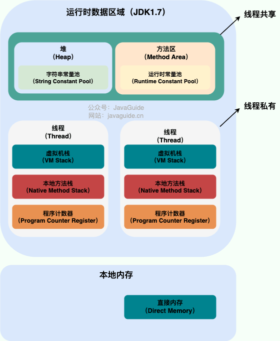

**JDK 1.8**：


**线程私有的：**

- 程序计数器
- 虚拟机栈
- 本地方法栈

**线程共享的：**

- 堆
- 方法区
- 直接内存 (非运行时数据区的一部分)

Java 虚拟机规范对于运行时数据区域的规定是相当宽松的。以堆为例：堆可以是连续空间，也可以不连续。堆的大小可以固定，也可以在运行时按需扩展 。虚拟机实现者可以使用任何垃圾回收算法管理堆，甚至完全不进行垃圾收集也是可以的。

### 程序计数器

程序计数器是一块较小的内存空间，可以看作是当前线程所执行的字节码的行号指示器。字节码解释器工作时通过改变这个计数器的值来选取下一条需要执行的字节码指令，分支、循环、跳转、异常处理、线程恢复等功能都需要依赖这个计数器来完成。

另外，为了线程切换后能恢复到正确的执行位置，每条线程都需要有一个独立的程序计数器，各线程之间计数器互不影响，独立存储，我们称这类内存区域为“线程私有”的内存。

从上面的介绍中我们知道了程序计数器主要有两个作用：

- 字节码解释器通过改变程序计数器来依次读取指令，从而实现代码的流程控制，如：顺序执行、选择、循环、异常处理。
- 在多线程的情况下，程序计数器用于记录当前线程执行的位置，从而当线程被切换回来的时候能够知道该线程上次运行到哪儿了。

程序计数器的生命周期与线程完全同步：

- **创建**：随着线程的创建而创建。
- **销毁**：随着线程的结束而销毁。

在执行 **Java 方法**（非 native）时，程序计数器记录的是 **当前正在执行的 JVM 字节码指令的地址**。当线程执行的是一个 **native 方法**（本地方法）时，程序计数器的值为 **Undefined（未定义）**。这是因为 native 方法不执行 JVM 字节码，而是通过 JNI 调用本地平台的底层代码，JVM 无需再跟踪字节码地址。

⚠️ 注意：程序计数器是 JVM 规范中唯一没有规定任何 `OutOfMemoryError` 情况的内存区域。这是因为它的内存占用极小且固定，不会出现内存溢出的情况。

### Java 虚拟机栈

与程序计数器一样，Java 虚拟机栈（后文简称栈）也是线程私有的，它的生命周期和线程相同，随着线程的创建而创建，随着线程的死亡而死亡。

栈绝对算的上是 JVM 运行时数据区域的一个核心，除了一些 Native 方法调用是通过本地方法栈实现的(后面会提到)，其他所有的 Java 方法调用都是通过栈来实现的（也需要和其他运行时数据区域比如程序计数器配合）。

方法调用的数据需要通过栈进行传递，每一次方法调用都会有一个对应的栈帧被压入栈中，每一个方法调用结束后，都会有一个栈帧被弹出。

栈由一个个栈帧组成，而每个栈帧中都拥有：局部变量表、操作数栈、动态链接、方法返回地址。和数据结构上的栈类似，两者都是先进后出的数据结构，只支持出栈和入栈两种操作。


**局部变量表** 主要存放了编译期可知的各种数据类型（boolean、byte、char、short、int、float、long、double）、对象引用（reference 类型，它不同于对象本身，可能是一个指向对象起始地址的引用指针，也可能是指向一个代表对象的句柄或其他与此对象相关的位置）。

**操作数栈** 主要作为方法调用的中转站使用，用于存放方法执行过程中产生的中间计算结果。另外，计算过程中产生的临时变量也会放在操作数栈中。

**动态链接**是 Java 虚拟机实现方法调用的关键机制之一。在 Class 文件中，方法调用以**符号引用**的形式存在于常量池。为了执行调用，这些符号引用必须被转换为内存中的**直接引用**。这个转换过程分为两种情况：对于静态方法、私有方法等在编译期就能确定版本的方法，这个转换在**类加载的解析阶段**就完成了，这称为**静态解析**。而对于需要根据对象实际类型才能确定具体实现的**虚方法**（这是实现多态的基础），这个转换过程则被推迟到**程序运行期间**，由**动态链接**来完成。因此，**动态链接**的核心作用是**在运行时解析虚方法的调用点，将其链接到正确的方法版本上**。

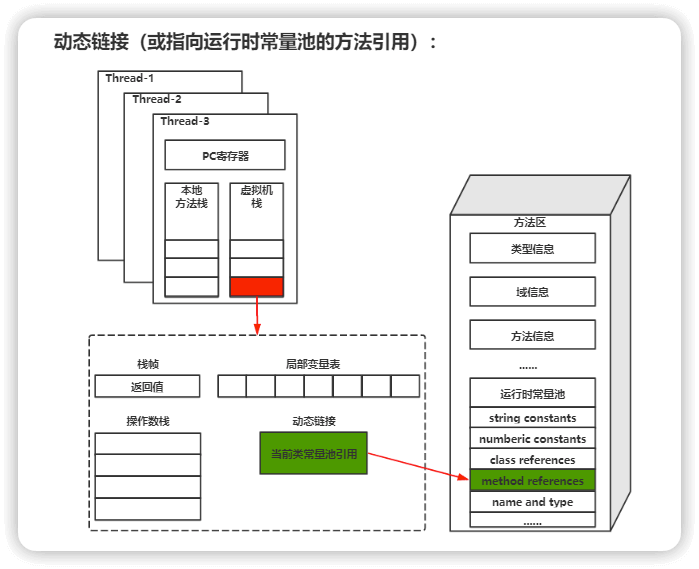

- **`StackOverFlowError`：** 如果栈的内存大小不允许动态扩展，那么当线程请求栈的深度超过当前 Java 虚拟机栈的最大深度的时候，就抛出 `StackOverFlowError` 错误。
- **`OutOfMemoryError`：** 如果栈的内存大小可以动态扩展， 那么当虚拟机在动态扩展栈时无法申请到足够的内存空间，则抛出`OutOfMemoryError`异常

### 本地方法栈

和虚拟机栈所发挥的作用非常相似，区别是：**虚拟机栈为虚拟机执行 Java 方法 （也就是字节码）服务，而本地方法栈则为虚拟机使用到的 Native 方法服务。** 在 HotSpot 虚拟机中和 Java 虚拟机栈合二为一。

本地方法被执行的时候，在本地方法栈也会创建一个栈帧，用于存放该本地方法的局部变量表、操作数栈、动态链接、出口信息。

方法执行完毕后相应的栈帧也会出栈并释放内存空间，也会出现 `StackOverFlowError` 和 `OutOfMemoryError` 两种错误。

### 堆

Java 虚拟机所管理的内存中最大的一块，Java 堆是所有线程共享的一块内存区域，在虚拟机启动时创建。**此内存区域的唯一目的就是存放对象实例，几乎所有的对象实例以及数组都在这里分配内存。**

Java 世界中“几乎”所有的对象都在堆中分配，但是，随着 JIT 编译器的发展与逃逸分析技术逐渐成熟，栈上分配、标量替换优化技术将会导致一些微妙的变化，所有的对象都分配到堆上也渐渐变得不那么“绝对”了。从 JDK 1.7 开始已经默认开启逃逸分析，如果某些方法中的对象引用没有被返回或者未被外面使用（也就是未逃逸出去），那么对象可以直接在栈上分配内存。

Java 堆是垃圾收集器管理的主要区域，因此也被称作 **GC 堆（Garbage Collected Heap）**。从垃圾回收的角度，由于现在收集器基本都采用分代垃圾收集算法，所以 Java 堆还可以细分为：新生代和老年代；再细致一点有：Eden、Survivor、Old 等空间。进一步划分的目的是更好地回收内存，或者更快地分配内存。

在 JDK 7 版本及 JDK 7 版本之前，堆内存被通常分为下面三部分：

1. 新生代内存(Young Generation)
2. 老生代(Old Generation)
3. 永久代(Permanent Generation)

下图所示的 Eden 区、两个 Survivor 区 S0 和 S1 都属于新生代，中间一层属于老年代，最下面一层属于永久代。

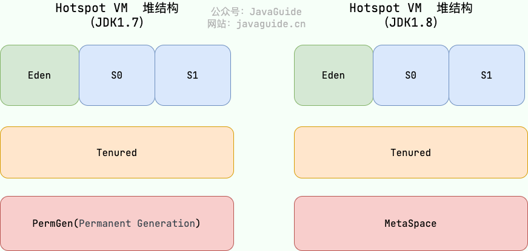

**JDK 8 版本之后 PermGen(永久代) 已被 Metaspace(元空间) 取代，元空间使用的是本地内存。**

大部分情况，对象都会首先在 Eden 区域分配，在一次新生代垃圾回收后，如果对象还存活，则会进入 S0 或者 S1，并且对象的年龄还会加 1(Eden 区->Survivor 区后对象的初始年龄变为 1)，当它的年龄增加到一定程度（默认为 15 岁），就会被晋升到老年代中。对象晋升到老年代的年龄阈值，可以通过参数 `-XX:MaxTenuringThreshold` 来设置。

**为什么年龄只能是 0-15?**

因为记录年龄的区域在对象头中，这个区域的大小通常是 4 位。这 4 位可以表示的最大二进制数字是 1111，即十进制的 15。因此，对象的年龄被限制为 0 到 15。

Hotspot 遍历所有对象时，按照年龄从小到大对其所占用的大小进行累加，当累加到某个年龄时，所累加的大小超过了 Survivor 区的一半，则取这个年龄和 `MaxTenuringThreshold` 中更小的一个值，作为新的晋升年龄阈值

### 方法区

方法区属于是 JVM 运行时数据区域的一块逻辑区域，是各个线程共享的内存区域。

当虚拟机加载一个类时，它会从 Class 文件中解析出相应的信息，并将这些**元数据**存入方法区。具体来说，方法区主要存储以下核心数据：

1. **类的元数据**：包括类的完整结构，如类名、父类、实现的接口、访问修饰符，以及字段和方法的详细信息（名称、类型、修饰符等）。
2. **方法的字节码**：每个方法的原始指令序列。
3. **运行时常量池**：每个类独有的，由 Class 文件中的常量池转换而来，用于存放编译期生成的各种字面量和对类型、字段、方法的符号引用。

需要特别注意的是，以下几类数据虽然在逻辑上与类相关，但在 HotSpot 虚拟机中，它们并不存储在方法区内：

- **静态变量（Static Variables）**：自 JDK 7 起，静态变量已从方法区（永久代）**移至 Java 堆（Heap）中**，与该类的 `java.lang.Class` 对象一起存放。
- **字符串常量池（String Pool）**：同样自 JDK 7 起，字符串常量池也**移至 Java 堆中**

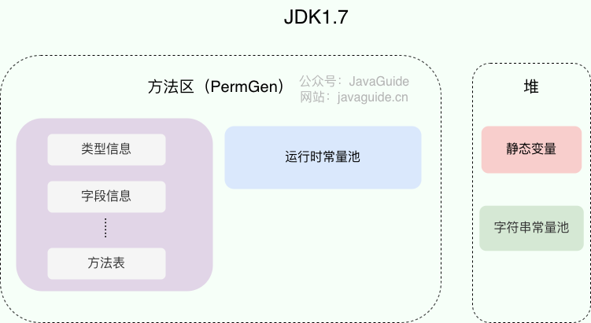

**方法区和永久代以及元空间是什么关系呢？** 方法区和永久代以及元空间的关系很像 Java 中接口和类的关系，类实现了接口，这里的类就可以看作是永久代和元空间，接口可以看作是方法区，也就是说永久代以及元空间是 HotSpot 虚拟机对虚拟机规范中方法区的两种实现方式。并且，永久代是 JDK 1.8 之前的方法区实现，JDK 1.8 及以后方法区的实现变成了元空间。

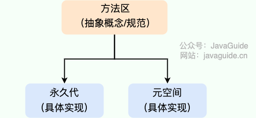

**为什么要将永久代 (PermGen) 替换为元空间 (MetaSpace) 呢?**

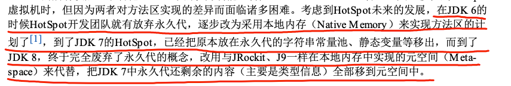

1. 整个永久代有一个 JVM 本身设置的固定大小上限，无法进行调整（也就是受到 JVM 内存的限制），而元空间使用的是本地内存，受本机可用内存的限制，虽然元空间仍旧可能溢出，但是比原来出现的几率会更小。
2. 元空间里面存放的是类的元数据，这样加载多少类的元数据就不由 `MaxPermSize` 控制了, 而由系统的实际可用空间来控制，这样能加载的类就更多了。
3. 永久代会为 GC 带来不必要的复杂度，并且回收效率偏低。


### 运行时常量池

Class 文件中除了有类的版本、字段、方法、接口等描述信息外，还有用于存放编译期生成的各种字面量（Literal）和符号引用（Symbolic Reference）的 **常量池表(Constant Pool Table)** 。

字面量是源代码中的固定值的表示法，即通过字面我们就能知道其值的含义。字面量包括整数、浮点数和字符串字面量。常见的符号引用包括类符号引用、字段符号引用、方法符号引用、接口方法符号。

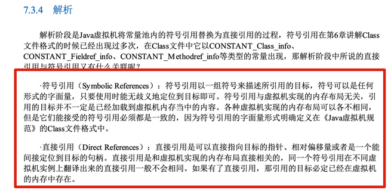

常量池表会在类加载后存放到方法区的运行时常量池中。

运行时常量池的功能类似于传统编程语言的符号表，尽管它包含了比典型符号表更广泛的数据。

既然运行时常量池是方法区的一部分，自然受到方法区内存的限制，当常量池无法再申请到内存时会抛出 `OutOfMemoryError` 错误。

### 字符串常量池


**字符串常量池** 是 JVM 为了提升性能和减少内存消耗针对字符串（String 类）专门开辟的一块区域，主要目的是为了避免字符串的重复创建。

**JDK 1.7 为什么要将字符串常量池移动到堆中？**

主要是因为永久代（方法区实现）的 GC 回收效率太低，只有在整堆收集 (Full GC)的时候才会被执行 GC。Java 程序中通常会有大量的被创建的字符串等待回收，将字符串常量池放到堆中，能够更高效及时地回收字符串内存。


### 直接内存

直接内存是一种特殊的内存缓冲区，并不在 Java 堆或方法区中分配的，而是通过 JNI 的方式在本地内存上分配的。

直接内存并不是虚拟机运行时数据区的一部分，也不是虚拟机规范中定义的内存区域，但是这部分内存也被频繁地使用。而且也可能导致 `OutOfMemoryError` 错误出现。

> JDK1.4 中新加入的 **NIO（Non-Blocking I/O，也被称为 New I/O）**，引入了一种基于**通道（Channel）\**与\**缓存区（Buffer）\**的 I/O 方式，它可以直接使用 Native 函数库直接分配堆外内存，然后通过一个存储在 Java 堆中的 DirectByteBuffer 对象作为这块内存的引用进行操作。这样就能在一些场景中显著提高性能，因为\**避免了在 Java 堆和 Native 堆之间来回复制数据**。
>
> ```java
> //不使用堆外内存
> Disk / Socket
>       ↓
> Kernel Buffer
>       ↓ copy
> JVM 临时 Direct Buffer
>       ↓ copy
> Heap ByteBuffer
>     
> //使用堆外内存    直接写入堆外内存，不需要再复制到堆内
> Disk / Socket
>       ↓
> Kernel Buffer
>       ↓ copy
> Direct Memory
> ```
>
> **为什么 JVM 要搞这个临时 DirectBuffer？**
>
> **因为系统调用需要稳定的 native 地址。JVM堆内GC会移动对象，内核不能依赖这种地址，而临时的堆外内存地址稳定**

直接内存的分配不会受到 Java 堆的限制，但是，既然是内存就会受到本机总内存大小以及处理器寻址空间的限制。

## 对象

### 对象的创建


#### Step1:类加载检查

虚拟机遇到一条 new 指令时，首先将去检查这个指令的参数是否能在常量池中定位到这个类的符号引用，并且检查这个符号引用代表的类是否已被加载过、解析和初始化过。如果没有，那必须先执行相应的类加载过程。

#### Step2:分配内存

在**类加载检查**通过后，接下来虚拟机将为新生对象**分配内存**。对象所需的内存大小在类加载完成后便可确定，为对象分配空间的任务等同于把一块确定大小的内存从 Java 堆中划分出来。**分配方式**有 **“指针碰撞”** 和 **“空闲列表”** 两种，**选择哪种分配方式由 Java 堆是否规整决定，而 Java 堆是否规整又由所采用的垃圾收集器是否带有压缩整理功能决定**。

**内存分配的两种方式** （补充内容，需要掌握）：

- 指针碰撞： 
  - 适用场合：堆内存规整（即没有内存碎片）的情况下。
  - 原理：用过的内存全部整合到一边，没有用过的内存放在另一边，中间有一个分界指针，只需要向着没用过的内存方向将该指针移动对象内存大小位置即可。
  - 使用该分配方式的 GC 收集器：Serial, ParNew
- 空闲列表： 
  - 适用场合：堆内存不规整的情况下。
  - 原理：虚拟机会维护一个列表，该列表中会记录哪些内存块是可用的，在分配的时候，找一块儿足够大的内存块儿来划分给对象实例，最后更新列表记录。
  - 使用该分配方式的 GC 收集器：CMS

选择以上两种方式中的哪一种，取决于 Java 堆内存是否规整。而 Java 堆内存是否规整，取决于 GC 收集器的算法是"标记-清除"，还是"标记-整理"（也称作"标记-压缩"），值得注意的是，复制算法内存也是规整的。

**内存分配并发问题（补充内容，需要掌握）**

在创建对象的时候有一个很重要的问题，就是线程安全，因为在实际开发过程中，创建对象是很频繁的事情，作为虚拟机来说，必须要保证线程是安全的，通常来讲，虚拟机采用两种方式来保证线程安全：

- **CAS+失败重试：** CAS 是乐观锁的一种实现方式。所谓乐观锁就是，每次不加锁而是假设没有冲突而去完成某项操作，如果因为冲突失败就重试，直到成功为止。**虚拟机采用 CAS 配上失败重试的方式保证更新操作的原子性。**
- **TLAB：** 为每一个线程预先在 Eden 区分配一块儿内存，JVM 在给线程中的对象分配内存时，首先在 TLAB 分配，当对象大于 TLAB 中的剩余内存或 TLAB 的内存已用尽时，再采用上述的 CAS 进行内存分配

#### Step3:初始化零值

内存分配完成后，虚拟机需要将分配到的内存空间都初始化为零值（不包括对象头），这一步操作保证了对象的实例字段在 Java 代码中可以不赋初始值就直接使用，程序能访问到这些字段的数据类型所对应的零值。

#### Step4:设置对象头

初始化零值完成之后，**虚拟机要对对象进行必要的设置**，例如这个对象是哪个类的实例、如何才能找到类的元数据信息、对象的哈希码、对象的 GC 分代年龄等信息。 **这些信息存放在对象头中。** 另外，根据虚拟机当前运行状态的不同，如是否启用偏向锁等，对象头会有不同的设置方式。

#### Step5:执行 init 方法

在上面工作都完成之后，从虚拟机的视角来看，一个新的对象已经产生了，但从 Java 程序的视角来看，对象创建才刚开始，`<init>` 方法还没有执行，所有的字段都还为零。所以一般来说，执行 new 指令之后会接着执行 `<init>` 方法，把对象按照程序员的意愿进行初始化，这样一个真正可用的对象才算完全产生出来。

### 对象的内存布局

在 Hotspot 虚拟机中，对象在内存中的布局可以分为 3 块区域：**对象头（Header）**、**实例数据（Instance Data）\**和\**对齐填充（Padding）**。

对象头包括两部分信息：

1. 标记字段（Mark Word）：用于存储对象自身的运行时数据， 如哈希码（HashCode）、GC 分代年龄、锁状态标志、线程持有的锁、偏向线程 ID、偏向时间戳等等。
2. 类型指针（Klass pointer）：对象指向它的类元数据的指针，虚拟机通过这个指针来确定这个对象是哪个类的实例。

**实例数据部分是对象真正存储的有效信息**，也是在程序中所定义的各种类型的字段内容。

**对齐填充部分不是必然存在的，也没有什么特别的含义，仅仅起占位作用。** 因为 Hotspot 虚拟机的自动内存管理系统要求对象起始地址必须是 8 字节的整数倍，换句话说就是对象的大小必须是 8 字节的整数倍。而对象头部分正好是 8 字节的倍数（1 倍或 2 倍），因此，当对象实例数据部分没有对齐时，就需要通过对齐填充来补全。

### 对象的访问定位

建立对象就是为了使用对象，我们的 Java 程序通过栈上的 reference 数据来操作堆上的具体对象。对象的访问方式由虚拟机实现而定，目前主流的访问方式有：**使用句柄**、**直接指针**。

#### 句柄

如果使用句柄的话，那么 Java 堆中将会划分出一块内存来作为句柄池，reference 中存储的就是对象的句柄地址，而句柄中包含了对象实例数据与对象类型数据各自的具体地址信息。

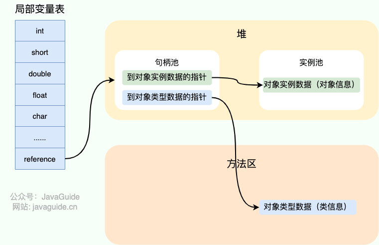

#### 直接指针

如果使用直接指针访问，reference 中存储的直接就是对象的地址。

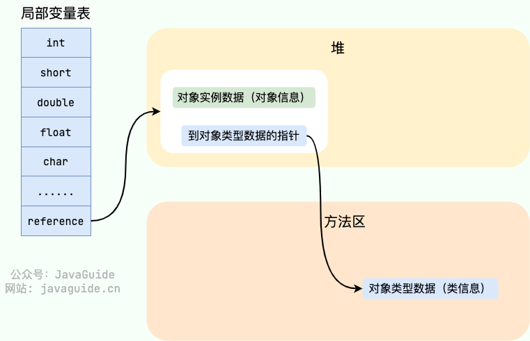

这两种对象访问方式各有优势。使用句柄来访问的最大好处是 reference 中存储的是稳定的句柄地址，在对象被移动时只会改变句柄中的实例数据指针，而 reference 本身不需要修改。使用直接指针访问方式最大的好处就是速度快，它节省了一次指针定位的时间开销。

HotSpot 虚拟机主要使用的就是这种方式来进行对象访问。


## 垃圾回收

### 堆空间的基本结构

Java 的自动内存管理主要是针对对象内存的回收和对象内存的分配。同时，Java 自动内存管理最核心的功能是 **堆** 内存中对象的分配与回收。

Java 堆是垃圾收集器管理的主要区域，因此也被称作 **GC 堆（Garbage Collected Heap）**。

从垃圾回收的角度来说，由于现在收集器基本都采用分代垃圾收集算法，所以 Java 堆被划分为了几个不同的区域，这样我们就可以根据各个区域的特点选择合适的垃圾收集算法。

在 JDK 7 版本及 JDK 7 版本之前，堆内存被通常分为下面三部分：

1. 新生代内存(Young Generation)
2. 老生代(Old Generation)
3. 永久代(Permanent Generation)

.png)

**JDK 8 版本之后 PermGen(永久) 已被 Metaspace(元空间) 取代，元空间使用的是直接内存** 。

### 对象优先在 Eden 区分配

大多数情况下，对象在新生代中 Eden 区分配。当 Eden 区没有足够空间进行分配时，虚拟机将发起一次 Minor GC。

### 大对象直接进入老年代

大对象就是需要大量连续内存空间的对象（比如：字符串、数组）。

大对象直接进入老年代的行为是由虚拟机动态决定的，它与具体使用的垃圾回收器和相关参数有关。大对象直接进入老年代是一种优化策略，旨在避免将大对象放入新生代，从而减少新生代的垃圾回收频率和成本。

- G1 垃圾回收器会根据 `-XX:G1HeapRegionSize` 参数设置的堆区域大小和 `-XX:G1MixedGCLiveThresholdPercent` 参数设置的阈值，来决定哪些对象会直接进入老年代。
- Parallel Scavenge 垃圾回收器中，默认情况下，并没有一个固定的阈值(`XX:ThresholdTolerance`是动态调整的)来决定何时直接在老年代分配大对象。而是由虚拟机根据当前的堆内存情况和历史数据动态决定

### 长期存活的对象将进入老年代

既然虚拟机采用了分代收集的思想来管理内存，那么内存回收时就必须能识别哪些对象应放在新生代，哪些对象应放在老年代中。为了做到这一点，虚拟机给每个对象一个对象年龄（Age）计数器。

大部分情况，对象都会首先在 Eden 区域分配。如果对象在 Eden 出生并经过第一次 Minor GC 后仍然能够存活，并且能被 Survivor 容纳的话，将被移动到 Survivor 空间（s0 或者 s1）中，并将对象年龄设为 1(Eden 区->Survivor 区后对象的初始年龄变为 1)。

对象在 Survivor 中每熬过一次 MinorGC,年龄就增加 1 岁，当它的年龄增加到一定程度（默认为 15 岁），就会被晋升到老年代中。对象晋升到老年代的年龄阈值，可以通过参数 `-XX:MaxTenuringThreshold` 来设置。

> “Hotspot 遍历所有对象时，按照年龄从小到大对其所占用的大小进行累积，当累积的某个年龄大小超过了 survivor 区的 50% 时（默认值是 50%，可以通过 `-XX:TargetSurvivorRatio=percent` 来设置，参见 [issue1199](https://github.com/Snailclimb/JavaGuide/issues/1199) ），取这个年龄和 MaxTenuringThreshold 中更小的一个值，作为新的晋升年龄阈值”。

### 主要进行 gc 的区域

针对 HotSpot VM 的实现，它里面的 GC 其实准确分类只有两大种：

部分收集 (Partial GC)：

- 新生代收集（Minor GC / Young GC）：只对新生代进行垃圾收集；
- 老年代收集（Major GC / Old GC）：只对老年代进行垃圾收集。需要注意的是 Major GC 在有的语境中也用于指代整堆收集；
- 混合收集（Mixed GC）：对整个新生代和部分老年代进行垃圾收集。

整堆收集 (Full GC)：收集整个 Java 堆和方法区。

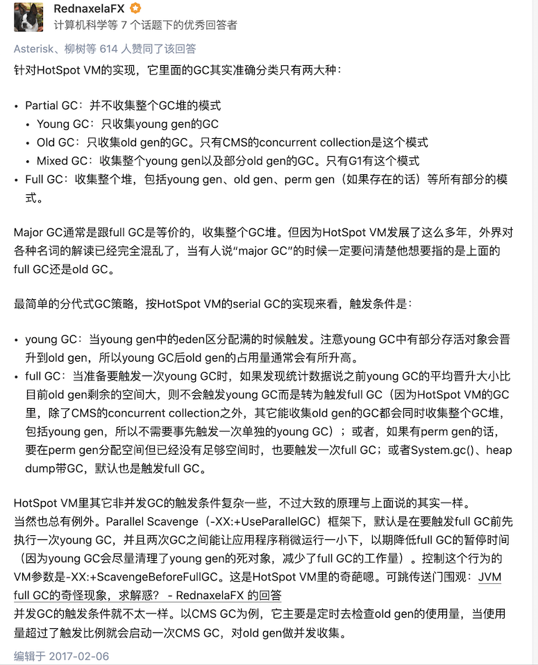

### 空间分配担保

空间分配担保是为了确保在 Minor GC 之前老年代本身还有容纳新生代所有对象的剩余空间。

> JDK 6 Update 24 之前，在发生 Minor GC 之前，虚拟机必须先检查老年代最大可用的连续空间是否大于新生代所有对象总空间，如果这个条件成立，那这一次 Minor GC 可以确保是安全的。如果不成立，则虚拟机会先查看 `-XX:HandlePromotionFailure` 参数的设置值是否允许担保失败(Handle Promotion Failure);如果允许，那会继续检查老年代最大可用的连续空间是否大于历次晋升到老年代对象的平均大小，如果大于，将尝试进行一次 Minor GC，尽管这次 Minor GC 是有风险的;如果小于，或者 `-XX: HandlePromotionFailure` 设置不允许冒险，那这时就要改为进行一次 Full GC。
>
> JDK 6 Update 24 之后的规则变为只要老年代的连续空间大于新生代对象总大小或者历次晋升的平均大小，就会进行 Minor GC，否则将进行 Full GC。


## 死亡对象判断方法

堆中几乎放着所有的对象实例，对堆垃圾回收前的第一步就是要判断哪些对象已经死亡（即不能再被任何途径使用的对象）。

### 引用计数法

给对象中添加一个引用计数器：

- 每当有一个地方引用它，计数器就加 1；
- 当引用失效，计数器就减 1；
- 任何时候计数器为 0 的对象就是不可能再被使用的。

**这个方法实现简单，效率高，但是目前主流的虚拟机中并没有选择这个算法来管理内存，其最主要的原因是它很难解决对象之间循环引用的问题。**

所谓对象之间的相互引用问题，除了对象 `objA` 和 `objB` 相互引用着对方之外，这两个对象之间再无任何引用。但是他们因为互相引用对方，导致它们的引用计数器都不为 0，于是引用计数算法无法通知 GC 回收器回收他们。

### 可达性分析算法

这个算法的基本思想就是通过一系列的称为 **“GC Roots”** 的对象作为起点，从这些节点开始向下搜索，节点所走过的路径称为引用链，当一个对象到 GC Roots 没有任何引用链相连的话，则证明此对象是不可用的，需要被回收。

下图中的 `Object 6 ~ Object 10` 之间虽有引用关系，但它们到 GC Roots 不可达，因此为需要被回收的对象。

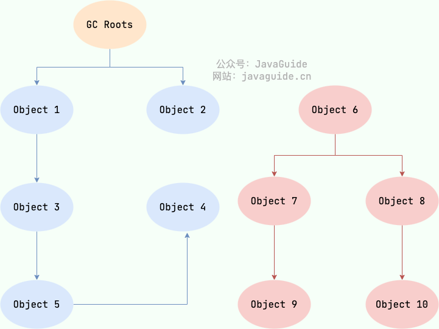

**哪些对象可以作为 GC Roots 呢？**

- 虚拟机栈(栈帧中的局部变量表)中引用的对象
- 本地方法栈(Native 方法)中引用的对象
- 方法区中类静态属性引用的对象
- 方法区中常量引用的对象
- 所有被同步锁持有的对象
- JNI（Java Native Interface）引用的对象

**对象可以被回收，就代表一定会被回收吗？**

即使在可达性分析法中不可达的对象，也并非是“非死不可”的，这时候它们暂时处于“缓刑阶段”，要真正宣告一个对象死亡，至少要经历两次标记过程；可达性分析法中不可达的对象被第一次标记并且进行一次筛选，筛选的条件是此对象是否有必要执行 `finalize` 方法。当对象没有覆盖 `finalize` 方法，或 `finalize` 方法已经被虚拟机调用过时，虚拟机将这两种情况视为没有必要执行。

被判定为需要执行的对象将会被放在一个队列中进行第二次标记，除非这个对象与引用链上的任何一个对象建立关联，否则就会被真的回收。

> `Object` 类中的 `finalize` 方法一直被认为是一个糟糕的设计，成为了 Java 语言的负担，影响了 Java 语言的安全和 GC 的性能。JDK9 版本及后续版本中各个类中的 `finalize` 方法会被逐渐弃用移除。忘掉它的存在吧！

### 引用类型总结

无论是通过引用计数法判断对象引用数量，还是通过可达性分析法判断对象的引用链是否可达，判定对象的存活都与“引用”有关。

JDK1.2 之前，Java 中引用的定义很传统：如果 reference 类型的数据存储的数值代表的是另一块内存的起始地址，就称这块内存代表一个引用。

JDK1.2 以后，Java 对引用的概念进行了扩充，将引用分为强引用、软引用、弱引用、虚引用四种（引用强度逐渐减弱），强引用就是 Java 中普通的对象，而软引用、弱引用、虚引用在 JDK 中定义的类分别是 `SoftReference`、`WeakReference`、`PhantomReference`。

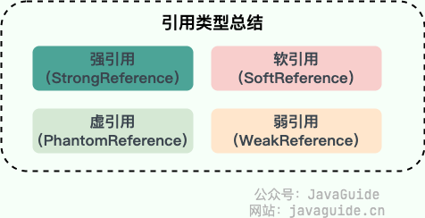

**强引用（StrongReference）**

强引用实际上就是程序代码中普遍存在的引用赋值，这是使用最普遍的引用，其代码如下

```java
String strongReference = new String("abc");
```

如果一个对象具有强引用，那就类似于**必不可少的生活用品**，垃圾回收器绝不会回收它。当内存空间不足，Java 虚拟机宁愿抛出 OutOfMemoryError 错误，使程序异常终止，也不会靠随意回收具有强引用的对象来解决内存不足问题。

**软引用（SoftReference）**

如果一个对象只具有软引用，那就类似于**可有可无的生活用品**。软引用代码如下

```java
// --- 示例1 ---
String str = new String("abc");
SoftReference<String> softReference1 = new SoftReference<>(str);
str = null; // 去掉强引用

// --- 示例2 ---
SoftReference<String> softReference2 = new SoftReference<>(new String("def")); // 匿名对象
```

软引用对象在内存压力较大时可能会被回收，但JVM不保证只在内存不足时才清理。唯一强保证是：在抛出 OutOfMemoryError 之前，所有仅被软引用可达的对象一定会被清理。只要垃圾回收器没有回收它，该对象就可以被程序使用。软引用可用来实现内存敏感的高速缓存。

软引用可以和一个引用队列（ReferenceQueue）联合使用，如果软引用所引用的对象被垃圾回收，JAVA 虚拟机就会把这个软引用加入到与之关联的引用队列中。

**弱引用（WeakReference）**

如果一个对象只具有弱引用，那就类似于**可有可无的生活用品**。弱引用代码如下：

```java
// --- 示例1 ---
String str = new String("abc");
WeakReference<String> weakReference1 = new WeakReference<>(str);
str = null; //去除强引用

// --- 示例2 ---
WeakReference<String> weakReference2 = new WeakReference<>(new String("abc")); // 匿名对象
```

弱引用与软引用的区别在于：只具有弱引用的对象拥有更短暂的生命周期。在垃圾回收器线程扫描它所管辖的内存区域的过程中，一旦发现了只具有弱引用的对象，不管当前内存空间足够与否，都会回收它的内存。不过，由于垃圾回收器是一个优先级很低的线程， 因此不一定会很快发现那些只具有弱引用的对象。

弱引用可以和一个引用队列（ReferenceQueue）联合使用，如果弱引用所引用的对象被垃圾回收，Java 虚拟机就会把这个弱引用加入到与之关联的引用队列中。

**虚引用（PhantomReference）**

"虚引用"顾名思义，就是形同虚设，与其他几种引用都不同，虚引用并不会决定对象的生命周期。如果一个对象仅持有虚引用，那么它就和没有任何引用一样，在任何时候都可能被垃圾回收。虚引用代码如下：

```java
// --- 示例1 ---
String str = new String("abc");
ReferenceQueue queue = new ReferenceQueue();
// 创建虚引用，要求必须与一个引用队列关联
PhantomReference phantomReference1 = new PhantomReference(str, queue);
str = null; // 去除强引用

// --- 示例2 ---
PhantomReference phantomReference2 = new PhantomReference(new String("abc"), queue); // 匿名对象
```

**虚引用主要用来跟踪对象被垃圾回收的活动**。

**虚引用与软引用和弱引用的一个区别在于：** 虚引用必须和引用队列（ReferenceQueue）联合使用。当垃圾回收器准备回收一个对象时，如果发现它还有虚引用，就会在回收对象的内存之前，把这个虚引用加入到与之关联的引用队列中。程序可以通过判断引用队列中是否已经加入了虚引用，来了解被引用的对象是否将要被垃圾回收。程序如果发现某个虚引用已经被加入到引用队列，那么就可以在所引用的对象的内存被回收之前采取必要的行动。

特别注意，在程序设计中一般很少使用弱引用与虚引用，使用软引用的情况较多，这是因为**软引用可以加速 JVM 对垃圾内存的回收速度，可以维护系统的运行安全，防止内存溢出（OutOfMemory）等问题的产生**。

### 如何判断一个常量是废弃常量？

运行时常量池主要回收的是废弃的常量。那么，我们如何判断一个常量是废弃常量呢？

假如在字符串常量池中存在字符串 "abc"，如果当前没有任何 String 对象引用该字符串常量的话，就说明常量 "abc" 就是废弃常量，如果这时发生内存回收的话而且有必要的话，"abc" 就会被系统清理出常量池了。

### 如何判断一个类是无用的类？

方法区主要回收的是无用的类，那么如何判断一个类是无用的类的呢？

判定一个常量是否是“废弃常量”比较简单，而要判定一个类是否是“无用的类”的条件则相对苛刻许多。类需要同时满足下面 3 个条件才能算是 **“无用的类”**：

- 该类所有的实例都已经被回收，也就是 Java 堆中不存在该类的任何实例。
- 加载该类的 `ClassLoader` 已经被回收。
- 该类对应的 `java.lang.Class` 对象没有在任何地方被引用，无法在任何地方通过反射访问该类的方法。

虚拟机可以对满足上述 3 个条件的无用类进行回收，这里说的仅仅是“可以”，而并不是和对象一样不使用了就会必然被回收。


## 垃圾收集算法

### 标记-清除算法

标记-清除（Mark-and-Sweep）算法分为“标记（Mark）”和“清除（Sweep）”阶段：首先标记出所有不需要回收的对象，在标记完成后统一回收掉所有没有被标记的对象。

它是最基础的收集算法，后续的算法都是对其不足进行改进得到。这种垃圾收集算法会带来两个明显的问题：

1. **效率问题**：标记和清除两个过程效率都不高。
2. **空间问题**：标记清除后会产生大量不连续的内存碎片。

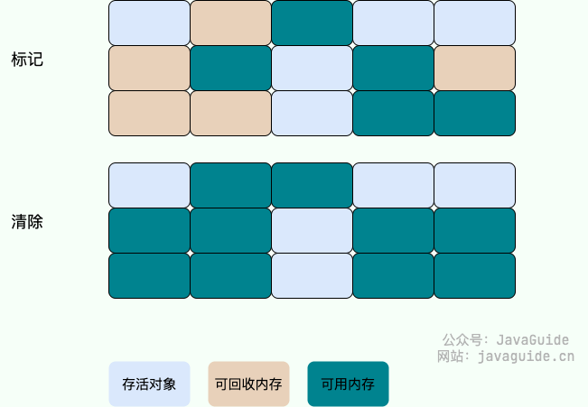

### 复制算法

为了解决标记-清除算法的效率和内存碎片问题，复制（Copying）收集算法出现了。它可以将内存分为大小相同的两块，每次使用其中的一块。当这一块的内存使用完后，就将还存活的对象复制到另一块去，然后再把使用的空间一次清理掉。这样就使每次的内存回收都是对内存区间的一半进行回收。

虽然改进了标记-清除算法，但依然存在下面这些问题：

- **可用内存变小**：可用内存缩小为原来的一半。
- **不适合老年代**：如果存活对象数量比较大，复制性能会变得很差。

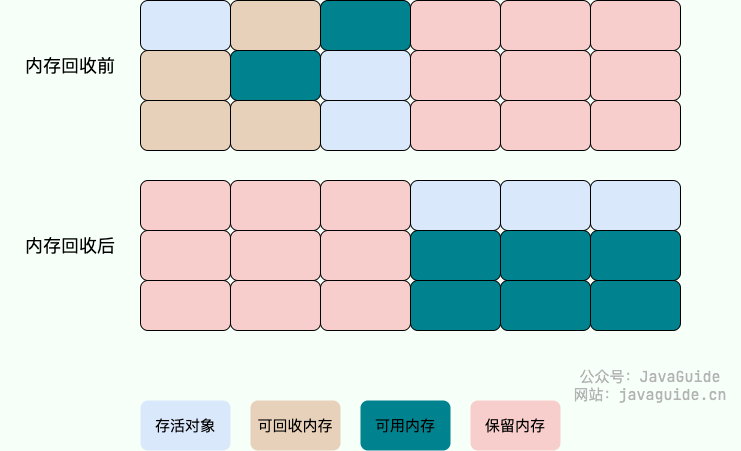


### 标记-整理算法

标记-整理（Mark-and-Compact）算法是根据老年代的特点提出的一种标记算法，标记过程仍然与“标记-清除”算法一样，但后续步骤不是直接对可回收对象回收，而是让所有存活的对象向一端移动，然后直接清理掉端边界以外的内存。

由于多了整理这一步，因此效率也不高，适合老年代这种垃圾回收频率不是很高的场景。


### 分代收集算法

当前虚拟机的垃圾收集都采用分代收集算法，这种算法没有什么新的思想，只是根据对象存活周期的不同将内存分为几块。一般将 Java 堆分为新生代和老年代，这样我们就可以根据各个年代的特点选择合适的垃圾收集算法。

比如在新生代中，每次收集都会有大量对象死去，所以可以选择“复制”算法，只需要付出少量对象的复制成本就可以完成每次垃圾收集。而老年代的对象存活几率是比较高的，而且没有额外的空间对它进行分配担保，所以我们必须选择“标记-清除”或“标记-整理”算法进行垃圾收集。

## 垃圾收集器

**如果说收集算法是内存回收的方法论，那么垃圾收集器就是内存回收的具体实现。**

JDK 默认垃圾收集器（使用 `java -XX:+PrintCommandLineFlags -version` 命令查看）：

- JDK 8: Parallel Scavenge（新生代）+ Parallel Old（老年代）
- JDK 9 ~ JDK22: G1

### Serial 收集器

Serial（串行）收集器是最基本、历史最悠久的垃圾收集器了。大家看名字就知道这个收集器是一个单线程收集器了。它的 **“单线程”** 的意义不仅仅意味着它只会使用一条垃圾收集线程去完成垃圾收集工作，更重要的是它在进行垃圾收集工作的时候必须暂停其他所有的工作线程（ **"Stop The World"** ），直到它收集结束。

**新生代采用标记-复制算法，老年代采用标记-整理算法。**

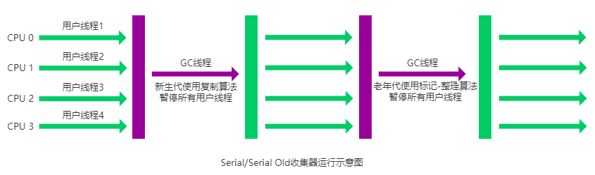

它**简单而高效（与其他收集器的单线程相比）**。Serial 收集器由于没有线程交互的开销，自然可以获得很高的单线程收集效率。Serial 收集器对于运行在 Client 模式下的虚拟机来说是个不错的选择。

### ParNew 收集器

ParNew 收集器其实就是 Serial 收集器的多线程版本，除了使用多线程进行垃圾收集外，其余行为（控制参数、收集算法、回收策略等等）和 Serial 收集器完全一样。

**新生代采用标记-复制算法，老年代采用标记-整理算法。**

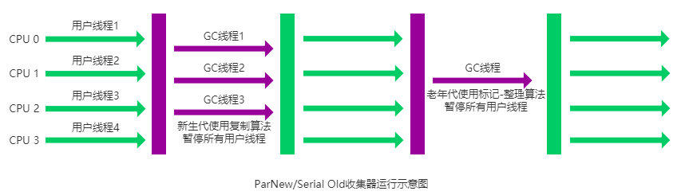

它是许多运行在 Server 模式下的虚拟机的首要选择，除了 Serial 收集器外，只有它能与 CMS 收集器（真正意义上的并发收集器，后面会介绍到）配合工作。

**并行和并发概念补充：**

- **并行（Parallel）**：指多条垃圾收集线程并行工作，但此时用户线程仍然处于等待状态。
- **并发（Concurrent）**：指用户线程与垃圾收集线程同时执行（但不一定是并行，可能会交替执行），用户程序在继续运行，而垃圾收集器运行在另一个 CPU 上。

### Parallel Scavenge 收集器

Parallel Scavenge 收集器也是使用标记-复制算法的多线程收集器，**这是 JDK1.8 默认收集器**

Parallel Scavenge 收集器关注点是吞吐量（高效率的利用 CPU）。CMS 等垃圾收集器的关注点更多的是用户线程的停顿时间（提高用户体验）。所谓吞吐量就是 CPU 中用于运行用户代码的时间与 CPU 总消耗时间的比值。 Parallel Scavenge 收集器提供了很多参数供用户找到最合适的停顿时间或最大吞吐量，如果对于收集器运作不太了解，手工优化存在困难的时候，使用 Parallel Scavenge 收集器配合自适应调节策略，把内存管理优化交给虚拟机去完成也是一个不错的选择。

**新生代采用标记-复制算法，老年代采用标记-整理算法。**


JDK1.8 默认使用的是 Parallel Scavenge + Parallel Old，如果指定了-XX:+UseParallelGC 参数，则默认指定了-XX:+UseParallelOldGC

### Serial Old 收集器

**Serial 收集器的老年代版本**，它同样是一个单线程收集器。它主要有两大用途：一种用途是在 JDK1.5 以及以前的版本中与 Parallel Scavenge 收集器搭配使用，另一种用途是作为 CMS 收集器的后备方案。

.png)

### Parallel Old 收集器

**Parallel Scavenge 收集器的老年代版本**。使用多线程和“标记-整理”算法。在注重吞吐量以及 CPU 资源的场合，都可以优先考虑 Parallel Scavenge 收集器和 Parallel Old 收集器。

.png)

### CMS 收集器

**CMS（Concurrent Mark Sweep）收集器是一种以获取最短回收停顿时间为目标的收集器。它非常符合在注重用户体验的应用上使用。**

**CMS（Concurrent Mark Sweep）收集器是 HotSpot 虚拟机第一款真正意义上的并发收集器，它第一次实现了让垃圾收集线程与用户线程（基本上）同时工作。**

从名字中的**Mark Sweep**这两个词可以看出，CMS 收集器是一种 **“标记-清除”算法**实现的，它的运作过程相比于前面几种垃圾收集器来说更加复杂一些。整个过程分为四个步骤：

- **初始标记：** 短暂停顿，标记直接与 root 相连的对象（根对象）；
- **并发标记：** 同时开启 GC 和用户线程，用一个闭包结构去记录可达对象。但在这个阶段结束，这个闭包结构并不能保证包含当前所有的可达对象。因为用户线程可能会不断的更新引用域，所以 GC 线程无法保证可达性分析的实时性。所以这个算法里会跟踪记录这些发生引用更新的地方。
- **重新标记：** 重新标记阶段就是为了修正并发标记期间因为用户程序继续运行而导致标记产生变动的那一部分对象的标记记录，这个阶段的停顿时间一般会比初始标记阶段的时间稍长，远远比并发标记阶段时间短
- **并发清除：** 开启用户线程，同时 GC 线程开始对未标记的区域做清扫。


从它的名字就可以看出它是一款优秀的垃圾收集器，主要优点：**并发收集、低停顿**。但是它有下面三个明显的缺点：

- **对 CPU 资源敏感；**
- **无法处理浮动垃圾；**
- **它使用的回收算法-“标记-清除”算法会导致收集结束时会有大量空间碎片产生。**

**CMS 垃圾回收器在 Java 9 中已经被标记为过时(deprecated)，并在 Java 14 中被移除。**

### G1 收集器

**G1 (Garbage-First) 是一款面向服务器的垃圾收集器,主要针对配备多颗处理器及大容量内存的机器. 以极高概率满足 GC 停顿时间要求的同时,还具备高吞吐量性能特征。**

被视为 JDK1.7 中 HotSpot 虚拟机的一个重要进化特征。它具备以下特点：

- **并行与并发**：G1 能充分利用 CPU、多核环境下的硬件优势，使用多个 CPU（CPU 或者 CPU 核心）来缩短 Stop-The-World 停顿时间。部分其他收集器原本需要停顿 Java 线程执行的 GC 动作，G1 收集器仍然可以通过并发的方式让 java 程序继续执行。
- **分代收集**：虽然 G1 可以不需要其他收集器配合就能独立管理整个 GC 堆，但是还是保留了分代的概念。
- **空间整合**：与 CMS 的“标记-清除”算法不同，G1 从整体来看是基于“标记-整理”算法实现的收集器；从局部上来看是基于“标记-复制”算法实现的。
- **可预测的停顿**：这是 G1 相对于 CMS 的另一个大优势，降低停顿时间是 G1 和 CMS 共同的关注点，但 G1 除了追求低停顿外，还能建立可预测的停顿时间模型，能让使用者明确指定在一个长度为 M 毫秒的时间片段内，消耗在垃圾收集上的时间不得超过 N 毫秒。

G1 收集器的运作大致分为以下几个步骤：

- **初始标记**： 短暂停顿（Stop-The-World，STW），标记从 GC Roots 可直接引用的对象，即标记所有直接可达的活跃对象
- **并发标记**：与应用并发运行，标记所有可达对象。 这一阶段可能持续较长时间，取决于堆的大小和对象的数量。
- **最终标记**： 短暂停顿（STW），处理并发标记阶段结束后残留的少量未处理的引用变更。
- **筛选回收**：根据标记结果，选择回收价值高的区域，复制存活对象到新区域，回收旧区域内存。这一阶段包含一个或多个停顿（STW），具体取决于回收的复杂度。


**G1 收集器在后台维护了一个优先列表，每次根据允许的收集时间，优先选择回收价值最大的 Region(这也就是它的名字 Garbage-First 的由来)** 。这种使用 Region 划分内存空间以及有优先级的区域回收方式，保证了 G1 收集器在有限时间内可以尽可能高的收集效率（把内存化整为零）。G1收集器在GC期间也会卸载没用的类。

**从 JDK9 开始，G1 垃圾收集器成为了默认的垃圾收集器。**

> 如果触发Full GC会使用单线程的标记整理整个堆。
>
> - G1 在 GC 时需要 **复制对象到新的 Region**：没有足够空 Region，就会Full GC
> - G1 对大对象使用 **Humongous Region**，如果连续 Region 不够，就会Full GC
> - 如果类元空间不够，就会Full GC
> - System.gc();

### ZGC 收集器

与 ParNew 和 G1 类似，ZGC 也采用标记-复制算法，不过 ZGC 对该算法做了重大改进。

ZGC 可以将暂停时间控制在几毫秒以内，且暂停时间不受堆内存大小的影响，出现 Stop The World 的情况会更少，但代价是牺牲了一些吞吐量。ZGC 最大支持 16TB 的堆内存。


## 类文件结构

在 Java 中，JVM 可以理解的代码就叫做`字节码`（即扩展名为 `.class` 的文件），它不面向任何特定的处理器，只面向虚拟机。Java 语言通过字节码的方式，在一定程度上解决了传统解释型语言执行效率低的问题，同时又保留了解释型语言可移植的特点。所以 Java 程序运行时比较高效，而且，由于字节码并不针对一种特定的机器，因此，Java 程序无须重新编译便可在多种不同操作系统的计算机上运行。

.png)

根据 Java 虚拟机规范，Class 文件通过 `ClassFile` 定义，有点类似 C 语言的结构体。

`ClassFile` 的结构如下：

```c
ClassFile {
    u4             magic; //Class 文件的标志
    u2             minor_version;//Class 的小版本号
    u2             major_version;//Class 的大版本号
    u2             constant_pool_count;//常量池的数量
    cp_info        constant_pool[constant_pool_count-1];//常量池
    u2             access_flags;//Class 的访问标记
    u2             this_class;//当前类
    u2             super_class;//父类
    u2             interfaces_count;//接口数量
    u2             interfaces[interfaces_count];//一个类可以实现多个接口
    u2             fields_count;//字段数量
    field_info     fields[fields_count];//一个类可以有多个字段
    u2             methods_count;//方法数量
    method_info    methods[methods_count];//一个类可以有多个方法
    u2             attributes_count;//此类的属性表中的属性数
    attribute_info attributes[attributes_count];//属性表集合
}
```

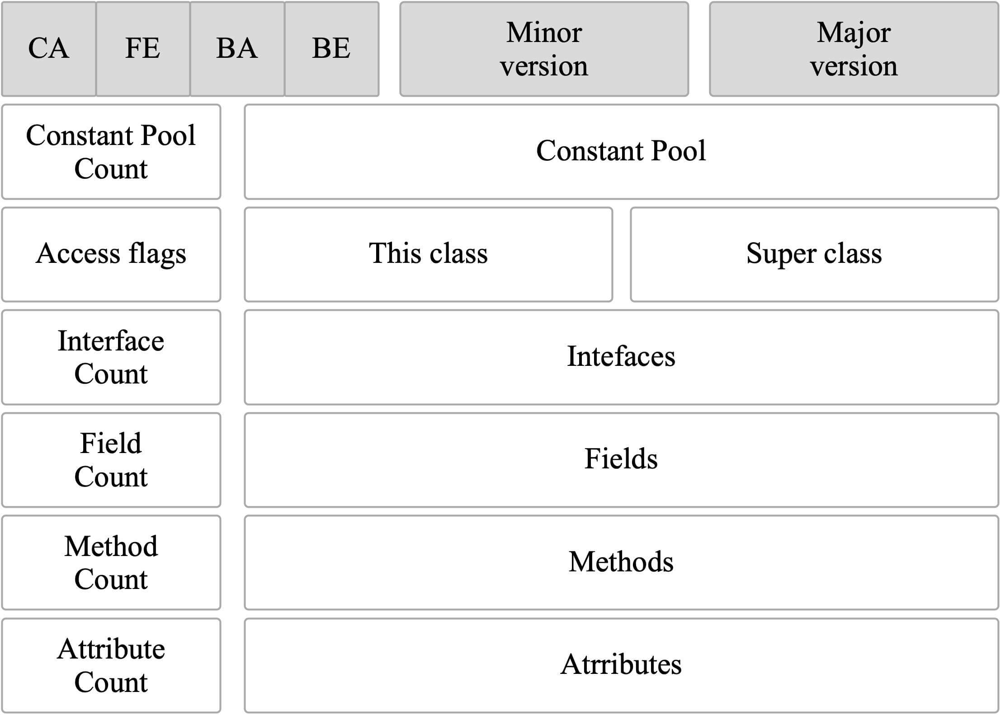

### 魔数（Magic Number）

```java
    u4             magic; //Class 文件的标志
```

每个 Class 文件的头 4 个字节称为魔数（Magic Number）,它的唯一作用是**确定这个文件是否为一个能被虚拟机接收的 Class 文件**。Java 规范规定魔数为固定值：0xCAFEBABE。如果读取的文件不是以这个魔数开头，Java 虚拟机将拒绝加载它。

### Class 文件版本号（Minor&Major Version）

```java
    u2             minor_version;//Class 的小版本号
    u2             major_version;//Class 的大版本号
```

紧接着魔数的四个字节存储的是 Class 文件的版本号：第 5 和第 6 个字节是**次版本号**，第 7 和第 8 个字节是**主版本号**。

每当 Java 发布大版本（比如 Java 8，Java9）的时候，主版本号都会加 1。你可以使用 `javap -v` 命令来快速查看 Class 文件的版本号信息。

高版本的 Java 虚拟机可以执行低版本编译器生成的 Class 文件，但是低版本的 Java 虚拟机不能执行高版本编译器生成的 Class 文件。所以，我们在实际开发的时候要确保开发的 JDK 版本和生产环境的 JDK 版本保持一致。

### 常量池（Constant Pool）

```java
    u2             constant_pool_count;//常量池的数量
    cp_info        constant_pool[constant_pool_count-1];//常量池
```

紧接着主次版本号之后的是常量池，常量池的数量是 `constant_pool_count-1`（**常量池计数器是从 1 开始计数的，将第 0 项常量空出来是有特殊考虑的，索引值为 0 代表“不引用任何一个常量池项”**）。

常量池主要存放两大常量：字面量和符号引用。字面量比较接近于 Java 语言层面的常量概念，如文本字符串、声明为 final 的常量值等。而符号引用则属于编译原理方面的概念。包括下面三类常量：

- 类和接口的全限定名
- 字段的名称和描述符
- 方法的名称和描述符

常量池中每一项常量都是一个表，这 14 种表有一个共同的特点：**开始的第一位是一个 u1 类型的标志位 -tag 来标识常量的类型，代表当前这个常量属于哪种常量类型．**

|               类型               | 标志（tag） |          描述          |
| :------------------------------: | :---------: | :--------------------: |
|        CONSTANT_utf8_info        |      1      |   UTF-8 编码的字符串   |
|      CONSTANT_Integer_info       |      3      |       整形字面量       |
|       CONSTANT_Float_info        |      4      |      浮点型字面量      |
|        CONSTANT_Long_info        |      5      |      长整型字面量      |
|       CONSTANT_Double_info       |      6      |   双精度浮点型字面量   |
|       CONSTANT_Class_info        |      7      |   类或接口的符号引用   |
|       CONSTANT_String_info       |      8      |    字符串类型字面量    |
|      CONSTANT_FieldRef_info      |      9      |     字段的符号引用     |
|     CONSTANT_MethodRef_info      |     10      |   类中方法的符号引用   |
| CONSTANT_InterfaceMethodRef_info |     11      |  接口中方法的符号引用  |
|    CONSTANT_NameAndType_info     |     12      |  字段或方法的符号引用  |
|     CONSTANT_MethodType_info     |     16      |      标志方法类型      |
|    CONSTANT_MethodHandle_info    |     15      |      表示方法句柄      |
|   CONSTANT_InvokeDynamic_info    |     18      | 表示一个动态方法调用点 |


### 访问标志(Access Flags)

```java
    u2             access_flags;//Class 的访问标记
```

在常量池结束之后，紧接着的两个字节代表访问标志，这个标志用于识别一些类或者接口层次的访问信息，包括：这个 Class 是类还是接口，是否为 `public` 或者 `abstract` 类型，如果是类的话是否声明为 `final` 等等。

类访问和属性修饰符:


### 当前类（This Class）、父类（Super Class）、接口（Interfaces）索引集合

```java
    u2             this_class;//当前类
    u2             super_class;//父类
    u2             interfaces_count;//接口数量
    u2             interfaces[interfaces_count];//一个类可以实现多个接口
```

Java 类的继承关系由类索引、父类索引和接口索引集合三项确定。类索引、父类索引和接口索引集合按照顺序排在访问标志之后，

类索引用于确定这个类的全限定名，父类索引用于确定这个类的父类的全限定名，由于 Java 语言的单继承，所以父类索引只有一个，除了 `java.lang.Object` 之外，所有的 Java 类都有父类，因此除了 `java.lang.Object` 外，所有 Java 类的父类索引都不为 0。

接口索引集合用来描述这个类实现了哪些接口，这些被实现的接口将按 `implements` (如果这个类本身是接口的话则是`extends`) 后的接口顺序从左到右排列在接口索引集合中。

### 字段表集合（Fields）

```java
    u2             fields_count;//字段数量
    field_info     fields[fields_count];//一个类会可以有个字段
```

字段表（field info）用于描述接口或类中声明的变量。字段包括类级变量以及实例变量，但不包括在方法内部声明的局部变量。

**field info(字段表) 的结构:**


- **access_flags:** 字段的作用域（`public` ,`private`,`protected`修饰符），是实例变量还是类变量（`static`修饰符）,可否被序列化（transient 修饰符）,可变性（final）,可见性（volatile 修饰符，是否强制从主内存读写）。
- **name_index:** 对常量池的引用，表示的字段的名称；
- **descriptor_index:** 对常量池的引用，表示字段和方法的描述符；
- **attributes_count:** 一个字段还会拥有一些额外的属性，attributes_count 存放属性的个数；
- **attributes[attributes_count]:** 存放具体属性具体内容。

上述这些信息中，各个修饰符都是布尔值，要么有某个修饰符，要么没有，很适合使用标志位来表示。而字段叫什么名字、字段被定义为什么数据类型这些都是无法固定的，只能引用常量池中常量来描述。

**字段的 access_flag 的取值:**


### 方法表集合（Methods）

```java
    u2             methods_count;//方法数量
    method_info    methods[methods_count];//一个类可以有多个方法
```

methods_count 表示方法的数量，而 method_info 表示方法表。

Class 文件存储格式中对方法的描述与对字段的描述几乎采用了完全一致的方式。方法表的结构如同字段表一样，依次包括了访问标志、名称索引、描述符索引、属性表集合几项。

**method_info(方法表的) 结构:**

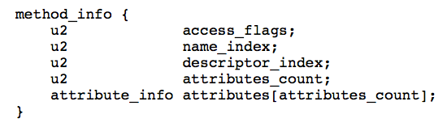

**方法表的 access_flag 取值：**

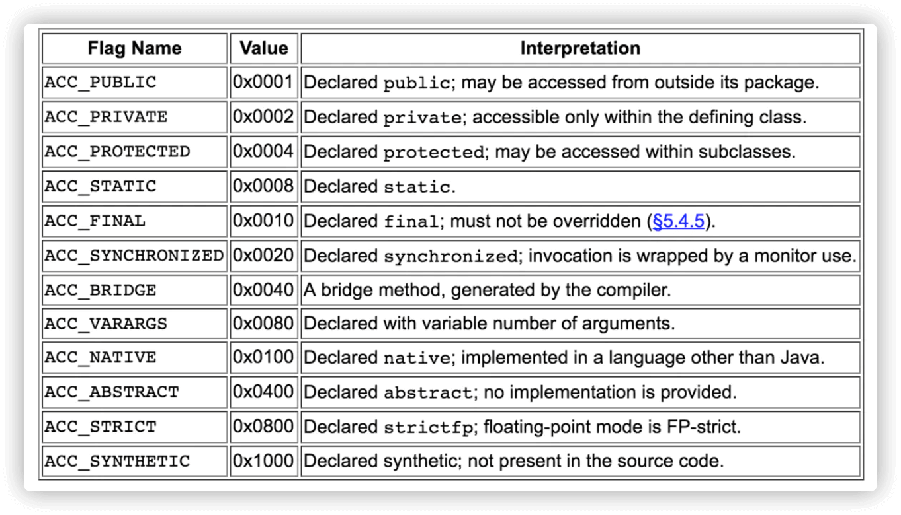

### 属性表集合（Attributes）

```java
   u2             attributes_count;//此类的属性表中的属性数
   attribute_info attributes[attributes_count];//属性表集合
```

在 Class 文件，字段表，方法表中都可以携带自己的属性表集合，以用于描述某些场景专有的信息。与 Class 文件中其它的数据项目要求的顺序、长度和内容不同，属性表集合的限制稍微宽松一些，不再要求各个属性表具有严格的顺序，并且只要不与已有的属性名重复，任何人实现的编译器都可以向属性表中写 入自己定义的属性信息，Java 虚拟机运行时会忽略掉它不认识的属性。

## 类的生命周期

类从被加载到虚拟机内存中开始到卸载出内存为止，它的整个生命周期可以简单概括为 7 个阶段：加载（Loading）、验证（Verification）、准备（Preparation）、解析（Resolution）、初始化（Initialization）、使用（Using）和卸载（Unloading）。其中，验证、准备和解析这三个阶段可以统称为连接（Linking）。

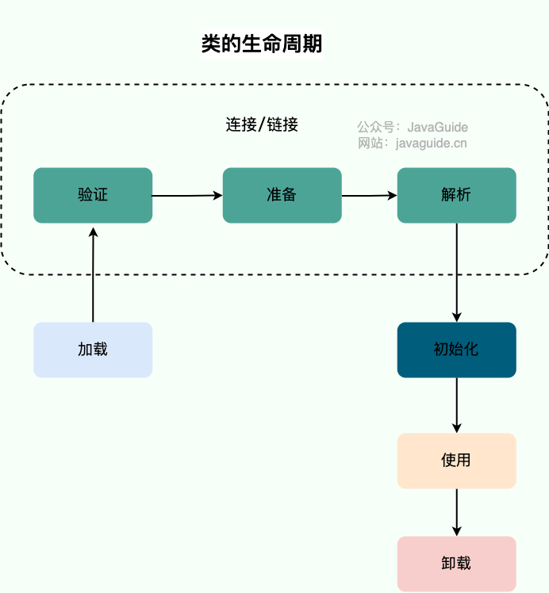

### 类加载过程

**Class 文件需要加载到虚拟机中之后才能运行和使用，那么虚拟机是如何加载这些 Class 文件呢？**

系统加载 Class 类型的文件主要三步：**加载->连接->初始化**。连接过程又可分为三步：**验证->准备->解析**。

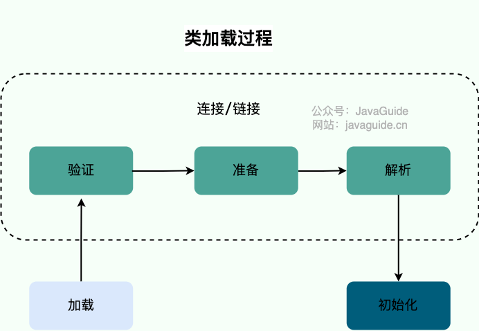

#### 加载

类加载过程的第一步，主要完成下面 3 件事情：

1. 通过全类名获取定义此类的二进制字节流。
2. 将字节流所代表的静态存储结构转换为方法区的运行时数据结构。
3. 在内存中生成一个代表该类的 `Class` 对象，作为方法区这些数据的访问入口。

虚拟机规范上面这 3 点并不具体，因此是非常灵活的。比如："通过全类名获取定义此类的二进制字节流" 并没有指明具体从哪里获取（ `ZIP`、 `JAR`、`EAR`、`WAR`、网络、动态代理技术运行时动态生成、其他文件生成比如 `JSP`...）、怎样获取。

加载这一步主要是通过我们后面要讲到的 **类加载器** 完成的。类加载器有很多种，当我们想要加载一个类的时候，具体是哪个类加载器加载由 **双亲委派模型** 决定（不过，我们也能打破双亲委派模型）。

每个 Java 类都有一个引用指向加载它的 `ClassLoader`。不过，数组类不是通过 `ClassLoader` 创建的，而是 JVM 在需要的时候自动创建的，数组类通过`getClassLoader()`方法获取 `ClassLoader` 的时候和该数组的元素类型的 `ClassLoader` 是一致的。

一个非数组类的加载阶段（加载阶段获取类的二进制字节流的动作）是可控性最强的阶段，这一步我们可以去完成还可以自定义类加载器去控制字节流的获取方式（重写一个类加载器的 `loadClass()` 方法）。

加载阶段与连接阶段的部分动作(如一部分字节码文件格式验证动作)是交叉进行的，加载阶段尚未结束，连接阶段可能就已经开始了。

#### 验证

**验证是连接阶段的第一步，这一阶段的目的是确保 Class 文件的字节流中包含的信息符合《Java 虚拟机规范》的全部约束要求，保证这些信息被当作代码运行后不会危害虚拟机自身的安全。**

验证阶段这一步在整个类加载过程中耗费的资源还是相对较多的，但很有必要，可以有效防止恶意代码的执行。任何时候，程序安全都是第一位。

验证阶段主要由四个检验阶段组成：

1. 文件格式验证（Class 文件格式检查）
2. 元数据验证（字节码语义检查）
3. 字节码验证（程序语义检查）
4. 符号引用验证（类的正确性检查）

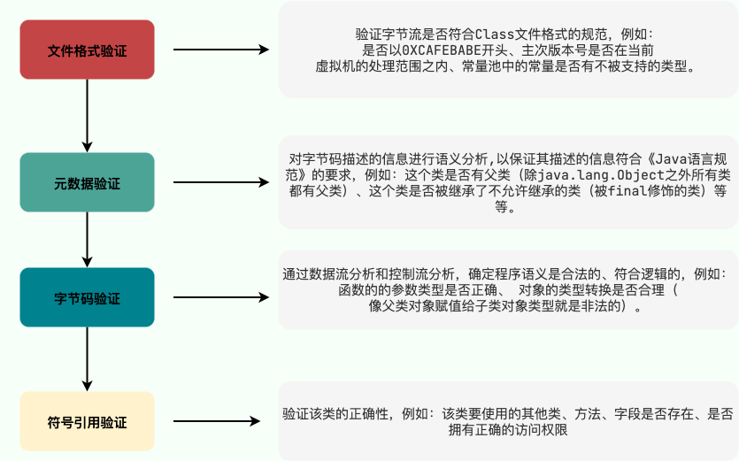

文件格式验证这一阶段是基于该类的二进制字节流进行的，主要目的是保证输入的字节流能正确地解析并存储于方法区之内，格式上符合描述一个 Java 类型信息的要求。除了这一阶段之外，其余三个验证阶段都是基于方法区的存储结构上进行的，不会再直接读取、操作字节流了。

符号引用验证发生在类加载过程中的解析阶段，具体点说是 JVM 将符号引用转化为直接引用的时候。

符号引用验证的主要目的是确保解析阶段能正常执行，如果无法通过符号引用验证，JVM 会抛出异常，比如：

- `java.lang.IllegalAccessError`：当类试图访问或修改它没有权限访问的字段，或调用它没有权限访问的方法时，抛出该异常。
- `java.lang.NoSuchFieldError`：当类试图访问或修改一个指定的对象字段，而该对象不再包含该字段时，抛出该异常。
- `java.lang.NoSuchMethodError`：当类试图访问一个指定的方法，而该方法不存在时，抛出该异常。


#### 准备

**准备阶段是正式为类变量分配内存并设置类变量初始值的阶段**，这些内存都将在方法区中分配。对于该阶段有以下几点需要注意：

1. 这时候进行内存分配的仅包括类变量（ Class Variables ，即静态变量，被 `static` 关键字修饰的变量，只与类相关，因此被称为类变量），而不包括实例变量。实例变量会在对象实例化时随着对象一块分配在 Java 堆中。
2. 从概念上讲，类变量所使用的内存都应当在 **方法区** 中进行分配。不过有一点需要注意的是：JDK 7 之前，HotSpot 使用永久代来实现方法区的时候，实现是完全符合这种逻辑概念的。 而在 JDK 7 及之后，HotSpot 已经把原本放在永久代的字符串常量池、静态变量等移动到堆中，这个时候类变量则会随着 Class 对象一起存放在 Java 堆中。
3. 这里所设置的初始值"通常情况"下是数据类型默认的零值（如 0、0L、null、false 等），比如我们定义了`public static int value=111` ，那么 value 变量在准备阶段的初始值就是 0 而不是 111（初始化阶段才会赋值）。特殊情况：比如给 value 变量加上了 final 关键字`public static final int value=111` ，那么准备阶段 value 的值就被赋值为 111。

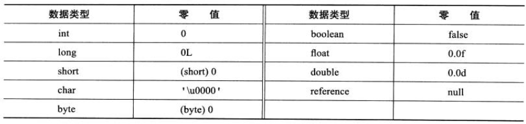

#### 解析

**解析阶段是虚拟机将常量池内的符号引用替换为直接引用的过程。** 解析动作主要针对类或接口、字段、类方法、接口方法、方法类型、方法句柄和调用限定符 7 类符号引用进行。


#### 初始化

**初始化阶段是执行初始化方法 `<clinit> ()`方法的过程，是类加载的最后一步，这一步 JVM 才开始真正执行类中定义的 Java 程序代码(字节码)。**

`<clinit> ()`按源码顺序执行：

- 静态变量赋值
- 静态代码块
- 父类优先初始化

对于`<clinit> ()` 方法的调用，虚拟机会自己确保其在多线程环境中的安全性。因为 `<clinit> ()` 方法是带锁线程安全，所以在多线程环境下进行类初始化的话可能会引起多个线程阻塞，并且这种阻塞很难被发现。

对于初始化阶段，虚拟机严格规范了有且只有 6 种情况下，必须对类进行初始化(只有主动去使用类才会初始化类)：

1. 遇到 `new`、`getstatic`、`putstatic`或 `invokestatic`这 4 条字节码指令时： 
   - `new`: 创建一个类的实例对象。
   - `getstatic`、`putstatic`: 读取或设置一个类型的静态字段（被 `final` 修饰、已在编译期把结果放入常量池的静态字段除外）。
   - `invokestatic`: 调用类的静态方法。
2. 使用 `java.lang.reflect` 包的方法对类进行反射调用时如 `Class.forName("...")`, `newInstance()` 等等。如果类没初始化，需要触发其初始化。
3. 初始化一个类，如果其父类还未初始化，则先触发该父类的初始化。
4. 当虚拟机启动时，用户需要定义一个要执行的主类 (包含 `main` 方法的那个类)，虚拟机会先初始化这个类。
5. `MethodHandle` 和 `VarHandle` 可以看作是轻量级的反射调用机制，而要想使用这 2 个调用，就必须先使用 `findStaticVarHandle` 来初始化要调用的类。

#### 类卸载

**卸载类即该类的 Class 对象被 GC。**

卸载类需要满足 3 个要求:

1. 该类的所有的实例对象都已被 GC，也就是说堆不存在该类的实例对象。
2. 该类没有在其他任何地方被引用
3. 该类的类加载器的实例已被 GC

所以，在 JVM 生命周期内，由 jvm 自带的类加载器加载的类是不会被卸载的。但是由我们自定义的类加载器加载的类是可能被卸载的。

只要想通一点就好了，JDK 自带的 `BootstrapClassLoader`, `ExtClassLoader`, `AppClassLoader` 负责加载 JDK 提供的类，所以它们(类加载器的实例)肯定不会被回收。而我们自定义的类加载器的实例是可以被回收的，所以使用我们自定义加载器加载的类是可以被卸载掉的。

## 类加载器

类加载器从 JDK 1.0 就出现了，最初只是为了满足 Java Applet（已经被淘汰） 的需要。后来，慢慢成为 Java 程序中的一个重要组成部分，赋予了 Java 类可以被动态加载到 JVM 中并执行的能力。

- 类加载器是一个负责加载类的对象，用于实现类加载过程中的加载这一步。
- 每个 Java 类都有一个引用指向加载它的 `ClassLoader`。
- 数组类不是通过 `ClassLoader` 创建的（数组类没有对应的二进制字节流），是由 JVM 直接生成的。

### 类加载器加载规则

JVM 启动的时候，并不会一次性加载所有的类，而是根据需要去动态加载。也就是说，大部分类在具体用到的时候才会去加载，这样对内存更加友好。

对于已经加载的类会被放在 `ClassLoader` 中。在类加载的时候，系统会首先判断当前类是否被加载过。已经被加载的类会直接返回，否则才会尝试加载。也就是说，对于一个类加载器来说，相同二进制名称的类只会被加载一次。

```java
public abstract class ClassLoader {
  ...
  private final ClassLoader parent;
  // 由这个类加载器加载的类。
  private final Vector<Class<?>> classes = new Vector<>();
  // 由VM调用，用此类加载器记录每个已加载类。
  void addClass(Class<?> c) {
        classes.addElement(c);
   }
  ...
}
```

### 类加载器总结

JVM 中内置了三个重要的 `ClassLoader`：

1. **`BootstrapClassLoader`(启动类加载器)**：最顶层的加载类，由 C++实现，通常表示为 null，并且没有父级，主要用来加载 JDK 内部的核心类库（ `%JAVA_HOME%/lib`目录下的 `rt.jar`、`resources.jar`、`charsets.jar`等 jar 包和类）以及被 `-Xbootclasspath`参数指定的路径下的所有类。
2. **`ExtensionClassLoader`(扩展类加载器)**：主要负责加载 `%JRE_HOME%/lib/ext` 目录下的 jar 包和类以及被 `java.ext.dirs` 系统变量所指定的路径下的所有类。
3. **`AppClassLoader`(应用程序类加载器)**：面向我们用户的加载器，负责加载当前应用 classpath 下的所有 jar 包和类。

> **`rt.jar`**：rt 代表“RunTime”，`rt.jar`是 Java 基础类库，包含 Java doc 里面看到的所有的类的类文件。也就是说，我们常用内置库 `java.xxx.*`都在里面，比如`java.util.*`、`java.io.*`、`java.nio.*`、`java.lang.*`、`java.sql.*`、`java.math.*`。
>
> Java 9 引入了模块系统，并且略微更改了上述的类加载器。扩展类加载器被改名为平台类加载器（platform class loader）。Java SE 中除了少数几个关键模块，比如说 `java.base` 是由启动类加载器加载之外，其他的模块均由平台类加载器所加载。

除了这三种类加载器之外，用户还可以加入自定义的类加载器来进行拓展，以满足自己的特殊需求。就比如说，我们可以对 Java 类的字节码（ `.class` 文件）进行加密，加载时再利用自定义的类加载器对其解密。

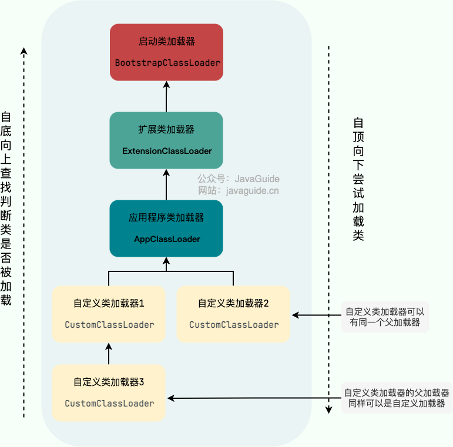

除了 `BootstrapClassLoader` 是 JVM 自身的一部分之外，其他所有的类加载器都是在 JVM 外部实现的，并且全都继承自 `ClassLoader`抽象类。这样做的好处是用户可以自定义类加载器，以便让应用程序自己决定如何去获取所需的类。

每个 `ClassLoader` 可以通过`getParent()`获取其父 `ClassLoader`，如果获取到的 `ClassLoader` 为`null`的话，那么该类加载器的父类加载器是 `BootstrapClassLoader` 。

### [自定义类加载器](#自定义类加载器)

我们前面也说说了，除了 `BootstrapClassLoader` 其他类加载器均由 Java 实现且全部继承自`java.lang.ClassLoader`。如果我们要自定义自己的类加载器，很明显需要继承 `ClassLoader`抽象类。

`ClassLoader` 类有两个关键的方法：

- `protected Class loadClass(String name, boolean resolve)`：加载指定二进制名称的类，实现了双亲委派机制 。`name` 为类的二进制名称，`resolve` 如果为 true，在加载时调用 `resolveClass(Class<?> c)` 方法解析该类。
- `protected Class findClass(String name)`：根据类的二进制名称来查找类，默认实现是空方法。

官方 API 文档中写到：

> Subclasses of `ClassLoader` are encouraged to override `findClass(String name)`, rather than this method.
>
> 建议 `ClassLoader`的子类重写 `findClass(String name)`方法而不是`loadClass(String name, boolean resolve)` 方法。

如果我们不想打破双亲委派模型，就重写 `ClassLoader` 类中的 `findClass()` 方法即可，无法被父类加载器加载的类最终会通过这个方法被加载。但是，如果想打破双亲委派模型则需要重写 `loadClass()` 方法。

## 双亲委派模型

- `ClassLoader` 类使用委托模型来搜索类和资源。
- 双亲委派模型要求除了顶层的启动类加载器外，其余的类加载器都应有自己的父类加载器。
- `ClassLoader` 实例会在试图亲自查找类或资源之前，将搜索类或资源的任务委托给其父类加载器。


注意 ⚠️：双亲委派模型并不是一种强制性的约束，只是 JDK 官方推荐的一种方式。如果我们因为某些特殊需求想要打破双亲委派模型，也是可以的

### 双亲委派模型的执行流程

```java
protected Class<?> loadClass(String name, boolean resolve)
    throws ClassNotFoundException
{
    synchronized (getClassLoadingLock(name)) {
        //首先，检查该类是否已经加载过
        Class c = findLoadedClass(name);
        if (c == null) {
            //如果 c 为 null，则说明该类没有被加载过
            long t0 = System.nanoTime();
            try {
                if (parent != null) {
                    //当父类的加载器不为空，则通过父类的loadClass来加载该类
                    c = parent.loadClass(name, false);
                } else {
                    //当父类的加载器为空，则调用启动类加载器来加载该类
                    c = findBootstrapClassOrNull(name);
                }
            } catch (ClassNotFoundException e) {
                //非空父类的类加载器无法找到相应的类，则抛出异常
            }

            if (c == null) {
                //当父类加载器无法加载时，则调用findClass方法来加载该类
                //用户可通过覆写该方法，来自定义类加载器
                long t1 = System.nanoTime();
                c = findClass(name);

                //用于统计类加载器相关的信息
                sun.misc.PerfCounter.getParentDelegationTime().addTime(t1 - t0);
                sun.misc.PerfCounter.getFindClassTime().addElapsedTimeFrom(t1);
                sun.misc.PerfCounter.getFindClasses().increment();
            }
        }
        if (resolve) {
            //对类进行link操作
            resolveClass(c);
        }
        return c;
    }
}
```

每当一个类加载器接收到加载请求时，它会先将请求转发给父类加载器。在父类加载器没有找到所请求的类的情况下，该类加载器才会尝试去加载。

结合上面的源码，简单总结一下双亲委派模型的执行流程：

- 在类加载的时候，系统会首先判断当前类是否被加载过。已经被加载的类会直接返回，否则才会尝试加载（每个父类加载器都会走一遍这个流程）。
- 类加载器在进行类加载的时候，它首先不会自己去尝试加载这个类，而是把这个请求委派给父类加载器去完成（调用父加载器 `loadClass()`方法来加载类）。这样的话，所有的请求最终都会传送到顶层的启动类加载器 `BootstrapClassLoader` 中。
- 只有当父加载器反馈自己无法完成这个加载请求（它的搜索范围中没有找到所需的类）时，子加载器才会尝试自己去加载（调用自己的 `findClass()` 方法来加载类）。
- 如果子类加载器也无法加载这个类，那么它会抛出一个 `ClassNotFoundException` 异常。

### 双亲委派模型的好处

双亲委派模型是 Java 类加载机制的重要组成部分，它通过委派父加载器优先加载类的方式，实现了两个关键的安全目标：避免类的重复加载和防止核心 API 被篡改。

JVM 区分不同类的依据是类名加上加载该类的类加载器，即使类名相同，如果由不同的类加载器加载，也会被视为不同的类。 双亲委派模型确保核心类总是由 `BootstrapClassLoader` 加载，保证了核心类的唯一性。

例如，当应用程序尝试加载 `java.lang.Object` 时，`AppClassLoader` 会首先将请求委派给 `ExtClassLoader`，`ExtClassLoader` 再委派给 `BootstrapClassLoader`。`BootstrapClassLoader` 会在 JRE 核心类库中找到并加载 `java.lang.Object`，从而保证应用程序使用的是 JRE 提供的标准版本。

### 打破双亲委派模型方法

自定义加载器的话，需要继承 `ClassLoader` 。如果我们不想打破双亲委派模型，就重写 `ClassLoader` 类中的 `findClass()` 方法即可，无法被父类加载器加载的类最终会通过这个方法被加载。但是，如果想打破双亲委派模型则需要重写 `loadClass()` 方法。


## JDK 命令行工具

这些命令在 JDK 安装目录下的 bin 目录下：

- **`jps`** (JVM Process Status）: 类似 UNIX 的 `ps` 命令。用于查看所有 Java 进程的启动类、传入参数和 Java 虚拟机参数等信息；
- **`jstat`**（JVM Statistics Monitoring Tool）: 用于收集 HotSpot 虚拟机各方面的运行数据;
- **`jinfo`** (Configuration Info for Java) : Configuration Info for Java,显示虚拟机配置信息;
- **`jmap`** (Memory Map for Java) : 生成堆转储快照;
- **`jhat`** (JVM Heap Dump Browser) : 用于分析 heapdump 文件，它会建立一个 HTTP/HTML 服务器，让用户可以在浏览器上查看分析结果。JDK9 移除了 jhat；
- **`jstack`** (Stack Trace for Java) : 生成虚拟机当前时刻的线程快照，线程快照就是当前虚拟机内每一条线程正在执行的方法堆栈的集合。

## [JDK 可视化分析工具](https://javaguide.cn/java/jvm/jdk-monitoring-and-troubleshooting-tools.html#jdk-可视化分析工具)

- JConsole:Java 监视与管理控制台
- Visual VM:多合一故障处理工具
- MAT：内存分析器工具


