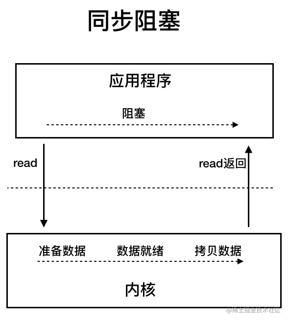
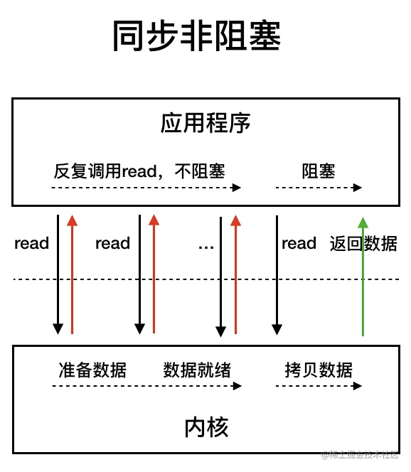
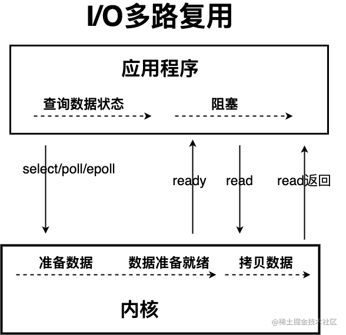
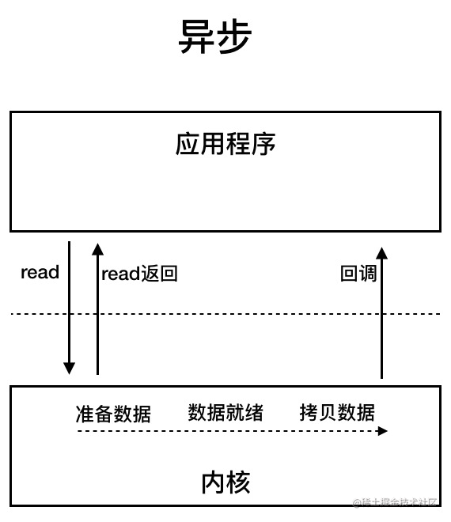

# Java IO

IO 即 `Input/Output`，输入和输出。数据输入到计算机内存的过程即输入，反之输出到外部存储（比如数据库，文件，远程主机）的过程即输出。数据传输过程类似于水流，因此称为 IO 流。IO 流在 Java 中分为输入流和输出流，而根据数据的处理方式又分为字节流和字符流。

Java IO 流的 40 多个类都是从如下 4 个抽象类基类中派生出来的。

- `InputStream`/`Reader`: 所有的输入流的基类，前者是字节输入流，后者是字符输入流。
- `OutputStream`/`Writer`: 所有输出流的基类，前者是字节输出流，后者是字符输出流。

## 字节流

**InputStream**

`InputStream`用于从源头（通常是文件）读取数据（字节信息）到内存中，`java.io.InputStream`抽象类是所有字节输入流的父类。

`InputStream` 常用方法：

- `read()`：返回输入流中下一个字节的数据。返回的值介于 0 到 255 之间。如果未读取任何字节，则代码返回 `-1` ，表示文件结束。
- `read(byte b[ ])` : 从输入流中读取一些字节存储到数组 `b` 中。如果数组 `b` 的长度为零，则不读取。如果没有可用字节读取，返回 `-1`。如果有可用字节读取，则最多读取的字节数最多等于 `b.length` ， 返回读取的字节数。这个方法等价于 `read(b, 0, b.length)`。
- `read(byte b[], int off, int len)`：在`read(byte b[ ])` 方法的基础上增加了 `off` 参数（偏移量）和 `len` 参数（要读取的最大字节数）。
- `skip(long n)`：忽略输入流中的 n 个字节 ,返回实际忽略的字节数。
- `available()`：返回输入流中可以读取的字节数。
- `close()`：关闭输入流释放相关的系统资源。

从 Java 9 开始，`InputStream` 新增加了多个实用的方法：

- `readAllBytes()`：读取输入流中的所有字节，返回字节数组。
- `readNBytes(byte[] b, int off, int len)`：阻塞直到读取 `len` 个字节。
- `transferTo(OutputStream out)`：将所有字节从一个输入流传递到一个输出流。

**OutputStream**

`OutputStream`用于将数据（字节信息）写入到目的地（通常是文件），`java.io.OutputStream`抽象类是所有字节输出流的父类。

`OutputStream` 常用方法：

- `write(int b)`：将特定字节写入输出流。
- `write(byte b[ ])` : 将数组`b` 写入到输出流，等价于 `write(b, 0, b.length)` 。
- `write(byte[] b, int off, int len)` : 在`write(byte b[ ])` 方法的基础上增加了 `off` 参数（偏移量）和 `len` 参数（要读取的最大字节数）。
- `flush()`：刷新此输出流并强制写出所有缓冲的输出字节。
- `close()`：关闭输出流释放相关的系统资源。

## 字符流

**Reader**

`Reader`用于从源头（通常是文件）读取数据（字符信息）到内存中，`java.io.Reader`抽象类是所有字符输入流的父类。

`Reader` 用于读取文本， `InputStream` 用于读取原始字节。

`Reader` 常用方法：

- `read()` : 从输入流读取一个字符。
- `read(char[] cbuf)` : 从输入流中读取一些字符，并将它们存储到字符数组 `cbuf`中，等价于 `read(cbuf, 0, cbuf.length)` 。
- `read(char[] cbuf, int off, int len)`：在`read(char[] cbuf)` 方法的基础上增加了 `off` 参数（偏移量）和 `len` 参数（要读取的最大字符数）。
- `skip(long n)`：忽略输入流中的 n 个字符 ,返回实际忽略的字符数。
- `close()` : 关闭输入流并释放相关的系统资源。

**Writer**

`Writer`用于将数据（字符信息）写入到目的地（通常是文件），`java.io.Writer`抽象类是所有字符输出流的父类。

`Writer` 常用方法：

- `write(int c)` : 写入单个字符。
- `write(char[] cbuf)`：写入字符数组 `cbuf`，等价于`write(cbuf, 0, cbuf.length)`。
- `write(char[] cbuf, int off, int len)`：在`write(char[] cbuf)` 方法的基础上增加了 `off` 参数（偏移量）和 `len` 参数（要读取的最大字符数）。
- `write(String str)`：写入字符串，等价于 `write(str, 0, str.length())` 。
- `write(String str, int off, int len)`：在`write(String str)` 方法的基础上增加了 `off` 参数（偏移量）和 `len` 参数（要读取的最大字符数）。
- `append(CharSequence csq)`：将指定的字符序列附加到指定的 `Writer` 对象并返回该 `Writer` 对象。
- `append(char c)`：将指定的字符附加到指定的 `Writer` 对象并返回该 `Writer` 对象。
- `flush()`：刷新此输出流并强制写出所有缓冲的输出字符。
- `close()`:关闭输出流释放相关的系统资源。

`OutputStreamWriter` 是字符流转换为字节流的桥梁，其子类 `FileWriter` 是基于该基础上的封装，可以直接将字符写入到文件。

## 字节缓冲流

IO 操作是很消耗性能的，缓冲流将数据加载至缓冲区，一次性读取/写入多个字节，从而避免频繁的 IO 操作，提高流的传输效率。

字节缓冲流这里采用了装饰器模式来增强 `InputStream` 和`OutputStream`子类对象的功能。

字节流和字节缓冲流的性能差别主要体现在我们使用两者的时候都是调用 `write(int b)` 和 `read()` 这两个一次只读取一个字节的方法的时候。由于字节缓冲流内部有缓冲区（字节数组），因此，字节缓冲流会先将读取到的字节存放在缓存区，大幅减少 IO 次数，提高读取效率。

**BufferedInputStream**

`BufferedInputStream` 从源头（通常是文件）读取数据（字节信息）到内存的过程中不会一个字节一个字节的读取，而是会先将读取到的字节存放在缓存区，并从内部缓冲区中单独读取字节。这样大幅减少了 IO 次数，提高了读取效率。

**BufferedOutputStream**

`BufferedOutputStream` 将数据（字节信息）写入到目的地（通常是文件）的过程中不会一个字节一个字节的写入，而是会先将要写入的字节存放在缓存区，并从内部缓冲区中单独写入字节。这样大幅减少了 IO 次数，提高了效率

## IO模型

UNIX 系统下， IO 模型一共有 5 种：**同步阻塞 I/O**、**同步非阻塞 I/O**、**I/O 多路复用**、**信号驱动 I/O** 和**异步 I/O**。

## Java 中 3 种常见 IO 模型

### BIO (Blocking I/O)

**BIO 属于同步阻塞 IO 模型** 。同步阻塞 IO 模型中，应用程序发起 read 调用后，会一直阻塞，直到内核把数据拷贝到用户空间。

### NIO (Non-blocking/New I/O)

Java 中的 NIO 于 Java 1.4 中引入，对应 `java.nio` 包，提供了 `Channel` , `Selector`，`Buffer` 等抽象。NIO 中的 N 可以理解为 Non-blocking，不单纯是 New。它是支持面向缓冲的，基于通道的 I/O 操作方法。 对于高负载、高并发的（网络）应用，应使用 NIO 。

Java 中的 NIO 可以看作是 **I/O 多路复用模型**。也有很多人认为，Java 中的 NIO 属于同步非阻塞 IO 模型。

同步非阻塞 IO 模型中，应用程序会一直发起 read 调用，等待数据从内核空间拷贝到用户空间的这段时间里，线程依然是阻塞的，直到在内核把数据拷贝到用户空间。

相比于同步阻塞 IO 模型，同步非阻塞 IO 模型确实有了很大改进。通过轮询操作，避免了一直阻塞。

但是，这种 IO 模型同样存在问题：**应用程序不断进行 I/O 系统调用轮询数据是否已经准备好的过程是十分消耗 CPU 资源的。**

这个时候，**I/O 多路复用模型** 就上场了。

### AIO (Asynchronous I/O)

AIO 也就是 NIO 2。Java 7 中引入了 NIO 的改进版 NIO 2,它是异步 IO 模型。

异步 IO 是基于事件和回调机制实现的，也就是应用操作之后会直接返回，不会堵塞在那里，当后台处理完成，操作系统会通知相应的线程进行后续的操作

Java 对零拷贝的支持：

- `MappedByteBuffer` 是 NIO 基于内存映射（`mmap`）这种零拷⻉⽅式的提供的⼀种实现，底层实际是调用了 Linux 内核的 `mmap` 系统调用。它可以将一个文件或者文件的一部分映射到内存中，形成一个虚拟内存文件，这样就可以直接操作内存中的数据，而不需要通过系统调用来读写文件。
- `FileChannel` 的`transferTo()/transferFrom()`是 NIO 基于发送文件（`sendfile`）这种零拷贝方式的提供的一种实现，底层实际是调用了 Linux 内核的 `sendfile`系统调用。它可以直接将文件数据从磁盘发送到网络，而不需要经过用户空间的缓冲区。

