# Java基础

## Java 语言有哪些特点?

1. 面向对象（封装，继承，多态）；
2. 平台无关性（ Java 虚拟机实现平台无关性）；
3. 可靠性（具备异常处理和自动内存管理机制）；
4. 安全性（Java 语言本身的设计就提供了多重安全防护机制如访问权限修饰符、限制程序直接访问操作系统资源）；
5. 强大的生态

### 封装、继承、多态

## Java SE vs Java EE

- Java SE（Java Platform，Standard Edition）: Java 平台标准版，Java 编程语言的基础，它包含了支持 Java 应用程序开发和运行的核心类库以及虚拟机等核心组件。Java SE 可以用于构建桌面应用程序或简单的服务器应用程序。
- Java EE（Java Platform, Enterprise Edition) : Java 平台企业版，建立在 Java SE 的基础上，包含了支持企业级应用程序开发和部署的标准和规范（比如 Servlet、JSP、EJB、JDBC、JPA、JTA、JavaMail、JMS）。 Java EE 可以用于构建分布式、可移植、健壮、可伸缩和安全的服务端 Java 应用程序，例如 Web 应用程序。

## JVM vs JDK vs JRE

**JVM**

Java 虚拟机（Java Virtual Machine, JVM）是运行 Java 字节码的虚拟机。JVM 有针对不同系统的特定实现（Windows，Linux，macOS），目的是使用相同的字节码，它们都会给出相同的结果。字节码和不同系统的 JVM 实现是 Java 语言“一次编译，随处可以运行”的关键所在。


**JDK 和 JRE**

JDK（Java Development Kit）是一个功能齐全的 Java 开发工具包，供开发者使用，用于创建和编译 Java 程序。它包含了 JRE（Java Runtime Environment），以及编译器 javac 和其他工具，如 javadoc（文档生成器）、jdb（调试器）、jconsole（监控工具）、javap（反编译工具）等。

JRE 是运行已编译 Java 程序所需的环境，主要包含以下两个部分：

1. **JVM** : 也就是我们上面提到的 Java 虚拟机。
2. **Java 基础类库（Class Library）**：一组标准的类库，提供常用的功能和 API（如 I/O 操作、网络通信、数据结构等）。

简单来说，JRE 只包含运行 Java 程序所需的环境和类库，而 JDK 不仅包含 JRE，还包括用于开发和调试 Java 程序的工具。

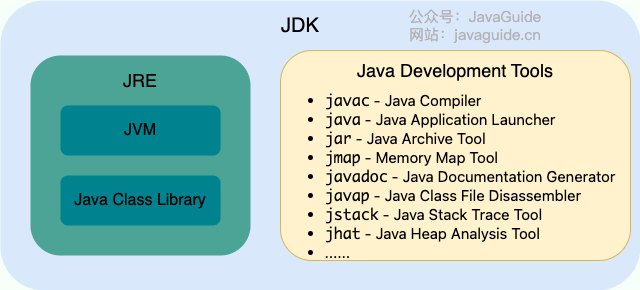

> 在JDK9后，不再区分JDK和JRE的关系，取而代之的是模块系统（JDK 被重新组织成 94 个模块）+ [jlink](http://openjdk.java.net/jeps/282) 工具，在引入了模块系统之后，JDK 被重新组织成 94 个模块。Java 应用可以通过新增的 jlink 工具，创建出只包含所依赖的 JDK 模块的自定义运行时镜像。这样可以极大的减少 Java 运行时环境的大小。也就是说，可以用 jlink 根据自己的需求，创建一个更小的 runtime（运行时），而不是不管什么应用，都是同样的 JRE。定制的、模块化的 Java 运行时映像有助于简化 Java 应用的部署和节省内存并增强安全性和可维护性。

## 什么是字节码?采用字节码的好处是什么?

在 Java 中，JVM 可以理解的代码就叫做字节码（即扩展名为 `.class` 的文件），它不面向任何特定的处理器，只面向虚拟机。Java 语言通过字节码的方式，在一定程度上解决了传统解释型语言执行效率低的问题，同时又保留了解释型语言可移植的特点。所以， Java 程序运行时相对来说还是高效的（不过，和 C、 C++，Rust，Go 等语言还是有一定差距的），而且，由于字节码并不针对一种特定的机器，因此，Java 程序无须重新编译便可在多种不同操作系统的计算机上运行。

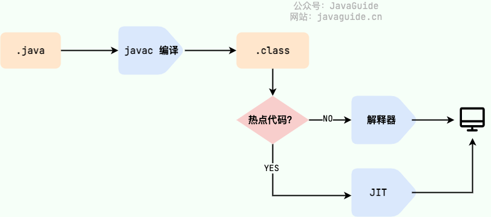

> 我们需要格外注意的是 `.class->机器码` 这一步。在这一步 JVM 类加载器首先加载字节码文件，然后通过解释器逐行解释执行，这种方式的执行速度会相对比较慢。而且，有些方法和代码块是经常需要被调用的(也就是所谓的热点代码)，所以后面引进了 **JIT（Just in Time Compilation）** 编译器，而 JIT 属于运行时编译。当 JIT 编译器完成第一次编译后，其会将字节码对应的机器码保存下来，下次可以直接使用。而我们知道，机器码的运行效率肯定是高于 Java 解释器的。这也解释了我们为什么经常会说 **Java 是编译与解释共存的语言** 。


## 为什么说 Java 语言“编译与解释并存”？

- **编译型**：[编译型语言](https://zh.wikipedia.org/wiki/編譯語言) 会通过[编译器](https://zh.wikipedia.org/wiki/編譯器)将源代码一次性翻译成可被该平台执行的机器码。一般情况下，编译语言的执行速度比较快，开发效率比较低。常见的编译性语言有 C、C++、Go、Rust 等等。
- **解释型**：[解释型语言](https://zh.wikipedia.org/wiki/直譯語言)会通过[解释器](https://zh.wikipedia.org/wiki/直譯器)一句一句的将代码解释（interpret）为机器代码后再执行。解释型语言开发效率比较快，执行速度比较慢。常见的解释性语言有 Python、JavaScript、PHP 等等。

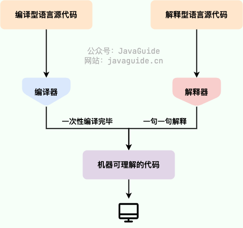

**为什么说 Java 语言“编译与解释并存”？**

这是因为 Java 语言既具有编译型语言的特征，也具有解释型语言的特征。因为 Java 程序要经过先编译，后解释两个步骤，由 Java 编写的程序需要先经过编译步骤，生成字节码（`.class` 文件），这种字节码必须由 Java 解释器来解释执行。

## AOT 有什么优点？为什么不全部使用 AOT 呢？

JDK 9 引入了一种新的编译模式 **AOT(Ahead of Time Compilation)** 。和 JIT 不同的是，这种编译模式会在程序被执行前就将其编译成机器码，属于静态编译（C、 C++，Rust，Go 等语言就是静态编译）。AOT 避免了 JIT 预热等各方面的开销，可以提高 Java 程序的启动速度，避免预热时间长。并且，AOT 还能减少内存占用和增强 Java 程序的安全性（AOT 编译后的代码不容易被反编译和修改），特别适合云原生场景。

**既然 AOT 这么多优点，那为什么不全部使用这种编译方式呢？**

我们前面也对比过 JIT 与 AOT，两者各有优点，只能说 AOT 更适合当下的云原生场景，对微服务架构的支持也比较友好。除此之外，AOT 编译无法支持 Java 的一些动态特性，如反射、动态代理、动态加载、JNI（Java Native Interface）等。然而，很多框架和库（如 Spring、CGLIB）都用到了这些特性。如果只使用 AOT 编译，那就没办法使用这些框架和库了，或者说需要针对性地去做适配和优化。举个例子，CGLIB 动态代理使用的是 ASM 技术，而这种技术大致原理是运行时直接在内存中生成并加载修改后的字节码文件也就是 `.class` 文件，如果全部使用 AOT 提前编译，也就不能使用 ASM 技术了。为了支持类似的动态特性，所以选择使用 JIT 即时编译器。


## Java 和 C++ 的区别?

- Java 不提供指针来直接访问内存，程序内存更加安全
- Java 的类是单继承的，C++ 支持多重继承；虽然 Java 的类不可以多继承，但是接口可以多继承。
- Java 有自动内存管理垃圾回收机制(GC)，不需要程序员手动释放无用内存。
- C ++同时支持方法重载和操作符重载，但是 Java 只支持方法重载（操作符重载增加了复杂性，这与 Java 最初的设计思想不符）。

## 注释有哪几种形式？

1. **单行注释**：通常用于解释方法内某单行代码的作用。
2. **多行注释**：通常用于解释一段代码的作用。
3. **文档注释**：通常用于生成 Java 开发文档。

## 标识符和关键字的区别是什么？

在我们编写程序的时候，需要大量地为程序、类、变量、方法等取名字，于是就有了 **标识符** 。简单来说， **标识符就是一个名字** 。

有一些标识符，Java 语言已经赋予了其特殊的含义，只能用于特定的地方，这些特殊的标识符就是 **关键字** 。简单来说，**关键字是被赋予特殊含义的标识符** 。比如，在我们的日常生活中，如果我们想要开一家店，则要给这个店起一个名字，起的这个“名字”就叫标识符。但是我们店的名字不能叫“警察局”，因为“警察局”这个名字已经被赋予了特殊的含义，而“警察局”就是我们日常生活中的关键字。

## Java 语言关键字有哪些？

| 分类                 | 关键字   |            |          |              |            |           |        |
| :------------------- | -------- | ---------- | -------- | ------------ | ---------- | --------- | ------ |
| 访问控制             | private  | protected  | public   |              |            |           |        |
| 类，方法和变量修饰符 | abstract | class      | extends  | final        | implements | interface | native |
|                      | new      | static     | strictfp | synchronized | transient  | volatile  | enum   |
| 程序控制             | break    | continue   | return   | do           | while      | if        | else   |
|                      | for      | instanceof | switch   | case         | default    | assert    |        |
| 错误处理             | try      | catch      | throw    | throws       | finally    |           |        |
| 包相关               | import   | package    |          |              |            |           |        |
| 基本类型             | boolean  | byte       | char     | double       | float      | int       | long   |
|                      | short    |            |          |              |            |           |        |
| 变量引用             | super    | this       | void     |              |            |           |        |
| 保留字               | goto     | const      |          |              |            |           |        |


## 自增自减运算符

- **前缀形式**（例如 `++a` 或 `--a`）：先自增/自减变量的值，然后再使用该变量，例如，`b = ++a` 先将 `a` 增加 1，然后把增加后的值赋给 `b`。
- **后缀形式**（例如 `a++` 或 `a--`）：先使用变量的当前值，然后再自增/自减变量的值。例如，`b = a++` 先将 `a` 的当前值赋给 `b`，然后再将 `a` 增加 1。

## 移位运算符

- **高效**：移位运算符直接对应于处理器的移位指令。现代处理器具有专门的硬件指令来执行这些移位操作，这些指令通常在一个时钟周期内完成。相比之下，乘法和除法等算术运算在硬件层面上需要更多的时钟周期来完成。
- **节省内存**：通过移位操作，可以使用一个整数（如 `int` 或 `long`）来存储多个布尔值或标志位，从而节省内存。

Java 中有三种移位运算符：

- `<<` :左移运算符，向左移若干位，高位丢弃，低位补零。`x << n`,相当于 x 乘以 2 的 n 次方(不溢出的情况下)。
- `>>` :带符号右移，向右移若干位，高位补符号位，低位丢弃。正数高位补 0,负数高位补 1。`x >> n`,相当于 x 除以 2 的 n 次方。
- `>>>` :无符号右移，忽略符号位，空位都以 0 补齐。

> 虽然移位运算本质上可以分为左移和右移，但在实际应用中，右移操作需要考虑符号位的处理方式。由于 `double`，`float` 在二进制中的表现比较特殊，因此不能来进行移位操作。移位操作符实际上支持的类型只有`int`和`long`，编译器在对`short`、`byte`、`char`类型进行移位前，都会将其转换为`int`类型再操作。

**如果移位的位数超过数值所占有的位数会怎样？**

当 int 类型左移/右移位数大于等于 32 位操作时，会先求余（%）后再进行左移/右移操作。也就是说左移/右移 32 位相当于不进行移位操作（32%32=0），左移/右移 42 位相当于左移/右移 10 位（42%32=10）。当 long 类型进行左移/右移操作时，由于 long 对应的二进制是 64 位，因此求余操作的基数也变成了 64。

也就是说：`x<<42`等同于`x<<10`，`x>>42`等同于`x>>10`，`x >>>42`等同于`x >>> 10`。

## continue、break 和 return 的区别是什么？

在循环结构中，当循环条件不满足或者循环次数达到要求时，循环会正常结束。但是，有时候可能需要在循环的过程中，当发生了某种条件之后 ，提前终止循环，这就需要用到下面几个关键词：

1. `continue`：指跳出当前的这一次循环，继续下一次循环。
2. `break`：指跳出整个循环体，继续执行循环下面的语句。

`return` 用于跳出所在方法，结束该方法的运行。return 一般有两种用法：

1. `return;`：直接使用 return 结束方法执行，用于没有返回值函数的方法
2. `return value;`：return 一个特定值，用于有返回值函数的方法


## Java 中的几种基本数据类型了解么？

Java 中有 8 种基本数据类型，分别为：

- 6 种数字类型： 
  - 4 种整数型：`byte`、`short`、`int`、`long`
  - 2 种浮点型：`float`、`double`
- 1 种字符类型：`char`
- 1 种布尔型：`boolean`。

这 8 种基本数据类型的默认值以及所占空间的大小如下：

| 基本类型  | 位数 | 字节 | 默认值  | 取值范围                                                     |
| :-------- | :--- | :--- | :------ | ------------------------------------------------------------ |
| `byte`    | 8    | 1    | 0       | -128 ~ 127                                                   |
| `short`   | 16   | 2    | 0       | -32768（-2^15） ~ 32767（2^15 - 1）                          |
| `int`     | 32   | 4    | 0       | -2147483648 ~ 2147483647                                     |
| `long`    | 64   | 8    | 0L      | -9223372036854775808（-2^63） ~ 9223372036854775807（2^63 -1） |
| `char`    | 16   | 2    | 'u0000' | 0 ~ 65535（2^16 - 1）                                        |
| `float`   | 32   | 4    | 0f      | 1.4E-45 ~ 3.4028235E38                                       |
| `double`  | 64   | 8    | 0d      | 4.9E-324 ~ 1.7976931348623157E308                            |
| `boolean` | 1    |      | false   | true、false                                                  |

> 可以看到，像 `byte`、`short`、`int`、`long`能表示的最大正数都减 1 了。这是为什么呢？这是因为在二进制补码表示法中，最高位是用来表示符号的（0 表示正数，1 表示负数），其余位表示数值部分。所以，如果我们要表示最大的正数，我们需要把除了最高位之外的所有位都设为 1。如果我们再加 1，就会导致溢出，变成一个负数。

这八种基本类型都有对应的包装类分别为：`Byte`、`Short`、`Integer`、`Long`、`Float`、`Double`、`Character`、`Boolean` 。

## 基本类型和包装类型的区别？

- **用途**：除了定义一些常量和局部变量之外，我们在其他地方比如方法参数、对象属性中很少会使用基本类型来定义变量。并且，包装类型可用于泛型，而基本类型不可以。
- **存储方式**：基本数据类型的局部变量存放在 Java 虚拟机栈中的局部变量表中，基本数据类型的成员变量（未被 `static` 修饰 ）存放在 Java 虚拟机的堆中。包装类型属于对象类型，我们知道几乎所有对象实例都存在于堆中。
- **占用空间**：相比于包装类型（对象类型）， 基本数据类型占用的空间往往非常小。
- **默认值**：成员变量包装类型不赋值就是 `null` ，而基本类型有默认值且不是 `null`。
- **比较方式**：对于基本数据类型来说，`==` 比较的是值。对于包装数据类型来说，`==` 比较的是对象的内存地址。所有整型包装类对象之间值的比较，全部使用 `equals()` 方法。

```java
public class Test {
    // 成员变量，存放在堆中
    int a = 10;
    // 被 static 修饰的成员变量，JDK 1.7 及之前位于方法区，1.8 后存放于元空间，均不存放于堆中。
    // 变量属于类，不属于对象。
    static int b = 20;

    public void method() {
        // 局部变量，存放在栈中
        int c = 30;
        static int d = 40; // 编译错误，不能在方法中使用 static 修饰局部变量
    }
}
```


## Unicode字符集和UTF-8和UTF-16

Unicode字符集是一个定义文字码点的字符集合，每一个文字都在Unicode字符集中有一个独一无二的编码，以`U+XXXX 或 U+XXXXX`表示。

UTF-8和UTF-16是将Unicode中的码点转换成不同的编码形式，UTF-8 和 UTF-16 是对这些码点的不同编码（表现）形式。

| 编码   | 特点               |
| ------ | ------------------ |
| UTF-8  | 1–4 字节，面向字节 |
| UTF-16 | 1–2 个 16 位单元   |

在Java中内部默认使用的是UTF-16编码，在转换成UTF-8编码时需要先转换成Unicode的码点，然后再将码点转换成UTF-8编码格式。

Java中的char类型是两个字节，代表一个UTF-16的单元，所以超出1个UTF-16单元的文字无法用char表示

```java
"中".length()  == 1 //代表一个UTF16单元
"😀".length() == 2 //代表两个UTF16单元
char c = '中' //可以
char d = '😀' //报错 😀需要两个UTF16单元
    
String s = "😀";
s.length();                  // 2（UTF-16 单元）
s.codePointCount(0, s.length()); // 1（字符） 计算这段字符串中有多少个码点 即多少个字符
```

| 维度     | UTF-8    | UTF-16        |
| -------- | -------- | ------------- |
| 最小单位 | 8 位字节 | 16 位单元     |
| ASCII    | 1 字节   | 2 字节        |
| 中文     | 3 字节   | 2 字节        |
| Emoji    | 4 字节   | 4 字节（2×2） |
| 随机访问 | 慢       | 相对快        |


## 包装类型的缓存机制了解么？

Java 基本数据类型的包装类型的大部分都用到了缓存机制来提升性能。

`Byte`,`Short`,`Integer`,`Long` 这 4 种包装类默认创建了数值 **[-128，127]** 的相应类型的缓存数据，`Character` 创建了数值在 **[0,127]** 范围的缓存数据，`Boolean` 直接返回 `TRUE` or `FALSE`。两种浮点数类型的包装类 `Float`,`Double` 并没有实现缓存机制。

> 对于 `Integer`，可以通过 JVM 参数 `-XX:AutoBoxCacheMax=<size>` 修改缓存上限，但不能修改下限 -128。实际使用时，并不建议设置过大的值，避免浪费内存，甚至是 OOM。对于`Byte`,`Short`,`Long` ,`Character` 没有类似 `-XX:AutoBoxCacheMax` 参数可以修改，因此缓存范围是固定的，无法通过 JVM 参数调整。`Boolean` 则直接返回预定义的 `TRUE` 和 `FALSE` 实例，没有缓存范围的概念。

## 自动装箱与拆箱了解吗？原理是什么？

- **装箱**：将基本类型用它们对应的引用类型包装起来；
- **拆箱**：将包装类型转换为基本数据类型；

```java
Integer i = 10;  //装箱
int n = i;   //拆箱

//Integer i = 10 等价于 Integer i = Integer.valueOf(10)
//int n = i 等价于 int n = i.intValue();
```


## 为什么浮点数运算的时候会有精度丢失的风险？

浮点数用“二进制的科学计数法”表示十进制小数，而大多数十进制小数在二进制中是无限循环的，无法精确表示。

> 计算机里的浮点数，用的是“二进制的科学计数法”来存储
>
> ```JAVA
> ± 尾数 × 2^指数
> ```
>
> double的实际保存格式
>
> ```java
> | 符号位 | 指数位 | 尾数位 |
> |   1    |   11   |   52   |
> ```
>
> 例子：10.25 是怎么存的？
>
> ```java
> //十进制和二进制
> 10.25₁₀ = 1010.01₂
> //写成二进制的科学计数法
> +1.01001 × 2^3
> 
> //填到 IEEE 754 结构里
> //符号位：0
> //指数：3 + 1023 = 1026 → 10000000010
> //尾数：01001（后面补 0 到 52 位）
> //即 01000000001001001 00000000000000000000000000000000000000000000000
> ```

BigDecimal可以精确计算，是因为内部不保存小数，直接使用十进制的表达形式

```java
//BigDecimal内部的保存形式
value × 10^(-scale)
BigDecimal a = new BigDecimal("0.1");
//对于0.1 实际存储的是
value = 1 //值为1
scale = 1 //指数为-1
```


## 超过 long 整型的数据应该如何表示？

基本数值类型都有一个表达范围，如果超过这个范围就会有数值溢出的风险。

在 Java 中，64 位 long 整型是最大的整数类型。

```java
long l = Long.MAX_VALUE;
System.out.println(l + 1); // -9223372036854775808
System.out.println(l + 1 == Long.MIN_VALUE); // true
```

`BigInteger` 内部使用 `int[]` 数组来存储任意大小的整形数据。相对于常规整数类型的运算来说，`BigInteger` 运算的效率会相对较低。


## 成员变量与局部变量的区别？

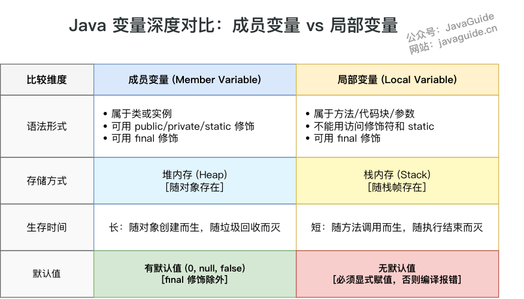

**为什么成员变量有默认值？**

核心原因是为了保证对象状态的安全和可预测性。

成员变量和局部变量在这个规则上不同，主要是因为它们的**生命周期**不一样，导致了编译器对它们的“控制力”也不同。

- **局部变量**只活在一个方法里，编译器能清楚地看到它是否在使用前被赋值，所以编译器会强制你必须手动赋值，否则就报错。
- **成员变量**是跟着对象走的，它的值可能在构造函数里赋，也可能在后面的某个 `setter` 方法里赋。编译器在编译时**无法预测**它到底什么时候会被赋值。

并且，如果一个变量没有被初始化，它的内存里存放的就是“垃圾值”——之前那块内存遗留下的任意数据。如果程序读取并使用了这个垃圾值，就会产生完全不可预测的结果，比如一个数字变成了随机数，一个对象引用变成了非法地址，这会直接导致程序崩溃或出现诡异的 bug。

为了避免你拿到一个含有“垃圾值”的危险对象，Java干脆为所有成员变量提供了一个安全的默认值（如 null 或 0），作为一种**安全兜底机制**。


## 静态变量有什么作用？

静态变量也就是被 `static` 关键字修饰的变量。它可以被类的所有实例共享，无论一个类创建了多少个对象，它们都共享同一份静态变量。也就是说，静态变量只会被分配一次内存，即使创建多个对象，这样可以节省内存。

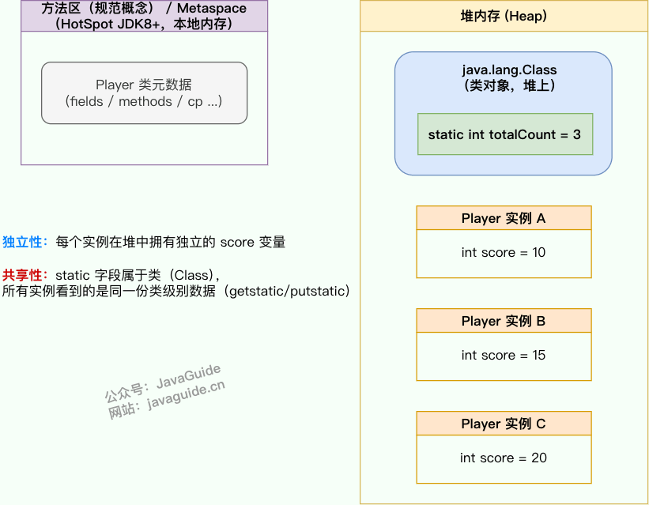

## 字符型常量和字符串常量的区别?

- **形式** : 字符常量是单引号引起的一个字符，字符串常量是双引号引起的 0 个或若干个字符。
- **含义** : 字符常量相当于一个整型值( ASCII 值),可以参加表达式运算; 字符串常量代表一个地址值(该字符串在内存中存放位置)。
- **占内存大小**：字符常量只占 2 个字节; 字符串常量占若干个字节。

## 静态方法和实例方法有何不同？

**1、调用方式**

在外部调用静态方法时，可以使用 `类名.方法名` 的方式，也可以使用 `对象.方法名` 的方式，而实例方法只有后面这种方式。也就是说，**调用静态方法可以无需创建对象** 。不过，需要注意的是一般不建议使用 `对象.方法名` 的方式来调用静态方法。这种方式非常容易造成混淆，静态方法不属于类的某个对象而是属于这个类。因此，一般建议使用 `类名.方法名` 的方式来调用静态方法。

**2、访问类成员是否存在限制**

静态方法在访问本类的成员时，只允许访问静态成员（即静态成员变量和静态方法），不允许访问实例成员（即实例成员变量和实例方法），而实例方法不存在这个限制。

## 重载和重写有什么区别？

> 重载就是同样的一个方法能够根据输入数据的不同，做出不同的处理
>
> 重写就是当子类继承自父类的相同方法，输入数据一样，但要做出有别于父类的响应时，你就要覆盖父类方法

**重载**

发生在同一个类中（或者父类和子类之间），方法名必须相同，参数类型不同、个数不同、顺序不同，方法返回值和访问修饰符可以不同。

**重写**

重写发生在运行期，是子类对父类的允许访问的方法的实现过程进行重新编写。

1. 方法名、参数列表必须相同，子类方法返回值类型应比父类方法返回值类型更小或相等，抛出的异常范围小于等于父类，访问修饰符范围大于等于父类。
2. 如果父类方法访问修饰符为 `private/final/static` 则子类就不能重写该方法，但是被 `static` 修饰的方法能够被再次声明。
3. 构造方法无法被重写

**方法的重写要遵循“两同两小一大”**

- “两同”即方法名相同、形参列表相同；
- “两小”指的是子类方法返回值类型应比父类方法返回值类型更小或相等，子类方法声明抛出的异常类应比父类方法声明抛出的异常类更小或相等；
- “一大”指的是子类方法的访问权限应比父类方法的访问权限更大或相等。

| 区别点         | 重载 (Overloading)                                           | 重写 (Overriding)                                            |
| -------------- | ------------------------------------------------------------ | ------------------------------------------------------------ |
| **发生范围**   | 同一个类中。                                                 | 父类与子类之间（存在继承关系）。                             |
| **方法签名**   | 方法名**必须相同**，但**参数列表必须不同**（参数的类型、个数或顺序至少有一项不同）。 | 方法名、参数列表**必须完全相同**。                           |
| **返回类型**   | 与返回值类型**无关**，可以任意修改。                         | 子类方法的返回类型必须与父类方法的返回类型**相同**，或者是其**子类**。 |
| **访问修饰符** | 与访问修饰符**无关**，可以任意修改。                         | 子类方法的访问权限**不能低于**父类方法的访问权限。（public > protected > default > private） |
| **绑定时期**   | 编译时绑定或称静态绑定                                       | 运行时绑定 (Run-time Binding) 或称动态绑定                   |

## 什么是可变长参数？

从 Java5 开始，Java 支持定义可变长参数，所谓可变长参数就是允许在调用方法时传入不定长度的参数。就比如下面这个方法就可以接受 0 个或者多个参数。

```java
public static void method1(String... args) {
   //......
}
```

另外，可变参数只能作为函数的最后一个参数，但其前面可以有也可以没有任何其他参数。

```java
public static void method2(String arg1, String... args) {
   //......
}
```

**遇到方法重载的情况怎么办呢？会优先匹配固定参数还是可变参数的方法呢？**

答案是会优先匹配固定参数的方法，因为固定参数的方法匹配度更高。

## 面向对象和面向过程的区别

面向过程编程（Procedural-Oriented Programming，POP）和面向对象编程（Object-Oriented Programming，OOP）是两种常见的编程范式，两者的主要区别在于解决问题的方式不同：

- **面向过程编程（POP）**：面向过程把解决问题的过程拆成一个个方法，通过一个个方法的执行解决问题。
- **面向对象编程（OOP）**：面向对象会先抽象出对象，然后用对象执行方法的方式解决问题。

相比较于 POP，OOP 开发的程序一般具有下面这些优点：

- **易维护**：由于良好的结构和封装性，OOP 程序通常更容易维护。
- **易复用**：通过继承和多态，OOP 设计使得代码更具复用性，方便扩展功能。
- **易扩展**：模块化设计使得系统扩展变得更加容易和灵活。

## 创建一个对象用什么运算符?对象实例与对象引用有何不同?

new 运算符，new 创建对象实例（对象实例在堆内存中），对象引用指向对象实例（对象引用存放在栈内存中）。

- 一个对象引用可以指向 0 个或 1 个对象（一根绳子可以不系气球，也可以系一个气球）；
- 一个对象可以有 n 个引用指向它（可以用 n 条绳子系住一个气球）。

## 对象的相等和引用相等的区别

- 对象的相等一般比较的是内存中存放的内容是否相等。
- 引用相等一般比较的是他们指向的内存地址是否相等。

## 如果一个类没有声明构造方法，该程序能正确执行吗?

构造方法是一种特殊的方法，主要作用是完成对象的初始化工作。

如果一个类没有声明构造方法，也可以执行！因为一个类即使没有声明构造方法也会有默认的不带参数的构造方法。如果我们自己添加了类的构造方法（无论是否有参），Java 就不会添加默认的无参数的构造方法了。

## 构造方法有哪些特点？是否可被 override?

构造方法具有以下特点：

- **名称与类名相同**：构造方法的名称必须与类名完全一致。
- **没有返回值**：构造方法没有返回类型，且不能使用 `void` 声明。
- **自动执行**：在生成类的对象时，构造方法会自动执行，无需显式调用。

构造方法**不能被重写（override）**，但**可以被重载（overload）**。因此，一个类中可以有多个构造方法，这些构造方法可以具有不同的参数列表，以提供不同的对象初始化方式。

## 面向对象三大特征

**封装**

封装是指把一个对象的状态信息（也就是属性）隐藏在对象内部，不允许外部对象直接访问对象的内部信息。但是可以提供一些可以被外界访问的方法来操作属性

**继承**

不同类型的对象，相互之间经常有一定数量的共同点。例如，小明同学、小红同学、小李同学，都共享学生的特性（班级、学号等）。同时，每一个对象还定义了额外的特性使得他们与众不同。例如小明的数学比较好，小红的性格惹人喜爱；小李的力气比较大。继承是使用已存在的类的定义作为基础建立新类的技术，新类的定义可以增加新的数据或新的功能，也可以用父类的功能，但不能选择性地继承父类。通过使用继承，可以快速地创建新的类，可以提高代码的重用，程序的可维护性，节省大量创建新类的时间 ，提高我们的开发效率。

**关于继承如下 3 点请记住：**

1. 子类拥有父类对象所有的属性和方法（包括私有属性和私有方法），但是父类中的私有属性和方法子类是无法访问，**只是拥有**。
2. 子类可以拥有自己属性和方法，即子类可以对父类进行扩展。
3. 子类可以用自己的方式实现父类的方法。

**多态**

多态，顾名思义，表示一个对象具有多种的状态，具体表现为父类的引用指向子类的实例。

**多态的特点:**

- 对象类型和引用类型之间具有继承（类）/实现（接口）的关系；
- 引用类型变量发出的方法调用的到底是哪个类中的方法，必须在程序运行期间才能确定；
- 多态不能调用“只在子类存在但在父类不存在”的方法；
- 如果子类重写了父类的方法，真正执行的是子类重写的方法，如果子类没有重写父类的方法，执行的是父类的方法。


## 接口和抽象类有什么共同点和区别？

**接口和抽象类的共同点**

- **实例化**：接口和抽象类都不能直接实例化，只能被实现（接口）或继承（抽象类）后才能创建具体的对象。
- **抽象方法**：接口和抽象类都可以包含抽象方法。抽象方法没有方法体，必须在子类或实现类中实现。

**接口和抽象类的区别**

**设计目的**：接口主要用于对类的行为进行约束，你实现了某个接口就具有了对应的行为。抽象类主要用于代码复用，强调的是所属关系。

**继承和实现**：一个类只能继承一个类（包括抽象类），因为 Java 不支持多继承。但一个类可以实现多个接口，一个接口也可以继承多个其他接口。

**成员变量**：接口中的成员变量只能是 `public static final` 类型的，不能被修改且必须有初始值。抽象类的成员变量可以有任何修饰符（`private`, `protected`, `public`），可以在子类中被重新定义或赋值。

**方法**： 

- Java 8 之前，接口中的方法默认是 `public abstract` ，也就是只能有方法声明。自 Java 8 起，可以在接口中定义 `default`（默认） 方法和 `static` （静态）方法。 自 Java 9 起，接口可以包含 `private` 方法。
- 抽象类可以包含抽象方法和非抽象方法。抽象方法没有方法体，必须在子类中实现。非抽象方法有具体实现，可以直接在抽象类中使用或在子类中重写。

```java
public interface MyInterface {
    // default 方法
    //Java 8 引入的default 方法用于提供接口方法的默认实现，可以在实现类中被覆盖。这样就可以在不修改实现类的情况下向现有接口添加新功能，从而增强接口的扩展性和向后兼容性。
    default void defaultMethod() {
        commonMethod();
    }

    //Java 8 引入的static 方法无法在实现类中被覆盖，只能通过接口名直接调用（ MyInterface.staticMethod()），类似于类中的静态方法。static 方法通常用于定义一些通用的、与接口相关的工具方法，一般很少用。
    // static 方法
    static void staticMethod() {
        commonMethod();
    }
	//Java 9 允许在接口中使用 private 方法。private方法可以用于在接口内部共享代码，不对外暴露。
    // 私有静态方法，可以被 static 和 default 方法调用
    private static void commonMethod() {
        System.out.println("This is a private method used internally.");
    }

      // 实例私有方法，只能被 default 方法调用。
    private void instanceCommonMethod() {
        System.out.println("This is a private instance method used internally.");
    }
}
```

## 深拷贝和浅拷贝区别了解吗？什么是引用拷贝？


**浅拷贝**：浅拷贝会在堆上创建一个新的对象（区别于引用拷贝的一点），不过，如果原对象内部的属性是引用类型的话，浅拷贝会直接复制内部对象的引用地址，也就是说拷贝对象和原对象共用同一个内部对象。

**深拷贝**：深拷贝会完全复制整个对象，包括这个对象所包含的内部对象。

**那什么是引用拷贝呢？** 简单来说，引用拷贝就是两个不同的引用指向同一个对象。

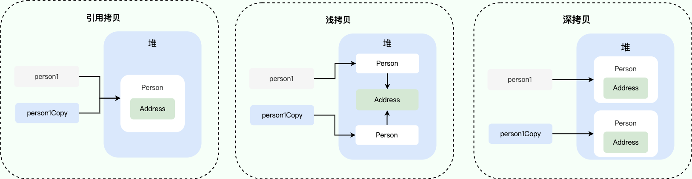


## Object

### Object 类的常见方法有哪些？

Object 类是一个特殊的类，是所有类的父类，主要提供了以下 11 个方法：

```java
/**
 * native 方法，用于返回当前运行时对象的 Class 对象，使用了 final 关键字修饰，故不允许子类重写。
 */
public final native Class<?> getClass()
/**
 * native 方法，用于返回对象的哈希码，主要使用在哈希表中，比如 JDK 中的HashMap。
 */
public native int hashCode()
/**
 * 用于比较 2 个对象的内存地址是否相等，String 类对该方法进行了重写以用于比较字符串的值是否相等。
 */
public boolean equals(Object obj)
/**
 * native 方法，用于创建并返回当前对象的一份拷贝。
 */
protected native Object clone() throws CloneNotSupportedException
/**
 * 返回类的名字实例的哈希码的 16 进制的字符串。建议 Object 所有的子类都重写这个方法。
 */
public String toString()
/**
 * native 方法，并且不能重写。唤醒一个在此对象监视器上等待的线程(监视器相当于就是锁的概念)。如果有多个线程在等待只会任意唤醒一个。
 */
public final native void notify()
/**
 * native 方法，并且不能重写。跟 notify 一样，唯一的区别就是会唤醒在此对象监视器上等待的所有线程，而不是一个线程。
 */
public final native void notifyAll()
/**
 * native方法，并且不能重写。暂停线程的执行。注意：sleep 方法没有释放锁，而 wait 方法释放了锁 ，timeout 是等待时间。
 */
public final native void wait(long timeout) throws InterruptedException
/**
 * 多了 nanos 参数，这个参数表示额外时间（以纳秒为单位，范围是 0-999999）。 所以超时的时间还需要加上 nanos 纳秒。。
 */
public final void wait(long timeout, int nanos) throws InterruptedException
/**
 * 跟之前的2个wait方法一样，只不过该方法一直等待，没有超时时间这个概念
 */
public final void wait() throws InterruptedException
/**
 * 实例被垃圾回收器回收的时候触发的操作
 */
protected void finalize() throws Throwable { }
```

### == 和 equals() 的区别

**`==`** 对于基本类型和引用类型的作用效果是不同的：

- 对于基本数据类型来说，`==` 比较的是值。
- 对于引用数据类型来说，`==` 比较的是对象的内存地址。

> 因为 Java 只有值传递，所以，对于 == 来说，不管是比较基本数据类型，还是引用数据类型的变量，其本质比较的都是值，只是引用类型变量存的值是对象的地址。

**`equals()`** 不能用于判断基本数据类型的变量，只能用来判断两个对象是否相等。`equals()`方法存在于`Object`类中，而`Object`类是所有类的直接或间接父类，因此所有的类都有`equals()`方法。

`Object` 类 `equals()` 方法：

```java
public boolean equals(Object obj) {
     return (this == obj);
}
```

`equals()` 方法存在两种使用情况：

- **类没有重写 `equals()`方法**：通过`equals()`比较该类的两个对象时，等价于通过“==”比较这两个对象，使用的默认是 `Object`类`equals()`方法。
- **类重写了 `equals()`方法**：一般我们都重写 `equals()`方法来比较两个对象中的属性是否相等；若它们的属性相等，则返回 true(即，认为这两个对象相等)。


### hashCode() 有什么用？

`hashCode()` 定义在 JDK 的 `Object` 类中，这就意味着 Java 中的任何类都包含有 `hashCode()` 函数。另外需要注意的是：`Object` 的 `hashCode()` 方法是本地方法，也就是用 C 语言或 C++ 实现的。

> ⚠️ 注意：该方法在 **Oracle OpenJDK8** 中默认是 "使用线程局部状态来实现 Marsaglia's xor-shift 随机数生成", 并不是 "地址" 或者 "地址转换而来", 不同 JDK/VM 可能不同。在 **Oracle OpenJDK8** 中有六种生成方式 (其中第五种是返回地址), 通过添加 VM 参数: -XX:hashCode=4 启用第五种。参考源码:
>
> - https://hg.openjdk.org/jdk8u/jdk8u/hotspot/file/87ee5ee27509/src/share/vm/runtime/globals.hpp（1127 行）
> - https://hg.openjdk.org/jdk8u/jdk8u/hotspot/file/87ee5ee27509/src/share/vm/runtime/synchronizer.cpp（537 行开始）
>
> 生成策略通常为：
>
> - 基于对象的“identity hash”
> - 早期版本可能和内存地址有关
> - 现代 JVM 可能使用：
>   - 伪随机数
>   - 线程安全算法
>   - 与 GC 移动无关的值

```java
public native int hashCode();
```


### 为什么要有 hashCode？

我们以“HashSet 如何检查重复”为例子来说明为什么要有 hashCode？

当我们把对象加入 HashSet 时，HashSet 会先调用对象的 `hashCode()` 方法，得到一个“哈希值”，并通过内部散列函数对这个哈希值再做一次简单的转换（比如取余），决定这条数据应该放进底层数组的哪一个桶（bucket，对应到底层数组的某个位置）：

1. 如果该桶当前是空的，就直接将对象对应的节点插入到这个桶中。
2. 如果该桶中已经有其他元素，HashSet 会在这个桶对应的链表或红黑树中逐个比较： 
   - 对于**哈希值不同**的节点，直接跳过；
   - 对于**哈希值相同**的节点，则会进一步调用 equals() 方法来检查这两个对象是否“相等”：
      – 如果 `equals()` 返回 true，说明集合中已经存在与当前对象等价的元素，`HashSet` 就不会再次加入它；
      – 如果返回 false， 则认为是新元素，会将该对象作为一个新节点加入到**同一个桶**的链表或红黑树中。

通过先利用 `hashCode()` 将候选范围缩小到同一个桶内，再在桶内少量元素上调用 `equals()` 做精确判断，`HashSet` 大大减少了 `equals()` 的调用次数，从而提高了查找和插入的执行效率。

### 为什么重写 equals() 时必须重写 hashCode() 方法？

因为两个相等的对象的 `hashCode` 值必须是相等。也就是说如果 `equals` 方法判断两个对象是相等的，那这两个对象的 `hashCode` 值也要相等。object中的hashcode不相等。

如果重写 `equals()` 时没有重写 `hashCode()` 方法的话就可能会导致 `equals` 方法判断是相等的两个对象，`hashCode` 值却不相等。

- 如果两个对象的`hashCode` 值相等，那这两个对象不一定相等（哈希碰撞）。
- 如果两个对象的`hashCode` 值相等并且`equals()`方法也返回 `true`，我们才认为这两个对象相等。
- 如果两个对象的`hashCode` 值不相等，我们就可以直接认为这两个对象不相等。

## String

### String、StringBuffer、StringBuilder 的区别？

**可变性**

`String` 是不可变的。

`StringBuilder` 与 `StringBuffer` 都继承自 `AbstractStringBuilder` 类，在 `AbstractStringBuilder` 中也是使用字符数组保存字符串，不过没有使用 `final` 和 `private` 关键字修饰，最关键的是这个 `AbstractStringBuilder` 类还提供了很多修改字符串的方法比如 `append` 方法。

```java
abstract class AbstractStringBuilder implements Appendable, CharSequence {
    char[] value;
    public AbstractStringBuilder append(String str) {
        if (str == null)
            return appendNull();
        int len = str.length();
        ensureCapacityInternal(count + len);
        str.getChars(0, len, value, count);
        count += len;
        return this;
    }
    //...
}
```

**线程安全性**

`String` 中的对象是不可变的，也就可以理解为常量，线程安全。`AbstractStringBuilder` 是 `StringBuilder` 与 `StringBuffer` 的公共父类，定义了一些字符串的基本操作，如 `expandCapacity`、`append`、`insert`、`indexOf` 等公共方法。`StringBuffer` 对方法加了同步锁或者对调用的方法加了同步锁，所以是线程安全的。`StringBuilder` 并没有对方法进行加同步锁，所以是非线程安全的。

**性能**

每次对 `String` 类型进行改变的时候，都会生成一个新的 `String` 对象，然后将指针指向新的 `String` 对象。`StringBuffer` 每次都会对 `StringBuffer` 对象本身进行操作，而不是生成新的对象并改变对象引用。相同情况下使用 `StringBuilder` 相比使用 `StringBuffer` 仅能获得 10%~15% 左右的性能提升，但却要冒多线程不安全的风险。

- 操作少量的数据: 适用 `String`
- 单线程操作字符串缓冲区下操作大量数据: 适用 `StringBuilder`
- 多线程操作字符串缓冲区下操作大量数据: 适用 `StringBuffer`


### String 为什么是不可变的

`String` 类中使用 `final` 关键字修饰字符数组来保存字符串

```java
public final class String implements java.io.Serializable, Comparable<String>, CharSequence {
    private final char value[];
  //...
}
```

我们知道被 `final` 关键字修饰的类不能被继承，修饰的方法不能被重写，修饰的变量是基本数据类型则值不能改变，修饰的变量是引用类型则不能再指向其他对象。因此，`final` 关键字修饰的数组保存字符串并不是 `String` 不可变的根本原因，因为这个数组保存的字符串是可变的（`final` 修饰引用类型变量的情况）。

`String` 不可变有下面几点原因：

1. 保存字符串的数组被 `final` 修饰且为私有的，并且`String` 类没有提供/暴露修改这个字符串的方法。
2. `String` 类被 `final` 修饰导致其不能被继承，进而避免了子类破坏 `String` 不可变。


**Java 9 为何要将 `String` 的底层实现由 `char[]` 改成了 `byte[]` ?**

新版的 String 其实支持两个编码方案：Latin-1 和 UTF-16。如果字符串中包含的汉字没有超过 Latin-1 可表示范围内的字符，那就会使用 Latin-1 作为编码方案。Latin-1 编码方案下，`byte` 占一个字节(8 位)，`char` 占用 2 个字节（16），`byte` 相较 `char` 节省一半的内存空间。

JDK 官方就说了绝大部分字符串对象只包含 Latin-1 可表示的字符。

> **ISO 8859-1（Latin-1）**
>
> - 固定 **1 字节**
>
> - 支持 256 个字符（0–255）
>
> - 英文
>
>   西欧语言（法语、德语、西班牙语部分字符）
>
>   不支持中文、日文、韩文
>
> **UTF-16**
>
> - Unicode 的编码方式
> - 2 或 4 字节
>
> | 字符                     | 字节数           |
> | ------------------------ | ---------------- |
> | 常见字符                 | 2 字节           |
> | 补充平面字符（如 emoji） | 4 字节（代理对） |
>
> ```
> 大部分字符 -> 2 bytes
> 部分字符 -> 4 bytes
> ```
>
> - 接近固定宽度
> - 访问效率较高
> - Java 早期 String 默认使用
>
> - 英文浪费空间（2 字节）
> - 仍然不是完全固定宽度（存在代理对）


### 字符串拼接用“+” 还是 StringBuilder?

Java 语言本身并不支持运算符重载，“+”和“+=”是专门为 String 类重载过的运算符，也是 Java 中仅有的两个重载过的运算符。

```java
String str1 = "he";
String str2 = "llo";
String str3 = "world";
String str4 = str1 + str2 + str3;
```

上面的代码对应的字节码如下：

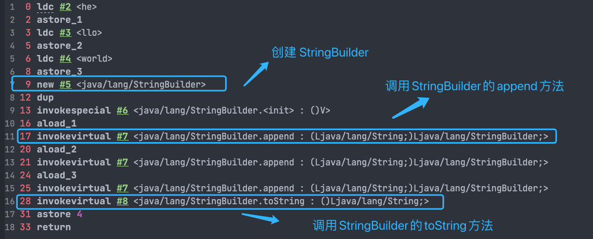

可以看出，字符串对象通过“+”的字符串拼接方式，实际上是通过 `StringBuilder` 调用 `append()` 方法实现的，拼接完成之后调用 `toString()` 得到一个 `String` 对象 。

不过，在循环内使用“+”进行字符串的拼接的话，存在比较明显的缺陷：**编译器不会创建单个 `StringBuilder` 以复用，会导致创建过多的 `StringBuilder` 对象**。

```java
String[] arr = {"he", "llo", "world"};
String s = "";
for (int i = 0; i < arr.length; i++) {
    s += arr[i];
}
System.out.println(s);
```

`StringBuilder` 对象是在循环内部被创建的，这意味着每循环一次就会创建一个 `StringBuilder` 对象。

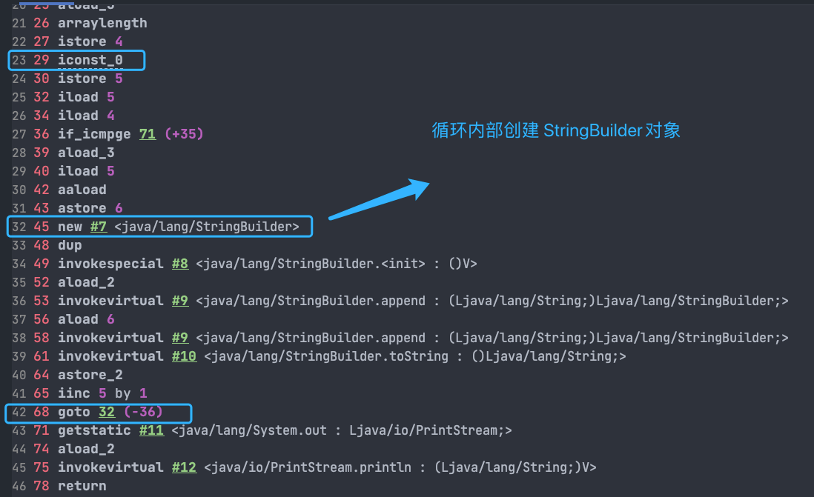

如果直接使用 `StringBuilder` 对象进行字符串拼接的话，就不会存在这个问题了。

```java
String[] arr = {"he", "llo", "world"};
StringBuilder s = new StringBuilder();
for (String value : arr) {
    s.append(value);
}
System.out.println(s);
```

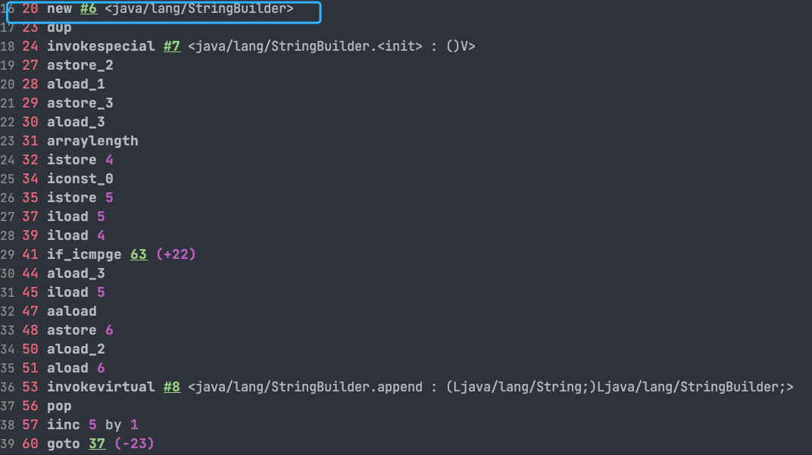

### 字符串常量池的作用了解吗？

**字符串常量池** 是 JVM 为了提升性能和减少内存消耗针对字符串（String 类）专门开辟的一块区域，主要目的是为了避免字符串的重复创建。

```java
// 1.在字符串常量池中查询字符串对象 "ab"，如果没有则创建"ab"并放入字符串常量池
// 2.将字符串对象 "ab" 的引用赋值给 aa
String aa = "ab";
// 直接返回字符串常量池中字符串对象 "ab"，赋值给引用 bb
String bb = "ab";
System.out.println(aa==bb); // true
```

### String s1 = new String("abc");这句话创建了几个字符串对象？

先说答案：会创建 1 或 2 个字符串对象。

1. 字符串常量池中不存在 "abc"：会创建 2 个 字符串对象。一个在字符串常量池中，由 `ldc` 指令触发创建。一个在堆中，由 `new String()` 创建，并使用常量池中的 "abc" 进行初始化。
2. 字符串常量池中已存在 "abc"：会创建 1 个 字符串对象。该对象在堆中，由 `new String()` 创建，并使用常量池中的 "abc" 进行初始化。

### String#intern 方法有什么作用?

`String.intern()` 是一个 `native` (本地) 方法，用来处理字符串常量池中的字符串对象引用。它的工作流程可以概括为以下两种情况：

1. **常量池中已有相同内容的字符串对象**：如果字符串常量池中已经有一个与调用 `intern()` 方法的字符串内容相同的 `String` 对象，`intern()` 方法会直接返回常量池中该对象的引用。
2. **常量池中没有相同内容的字符串对象**：如果字符串常量池中还没有一个与调用 `intern()` 方法的字符串内容相同的对象，`intern()` 方法会将当前字符串对象的引用添加到字符串常量池中，并返回该引用。

### String 类型的变量和常量做“+”运算时发生了什么？

先来看字符串不加 `final` 关键字拼接的情况（JDK1.8）：

```java
String str1 = "str";
String str2 = "ing";
String str3 = "str" + "ing";
String str4 = str1 + str2;
String str5 = "string";
System.out.println(str3 == str4);//false //常量池中的对象
System.out.println(str3 == str5);//true //在堆上创建的新对象
System.out.println(str4 == str5);//false //常量池中的对象
```

**对于编译期可以确定值的字符串，也就是常量字符串 ，jvm 会将其存入字符串常量池。并且，字符串常量拼接得到的字符串常量在编译阶段就已经被存放字符串常量池，这个得益于编译器的优化。**

常量折叠会把常量表达式的值求出来作为常量嵌在最终生成的代码中，这是 Javac 编译器会对源代码做的极少量优化措施之一(代码优化几乎都在即时编译器中进行)。

对于 `String str3 = "str" + "ing";` 编译器会给你优化成 `String str3 = "string";` 。

并不是所有的常量都会进行折叠，只有编译器在程序编译期就可以确定值的常量才可以：

- 基本数据类型( `byte`、`boolean`、`short`、`char`、`int`、`float`、`long`、`double`)以及字符串常量。
- `final` 修饰的基本数据类型和字符串变量
- 字符串通过 “+”拼接得到的字符串、基本数据类型之间算数运算（加减乘除）、基本数据类型的位运算（<<、>>、>>> ）

**引用的值在程序编译期是无法确定的，编译器无法对其进行优化。**

对象引用和“+”的字符串拼接方式，实际上是通过 `StringBuilder` 调用 `append()` 方法实现的，拼接完成之后调用 `toString()` 得到一个 `String` 对象 。

```java
String str4 = new StringBuilder().append(str1).append(str2).toString();
```


字符串使用 `final` 关键字声明之后，可以让编译器当做常量来处理。

```java
final String str1 = "str";
final String str2 = "ing";
// 下面两个表达式其实是等价的
String c = "str" + "ing";// 常量池中的对象
String d = str1 + str2; // 常量池中的对象
System.out.println(c == d);// true
```

被 `final` 关键字修饰之后的 `String` 会被编译器当做常量来处理，编译器在程序编译期就可以确定它的值，其效果就相当于访问常量。

如果 ，编译器在运行时才能知道其确切值的话，就无法对其优化。

示例代码（`str2` 在运行时才能确定其值）：

```java
final String str1 = "str";
final String str2 = getStr();
String c = "str" + "ing";// 常量池中的对象
String d = str1 + str2; // 在堆上创建的新的对象
System.out.println(c == d);// false
public static String getStr() {
      return "ing";
}
```


## 异常

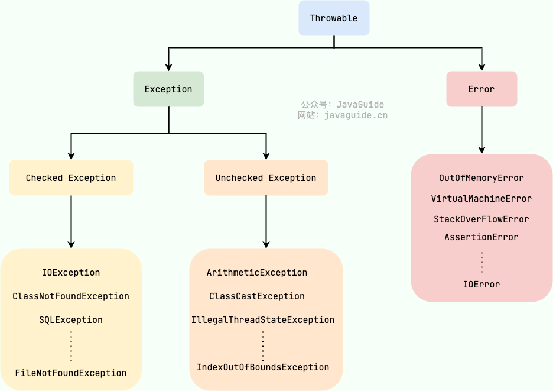

### Exception 和 Error 有什么区别？

在 Java 中，所有的异常都有一个共同的祖先 `java.lang` 包中的 `Throwable` 类。`Throwable` 类有两个重要的子类:

- **`Exception`** :程序本身可以处理的异常，可以通过 `catch` 来进行捕获。`Exception` 又可以分为 Checked Exception (受检查异常，必须处理) 和 Unchecked Exception (不受检查异常，可以不处理)。
- **`Error`** ：`Error` 属于程序无法处理的错误 ，我们没办法通过 `catch` 来进行捕获不建议通过`catch`捕获 。例如 Java 虚拟机运行错误（`Virtual MachineError`）、虚拟机内存不够错误(`OutOfMemoryError`)、类定义错误（`NoClassDefFoundError`）等 。这些异常发生时，Java 虚拟机（JVM）一般会选择线程终止。


### Checked Exception 和 Unchecked Exception 有什么区别？

**Checked Exception** 即 受检查异常 ，Java 代码在编译过程中，如果受检查异常没有被 `catch`或者`throws` 关键字处理的话，就没办法通过编译。除了`RuntimeException`及其子类以外，其他的`Exception`类及其子类都属于受检查异常 。常见的受检查异常有：IO 相关的异常、`ClassNotFoundException`、`SQLException`...。

**Unchecked Exception** 即 **不受检查异常** ，Java 代码在编译过程中 ，我们即使不处理不受检查异常也可以正常通过编译。

`RuntimeException` 及其子类都统称为非受检查异常，常见的有（建议记下来，日常开发中会经常用到）：

- `NullPointerException`(空指针错误)
- `IllegalArgumentException`(参数错误比如方法入参类型错误)
- `NumberFormatException`（字符串转换为数字格式错误，`IllegalArgumentException`的子类）
- `ArrayIndexOutOfBoundsException`（数组越界错误）
- `ClassCastException`（类型转换错误）
- `ArithmeticException`（算术错误）
- `SecurityException` （安全错误比如权限不够）
- `UnsupportedOperationException`(不支持的操作错误比如重复创建同一用户)

### 你更倾向于使用 Checked Exception 还是 Unchecked Exception？

默认使用 Unchecked Exception，只在必要时才用 Checked Exception。

我们可以把 Unchecked Exception（比如 `NullPointerException`）看作是代码 Bug。对待 Bug，最好的方式是让它暴露出来然后去修复代码，而不是用 `try-catch` 去掩盖它。

一般来说，只在一种情况下使用 Checked Exception：当这个异常是业务逻辑的一部分，并且调用方必须处理它时。比如说，一个余额不足异常。这不是 bug，而是一个正常的业务分支，我需要用 Checked Exception 来强制调用者去处理这种情况，比如提示用户去充值。这样就能在保证关键业务逻辑完整性的同时，让代码尽可能保持简洁。

### try-catch-finally 如何使用？

- `try`块：用于捕获异常。其后可接零个或多个 `catch` 块，如果没有 `catch` 块，则必须跟一个 `finally` 块。
- `catch`块：用于处理 try 捕获到的异常。
- `finally` 块：无论是否捕获或处理异常，`finally` 块里的语句都会被执行。当在 `try` 块或 `catch` 块中遇到 `return` 语句时，`finally` 语句块将在方法返回之前被执行。

### 异常使用有哪些需要注意的地方？

不要把异常定义为静态变量，因为这样会导致异常栈信息错乱。每次手动抛出异常，我们都需要手动 new 一个异常对象抛出。

抛出的异常信息一定要有意义。

建议抛出更加具体的异常，比如字符串转换为数字格式错误的时候应该抛出`NumberFormatException`而不是其父类`IllegalArgumentException`。

避免重复记录日志：如果在捕获异常的地方已经记录了足够的信息（包括异常类型、错误信息和堆栈跟踪等），那么在业务代码中再次抛出这个异常时，就不应该再次记录相同的错误信息。重复记录日志会使得日志文件膨胀，并且可能会掩盖问题的实际原因，使得问题更难以追踪和解决。

## 泛型

**Java 泛型（Generics）** 是 JDK 5 中引入的一个新特性。使用泛型参数，可以增强代码的可读性以及稳定性。

### 泛型的使用方式有哪几种？

泛型一般有三种使用方式:**泛型类**、**泛型接口**、**泛型方法**。

**1.泛型类**：

```java
//此处T可以随便写为任意标识，常见的如T、E、K、V等形式的参数常用于表示泛型
//在实例化泛型类时，必须指定T的具体类型
public class Generic<T>{

    private T key;

    public Generic(T key) {
        this.key = key;
    }

    public T getKey(){
        return key;
    }
}

Generic<Integer> genericInteger = new Generic<Integer>(123456);
```

**2.泛型接口**：

```java
public interface Generator<T> {
    public T method();
}

class GeneratorImpl<T> implements Generator<T>{
    @Override
    public T method() {
        return null;
    }
}

class GeneratorImpl implements Generator<String> {
    @Override
    public String method() {
        return "hello";
    }
}
```

**3.泛型方法**：

```java
   public static < E > void printArray( E[] inputArray )
   {
         for ( E element : inputArray ){
            System.out.printf( "%s ", element );
         }
         System.out.println();
    }
// 创建不同类型数组：Integer, Double 和 Character
Integer[] intArray = { 1, 2, 3 };
String[] stringArray = { "Hello", "World" };
printArray( intArray  );
printArray( stringArray  );
```

注意: `public static < E > void printArray( E[] inputArray )` 一般被称为静态泛型方法;在 java 中泛型只是一个占位符，必须在传递类型后才能使用。类在实例化时才能真正的传递类型参数，由于静态方法的加载先于类的实例化，也就是说类中的泛型还没有传递真正的类型参数，静态的方法的加载就已经完成了，所以静态泛型方法是没有办法使用类上声明的泛型的。只能使用自己声明的 `<E>`

### 什么是泛型擦除机制？为什么要擦除?

**Java 的泛型是伪泛型，这是因为 Java 在编译期间，所有的泛型信息都会被擦掉，这也就是通常所说类型擦除 。**

编译器会在编译期间会动态地将泛型 `T` 擦除为 `Object` 或将 `T extends xxx` 擦除为其限定类型 `xxx` ，因此，泛型本质上其实还是编译器的行为，为了保证引入泛型机制但不创建新的类型，减少虚拟机的运行开销，编译器通过擦除将泛型类转化为一般类。

- 使用泛型可在编译期间进行类型检测。
- 使用 `Object` 类型需要手动添加强制类型转换，降低代码可读性，提高出错概率。
- 泛型可以使用自限定类型如 `T extends Comparable` 。

```java
List<String> list = new ArrayList<>();
list.add("hello");

String s = list.get(0);

//编译后等价于
List list = new ArrayList();
list.add("hello");

String s = (String) list.get(0);
//强制类型转换由编译器插入。
```


### 什么是桥方法？

桥方法(`Bridge Method`) 用于继承泛型类时保证多态。

```java
class Node<T> {
    public T data;
    public Node(T data) { this.data = data; }
    public void setData(T data) {
        System.out.println("Node.setData");
        this.data = data;
    }
}

class MyNode extends Node<Integer> {
    public MyNode(Integer data) { super(data); }

  	// Node<T> 泛型擦除后为 setData(Object data)，而子类 MyNode 中并没有重写该方法，所以编译器会加入该桥方法保证多态
   	public void setData(Object data) {
        setData((Integer) data);
    }

    public void setData(Integer data) {
        System.out.println("MyNode.setData");
        super.setData(data);
    }
}
```


### 泛型有哪些限制？为什么？

泛型的限制一般是由泛型擦除机制导致的。擦除为 `Object` 后无法进行类型判断

- 只能声明不能实例化 `T` 类型变量。

  ```java
  new T(); // 编译错误 运行期不知道 T 是什么。
  ```

- 泛型参数不能是基本类型。因为基本类型不是 `Object` 子类，应该用基本类型对应的引用类型代替。

- 不能实例化泛型参数的数组。擦除后为 `Object` 后无法进行类型判断。

- 不能实例化泛型数组。

  ```java
  new List<String>[10]; // 编译错误 数组是协变且运行期有类型信息，泛型是擦除的，两者模型冲突。
  ```

- 泛型无法使用 `instanceof` 对类型参数 T 做运行期判断；`getClass()` 在擦除后也无法区分不同泛型实参（如 `List<String>` 与 `List<Integer>` 均得到 `List.class`）。

  ```java
  if (obj instanceof List<String>) // ❌
  if (obj instanceof List)    
  ```

- 不能实现两个不同泛型参数的同一接口，擦除后多个父类的桥方法将冲突

- 不能使用 `static` 修饰泛型变量


## 通配符

通配符机制的目的是：**让一个持有特定类型（比如A类型）的集合能够强制转换为持有A的子类或父类型的集合**

```java
// 限制类型为 Person 的子类
<? extends Person>
// 限制类型为 Manager 的父类
<? super Manager>
```

### 通配符 ？和常用的泛型 T 之间有什么区别？

- `T` 可以用于声明变量或常量而 `?` 不行。
- `T` 一般用于声明泛型类或方法，通配符 `?` 一般用于泛型方法的调用代码和形参。
- `T` 在编译期会被擦除为限定类型或 `Object`。通配符 `?` 在方法内部会被编译器「捕获」为某个具体但未知的类型（capture），因此不能向 `List<?>` 写入除 `null` 外的元素，但可配合泛型方法使用。

### 什么是无界通配符？

无界通配符可以接收任何泛型类型数据，用于实现不依赖于具体类型参数的简单方法，可以捕获参数类型并交由泛型方法进行处理。

```java
//List<?> 的意思是这个集合是一个可以持有任意类型的集合，它可以是List<A>，也可以是List<B>,或者List<C>等等。
//因为你不知道集合是哪种类型，所以你只能够对集合进行读操作。并且你只能把读取到的元素当成 Object 实例来对待。
public void processElements(List<?> elements){
   for(Object o : elements){
      Sysout.out.println(o);
   }
}

```

**`List<?>` 和 `List` 有区别吗？** 当然有！

- `List<?> list` 表示 `list` 的元素类型是**某个未知但固定的类型**（即「存在某一类型 `T`，list 是 `List<T>`」），因此编译器不允许向其中添加除 `null` 外的任何元素，以避免类型不安全。
- `List list` 表示 `list` 持有的元素类型是 `Object`，因此可以添加任何类型的对象，但编译器会给出警告。

```java
List<?> list = new ArrayList<>();
list.add("sss");//报错
List list2 = new ArrayList<>();
list2.add("sss");//警告信息
```

### 什么是上边界通配符？什么是下边界通配符？

在使用泛型的时候，我们还可以为传入的泛型类型实参进行上下边界的限制，如：**类型实参只准传入某种类型的父类或某种类型的子类**。

**上边界通配符 `extends`** 可以实现泛型的向上转型即传入的类型实参必须是指定类型的子类型。

```java
//List<? extends A> 代表的是一个可以持有 A及其子类（如B和C）的实例的List集合。
//当集合所持有的实例是A或者A的子类的时候，此时从集合里读出元素并把它强制转换为A是安全的。
public void processElements(List<? extends A> elements){
   for(A a : elements){
      System.out.println(a.getValue());
   }
}


// 限制必须是 Person 类的子类
<? extends Person>
//类型边界可以设置多个，还可以对 T 类型进行限制。
<T extends T1 & T2>
<T extends XXX>
```

**下边界通配符 `super`** 与上边界通配符 `extends`刚好相反，它可以实现泛型的向下转型即传入的类型实参必须是指定类型的父类型。

```java
//List<? super A> 的意思是List集合 list,它可以持有 A 及其父类的实例。
//当你知道集合里所持有的元素类型都是A及其父类的时候，此时往list集合里面插入A及其子类（B或C）是安全的
public static void insertElements(List<? super A> list){
   list.add(new A());
   list.add(new B());
   list.add(new C());
}


//  限制必须是 Employee 类的父类
List<? super Employee>
```

### `? extends xxx` 和 `? super xxx` 有什么区别?

| 写法          | 含义              | 可读性              | 可写性                |
| ------------- | ----------------- | ------------------- | --------------------- |
| `? extends T` | 未知的 T 的子类型 | ✔ 可安全读取为 T    | ✘ 不能写入（除 null） |
| `? super T`   | 未知的 T 的父类型 | ✘ 只能读取为 Object | ✔ 可安全写入 T        |

```java
List<? extends Number> list;
Number n = list.get(0); //可以读取
list.add(1);  // 编译错误  不能写入 如果实际类型是 List<Double>,你却 add 一个 Integer,类型系统会被破坏
```

```java
List<? super Integer> list;
list.add(1); //可以写入
Object obj = list.get(0); //读取只能是 Object
Integer i = list.get(0); // 编译错误
```

**PECS 原则（Producer Extends, Consumer Super）**

- 只读数据 → `extends`
- 只写数据 → `super`

T 表示“同一个类型”，? 表示“某个类型”


## 反射

Java 反射 (Reflection) 是一种**在程序运行时，动态地获取类的信息并操作类或对象（方法、属性）的能力**。

### 反射有什么优缺点？

**优点：**

1. **灵活性和动态性**：反射允许程序在运行时动态地加载类、创建对象、调用方法和访问字段。这样可以根据实际需求（如配置文件、用户输入、注解等）动态地适应和扩展程序的行为，显著提高了系统的灵活性和适应性。
2. **框架开发的基础**：许多现代 Java 框架（如 Spring、Hibernate、MyBatis）都大量使用反射来实现依赖注入（DI）、面向切面编程（AOP）、对象关系映射（ORM）、注解处理等核心功能。反射是实现这些“魔法”功能不可或缺的基础工具。
3. **解耦合和通用性**：通过反射，可以编写更通用、可重用和高度解耦的代码，降低模块之间的依赖。例如，可以通过反射实现通用的对象拷贝、序列化、Bean 工具等。

**缺点：**

1. **性能开销**：反射操作通常比直接代码调用要慢。因为涉及到动态类型解析、方法查找以及 JIT 编译器的优化受限等因素。不过，对于大多数框架场景，这种性能损耗通常是可以接受的，或者框架本身会做一些缓存优化。
2. **安全性问题**：反射可以绕过 Java 语言的访问控制机制（如访问 `private` 字段和方法），破坏了封装性，可能导致数据泄露或程序被恶意篡改。此外，还可以绕过泛型检查，带来类型安全隐患。
3. **代码可读性和维护性**：过度使用反射会使代码变得复杂、难以理解和调试。错误通常在运行时才会暴露，不像编译期错误那样容易发现。

### 反射的应用场景？

**1.依赖注入与控制反转（IoC）**

以 Spring/Spring Boot 为代表的 IoC 框架，会在启动时扫描带有特定注解（如 `@Component`, `@Service`, `@Repository`, `@Controller`）的类，利用反射实例化对象（Bean），并通过反射注入依赖（如 `@Autowired`、构造器注入等）。

**2.注解处理**

注解本身只是个“标记”，得有人去读这个标记才知道要做什么。反射就是那个“读取器”。框架通过反射检查类、方法、字段上有没有特定的注解，然后根据注解信息执行相应的逻辑。比如，看到 `@Value`，就用反射读取注解内容，去配置文件找对应的值，再用反射把值设置给字段。

**3.动态代理与 AOP**

想在调用某个方法前后自动加点料（比如打日志、开事务、做权限检查）？AOP（面向切面编程）就是干这个的，而动态代理是实现 AOP 的常用手段。JDK 自带的动态代理（Proxy 和 InvocationHandler）就离不开反射。代理对象在内部调用真实对象的方法时，就是通过反射的 `Method.invoke` 来完成的。

**4.对象关系映射（ORM）**

像 MyBatis、Hibernate 这种框架，能帮你把数据库查出来的一行行数据，自动变成一个个 Java 对象。它是怎么知道数据库字段对应哪个 Java 属性的？还是靠反射。它通过反射获取 Java 类的属性列表，然后把查询结果按名字或配置对应起来，再用反射调用 setter 或直接修改字段值。反过来，保存对象到数据库时，也是用反射读取属性值来拼 SQL。

### 获取 Class 对象的四种方式

```java
Class alunbarClass = TargetObject.class;

Class alunbarClass1 = Class.forName("cn.javaguide.TargetObject");

TargetObject o = new TargetObject();
Class alunbarClass2 = o.getClass();

ClassLoader.getSystemClassLoader().loadClass("cn.javaguide.TargetObject");
```


## 代理

### 代理模式

代理模式是一种比较好理解的设计模式。简单来说就是 **我们使用代理对象来代替对真实对象(real object)的访问，这样就可以在不修改原目标对象的前提下，提供额外的功能操作，扩展目标对象的功能。**


### 静态代理

静态代理中，我们对目标对象的每个方法的增强都是手动完成的（后面会具体演示代码），非常不灵活（比如接口一旦新增加方法，目标对象和代理对象都要进行修改）且麻烦(需要对每个目标类都单独写一个代理类）。

### 动态代理

在程序运行期间，动态生成代理类，并拦截方法调用，在调用前后织入额外逻辑的一种机制。


### 如何实现动态代理？

动态代理是一种非常强大的设计模式，它允许我们在**不修改源代码**的情况下，对一个类或对象的方法进行**功能增强（Enhancement）**。

在 Java 中，实现动态代理最主流的方式有两种：**JDK 动态代理** 和 **CGLIB 动态代理**。

**第一种：JDK 动态代理**

Java 官方提供的，其核心要求是目标类必须实现一个或多个接口。JDK 动态代理在运行时，会利用 `Proxy.newProxyInstance()` 方法，动态地创建一个实现了这些接口的代理类的实例。这个代理类在内存中生成，你看不到它的 `.java` 或 `.class` 文件。

当你调用代理对象的任何一个方法时，这个调用都会被转发到我们提供的一个 `InvocationHandler` 接口的 `invoke` 方法中。在 `invoke` 方法里，我们就可以在调用原始方法（目标方法）之前或之后，加入我们自己的增强逻辑。

**在 Java 动态代理机制中 `InvocationHandler` 接口和 `Proxy` 类是核心。**

```java
    public static Object newProxyInstance(ClassLoader loader,
                                          Class<?>[] interfaces,
                                          InvocationHandler h)
        throws IllegalArgumentException
    {
        ......
    }
//loader :类加载器，用于加载代理对象。
//interfaces : 被代理类实现的一些接口；
//h : 实现了 InvocationHandler 接口的对象；


public interface InvocationHandler {

    /**
     * 当你使用代理对象调用方法的时候实际会调用到这个方法
     */
    public Object invoke(Object proxy, Method method, Object[] args)
        throws Throwable;
}

//proxy :动态生成的代理类
//method : 与代理类对象调用的方法相对应
//args : 当前 method 方法的参数
```


#### JDK 动态代理类使用步骤

1. 定义一个接口及其实现类；
2. 自定义 `InvocationHandler` 并重写`invoke`方法，在 `invoke` 方法中我们会调用原生方法（被代理类的方法）并自定义一些处理逻辑；
3. 通过 `Proxy.newProxyInstance(ClassLoader loader,Class<?>[] interfaces,InvocationHandler h)` 方法创建代理对象；


**第二种：CGLIB 动态代理**

[CGLIB](https://github.com/cglib/cglib)(*Code Generation Library*)是一个基于[ASM](http://www.baeldung.com/java-asm)的字节码生成库，它允许我们在运行时对字节码进行修改和动态生成。CGLIB 通过继承方式实现代理。很多知名的开源框架都使用到了[CGLIB](https://github.com/cglib/cglib)， 例如 Spring 中的 AOP 模块中：如果目标对象实现了接口，则默认采用 JDK 动态代理，否则采用 CGLIB 动态代理。

**在 CGLIB 动态代理机制中 `MethodInterceptor` 接口和 `Enhancer` 类是核心。**

你需要自定义 `MethodInterceptor` 并重写 `intercept` 方法，`intercept` 用于拦截增强被代理类的方法。

```java
public interface MethodInterceptor
extends Callback{
    // 拦截被代理类中的方法
    public Object intercept(Object obj, java.lang.reflect.Method method, Object[] args,MethodProxy proxy) throws Throwable;
}
```

1. **obj** : 被代理的对象（需要增强的对象）
2. **method** : 被拦截的方法（需要增强的方法）
3. **args** : 方法入参
4. **proxy** : 用于调用原始方法

#### CGLIB 动态代理类使用步骤

1. 定义一个类；
2. 自定义 `MethodInterceptor` 并重写 `intercept` 方法，`intercept` 用于拦截增强被代理类的方法，和 JDK 动态代理中的 `invoke` 方法类似；
3. 通过 `Enhancer` 类的 `create()`创建代理类；


### 静态代理和动态代理有什么区别？

静态代理和动态代理的核心差异在于 **代理关系的确定时机、实现灵活性及维护成本** 。

| 对比维度         | 静态代理 (Static Proxy)                                      | 动态代理 (Dynamic Proxy)                                     |
| ---------------- | ------------------------------------------------------------ | ------------------------------------------------------------ |
| 代理关系确定时机 | 编译期（编译后生成固定的 `.class` 字节码文件）               | 运行时（动态生成代理类字节码并加载到 JVM）                   |
| 实现方式         | 手动编写代理类，需与目标类实现同一接口，一对一绑定           | 无需手动编写代理类，通过 `Handler`/`Interceptor` 封装增强逻辑，一对多复用 |
| 接口依赖         | 必须实现接口（代理类与目标类遵循同一接口规范）               | 支持代理接口或直接代理实现类                                 |
| 代码量与维护性   | 代码量大（目标类越多，代理类越多），维护成本高；接口新增方法时，目标类与代理类需同步修改 | 代码量极少（通用增强逻辑可复用），维护性好；与接口解耦，接口变更不影响代理逻辑 |
| 核心优势         | 实现简单、逻辑直观，无额外框架依赖                           | 灵活性强、复用性高，降低重复编码，适配复杂场景               |
| 典型应用场景     | 简单的装饰器模式、少量固定类的增强需求                       | Spring AOP、RPC 框架（如 Dubbo）、ORM 框架                   |

### JDK 动态代理和 CGLIB 动态代理有什么区别？

1. JDK 动态代理是官方的，它要求被代理的类必须实现接口。它的原理是动态生成一个接口的实现类来作为代理。CGLIB 是第三方的，它不需要接口。它的原理是动态生成一个被代理类的子类来作为代理。但也正因为是继承，所以它不能代理 `final` 的类，被代理的方法也不能是 `final` 或 `private` 。
2. 就二者的效率来说，大部分情况都是 JDK 动态代理更优秀，随着 JDK 版本的升级，这个优势更加明显。

### 介绍一下动态代理在框架中的实际应用场景

动态代理最典型的应用场景就是**Spring AOP**。

AOP(Aspect-Oriented Programming:面向切面编程)能够将那些与业务无关，却为业务模块所共同调用的逻辑或责任（例如事务处理、日志管理、权限控制等）封装起来，便于减少系统的重复代码，降低模块间的耦合度，并有利于未来的可拓展性和可维护性。

Spring AOP 就是基于动态代理的，如果要代理的对象，实现了某个接口，那么 Spring AOP 会使用 **JDK Proxy**，去创建代理对象，而对于没有实现接口的对象，就无法使用 JDK Proxy 去进行代理了，这时候 Spring AOP 会使用 **Cglib** 生成一个被代理对象的子类来作为代理，如下图所示：

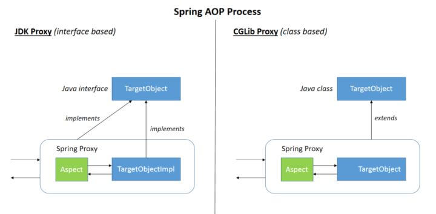

## 注解

`Annotation` （注解） 是 Java5 开始引入的新特性，可以看作是一种特殊的注释，主要用于修饰类、方法或者变量，提供某些信息供程序在编译或者运行时使用。

注解本质是一个继承了`Annotation` 的特殊接口：

```java
@Target(ElementType.METHOD)
@Retention(RetentionPolicy.SOURCE)
public @interface Override {

}

public interface Override extends Annotation{

}
```

JDK 提供了很多内置的注解（比如 `@Override`、`@Deprecated`），同时，我们还可以自定义注解。

### 注解的解析方法有哪几种？

注解只有被解析之后才会生效，常见的解析方法有两种：

- **编译期直接扫描**：编译器在编译 Java 代码的时候扫描对应的注解并处理，比如某个方法使用`@Override` 注解，编译器在编译的时候就会检测当前的方法是否重写了父类对应的方法。
- **运行期通过反射处理**：像框架中自带的注解(比如 Spring 框架的 `@Value`、`@Component`)都是通过反射来进行处理的。

## SPI

SPI 即 Service Provider Interface ，字面意思就是：“服务提供者的接口”，我的理解是：专门提供给服务提供者或者扩展框架功能的开发者去使用的一个接口。

SPI 将服务接口和具体的服务实现分离开来，将服务调用方和服务实现者解耦，能够提升程序的扩展性、可维护性。修改或者替换服务实现并不需要修改调用方。

很多框架都使用了 Java 的 SPI 机制，比如：Spring 框架、数据库加载驱动、日志接口、以及 Dubbo 的扩展实现等等。

### SPI 和 API 有什么区别？

说到 SPI 就不得不说一下 API（Application Programming Interface） 了，从广义上来说它们都属于接口，而且很容易混淆。下面先用一张图说明一下：

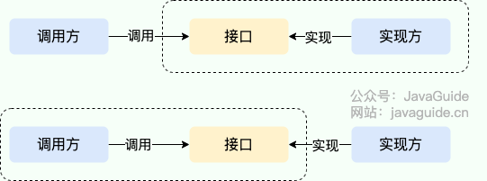

一般模块之间都是通过接口进行通讯，因此我们在服务调用方和服务实现方（也称服务提供者）之间引入一个“接口”。

- 当实现方提供了接口和实现，我们可以通过调用实现方的接口从而拥有实现方给我们提供的能力，这就是 **API**。这种情况下，接口和实现都是放在实现方的包中。调用方通过接口调用实现方的功能，而不需要关心具体的实现细节。
- 当接口存在于调用方这边时，这就是 **SPI** 。由接口调用方确定接口规则，然后由不同的厂商根据这个规则对这个接口进行实现，从而提供服务。

举个通俗易懂的例子：公司 H 是一家科技公司，新设计了一款芯片，然后现在需要量产了，而市面上有好几家芯片制造业公司，这个时候，只要 H 公司指定好了这芯片生产的标准（定义好了接口标准），那么这些合作的芯片公司（服务提供者）就按照标准交付自家特色的芯片（提供不同方案的实现，但是给出来的结果是一样的）。

### SPI 的优缺点？

通过 SPI 机制能够大大地提高接口设计的灵活性，但是 SPI 机制也存在一些缺点，比如：

- 需要遍历加载所有的实现类，不能做到按需加载，这样效率还是相对较低的。
- 当多个 `ServiceLoader` 同时 `load` 时，会有并发问题。

## 序列化和反序列化

- **序列化**：将数据结构或对象转换成可以存储或传输的形式，通常是二进制字节流，也可以是 JSON, XML 等文本格式
- **反序列化**：将在序列化过程中所生成的数据转换为原始数据结构或者对象的过程


### 序列化协议对应于 TCP/IP 4 层模型的哪一层？

OSI 七层协议模型中，表示层做的事情主要就是对应用层的用户数据进行处理转换为二进制流。反过来的话，就是将二进制流转换成应用层的用户数据。

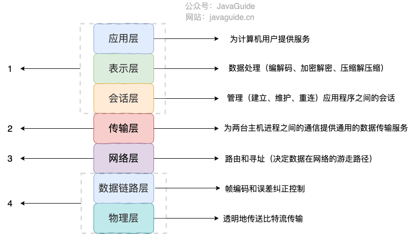

OSI 七层协议模型中的应用层、表示层和会话层对应的都是 TCP/IP 四层模型中的应用层，所以序列化协议属于 TCP/IP 协议应用层的一部分。

### 如果有些字段不想进行序列化怎么办？

对于不想进行序列化的变量，使用 `transient` 关键字修饰。

`transient` 关键字的作用是：阻止实例中那些用此关键字修饰的变量序列化；当对象被反序列化时，被 `transient` 修饰的变量值不会被持久化和恢复。

关于 `transient` 还有几点注意：

- `transient` 只能修饰变量，不能修饰类和方法。
- `transient` 修饰的变量，在反序列化后变量值将会被置成类型的默认值。例如，如果是修饰 `int` 类型，那么反序列后结果就是 `0`。
- `static` 变量因为不属于任何对象(Object)，所以无论有没有 `transient` 关键字修饰，均不会被序列化。

### 常见序列化协议有哪些？

JDK 自带的序列化方式一般不会用 ，因为序列化效率低并且存在安全问题。比较常用的序列化协议有 Hessian、Kryo、Protobuf、ProtoStuff，这些都是基于二进制的序列化协议。

像 JSON 和 XML 这种属于文本类序列化方式。虽然可读性比较好，但是性能较差，一般不会选择。

### 为什么不推荐使用 JDK 自带的序列化？

- **不支持跨语言调用** : 如果调用的是其他语言开发的服务的时候就不支持了。
- **性能差**：相比于其他序列化框架性能更低，主要原因是序列化之后的字节数组体积较大，导致传输成本加大。
- **存在安全问题**：序列化和反序列化本身并不存在问题。但当输入的反序列化的数据可被用户控制，那么攻击者即可通过构造恶意输入，让反序列化产生非预期的对象，在此过程中执行构造的任意代码。

### JDK 自带的序列化方式

JDK 自带的序列化，只需实现 `java.io.Serializable`接口即可。

```java
@AllArgsConstructor
@NoArgsConstructor
@Getter
@Builder
@ToString
public class RpcRequest implements Serializable {
    private static final long serialVersionUID = 1905122041950251207L;
    private String requestId;
    private String interfaceName;
    private String methodName;
    private Object[] parameters;
    private Class<?>[] paramTypes;
    private RpcMessageTypeEnum rpcMessageTypeEnum;
}
```

**serialVersionUID 有什么作用？**

序列化号 `serialVersionUID` 属于版本控制的作用。反序列化时，会检查 `serialVersionUID` 是否和当前类的 `serialVersionUID` 一致。如果 `serialVersionUID` 不一致则会抛出 `InvalidClassException` 异常。强烈推荐每个序列化类都手动指定其 `serialVersionUID`，如果不手动指定，那么编译器会动态生成默认的 `serialVersionUID`。


## 值传递

### 值传递&引用传递

程序设计语言将实参传递给方法（或函数）的方式分为两种：

- **值传递**：方法接收的是实参值的拷贝，会创建副本。
- **引用传递**：方法接收的直接是实参的地址，而不是实参内的值，这就是指针，此时形参就是实参，对形参的任何修改都会反应到实参，包括重新赋值。

很多程序设计语言（比如 C++、 Pascal）提供了两种参数传递的方式，不过，在 Java 中只有值传递。

Java 中将实参传递给方法（或函数）的方式是 **值传递**：

- 如果参数是基本类型的话，很简单，传递的就是基本类型的字面量值的拷贝，会创建副本。
- 如果参数是引用类型，传递的就是实参所引用的对象在堆中地址值的拷贝，同样也会创建副本。


## 语法糖

### 内部类

```java
1️⃣ 静态内部类（static nested class）
2️⃣ 非静态内部类（inner class）
    ├─ 成员内部类
    ├─ 局部内部类
    └─ 匿名内部类
```

1. 匿名内部类、局部内部类、静态内部类也是通过桥方法来获取 private 属性。
2. 静态内部类没有`this$0`的引用
3. 匿名内部类、局部内部类通过复制使用局部变量，该变量初始化之后就不能被修改

**静态内部类**

```java
class Outer {
    static class Inner {
        void test() {}
    }
}
Outer.Inner inner = new Outer.Inner();
```

- 使用 `static` 修饰
- 不依赖外部类实例
- 不能访问外部类非静态成员
- 类似一个“逻辑上归属”的普通类

**成员内部类**

```java
//省略其他属性
public class OuterClass {
    private String userName;
    ......
    class InnerClass{
    ......
        public void printOut(){
            System.out.println("Username from OuterClass:"+userName);
        }
    }
}

// 此时，使用javap -p命令对OuterClass反编译结果：
public classOuterClass {
    private String userName;
    ......
    static String access$000(OuterClass);
}
// 此时，InnerClass的反编译结果：
class OuterClass$InnerClass {
    final OuterClass this$0;
    ......
    public void printOut() {
    	System.out.println("Username from OuterClass:" + OuterClass.access$000(this.this$0));
	}
}

//在编译完成之后，inner 实例内部会有指向 outer 实例的引用this$0，但是简单的outer.name是无法访问 private 属性的。从反编译的结果可以看到，outer 中会有一个桥方法static String access$000(OuterClass)，恰好返回 String 类型，即 userName 属性。正是通过这个方法实现内部类访问外部类私有属性。
```

- 必须依附于外部类实例
- 自动持有外部类引用
- 可以访问外部类所有成员（包括 private）

**局部内部类**

```java
public class OuterClass {
    private String userName;

    public void test(){
        //这里i初始化为1后就不能再被修改
        int i=1;
        class Inner{
            public void printName(){
                System.out.println(userName);
                System.out.println(i);
            }
        }
    }
}

//javap命令反编译Inner的结果
//i被复制进内部类，且为final
class OuterClass$1Inner {
  final int val$i;
  final OuterClass this$0;
  OuterClass$1Inner();
  public void printName();
}
```

- 只能在方法内部使用

- 可以访问：

  外部类成员

  方法中的 final 或 effectively final 变量

**匿名内部类**

```java
Runnable r = new Runnable() {
    @Override
    public void run() {
        System.out.println("hello");
    }
};
```


