# Java并发

## 什么是线程和进程?

**何为进程?**

进程是程序的一次执行过程，是系统运行程序的基本单位，因此进程是动态的。系统运行一个程序即是一个进程从创建，运行到消亡的过程。

**何为线程**?

线程与进程相似，但线程是一个比进程更小的执行单位。一个进程在其执行的过程中可以产生多个线程。与进程不同的是同类的多个线程共享进程的**堆**和**方法区**资源，但每个线程有自己的**程序计数器**、**虚拟机栈**和**本地方法栈**，所以系统在产生一个线程，或是在各个线程之间做切换工作时，负担要比进程小得多，也正因为如此，线程也被称为轻量级进程。

## Java 线程和操作系统的线程有啥区别？

在 JDK 1.2 及以后，Java 线程改为基于原生线程（Native Threads）实现，也就是说 JVM 直接使用操作系统原生的内核级线程（内核线程）来实现 Java 线程，由操作系统内核进行线程的调度和管理。

- 用户线程：由用户空间程序管理和调度的线程，运行在用户空间（专门给应用程序使用）。
- 内核线程：由操作系统内核管理和调度的线程，运行在内核空间（只有内核程序可以访问）。

线程模型是用户线程和内核线程之间的关联方式，常见的线程模型有这三种：

1. 一对一（一个用户线程对应一个内核线程）
2. 多对一（多个用户线程映射到一个内核线程）
3. 多对多（多个用户线程映射到多个内核线程）

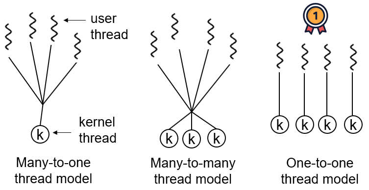

## 请简要描述线程与进程的关系,区别及优缺点？

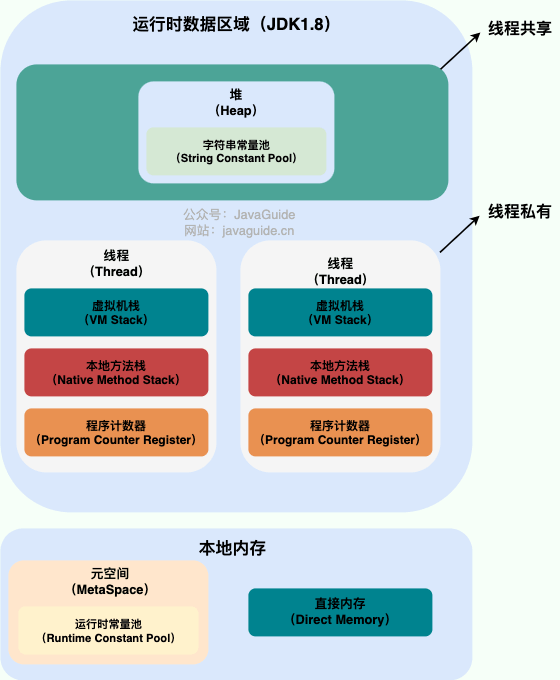

从上图可以看出：一个进程中可以有多个线程，多个线程共享进程的**堆**和**方法区 (JDK1.8 之后的元空间)\**资源，但是每个线程有自己的\**程序计数器**、**虚拟机栈** 和 **本地方法栈**。

**总结：** 线程是进程划分成的更小的运行单位。线程和进程最大的不同在于基本上各进程是独立的，而各线程则不一定，因为同一进程中的线程极有可能会相互影响。线程执行开销小，但不利于资源的管理和保护；而进程正相反。

## 如何创建线程？

一般来说，创建线程有很多种方式，例如继承`Thread`类、实现`Runnable`接口、实现`Callable`接口、使用线程池、使用`CompletableFuture`类等等。

不过，这些方式其实并没有真正创建出线程。准确点来说，这些都属于是在 Java 代码中使用多线程的方法。

严格来说，Java 就只有一种方式可以创建线程，那就是通过`new Thread().start()`创建。不管是哪种方式，最终还是依赖于`new Thread().start()`。

## 说说线程的生命周期和状态?

Java 线程在运行的生命周期中的指定时刻只可能处于下面 6 种不同状态的其中一个状态：

- NEW: 初始状态，线程被创建出来但没有被调用 `start()` 。
- RUNNABLE: 运行状态，线程被调用了 `start()`等待运行的状态。
- BLOCKED：阻塞状态，需要等待锁释放。
- WAITING：等待状态，表示该线程需要等待其他线程做出一些特定动作（通知或中断）。
- TIME_WAITING：超时等待状态，可以在指定的时间后自行返回而不是像 WAITING 那样一直等待。
- TERMINATED：终止状态，表示该线程已经运行完毕。

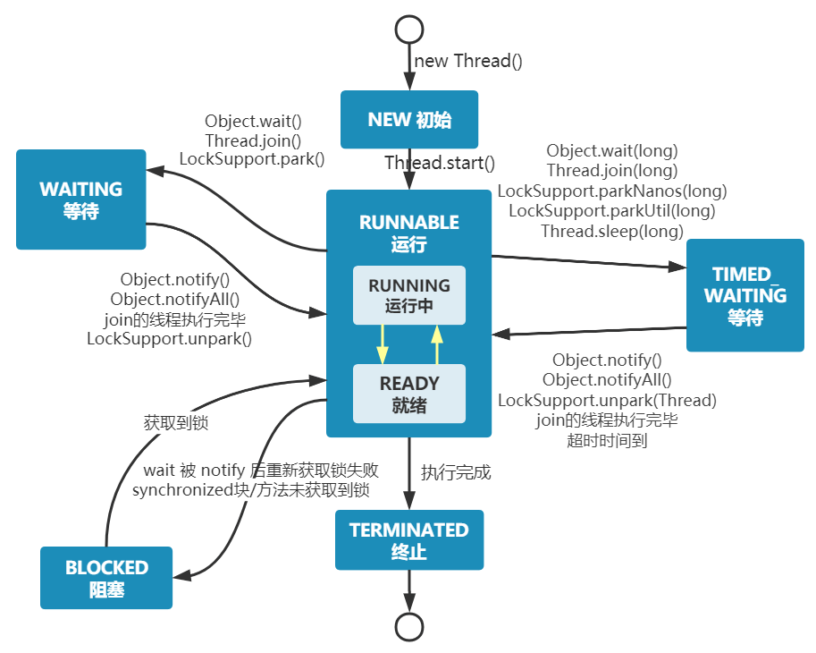

线程创建之后它将处于 **NEW（新建）** 状态，调用 `start()` 方法后开始运行，线程这时候处于 **READY（可运行）** 状态。可运行状态的线程获得了 CPU 时间片（timeslice）后就处于 **RUNNING（运行）** 状态。

- 当线程执行 `wait()`方法之后，线程进入 **WAITING（等待）** 状态。进入等待状态的线程需要依靠其他线程的通知才能够返回到运行状态。
- **TIMED_WAITING(超时等待)** 状态相当于在等待状态的基础上增加了超时限制，比如通过 `sleep（long millis）`方法或 `wait（long millis）`方法可以将线程置于 TIMED_WAITING 状态。当超时时间结束后，线程将会返回到 RUNNABLE 状态。
- 当线程进入 `synchronized` 方法/块或者调用 `wait` 后（被 `notify`）重新进入 `synchronized` 方法/块，但是锁被其它线程占有，这个时候线程就会进入 **BLOCKED（阻塞）** 状态。
- 线程在执行完了 `run()`方法之后将会进入到 **TERMINATED（终止）** 状态。

## 什么是线程上下文切换?

线程在执行过程中会有自己的运行条件和状态（也称上下文），比如上文所说到过的程序计数器，栈信息等。当出现如下情况的时候，线程会从占用 CPU 状态中退出。

- 主动让出 CPU，比如调用了 `sleep()`, `wait()` 等。
- 时间片用完，因为操作系统要防止一个线程或者进程长时间占用 CPU 导致其他线程或者进程饿死。
- 调用了阻塞类型的系统中断，比如请求 IO，线程被阻塞。
- 被终止或结束运行

这其中前三种都会发生线程切换，线程切换意味着需要保存当前线程的上下文，留待线程下次占用 CPU 的时候恢复现场。并加载下一个将要占用 CPU 的线程上下文。这就是所谓的 **上下文切换**。

上下文切换是现代操作系统的基本功能，因其每次需要保存信息恢复信息，这将会占用 CPU，内存等系统资源进行处理，也就意味着效率会有一定损耗，如果频繁切换就会造成整体效率低下。

## Thread#sleep() 方法和 Object#wait() 方法对比

**共同点**：两者都可以暂停线程的执行。

**区别**：

- **`sleep()` 方法没有释放锁，而 `wait()` 方法释放了锁** 。
- `wait()` 通常被用于线程间交互/通信，`sleep()`通常被用于暂停执行。
- `wait()` 方法被调用后，线程不会自动苏醒，需要别的线程调用同一个对象上的 `notify()`或者 `notifyAll()` 方法。`sleep()`方法执行完成后，线程会自动苏醒，或者也可以使用 `wait(long timeout)` 超时后线程会自动苏醒。
- `sleep()` 是 `Thread` 类的静态本地方法，`wait()` 则是 `Object` 类的本地方法。为什么这样设计呢？下一个问题就会聊到。

## 为什么 wait() 方法不定义在 Thread 中？

`wait()` 是让获得对象锁的线程实现等待，会自动释放当前线程占有的对象锁。每个对象（`Object`）都拥有对象锁，既然要释放当前线程占有的对象锁并让其进入 WAITING 状态，自然是要操作对应的对象（`Object`）而非当前的线程（`Thread`）。

类似的问题：**为什么 `sleep()` 方法定义在 `Thread` 中？**

因为 `sleep()` 是让当前线程暂停执行，不涉及到对象类，也不需要获得对象锁。

## 可以直接调用 Thread 类的 run 方法吗？

这是另一个非常经典的 Java 多线程面试问题，而且在面试中会经常被问到。很简单，但是很多人都会答不上来！

new 一个 `Thread`，线程进入了新建状态。调用 `start()`方法，会启动一个线程并使线程进入了就绪状态，当分配到时间片后就可以开始运行了。 `start()` 会执行线程的相应准备工作，然后自动执行 `run()` 方法的内容，这是真正的多线程工作。 但是，直接执行 `run()` 方法，会把 `run()` 方法当成一个普通方法在调用该方法的线程去执行，所以这并不是多线程工作。

**总结：调用 `start()` 方法方可启动线程并使线程进入就绪状态，直接执行 `run()` 方法的话不会以多线程的方式执行**

## 并发与并行的区别

**并发与并行的区别**

- **并发**：两个及两个以上的作业在同一 **时间段** 内执行。在同一时间段内处理多个任务
- **并行**：两个及两个以上的作业在同一 **时刻** 执行。同一时刻真正同时执行多个任务

最关键的点是：是否是 **同时** 执行。

**同步和异步的区别**

- **同步**：发出一个调用之后，在没有得到结果之前， 该调用就不可以返回，一直等待。
- **异步**：调用在发出之后，不用等待返回结果，该调用直接返回。

## 为什么要使用多线程?

- 采用多线程技术的应用程序**可以更好地利用系统资源**。主要优势在于充分**利用了CPU的空闲时间片**，用尽可能少的时间来对用户的要求做出响应，使得进程的整体运行效率得到较大提高，同时增强了应用程序的灵活性。
- 由于同一进程的**所有线程是共享同一内存**，所以不需要特殊的数据传送机制，不需要建立共享存储区或共享文件，从而使得不同任务之间的协调操作与运行、数据的交互、资源的分配等问题更加易于解决。
- 线程可以比作是轻量级的进程，是程序执行的最小单位，**线程间的切换和调度的成本远远小于进程**。另外，多核 CPU 时代意味着多个线程可以同时运行，这减少了线程上下文切换的开销。

## 单核 CPU 支持 Java 多线程吗？

单核 CPU 是支持 Java 多线程的。操作系统通过时间片轮转的方式，将 CPU 的时间分配给不同的线程。尽管单核 CPU 一次只能执行一个任务，但通过快速在多个线程之间切换，可以让用户感觉多个任务是同时进行的。

这里顺带提一下 Java 使用的线程调度方式。

操作系统主要通过两种线程调度方式来管理多线程的执行：

- **抢占式调度（Preemptive Scheduling）**：操作系统决定何时暂停当前正在运行的线程，并切换到另一个线程执行。这种切换通常是由系统时钟中断（时间片轮转）或其他高优先级事件（如 I/O 操作完成）触发的。这种方式存在上下文切换开销，但公平性和 CPU 资源利用率较好，不易阻塞。
- **协同式调度（Cooperative Scheduling）**：线程执行完毕后，主动通知系统切换到另一个线程。这种方式可以减少上下文切换带来的性能开销，但公平性较差，容易阻塞。

Java 使用的线程调度是抢占式的。也就是说，JVM 本身不负责线程的调度，而是将线程的调度委托给操作系统。操作系统通常会基于线程优先级和时间片来调度线程的执行，高优先级的线程通常获得 CPU 时间片的机会更多。

## 单核 CPU 上运行多个线程效率一定会高吗？

单核 CPU 同时运行多个线程的效率是否会高，取决于线程的类型和任务的性质。一般来说，有两种类型的线程：

1. **CPU 密集型**：CPU 密集型的线程主要进行计算和逻辑处理，需要占用大量的 CPU 资源。
2. **IO 密集型**：IO 密集型的线程主要进行输入输出操作，如读写文件、网络通信等，需要等待 IO 设备的响应，而不占用太多的 CPU 资源。

在单核 CPU 上，同一时刻只能有一个线程在运行，其他线程需要等待 CPU 的时间片分配。如果线程是 CPU 密集型的，那么多个线程同时运行会导致频繁的线程切换，增加了系统的开销，降低了效率。如果线程是 IO 密集型的，那么多个线程同时运行可以利用 CPU 在等待 IO 时的空闲时间，提高了效率。

因此，对于单核 CPU 来说，如果任务是 CPU 密集型的，那么开很多线程会影响效率；如果任务是 IO 密集型的，那么开很多线程会提高效率。当然，这里的“很多”也要适度，不能超过系统能够承受的上限。

## 使用多线程可能带来什么问题?

并发编程的目的就是为了能提高程序的执行效率进而提高程序的运行速度，但是并发编程并不总是能提高程序运行速度的，而且并发编程可能会遇到很多问题，比如：内存泄漏、死锁、线程不安全等等。

## 如何理解线程安全和不安全？

线程安全和不安全是在多线程环境下对于同一份数据的访问是否能够保证其正确性和一致性的描述。

- 线程安全指的是在多线程环境下，对于同一份数据，不管有多少个线程同时访问，都能保证这份数据的正确性和一致性。
- 线程不安全则表示在多线程环境下，对于同一份数据，多个线程同时访问时可能会导致数据混乱、错误或者丢失。

## 什么是线程死锁？

线程死锁描述的是这样一种情况：多个线程同时被阻塞，它们中的一个或者全部都在等待某个资源被释放。由于线程被无限期地阻塞，因此程序不可能正常终止。

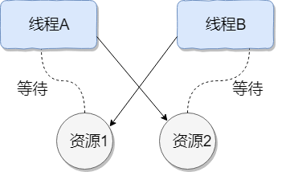

产生死锁的四个必要条件：

1. **互斥条件**：该资源任意一个时刻只由一个线程占用。
2. **请求与保持条件**：一个线程因请求资源而阻塞时，对已获得的资源保持不放。
3. **不剥夺条件**：线程已获得的资源在未使用完之前不能被其他线程强行剥夺，只有自己使用完毕后才释放资源。
4. **循环等待条件**：若干线程之间形成一种头尾相接的循环等待资源关系。

## 如何检测死锁？

- 使用`jmap`、`jstack`等命令查看 JVM 线程栈和堆内存的情况。如果有死锁，`jstack` 的输出中通常会有 `Found one Java-level deadlock:`的字样，后面会跟着死锁相关的线程信息。另外，实际项目中还可以搭配使用`top`、`df`、`free`等命令查看操作系统的基本情况，出现死锁可能会导致 CPU、内存等资源消耗过高。
- 采用 VisualVM、JConsole 等工具进行排查。

## 如何预防和避免线程死锁?

**如何预防死锁？** 破坏死锁的产生的必要条件即可：

1. **破坏请求与保持条件**：一次性申请所有的资源。
2. **破坏不剥夺条件**：占用部分资源的线程进一步申请其他资源时，如果申请不到，可以主动释放它占有的资源。
3. **破坏循环等待条件**：靠按序申请资源来预防。按某一顺序申请资源，释放资源则反序释放。破坏循环等待条件。

**如何避免死锁？**

避免死锁就是在资源分配时，借助于算法（比如银行家算法）对资源分配进行计算评估，使其进入安全状态。

> **安全状态** 指的是系统能够按照某种线程推进顺序（P1、P2、P3……Pn）来为每个线程分配所需资源，直到满足每个线程对资源的最大需求，使每个线程都可顺利完成。称 `<P1、P2、P3.....Pn>` 序列为安全序列。


## JMM(Java内存模型)

对于 Java 来说，你可以把 **JMM（Java 内存模型）** 看作是 Java 定义的并发编程相关的一组规范。除了抽象了线程和主内存之间的关系之外，其还规定了从 Java 源代码到 CPU 可执行指令的转化过程要遵守哪些并发相关的原则和规范。其主要目的是为了**简化多线程编程**，**增强程序的可移植性**。

JMM 主要定义了对于一个共享变量，当一个线程执行写操作后，该变量对其他线程的**可见性**。


## 并发编程三个重要特性

**原子性**

一次操作或者多次操作，要么所有的操作全部都得到执行并且不会受到任何因素的干扰而中断，要么都不执行。

在 Java 中，可以借助`synchronized`、各种 `Lock` 以及各种原子类实现原子性。

`synchronized` 和各种 `Lock` 可以保证任一时刻只有一个线程访问该代码块，因此可以保障原子性。各种原子类是利用 CAS (compare and swap) 操作（可能也会用到 `volatile`或者`final`关键字）来保证原子操作。

**可见性**

当一个线程对共享变量进行了修改，那么另外的线程都是立即可以看到修改后的最新值。

在 Java 中，可以借助`synchronized`、`volatile` 以及各种 `Lock` 实现可见性。

如果我们将变量声明为 `volatile` ，这就指示 JVM，这个变量是共享且不稳定的，每次使用它都到主存中进行读取。

**有序性**

由于指令重排序问题，代码的执行顺序未必就是编写代码时候的顺序。

我们上面讲重排序的时候也提到过：

> **指令重排序可以保证串行语义一致，但是没有义务保证多线程间的语义也一致** ，所以在多线程下，指令重排序可能会导致一些问题。

在 Java 中，`volatile` 关键字可以禁止指令进行重排序优化。


## 如何保证变量的可见性？

在 Java 中，`volatile` 关键字可以保证变量的可见性，如果我们将变量声明为 **`volatile`** ，这就指示 JVM，这个变量是共享且不稳定的，每次使用它都到主存中进行读取。

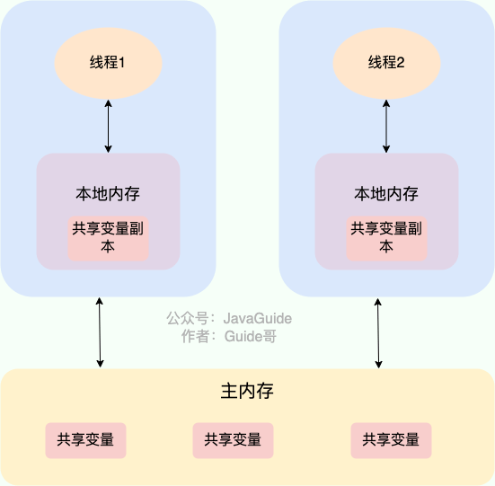

`volatile` 关键字其实并非是 Java 语言特有的，在 C 语言里也有，它最原始的意义就是禁用 CPU 缓存。如果我们将一个变量使用 `volatile` 修饰，这就指示 编译器，这个变量是共享且不稳定的，每次使用它都到主存中进行读取。

`volatile` 关键字能保证数据的可见性，但不能保证数据的原子性。`synchronized` 关键字两者都能保证。


## 如何禁止指令重排序？

**在 Java 中，`volatile` 关键字除了可以保证变量的可见性，还有一个重要的作用就是防止 JVM 的指令重排序。** 如果我们将变量声明为 **`volatile`** ，在对这个变量进行读写操作的时候，会通过插入特定的 **内存屏障** 的方式来禁止指令重排序。

在 Java 中，`Unsafe` 类提供了三个开箱即用的内存屏障相关的方法，屏蔽了操作系统底层的差异：

```java
public native void loadFence();
public native void storeFence();
public native void fullFence();
```


```java
public class Singleton {

    private volatile static Singleton uniqueInstance;

    private Singleton() {
    }

    public static Singleton getUniqueInstance() {
       //先判断对象是否已经实例过，没有实例化过才进入加锁代码
        if (uniqueInstance == null) {
            //类对象加锁
            synchronized (Singleton.class) {
                if (uniqueInstance == null) {
                    uniqueInstance = new Singleton();
                }
            }
        }
        return uniqueInstance;
    }
}
```

`uniqueInstance` 采用 `volatile` 关键字修饰也是很有必要的， `uniqueInstance = new Singleton();` 这段代码其实是分为三步执行：

1. 为 `uniqueInstance` 分配内存空间
2. 初始化 `uniqueInstance`
3. 将 `uniqueInstance` 指向分配的内存地址

但是由于 JVM 具有指令重排的特性，执行顺序有可能变成 1->3->2。指令重排在单线程环境下不会出现问题，但是在多线程环境下会导致一个线程获得还没有初始化的实例。例如，线程 T1 执行了 1 和 3，此时 T2 调用 `getUniqueInstance`() 后发现 `uniqueInstance` 不为空，因此返回 `uniqueInstance`，但此时 `uniqueInstance` 还未被初始化。

## volatile 可以保证原子性么？

**`volatile` 关键字能保证变量的可见性，但不能保证对变量的操作是原子性的。**

```java
public class VolatileAtomicityDemo {
    public volatile static int inc = 0;

    public void increase() {
        inc++;
    }

    public static void main(String[] args) throws InterruptedException {
        ExecutorService threadPool = Executors.newFixedThreadPool(5);
        VolatileAtomicityDemo volatileAtomicityDemo = new VolatileAtomicityDemo();
        for (int i = 0; i < 5; i++) {
            threadPool.execute(() -> {
                for (int j = 0; j < 500; j++) {
                    volatileAtomicityDemo.increase();
                }
            });
        }
        // 等待1.5秒，保证上面程序执行完成
        Thread.sleep(1500);
        System.out.println(inc);
        threadPool.shutdown();
    }
}
```

正常情况下，运行上面的代码理应输出 `2500`。但你真正运行了上面的代码之后，你会发现每次输出结果都小于 `2500`。

为什么会出现这种情况呢？不是说好了，`volatile` 可以保证变量的可见性嘛！

也就是说，如果 `volatile` 能保证 `inc++` 操作的原子性的话。每个线程中对 `inc` 变量自增完之后，其他线程可以立即看到修改后的值。5 个线程分别进行了 500 次操作，那么最终 inc 的值应该是 5*500=2500。

很多人会误认为自增操作 `inc++` 是原子性的，实际上，`inc++` 其实是一个复合操作，包括三步：

1. 读取 inc 的值。
2. 对 inc 加 1。
3. 将 inc 的值写回内存。

`volatile` 是无法保证这三个操作是具有原子性的，有可能导致下面这种情况出现：

1. 线程 1 对 `inc` 进行读取操作之后，还未对其进行修改。线程 2 又读取了 `inc`的值并对其进行修改（+1），再将`inc` 的值写回内存。
2. 线程 2 操作完毕后，线程 1 对 `inc`的值进行修改（+1），再将`inc` 的值写回内存。

这也就导致两个线程分别对 `inc` 进行了一次自增操作后，`inc` 实际上只增加了 1。

## 什么是悲观锁？

悲观锁总是假设最坏的情况，认为共享资源每次被访问的时候就会出现问题(比如共享数据被修改)，所以每次在获取资源操作的时候都会上锁，这样其他线程想拿到这个资源就会阻塞直到锁被上一个持有者释放。也就是说，**共享资源每次只给一个线程使用，其它线程阻塞，用完后再把资源转让给其它线程**。

高并发的场景下，激烈的锁竞争会造成线程阻塞，大量阻塞线程会导致系统的上下文切换，增加系统的性能开销。并且，悲观锁还可能会存在死锁问题，影响代码的正常运行。

## 什么是乐观锁？

乐观锁总是假设最好的情况，认为共享资源每次被访问的时候不会出现问题，线程可以不停地执行，无需加锁也无需等待，只是在提交修改的时候去验证对应的资源（也就是数据）是否被其它线程修改了（具体方法可以使用版本号机制或 CAS 算法）。

高并发的场景下，乐观锁相比悲观锁来说，不存在锁竞争造成线程阻塞，也不会有死锁的问题，在性能上往往会更胜一筹。但是，如果冲突频繁发生（写占比非常多的情况），会频繁失败和重试，这样同样会非常影响性能，导致 CPU 飙升。


理论上来说：

- 悲观锁通常多用于写比较多的情况（多写场景，竞争激烈），这样可以避免频繁失败和重试影响性能，悲观锁的开销是固定的。不过，如果乐观锁解决了频繁失败和重试这个问题的话（比如`LongAdder`），也是可以考虑使用乐观锁的，要视实际情况而定。
- 乐观锁通常多用于写比较少的情况（多读场景，竞争较少），这样可以避免频繁加锁影响性能。不过，乐观锁主要针对的对象是单个共享变量（参考`java.util.concurrent.atomic`包下面的原子变量类）。

## 如何实现乐观锁？

乐观锁一般会使用版本号机制或 CAS 算法实现，CAS 算法相对来说更多一些

**版本号机制**

一般是在数据表中加上一个数据版本号 `version` 字段，表示数据被修改的次数。当数据被修改时，`version` 值会加一。当线程 A 要更新数据值时，在读取数据的同时也会读取 `version` 值，在提交更新时，若刚才读取到的 version 值为当前数据库中的 `version` 值相等时才更新，否则重试更新操作，直到更新成功。

**举一个简单的例子**：假设数据库中帐户信息表中有一个 version 字段，当前值为 1 ；而当前帐户余额字段（ `balance` ）为 $100 。

1. 操作员 A 此时将其读出（ `version`=1 ），并从其帐户余额中扣除 $50（ $100-$50 ）。
2. 在操作员 A 操作的过程中，操作员 B 也读入此用户信息（ `version`=1 ），并从其帐户余额中扣除 $20 （ $100-$20 ）。
3. 操作员 A 完成了修改工作，将数据版本号（ `version`=1 ），连同帐户扣除后余额（ `balance`=$50 ），提交至数据库更新，此时由于提交数据版本等于数据库记录当前版本，数据被更新，数据库记录 `version` 更新为 2 。
4. 操作员 B 完成了操作，也将版本号（ `version`=1 ）试图向数据库提交数据（ `balance`=$80 ），但此时比对数据库记录版本时发现，操作员 B 提交的数据版本号为 1 ，数据库记录当前版本也为 2 ，不满足 “ 提交版本必须等于当前版本才能执行更新 “ 的乐观锁策略，因此，操作员 B 的提交被驳回。

这样就避免了操作员 B 用基于 `version`=1 的旧数据修改的结果覆盖操作员 A 的操作结果的可能。

**CAS 算法**

CAS 的全称是 **Compare And Swap（比较与交换）** ，用于实现乐观锁，被广泛应用于各大框架中。CAS 的思想很简单，就是用一个预期值和要更新的变量值进行比较，两值相等才会进行更新。

CAS 是一个原子操作，底层依赖于一条 CPU 的原子指令。

> **原子操作** 即最小不可拆分的操作，也就是说操作一旦开始，就不能被打断，直到操作完成。

CAS 涉及到三个操作数：

- **V**：要更新的变量值(Var)
- **E**：预期值(Expected)
- **N**：拟写入的新值(New)

当且仅当 V 的值等于 E 时，CAS 通过原子方式用新值 N 来更新 V 的值。如果不等，说明已经有其它线程更新了 V，则当前线程放弃更新。

**举一个简单的例子**：线程 A 要修改变量 i 的值为 6，i 原值为 1（V = 1，E=1，N=6，假设不存在 ABA 问题）。

1. i 与 1 进行比较，如果相等， 则说明没被其他线程修改，可以被设置为 6 。
2. i 与 1 进行比较，如果不相等，则说明被其他线程修改，当前线程放弃更新，CAS 操作失败。

当多个线程同时使用 CAS 操作一个变量时，只有一个会胜出，并成功更新，其余均会失败，但失败的线程并不会被挂起，仅是被告知失败，并且允许再次尝试，当然也允许失败的线程放弃操作。

## Java 中 CAS 是如何实现的？

在 Java 中，实现 CAS（Compare-And-Swap, 比较并交换）操作的一个关键类是`Unsafe`。

`Unsafe`类位于`sun.misc`包下，是一个提供低级别、不安全操作的类。由于其强大的功能和潜在的危险性，它通常用于 JVM 内部或一些需要极高性能和底层访问的库中，而不推荐普通开发者在应用程序中使用。

`sun.misc`包下的`Unsafe`类提供了`compareAndSwapObject`、`compareAndSwapInt`、`compareAndSwapLong`方法来实现的对`Object`、`int`、`long`类型的 CAS 操作：

```java
/**
 * 以原子方式更新对象字段的值。
 *
 * @param o        要操作的对象
 * @param offset   对象字段的内存偏移量
 * @param expected 期望的旧值
 * @param x        要设置的新值
 * @return 如果值被成功更新，则返回 true；否则返回 false
 */
boolean compareAndSwapObject(Object o, long offset, Object expected, Object x);

/**
 * 以原子方式更新 int 类型的对象字段的值。
 */
boolean compareAndSwapInt(Object o, long offset, int expected, int x);

/**
 * 以原子方式更新 long 类型的对象字段的值。
 */
boolean compareAndSwapLong(Object o, long offset, long expected, long x);
```


## CAS 算法存在哪些问题？

**ABA 问题**

如果一个变量 V 初次读取的时候是 A 值，并且在准备赋值的时候检查到它仍然是 A 值，那我们就能说明它的值没有被其他线程修改过了吗？很明显是不能的，因为在这段时间它的值可能被改为其他值，然后又改回 A，那 CAS 操作就会误认为它从来没有被修改过。这个问题被称为 CAS 操作的 **"ABA"问题。**

ABA 问题的解决思路是在变量前面追加上**版本号或者时间戳**。JDK 1.5 以后的 `AtomicStampedReference` 类就是用来解决 ABA 问题的，其中的 `compareAndSet()` 方法就是首先检查当前引用是否等于预期引用，并且当前标志是否等于预期标志，如果全部相等，则以原子方式将该引用和该标志的值设置为给定的更新值。

**循环时间长开销大**

CAS 经常会用到自旋操作来进行重试，也就是不成功就一直循环执行直到成功。如果长时间不成功，会给 CPU 带来非常大的执行开销。

如果 JVM 能够支持处理器提供的`pause`指令，那么自旋操作的效率将有所提升。`pause`指令有两个重要作用：

1. **延迟流水线执行指令**：`pause`指令可以延迟指令的执行，从而减少 CPU 的资源消耗。具体的延迟时间取决于处理器的实现版本，在某些处理器上，延迟时间可能为零。
2. **避免内存顺序冲突**：在退出循环时，`pause`指令可以避免由于内存顺序冲突而导致的 CPU 流水线被清空，从而提高 CPU 的执行效率。

**只能保证一个共享变量的原子操作**

CAS 操作仅能对单个共享变量有效。当需要操作多个共享变量时，CAS 就显得无能为力。不过，从 JDK 1.5 开始，Java 提供了`AtomicReference`类，这使得我们能够保证引用对象之间的原子性。通过将多个变量封装在一个对象中，我们可以使用`AtomicReference`来执行 CAS 操作。

**总结**

| **对比维度**    | **乐观锁 (Optimistic Locking)**             | **悲观锁 (Pessimistic Locking)**             |
| --------------- | ------------------------------------------- | -------------------------------------------- |
| **核心假设**    | 假设冲突很少发生，提交时才验证。            | 假设冲突必然发生，读取时就加锁。             |
| **底层原理**    | **CAS (Compare And Swap)** 或版本号机制。   | **操作系统互斥锁**，涉及内核态切换。         |
| **阻塞情况**    | **非阻塞**。失败后由业务逻辑决定是否重试。  | **阻塞**。其他线程必须排队等待锁释放。       |
| **并发开销**    | **CPU 消耗**（高并发写时频繁自旋重试）。    | **上下文切换开销**（线程挂起与唤醒）。       |
| **死锁风险**    | **无死锁**（因为不涉及持有锁的等待）。      | **有死锁风险**（多个锁相互等待）。           |
| **数据库实现**  | `UPDATE ... SET version = version + 1`      | `SELECT ... FOR UPDATE`                      |
| **Java 代表类** | `AtomicInteger`、`LongAdder`、`StampedLock` | `synchronized`、`ReentrantLock`              |
| **适用场景**    | **多读少写**、并发冲突概率低的业务。        | **多写少读**、数据一致性要求极高的核心业务。 |

## synchronized 是什么？有什么用？

`synchronized` 是 Java 中的一个关键字，翻译成中文是同步的意思，主要解决的是多个线程之间访问资源的同步性，可以保证被它修饰的方法或者代码块在任意时刻只能有一个线程执行。

在 Java 早期版本中，`synchronized` 属于 **重量级锁**，效率低下。这是因为监视器锁（monitor）是依赖于底层的操作系统的 `Mutex Lock` 来实现的，Java 的线程是映射到操作系统的原生线程之上的。如果要挂起或者唤醒一个线程，都需要操作系统帮忙完成，而操作系统实现线程之间的切换时需要从用户态转换到内核态，这个状态之间的转换需要相对比较长的时间，时间成本相对较高。

不过，在 Java 6 之后， `synchronized` 引入了大量的优化如自旋锁、适应性自旋锁、锁消除、锁粗化、偏向锁、轻量级锁等技术来减少锁操作的开销，这些优化让 `synchronized` 锁的效率提升了很多。因此， `synchronized` 还是可以在实际项目中使用的，像 JDK 源码、很多开源框架都大量使用了 `synchronized` 。

关于偏向锁多补充一点：由于偏向锁增加了 JVM 的复杂性，同时也并没有为所有应用都带来性能提升。因此，在 JDK15 中，偏向锁被默认关闭（仍然可以使用 `-XX:+UseBiasedLocking` 启用偏向锁），在 JDK18 中，偏向锁已经被彻底废弃（无法通过命令行打开）。

## 如何使用 synchronized？

`synchronized` 关键字的使用方式主要有下面 3 种：

1. 修饰实例方法（锁当前对象实例）
2. 修饰静态方法（锁当前类）
3. 修饰代码块（锁指定对象/类）

```java
synchronized void method() {
    //业务代码
}
synchronized static void method() {
    //业务代码
}
synchronized(this) {
    //业务代码
}
```

- `synchronized` 关键字加到 `static` 静态方法和 `synchronized(class)` 代码块上都是是给 Class 类上锁；
- `synchronized` 关键字加到实例方法上是给对象实例上锁；
- 尽量不要使用 `synchronized(String a)` 因为 JVM 中，字符串常量池具有缓存功能。

## 构造方法可以用 synchronized 修饰么？

构造方法不能使用 synchronized 关键字修饰。不过，可以在构造方法内部使用 synchronized 代码块。

另外，构造方法本身是线程安全的，但如果在构造方法中涉及到共享资源的操作，就需要采取适当的同步措施来保证整个构造过程的线程安全。


## synchronized 底层原理了解吗？

```java
public class SynchronizedDemo {
    public void method() {
        synchronized (this) {
            System.out.println("synchronized 代码块");
        }
    }
}
```

通过 JDK 自带的 `javap` 命令查看 `SynchronizedDemo` 类的相关字节码信息：首先切换到类的对应目录执行 `javac SynchronizedDemo.java` 命令生成编译后的 .class 文件，然后执行`javap -c -s -v -l SynchronizedDemo.class`。


从上面我们可以看出：**`synchronized` 同步语句块的实现使用的是 `monitorenter` 和 `monitorexit` 指令，其中 `monitorenter` 指令指向同步代码块的开始位置，`monitorexit` 指令则指明同步代码块的结束位置。**

上面的字节码中包含一个 `monitorenter` 指令以及两个 `monitorexit` 指令，这是为了保证锁在同步代码块代码正常执行以及出现异常的这两种情况下都能被正确释放。

当执行 `monitorenter` 指令时，线程试图获取锁也就是获取 **对象监视器 `monitor`** 的持有权。

> 在 Java 虚拟机(HotSpot)中，Monitor 是基于 C++实现的，由[ObjectMonitor](https://github.com/openjdk-mirror/jdk7u-hotspot/blob/50bdefc3afe944ca74c3093e7448d6b889cd20d1/src/share/vm/runtime/objectMonitor.cpp)实现的。每个对象中都内置了一个 `ObjectMonitor`对象。
>
> 另外，`wait/notify`等方法也依赖于`monitor`对象，这就是为什么只有在同步的块或者方法中才能调用`wait/notify`等方法，否则会抛出`java.lang.IllegalMonitorStateException`的异常的原因。

在执行`monitorenter`时，会尝试获取对象的锁，如果锁的计数器为 0 则表示锁可以被获取，获取后将锁计数器设为 1 也就是加 1。

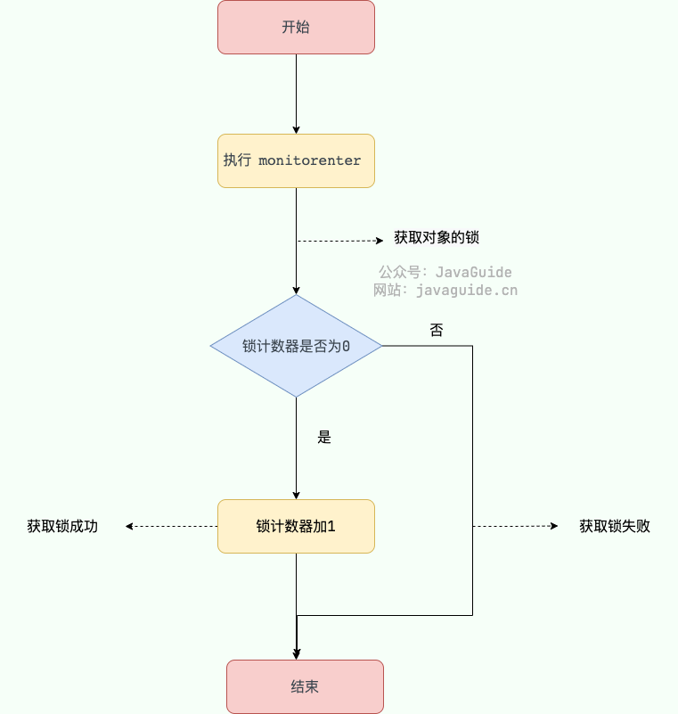

**synchronized 修饰方法的情况**

```java
public class SynchronizedDemo2 {
    public synchronized void method() {
        System.out.println("synchronized 方法");
    }
}
```

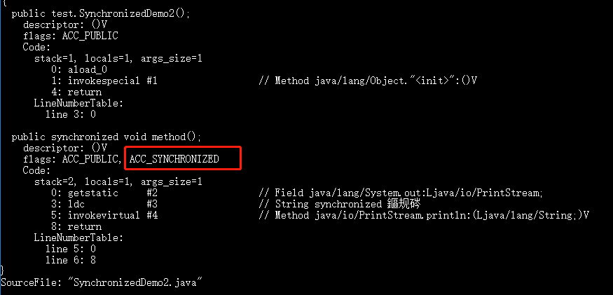

## JDK1.6 之后的 synchronized 底层做了哪些优化？锁升级原理了解吗？

在 Java 6 之后， `synchronized` 引入了大量的优化如自旋锁、适应性自旋锁、锁消除、锁粗化、偏向锁、轻量级锁等技术来减少锁操作的开销，这些优化让 `synchronized` 锁的效率提升了很多（JDK18 中，偏向锁已经被彻底废弃，前面已经提到过了）。

锁主要存在四种状态，依次是：无锁状态、偏向锁状态、轻量级锁状态、重量级锁状态，他们会随着竞争的激烈而逐渐升级。注意锁可以升级不可降级，这种策略是为了提高获得锁和释放锁的效率。

## synchronized 的偏向锁为什么被废弃了？

在 JDK15 中，偏向锁被默认关闭（仍然可以使用 `-XX:+UseBiasedLocking` 启用偏向锁），在 JDK18 中，偏向锁已经被彻底废弃（无法通过命令行打开）。

在官方声明中，主要原因有两个方面：

- **性能收益不明显：**

偏向锁是 HotSpot 虚拟机的一项优化技术，可以提升单线程对同步代码块的访问性能。

受益于偏向锁的应用程序通常使用了早期的 Java 集合 API，例如 HashTable、Vector，在这些集合类中通过 synchronized 来控制同步，这样在单线程频繁访问时，通过偏向锁会减少同步开销。

随着 JDK 的发展，出现了 ConcurrentHashMap 高性能的集合类，在集合类内部进行了许多性能优化，此时偏向锁带来的性能收益就不明显了。

偏向锁仅仅在单线程访问同步代码块的场景中可以获得性能收益。

如果存在多线程竞争，就需要 **撤销偏向锁** ，这个操作的性能开销是比较昂贵的。偏向锁的撤销需要等待进入到全局安全点（safe point），该状态下所有线程都是暂停的，此时去检查线程状态并进行偏向锁的撤销。

- **JVM 内部代码维护成本太高：**

偏向锁将许多复杂代码引入到同步子系统，并且对其他的 HotSpot 组件也具有侵入性。这种复杂性为理解代码、系统重构带来了困难，因此， OpenJDK 官方希望禁用、废弃并删除偏向锁。

## synchronized 和 volatile 有什么区别？

`synchronized` 关键字和 `volatile` 关键字是两个互补的存在，而不是对立的存在！

- `volatile` 关键字是线程同步的轻量级实现，所以 `volatile`性能肯定比`synchronized`关键字要好 。但是 `volatile` 关键字只能用于变量而 `synchronized` 关键字可以修饰方法以及代码块 。
- `volatile` 关键字能保证数据的可见性，但不能保证数据的原子性。`synchronized` 关键字两者都能保证。
- `volatile`关键字主要用于解决变量在多个线程之间的可见性，而 `synchronized` 关键字解决的是多个线程之间访问资源的同步性。

## ReentrantLock 是什么？

`ReentrantLock` 实现了 `Lock` 接口，是一个可重入且独占式的锁，和 `synchronized` 关键字类似。不过，`ReentrantLock` 更灵活、更强大，增加了轮询、超时、中断、公平锁和非公平锁等高级功能。

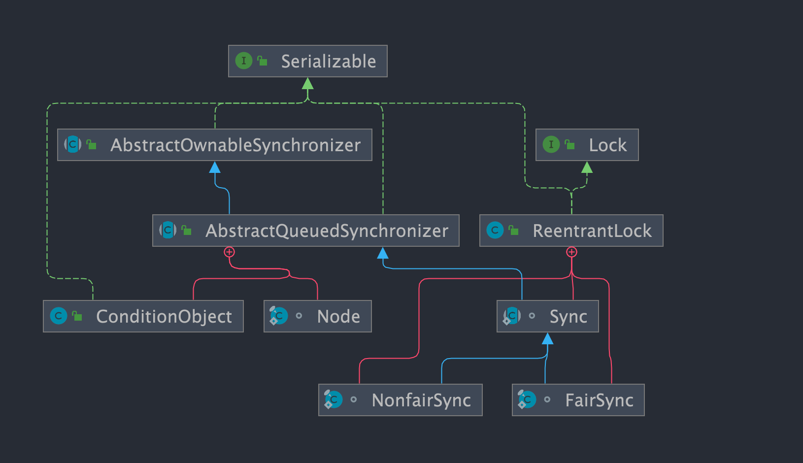

## 公平锁和非公平锁有什么区别？

- **公平锁** : 锁被释放之后，先申请的线程先得到锁。性能较差一些，因为公平锁为了保证时间上的绝对顺序，上下文切换更频繁。
- **非公平锁**：锁被释放之后，后申请的线程可能会先获取到锁，是随机或者按照其他优先级排序的。性能更好，但可能会导致某些线程永远无法获取到锁。

## synchronized 和 ReentrantLock 有什么区别？

**两者都是可重入锁**

**可重入锁** 也叫递归锁，指的是线程可以再次获取自己的内部锁。比如一个线程获得了某个对象的锁，此时这个对象锁还没有释放，当其再次想要获取这个对象的锁的时候还是可以获取的，如果是不可重入锁的话，就会造成死锁。

JDK 提供的所有现成的 `Lock` 实现类，包括 `synchronized` 关键字锁都是可重入的。

**synchronized 依赖于 JVM 而 ReentrantLock 依赖于 API**

`synchronized` 是依赖于 JVM 实现的，前面我们也讲到了 虚拟机团队在 JDK1.6 为 `synchronized` 关键字进行了很多优化，但是这些优化都是在虚拟机层面实现的，并没有直接暴露给我们。

`ReentrantLock` 是 JDK 层面实现的（也就是 API 层面，需要 `lock()` 和 `unlock()` 方法配合 `try/finally` 语句块来完成），所以我们可以通过查看它的源代码，来看它是如何实现的。

**ReentrantLock 比 synchronized 增加了一些高级功能**

相比`synchronized`，`ReentrantLock`增加了一些高级功能。主要来说主要有三点：

- **等待可中断** : `ReentrantLock`提供了一种能够中断等待锁的线程的机制，通过 `lock.lockInterruptibly()` 来实现这个机制。也就是说当前线程在等待获取锁的过程中，如果其他线程中断当前线程「 `interrupt()` 」，当前线程就会抛出 `InterruptedException` 异常，可以捕捉该异常进行相应处理。
- **可实现公平锁** : `ReentrantLock`可以指定是公平锁还是非公平锁。而`synchronized`只能是非公平锁。所谓的公平锁就是先等待的线程先获得锁。`ReentrantLock`默认情况是非公平的，可以通过 `ReentrantLock`类的`ReentrantLock(boolean fair)`构造方法来指定是否是公平的。
- **通知机制更强大**：`ReentrantLock` 通过绑定多个 `Condition` 对象，可以实现分组唤醒和选择性通知。这解决了 `synchronized` 只能随机唤醒或全部唤醒的效率问题，为复杂的线程协作场景提供了强大的支持。
- **支持超时** ：`ReentrantLock` 提供了 `tryLock(timeout)` 的方法，可以指定等待获取锁的最长等待时间，如果超过了等待时间，就会获取锁失败，不会一直等待。

## 可中断锁和不可中断锁有什么区别？

它们的区别在于：**线程在获取锁的过程中被阻塞时，是否能够因为中断而提前放弃等待。**

- 不可中断锁

  ：线程在等待锁期间即使收到中断信号，也不会退出阻塞状态，而是一直等待直到获得锁。中断状态会被保留，但不会影响锁的获取过程。 

  - `synchronized` 属于典型的不可中断锁。
  - `ReentrantLock#lock()` 也是不可中断的。

- 可中断锁

  ：线程在等待锁的过程中如果收到中断信号，会立即停止等待并抛出 

  ```
  InterruptedException
  ```

  ，从而有机会进行取消或错误处理。 

  - `ReentrantLock#lockInterruptibly()` 实现了可中断锁。
  - `ReentrantLock#tryLock(long time, TimeUnit unit)` （带超时的尝试获取）也是可中断的。


## ReentrantReadWriteLock 是什么？

`ReentrantReadWriteLock` 在实际项目中使用的并不多，面试中也问的比较少，简单了解即可。JDK 1.8 引入了性能更好的读写锁 `StampedLock` 。

`ReentrantReadWriteLock` 实现了 `ReadWriteLock` ，是一个可重入的读写锁，既可以保证多个线程同时读的效率，同时又可以保证有写入操作时的线程安全。

- 一般锁进行并发控制的规则：读读互斥、读写互斥、写写互斥。
- 读写锁进行并发控制的规则：读读不互斥、读写互斥、写写互斥（只有读读不互斥）。

`ReentrantReadWriteLock` 其实是两把锁，一把是 `WriteLock` (写锁)，一把是 `ReadLock`（读锁） 。读锁是共享锁，写锁是独占锁。读锁可以被同时读，可以同时被多个线程持有，而写锁最多只能同时被一个线程持有。

和 `ReentrantLock` 一样，`ReentrantReadWriteLock` 底层也是基于 AQS 实现的。`ReentrantReadWriteLock` 也支持公平锁和非公平锁，默认使用非公平锁，可以通过构造器来显式地指定。

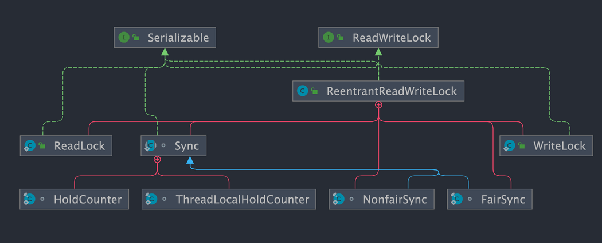

## ReentrantReadWriteLock 适合什么场景？

由于 `ReentrantReadWriteLock` 既可以保证多个线程同时读的效率，同时又可以保证有写入操作时的线程安全。因此，在读多写少的情况下，使用 `ReentrantReadWriteLock` 能够明显提升系统性能。

## 共享锁和独占锁有什么区别？

- **共享锁**：一把锁可以被多个线程同时获得。
- **独占锁**：一把锁只能被一个线程获得。

## 线程持有读锁还能获取写锁吗

- 在线程持有读锁的情况下，该线程不能取得写锁(因为获取写锁的时候，如果发现当前的读锁被占用，就马上获取失败，不管读锁是不是被当前线程持有)。
- 在线程持有写锁的情况下，该线程可以继续获取读锁（获取读锁时如果发现写锁被占用，只有写锁没有被当前线程占用的情况才会获取失败）。

## 读锁为什么不能升级为写锁？

写锁可以降级为读锁，但是读锁却不能升级为写锁。这是因为读锁升级为写锁会引起线程的争夺，毕竟写锁属于是独占锁，这样的话，会影响性能。

另外，还可能会有死锁问题发生。举个例子：假设两个线程的读锁都想升级写锁，则需要对方都释放自己锁，而双方都不释放，就会产生死锁。

## StampedLock 是什么？


`StampedLock` 是 JDK 1.8 引入的性能更好的读写锁，不可重入且不支持条件变量 `Condition`。

不同于一般的 `Lock` 类，`StampedLock` 并不是直接实现 `Lock`或 `ReadWriteLock`接口，而是基于 **CLH 锁** 独立实现的（AQS 也是基于这玩意）。

```java
public class StampedLock implements java.io.Serializable {
}
```

`StampedLock` 提供了三种模式的读写控制模式：读锁、写锁和乐观读。

- **写锁**：独占锁，一把锁只能被一个线程获得。当一个线程获取写锁后，其他请求读锁和写锁的线程必须等待。类似于 `ReentrantReadWriteLock` 的写锁，不过这里的写锁是不可重入的。
- **读锁** （悲观读）：共享锁，没有线程获取写锁的情况下，多个线程可以同时持有读锁。如果己经有线程持有写锁，则其他线程请求获取该读锁会被阻塞。类似于 `ReentrantReadWriteLock` 的读锁，不过这里的读锁是不可重入的。
- **乐观读**：允许多个线程获取乐观读以及读锁。同时允许一个写线程获取写锁。

另外，`StampedLock` 还支持这三种锁在一定条件下进行相互转换 。

```java
long tryConvertToWriteLock(long stamp){}
long tryConvertToReadLock(long stamp){}
long tryConvertToOptimisticRead(long stamp){}
```

## StampedLock 的性能为什么更好？

相比于传统读写锁多出来的乐观读是`StampedLock`比 `ReadWriteLock` 性能更好的关键原因。`StampedLock` 的乐观读允许一个写线程获取写锁，所以不会导致所有写线程阻塞，也就是当读多写少的时候，写线程有机会获取写锁，减少了线程饥饿的问题，吞吐量大大提高。

## StampedLock 适合什么场景？

和 `ReentrantReadWriteLock` 一样，`StampedLock` 同样适合读多写少的业务场景，可以作为 `ReentrantReadWriteLock`的替代品，性能更好。

不过，需要注意的是`StampedLock`不可重入，不支持条件变量 `Condition`，对中断操作支持也不友好（使用不当容易导致 CPU 飙升）。如果你需要用到 `ReentrantLock` 的一些高级性能，就不太建议使用 `StampedLock` 了。

## StampedLock 的底层原理了解吗？

`StampedLock` 不是直接实现 `Lock`或 `ReadWriteLock`接口，而是基于 **CLH 锁** 实现的（AQS 也是基于这玩意），CLH 锁是对自旋锁的一种改良，是一种隐式的链表队列。`StampedLock` 通过 CLH 队列进行线程的管理，通过同步状态值 `state` 来表示锁的状态和类型。


## ThreadLocal 有什么用？

JDK 中提供的 `ThreadLocal` 类正是为了解决这个问题。**`ThreadLocal` 类允许每个线程绑定自己的值**，可以将其形象地比喻为一个“存放数据的盒子”。每个线程都有自己独立的盒子，用于存储私有数据，确保不同线程之间的数据互不干扰。


## ThreadLocal 原理了解吗？

```java
public class Thread implements Runnable {
    //......
    //与此线程有关的ThreadLocal值。由ThreadLocal类维护
    ThreadLocal.ThreadLocalMap threadLocals = null;

    //与此线程有关的InheritableThreadLocal值。由InheritableThreadLocal类维护
    ThreadLocal.ThreadLocalMap inheritableThreadLocals = null;
    //......
}
```

从上面`Thread`类 源代码可以看出`Thread` 类中有一个 `threadLocals` 和 一个 `inheritableThreadLocals` 变量，它们都是 `ThreadLocalMap` 类型的变量,我们可以把 `ThreadLocalMap` 理解为`ThreadLocal` 类实现的定制化的 `HashMap`。默认情况下这两个变量都是 null，只有当前线程调用 `ThreadLocal` 类的 `set`或`get`方法时才创建它们，实际上调用这两个方法的时候，我们调用的是`ThreadLocalMap`类对应的 `get()`、`set()`方法。

```java
public void set(T value) {
    //获取当前请求的线程
    Thread t = Thread.currentThread();
    //取出 Thread 类内部的 threadLocals 变量(哈希表结构)
    ThreadLocalMap map = getMap(t);
    if (map != null)
        // 将需要存储的值放入到这个哈希表中
        map.set(this, value);
    else
        createMap(t, value);
}
ThreadLocalMap getMap(Thread t) {
    return t.threadLocals;
}
```

通过上面这些内容，我们足以通过猜测得出结论：**最终的变量是放在了当前线程的 `ThreadLocalMap` 中，并不是存在 `ThreadLocal` 上，`ThreadLocal` 可以理解为只是`ThreadLocalMap`的封装，传递了变量值。** `ThrealLocal` 类中可以通过`Thread.currentThread()`获取到当前线程对象后，直接通过`getMap(Thread t)`可以访问到该线程的`ThreadLocalMap`对象。

**每个`Thread`中都具备一个`ThreadLocalMap`，而`ThreadLocalMap`可以存储以`ThreadLocal`为 key ，Object 对象为 value 的键值对。**

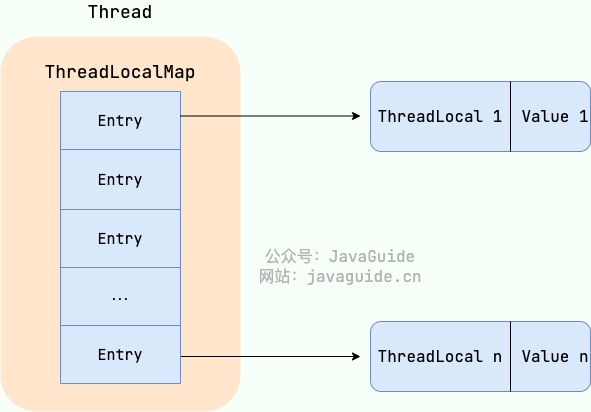


## ThreadLocal 内存泄露问题是怎么导致的？

```java
static class Entry extends WeakReference<ThreadLocal<?>> {
    Object value;

    Entry(ThreadLocal<?> k, Object v) {
        super(k);
        value = v;
    }
}
```

`ThreadLocalMap` 的 `key` 和 `value` 引用机制：

- **key 是弱引用**：`ThreadLocalMap` 中的 key 是 `ThreadLocal` 的弱引用 (`WeakReference<ThreadLocal<?>>`)。 这意味着，如果 `ThreadLocal` 实例不再被任何强引用指向，垃圾回收器会在下次 GC 时回收该实例，导致 `ThreadLocalMap` 中对应的 key 变为 `null`。
- **value 是强引用**：即使 `key` 被 GC 回收，`value` 仍然被 `ThreadLocalMap.Entry` 强引用存在，无法被 GC 回收。

**如何避免内存泄漏的发生？**

1. 在使用完 `ThreadLocal` 后，务必调用 `remove()` 方法。 这是最安全和最推荐的做法。 `remove()` 方法会从 `ThreadLocalMap` 中显式地移除对应的 entry，彻底解决内存泄漏的风险。 即使将 `ThreadLocal` 定义为 `static final`，也强烈建议在每次使用后调用 `remove()`。
2. 在线程池等线程复用的场景下，使用 `try-finally` 块可以确保即使发生异常，`remove()` 方法也一定会被执行。


## 如何跨线程传递 ThreadLocal 的值？

异步执行往往意味着任务会从当前线程切换到另一个线程（例如线程池中的工作线程）执行。由于不同线程各自维护独立的 `ThreadLocalMap`，默认情况下 `ThreadLocal` 的上下文无法在异步执行中自动传递。

为了解决这个问题，业界有两套主流的解决方案，一套是 JDK 原生的，另一套是阿里巴巴开源的。

1. `InheritableThreadLocal` ：JDK1.2 提供的一个类，继承自 `ThreadLocal` 。使用 `InheritableThreadLocal` 时，会在创建子线程时，令子线程继承父线程中的 `ThreadLocal` 值，但是无法支持线程池场景下的 `ThreadLocal` 值传递。
2. `TransmittableThreadLocal` ： `TransmittableThreadLocal` （简称 TTL） 是阿里巴巴开源的工具类，继承并加强了`InheritableThreadLocal`类，可以在线程池的场景下支持 `ThreadLocal` 值传递。

## InheritableThreadLocal 原理

`InheritableThreadLocal` 实现了创建异步线程时，继承父线程 `ThreadLocal` 值的功能。该类是 JDK 团队提供的，通过改造 JDK 源码包中的 `Thread` 类来实现创建线程时，`ThreadLocal` 值的传递。

**`InheritableThreadLocal` 的值存储在哪里？**

在 `Thread` 类中添加了一个新的 `ThreadLocalMap` ，命名为 `inheritableThreadLocals` ，该变量用于存储需要跨线程传递的 `ThreadLocal` 值。如下：

```java
class Thread implements Runnable {
    ThreadLocal.ThreadLocalMap threadLocals = null;
    ThreadLocal.ThreadLocalMap inheritableThreadLocals = null;
}
```

**如何完成 `ThreadLocal` 值的传递？**

通过改造 `Thread` 类的构造方法来实现，在创建 `Thread` 线程时，拿到父线程的 `inheritableThreadLocals` 变量赋值给子线程即可。相关代码如下：

```java
// Thread 的构造方法会调用 init() 方法
private void init(/* ... */) {
	// 1、获取父线程
    Thread parent = currentThread();
    // 2、将父线程的 inheritableThreadLocals 赋值给子线程
    if (inheritThreadLocals && parent.inheritableThreadLocals != null)
        this.inheritableThreadLocals =
        	ThreadLocal.createInheritedMap(parent.inheritableThreadLocals);
}
```

## TransmittableThreadLocal 原理

JDK 默认没有支持线程池场景下 `ThreadLocal` 值传递的功能，因此阿里巴巴开源了一套工具 `TransmittableThreadLocal` 来实现该功能。

由于阿里巴巴无法改动 JDK 源码，TTL 巧妙地利用了**装饰器模式**对任务（`Runnable`/`Callable`）或线程池（`Executor`）进行增强，将上下文的传递时机从“线程创建时”延迟到了“任务提交与执行时”。

TTL 的核心逻辑可以概括为三个阶段（CRR）：

- **Capture（捕获）**：在提交任务（如调用 `execute`）的一瞬间，`TtlRunnable` 会调用 `TransmittableThreadLocal.Transmitter.capture()`。它通过内部维护的 `holder` 集合，抓取当前父线程中所有活跃的 TTL 变量并存入快照。
- **Replay（回放）**：在线程池的工作线程执行 `run()` 方法前，调用 `replay()`。它将快照中的值 `set` 到当前工作线程中，并备份该线程原有的旧值。
- **Restore（恢复）**：任务执行结束后，调用 `restore()`。它根据备份将工作线程恢复到执行前的状态，防止上下文污染或内存泄漏。

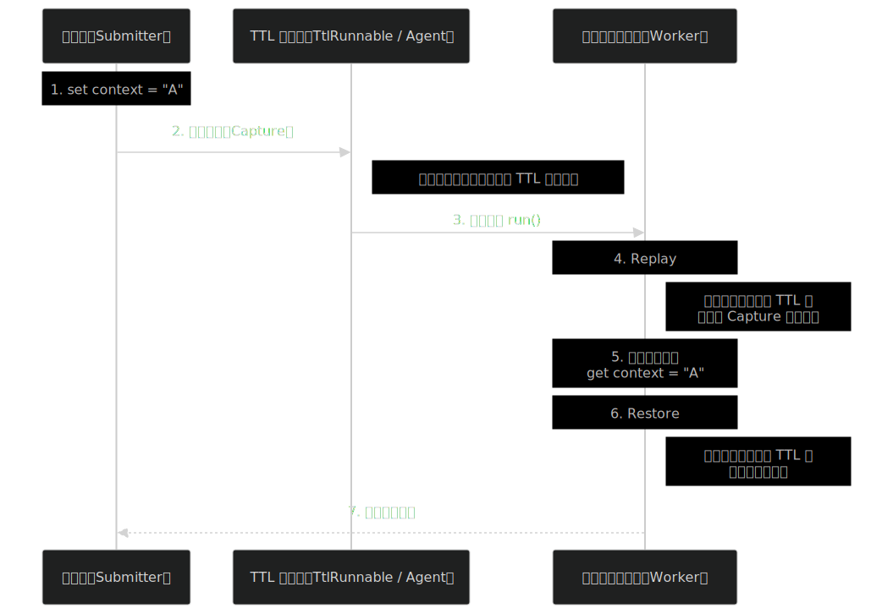


## 什么是线程池?

顾名思义，线程池就是管理一系列线程的资源池。当有任务要处理时，直接从线程池中获取线程来处理，处理完之后线程并不会立即被销毁，而是等待下一个任务。


## 为什么要用线程池？

池化技术想必大家已经屡见不鲜了，线程池、数据库连接池、HTTP 连接池等等都是对这个思想的应用。池化技术的思想主要是为了减少每次获取资源的消耗，提高对资源的利用率。

线程池提供了一种限制和管理资源（包括执行一个任务）的方式。 每个线程池还维护一些基本统计信息，例如已完成任务的数量。使用线程池主要带来以下几个好处：

1. **降低资源消耗**：线程池里的线程是可以重复利用的。一旦线程完成了某个任务，它不会立即销毁，而是回到池子里等待下一个任务。这就避免了频繁创建和销毁线程带来的开销。
2. **提高响应速度**：因为线程池里通常会维护一定数量的核心线程（或者说“常驻工人”），任务来了之后，可以直接交给这些已经存在的、空闲的线程去执行，省去了创建线程的时间，任务能够更快地得到处理。
3. **提高线程的可管理性**：线程池允许我们统一管理池中的线程。我们可以配置线程池的大小（核心线程数、最大线程数）、任务队列的类型和大小、拒绝策略等。这样就能控制并发线程的总量，防止资源耗尽，保证系统的稳定性。同时，线程池通常也提供了监控接口，方便我们了解线程池的运行状态（比如有多少活跃线程、多少任务在排队等），便于调优。


## Executor 框架介绍

`Executor` 框架是 Java5 之后引进的，在 Java 5 之后，通过 `Executor` 来启动线程比使用 `Thread` 的 `start` 方法更好，除了更易管理，效率更好（用线程池实现，节约开销）外，还有关键的一点：有助于避免 this 逃逸问题。

> this 逃逸是指在构造函数返回之前其他线程就持有该对象的引用，调用尚未构造完全的对象的方法可能引发令人疑惑的错误。

`Executor` 框架不仅包括了线程池的管理，还提供了线程工厂、队列以及拒绝策略等，`Executor` 框架让并发编程变得更加简单。

`Executor` 框架结构主要由三大部分组成：

**1、任务(`Runnable` /`Callable`)**

执行任务需要实现的 **`Runnable` 接口** 或 **`Callable`接口**。**`Runnable` 接口**或 **`Callable` 接口** 实现类都可以被 **`ThreadPoolExecutor`** 或 **`ScheduledThreadPoolExecutor`** 执行。

**2、任务的执行(`Executor`)**

如下图所示，包括任务执行机制的核心接口 **`Executor`** ，以及继承自 `Executor` 接口的 **`ExecutorService` 接口。`ThreadPoolExecutor`** 和 **`ScheduledThreadPoolExecutor`** 这两个关键类实现了 **`ExecutorService`** 接口。

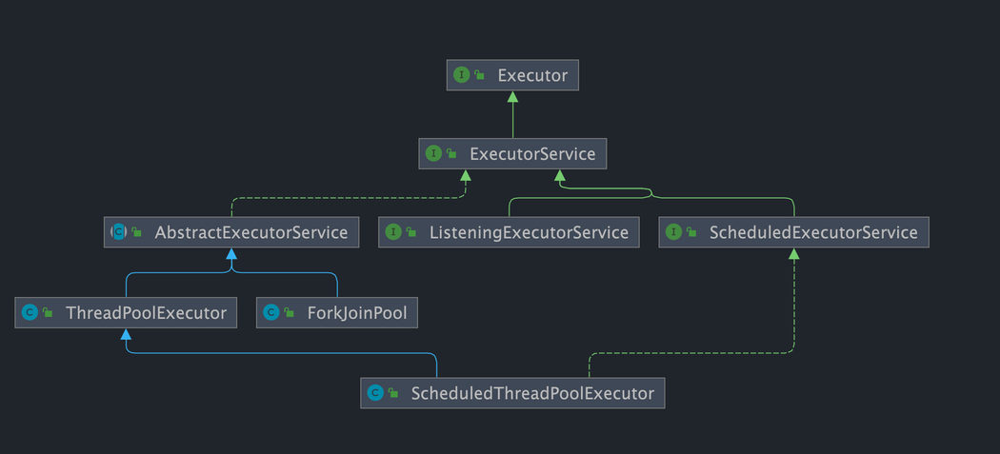

**3、异步计算的结果(`Future`)**

**`Future`** 接口以及 `Future` 接口的实现类 **`FutureTask`** 类都可以代表异步计算的结果。

当我们把 **`Runnable`接口** 或 **`Callable` 接口** 的实现类提交给 **`ThreadPoolExecutor`** 或 **`ScheduledThreadPoolExecutor`** 执行。（调用 `submit()` 方法时会返回一个 **`FutureTask`** 对象）

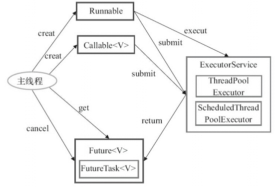

1. 主线程首先要创建实现 `Runnable` 或者 `Callable` 接口的任务对象。
2. 把创建完成的实现 `Runnable`/`Callable`接口的 对象直接交给 `ExecutorService` 执行: `ExecutorService.execute（Runnable command）`）或者也可以把 `Runnable` 对象或`Callable` 对象提交给 `ExecutorService` 执行（`ExecutorService.submit（Runnable task）`或 `ExecutorService.submit（Callable <T> task）`）。
3. 如果执行 `ExecutorService.submit（…）`，`ExecutorService` 将返回一个实现`Future`接口的对象（我们刚刚也提到过了执行 `execute()`方法和 `submit()`方法的区别，`submit()`会返回一个 `FutureTask 对象）。由于 FutureTask` 实现了 `Runnable`，我们也可以创建 `FutureTask`，然后直接交给 `ExecutorService` 执行。
4. 最后，主线程可以执行 `FutureTask.get()`方法来等待任务执行完成。主线程也可以执行 `FutureTask.cancel（boolean mayInterruptIfRunning）`来取消此任务的执行。


## Runnable` vs `Callable

`Runnable`自 Java 1.0 以来一直存在，但`Callable`仅在 Java 1.5 中引入,目的就是为了来处理`Runnable`不支持的用例。`Runnable` 接口不会返回结果或抛出检查异常，但是 `Callable` 接口可以。所以，如果任务不需要返回结果或抛出异常推荐使用 `Runnable` 接口，这样代码看起来会更加简洁。

工具类 `Executors` 可以实现将 `Runnable` 对象转换成 `Callable` 对象。（`Executors.callable(Runnable task)` 或 `Executors.callable(Runnable task, Object result)`）

```java
@FunctionalInterface
public interface Runnable {
   /**
    * 被线程执行，没有返回值也无法抛出异常
    */
    public abstract void run();
}

@FunctionalInterface
public interface Callable<V> {
    /**
     * 计算结果，或在无法这样做时抛出异常。
     * @return 计算得出的结果
     * @throws 如果无法计算结果，则抛出异常
     */
    V call() throws Exception;
}
```


## `execute()` vs `submit()`

`execute()` 和 `submit()`是两种提交任务到线程池的方法，有一些区别：

- **返回值**：`execute()` 方法用于提交不需要返回值的任务。通常用于执行 `Runnable` 任务，无法判断任务是否被线程池成功执行。`submit()` 方法用于提交需要返回值的任务。可以提交 `Runnable` 或 `Callable` 任务。`submit()` 方法返回一个 `Future` 对象，通过这个 `Future` 对象可以判断任务是否执行成功，并获取任务的返回值（`get()`方法会阻塞当前线程直到任务完成， `get（long timeout，TimeUnit unit）`多了一个超时时间，如果在 `timeout` 时间内任务还没有执行完，就会抛出 `java.util.concurrent.TimeoutException`）。
- **异常处理**：在使用 `submit()` 方法时，可以通过 `Future` 对象处理任务执行过程中抛出的异常；而在使用 `execute()` 方法时，异常处理需要通过自定义的 `ThreadFactory` （在线程工厂创建线程的时候设置`UncaughtExceptionHandler`对象来 处理异常）或 `ThreadPoolExecutor` 的 `afterExecute()` 方法来处理

## `shutdown()`VS`shutdownNow()`

- **`shutdown（）`** :关闭线程池，线程池的状态变为 `SHUTDOWN`。线程池不再接受新任务了，但是队列里的任务得执行完毕。
- **`shutdownNow（）`** :关闭线程池，线程池的状态变为 `STOP`。线程池会终止当前正在运行的任务，并停止处理排队的任务并返回正在等待执行的 List。

## `isTerminated()` VS `isShutdown()`

- **`isShutDown`** 当调用 `shutdown()` 方法后返回为 true。
- **`isTerminated`** 当调用 `shutdown()` 方法后，并且所有提交的任务完成后返回为 true

## ScheduledThreadPoolExecutor 和 Timer 对比

- `Timer` 对系统时钟的变化敏感，`ScheduledThreadPoolExecutor`不是；
- `Timer` 只有一个执行线程，因此长时间运行的任务可以延迟其他任务。 `ScheduledThreadPoolExecutor` 可以配置任意数量的线程。 此外，如果你想（通过提供 `ThreadFactory`），你可以完全控制创建的线程;
- 在`TimerTask` 中抛出的运行时异常会杀死一个线程，从而导致 `Timer` 死机即计划任务将不再运行。`ScheduledThreadExecutor` 不仅捕获运行时异常，还允许您在需要时处理它们（通过重写 `afterExecute` 方法`ThreadPoolExecutor`）。抛出异常的任务将被取消，但其他任务将继续运行。


## Atomic原子类

**1、基本类型**

使用原子的方式更新基本类型

- `AtomicInteger`：整型原子类
- `AtomicLong`：长整型原子类
- `AtomicBoolean`：布尔型原子类

**2、数组类型**

使用原子的方式更新数组里的某个元素

- `AtomicIntegerArray`：整型数组原子类
- `AtomicLongArray`：长整型数组原子类
- `AtomicReferenceArray`：引用类型数组原子类

**3、引用类型**

- `AtomicReference`：引用类型原子类
- `AtomicMarkableReference`：原子更新带有标记的引用类型。该类将 boolean 标记与引用关联起来
- `AtomicStampedReference`：原子更新带有版本号的引用类型。该类将整数值与引用关联起来，可用于解决原子的更新数据和数据的版本号，可以解决使用 CAS 进行原子更新时可能出现的 ABA 问题。

**4、对象的属性修改类型**

- `AtomicIntegerFieldUpdater`:原子更新整型字段的更新器
- `AtomicLongFieldUpdater`：原子更新长整型字段的更新器
- `AtomicReferenceFieldUpdater`：原子更新引用类型里的字段


## 如何创建线程池？

**方式一：通过 `ThreadPoolExecutor` 构造函数直接创建 (推荐)**

这是最推荐的方式，因为它允许开发者明确指定线程池的核心参数，对线程池的运行行为有更精细的控制，从而避免资源耗尽的风险。

**方式二：通过 `Executors` 工具类创建 (不推荐用于生产环境)**

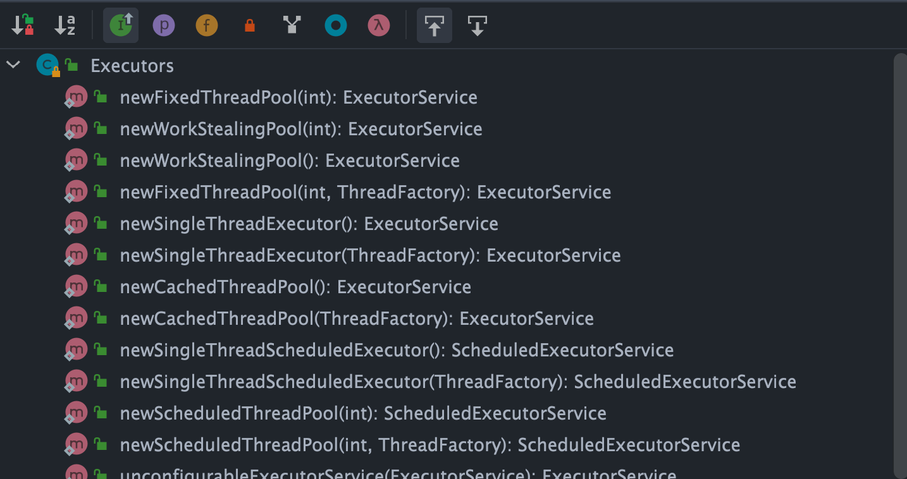

- `FixedThreadPool`：固定线程数量的线程池。该线程池中的线程数量始终不变。当有一个新的任务提交时，线程池中若有空闲线程，则立即执行。若没有，则新的任务会被暂存在一个任务队列中，待有线程空闲时，便处理在任务队列中的任务。
- `SingleThreadExecutor`： 只有一个线程的线程池。若多余一个任务被提交到该线程池，任务会被保存在一个任务队列中，待线程空闲，按先入先出的顺序执行队列中的任务。
- `CachedThreadPool`： 可根据实际情况调整线程数量的线程池。线程池的线程数量不确定，但若有空闲线程可以复用，则会优先使用可复用的线程。若所有线程均在工作，又有新的任务提交，则会创建新的线程处理任务。所有线程在当前任务执行完毕后，将返回线程池进行复用。
- `ScheduledThreadPool`：给定的延迟后运行任务或者定期执行任务的线程池。

`FixedThreadPool` 和 `SingleThreadExecutor`:使用的是阻塞队列 `LinkedBlockingQueue`，任务队列最大长度为 `Integer.MAX_VALUE`，可以看作是无界的，可能堆积大量的请求，从而导致 OOM。

`CachedThreadPool`:使用的是同步队列 `SynchronousQueue`, 允许创建的线程数量为 `Integer.MAX_VALUE` ，如果任务数量过多且执行速度较慢，可能会创建大量的线程，从而导致 OOM。

`ScheduledThreadPool` 和 `SingleThreadScheduledExecutor`:使用的无界的延迟阻塞队列`DelayedWorkQueue`，任务队列最大长度为 `Integer.MAX_VALUE`,可能堆积大量的请求，从而导致 OOM。

## 为什么不推荐使用内置线程池？

使用线程池的好处是减少在创建和销毁线程上所消耗的时间以及系统资源开销，解决资源不足的问题。如果不使用线程池，有可能会造成系统创建大量同类线程而导致消耗完内存或者“过度切换”的问题。

## 线程池常见参数有哪些？如何解释？

```java
    /**
     * 用给定的初始参数创建一个新的ThreadPoolExecutor。
     */
    public ThreadPoolExecutor(int corePoolSize,//线程池的核心线程数量
                              int maximumPoolSize,//线程池的最大线程数
                              long keepAliveTime,//当线程数大于核心线程数时，多余的空闲线程存活的最长时间
                              TimeUnit unit,//时间单位
                              BlockingQueue<Runnable> workQueue,//任务队列，用来储存等待执行任务的队列
                              ThreadFactory threadFactory,//线程工厂，用来创建线程，一般默认即可
                              RejectedExecutionHandler handler//拒绝策略，当提交的任务过多而不能及时处理时，我们可以定制策略来处理任务
                               ) {
        if (corePoolSize < 0 ||
            maximumPoolSize <= 0 ||
            maximumPoolSize < corePoolSize ||
            keepAliveTime < 0)
            throw new IllegalArgumentException();
        if (workQueue == null || threadFactory == null || handler == null)
            throw new NullPointerException();
        this.corePoolSize = corePoolSize;
        this.maximumPoolSize = maximumPoolSize;
        this.workQueue = workQueue;
        this.keepAliveTime = unit.toNanos(keepAliveTime);
        this.threadFactory = threadFactory;
        this.handler = handler;
    }
```

- `corePoolSize` : 任务队列未达到队列容量时，最大可以同时运行的线程数量。
- `maximumPoolSize` : 任务队列中存放的任务达到队列容量的时候，当前可以同时运行的线程数量变为最大线程数。
- `workQueue`: 新任务来的时候会先判断当前运行的线程数量是否达到核心线程数，如果达到的话，新任务就会被存放在队列中。
- `keepAliveTime`:当线程池中的线程数量大于 `corePoolSize` ，即有非核心线程（线程池中核心线程以外的线程）时，这些非核心线程空闲后不会立即销毁，而是会等待，直到等待的时间超过了 `keepAliveTime`才会被回收销毁。
- `unit` : `keepAliveTime` 参数的时间单位。
- `threadFactory` :executor 创建新线程的时候会用到。
- `handler` :拒绝策略（后面会单独详细介绍一下）。

## 线程池的核心线程会被回收吗？

`ThreadPoolExecutor` 默认不会回收核心线程，即使它们已经空闲了。这是为了减少创建线程的开销，因为核心线程通常是要长期保持活跃的。但是，如果线程池是被用于周期性使用的场景，且频率不高（周期之间有明显的空闲时间），可以考虑将 `allowCoreThreadTimeOut(boolean value)` 方法的参数设置为 `true`，这样就会回收空闲（时间间隔由 `keepAliveTime` 指定）的核心线程了。

```java
public void allowCoreThreadTimeOut(boolean value) {
    // 核心线程的 keepAliveTime 必须大于 0 才能启用超时机制
    if (value && keepAliveTime <= 0) {
        throw new IllegalArgumentException("Core threads must have nonzero keep alive times");
    }
    // 设置 allowCoreThreadTimeOut 的值
    if (value != allowCoreThreadTimeOut) {
        allowCoreThreadTimeOut = value;
        // 如果启用了超时机制，清理所有空闲的线程，包括核心线程
        if (value) {
            interruptIdleWorkers();
        }
    }
}
```

## 核心线程空闲时处于什么状态？

核心线程空闲时，其状态分为以下两种情况：

- **设置了核心线程的存活时间** ：核心线程在空闲时，会处于 `WAITING` 状态，等待获取任务。如果阻塞等待的时间超过了核心线程存活时间，则该线程会退出工作，将该线程从线程池的工作线程集合中移除，线程状态变为 `TERMINATED` 状态。
- **没有设置核心线程的存活时间** ：核心线程在空闲时，会一直处于 `WAITING` 状态，等待获取任务，核心线程会一直存活在线程池中。


## 线程池的拒绝策略有哪些？

- `ThreadPoolExecutor.AbortPolicy`：抛出 `RejectedExecutionException`来拒绝新任务的处理。
- `ThreadPoolExecutor.CallerRunsPolicy`：调用执行者自己的线程运行任务，也就是直接在调用`execute`方法的线程中运行(`run`)被拒绝的任务，如果执行程序已关闭，则会丢弃该任务。因此这种策略会降低对于新任务提交速度，影响程序的整体性能。如果你的应用程序可以承受此延迟并且你要求任何一个任务请求都要被执行的话，你可以选择这个策略。
- `ThreadPoolExecutor.DiscardPolicy`：不处理新任务，直接丢弃掉。
- `ThreadPoolExecutor.DiscardOldestPolicy`：此策略将丢弃最早的未处理的任务请求。

## CallerRunsPolicy 拒绝策略有什么风险？如何解决？

因为`CallerRunsPolicy`这个拒绝策略，导致耗时的任务用了主线程执行，导致线程池阻塞，进而导致后续任务无法及时执行，严重的情况下很可能导致 OOM。

**解决方法**

- 实现`RejectedExecutionHandler`接口自定义拒绝策略，自定义拒绝策略负责将线程池暂时无法处理（此时阻塞队列已满）的任务入库（保存到 MySQL 中）。注意：线程池暂时无法处理的任务会先被放在阻塞队列中，阻塞队列满了才会触发拒绝策略。
- 继承`BlockingQueue`实现一个混合式阻塞队列，该队列包含 JDK 自带的`ArrayBlockingQueue`。另外，该混合式阻塞队列需要修改取任务处理的逻辑，也就是重写`take()`方法，取任务时优先从数据库中读取最早的任务，数据库中无任务时再从 `ArrayBlockingQueue`中去取任务。

核心在于自定义拒绝策略和阻塞队列。如此一来，一旦我们的线程池中线程达到满载时，我们就可以通过拒绝策略将最新任务持久化到 MySQL 数据库中，等到线程池有了有余力处理所有任务时，让其优先处理数据库中的任务以避免"饥饿"问题。

## 线程池常用的阻塞队列有哪些？

- 容量为 `Integer.MAX_VALUE` 的 `LinkedBlockingQueue`（无界阻塞队列）：`FixedThreadPool` 和 `SingleThreadExecutor` 。`FixedThreadPool`最多只能创建核心线程数的线程（核心线程数和最大线程数相等），`SingleThreadExecutor`只能创建一个线程（核心线程数和最大线程数都是 1），二者的任务队列永远不会被放满。
- `SynchronousQueue`（同步队列）：`CachedThreadPool` 。`SynchronousQueue` 没有容量，不存储元素，目的是保证对于提交的任务，如果有空闲线程，则使用空闲线程来处理；否则新建一个线程来处理任务。也就是说，`CachedThreadPool` 的最大线程数是 `Integer.MAX_VALUE` ，可以理解为线程数是可以无限扩展的，可能会创建大量线程，从而导致 OOM。
- `DelayedWorkQueue`（延迟队列）：`ScheduledThreadPool` 和 `SingleThreadScheduledExecutor` 。`DelayedWorkQueue` 的内部元素并不是按照放入的时间排序，而是会按照延迟的时间长短对任务进行排序，内部采用的是“堆”的数据结构，可以保证每次出队的任务都是当前队列中执行时间最靠前的。`DelayedWorkQueue` 是一个无界队列。其底层虽然是数组，但当数组容量不足时，它会自动进行扩容，因此队列永远不会被填满。当任务不断提交时，它们会全部被添加到队列中。这意味着线程池的线程数量永远不会超过其核心线程数，最大线程数参数对于使用该队列的线程池来说是无效的。
- `ArrayBlockingQueue`（有界阻塞队列）：底层由数组实现，容量一旦创建，就不能修改。

## 线程池处理任务的流程了解吗？

- 如果当前运行的线程数小于核心线程数，那么就会新建一个线程来执行任务。
- 如果当前运行的线程数等于或大于核心线程数，但是小于最大线程数，那么就把该任务放入到任务队列里等待执行。
- 如果向任务队列投放任务失败（任务队列已经满了），但是当前运行的线程数是小于最大线程数的，就新建一个线程来执行任务。
- 如果当前运行的线程数已经等同于最大线程数了，新建线程将会使当前运行的线程超出最大线程数，那么当前任务会被拒绝，拒绝策略会调用`RejectedExecutionHandler.rejectedExecution()`方法。

## 线程池在提交任务前，可以提前创建线程吗？

答案是可以的！`ThreadPoolExecutor` 提供了两个方法帮助我们在提交任务之前，完成核心线程的创建，从而实现线程池预热的效果：

- `prestartCoreThread()`:启动一个线程，等待任务，如果已达到核心线程数，这个方法返回 false，否则返回 true；
- `prestartAllCoreThreads()`:启动所有的核心线程，并返回启动成功的核心线程数。

## 线程池中线程异常后，销毁还是复用？

- **使用`execute()`提交任务**：当任务通过`execute()`提交到线程池并在执行过程中抛出异常时，如果这个异常没有在任务内被捕获，那么该异常会导致当前线程终止，并且异常会被打印到控制台或日志文件中。线程池会检测到这种线程终止，并创建一个新线程来替换它，从而保持配置的线程数不变。
- **使用`submit()`提交任务**：对于通过`submit()`提交的任务，如果在任务执行中发生异常，这个异常不会直接打印出来。相反，异常会被封装在由`submit()`返回的`Future`对象中。当调用`Future.get()`方法时，可以捕获到一个`ExecutionException`。在这种情况下，线程不会因为异常而终止，它会继续存在于线程池中，准备执行后续的任务。

简单来说：使用`execute()`时，未捕获异常导致线程终止，线程池创建新线程替代；使用`submit()`时，异常被封装在`Future`中，线程继续复用。

## 如何给线程池命名？

初始化线程池的时候需要显示命名（设置线程池名称前缀），有利于定位问题。**自己实现 `ThreadFactory`。**

```java
import java.util.concurrent.ThreadFactory;
import java.util.concurrent.atomic.AtomicInteger;

/**
 * 线程工厂，它设置线程名称，有利于我们定位问题。
 */
public final class NamingThreadFactory implements ThreadFactory {

    private final AtomicInteger threadNum = new AtomicInteger();
    private final String name;

    /**
     * 创建一个带名字的线程池生产工厂
     */
    public NamingThreadFactory(String name) {
        this.name = name;
    }

    @Override
    public Thread newThread(Runnable r) {
        Thread t = new Thread(r);
        t.setName(name + " [#" + threadNum.incrementAndGet() + "]");
        return t;
    }
}
```

## 如何设定线程池的大小？

- **CPU 密集型任务(N+1)：** 这种任务消耗的主要是 CPU 资源，可以将线程数设置为 N（CPU 核心数）+1。比 CPU 核心数多出来的一个线程是为了防止线程偶发的缺页中断，或者其它原因导致的任务暂停而带来的影响。一旦任务暂停，CPU 就会处于空闲状态，而在这种情况下多出来的一个线程就可以充分利用 CPU 的空闲时间。
- **I/O 密集型任务(2N)：** 这种任务应用起来，系统会用大部分的时间来处理 I/O 交互，而线程在处理 I/O 的时间段内不会占用 CPU 来处理，这时就可以将 CPU 交出给其它线程使用。因此在 I/O 密集型任务的应用中，我们可以多配置一些线程，具体的计算方法是 2N。

## 如何动态修改线程池的参数？

美团技术团队的思路是主要对线程池的核心参数实现自定义可配置。这三个核心参数是：

- **`corePoolSize` :** 核心线程数定义了最小可以同时运行的线程数量。
- **`maximumPoolSize` :** 当队列中存放的任务达到队列容量的时候，当前可以同时运行的线程数量变为最大线程数。
- **`workQueue`:** 当新任务来的时候会先判断当前运行的线程数量是否达到核心线程数，如果达到的话，新任务就会被存放在队列中。

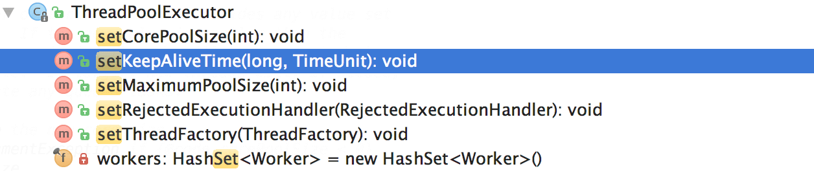

格外需要注意的是`corePoolSize`， 程序运行期间的时候，我们调用 `setCorePoolSize()`这个方法的话，线程池会首先判断当前工作线程数是否大于`corePoolSize`，如果大于的话就会回收工作线程。

另外，你也看到了上面并没有动态指定队列长度的方法，美团的方式是自定义了一个叫做 `ResizableCapacityLinkedBlockIngQueue` 的队列（主要就是把`LinkedBlockingQueue`的 capacity 字段的 final 关键字修饰给去掉了，让它变为可变的）。


## 如何设计一个能够根据任务的优先级来执行的线程池？

假如我们需要实现一个优先级任务线程池的话，那可以考虑使用 `PriorityBlockingQueue` （优先级阻塞队列）作为任务队列（`ThreadPoolExecutor` 的构造函数有一个 `workQueue` 参数可以传入任务队列）。

`PriorityBlockingQueue` 是一个支持优先级的无界阻塞队列，可以看作是线程安全的 `PriorityQueue`，两者底层都是使用小顶堆形式的二叉堆，即值最小的元素优先出队。不过，`PriorityQueue` 不支持阻塞操作。

要想让 `PriorityBlockingQueue` 实现对任务的排序，传入其中的任务必须是具备排序能力的，方式有两种：

1. 提交到线程池的任务实现 `Comparable` 接口，并重写 `compareTo` 方法来指定任务之间的优先级比较规则。
2. 创建 `PriorityBlockingQueue` 时传入一个 `Comparator` 对象来指定任务之间的排序规则(推荐)。

不过，这存在一些风险和问题，比如：

- `PriorityBlockingQueue` 是无界的，可能堆积大量的请求，从而导致 OOM。
- 可能会导致饥饿问题，即低优先级的任务长时间得不到执行。
- 由于需要对队列中的元素进行排序操作以及保证线程安全（并发控制采用的是可重入锁 `ReentrantLock`），因此会降低性能。

## Future 类有什么用？

`Future` 类是异步思想的典型运用，主要用在一些需要执行耗时任务的场景，避免程序一直原地等待耗时任务执行完成，执行效率太低。具体来说是这样的：当我们执行某一耗时的任务时，可以将这个耗时任务交给一个子线程去异步执行，同时我们可以干点其他事情，不用傻傻等待耗时任务执行完成。等我们的事情干完后，我们再通过 `Future` 类获取到耗时任务的执行结果。这样一来，程序的执行效率就明显提高了。

这其实就是多线程中经典的 **Future 模式**，你可以将其看作是一种设计模式，核心思想是异步调用，主要用在多线程领域，并非 Java 语言独有。

- 取消任务；
- 判断任务是否被取消;
- 判断任务是否已经执行完成;
- 获取任务执行结果。

```java
// V 代表了Future执行的任务返回值的类型
public interface Future<V> {
    // 取消任务执行
    // 成功取消返回 true，否则返回 false
    boolean cancel(boolean mayInterruptIfRunning);
    // 判断任务是否被取消
    boolean isCancelled();
    // 判断任务是否已经执行完成
    boolean isDone();
    // 获取任务执行结果
    V get() throws InterruptedException, ExecutionException;
    // 指定时间内没有返回计算结果就抛出 TimeOutException 异常
    V get(long timeout, TimeUnit unit)

        throws InterruptedException, ExecutionException, TimeoutExceptio

}
```

简单理解就是：我有一个任务，提交给了 `Future` 来处理。任务执行期间我自己可以去做任何想做的事情。并且，在这期间我还可以取消任务以及获取任务的执行状态。一段时间之后，我就可以 `Future` 那里直接取出任务执行结果。

## Callable 和 Future 有什么关系？

- `Callable` 提供要执行的任务逻辑。
- `Future` 提供对该任务执行结果的访问。

```JAVA
Callable ---> ExecutorService.submit() ---> Future
       |                               |
    任务逻辑                          异步结果
```


## CompletableFuture 类有什么用？

`Future` 在实际使用过程中存在一些局限性，比如不支持异步任务的编排组合、获取计算结果的 `get()` 方法为阻塞调用。

Java 8 才被引入`CompletableFuture` 类可以解决`Future` 的这些缺陷。`CompletableFuture` 除了提供了更为好用和强大的 `Future` 特性之外，还提供了函数式编程、异步任务编排组合（可以将多个异步任务串联起来，组成一个完整的链式调用）等能力。

## 一个任务需要依赖另外两个任务执行完之后再执行，怎么设计？

```JAVA
// T1
CompletableFuture<Void> futureT1 = CompletableFuture.runAsync(() -> {
    System.out.println("T1 is executing. Current time：" + DateUtil.now());
    // 模拟耗时操作
    ThreadUtil.sleep(1000);
});
// T2
CompletableFuture<Void> futureT2 = CompletableFuture.runAsync(() -> {
    System.out.println("T2 is executing. Current time：" + DateUtil.now());
    ThreadUtil.sleep(1000);
});

// 使用allOf()方法合并T1和T2的CompletableFuture，等待它们都完成
CompletableFuture<Void> bothCompleted = CompletableFuture.allOf(futureT1, futureT2);
// 当T1和T2都完成后，执行T3
bothCompleted.thenRunAsync(() -> System.out.println("T3 is executing after T1 and T2 have completed.Current time：" + DateUtil.now()));
// 等待所有任务完成，验证效果
ThreadUtil.sleep(3000);
```


## 使用 CompletableFuture，有一个任务失败，如何处理异常？

- 使用 `whenComplete` 方法可以在任务完成时触发回调函数，并正确地处理异常，而不是让异常被吞噬或丢失。
- 使用 `exceptionally` 方法可以处理异常并重新抛出，以便异常能够传播到后续阶段，而不是让异常被忽略或终止。
- 使用 `handle` 方法可以处理正常的返回结果和异常，并返回一个新的结果，而不是让异常影响正常的业务逻辑。
- 使用 `CompletableFuture.allOf` 方法可以组合多个 `CompletableFuture`，并统一处理所有任务的异常，而不是让异常处理过于冗长或重复。

## 在使用 CompletableFuture 的时候为什么要自定义线程池？

`CompletableFuture` 默认使用全局共享的 `ForkJoinPool.commonPool()` 作为执行器，所有未指定执行器的异步任务都会使用该线程池。这意味着应用程序、多个库或框架（如 Spring、第三方库）若都依赖 `CompletableFuture`，默认情况下它们都会共享同一个线程池。

虽然 `ForkJoinPool` 效率很高，但当同时提交大量任务时，可能会导致资源竞争和线程饥饿，进而影响系统性能。


## CompletableFuture 常见操作

**创建 CompletableFuture**

1. 通过 new 关键字。
2. 基于 `CompletableFuture` 自带的静态工厂方法：`runAsync()`、`supplyAsync()` 。

**new 关键字**

通过 new 关键字创建 `CompletableFuture` 对象这种使用方式可以看作是将 `CompletableFuture` 当做 `Future` 来使用。

```java
CompletableFuture<RpcResponse<Object>> resultFuture = new CompletableFuture<>();
//假设在未来的某个时刻，我们得到了最终的结果。这时，我们可以调用 complete() 方法为其传入结果，这表示 resultFuture 已经被完成了。
// complete() 方法只能调用一次，后续调用将被忽略。
resultFuture.complete(rpcResponse);
//获取异步计算的结果也非常简单，直接调用 get() 方法即可。调用 get() 方法的线程会阻塞直到 CompletableFuture 完成运算。
rpcResponse = completableFuture.get();
```

**静态工厂方法**

```java
//当你需要异步操作且关心返回结果的时候,可以使用 supplyAsync() 方法。
static <U> CompletableFuture<U> supplyAsync(Supplier<U> supplier);
// 使用自定义线程池(推荐)
static <U> CompletableFuture<U> supplyAsync(Supplier<U> supplier, Executor executor);

//当你需要异步操作且不关心返回结果的时候可以使用 runAsync() 方法。
static CompletableFuture<Void> runAsync(Runnable runnable);
// 使用自定义线程池(推荐)
static CompletableFuture<Void> runAsync(Runnable runnable, Executor executor);
```


**处理异步结算的结果**

当我们获取到异步计算的结果之后，还可以对其进行进一步的处理，比较常用的方法有下面几个：

- `thenApply()` `thenApply()` 方法接受一个 `Function` 实例，用它来处理结果，生成结果
- `thenAccept()` `thenAccept()` 方法的参数是 `Consumer<? super T>` 
- `thenRun()` `thenRun()` 的方法是的参数是 `Runnable`
- `whenComplete()`   `whenComplete()` 的方法的参数是 `BiConsumer<? super T, ? super Throwable>` `BiConsumer` 可以接收 2 个输入对象然后进行“消费”

**异常处理**

- `handle()`方法接受一个 ` BiFunction<? super T, Throwable, ? extends U> fn`

- `exceptionally()`

  ```java
  CompletableFuture<String> future
          = CompletableFuture.supplyAsync(() -> {
      if (true) {
          throw new RuntimeException("Computation error!");
      }
      return "hello!";
  }).exceptionally(ex -> {
      System.out.println(ex.toString());// CompletionException
      return "world!";
  });
  assertEquals("world!", future.get());
  ```

- `completeExceptionally()`

  ```java
  CompletableFuture<String> completableFuture = new CompletableFuture<>();
  // ...
  completableFuture.completeExceptionally(
    new RuntimeException("Calculation failed!"));
  // ...
  completableFuture.get(); // ExecutionException
  ```

**组合 CompletableFuture**

可以使用 `thenCompose()` 按顺序链接两个 `CompletableFuture` 对象，实现异步的任务链。它的作用是将前一个任务的返回结果作为下一个任务的输入参数，从而形成一个依赖关系。

```java
CompletableFuture<String> future
        = CompletableFuture.supplyAsync(() -> "hello!")
        .thenCompose(s -> CompletableFuture.supplyAsync(() -> s + "world!"));
assertEquals("hello!world!", future.get());

//和 thenCompose() 方法类似的还有 thenCombine() 方法， 它同样可以组合两个 CompletableFuture 对象。
CompletableFuture<String> completableFuture
        = CompletableFuture.supplyAsync(() -> "hello!")
        .thenCombine(CompletableFuture.supplyAsync(
                () -> "world!"), (s1, s2) -> s1 + s2)
        .thenCompose(s -> CompletableFuture.supplyAsync(() -> s + "nice!"));
assertEquals("hello!world!nice!", completableFuture.get());

//如果我们想要实现 task1 和 task2 中的任意一个任务执行完后就执行 task3 的话，可以使用 acceptEither()。
task1.acceptEitherAsync(task2, (res) -> {
    System.out.println("任务3开始执行，当前时间：" + System.currentTimeMillis());
    System.out.println("上一个任务的结果为：" + res);
});
```

- `thenCompose()` 可以链接两个 `CompletableFuture` 对象，并将前一个任务的返回结果作为下一个任务的参数，它们之间存在着先后顺序。
- `thenCombine()` 会在两个任务都执行完成后，把两个任务的结果合并。两个任务是并行执行的，它们之间并没有先后依赖顺序。


## AQS 是什么？

AQS （`AbstractQueuedSynchronizer` ，抽象队列同步器）是从 JDK1.5 开始提供的 Java 并发核心组件。它提供了一个通用框架，用于实现各种同步器，通过封装底层的线程同步机制，AQS 将复杂的线程管理逻辑隐藏起来。


## AQS 的原理是什么？

AQS 核心思想是，如果被请求的共享资源空闲，则将当前请求资源的线程设置为有效的工作线程，并且将共享资源设置为锁定状态。如果被请求的共享资源被占用，那么就需要一套线程阻塞等待以及被唤醒时锁分配的机制，这个机制 AQS 是基于 **CLH 锁** （Craig, Landin, and Hagersten locks） 进一步优化实现的。

**CLH 锁** 对自旋锁进行了改进，是基于单链表的自旋锁。在多线程场景下，会将请求获取锁的线程组织成一个单向队列，每个等待的线程会通过自旋访问前一个线程节点的状态，前一个节点释放锁之后，当前节点才可以获取锁。**CLH 锁** 的队列结构如下图所示。

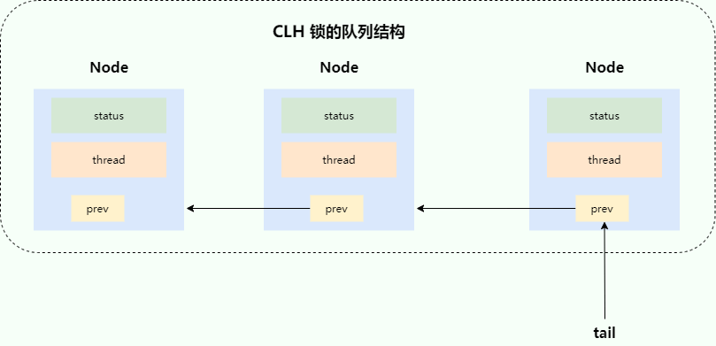

AQS 中使用的 **等待队列** 是 CLH 锁队列的变体（接下来简称为 CLH 变体队列）。

AQS 的 CLH 变体队列是一个双向队列，会暂时获取不到锁的线程将被加入到该队列中，CLH 变体队列和原本的 CLH 锁队列的区别主要有两点：

- 由 **自旋** 优化为 **自旋 + 阻塞** ：自旋操作的性能很高，但大量的自旋操作比较占用 CPU 资源，因此在 CLH 变体队列中会先通过自旋尝试获取锁，如果失败再进行阻塞等待。
- 由 **单向队列** 优化为 **双向队列** ：在 CLH 变体队列中，会对等待的线程进行阻塞操作，当队列前边的线程释放锁之后，需要对后边的线程进行唤醒，因此增加了 `next` 指针，成为了双向队列。

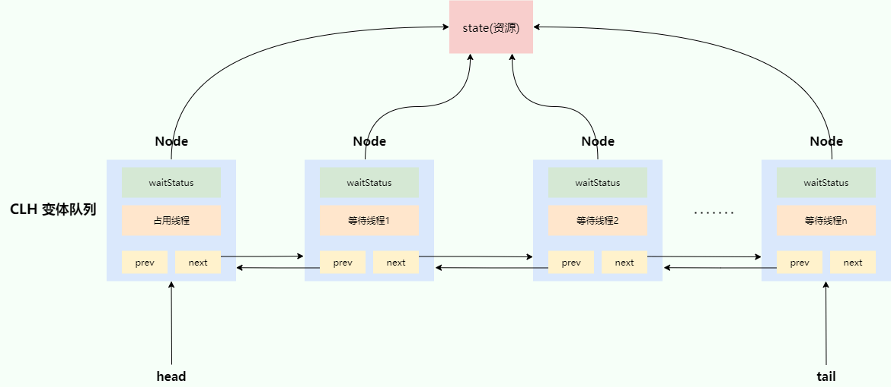

## Semaphore 有什么用？

`synchronized` 和 `ReentrantLock` 都是一次只允许一个线程访问某个资源，而`Semaphore`(信号量)可以用来控制同时访问特定资源的线程数量。

Semaphore 的使用简单，我们这里假设有 N(N>5) 个线程来获取 `Semaphore` 中的共享资源，下面的代码表示同一时刻 N 个线程中只有 5 个线程能获取到共享资源，其他线程都会阻塞，只有获取到共享资源的线程才能执行。等到有线程释放了共享资源，其他阻塞的线程才能获取到。

```java
// 初始共享资源数量
final Semaphore semaphore = new Semaphore(5);
// 获取1个许可
semaphore.acquire();
// 释放1个许可
semaphore.release();
```

## Semaphore 的原理是什么？

`Semaphore` 是共享锁的一种实现，它默认构造 AQS 的 `state` 值为 `permits`，你可以将 `permits` 的值理解为许可证的数量，只有拿到许可证的线程才能执行。

调用`semaphore.acquire()` ，线程尝试获取许可证，如果 `state >= 0` 的话，则表示可以获取成功。如果获取成功的话，使用 CAS 操作去修改 `state` 的值 `state=state-1`。如果 `state<0` 的话，则表示许可证数量不足。此时会创建一个 Node 节点加入阻塞队列，挂起当前线程。

```java
/**
 *  获取1个许可证
 */
public void acquire() throws InterruptedException {
    sync.acquireSharedInterruptibly(1);
}
/**
 * 共享模式下获取许可证，获取成功则返回，失败则加入阻塞队列，挂起线程
 */
public final void acquireSharedInterruptibly(int arg)
    throws InterruptedException {
    if (Thread.interrupted())
      throw new InterruptedException();
        // 尝试获取许可证，arg为获取许可证个数，当可用许可证数减当前获取的许可证数结果小于0,则创建一个节点加入阻塞队列，挂起当前线程。
    if (tryAcquireShared(arg) < 0)
      doAcquireSharedInterruptibly(arg);
}
```

## CountDownLatch 有什么用？

`CountDownLatch` 允许 `count` 个线程阻塞在一个地方，直至所有线程的任务都执行完毕。

`CountDownLatch` 是一次性的，计数器的值只能在构造方法中初始化一次，之后没有任何机制再次对其设置值，当 `CountDownLatch` 使用完毕后，它不能再次被使用。

## CountDownLatch 的原理是什么？

`CountDownLatch` 是共享锁的一种实现,它默认构造 AQS 的 `state` 值为 `count`。当线程使用 `countDown()` 方法时,其实使用了`tryReleaseShared`方法以 CAS 的操作来减少 `state`,直至 `state` 为 0 。当调用 `await()` 方法的时候，如果 `state` 不为 0，那就证明任务还没有执行完毕，`await()` 方法就会一直阻塞，也就是说 `await()` 方法之后的语句不会被执行。直到`count` 个线程调用了`countDown()`使 state 值被减为 0，或者调用`await()`的线程被中断，该线程才会从阻塞中被唤醒，`await()` 方法之后的语句得到执行。

## CyclicBarrier 有什么用？

`CyclicBarrier` 的字面意思是可循环使用（Cyclic）的屏障（Barrier）。它要做的事情是：让一组线程到达一个屏障（也可以叫同步点）时被阻塞，直到最后一个线程到达屏障时，屏障才会开门，所有被屏障拦截的线程才会继续干活。

## CyclicBarrier 的原理是什么？

`CyclicBarrier` 内部通过一个 `count` 变量作为计数器，`count` 的初始值为 `parties` 属性的初始化值，每当一个线程到了栅栏这里了，那么就将计数器减 1。如果 count 值为 0 了，表示这是这一代最后一个线程到达栅栏，就尝试执行我们构造方法中输入的任务。

```java
//每次拦截的线程数
private final int parties;
//计数器
private int count;
```

1、`CyclicBarrier` 默认的构造方法是 `CyclicBarrier(int parties)`，其参数表示屏障拦截的线程数量，每个线程调用 `await()` 方法告诉 `CyclicBarrier` 我已经到达了屏障，然后当前线程被阻塞。

```java
public CyclicBarrier(int parties) {
    this(parties, null);
}

public CyclicBarrier(int parties, Runnable barrierAction) {
    if (parties <= 0) throw new IllegalArgumentException();
    this.parties = parties;
    this.count = parties;
    this.barrierCommand = barrierAction;
}
```

2、当调用 `CyclicBarrier` 对象调用 `await()` 方法时，实际上调用的是 `dowait(false, 0L)`方法。 `await()` 方法就像树立起一个栅栏的行为一样，将线程挡住了，当拦住的线程数量达到 `parties` 的值时，栅栏才会打开，线程才得以通过执行。

```java
public int await() throws InterruptedException, BrokenBarrierException {
  try {
      return dowait(false, 0L);
  } catch (TimeoutException toe) {
      throw new Error(toe); // cannot happen
  }
}
```


## 虚拟线程

虚拟线程（Virtual Thread）是 JDK 而不是 OS 实现的轻量级线程(Lightweight Process，LWP），由 JVM 调度。许多虚拟线程共享同一个操作系统线程，虚拟线程的数量可以远大于操作系统线程的数量。

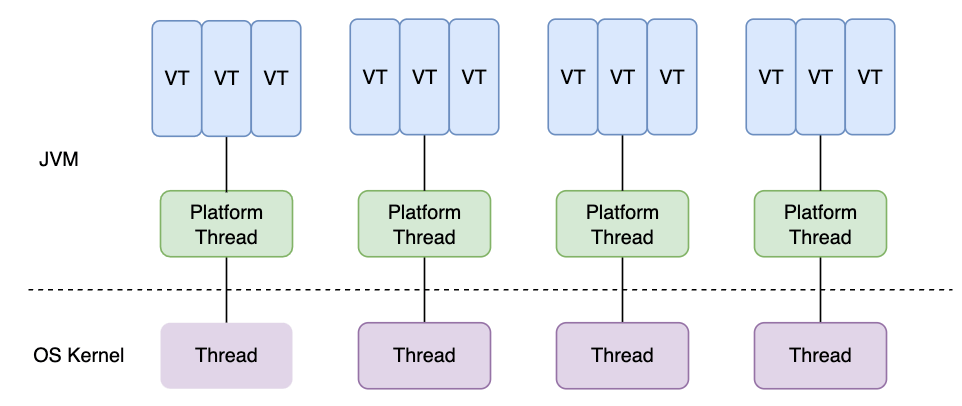

## 虚拟线程有什么优点和缺点？

**优点**

- **非常轻量级**：可以在单个线程中创建成百上千个虚拟线程而不会导致过多的线程创建和上下文切换。
- **简化异步编程**： 虚拟线程可以简化异步编程，使代码更易于理解和维护。它可以将异步代码编写得更像同步代码，避免了回调地狱（Callback Hell）。
- **减少资源开销**： 由于虚拟线程是由 JVM 实现的，它能够更高效地利用底层资源，例如 CPU 和内存。虚拟线程的上下文切换比平台线程更轻量，因此能够更好地支持高并发场景。

**缺点**

- **不适用于计算密集型任务**： 虚拟线程适用于 I/O 密集型任务，但不适用于计算密集型任务，因为密集型计算始终需要 CPU 资源作为支持。
- **与某些第三方库不兼容**： 虽然虚拟线程设计时考虑了与现有代码的兼容性，但某些依赖平台线程特性的第三方库可能不完全兼容虚拟线程。


