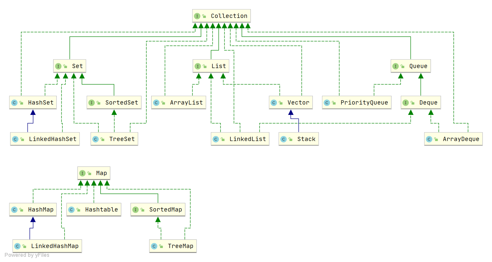
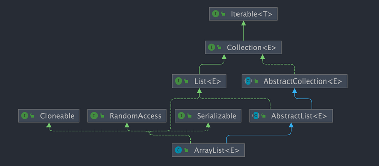
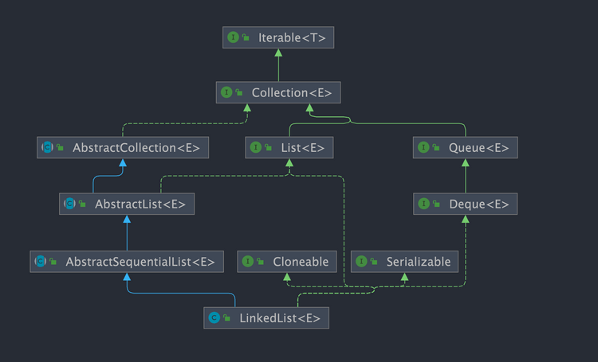
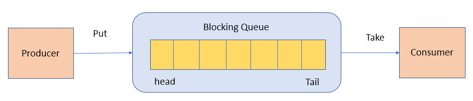
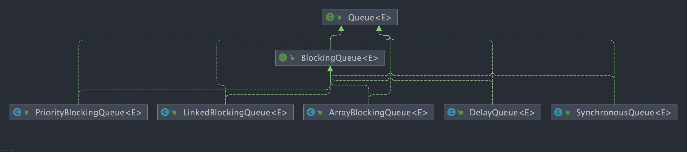
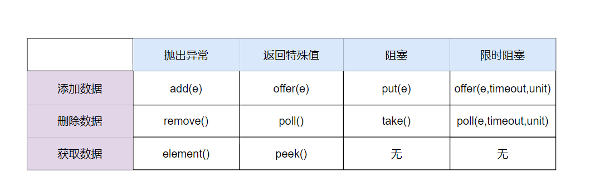
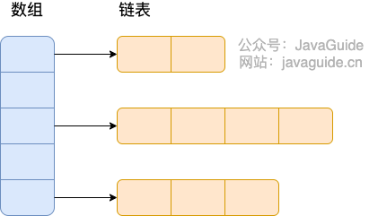
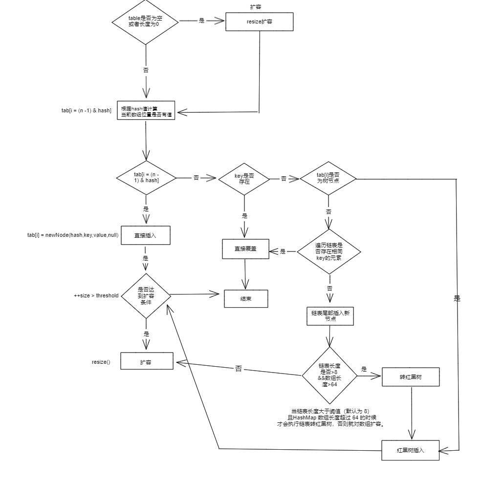
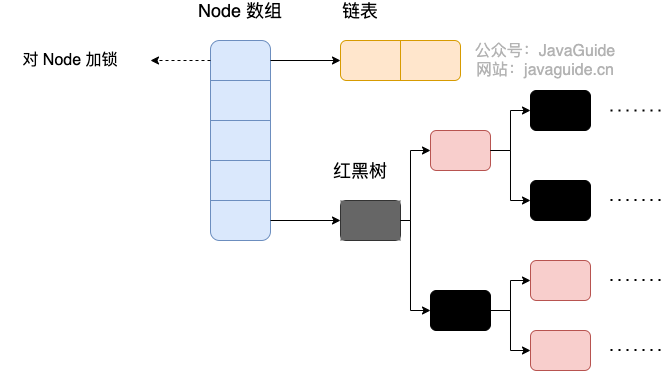

# Java集合

Java 集合，也叫作容器，主要是由两大接口派生而来：一个是 `Collection`接口，主要用于存放单一元素；另一个是 `Map` 接口，主要用于存放键值对。对于`Collection` 接口，下面又有三个主要的子接口：`List`、`Set` 、 `Queue`。




## 说说 List, Set, Queue, Map 四者的区别？

- `List`(对付顺序的好帮手): 存储的元素是有序的、可重复的。
- `Set`(注重独一无二的性质): 存储的元素不可重复的。
- `Queue`(实现排队功能的叫号机): 按特定的排队规则来确定先后顺序，存储的元素是有序的、可重复的。
- `Map`(用 key 来搜索的专家): 使用键值对（key-value）存储，类似于数学上的函数 y=f(x)，"x" 代表 key，"y" 代表 value，key 是无序的、不可重复的，value 是无序的、可重复的，每个键最多映射到一个值。


## 集合框架底层数据结构总结

### List

- `ArrayList`：`Object[]` 数组。详细可以查看：[ArrayList 源码分析]()。
- `Vector`：`Object[]` 数组。
- `LinkedList`：双向链表(JDK1.6 之前为循环链表，JDK1.7 取消了循环)。详细可以查看：[LinkedList 源码分析]()。

### Set

- `HashSet`(无序，唯一): 基于 `HashMap` 实现的，底层采用 `HashMap` 来保存元素。
- `LinkedHashSet`: `LinkedHashSet` 是 `HashSet` 的子类，并且其内部是通过 `LinkedHashMap` 来实现的。
- `TreeSet`(有序，唯一): 红黑树(自平衡的排序二叉树)。

### Queue

- `PriorityQueue`: `Object[]` 数组来实现小顶堆。详细可以查看：[PriorityQueue 源码分析]()。
- `DelayQueue`:`PriorityQueue`。详细可以查看：[DelayQueue 源码分析]()。
- `ArrayDeque`: 可扩容动态双向数组。

### Map

- `HashMap`：JDK1.8 之前 `HashMap` 由数组+链表组成的，数组是 `HashMap` 的主体，链表则是主要为了解决哈希冲突而存在的（“拉链法”解决冲突）。JDK1.8 以后在解决哈希冲突时有了较大的变化，当链表长度大于阈值（默认为 8）（将链表转换成红黑树前会判断，如果当前数组的长度小于 64，那么会选择先进行数组扩容，而不是转换为红黑树）时，将链表转化为红黑树，以减少搜索时间。详细可以查看：[HashMap 源码分析]()。
- `LinkedHashMap`：`LinkedHashMap` 继承自 `HashMap`，所以它的底层仍然是基于拉链式散列结构即由数组和链表或红黑树组成。另外，`LinkedHashMap` 在上面结构的基础上，增加了一条双向链表，使得上面的结构可以保持键值对的插入顺序。同时通过对链表进行相应的操作，实现了访问顺序相关逻辑。详细可以查看：[LinkedHashMap 源码分析]()
- `Hashtable`：数组+链表组成的，数组是 `Hashtable` 的主体，链表则是主要为了解决哈希冲突而存在的。
- `TreeMap`：红黑树（自平衡的排序二叉树）。

## 如何选用集合?

我们主要根据集合的特点来选择合适的集合。比如：

- 我们需要根据键值获取到元素值时就选用 `Map` 接口下的集合，需要排序时选择 `TreeMap`,不需要排序时就选择 `HashMap`,需要保证线程安全就选用 `ConcurrentHashMap`。
- 我们只需要存放元素值时，就选择实现`Collection` 接口的集合，需要保证元素唯一时选择实现 `Set` 接口的集合比如 `TreeSet` 或 `HashSet`，不需要就选择实现 `List` 接口的比如 `ArrayList` 或 `LinkedList`，然后再根据实现这些接口的集合的特点来选用。

## 为什么要使用集合？

当我们需要存储一组类型相同的数据时，数组是最常用且最基本的容器之一。但是，使用数组存储对象存在一些不足之处，因为在实际开发中，存储的数据类型多种多样且数量不确定。这时，Java 集合就派上用场了。与数组相比，Java 集合提供了更灵活、更有效的方法来存储多个数据对象。Java 集合框架中的各种集合类和接口可以存储不同类型和数量的对象，同时还具有多样化的操作方式。相较于数组，Java 集合的优势在于它们的大小可变、支持泛型、具有内建算法等。总的来说，Java 集合提高了数据的存储和处理灵活性，可以更好地适应现代软件开发中多样化的数据需求，并支持高质量的代码编写。

## List

### ArrayList 和 Array（数组）的区别？

`ArrayList` 内部基于动态数组实现，比 `Array`（静态数组） 使用起来更加灵活：

- `ArrayList`会根据实际存储的元素动态地扩容或缩容，而 `Array` 被创建之后就不能改变它的长度了。
- `ArrayList` 允许你使用泛型来确保类型安全，`Array` 则不可以。
- `ArrayList` 中只能存储对象。对于基本类型数据，需要使用其对应的包装类（如 Integer、Double 等）。`Array` 可以直接存储基本类型数据，也可以存储对象。
- `ArrayList` 支持插入、删除、遍历等常见操作，并且提供了丰富的 API 操作方法，比如 `add()`、`remove()`等。`Array` 只是一个固定长度的数组，只能按照下标访问其中的元素，不具备动态添加、删除元素的能力。
- `ArrayList`创建时不需要指定大小，而`Array`创建时必须指定大小。

### ArrayList 可以添加 null 值吗？

`ArrayList` 中可以存储任何类型的对象，包括 `null` 值。不过，不建议向`ArrayList` 中添加 `null` 值， `null` 值无意义，会让代码难以维护比如忘记做判空处理就会导致空指针异常。

```java
ArrayList<String> listOfStrings = new ArrayList<>();
listOfStrings.add(null);
listOfStrings.add("java");
System.out.println(listOfStrings);
[null, java]
```


### ArrayList 插入和删除元素的时间复杂度？

对于插入：

- 头部插入：由于需要将所有元素都依次向后移动一个位置，因此时间复杂度是 O(n)。
- 尾部插入：当 `ArrayList` 的容量未达到极限时，往列表末尾插入元素的时间复杂度是 O(1)，因为它只需要在数组末尾添加一个元素即可；当容量已达到极限并且需要扩容时，则需要执行一次 O(n) 的操作将原数组复制到新的更大的数组中，然后再执行 O(1) 的操作添加元素。
- 指定位置插入：需要将目标位置之后的所有元素都向后移动一个位置，然后再把新元素放入指定位置。这个过程需要移动平均 n/2 个元素，因此时间复杂度为 O(n)。

对于删除：

- 头部删除：由于需要将所有元素依次向前移动一个位置，因此时间复杂度是 O(n)。
- 尾部删除：当删除的元素位于列表末尾时，时间复杂度为 O(1)。
- 指定位置删除：需要将目标元素之后的所有元素向前移动一个位置以填补被删除的空白位置，因此需要移动平均 n/2 个元素，时间复杂度为 O(n)。

### LinkedList 插入和删除元素的时间复杂度？

- 头部插入/删除：只需要修改头结点的指针即可完成插入/删除操作，因此时间复杂度为 O(1)。
- 尾部插入/删除：只需要修改尾结点的指针即可完成插入/删除操作，因此时间复杂度为 O(1)。
- 指定位置插入/删除：需要先移动到指定位置，再修改指定节点的指针完成插入/删除，不过由于有头尾指针，可以从较近的指针出发，因此需要遍历平均 n/4 个元素，时间复杂度为 O(n)。


### ArrayList 与 LinkedList 区别

- **是否保证线程安全：** `ArrayList` 和 `LinkedList` 都是不同步的，也就是不保证线程安全；
- **底层数据结构：** `ArrayList` 底层使用的是 **`Object` 数组**；`LinkedList` 底层使用的是 **双向链表** 数据结构（JDK1.6 之前为循环链表，JDK1.7 取消了循环。注意双向链表和双向循环链表的区别，下面有介绍到！）
- **插入和删除是否受元素位置的影响：**
  - `ArrayList` 采用数组存储，所以插入和删
  - 除元素的时间复杂度受元素位置的影响。 比如：执行`add(E e)`方法的时候， `ArrayList` 会默认在将指定的元素追加到此列表的末尾，这种情况时间复杂度就是 O(1)。但是如果要在指定位置 i 插入和删除元素的话（`add(int index, E element)`），时间复杂度就为 O(n)。因为在进行上述操作的时候集合中第 i 和第 i 个元素之后的(n-i)个元素都要执行向后位/向前移一位的操作。
  - `LinkedList` 采用链表存储，所以在头尾插入或者删除元素不受元素位置的影响（`add(E e)`、`addFirst(E e)`、`addLast(E e)`、`removeFirst()`、 `removeLast()`），时间复杂度为 O(1)，如果是要在指定位置 `i` 插入和删除元素的话（`add(int index, E element)`，`remove(Object o)`,`remove(int index)`）， 时间复杂度为 O(n) ，因为需要先移动到指定位置再插入和删除。
- **是否支持快速随机访问：** `LinkedList` 不支持高效的随机元素访问，而 `ArrayList`（实现了 `RandomAccess` 接口） 支持。快速随机访问就是通过元素的序号快速获取元素对象(对应于`get(int index)`方法)。
- **内存空间占用：** `ArrayList` 的空间浪费主要体现在在 list 列表的结尾会预留一定的容量空间，而 LinkedList 的空间花费则体现在它的每一个元素都需要消耗比 ArrayList 更多的空间（因为要存放直接后继和直接前驱以及数据）。


### 集合中的 fail-fast 和 fail-safe 是什么？

**`fail-fast`**

`fail-fast`（快速失败）和 `fail-safe`（安全失败）是Java集合框架在处理并发修改问题时，两种截然不同的设计哲学和容错策略。

快速失败的思想即针对可能发生的异常进行提前表明故障并停止运行，通过尽早的发现和停止错误，降低故障系统级联的风险。

在`java.util`包下的大部分集合（如 `ArrayList`, `HashMap`）是不支持线程安全的，为了能够提前发现并发操作导致线程安全风险，提出通过维护一个`modCount`记录修改的次数，迭代期间通过比对预期修改次数`expectedModCount`和`modCount`是否一致来判断是否存在并发操作，从而实现快速失败，由此保证在避免在异常时执行非必要的复杂代码。

**`fail-safe`**

Java 中的 fail-safe 通常指：
 在迭代集合时，即使集合被修改，也不会抛出异常，而是基于副本或弱一致性视图进行遍历。

该思想常运用于并发容器，最经典的实现就是`CopyOnWriteArrayList`的实现，通过写时复制（Copy-On-Write）的思想保证在进行修改操作时复制出一份快照，基于这份快照完成添加或者删除操作后，将`CopyOnWriteArrayList`底层的数组引用指向这个新的数组空间，由此避免迭代时被并发修改所干扰所导致并发操作安全问题，当然这种做法也存在缺点，即进行遍历操作时无法获得实时结果：


### ArrayList源码分析

`ArrayList` 的底层是数组队列，相当于动态数组。与 Java 中的数组相比，它的容量能动态增长。在添加大量元素前，应用程序可以使用`ensureCapacity`操作来增加 `ArrayList` 实例的容量。这可以减少递增式再分配的数量。

`ArrayList` 继承于 `AbstractList` ，实现了 `List`, `RandomAccess`, `Cloneable`, `java.io.Serializable` 这些接口。

```java
public class ArrayList<E> extends AbstractList<E>
        implements List<E>, RandomAccess, Cloneable, java.io.Serializable{

  }
```

- `List` : 表明它是一个列表，支持添加、删除、查找等操作，并且可以通过下标进行访问。
- `RandomAccess` ：这是一个标志接口，表明实现这个接口的 `List` 集合是支持 **快速随机访问** 的。在 `ArrayList` 中，我们就可以通过元素的序号快速获取元素对象，这就是快速随机访问。
- `Cloneable` ：表明它具有拷贝能力，可以进行深拷贝或浅拷贝操作。
- `Serializable` : 表明它可以进行序列化操作，也就是可以将对象转换为字节流进行持久化存储或网络传输，非常方便。



```java
public class ArrayList<E> extends AbstractList<E>
        implements List<E>, RandomAccess, Cloneable, java.io.Serializable {
    private static final long serialVersionUID = 8683452581122892189L;

    /**
     * 默认初始容量大小
     */
    private static final int DEFAULT_CAPACITY = 10;

    /**
     * 空数组（用于空实例）。
     */
    private static final Object[] EMPTY_ELEMENTDATA = {};

    //用于默认大小空实例的共享空数组实例。
    //我们把它从EMPTY_ELEMENTDATA数组中区分出来，以知道在添加第一个元素时容量需要增加多少。
    private static final Object[] DEFAULTCAPACITY_EMPTY_ELEMENTDATA = {};

    /**
     * 保存ArrayList数据的数组
     */
    transient Object[] elementData; // non-private to simplify nested class access

    /**
     * ArrayList 所包含的元素个数
     */
    private int size;

    /**
     * 带初始容量参数的构造函数（用户可以在创建ArrayList对象时自己指定集合的初始大小）
     */
    public ArrayList(int initialCapacity) {
        if (initialCapacity > 0) {
            //如果传入的参数大于0，创建initialCapacity大小的数组
            this.elementData = new Object[initialCapacity];
        } else if (initialCapacity == 0) {
            //如果传入的参数等于0，创建空数组
            this.elementData = EMPTY_ELEMENTDATA;
        } else {
            //其他情况，抛出异常
            throw new IllegalArgumentException("Illegal Capacity: " +
                    initialCapacity);
        }
    }

    /**
     * 默认无参构造函数
     * DEFAULTCAPACITY_EMPTY_ELEMENTDATA 为0.初始化为10，也就是说初始其实是空数组 当添加第一个元素的时候数组容量才变成10
     */
    public ArrayList() {
        this.elementData = DEFAULTCAPACITY_EMPTY_ELEMENTDATA;
    }

    /**
     * 构造一个包含指定集合的元素的列表，按照它们由集合的迭代器返回的顺序。
     */
    public ArrayList(Collection<? extends E> c) {
        //将指定集合转换为数组
        elementData = c.toArray();
        //如果elementData数组的长度不为0
        if ((size = elementData.length) != 0) {
            // 如果elementData不是Object类型数据（c.toArray可能返回的不是Object类型的数组所以加上下面的语句用于判断）
            if (elementData.getClass() != Object[].class)
                //将原来不是Object类型的elementData数组的内容，赋值给新的Object类型的elementData数组
                elementData = Arrays.copyOf(elementData, size, Object[].class);
        } else {
            // 其他情况，用空数组代替
            this.elementData = EMPTY_ELEMENTDATA;
        }
    }

    /**
     * 修改这个ArrayList实例的容量是列表的当前大小。 应用程序可以使用此操作来最小化ArrayList实例的存储。
     */
    public void trimToSize() {
        modCount++;
        if (size < elementData.length) {
            elementData = (size == 0)
                    ? EMPTY_ELEMENTDATA
                    : Arrays.copyOf(elementData, size);
        }
    }
//下面是ArrayList的扩容机制
//ArrayList的扩容机制提高了性能，如果每次只扩充一个，
//那么频繁的插入会导致频繁的拷贝，降低性能，而ArrayList的扩容机制避免了这种情况。

    /**
     * 如有必要，增加此ArrayList实例的容量，以确保它至少能容纳元素的数量
     *
     * @param minCapacity 所需的最小容量
     */
    public void ensureCapacity(int minCapacity) {
        // 如果不是默认空数组，则minExpand的值为0；
        // 如果是默认空数组，则minExpand的值为10
        int minExpand = (elementData != DEFAULTCAPACITY_EMPTY_ELEMENTDATA)
                // 如果不是默认元素表，则可以使用任意大小
                ? 0
                // 如果是默认空数组，它应该已经是默认大小
                : DEFAULT_CAPACITY;

        // 如果最小容量大于已有的最大容量
        if (minCapacity > minExpand) {
            // 根据需要的最小容量，确保容量足够
            ensureExplicitCapacity(minCapacity);
        }
    }


    // 根据给定的最小容量和当前数组元素来计算所需容量。
    private static int calculateCapacity(Object[] elementData, int minCapacity) {
        // 如果当前数组元素为空数组（初始情况），返回默认容量和最小容量中的较大值作为所需容量
        if (elementData == DEFAULTCAPACITY_EMPTY_ELEMENTDATA) {
            return Math.max(DEFAULT_CAPACITY, minCapacity);
        }
        // 否则直接返回最小容量
        return minCapacity;
    }

    // 确保内部容量达到指定的最小容量。
    private void ensureCapacityInternal(int minCapacity) {
        ensureExplicitCapacity(calculateCapacity(elementData, minCapacity));
    }

    //判断是否需要扩容
    private void ensureExplicitCapacity(int minCapacity) {
        modCount++;
        // overflow-conscious code
        if (minCapacity - elementData.length > 0)
            //调用grow方法进行扩容，调用此方法代表已经开始扩容了
            grow(minCapacity);
    }

    /**
     * 要分配的最大数组大小
     */
    private static final int MAX_ARRAY_SIZE = Integer.MAX_VALUE - 8;

    /**
     * ArrayList扩容的核心方法。
     */
    private void grow(int minCapacity) {
        // oldCapacity为旧容量，newCapacity为新容量
        int oldCapacity = elementData.length;
        //将oldCapacity 右移一位，其效果相当于oldCapacity /2，
        //我们知道位运算的速度远远快于整除运算，整句运算式的结果就是将新容量更新为旧容量的1.5倍，
        int newCapacity = oldCapacity + (oldCapacity >> 1);
        //然后检查新容量是否大于最小需要容量，若还是小于最小需要容量，那么就把最小需要容量当作数组的新容量，
        if (newCapacity - minCapacity < 0)
            newCapacity = minCapacity;
        //再检查新容量是否超出了ArrayList所定义的最大容量，
        //若超出了，则调用hugeCapacity()来比较minCapacity和 MAX_ARRAY_SIZE，
        //如果minCapacity大于MAX_ARRAY_SIZE，则新容量则为Integer.MAX_VALUE，否则，新容量大小则为 MAX_ARRAY_SIZE。
        if (newCapacity - MAX_ARRAY_SIZE > 0)
            newCapacity = hugeCapacity(minCapacity);
        // minCapacity is usually close to size, so this is a win:
        elementData = Arrays.copyOf(elementData, newCapacity);
    }

    //比较minCapacity和 MAX_ARRAY_SIZE
    private static int hugeCapacity(int minCapacity) {
        if (minCapacity < 0) // overflow
            throw new OutOfMemoryError();
        return (minCapacity > MAX_ARRAY_SIZE) ?
                Integer.MAX_VALUE :
                MAX_ARRAY_SIZE;
    }

    /**
     * 返回此列表中的元素数。
     */
    public int size() {
        return size;
    }

    /**
     * 如果此列表不包含元素，则返回 true 。
     */
    public boolean isEmpty() {
        //注意=和==的区别
        return size == 0;
    }

    /**
     * 如果此列表包含指定的元素，则返回true 。
     */
    public boolean contains(Object o) {
        //indexOf()方法：返回此列表中指定元素的首次出现的索引，如果此列表不包含此元素，则为-1
        return indexOf(o) >= 0;
    }

    /**
     * 返回此列表中指定元素的首次出现的索引，如果此列表不包含此元素，则为-1
     */
    public int indexOf(Object o) {
        if (o == null) {
            for (int i = 0; i < size; i++)
                if (elementData[i] == null)
                    return i;
        } else {
            for (int i = 0; i < size; i++)
                //equals()方法比较
                if (o.equals(elementData[i]))
                    return i;
        }
        return -1;
    }

    /**
     * 返回此列表中指定元素的最后一次出现的索引，如果此列表不包含元素，则返回-1。.
     */
    public int lastIndexOf(Object o) {
        if (o == null) {
            for (int i = size - 1; i >= 0; i--)
                if (elementData[i] == null)
                    return i;
        } else {
            for (int i = size - 1; i >= 0; i--)
                if (o.equals(elementData[i]))
                    return i;
        }
        return -1;
    }

    /**
     * 返回此ArrayList实例的浅拷贝。 （元素本身不被复制。）
     */
    public Object clone() {
        try {
            ArrayList<?> v = (ArrayList<?>) super.clone();
            //Arrays.copyOf功能是实现数组的复制，返回复制后的数组。参数是被复制的数组和复制的长度
            v.elementData = Arrays.copyOf(elementData, size);
            v.modCount = 0;
            return v;
        } catch (CloneNotSupportedException e) {
            // 这不应该发生，因为我们是可以克隆的
            throw new InternalError(e);
        }
    }

    /**
     * 以正确的顺序（从第一个到最后一个元素）返回一个包含此列表中所有元素的数组。
     * 返回的数组将是“安全的”，因为该列表不保留对它的引用。
     * （换句话说，这个方法必须分配一个新的数组）。
     * 因此，调用者可以自由地修改返回的数组结构。
     * 注意：如果元素是引用类型，修改元素的内容会影响到原列表中的对象。
     * 此方法充当基于数组和基于集合的API之间的桥梁。
     */
    public Object[] toArray() {
        return Arrays.copyOf(elementData, size);
    }

    /**
     * 以正确的顺序返回一个包含此列表中所有元素的数组（从第一个到最后一个元素）;
     * 返回的数组的运行时类型是指定数组的运行时类型。 如果列表适合指定的数组，则返回其中。
     * 否则，将为指定数组的运行时类型和此列表的大小分配一个新数组。
     * 如果列表适用于指定的数组，其余空间（即数组的列表数量多于此元素），则紧跟在集合结束后的数组中的元素设置为null 。
     * （这仅在调用者知道列表不包含任何空元素的情况下才能确定列表的长度。）
     */
    @SuppressWarnings("unchecked")
    public <T> T[] toArray(T[] a) {
        if (a.length < size)
            // 新建一个运行时类型的数组，但是ArrayList数组的内容
            return (T[]) Arrays.copyOf(elementData, size, a.getClass());
        //调用System提供的arraycopy()方法实现数组之间的复制
        System.arraycopy(elementData, 0, a, 0, size);
        if (a.length > size)
            a[size] = null;
        return a;
    }

    // Positional Access Operations

    @SuppressWarnings("unchecked")
    E elementData(int index) {
        return (E) elementData[index];
    }

    /**
     * 返回此列表中指定位置的元素。
     */
    public E get(int index) {
        rangeCheck(index);

        return elementData(index);
    }

    /**
     * 用指定的元素替换此列表中指定位置的元素。
     */
    public E set(int index, E element) {
        //对index进行界限检查
        rangeCheck(index);

        E oldValue = elementData(index);
        elementData[index] = element;
        //返回原来在这个位置的元素
        return oldValue;
    }

    /**
     * 将指定的元素追加到此列表的末尾。
     */
    public boolean add(E e) {
        ensureCapacityInternal(size + 1);  // Increments modCount!!
        //这里看到ArrayList添加元素的实质就相当于为数组赋值
        elementData[size++] = e;
        return true;
    }

    /**
     * 在此列表中的指定位置插入指定的元素。
     * 先调用 rangeCheckForAdd 对index进行界限检查；然后调用 ensureCapacityInternal 方法保证capacity足够大；
     * 再将从index开始之后的所有成员后移一个位置；将element插入index位置；最后size加1。
     */
    public void add(int index, E element) {
        rangeCheckForAdd(index);

        ensureCapacityInternal(size + 1);  // Increments modCount!!
        //arraycopy()这个实现数组之间复制的方法一定要看一下，下面就用到了arraycopy()方法实现数组自己复制自己
        System.arraycopy(elementData, index, elementData, index + 1,
                size - index);
        elementData[index] = element;
        size++;
    }

    /**
     * 删除该列表中指定位置的元素。 将任何后续元素移动到左侧（从其索引中减去一个元素）。
     */
    public E remove(int index) {
        rangeCheck(index);

        modCount++;
        E oldValue = elementData(index);

        int numMoved = size - index - 1;
        if (numMoved > 0)
            System.arraycopy(elementData, index + 1, elementData, index,
                    numMoved);
        elementData[--size] = null; // clear to let GC do its work
        //从列表中删除的元素
        return oldValue;
    }

    /**
     * 从列表中删除指定元素的第一个出现（如果存在）。 如果列表不包含该元素，则它不会更改。
     * 返回true，如果此列表包含指定的元素
     */
    public boolean remove(Object o) {
        if (o == null) {
            for (int index = 0; index < size; index++)
                if (elementData[index] == null) {
                    fastRemove(index);
                    return true;
                }
        } else {
            for (int index = 0; index < size; index++)
                if (o.equals(elementData[index])) {
                    fastRemove(index);
                    return true;
                }
        }
        return false;
    }

    /*
     * 该方法为私有的移除方法，跳过了边界检查，并且不返回被移除的值。
     */
    private void fastRemove(int index) {
        modCount++;
        int numMoved = size - index - 1;
        if (numMoved > 0)
            System.arraycopy(elementData, index + 1, elementData, index,
                    numMoved);
        elementData[--size] = null; // 在移除元素后，将该位置的元素设为 null，以便垃圾回收器（GC）能够回收该元素。
    }

    /**
     * 从列表中删除所有元素。
     */
    public void clear() {
        modCount++;

        // 把数组中所有的元素的值设为null
        for (int i = 0; i < size; i++)
            elementData[i] = null;

        size = 0;
    }

    /**
     * 按指定集合的Iterator返回的顺序将指定集合中的所有元素追加到此列表的末尾。
     */
    public boolean addAll(Collection<? extends E> c) {
        Object[] a = c.toArray();
        int numNew = a.length;
        ensureCapacityInternal(size + numNew);  // Increments modCount
        System.arraycopy(a, 0, elementData, size, numNew);
        size += numNew;
        return numNew != 0;
    }

    /**
     * 将指定集合中的所有元素插入到此列表中，从指定的位置开始。
     */
    public boolean addAll(int index, Collection<? extends E> c) {
        rangeCheckForAdd(index);

        Object[] a = c.toArray();
        int numNew = a.length;
        ensureCapacityInternal(size + numNew);  // Increments modCount

        int numMoved = size - index;
        if (numMoved > 0)
            System.arraycopy(elementData, index, elementData, index + numNew,
                    numMoved);

        System.arraycopy(a, 0, elementData, index, numNew);
        size += numNew;
        return numNew != 0;
    }

    /**
     * 从此列表中删除所有索引为fromIndex （含）和toIndex之间的元素。
     * 将任何后续元素移动到左侧（减少其索引）。
     */
    protected void removeRange(int fromIndex, int toIndex) {
        modCount++;
        int numMoved = size - toIndex;
        System.arraycopy(elementData, toIndex, elementData, fromIndex,
                numMoved);

        // clear to let GC do its work
        int newSize = size - (toIndex - fromIndex);
        for (int i = newSize; i < size; i++) {
            elementData[i] = null;
        }
        size = newSize;
    }

    /**
     * 检查给定的索引是否在范围内。
     */
    private void rangeCheck(int index) {
        if (index >= size)
            throw new IndexOutOfBoundsException(outOfBoundsMsg(index));
    }

    /**
     * add和addAll使用的rangeCheck的一个版本
     */
    private void rangeCheckForAdd(int index) {
        if (index > size || index < 0)
            throw new IndexOutOfBoundsException(outOfBoundsMsg(index));
    }

    /**
     * 返回IndexOutOfBoundsException细节信息
     */
    private String outOfBoundsMsg(int index) {
        return "Index: " + index + ", Size: " + size;
    }

    /**
     * 从此列表中删除指定集合中包含的所有元素。
     */
    public boolean removeAll(Collection<?> c) {
        Objects.requireNonNull(c);
        //如果此列表被修改则返回true
        return batchRemove(c, false);
    }

    /**
     * 仅保留此列表中包含在指定集合中的元素。
     * 换句话说，从此列表中删除其中不包含在指定集合中的所有元素。
     */
    public boolean retainAll(Collection<?> c) {
        Objects.requireNonNull(c);
        return batchRemove(c, true);
    }


    /**
     * 从列表中的指定位置开始，返回列表中的元素（按正确顺序）的列表迭代器。
     * 指定的索引表示初始调用将返回的第一个元素为next 。 初始调用previous将返回指定索引减1的元素。
     * 返回的列表迭代器是fail-fast 。
     */
    public ListIterator<E> listIterator(int index) {
        if (index < 0 || index > size)
            throw new IndexOutOfBoundsException("Index: " + index);
        return new ListItr(index);
    }

    /**
     * 返回列表中的列表迭代器（按适当的顺序）。
     * 返回的列表迭代器是fail-fast 。
     */
    public ListIterator<E> listIterator() {
        return new ListItr(0);
    }

    /**
     * 以正确的顺序返回该列表中的元素的迭代器。
     * 返回的迭代器是fail-fast 。
     */
    public Iterator<E> iterator() {
        return new Itr();
    }
```


### ArrayList扩容机制分析

#### 从构造函数说起

**以无参数构造方法创建 `ArrayList` 时，实际上初始化赋值的是一个空数组。当真正对数组进行添加元素操作时，才真正分配容量。即向数组中添加第一个元素时，数组容量扩为 10。**

```java
/**
 * 默认初始容量大小
 */
private static final int DEFAULT_CAPACITY = 10;

private static final Object[] DEFAULTCAPACITY_EMPTY_ELEMENTDATA = {};

/**
 * 默认构造函数，使用初始容量10构造一个空列表(无参数构造)
 */
public ArrayList() {
    this.elementData = DEFAULTCAPACITY_EMPTY_ELEMENTDATA;
}

/**
 * 带初始容量参数的构造函数。（用户自己指定容量）
 */
public ArrayList(int initialCapacity) {
    if (initialCapacity > 0) {//初始容量大于0
        //创建initialCapacity大小的数组
        this.elementData = new Object[initialCapacity];
    } else if (initialCapacity == 0) {//初始容量等于0
        //创建空数组
        this.elementData = EMPTY_ELEMENTDATA;
    } else {//初始容量小于0，抛出异常
        throw new IllegalArgumentException("Illegal Capacity: " + initialCapacity);
    }
}


/**
 *构造包含指定collection元素的列表，这些元素利用该集合的迭代器按顺序返回
 *如果指定的集合为null，throws NullPointerException。
 */
public ArrayList(Collection<? extends E> c) {
    elementData = c.toArray();
    if ((size = elementData.length) != 0) {
        // c.toArray might (incorrectly) not return Object[] (see 6260652)
        if (elementData.getClass() != Object[].class)
            elementData = Arrays.copyOf(elementData, size, Object[].class);
    } else {
        // replace with empty array.
        this.elementData = EMPTY_ELEMENTDATA;
    }
}
```

#### 一步一步分析 ArrayList 扩容机制

这里以无参构造函数创建的 `ArrayList` 为例分析。

##### add 方法

```java
/**
* 将指定的元素追加到此列表的末尾。
*/
public boolean add(E e) {
    // 加元素之前，先调用ensureCapacityInternal方法
    ensureCapacityInternal(size + 1);  // Increments modCount!!
    // 这里看到ArrayList添加元素的实质就相当于为数组赋值
    elementData[size++] = e;
    return true;
}
```

##### grow 方法

```java
/**
 * 要分配的最大数组大小
 */
private static final int MAX_ARRAY_SIZE = Integer.MAX_VALUE - 8;

/**
 * ArrayList扩容的核心方法。
 */
private void grow(int minCapacity) {
    // oldCapacity为旧容量，newCapacity为新容量
    int oldCapacity = elementData.length;
    // 将oldCapacity 右移一位，其效果相当于oldCapacity /2，
    // 我们知道位运算的速度远远快于整除运算，整句运算式的结果就是将新容量更新为旧容量的1.5倍，
    int newCapacity = oldCapacity + (oldCapacity >> 1);

    // 然后检查新容量是否大于最小需要容量，若还是小于最小需要容量，那么就把最小需要容量当作数组的新容量，
    if (newCapacity - minCapacity < 0)
        newCapacity = minCapacity;

    // 如果新容量大于 MAX_ARRAY_SIZE,进入(执行) `hugeCapacity()` 方法来比较 minCapacity 和 MAX_ARRAY_SIZE，
    // 如果minCapacity大于最大容量，则新容量则为`Integer.MAX_VALUE`，否则，新容量大小则为 MAX_ARRAY_SIZE 即为 `Integer.MAX_VALUE - 8`。
    if (newCapacity - MAX_ARRAY_SIZE > 0)
        newCapacity = hugeCapacity(minCapacity);

    // minCapacity is usually close to size, so this is a win:
    elementData = Arrays.copyOf(elementData, newCapacity);
}
```


##### `System.arraycopy()` 和 `Arrays.copyOf()`方法

**`System.arraycopy()` 方法**

```java
    // 我们发现 arraycopy 是一个 native 方法,接下来我们解释一下各个参数的具体意义
    /**
    *   复制数组
    * @param src 源数组
    * @param srcPos 源数组中的起始位置
    * @param dest 目标数组
    * @param destPos 目标数组中的起始位置
    * @param length 要复制的数组元素的数量
    */
    public static native void arraycopy(Object src,  int  srcPos,
                                        Object dest, int destPos,
                                        int length);
```

```java
    /**
     * 在此列表中的指定位置插入指定的元素。
     *先调用 rangeCheckForAdd 对index进行界限检查；然后调用 ensureCapacityInternal 方法保证capacity足够大；
     *再将从index开始之后的所有成员后移一个位置；将element插入index位置；最后size加1。
     */
    public void add(int index, E element) {
        rangeCheckForAdd(index);

        ensureCapacityInternal(size + 1);  // Increments modCount!!
        //arraycopy()方法实现数组自己复制自己
        //elementData:源数组;index:源数组中的起始位置;elementData：目标数组；index + 1：目标数组中的起始位置； size - index：要复制的数组元素的数量；
        System.arraycopy(elementData, index, elementData, index + 1, size - index);
        elementData[index] = element;
        size++;
    }
```

**`Arrays.copyOf()`方法**

```java
    public static int[] copyOf(int[] original, int newLength) {
      // 申请一个新的数组
        int[] copy = new int[newLength];
  // 调用System.arraycopy,将源数组中的数据进行拷贝,并返回新的数组
        System.arraycopy(original, 0, copy, 0,
                         Math.min(original.length, newLength));
        return copy;
    }
```

**总结**

JDK17 中 ArrayList 采用延迟初始化机制，默认构造时不会立即分配容量， 第一次 add 时初始化为 10。

当容量不足时，通过 grow() 扩容，
 新容量为 oldCapacity + oldCapacity >> 1，即 1.5 倍扩容。

如果 1.5 倍仍不足，则直接扩到所需最小容量。

底层通过 Arrays.copyOf 进行数组复制，
 单次扩容是 O(n)，但均摊时间复杂度为 O(1)。


### LinkedList 源码分析

`LinkedList` 是一个基于双向链表实现的集合类

```java
public class LinkedList<E>
    extends AbstractSequentialList<E>
    implements List<E>, Deque<E>, Cloneable, java.io.Serializable
{
  //...
}
```

`LinkedList` 实现了以下接口：

- `List` : 表明它是一个列表，支持添加、删除、查找等操作，并且可以通过下标进行访问。
- `Deque` ：继承自 `Queue` 接口，具有双端队列的特性，支持从两端插入和删除元素，方便实现栈和队列等数据结构。需要注意，`Deque` 的发音为 "deck" [dɛk]，这个大部分人都会读错。
- `Cloneable` ：表明它具有拷贝能力，可以进行深拷贝或浅拷贝操作。
- `Serializable` : 表明它可以进行序列化操作，也就是可以将对象转换为字节流进行持久化存储或网络传输，非常方便。



```java
private static class Node<E> {
    E item;// 节点值
    Node<E> next; // 指向的下一个节点（后继节点）
    Node<E> prev; // 指向的前一个节点（前驱结点）

    // 初始化参数顺序分别是：前驱结点、本身节点值、后继节点
    Node(Node<E> prev, E element, Node<E> next) {
        this.item = element;
        this.next = next;
        this.prev = prev;
    }
}
```


### ArrayList 可以添加 null 值吗？

`ArrayList` 中可以存储任何类型的对象，包括 `null` 值。不过，不建议向`ArrayList` 中添加 `null` 值， `null` 值无意义，会让代码难以维护比如忘记做判空处理就会导致空指针异常。


### CopyOnWriteArrayList源码分析

在 JDK1.5 之前，如果想要使用并发安全的 `List` 只能选择 `Vector`。而 `Vector` 是一种老旧的集合，已经被淘汰。`Vector` 对于增删改查等方法基本都加了 `synchronized`，这种方式虽然能够保证同步，但这相当于对整个 `Vector` 加上了一把大锁，使得每个方法执行的时候都要去获得锁，导致性能非常低下。

JDK1.5 引入了 `Java.util.concurrent`（JUC）包，其中提供了很多线程安全且并发性能良好的容器，其中唯一的线程安全 `List` 实现就是 `CopyOnWriteArrayList` 。关于`java.util.concurrent` 包下常见并发容器的总结

#### CopyOnWriteArrayList 到底有什么厉害之处？

对于大部分业务场景来说，读取操作往往是远大于写入操作的。由于读取操作不会对原有数据进行修改，因此，对于每次读取都进行加锁其实是一种资源浪费。相比之下，我们应该允许多个线程同时访问 `List` 的内部数据，毕竟对于读取操作来说是安全的。

这种思路与 `ReentrantReadWriteLock` 读写锁的设计思想非常类似，即读读不互斥、读写互斥、写写互斥（只有读读不互斥）。`CopyOnWriteArrayList` 更进一步地实现了这一思想。为了将读操作性能发挥到极致，`CopyOnWriteArrayList` 中的读取操作是完全无需加锁的。更加厉害的是，写入操作也不会阻塞读取操作，只有写写才会互斥。这样一来，读操作的性能就可以大幅度提升。

`CopyOnWriteArrayList` 线程安全的核心在于其采用了 **写时复制（Copy-On-Write）** 的策略，从 `CopyOnWriteArrayList` 的名字就能看出了。

#### Copy-On-Write 的思想是什么？

`CopyOnWriteArrayList`名字中的“Copy-On-Write”即写时复制，简称 COW。

下面是维基百科对 Copy-On-Write 的介绍，介绍的挺不错：

> 写入时复制（英语：Copy-on-write，简称 COW）是一种计算机程序设计领域的优化策略。其核心思想是，如果有多个调用者（callers）同时请求相同资源（如内存或磁盘上的数据存储），他们会共同获取相同的指针指向相同的资源，直到某个调用者试图修改资源的内容时，系统才会真正复制一份专用副本（private copy）给该调用者，而其他调用者所见到的最初的资源仍然保持不变。这过程对其他的调用者都是透明的。此作法主要的优点是如果调用者没有修改该资源，就不会有副本（private copy）被创建，因此多个调用者只是读取操作时可以共享同一份资源。

这里再以 `CopyOnWriteArrayList`为例介绍：当需要修改（ `add`，`set`、`remove` 等操作） `CopyOnWriteArrayList` 的内容时，不会直接修改原数组，而是会先创建底层数组的副本，对副本数组进行修改，修改完之后再将修改后的数组赋值回去，这样就可以保证写操作不会影响读操作了。

可以看出，写时复制机制非常适合读多写少的并发场景，能够极大地提高系统的并发性能。

不过，写时复制机制并不是银弹，其依然存在一些缺点，下面列举几点：

1. 内存占用：每次写操作都需要复制一份原始数据，会占用额外的内存空间，在数据量比较大的情况下，可能会导致内存资源不足。
2. 写操作开销：每一次写操作都需要复制一份原始数据，然后再进行修改和替换，所以写操作的开销相对较大，在写入比较频繁的场景下，性能可能会受到影响。
3. 数据一致性问题：修改操作不会立即反映到最终结果中，还需要等待复制完成，这可能会导致一定的数据一致性问题。

#### 源码分析

```java
public class CopyOnWriteArrayList<E>
extends Object
implements List<E>, RandomAccess, Cloneable, Serializable
{
  //...
}
```

`CopyOnWriteArrayList` 实现了以下接口：

- `List` : 表明它是一个列表，支持添加、删除、查找等操作，并且可以通过下标进行访问。
- `RandomAccess` ：这是一个标志接口，表明实现这个接口的 `List` 集合是支持 **快速随机访问** 的。
- `Cloneable` ：表明它具有拷贝能力，可以进行深拷贝或浅拷贝操作。
- `Serializable` : 表明它可以进行序列化操作，也就是可以将对象转换为字节流进行持久化存储或网络传输，非常方便。

```java
// 创建一个空的 CopyOnWriteArrayList
public CopyOnWriteArrayList() {
    setArray(new Object[0]);
}

// 按照集合的迭代器返回的顺序创建一个包含指定集合元素的 CopyOnWriteArrayList
public CopyOnWriteArrayList(Collection<? extends E> c) {
    Object[] elements;
    if (c.getClass() == CopyOnWriteArrayList.class)
        elements = ((CopyOnWriteArrayList<?>)c).getArray();
    else {
        elements = c.toArray();
        // c.toArray might (incorrectly) not return Object[] (see 6260652)
        if (elements.getClass() != Object[].class)
            elements = Arrays.copyOf(elements, elements.length, Object[].class);
    }
    setArray(elements);
}

// 创建一个包含指定数组的副本的列表
public CopyOnWriteArrayList(E[] toCopyIn) {
    setArray(Arrays.copyOf(toCopyIn, toCopyIn.length, Object[].class));
}
```

##### 插入元素

`CopyOnWriteArrayList` 的 `add()`方法有三个版本：

- `add(E e)`：在 `CopyOnWriteArrayList` 的尾部插入元素。
- `add(int index, E element)`：在 `CopyOnWriteArrayList` 的指定位置插入元素。
- `addIfAbsent(E e)`：如果指定元素不存在，那么添加该元素。如果成功添加元素则返回 true。

```java
// 插入元素到 CopyOnWriteArrayList 的尾部
public boolean add(E e) {
    final ReentrantLock lock = this.lock;
    // 加锁
    lock.lock();
    try {
        // 获取原来的数组
        Object[] elements = getArray();
        // 原来数组的长度
        int len = elements.length;
        // 创建一个长度+1的新数组，并将原来数组的元素复制给新数组
        Object[] newElements = Arrays.copyOf(elements, len + 1);
        // 元素放在新数组末尾
        newElements[len] = e;
        // array指向新数组
        setArray(newElements);
        return true;
    } finally {
        // 解锁
        lock.unlock();
    }
}
```

- `add`方法内部用到了 `ReentrantLock` 加锁，保证了同步，避免了多线程写的时候会复制出多个副本出来。锁被修饰保证了锁的内存地址肯定不会被修改，并且，释放锁的逻辑放在 `finally` 中，可以保证锁能被释放。
- `CopyOnWriteArrayList` 通过复制底层数组的方式实现写操作，即先创建一个新的数组来容纳新添加的元素，然后在新数组中进行写操作，最后将新数组赋值给底层数组的引用，替换掉旧的数组。这也就证明了我们前面说的：`CopyOnWriteArrayList` 线程安全的核心在于其采用了 **写时复制（Copy-On-Write）** 的策略。
- 每次写操作都需要通过 `Arrays.copyOf` 复制底层数组，时间复杂度是 O(n) 的，且会占用额外的内存空间。因此，`CopyOnWriteArrayList` 适用于读多写少的场景，在写操作不频繁且内存资源充足的情况下，可以提升系统的性能表现。
- `CopyOnWriteArrayList` 中并没有类似于 `ArrayList` 的 `grow()` 方法扩容的操作。

##### 读取元素

`CopyOnWriteArrayList` 的读取操作是基于内部数组 `array` 并没有发生实际的修改，因此在读取操作时不需要进行同步控制和锁操作，可以保证数据的安全性。这种机制下，多个线程可以同时读取列表中的元素。

```java
// 底层数组，只能通过getArray和setArray方法访问
private transient volatile Object[] array;

public E get(int index) {
    return get(getArray(), index);
}

final Object[] getArray() {
    return array;
}

private E get(Object[] a, int index) {
    return (E) a[index];
}
```

不过，`get`方法是弱一致性的，在某些情况下可能读到旧的元素值。

`get(int index)`方法是分两步进行的：

1. 通过`getArray()`获取当前数组的引用；
2. 直接从数组中获取下标为 index 的元素。

这个过程并没有加锁，所以在并发环境下可能出现如下情况：

1. 线程 1 调用`get(int index)`方法获取值，内部通过`getArray()`方法获取到了 array 属性值；
2. 线程 2 调用`CopyOnWriteArrayList`的`add`、`set`、`remove` 等修改方法时，内部通过`setArray`方法修改了`array`属性的值；
3. 线程 1 还是从旧的 `array` 数组中取值。


##### 获取列表中元素的个数

```java
public int size() {
    return getArray().length;
}
```

`CopyOnWriteArrayList`中的`array`数组每次复制都刚好能够容纳下所有元素，并不像`ArrayList`那样会预留一定的空间。因此，`CopyOnWriteArrayList`中并没有`size`属性`CopyOnWriteArrayList`的底层数组的长度就是元素个数，因此`size()`方法只要返回数组长度就可以了。

##### 删除元素

`CopyOnWriteArrayList`删除元素相关的方法一共有 4 个：

1. `remove(int index)`：移除此列表中指定位置上的元素。将任何后续元素向左移动（从它们的索引中减去 1）。
2. `boolean remove(Object o)`：删除此列表中首次出现的指定元素，如果不存在该元素则返回 false。
3. `boolean removeAll(Collection<?> c)`：从此列表中删除指定集合中包含的所有元素。
4. `void clear()`：移除此列表中的所有元素。

```java
public E remove(int index) {
    // 获取可重入锁
    final ReentrantLock lock = this.lock;
    // 加锁
    lock.lock();
    try {
         //获取当前array数组
        Object[] elements = getArray();
        // 获取当前array长度
        int len = elements.length;
        //获取指定索引的元素(旧值)
        E oldValue = get(elements, index);
        int numMoved = len - index - 1;
        // 判断删除的是否是最后一个元素
        if (numMoved == 0)
             // 如果删除的是最后一个元素，直接复制该元素前的所有元素到新的数组
            setArray(Arrays.copyOf(elements, len - 1));
        else {
            // 分段复制，将index前的元素和index+1后的元素复制到新数组
            // 新数组长度为旧数组长度-1
            Object[] newElements = new Object[len - 1];
            System.arraycopy(elements, 0, newElements, 0, index);
            System.arraycopy(elements, index + 1, newElements, index,
                             numMoved);
            //将新数组赋值给array引用
            setArray(newElements);
        }
        return oldValue;
    } finally {
         // 解锁
        lock.unlock();
    }
}
```


## Set

### Comparable 和 Comparator 的区别

`Comparable` 接口和 `Comparator` 接口都是 Java 中用于排序的接口，它们在实现类对象之间比较大小、排序等方面发挥了重要作用：

- `Comparable` 接口实际上是出自`java.lang`包 它有一个 `compareTo(Object obj)`方法用来排序
- `Comparator`接口实际上是出自 `java.util` 包它有一个`compare(Object obj1, Object obj2)`方法用来排序

### 无序性和不可重复性的含义是什么

- 无序性不等于随机性 ，无序性是指存储的数据在底层数组中并非按照数组索引的顺序添加 ，而是根据数据的哈希值决定的。
- 不可重复性是指添加的元素按照 `equals()` 判断时 ，返回 false，需要同时重写 `equals()` 方法和 `hashCode()` 方法。

### 比较 HashSet、LinkedHashSet 和 TreeSet 三者的异同

- `HashSet`、`LinkedHashSet` 和 `TreeSet` 都是 `Set` 接口的实现类，都能保证元素唯一，并且都不是线程安全的。
- `HashSet`、`LinkedHashSet` 和 `TreeSet` 的主要区别在于底层数据结构不同。`HashSet` 的底层数据结构是哈希表（基于 `HashMap` 实现）。`LinkedHashSet` 的底层数据结构是链表和哈希表，元素的插入和取出顺序满足 FIFO。`TreeSet` 底层数据结构是红黑树，元素是有序的，排序的方式有自然排序和定制排序。
- 底层数据结构不同又导致这三者的应用场景不同。`HashSet` 用于不需要保证元素插入和取出顺序的场景，`LinkedHashSet` 用于保证元素的插入和取出顺序满足 FIFO 的场景，`TreeSet` 用于支持对元素自定义排序规则的场景。

## Queue

### Queue 与 Deque 的区别

`Queue` 是单端队列，只能从一端插入元素，另一端删除元素，实现上一般遵循 **先进先出（FIFO）** 规则。

`Queue` 扩展了 `Collection` 的接口，根据 **因为容量问题而导致操作失败后处理方式的不同** 可以分为两类方法: 一种在操作失败后会抛出异常，另一种则会返回特殊值。

| `Queue` 接口 | 抛出异常  | 返回特殊值 |
| ------------ | --------- | ---------- |
| 插入队尾     | add(E e)  | offer(E e) |
| 删除队首     | remove()  | poll()     |
| 查询队首元素 | element() | peek()     |

`Deque` 是双端队列，在队列的两端均可以插入或删除元素。

`Deque` 扩展了 `Queue` 的接口, 增加了在队首和队尾进行插入和删除的方法，同样根据失败后处理方式的不同分为两类：

| `Deque` 接口 | 抛出异常      | 返回特殊值      |
| ------------ | ------------- | --------------- |
| 插入队首     | addFirst(E e) | offerFirst(E e) |
| 插入队尾     | addLast(E e)  | offerLast(E e)  |
| 删除队首     | removeFirst() | pollFirst()     |
| 删除队尾     | removeLast()  | pollLast()      |
| 查询队首元素 | getFirst()    | peekFirst()     |
| 查询队尾元素 | getLast()     | peekLast()      |

事实上，`Deque` 还提供有 `push()` 和 `pop()` 等其他方法，可用于模拟栈。

### ArrayDeque 与 LinkedList 的区别

`ArrayDeque` 和 `LinkedList` 都实现了 `Deque` 接口，两者都具有队列的功能，但两者有什么区别呢？

- `ArrayDeque` 是基于可变长的数组和双指针来实现，而 `LinkedList` 则通过链表来实现。
- `ArrayDeque` 不支持存储 `NULL` 数据，但 `LinkedList` 支持。
- `ArrayDeque` 是在 JDK1.6 才被引入的，而`LinkedList` 早在 JDK1.2 时就已经存在。
- `ArrayDeque` 插入时可能存在扩容过程, 不过均摊后的插入操作依然为 O(1)。虽然 `LinkedList` 不需要扩容，但是每次插入数据时均需要申请新的堆空间，均摊性能相比更慢。

从性能的角度上，选用 `ArrayDeque` 来实现队列要比 `LinkedList` 更好。此外，`ArrayDeque` 也可以用于实现栈。


### 说一说 PriorityQueue

`PriorityQueue` 是在 JDK1.5 中被引入的, 其与 `Queue` 的区别在于元素出队顺序是与优先级相关的，即总是优先级最高的元素先出队。

这里列举其相关的一些要点：

- `PriorityQueue` 利用了二叉堆的数据结构来实现的，底层使用可变长的数组来存储数据
- `PriorityQueue` 通过堆元素的上浮和下沉，实现了在 O(logn) 的时间复杂度内插入元素和删除堆顶元素。
- `PriorityQueue` 是非线程安全的，且不支持存储 `NULL` 和 `non-comparable` 的对象。
- `PriorityQueue` 默认是小顶堆，但可以接收一个 `Comparator` 作为构造参数，从而来自定义元素优先级的先后。

`PriorityQueue` 在面试中可能更多的会出现在手撕算法的时候，典型例题包括堆排序、求第 K 大的数、带权图的遍历等，所以需要会熟练使用才行。

### 什么是 BlockingQueue？

`BlockingQueue` （阻塞队列）是一个接口，继承自 `Queue`。`BlockingQueue`阻塞的原因是其支持当队列没有元素时一直阻塞，直到有元素；还支持如果队列已满，一直等到队列可以放入新元素时再放入。

```java
public interface BlockingQueue<E> extends Queue<E> {
  // ...
}
```

`BlockingQueue` 常用于生产者-消费者模型中，生产者线程会向队列中添加数据，而消费者线程会从队列中取出数据进行处理。



### BlockingQueue 的实现类有哪些？



Java 中常用的阻塞队列实现类有以下几种：

1. `ArrayBlockingQueue`：使用数组实现的有界阻塞队列。在创建时需要指定容量大小，并支持公平和非公平两种方式的锁访问机制。
2. `LinkedBlockingQueue`：使用单向链表实现的可选有界阻塞队列。在创建时可以指定容量大小，如果不指定则默认为`Integer.MAX_VALUE`。和`ArrayBlockingQueue`不同的是， 它仅支持非公平的锁访问机制。
3. `PriorityBlockingQueue`：支持优先级排序的无界阻塞队列。元素必须实现`Comparable`接口或者在构造函数中传入`Comparator`对象，并且不能插入 null 元素。
4. `SynchronousQueue`：同步队列，是一种不存储元素的阻塞队列。每个插入操作都必须等待对应的删除操作，反之删除操作也必须等待插入操作。因此，`SynchronousQueue`通常用于线程之间的直接传递数据。
5. `DelayQueue`：延迟队列，其中的元素只有到了其指定的延迟时间，才能够从队列中出队。

### ArrayBlockingQueue 和 LinkedBlockingQueue 有什么区别？

`ArrayBlockingQueue` 和 `LinkedBlockingQueue` 是 Java 并发包中常用的两种阻塞队列实现，它们都是线程安全的。不过，不过它们之间也存在下面这些区别：

- 底层实现：`ArrayBlockingQueue` 基于数组实现，而 `LinkedBlockingQueue` 基于链表实现。
- 是否有界：`ArrayBlockingQueue` 是有界队列，必须在创建时指定容量大小。`LinkedBlockingQueue` 创建时可以不指定容量大小，默认是`Integer.MAX_VALUE`，也就是无界的。但也可以指定队列大小，从而成为有界的。
- 锁是否分离： `ArrayBlockingQueue`中的锁是没有分离的，即生产和消费用的是同一个锁；`LinkedBlockingQueue`中的锁是分离的，即生产用的是`putLock`，消费是`takeLock`，这样可以防止生产者和消费者线程之间的锁争夺。
- 内存占用：`ArrayBlockingQueue` 需要提前分配数组内存，而 `LinkedBlockingQueue` 则是动态分配链表节点内存。这意味着，`ArrayBlockingQueue` 在创建时就会占用一定的内存空间，且往往申请的内存比实际所用的内存更大，而`LinkedBlockingQueue` 则是根据元素的增加而逐渐占用内存空间。


### [阻塞队列的思想](#阻塞队列的思想)

阻塞队列就是典型的生产者-消费者模型，它可以做到以下几点:

1. 当阻塞队列数据为空时，所有的消费者线程都会被阻塞，等待队列非空。
2. 当生产者往队列里填充数据后，队列就会通知消费者队列非空，消费者此时就可以进来消费。
3. 当阻塞队列因为消费者消费过慢或者生产者存放元素过快导致队列填满时无法容纳新元素时，生产者就会被阻塞，等待队列非满时继续存放元素。
4. 当消费者从队列中消费一个元素之后，队列就会通知生产者队列非满，生产者可以继续填充数据了。

总结一下：阻塞队列就说基于非空和非满两个条件实现生产者和消费者之间的交互，尽管这些交互流程和等待通知的机制实现非常复杂，好在 Doug Lea 的操刀之下已将阻塞队列的细节屏蔽，我们只需调用 `put`、`take`、`offer`、`poll` 等 API 即可实现多线程之间的生产和消费。

这也使得阻塞队列在多线程开发中有着广泛的运用，最常见的例子无非是我们的线程池,从源码中我们就能看出当核心线程无法及时处理任务时，这些任务都会扔到 `workQueue` 中。

```java
public ThreadPoolExecutor(int corePoolSize,
                            int maximumPoolSize,
                            long keepAliveTime,
                            TimeUnit unit,
                            BlockingQueue<Runnable> workQueue,
                            ThreadFactory threadFactory,
                            RejectedExecutionHandler handler) {// ...}
```


### ArrayBlockingQueue



#### ArrayBlockingQueue 是什么？它的特点是什么？

`ArrayBlockingQueue` 是 `BlockingQueue` 接口的有界队列实现类，常用于多线程之间的数据共享，底层采用数组实现，从其名字就能看出来了。

`ArrayBlockingQueue` 的容量有限，一旦创建，容量不能改变。

为了保证线程安全，`ArrayBlockingQueue` 的并发控制采用可重入锁 `ReentrantLock` ，不管是插入操作还是读取操作，都需要获取到锁才能进行操作。并且，它还支持公平和非公平两种方式的锁访问机制，默认是非公平锁。

`ArrayBlockingQueue` 虽名为阻塞队列，但也支持非阻塞获取和新增元素（例如 `poll()` 和 `offer(E e)` 方法），只是队列满时添加元素会抛出异常，队列为空时获取的元素为 null，一般不会使用。

#### ArrayBlockingQueue 和 LinkedBlockingQueue 有什么区别？

`ArrayBlockingQueue` 和 `LinkedBlockingQueue` 是 Java 并发包中常用的两种阻塞队列实现，它们都是线程安全的。不过，不过它们之间也存在下面这些区别：

- 底层实现：`ArrayBlockingQueue` 基于数组实现，而 `LinkedBlockingQueue` 基于链表实现。
- 是否有界：`ArrayBlockingQueue` 是有界队列，必须在创建时指定容量大小。`LinkedBlockingQueue` 创建时可以不指定容量大小，默认是`Integer.MAX_VALUE`，也就是无界的。但也可以指定队列大小，从而成为有界的。
- 锁是否分离： `ArrayBlockingQueue`中的锁是没有分离的，即生产和消费用的是同一个锁；`LinkedBlockingQueue`中的锁是分离的，即生产用的是`putLock`，消费是`takeLock`，这样可以防止生产者和消费者线程之间的锁争夺。
- 内存占用：`ArrayBlockingQueue` 需要提前分配数组内存，而 `LinkedBlockingQueue` 则是动态分配链表节点内存。这意味着，`ArrayBlockingQueue` 在创建时就会占用一定的内存空间，且往往申请的内存比实际所用的内存更大，而`LinkedBlockingQueue` 则是根据元素的增加而逐渐占用内存空间。

#### ArrayBlockingQueue 和 ConcurrentLinkedQueue 有什么区别？

`ArrayBlockingQueue` 和 `ConcurrentLinkedQueue` 是 Java 并发包中常用的两种队列实现，它们都是线程安全的。不过，不过它们之间也存在下面这些区别：

- 底层实现：`ArrayBlockingQueue` 基于数组实现，而 `ConcurrentLinkedQueue` 基于链表实现。
- 是否有界：`ArrayBlockingQueue` 是有界队列，必须在创建时指定容量大小，而 `ConcurrentLinkedQueue` 是无界队列，可以动态地增加容量。
- 是否阻塞：`ArrayBlockingQueue` 支持阻塞和非阻塞两种获取和新增元素的方式（一般只会使用前者）， `ConcurrentLinkedQueue` 是无界的，仅支持非阻塞式获取和新增元素。

#### ArrayBlockingQueue 的实现原理是什么？

`ArrayBlockingQueue` 的实现原理主要分为以下几点（这里以阻塞式获取和新增元素为例介绍）：

- `ArrayBlockingQueue` 内部维护一个定长的数组用于存储元素。
- 通过使用 `ReentrantLock` 锁对象对读写操作进行同步，即通过锁机制来实现线程安全。
- 通过 `Condition` 实现线程间的等待和唤醒操作。

这里再详细介绍一下线程间的等待和唤醒具体的实现（不需要记具体的方法，面试中回答要点即可）：

- 当队列已满时，生产者线程会调用 `notFull.await()` 方法让生产者进行等待，等待队列非满时插入（非满条件）。
- 当队列为空时，消费者线程会调用 `notEmpty.await()`方法让消费者进行等待，等待队列非空时消费（非空条件）。
- 当有新的元素被添加时，生产者线程会调用 `notEmpty.signal()`方法唤醒正在等待消费的消费者线程。
- 当队列中有元素被取出时，消费者线程会调用 `notFull.signal()`方法唤醒正在等待插入元素的生产者线程。


## Map

### HashMap 和 Hashtable 的区别

- **线程是否安全：** `HashMap` 是非线程安全的，`Hashtable` 是线程安全的,因为 `Hashtable` 内部的方法基本都经过`synchronized` 修饰。（如果你要保证线程安全的话就使用 `ConcurrentHashMap` 吧！）；
- **效率：** 因为线程安全的问题，`HashMap` 要比 `Hashtable` 效率高一点。另外，`Hashtable` 基本被淘汰，不要在代码中使用它；
- **对 Null key 和 Null value 的支持：** `HashMap` 可以存储 null 的 key 和 value，但 null 作为键只能有一个，null 作为值可以有多个；Hashtable 不允许有 null 键和 null 值，否则会抛出 `NullPointerException`。
- **初始容量大小和每次扩充容量大小的不同：** ① 创建时如果不指定容量初始值，`Hashtable` 默认的初始大小为 11，之后每次扩充，容量变为原来的 2n+1。`HashMap` 默认的初始化大小为 16。之后每次扩充，容量变为原来的 2 倍。② 创建时如果给定了容量初始值，那么 `Hashtable` 会直接使用你给定的大小，而 `HashMap` 会将其扩充为 2 的幂次方大小（`HashMap` 中的`tableSizeFor()`方法保证，下面给出了源代码）。也就是说 `HashMap` 总是使用 2 的幂作为哈希表的大小,后面会介绍到为什么是 2 的幂次方。
- **底层数据结构：** JDK1.8 以后的 `HashMap` 在解决哈希冲突时有了较大的变化，当链表长度大于阈值（默认为 8）时，将链表转化为红黑树（将链表转换成红黑树前会判断，如果当前数组的长度小于 64，那么会选择先进行数组扩容，而不是转换为红黑树），以减少搜索时间（后文中我会结合源码对这一过程进行分析）。`Hashtable` 没有这样的机制。
- **哈希函数的实现**：`HashMap` 对哈希值进行了高位和低位的混合扰动处理以减少冲突，而 `Hashtable` 直接使用键的 `hashCode()` 值。

### HashMap 和 HashSet 区别

如果你看过 `HashSet` 源码的话就应该知道：`HashSet` 底层就是基于 `HashMap` 实现的。（`HashSet` 的源码非常非常少，因为除了 `clone()`、`writeObject()`、`readObject()`是 `HashSet` 自己不得不实现之外，其他方法都是直接调用 `HashMap` 中的方法。

|               `HashMap`                |                          `HashSet`                           |
| :------------------------------------: | :----------------------------------------------------------: |
|           实现了 `Map` 接口            |                       实现 `Set` 接口                        |
|               存储键值对               |                          仅存储对象                          |
|     调用 `put()`向 map 中添加元素      |             调用 `add()`方法向 `Set` 中添加元素              |
| `HashMap` 使用键（Key）计算 `hashcode` | `HashSet` 使用成员对象来计算 `hashcode` 值，对于两个对象来说 `hashcode` 可能相同，所以`equals()`方法用来判断对象的相等性 |

### HashMap 和 TreeMap 区别

`TreeMap` 和`HashMap` 都继承自`AbstractMap` ，但是需要注意的是`TreeMap`它还实现了`NavigableMap`接口和`SortedMap` 接口。

实现 `NavigableMap` 接口让 `TreeMap` 有了对集合内元素的搜索的能力。

`NavigableMap` 接口提供了丰富的方法来探索和操作键值对:

1. **定向搜索**: `ceilingEntry()`, `floorEntry()`, `higherEntry()`和 `lowerEntry()` 等方法可以用于定位大于等于、小于等于、严格大于、严格小于给定键的最接近的键值对。
2. **子集操作**: `subMap()`, `headMap()`和 `tailMap()` 方法可以高效地创建原集合的子集视图，而无需复制整个集合。
3. **逆序视图**:`descendingMap()` 方法返回一个逆序的 `NavigableMap` 视图，使得可以反向迭代整个 `TreeMap`。
4. **边界操作**: `firstEntry()`, `lastEntry()`, `pollFirstEntry()`和 `pollLastEntry()` 等方法可以方便地访问和移除元素。

这些方法都是基于红黑树数据结构的属性实现的，红黑树保持平衡状态，从而保证了搜索操作的时间复杂度为 O(log n)，这让 `TreeMap` 成为了处理有序集合搜索问题的强大工具。

实现`SortedMap`接口让 `TreeMap` 有了对集合中的元素根据键排序的能力。

**综上，相比于`HashMap`来说， `TreeMap` 主要多了对集合中的元素根据键排序的能力以及对集合内元素的搜索的能力。**

### HashSet 如何检查重复?

当你把对象加入`HashSet`时，`HashSet` 会先计算对象的`hashcode`值来判断对象加入的位置，同时也会与其他加入的对象的 `hashcode` 值作比较，如果没有相符的 `hashcode`，`HashSet` 会假设对象没有重复出现。但是如果发现有相同 `hashcode` 值的对象，这时会调用`equals()`方法来检查 `hashcode` 相等的对象是否真的相同。如果两者相同，`HashSet` 就不会让加入操作成功。

### HashMap 的底层实现

#### JDK1.8 之前

JDK1.8 之前 `HashMap` 底层是 **数组和链表** 结合在一起使用也就是 **链表散列**。HashMap 通过 key 的 `hashcode` 经过扰动函数处理过后得到 hash 值，然后通过 `(n - 1) & hash` 判断当前元素存放的位置（这里的 n 指的是数组的长度），如果当前位置存在元素的话，就判断该元素与要存入的元素的 hash 值以及 key 是否相同，如果相同的话，直接覆盖，不相同就通过拉链法解决冲突。

`HashMap` 中的扰动函数（`hash` 方法）是用来优化哈希值的分布。通过对原始的 `hashCode()` 进行额外处理，扰动函数可以减小由于糟糕的 `hashCode()` 实现导致的碰撞，从而提高数据的分布均匀性。

#### JDK1.8 之后

相比于之前的版本， JDK1.8 之后在解决哈希冲突时有了较大的变化，当链表长度大于阈值（默认为 8）（将链表转换成红黑树前会判断，如果当前数组的长度小于 64，那么会选择先进行数组扩容，而不是转换为红黑树）时，将链表转化为红黑树。

这样做的目的是减少搜索时间：链表的查询效率为 O(n)（n 是链表的长度），红黑树是一种自平衡二叉搜索树，其查询效率为 O(log n)。当链表较短时，O(n) 和 O(log n) 的性能差异不明显。但当链表变长时，查询性能会显著下降。


**为什么优先扩容而非直接转为红黑树？**

数组扩容能减少哈希冲突的发生概率（即将元素重新分散到新的、更大的数组中），这在多数情况下比直接转换为红黑树更高效。

红黑树需要保持自平衡，维护成本较高。并且，过早引入红黑树反而会增加复杂度。

**为什么选择阈值 8 和 64？**

1. 泊松分布表明，链表长度达到 8 的概率极低（小于千万分之一）。在绝大多数情况下，链表长度都不会超过 8。阈值设置为 8，可以保证性能和空间效率的平衡。
2. 数组长度阈值 64 同样是经过实践验证的经验值。在小数组中扩容成本低，优先扩容可以避免过早引入红黑树。数组大小达到 64 时，冲突概率较高，此时红黑树的性能优势开始显现。

### HashMap 的长度为什么是 2 的幂次方

我们首先可能会想到采用 % 取余的操作来实现。但是，重点来了：“**取余(%)操作中如果除数是 2 的幂次则等价于与其除数减一的与(&)操作**（也就是说 `hash%length==hash&(length-1)` 的前提是 length 是 2 的 n 次方）。” 并且，**采用二进制位操作 & 相对于 % 能够提高运算效率**。

除了上面所说的位运算比取余效率高之外，我觉得更重要的一个原因是：**长度是 2 的幂次方，可以让 `HashMap` 在扩容的时候更均匀**。

- length = 8 时，length - 1 = 7 的二进制位`0111`
- length = 16 时，length - 1 = 15 的二进制位`1111`

这时候原本存在 `HashMap` 中的元素计算新的数组位置时 `hash&(length-1)`，取决 hash 的第四个二进制位（从右数），会出现两种情况：

1. 第四个二进制位为 0，数组位置不变，也就是说当前元素在新数组和旧数组的位置相同。
2. 第四个二进制位为 1，数组位置在新数组扩容之后的那一部分。

**总结**

- 位运算效率更高：位运算(&)比取余运算(%)更高效。当长度为 2 的幂次方时，`hash % length` 等价于 `hash & (length - 1)`。
- 可以更好地保证哈希值的均匀分布：扩容之后，在旧数组元素 hash 值比较均匀的情况下，新数组元素也会被分配的比较均匀，最好的情况是会有一半在新数组的前半部分，一半在新数组后半部分。
- 扩容机制变得简单和高效：扩容后只需检查哈希值高位的变化来决定元素的新位置，要么位置不变（高位为 0），要么就是移动到新位置（高位为 1，原索引位置+原容量）。

### HashMap 多线程操作导致死循环问题

JDK1.7 及之前版本的 `HashMap` 在多线程环境下扩容操作可能存在死循环问题，这是由于当一个桶位中有多个元素需要进行扩容时，多个线程同时对链表进行操作，头插法可能会导致链表中的节点指向错误的位置，从而形成一个环形链表，进而使得查询元素的操作陷入死循环无法结束。

为了解决这个问题，JDK1.8 版本的 HashMap 采用了尾插法而不是头插法来避免链表倒置，使得插入的节点永远都是放在链表的末尾，避免了链表中的环形结构。但是还是不建议在多线程下使用 `HashMap`，因为多线程下使用 `HashMap` 还是会存在数据覆盖的问题。并发环境下，推荐使用 `ConcurrentHashMap` 。


### HashMap 为什么线程不安全？

`HashMap` 不是线程安全的。在多线程环境下对 `HashMap` 进行并发写操作，可能会导致两种主要问题：

1. **数据丢失**：并发 `put` 操作可能导致一个线程的写入被另一个线程覆盖。
2. **无限循环**：在 JDK 7 及以前的版本中，并发扩容时，由于头插法可能导致链表形成环，从而在 `get` 操作时引发无限循环，CPU 飙升至 100%。

JDK 1.8 后，在 `HashMap` 中，多个键值对可能会被分配到同一个桶（bucket），并以链表或红黑树的形式存储。多个线程对 `HashMap` 的 `put` 操作会导致线程不安全，具体来说会有数据覆盖的风险。

### ConcurrentHashMap 和 Hashtable 的区别

`ConcurrentHashMap` 和 `Hashtable` 的区别主要体现在实现线程安全的方式上不同。

- **底层数据结构：** JDK1.7 的 `ConcurrentHashMap` 底层采用 **分段的数组+链表** 实现，在 JDK1.8 中采用的数据结构跟 `HashMap` 的结构一样，数组+链表/红黑二叉树。`Hashtable` 和 JDK1.8 之前的 `HashMap` 的底层数据结构类似都是采用 **数组+链表** 的形式，数组是 HashMap 的主体，链表则是主要为了解决哈希冲突而存在的；

- **实现线程安全的方式（重要）：**

  - 在 JDK1.7 的时候，`ConcurrentHashMap` 对整个桶数组进行了分割分段(`Segment`，分段锁)，每一把锁只锁容器其中一部分数据（下面有示意图），多线程访问容器里不同数据段的数据，就不会存在锁竞争，提高并发访问率。
  - 到了 JDK1.8 的时候，`ConcurrentHashMap` 已经摒弃了 `Segment` 的概念，而是直接用 `Node` 数组+链表+红黑树的数据结构来实现，并发控制使用 `synchronized` 和 CAS 来操作。（JDK1.6 以后 `synchronized` 锁做了很多优化） 整个看起来就像是优化过且线程安全的 `HashMap`，虽然在 JDK1.8 中还能看到 `Segment` 的数据结构，但是已经简化了属性，只是为了兼容旧版本；
  - **`Hashtable`(同一把锁)** :使用 `synchronized` 来保证线程安全，效率非常低下。当一个线程访问同步方法时，其他线程也访问同步方法，可能会进入阻塞或轮询状态，如使用 put 添加元素，另一个线程不能使用 put 添加元素，也不能使用 get，竞争会越来越激烈效率越低。

  

### ConcurrentHashMap 为什么 key 和 value 不能为 null？

`ConcurrentHashMap` 的 key 和 value 不能为 null 主要是为了避免二义性。null 是一个特殊的值，表示没有对象或没有引用。如果你用 null 作为键，那么你就无法区分这个键是否存在于 `ConcurrentHashMap` 中，还是根本没有这个键。同样，如果你用 null 作为值，那么你就无法区分这个值是否是真正存储在 `ConcurrentHashMap` 中的，还是因为找不到对应的键而返回的。

### ConcurrentHashMap 能保证复合操作的原子性吗？

`ConcurrentHashMap` 是线程安全的，意味着它可以保证多个线程同时对它进行读写操作时，不会出现数据不一致的情况，但是，这并不意味着它可以保证所有的复合操作都是原子性的。

复合操作是指由多个基本操作(如`put`、`get`、`remove`、`containsKey`等)组成的操作，例如先判断某个键是否存在`containsKey(key)`，然后根据结果进行插入或更新`put(key, value)`。这种操作在执行过程中可能会被其他线程打断，导致结果不符合预期。

**那如何保证 `ConcurrentHashMap` 复合操作的原子性呢？**

`ConcurrentHashMap` 提供了一些原子性的复合操作，如 `putIfAbsent`、`compute`、`computeIfAbsent` 、`computeIfPresent`、`merge`等。这些方法都可以接受一个函数作为参数，根据给定的 key 和 value 来计算一个新的 value，并且将其更新到 map 中。


### HashMap源码分析

HashMap 主要用来存放键值对，它基于哈希表的 Map 接口实现，是常用的 Java 集合之一，是非线程安全的。

`HashMap` 可以存储 null 的 key 和 value，但 null 作为键只能有一个，null 作为值可以有多个

JDK1.8 之前 HashMap 由 数组+链表 组成的，数组是 HashMap 的主体，链表则是主要为了解决哈希冲突而存在的（“拉链法”解决冲突）。 JDK1.8 以后的 `HashMap` 在解决哈希冲突时有了较大的变化，当链表长度大于等于阈值（默认为 8）（将链表转换成红黑树前会判断，如果当前数组的长度小于 64，那么会选择先进行数组扩容，而不是转换为红黑树）时，将链表转化为红黑树，以减少搜索时间。

`HashMap` 默认的初始化大小为 16。之后每次扩充，容量变为原来的 2 倍。并且， `HashMap` 总是使用 2 的幂作为哈希表的大小

#### 底层数据结构分析

##### JDK1.8之前

JDK1.8 之前 HashMap 底层是 **数组和链表** 结合在一起使用也就是 **链表散列**。

HashMap 通过 key 的 hashCode 经过扰动函数处理过后得到 hash 值，然后通过 `(n - 1) & hash` 判断当前元素存放的位置（这里的 n 指的是数组的长度），如果当前位置存在元素的话，就判断该元素与要存入的元素的 hash 值以及 key 是否相同，如果相同的话，直接覆盖，不相同就通过拉链法解决冲突。

所谓扰动函数指的就是 HashMap 的 hash 方法。使用 hash 方法也就是扰动函数是为了防止一些实现比较差的 hashCode() 方法，换句话说使用扰动函数之后可以减少碰撞。

```java
static int hash(int h) {
    // This function ensures that hashCodes that differ only by
    // constant multiples at each bit position have a bounded
    // number of collisions (approximately 8 at default load factor).

    h ^= (h >>> 20) ^ (h >>> 12);
    return h ^ (h >>> 7) ^ (h >>> 4);
}
```



##### JDK1.8以后

相比于之前的版本，JDK1.8 以后在解决哈希冲突时有了较大的变化。

当链表长度大于阈值（默认为 8）时，会首先调用 `treeifyBin()`方法。这个方法会根据 HashMap 数组来决定是否转换为红黑树。只有当数组长度大于或者等于 64 的情况下，才会执行转换红黑树操作，以减少搜索时间。否则，就是只是执行 `resize()` 方法对数组扩容


```java
public class HashMap<K,V> extends AbstractMap<K,V> implements Map<K,V>, Cloneable, Serializable {
    // 序列号
    private static final long serialVersionUID = 362498820763181265L;
    // 默认的初始容量是16
    static final int DEFAULT_INITIAL_CAPACITY = 1 << 4;
    // 最大容量
    static final int MAXIMUM_CAPACITY = 1 << 30;
    // 默认的负载因子
    static final float DEFAULT_LOAD_FACTOR = 0.75f;
    // 当桶(bucket)上的结点数大于等于这个值时会转成红黑树
    static final int TREEIFY_THRESHOLD = 8;
    // 当桶(bucket)上的结点数小于等于这个值时树转链表
    static final int UNTREEIFY_THRESHOLD = 6;
    // 桶中结构转化为红黑树对应的table的最小容量
    static final int MIN_TREEIFY_CAPACITY = 64;
    // 存储元素的数组，总是2的幂次倍
    transient Node<k,v>[] table;
    // 一个包含了映射中所有键值对的集合视图
    transient Set<map.entry<k,v>> entrySet;
    // 存放元素的个数，注意这个不等于数组的长度。
    transient int size;
    // 每次扩容和更改map结构的计数器
    transient int modCount;
    // 阈值(容量*负载因子) 当实际大小超过阈值时，会进行扩容
    int threshold;
    // 负载因子
    final float loadFactor;
}
```

**loadFactor 负载因子**

loadFactor 负载因子是控制数组存放数据的疏密程度，loadFactor 越趋近于 1，那么 数组中存放的数据(entry)也就越多，也就越密，也就是会让链表的长度增加，loadFactor 越小，也就是趋近于 0，数组中存放的数据(entry)也就越少，也就越稀疏。

**loadFactor 太大导致查找元素效率低，太小导致数组的利用率低，存放的数据会很分散。loadFactor 的默认值为 0.75f 是官方给出的一个比较好的临界值**。

给定的默认容量为 16，负载因子为 0.75。Map 在使用过程中不断的往里面存放数据，当数量超过了 16 * 0.75 = 12 就需要将当前 16 的容量进行扩容，而扩容这个过程涉及到 rehash、复制数据等操作，所以非常消耗性能。

**threshold**

**threshold = capacity \* loadFactor**，**当 Size>threshold**的时候，那么就要考虑对数组的扩增了，也就是说，这个的意思就是 **衡量数组是否需要扩增的一个标准**。

```java
// 继承自 Map.Entry<K,V>
static class Node<K,V> implements Map.Entry<K,V> {
       final int hash;// 哈希值，存放元素到hashmap中时用来与其他元素hash值比较
       final K key;//键
       V value;//值
       // 指向下一个节点
       Node<K,V> next;
       Node(int hash, K key, V value, Node<K,V> next) {
            this.hash = hash;
            this.key = key;
            this.value = value;
            this.next = next;
        }
        public final K getKey()        { return key; }
        public final V getValue()      { return value; }
        public final String toString() { return key + "=" + value; }
        // 重写hashCode()方法
        public final int hashCode() {
            return Objects.hashCode(key) ^ Objects.hashCode(value);
        }

        public final V setValue(V newValue) {
            V oldValue = value;
            value = newValue;
            return oldValue;
        }
        // 重写 equals() 方法
        public final boolean equals(Object o) {
            if (o == this)
                return true;
            if (o instanceof Map.Entry) {
                Map.Entry<?,?> e = (Map.Entry<?,?>)o;
                if (Objects.equals(key, e.getKey()) &&
                    Objects.equals(value, e.getValue()))
                    return true;
            }
            return false;
        }
}
```

```java
static final class TreeNode<K,V> extends LinkedHashMap.Entry<K,V> {
        TreeNode<K,V> parent;  // 父
        TreeNode<K,V> left;    // 左
        TreeNode<K,V> right;   // 右
        TreeNode<K,V> prev;    // needed to unlink next upon deletion
        boolean red;           // 判断颜色
        TreeNode(int hash, K key, V val, Node<K,V> next) {
            super(hash, key, val, next);
        }
        // 返回根节点
        final TreeNode<K,V> root() {
            for (TreeNode<K,V> r = this, p;;) {
                if ((p = r.parent) == null)
                    return r;
                r = p;
       }
```

#### 构造方法

```java
    // 默认构造函数。
    public HashMap() {
        this.loadFactor = DEFAULT_LOAD_FACTOR; // all   other fields defaulted
     }

     // 包含另一个“Map”的构造函数
     public HashMap(Map<? extends K, ? extends V> m) {
         this.loadFactor = DEFAULT_LOAD_FACTOR;
         putMapEntries(m, false);//下面会分析到这个方法
     }

     // 指定“容量大小”的构造函数
     public HashMap(int initialCapacity) {
         this(initialCapacity, DEFAULT_LOAD_FACTOR);
     }

     // 指定“容量大小”和“负载因子”的构造函数
     public HashMap(int initialCapacity, float loadFactor) {
         if (initialCapacity < 0)
             throw new IllegalArgumentException("Illegal initial capacity: " + initialCapacity);
         if (initialCapacity > MAXIMUM_CAPACITY)
             initialCapacity = MAXIMUM_CAPACITY;
         if (loadFactor <= 0 || Float.isNaN(loadFactor))
             throw new IllegalArgumentException("Illegal load factor: " + loadFactor);
         this.loadFactor = loadFactor;
         // 初始容量暂时存放到 threshold ，在resize中再赋值给 newCap 进行table初始化
         this.threshold = tableSizeFor(initialCapacity);
     }
```

需要特别注意的是：传入的 `initialCapacity` 并不是最终的数组容量。`HashMap` 会调用 `tableSizeFor()` 将其**向上取整为大于或等于该值的最小 2 的幂次方**，并暂时保存到 `threshold` 字段。真正的 `table` 数组会在第一次扩容（`resize()`）时才初始化为这个大小。

例如：`initialCapacity = 9` → `threshold = 16` → `table` 长度最终为 16。

#### put方法

HashMap 只提供了 put 用于添加元素，putVal 方法只是给 put 方法调用的一个方法，并没有提供给用户使用。

**对 putVal 方法添加元素的分析如下：**

1. 如果定位到的数组位置没有元素 就直接插入。
2. 如果定位到的数组位置有元素就和要插入的 key 比较，如果 key 相同就直接覆盖，如果 key 不相同，就判断 p 是否是一个树节点，如果是就调用`e = ((TreeNode<K,V>)p).putTreeVal(this, tab, hash, key, value)`将元素添加进入。如果不是就遍历链表插入(插入的是链表尾部)。



```java
public V put(K key, V value) {
    return putVal(hash(key), key, value, false, true);
}

final V putVal(int hash, K key, V value, boolean onlyIfAbsent,
                   boolean evict) {
    Node<K,V>[] tab; Node<K,V> p; int n, i;
    // table未初始化或者长度为0，进行扩容
    if ((tab = table) == null || (n = tab.length) == 0)
        n = (tab = resize()).length;
    // (n - 1) & hash 确定元素存放在哪个桶中，桶为空，新生成结点放入桶中(此时，这个结点是放在数组中)
    if ((p = tab[i = (n - 1) & hash]) == null)
        tab[i] = newNode(hash, key, value, null);
    // 桶中已经存在元素（处理hash冲突）
    else {
        Node<K,V> e; K k;
        //快速判断第一个节点table[i]的key是否与插入的key一样，若相同就直接使用插入的值p替换掉旧的值e。
        if (p.hash == hash &&
            ((k = p.key) == key || (key != null && key.equals(k))))
                e = p;
        // 判断插入的是否是红黑树节点
        else if (p instanceof TreeNode)
            // 放入树中
            e = ((TreeNode<K,V>)p).putTreeVal(this, tab, hash, key, value);
        // 不是红黑树节点则说明为链表结点
        else {
            // 在链表最末插入结点
            for (int binCount = 0; ; ++binCount) {
                // 到达链表的尾部
                if ((e = p.next) == null) {
                    // 在尾部插入新结点
                    p.next = newNode(hash, key, value, null);
                    // 结点数量达到阈值(默认为 8 )，执行 treeifyBin 方法
                    // 这个方法会根据 HashMap 数组来决定是否转换为红黑树。
                    // 只有当数组长度大于或者等于 64 的情况下，才会执行转换红黑树操作，以减少搜索时间。否则，就是只是对数组扩容。
                    if (binCount >= TREEIFY_THRESHOLD - 1) // -1 for 1st
                        treeifyBin(tab, hash);
                    // 跳出循环
                    break;
                }
                // 判断链表中结点的key值与插入的元素的key值是否相等
                if (e.hash == hash &&
                    ((k = e.key) == key || (key != null && key.equals(k))))
                    // 相等，跳出循环
                    break;
                // 用于遍历桶中的链表，与前面的e = p.next组合，可以遍历链表
                p = e;
            }
        }
        // 表示在桶中找到key值、hash值与插入元素相等的结点
        if (e != null) {
            // 记录e的value
            V oldValue = e.value;
            // onlyIfAbsent为false或者旧值为null
            if (!onlyIfAbsent || oldValue == null)
                //用新值替换旧值
                e.value = value;
            // 访问后回调
            afterNodeAccess(e);
            // 返回旧值
            return oldValue;
        }
    }
    // 结构性修改
    ++modCount;
    // 实际大小大于阈值则扩容
    if (++size > threshold)
        resize();
    // 插入后回调
    afterNodeInsertion(evict);
    return null;
}
```

**我们再来对比一下 JDK1.7 put 方法的代码**

**对于 put 方法的分析如下：**

- ① 如果定位到的数组位置没有元素 就直接插入。
- ② 如果定位到的数组位置有元素，遍历以这个元素为头结点的链表，依次和插入的 key 比较，如果 key 相同就直接覆盖，不同就采用头插法插入元素。

```java
public V put(K key, V value)
    if (table == EMPTY_TABLE) {
    inflateTable(threshold);
}
    if (key == null)
        return putForNullKey(value);
    int hash = hash(key);
    int i = indexFor(hash, table.length);
    for (Entry<K,V> e = table[i]; e != null; e = e.next) { // 先遍历
        Object k;
        if (e.hash == hash && ((k = e.key) == key || key.equals(k))) {
            V oldValue = e.value;
            e.value = value;
            e.recordAccess(this);
            return oldValue;
        }
    }

    modCount++;
    addEntry(hash, key, value, i);  // 再插入
    return null;
}
```

#### get方法

```java
public V get(Object key) {
    Node<K,V> e;
    return (e = getNode(hash(key), key)) == null ? null : e.value;
}

final Node<K,V> getNode(int hash, Object key) {
    Node<K,V>[] tab; Node<K,V> first, e; int n; K k;
    if ((tab = table) != null && (n = tab.length) > 0 &&
        (first = tab[(n - 1) & hash]) != null) {
        // 数组元素相等
        if (first.hash == hash && // always check first node
            ((k = first.key) == key || (key != null && key.equals(k))))
            return first;
        // 桶中不止一个节点
        if ((e = first.next) != null) {
            // 在树中get
            if (first instanceof TreeNode)
                return ((TreeNode<K,V>)first).getTreeNode(hash, key);
            // 在链表中get
            do {
                if (e.hash == hash &&
                    ((k = e.key) == key || (key != null && key.equals(k))))
                    return e;
            } while ((e = e.next) != null);
        }
    }
    return null;
}
```

#### resize 方法

进行扩容，会伴随着一次重新 hash 分配，并且会遍历 hash 表中所有的元素，是非常耗时的。在编写程序中，要尽量避免 resize。resize 方法实际上是将 table 初始化和 table 扩容 进行了整合，底层的行为都是给 table 赋值一个新的数组。

```java
final Node<K,V>[] resize() {
    Node<K,V>[] oldTab = table;
    int oldCap = (oldTab == null) ? 0 : oldTab.length;
    int oldThr = threshold;
    int newCap, newThr = 0;
    if (oldCap > 0) {
        // 超过最大值就不再扩充了，就只好随你碰撞去吧
        if (oldCap >= MAXIMUM_CAPACITY) {
            threshold = Integer.MAX_VALUE;
            return oldTab;
        }
        // 没超过最大值，就扩充为原来的2倍
        else if ((newCap = oldCap << 1) < MAXIMUM_CAPACITY && oldCap >= DEFAULT_INITIAL_CAPACITY)
            newThr = oldThr << 1; // double threshold
    }
    else if (oldThr > 0) // initial capacity was placed in threshold
        // 创建对象时初始化容量大小放在threshold中，此时只需要将其作为新的数组容量
        newCap = oldThr;
    else {
        // signifies using defaults 无参构造函数创建的对象在这里计算容量和阈值
        newCap = DEFAULT_INITIAL_CAPACITY;
        newThr = (int)(DEFAULT_LOAD_FACTOR * DEFAULT_INITIAL_CAPACITY);
    }
    if (newThr == 0) {
        // 创建时指定了初始化容量或者负载因子，在这里进行阈值初始化，
    	// 或者扩容前的旧容量小于16，在这里计算新的resize上限
        float ft = (float)newCap * loadFactor;
        newThr = (newCap < MAXIMUM_CAPACITY && ft < (float)MAXIMUM_CAPACITY ? (int)ft : Integer.MAX_VALUE);
    }
    threshold = newThr;
    @SuppressWarnings({"rawtypes","unchecked"})
        Node<K,V>[] newTab = (Node<K,V>[])new Node[newCap];
    table = newTab;
    if (oldTab != null) {
        // 把每个bucket都移动到新的buckets中
        for (int j = 0; j < oldCap; ++j) {
            Node<K,V> e;
            if ((e = oldTab[j]) != null) {
                oldTab[j] = null;
                if (e.next == null)
                    // 只有一个节点，直接计算元素新的位置即可
                    newTab[e.hash & (newCap - 1)] = e;
                else if (e instanceof TreeNode)
                    // 将红黑树拆分成2棵子树，如果子树节点数小于等于 UNTREEIFY_THRESHOLD（默认为 6），则将子树转换为链表。
                    // 如果子树节点数大于 UNTREEIFY_THRESHOLD，则保持子树的树结构。
                    ((TreeNode<K,V>)e).split(this, newTab, j, oldCap);
                else {
                    Node<K,V> loHead = null, loTail = null;
                    Node<K,V> hiHead = null, hiTail = null;
                    Node<K,V> next;
                    do {
                        next = e.next;
                        // 原索引
                        if ((e.hash & oldCap) == 0) {
                            if (loTail == null)
                                loHead = e;
                            else
                                loTail.next = e;
                            loTail = e;
                        }
                        // 原索引+oldCap
                        else {
                            if (hiTail == null)
                                hiHead = e;
                            else
                                hiTail.next = e;
                            hiTail = e;
                        }
                    } while ((e = next) != null);
                    // 原索引放到bucket里
                    if (loTail != null) {
                        loTail.next = null;
                        newTab[j] = loHead;
                    }
                    // 原索引+oldCap放到bucket里
                    if (hiTail != null) {
                        hiTail.next = null;
                        newTab[j + oldCap] = hiHead;
                    }
                }
            }
        }
    }
    return newTab;
}
```


### ConcurrentHashMap源码分析

#### ConcurrentHashMap1.7


Java 7 中 `ConcurrentHashMap` 的存储结构如上图，`ConcurrentHashMap` 由很多个 `Segment` 组合，而每一个 `Segment` 是一个类似于 `HashMap` 的结构，所以每一个 `HashMap` 的内部可以进行扩容。但是 `Segment` 的个数一旦**初始化就不能改变**，默认 `Segment` 的个数是 16 个，你也可以认为 `ConcurrentHashMap` 默认支持最多 16 个线程并发。

##### put方法

```java
/**
 * Maps the specified key to the specified value in this table.
 * Neither the key nor the value can be null.
 *
 * <p> The value can be retrieved by calling the <tt>get</tt> method
 * with a key that is equal to the original key.
 *
 * @param key key with which the specified value is to be associated
 * @param value value to be associated with the specified key
 * @return the previous value associated with <tt>key</tt>, or
 *         <tt>null</tt> if there was no mapping for <tt>key</tt>
 * @throws NullPointerException if the specified key or value is null
 */
public V put(K key, V value) {
    Segment<K,V> s;
    if (value == null)
        throw new NullPointerException();
    int hash = hash(key);
    // hash 值无符号右移 28位（初始化时获得），然后与 segmentMask=15 做与运算
    // 其实也就是把高4位与segmentMask（1111）做与运算
    int j = (hash >>> segmentShift) & segmentMask;
    if ((s = (Segment<K,V>)UNSAFE.getObject          // nonvolatile; recheck
         (segments, (j << SSHIFT) + SBASE)) == null) //  in ensureSegment
        // 如果查找到的 Segment 为空，初始化
        s = ensureSegment(j);
    return s.put(key, hash, value, false);
}

/**
 * Returns the segment for the given index, creating it and
 * recording in segment table (via CAS) if not already present.
 *
 * @param k the index
 * @return the segment
 */
@SuppressWarnings("unchecked")
private Segment<K,V> ensureSegment(int k) {
    final Segment<K,V>[] ss = this.segments;
    long u = (k << SSHIFT) + SBASE; // raw offset
    Segment<K,V> seg;
    // 判断 u 位置的 Segment 是否为null
    if ((seg = (Segment<K,V>)UNSAFE.getObjectVolatile(ss, u)) == null) {
        Segment<K,V> proto = ss[0]; // use segment 0 as prototype
        // 获取0号 segment 里的 HashEntry<K,V> 初始化长度
        int cap = proto.table.length;
        // 获取0号 segment 里的 hash 表里的扩容负载因子，所有的 segment 的 loadFactor 是相同的
        float lf = proto.loadFactor;
        // 计算扩容阀值
        int threshold = (int)(cap * lf);
        // 创建一个 cap 容量的 HashEntry 数组
        HashEntry<K,V>[] tab = (HashEntry<K,V>[])new HashEntry[cap];
        if ((seg = (Segment<K,V>)UNSAFE.getObjectVolatile(ss, u)) == null) { // recheck
            // 再次检查 u 位置的 Segment 是否为null，因为这时可能有其他线程进行了操作
            Segment<K,V> s = new Segment<K,V>(lf, threshold, tab);
            // 自旋检查 u 位置的 Segment 是否为null
            while ((seg = (Segment<K,V>)UNSAFE.getObjectVolatile(ss, u))
                   == null) {
                // 使用CAS 赋值，只会成功一次
                if (UNSAFE.compareAndSwapObject(ss, u, null, seg = s))
                    break;
            }
        }
    }
    return seg;
}
```

上面的源码分析了 `ConcurrentHashMap` 在 put 一个数据时的处理流程，下面梳理下具体流程。

1. 计算要 put 的 key 的位置，获取指定位置的 `Segment`。

2. 如果指定位置的 `Segment` 为空，则初始化这个 `Segment`.

   **初始化 Segment 流程：**

   1. 检查计算得到的位置的 `Segment` 是否为 null.
   2. 为 null 继续初始化，使用 `Segment[0]` 的容量和负载因子创建一个 `HashEntry` 数组。
   3. 再次检查计算得到的指定位置的 `Segment` 是否为 null.
   4. 使用创建的 `HashEntry` 数组初始化这个 Segment.
   5. 自旋判断计算得到的指定位置的 `Segment` 是否为 null，使用 CAS 在这个位置赋值为 `Segment`.

3. `Segment.put` 插入 key,value 值。

上面探究了获取 `Segment` 段和初始化 `Segment` 段的操作。最后一行的 `Segment` 的 put 方法还没有查看，继续分析。

```java
final V put(K key, int hash, V value, boolean onlyIfAbsent) {
    // 获取 ReentrantLock 独占锁，获取不到，scanAndLockForPut 获取。
    HashEntry<K,V> node = tryLock() ? null : scanAndLockForPut(key, hash, value);
    V oldValue;
    try {
        HashEntry<K,V>[] tab = table;
        // 计算要put的数据位置
        int index = (tab.length - 1) & hash;
        // CAS 获取 index 坐标的值
        HashEntry<K,V> first = entryAt(tab, index);
        for (HashEntry<K,V> e = first;;) {
            if (e != null) {
                // 检查是否 key 已经存在，如果存在，则遍历链表寻找位置，找到后替换 value
                K k;
                if ((k = e.key) == key ||
                    (e.hash == hash && key.equals(k))) {
                    oldValue = e.value;
                    if (!onlyIfAbsent) {
                        e.value = value;
                        ++modCount;
                    }
                    break;
                }
                e = e.next;
            }
            else {
                // first 有值没说明 index 位置已经有值了，有冲突，链表头插法。
                if (node != null)
                    node.setNext(first);
                else
                    node = new HashEntry<K,V>(hash, key, value, first);
                int c = count + 1;
                // 容量大于扩容阀值，小于最大容量，进行扩容
                if (c > threshold && tab.length < MAXIMUM_CAPACITY)
                    rehash(node);
                else
                    // index 位置赋值 node，node 可能是一个元素，也可能是一个链表的表头
                    setEntryAt(tab, index, node);
                ++modCount;
                count = c;
                oldValue = null;
                break;
            }
        }
    } finally {
        unlock();
    }
    return oldValue;
}
```

由于 `Segment` 继承了 `ReentrantLock`，所以 `Segment` 内部可以很方便的获取锁，put 流程就用到了这个功能。

1. `tryLock()` 获取锁，获取不到使用 **`scanAndLockForPut`** 方法继续获取。

2. 计算 put 的数据要放入的 index 位置，然后获取这个位置上的 `HashEntry` 。

3. 遍历 put 新元素，为什么要遍历？因为这里获取的 `HashEntry` 可能是一个空元素，也可能是链表已存在，所以要区别对待。

   如果这个位置上的 **`HashEntry` 不存在**：

   1. 如果当前容量大于扩容阀值，小于最大容量，**进行扩容**。
   2. 直接头插法插入。

   如果这个位置上的 **`HashEntry` 存在**：

   1. 判断链表当前元素 key 和 hash 值是否和要 put 的 key 和 hash 值一致。一致则替换值
   2. 不一致，获取链表下一个节点，直到发现相同进行值替换，或者链表表里完毕没有相同的。 
      1. 如果当前容量大于扩容阀值，小于最大容量，**进行扩容**。
      2. 直接链表头插法插入。

4. 如果要插入的位置之前已经存在，替换后返回旧值，否则返回 null.

这里面的第一步中的 `scanAndLockForPut` 操作这里没有介绍，这个方法做的操作就是不断的自旋 `tryLock()` 获取锁。当自旋次数大于指定次数时，使用 `lock()` 阻塞获取锁。在自旋时顺表获取下 hash 位置的 `HashEntry`。

```java
final V put(K key, int hash, V value, boolean onlyIfAbsent) {
    // 获取 ReentrantLock 独占锁，获取不到，scanAndLockForPut 获取。
    HashEntry<K,V> node = tryLock() ? null : scanAndLockForPut(key, hash, value);
    V oldValue;
    try {
        HashEntry<K,V>[] tab = table;
        // 计算要put的数据位置
        int index = (tab.length - 1) & hash;
        // CAS 获取 index 坐标的值
        HashEntry<K,V> first = entryAt(tab, index);
        for (HashEntry<K,V> e = first;;) {
            if (e != null) {
                // 检查是否 key 已经存在，如果存在，则遍历链表寻找位置，找到后替换 value
                K k;
                if ((k = e.key) == key ||
                    (e.hash == hash && key.equals(k))) {
                    oldValue = e.value;
                    if (!onlyIfAbsent) {
                        e.value = value;
                        ++modCount;
                    }
                    break;
                }
                e = e.next;
            }
            else {
                // first 有值没说明 index 位置已经有值了，有冲突，链表头插法。
                if (node != null)
                    node.setNext(first);
                else
                    node = new HashEntry<K,V>(hash, key, value, first);
                int c = count + 1;
                // 容量大于扩容阀值，小于最大容量，进行扩容
                if (c > threshold && tab.length < MAXIMUM_CAPACITY)
                    rehash(node);
                else
                    // index 位置赋值 node，node 可能是一个元素，也可能是一个链表的表头
                    setEntryAt(tab, index, node);
                ++modCount;
                count = c;
                oldValue = null;
                break;
            }
        }
    } finally {
        unlock();
    }
    return oldValue;
}
```

由于 `Segment` 继承了 `ReentrantLock`，所以 `Segment` 内部可以很方便的获取锁，put 流程就用到了这个功能。

1. `tryLock()` 获取锁，获取不到使用 **`scanAndLockForPut`** 方法继续获取。

2. 计算 put 的数据要放入的 index 位置，然后获取这个位置上的 `HashEntry` 。

3. 遍历 put 新元素，为什么要遍历？因为这里获取的 `HashEntry` 可能是一个空元素，也可能是链表已存在，所以要区别对待。

   如果这个位置上的 **`HashEntry` 不存在**：

   1. 如果当前容量大于扩容阀值，小于最大容量，**进行扩容**。
   2. 直接头插法插入。

   如果这个位置上的 **`HashEntry` 存在**：

   1. 判断链表当前元素 key 和 hash 值是否和要 put 的 key 和 hash 值一致。一致则替换值
   2. 不一致，获取链表下一个节点，直到发现相同进行值替换，或者链表表里完毕没有相同的。 
      1. 如果当前容量大于扩容阀值，小于最大容量，**进行扩容**。
      2. 直接链表头插法插入。

4. 如果要插入的位置之前已经存在，替换后返回旧值，否则返回 null.

这里面的第一步中的 `scanAndLockForPut` 操作这里没有介绍，这个方法做的操作就是不断的自旋 `tryLock()` 获取锁。当自旋次数大于指定次数时，使用 `lock()` 阻塞获取锁。在自旋时顺表获取下 hash 位置的 `HashEntry`。

```java
private HashEntry<K,V> scanAndLockForPut(K key, int hash, V value) {
    HashEntry<K,V> first = entryForHash(this, hash);
    HashEntry<K,V> e = first;
    HashEntry<K,V> node = null;
    int retries = -1; // negative while locating node
    // 自旋获取锁
    while (!tryLock()) {
        HashEntry<K,V> f; // to recheck first below
        if (retries < 0) {
            if (e == null) {
                if (node == null) // speculatively create node
                    node = new HashEntry<K,V>(hash, key, value, null);
                retries = 0;
            }
            else if (key.equals(e.key))
                retries = 0;
            else
                e = e.next;
        }
        else if (++retries > MAX_SCAN_RETRIES) {
            // 自旋达到指定次数后，阻塞等到只到获取到锁
            lock();
            break;
        }
        else if ((retries & 1) == 0 &&
                 (f = entryForHash(this, hash)) != first) {
            e = first = f; // re-traverse if entry changed
            retries = -1;
        }
    }
    return node;
}
```

##### 扩容 rehash

`ConcurrentHashMap` 的扩容只会扩容到原来的两倍。老数组里的数据移动到新的数组时，位置要么不变，要么变为 `index+ oldSize`，参数里的 node 会在扩容之后使用链表**头插法**插入到指定位置。

```java
private void rehash(HashEntry<K,V> node) {
    HashEntry<K,V>[] oldTable = table;
    // 老容量
    int oldCapacity = oldTable.length;
    // 新容量，扩大两倍
    int newCapacity = oldCapacity << 1;
    // 新的扩容阀值
    threshold = (int)(newCapacity * loadFactor);
    // 创建新的数组
    HashEntry<K,V>[] newTable = (HashEntry<K,V>[]) new HashEntry[newCapacity];
    // 新的掩码，默认2扩容后是4，-1是3，二进制就是11。
    int sizeMask = newCapacity - 1;
    for (int i = 0; i < oldCapacity ; i++) {
        // 遍历老数组
        HashEntry<K,V> e = oldTable[i];
        if (e != null) {
            HashEntry<K,V> next = e.next;
            // 计算新的位置，新的位置只可能是不变或者是老的位置+老的容量。
            int idx = e.hash & sizeMask;
            if (next == null)   //  Single node on list
                // 如果当前位置还不是链表，只是一个元素，直接赋值
                newTable[idx] = e;
            else { // Reuse consecutive sequence at same slot
                // 如果是链表了
                HashEntry<K,V> lastRun = e;
                int lastIdx = idx;
                // 新的位置只可能是不变或者是老的位置+老的容量。
                // 遍历结束后，lastRun 后面的元素位置都是相同的
                for (HashEntry<K,V> last = next; last != null; last = last.next) {
                    int k = last.hash & sizeMask;
                    if (k != lastIdx) {
                        lastIdx = k;
                        lastRun = last;
                    }
                }
                // ，lastRun 后面的元素位置都是相同的，直接作为链表赋值到新位置。
                newTable[lastIdx] = lastRun;
                // Clone remaining nodes
                for (HashEntry<K,V> p = e; p != lastRun; p = p.next) {
                    // 遍历剩余元素，头插法到指定 k 位置。
                    V v = p.value;
                    int h = p.hash;
                    int k = h & sizeMask;
                    HashEntry<K,V> n = newTable[k];
                    newTable[k] = new HashEntry<K,V>(h, p.key, v, n);
                }
            }
        }
    }
    // 头插法插入新的节点
    int nodeIndex = node.hash & sizeMask; // add the new node
    node.setNext(newTable[nodeIndex]);
    newTable[nodeIndex] = node;
    table = newTable;
}
```


##### get

1. 计算得到 key 的存放位置。
2. 遍历指定位置查找相同 key 的 value 值。

```java
public V get(Object key) {
    Segment<K,V> s; // manually integrate access methods to reduce overhead
    HashEntry<K,V>[] tab;
    int h = hash(key);
    long u = (((h >>> segmentShift) & segmentMask) << SSHIFT) + SBASE;
    // 计算得到 key 的存放位置
    if ((s = (Segment<K,V>)UNSAFE.getObjectVolatile(segments, u)) != null &&
        (tab = s.table) != null) {
        for (HashEntry<K,V> e = (HashEntry<K,V>) UNSAFE.getObjectVolatile
                 (tab, ((long)(((tab.length - 1) & h)) << TSHIFT) + TBASE);
             e != null; e = e.next) {
            // 如果是链表，遍历查找到相同 key 的 value。
            K k;
            if ((k = e.key) == key || (e.hash == h && key.equals(k)))
                return e.value;
        }
    }
    return null;
}
```

#### ConcurrentHashMap 1.8



 Java8 的 ConcurrentHashMap 相对于 Java7 来说变化比较大，不再是之前的 **Segment 数组 + HashEntry 数组 + 链表**，而是 **Node 数组 + 链表 / 红黑树**。当冲突链表达到一定长度时，链表会转换成红黑树。

##### 初始化

```java
/**
 * Initializes table, using the size recorded in sizeCtl.
 */
private final Node<K,V>[] initTable() {
    Node<K,V>[] tab; int sc;
    while ((tab = table) == null || tab.length == 0) {
        //　如果 sizeCtl < 0 ,说明另外的线程执行CAS 成功，正在进行初始化。
        if ((sc = sizeCtl) < 0)
            // 让出 CPU 使用权
            Thread.yield(); // lost initialization race; just spin
        else if (U.compareAndSwapInt(this, SIZECTL, sc, -1)) {
            try {
                if ((tab = table) == null || tab.length == 0) {
                    int n = (sc > 0) ? sc : DEFAULT_CAPACITY;
                    @SuppressWarnings("unchecked")
                    Node<K,V>[] nt = (Node<K,V>[])new Node<?,?>[n];
                    table = tab = nt;
                    sc = n - (n >>> 2);
                }
            } finally {
                sizeCtl = sc;
            }
            break;
        }
    }
    return tab;
}
```

从源码中可以发现 `ConcurrentHashMap` 的初始化是通过**自旋和 CAS** 操作完成的。里面需要注意的是变量 `sizeCtl` （sizeControl 的缩写），它的值决定着当前的初始化状态。

1. -1 说明正在初始化，其他线程需要自旋等待
2. -N 说明 table 正在进行扩容，高 16 位表示扩容的标识戳，低 16 位减 1 为正在进行扩容的线程数
3. 0 表示 table 初始化大小，如果 table 没有初始化
4. \>0 表示 table 扩容的阈值，如果 table 已经初始化。

##### put

```java
public V put(K key, V value) {
    return putVal(key, value, false);
}

/** Implementation for put and putIfAbsent */
final V putVal(K key, V value, boolean onlyIfAbsent) {
    // key 和 value 不能为空
    if (key == null || value == null) throw new NullPointerException();
    int hash = spread(key.hashCode());
    int binCount = 0;
    for (Node<K,V>[] tab = table;;) {
        // f = 目标位置元素
        Node<K,V> f; int n, i, fh;// fh 后面存放目标位置的元素 hash 值
        if (tab == null || (n = tab.length) == 0)
            // 数组桶为空，初始化数组桶（自旋+CAS)
            tab = initTable();
        else if ((f = tabAt(tab, i = (n - 1) & hash)) == null) {
            // 桶内为空，CAS 放入，不加锁，成功了就直接 break 跳出
            if (casTabAt(tab, i, null,new Node<K,V>(hash, key, value, null)))
                break;  // no lock when adding to empty bin
        }
        else if ((fh = f.hash) == MOVED)
            tab = helpTransfer(tab, f);
        else {
            V oldVal = null;
            // 使用 synchronized 加锁加入节点
            synchronized (f) {
                if (tabAt(tab, i) == f) {
                    // 说明是链表
                    if (fh >= 0) {
                        binCount = 1;
                        // 循环加入新的或者覆盖节点
                        for (Node<K,V> e = f;; ++binCount) {
                            K ek;
                            if (e.hash == hash &&
                                ((ek = e.key) == key ||
                                 (ek != null && key.equals(ek)))) {
                                oldVal = e.val;
                                if (!onlyIfAbsent)
                                    e.val = value;
                                break;
                            }
                            Node<K,V> pred = e;
                            if ((e = e.next) == null) {
                                pred.next = new Node<K,V>(hash, key,
                                                          value, null);
                                break;
                            }
                        }
                    }
                    else if (f instanceof TreeBin) {
                        // 红黑树
                        Node<K,V> p;
                        binCount = 2;
                        if ((p = ((TreeBin<K,V>)f).putTreeVal(hash, key,
                                                       value)) != null) {
                            oldVal = p.val;
                            if (!onlyIfAbsent)
                                p.val = value;
                        }
                    }
                }
            }
            if (binCount != 0) {
                if (binCount >= TREEIFY_THRESHOLD)
                    treeifyBin(tab, i);
                if (oldVal != null)
                    return oldVal;
                break;
            }
        }
    }
    addCount(1L, binCount);
    return null;
}
```

1. 根据 key 计算出 hashcode 。
2. 判断是否需要进行初始化。
3. 即为当前 key 定位出的 Node，如果为空表示当前位置可以写入数据，利用 CAS 尝试写入，失败则自旋保证成功。
4. 如果当前位置的 `hashcode == MOVED == -1`,则需要进行扩容。
5. 如果都不满足，则利用 synchronized 锁写入数据。
6. 如果数量大于 `TREEIFY_THRESHOLD` 则要执行树化方法，在 `treeifyBin` 中会首先判断当前数组长度 ≥64 时才会将链表转换为红黑树。

##### get

```java
public V get(Object key) {
    Node<K,V>[] tab; Node<K,V> e, p; int n, eh; K ek;
    // key 所在的 hash 位置
    int h = spread(key.hashCode());
    if ((tab = table) != null && (n = tab.length) > 0 &&
        (e = tabAt(tab, (n - 1) & h)) != null) {
        // 如果指定位置元素存在，头结点hash值相同
        if ((eh = e.hash) == h) {
            if ((ek = e.key) == key || (ek != null && key.equals(ek)))
                // key hash 值相等，key值相同，直接返回元素 value
                return e.val;
        }
        else if (eh < 0)
            // 头结点hash值小于0，说明正在扩容或者是红黑树，find查找
            return (p = e.find(h, key)) != null ? p.val : null;
        while ((e = e.next) != null) {
            // 是链表，遍历查找
            if (e.hash == h &&
                ((ek = e.key) == key || (ek != null && key.equals(ek))))
                return e.val;
        }
    }
    return null;
}
```

1. 根据 hash 值计算位置。
2. 查找到指定位置，如果头节点就是要找的，直接返回它的 value.
3. 如果头节点 hash 值小于 0 ，说明正在扩容或者是红黑树，查找之。
4. 如果是链表，遍历查找之。

##### size 计数

`ConcurrentHashMap` 的 `size()` 方法用来获取当前 Map 中元素的总数，但在高并发场景下，如何准确且高效地统计元素数量是一个技术难点。Java8 采用了一套精巧的分段计数机制来解决这个问题。

##### 为什么需要分段计数

在并发环境下，如果多个线程同时执行 `put` 操作，它们都需要更新元素总数。如果使用一个共享的计数器变量，就会导致激烈的竞争——所有线程都在争抢同一个变量的修改权，这会严重影响性能。

为了解决这个问题，`ConcurrentHashMap` 采用了**分散热点**的设计思想：不使用单一计数器，而是将计数分散到多个变量中。就像银行不会只开一个窗口办业务，而是开多个窗口分流客户一样，这样可以大大减少冲突。

##### baseCount 和 counterCells 的设计

`ConcurrentHashMap` 内部维护了两个关键的计数相关字段：

- **baseCount**：基础计数器，在没有竞争的情况下，直接通过 CAS 更新这个变量。可以把它理解为"主计数器"。

- **counterCells**：计数器数组。当多个线程竞争 `baseCount`

   失败时，会尝试将计数增量分散到 `counterCells`数组的不同位置。 

  - 每个线程根据自己的 **Probe 值**（可理解为线程 ID 生成的一种哈希码）映射到数组的某个槽位，优先在这个“偏向的格子”里进行累加。
  - **注意**：这个格子并不是严格意义上的“线程私有”，当哈希冲突时，多个线程仍然可能映射到同一个槽位并发更新。

**举个例子**：假设有 10 个线程同时往 Map 中添加元素。第一个线程成功通过 CAS 更新了 `baseCount`，但后面 9 个线程在更新 `baseCount` 时发现有竞争，就会转而去 `counterCells` 数组中找一个位置进行累加。这 9 个线程可能分散到数组的不同位置（比如线程 2 在 `counterCells[1]`，线程 3 在 `counterCells[2]`），从而将竞争从一个点分散到了多个点。。

##### put 元素时如何更新计数

在 `putVal` 方法的最后，我们可以看到调用了 `addCount(1L, binCount)` 方法，这个方法就是用来更新元素计数的。

`addCount` 的执行逻辑大致可以概括为：

1. **优先尝试更新 baseCount**

   - 如果当前还没有启用 `counterCells`（`counterCells == null`），线程会先尝试通过 CAS 直接更新 `baseCount`。
   - 如果 CAS 成功，说明竞争不激烈，直接返回即可。

2. **竞争出现时，转向 counterCells**

   - 如果 CAS 更新 `baseCount`失败（说明有其他线程在竞争），或者 `counterCells`已经存在（说明系统之前已经遇到过竞争），线程就会尝试在`counterCells`中更新： 
     - 根据自己的 probe 值映射到某个槽位；
     - 对该槽位对应的 `CounterCell` 做一次 CAS 累加。
   - 如果这个槽位为空或 CAS 仍然冲突，就会进入一个更“重”的路径 `fullAddCount`，在里面负责初始化槽位、重新选择槽位等。

3. **动态初始化与扩容 counterCells**

   - 当检测到竞争比较激烈（例如：某个 cell 的 CAS 也频繁失败）时，`fullAddCount`会在一个轻量级的自旋锁 `cellsBusy`

      保护下： 

     - 如果 `counterCells` 还没初始化，就初始化一个较小的数组（比如长度 2）；
     - 如果已经存在并且长度还没达到上限（通常不超过 CPU 核数），就按 2 倍进行扩容，增加更多的计数槽位，把线程进一步打散

##### sumCount 如何计算元素总数

当我们调用 `size()` 方法时，最终会调用 `sumCount()` 方法来计算元素总数。`sumCount()` 的逻辑非常简单直接：

1. 读取 `baseCount` 的值作为基础值。
2. 遍历 `counterCells` 数组，将所有非空位置的计数值累加到基础值上。
3. 返回累加结果。

**注意**：

- **弱一致性**：`sumCount()` 全程**不加锁**。在计算期间如果有其他线程插入数据，返回的结果只是一个**近似值**。但在高并发场景下，追求“刹那间的精确总数”代价过大且无意义，近似值通常已足够。
- **整型溢出**：`size()` 方法返回 `int` 类型。如果元素数量超过 `Integer.MAX_VALUE`，它只会返回 `Integer.MAX_VALUE`。如果需要获取精确的大容量计数，建议使用 Java 8 新增的 **`mappingCount()`** 方法，该方法返回 `long` 类型。

##### 协助扩容


### LinkedHashMap 如何按照插入顺序迭代元素？

`LinkedHashMap` 按照插入顺序迭代元素是它的默认行为。`LinkedHashMap` 内部维护了一个双向链表，用于记录元素的插入顺序。因此，当使用迭代器迭代元素时，元素的顺序与它们最初插入的顺序相同。

### LinkedHashMap 如何按照访问顺序迭代元素？

`LinkedHashMap` 可以通过构造函数中的 `accessOrder` 参数指定按照访问顺序迭代元素。当 `accessOrder` 为 true 时，每次访问一个元素时，该元素会被移动到链表的末尾，因此下次访问该元素时，它就会成为链表中的最后一个元素，从而实现按照访问顺序迭代元素。

### LinkedHashMap 如何实现 LRU 缓存？

将 `accessOrder` 设置为 true 并重写 `removeEldestEntry` 方法当链表大小超过容量时返回 true，使得每次访问一个元素时，该元素会被移动到链表的末尾。一旦插入操作让 `removeEldestEntry` 返回 true 时，视为缓存已满，`LinkedHashMap` 就会将链表首元素移除，由此我们就能实现一个 LRU 缓存。

### LinkedHashMap 和 HashMap 有什么区别？

`LinkedHashMap` 和 `HashMap` 都是 Java 集合框架中的 Map 接口的实现类。它们的最大区别在于迭代元素的顺序。`HashMap` 迭代元素的顺序是不确定的，而 `LinkedHashMap` 提供了按照插入顺序或访问顺序迭代元素的功能。此外，`LinkedHashMap` 内部维护了一个双向链表，用于记录元素的插入顺序或访问顺序，而 `HashMap` 则没有这个链表。因此，`LinkedHashMap` 的插入性能可能会比 `HashMap` 略低，但它提供了更多的功能并且迭代效率相较于 `HashMap` 更加高效。


