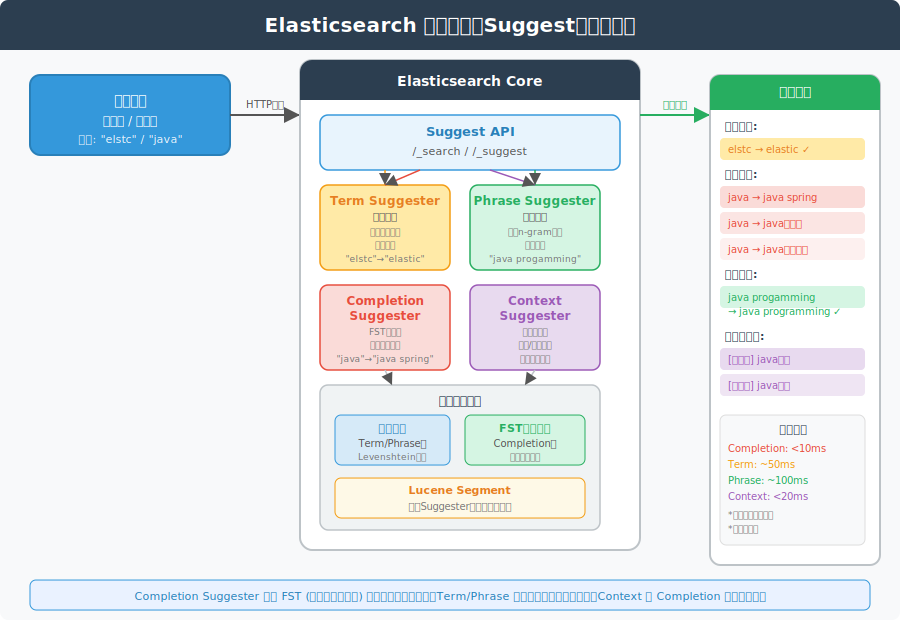
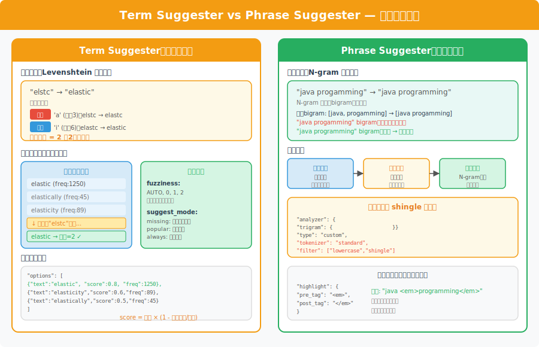
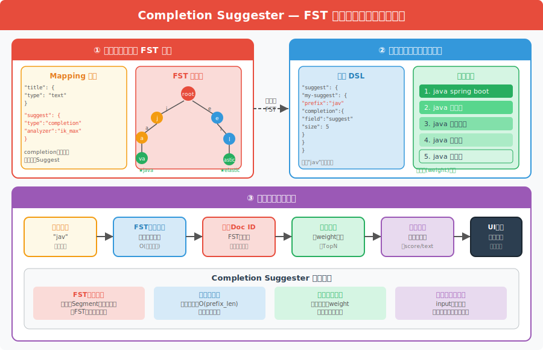
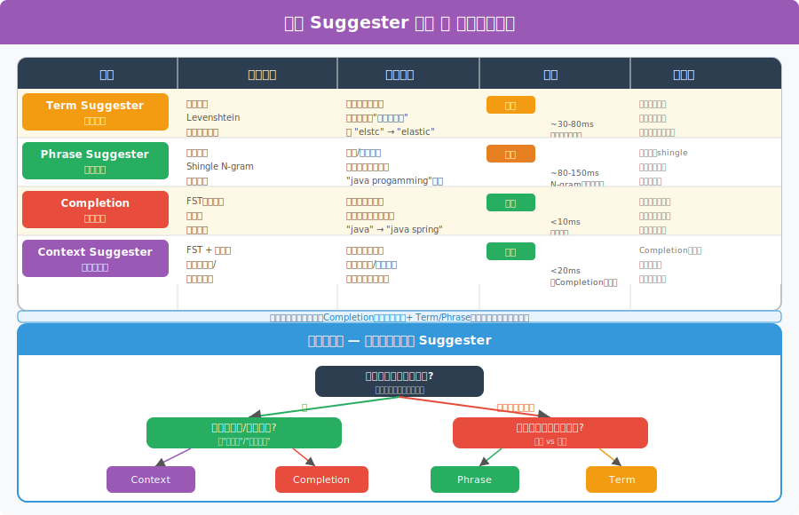

# Elasticsearch 搜索推荐（Suggest）详解

> 本文档持续更新，后续相关提问也会追加在文末。

---

## 一、概述



Elasticsearch 提供了 **Suggest API**，专门用于搜索推荐场景，包括自动补全、拼写纠错、相关词推荐等。

ES 共提供四种 Suggester：

| Suggester | 中文名 | 核心技术 | 典型场景 |
|---|---|---|---|
| **Term Suggester** | 词项推荐 | 编辑距离（Levenshtein） | 单词拼写纠错 |
| **Phrase Suggester** | 短语推荐 | N-gram 语言模型 | 整句纠错 |
| **Completion Suggester** | 自动补全 | FST（有限状态转换器） | 搜索框实时补全 |
| **Context Suggester** | 上下文推荐 | FST + 上下文过滤 | 场景化个性化推荐 |

---

## 二、Term Suggester（词项推荐）



### 2.1 原理

Term Suggester 基于**编辑距离（Levenshtein Distance）**算法，计算用户输入词与索引词典中每个词的相似度，返回距离最近的候选词。

**编辑距离**：将一个字符串变换为另一个字符串所需的最少单字符编辑操作数（插入、删除、替换）。

```
"elstc" → "elastic"
- 插入 'a'：elstc → elastc
- 插入 'i'：elastc → elastic
编辑距离 = 2
```

### 2.2 核心参数

```json
POST /_search
{
  "suggest": {
    "my-suggestion": {
      "text": "elstc",
      "term": {
        "field": "content",
        "suggest_mode": "missing",
        "fuzziness": "AUTO",
        "min_word_length": 4,
        "prefix_length": 2,
        "max_edits": 2,
        "size": 5,
        "sort": "score"
      }
    }
  }
}
```

| 参数 | 说明 | 默认值 |
|---|---|---|
| `suggest_mode` | `missing`：原词无结果时推荐；`popular`：推荐更高频词；`always`：始终返回 | `missing` |
| `fuzziness` | 最大编辑距离，`AUTO` 根据词长自动调整 | `AUTO` |
| `prefix_length` | 前缀字符数（不参与模糊匹配），提高性能 | `1` |
| `max_edits` | 最大编辑次数，1 或 2 | `2` |
| `sort` | 排序方式：`score`（综合评分）或 `frequency`（词频） | `score` |

### 2.3 响应示例

```json
{
  "suggest": {
    "my-suggestion": [
      {
        "text": "elstc",
        "options": [
          { "text": "elastic",    "score": 0.8, "freq": 1250 },
          { "text": "elasticity", "score": 0.6, "freq": 89 }
        ]
      }
    ]
  }
}
```

**评分公式**：`score = 词频 × (1 - 编辑距离 / max(源词长度, 目标词长度))`

### 2.4 局限性

- 每个词独立纠错，**不考虑词间关系**
- 不适合短语或句子级别的纠错
- 需扫描整个词典，数据量大时性能下降

---

## 三、Phrase Suggester（短语推荐）

### 3.1 原理

Phrase Suggester 在 Term Suggester 基础上**增加了词间关系的考量**，使用 **N-gram 语言模型**对整个短语进行评分，选择在语料中出现概率最高的候选短语。

```
"java progamming" → "java programming"
- 判断依据：索引中 "java programming" 的 bigram 频率 >> "java progamming"
- 因此推荐后者
```

### 3.2 前提条件：配置 Shingle 分析器

Phrase Suggester 依赖 **shingle（词组）** 分析器，索引阶段必须提前构建 N-gram。

**Mapping 配置**：

```json
PUT /my-index
{
  "settings": {
    "analysis": {
      "analyzer": {
        "trigram": {
          "type": "custom",
          "tokenizer": "standard",
          "filter": ["lowercase", "shingle"]
        }
      },
      "filter": {
        "shingle": {
          "type": "shingle",
          "min_shingle_size": 2,
          "max_shingle_size": 3
        }
      }
    }
  },
  "mappings": {
    "properties": {
      "title": {
        "type": "text",
        "fields": {
          "trigram": {
            "type": "text",
            "analyzer": "trigram"
          }
        }
      }
    }
  }
}
```

### 3.3 查询示例

```json
POST /_search
{
  "suggest": {
    "phrase-suggest": {
      "text": "java progamming guide",
      "phrase": {
        "field": "title.trigram",
        "size": 3,
        "gram_size": 3,
        "direct_generator": [
          {
            "field": "title.trigram",
            "suggest_mode": "always"
          }
        ],
        "highlight": {
          "pre_tag": "<em>",
          "post_tag": "</em>"
        }
      }
    }
  }
}
```

**返回结果**（高亮纠错词）：

```json
{
  "options": [
    {
      "text": "java programming guide",
      "highlighted": "java <em>programming</em> guide",
      "score": 0.0078125
    }
  ]
}
```

### 3.4 特性对比

| | Term Suggester | Phrase Suggester |
|---|---|---|
| 纠错粒度 | 单词 | 短语/句子 |
| 是否考虑词序 | 否 | 是 |
| 索引要求 | 普通倒排索引 | 需要 shingle 分析器 |
| 性能 | 中等 | 较慢 |
| 高亮支持 | 否 | 是 |

---

## 四、Completion Suggester（自动补全）



### 4.1 原理：FST（有限状态转换器）

Completion Suggester 使用 **FST（Finite State Transducer，有限状态转换器）** 数据结构，将所有候选词编译成一张极度压缩的有向无环图，**全量常驻内存**，实现毫秒级前缀查询。

**FST 特点**：
- 所有词共享公共前缀/后缀，内存利用率高
- 前缀查询时间复杂度 = O(前缀长度)，与数据量无关
- 在 Lucene Segment 加载时自动构建并载入内存

### 4.2 Mapping 配置

Completion Suggester 需要专门的 `completion` 类型字段：

```json
PUT /search-index
{
  "mappings": {
    "properties": {
      "title": {
        "type": "text",
        "analyzer": "ik_max_word"
      },
      "suggest": {
        "type": "completion",
        "analyzer": "ik_max_word",
        "search_analyzer": "ik_smart",
        "preserve_separators": true,
        "preserve_position_increments": true,
        "max_input_length": 50
      }
    }
  }
}
```

### 4.3 写入文档

`suggest` 字段支持多种格式，可指定**权重（weight）**控制排序：

```json
POST /search-index/_doc
{
  "title": "Java Spring Boot 入门教程",
  "suggest": {
    "input": [
      "Java Spring Boot",
      "Spring Boot",
      "SpringBoot 教程"
    ],
    "weight": 100
  }
}
```

- `input`：触发该推荐的前缀词列表（支持多个别名/同义词）
- `weight`：权重，权重越高排序越靠前

### 4.4 查询示例

```json
POST /search-index/_search
{
  "suggest": {
    "title-suggest": {
      "prefix": "java sp",
      "completion": {
        "field": "suggest",
        "size": 5,
        "skip_duplicates": true,
        "fuzzy": {
          "fuzziness": 1
        }
      }
    }
  }
}
```

**返回结果**：

```json
{
  "suggest": {
    "title-suggest": [
      {
        "text": "java sp",
        "options": [
          { "text": "Java Spring Boot 入门教程", "_score": 100.0 },
          { "text": "Java Spring Cloud 微服务",  "_score": 95.0 },
          { "text": "Java Spring MVC 实战",     "_score": 90.0 }
        ]
      }
    ]
  }
}
```

### 4.5 注意事项

| 注意点 | 说明 |
|---|---|
| 只支持前缀匹配 | 无法匹配中间词，"Spring" 无法触发 "Java Spring Boot" |
| 内存消耗 | FST 常驻堆外内存，数据量大时需关注 |
| 不适合纠错 | 输入 "jaav" 不会推荐 "java"（可开启 fuzzy 模糊）|
| 写入时建索引 | 权重、input 在写入时确定，修改需重新索引 |

---

## 五、Context Suggester（上下文推荐）

### 5.1 原理

Context Suggester 是 Completion Suggester 的增强版，在 FST 的基础上增加了**上下文过滤**能力，允许在查询时传入上下文参数，只返回匹配该上下文的候选词。

支持两种上下文类型：
- **Category（分类上下文）**：按分类标签过滤，如"技术/生活/娱乐"
- **Geo（地理位置上下文）**：按地理位置过滤，如"北京/上海"附近的推荐

### 5.2 Mapping 配置

```json
PUT /context-index
{
  "mappings": {
    "properties": {
      "suggest": {
        "type": "completion",
        "contexts": [
          {
            "name": "category",
            "type": "category"
          },
          {
            "name": "location",
            "type": "geo",
            "precision": 4
          }
        ]
      }
    }
  }
}
```

### 5.3 写入文档（含上下文）

```json
POST /context-index/_doc
{
  "suggest": {
    "input": ["Java 微服务", "Spring Cloud"],
    "weight": 100,
    "contexts": {
      "category": ["技术", "后端"],
      "location": { "lat": 39.9, "lon": 116.4 }
    }
  }
}
```

### 5.4 查询示例

```json
POST /context-index/_search
{
  "suggest": {
    "ctx-suggest": {
      "prefix": "java",
      "completion": {
        "field": "suggest",
        "size": 5,
        "contexts": {
          "category": [
            { "context": "技术", "boost": 2 },
            { "context": "后端", "boost": 1 }
          ]
        }
      }
    }
  }
}
```

### 5.5 应用场景

```
电商平台：搜"手机" → 当前在"数码"类目下，优先推荐数码手机而非手机壳
地图应用：搜"咖啡" → 基于当前GPS位置，推荐附近的咖啡店
```

---

## 六、四种 Suggester 选型对比



### 6.1 性能对比

```
Completion/Context Suggester  ：< 10ms   （FST内存查询，与数据量无关）
Term Suggester                ：30-80ms  （倒排索引扫描，与词典大小相关）
Phrase Suggester              ：80-150ms （N-gram联合计算，开销最大）
```

### 6.2 选型决策

```
实时补全（搜索框下拉）→ Completion Suggester
         ↓ 需要分类/地理过滤 → Context Suggester

搜索后纠错提示（"您是否要找"）
  → 整句纠错   → Phrase Suggester（需要shingle）
  → 单词纠错   → Term Suggester
```

### 6.3 生产实践：组合使用

大型搜索系统通常**组合使用**多种 Suggester：

```
1. 搜索框输入阶段  →  Completion Suggester（毫秒级补全）
2. 搜索结果页顶部  →  Term/Phrase Suggester（"您是否要找: XXX"）
3. 零结果页        →  Term Suggester（纠错推荐相似词）
4. 个性化平台      →  Context Suggester（分类/位置过滤）
```

---

## 七、实战：搭建完整的搜索推荐系统

### 7.1 推荐词库来源

```
① 运营手动维护热门词
② 用户搜索日志统计（近7天/30天 Top搜索词）
③ 商品/内容标题拆词
④ 同义词词典
```

### 7.2 数据写入流程

```
搜索日志 → Flink/Spark实时统计词频
         → 定时更新ES中suggest字段的weight
         → 热搜词weight高 → 排序靠前
```

### 7.3 Spring Boot 集成示例

```java
// Mapping初始化
@Component
public class SuggestIndexInit {

    @Autowired
    private RestHighLevelClient client;

    public void createIndex() throws IOException {
        CreateIndexRequest request = new CreateIndexRequest("article-suggest");

        // 设置mapping
        request.mapping("""
            {
              "properties": {
                "title": { "type": "text", "analyzer": "ik_max_word" },
                "suggest": {
                  "type": "completion",
                  "analyzer": "ik_max_word",
                  "search_analyzer": "ik_smart"
                }
              }
            }
            """, XContentType.JSON);

        client.indices().create(request, RequestOptions.DEFAULT);
    }
}

// 查询推荐词
public List<String> getSuggestions(String prefix) throws IOException {
    SearchRequest searchRequest = new SearchRequest("article-suggest");
    SearchSourceBuilder sourceBuilder = new SearchSourceBuilder();

    SuggestBuilder suggestBuilder = new SuggestBuilder();
    CompletionSuggestionBuilder completionSuggestion =
        SuggestBuilders.completionSuggestion("suggest")
            .prefix(prefix)
            .size(10)
            .skipDuplicates(true);

    suggestBuilder.addSuggestion("title-suggest", completionSuggestion);
    sourceBuilder.suggest(suggestBuilder);
    searchRequest.source(sourceBuilder);

    SearchResponse response = client.search(searchRequest, RequestOptions.DEFAULT);
    CompletionSuggestion suggestion = response.getSuggest()
        .getSuggestion("title-suggest");

    return suggestion.getOptions().stream()
        .map(option -> option.getText().string())
        .collect(Collectors.toList());
}
```

### 7.4 前端联动

```javascript
// 防抖处理，避免每个字符都触发请求
const debouncedSearch = debounce(async (value) => {
  if (value.length < 1) return;
  const suggestions = await fetchSuggestions(value);
  setSuggestions(suggestions);
}, 150);

// 搜索框onChange
<Input
  onChange={(e) => debouncedSearch(e.target.value)}
  autoComplete={suggestions}
/>
```

---

## 八、常见面试问题

### Q1: Completion Suggester 为什么那么快？

**答**：底层使用 **FST（有限状态转换器）** 数据结构，所有候选词在索引加载时编译为 FST 并**整体载入堆外内存**。FST 共享词的公共前缀/后缀，极度压缩内存占用。前缀查询只需沿 FST 边遍历，时间复杂度 O(前缀长度)，与数据总量完全无关，因此能达到毫秒以内的响应速度。

### Q2: Completion Suggester 和 Term Suggester 能混用吗？

**答**：可以，在同一个 `suggest` 请求中定义多个 suggestion：
```json
{
  "suggest": {
    "auto-complete": { "prefix": "java", "completion": { "field": "suggest" } },
    "spell-correct": { "text": "jva", "term": { "field": "content" } }
  }
}
```

### Q3: 如何实现"搜索框输入拼音也能补全"？

**答**：集成**拼音分析器**（elasticsearch-analysis-pinyin），在 Mapping 中给 `suggest` 字段配置拼音分析器，写入时同时生成拼音 token，查询时用拼音前缀也能命中。

```json
"suggest": {
  "type": "completion",
  "analyzer": "pinyin_analyzer"
}
```

### Q4: Completion Suggester 的 weight 如何动态更新？

**答**：ES 不支持只更新某个字段，必须重新写入整个文档（`_update` 或 `index`）。生产上通常：
1. 用 Flink 实时消费搜索日志统计词频
2. 定时（如每小时）批量 `bulk update` 热搜词的 weight
3. 或直接删旧建新（`delete` + `index`）

### Q5: Phrase Suggester 为什么需要 shingle 分析器？

**答**：Phrase Suggester 通过比较**候选短语在语料中的出现概率**来评分，这依赖于索引中存储了词组（bigram/trigram）的频率统计。shingle 分析器在索引阶段就将相邻词组合成 token 存入倒排索引，Phrase Suggester 查询时就能快速获取词组的共现频率，从而判断哪个短语更"自然"。

---

*最后更新：2026-04-07*
