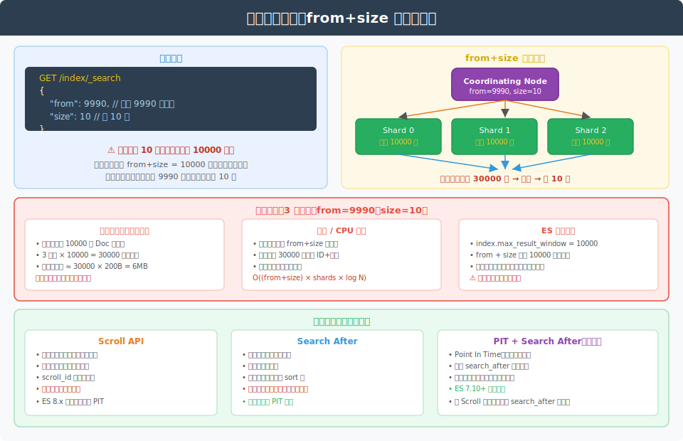
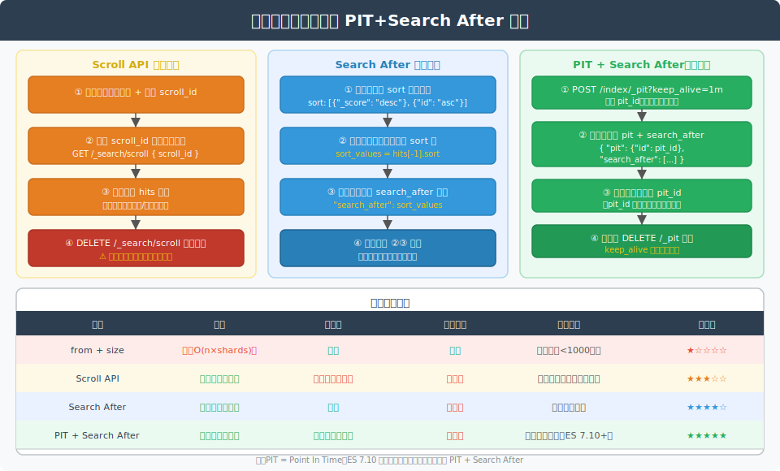

# Elasticsearch 深度分页详解

> 本文档持续更新，后续相关提问也会追加在文末。

---

## 一、概述



ES 提供三种分页方案，适用场景各不相同：

| 方案 | 核心机制 | 适用场景 |
|---|---|---|
| **from + size** | 全量拉取后截断 | 浅翻页（< 1000 条）|
| **Scroll API** | 快照 + 游标 | 数据导出、离线批量处理 |
| **Search After** | 游标式翻页 | 实时顺序翻页 |
| **PIT + Search After** | 轻量快照 + 游标 | 深度翻页首选（ES 7.10+）|

---

## 二、from + size 的性能陷阱

### 2.1 工作原理

```json
GET /index/_search
{
  "from": 9990,
  "size": 10
}
```

看似只取 10 条，实际执行逻辑：

```
Coordinating Node
  → 向每个 Shard 发送请求：取前 (from + size) = 10000 条
  → 3 个 Shard 各返回 10000 条元数据（文档 ID + 分数）
  → 协调节点合并 30000 条，全局排序
  → 丢弃前 9990 条，返回第 9991~10000 条
```

### 2.2 资源消耗分析

```
内存消耗 = (from + size) × shard_count × 每条元数据大小
         = 10000 × 3 × ~200B
         ≈ 6 MB（仅元数据，还未算 _source 数据）

从 from=0 翻到 from=100000：
  内存消耗增长到 100010 × 3 × 200B ≈ 60 MB
  协调节点排序时间也同步增长 → OOM 风险
```

### 2.3 默认上限限制

```yaml
# ES 默认配置
index.max_result_window: 10000
```

from + size 超过 10000 时 ES 直接报错：

```json
{
  "error": {
    "type": "illegal_argument_exception",
    "reason": "Result window is too large, from + size must be less than or equal to: [10000]"
  }
}
```

> 虽然可以调大 `max_result_window`，但这会线性放大内存和 CPU 开销，**强烈不建议**。

### 2.4 适用场景

```
✓ 前几页（from < 1000）：用户主动翻页行为，很少超过前10页
✓ 精确跳页需求（如"跳到第 50 页"）：只有 from+size 支持随机跳页
✗ 深度翻页（from > 1000）：性能急剧下降
✗ 全量数据遍历：请使用 Scroll 或 PIT+Search After
```

---

## 三、Scroll API

### 3.1 工作原理

Scroll 在初始化时对索引打一个**快照**（保存当时的 Lucene Segment 视图），后续分批取数据都基于这个快照，不反映快照之后的写入/删除。

```
初始请求 → 创建快照，返回 scroll_id
  ↓
携带 scroll_id 取下一批
  ↓
直到返回空 hits
  ↓
显式删除 scroll_id（释放内存）
```

### 3.2 基本用法

**第一步：初始化**

```json
POST /index/_search?scroll=1m
{
  "size": 100,
  "sort": ["_doc"],
  "query": { "match_all": {} }
}
```

```json
// 响应
{
  "_scroll_id": "DXF1ZXJ5QW5kRmV0Y2g...",
  "hits": {
    "hits": [...]
  }
}
```

> `scroll=1m` 表示 scroll 上下文存活 1 分钟，每次取数据后会重置计时器。

**第二步：取下一批**

```json
POST /_search/scroll
{
  "scroll": "1m",
  "scroll_id": "DXF1ZXJ5QW5kRmV0Y2g..."
}
```

**第三步：释放资源**

```json
DELETE /_search/scroll
{
  "scroll_id": "DXF1ZXJ5QW5kRmV0Y2g..."
}

// 释放所有 scroll
DELETE /_search/scroll/_all
```

### 3.3 性能特点

```
优点：
  ✓ 每次只拉取 size 条，内存消耗固定
  ✓ 遍历全量数据时性能稳定
  ✓ 快照保证遍历过程中数据一致

缺点：
  ✗ scroll_id 对应的 Lucene 段不能被合并（影响写性能）
  ✗ 大量并发 Scroll 会消耗大量堆内存
  ✗ 非实时（快照创建后的变更不可见）
  ✗ 不支持随机跳页
```

### 3.4 排序优化

全量导出时使用 `"sort": ["_doc"]`（按文档内部顺序），跳过相关性计算，性能最优：

```json
POST /index/_search?scroll=1m
{
  "size": 1000,
  "sort": ["_doc"],    // 不按分数排序，最快
  "query": { ... }
}
```

### 3.5 适用场景

```
✓ 数据迁移（reindex 的底层实现）
✓ 数据导出到文件（CSV、JSON）
✓ 批量离线分析
✗ 实时用户翻页（ES 8.x 已正式废弃 Scroll，推荐 PIT+Search After）
```

---

## 四、Search After

### 4.1 工作原理

Search After 是**游标式翻页**：每次查询返回当前页最后一条记录的 `sort` 值，下次查询以该值为起点继续拉取，无需快照，无状态。

```
第一页请求（无 search_after）
  → 返回 hits + 每条记录的 sort 值
  ↓
取最后一条记录的 sort 值作为游标
  ↓
第二页请求（携带 search_after=[sort 值]）
  → 仅扫描 sort 值之后的数据
  ↓
循环直到无数据
```

### 4.2 基本用法

**第一页**：

```json
GET /index/_search
{
  "size": 10,
  "sort": [
    { "_score": "desc" },
    { "id": "asc" }       // 必须包含唯一字段，确保分页稳定
  ],
  "query": { "match": { "title": "elasticsearch" } }
}
```

```json
// 响应（取最后一条记录的 sort 数组）
{
  "hits": {
    "hits": [
      {
        "_id": "doc123",
        "sort": [0.87, "doc123"]   // ← 下次请求的 search_after 值
      }
    ]
  }
}
```

**第二页**：

```json
GET /index/_search
{
  "size": 10,
  "sort": [
    { "_score": "desc" },
    { "id": "asc" }
  ],
  "search_after": [0.87, "doc123"],   // 上一页最后一条的 sort 值
  "query": { "match": { "title": "elasticsearch" } }
}
```

### 4.3 sort 字段要求

```
必须包含唯一性字段（通常是 _id 或业务主键）
原因：当多条记录 sort 值相同时，没有唯一字段会导致分页结果不稳定

推荐 sort：
  [{ "_score": "desc" }, { "_id": "asc" }]     // 含相关性排序
  [{ "create_time": "desc" }, { "_id": "asc" }] // 含时间排序
```

### 4.4 性能特点

```
优点：
  ✓ 无状态，不占用服务端内存
  ✓ 性能稳定，不随页码增加而变差（每次只取 size 条）
  ✓ 实时：不同于 Scroll，每次查询反映当前最新数据

缺点：
  ✗ 只能顺序翻页（不支持跳页到第 N 页）
  ✗ 没有 PIT 时，两次查询之间的数据变更可能导致分页结果不稳定
    （数据有增删时，游标指向的文档可能已消失）
```

### 4.5 稳定性问题

不带 PIT 的 Search After 存在**"幻读"**问题：

```
第1页查完后，某文档被删除
→ 第2页用 search_after 翻页时，可能跳过某些文档
  （因为删除引起了 sort 值的漂移）
```

解决方案：配合 PIT 使用（见下节）。

---

## 五、PIT + Search After（推荐方案）

### 5.1 什么是 PIT（Point In Time）

PIT 是 ES 7.10 引入的**轻量级快照机制**：

- 为查询保留一个数据视图（Lucene Segment 集合的引用）
- 比 Scroll 更轻量：不保存查询上下文，只保存 Segment 视图
- 有 TTL（`keep_alive`），过期自动释放
- 支持跨查询保持一致的数据视图

### 5.2 完整用法

**Step 1：创建 PIT**

```json
POST /index/_pit?keep_alive=1m
```

```json
// 响应
{
  "id": "46ToAwMDaWR5BXV1aWQy..."
}
```

**Step 2：第一页查询（携带 pit）**

```json
GET /_search                // 注意：不需要指定索引名，pit 中已包含
{
  "size": 10,
  "sort": [
    { "create_time": "desc" },
    { "_id": "asc" }
  ],
  "pit": {
    "id": "46ToAwMDaWR5BXV1aWQy...",
    "keep_alive": "1m"          // 每次查询重置 TTL
  },
  "query": { "match_all": {} }
}
```

```json
// 响应（包含新的 pit_id 和 sort 值）
{
  "pit_id": "46ToAwMDaWR5...(新值)",   // pit_id 每次请求后可能更新
  "hits": {
    "hits": [
      {
        "_id": "doc999",
        "sort": [1700000000000, "doc999"]
      }
    ]
  }
}
```

**Step 3：下一页（携带新 pit_id + search_after）**

```json
GET /_search
{
  "size": 10,
  "sort": [
    { "create_time": "desc" },
    { "_id": "asc" }
  ],
  "pit": {
    "id": "46ToAwMDaWR5...(新值)",   // 使用上一次响应返回的新 pit_id
    "keep_alive": "1m"
  },
  "search_after": [1700000000000, "doc999"],
  "query": { "match_all": {} }
}
```

**Step 4：完成后释放 PIT**

```json
DELETE /_pit
{
  "id": "46ToAwMDaWR5..."
}
```

### 5.3 为什么 pit_id 每次会变化？

PIT 底层对应一组 Lucene Segment Reader。随着时间推移，ES 可能对 Segment 进行合并（merge），PIT 会跟踪合并后的新 Segment，因此 `pit_id` 可能在每次查询后更新。**应始终使用最新响应中的 `pit_id`**，而不是保存初始值。

### 5.4 PIT vs Scroll 对比

| 特性 | Scroll | PIT + Search After |
|---|---|---|
| **快照机制** | 保存完整查询上下文 | 仅保存 Segment 视图引用 |
| **内存开销** | 较大（查询上下文 + Segment 引用）| 较小（仅 Segment 引用）|
| **状态存储** | 服务端保存游标状态 | 无状态（客户端保存 sort 游标）|
| **实时性** | 非实时（快照时刻的数据）| 一致性视图（PIT 时刻的数据）|
| **并发翻页** | 不支持（一个 scroll_id 顺序使用）| 支持（PIT 可并发多个翻页）|
| **ES 版本** | 1.0+（8.x 废弃）| 7.10+ |

---

## 六、四种方案全面对比



### 6.1 性能对比

```
from + size（from=100000, size=10, 3 shards）：
  每个 Shard 需返回 100010 条元数据 → 协调节点合并 300030 条排序
  延迟：随 from 线性增长，可能数十秒

Scroll（size=1000, 3 shards）：
  每次固定取 1000 条 → 合并 3000 条排序 → 延迟稳定 10-50ms

Search After（size=1000, 3 shards）：
  每次固定取 1000 条 → 延迟稳定 10-50ms

PIT + Search After：
  与 Search After 相同，+PIT 的少量开销（< 1ms）
```

### 6.2 选型决策

```
用户主动翻页（前10页）
  └→ from + size

全量数据导出 / 离线批量处理（ES 8.x 之前）
  └→ Scroll API

全量数据导出 / 离线批量处理（ES 8.x+）
  └→ PIT + Search After（batch 模式）

实时顺序翻页（"下一页" 场景）
  └→ Search After（数据量小、一致性要求低）
  └→ PIT + Search After（数据量大、需要稳定一致的分页视图）

需要随机跳页（"跳到第 N 页"）
  └→ from + size（仅限浅翻页，深度跳页需业务限制）
```

---

## 七、常见面试问题

### Q：为什么 ES 默认限制 from + size ≤ 10000？

ES 不是不能做，而是设计上的保护：

1. **内存保护**：协调节点需要在内存中排序 `(from+size) × shard_count` 条记录，无限制会 OOM
2. **一致性问题**：深度分页时数据可能已经变化，from=100000 的第 1 条和第 2 次查询的结果可能完全不同，用户体验也差
3. **引导用户使用正确方案**：主动报错迫使开发者选择 Scroll 或 Search After

### Q：Search After 和 Scroll 都不支持随机跳页，业务上如何处理？

- **限制翻页深度**：大部分用户不会翻超过100页，超过后提示"请缩小搜索范围"
- **缓存热门页**：对前 10 页进行缓存，减少实际查询
- **业务侧编码游标**：将 sort 值作为分页 token 返回前端，前端保存 token 序列实现"跳页"

### Q：使用 PIT 翻页时，如果 PIT 过期了怎么办？

PIT 过期后继续查询会报错：`SearchContextMissingException`。需要：
1. 捕获该异常
2. 重新创建 PIT
3. **从第一页重新开始遍历**（无法从断点续传）

因此 `keep_alive` 应设置为合理值，并在每次查询时通过 `keep_alive` 参数续期。

### Q：Reindex API 底层用的是哪种分页方式？

ES 内部 Reindex 使用的是 **Scroll API**（固定 `size=1000`，`sort=["_doc"]`），这也是 Scroll 最典型的官方内部使用场景。

### Q：PIT 的 `keep_alive` 设置多久合适？

取决于两次相邻翻页请求之间的最大间隔：
- 用户交互翻页：`keep_alive=1m` 足够
- 批量程序处理：根据每批处理时间设置，通常 `5m~30m`
- 每次查询都通过 `pit.keep_alive` 字段续期，无需担心翻页过程中超时
