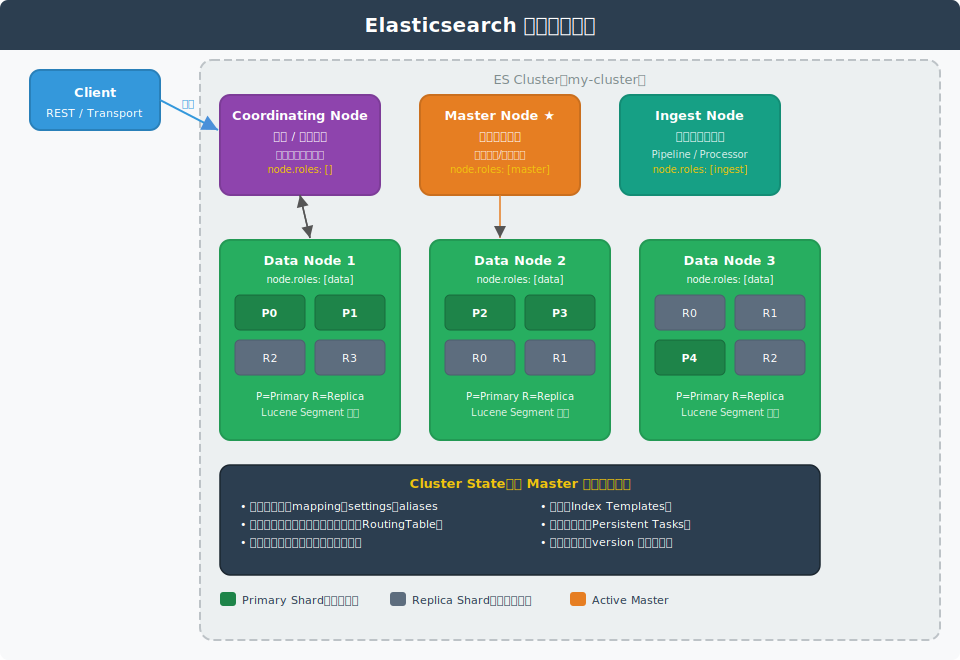
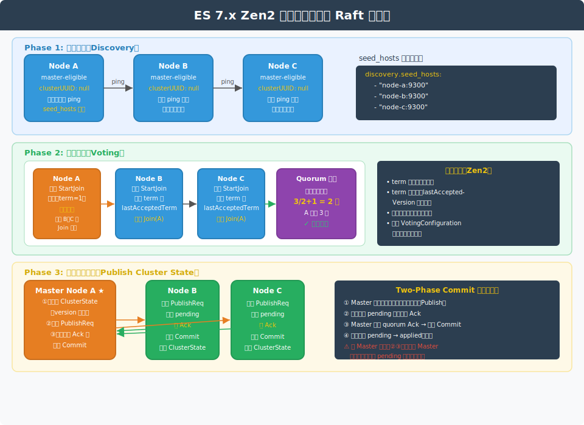
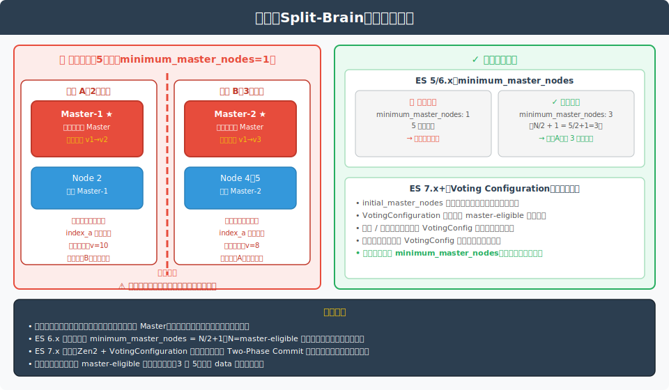

# Elasticsearch 集群与选主详解

> 本文档持续更新，后续相关提问也会追加在文末。

---

## 一、集群整体架构



Elasticsearch 是天然分布式的搜索引擎，通过集群（Cluster）将多个节点组织在一起，对外提供统一服务。

集群由以下核心概念构成：

| 概念 | 说明 |
|---|---|
| **Cluster** | 由一个或多个节点组成，共享同一个 `cluster.name` |
| **Node** | 集群中的单个 ES 进程实例，启动时自动加入同名集群 |
| **Index** | 逻辑上的数据集合，物理上分散在多个分片中 |
| **Shard** | 最小存储单元，底层是一个 Lucene 索引 |
| **Replica** | 分片的副本，提供冗余和读扩展 |

---

## 二、节点类型

ES 7.x 之后通过 `node.roles` 配置节点角色，节点可以同时承担多种角色。

### 2.1 Master-Eligible Node（候选主节点）

```yaml
node.roles: [master]
```

- 参与选主，选出后成为 Active Master
- 负责集群元数据管理：创建/删除索引、分配分片、维护 Cluster State
- **不建议**同时承担 data 角色（数据量大时影响选主稳定性）

### 2.2 Data Node（数据节点）

```yaml
node.roles: [data]
```

- 存储分片数据，执行 CRUD、搜索、聚合操作
- 资源密集型：需要大内存、高 I/O、多 CPU
- 生产环境应与 master 节点分离

ES 7.x 起还细分了数据角色：

| 角色 | 说明 |
|---|---|
| `data_hot` | 存储最新、写入最频繁的数据 |
| `data_warm` | 存储访问不频繁、较旧的数据 |
| `data_cold` | 存储极少访问的历史数据 |
| `data_frozen` | 存储挂载的可搜索快照（ES 7.12+）|

### 2.3 Coordinating Node（协调节点）

```yaml
node.roles: []   # 不承担任何专属角色
```

- 所有节点天然具有协调能力，但纯协调节点不存数据、不参与选主
- 负责：路由请求到对应分片节点、收集结果、合并排序后返回客户端
- 适合高查询压力场景作为专用入口层

### 2.4 Ingest Node（摄取节点）

```yaml
node.roles: [ingest]
```

- 在文档写入前执行预处理 Pipeline（格式转换、字段提取、富化等）
- 类似于 Logstash 的 Filter 阶段，但在 ES 内部执行

### 2.5 节点角色最佳实践

```
小集群（< 5 节点）：master + data + coordinating 混合部署
中等集群（5~20 节点）：3 个专用 master-eligible + N 个 data
大型集群（> 20 节点）：3 个专用 master + 专用 coordinating + data 节点分冷热层
```

---

## 三、分片与副本

### 3.1 分片（Shard）

分片是 ES 水平扩展的基础单元，本质是一个 Lucene 索引。

```
Index 创建时指定分片数（默认 1 个 Primary Shard）：
PUT /my-index
{
  "settings": {
    "number_of_shards": 5,       // 主分片数，创建后不可更改
    "number_of_replicas": 1      // 副本数，可动态修改
  }
}
```

**分片路由算法**：

```
shard_num = hash(routing) % number_of_primary_shards
```

`routing` 默认是文档 `_id`，可自定义。这也是为什么主分片数创建后不可变——变了就会找不到已有文档。

### 3.2 副本（Replica）

- 每个主分片可以有 0 个或多个副本
- 副本永远不与其对应的主分片在同一节点（节点故障时保证可用）
- 写操作先写主分片，再同步到副本（写一致性）
- 读操作可以路由到主分片或任意副本（读扩展）

### 3.3 分片分配策略

Master 节点通过 `ShardsAllocator` 决定分片落在哪个节点：

| 策略 | 说明 |
|---|---|
| **均衡分配** | 各节点分片数尽量均衡 |
| **感知分配**（`allocation.awareness`） | 根据机架、可用区等属性分散分片，防止整个可用区故障 |
| **过滤分配**（`allocation.require/include/exclude`） | 强制某些分片到特定节点 |

---

## 四、集群状态（Cluster State）

Cluster State 是整个集群的元数据快照，由 Active Master 维护并广播给所有节点。

### 4.1 包含内容

| 内容 | 说明 |
|---|---|
| `nodes` | 所有存活节点的信息 |
| `metadata` | 所有索引的 mapping、settings、aliases、templates |
| `routing_table` | 每个分片当前在哪个节点（核心路由信息）|
| `routing_nodes` | 从节点视角看分片分布 |
| `version` | 单调递增的版本号，防止旧状态覆盖新状态 |

### 4.2 更新流程

```
Master 生成新 ClusterState（version+1）
  → Two-Phase Commit 广播给所有节点
    → 各节点写入 pending 状态，回 Ack
    → Master 收到 quorum Ack → 发送 Commit
    → 各节点将 pending 变为 applied，生效
```

> Master 是唯一能修改 Cluster State 的节点，防止并发写冲突。

---

## 五、选主机制

### 5.1 ES 7.x 之前：Zen Discovery

ES 5/6.x 使用 Zen Discovery，核心参数：

```yaml
discovery.zen.minimum_master_nodes: 2   # 选主所需最少票数（N/2+1）
discovery.zen.ping.unicast.hosts:
  - "node1:9300"
  - "node2:9300"
  - "node3:9300"
```

**选主流程**：
1. 节点启动后向 `unicast.hosts` 发送 ping 请求，收集存活节点列表
2. 每个 master-eligible 节点投票给自己认为最优的候选（按 `clusterStateVersion` 排序）
3. 收票数 ≥ `minimum_master_nodes` 的节点当选
4. 当选节点向所有节点广播自己是 Master

**问题**：`minimum_master_nodes` 需要手动计算，配置错误或节点数变化时容易引发脑裂。

### 5.2 ES 7.x+：Zen2（基于 Raft 思想）



ES 7.0 引入 Zen2，彻底重写了选主模块，配置方式改变：

```yaml
# 仅首次启动集群时需要，之后自动管理
cluster.initial_master_nodes:
  - "node-a"
  - "node-b"
  - "node-c"

discovery.seed_hosts:
  - "node-a:9300"
  - "node-b:9300"
  - "node-c:9300"
```

**选主三个阶段**：

#### Phase 1 — 节点发现（Discovery）

- 节点启动后向 `seed_hosts` 发送探测请求（类似 ping）
- 收集存活的 master-eligible 节点列表，构建候选集

#### Phase 2 — 投票选举（Voting）

核心数据结构：
- `term`：选举轮次，单调递增（类似 Raft 的 term）
- `lastAcceptedTerm` / `lastAcceptedVersion`：最后一次接受的集群状态信息

投票规则（按优先级排序）：
1. `term` 更大的候选人优先
2. `term` 相同时，`lastAcceptedVersion` 更大的优先（数据越新越可信）
3. 每个节点每轮只能投一票
4. 候选人需获得 **VotingConfiguration** 中过半数节点的 Join 才能当选

```
VotingConfiguration：ES 自动维护的 master-eligible 节点集合
选主 quorum = VotingConfiguration 节点数 / 2 + 1（向上取整）
```

#### Phase 3 — 状态发布（Publish Cluster State）

选主成功后，新 Master 立即通过 **Two-Phase Commit** 广播初始 Cluster State：

```
① 新 Master 构建 ClusterState（version 递增）
② 广播 PublishRequest 给所有节点
③ 各节点写入 pending 状态，返回 Ack
④ Master 收到 quorum Ack → 广播 Commit
⑤ 各节点将 pending → applied，集群正式可用
```

### 5.3 选举触发条件

| 触发场景 | 说明 |
|---|---|
| 集群首次启动 | 所有节点无 Master，触发选举 |
| Active Master 宕机 | 其他节点检测到 Master 心跳超时（`election.back_off_time`） |
| 网络分区恢复 | 少数派重新加入多数派，旧 Master 降级 |
| 手动触发 | 极少数运维场景 |

**心跳检测参数**：

```yaml
cluster.fault_detection.leader_check.interval: 1000ms  # 检测间隔
cluster.fault_detection.leader_check.timeout: 10000ms  # 超时阈值
cluster.fault_detection.leader_check.retry_count: 3    # 重试次数
```

---

## 六、脑裂（Split-Brain）



### 6.1 脑裂定义

网络分区后，集群被切割为两个（或多个）子集群，每个子集群独立选出了自己的 Master，导致数据状态产生两条不同的演化路径，网络恢复后数据冲突无法自动合并。

### 6.2 脑裂的根本原因

```
节点 A 认为 B、C 已宕机 → 自立为 Master → 继续写入
节点 B 看不到 A      → 重新选主（B 当选）→ 继续写入

两个 Master 各自修改 Cluster State，版本号和数据均不一致
```

### 6.3 ES 6.x 防护：minimum_master_nodes

```
集群 master-eligible 节点数 = N
minimum_master_nodes = N / 2 + 1（向下取整后 +1）

示例：
  3 节点 → minimum_master_nodes = 2
  5 节点 → minimum_master_nodes = 3
  7 节点 → minimum_master_nodes = 4
```

原理：网络分区后少数派（< quorum）无法凑够 `minimum_master_nodes` 票，无法选出 Master，自动停止写入，等待网络恢复。

**注意**：该值必须在所有节点保持一致，且节点扩缩容时需要手动更新，容易出错。

### 6.4 ES 7.x 防护：Voting Configuration

Zen2 自动维护 `VotingConfiguration`（投票配置集合），无需手动配置 `minimum_master_nodes`：

- 节点加入集群时，Master 将其加入 VotingConfiguration
- 节点下线时，需要显式调用 API 从 VotingConfiguration 中移除，防止永久阻塞
- 所有集群状态变更（选主、状态发布）均需 VotingConfiguration 中过半数同意

```bash
# 查看当前 VotingConfiguration
GET /_cluster/state/metadata?filter_path=metadata.cluster_coordination

# 手动退出节点（移除某节点前执行）
POST /_cluster/voting_config_exclusions?node_names=node-3
```

### 6.5 生产建议

```
✓ master-eligible 节点数设为奇数（3 或 5），偶数集群quorum和奇数相同但浪费资源
✓ master 节点与 data 节点分离，避免 GC 暂停影响选主
✓ master 节点配置小堆内存（4G~8G），降低 Full GC 概率
✓ 跨可用区部署时，master 节点分布在 3 个 AZ
✗ 不要将 minimum_master_nodes 设为 1（ES 6.x）
✗ 不要在 initial_master_nodes 中包含非 master-eligible 节点（ES 7.x）
```

---

## 七、节点加入与离开

### 7.1 节点加入流程

```
新节点启动
  → 向 seed_hosts 探测，找到 Active Master
  → 发送 JoinRequest（携带自己的节点信息）
  → Master 验证版本兼容性
  → Master 更新 Cluster State（加入新节点、分配分片）
  → Two-Phase Commit 广播新状态
  → 新节点开始同步分片数据
```

### 7.2 节点离开流程

**正常下线（Graceful Shutdown）**：

```bash
# ES 7.15+ 支持优雅关闭
POST /_nodes/node-id/shutdown
{
  "type": "remove"  // 或 "restart"
}
```

ES 会先将该节点上的分片迁移到其他节点，再关闭进程，避免数据不可用。

**异常宕机**：

```
Master 检测到节点心跳超时
  → 将该节点标记为 DEAD
  → 更新 Cluster State，将该节点的主分片状态改为 UNASSIGNED
  → ShardsAllocator 将 UNASSIGNED 主分片重新分配到其他节点
  → 如果有副本：提升副本为新主分片（快速恢复）
  → 如果无副本：集群变为 YELLOW 或 RED，需要等待节点恢复
```

### 7.3 集群健康状态

```
GREEN  ：所有主分片和副本均已分配
YELLOW ：所有主分片已分配，但有副本未分配（功能正常，但无冗余）
RED    ：有主分片未分配（部分数据不可用，写入/读取受限）
```

```bash
GET /_cluster/health

# 查看未分配分片原因
GET /_cluster/allocation/explain
```

---

## 八、写入与读取流程

### 8.1 写入流程（Index Request）

```
Client → Coordinating Node
  ① 根据路由算法确定 Primary Shard 所在节点
  ② 将请求转发到 Primary Shard 节点
  ③ Primary Shard 写入本地（写 Translog + 写内存 Buffer）
  ④ 并行转发给所有 Replica Shard
  ⑤ 所有 Replica 写入成功后，Primary 返回 Ack
  ⑥ Coordinating Node 返回响应给 Client
```

**写入一致性参数**：

```json
PUT /index/_doc/1?wait_for_active_shards=all
```

| 参数值 | 含义 |
|---|---|
| `1`（默认） | 只需主分���写成功即可返回 |
| `all` | 主分片+所有副本写成功才返回 |
| `quorum` | 过半分片写成功才返回 |

### 8.2 查询流程（Search Request）

```
Client → Coordinating Node
  ① Query Phase：向所有相关 Shard（Primary 或 Replica）广播查询请求
    → 每个 Shard 在本地执行查询，返回 Top-N 文档的 ID 和分数
  ② Fetch Phase：协调节点汇总所有 Shard 的结果，全局排序取 Top-N
    → 向对应 Shard 请求这些文档的完整内容（_source）
  ③ 协调节点组装最终结果，返回给 Client
```

---

## 九、常见面试问题

### Q：ES 集群为什么 master-eligible 节点数要设置为奇数？

奇数和偶数节点对应的 quorum 值不同：

| 节点数 | quorum | 可容忍宕机数 |
|---|---|---|
| 2 | 2 | 0（宕1台就无法选主）|
| 3 | 2 | 1 |
| 4 | 3 | 1（与3节点相同，多耗1台）|
| 5 | 3 | 2 |
| 6 | 4 | 2（与5节点相同，多耗1台）|

偶数节点在不增加容灾能力的情况下浪费资源，奇数是最优解。

### Q：ES 如何防止新节点携带旧数据加入集群后造成数据混乱？

每个节点保存有 `clusterUUID`，加入集群时 Master 会校验 `clusterUUID` 是否匹配。携带旧数据目录的节点（`clusterUUID` 不同）会被拒绝，需要清空数据目录后重新加入。

### Q：Zen2 中 `initial_master_nodes` 配置的作用是什么？能否在集群运行后修改？

`initial_master_nodes` 仅用于**集群首次启动**（所有节点的 `clusterUUID` 均为空时），防止多个独立子集群各自形成。一旦集群形成，该配置就不再生效，后续节点加入通过 `seed_hosts` 发现 Active Master 并 Join 即可。运行中的集群修改该配置没有任何效果。

### Q：Master 节点宕机后，集群多久能完成重新选主？

默认配置下：
```
leader_check.interval(1s) × leader_check.retry_count(3) + election_back_off = 约 10-15s
```

可以适当减小 `leader_check.interval` 加速故障检测，但过小会导致网络抖动误判。
