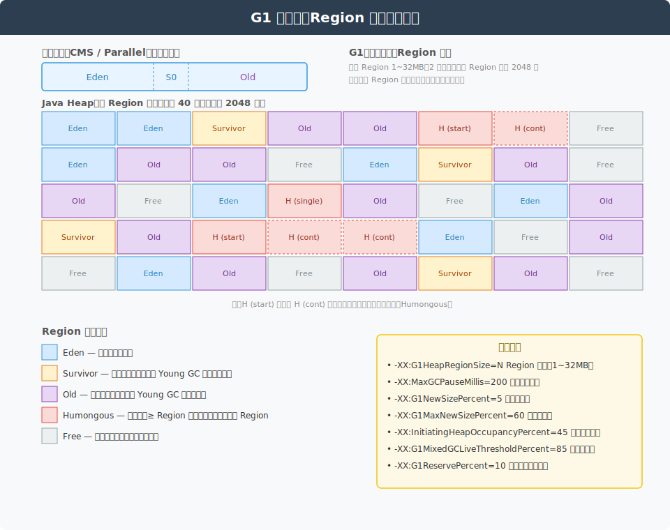
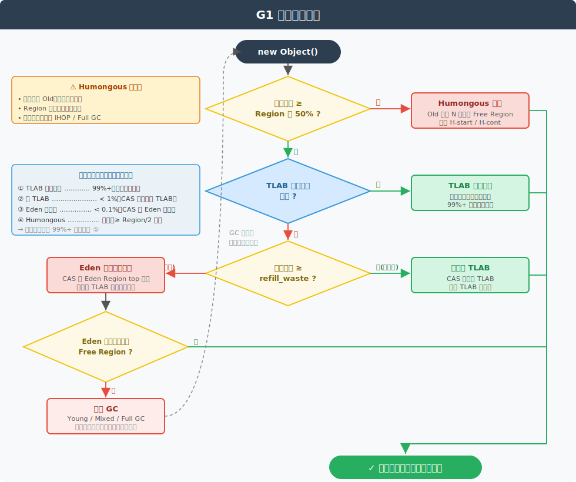
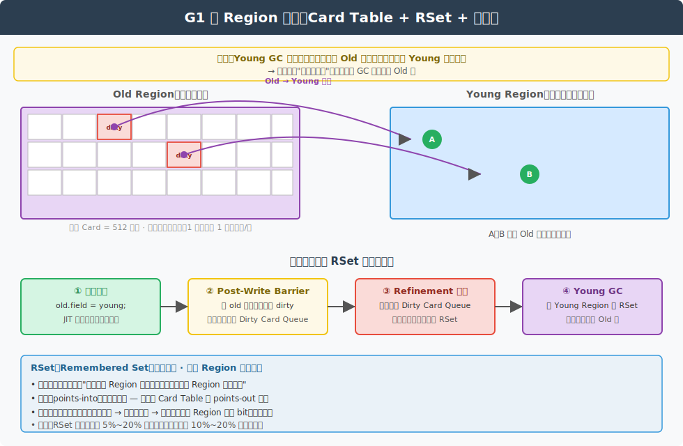
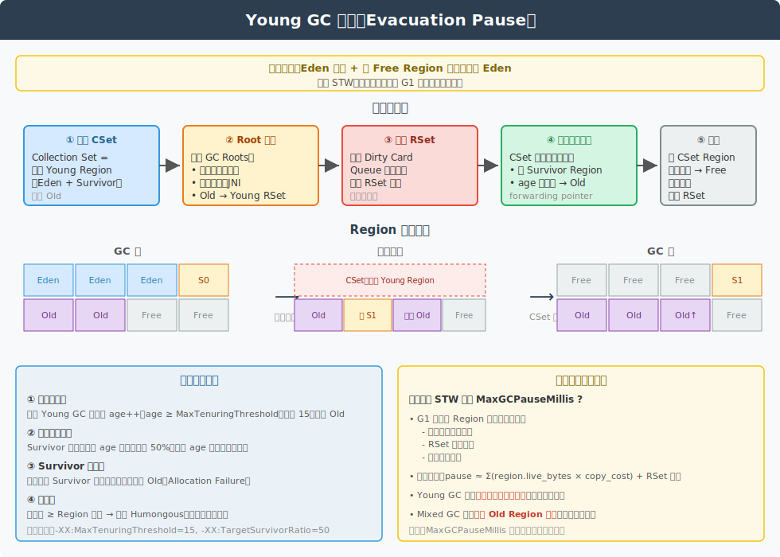
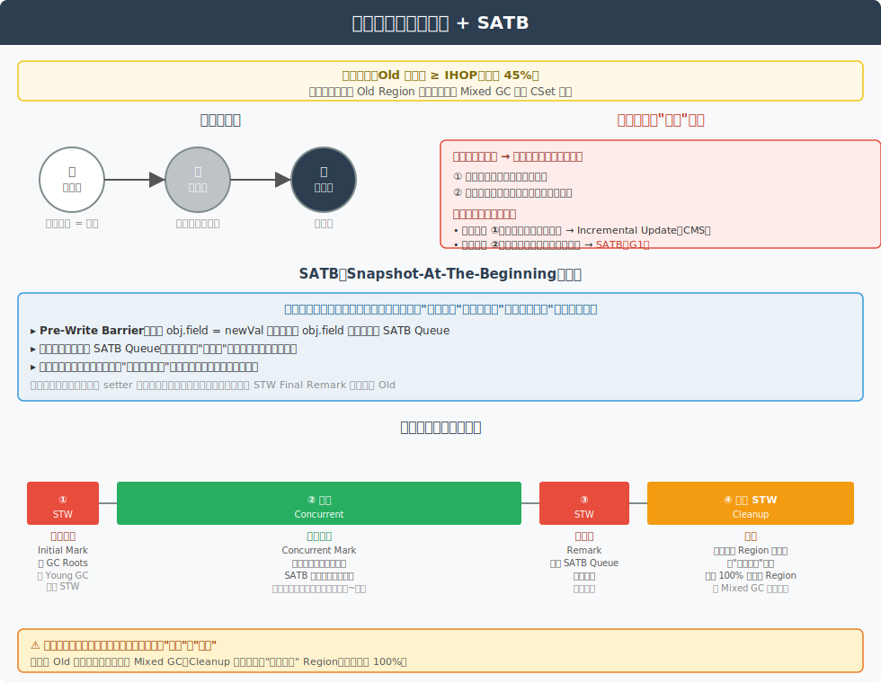

# JVM G1 收集器深度解析：对象分配与垃圾回收全流程

> 本文档持续更新，后续相关提问也会追加在文末。

---

## 一、G1 概述

**G1（Garbage-First）** 是 JDK 9 起的默认收集器，定位为**面向服务端、低延迟、可预测停顿**的全堆收集器。相比 CMS/Parallel，它的核心革新是：

| 维度 | 传统分代 (CMS/Parallel) | G1 |
|---|---|---|
| 堆划分 | 物理连续：Eden / Survivor / Old | **Region 化**：堆划分为 2048 个左右等大 Region |
| 分代 | 物理分代 | **逻辑分代**，每个 Region 可动态切换角色 |
| 回收目标 | 整代回收 | **Garbage-First**：优先回收垃圾最多的 Region |
| 停顿控制 | 不可预测 | 通过 `-XX:MaxGCPauseMillis` **软目标控制** |
| 碎片 | CMS 有；Parallel 整代压缩 | 复制算法**天然无碎片** |
| 并发性 | CMS 并发标记 + 并发清除 | 并发标记 + 并行复制（无并发清除） |

### 1.1 G1 堆结构



**关键点**：

- **Region 大小**：1 ~ 32 MB（2 的幂），由 `-XX:G1HeapRegionSize` 控制；不设则按 `堆 / 2048` 自动推算
- **五种 Region 角色**：Eden、Survivor、Old、Humongous、Free
- **Humongous**：对象大小 ≥ Region 一半，直接进 Old 区且占用 N 个连续 Region（H-start / H-cont）
- **同代不连续**：所有 Eden Region 在逻辑上属于年轻代，但物理位置可以任意分散
- **角色可切换**：一个 Region 被回收后变为 Free，下次可被分配为任何角色

> **设计动机**：物理上把堆切碎，回收时就能"挑着回收"——只挑收益最高的若干 Region 形成 CSet（Collection Set），而不是整代回收，从而把停顿控制在目标范围内。

---

## 二、对象分配详细流程



### 2.1 三条分配路径

G1 的对象分配在源码层面对应 `G1CollectedHeap::mem_allocate`，按优先级分为三条路径：

```
            new Object()
                  │
       ┌──────────┴──────────┐
       ▼                      ▼
   是否 Humongous?         否，普通对象
   (size ≥ Region/2)          │
       │                      ▼
       │ 是              TLAB 快路径
       │                      │
       ▼                      ▼
   Humongous 分配         指针碰撞分配
   （直接进 Old）              │
                              ▼
                       TLAB 不够 → 慢路径
```

### 2.2 路径①：TLAB 快路径（最常见，> 99% 对象走此路径）

**TLAB（Thread-Local Allocation Buffer）**：每个 Java 线程在 Eden 区私有一块小内存，分配时仅在 TLAB 内部做**指针碰撞**，**无锁**，性能极高。

```java
// 伪代码
Object* allocateInTLAB(size_t size) {
    if (tlab.top + size <= tlab.end) {
        Object* obj = tlab.top;
        tlab.top += size;           // 单纯指针自增，无 CAS
        return obj;
    }
    return null;  // TLAB 不够，走慢路径
}
```

**TLAB 不够时的二次决策**：

```
当前 TLAB 剩余空间 vs refill_waste（默认 TLAB 大小的 1/64）
    │
    ├─ 剩余 < refill_waste  → 浪费小，丢弃当前 TLAB，CAS 申请新 TLAB
    │
    └─ 剩余 ≥ refill_waste  → 浪费大，本对象走 Eden 慢路径
                              （保留当前 TLAB 继续给小对象用）
```

> **设计巧思**：避免大对象一来就把整个 TLAB "撑满末端而丢弃"，造成空间浪费。

### 2.3 路径②：Eden 慢路径

走到这里意味着 TLAB 装不下，且剩余空间还很大，不舍得丢弃。此时**直接在 Eden Region 共享空间分配**：

- 通过 **CAS** 抢占 Eden 当前 Region 的 `top` 指针
- 多线程竞争激烈时性能下降明显
- 若当前 Eden Region 也满了，G1 会**原子地切换到下一个 Free Region** 作为新 Eden
- 若无 Free Region 可切换，**触发 Young GC**

### 2.4 路径③：Humongous 分配

对象大小 **≥ Region 的 50%** 时，**绕过年轻代，直接在 Old 区分配**：

1. 计算需要的 Region 数：`ceil(objSize / regionSize)`
2. 在 Old 区中扫描 **N 个连续的 Free Region**（必须连续！）
3. 第一个标记为 `H-start`，后续标记为 `H-cont`
4. 对象末尾若未占满最后一个 Region，**剩余空间浪费**（不能被其他对象复用）

**Humongous 的副作用**：

- 直接进入 Old，**不经历年轻代筛选**，可能加速 Old 区填满
- **频繁分配大对象 → 加速 IHOP 触发 → 频繁并发标记 → 极端情况退化为 Full GC**
- JDK 8u40+ 引入 **Humongous 对象在 Young GC 中也可回收**（如果整个 Region 都是垃圾）

**实战调优**：

```bash
# 增大 Region 让大对象不再 Humongous
-XX:G1HeapRegionSize=16m
```

### 2.5 关键参数

```bash
-XX:+UseG1GC                          # 启用 G1
-XX:G1HeapRegionSize=N                # Region 大小（1~32m）
-XX:MaxGCPauseMillis=200              # 目标停顿（软目标）
-XX:G1NewSizePercent=5                # 年轻代下限（堆占比）
-XX:G1MaxNewSizePercent=60            # 年轻代上限（堆占比）
-XX:InitiatingHeapOccupancyPercent=45 # IHOP，触发并发标记的 Old 占用阈值
-XX:G1MixedGCLiveThresholdPercent=85  # Mixed GC 候选 Region 存活率上限
-XX:G1MixedGCCountTarget=8            # Mixed GC 分摊到的次数
```

---

## 三、跨 Region 引用：RSet 与 Card Table

在讲 GC 流程前必须先讲 **RSet**，否则无法理解 Young GC 为何能"只扫年轻代"。



### 3.1 核心问题

**Young GC 的目标**：只回收年轻代，不扫整堆。
**矛盾**：Old → Young 的引用可能让"看似无人引用的 Young 对象"其实仍存活。

如果每次 Young GC 都遍历整个 Old 区找引用，**等于回到 Full GC 的开销**。必须有数据结构记录跨代引用。

### 3.2 Card Table（卡表）

- 把堆划分为 **512 字节的 Card（卡片）**
- 全堆共享一个**字节数组**，每个字节标记一张卡是否"脏"（被修改过）
- 脏卡 = 该 512 字节范围内可能产生了新的跨 Region 引用

### 3.3 RSet（Remembered Set）

每个 Region 持有一个 RSet，本质是**哈希表**，记录：

> "**哪些其他 Region 的哪些 Card，里面有对象引用了我这个 Region 内的对象**"

```
RSet 是 "points-into"（指向我的）
Card Table 是 "points-out"（我指向谁的卡片）
两者协同工作
```

**三级粒度**（按引用密度自适应）：

| 粒度 | 数据结构 | 用途 |
|---|---|---|
| 稀疏 | 哈希表 | 引用数 < 4 |
| 细粒度 | 位图 | 中等密度 |
| 粗粒度 | 整个 Region 一个 bit | 引用极多时省内存 |

### 3.4 写屏障（Post-Write Barrier）

当应用执行 `old.field = young` 时，JIT 在写引用之后插入屏障：

```
① 用户代码:   old.field = young
② 写屏障:    把 old 所在 Card 标为 dirty
            把 Card 地址塞入线程本地 Dirty Card Queue
③ Refinement 线程: 异步消费队列 → 扫卡 → 更新被引用方的 RSet
④ Young GC:  读取 Young Region 的 RSet 即可拿到所有 Old → Young 引用
```

> **关键设计**：把 RSet 更新做成**异步**，写屏障本身极轻量（只标卡），代价转移给后台 Refinement 线程。Refinement 线程数由 `-XX:G1ConcRefinementThreads` 控制。

### 3.5 成本

- **空间**：RSet 占整堆 5% ~ 20%
- **时间**：写屏障带来 10% ~ 20% 写性能开销（相比无屏障）
- **结论**：G1 用 **空间 + 写开销** 换 **GC 停顿的可控性**

---

## 四、Young GC 详细流程（Evacuation Pause）



### 4.1 触发条件

- Eden 区耗尽
- 且无 Free Region 可分配为新 Eden Region

**全程 STW**，多线程并行。这是 G1 最频繁的回收类型。

### 4.2 五个阶段

| 阶段 | 名称 | 说明 |
|---|---|---|
| ① | **选定 CSet** | CSet = **全部 Young Region**（Eden + Survivor），不含 Old |
| ② | **Root 扫描** | GC Roots：线程栈、寄存器、静态变量、JNI、**Old → Young RSet** |
| ③ | **更新 RSet** | 消费 Dirty Card Queue 中残留的卡片，确保 RSet 完整 |
| ④ | **复制存活对象** | CSet 内活对象复制到新 Survivor 或晋升 Old，留 forwarding pointer |
| ⑤ | **收尾** | 旧 CSet Region 全部清空 → Free；修复引用；重建 RSet |

### 4.3 对象晋升规则

Young GC 中，Survivor 内的对象按以下规则决定去向：

```
① 年龄达阈值（正常晋升）
   age++（每次 Young GC 存活+1） ≥ MaxTenuringThreshold（默认 15）→ 晋升 Old

② 动态年龄判定（Dynamic Tenuring）
   Survivor 中某 age 累计 > TargetSurvivorRatio（默认 50%）
   → 该 age 及以上全部晋升

③ 提前晋升（Premature Promotion）
   Survivor PLAB 用完且无 Free Region 可申请为新 Survivor
   → 活对象直接复制到 Old，不论 age
   ⚠ 注意：这是 G1 内部的"退而求其次"行为，不是日志里说的 Allocation Failure
        Allocation Failure 指的是触发 GC 的原因（Eden 满）
        Premature Promotion 频繁出现意味着年轻代偏小

④ 大对象
   分配时 ≥ Region/2 → 直接 Humongous，从未进入年轻代
```

> **延伸：与 Premature Promotion 容易混淆的几个术语**
>
> | 术语 | 含义 | 严重度 |
> |---|---|---|
> | Allocation Failure | Eden 满，触发 Young GC 的原因 | 正常 |
> | Premature Promotion | Survivor 不够，活对象提前进 Old | 正常但需警惕 |
> | Promotion Failure | 提前晋升时 Old 也没 Free Region | 严重 |
> | to-space exhausted / Evacuation Failure | 复制目标彻底耗尽，GC 失败 → 退化 Full GC | 致命 |

### 4.4 停顿时间预测模型

G1 如何让 STW ≤ `MaxGCPauseMillis`？

```
为每个 Region 维护历史统计：
    - 单位字节复制耗时
    - RSet 扫描成本
    - 卡片更新数量

预测公式：
    pause ≈ Σ(region.live_bytes × copy_cost) + RSet 处理成本

Young GC 动态调整：年轻代 Region 数（多/少）→ 影响 CSet 大小 → 逼近目标停顿
Mixed GC 动态调整：本轮挑选的 Old Region 数 → 同上
```

> **注意**：`MaxGCPauseMillis` 是**软目标**，不是硬保证。设得过小（如 50ms）会让 G1 把年轻代缩到极小，引发频繁 GC，反而吞吐降低。

### 4.5 复制算法的副产物

- **天然无碎片**：复制过程中按顺序紧凑放置
- **存活率低的 Region 收益高**：复制成本与**存活字节数**正相关，与垃圾量无关 → 这就是 "Garbage-First" 命名由来

---

## 五、并发标记：三色标记 + SATB



### 5.1 触发条件

- Old 区占用 ≥ **IHOP**（默认 45%，由 `-XX:InitiatingHeapOccupancyPercent` 控制）
- JDK 9+ 起 IHOP 默认**自适应**调整

**目标**：找出哪些 Old Region 垃圾密度高，为后续 **Mixed GC** 准备候选 CSet。

> 注意：**并发标记本身不回收任何对象**（除了 Cleanup 阶段回收 100% 垃圾的 Region），只是"侦察"和"统计"。

### 5.2 三色标记法

| 颜色 | 含义 | 最终去向 |
|---|---|---|
| **白** | 未被访问 | 标记结束仍为白 = **垃圾** |
| **灰** | 已被访问，但子节点未扫完 | 中间状态 |
| **黑** | 已被访问，子节点也扫完 | **活对象** |

标记从 GC Roots 出发，BFS/DFS 遍历对象图：白 → 灰 → 黑。

### 5.3 漏标问题

**并发标记 = 应用线程和标记线程同时跑**，应用可能修改对象图，导致两类错误：

| 错误 | 后果 | 严重性 |
|---|---|---|
| 多标 | 已死对象被标活 → 浮动垃圾 | 可接受，下轮回收 |
| **漏标** | **活对象被标白 → 误回收** | **致命，必须解决** |

**漏标的充要条件**（两个同时满足）：

1. **黑对象新增了对白对象的引用**
2. **灰对象删除了通往该白对象的所有路径**

破坏其一即可避免漏标，业界两种方案：

| 方案 | 写屏障捕获 | 代表收集器 |
|---|---|---|
| **Incremental Update** | 新增的引用（破坏条件 ①） | CMS |
| **SATB**（Snapshot-At-The-Beginning） | 删除的引用（破坏条件 ②） | **G1**、ZGC |

### 5.4 SATB 详解（G1 选择的方案）

**核心思想**：以并发标记**开始那一刻**的对象图为"逻辑快照"，期间所有"被断开的引用"都视为仍存活。

**Pre-Write Barrier**：执行 `obj.field = newVal` **之前**，先把 `obj.field` 的**旧值**压入线程本地 SATB Queue：

```java
// JIT 在引用写操作前插入
void preWriteBarrier(Object* field) {
    Object* oldVal = *field;
    if (marking_active && oldVal != null) {
        satb_queue.enqueue(oldVal);
    }
}
*field = newVal;  // 真正写入
```

**后台标记线程**消费 SATB Queue，把被删除引用的旧对象**当作灰对象重新扫描**，保证不漏标。

**副作用**：保留了一些"刚刚变成垃圾"的对象 → **浮动垃圾**，下轮回收。

**优势 vs CMS 的 Incremental Update**：

- 写屏障**只在 setter 之前压一次旧值**，简单且性能稳定
- 不需要 STW 期间重扫所有 Old Region（CMS Remark 阶段开销大的根源）

### 5.5 四阶段时间线

```
时间 ─────────────────────────────────────────────────────────────►
     │ STW │ ───────── 并发 ───────── │ STW │ ── 部分 STW ──│
     │  ①  │           ②             │  ③  │      ④       │
     │初始 │       并发标记            │再标 │   清理        │
     │ 标记 │                         │ 记  │              │
```

| 阶段 | STW? | 工作 |
|---|---|---|
| ① Initial Mark | **STW** | 标记 GC Roots 直接引用对象。**搭载在 Young GC 的 STW 上**，零额外停顿 |
| ② Concurrent Mark | 并发 | 从 Roots 出发遍历对象图、三色标记，SATB 屏障运行 |
| ③ Remark | **STW** | 处理 SATB Queue 残余、原始快照修正。停顿极短 |
| ④ Cleanup | 部分 STW | 统计每个 Region 存活率，按"垃圾密度"排序，**立即回收 100% 垃圾的 Region** |

### 5.6 关键事实

- 并发标记**不**回收 Old 区中部分活的 Region —— 那是 Mixed GC 的事
- Cleanup 阶段**只**回收"完全空"的 Region（标记后发现整个 Region 都是垃圾，无需复制，直接清空）
- 并发标记的产出是：**每个 Old Region 的存活率 → Mixed GC 候选列表**

---

## 六、Mixed GC

并发标记完成后，G1 进入 **Mixed GC** 阶段，**回收 Young + 部分高收益 Old Region**。

### 6.1 触发与执行

- **触发**：每次 Young GC 结束后，G1 检查是否有候选 Old Region 待回收
- **CSet 组成**：全部 Young Region + 按存活率排序后的 **N 个 Old Region**
- **挑选规则**：
  - 跳过存活率 ≥ `G1MixedGCLiveThresholdPercent`（默认 85%）的 Region
  - 总停顿不超过 `MaxGCPauseMillis`
  - 分摊到 `G1MixedGCCountTarget`（默认 8）次 Mixed GC 完成

### 6.2 与 Young GC 的差异

| 维度 | Young GC | Mixed GC |
|---|---|---|
| CSet | 仅 Young | Young + 部分 Old |
| 触发 | Eden 满 | 并发标记后，每次 Young GC 检查 |
| 复制目标 | Survivor / 晋升 Old | 新 Old Region |
| 执行算法 | 与 Young GC 完全一致（复制） |

**Mixed GC 完成后**：若 Old 占用回落到 IHOP 以下，停止 Mixed GC；否则继续直到达到 `G1MixedGCCountTarget` 次或候选耗尽。

---

## 七、Full GC（退化路径，要尽力避免）

G1 的 Full GC 是**单线程 Serial Old 风格的退化路径**（JDK 10 起改为并行），出现即代表 G1 调度失败。

**触发场景**：

1. **Mixed GC 跟不上**：Old 区填充速度 > 回收速度
2. **晋升失败**（Promotion Failure）：Young GC 时 Old 没有足够 Region 容纳晋升对象
3. **Humongous 分配失败**：找不到足够多的连续 Free Region
4. **元空间溢出**

**调优方向**：

- 降低 `InitiatingHeapOccupancyPercent`，**让并发标记更早启动**
- 增大堆 `-Xmx`，或增大年轻代下限 `G1NewSizePercent`
- 增大 Region：`-XX:G1HeapRegionSize=16m/32m` 减少 Humongous
- 增加 Refinement 与并发标记线程数

---

## 八、G1 完整 GC 类型决策树

```
                  ┌───────────────────────────┐
                  │  分配对象 / Old 占用变化     │
                  └─────────────┬─────────────┘
                                ▼
                ┌───────────────────────────────┐
                │ Eden 满，无 Free Region 可补?  │
                └───────┬───────────────┬───────┘
                        │ 是             │ 否
                        ▼                ▼
              ┌──────────────────┐    继续运行
              │   Young GC       │
              └────────┬─────────┘
                       ▼
              ┌──────────────────────────┐
              │ Old 占用 ≥ IHOP ?         │
              └───────┬──────────────────┘
                      │ 是
                      ▼
              ┌──────────────────┐
              │ 启动并发标记周期   │
              │ ① 初始标记（搭车） │
              │ ② 并发标记         │
              │ ③ 再标记 (STW)    │
              │ ④ 清理             │
              └────────┬─────────┘
                       ▼
              ┌──────────────────┐
              │ 后续 Young GC →   │
              │ 升级为 Mixed GC   │
              │ （回收 Young+Old）│
              └────────┬─────────┘
                       ▼
              ┌──────────────────────────┐
              │ Mixed GC 仍跟不上 / 晋升失败? │
              └───────┬──────────────────┘
                      │ 是（异常路径）
                      ▼
              ┌──────────────────┐
              │   Full GC (退化)  │
              └──────────────────┘
```

---

## 九、面试速记

**Q: G1 的核心创新点？**

> Region 化堆 + 可预测停顿 + Garbage-First。把堆切成 2048 个 Region，每次 GC 只挑垃圾最多的若干 Region 形成 CSet，停顿时间通过 `MaxGCPauseMillis` 软控制。

**Q: G1 为什么需要 RSet？**

> Young GC 只想扫年轻代，但 Old 区可能有引用指向 Young 对象。RSet 记录"谁引用了我"，让 Young GC 不必扫整个 Old 区。RSet 通过写屏障 + 异步 Refinement 维护。

**Q: G1 用什么解决并发标记的漏标？**

> SATB（Snapshot-At-The-Beginning）。在引用写操作之前，通过 Pre-Write Barrier 把旧值压入 SATB Queue，后台标记线程把旧值当作灰对象重新扫描。代价是产生少量浮动垃圾。

**Q: 什么时候发生 Mixed GC？**

> 并发标记完成后，每次 Young GC 时 G1 检查候选 Old Region 列表，把高垃圾密度的 Old Region 加入 CSet，与 Young 一起回收，直到分摊次数完成或 Old 占用回落到阈值。

**Q: G1 出现 Full GC 怎么办？**

> 排查 Old 区填充速度、Humongous 频率、并发标记是否及时。常见手段：降低 IHOP（让并发标记更早启动）、增大 Region（减少 Humongous）、增大堆、增加并发线程数。

---

## 十、线上 GC 频繁 / Full GC 排查全链路

### 10.1 线上 GC 频繁会有什么表现？

GC 问题不会直接报"GC 错误"，而是通过**应用层症状**间接暴露，要会"由表及里"识别：

| 层次 | 现象 | 原因关联 |
|---|---|---|
| **接口层** | RT 抖动、P99/P999 飙升、突刺式超时 | STW 期间所有用户线程暂停 |
| **吞吐层** | QPS 下降、CPU 利用率虚高但业务量没变 | GC 线程吃 CPU |
| **错误层** | 间歇性 `502/504`、`SocketTimeout`、`ReadTimeout` | 长 STW 让健康检查/RPC 超时 |
| **进程层** | CPU 持续 80%+、`top` 看到 GC 线程占用高 | 频繁 Young GC 或并发标记 |
| **JVM 层** | 监控显示 GC 次数/耗时上涨、Old 区水位线持续高 | 内存压力大 |
| **OS 层** | Swap 使用、`oom-killer` 触发、容器 OOMKilled | 堆 + 元空间 + Native > 容器内存 |
| **业务层** | 定时任务延迟、Kafka Lag 增长、消息堆积 | 消费线程被 STW 卡住 |

**关键识别信号**：

```
✅ Young GC 频繁但单次很快 (< 50ms) → 年轻代偏小或对象朝生夕死多
✅ Young GC 不频繁但单次很长 (> 200ms)→ 年轻代过大或晋升对象太多
⚠️ Mixed GC 频繁         → Old 区有泄漏迹象 / IHOP 偏低
🚨 Full GC 出现           → 已是异常路径，必须立刻排查
🚨 GC 时间占比 > 5%       → 严重影响吞吐，需介入
```

### 10.2 Full GC 的全部成因（G1 视角）

按发生频率与严重程度排序：

#### ① 内存泄漏（最常见，且最难排查）

- **现象**：Old 区水位线**单调上升不回落**，每次 Mixed/Full GC 后回收量极少
- **常见源**：
  - 静态集合（`static Map`）持续 put 不清理
  - ThreadLocal 用完未 `remove()`，线程池场景尤其严重
  - 监听器/回调注册后未注销
  - 数据库连接池/HTTP 客户端缓存未限容
  - 缓存框架（Guava/Caffeine）未设置 `maximumSize` 或 `expireAfterWrite`
  - 类加载器泄漏：热部署场景大量 `Metaspace` 增长

#### ② 大对象 / Humongous 分配频繁

- **现象**：堆不算满但频繁 Full GC，日志中有 `humongous allocation request`
- **常见源**：
  - 一次性查询返回百万级 List（如 `mapper.selectAll()` 不分页）
  - 大字符串拼接（如导出 Excel 时 StringBuilder 累积）
  - 大 byte[]（文件上传/下载、Base64 编解码）
  - 大数组（如 `new int[10_000_000]`）
- **G1 特殊性**：对象 ≥ Region/2 直接进 Old，加速 IHOP 触发

#### ③ 晋升失败（Promotion Failure）

- **现象**：Young GC 触发但执行中转为 Full GC，日志显示 `to-space exhausted`
- **原因**：
  - Old 区剩余空间不足以容纳 Young GC 晋升的对象
  - Mixed GC 跟不上 Old 区增长速度
  - 突发流量导致瞬时晋升量激增

#### ④ 并发标记失败（Concurrent Mode Failure）

- **现象**：并发标记还在进行中，Old 区已满，被迫退化 Full GC
- **原因**：
  - `IHOP` 设置过高（如 80%），并发标记启动太晚
  - 业务突增导致 Old 增长速度超过并发标记速度
  - 并发标记线程数太少（`G1ConcRefinementThreads` / `ConcGCThreads`）

#### ⑤ Metaspace 溢出

- **现象**：`java.lang.OutOfMemoryError: Metaspace`，Full GC 频繁但堆很闲
- **常见源**：
  - 动态生成类（CGLIB/ASM/JSP/Groovy）无限增长
  - 类加载器未释放（OSGi、热部署、Tomcat reload）
  - 反射缓存未清理

#### ⑥ 显式调用 `System.gc()`

- **现象**：定时出现 Full GC，但代码看似无内存压力
- **常见源**：
  - 业务代码或第三方库（如 RMI、NIO Direct Buffer 回收）调用
  - **应对**：`-XX:+DisableExplicitGC` 或 `-XX:+ExplicitGCInvokesConcurrent`

#### ⑦ 堆参数配置不合理

- 堆过小（容器内存 4G 却 `-Xmx2g`）
- 年轻代上限过低（`G1MaxNewSizePercent=20`）导致频繁晋升
- `MaxGCPauseMillis` 设得过激（如 30ms）让 G1 把年轻代缩到极小

#### ⑧ Native 内存泄漏（间接触发）

- **现象**：堆正常但容器 OOMKilled，或 RSS 远超 `-Xmx`
- **常见源**：
  - `DirectByteBuffer` 未释放（Netty 场景）
  - JNI 代码 malloc 不 free
  - 压缩库（zlib/snappy）native 缓冲区

### 10.3 排查全链路（八步法）

#### Step 1：确认问题（监控层）

```
查看监控大盘
├── Prometheus + Grafana：jvm_gc_*、jvm_memory_*
├── ARMS / 阿里云 / 字节 tce 等 APM
└── 自建：MicroMeter 暴露的 metrics

关键指标：
- young_gc_count / time   单位时间增量
- old_gc_count / time     单位时间增量
- heap_used / heap_max    水位线趋势
- gc_pause_time_p99       停顿分布
```

#### Step 2：抓取 GC 日志

```bash
# JDK 9+
-Xlog:gc*,gc+age=trace,gc+phases=debug:file=gc.log:time,level,tags:filecount=10,filesize=50M

# JDK 8
-XX:+PrintGCDetails -XX:+PrintGCDateStamps -XX:+PrintHeapAtGC
-Xloggc:/var/log/gc.log -XX:+UseGCLogFileRotation
-XX:NumberOfGCLogFiles=10 -XX:GCLogFileSize=50M

# 紧急情况：jstat 实时观察
jstat -gcutil <pid> 1000 30
# 关注：YGC YGCT FGC FGCT GCT，以及 O（Old 占用百分比）的变化趋势
```

**GC 日志关键字段**：

```
[GC pause (G1 Evacuation Pause) (young), 0.0234567 secs]   ← Young GC
[GC pause (G1 Evacuation Pause) (mixed), 0.0567 secs]      ← Mixed GC
[GC pause (G1 Humongous Allocation) ...]                   ← 大对象触发
[Full GC (Allocation Failure) ...]                         ← 晋升失败
[Full GC (Ergonomics) ...]                                 ← G1 主动判断
[Full GC (Metadata GC Threshold) ...]                      ← Metaspace
[GC concurrent-mark-start]                                 ← 并发标记开始
[GC concurrent-mark-end, 0.234 secs]
to-space exhausted                                         ← 晋升失败信号
```

**推荐工具**：

- **GCViewer**：开源，本地分析
- **GCEasy.io**：在线分析，生成可视化报告（注意脱敏）
- **PerfMa XXFox**：国内厂商，免费

#### Step 3：判断 GC 类型与节奏

```
情况 A：Young GC 频繁（如 1 秒 1 次）
    → 年轻代太小，或对象生成速率过高
    → 排查：JFR / Async-Profiler 找分配热点

情况 B：单次 Young GC > 200ms
    → 年轻代过大、Survivor 装不下、晋升过多
    → 排查：GC 日志中的 [Object Copy] [Ref Proc] 阶段耗时

情况 C：Mixed GC 频繁但 Old 还在涨
    → 内存泄漏可能性高
    → 直接跳 Step 4 抓 heap dump

情况 D：Full GC 出现
    → 必排查项，按 Step 4-7 全部走一遍
```

#### Step 4：抓取堆快照（确认泄漏点）

```bash
# 主动抓 heap dump
jmap -dump:format=b,file=/tmp/heap.hprof <pid>

# 推荐：JVM 参数预埋，OOM 时自动 dump
-XX:+HeapDumpOnOutOfMemoryError
-XX:HeapDumpPath=/var/log/heap-%p.hprof

# 实时统计 Top 对象
jmap -histo:live <pid> | head -30
```

**分析工具**：

- **MAT (Eclipse Memory Analyzer)**：必备神器
  - **Leak Suspects** 报告：自动找出大对象与可疑泄漏
  - **Dominator Tree**：按持有的 retained heap 排序
  - **Path to GC Roots**：定位为什么对象释放不掉（关键！）
- **JProfiler / YourKit**：商业，集成度更高
- **JVisualVM**：JDK 自带，简单场景够用

**MAT 排查泄漏关键路径**：

```
1. 打开 hprof → Leak Suspects 报告
2. 找 retained heap 最大的对象
3. 右键 → Path to GC Roots → exclude weak/soft references
4. 看链路：通常会指向 static 集合 / ThreadLocal / ClassLoader
```

#### Step 5：定位线程级问题

```bash
# 抓线程栈，看是否有线程卡死/死锁/慢调用
jstack <pid> > /tmp/stack.dump

# 找 CPU 高的线程
top -Hp <pid>                          # 找到高 CPU 的 nid (十进制)
printf "%x\n" <nid>                    # 转十六进制
jstack <pid> | grep -A 30 <hex_nid>    # 定位到代码

# 在线火焰图（推荐）
./profiler.sh -d 30 -f flame.html <pid>   # Async-Profiler，零侵入
```

#### Step 6：业务层关联分析

```
问运维/SRE 拉取以下信息：
- 故障时间窗 ± 30 分钟的 QPS 趋势
- 是否有大促/活动/数据导入？
- 是否有定时任务（每天 02:00、整点的批处理）？
- 是否有上游突发流量？
- 是否最近发布了代码？diff 改了什么？
- 容器是否被调度迁移过？
```

#### Step 7：复盘 JVM 参数

```bash
# 看进程的实际启动参数
jcmd <pid> VM.flags
jinfo -flags <pid>

检查清单：
□ -Xms 与 -Xmx 是否相等（避免堆动态伸缩抖动）
□ 容器场景是否加了 -XX:+UseContainerSupport（JDK 8u191+ 默认开）
□ MaxGCPauseMillis 是否过激
□ G1HeapRegionSize 是否过小（导致大对象成 Humongous）
□ MetaspaceSize / MaxMetaspaceSize 是否设置
□ MaxDirectMemorySize 是否限制 Direct Buffer
```

#### Step 8：根因总结与回归验证

形成一份**故障复盘**：
- 现象 → 根因 → 修复方案 → 回归验证 → 预防措施
- 关键：**预防措施**要落地（监控告警、代码 review check 项、压测覆盖）

### 10.4 解决方案矩阵

| 根因 | 短期止血 | 长期方案 |
|---|---|---|
| **内存泄漏** | 重启 / 滚动重启 | 修代码（清理 static 集合、ThreadLocal.remove）+ 增加监控 |
| **大对象** | 临时扩堆 | 分页查询、流式处理、JDBC fetchSize、改用 NIO 文件流 |
| **晋升失败** | 增大 Old、降低 IHOP | 优化对象生命周期减少晋升量、扩大 Survivor |
| **并发标记跟不上** | 降低 IHOP（如 35）、加并发线程 | 排查 Old 增长源，从根本减少晋升 |
| **Metaspace OOM** | 调大 MaxMetaspaceSize | 排查类加载器泄漏（CGLIB/JSP/热部署） |
| **`System.gc()`** | `-XX:+DisableExplicitGC` | 找到调用点、改为 `ExplicitGCInvokesConcurrent` |
| **堆太小** | 扩容 `-Xmx` | 同时检查容器内存上限匹配 |
| **Native 泄漏** | 重启 + 限 `MaxDirectMemorySize` | 升级框架版本（Netty 升级）、修 JNI 代码 |

### 10.5 G1 调优经验配置（参考）

**4C 8G 典型 Web 服务**：

```bash
-server
-Xms6g -Xmx6g                              # 堆固定，避免抖动，留 2G 给元空间/Native/容器
-XX:MetaspaceSize=256m
-XX:MaxMetaspaceSize=512m

-XX:+UseG1GC
-XX:MaxGCPauseMillis=200                   # 不要设过激
-XX:G1HeapRegionSize=8m                    # 大 Region 减少 Humongous
-XX:InitiatingHeapOccupancyPercent=40      # 比默认 45 早一点
-XX:G1NewSizePercent=20                    # 年轻代下限提高
-XX:G1MaxNewSizePercent=50
-XX:G1ReservePercent=15                    # Old 预留更多防晋升失败

-XX:+ParallelRefProcEnabled                # 并行处理 Reference
-XX:+DisableExplicitGC                     # 屏蔽业务代码 System.gc()

# 故障自救三件套
-XX:+HeapDumpOnOutOfMemoryError
-XX:HeapDumpPath=/var/log/heap-%p.hprof
-XX:+ExitOnOutOfMemoryError                # OOM 后退出，让 K8s 拉起新实例

# GC 日志
-Xlog:gc*,gc+age=trace,safepoint:file=/var/log/gc-%p-%t.log:time,level,tags:filecount=10,filesize=100M
```

### 10.6 排查思维导图（速查）

```
出现 GC 问题
    │
    ├─ 1. 看现象层：RT/QPS/CPU/错误率
    │
    ├─ 2. 看 GC 节奏：Young 频?长? Mixed? Full?
    │       └─ jstat -gcutil <pid> 1000
    │
    ├─ 3. 看 GC 日志：原因关键字
    │       ├─ Allocation Failure       → 晋升失败 → 看 Old 占用
    │       ├─ Humongous Allocation     → 大对象 → 找分配点
    │       ├─ Metadata GC Threshold    → 元空间 → 看类加载
    │       ├─ to-space exhausted       → Survivor/Old 不够
    │       └─ Ergonomics               → G1 主动判断不够 → 多半要扩堆
    │
    ├─ 4. 看堆 dump：MAT 找泄漏链
    │       └─ jmap -dump 或预埋自动 dump
    │
    ├─ 5. 看线程栈：定位卡顿/慢方法
    │       └─ jstack + Async-Profiler 火焰图
    │
    ├─ 6. 看业务事件：发布?大促?定时任务?
    │
    └─ 7. 解决 → 回归压测 → 加监控告警
```

### 10.7 实战要诀

1. **不要只看 Full GC**：80% 的线上 GC 问题表现为 **Young GC 频繁 + 单次时间增长**，等到 Full GC 已经晚了
2. **堆 dump 越早越好**：泄漏的现场只在故障时存在，重启后线索消失
3. **预埋监控胜过事后排查**：把 GC 次数、停顿时间、Old 占用、Metaspace 占用做成告警
4. **压测要覆盖 GC**：正常压测看 QPS，进阶压测要看 GC 节奏是否稳定
5. **容器内存 = 堆 + 元空间 + 线程栈 + Direct + JIT + Native**，给堆留出 20%~30% 余量

---

