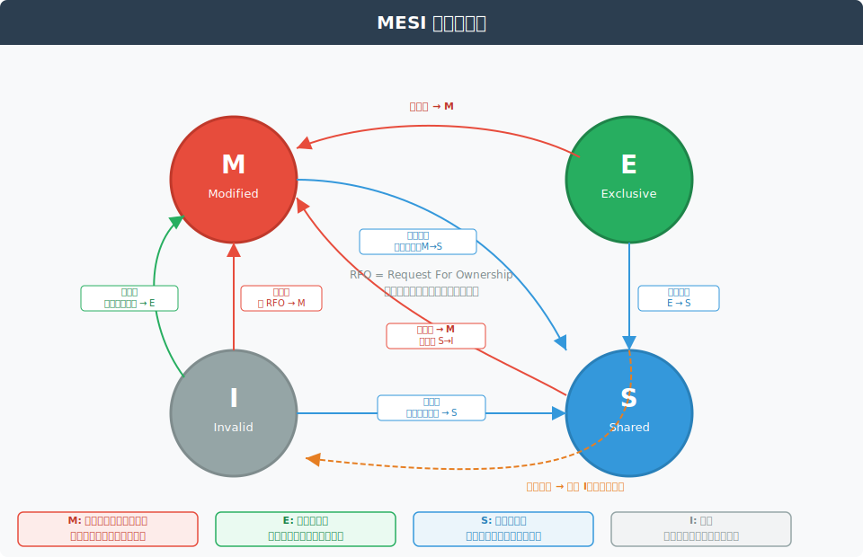
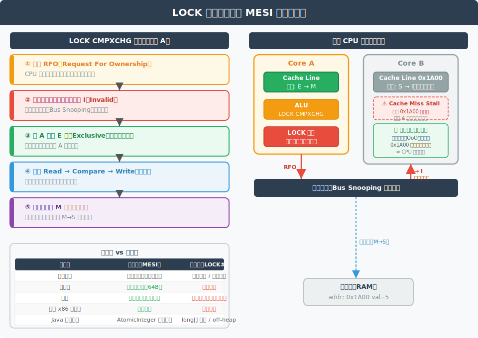
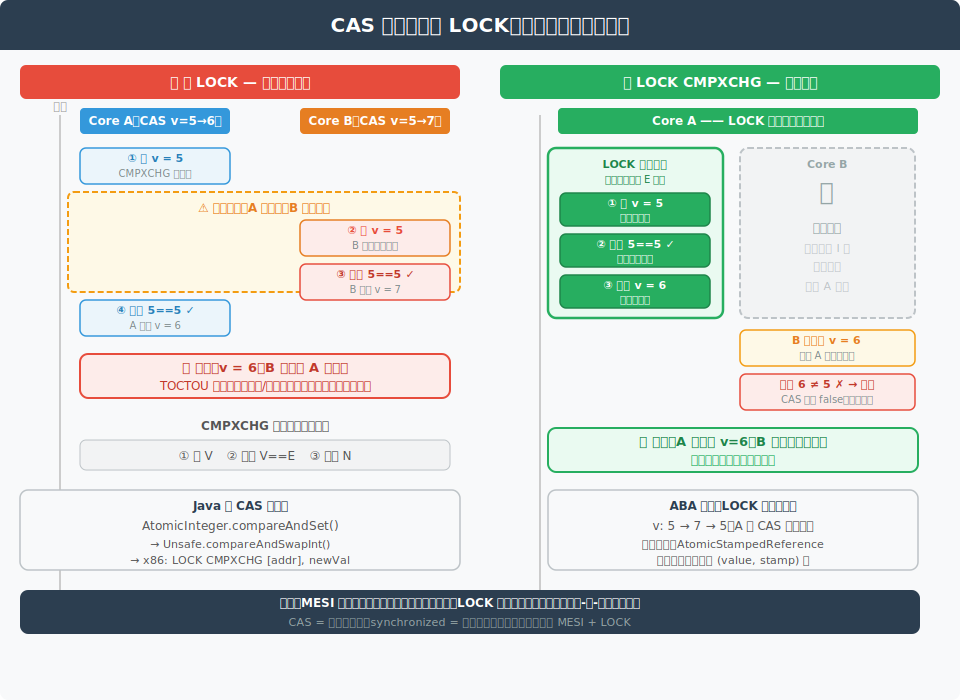
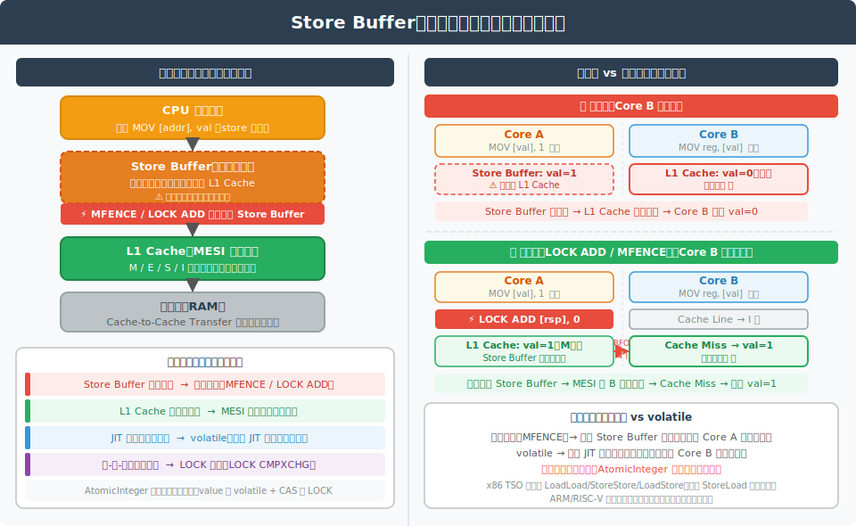
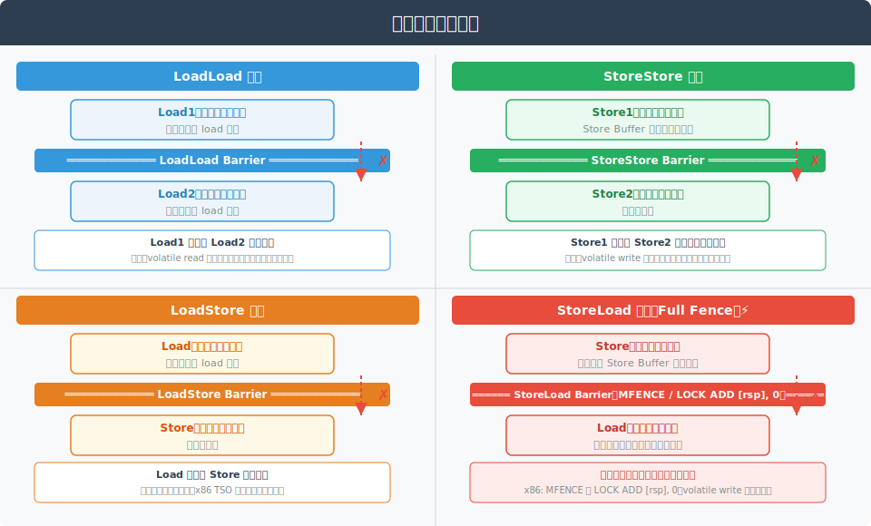
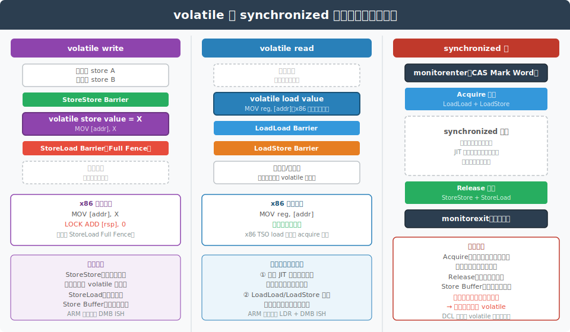
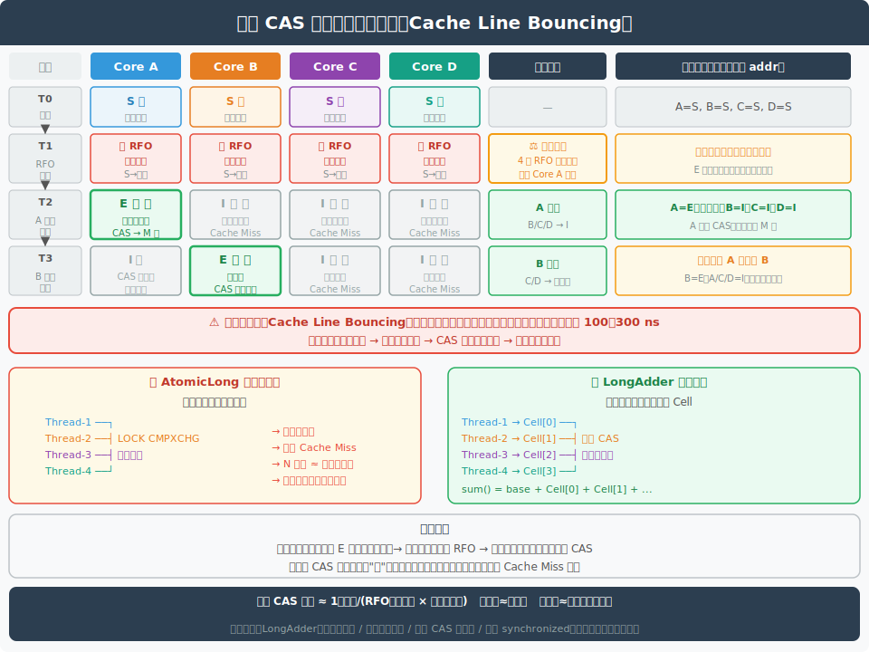

# Java 并发底层原理：MESI 协议与 CAS/LOCK

> 本文档持续更新，后续相关提问也会追加在文末。

---

## 一、MESI 协议概述



MESI 是现代多核 CPU 的**缓存一致性协议**，名称取自四种缓存行状态的首字母。每条缓存行（Cache Line，通常 64 字节）在任意时刻只能处于以下四种状态之一：

| 状态 | 全称 | 独占 | 与内存一致 | 含义 |
|---|---|---|---|---|
| **M** | Modified  | ✅ | ❌ | 已修改，脏数据，仅存于本核 Cache |
| **E** | Exclusive | ✅ | ✅ | 干净，仅存于本核 Cache |
| **S** | Shared    | ❌ | ✅ | 干净，多核 Cache 均持有副本 |
| **I** | Invalid   | ❌ | —  | 缓存行无效，需重新加载 |

### 1.1 关键状态转换规则

```
本地读（其他核无该行）：I → E
本地读（其他核也有）  ：I → S
本地写              ：任意 → M（发 RFO，其他核该行变 I）
其他核读 M 行        ：M → S（先写回内存）
其他核写            ：本核该行强制变 I（总线嗅探）
```

### 1.2 RFO（Request For Ownership）

当某核要写一条它不独占的缓存行时，必须先发出 **RFO 请求**：

1. 广播到总线，通知所有其他核使该缓存行失效（→ I）
2. 等待所有核的 Acknowledgement
3. 获得独占权（E 态），再执行写操作（变 M 态）

---

## 二、MESI 为什么能实现 LOCK（缓存锁）



### 2.1 缓存锁的本质

**核心结论：M 态和 E 态代表当前核对该缓存行的独占所有权。**

当 CPU 执行带 `LOCK` 前缀的指令时：

1. CPU 通过 **RFO** 将目标缓存行提升为 **E（Exclusive）** 态
2. E 态意味着其他所有核的对应缓存行已变为 **I（Invalid）**
3. 当前核在 E 态下独占该缓存行，完成读-改-写，期间无其他核能访问
4. 操作结束，缓存行变为 **M 态**

整个过程不需要锁住内存总线，只通过 MESI 状态机的独占性来保证原子性，这就是**缓存锁**。

### 2.2 缓存锁 vs 总线锁

| | 缓存锁（MESI） | 总线锁（LOCK# 信号） |
|---|---|---|
| **触发条件** | 操作数在单一缓存行内 | 跨缓存行 / 不可缓存内存 |
| **锁粒度** | 单个缓存行（64 字节） | 整条内存总线 |
| **性能** | 高，只影响相关缓存行 | 低，总线锁定期间其他核全部阻塞 |
| **现代 x86 优先级** | 优先使用 | 降级使用 |

> 现代 x86（Nehalem 架构起）优先使用缓存锁；只有操作数跨缓存行或位于不可缓存内存时，才退化为总线锁（拉低 LOCK# 信号）。

---

## 三、CAS 为什么需要 LOCK



### 3.1 CAS 的本质：三步非原子操作

CAS（Compare-And-Swap）的语义是：

```
if (内存值 V == 期望值 E) {
    V = 新值 N;
    return true;
}
return false;
```

对应三步：

```
① 读取内存值  V
② 比较 V 与期望值 E
③ 若 V == E，写入新值 N
```

这三步**本身不是原子的**。步骤 ① 和 ③ 之间存在**竞态窗口（Race Window）**：

```
核 A: 读 V=5 ........... 比较 5==5 ✓ → 写 N=6
核 B:          读 V=5 → 比较 5==5 ✓ → 写 N=7   ← 抢先写入
结果：核 A 的写覆盖核 B（或反之），数据丢失
```

这是典型的 **TOCTOU（Time of Check to Time of Use）问题**。

### 3.2 x86 上的 CAS 实现

Java `Unsafe.compareAndSwapInt` / `VarHandle.compareAndSet` 在 x86 上编译为：

```asm
LOCK CMPXCHG [内存地址], 新值
; EAX 寄存器中预先存放期望值
; ZF 标志位表示是否成功
```

- `CMPXCHG`：Compare and Exchange 指令，**本身不原子**
- `LOCK` 前缀：触发 RFO，在整条 `CMPXCHG` 指令执行期间持有缓存行的独占权

### 3.3 LOCK 如何配合 MESI 保证原子 CAS

```
LOCK CMPXCHG 执行流程：

  1. 发 RFO → 目标缓存行升级为 E 态（其他核→ I）
  2. [独占区间开始]
     ├─ 读取 V
     ├─ 比较 V == E
     └─ 若相等，写入 N（缓存行变 M 态）
  3. [独占区间结束]，释放缓存行独占权
  4. 其他核缓存行仍为 I，下次读时触发一致性同步
```

**LOCK 的作用**：将"读-比-写"三步绑定在一个不可中断的独占窗口中，防止其他核在步骤间插入。

### 3.4 MESI 只保证一致性，不保证原子性

| | MESI 保证 | LOCK 保证 |
|---|---|---|
| **目标** | 多核间缓存数据一致（任意时刻读到最新值） | 多步操作的原子性（读-比-写不可分割） |
| **机制** | 总线嗅探 + 状态转换 | RFO 独占 + 指令级别锁定 |
| **解决问题** | 可见性（Visibility） | 原子性（Atomicity） |

> MESI 让每次"读"都能读到最新值，但无法阻止两次读之间被其他核写入。LOCK 填补了这个间隙。

---

## 四、内存屏障（Memory Barrier）

### 4.0 Store Buffer：屏障存在的根源

在理解内存屏障之前，必须先理解 **Store Buffer**——它是屏障存在的根本原因。

**Store Buffer 是什么**

Store Buffer 是每个 CPU 核私有的写缓冲队列，位于执行单元和 L1 Cache 之间。CPU 执行 `store` 指令时，不直接等待写入 L1 Cache，而是先把写操作存入 Store Buffer，立刻继续执行下一条指令；Store Buffer 中的内容在后台异步提交到 L1 Cache。

**为什么需要它**

写入 L1 Cache 并非免费——若目标缓存行不在本核（I 态），CPU 必须先发 RFO、等待其他核确认才能获得独占权，可能需要 100～300 ns。若每次 `store` 都同步等待，流水线利用率大幅下降。Store Buffer 把等待从关键路径上移除，让 CPU 持续向前执行。

**Store Buffer 带来的问题**

Store Buffer 是本核私有的，其他核看不到其中的内容，只能看到已提交到 L1 Cache 的数据：

```
Core A 写 val=1：
  → val=1 进入 Store Buffer（立即返回）
  → Store Buffer 尚未刷出

Core B 此时读 val：
  → 读 L1 Cache → 仍是旧值 0  ❌（Store Buffer 对 B 不可见）
```

**内存屏障如何解决**

在需要让写立即对其他核可见的地方，插入屏障指令（`MFENCE` / `LOCK ADD [rsp], 0`）：

```
Core A 写 val=1 → Store Buffer
[MFENCE]  ← 强制将 Store Buffer 中所有写全部提交到 L1 Cache
           MESI 随即令其他核该缓存行变为 I 态

Core B 读 val → I 态 → Cache Miss → 从 Core A 获取最新值 1  ✅
```



### 4.1 是什么

内存屏障是 CPU 提供的一类指令，约束两件事：

1. **禁止重排序**：屏障两侧的指令不能越过屏障移动（编译器 + CPU 均受约束）
2. **强制刷出 Store Buffer**：屏障强制把 Store Buffer 中的内容提交到 L1 Cache，让其他核通过 MESI 看到最新值

**范围**：屏障约束的是**两侧全部指令**——屏障前的所有写必须刷出，屏障后的所有读不能提前，不是只管相邻的一条。

### 4.2 四种基本屏障类型

| 屏障 | 禁止的重排 | 含义 |
|------|-----------|------|
| **LoadLoad** | Load1 不能移到 Load2 后面 | Load1 必须在 Load2 之前完成 |
| **StoreStore** | Store1 不能移到 Store2 后面 | Store1 必须在 Store2 之前对其他核可见 |
| **LoadStore** | Load 不能移到 Store 后面 | Load 必须在 Store 之前完成 |
| **StoreLoad** | Store 不能移到 Load 后面 | Store 刷出后，后续 Load 才能执行；**开销最大** |

`StoreLoad` 包含上述全部四种语义，也叫 **full fence（全屏障）**。



### 4.3 x86 上的具体指令

| 作用 | 指令 | 说明 |
|------|------|------|
| Full fence | `MFENCE` | 最重的屏障，四种禁止全包 |
| Full fence（常用替代） | `LOCK ADD [rsp], 0` | 利用 LOCK 前缀副作用充当 full fence，volatile write 常用 |
| Load fence | `LFENCE` | x86 TSO 下 Load 天然有序，几乎不需要 |
| Store fence | `SFENCE` | 仅保证 Store 顺序，不刷 Store Buffer |

> x86 是 **TSO（Total Store Order）** 模型，天然保证 LoadLoad / LoadStore / StoreStore 有序，唯一的弱点是 **StoreLoad 可以乱序**（Store Buffer 延迟刷出）。所以 x86 上几乎只需要 StoreLoad 屏障。

### 4.4 Java 中的屏障：volatile 和 synchronized

**volatile 的屏障插入（JMM 要求）**

```
volatile write：
  [StoreStore 屏障]
  store value
  [StoreLoad 屏障]     ← 最关键，防止写滞留在 Store Buffer

volatile read：
  load value
  [LoadLoad 屏障]
  [LoadStore 屏障]
```

x86 实际生成的指令：

```asm
; volatile write
MOV [addr], val
LOCK ADD [rsp], 0    ; StoreLoad fence（比 MFENCE 略快）

; volatile read
MOV reg, [addr]      ; x86 load 天然有 acquire 语义，无需额外指令
```

**synchronized 的屏障**

```
monitorenter → Acquire 屏障（LoadLoad + LoadStore）
    块内代码
monitorexit  → Release 屏障（StoreStore + StoreLoad）
```



### 4.5 为什么 ARM 比 x86 需要更多屏障

x86 是强内存模型，只有 StoreLoad 可能乱序；ARM/RISC-V 是弱内存模型，四种乱序都可能发生，需要显式插入更多屏障：

```
ARM volatile write：  DMB ISH + STR + DMB ISH
ARM volatile read ：  LDR + DMB ISH
x86 volatile write：  MOV + LOCK ADD（仅防 StoreLoad）
x86 volatile read ：  MOV（天然有序，无需额外指令）
```

同一份 Java 代码，JVM 在 ARM 上产生的屏障指令比 x86 多得多。

### 4.6 屏障、MESI、LOCK 的分工

```
MESI       → 保证缓存间数据一致（可见性的硬件基础）
             管的是"不同核的缓存中，同一地址的值是否一致"
LOCK 前缀  → 保证读-改-写的原子性（CAS 等操作）
             管的是"多步操作不被其他核插入"
内存屏障   → 保证有序性 + 防止 Store Buffer 延迟刷出
             管的是"写操作何时提交到缓存，以及指令顺序"

MESI 管缓存层的一致性，屏障管"何时"把数据送进缓存
```

---

## 五、三者关系总结

```
MESI 协议（硬件基础）
  └─ 提供缓存行的独占状态（E/M 态）
  └─ 是实现"缓存锁"的底层基础
  └─ 保证：可见性

LOCK 前缀（CPU 指令级保证）
  └─ 利用 MESI 的 RFO 机制获取独占权
  └─ 将整条指令的执行绑定在独占窗口内
  └─ 保证：原子性（读-比-写不可分割）

CAS（并发编程原语）
  └─ 本质是读-比较-写三步操作
  └─ 依赖 LOCK + MESI 实现原子性
  └─ Java 原子类、AQS、无锁数据结构的核心
```

| 概念 | 层次 | 解决的问题 |
|---|---|---|
| **MESI** | 硬件缓存一致性协议 | 可见性：多核间缓存数据同步 |
| **LOCK** | CPU 指令前缀 | 原子性：多步操作不可中断 |
| **CAS** | 并发编程原语 | 无锁并发：基于乐观假设实现线程安全 |

---

## 六、Java 并发机制综合梳理

> 从 CAS → synchronized → volatile 的完整串联，理清三者的底层分工。

### 6.1 CAS：LOCK 前缀同时保证原子性、可见性、有序性

Java 的 CAS（如 `AtomicInteger.compareAndSet`）在 x86 上编译为 `LOCK CMPXCHG`。

**缓存锁的实现（MESI）**

`LOCK` 前缀触发 RFO，使目标缓存行升级为 **E 态（独占）**，此时其他核该缓存行变为 **I 态**。在 E 态持续期间，当前核独占执行"读-比-写"三步，其他核无法插入——这就是**缓存锁**。MESI 的独占状态是缓存锁的硬件基础。

**三个保证**

```
原子性：LOCK 持有 E 态期间，读-比-写三步对外不可分割
可见性：LOCK 是 full fence，强制 Store Buffer 刷出到 L1 Cache
        其他核该缓存行变 I，下次读触发 Cache Miss，得到最新值
有序性：LOCK 作为 full fence 边界，其他指令不能越过此边界重排序
        ——不是"CAS指令本身不重排"，而是"周围指令不能穿越这个边界"
```

**其他核在 CAS 期间的行为**

其他核的该缓存行处于 I 态，若此时尝试访问：
- 访问**同一缓存行** → Cache Miss Stall，等待当前核释放后重新加载
- 访问**其他缓存行** → 完全不受影响，乱序执行继续（不是 CPU 整体阻塞）

---

### 6.2 synchronized：边界屏障 + CAS 加解锁

**加锁和释放锁依赖 CAS**

synchronized 的轻量级锁阶段通过 `LOCK CMPXCHG` 竞争 Mark Word；重量级锁的 owner 竞争同样使用 CAS。锁本身的切换走的是 6.1 的路径。

**代码块边界的内存屏障**

synchronized 在代码块两端插入屏障，两端职责不同：

```
monitorenter
  └─ CAS 获取锁（LOCK CMPXCHG）
  └─ Acquire 屏障（LoadLoad + LoadStore）
       作用①：作废本线程寄存器中的所有缓存变量，强制重新从 L1 Cache 读最新值
       作用②：禁止块内的读写被提前到 monitorenter 之前执行

  synchronized 块内
  └─ JIT 可在块内把变量缓存在寄存器（互斥保证同一时刻只有一个线程在块内，安全）

  Release 屏障（StoreStore + StoreLoad）
       作用①：强制把 Store Buffer 中所有写刷出到 L1 Cache，写对全局可见
       作用②：禁止块内的读写被延后到 monitorexit 之后执行
  └─ 释放锁
monitorexit
```

**未走锁的线程不受任何保护**

```java
// Thread-A（走锁）
synchronized(lock) { flag = true; }  // monitorexit 刷出写

// Thread-B（走锁）
synchronized(lock) { read flag; }    // monitorenter 作废寄存器，读到最新值 ✅

// Thread-C（不走锁）
if (flag) { ... }                    // 无 monitorenter，JIT 可寄存器缓存 flag
                                     // 可能永远读到旧值 ❌
```

Thread-C 没有 monitorenter，JIT 不受约束，可以把 `flag` 锁在寄存器里，完全感知不到 A 的写。**所有访问路径都必须走同一同步机制，缺一不可。**

---

### 6.3 volatile：字段级持续屏障

volatile 解决的是 synchronized 块外访问（如 Thread-C 的问题）——它作用于**字段的每一次读写**，而非某个代码块的边界。

**两个层次的保证**

```
① 禁止 JIT 把该变量缓存在寄存器（编译器屏障）
   → 每次读写都强制落到 L1 Cache，MESI 保证多核间缓存一致

② 插入内存屏障，禁止相关指令重排序：
   volatile write：[StoreStore] → store → [StoreLoad]
   volatile read ：load → [LoadLoad][LoadStore]
```

**volatile write 的全局效果**

```java
int a = 1;          // → Store Buffer
int b = 2;          // → Store Buffer
volatile int v = 3; // MOV [v], 3
                    // LOCK ADD [rsp], 0  ← StoreLoad Full Fence
                    // a=1, b=2, v=3 三个写全部刷出，其他核对应缓存行变 I
```

volatile 写之前的**所有写操作**，在 volatile 写刷出后对全局同时可见——这是**安全发布（Safe Publication）**的底层基础。

**x86 上的实际开销**

```
volatile write：MOV + LOCK ADD [rsp], 0  （StoreLoad fence，有额外开销）
volatile read ：MOV                       （x86 TSO load 天然有 acquire 语义，无额外指令）
```

---

### 6.4 三者协作全景

```
场景：Thread-A CAS 写，Thread-B synchronized 读，Thread-C volatile 读

Thread-A  LOCK CMPXCHG
  原子性：E 态独占，读-比-写不可分割
  可见性：Store Buffer 刷出，B/C 的缓存行变 I
  有序性：其他指令不能越过 LOCK 边界重排序

Thread-B  synchronized(lock) { read x; }
  monitorenter Acquire 屏障：作废寄存器，重新从 L1 读
  → 能看到 A 的写 ✅（前提：B 在 A unlock 之后才 lock）
  monitorexit  Release 屏障：自己的写刷出

Thread-C  read x;（不走锁，x 无 volatile）
  无 monitorenter → JIT 可寄存器缓存
  → 可能永远读到旧值 ❌

Thread-C  read volatile_x;（volatile 变量）
  编译器屏障：禁止寄存器缓存
  LoadLoad 屏障：读到后续读不提前
  → 每次都走 L1 Cache，MESI 保证是最新值 ✅
```

| 机制 | 层次 | 原子性 | 可见性 | 有序性 | 覆盖范围 |
|------|------|--------|--------|--------|----------|
| **LOCK CMPXCHG** | 硬件指令 | ✅ 读-比-写不可分 | ✅ 刷出 Store Buffer | ✅ full fence 边界 | 仅该指令边界 |
| **synchronized** | JVM 块级 | ✅ 互斥 | ✅ 块内读写（enter/exit 边界） | ✅ 块内 | 仅块内 + 参与排队的线程 |
| **volatile** | JVM 字段级 | ❌ | ✅ 每次读写 | ✅ 每次读写 | 该字段所有访问路径 |

---

## 七、常见面试问题

### Q1：volatile 能保证原子性吗？和 MESI 什么关系？

**答**：不能。`volatile` 通过**内存屏障（Memory Barrier）** 禁止指令重排，并强制读写直接操作内存（绕过 Store Buffer），保证**可见性和有序性**，但不保证原子性。

MESI 本身保证了读到最新值（可见性），`volatile` 的写屏障（`SFENCE`/`MFENCE`）是在 MESI 基础上进一步防止 Store Buffer 延迟刷新。`volatile` 的 `i++` 仍然不是原子的，因为 `i++` 是读-改-写三步，没有 `LOCK` 保护。

### Q2：synchronized 和 CAS 的底层区别？

**答**：

```
synchronized：
  JVM 层面的互斥锁，底层通过 monitorenter/monitorexit 字节码
  轻量级锁阶段：使用 CAS（LOCK CMPXCHG）争夺锁对象的 Mark Word
  重量级锁阶段：OS mutex，线程挂起，涉及上下文切换

CAS：
  纯用户态操作，不涉及内核
  失败时自旋重试（消耗 CPU），适合冲突低的场景
  高冲突下自旋开销大，不如 synchronized 让线程挂起
```

### Q3：CAS 的 ABA 问题是什么？如何解决？

**答**：LOCK 保证了"读-比-写"的原子性，但无法感知值的历史变化。若值从 A→B→A，CAS 仍然认为没有变化并成功写入，但实际上数据已被修改过两次。

解决方案：`AtomicStampedReference` 将比较目标从 `(value)` 改为 `(value, stamp)` 二元组，每次修改都递增 stamp，使得 ABA 变为 `(A,1)→(B,2)→(A,3)`，第三次 CAS 比较 stamp 不等而失败。

### Q4：为什么 long/double 的写操作在 32 位 JVM 上不是原子的？

**答**：32 位 CPU 的寄存器宽度为 32 位，写 64 位的 `long`/`double` 需要两条 32 位写指令（写高 32 位 + 写低 32 位）。两条指令之间存在竞态窗口，其他线程可能读到"半写"状态。`volatile long` 在 JVM 规范中强制要求原子写，因此需要 `LOCK` 前缀来保证。64 位 JVM 上单次写即可完成，无此问题。

### Q5：MESI 在 NUMA 架构下有何变化？

**答**：NUMA（Non-Uniform Memory Access）下，每个 CPU Socket 有本地内存，跨 Socket 内存访问延迟更高。MESI 协议仍然有效，但 RFO 请求需要经过**跨 NUMA 节点的互联总线**（如 Intel QPI/UPI），延迟大幅上升（约 3-5 倍）。因此在 NUMA 架构下，**False Sharing（伪共享）** 的危害更大，需要通过缓存行填充（`@Contended`）来避免不同核的数据落在同一缓存行。

### Q6：缓存锁会阻塞其他 CPU 吗？

**答**：不会阻塞其他 CPU 访问**其他缓存行**，这正是缓存锁区别于总线锁的核心优势。

当 Core A 持有某缓存行的 E 态（执行 LOCK CMPXCHG 期间）：

```
Core B 访问不同缓存行  → 完全不受影响，正常执行
Core B 访问同一缓存行  → 发出 BusRd 请求，等待 Core A 响应
                         此时 Core B 在该缓存行上产生 Cache Miss Stall
                         但 Core B 仍可乱序执行其他不依赖该行的指令
```

| | 缓存锁（MESI E 态） | 总线锁（LOCK# 信号） |
|---|---|---|
| 其他 CPU 访问不同缓存行 | ✅ 不受影响 | ❌ 全部阻塞 |
| 其他 CPU 访问同一缓存行 | Cache Miss Stall（指令级，极短暂） | ❌ 阻塞 |
| 阻塞粒度 | 单条缓存行 | 整条内存总线 |

文档 SVG 中 "Core B 阻塞" 画的是 **Cache Miss Stall**，即 B 等待 A 归还该缓存行的所有权，并非 CPU 整体挂起。总线锁才是真正意义上阻塞所有 CPU 的所有内存访问。

### Q7：多个线程同时 CAS 会发生什么？会互相独占吗？

**答**：不会同时独占。E 态在物理上只能由一个核持有，多核同时发 RFO 时由**总线仲裁**串行化决出胜者。



**竞争过程**：

```
T0：A/B/C/D 均持有该缓存行的 S 态副本

T1：四核同时发 RFO（请求独占）
    → 总线仲裁：同一时刻只允许一个 RFO 赢得独占
    → 假设 Core A 胜出

T2：Core A → E 态（独占），B/C/D → I 态（强制失效）
    Core A 完成 CAS（读-比-写），缓存行变 M 态

T3：B/C/D 重新发 RFO 竞争，Core B 胜出
    缓存行从 A 转移到 B（A 写回，B 获得 E 态）
    B 读到新值，CAS 失败 → 重试

T4：C、D 依次重复 T3 过程……
```

**缓存行颠簸（Cache Line Bouncing）**：

同一缓存行在多核间反复转移所有权，每次转移需要一次 RFO 往返（约 100～300 ns）。线程越多，颠簸越频繁，CAS 自旋的实际开销越大。

| 竞争程度 | 典型延迟 | 行为 |
|---|---|---|
| 低（几乎无冲突） | ~5 ns | 缓存行常驻本核，基本无 RFO |
| 中（偶发冲突） | ~50 ns | 偶尔 RFO，少量颠簸 |
| 高（激烈竞争） | ~300 ns/次 | 大量 RFO，缓存行在核间频繁转移 |

**为什么高冲突下 `LongAdder` 优于 `AtomicLong`**：

```
AtomicLong：所有线程争同一缓存行 → 串行化 → N 线程吞吐 ≈ 单线程

LongAdder ：按线程哈希分配到不同 Cell（不同缓存行）
            → 各 Cell 独立 CAS，无跨核争用
            → sum() 时才聚合各 Cell 值
            → 高并发吞吐随线程数线性扩展
```

**CAS 高冲突时的选择策略**：

```
冲突低   → CAS（AtomicXxx）：纯用户态，延迟最低
冲突中   → LongAdder / 分段锁：分散热点
冲突高   → synchronized（重量级）：让线程挂起，避免自旋浪费 CPU
```

### Q8：缓存行独占期间其他 CPU 是 I 态，它想读写该缓存行时能直接去内存吗？

**答**：不能直接去内存，必须走总线一致性协议，且数据来源不一定是内存，可能直接来自持有 M 态的核（Cache-to-Cache Transfer）。

**为什么不能绕过协议直接读内存？**

若持有者是 M 态（脏数据），内存里的值是旧的，直接读内存会得到错误数据：

```
Core A: M 态，本地缓存 val=6（未写回内存）
内存:   val=5（旧值）

Core B 直接去内存 → 读到 5  ← 数据错误
Core B 走协议     → 从 Core A 得到 6  ← 正确
```

**LOCK 期间 vs LOCK 释放后的行为差异**

```
LOCK 期间（Core A 持有 E 态执行 CMPXCHG）：
  Core B 发 BusRd → 挂在总线上等待
  Core A 不响应，直到 LOCK 指令完成
  → 这就是 Cache Miss Stall（请求在排队，不是被拒绝）

LOCK 完成后（Core A 释放为 M 态）：
  Core B 的 BusRd 被处理，Core A 嗅探到
  进入下方两种响应方式之一
```

**实际数据来源：优先 Cache-to-Cache，而非内存**

| 方式 | 流程 | 速度 |
|---|---|---|
| **Cache-to-Cache Transfer**（现代 CPU 优先） | Core A 直接将数据发给 Core B；A: M→S，B: I→S | 快，省去内存往返 |
| **Write-Back + Memory Supply** | Core A 先写回内存（M→S/I），Core B 再从内存加载（I→S） | 慢，多一次内存往返 |

Intel 称之为 **Modified Intervention**，AMD 有类似机制。两种方式对软件透明，由硬件自动选择。

**完整路径总结**

```
Core B（I 态）想访问 0x1A00
  │
  ├─ 读操作 → 发 BusRd
  │     Core A 响应（LOCK 结束后）
  │     ├─ Cache-to-Cache：A 直接供数据 → A:M→S，B:I→S
  │     └─ Write-Back：A 写回内存 → B 从内存读 → 两者均 S
  │
  └─ 写操作 → 发 BusRdX（请求独占）
        Core A 响应，放弃所有权
        B 获得 E 态，可写入 → B:I→E→M
```

### Q9：Cache Miss Stall 期间 CPU 还能处理其他指令吗？如果只剩这一条呢？

**情况一：还有其他无关指令——OoO 引擎隐藏 Cache Miss**

现代 CPU 的乱序执行（Out-of-Order Execution）引擎会在等待缓存行期间继续挑选**不依赖该缓存行**的指令执行：

```
流水线各阶段：
Fetch → Decode → Issue → Execute → Writeback → Retire（ROB 顺序退休）

Cache Miss 时：
  stalled_load（等 0x1A00）→ 停在 ROB 中，标记"等待"
  其他无关指令            → 继续乱序执行、写回
  → CPU 仍在做有效工作，Cache Miss 延迟被"隐藏"
```

关键组件：
- **ROB（Reorder Buffer）**：保存乱序执行中的所有指令；结果必须按原始顺序退休（Retire）
- **MSHR（Miss Status Holding Register）**：记录未完成的 Cache Miss 请求，可同时跟踪多个未命中（Memory-Level Parallelism）
- **Reservation Station**：指令在此等待操作数就绪，就绪即可乱序发射

**情况二：只剩这一条指令——流水线真正停摆**

当 ROB 中所有后续指令都直接或间接依赖这条 stalled load 时：

```
1. stalled_load 卡在 ROB 头部，无法 Retire
2. 后续依赖指令全部在 Reservation Station 等待操作数
3. ROB 逐渐被填满（新指令入队但无法退出）
4. ROB 满 → Fetch/Decode 级被反压，停止取新指令
5. 整条流水线排空，CPU 空转等待内存响应
```

此时 CPU 的等待成本取决于数据从哪里来：

| 数据来源 | 典型延迟 | 说明 |
|---|---|---|
| L1 命中（正常情况） | ~4 周期 | 无 stall |
| L2 命中 | ~12 周期 | 轻微 stall |
| L3 命中 | ~40 周期 | 明显 stall |
| Cache-to-Cache（其他核 M 态） | ~60-100 周期 | 跨核协议开销 |
| 主内存 | ~200-300 周期 | 流水线完全排空 |

**两种情况对比**

```
有无关指令：
  [stalled_load] ← 等待
  [instr B     ] ← 乱序执行 ✅
  [instr C     ] ← 乱序执行 ✅
  Cache Miss 延迟被有效指令填满，IPC（每周期指令数）不掉零

只剩这一条：
  [stalled_load] ← 等待
  [依赖 load 的指令 B] ← 等操作数，无法发射
  [依赖 B 的指令 C   ] ← 等操作数，无法发射
  ROB 满 → Fetch 停止 → CPU 空转
  IPC ≈ 0，所有周期浪费在等待内存响应上
```

**对 Java 并发的启示**

高冲突 CAS 自旋（`while (!cas(...)) {}`）的循环体极短，几乎没有无关指令可供 OoO 调度。每次 CAS 失败后重新读变量又触发新的 Cache Miss，流水线反复排空，这正是高冲突下 CAS 吞吐急剧下降的微架构根因。

### Q10：Java 所有并发底层都是 LOCK 前缀下的缓存锁/总线锁吗？

**答**：覆盖了**原子性**这个维度，但 Java 并发还有另外两个维度，底层机制不同。

**并发的三个维度与对应底层**

| 维度 | 解决问题 | 底层机制 |
|---|---|---|
| **原子性** | 读-改-写不可分割 | `LOCK CMPXCHG`（缓存锁/总线锁）✅ 你的理解覆盖此层 |
| **有序性** | 禁止指令重排，保证 happens-before | 内存屏障（`MFENCE` / `LOCK ADD` 作 fence） |
| **线程阻塞** | 竞争失败时让出 CPU，避免空转 | `futex` 系统调用 → OS 内核调度器 |

---

**原子性层：LOCK CMPXCHG（你的理解正确）**

Java 中所有需要原子读-改-写的场景，最终都是 `LOCK CMPXCHG`：

```
AtomicInteger.compareAndSet()
  └─ Unsafe.compareAndSwapInt()
       └─ x86: LOCK CMPXCHG

synchronized 轻量级锁（Mark Word CAS）
  └─ x86: LOCK CMPXCHG

AQS.compareAndSetState()（ReentrantLock / CountDownLatch / Semaphore）
  └─ x86: LOCK CMPXCHG

synchronized 重量级锁的 owner 竞争
  └─ ObjectMonitor::enter 内部 CAS
       └─ x86: LOCK CMPXCHG
```

---

**有序性层：内存屏障（不是 LOCK CMPXCHG 的职责）**

`volatile` 写不需要 CAS，它的作用是**禁止 Store Buffer 延迟刷新、防止指令重排**：

```
volatile write 在 x86 上编译为：
  MOV [addr], val          ← 普通写
  LOCK ADD [rsp], 0        ← 利用 LOCK 前缀的副作用充当 StoreLoad 屏障
  （或 MFENCE）

目的是"有序性"，不是"原子性"
```

> x86 内存模型（TSO）已经很强，大多数屏障是为了对抗 Store Buffer，而非 MESI 本身。ARM/RISC-V 内存模型更弱，需要显式 `DMB`/`DSB` 指令。

---

**线程阻塞层：futex（超出 LOCK 前缀的范畴）**

这是与你理解存在差异的地方。当 synchronized 升级为**重量级锁**后，竞争失败的线程不能再自旋，必须真正挂起：

```
synchronized 重量级锁竞争失败：

  Java 层：  ObjectMonitor::enter → CAS 失败 → EnterI()
  JVM 层：   os::PlatformEvent::park()
  系统调用：  futex(FUTEX_WAIT, addr, expected, ...)
              ↓
  Linux 内核：将线程加入等待队列，调用 schedule() 让出 CPU
              ↓
  OS 调度器：选下一个 Runnable 线程运行

  锁释放时：
  系统调用：  futex(FUTEX_WAKE, addr, 1)
  OS 调度器：将等待线程移回 Runnable 队列
```

`futex` 是系统调用，需要**用户态→内核态切换**，涉及 OS 调度器和内核等待队列，与 `LOCK CMPXCHG` 是完全不同的机制。

---

**synchronized 完整的底层分层**

```
偏向锁（Biased Lock）
  └─ 无 CAS，仅比较线程 ID（epoch 机制）
  └─ 撤销时需 STW + CAS

轻量级锁（Thin Lock）
  └─ CAS Mark Word → LOCK CMPXCHG  ← MESI/缓存锁

重量级锁（Fat Lock / ObjectMonitor）
  └─ owner 竞争：CAS → LOCK CMPXCHG  ← MESI/缓存锁
  └─ 竞争失败挂起：futex(FUTEX_WAIT)  ← OS 内核
  └─ 锁释放唤醒：futex(FUTEX_WAKE)   ← OS 内核
```

---

**总结**

```
Java 并发底层 ≠ 只有 LOCK CMPXCHG

完整图景：
  原子性  →  LOCK CMPXCHG（缓存锁/总线锁）← 你的理解覆盖此层
  有序性  →  内存屏障（MFENCE / LOCK ADD as fence）
  阻塞    →  futex + Linux 内核调度器

三者分工不同，共同构成 Java 并发的硬件与 OS 基础
```

LOCK 前缀是"用户态原子操作"的唯一底座；一旦线程需要**真正挂起让出 CPU**，就越过了 LOCK 前缀的边界，进入 OS 内核的领域。

### Q11：CAS 本身已有缓存锁保证原子性和可见性，为什么字段还要加 volatile？

**答**：MESI 工作在**硬件缓存层**，volatile 工作在 **JVM/JIT 编译器层**，两者解决的不是同一个问题。

**MESI + LOCK 能保证什么**

`LOCK CMPXCHG` 执行时：
1. 通过 RFO 获得缓存行独占权（E 态）
2. 其他核该缓存行变 I，执行完后必须重新从缓存/其他核获取新值
3. Store Buffer 被强制刷出（x86 上 LOCK 前缀兼具 full fence 效果）

所以对于 CAS 操作本身，原子性和可见性都有保证。

**volatile 解决的问题：JIT 的寄存器缓存**

问题不出在 CAS，而出在**普通读**（如 `AtomicInteger.get()`）：

```java
// AtomicInteger 源码
private volatile int value;

public final int get() {
    return value;          // 这是一次普通 load，没有 LOCK 前缀
}
```

JIT 编译器工作在**缓存层之上**，它可以把频繁读取的变量提升到 CPU 寄存器：

```
// 没有 volatile 时，JIT 可能生成：
int reg = value;          // 只读一次，放进寄存器
while (reg != expected) { // 永远读寄存器，看不到其他核的写
    ...
}

// 有 volatile 后，JIT 被禁止提升，每次都必须从缓存读：
while (value != expected) { // 每次都走缓存，MESI 保证读到最新值
    ...
}
```

**寄存器在 MESI 体系之外**——MESI 协议只管缓存行，CPU 寄存器里的值对其他核完全不可见，也不参与任何一致性协议。volatile 的本质是告诉 JIT：**这个变量不能缓存在寄存器里，每次读写必须落到缓存**，再由 MESI 保证缓存间的一致性。

**两者分工**

```
访问路径（从快到慢）：
  CPU 寄存器  ←── JIT 优化可能把变量缓存在这里（MESI 管不到）
       ↓  volatile 禁止在此停留
  Store Buffer ←── 写操作先到这里（LOCK 前缀会强制刷出）
       ↓  LOCK / 内存屏障 保证刷出
  L1/L2/L3 Cache ←── MESI 在这一层保证多核一致性
       ↓
  主内存
```

| | MESI + LOCK CMPXCHG | volatile |
|---|---|---|
| **作用层** | 硬件缓存层 | JVM/JIT 编译器层 |
| **解决** | CAS 操作本身的原子性、Store Buffer 刷出 | 普通读禁止寄存器缓存、内存屏障语义 |
| **影响范围** | 仅 LOCK 指令执行期间 | 字段的所有读写路径 |
| **跨架构** | x86 LOCK 已足够；ARM 需显式屏障 | JMM 规范要求，JVM 在各架构上自动插入正确屏障 |

**在 x86 上 volatile 对 CAS 本身无额外硬件开销**

x86 的 `LOCK CMPXCHG` 已经是 full fence，volatile 对 CAS 操作本身不会多产生任何指令。volatile 的代价在于**普通 get/set**：

```
volatile read  (x86)：普通 MOV，无额外指令（TSO 模型 load 自带 acquire 语义）
volatile write (x86)：MOV + LOCK ADD [rsp], 0（StoreLoad fence，防 Store Buffer 滞留）
volatile read  (ARM)：MOV + DMB ISH（显式 LoadLoad 屏障）
volatile write (ARM)：DMB ISH + STR + DMB ISH
```

### Q12：LOCK 前缀自带原子性、有序性、可见性，这个理解对吗？

**答**：对，但有范围限制——这三个保证只作用在 LOCK 指令这一条边界上，不覆盖周围的普通读写。

**LOCK 在 x86 上确实同时提供三个保证**

```
原子性：LOCK CMPXCHG 整条指令不可分割（读-比-写三步绑定）
可见性：Store Buffer 强制刷出 + MESI 使其他核缓存行变 I → 写立即对全局可见
有序性：等价于 MFENCE（full fence），LoadLoad / LoadStore / StoreStore / StoreLoad 四种重排全部禁止
```

**范围限制：只是"一个点"上的保证**

```
普通 store A   ──┐
普通 store B   ──┤ LOCK 之前的写，被 fence 强制提交，对其他核可见
                 ↓
           LOCK CMPXCHG  ← full fence 边界
                 ↓
普通 load  C   ──┤ LOCK 之后的读，JIT 仍可寄存器缓存，不受保护
普通 load  D   ──┘
```

LOCK 边界之外的普通读写没有保护：
- **普通 store**：进 Store Buffer，延迟可见，需要 volatile write 加 StoreLoad fence
- **普通 load**：JIT 可提升到寄存器，MESI 管不到寄存器，需要 volatile read 禁止 JIT 缓存

**LOCK 与 volatile 的互补关系**

| | LOCK 前缀 | volatile |
|---|---|---|
| 覆盖范围 | 仅 LOCK 指令这条边界 | 字段所有读写路径 |
| 原子性 | ✅ | ❌（volatile 不保证原子性）|
| 可见性 | ✅ 仅 LOCK 操作本身 | ✅ 字段的所有普通读写 |
| 有序性 | ✅ 仅 LOCK 边界 | ✅ 字段所有访问的 happens-before |

**一句话**：LOCK 是**一个点**上的全能保证，volatile 是**一个字段所有访问路径**上的持续保证，两者互补而非替代。

### Q13：volatile + synchronized 是否同理？synchronized 底层不也是 LOCK 吗？

**答**：synchronized 确实在 monitorenter/monitorexit 边界处使用了 LOCK 等价指令，也自带原子性、可见性、有序性——但同样只在**块边界**这两个点上生效，不覆盖块外的普通访问。

**synchronized 的内存语义发生在哪里**

```
monitorenter
  └─ CAS Mark Word（LOCK CMPXCHG）获取锁
  └─ LoadLoad + LoadStore fence（acquire）← 保证进入块时读到最新值

    synchronized 块内部
    ← JIT 仍可在块内部把变量缓存在寄存器（因为持锁期间无其他线程能进来，缓存是安全的）

monitorexit
  └─ StoreStore + StoreLoad fence（release）← 保证退出块时写全部提交
  └─ CAS/store 释放锁
```

所以 synchronized 对**块内访问的字段**是完整保护的，在 monitorenter 拿到最新值、在 monitorexit 把所有写刷出。

**但块外的访问没有保护**

```java
// 变量只在 synchronized 块内访问 → volatile 多余，synchronized 已够
private int count;
synchronized void increment() { count++; }

// 变量在块外也被读取 → volatile 必须加
private boolean flag;
synchronized void setFlag()  { flag = true; }   // 块内写，monitorexit 刷出
void check() { if (flag) { ... } }               // 块外读，没有 monitorenter！
                                                 // JIT 可寄存器缓存，读到旧值
```

**最典型的反例：DCL（双重检查锁）**

```java
// 错误写法：instance 不加 volatile
private Instance instance;

public Instance getInstance() {
    if (instance == null) {             // ① 块外读，无保护
        synchronized (this) {
            if (instance == null) {
                instance = new Instance(); // ② new 分三步：分配内存 / 初始化 / 赋引用
            }                              //   JIT 可重排为：分配 / 赋引用 / 初始化
        }
    }
    return instance;                    // ③ 块外读，无保护
}
```

问题有两个：
1. `new Instance()` 在 synchronized 块内，但 JIT 可以将"赋引用"重排到"初始化对象"之前。另一个线程在 ① 处看到非 null 的引用，却拿到一个**未初始化完成的对象**。
2. ① 和 ③ 是块外普通读，JIT 可寄存器缓存，看不到块内的写。

```java
// 正确写法：加 volatile
private volatile Instance instance;
// volatile 写屏障禁止 new 的三步被重排
// volatile 读屏障保证 ① ③ 每次都从缓存读，不走寄存器
```

**synchronized 与 volatile 的边界对比**

```
synchronized：
  monitorenter ←── acquire fence（一个点）
  [块内可寄存器缓存，因为互斥保证安全]
  monitorexit  ←── release fence（一个点）
  块外无任何保护

volatile：
  每一次读  ←── acquire 语义（禁止 JIT 寄存器缓存）
  每一次写  ←── release 语义 + StoreLoad fence
  覆盖字段所有访问点，无论在不在 synchronized 块内
```

| | synchronized | volatile |
|---|---|---|
| 原子性 | ✅ 块整体互斥 | ❌ |
| 可见性（块内） | ✅ enter/exit fence 覆盖 | ✅ |
| 可见性（块外） | ❌ 无保护 | ✅ 每次访问都保证 |
| 有序性（块内） | ✅ | ✅ |
| 有序性（块外跨线程） | ✅ unlock happens-before lock | ✅ write happens-before read |
| 禁止块内指令重排 | ❌（互斥安全，无需禁止） | ✅ 每次读写都插屏障 |

**结论**

synchronized 和 LOCK 一样，都是**边界点**上的全能保证，而非字段级别的持续保证。

```
字段只在 synchronized 块内访问  → volatile 多余
字段在块外也被访问              → volatile 必须加（DCL 是最典型的例子）
```

### Q14：synchronized 只是让进入代码块的线程排队，不进队的线程还是能随意访问字段？

**答**：完全正确。synchronized 约束的是**参与排队的线程**，对**绕过不排队的线程**没有任何约束力。

```
Thread-A: synchronized(lock) { flag = true; }
           ↑ monitorexit release fence，写刷出缓存

Thread-B: synchronized(lock) { read flag; }
           ↑ monitorenter acquire fence，能看到 A 的写 ✅
           （B 走了同一把锁，happens-before 链完整）

Thread-C: if (flag) { ... }   // 根本不走这把锁
           ↑ 没有 monitorenter，没有 acquire fence
           ↑ JIT 可把 flag 缓存在寄存器，MESI 管不到寄存器
           ↑ 看不到 A 的写 ❌
```

**JMM happens-before 的角度**

JMM 规定：synchronized 建立的 happens-before 是 **"unlock → 后续对同一把锁的 lock"**。Thread-C 根本没有 lock 动作，happens-before 链在此断掉，可见性无从谈起。

**线程安全的完整要求**

> 所有对该字段的访问路径（读和写）都必须经过同一个同步机制，缺一不可。

```
只保护写，不保护读 → 读线程绕过同步，看到旧值
只保护读，不保护写 → 写线程绕过同步，写不可见

volatile 满足这一点：字段每一次读写都插屏障，不存在绕过的可能
synchronized 不满足：只约束主动进入代码块的线程
```

### Q15：B 线程进入 synchronized 后为什么不会读 JIT 寄存器的旧值？

**答**：因为 `monitorenter` 同时做了两件事：对 JIT 插入编译器屏障，以及对硬件插入 acquire fence，两者共同保证 B 必须从缓存重新加载。

**完整的两步可见性保证**

```
Thread-A monitorexit
  ① release fence：Store Buffer 刷出，flag=true 提交到 L1 缓存
  ② MESI：其他核持有该缓存行的副本变为 I 态

Thread-B monitorenter（发生在 A 的 monitorexit 之后，互斥保证）
  ③ JIT 编译器屏障：强制作废所有寄存器中缓存的变量值
  ④ acquire fence：之后的 load 不得重排到此线之前

  B 读 flag
  → 寄存器已被作废（步骤 ③），必须走缓存
  → 缓存行是 I 态（步骤 ②），触发 Cache Miss
  → 从 A 的缓存或内存取到最新值 true ✅
```

**Thread-C 为什么不行**

```
Thread-C 没有 monitorenter
  → JIT 没有编译器屏障，寄存器旧值不会被作废
  → 即使硬件缓存行因 MESI 已经是 I 态，JIT 根本不去读缓存
  → 一直使用寄存器里的旧值 ❌
```

**互斥带来时序，时序保证 happens-before**

B 的 monitorenter 能看到 A 的写，根本前提是互斥锁保证了**时序**：B 一定在 A 释放锁之后才能获得锁。没有这个时序，步骤 ①②③④ 的组合就没有意义。Thread-C 绕过了锁，这条时序链不存在，可见性自然无从谈起。

```
有锁路径（B）：  A.unlock ──happens-before──▶ B.lock ──▶ B 读到最新值
无锁路径（C）：  A.unlock                      C.read  ──▶ happens-before 链断裂
```

---

### Q16：内存屏障是加在 synchronized CAS 切换 owner 的 LOCK 上的，它只对那一条指令生效，为什么代码块内部的字段也能保证可见性？

**答**：屏障不是加在 CAS 操作本身上，而是插在 `monitorenter` / `monitorexit` 指令的前后，效果覆盖整个代码块。

**屏障的插入位置**

```
monitorenter
  ↓
[Acquire 屏障]  ← 插在这里（LoadLoad + LoadStore fence）
────────────────────────────────────────
  synchronized 块内的所有读写           ← 全部被屏障"保护"
────────────────────────────────────────
[Release 屏障] ← 插在这里（StoreStore + StoreLoad fence）
  ↓
monitorexit
```

- **Acquire 屏障**（monitorenter 之后）：禁止块内的读写**上移**到锁获取之前，且作废寄存器中的变量缓存，强制从缓存重新加载
- **Release 屏障**（monitorexit 之前）：禁止块内的读写**下移**到锁释放之后，并强制将 Store Buffer 中的写刷出到缓存（MESI 随即令其他核对应缓存行变 I）

**为什么必须覆盖整个块**

如果屏障只作用于 CAS 切换 owner 的那一条指令，那 CAS 之后、monitorexit 之前的所有普通写操作仍可留在 Store Buffer 里、甚至被 JIT 乱序到锁释放之后，其他核就看不到这些写。这会直接破坏 JMM 的监视器锁规则：

```
Thread-A
  synchronized(lock) {
      x = 1;   // ← Release 屏障保证此写在 monitorexit 时刷出，对全局可见
      y = 2;
  }

Thread-B
  synchronized(lock) {
      // Acquire 屏障 + 互斥保证 B 一定在 A 释放后进入
      // 作废寄存器缓存 → 重新从缓存读 → MESI 保证读到最新值
      System.out.println(x); // 一定是 1 ✅
      System.out.println(y); // 一定是 2 ✅
  }
```

若屏障只覆盖 CAS 那一条指令，x=1 和 y=2 可能还在 Store Buffer 中，B 读到旧值，可见性失效。

**CAS 自带的 Full Fence 是另一回事**

`LOCK CMPXCHG` 作为 x86 上的 full fence，是为了保证 **CAS 操作自身的原子性**（读-比-写三步不可分割），顺带刷出执行时刻之前的 Store Buffer——这是 CAS 争抢 owner 时的副产物，不是 synchronized 块内代码可见性的来源。

**JMM 语义层面的对应**

JMM 监视器锁规则：**unlock 之前的所有操作 happens-before 后续对同一把锁的 lock 之后的所有操作**。这个"所有操作"指的是整个块内的读写，因此屏障必须覆盖整个块才能满足该规则。

```
屏障覆盖范围：
  LOCK CMPXCHG（owner CAS）  ← 保证争锁本身的原子性
  Acquire 屏障               ← 覆盖块内，保证进入时读到最新值
  [块内所有读写]
  Release 屏障               ← 覆盖块内，保证退出时写全部提交
  monitorexit

不是：仅覆盖 CAS 那一条
```

---

### Q17：不加 volatile 的变量，A 线程 CAS 更新，B 线程普通读，能读到最新值吗？

**答**：硬件层面大概率能，但 JIT 层面不保证，JMM 规范层面完全不保证。

**硬件层：B 大概率能读到最新值**

`LOCK CMPXCHG` 是 full fence，执行后：
1. A 的 Store Buffer 强制刷出，新值提交到 A 的 L1 缓存（M 态）
2. MESI RFO 使 B 核持有该缓存行的副本变为 **I 态**

B 下次访问该地址，I 态触发 Cache Miss，走 MESI 协议从 A 的缓存拿到最新值。只要 B 真的去读缓存，硬件能保证读到最新值。

**JIT 层：B 不一定去读缓存（关键问题）**

没有 `volatile`，JIT 可以把 B 的读提升到寄存器：

```
// B 的循环，JIT 优化后可能生成：
int reg = value;          // 只读一次，存入寄存器
while (reg != 1) {        // 永远读寄存器，永远不去缓存
    doSomething();
}

// 有 volatile 后：
while (value != 1) {      // 每次都从缓存读，MESI 保证是最新值
    doSomething();
}
```

寄存器在 MESI 体系之外——A 的 CAS 把缓存行更新为最新，但 B 的寄存器完全感知不到。`volatile` 的本质就是禁止 JIT 把变量缓存在寄存器里，强制每次读写都落到缓存。

**JMM 层：没有 happens-before，规范不做任何保证**

A 的 CAS 写和 B 的普通读之间没有任何同步，没有 happens-before 链。JMM 允许 B 看到任意历史值，这是规范层面的根本原因。

**三层对比**

| 层次 | 能否读到最新值 | 原因 |
|------|--------------|------|
| 硬件 / MESI | ✅ 大概率能 | I 态触发 Cache Miss，走 MESI 协议 |
| JIT 编译器 | ❌ 不保证 | 可能寄存器缓存，完全绕过缓存 |
| JMM 规范 | ❌ 不保证 | 无 happens-before，允许看到旧值 |

**为什么 `AtomicInteger.value` 要声明 `volatile`**

```java
// AtomicInteger 源码
private volatile int value;

public final int get() {
    return value;   // 普通 load，没有 LOCK 前缀
}

public final boolean compareAndSet(int expect, int update) {
    return unsafe.compareAndSwapInt(this, valueOffset, expect, update);
    // LOCK CMPXCHG：保证 CAS 本身的原子性
}
```

- CAS 保证写的原子性（LOCK 前缀）
- `volatile` 保证 `get()` 普通读的可见性（禁止 JIT 寄存器缓存）

两者互补，缺一则 `get()` 在高度优化的 JIT 代码中可能永远读到旧值。

**示例代码：复现 JIT 寄存器缓存导致的可见性问题**

```java
import sun.misc.Unsafe;
import java.lang.reflect.Field;

public class CasVisibilityDemo {

    // 场景一：无 volatile，CAS 写 + 普通读
    static int plainValue = 0;

    // 场景二：有 volatile，CAS 写 + 普通读（AtomicInteger 的真实做法）
    static volatile int volatileValue = 0;

    static final Unsafe UNSAFE;
    static final long PLAIN_OFFSET;
    static final long VOLATILE_OFFSET;

    static {
        try {
            Field f = Unsafe.class.getDeclaredField("theUnsafe");
            f.setAccessible(true);
            UNSAFE = (Unsafe) f.get(null);
            PLAIN_OFFSET    = UNSAFE.staticFieldOffset(
                    CasVisibilityDemo.class.getDeclaredField("plainValue"));
            VOLATILE_OFFSET = UNSAFE.staticFieldOffset(
                    CasVisibilityDemo.class.getDeclaredField("volatileValue"));
        } catch (Exception e) {
            throw new RuntimeException(e);
        }
    }

    public static void main(String[] args) throws InterruptedException {
        testPlain();
        testVolatile();
    }

    // -------------------------------------------------------
    // 场景一：无 volatile
    // 现象：B 线程在 JIT 充分优化后可能永远读不到 A 的写，死循环
    // -------------------------------------------------------
    static void testPlain() throws InterruptedException {
        plainValue = 0;

        // 线程 B：普通读，自旋等待 plainValue 变为 1
        Thread b = new Thread(() -> {
            long start = System.currentTimeMillis();
            // JIT 热身后，plainValue 可能被提升到寄存器
            // 一旦提升，即使 A 的 CAS 成功，B 永远看到 0
            while (plainValue != 1) {
                if (System.currentTimeMillis() - start > 3000) {
                    System.out.println("[plain]  B 等待超时，始终读到旧值 0（JIT 寄存器缓存）");
                    return;
                }
            }
            System.out.println("[plain]  B 读到最新值 1（JIT 尚未优化或恰好去缓存读）");
        }, "Thread-B-plain");

        // 线程 A：延迟 1s 后 CAS 更新
        Thread a = new Thread(() -> {
            try { Thread.sleep(1000); } catch (InterruptedException e) { Thread.currentThread().interrupt(); }
            boolean ok = UNSAFE.compareAndSwapInt(CasVisibilityDemo.class, PLAIN_OFFSET, 0, 1);
            System.out.println("[plain]  A CAS " + (ok ? "成功" : "失败") + "，plainValue=" + plainValue);
        }, "Thread-A-plain");

        b.start();
        a.start();
        b.join();
        a.join();
    }

    // -------------------------------------------------------
    // 场景二：有 volatile
    // 现象：B 每次都从缓存读，必然在 A CAS 后看到最新值，正常退出
    // -------------------------------------------------------
    static void testVolatile() throws InterruptedException {
        volatileValue = 0;

        Thread b = new Thread(() -> {
            long start = System.currentTimeMillis();
            // volatile 禁止 JIT 寄存器缓存，每次都走缓存
            while (volatileValue != 1) {
                if (System.currentTimeMillis() - start > 3000) {
                    System.out.println("[volatile] B 等待超时（不应出现）");
                    return;
                }
            }
            System.out.println("[volatile] B 读到最新值 1 ✅");
        }, "Thread-B-volatile");

        Thread a = new Thread(() -> {
            try { Thread.sleep(1000); } catch (InterruptedException e) { Thread.currentThread().interrupt(); }
            boolean ok = UNSAFE.compareAndSwapInt(CasVisibilityDemo.class, VOLATILE_OFFSET, 0, 1);
            System.out.println("[volatile] A CAS " + (ok ? "成功" : "失败") + "，volatileValue=" + volatileValue);
        }, "Thread-A-volatile");

        b.start();
        a.start();
        b.join();
        a.join();
    }
}
```

**预期输出（JIT 充分优化后）**

```
[plain]  A CAS 成功，plainValue=1
[plain]  B 等待超时，始终读到旧值 0（JIT 寄存器缓存）   ← 死循环
[volatile] A CAS 成功，volatileValue=1
[volatile] B 读到最新值 1 ✅                            ← 正常退出
```

> **注意**：`plain` 场景不是必现死循环——JIT 是否优化取决于代码执行次数（热点阈值约 10000 次）。短循环或 `-Xint`（解释执行）模式下可能偶然正确，这正是该 bug 难以复现的原因。线上服务长时间运行、JIT 充分优化后才会稳定触发。

---

### Q18：Store Buffer 是什么？内存屏障是针对某一条指令还是前后所有指令？

**Store Buffer 是什么**

Store Buffer 是 CPU 和 L1 Cache 之间的一个**私有写缓冲队列**，每个核独享一个。

CPU 执行 `store` 指令时，不会直接写入 L1 Cache，而是先把写操作放入 Store Buffer，然后立刻继续执行下一条指令。Store Buffer 中的内容**异步地**在后台提交到 L1 Cache。

**为什么需要它？**

写入 L1 Cache 不是免费的——如果该缓存行不在本核（I 态），需要先发 RFO、等其他核确认、才能写入，可能需要 100+ ns。如果 CPU 每次写都同步等待，流水线就会停摆。Store Buffer 让 CPU 先把写操作"排队"，继续向前跑。

```
CPU 执行单元
    │ store val=1（立刻返回，不阻塞）
    ↓
Store Buffer  ← val=1 在此排队，其他核看不到
    │ 后台异步刷出（何时刷出不确定）
    ↓
L1 Cache（MESI 层）← 刷出后，其他核才能通过 MESI 感知
```

**关键**：Store Buffer 是其他核不可见的。写操作还在 Store Buffer 里时，另一个核的 L1 Cache 中仍是旧值。

**内存屏障的作用范围：屏障两侧所有指令**

屏障不是针对某一条指令，而是一条**分界线**，约束的是**屏障前所有指令**与**屏障后所有指令**之间的顺序关系。

以 StoreLoad（Full Fence）为例：

```
store A = 1   ─┐
store B = 2    │ 屏障前的所有写，必须全部刷出 Store Buffer
store C = 3   ─┘
              ↓
    [MFENCE / LOCK ADD]   ← 屏障
              ↓
load  X      ─┐
load  Y       │ 屏障后的所有读，必须在屏障之后执行
load  Z      ─┘
```

A、B、C 三个写**全部**提交到 L1 Cache 之后，X、Y、Z 的读才能开始。不是只管 C 和 X，而是前面全部 + 后面全部。

**volatile write 的实际效果**

```java
int a = 1;          // store a=1 → Store Buffer
int b = 2;          // store b=2 → Store Buffer
volatile int v = 3; // MOV [v], 3
                    // LOCK ADD [rsp], 0  ← Full Fence
                    // 此时 a=1, b=2, v=3 三个写全部刷出到 L1 Cache
                    // 其他核的对应缓存行全部变 I 态
int x = arr[0];     // 屏障后的读，必须在三个写都刷出后才执行
```

这正是 volatile 能用来做**安全发布（Safe Publication）**语义的原因：volatile 写之前做的**所有**初始化操作，在 volatile 写之后对其他线程全部可见。

**两句话总结**

```
Store Buffer：CPU 私有写队列，写操作异步化不阻塞流水线，
              但导致写对其他核的可见时间不确定

内存屏障：    分界线，屏障前的所有写必须刷出，
              屏障后的所有读不能提前——作用范围是两侧全部指令，不是单条
```

---

### Q19：synchronized 块内写入都在 JIT 寄存器中，monitorexit 的内存屏障还能把它们刷出到 L1 吗？

**答**：会。Release 屏障是编译器屏障 + 硬件屏障的组合，分两步完成提交。

**第一步：JIT 编译器屏障（寄存器 → Store Buffer）**

`monitorexit` 的 Release 屏障不只是一条硬件指令，同时也是一个 **JIT 编译器屏障**。JIT 遇到此屏障时，必须为块内所有寄存器缓存的变量生成真正的 `MOV` store 指令，把值从寄存器写入 Store Buffer：

```
块内（JIT 优化，写暂存于寄存器）：
  reg_x = 1   // x=1 暂存寄存器
  reg_y = 2   // y=2 暂存寄存器

monitorexit Release 屏障：
  [JIT 编译器屏障] 强制生成：
    MOV [x], reg_x   ← 寄存器 → Store Buffer
    MOV [y], reg_y   ← 寄存器 → Store Buffer
  [硬件 StoreLoad fence]：
    Store Buffer → L1 Cache 全部刷出
    其他核对应缓存行 → I 态
```

**第二步：硬件 Release fence（Store Buffer → L1 Cache）**

StoreStore + StoreLoad fence 强制把 Store Buffer 的内容刷入 L1 Cache，MESI 令其他核该缓存行变 I 态，下次读触发 Cache Miss 拿到最新值。

**为什么块内可以用寄存器**

synchronized 提供互斥，同一时刻只有一个线程在块内执行。没有其他线程能进来，把中间值暂存在寄存器里完全安全。可以把 `monitorexit` 理解成**事务提交点**：

```
块内       = 事务执行阶段（用寄存器当草稿纸，不影响外部）
monitorexit = 提交（草稿纸上的所有内容一次性写出并刷到全局）
```

**synchronized 与 volatile 的本质差异**

```
volatile 变量：任何时刻都不允许寄存器缓存，每次读写立刻落到缓存
synchronized块：允许在块内使用寄存器（性能优化），但 exit 时强制全部提交
```

两者的可见性保证同样完整，只是 volatile 是"随时可见"，synchronized 是"出块时统一可见"。

---

*最后更新：2026-05-12*
