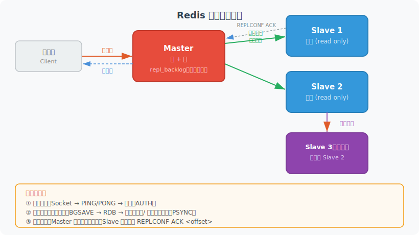
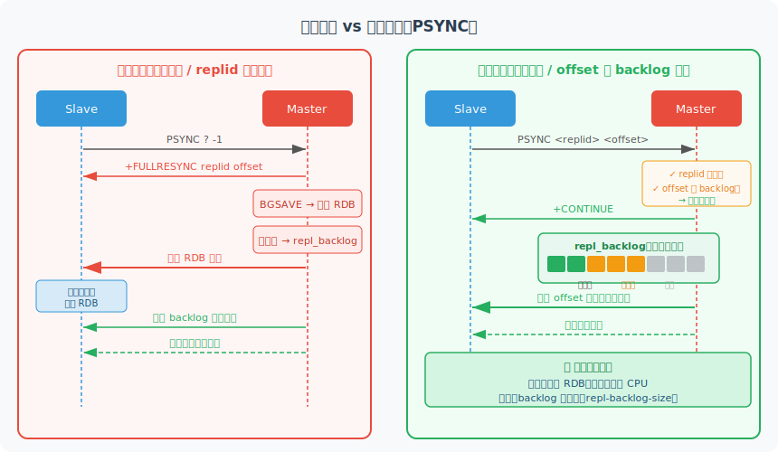
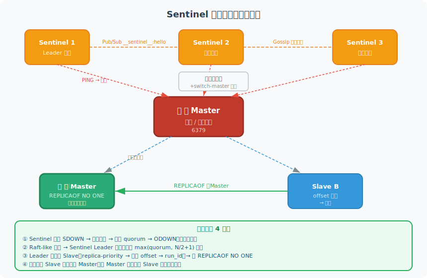
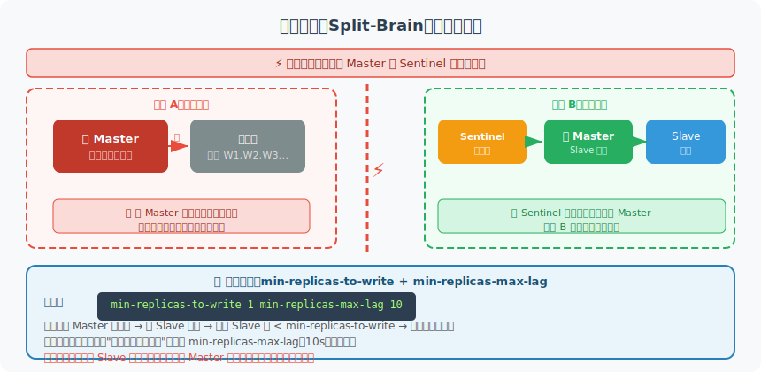
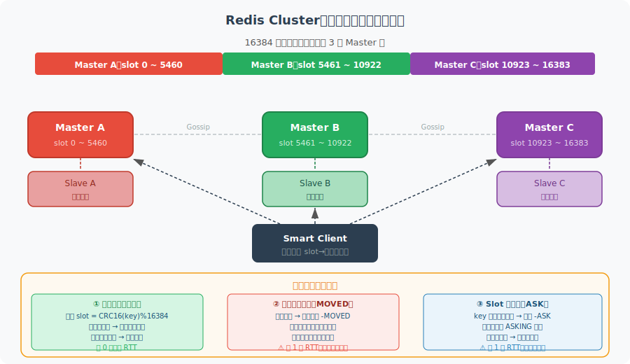
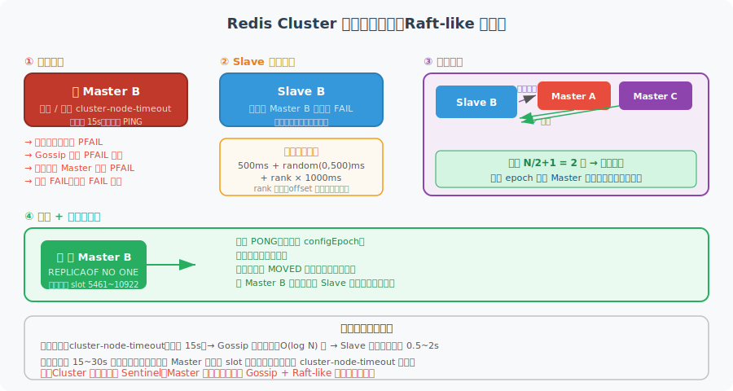
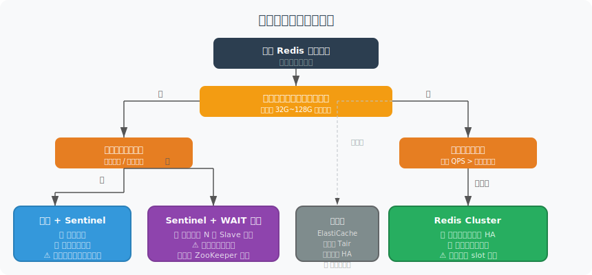

# Redis 深度解析：数据结构、持久化、高可用与分布式应用

> 本文档持续更新，后续相关提问也会追加在文末。

---

## 一、Redis 概述

**Redis**（Remote Dictionary Server）是一个开源的、基于内存的**键值型数据结构存储**，支持持久化、主从复制、集群等特性，广泛用于缓存、消息队列、分布式锁、排行榜等场景。

| 维度 | Redis | Memcached |
|---|---|---|
| 数据结构 | **String / List / Hash / Set / ZSet 等 10+ 种** | 仅 String |
| 持久化 | **RDB + AOF 双保险** | 无 |
| 主从/集群 | **原生支持** | 需客户端分片 |
| 事务 | **MULTI/EXEC（弱事务）** | 无 |
| Lua 脚本 | **支持（原子）** | 无 |
| 线程模型 | **单线程命令执行**（6.0+ I/O 多线程） | 多线程 |
| 典型 QPS | **10w+** | 10w+ |

> **设计哲学**：Redis 用**单线程事件循环**避免锁竞争，用**丰富数据结构**替代纯 KV，在内存速度与功能丰富性之间取得最优平衡。

---

## 二、核心数据结构与底层编码

Redis 对外暴露的是**逻辑类型**，底层会根据数据量和元素大小自动选择**编码实现**，这是 Redis 节省内存的关键。

### 2.1 String

最基本的类型，值可以是字符串、整数、浮点数（最大 512 MB）。

| 底层编码 | 触发条件 | 特点 |
|---|---|---|
| **int** | 值为整数且在 long 范围内 | 直接存 long，无额外内存 |
| **embstr** | 字符串长度 ≤ 44 字节 | redisObject + SDS 一次分配，连续内存 |
| **raw** | 字符串长度 > 44 字节 | redisObject 与 SDS 分开分配 |

**SDS（Simple Dynamic String）** 相比 C 字符串的优势：
- 记录 `len`，`O(1)` 获取长度，无需遍历
- 预分配 + 惰性释放，减少 realloc 次数
- 二进制安全，可存 `\0`

### 2.2 List

底层编码演进：

```
元素数量 ≤ 128 且所有元素 ≤ 64 字节
  → listpack（7.0+ 替代 ziplist）：连续内存块，极省空间

超出阈值
  → quicklist：双向链表 + 每个节点是 listpack，兼顾内存与效率
```

| 编码 | 结构 | 特点 |
|---|---|---|
| **listpack** | 连续内存 entry 数组 | 无指针开销，但修改需整体搬移 |
| **quicklist** | 双向链表，节点为 listpack | 折中：链表灵活 + listpack 紧凑 |

### 2.3 Hash

```
field 数量 ≤ 128 且所有 key/value ≤ 64 字节 → listpack
超出阈值 → hashtable（拉链法，rehash 渐进式执行）
```

**渐进式 rehash**：扩容时不一次性迁移，而是每次操作顺带迁移 1 个 bucket，避免阻塞。

### 2.4 Set

```
所有元素均为整数 且 元素数量 ≤ 512 → intset（有序整数数组，二分查找）
超出阈值 → hashtable
含非整数元素 → listpack（7.2+，元素数量 ≤ 128 且长度 ≤ 64）或 hashtable
```

### 2.5 Sorted Set（ZSet）

```
元素数量 ≤ 128 且所有 member ≤ 64 字节 → listpack（按 score 有序存储）
超出阈值 → skiplist + hashtable 组合
```

**跳表（skiplist）为何比平衡树更适合 ZSet：**

| 对比项 | 跳表 | 红黑树 |
|---|---|---|
| 实现复杂度 | **低**（链表 + 随机层数） | 高（旋转 + 变色） |
| 范围查询 | **O(log N) 定位后顺序遍历**，天然友好 | 需中序遍历，不如跳表直观 |
| 内存 | 略高（多级指针） | 略低 |
| 并发扩展 | 跳表更易做无锁并发 | 复杂 |

> `ZRANGEBYSCORE`、`ZRANK` 等范围操作是 ZSet 的核心场景，跳表在范围遍历上的优势决定了它的选择。

---

## 三、持久化

### 3.1 RDB（快照）

在指定时间点将内存数据**全量快照**写入 `.rdb` 二进制文件。

```
触发方式：
  SAVE      → 主线程同步，阻塞
  BGSAVE    → fork 子进程，主线程继续服务（推荐）
  配置触发   → save 900 1（900s 内有 1 次写操作则触发）
```

**COW（Copy-On-Write）机制**：fork 后子进程与父进程共享内存页，只有父进程修改的页才会触发复制，RDB 期间内存增量取决于写入量。

| 优点 | 缺点 |
|---|---|
| 文件紧凑，恢复速度快 | 两次 BGSAVE 之间的数据可能丢失 |
| fork 后对主线程性能影响小 | 数据量大时 fork 本身耗时（内存页表复制） |

### 3.2 AOF（追加日志）

每条**写命令**追加写入 `.aof` 文件，重启时重放所有命令恢复数据。

```
fsync 策略（appendfsync）：
  always     → 每条命令都 fsync，最安全，性能最差
  everysec   → 每秒 fsync，丢失最多 1s 数据（默认，推荐）
  no         → 由 OS 决定，吞吐最高，最多丢一个刷盘周期数据
```

**AOF 重写（BGREWRITEAOF）**：AOF 文件会越来越大，重写时 fork 子进程将当前内存状态转换为**最精简的命令序列**重新写入，父进程写入的增量追加到重写缓冲区，完成后合并。

### 3.3 RDB vs AOF vs 混合持久化

| 特性 | RDB | AOF | 混合（推荐） |
|---|---|---|---|
| 数据完整性 | 差（快照间隔内丢失） | **好（最多丢 1s）** | **好** |
| 恢复速度 | **快**（二进制加载） | 慢（重放命令） | **快** |
| 文件大小 | 小 | 大（含冗余命令） | 小 |
| fork 频率 | 低 | 高（BGREWRITEAOF） | 中 |

**混合持久化**（`aof-use-rdb-preamble yes`，4.0+）：AOF 重写时文件头部写入 RDB 格式快照，尾部追加增量 AOF 命令，兼顾恢复速度和数据完整性。

---

## 四、内存管理

### 4.1 过期键删除策略

Redis 对设置了 TTL 的 key 使用两种策略组合：

| 策略 | 时机 | 特点 |
|---|---|---|
| **惰性删除** | 访问 key 时检查是否过期 | CPU 友好，但过期 key 长期不访问会占用内存 |
| **定期删除** | 每隔 100ms 随机抽取部分 key 检查 | 限制每次扫描时间（≤25ms），在 CPU 与内存间折中 |

> Redis **不使用定时删除**（为每个 key 创建定时器），因为 key 量巨大时定时器开销不可接受。

### 4.2 内存淘汰策略（maxmemory-policy）

当内存达到 `maxmemory` 时触发淘汰：

| 策略 | 淘汰范围 | 算法 |
|---|---|---|
| **noeviction** | — | 不淘汰，写操作报错 |
| **allkeys-lru** | 全部 key | **近似 LRU**（推荐通用缓存） |
| **volatile-lru** | 设了 TTL 的 key | 近似 LRU |
| **allkeys-lfu** | 全部 key | **LFU 频率**（热点数据显著时推荐） |
| **volatile-lfu** | 设了 TTL 的 key | LFU 频率 |
| **allkeys-random** | 全部 key | 随机 |
| **volatile-random** | 设了 TTL 的 key | 随机 |
| **volatile-ttl** | 设了 TTL 的 key | TTL 最短的先淘汰 |

**近似 LRU**：Redis 不维护全量 LRU 链表，而是每次随机采样 N 个 key（默认 5），淘汰其中最久未访问的。通过增大采样数可无限逼近真实 LRU，但无需额外的链表开销。

---


## 五、高可用架构

> Redis 高可用三层递进：**主从复制**（数据冗余基础）→ **Sentinel**（自动故障转移）→ **Cluster**（水平扩展 + 内置 HA）

---

### 5.1 主从复制

主从复制是 Redis 高可用的基石，所有进阶方案都构建在它之上。

**核心模型：一写多读**



#### 5.1.1 复制三阶段

| 阶段 | 内容 | 关键细节 |
|---|---|---|
| **① 建立连接** | Slave 发起 TCP 连接 → PING/PONG 验证 → AUTH 认证 | 配置了 `masterauth` 才需要认证 |
| **② 数据同步** | 首次全量同步 或 断线重连增量同步 | 核心机制见下图 |
| **③ 命令传播** | Master 异步推送写命令给所有 Slave | Slave 定期回复 `REPLCONF ACK <offset>` |

#### 5.1.2 全量同步 vs 增量同步

Redis 使用 `PSYNC` 命令智能决策同步方式：



**判断逻辑：**

```
Slave 发送：PSYNC <replid> <offset>

Master 检查：
  ① replid 不匹配（首次或换过 Master）→ 全量同步（FULLRESYNC）
  ② replid 匹配 且 offset 在 repl_backlog 范围内 → 增量同步（CONTINUE）
  ③ replid 匹配 但 offset 已超出 backlog → 全量同步（backlog 太小或断线太久）
```

**全量同步代价：**`BGSAVE` 的 `fork` 耗时 + RDB 文件传输带宽 + Slave 加载时间，高峰期应避免触发。

**repl_backlog 是关键**：这是一个环形缓冲区，越大允许断线后越长时间仍可走增量同步。生产环境建议调大：

```
repl-backlog-size 100mb    # 默认 1MB，太小容易 failback 触发全量
```

#### 5.1.3 核心参数

| 参数 | 默认值 | 作用 |
|---|---|---|
| `repl-backlog-size` | 1MB | 环形缓冲区大小，影响断线重连是否能走增量 |
| `repl-backlog-ttl` | 3600s | 所有 Slave 断开后，backlog 保留时长 |
| `repl-diskless-sync` | no | `yes` 时 Master 不落盘 RDB，直接 socket 流式发送（网络带宽好时更快） |
| `repl-timeout` | 60s | 复制超时时间，需大于 `repl-backlog-size / 带宽` |
| `min-replicas-to-write` | 0 | Master 需要至少 N 个 Slave 在线才接受写（防脑裂） |
| `min-replicas-max-lag` | 10s | Slave ACK 延迟超过此值算不可达 |

#### 5.1.4 主从复制的局限

| 问题 | 根本原因 | 解决方向 |
|---|---|---|
| **异步复制可能丢数据** | Master 写后立即返回，Slave 异步接收，宕机窗口内数据丢失 | Sentinel + `min-replicas-to-write`；或 `WAIT` 命令同步等待 |
| **全量同步压力大** | fork + RDB 传输占用 CPU / 内存 / 带宽 | 调大 backlog，减少触发全量同步的频率 |
| **Slave 过多影响 Master** | 多 Slave 同时全量同步可能压垮 Master | 使用**级联复制**（Slave 的 Slave） |
| **不支持自动故障转移** | Master 宕机需人工干预 | 引入 **Sentinel** |
| **读写分离存在延迟** | 复制异步，Slave 可能有复制延迟 | 读 Slave 时业务允许短暂不一致 |

---

### 5.2 Sentinel（哨兵）

Sentinel 在主从基础上增加了**自动故障检测 + 自动故障转移**，不解决数据分片问题。

> Sentinel 本身是运行在特殊模式下的 Redis 进程，无需额外安装，最少 3 个节点部署（保证选举可用性）。

#### 5.2.1 整体架构



#### 5.2.2 三个定时任务

Sentinel 通过三种定时任务感知整个拓扑：

| 任务 | 频率 | 作用 |
|---|---|---|
| **PING 探活** | 每 1 秒 | 向 Master / Slave / 其他 Sentinel 发 PING，超时则标记 SDOWN |
| **INFO 发现** | 每 10 秒 | 向 Master 发 INFO，自动感知新加入的 Slave |
| **Pub/Sub 发现** | 每 2 秒 | 向 `__sentinel__:hello` 频道发布自身信息，Sentinel 之间互相发现 |

#### 5.2.3 故障判定：SDOWN → ODOWN

```
主观下线 SDOWN（单个 Sentinel 认为）：
  PING 超过 down-after-milliseconds（默认 30s）未回复
  → 该 Sentinel 单方面标记 Master 为 SDOWN

客观下线 ODOWN（多数派共识）：
  Sentinel 向其他 Sentinel 发 SENTINEL is-master-down-by-addr 请求投票
  → 收到的 SDOWN 确认数 ≥ quorum
  → 升级为 ODOWN，触发故障转移
```

> `quorum` 建议设为 `N/2 + 1`（如 3 个 Sentinel 设 quorum=2），越大越保守（误判率低但恢复慢）。

#### 5.2.4 故障转移四步

| 步骤 | 内容 | 关键细节 |
|---|---|---|
| **① Leader 选举** | Sentinel 之间 Raft-like 选举，获得 `max(quorum, N/2+1)` 票者当选 Leader | 每个 epoch 每个 Sentinel 只投一票，先到先得 |
| **② 选最优 Slave** | 过滤断线 / 数据落后的 Slave，按优先级排序 | 优先级：`replica-priority` 最小 → offset 最大 → run_id 最小 |
| **③ 执行切换** | Leader 向选中 Slave 发 `REPLICAOF NO ONE`，向其余 Slave 发 `REPLICAOF <new-master>` | 旧 Master 恢复后自动以 Slave 身份重新加入 |
| **④ 通知客户端** | 通过 `+switch-master` Pub/Sub 事件广播 | 客户端通过 `SENTINEL get-master-addr-by-name` 查询最新 Master |

#### 5.2.5 脑裂（Split-Brain）问题

**问题场景与缓解方案：**



| 维度 | 说明 |
|---|---|
| **能做到** | 将数据丢失窗口从"整个分区持续时间"缩小到 `min-replicas-max-lag` 秒内 |
| **不能做到** | 100% 零丢失（max-lag 窗口内的写仍可能丢） |
| **代价** | 若 Slave 全断连，正常 Master 也会拒绝写（可用性 ↓） |
| **根治方案** | `WAIT N timeout` 命令同步等待 N 个 Slave 确认；或使用 Raft 复制组（如 etcd） |

#### 5.2.6 部署最佳实践

| 建议 | 原因 |
|---|---|
| **至少 3 个 Sentinel** | 保证 N/2+1 投票可用性；2 个时任一 Sentinel 宕机就无法完成选举 |
| **Sentinel 分散在不同机器/机房** | 避免网络分区时 Sentinel 全部落在同一侧 |
| **不在 Redis 数据节点上运行 Sentinel** | 数据节点宕机不应同时影响哨兵的判定能力 |
| **quorum 设为 N/2+1** | 3 节点 → quorum=2；5 节点 → quorum=3 |

---

### 5.3 Redis Cluster（分片集群）

Cluster 在提供自动高可用的同时，解决了单机容量和写吞吐的瓶颈，是大规模 Redis 的标准方案。

#### 5.3.1 哈希槽分片与请求路由



**分片计算：**

```
slot = CRC16(key) % 16384

Hash Tag（控制多 key 落同一 slot）：
  key 包含 {...} 时，只对 {} 内部内容计算 CRC16
  "user:{1001}:name" → CRC16("1001") % 16384
  "order:{1001}:list" → CRC16("1001") % 16384
  → 两个 key 保证在同一 slot，支持 MGET / 事务 / Lua
```

**为什么是 16384 个 slot？**

| 原因 | 说明 |
|---|---|
| **Gossip 消息大小** | 16384 bit = 2KB（bitmap），65536 bit = 8KB；节点数 × 消息频率 × 6KB 差异不可忽视 |
| **集群规模上限** | 官方建议节点数 ≤ 1000；16384 / 1000 ≈ 16 slot/节点，仍可均衡 |
| **CRC16 值域** | CRC16 输出 65536 种值，16384 = 2^14 是其子集，取模高效 |

#### 5.3.2 自动故障转移（无需 Sentinel）



**与 Sentinel 的核心差异：** Cluster 的故障转移由 Slave 节点自行发起 Raft-like 选举完成，无需任何外部组件。

**选举延迟公式（数据最新的 Slave 最先发起）：**

```
delay = 500ms + random(0~500ms) + rank × 1000ms
rank = Slave 按复制偏移量排名（offset 最大的 rank=0）
```

#### 5.3.3 在线扩缩容

**迁移期间集群正常服务，客户端通过 ASK / MOVED 重定向透明处理：**

| 场景 | 客户端行为 |
|---|---|
| key 所在 slot 未在迁移 | 正常处理，无影响 |
| key 已迁到目标节点（源返回 `-ASK`） | 先发 `ASKING`，再发命令；**不更新路由缓存**（迁移未完成） |
| 迁移完成（返回 `-MOVED`） | 更新本地路由缓存，后续直达新节点 |

> **大 key 迁移警告**：`MIGRATE` 命令是同步操作，迁移大 key 时会短暂阻塞源节点主线程，建议在低峰期进行并拆分大 key。

#### 5.3.4 Cluster 的限制

| 限制 | 说明 | 应对 |
|---|---|---|
| **跨 slot 操作不支持** | `MGET`、`MULTI/EXEC`、Lua 脚本中的 key 必须在同一 slot | 使用 Hash Tag 保证相关 key 同 slot |
| **客户端复杂度高** | 需支持 MOVED / ASK 重定向，普通 Redis 客户端不可用 | 使用 JedisCluster / Lettuce 等 Smart Client |
| **最小部署成本高** | 至少 6 节点（3 Master + 3 Slave） | 云托管可降低运维成本 |
| **异步复制仍可能丢数据** | 与主从相同，`WAIT` 命令可缓解 | 同 Sentinel 方案 |

---

### 5.4 三种方案横向对比

| 维度 | 主从复制 | Sentinel | Cluster |
|---|---|---|---|
| **定位** | 数据冗余 + 读扩展 | 自动故障转移 | 高可用 + 水平扩展 |
| **自动 HA** | ❌ 需人工干预 | ✅ 自动切换 | ✅ 自动切换 |
| **数据分片** | ❌ 全量在 Master | ❌ 全量在 Master | ✅ 16384 slot 分布 |
| **容量上限** | 单机内存 | 单机内存 | 理论无上限（加节点） |
| **写吞吐扩展** | ❌ 只有 Master 可写 | ❌ 只有 Master 可写 | ✅ 多 Master 并行写 |
| **客户端复杂度** | 低 | 中（需走 Sentinel 协议） | 高（需处理 MOVED/ASK） |
| **跨 key 操作** | ✅ 支持 | ✅ 支持 | ⚠️ 需 Hash Tag |
| **最小节点数** | 1 Master + 1 Slave | 3 Sentinel + 1 Master + 1 Slave | 3 Master + 3 Slave（6 节点） |
| **适用场景** | 数据量小 + 只需读扩展 | 数据 &lt; 单机内存 + 简单 HA | 数据大 / 高写吞吐 / 需横向扩展 |

---

### 5.5 高可用方案选型指南



```
数据量 < 单机内存 + 高可用：
  → 主从 + Sentinel（运维简单，客户端兼容性好）

数据量 > 单机内存 / 需要高写吞吐：
  → Redis Cluster（水平扩展，内置 HA，但客户端需适配）

需要更强一致性（尽量不丢数据）：
  → Sentinel / Cluster + WAIT 命令（同步等待 N 个 Slave 确认）
  → 或考虑基于 Raft 的强一致存储（etcd / TiKV）

云环境：
  → AWS ElastiCache / 阿里云 Tair 等托管服务（底层封装 Sentinel 或 Cluster，无需自运维）
```

---

**主从复制 → Sentinel → Cluster**，每一层解决上一层解决不了的问题。

**主从**：数据冗余 + 读扩展，但 Master 宕机要人工处理。

**Sentinel**：在主从基础上加自动故障转移，3 个哨兵节点互相监控，Master 挂了自动选新主，但数据还是全量在一台机器上，容量有上限。

**Cluster**：16384 个哈希槽分散到多个 Master，容量和写吞吐都能水平扩展，内置故障转移不需要 Sentinel，但跨 slot 操作受限，客户端需要支持 MOVED/ASK 重定向。


## 六、缓存常见问题与解决方案

### 6.1 缓存穿透

**问题**：查询一个**不存在的 key**，缓存命不中，每次都打到数据库。

| 解决方案 | 原理 | 适用场景 |
|---|---|---|
| **缓存空值** | 缓存 `null`，设短 TTL（如 5min） | 简单，但会占用缓存空间 |
| **布隆过滤器** | 写入时登记，查询时先过滤明确不存在的 key | 大量不存在 key 的恶意攻击 |
| **接口校验** | 参数合法性校验（如 ID 格式、范围） | 前置防御 |

**布隆过滤器原理**：多个 Hash 函数将 key 映射到 bit 数组，判断"一定不存在"准确，判断"可能存在"有误判率，但不支持删除（Counting Bloom Filter 可解决）。

### 6.2 缓存击穿

**问题**：**热点 key 过期**，大量并发同时打到数据库重建缓存。

| 解决方案 | 原理 |
|---|---|
| **互斥锁（分布式锁）** | 只让一个请求重建缓存，其他等待或返回旧值 |
| **逻辑过期** | 不设 TTL，value 中存过期时间；过期后异步重建，期间返回旧数据 |
| **热点 key 永不过期** | 后台定时刷新，适合极少变化的热点数据 |

### 6.3 缓存雪崩

**问题**：**大量 key 同时过期** 或 **Redis 服务宕机**，流量全部打到数据库。

```
预防措施：
  1. TTL 随机化：base_ttl + random(0, jitter)，避免集中过期
  2. 多级缓存：本地缓存（Caffeine）+ Redis，Redis 故障时本地缓存兜底
  3. 熔断降级：数据库压力过大时熔断，返回兜底数据
  4. Redis 高可用：Sentinel / Cluster 避免单点
  5. 预热：服务启动时提前加载热点数据
```

---

## 七、分布式锁

### 7.1 基础实现

```
SET key value NX PX 30000
```

- `NX`：不存在才设置（互斥）
- `PX 30000`：30s 自动过期（避免死锁）
- `value` 使用 UUID：释放时校验是否是自己的锁，防止误删他人锁

```lua
-- 释放锁（Lua 保证原子性）
if redis.call("get", KEYS[1]) == ARGV[1] then
    return redis.call("del", KEYS[1])
else
    return 0
end
```

### 7.2 锁续期（Watchdog）

业务执行时间不确定，锁可能提前过期。**Redisson** 的看门狗机制：
- 获锁成功后，后台线程每 `lockWatchdogTimeout / 3`（默认 10s）续期一次
- 持有锁的线程挂掉后，看门狗随之消失，锁自然过期

### 7.3 RedLock（红锁）

单节点锁在 Redis 主从切换时存在丢锁风险（Master 还未同步给 Slave 就宕机）。RedLock 在 **N 个独立 Redis 实例**上加锁：

```
1. 记录开始时间 t1
2. 依次向 N 个节点（通常 5 个）请求加锁，设短超时（如 5ms）
3. 统计成功数 ≥ N/2+1（多数派） 且 耗时 < 锁有效期
   → 加锁成功，有效期 = 原有效期 - 耗时
4. 失败则向所有节点释放锁
```

> RedLock 的正确性存在争议（Martin Kleppmann 认为时钟漂移仍可导致并发问题），在需要严格互斥的场景，推荐使用 **ZooKeeper 临时顺序节点**或 **fencing token** 机制配合 RedLock 使用。

---

## 八、高频面试问题

### 8.1 Redis 为什么这么快？

```
1. 纯内存操作：避免磁盘 I/O
2. 单线程命令执行：无锁竞争，无上下文切换开销
3. I/O 多路复用：epoll 处理大量并发连接
4. 高效数据结构：SDS、跳表、压缩列表等针对 Redis 场景优化
5. 合理的编码自动切换：小数据用紧凑结构，大数据用高效结构
```

### 8.2 Redis 单线程为何能支撑 10w+ QPS？

瓶颈不在 CPU 而在**网络 I/O 和内存带宽**。单线程事件循环（Reactor 模式）配合 epoll，处理网络 I/O 绰绰有余。6.0+ 引入 I/O 多线程（仅用于网络读写，命令执行仍单线程），进一步提升 I/O 密集型场景吞吐。

### 8.3 大 key 问题

**定义**：String 值 > 10KB，集合类型元素 > 5000 个。

| 危害 | 说明 |
|---|---|
| 阻塞主线程 | DEL 大 key 需要 O(N) 时间 |
| 网络传输慢 | 单次传输大量数据 |
| 内存倾斜 | Cluster 中某节点内存显著更高 |

**解决**：
- 删除：使用 `UNLINK`（异步删除，4.0+）替代 `DEL`
- 拆分：Hash 按字段范围拆成多个小 Hash，List 分页存储
- 压缩：对 value 做 gzip 压缩后再存储

### 8.4 热 key 问题

某 key 访问频率极高，所有流量打到单个节点。

```
解决方案：
  1. 本地缓存（JVM 堆内缓存），减少对 Redis 的访问
  2. key 复制：将热 key 复制为 hotkey_1、hotkey_2...hotkey_N，客户端随机读
  3. 读写分离：热 key 请求分散到多个 Slave
```

---

## 九、线程模型演进

### 9.1 Redis 4.0 之前：纯单线程

```
事件循环（Event Loop）：
  1. 接收 socket 连接
  2. 读取请求
  3. 解析命令
  4. 执行命令
  5. 写回响应
全部在同一个线程完成，通过 epoll/kqueue 实现 I/O 多路复用
```

**为什么单线程还快？**
- 内存操作 ns 级，CPU 不是瓶颈
- 避免锁竞争和线程上下文切换
- 避免多线程的缓存行伪共享问题

### 9.2 Redis 4.0：后台线程（BIO）

引入 3 个后台线程处理耗时操作，命令执行仍然单线程：

| BIO 线程 | 功能 |
|---|---|
| BIO_CLOSE_FILE | 异步关闭大文件（AOF 重写后） |
| BIO_AOF_FSYNC | 异步执行 AOF fsync |
| BIO_LAZY_FREE | 异步释放大 key 内存（UNLINK） |

### 9.3 Redis 6.0+：I/O 多线程

```
主线程：
  ① epoll_wait 获取就绪事件
  ② 将就绪 socket 分配给 I/O 线程
  ③ 等待所有 I/O 线程读取完毕
  ④ 主线程串行执行所有命令（仍然单线程！）
  ⑤ 将响应写回任务分配给 I/O 线程
  ⑥ 等待 I/O 线程写回完毕

关键：命令执行串行 → 无锁；I/O 并行 → 提升网络吞吐
```

配置：
```
io-threads 4              # I/O 线程数（建议 CPU 核数 - 1）
io-threads-do-reads yes   # 读也启用多线程（默认 no，仅写多线程）
```

> **性能提升**：官方测试，I/O 多线程可将 QPS 从 10w 提升到 20w+（瓶颈在网络 I/O 时效果明显）。

---

## 十、事务与 Pipeline

### 10.1 Redis 事务（MULTI/EXEC）

```
MULTI             ← 开启事务，命令入队
SET k1 v1        ← 入队
SET k2 v2        ← 入队
EXEC              ← 一次性顺序执行所有命令
```

| 特性 | 支持情况 |
|---|---|
| 原子性 | 部分支持：命令全部执行或全部不执行（语法错误整体失败） |
| 隔离性 | ✅ 执行期间不会被其他客户端命令打断 |
| 一致性 | ✅ |
| 持久性 | 取决于持久化策略 |
| **回滚** | ❌ **不支持**：运行时错误（如对 String 执行 LPUSH）不回滚已成功的命令 |

**WATCH 乐观锁**：
```
WATCH key1            ← 监视 key
val = GET key1
MULTI
SET key1 (val + 1)
EXEC                  ← 如果 key1 在 WATCH 后被修改，EXEC 返回 nil（事务取消）
```

### 10.2 Pipeline（管道）

**问题**：Redis 命令 RTT 开销大，100 条命令 = 100 次网络往返。

```
Pipeline 原理：
  客户端将 N 条命令打包一次性发送 → Redis 依次执行 → 打包结果一次性返回
  减少 RTT 次数：从 N 次降为 1 次
```

| 对比 | 普通模式 | Pipeline |
|---|---|---|
| 网络往返 | N 次 | 1 次 |
| 服务端行为 | 相同（逐条执行） | 相同 |
| 原子性 | ❌ | ❌（非事务，中间可能插入其他客户端命令） |
| 适用场景 | 少量命令 | 批量读/写（如批量导入数据） |

> Pipeline **不保证原子性**。如果需要原子性，用 `MULTI/EXEC` 或 Lua 脚本。

---

## 十一、Lua 脚本

### 11.1 为什么需要 Lua 脚本

- **原子性**：整个脚本作为一条命令执行，期间不会被其他命令打断
- **减少网络开销**：多条命令封装成一次调用
- **复用**：EVALSHA 缓存脚本，避免重复传输

### 11.2 基本使用

```lua
-- EVAL "script" numkeys key1 key2 ... arg1 arg2 ...
-- 示例：原子性自增并设置过期时间
EVAL "
  local val = redis.call('INCR', KEYS[1])
  if val == 1 then
    redis.call('EXPIRE', KEYS[1], ARGV[1])
  end
  return val
" 1 counter 60
```

### 11.3 注意事项

| 问题 | 说明 |
|---|---|
| 执行时间 | Lua 脚本执行期间**阻塞**其他所有命令，必须控制执行时间 |
| lua-time-limit | 默认 5s，超时后不会终止脚本，但允许其他客户端发 SCRIPT KILL |
| 不支持回滚 | 脚本中途出错，已执行的写操作不会回滚 |
| Cluster 限制 | 脚本中所有 key 必须在同一 slot（使用 Hash Tag `{}`） |

---

## 十二、发布订阅与 Stream

### 12.1 Pub/Sub（发布订阅）

```
SUBSCRIBE channel1           ← 订阅频道
PUBLISH channel1 "hello"     ← 发布消息
PSUBSCRIBE news.*            ← 模式匹配订阅
```

| 特性 | 说明 |
|---|---|
| 可靠性 | ❌ 消息不持久化，订阅者离线期间消息丢失 |
| 消息堆积 | ❌ 无缓冲，发完即弃 |
| 消费确认 | ❌ 无 ACK 机制 |
| 适用场景 | 实时通知、配置变更广播、Sentinel 节点间通信 |

### 12.2 Stream（5.0+）

Redis Stream 是真正的**消息队列数据结构**，弥补了 Pub/Sub 和 List 做 MQ 的短板。

```
XADD mystream * name zhangsan age 25     ← 追加消息（* 自动生成 ID）
XREAD COUNT 2 BLOCK 0 STREAMS mystream 0  ← 读取消息（阻塞）
```

**消费者组（Consumer Group）**：

```
XGROUP CREATE mystream group1 0              ← 创建消费者组
XREADGROUP GROUP group1 consumer1 COUNT 1 BLOCK 0 STREAMS mystream >
XACK mystream group1 <message-id>            ← 确认消费
```

| 特性 | Stream | List | Pub/Sub |
|---|---|---|---|
| 持久化 | ✅ | ✅ | ❌ |
| 消费者组 | ✅ | ❌ | ❌ |
| ACK 确认 | ✅ | ❌ | ❌ |
| 消息回溯 | ✅（按 ID/时间） | ❌ | ❌ |
| 阻塞读 | ✅ | ✅（BRPOP） | ✅ |

> Stream 适合**轻量级消息队列**场景，但在**消息可靠性、事务、延迟消息**等方面仍不如 RocketMQ/Kafka 等专业 MQ。

---

## 十三、实际应用场景

### 13.1 分布式会话（Session）

```
用户登录 → 生成 SessionId → SET session:{id} {用户信息} EX 1800
后续请求 → 从 Header/Cookie 提取 SessionId → GET session:{id}
```

优点：无状态服务水平扩展、天然支持过期。

### 13.2 排行榜（Sorted Set）

```
ZADD leaderboard 95 user:1      ← 添加/更新分数
ZINCRBY leaderboard 5 user:1    ← 分数自增
ZREVRANGE leaderboard 0 9 WITHSCORES  ← Top 10
ZREVRANK leaderboard user:1     ← 查排名
```

### 13.3 计数器 / 限流

**固定窗口限流**：
```
INCR rate:user:1001:202601011200    ← 当前窗口计数
EXPIRE rate:user:1001:202601011200 60
if count > threshold → 拒绝
```

**滑动窗口限流（Sorted Set）**：
```
ZADD rate:user:1001 <timestamp_ms> <unique_id>    ← 每次请求加一条
ZREMRANGEBYSCORE rate:user:1001 0 <now - window>  ← 清理窗口外的
ZCARD rate:user:1001                               ← 当前窗口请求数
```

### 13.4 延迟队列（Sorted Set）

```
-- 生产：score = 执行时间戳
ZADD delay_queue <execute_timestamp> <task_json>

-- 消费（轮询）：
ZRANGEBYSCORE delay_queue 0 <now> LIMIT 0 1
if 有到期任务 → ZREM 抢占 → 执行
```

### 13.5 布隆过滤器（RedisBloom 模块）

```
BF.ADD blacklist user:9999       ← 加入黑名单
BF.EXISTS blacklist user:9999    ← 判断是否存在（可能误判存在，绝不漏判）
```

应用：防缓存穿透、邮件去重、URL 去重、推荐去重。

### 13.6 GEO 地理位置

```
GEOADD stores 116.405 39.904 "store:1"      ← 添加地理坐标
GEORADIUS stores 116.405 39.904 5 km ASC     ← 附近 5km 内的门店
GEODIST stores "store:1" "store:2" km        ← 两点距离
```

底层：使用 Sorted Set + GeoHash 编码（将二维坐标映射为一维整数，作为 score）。

---

## 十四、Redis 与 MySQL 数据一致性

### 14.1 问题本质

缓存与数据库是两个独立系统，**无法做到强一致（没有分布式事务）**，只能追求**最终一致性**。

### 14.2 常见策略

| 策略 | 流程 | 一致性 | 风险 |
|---|---|---|---|
| **Cache Aside（旁路缓存）** | 读：先缓存后 DB；写：先更新 DB 再删缓存 | ★★★★ | 极端并发下短暂不一致 |
| Read/Write Through | 缓存代理读写 DB | ★★★★ | 实现复杂 |
| Write Behind | 异步批量写 DB | ★★ | 缓存宕机数据丢失 |

### 14.3 Cache Aside 为什么「删」而不是「更新」缓存？

```
场景：线程 A 更新缓存为 v1，线程 B 更新缓存为 v2，但 DB 最终值为 v2
  如果「更新缓存」：A 先算好 v1，B 后算好 v2 并先写缓存 v2，A 后写缓存 v1 → 不一致
  如果「删除缓存」：无论谁先删，下次读都从 DB 加载最新值 → 一致
```

**删除比更新安全**：不关心并发顺序问题。

### 14.4 延迟双删

```
1. 删除缓存
2. 更新数据库
3. sleep(N ms)      ← 等待读请求把旧数据刷入缓存
4. 再次删除缓存     ← 兜底删除
```

**适用场景**：读写分离架构下，主从同步有延迟时，第一次删除后从库旧数据可能被读到并写回缓存。

### 14.5 基于 Binlog 的最终一致性（推荐）

```
应用写 DB → MySQL Binlog → Canal 解析 → 删除/更新 Redis 缓存
```

优势：与业务代码解耦、无侵入、可靠（Binlog 不丢）。

---

## 十五、Redis Cluster 深入

### 15.1 槽迁移过程

```
1. 目标节点：CLUSTER SETSLOT <slot> IMPORTING <source-node-id>
2. 源节点：  CLUSTER SETSLOT <slot> MIGRATING <target-node-id>
3. 循环执行：
   CLUSTER GETKEYSINSLOT <slot> <count>    ← 获取 slot 中的 key
   MIGRATE <target-ip> <target-port> "" 0 5000 KEYS <key1> <key2>...
4. 所有 key 迁移完毕后：
   对所有 Master：CLUSTER SETSLOT <slot> NODE <target-node-id>
```

**迁移期间的请求处理**：
- 源节点收到属于迁移 slot 的请求：key 在本地则处理；不在则返回 `ASK <target>`
- 目标节点收到 `ASKING` + 命令：即使 slot 还未正式属于自己也执行

### 15.2 集群故障检测与恢复

```
1. 节点间每秒 PING/PONG（Gossip），携带自己已知的其他节点状态
2. 节点 A 发现 B 超时未 PONG → A 标记 B 为 PFAIL（主观下线）
3. A 通过 Gossip 传播 PFAIL 信息
4. 当半数以上 Master 标记 B 为 PFAIL → B 变为 FAIL（客观下线）
5. B 的 Slave 发起选举（Raft-like）：
   - 向所有 Master 请求投票
   - 获得半数以上投票 → 晋升为新 Master
   - 接管 B 的槽
```

### 15.3 集群限制

| 限制 | 原因 |
|---|---|
| 不支持跨 slot 事务 | MULTI/EXEC 中的 key 必须在同一 slot |
| 不支持跨 slot 的多 key 操作 | MGET/MSET/SUNION 等需要 Hash Tag |
| 不支持 SELECT（多数据库） | 集群模式只有 db0 |
| Lua 脚本中所有 key 必须同 slot | 否则报错 |
| 发布订阅在集群中广播所有节点 | 消息会被放大 |

---

## 十六、性能优化与问题排查

### 16.1 慢查询

```
配置：
  slowlog-log-slower-than 10000    ← 超过 10ms 记录慢查询
  slowlog-max-len 128              ← 最多保留 128 条

命令：
  SLOWLOG GET 10                   ← 查看最近 10 条慢查询
  SLOWLOG LEN                      ← 当前慢查询日志数量
```

常见慢命令：`KEYS *`、`SMEMBERS`（大集合）、`HGETALL`（大 Hash）、`SORT`、`LRANGE 0 -1`。

替代方案：`KEYS *` → `SCAN`（游标式遍历，不阻塞）。

### 16.2 内存优化

| 手段 | 说明 |
|---|---|
| 合理设置 maxmemory | 预留 30% 给 fork 和碎片 |
| 使用 Hash 替代多个 String | 100 个字段用 1 个 Hash 存比 100 个 String 省内存 |
| 控制 key 命名长度 | `u:1001:n` 比 `user:1001:name` 省空间 |
| 整数编码 | 能用整数的别用字符串 |
| OBJECT ENCODING key | 检查编码是否合理 |
| MEMORY USAGE key | 查看 key 实际内存占用 |

### 16.3 连接池最佳实践

```
JedisPool 参数：
  maxTotal   = 业务线程数（如 200）
  maxIdle    = maxTotal（避免频繁创建销毁连接）
  minIdle    = maxTotal / 4（保留基础连接数）
  testOnBorrow = false（生产不开，影响性能，用后台探活替代）
  
Lettuce（Netty）：
  单连接支持多路复用，天然线程安全
  适合高并发场景，无需连接池
```

### 16.4 常见生产问题排查

| 现象 | 可能原因 | 排查手段 |
|---|---|---|
| 延迟突增 | 大 key 操作、AOF 重写、fork | `INFO latencystats`、`SLOWLOG` |
| 内存飙升 | 大 key、内存碎片、未设过期 | `MEMORY DOCTOR`、`INFO memory` |
| 连接数打满 | 连接泄露、未用连接池 | `INFO clients`、`CLIENT LIST` |
| 主从延迟 | 网络带宽、Slave 慢写入 | `INFO replication` → `master_repl_offset` 差值 |

---

## 十七、Redis 7.0 新特性

| 特性 | 说明 |
|---|---|
| **Function** | 替代 EVAL，Lua 函数注册后按名调用，支持版本管理 |
| **Sharded Pub/Sub** | 发布订阅限制在 slot 所在节点，避免集群广播 |
| **Multi-part AOF** | AOF 拆分为 base + increment 多文件，简化重写 |
| **listpack 全面替代 ziplist** | 解决 ziplist 级联更新问题 |
| **Client-side caching 增强** | 支持广播模式，配合 RESP3 协议 |
| **ACL v2** | 支持 Selector，更细粒度权限控制 |

---

## 十八、Q&A 补充

### Q：什么是 Sentinel？有什么用？

**Redis Sentinel（哨兵）** 是 Redis 官方提供的高可用解决方案，本质是一组运行在特殊模式下的 Redis 进程，**不存储数据，只做监控和决策**。

**核心功能：**

| 功能 | 说明 |
|---|---|
| **监控（Monitoring）** | 持续检查 Master 和 Slave 是否正常运行 |
| **通知（Notification）** | 通过 Pub/Sub 向客户端/管理员发送故障告警 |
| **自动故障转移（Failover）** | Master 宕机时自动选出新 Master，完成主从切换 |
| **配置提供者（Configuration Provider）** | 客户端通过 Sentinel 获取当前 Master 地址，无需硬编码 |

**解决的核心痛点**：主从架构中 Master 宕机需要人工介入（手动执行 `REPLICAOF NO ONE`），Sentinel 将这个过程自动化，实现秒级故障转移。

---

### Q：Sentinel 如何检测节点是否下线？主观下线与客观下线的区别？

Sentinel 通过**心跳机制**检测节点状态，分两个阶段判定：

**第一阶段：主观下线（SDOWN - Subjectively Down）**

```
单个 Sentinel 的独立判断：
  Sentinel 每 1 秒向 Master/Slave/其他 Sentinel 发送 PING
  如果超过 down-after-milliseconds（配置项，默认 30000ms）未收到有效回复
  → 该 Sentinel 单方面标记目标节点为 SDOWN
```

有效回复包括：`+PONG`、`-LOADING`、`-MASTERDOWN`。

**第二阶段：客观下线（ODOWN - Objectively Down）**

```
多个 Sentinel 的共识判断（仅针对 Master）：
  1. Sentinel A 发现 Master SDOWN
  2. A 向其他 Sentinel 发送 SENTINEL is-master-down-by-addr 命令
  3. 其他 Sentinel 返回各自对该 Master 的判断
  4. 如果认为 Master SDOWN 的 Sentinel 数量 ≥ quorum（配置的法定人数）
     → Master 被标记为 ODOWN → 触发故障转移
```

**关键区别：**

| 维度 | 主观下线（SDOWN） | 客观下线（ODOWN） |
|---|---|---|
| 判断主体 | 单个 Sentinel | 多个 Sentinel（≥ quorum） |
| 适用对象 | Master、Slave、Sentinel | **仅 Master** |
| 触发动作 | 仅标记，不行动 | 触发 Leader 选举 → 故障转移 |
| 可能误判 | 是（网络抖动即可触发） | 极低（多数派共识） |

> **为什么 Slave 和 Sentinel 只有 SDOWN 没有 ODOWN？** 因为 Slave 下线不需要做故障转移（不影响写服务），Sentinel 下线也不需要特殊处理（其他 Sentinel 继续工作）。只有 Master 下线需要达成共识后触发故障转移。

---

### Q：Sentinel 是如何实现故障转移的？

故障转移是一个完整的多步骤流程：

```
前置条件：Master 被标记为 ODOWN

Step 1：选举 Sentinel Leader
  → 由 Leader 全权负责后续故障转移操作（详见下一个问题）

Step 2：Leader 筛选最优 Slave
  过滤规则（先排除不合格的）：
    ① 排除 5s 内未回复 Sentinel PING 的 Slave（不健康）
    ② 排除与 Master 断连超过 down-after-milliseconds × 10 的 Slave（数据太旧）
    ③ 排除 replica-priority = 0 的 Slave（管理员标记永不参选）

  排序规则（在剩余候选中按优先级选）：
    ① replica-priority 值越小越优先（管理员可控）
    ② 复制偏移量（replication offset）越大越优先（数据越新）
    ③ Run ID 字典序越小越优先（纯兜底，保证确定性）

Step 3：执行主从切换
  1. Leader 向选中的 Slave 发送 REPLICAOF NO ONE → Slave 晋升为新 Master
  2. Leader 持续 PING 新 Master，等待其角色确实变为 master
  3. Leader 向其他 Slave 发送 REPLICAOF <new-master-ip> <port>
     → 其他 Slave 转为复制新 Master
  4. Leader 将旧 Master 标记为 Slave（配置更新）
     → 旧 Master 恢复后自动以 Slave 身份加入

Step 4：通知客户端
  1. Sentinel 通过 +switch-master 频道发布切换事件
  2. 客户端（如 Jedis Sentinel 模式）订阅该频道，更新连接到新 Master
  3. 也可通过 SENTINEL get-master-addr-by-name 命令查询最新 Master
```

**整个过程通常在秒级完成**（取决于 `down-after-milliseconds` 和选举时间）。

---

### Q：为什么建议部署多个 Sentinel 节点（哨兵集群）？

部署多个 Sentinel 是出于**可靠性、准确性、可用性**三重考量：

**1. 避免误判（准确性）**

```
场景：单 Sentinel 与 Master 之间网络故障（但 Master 实际正常）
  单 Sentinel：SDOWN → 直接触发切换 → 误切！原 Master 还在正常服务
  多 Sentinel：需要 quorum 个 Sentinel 同时认为 SDOWN → ODOWN → 才切换
             网络分区只影响部分 Sentinel，不会达成共识 → 不误切
```

**2. 避免单点故障（可用性）**

```
单 Sentinel 宕机 → 整个监控系统失效 → Master 宕机无人切换
多 Sentinel：任何一个宕机，其他 Sentinel 继续工作
```

**3. Leader 选举需要多数派（正确性）**

```
故障转移需要选出一个 Leader 执行，选举需要 N/2+1 投票
  1 个 Sentinel：无法选举（没有多数派概念）
  2 个 Sentinel：一个挂了，剩一个无法获得 2/2+1=2 票 → 选举失败
  3 个 Sentinel：一个挂了，剩两个仍可获得 3/2+1=2 票 → 正常选举
```

**最佳实践：**

| 建议 | 原因 |
|---|---|
| **至少 3 个 Sentinel** | 容忍 1 个节点故障后仍能完成选举 |
| **奇数个**（3 / 5） | 偶数个没有额外容错收益（3 和 4 都只容忍 1 个故障） |
| **分散部署在不同机器/机房** | 避免同一故障域（如交换机/机架）导致多个 Sentinel 同时不可用 |
| **不要和 Redis 数据节点混部** | 数据节点宕机不应连带 Sentinel 能力 |

---

### Q：Sentinel 如何选择出新的 Master（选举机制）？

Sentinel 选新 Master 是一个**过滤 + 多维排序**过程：

```
候选池：旧 Master 的所有 Slave

═══════════════════════════════════════════════
第一步：过滤（排除不合格 Slave）
═══════════════════════════════════════════════

  ✗ 已断线的 Slave（无法通信）
  ✗ 最近 5s 未回复 Sentinel PING 的 Slave
  ✗ 与旧 Master 断连时间 > down-after-milliseconds × 10
    （例如 down-after = 30s，则断连超过 300s 的 Slave 淘汰）
    → 原因：断连太久意味着数据可能远远落后
  ✗ replica-priority = 0 的 Slave
    → 管理员显式标记"永不晋升"（如用于备份的 Slave）

═══════════════════════════════════════════════
第二步：排序（从剩余候选中选最优）
═══════════════════════════════════════════════

  优先级 1：replica-priority 值最小的
    → 可由管理员配置，数值越小优先级越高（默认 100）
    → 比如把机器配置最好的 Slave 设为 10，优先晋升

  优先级 2：replication offset 最大的
    → offset 越大 = 从 Master 接收的数据越多 = 数据最新
    → 这是最核心的选择依据（数据完整性优先）

  优先级 3：Run ID 字典序最小的
    → 纯粹兜底，当以上都相同时保证选举结果确定性
```

**设计哲学**：优先保证数据不丢（offset 最大），同时留给管理员通过 priority 干预的能力。

---

### Q：如何从 Sentinel 集群中选择出 Leader？

Sentinel 选 Leader 使用的是类 **Raft** 的选举算法：

```
触发条件：某个 Sentinel 发现 Master ODOWN → 发起选举

选举流程：

  1. 发起者（Candidate）自增 currentEpoch（全局逻辑时钟）
  2. Candidate 向所有其他 Sentinel 发送：
     SENTINEL is-master-down-by-addr <ip> <port> <currentEpoch> <自己的runid>
     （runid 非 * 表示"请把票投给我"）

  3. 每个 Sentinel 在同一个 epoch 中只能投一票（先到先得）
     收到投票请求后：
       - 如果本 epoch 未投过票 → 投给请求者 → 回复 leader_runid = 请求者
       - 如果本 epoch 已投过 → 拒绝 → 回复 leader_runid = 已投对象

  4. Candidate 统计票数：
     获得 max(quorum, N/2+1) 票 → 成为 Leader
     （N = Sentinel 总数）

  5. 如果本轮无人获得足够票数：
     → 等待一个随机时间（避免活锁）
     → 进入下一个 epoch 重新选举

  6. Leader 选出后，由 Leader 独自执行故障转移
```

**关键设计：**

| 特点 | 说明 |
|---|---|
| 先到先得 | 同一 epoch 每个 Sentinel 只投一票，避免票分裂 |
| 随机延迟 | 选举失败后随机等待，打破对称性（类似 Raft 的 election timeout 随机化） |
| epoch 递增 | 逻辑时钟保证旧 epoch 的投票不会影响新选举 |
| 多数派 | 必须获得 N/2+1 票，保证最多只有一个 Leader |

> 与 Raft 的区别：Sentinel 选举只是为了选出执行故障转移的节点，不涉及日志复制。更像是"一次性共识"而非完整的 Raft。

---

### Q：Sentinel 可以防止脑裂吗？

**不能完全防止，但可以大幅缩小脑裂的损害窗口。**

**脑裂场景：**

```
正常状态：
  [Sentinel × 3] → 监控 → [Master] ←复制← [Slave-1, Slave-2]

网络分区：
  ┌────────────────────────────┐    ┌──────────────────────────┐
  │ 分区 A（少数派）           │    │ 分区 B（多数派）         │
  │                            │    │                          │
  │  旧 Master（孤立）         │    │  Sentinel-1              │
  │  Sentinel-3（少数）        │    │  Sentinel-2              │
  │  部分客户端继续写旧 Master │    │  Slave-1 → 晋升新 Master │
  │                            │    │  Slave-2                 │
  └────────────────────────────┘    └──────────────────────────┘

分区恢复后：
  旧 Master 降级为 Slave → REPLICAOF 新 Master → 全量同步
  → 分区期间写入旧 Master 的数据全部丢失！
```

**Sentinel 的缓解措施（不是根治）：**

```conf
min-replicas-to-write 1       # Master 至少要有 1 个 Slave 正常连接才接受写
min-replicas-max-lag 10       # Slave 的 ACK 延迟不超过 10 秒算"正常连接"
```

**工作原理：**
```
旧 Master 被孤立 → 所有 Slave 断连 → 连接的 Slave 数 < min-replicas-to-write
→ 旧 Master 拒绝所有写请求 → 客户端收到错误
→ 数据丢失窗口缩小为 min-replicas-max-lag 秒内的写入
```

**总结：**

| 维度 | 说明 |
|---|---|
| 能做到 | 将数据丢失窗口从"整个分区持续时间"缩小到 `max-lag` 秒 |
| 不能做到 | 100% 零丢失（在 max-lag 窗口内的写仍会丢） |
| 代价 | 正常情况下如果 Slave 全断连，Master 也会拒绝写（可用性降低） |
| 根治方案 | 如需严格一致，使用 `WAIT` 命令（同步等待 N 个 Slave 确认写入）或 Raft 复制组 |

---

### Q：为什么需要 Redis Cluster？解决了什么问题？有什么优势？

**为什么需要：**

单机 Redis（即使有 Sentinel）的瓶颈：

```
1. 容量瓶颈：单机内存有限（通常 32-128G），无法存储超大数据集
2. 写吞吐瓶颈：主从架构只有 Master 可写，单机写 QPS 有上限
3. 网络带宽瓶颈：单机网卡带宽有限，大流量下成为瓶颈
```

**Redis Cluster 解决的问题：**

| 问题 | 解决方式 |
|---|---|
| **数据容量** | 数据分片到多个节点，总容量 = 所有 Master 内存之和 |
| **写入性能** | 写请求分散到多个 Master，线性扩展写 QPS |
| **高可用** | 内置故障检测和自动转移（不需要额外 Sentinel） |
| **在线扩缩容** | 支持动态增减节点，不停服 |

**Cluster 优势：**

```
✅ 去中心化：无代理、无单点（每个节点对等，通过 Gossip 协议通信）
✅ 线性扩展：加节点 = 加容量 + 加吞吐
✅ 自动故障转移：Slave 检测 Master 失败后自行 Raft 选举晋升
✅ 客户端路由：Smart Client 直连数据节点，无中间层损耗
✅ 原生支持：Redis 官方内置，无需第三方组件
```

**对比其他分片方案：**

| 方案 | 优点 | 缺点 |
|---|---|---|
| **客户端分片**（一致性哈希） | 简单 | 扩缩容困难，客户端复杂 |
| **代理分片**（Twemproxy/Codis） | 客户端无感知 | 代理成为单点/瓶颈，额外运维 |
| **Redis Cluster** | 官方原生、去中心、自动 HA | 客户端需支持 MOVED/ASK |

---

### Q：Redis Cluster 是如何分片的？

Redis Cluster 使用**哈希槽（Hash Slot）** 方案分片：

```
核心思路：
  key → 哈希函数 → slot 编号 → 确定该 slot 在哪个节点

具体计算：
  slot = CRC16(key) % 16384

总共 16384 个 slot，分配给集群中的各个 Master 节点
```

**示例（3 Master 集群）：**

```
Master-A：负责 slot 0 ~ 5460
Master-B：负责 slot 5461 ~ 10922
Master-C：负责 slot 10923 ~ 16383
```

**分片特点：**

| 特点 | 说明 |
|---|---|
| **固定数量** | 16384 个 slot，不随节点数变化 |
| **预分配** | 集群初始化时即分配好所有 slot → 节点 |
| **可迁移** | slot 可在线从一个节点迁移到另一个节点（扩缩容） |
| **均匀性** | CRC16 保证 key 分布均匀 |

**与一致性哈希的对比：**

| 维度 | 哈希槽 | 一致性哈希 |
|---|---|---|
| 映射关系 | key → slot → node（两层） | key → 哈希环位置 → node（一层） |
| 扩容 | 迁移指定 slot 即可，精确控制 | 只影响相邻节点，但不可精确控制 |
| 数据倾斜 | 通过调整 slot 分配解决 | 需要虚拟节点 |
| 实现复杂度 | 集群维护 slot 表 | 客户端维护哈希环 |

---

### Q：为什么 Redis Cluster 的哈希槽是 16384 个？

这个数字是**性能、带宽、规模**三者权衡的结果（Redis 作者 antirez 亲自解释过）：

**原因 1：Gossip 消息大小**

```
集群中每个节点通过 PING/PONG 交换信息，消息中包含 slot 位图（bitmap）：
  16384 个 slot → 16384 bit = 2KB（bitmap 大小）
  65536 个 slot → 65536 bit = 8KB

每个节点每秒要发多条 PING/PONG，2KB vs 8KB 的差异在大集群中非常显著
节省的带宽 = 节点数 × 消息频率 × (8KB - 2KB)
```

**原因 2：集群规模上限**

```
Redis 官方建议集群节点数不超过 1000 个
16384 / 1000 ≈ 16 个 slot/节点（最坏情况）
每个节点 16 个 slot 仍然可以保证较好的负载均衡
不需要更多 slot
```

**原因 3：slot 信息压缩**

```
节点间传递配置时，slot 分布可以用 bitmap 高效压缩
16384 bit = 2048 字节，在 TCP 包中完全可接受
更大的数值会增加配置传播和存储的开销
```

**原因 4：CRC16 的值域足够**

```
CRC16 输出 16 bit = 65536 种值
16384 = 2^14，是 65536 的子集，取模运算高效
```

> 总结：16384 是让集群能支撑 1000 节点、同时 Gossip 消息体积保持在 2KB 的最优平衡点。

---

### Q：如何确定给定 key 应该分布到哪个哈希槽中？

**基本规则：**

```
slot = CRC16(key) % 16384
```

**Hash Tag 机制（控制 key 的 slot 归属）：**

```
如果 key 中包含 {...}，则只对 { } 内的部分计算 CRC16

示例：
  key = "user:{1001}:name"  → CRC16("1001") % 16384
  key = "user:{1001}:age"   → CRC16("1001") % 16384
  key = "order:{1001}:list" → CRC16("1001") % 16384
  
  三个 key 保证落在同一个 slot！
```

**Hash Tag 规则细节：**

```
1. 只取第一个 { 和其后第一个 } 之间的内容
2. {} 为空（如 "abc{}def"）→ 视为没有 tag，对整个 key 计算
3. 只有 { 没有 }（如 "abc{def"）→ 对整个 key 计算
4. 嵌套（如 "a{b{c}d}e"）→ 取 "b{c"（第一个{到第一个}之间）
```

**计算方法验证：**

```bash
# 通过 redis-cli 查看 key 属于哪个 slot
redis-cli CLUSTER KEYSLOT "user:1001"
# 返回：(integer) 5649

redis-cli CLUSTER KEYSLOT "user:{1001}:name"
# 返回：(integer) 5649（和上面不一定相同，取决于 CRC16("1001")）
```

**为什么需要 Hash Tag？**
- `MGET`、`MSET` 等多 key 操作要求所有 key 在同一 slot
- `MULTI/EXEC` 事务中的 key 必须在同一 slot
- Lua 脚本中操作的所有 key 必须在同一 slot

---

### Q：Redis Cluster 支持重新分配哈希槽吗？

**支持，这是 Redis Cluster 在线扩缩容的基础。**

**重新分配（Reshard）的方式：**

```bash
# 方式一：redis-cli 交互式
redis-cli --cluster reshard <any-node-ip>:<port>
# 交互提示：
#   How many slots do you want to move? → 输入 slot 数
#   What is the receiving node ID? → 目标节点 ID
#   Source node IDs → 源节点 ID（或 all）

# 方式二：指定参数
redis-cli --cluster reshard <ip>:<port> \
  --cluster-from <source-node-id> \
  --cluster-to <target-node-id> \
  --cluster-slots <count> \
  --cluster-yes
```

**底层迁移流程（逐 slot 迁移）：**

```
对于每一个要迁移的 slot：

1. 目标节点：CLUSTER SETSLOT <slot> IMPORTING <source-id>
   → 目标节点准备接收该 slot 的数据

2. 源节点：CLUSTER SETSLOT <slot> MIGRATING <target-id>
   → 源节点标记该 slot 正在迁出

3. 循环直到该 slot 所有 key 迁移完毕：
   CLUSTER GETKEYSINSLOT <slot> <batch-count>     → 获取 key 列表
   MIGRATE <target-ip> <port> "" 0 timeout KEYS <key1> <key2>...
   （MIGRATE 是原子操作：源节点 dump + 目标节点 restore + 源节点 del）

4. 通知所有 Master：CLUSTER SETSLOT <slot> NODE <target-id>
   → 所有节点更新路由表
```

**注意事项：**

| 要点 | 说明 |
|---|---|
| 在线操作 | 迁移期间集群正常服务，不停机 |
| 逐 key 迁移 | 大 key 迁移时会短暂阻塞（MIGRATE 是同步的） |
| 路由自动更新 | 迁移完成后 Gossip 传播新路由，客户端收到 MOVED 后更新缓存 |
| 可中断 | 迁移中途失败可以回退或继续（slot 状态会记录 MIGRATING/IMPORTING） |

---

### Q：Redis Cluster 扩容缩容期间可以提供服务吗？

**可以，Redis Cluster 支持在线扩缩容，不停服。**

**扩容期间的请求处理机制：**

```
情况 1：请求的 key 对应的 slot 未在迁移
  → 正常处理，完全无影响

情况 2：请求的 key 对应的 slot 正在从 A 迁移到 B

  客户端请求到源节点 A：
    - key 还在 A → A 正常处理，返回结果
    - key 已迁到 B → A 返回 -ASK <slot> B
      → 客户端对 B 先发 ASKING 命令
      → 再发原始命令
      → B 执行并返回结果
      （注意：客户端不更新本地路由缓存，因为迁移还没完成）

  客户端请求到目标节点 B：
    - 没有 ASKING 标记 → B 返回 -MOVED <slot> A（slot 还没正式属于 B）
    - 有 ASKING 标记 → B 执行命令（接受迁移中的请求）
```

**对客户端的影响：**

| 场景 | 影响 |
|---|---|
| key 未迁移 | 无影响 |
| key 已迁移 | 多一次 ASK 重定向（额外 1 次 RTT） |
| 迁移完成后 | 首次请求收到 MOVED → 更新路由 → 后续无影响 |

**性能影响：**

```
- 大部分请求正常处理（只有正在迁移的 slot 受影响）
- 单个 slot 迁移时间取决于该 slot 的 key 数量和大小
- 可通过 --cluster-pipeline 参数控制每批迁移的 key 数
- 大 key 迁移时 MIGRATE 操作会短暂阻塞源节点主线程
```

> 最佳实践：在低峰期进行扩缩容，避免大 key 的 slot 迁移造成抖动。

---

### Q：Redis Cluster 中的节点是怎么进行通信的？

Redis Cluster 使用 **Gossip 协议** 进行去中心化通信。

**通信架构：**

```
每个节点开两个 TCP 端口：
  - 服务端口（如 6379）：处理客户端请求
  - 集群总线端口（服务端口 + 10000，如 16379）：节点间通信

节点间通过集群总线端口交换 Gossip 消息
```

**Gossip 消息类型：**

| 消息类型 | 发送时机 | 内容 |
|---|---|---|
| **PING** | 每秒随机选节点发送 | 发送方信息 + 已知的部分其他节点状态 |
| **PONG** | 收到 PING 后回复 | 同 PING（作为 PING 的确认 + 信息交换） |
| **MEET** | 管理员执行 CLUSTER MEET | 邀请新节点加入集群 |
| **FAIL** | 标记节点为 FAIL 时广播 | 通知所有节点某节点客观下线 |
| **PUBLISH** | Pub/Sub 消息 | 在集群中传播 PUBLISH 命令 |

**PING/PONG 消息内容：**

```
消息头（Header）：
  - 发送方 nodeId、ip、port、flags（Master/Slave/PFAIL...）
  - 发送方负责的 slot bitmap（16384 bit = 2KB）
  - currentEpoch、configEpoch

消息体（Gossip Section）：
  - 随机选取集群中 1/10 的节点信息（nodeId、ip、port、flags）
  - 每个节点的状态（正常 / PFAIL / FAIL）
  - 每个节点最近一次被 PONG 回复的时间
```

**通信频率与策略：**

```
常规心跳：
  每 1 秒，从已知节点中随机选 5 个，向其中最久未通信的 1 个发 PING
  → 保证每个节点都不会太久不被探测

加速探测：
  每 100ms 扫描节点列表：
  如果某节点超过 cluster-node-timeout / 2 未通信 → 立即发 PING
  → 尽早发现可能下线的节点

故障传播：
  节点 A 通过 Gossip 得知其他节点对 B 的 PFAIL 判定
  当 A 收集到半数以上 Master 的 PFAIL → 标记 B 为 FAIL → 广播 FAIL 消息
```

**Gossip 协议的优缺点：**

| 优点 | 缺点 |
|---|---|
| 去中心化，无单点 | 最终一致，收敛有延迟 |
| 容错性好，部分节点挂不影响 | 消息有冗余（同一信息可能被多次传播） |
| 扩展性好 | 节点越多 Gossip 流量越大（O(N) 级） |
| 实现简单 | 不适合需要强一致的场景 |

**收敛时间估算：**

```
N 个节点的集群，信息从一个节点传播到所有节点大约需要：
  O(log N) 轮 Gossip 周期
  
例如 100 节点集群：约 7 轮（1 秒/轮）≈ 7 秒收敛
加上 cluster-node-timeout（默认 15s），故障发现总时间约 15-22s
```

---

<!-- 后续问题追加在此处 -->
