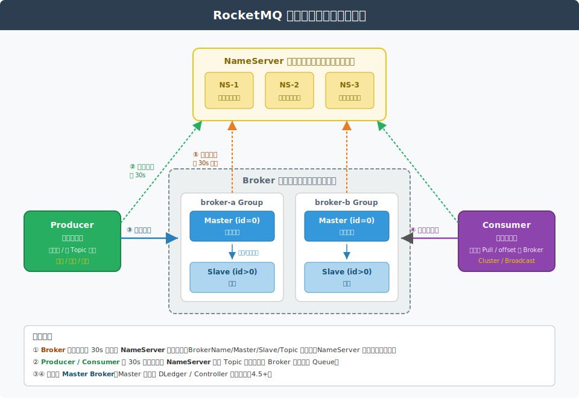
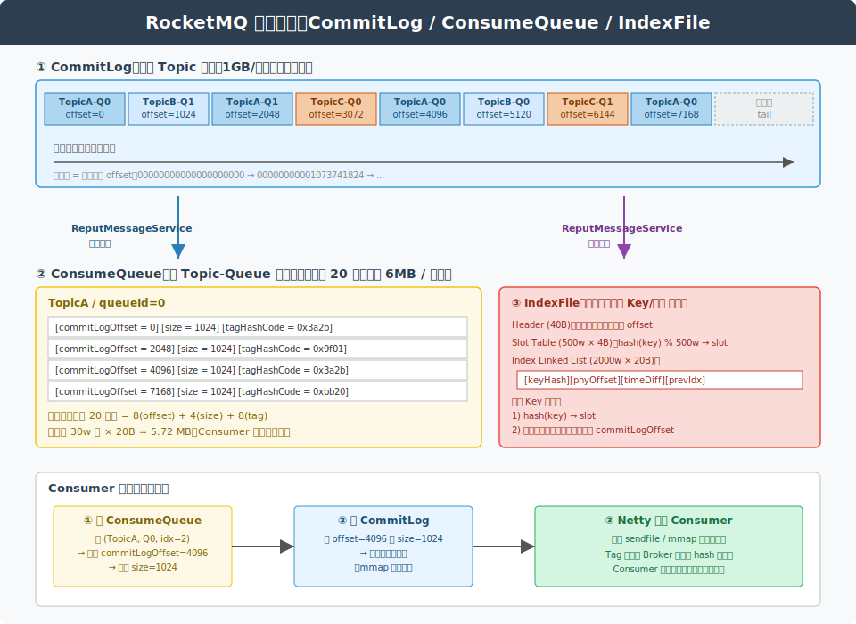
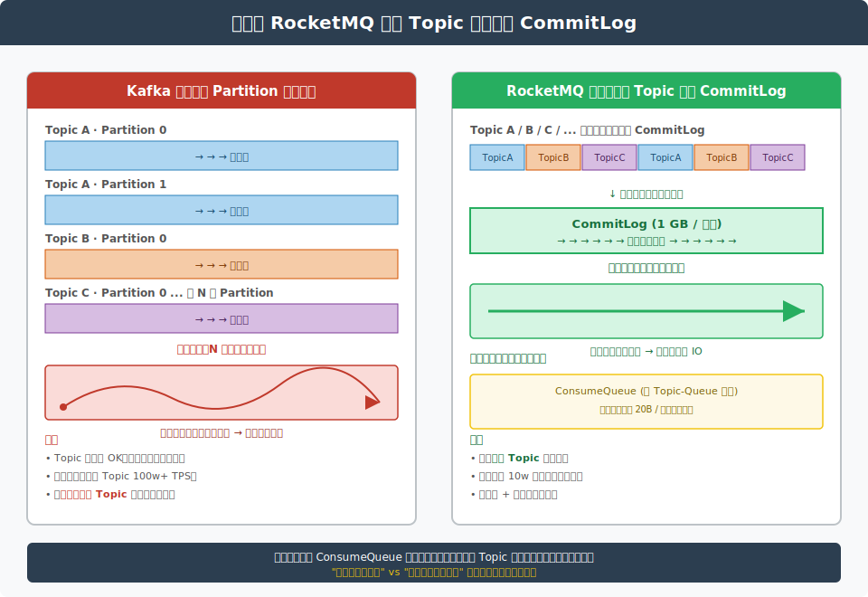
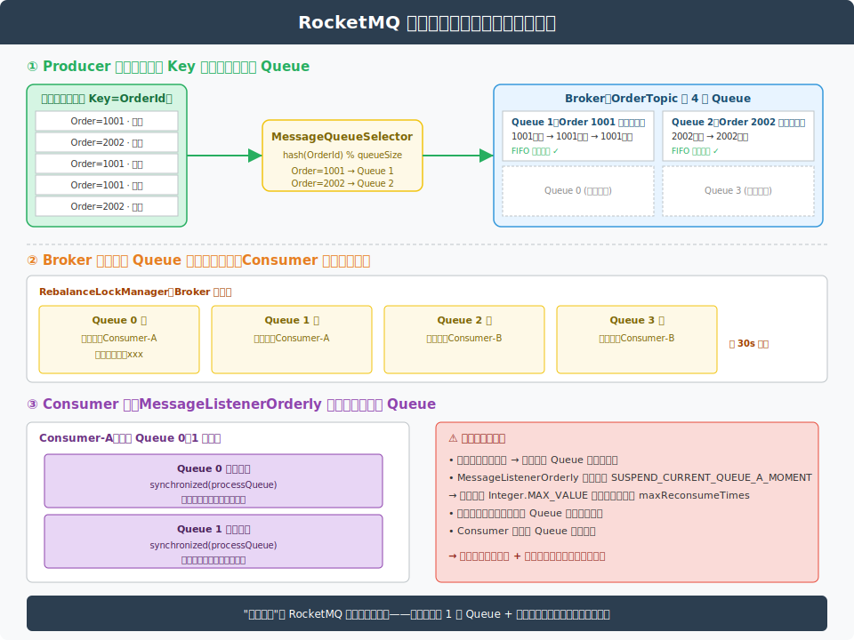

# RocketMQ 深度解析：架构、存储、消息模型与高可用

> 本文档持续更新，后续相关提问也会追加在文末。

---

## 一、RocketMQ 概述

**RocketMQ** 是阿里巴巴开源、捐献给 Apache 的分布式消息中间件，定位为**金融级、高吞吐、低延迟、高可靠**的消息平台。其核心设计灵感来源于 Kafka，但在**消息可靠性、事务消息、定时消息、消息过滤、消息回溯**等业务特性上做了大量增强。

| 维度 | Kafka | RocketMQ |
|---|---|---|
| 存储模型 | **每个 Partition 一个文件** | **所有 Topic 共用一个 CommitLog**（顺序写极致） |
| 消费模型 | Pull | Pull（伪装成 Push 的长轮询） |
| 事务消息 | 0.11+ 提供，但语义偏弱 | **完整两阶段提交 + 回查机制** |
| 定时/延迟消息 | 无原生支持 | **18 级延迟 / 任意时刻定时（5.0+）** |
| 顺序消息 | 分区内有序 | **分区顺序 + 严格顺序两档** |
| 消息过滤 | 客户端过滤 | **Broker 端 Tag/SQL92 过滤** |
| 消息回溯 | offset 重置 | **按时间戳回溯** |
| 主从一致性 | ISR + Raft（KRaft） | **同步双写 / DLedger（Raft）** |
| 典型延迟 | ms 级 | ms 级 |
| 适用场景 | 日志、流处理、大数据 | **业务交易、金融、订单** |

> **设计哲学**：Kafka 为**流（Stream）**而生，RocketMQ 为**业务消息（Business Messaging）**而生。前者优化吞吐与扩展，后者强化可靠与事务语义。

---

## 二、整体架构



### 2.1 四大角色

| 角色 | 职责 | 关键特性 |
|---|---|---|
| **NameServer** | 路由注册中心，保存 Topic → Broker 路由 | **无状态**、节点间不通信、客户端连任意一台即可 |
| **Broker** | 消息存储、投递、查询 | 主从架构、CommitLog 顺序写、PageCache 加速 |
| **Producer** | 消息生产者 | 与 NameServer 长连接拉路由；与 Master 建连发消息 |
| **Consumer** | 消息消费者 | 与 NameServer 长连接拉路由；可从 Master/Slave 拉消息 |

### 2.2 路由发现流程

```
1. Broker 启动 → 向 所有 NameServer 注册（每 30s 一次心跳）
2. NameServer 每 10s 扫描一次，120s 没收到心跳就剔除
3. Producer/Consumer 每 30s 从 NameServer 拉一次最新路由
4. 客户端在本地缓存路由（TopicPublishInfo / TopicSubscribeData）
5. NameServer 故障：客户端用本地缓存继续工作，直到下一次拉取成功
```

### 2.3 为什么 NameServer 不用 ZooKeeper

| 对比项 | ZooKeeper | NameServer |
|---|---|---|
| 一致性 | 强一致（ZAB） | **最终一致**（节点间不同步） |
| 复杂度 | 高（Watcher + 选主 + ZAB） | **极简**（一个 HashMap） |
| CAP | CP | **AP** |
| 适合场景 | 分布式协调、分布式锁 | **轻量级路由发现** |

**关键洞察**：消息中间件的路由信息**可以容忍短暂不一致**——Producer 拿到旧路由最多发一次失败可以重试，没必要为强一致性引入 ZooKeeper 的运维复杂度。

### 2.4 Broker 的 Master / Slave

- **BrokerName** 相同的 Broker 组成一个**组**，`BrokerId = 0` 为 Master，`> 0` 为 Slave
- Master 负责**读写**，Slave **只读**（消费端可从 Slave 拉，减轻 Master 压力）
- **Slave 不会自动切主**（4.5 之前），需要 DLedger 模式或 Controller 模式
- Topic 的队列分散在多个 BrokerName 组上，实现**水平扩展 + 高可用**

---

## 三、核心存储模型



RocketMQ 存储的核心是**三个文件**：

| 文件 | 作用 | 数据形态 | 写入模式 |
|---|---|---|---|
| **CommitLog** | 真正的消息体存储 | 所有 Topic **混写**在一起 | **严格顺序追加** |
| **ConsumeQueue** | 消费索引 | 每 Topic 每 Queue 一份 | 顺序追加（异步构建） |
| **IndexFile** | 按 Key/时间查询索引 | 哈希索引 | 异步构建 |

### 3.1 CommitLog：所有消息的"账本"

```
${ROCKETMQ_HOME}/store/commitlog/
├── 00000000000000000000      # 第 1 个文件，从 offset 0 开始，固定 1G
├── 00000000001073741824      # 第 2 个文件，从 offset 2^30 开始
└── 00000000002147483648      # 第 3 个文件
```

- **单文件固定 1GB**，文件名 = 该文件起始的全局物理偏移量
- 所有 Topic、所有 Queue 的消息**混写**在同一个 CommitLog
- **追加写**：新消息只在文件末尾追加，旧文件只读
- **过期清理**：默认保留 72 小时，按文件粒度删除（不修改单条消息）

### 3.2 ConsumeQueue：消费视角的逻辑队列

```
${ROCKETMQ_HOME}/store/consumequeue/
├── TopicA/
│   ├── 0/       # Queue 0
│   ├── 1/       # Queue 1
│   └── 2/       # Queue 2
└── TopicB/
    └── 0/
```

每条 ConsumeQueue 记录是**固定 20 字节**的三元组：

```
┌──────────────────┬──────────────┬─────────────┐
│ commitLogOffset  │  msgSize     │  tagsCode   │
│   8 bytes        │  4 bytes     │  8 bytes    │
└──────────────────┴──────────────┴─────────────┘
```

- **commitLogOffset**：消息体在 CommitLog 中的物理偏移量
- **msgSize**：消息体大小（用于读时定位字节数）
- **tagsCode**：tag 的 hashCode，用于 Broker 端 Tag 过滤的**预筛选**

> **20 字节定长**是 RocketMQ 的关键设计：消费端按逻辑 offset 读取时，可以直接 `offset × 20` 计算物理位置，**不需要扫描 / 索引跳跃**。

### 3.3 IndexFile：按 Key / 时间查询

- 哈希索引文件，单文件默认存 2000W 条记录
- 用于实现 `MQAdmin queryMsgByKey` / 控制台按 MsgId 查消息
- **不影响消费链路**，只为运维/排查服务

### 3.4 三者协作示意

```
        Producer 发送消息
                │
                ▼
       ┌────────────────────┐
       │   CommitLog        │  ← 顺序追加，所有 Topic 混写
       │   (所有消息体)      │
       └────────┬───────────┘
                │
       ReputMessageService（异步分发线程，1ms 轮询）
                │
       ┌────────┼────────┐
       ▼                 ▼
 ┌──────────┐      ┌──────────┐
 │ ConsumeQ │      │ IndexFile│
 │ 消费索引 │      │ Key 索引 │
 └──────────┘      └──────────┘
```

**核心思想**：CommitLog 是**真相之源**，ConsumeQueue 和 IndexFile 都是**异步派生**的索引，丢了可以根据 CommitLog 重建。

---

## 四、CommitLog 的设计精髓



CommitLog 是 RocketMQ 高性能的**关键**。核心三板斧：**顺序写 + mmap + PageCache**。

### 4.1 为什么要"所有 Topic 混写一个文件"

| 方案 | 优点 | 缺点 |
|---|---|---|
| Kafka：每 Partition 独立文件 | Partition 之间独立，消费时顺序读 | **Partition 多**时退化为大量随机写（每个文件都顺序写，但磁头要跳） |
| RocketMQ：共用一个 CommitLog | **磁盘只看到一个写指针**，永远顺序写 | 消费时需要先读 ConsumeQueue 拿 offset，再随机读 CommitLog |

**结论**：RocketMQ 用"**写极致顺序 + 读靠 PageCache**"的组合，换来了 Topic 数量大幅扩展时**写入性能不衰减**。Kafka 在 Partition 数量过万时性能急剧下降，而 RocketMQ 几乎线性。

### 4.2 mmap 内存映射

```
传统 read/write：
  磁盘 ──► 内核 PageCache ──► 用户空间 buffer ──► 处理
                              ^
                        多一次 CPU copy

mmap：
  磁盘 ──► 内核 PageCache ◄──► 用户空间虚拟地址（同一物理页）
                              ^
                        零拷贝（共享物理内存）
```

- 通过 `MappedByteBuffer`（底层 `FileChannel.map()`）将文件映射到**用户进程虚拟地址空间**
- 读写**不经过 read/write 系统调用**，直接操作内存即可
- 1GB 一个文件的设计正是配合 mmap：**一次性映射整个文件**，避免反复 map/unmap

### 4.3 PageCache 与刷盘

```
   write(msg)
       │
       ▼
   MappedByteBuffer.put()        ← 写入用户态映射地址（其实是 PageCache）
       │
       ▼
   PageCache（脏页）
       │
       ▼ （异步刷盘 / 同步刷盘）
   磁盘
```

#### 同步刷盘（SYNC_FLUSH）

- 每次写完消息，**等待 fsync 完成**才返回 ACK
- **可靠性最高**：断电不丢
- 实现：`GroupCommitService` 攒批，每 10ms 一次合并刷盘
- 适用场景：金融、订单等不允许丢失的业务

#### 异步刷盘（ASYNC_FLUSH，默认）

- 写入 PageCache 后**立即返回**，由后台线程定期刷盘
- **吞吐量最高**：性能 ≈ 内存写入
- **风险**：Broker 宕机（注意是 OS 级别宕机，不是 JVM 崩溃）会丢失最近未刷盘的消息
- 实现：`FlushRealTimeService` 默认每 500ms 触发一次

### 4.4 文件预热（warmup）

为什么要预热？因为 **mmap 是惰性加载**——只有访问到某一页才会触发 page fault 把磁盘内容读进 PageCache。

```java
// 预热逻辑：每 4KB 写一个 0，触发 page fault，让整个文件被加载到 PageCache
for (int i = 0; i < fileSize; i += pageSize) {
    byteBuffer.put(i, (byte) 0);
}
// 强行 mlock，防止 swap 出去
LibC.INSTANCE.mlock(pointer, fileSize);
```

- **目的**：避免业务高峰期触发缺页中断导致延迟抖动
- **同时调用 `mlock`**：防止 PageCache 被换出到 swap

### 4.5 文件删除策略

- **按文件粒度过期**（默认 72h）：`FileReservedTime`
- **删除时机**：每天凌晨 4 点、磁盘水位超过 75% 也会触发
- **不修改老文件**：因为是顺序写的，从不回头改写
- **删除时一次最多删 10 个文件**，避免删除压力打满 IO

---

## 五、消息写入完整流程


以**同步发送**为例，跟踪一条消息从 Producer 到磁盘的全链路。

### 5.1 Producer 端：路由选择 + 队列选择

```
Producer.send(msg)
    │
    ▼
1. 从本地缓存拿 TopicPublishInfo（无 → 查 NameServer）
    │
    ▼
2. 从 messageQueueList 中选一个 Queue
    │
    ▼
3. 默认策略：轮询 + 故障规避（latencyFaultTolerance）
    │
    ▼
4. 找到 Queue 对应的 Master Broker 地址
    │
    ▼
5. Netty 发送 SEND_MESSAGE 请求（默认超时 3s）
```

#### 默认队列选择策略：故障规避

```java
// 选 Queue 的核心思想：跳过最近发送失败 / 慢的 Broker
public MessageQueue selectOneMessageQueue(TopicPublishInfo tpInfo, String lastBrokerName) {
    if (sendLatencyFaultEnable) {
        for (int i = 0; i < tpInfo.getMessageQueueList().size(); i++) {
            int index = tpInfo.getSendWhichQueue().incrementAndGet();
            MessageQueue mq = tpInfo.getMessageQueueList().get(pos);
            if (latencyFaultTolerance.isAvailable(mq.getBrokerName())) {
                return mq;
            }
        }
        // 找不到可用的 → 选一个"最不烂"的 Broker
        ...
    }
    // 原始轮询
    return tpInfo.selectOneMessageQueue(lastBrokerName);
}
```

- 故障 Broker 会被**惩罚**：根据上次发送耗时映射出 30s ~ 10min 的"避让窗口"
- 这段时间内不向该 Broker 发消息
- **意义**：避免短暂故障扩散为雪崩

### 5.2 Broker 端：写入流程

```
SendMessageProcessor.processRequest()
    │
    ▼
1. 校验：Topic 权限 / 消息长度 / Broker 角色（必须是 Master）
    │
    ▼
2. DefaultMessageStore.putMessage()
    │
    ▼
3. 选择当前活跃的 MappedFile（CommitLog 当前正在写的 1G 文件）
    │
    ▼
4. CommitLog.putMessage() → MappedFile.appendMessage()
    │
    ▼
5. 写入 MappedByteBuffer（其实是 PageCache）—— putLong(offset)/put(body)
    │
    ▼
6. 根据刷盘策略：
       SYNC_FLUSH  → 提交到 GroupCommitService，等待 fsync 完成
       ASYNC_FLUSH → 立即返回（PageCache 中已有）
    │
    ▼
7. 主从复制：
       SYNC_MASTER  → 等 Slave ACK
       ASYNC_MASTER → 立即返回
    │
    ▼
8. 返回 SendResult 给 Producer
```

### 5.3 异步分发：构建 ConsumeQueue / IndexFile

```
ReputMessageService（独立线程，1ms 轮询一次）
    │
    ▼
读取 CommitLog 新增数据 → 解析每条消息 →
    ├─► 写 ConsumeQueue（commitLogOffset, msgSize, tagsCode）
    └─► 写 IndexFile（key hashCode → physicalOffset）
```

- **关键点**：消费索引是**异步构建**的，意味着消息写完到能被消费有一个**毫秒级延迟**
- ReputMessageService 也是**单线程顺序处理**，保证 ConsumeQueue 内的消息严格按 CommitLog 顺序

### 5.4 写入耗时的关键路径

| 阶段 | 典型耗时 | 优化点 |
|---|---|---|
| Netty 网络往返 | 0.1 ~ 1ms | 长连接、Reactor 线程 |
| Broker 锁竞争 | < 0.1ms | `putMessageLock`（自旋锁/重入锁） |
| MappedByteBuffer.put | 微秒级 | mmap + PageCache，无系统调用 |
| 同步刷盘 | 1 ~ 10ms | GroupCommit 攒批 |
| 同步复制 | 1 ~ 10ms | Slave 写 PageCache 即返回 |

> **黄金组合**：异步刷盘 + 同步复制 = 兼顾性能与高可用（绝大多数生产环境用这个）。

---

## 六、消费模型


### 6.1 Push vs Pull

RocketMQ "Push" 的真相：**Push 模式底层也是 Pull**——客户端**长轮询**模拟出 Push 的语义。

```
DefaultMQPushConsumer
    │
    ▼
PullMessageService（拉消息线程）
    │
    ▼
向 Broker 发 PullRequest（携带 offset + 等待时间 30s）
    │
    ▼
Broker：
    ├─ 有新消息：立即返回
    └─ 没有新消息：挂起请求，最多 30s
        ├─ 期间有新消息进来 → 唤醒并返回
        └─ 30s 到期 → 返回 PULL_NOT_FOUND
    │
    ▼
客户端继续下一轮 Pull（无需 sleep）
```

| 对比 | 真 Push（如 RabbitMQ） | RocketMQ 长轮询 Pull |
|---|---|---|
| 实时性 | 高 | **接近 Push**（新消息几乎立即触发返回） |
| 流控 | Broker 推，客户端可能爆 | **客户端控制节奏**，自然限流 |
| 实现复杂度 | Broker 推 + ACK 复杂 | **客户端主动**，简单 |

### 6.2 集群消费 vs 广播消费

| 模式 | ConsumerGroup 内每条消息 | 位点存储位置 |
|---|---|---|
| **CLUSTERING（默认）** | 仅被一个实例消费（负载均衡） | **Broker 端**（按 GroupName + Topic + Queue） |
| **BROADCASTING** | 每个实例都消费一份 | **客户端本地文件** |

#### 集群消费的位点管理

```
Consumer 提交 offset
    │
    ▼
Broker 持久化到 ${ROCKETMQ_HOME}/store/config/consumerOffset.json
    │
    ▼
位点格式：
{
  "offsetTable": {
    "TopicA@GroupA": {
       "0": 12345,   ← Queue 0 已消费到 12345
       "1": 67890
    }
  }
}
```

- 位点**默认每 5s 持久化一次**
- 重启后从最后持久化的位点继续，可能**重复消费几秒的消息**（所以业务必须**幂等**）

### 6.3 Rebalance：负载均衡

**触发时机**：

- ConsumerGroup 内 Consumer 实例上下线
- Topic 的 Queue 数量变化（扩容/缩容）
- 心跳广播触发（默认 20s 一次）

**分配算法**（默认 `AllocateMessageQueueAveragely`）：

```
假设 Topic 有 8 个 Queue，ConsumerGroup 有 3 个实例：
  Consumer1: Queue 0, 1, 2
  Consumer2: Queue 3, 4, 5
  Consumer3: Queue 6, 7

如果 Consumer3 下线，触发 Rebalance：
  Consumer1: Queue 0, 1, 2, 3
  Consumer2: Queue 4, 5, 6, 7
```

**Rebalance 的代价**：

- 旧持有者要**先停掉**老 Queue 的消费 + 提交 offset
- 新持有者**从持久化 offset** 开始拉
- **可能产生重复消费**（停掉到接管之间的位点提交不及时）
- **绝对要求消费幂等**

### 6.4 ConcurrentlyConsumer vs OrderlyConsumer

| 类型 | 并发度 | 顺序性 | 失败处理 |
|---|---|---|---|
| **MessageListenerConcurrently** | 单 Queue 多线程并行 | 无 | 失败消息进入重试队列 `%RETRY%Group` |
| **MessageListenerOrderly** | 单 Queue 单线程串行 | **同 Queue 内有序** | **阻塞重试**当前消息（最多 Integer.MAX 次），保护顺序 |

### 6.5 消费失败重试机制

#### 普通消费失败

```
消费失败 (返回 RECONSUME_LATER)
    │
    ▼
Broker 把消息投到 SCHEDULE_TOPIC_XXXX 的 Level N 延迟队列
    │  （第 N 次失败，N 越大延迟越长）
    ▼
延迟时间到达 → 投到 %RETRY%ConsumerGroup
    │
    ▼
Consumer 订阅时自动也订阅了 %RETRY% 主题
    │
    ▼
重试 16 次仍失败 → 投到 %DLQ%ConsumerGroup（死信队列）
```

**重试间隔**（按级别递增）：1s, 5s, 10s, 30s, 1m, 2m, 3m, 4m, 5m, 6m, 7m, 8m, 9m, 10m, 20m, 30m, 1h, 2h

#### 死信队列（DLQ）

- 16 次重试后进入 `%DLQ%GroupName`
- **不会自动消费**，需要业务排查后人工干预
- 默认**保留 3 天**

---

## 七、顺序消息



### 7.1 顺序消息的两端约束

| 端点 | 必须满足 | 否则 |
|---|---|---|
| **Producer** | 同 ShardingKey 的消息必须发到同一 Queue，单线程串行发送 | 不同 Queue 之间无序保证 |
| **Broker** | 同 Queue 内消息物理顺序写入（CommitLog 天然保证） | — |
| **Consumer** | 用 `MessageListenerOrderly`，单 Queue 单线程消费 | 多线程消费就会乱序 |

### 7.2 Producer 端：MessageQueueSelector

```java
producer.send(msg, new MessageQueueSelector() {
    @Override
    public MessageQueue select(List<MessageQueue> mqs, Message msg, Object arg) {
        Long orderId = (Long) arg;
        return mqs.get((int)(orderId % mqs.size()));
    }
}, orderId);
```

- 用 `orderId % queueCount` 选 Queue：**同一 orderId 永远进同一 Queue**
- 业务粒度的 ShardingKey 一定要选好（用户ID、订单ID）

### 7.3 Consumer 端：消息锁的三级粒度

`MessageListenerOrderly` 模式下，要保证同一 Queue 内串行消费，需要**三级锁**：

```
1. Broker 端的 Queue 分布式锁
   └─ 一个 Queue 同时只被一个 Consumer 实例锁定（默认 60s）
   └─ Consumer 每 20s 续锁
   
2. Consumer 端的 ProcessQueue 本地锁（Object monitor）
   └─ 防止同一 Queue 被多线程同时消费
   
3. 消费失败时阻塞当前线程
   └─ 不会跳过去消费下一条，直到当前消息消费成功 / 重试耗尽
```

> **关键洞察**：**Broker 锁**是顺序消息的灵魂——它保证 Rebalance 的"过渡期"不会出现两个 Consumer 同时消费一个 Queue。

### 7.4 分区顺序 vs 严格顺序

| 模式 | 顺序保证 | 可用性 | 配置 |
|---|---|---|---|
| **分区顺序（默认）** | 同 ShardingKey 在**正常情况下**有序 | **高**：Broker 故障时队列数变化，顺序短暂破坏 | 普通 Topic |
| **严格顺序** | 同 ShardingKey **任何情况下**有序 | **低**：Broker 故障时队列保留，但消息发不出去 | `mqadmin updateTopic -o true` |

**99% 业务用分区顺序**——业务能容忍极端故障下短暂乱序，换取持续可用。**金融转账**、**订单状态机**这类强一致场景才考虑严格顺序，且通常配合上层去重逻辑。

---

## 八、事务消息

### 8.1 业务问题：本地事务与发消息的原子性

```
// 这段代码在分布式系统中永远是错的
@Transactional
public void createOrder() {
    orderDao.insert(order);          // ① 本地事务
    mqProducer.send(orderMsg);       // ② 发消息
}
```

**4 种失败场景**：

1. ① 成功 ② 成功：✓
2. ① 失败 ② 未发：✓（事务回滚不发消息）
3. ① 成功 ② 失败：**数据不一致**（订单创建了，下游没感知）
4. ① 成功 ② 成功，但事务回滚了：**幻消息**（订单没创建，下游收到消息）

### 8.2 RocketMQ 事务消息：两阶段提交 + 回查

```
Producer                Broker                 Consumer
   │                      │                       │
   │ 1. 发送 half 消息    │                       │
   │─────────────────────►│                       │
   │                      │ 写入特殊 Topic        │
   │                      │ RMQ_SYS_TRANS_HALF_TOPIC
   │                      │                       │
   │ 2. half ACK          │                       │
   │◄─────────────────────│                       │
   │                      │                       │
   │ 3. 执行本地事务      │                       │
   │   (业务代码)          │                       │
   │                      │                       │
   │ 4a. Commit ─┐        │                       │
   │ 4b. Rollback┤        │                       │
   │             ▼        │                       │
   │─────────────────────►│                       │
   │                      │ Commit: 把 half 转入  │
   │                      │ 真实 Topic            │
   │                      │ Rollback: 删除 half   │
   │                      │                       │ 5. 投递
   │                      │──────────────────────►│
   │                      │                       │
   │                      │  ↳ 如果 Producer 4 步 │
   │                      │     没收到任何反馈：   │
   │                      │  6. 回查（默认 60s）  │
   │                      │  调 listener.checkLocalTransaction()
   │                      │     根据返回 commit/rollback
```

### 8.3 关键实现细节

#### Half 消息的隐藏

- Half 消息真实存在 CommitLog 中，但**写入前 Topic 被改写**为 `RMQ_SYS_TRANS_HALF_TOPIC`
- 原 Topic 信息保存在消息属性中
- **后果**：Consumer **看不到 Half 消息**，因为它根本没订阅这个内部 Topic

#### Commit/Rollback 的处理

- **Commit**：再发一条 OP 消息到 `RMQ_SYS_TRANS_OP_HALF_TOPIC`，Broker 把原 Half 消息**重新写入**真实 Topic（注意是重新写一份，不是修改原消息）
- **Rollback**：发 OP 消息标记为已回滚，原 Half 消息直接丢弃

#### 回查机制

- Broker 后台扫描 `RMQ_SYS_TRANS_HALF_TOPIC`，对超过 60s 仍是 Half 状态的消息发起回查
- 默认**最多回查 15 次**，超过仍未明确状态 → 当作回滚处理
- **业务必须实现 `checkLocalTransaction(MessageExt msg)`**：根据 msg 中的业务 ID 查 DB 判断本地事务状态

### 8.4 事务消息能解决什么 / 不能解决什么

✓ **能解决**：本地事务与发消息的最终一致性

✗ **不能解决**：

- 消费端的本地事务一致性（消费端必须**幂等 + 业务补偿**）
- 多个分布式事务参与方（这是 Saga / TCC 的领地）
- "消费失败"的强一致回滚（消息一旦投出，没法撤回）

---

## 九、延迟消息

### 9.1 RocketMQ 4.x：18 级固定延迟

```java
Message msg = new Message("Topic", "body".getBytes());
msg.setDelayTimeLevel(3);   // level 3 = 10s
producer.send(msg);
```

| Level | 延迟 | Level | 延迟 |
|---|---|---|---|
| 1 | 1s | 10 | 6m |
| 2 | 5s | 11 | 7m |
| 3 | 10s | 12 | 8m |
| 4 | 30s | 13 | 9m |
| 5 | 1m | 14 | 10m |
| 6 | 2m | 15 | 20m |
| 7 | 3m | 16 | 30m |
| 8 | 4m | 17 | 1h |
| 9 | 5m | 18 | 2h |

### 9.2 实现原理

```
Producer 发送带 delayLevel 的消息
    │
    ▼
Broker 改写 Topic → SCHEDULE_TOPIC_XXXX
       改写 QueueId → delayLevel - 1
    │
    ▼
消息进入 CommitLog（普通流程，但 Consumer 看不到）
    │
    ▼
ScheduleMessageService 启动 N 个 Timer（每个 level 一个）
       ├─ 每秒扫描对应 ConsumeQueue
       └─ 检查队首消息的预定投递时间是否已到
    │
    ▼
时间到 → 重新写入原 Topic → 进入正常消费流程
```

**关键设计**：

- **每个 Level 一个独立的内部 Queue**：Queue 内消息按延迟级别相同，**天然按时间有序**
- **不需要排序**：扫描时只看队首即可
- **本质是消息搬运**：到期后是"重写"一条消息到原 Topic，不是修改原 Half

### 9.3 RocketMQ 5.0：任意时刻定时

5.0+ 引入了**TimeWheel（时间轮）**算法支持任意时刻投递：

```java
Message msg = new Message("Topic", "body".getBytes());
msg.setDeliverTimeMs(System.currentTimeMillis() + 60_000); // 60s 后投递
```

- 时间轮分层（秒/分/时），每秒推进一格
- 配合**RocksDB 存储索引**，支持百万级在途定时消息

### 9.4 延迟消息的常见坑

1. **大量消息定时到同一时刻**（如整点抢购定时通知）→ 会引发 broker IO 尖峰，建议**打散到 ±5min**
2. **延迟时间精度**：4.x 是秒级，5.0+ 是毫秒级，但**不要追求绝对精确**——分布式系统注定有抖动
3. **延迟 ≠ 定时**：4.x 的延迟消息**没法取消**（已经在 SCHEDULE_TOPIC_XXXX 里了）

---

## 十、高可用与一致性

### 10.1 主从架构（Master-Slave）

```
BrokerName=A
    ├─ BrokerId=0  Master   ← 读写
    └─ BrokerId=1  Slave    ← 只读 / 备份
```

| 复制方式 | 含义 | 一致性 | 性能 |
|---|---|---|---|
| **SYNC_MASTER** | Master 写完后等 Slave ACK | 强 | 较慢 |
| **ASYNC_MASTER** | Master 写完立即返回，Slave 异步拉 | 最终 | 快 |

| 刷盘方式 | 含义 | 可靠性 | 性能 |
|---|---|---|---|
| **SYNC_FLUSH** | 等 fsync 完成 | 不丢 | 慢 |
| **ASYNC_FLUSH** | 写 PageCache 即返回 | 宕机可能丢秒级 | 快 |

**生产推荐组合**：

| 业务等级 | 复制 | 刷盘 | 备注 |
|---|---|---|---|
| 一般业务 | ASYNC_MASTER | ASYNC_FLUSH | 性能优先 |
| 重要业务 | **SYNC_MASTER** | ASYNC_FLUSH | **黄金组合** |
| 金融业务 | SYNC_MASTER | SYNC_FLUSH | 最稳但最慢 |

### 10.2 主从架构的痛点

- **不能自动切主**（4.5 之前）：Master 宕机后，Slave 只能读，**新消息发不进来**
- 解决方案：**DLedger 模式（4.5+）** 或 **Controller 模式（5.0+）**

### 10.3 DLedger：基于 Raft 的高可用

```
DLedger BrokerGroup（3 节点）
    Node A ─── Node B ─── Node C
        ▲           ▲           ▲
        │           │           │
        └─Raft 选主─┴─日志复制─┘

特点：
- 多数派写入即返回（3 节点容忍 1 节点故障）
- Master 宕机后，10s 内自动选出新 Master
- CommitLog 本身就是 Raft 的复制日志
```

| 维度 | 主从模式 | DLedger 模式 |
|---|---|---|
| 节点数 | 至少 2 | 至少 **3**（奇数） |
| 写入条件 | Master 单写 / Master+Slave 双写 | **多数派 ACK** |
| 自动切主 | 否 | **是** |
| 性能 | 高 | 略低（多一跳投票） |

### 10.4 消息丢失的"三个面"

```
                Producer
                   │ (a)
                   ▼
                 Broker
                   │ (b)
                   ▼
                 Consumer
```

| 面 | 风险 | 解决 |
|---|---|---|
| **a) 发送丢** | 网络抖动、Broker 故障 | **同步发送 + 重试 3 次**；事务消息 |
| **b) 存储丢** | Broker 宕机未刷盘；Master 宕机未同步 | **SYNC_FLUSH + SYNC_MASTER** 或 DLedger |
| **c) 消费丢** | Consumer 拿到消息后处理前宕机 | **业务处理完才返回 CONSUME_SUCCESS** |

> **绝对零丢失**的代价巨大（同步刷盘 + 同步双写 + 严格幂等）。99% 业务**只在 b/c 强保证**，a 端容忍极端情况下偶发丢失（幂等表 + 对账兜底）。

### 10.5 重复消费："至少一次"的代价

RocketMQ 提供**至少一次（at-least-once）**语义。重复消费的根因：

- Rebalance 切换时，老/新 Consumer 都可能消费同一条消息
- 消费成功但 ACK 丢失 → Broker 重新投递
- Consumer 在提交 offset 前宕机 → 重启后重新消费

**业务必须幂等**。常见实现：

```java
@Override
public ConsumeConcurrentlyStatus consumeMessage(List<MessageExt> msgs, ...) {
    for (MessageExt msg : msgs) {
        String bizId = msg.getKeys();  // 业务唯一 ID
        if (idempotentDao.exists(bizId)) {
            return ConsumeConcurrentlyStatus.CONSUME_SUCCESS;  // 已处理过，直接 ACK
        }
        try {
            // 在同一个本地事务中：业务操作 + 写幂等表
            transactionTemplate.execute(status -> {
                doBusiness(msg);
                idempotentDao.insert(bizId);
                return null;
            });
        } catch (DuplicateKeyException e) {
            // 并发场景下另一个线程先写了 → 也算成功
            return CONSUME_SUCCESS;
        }
    }
    return CONSUME_SUCCESS;
}
```

---

## 十一、面试高频问题

### 11.1 为什么 RocketMQ 比 Kafka 更适合业务消息？

- **存储模型**：CommitLog 共用，Topic 数量扩展时性能不衰减；Kafka 每 Partition 独立文件，过多 Partition 退化随机写
- **事务消息**：完整两阶段提交 + 回查，Kafka 的事务偏向流处理 exactly-once，业务语义弱
- **延迟消息**：原生支持 18 级 / 任意时刻；Kafka 无原生支持
- **消息过滤**：Broker 端 Tag / SQL92；Kafka 只能客户端过滤
- **回溯能力**：按时间戳；Kafka 按 offset
- **顺序消息**：分区顺序 + 严格顺序两档

### 11.2 一个 Topic 应该设多少 Queue？

```
Queue 数 ≈ ConsumerGroup 中消费实例数 × (1 ~ 2)
```

- **下限**：至少等于消费实例数，否则有实例空跑
- **上限**：太多 Queue 浪费 ConsumeQueue 文件 + Rebalance 开销
- **生产建议**：8 / 16 / 32，留出 2 倍扩容空间

### 11.3 消息堆积怎么处理？

**短期止血**：

1. **临时扩容 Consumer 实例**——但**实例数不能超过 Queue 数**，多了也没用
2. **临时扩容 Queue 数**——配合扩容 Consumer
3. **业务降级**：跳过非核心逻辑，仅落库日志，事后补偿

**长期方案**：

- 优化消费速度（DB 批量写、并行处理）
- 拆 Topic（不同业务别混用）
- 增加 Queue 数预留扩容空间

### 11.4 RocketMQ 如何保证消息不丢失（端到端）？

| 阶段 | 措施 |
|---|---|
| Producer | 同步发送 / 事务消息 / 重试 3 次 |
| 网络 | TCP 长连接 + 心跳检测 |
| Broker | SYNC_FLUSH（金融）/ SYNC_MASTER 或 DLedger |
| Consumer | 业务处理完才 return CONSUME_SUCCESS；启用本地幂等表 |
| 兜底 | 离线对账 + 死信队列处理 |

### 11.5 RocketMQ 的高性能从哪里来？

1. **CommitLog 顺序写**：磁盘顺序写接近内存速度（500MB/s+）
2. **mmap + PageCache**：零拷贝，写入就是写内存
3. **文件预热 + mlock**：避免缺页中断和 swap
4. **Reactor 多线程模型**：Netty + 业务线程池分离
5. **批量 + 异步**：GroupCommit 批量刷盘，主从批量同步

### 11.6 ConsumeQueue 损坏怎么办？

- **删掉 ConsumeQueue 目录，重启 Broker** 即可
- ReputMessageService 会扫描 CommitLog **自动重建** ConsumeQueue 和 IndexFile
- **CommitLog 是真相之源**——这就是为什么把所有数据都集中在 CommitLog 的好处

### 11.7 RocketMQ 与 Kafka 的存储模型对比

```
Kafka：
  /topic-A/
    ├─ partition-0/   00000.log + 00001.log ...
    ├─ partition-1/
  /topic-B/
    ├─ partition-0/

RocketMQ：
  /commitlog/
    ├─ 00000000000000000000      ← 所有 Topic 混写，永远顺序追加
    ├─ 00000000001073741824
  /consumequeue/
    ├─ topic-A/0/  → 20 字节定长索引指向 commitlog
    ├─ topic-B/0/
```

- **Kafka**：文件级隔离，Partition 多 → 多文件并发写 → 退化随机写
- **RocketMQ**：所有写入收敛到一个 CommitLog → **永远顺序写**

### 11.8 一条消息从发送到被消费经过哪些线程？

**Producer 端**：

- 业务线程 → Netty IO 线程（Reactor）

**Broker 端**：

- Netty IO 线程（接收）
- SendMessageProcessor 业务线程池（默认 1 个）
- GroupCommitService（同步刷盘攒批）
- HAService（主从复制）
- ReputMessageService（异步构建 ConsumeQueue / IndexFile）
- PullMessageProcessor 业务线程池（处理消费请求）

**Consumer 端**：

- PullMessageService（拉消息）
- ConsumeMessageService 线程池（执行业务消费逻辑，默认 20 线程）
- RebalanceService（每 20s 触发 Rebalance）

### 11.9 如何调优 RocketMQ Broker？

```bash
# JVM
-Xms8g -Xmx8g -Xmn4g
-XX:+UseG1GC -XX:MaxGCPauseMillis=200
-XX:+AlwaysPreTouch              # 启动时预热堆内存

# Broker 配置 (broker.conf)
flushDiskType=ASYNC_FLUSH        # 异步刷盘
brokerRole=SYNC_MASTER           # 同步主从
sendMessageThreadPoolNums=128    # 发送线程池
useReentrantLockWhenPutMessage=true  # 高并发用重入锁取代自旋
osPageCacheBusyTimeOutMills=1000     # PageCache 繁忙阈值

# OS 层
vm.swappiness=10                 # 减少 swap
vm.dirty_ratio=20                # 脏页占比上限
vm.dirty_background_ratio=10     # 后台刷盘阈值
```

### 11.10 RocketMQ 的几个"反常识"设计

1. **NameServer 节点间不通信**：故意为之的极简设计，AP 优于 CP
2. **所有 Topic 共用 CommitLog**：用读时随机换写时极致顺序
3. **Push 模式底层是 Pull**：长轮询模拟 Push，把流控权交给客户端
4. **延迟消息只支持固定 18 级（4.x）**：用一个 Level 一个 Queue 避免排序
5. **事务消息的 Half 不在原 Topic**：消费端透明，靠重新投递实现 Commit

---

## 十二、生产实战清单

### 12.1 部署清单

- [ ] **NameServer ≥ 2 节点**（多节点冗余，节点间不通信）
- [ ] **Broker ≥ 2 组**（每组 1 Master + 1 Slave 或 DLedger 3 节点）
- [ ] **跨机架/可用区部署**（避免单机房故障）
- [ ] **磁盘 SSD**（CommitLog 顺序写，但 ConsumeQueue 随机读吃 SSD）
- [ ] **磁盘容量**：消息量 × 保留天数 × 副本数 × 1.5（缓冲）

### 12.2 监控指标

| 指标 | 告警阈值 | 含义 |
|---|---|---|
| Broker putMessage TP99 | > 100ms | 写入慢，可能 PageCache 繁忙 |
| Broker getMessage TP99 | > 100ms | 读取慢，可能 ConsumeQueue / IndexFile 异常 |
| 磁盘水位 | > 75% | 触发主动清理；> 85% 拒写 |
| 消息堆积量（延迟消息数） | 业务定 | 消费者跟不上生产 |
| ConsumerGroup 消费延迟 | > 1min | Rebalance / 消费卡顿 |
| %DLQ% 死信队列 | > 0 | 业务异常，必须排查 |
| GC 时间 / 频率 | YGC > 100ms | JVM 调优 |

### 12.3 经验法则

1. **Topic 不要随便建**：每个 Topic 都会消耗 ConsumeQueue 文件 + IndexFile 文件，数千个 Topic 会让索引文件成本剧增
2. **避免大消息**：单条 > 4MB 会拒收（默认）；> 1MB 性能明显下降
3. **业务幂等永远别省**：RocketMQ 是 at-least-once，重复消费一定会发生
4. **死信队列要监控**：DLQ 有数据 = 业务出 bug，必须人工处理
5. **生产环境别用 ASYNC_MASTER + ASYNC_FLUSH**：宕机会丢数据，业务永远说不清

---

## 十三、参考资料

- [RocketMQ 官方文档](https://rocketmq.apache.org/zh/docs/)
- 《RocketMQ 技术内幕》—— 丁威、周继锋
- [DLedger 设计文档](https://github.com/openmessaging/dledger)
- 阿里云 RocketMQ 5.0 白皮书

---

## 十四、RocketMQ vs Kafka 深度对比

> 第一章已给出维度速览，本章从**设计哲学、存储引擎、消费模型、可靠性、生态**五个层面深入剖析两者差异，帮助选型决策。

### 14.1 设计哲学：Streaming vs Messaging

| 视角 | Kafka | RocketMQ |
|---|---|---|
| 出生背景 | LinkedIn 日志收集（2010） | 阿里电商交易（2012，灵感来自 Kafka） |
| 定位 | **分布式 Streaming 平台**（消息 + 存储 + 计算） | **金融级业务消息中间件** |
| 核心诉求 | **吞吐量**（百万 TPS） | **可靠性 + 业务语义**（事务、定时、顺序） |
| 客户画像 | 大数据、日志、流处理、CDC | 电商交易、金融订单、支付、库存 |

**一句话总结**：
- Kafka **像一条"高速公路"**：宽、快、能跑很多车，但车上拉的是什么不太关心。
- RocketMQ **像一套"快递系统"**：速度也快，但更关心包裹本身——能否签收、能否回查、能否定时投递。

### 14.2 存储引擎对比（最大差异点）

#### Kafka：分区独立文件

```
Topic-A
├── Partition-0/  → 00000000.log + .index + .timeindex
├── Partition-1/  → 00000000.log + .index + .timeindex
└── Partition-2/  → 00000000.log + .index + .timeindex

Topic-B
├── Partition-0/  → 00000000.log + .index + .timeindex
└── Partition-1/  → 00000000.log + .index + .timeindex
```

- **每个 Partition 是一个独立的目录 + 文件**
- 顺序写各自的 log，多 Partition 就是多文件随机写

#### RocketMQ：所有 Topic 共用 CommitLog

```
Broker
├── commitlog/             → 所有 Topic 所有消息全部顺序追加
│   └── 00000000000000000000
├── consumequeue/          → 索引文件（按 Topic/Queue 组织）
│   ├── TopicA/0/00000000
│   └── TopicB/0/00000000
└── index/                 → 按 key 查找索引
```

- **所有消息都写同一个 CommitLog**，永远只有一个文件被追加
- ConsumeQueue 只存 `(commitlogOffset, msgSize, tagHashCode)`，类似数据库的二级索引

#### 取舍对比

| 维度 | Kafka 多文件方案 | RocketMQ 单 CommitLog 方案 |
|---|---|---|
| 写入 | Partition 多 → 多文件并发，本质是**多个顺序写**（操作系统视角下仍是随机写） | 永远是**一个文件顺序写**，理论极致顺序 IO |
| 单 Topic 吞吐 | **极高**（Partition 越多越快，可线性扩展） | 受 CommitLog 单文件吞吐限制 |
| Topic 数量 | 几千个 Topic 性能急剧下降（文件句柄、随机写恶化） | **天然支持万级 Topic**（共用文件，只多一个 ConsumeQueue 索引） |
| 消费 | 顺序读 Partition 文件，PageCache 友好 | ConsumeQueue 随机读 CommitLog（**冷数据读放大**） |
| 大消息 | 性能尚可 | 大消息会"挤占" CommitLog，影响其他 Topic |

**结论**：
- **Topic 少、单 Topic 流量大** → Kafka 胜（日志、CDC、流计算）
- **Topic 多、单 Topic 流量中等** → RocketMQ 胜（业务消息、订单、库存、风控）

### 14.3 消费模型对比

| 维度 | Kafka | RocketMQ |
|---|---|---|
| 消费方式 | Pull | Pull（长轮询模拟 Push） |
| 消费组 | ConsumerGroup | ConsumerGroup（概念一致） |
| Rebalance | Coordinator 触发，全量 Rebalance（Stop-the-world） | 客户端触发，**全量 Rebalance** + 5.0+ POP 消费消除分配 |
| 并发度上限 | **= Partition 数**（一个 Partition 只能被组内一个消费者消费） | **= MessageQueue 数**（同样的限制） |
| 消费位点存储 | __consumer_offsets Topic（Kafka 内部 Topic） | Broker 端文件（集群模式） / 客户端本地（广播模式） |
| 消费失败 | 客户端自己处理（要么重试要么丢） | **Broker 内置重试队列 %RETRY%**（16 级延迟）+ **死信队列 %DLQ%** |
| 消息过滤 | **客户端过滤**（拉到本地再过滤，浪费带宽） | **Broker 端过滤**（Tag hash 比对 / SQL92 表达式） |
| 顺序消息 | Partition 内天然有序 | 分区顺序（同 Kafka） + **严格顺序**（重启会阻塞） |

**关键差异**：
- **重试机制**：RocketMQ 提供开箱即用的 16 级重试 + DLQ，Kafka 需要自己造（典型方案：retry topic + dead letter topic）。
- **消息过滤**：RocketMQ 支持 Broker 端过滤，能显著减少网络传输；Kafka 一律拉到客户端再过滤。
- **位点管理**：Kafka 位点存储在自己的 Topic，方便流式处理（kafka-streams）；RocketMQ 位点是普通文件，业务消息更直观。

### 14.4 高可用 & 一致性

| 维度 | Kafka | RocketMQ |
|---|---|---|
| 元数据 | ZooKeeper（旧）/ KRaft（新，2.8+） | NameServer（**节点间不通信**，AP 极简设计） |
| 副本机制 | ISR（In-Sync Replicas） | 主从异步复制 / 同步双写 / DLedger（Raft） |
| 选主算法 | KRaft（Raft 变种） | DLedger（标准 Raft） |
| 故障切换 | **秒级自动**（Controller 触发） | 4.x 主从同步双写需手动切换；**5.0 + DLedger 秒级自动切换** |
| 数据一致性 | acks=all + min.insync.replicas | SYNC_MASTER + SYNC_FLUSH / DLedger |
| 元数据强一致 | KRaft 保证 | NameServer **最终一致**（节点间靠 Broker 心跳同步） |

**总结**：
- Kafka 元数据走 CP（KRaft 之后），数据靠 ISR；
- RocketMQ 元数据走 AP（NameServer），数据靠 DLedger 走 CP。
- 两者都能做到金融级可靠，但 RocketMQ 的 NameServer 设计**更简单**，运维门槛更低。

### 14.5 业务特性对比（RocketMQ 的"加分项"）

| 特性 | Kafka | RocketMQ |
|---|---|---|
| **事务消息** | 0.11+ 支持（仅保证 producer 幂等 + 跨 partition 原子） | **两阶段提交 + 回查机制**（业务侧本地事务联动） |
| **定时/延迟消息** | 无原生支持，需自建（如 Kafka + 时间轮） | **18 级延迟（4.x） / 任意时间定时（5.0+）** |
| **消息回溯** | offset 重置（kafka-consumer-groups.sh） | **按时间戳回溯**（更直观） |
| **死信队列** | 自己搭建 | **内置 %DLQ%** |
| **消息轨迹** | 自建 | **内置 Trace 功能**（可追踪每条消息的生产/消费链路） |
| **消息过滤** | 客户端过滤 | **Broker Tag/SQL92 过滤** |
| **批量消息** | 原生支持 | 原生支持 |
| **顺序消息（严格）** | 仅分区内有序 | **严格顺序**（消费者重启时阻塞队列等待） |

**业务消息场景下 RocketMQ 优势明显**：电商订单、支付回调、库存扣减等强一致+定时+事务的场景，Kafka 实现起来要写很多业务代码。

### 14.6 性能对比

| 指标 | Kafka | RocketMQ |
|---|---|---|
| 单机 TPS（小消息） | **50w-100w+**（Partition 多） | 10w-50w（受 CommitLog 限制） |
| 单 Topic 吞吐 | **极高**（线性扩 Partition） | 中等（受 CommitLog 单文件限制） |
| 万级 Topic | 性能急剧下降 | **稳定**（共用 CommitLog） |
| 端到端延迟 | ms 级 | ms 级 |
| 大消息（>1MB） | 尚可 | 性能下降明显 |

**经验数据**（仅供参考，实际取决于硬件和参数）：
- Kafka 写入吞吐 ≈ RocketMQ 的 **2-5 倍**（多 Partition 场景）
- RocketMQ 在 **数千 Topic** 下吞吐稳定，Kafka 在数百 Topic 时已经吃力

### 14.7 生态与运维

| 维度 | Kafka | RocketMQ |
|---|---|---|
| 流处理 | **Kafka Streams、Flink、Spark Streaming 一线公民** | 弱（5.0 才补齐 Stream API） |
| Connect 生态 | **Kafka Connect**（数百种 connector，CDC、ES、HDFS） | 弱 |
| 多语言客户端 | 全（Java/Go/Python/C/.NET 等官方+社区） | Java 一流，其他语言 5.0+ gRPC 后好转 |
| 监控运维 | Kafka Manager / Cruise Control / Confluent Control Center | RocketMQ Console（功能完整但简陋） |
| 云服务 | Confluent Cloud / AWS MSK / Aiven | 阿里云 RocketMQ / 自建为主 |
| 社区活跃度 | **极活跃**（Confluent 商业化推动） | 国内活跃，海外弱 |
| 学习曲线 | 概念多（ISR、Controller、Coordinator、KRaft） | **概念清晰**（NameServer + Broker + Producer + Consumer） |

### 14.8 选型决策树

```
是否大数据/流处理场景（日志、CDC、实时计算）？
├── 是 → Kafka（生态压倒性优势）
└── 否 → 是否需要事务消息 / 定时消息 / 严格顺序 / 海量 Topic？
        ├── 是 → RocketMQ（业务语义丰富）
        └── 否 → 是否团队 Java 为主、追求运维简单？
                ├── 是 → RocketMQ
                └── 否 → Kafka（多语言客户端成熟）
```

### 14.9 一句话场景对照

| 场景 | 推荐 | 理由 |
|---|---|---|
| 日志采集（ELK 上游） | Kafka | 大流量、单 Topic、不需要业务语义 |
| 用户行为埋点 | Kafka | 高吞吐，下游接 Flink |
| 数据库 CDC（Canal/Debezium） | Kafka | 生态、Connect 成熟 |
| 电商订单流转 | **RocketMQ** | 事务消息 + 顺序 + 重试 + DLQ |
| 支付回调 | **RocketMQ** | 高可靠 + 事务 |
| 优惠券到期、订单超时关闭 | **RocketMQ** | 定时消息原生支持 |
| 多租户 SaaS（Topic 数 > 1w） | **RocketMQ** | CommitLog 共享，不怕 Topic 多 |
| 实时数仓 | Kafka | Flink/Spark 一线集成 |
| 跨语言消息总线 | Kafka | 多语言客户端成熟 |
| 金融级交易消息 | **RocketMQ** | 事务、回查、DLedger 强一致 |

### 14.10 面试常见追问

**Q1：为什么 Kafka 一个 Partition 只能被一个消费者消费，RocketMQ 也一样？**

A：本质都是为了保证**分区内顺序消费**和**位点管理简单**。两个消费者同时消费一个分区，位点会冲突，顺序也无法保证。如果想提高消费并发，加分区/队列。

**Q2：RocketMQ 共用 CommitLog 的设计为什么 Kafka 不抄？**

A：Kafka 定位是 **Streaming**，单 Topic 大流量是常态，多 Partition 分布在不同 Broker 才能扩展吞吐。如果共用一个文件，Partition 的并发优势就没了。RocketMQ 假设业务场景是 **多 Topic 中流量**，反过来更合适。

**Q3：事务消息为什么 Kafka 不如 RocketMQ？**

A：Kafka 的事务是**生产者跨分区的原子写入** + **幂等性**，是"消息侧"的事务；RocketMQ 的事务是**业务本地事务 + 消息发送的两阶段提交 + 回查**，是"业务侧"的事务，能解决"扣库存 + 发消息"这种最经典的分布式事务问题。

**Q4：消息堆积时谁更扛得住？**

A：**RocketMQ 略胜**。CommitLog 顺序写不受堆积影响；Kafka 在 Partition 多 + 堆积时，PageCache 命中率下降会导致 IO 变慢。但本质上两者都需要**扩消费者**或**升级配置**。

**Q5：能否两者一起用？**

A：可以，**互补使用**很常见：
- 大数据 / 日志 / 埋点 → Kafka
- 业务交易 / 订单 / 支付 → RocketMQ
- 中间通过 Connector 或自建桥接转换

### 14.11 总结金句

> **Kafka 是流的王者，RocketMQ 是业务消息的标杆。**
>
> 选 Kafka，不要因为它"快"，而要因为它的**生态**；
> 选 RocketMQ，不要因为它"国产"，而要因为它的**业务语义**。

---

## 十五、重复消息问题：原因与解决方案

> **核心结论先抛出**：RocketMQ 是 **at-least-once（至少一次）** 投递语义，**重复消费是必然事件，不是 bug**。任何业务都必须自己实现幂等。

### 15.1 为什么 RocketMQ 不能保证 Exactly-Once？

分布式系统中要做到"恰好一次"投递，必须满足：
1. **生产者发送不重复** + **Broker 存储不重复** + **消费者消费不重复**
2. 三者中任何一个环节有网络/超时/宕机，都会破坏 Exactly-Once

RocketMQ 的取舍：**牺牲 Exactly-Once 换取高可用和高性能**，把"幂等"这个责任**下放给业务**——这是所有主流 MQ（Kafka、RabbitMQ）的共同选择。

### 15.2 重复消息产生的 5 大场景（生产者侧）

#### 场景 1：生产者发送超时重试

```
Producer → Broker：发送消息
Broker：消息已落盘成功
Broker → Producer：返回 ACK（网络抖动丢了）
Producer：等待超时（默认 3s），认为发送失败
Producer：触发重试 retryTimesWhenSendFailed（默认 2 次）
Broker：又收到一条相同的消息 → 落盘 → 产生重复
```

**关键点**：Broker **已经成功存储**，但 Producer **以为失败**，重试导致重复。

```java
// 生产者重试配置
DefaultMQProducer producer = new DefaultMQProducer("group");
producer.setRetryTimesWhenSendFailed(2);       // 同步发送重试次数
producer.setRetryTimesWhenSendAsyncFailed(2);  // 异步发送重试次数
producer.setRetryAnotherBrokerWhenNotStoreOK(true); // 切换 Broker 重试
```

#### 场景 2：生产者主动重发

业务代码 catch 异常后又调用了一次 `send()`，或框架封装层做了重试。

#### 场景 3：事务消息的 Half 回查

事务消息中，Producer 没有及时 Commit/Rollback，Broker 触发回查。回查接口如果实现得不好（如返回 UNKNOWN），可能导致同一笔业务消息被多次提交。

### 15.3 重复消息产生的 5 大场景（Broker / 消费者侧）

#### 场景 4：消费者消费成功但 ACK 失败（最常见）

```
Consumer：从 Broker 拉取消息
Consumer：业务处理成功（如插入了订单）
Consumer → Broker：提交位点 ACK（网络异常 / 消费者宕机）
Broker：没收到 ACK，认为消费失败
Broker：下次 Rebalance 后，把这条消息重新投递给其他消费者
→ 重复消费
```

**这是生产环境最高频的重复来源**。

#### 场景 5：Consumer Rebalance

消费者扩容/缩容、宕机、网络分区时，触发 Rebalance：
- Consumer-A 拉了 10 条消息正在处理
- 此时 Rebalance 发生，这 10 条消息被分配给 Consumer-B
- Consumer-A 处理完前几条但还没提交位点
- Consumer-B 又拉到这些消息 → 重复

**Rebalance 期间的消息重复几乎不可避免**，因为位点提交不是原子操作。

#### 场景 6：消费失败触发重试

Consumer 业务代码抛异常 / 返回 `ConsumeConcurrentlyStatus.RECONSUME_LATER`：
- Broker 把消息发到 `%RETRY%ConsumerGroup` 重试队列
- 16 级延迟重试（10s / 30s / 1min / ... / 2h）
- 如果业务"半成功"（部分逻辑执行了，但抛异常），重试就会让那部分逻辑重复执行

#### 场景 7：主从切换（DLedger 故障转移）

DLedger 切主时，**未同步到所有副本的位点**可能丢失，新 Master 上线后会重新投递部分消息。

#### 场景 8：消费者主动 resetOffset / 时间戳回溯

运维操作（如重置消费位点排查问题）会导致已消费过的消息被再次消费。

### 15.4 全链路重复来源汇总

```
┌─────────────────┐         ┌─────────────────┐         ┌─────────────────┐
│   Producer      │         │     Broker      │         │   Consumer      │
│                 │  发送   │                 │  投递   │                 │
│ ① 超时重试      │ ──────→ │ ④ 主从切换      │ ──────→ │ ⑤ ACK 丢失      │
│ ② 主动重发      │         │ ⑦ 位点回溯      │         │ ⑥ Rebalance     │
│ ③ 事务回查      │         │                 │         │ ⑧ 重试机制      │
└─────────────────┘         └─────────────────┘         └─────────────────┘
```

### 15.5 解决方案：业务侧幂等设计（核心方案）

> **唯一可靠的解法：消费侧做幂等**。RocketMQ 不会帮你去重，业务必须假设"任何消息都可能消费 N 次，结果应当与消费 1 次相同"。

#### 方案 1：唯一业务 ID + 数据库唯一索引（推荐 ★★★★★）

最简单、最可靠、最常用。

```sql
CREATE TABLE order_message_log (
    id BIGINT PRIMARY KEY AUTO_INCREMENT,
    biz_id VARCHAR(64) NOT NULL,        -- 业务唯一 ID（订单号）
    msg_id VARCHAR(64) NOT NULL,        -- 消息 ID（兜底）
    status TINYINT NOT NULL,
    create_time DATETIME,
    UNIQUE KEY uk_biz_id (biz_id)       -- 唯一索引保证幂等
);
```

```java
@RocketMQMessageListener(topic = "ORDER_TOPIC", consumerGroup = "order_group")
public class OrderConsumer implements RocketMQListener<OrderMessage> {
    @Override
    public void onMessage(OrderMessage msg) {
        try {
            // 唯一索引兜底：重复插入会抛 DuplicateKeyException
            orderLogMapper.insert(new OrderLog(msg.getOrderId()));
            // 真正的业务逻辑
            processOrder(msg);
        } catch (DuplicateKeyException e) {
            log.warn("重复消息，跳过：orderId={}", msg.getOrderId());
            // 直接返回成功，不让消息进入重试队列
        }
    }
}
```

**优点**：依赖数据库已有能力，零额外组件
**缺点**：每条消息至少一次 DB 操作

#### 方案 2：Redis SETNX 去重（高性能场景 ★★★★）

```java
public void onMessage(OrderMessage msg) {
    String key = "msg:dedup:" + msg.getMsgId();
    // SET NX EX：只有不存在才设置，过期时间 7 天
    Boolean success = redisTemplate.opsForValue()
        .setIfAbsent(key, "1", Duration.ofDays(7));

    if (Boolean.FALSE.equals(success)) {
        log.warn("重复消息，跳过：{}", msg.getMsgId());
        return;
    }
    try {
        processOrder(msg);
    } catch (Exception e) {
        // 业务失败，删除标记，允许重试
        redisTemplate.delete(key);
        throw e;
    }
}
```

**注意点**：
- TTL 必须 > 消息保留时间（默认 RocketMQ 保留 3 天，Redis 设 7 天稳）
- **业务执行失败必须删除 key**，否则永久跳过
- Redis 与 DB 不是原子的，存在小概率"标记成功但 DB 失败"的窗口

**改进**：用 **Redis + 数据库唯一索引双重兜底**最稳妥。

#### 方案 3：状态机校验（业务天然幂等 ★★★★★）

很多业务本身有状态，利用状态机就能天然幂等：

```java
public void onMessage(PaymentMessage msg) {
    Order order = orderMapper.selectById(msg.getOrderId());

    // 用状态机判断，已经支付的订单直接跳过
    if (order.getStatus() != OrderStatus.WAITING_PAY) {
        log.warn("订单状态不是待支付，跳过：orderId={}, status={}",
            order.getId(), order.getStatus());
        return;
    }

    // CAS 更新：只有状态是 WAITING_PAY 才能改为 PAID
    int updated = orderMapper.updateStatusCAS(
        msg.getOrderId(),
        OrderStatus.WAITING_PAY,  // 期望状态
        OrderStatus.PAID          // 目标状态
    );
    if (updated == 0) {
        log.warn("订单状态已变更，跳过：{}", msg.getOrderId());
        return;
    }

    // 后续逻辑
    notifyUser(order);
}
```

```sql
UPDATE orders SET status = 'PAID', update_time = NOW()
WHERE id = ? AND status = 'WAITING_PAY';  -- CAS 保证幂等
```

**最优雅的幂等方案**，零额外存储。

#### 方案 4：Token / 防重表（强场景 ★★★）

进入业务前先申请 Token，处理完销毁。适合"扣减库存"等不可重入的强一致场景。

```java
public void onMessage(StockDeductMessage msg) {
    String token = "stock:token:" + msg.getOrderId();
    // 原子获取并删除 token
    Long deleted = redisTemplate.delete(token);
    if (deleted == null || deleted == 0) {
        log.warn("Token 已被消费，跳过：{}", msg.getOrderId());
        return;
    }
    deductStock(msg);
}
```

#### 方案 5：分布式锁 + 状态查询（兜底方案 ★★）

```java
public void onMessage(Message msg) {
    String lockKey = "lock:msg:" + msg.getKeys();
    RLock lock = redissonClient.getLock(lockKey);

    if (!lock.tryLock(0, 30, TimeUnit.SECONDS)) {
        return;  // 拿不到锁说明在处理，直接返回
    }
    try {
        if (alreadyProcessed(msg.getKeys())) {
            return;  // 双重检查
        }
        process(msg);
        markProcessed(msg.getKeys());
    } finally {
        lock.unlock();
    }
}
```

**性能差**，仅作兜底，不推荐高并发场景。

### 15.6 各方案对比

| 方案 | 性能 | 可靠性 | 实现复杂度 | 适用场景 |
|---|---|---|---|---|
| 数据库唯一索引 | 中 | ★★★★★ | 低 | 通用，最稳 |
| Redis SETNX | 高 | ★★★★ | 中 | 高并发，对一致性要求中等 |
| 状态机 CAS | 高 | ★★★★★ | 低 | 业务有明确状态流转 |
| Token / 防重表 | 中 | ★★★★ | 中 | 强一致扣减类业务 |
| 分布式锁 | 低 | ★★★★ | 高 | 兜底，不推荐 |

### 15.7 减少（而非消除）重复的辅助手段

虽然不能彻底解决，但可以**降低重复概率**：

#### 生产者侧

```java
// 1. 增大发送超时时间，减少超时重试
producer.setSendMsgTimeout(10000);  // 默认 3000ms

// 2. 关闭重试或减少重试次数（牺牲可靠性换重复率）
producer.setRetryTimesWhenSendFailed(0);

// 3. 设置消息 Key（业务唯一 ID），便于追溯
Message msg = new Message("topic", "tag", orderId, body);
msg.setKeys(orderId);
```

#### Broker / 消费者侧

```java
// 1. 增大消费超时时间，避免业务还在跑就被认为失败
consumer.setConsumeTimeout(15);  // 分钟，默认 15

// 2. 控制单次拉取消息数，减少 Rebalance 抖动影响
consumer.setPullBatchSize(32);
consumer.setConsumeMessageBatchMaxSize(1);

// 3. 使用顺序消费 MessageListenerOrderly（队列锁，串行）
// 顺序消费同一队列只有一个消费者在处理，重复概率低于并发消费
```

#### RocketMQ 5.0+ POP 消费

5.0 引入 **POP 消费模式**：
- 消息从"独占某个 Queue"变成"按需 POP"
- 消息有可见性超时（类似 SQS）
- 减少 Rebalance 引起的重复

```java
// 客户端 SDK 5.0+
SimpleConsumer consumer = ClientServiceProvider.loadService()
    .newSimpleConsumerBuilder()
    .setConsumerGroup("group")
    .build();
List<MessageView> messages = consumer.receive(10, Duration.ofSeconds(30));
```

### 15.8 实战经验总结

1. **认清现实**：RocketMQ 重复消费 100% 会发生，永远不要假设它不会
2. **业务 ID 优先于 msgId**：用订单号、用户 ID 等业务唯一标识做幂等键，msgId 只能兜底
3. **状态机是最优雅的幂等**：能用状态机就别上锁
4. **幂等键的过期时间**：必须 ≥ 消息保留时间 + 重试时间，否则可能"过期后又来一条"
5. **失败要让消息重试**：业务异常时抛出 `ConsumeConcurrentlyStatus.RECONSUME_LATER` 或异常，让 RocketMQ 走重试链
6. **死信队列要监控**：进入 DLQ 说明 16 次重试都失败了，必须人工介入
7. **本地消息表**：跨服务/跨 DB 的事务场景，用本地消息表 + 定时扫描重发，比事务消息更通用

### 15.9 面试金句

> Q：RocketMQ 怎么保证消息不重复？
>
> A：**RocketMQ 不保证消息不重复**，它提供的是 at-least-once 语义。重复消费是分布式系统的必然代价（CAP）。
>
> 重复来自三层：生产端超时重试、Broker 主从切换、消费端 ACK 丢失或 Rebalance。
>
> 真正的解法是**消费端幂等**：首选**业务唯一 ID + 数据库唯一索引**，性能敏感时用 **Redis SETNX**，业务有状态时用**状态机 CAS**。三者中状态机 CAS 最优雅、零额外存储，业务唯一索引最通用。
>
> 至于"减少重复"的优化（增大超时、调大批量、用 POP 消费），是锦上添花，**不是解法**。

---
