# Linux 内存管理深度解析

## 目录

1. [整体架构概览](#1-整体架构概览)
2. [普通进程的内存布局](#2-普通进程的内存布局)
3. [虚拟内存与物理内存映射](#3-虚拟内存与物理内存映射)
4. [内存与磁盘交互（刷盘）](#4-内存与磁盘交互刷盘)
5. [内存与网络交互](#5-内存与网络交互)
6. [内存与CPU交互](#6-内存与cpu交互)
7. [内存回收机制](#7-内存回收机制)
8. [常见问题与调优](#8-常见问题与调优)

---

## 1. 整体架构概览

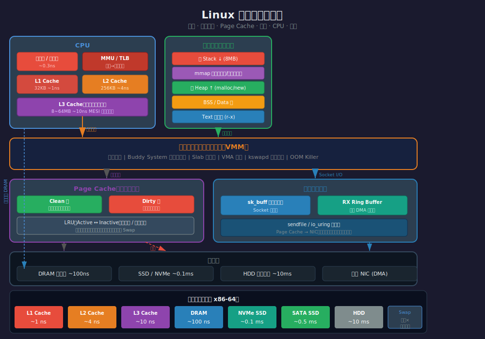

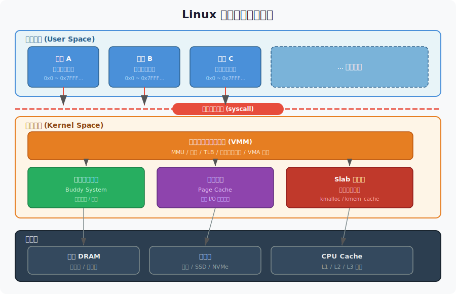

Linux 内存管理的核心理念：**一切皆文件，一切皆虚拟**。内核通过虚拟内存对每个进程呈现一个独立的、连续的地址空间，同时在底层统一管理有限的物理内存资源。

---

## 2. 普通进程的内存布局

### 2.1 64位进程虚拟地址空间

在 x86_64 架构下，用户进程拥有 **128 TB** 的虚拟地址空间（低地址），内核占用高地址空间。

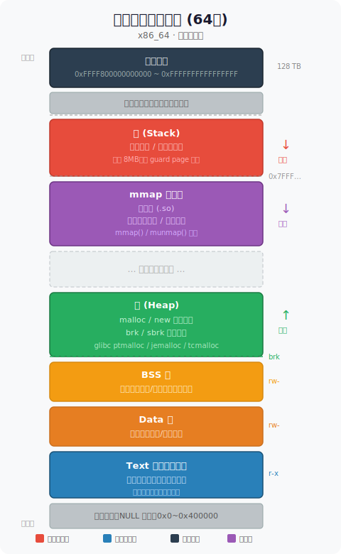

### 2.2 各段详解

| 段名 | 权限 | 内容 | 特点 |
|------|------|------|------|
| **Text（代码段）** | r-x | 程序指令 | 只读，可多进程共享同一物理页 |
| **Data（数据段）** | rw- | 已初始化的全局/静态变量 | 读写，Copy-on-Write |
| **BSS** | rw- | 未初始化的全局/静态变量 | 全零，懒分配（映射零页） |
| **Heap（堆）** | rw- | `malloc/new` 分配的内存 | 向高地址增长，`brk` 管理 |
| **mmap 区** | 可变 | 共享库、文件映射、匿名映射 | 向低地址增长 |
| **Stack（栈）** | rw- | 函数调用帧、局部变量 | 向低地址增长，有 guard page |

### 2.3 内存描述结构

```
进程 task_struct
    │
    └──► mm_struct (内存描述符)
              │
              ├── pgd          → 页全局目录 (Page Global Directory)
              ├── mmap         → VMA 链表头
              ├── mm_rb        → VMA 红黑树根
              ├── start_code / end_code    → 代码段范围
              ├── start_data / end_data    → 数据段范围
              ├── start_brk  / brk         → 堆范围
              ├── start_stack              → 栈顶
              └── mmap_base                → mmap 区起始

         VMA (vm_area_struct) 链表/红黑树
         ┌──────────────────────────────────┐
         │ vm_start │ vm_end │ vm_flags     │
         │ vm_file  │ vm_pgoff              │  ← 文件映射信息
         │ vm_ops   (fault/open/close)      │  ← 操作函数表
         └──────────────────────────────────┘
```

---

## 3. 虚拟内存与物理内存映射

### 3.1 四级页表与缺页处理

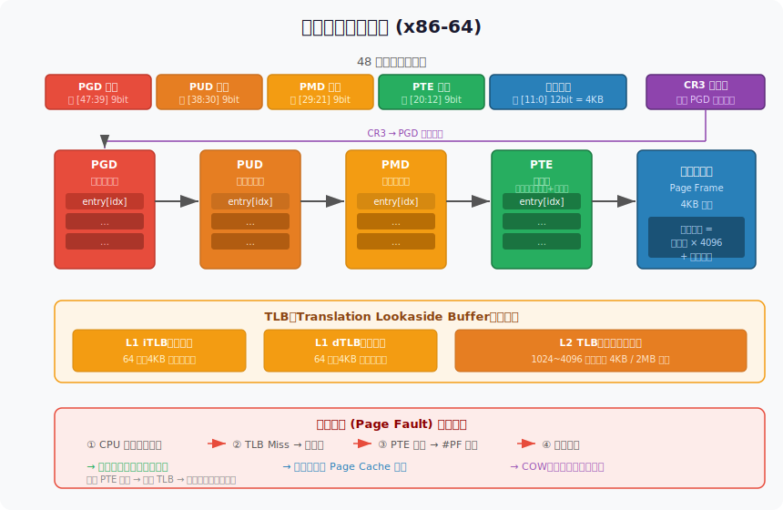

### 3.2 缺页异常（Page Fault）处理流程

```
CPU 访问虚拟地址
       │
       ▼
   TLB 命中？ ──Yes──► 直接访问物理内存
       │
      No
       │
       ▼
   页表查找 PTE
       │
  PTE 有效？ ──Yes──► 更新 TLB，访问物理内存
       │
      No (缺页异常 #PF)
       │
       ▼
  内核 do_page_fault()
       │
       ├── 地址在 VMA 内？
       │       │
       │      No ──► SIGSEGV（段错误）
       │       │
       │      Yes
       │       │
       │       ├── 匿名页（堆/栈）？
       │       │      └──► 分配新物理页，清零，建立映射
       │       │
       │       ├── 文件映射页？
       │       │      └──► 从 Page Cache 找
       │       │              │
       │       │           命中 ──► 建立映射
       │       │              │
       │       │           未中 ──► 触发 readpage，从磁盘读入
       │       │
       │       └── COW（写时复制）？
       │              └──► 复制页面，取消共享，更新映射
       │
       ▼
  返回用户空间，重试指令
```

---

## 4. 内存与磁盘交互（刷盘）

### 4.1 Page Cache 与回写全链路

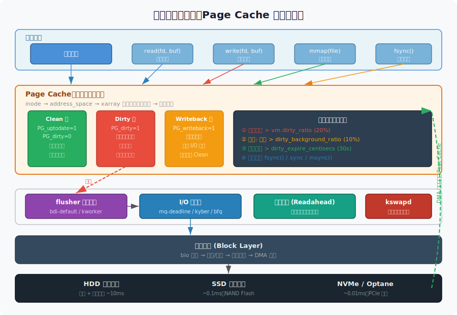

### 4.2 write() 系统调用全路径

```
应用程序 write(fd, buf, len)
        │
        ▼
    copy_from_user()  ← 从用户缓冲区复制数据
        │
        ▼
   找到 Page Cache 中对应页（若不存在则分配新页）
        │
        ▼
   数据写入缓存页
   标记页为 Dirty (PG_dirty)，页加入 dirty_list
        │
        ▼
   返回用户空间 (write 完成)
        │
        │  （异步）
        ▼
   脏页回写触发条件：
     1. 脏页比例超过 dirty_ratio (20%)
     2. 脏页存在超过 dirty_expire_centisecs (30s)
     3. 应用调用 fsync() / fdatasync()
     4. sync / msync
     5. 内存压力触发 kswapd
        │
        ▼
   flusher 内核线程 (bdi-default/kworker)
        │
        ▼
   writeback_single_inode()
        │
        ▼
   address_space->a_ops->writepage()
        │
        ▼
   块设备 I/O 提交
```

### 4.3 mmap 文件映射与缺页

```
mmap(file, offset, len, PROT_READ|PROT_WRITE, MAP_SHARED)
        │
        ▼
   建立 VMA，但不立即分配物理页
        │
        ▼
   进程访问映射地址 → 缺页异常 → filemap_fault()
        │
   Page Cache 有对应页？
        │
   No ──► 分配页，submit_bio 从磁盘读取
        │                 │
   Yes  └─────────────────┤
        │                 ▼
        ▼        建立 PTE 映射（共享映射直接指向 Page Cache 物理页）
   进程读写直接操作 Page Cache 页
   写操作置 PG_dirty，最终异步回写

关键区别：
  MAP_SHARED  → 多进程共享同一物理页（Page Cache）
  MAP_PRIVATE → Copy-on-Write，写时复制独立页
```

### 4.4 Swap 交换机制

```
物理内存不足时
       │
       ▼
  kswapd 激活（或直接内存回收）
       │
  扫描 LRU 链表
  ├── 文件缓存页（有后端文件）
  │       └──► 脏页先回写到文件，然后释放物理页
  │
  └── 匿名页（堆/栈，无后端文件）
              │
              ▼
         写入 Swap 分区 / Swap 文件
         更新 PTE（标记为 swap entry）
         释放物理页
              │
              ▼
         进程再次访问 → 缺页 → 从 Swap 换入
```

---

## 5. 内存与网络交互

以 **Java SocketChannel 发送一个 HTTP 请求并读取响应**为完整示例，逐层拆解每个阶段的内存行为。

### 5.1 全景：Java 网络读写分层图

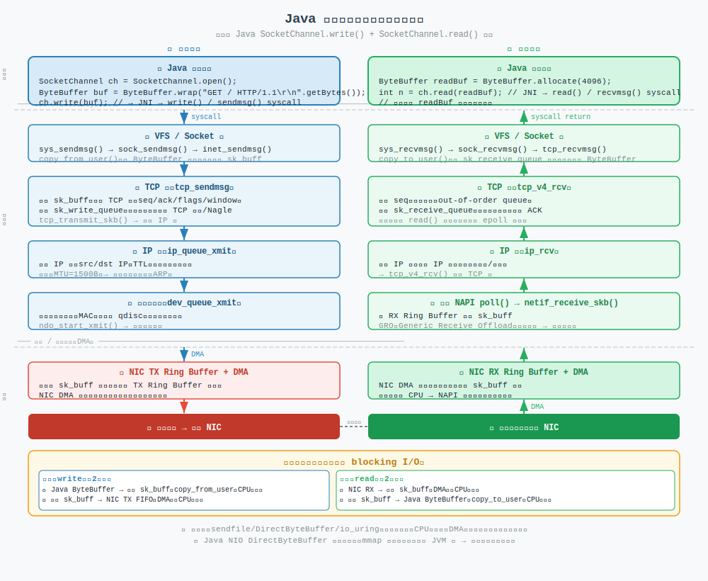

整个链路分为两条路径：
- **发送**（write）：Java ByteBuffer → syscall → TCP/IP 协议栈逐层封装 → NIC TX Ring → DMA 发出
- **接收**（read）：NIC RX Ring → DMA 写入 sk_buff → 协议栈解包 → sk_receive_queue → copy_to_user → Java ByteBuffer

**内存复制次数（普通 blocking I/O）**：

```
发送：① Java ByteBuffer → 内核 sk_buff（copy_from_user，CPU 复制）
      ② sk_buff → NIC TX FIFO（DMA，无 CPU 参与）

接收：① NIC RX → 内核 sk_buff（DMA，无 CPU 参与）
      ② sk_buff → Java ByteBuffer（copy_to_user，CPU 复制）

使用 DirectByteBuffer（堆外内存）可消除 JVM 堆→堆外的额外一次复制。
DMA 复制是硬件必须完成的，无法消除。
```

---

### 5.2 sk_buff 结构 + Socket 发送/接收队列

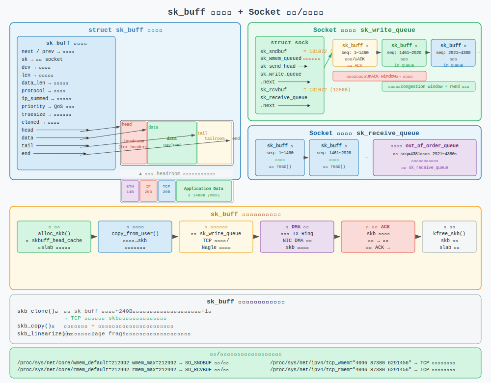

#### sk_buff 核心字段

`sk_buff` 是 Linux 内核网络栈的核心数据结构，贯穿从驱动到应用层的全链路：

```
struct sk_buff {
    struct sk_buff  *next, *prev;   // 链表指针（在队列中）
    struct sock     *sk;            // 所属 socket
    struct net_device *dev;         // 出/入网络设备

    // 数据区四个指针（同一块连续内存的不同位置）
    unsigned char   *head;          // 分配内存的起始（不变）
    unsigned char   *data;          // 有效数据的起始（协议头向前推）
    unsigned char   *tail;          // 有效数据的结束
    unsigned char   *end;           // 分配内存的结束（不变）

    unsigned int     len;           // data 到 tail 的长度（当前有效数据）
    unsigned int     data_len;      // 分散页中的数据长度（分片时用）
    __u16            protocol;      // 以太网帧类型（0x0800=IPv4）
    __u8             ip_summed;     // 校验和状态（硬件卸载/需软件计算）
    unsigned int     truesize;      // sk_buff + 数据页占用的总内存
}
```

**协议头零拷贝插入**：`head` 和 `data` 之间预留了 `headroom`，每一层协议栈向 `data` 前移指针来插入自己的头部，**不需要复制数据**：

```
IP 层：    skb_push(skb, sizeof(iphdr))   → data 指针前移 20B，写入 IP 头
以太网层： skb_push(skb, sizeof(ethhdr)) → data 指针再前移 14B，写入 MAC 头
```

#### Socket 发送队列 sk_write_queue

```
sk_write_queue 中维护两类 sk_buff：

[已发送未确认（unACK）区]    [待发送区]
    skb₁ skb₂ skb₃            skb₄ skb₅
    ↑                               ↑
  snd_una                        snd_nxt

规则：
  snd_una → snd_nxt 之间：已发出但 ACK 未回，必须保留（重传需要）
  snd_nxt 之后：尚未发出，等待拥塞窗口允许
  收到 ACK（ack_seq）后：snd_una 前移，释放已确认的 skb
```

#### Socket 接收队列 sk_receive_queue

```
sk_receive_queue：按序到达的数据，等待 read() 消费
out_of_order_queue：乱序到达的数据，等待空洞填补后移入主队列

接收缓冲区大小：sk_rcvbuf（默认 131072 字节 = 128KB）
  sk_rmem_alloc >= sk_rcvbuf → 新包被丢弃 → 对端触发重传
  应用 read() 消费数据后 → sk_rmem_alloc 减小 → 发 ACK 扩大窗口
```

---

### 5.3 TCP 发送路径详解

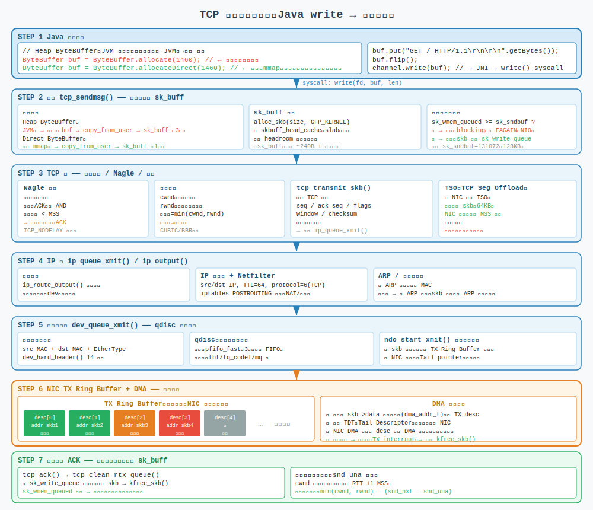

#### 关键节点说明

**① Java ByteBuffer 类型的影响**

```java
// HeapByteBuffer（默认）：JVM 堆内，GC 时地址可能移动
ByteBuffer buf = ByteBuffer.allocate(1460);
// 发送时：JVM堆内数据 → 临时堆外buf → copy_from_user → sk_buff（3次复制）

// DirectByteBuffer：堆外 mmap 匿名区，地址固定
ByteBuffer buf = ByteBuffer.allocateDirect(1460);
// 发送时：堆外数据 → copy_from_user → sk_buff（1次复制，少2次）
```

**② Nagle 算法与 TCP_NODELAY**

```
Nagle 规则（默认开启）：
  若有已发送但未被 ACK 的数据 AND 当前数据 < MSS（1460B）
  → 等待，合并更多数据后再发送（减少小包数量）

关闭 Nagle（低延迟场景必须）：
  Socket socket = ...;
  socket.setTcpNoDelay(true);
  // 对应内核：TCP_NODELAY socket 选项

适合关闭的场景：Redis 客户端、HTTP/1.1 pipeline、游戏协议
不适合关闭：批量文件传输（Nagle 有助于提升吞吐）
```

**③ TSO（TCP Segmentation Offload）**

```
无 TSO（软件分片）：
  内核把 64KB 大 skb 按 MSS=1460B 切成 ~45 个 skb，
  每个单独加 TCP/IP 头，逐个提交驱动 → CPU 开销大

有 TSO（NIC 硬件分片）：
  内核传一个大 skb（≤64KB）给驱动，驱动一次提交，
  NIC 硬件自动按 MSS 切割、加头、发出 → CPU 几乎零开销

查看/开关 TSO：
  ethtool -k eth0 | grep tcp-segmentation
  ethtool -K eth0 tso off   # 关闭（调试时用）
```

---

### 5.4 TCP 接收路径详解

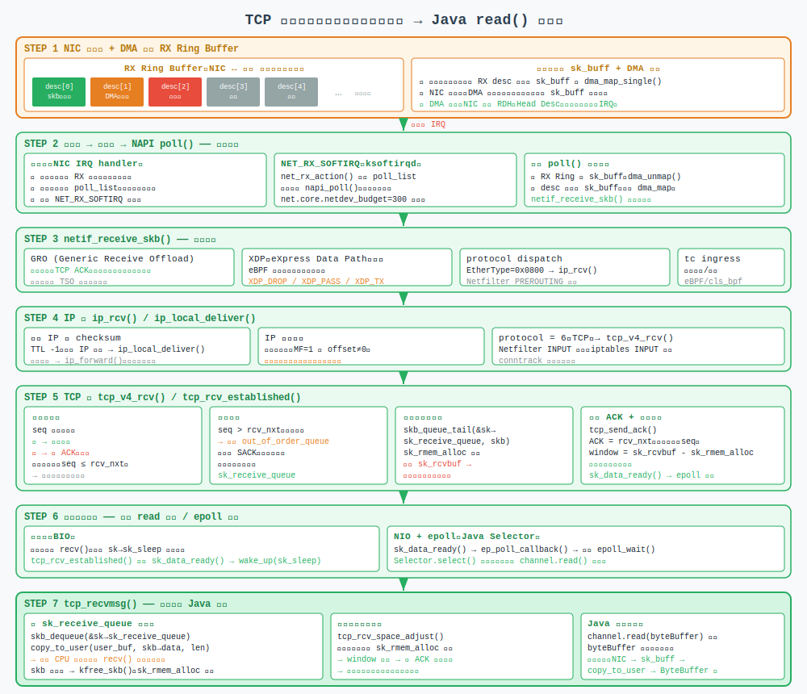

#### 关键节点说明

**① NAPI 软中断与 CPU 亲和**

```
高流量时 NET_RX_SOFTIRQ 负载很重，用 top 可以看到：
  %si（软中断）列很高，通常是某一个 CPU 核心

优化：将网卡 IRQ 绑定到指定 CPU
  cat /proc/interrupts | grep eth0      # 找到网卡 IRQ 号
  echo 2 > /proc/irq/N/smp_affinity     # 绑到 CPU1（bit mask）
  配合 ethtool -L eth0 combined 8      # 多队列分摊到多核
```

**② epoll 与 sk_data_ready 的连接**

```
Java NIO 的 Selector.select() 底层是 epoll_wait()：

  epoll_ctl(epfd, EPOLL_CTL_ADD, sockfd, EPOLLIN)
  → 内核在 socket 的 sk_wq（等待队列）注册 ep_poll_callback

  收到数据时：
    tcp_rcv_established()
    → sk_data_ready()（即 sock_def_readable()）
    → ep_poll_callback()
    → 将 socket 加入 epoll 就绪链表
    → epoll_wait() 返回

  channel.read() 调用时：
    tcp_recvmsg()
    → copy_to_user(byteBuffer.address, skb.data, len)
    → skb 消费完后 kfree_skb()
```

**③ 零窗口与窗口探测**

```
场景：应用来不及调用 read()，sk_receive_queue 满

  sk_rmem_alloc → sk_rcvbuf：接收窗口缩小为 0（零窗口）
  → 发 ACK 通知对端 window=0
  → 对端停止发送，等待 window update

  应用 read() 消费数据后：
  → sk_rmem_alloc 减小
  → tcp_rcv_space_adjust() 发 window update ACK
  → 对端恢复发送

对端零窗口探测（window probe）：
  对端每隔一段时间发 1B 数据探测窗口是否恢复
  防止 window update ACK 丢失导致双方永久等待
```

---

### 5.5 NIC Ring Buffer 与 NAPI 机制

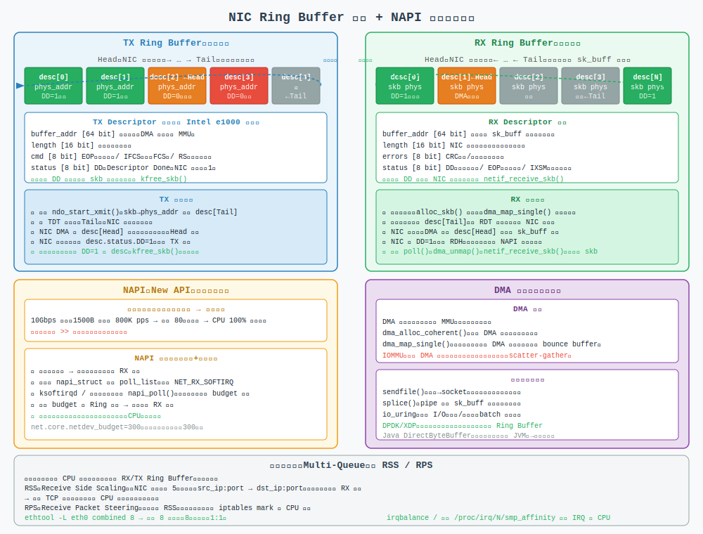

#### Ring Buffer 大小调优

```bash
# 查看当前 Ring Buffer 大小
ethtool -g eth0
# 输出示例：
# Pre-set maximums:
#   RX: 4096    TX: 4096
# Current hardware settings:
#   RX: 256     TX: 256    ← 默认偏小，高流量时丢包

# 调大 Ring Buffer（高吞吐服务器推荐）
ethtool -G eth0 rx 4096 tx 4096

# 验证是否有丢包（RX missed = Ring Buffer 满时丢弃的包）
ethtool -S eth0 | grep -i miss
# 或
cat /proc/net/dev | grep eth0   # 查看 drop 列
```

#### 发送队列长度（txqueuelen）

```bash
# 查看
ip link show eth0 | grep qlen   # 或 ifconfig eth0

# 调大（高吞吐批量发送场景）
ip link set eth0 txqueuelen 10000
# 默认 1000，对应 qdisc 中的包缓存数量
# 太小：突发时丢包；太大：延迟增加（bufferbloat 问题）
```

---

### 5.6 零拷贝技术对比

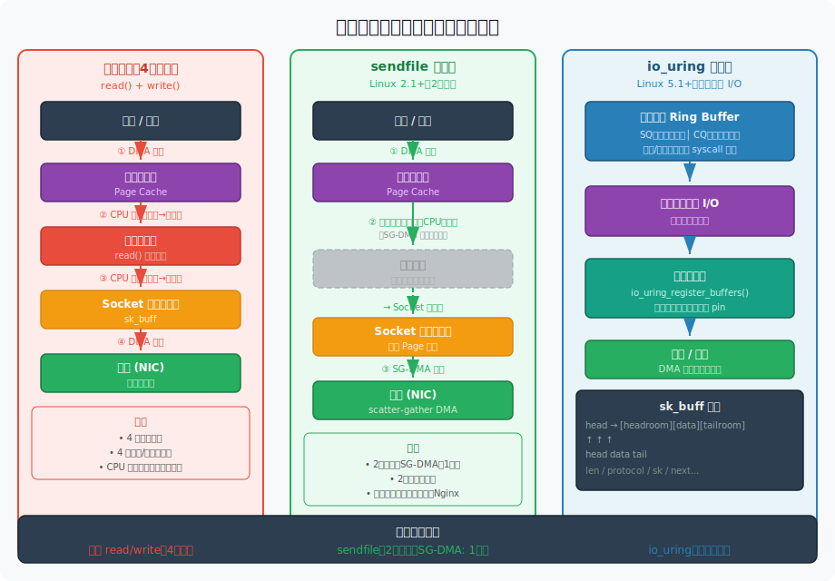

```
┌──────────────────┬───────────┬──────────────────────────────────────┐
│ 技术              │ CPU复制次数│ 说明                                 │
├──────────────────┼───────────┼──────────────────────────────────────┤
│ 普通 read+write  │ 4次        │ 磁盘→PageCache→用户buf→内核buf→NIC   │
│ sendfile()       │ 2次(DMA)   │ PageCache→NIC，用户态零参与           │
│ sendfile+DMA收集 │ 0次CPU     │ 需网卡支持 scatter-gather DMA         │
│ mmap+write       │ 3次        │ 省去用户buf，但仍需write syscall      │
│ DirectByteBuffer │ 3次        │ 省去JVM堆→堆外复制                   │
│ io_uring         │ 0~2次      │ 异步零拷贝，内核5.1+                  │
│ XDP/DPDK         │ 0次        │ 完全绕过内核协议栈，用户态直接收发      │
└──────────────────┴───────────┴──────────────────────────────────────┘
```

#### Java 中的零拷贝实践

```java
// 1. FileChannel.transferTo()  → 底层 sendfile()
FileChannel fileChannel = FileChannel.open(path, StandardOpenOption.READ);
SocketChannel socketChannel = ...;
fileChannel.transferTo(0, fileChannel.size(), socketChannel);
// 文件数据直接从 Page Cache → NIC，不经过 JVM 堆

// 2. DirectByteBuffer  → 减少一次复制
ByteBuffer directBuf = ByteBuffer.allocateDirect(65536);
// 分配在堆外（mmap 匿名区），send 时直接 copy_from_user，不经 JVM 堆

// 3. MappedByteBuffer（mmap）
MappedByteBuffer mbb = fileChannel.map(FileChannel.MapMode.READ_ONLY, 0, size);
socketChannel.write(mbb);
// 文件 mmap 到进程地址空间，write 时内核直接从 Page Cache 取数据
```

---

## 6. 内存与CPU交互

### 6.1 CPU Cache 层次与 NUMA

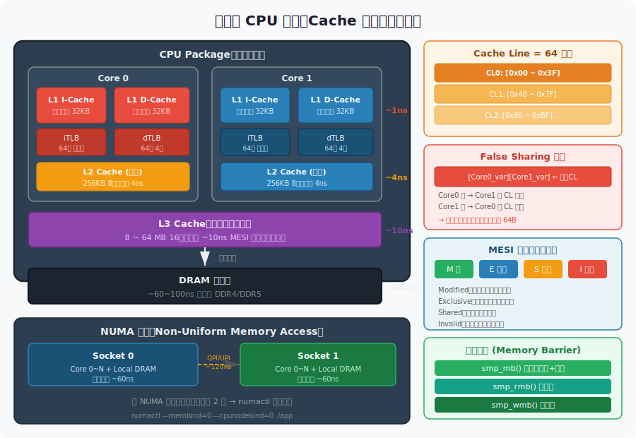

### 6.2 Cache Line 与内存访问

```
Cache Line = 64 字节（x86 标准）

CPU 读取 0x04 处的 int：
  → 整个 Cache Line [0x00~0x3F] 被加载到 L1
  → 后续访问 [0x00~0x3F] 内任何数据均命中 L1

False Sharing 问题：
  Cache Line:  [ Core0_var ][ Core1_var ]  ← 同一 Cache Line
  Core0 写 → Core1 的 Cache Line 失效
  Core1 写 → Core0 的 Cache Line 失效
  → 性能下降！解法：__attribute__((aligned(64))) 填充到 64 字节
```

### 6.3 内存屏障与 CPU 乱序执行

```
现代 CPU 乱序执行示例：
  程序顺序: a=1; b=2;    CPU实际: b=2; a=1;（流水线重排）

内存屏障类型（Linux）：
  smp_rmb()  → 读屏障，屏障前的读 happens-before 屏障后的读
  smp_wmb()  → 写屏障，屏障前的写 happens-before 屏障后的写
  smp_mb()   → 全屏障，读写均保序
  barrier()  → 仅编译器屏障，防止编译器重排（不影响CPU）
```

### 6.4 DMA 与 CPU 内存交互

```
DMA 方式：
  CPU 配置 DMA 控制器 → DMA 直接在设备与 DRAM 间传输数据
  → 传输完成后发送中断通知 CPU

  注意：DMA 操作的内存必须物理连续（或用 IOMMU/scatter-gather）
       驱动使用 dma_alloc_coherent() 分配 DMA 安全内存
```

---

## 7. 内存回收机制

### 7.1 水位线、LRU 与 OOM Killer

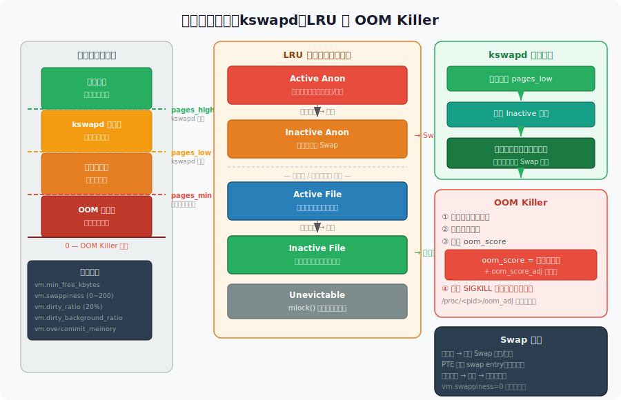

### 7.2 LRU 链表结构

```
┌───────────────────────────────────────────┐
│  Active Anon    ← 近期访问的匿名页         │
│  Inactive Anon  ← 老化的匿名页 (候选换出)  │
│  Active File    ← 近期访问的文件缓存页     │
│  Inactive File  ← 老化的文件缓存页(候选释放│
│  Unevictable    ← mlock 锁定，不可回收     │
└───────────────────────────────────────────┘
```

### 7.3 内存水位线参数

```
pages_high  ──── 高水位：kswapd 停止回收
pages_low   ──── 低水位：kswapd 开始回收
pages_min   ──── 最低水位：直接回收，限制非内核分配
0           ──── OOM Killer 出击

相关参数（/proc/sys/vm/）：
  vm.min_free_kbytes        → 设置 pages_min
  vm.swappiness (0~200)     → 0: 尽量不换出匿名页 / 60: 默认 / 200: 优先换出匿名页
  vm.dirty_ratio            → 脏页上限占总内存比例（触发直接回写）
  vm.dirty_background_ratio → 后台回写触发阈值
```

---

## 8. 常见问题与调优

### 8.1 内存泄漏定位

```bash
# 查看进程内存使用
cat /proc/<pid>/status | grep -i vm
cat /proc/<pid>/smaps        # 各 VMA 详细统计

# 使用 valgrind
valgrind --leak-check=full ./your_program

# 使用 BPF 追踪分配
bpftrace -e 'uprobe:/lib/libc.so.6:malloc { @[ustack()] = sum(arg0); }'
```

### 8.2 Page Cache 相关

```bash
# 查看缓存使用
free -h
cat /proc/meminfo

# 手动清理 Page Cache（谨慎使用）
echo 1 > /proc/sys/vm/drop_caches   # 清理 page cache
echo 2 > /proc/sys/vm/drop_caches   # 清理 dentries/inodes
echo 3 > /proc/sys/vm/drop_caches   # 清理所有

# 查看脏页统计
grep -E "Dirty|Writeback" /proc/meminfo
```

### 8.3 NUMA 调优

```bash
# 查看 NUMA 拓扑
numactl --hardware

# 绑定进程到特定 NUMA 节点
numactl --membind=0 --cpunodebind=0 ./your_app

# 查看 NUMA 命中率（命中率低说明跨节点访问多）
numastat -p <pid>
```

### 8.4 关键内核参数速查

| 参数 | 默认值 | 说明 |
|------|--------|------|
| `vm.swappiness` | 60 | Swap 使用倾向 |
| `vm.dirty_ratio` | 20% | 触发直接回写的脏页比例 |
| `vm.dirty_background_ratio` | 10% | 触发后台回写的脏页比例 |
| `vm.min_free_kbytes` | 动态 | 最低保留内存 |
| `vm.overcommit_memory` | 0 | 内存过提交策略 |
| `vm.oom_kill_allocating_task` | 0 | OOM 时是否直接杀死申请内存的进程 |
| `net.core.rmem_max` | 212992 | Socket 接收缓冲区最大值 |
| `net.core.wmem_max` | 212992 | Socket 发送缓冲区最大值 |

---

## 总结

核心设计哲学：

1. **虚拟化**：每个进程独立地址空间，内核统一管理物理资源
2. **缓存化**：Page Cache 让磁盘 I/O 尽量变成内存操作
3. **懒分配**：不访问不分配，减少内存浪费
4. **写时复制**：fork() 后页面共享，写时才复制
5. **零拷贝**：减少内存间数据搬运，提升 I/O 吞吐

---

## 补充问答

### Q1：48位有效虚拟地址，段不是64位的吗，段和页怎么联动？

x86-64 架构下，**段机制在64位模式下已基本废弃**，段基址强制为0，段限制被忽略，地址翻译完全由页表负责。两者的关系如下：

**段寄存器的现代作用**：
- 不再用于地址翻译，只保留**特权级控制**（CS.DPL 标识 Ring0/Ring3）
- FS/GS 段寄存器例外：用于指向线程本地存储（TLS），基址非零，由 `wrfsbase`/`wrgsbase` 指令或 `arch_prctl` 系统调用设置

**为什么只有48位有效**：
- 64位虚拟地址理论可寻址 16EB，但当前处理器只实现了 **48位**（部分新处理器扩展到57位，启用5级页表）
- 高16位必须是第47位的**符号扩展**（canonical address），否则触发 General Protection Fault
- 实际范围：
  
  ```bash
  x86_64 CPU 要求虚拟地址必须是 canonical（符号扩展）
  用户空间地址：0x0000_0000_0000_0000 ~ 0x0000_7FFF_FFFF_FFFF
  高 16 位全 0 → canonical
  内核空间地址：0xFFFF_8000_0000_0000 ~ 0xFFFF_FFFF_FFFF_FFFF
  高 16 位全 1 → canonical
  ```

**地址翻译全路径**（段已退化，只剩页表）：

```
虚拟地址（48位）
  ├── [47:39] → PGD 索引（9位）→ 页全局目录
  ├── [38:30] → PUD 索引（9位）→ 页上级目录
  ├── [29:21] → PMD 索引（9位）→ 页中间目录
  ├── [20:12] → PTE 索引（9位）→ 页表项
  └── [11:0]  → 页内偏移（12位）→ 4KB 页内位置
                                    ↓
                              物理地址
```

**隔离用户空间和内核空间**

- 即使低 48 位相同，也不会混用
- CPU 用高位区分 canonical 地址 → 内核态 / 用户态

**页表映射不同**

- 用户空间的 PML4 entry 指向用户页表
- 内核空间的 PML4 entry 指向内核页表

所以即使低 48 位相同，**访问到的物理页可以完全不同**


### Q2：缺页中断各种情况的具体例子

#### 情况一：Demand Paging（按需加载）

```
场景：mmap 映射一个 100MB 的文件，但只读取其中一行

int fd = open("bigfile.bin", O_RDONLY);
char *p = mmap(NULL, 100*1024*1024, PROT_READ, MAP_SHARED, fd, 0);
// 此时：100MB 的 VMA 已建立，0 个物理页被分配

char c = p[4096];  // 访问第 2 页
// → 缺页中断
// → OS 检查 VMA：地址合法，文件映射
// → 查 Page Cache：该页不在缓存
// → 触发 readpage()，从磁盘读入第 4096~8191 字节
// → 建立 PTE，present=1
// → 重试指令，返回用户空间

// 其余 99MB 从未被访问 → 从未分配物理内存
```

#### 情况二：写时复制（COW）

```
场景：fork() 后父子进程写各自的全局变量

int g = 42;  // 全局变量，在 Data 段

pid_t pid = fork();
// fork 后：父子进程共享同一物理页（g 所在页）
// 该页 PTE 被标记为只读（即使原来可写）

if (pid == 0) {
    g = 100;  // 子进程写 g
    // → 写保护缺页中断（Protection Fault）
    // → OS：这是 COW 页，复制一份新物理页给子进程
    // → 子进程 PTE 指向新页，g=100
    // → 父进程 PTE 仍指向原页，g=42
}
```

#### 情况三：Segmentation Fault（非法访问）

```
场景：空指针解引用

int *p = NULL;
*p = 1;  // 访问地址 0x0
// → 缺页中断
// → OS：在进程 VMA 中查找包含地址 0x0 的区域
// → 找不到（内核不会为地址 0 建立 VMA）
// → 向进程发送 SIGSEGV
// → 进程崩溃，打印 "Segmentation fault (core dumped)"
```

#### 情况四：栈自动增长

```
场景：深递归函数，栈向下扩展到新页

void deep_recurse(int n) {
    char buf[4096];  // 局部变量，占用栈空间
    if (n > 0) deep_recurse(n - 1);
}
// 每层递归 RSP 向下移动 ~4KB
// 当 RSP 进入一个新的、未映射的页
// → 缺页中断
// → OS：地址在栈 VMA 的扩展范围内（低于 start_stack 但未超 ulimit）
// → 分配新物理页，扩展栈 VMA 的 vm_start
// → 继续执行，无感知
// 若超过栈大小限制（默认 8MB）→ SIGSEGV（栈溢出）
```

---

### Q3：进程申请内存的完整流程

以 `malloc(1MB)` 为例，分三层：

#### 第一层：glibc malloc 决策

```
malloc(1MB)
    │
    ├── 大小 > 128KB（MMAP_THRESHOLD）？
    │       Yes → 调用 mmap(MAP_ANONYMOUS)   ← 直接向 OS 申请
    │       No  → 从 ptmalloc arena 内部分配  ← 可能无需系统调用
    │
    └── （小块内存堆不够时，调用 brk() 扩展堆顶）
```

#### 第二层：内核 mmap 系统调用

```
sys_mmap(NULL, 1MB, PROT_READ|PROT_WRITE, MAP_ANONYMOUS|MAP_PRIVATE, -1, 0)
    │
    ▼
do_mmap()
    │
    ├── 在进程 mm_struct 的红黑树中插入新 VMA
    │     vm_start = 0x7f3a00000000
    │     vm_end   = 0x7f3a00100000
    │     vm_flags = VM_READ | VM_WRITE | VM_ANON
    │
    ├── 没有分配任何物理页！
    │
    └── 返回虚拟地址 0x7f3a00000000 给 glibc
         glibc 返回给应用程序
```

#### 第三层：首次访问触发缺页（物理内存才真正分配）

```
memset(ptr, 0, 1MB)  // 或任何写操作
    │
    ▼
CPU 访问 0x7f3a00000000（第1页）
    → 缺页中断（PTE present=0）
    → do_anonymous_page()
    → alloc_page()：从 Buddy System 分配一个物理页帧
    → clear_page()：清零（匿名页保证内容为0，防止信息泄露）
    → 建立 PTE：虚拟页 → 物理页帧，设置 present=1
    → 返回，重试写指令

    （继续访问下一页，再次缺页，重复上述过程）
    （1MB = 256页，触发256次缺页中断）
```

#### 关键：Linux Overcommit 机制

```
场景：机器只有 4GB 物理内存

malloc(100GB)  // 申请远超物理内存的虚拟空间
    → 只要 vm.overcommit_memory != 2，内核直接允许
    → 返回虚拟地址（此时物理内存：0 字节被使用）
    → 只有真正写入时才分配物理内存
    → 若物理内存耗尽 → OOM Killer 出击，杀死某个进程

vm.overcommit_memory 策略：
  0（默认）：启发式允许，拒绝明显不合理的申请
  1：总是允许（最激进，容器场景常用）
  2：严格限制，总虚拟内存 ≤ swap + 物理内存 * overcommit_ratio
```

---

### Q4：进程能一次直接申请到虚拟页和物理页吗？必须走缺页中断吗？

**不是必须的**，有若干机制可以绕过缺页中断，直接完成虚拟→物理的映射。

#### 默认行为：懒分配（必须走缺页）

```
mmap / malloc
    → 只建立 VMA（虚拟地址区间记录）
    → PTE 的 present 位 = 0
    → 首次访问 → 缺页中断 → 分配物理页 → 建立 PTE
```

这是 Linux 的默认路径，节省物理内存，支持 overcommit。

---

#### 方式一：`MAP_POPULATE` — mmap 时预填充页表

```c
// 普通 mmap：只建 VMA，不分配物理页
char *p = mmap(NULL, size, PROT_READ|PROT_WRITE,
               MAP_ANONYMOUS|MAP_PRIVATE, -1, 0);

// 加 MAP_POPULATE：mmap 返回前，内核遍历所有页，
// 主动触发缺页（在内核态完成），建立好所有 PTE
char *p = mmap(NULL, size, PROT_READ|PROT_WRITE,
               MAP_ANONYMOUS|MAP_PRIVATE|MAP_POPULATE, -1, 0);
// 返回时：所有虚拟页已映射物理页，进程访问不再触发缺页中断
```

**代价**：mmap 调用本身变慢（阻塞直到所有页分配完），但后续访问延迟极低。适合实时性要求高的场景。

---

#### 方式二：`mlock` — 锁定内存，强制驻留物理页

```c
char *p = mmap(NULL, size, PROT_READ|PROT_WRITE,
               MAP_ANONYMOUS|MAP_PRIVATE, -1, 0);

mlock(p, size);
// mlock 做两件事：
// 1. 遍历所有页，触发缺页（类似 MAP_POPULATE）
// 2. 将这些物理页加入 Unevictable LRU，禁止被 kswapd 换出

// 效果：物理页立即分配 + 永远不会被交换到 Swap
```

常用于：数据库 buffer pool、实时音视频处理、加密密钥缓冲区（防止密钥被换出到磁盘）。

需要 `CAP_IPC_LOCK` 权限或配置 `ulimit -l`。

---

#### 方式三：`mmap(MAP_LOCKED)` — 标志位组合

```c
// MAP_LOCKED = MAP_POPULATE + mlock 的组合效果
char *p = mmap(NULL, size, PROT_READ|PROT_WRITE,
               MAP_ANONYMOUS|MAP_PRIVATE|MAP_LOCKED, -1, 0);
// 等价于 mmap + mlock，一步完成
```

---

#### 方式四：`posix_memalign` + `madvise(MADV_WILLNEED)`

```c
void *p;
posix_memalign(&p, 4096, size);  // 分配对齐内存（仍是懒分配）

madvise(p, size, MADV_WILLNEED);
// 告诉内核：这块内存马上要用，请预读/预分配
// 内核异步触发缺页，后台建立映射
// 应用继续执行，访问时大概率已命中
```

**注意**：`MADV_WILLNEED` 是异步的，不保证返回时物理页一定就绪（与 MAP_POPULATE 的同步阻塞不同）。

---

#### 方式五：内核驱动 / 特殊场景 — `remap_pfn_range`

内核驱动可以将特定物理页帧（PFN）直接映射到用户虚拟地址，完全跳过缺页机制：

```c
// 内核驱动代码（用户无法直接调用）
remap_pfn_range(vma, vma->vm_start, pfn, size, vma->vm_page_prot);
// 立即建立虚拟→物理的 PTE，用户访问时无缺页
```

用于：设备内存映射（GPU framebuffer、FPGA 寄存器）、DPDK 零拷贝网络。

---

#### 对比总结

| 方式 | 分配时机 | 是否触发缺页 | 能否防换出 | 典型场景 |
|------|----------|------------|-----------|---------|
| 默认 mmap/malloc | 首次访问 | 是（用户态触发） | 否 | 通用应用 |
| `MAP_POPULATE` | mmap 调用时（内核） | 内核代劳，用户不感知 | 否 | 低延迟服务 |
| `mlock` | 调用时 | 内核代劳 | **是** | 实时/加密 |
| `MAP_LOCKED` | mmap 调用时 | 内核代劳 | **是** | 同上 |
| `MADV_WILLNEED` | 异步后台 | 异步，不保证 | 否 | 预读优化 |
| `remap_pfn_range` | 驱动调用时 | 否 | 视驱动实现 | 设备内存映射 |

**结论**：缺页中断是默认路径，但不是唯一路径。当你需要确定性延迟（实时系统、数据库）或物理页必须提前就绪时，可以用上述方式主动预分配，代价是申请时多花时间和内存，换取运行时零缺页开销。

---

### Q5：Redis 和 JVM 会提前分配物理页吗？

#### Redis：会，但策略随配置变化

**场景一：`activerehashing` + `jemalloc`（默认）**

Redis 默认使用 jemalloc 作为内存分配器。jemalloc 本身不预分配物理页，仍走缺页路径。但 Redis 有一个关键配置：

```bash
# redis.conf
save ""                    # 关闭 RDB 持久化
appendonly no              # 关闭 AOF

# 关键配置：
vm-overcommit = 1          # 建议设置（/proc/sys/vm/overcommit_memory）
```

**场景二：`BGSAVE` / `BGREWRITEAOF` 触发 fork() — COW 导致大量缺页**

```
Redis 主进程占用 10GB 内存
    │
    ├── BGSAVE：fork() 子进程做快照
    │       │
    │       ├── 父子共享所有物理页（COW，PTE 标记只读）
    │       │
    │       └── 父进程继续接受写请求
    │               → 每次写操作触发 COW 缺页
    │               → 复制被修改的物理页
    │               → 高峰期可能额外消耗数 GB 内存
    │
    └── 这就是为什么 Redis 需要 overcommit_memory=1
        （fork 瞬间虚拟内存翻倍，overcommit=0 会拒绝 fork）
```

**场景三：`transparent_hugepage` 与 Redis 的冲突**

```bash
# 问题：Linux 默认开启 THP（透明大页，2MB 页）
# Redis 写操作频繁，COW 时复制的是 2MB 大页而非 4KB 小页
# → COW 代价放大 512 倍，内存抖动严重

# Redis 官方建议关闭 THP：
echo never > /sys/kernel/mm/transparent_hugepage/enabled

# Redis 6.x 起，启动时会自动检测并打印警告：
# WARNING you have Transparent Huge Pages (THP) support enabled in your kernel.
# This will create latency and memory usage issues with Redis.
```

**场景四：`lazyfree`（Redis 4.0+）— 异步释放，不是预分配**

```
DEL key（大 Hash/List）
    默认：同步释放，阻塞主线程（类似 free() 触发内存归还）
    lazyfree：将释放任务投递给后台线程，主线程立即返回

# redis.conf
lazyfree-lazy-eviction yes
lazyfree-lazy-expire yes
lazyfree-lazy-server-del yes
```

**结论**：Redis 本身不主动预分配物理页，但 fork-COW 模型使其对内存的实际消耗难以预测，这是 Redis 内存管理的核心复杂性所在。

---

#### JVM：会，且非常激进

JVM（以 HotSpot 为例）在启动时就会大量预分配物理页，这是 JVM 与普通进程最大的内存行为差异之一。

**Heap 预分配：`-Xms` vs `-Xmx`**

```bash
java -Xms4g -Xmx8g MyApp
#      ↑           ↑
#  初始堆大小    最大堆大小

# 启动时：
# 1. JVM 向 OS 申请 8GB 虚拟地址（mmap，建立 VMA）
# 2. 但仅对 Xms=4GB 部分触发实际物理页分配
#    （通过 memset/madvise 预热，取决于 GC 实现）
# 3. 剩余 4GB（Xms~Xmx 之间）保留虚拟地址，按需扩展
```

**G1 GC / ZGC 的物理页预分配行为**

```
G1 GC 启动（-XX:+UseG1GC）：
    │
    ├── 将堆划分为固定大小的 Region（默认 1MB~32MB）
    │
    ├── 启动时提交（commit）Xms 对应的 Region
    │     → commit = mmap + 触发缺页（实际分配物理页）
    │     → Linux 上通过 os::commit_memory() → mmap(MAP_FIXED|MAP_POPULATE)
    │
    └── 超出 Xms 的 Region：虚拟地址保留，物理页按需提交
          → GC 需要扩展堆时：commit 新 Region → 立即得到物理页

# 结果：JVM 启动后，top/htop 看到的 RES（常驻内存）≈ Xms
```

**`-XX:+AlwaysPreTouch` — 强制预热所有物理页**

```bash
java -Xms8g -Xmx8g -XX:+AlwaysPreTouch MyApp

# AlwaysPreTouch 做的事：
# JVM 启动时，用一个循环遍历整个堆的每一页并写入0：
#   for (char *p = heap_start; p < heap_end; p += page_size)
#       *p = 0;  // 触发缺页，立即分配物理页
#
# 效果：
#   启动时间变长（8GB 堆约多花 10~30 秒）
#   启动后 RES ≈ Xmx，物理内存全部就位
#   运行期间零缺页中断，GC 停顿时间更稳定

# 适合场景：对响应时间稳定性要求极高的服务（交易系统、实时竞价）
# 不适合：启动速度敏感、Serverless/函数计算（冷启动慢）
```

**Metaspace / Direct Memory / JIT 代码缓存**

```
JVM 内存区域                  物理页分配时机
─────────────────────────────────────────────
Heap（G1/ZGC）                启动时提交 Xms，运行时按需扩展
Metaspace（类元数据）          类加载时按需分配（无预分配）
Direct ByteBuffer             allocateDirect() 时立即 mmap，首次访问缺页
JIT 代码缓存（CodeCache）      JIT 编译时按需分配
线程栈（-Xss）                 线程创建时 mmap，首次访问栈帧时缺页
```

**Direct ByteBuffer 的特殊性**

```java
// Java NIO
ByteBuffer buf = ByteBuffer.allocateDirect(1024 * 1024 * 100); // 100MB
// → 调用 unsafe.allocateMemory() → malloc() → 走 glibc/OS 懒分配
// → 此时无物理页

buf.put(someData);  // 首次写入
// → 缺页中断，按页分配物理内存
// → 后续访问已映射的页：无缺页

// 想提前分配？手动预热：
// （JVM 没有提供直接的 API，需要自己写循环填充）
for (int i = 0; i < buf.capacity(); i += 4096) {
    buf.put(i, (byte) 0);  // 每页写一个字节，触发缺页
}
```

**对比：Redis vs JVM 内存预分配行为**

| | Redis | JVM（默认） | JVM（AlwaysPreTouch） |
|--|-------|------------|----------------------|
| 启动时物理内存占用 | 很低（按需） | 约等于 Xms | 约等于 Xmx |
| 运行时缺页中断 | 有（数据增长时） | 有（堆扩展时） | 几乎没有 |
| fork/COW 风险 | 高（BGSAVE） | 无（JVM 不 fork） | 无 |
| 内存锁定（防换出） | 可配置 `mlock` | 可用 `-XX:+UseLargePages` | 同左 |
| 适合场景 | 低启动内存、数据驱动增长 | 通用 | 低延迟、金融交易 |

## `mmap` 是什么

`mmap` 是 **Linux/Unix 系统调用**，用于将 **文件或匿名内存映射到进程的虚拟地址空间**。简单来说，就是告诉操作系统：

> “给我一块连续的虚拟地址空间，可以用来存放数据（文件或匿名内存）。

---

### Q6：fork 做了什么？修改主进程内容会发生什么？

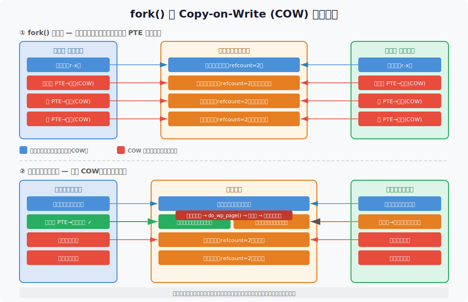

#### fork 的本质：复制进程描述符，共享物理内存

`fork()` 创建一个与父进程几乎完全相同的子进程，但代价极低——它**不复制物理内存**，而是依赖 **Copy-on-Write（写时复制）** 机制。

```
父进程调用 fork()
       │
       ▼
内核 do_fork() / copy_process()
       │
       ├── 1. 分配新的 task_struct（进程描述符）
       │
       ├── 2. 复制 mm_struct（内存描述符）
       │       ├── 复制所有 VMA（vm_area_struct 链表/红黑树）
       │       └── 复制页表项（PTE）—— 但不分配新物理页！
       │
       ├── 3. 将父子进程所有可写页的 PTE 标记为只读（COW 标记）
       │       （原本只读的页，如代码段，保持只读共享即可）
       │
       ├── 4. 将所有共享物理页的引用计数 +1
       │
       ├── 5. 复制文件描述符表、信号处理表等
       │
       └── 返回：父进程得到子进程 PID，子进程得到 0
```

**fork 后内存布局示意：**

```
物理内存
┌─────────────────┐
│   代码段（只读）  │◄── 父进程 PTE（r-x）
│                 │◄── 子进程 PTE（r-x）  ← 直接共享，无 COW
├─────────────────┤
│   数据段/堆/栈   │◄── 父进程 PTE（只读，COW 标记）
│  （原可写页）    │◄── 子进程 PTE（只读，COW 标记）  ← 共享，等待写触发
└─────────────────┘
```

此时：
- 父子进程共享同一份物理内存
- 所有原本可写的页（数据段、堆、栈）均被标记为**只读**（即使逻辑上它们可写）
- 代码段本来就只读，直接共享，不需要 COW 标记

---

#### 修改主进程（父进程）内容时发生什么？

无论是父进程还是子进程，**任何一方写入被 COW 标记的页**，都会触发写保护缺页中断（Protection Fault），流程如下：

```
父进程写入 data[0] = 99  （或子进程写入）
       │
       ▼
CPU 检测到：PTE 标记只读，但发出写操作
       │
       ▼
写保护缺页中断（#PF，错误码 WRITE | PROTECTION）
       │
       ▼
内核 do_wp_page()
       │
       ├── 检查物理页引用计数
       │       │
       │       ├── refcount > 1（有其他进程共享）
       │       │       │
       │       │       ▼
       │       │   分配新物理页
       │       │   复制旧页内容到新页
       │       │   更新当前进程的 PTE 指向新页，标记可写
       │       │   旧物理页引用计数 -1
       │       │
       │       └── refcount == 1（已无人共享）
       │               │
       │               ▼
       │           直接将 PTE 改为可写（不需要复制）
       │
       └── 返回，重试写指令
```

**结果：**

```
写入后内存布局（以父进程写入为例）：

物理内存
┌─────────────────┐
│  原数据段物理页  │◄── 子进程 PTE（现在可写，独立）
│  （内容：原值）  │
├─────────────────┤
│  新数据段物理页  │◄── 父进程 PTE（可写，独立）
│  （内容：修改值）│
└─────────────────┘

父子进程已经拥有各自独立的物理页，互不影响。
```

---

#### 完整示例代码演示

```c
#include <stdio.h>
#include <unistd.h>

int g = 42;  // 全局变量，位于数据段

int main() {
    pid_t pid = fork();

    if (pid == 0) {
        // 子进程
        printf(“子进程：g = %d（fork 后，尚未修改）\n”, g);  // 42
        // 此时父子进程共享同一物理页，g 所在页 PTE 标记只读

        g = 100;
        // → 写保护缺页 → 内核分配新页 → 子进程 PTE 指向新页
        // → 子进程修改成功，父进程的物理页不受影响

        printf(“子进程：g = %d（修改后）\n”, g);  // 100
    } else {
        // 父进程
        sleep(1);  // 等待子进程先执行
        printf(“父进程：g = %d（子进程修改后，父进程不受影响）\n”, g);  // 仍是 42
    }

    return 0;
}
```

输出：
```
子进程：g = 42（fork 后，尚未修改）
子进程：g = 100（修改后）
父进程：g = 42（子进程修改后，父进程不受影响）
```

---

#### 关键细节总结

| 维度 | 说明 |
|------|------|
| **fork 开销** | 仅复制页表（不复制物理内存），O(VMA数量)，而非 O(内存大小) |
| **谁先写，谁先复制** | 父进程和子进程都可能触发 COW，先写者先得到独立物理页 |
| **代码段** | 只读，父子直接共享，永远不触发 COW |
| **栈** | 每个进程有独立栈（fork 时子进程栈页也被 COW 标记），子进程一旦执行就触发 COW |
| **写入量越大，COW 消耗越多** | Redis BGSAVE 场景：父进程处理写请求越多，触发 COW 越多，内存占用越高 |
| **vfork 的区别** | `vfork()` 不复制页表，父子共享同一地址空间（包括栈！），子进程必须立即 exec 或 exit，否则会破坏父进程栈 |
| **exec 后 COW 页全部丢弃** | 子进程调用 `exec()` 后，所有 COW 共享页被完全替换为新程序的映射，之前的 COW 代价几乎为零 |

---

### Q7：内核空间虚拟内存管理子系统详解

#### 7.1 内核虚拟地址空间布局（x86_64）

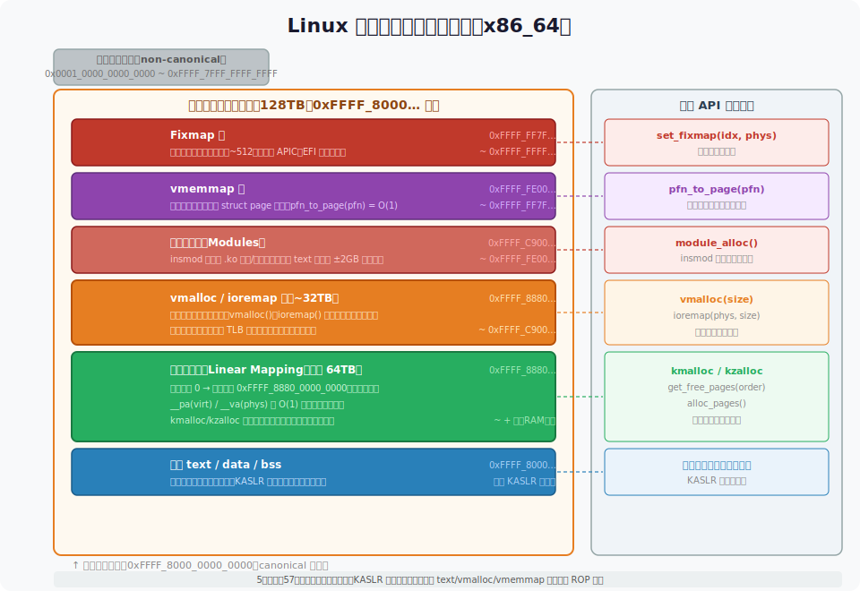

x86_64 下内核占用高 128TB 虚拟地址空间（`0xFFFF_8000_0000_0000` 起），内部划分为多个功能区域：

```
x86_64 内核虚拟地址空间（Linux 5.x，48位地址模式）

0xFFFF_FFFF_FFFF_FFFF ┐
                       │  Fixmap 区（Fixed-mapped addresses）
0xFFFF_FF7F_FFFF_F000 ┤  ~512 个编译期确定的虚拟地址槽
                       │
0xFFFF_FF00_0000_0000 ┤
                       │  vmemmap 区
                       │  存放所有 struct page 数组
                       │  每个物理页帧对应一个 struct page（64字节）
                       │  8TB RAM → 8TB/4KB × 64B ≈ 128GB vmemmap
0xFFFF_FE00_0000_0000 ┤
                       │  内核模块加载区（Modules area）
                       │  通常 1.5GB，紧靠内核 text 以满足相对跳转
0xFFFF_C900_0000_0000 ┤
                       │  vmalloc 区（vmalloc/ioremap）
                       │  ~32TB，非连续物理页映射到连续虚拟地址
                       │  内核模块、ioremap、大 vmalloc 分配均在此
0xFFFF_8880_0000_0000 ┤
                       │  直接映射区（Direct Mapping / lowmem）
                       │  物理地址 0 → 虚拟地址 0xFFFF_8880_0000_0000 线性偏移
                       │  内核用 __pa(virt) / __va(phys) 互转
                       │  覆盖所有可用物理 RAM（通常最大 64TB）
0xFFFF_8000_0000_0000 ┘  ← 内核空间起始（canonical 边界）

      ↕ 不可访问空洞（non-canonical addresses）

0x0000_7FFF_FFFF_FFFF ┐  ← 用户空间上限
        ...             │  用户进程虚拟空间（128TB）
0x0000_0000_0000_0000 ┘
```

各区域详解：

```
┌───────────────────┬──────────────────────────────────────────────────────────┐
│ 区域               │ 说明                                                     │
├───────────────────┼──────────────────────────────────────────────────────────┤
│ 直接映射区         │ 物理 RAM 的 1:1 映射，phys = virt - PAGE_OFFSET           │
│                   │ kmalloc/kzalloc 分配的内存均在此区域                       │
│                   │ __pa()/__va() 宏做转换，无需查页表，性能最优                │
├───────────────────┼──────────────────────────────────────────────────────────┤
│ vmalloc 区        │ 物理上非连续，虚拟上连续                                   │
│                   │ 适合大块内存（驱动、模块、ioremap 设备寄存器）              │
│                   │ 访问需走页表，有额外 TLB 压力                              │
├───────────────────┼──────────────────────────────────────────────────────────┤
│ vmemmap 区        │ 所有物理页帧对应的 struct page 数组                        │
│                   │ pfn_to_page(pfn) = vmemmap + pfn，O(1) 转换               │
├───────────────────┼──────────────────────────────────────────────────────────┤
│ 模块区            │ insmod 加载的内核模块代码/数据                              │
│                   │ 紧靠内核 text 段，保证 call 指令 ±2GB 相对跳转可达          │
├───────────────────┼──────────────────────────────────────────────────────────┤
│ Fixmap            │ 编译期确定的虚拟地址（如 APIC、EFI、early ioremap）         │
│                   │ 可动态绑定到任意物理页，适合引导期间临时映射                │
└───────────────────┴──────────────────────────────────────────────────────────┘
```

---

#### 7.2 内核内存分配 API 全景

```
内核需要分配内存
       │
       ├── 小块（< 页大小），物理连续？
       │       │
       │       └── Yes → kmalloc(size, GFP_KERNEL)
       │                 kzalloc(size, GFP_KERNEL)   ← 同 kmalloc，但清零
       │                 kcalloc(n, size, GFP_KERNEL) ← n×size，清零
       │
       ├── 整页粒度，物理连续？
       │       │
       │       └── Yes → __get_free_pages(GFP_KERNEL, order)
       │                 alloc_pages(GFP_KERNEL, order) ← 返回 struct page*
       │                 get_zeroed_page(GFP_KERNEL)    ← 单页，清零
       │
       ├── 大块，允许物理非连续？
       │       │
       │       └── Yes → vmalloc(size)
       │                 vzalloc(size)  ← 清零版本
       │                 vfree(ptr)     ← 释放
       │
       ├── 特定对象频繁分配/释放（高性能）？
       │       │
       │       └── Yes → kmem_cache_create() + kmem_cache_alloc()
       │                 （Slab/Slub 对象缓存）
       │
       └── 设备 DMA 内存（物理连续 + 对齐）？
               │
               └── dma_alloc_coherent(dev, size, &dma_handle, GFP_KERNEL)
                   dma_free_coherent(dev, size, cpu_addr, dma_handle)
```

**kmalloc vs vmalloc 核心对比：**

```
┌──────────────┬─────────────────────────────┬───────────────────────────────┐
│              │ kmalloc                     │ vmalloc                       │
├──────────────┼─────────────────────────────┼───────────────────────────────┤
│ 物理连续性   │ 保证物理连续                 │ 不保证（物理可以碎片化）        │
│ 虚拟地址区   │ 直接映射区                  │ vmalloc 区                    │
│ 访问性能     │ 最优（无额外页表查找）        │ 略慢（多一级页表访问）          │
│ 最大分配量   │ 通常 ≤ 4MB（连续物理页限制） │ 可达几十 GB（受 vmalloc 区大小）│
│ DMA 兼容     │ 可以（物理连续）             │ 不可以（物理非连续）            │
│ 分配失败概率 │ 高（碎片化时难找连续物理页） │ 低（物理碎片不影响）            │
│ 典型使用场景 │ 驱动小缓冲、内核数据结构     │ 内核模块、大缓冲区、ioremap    │
└──────────────┴─────────────────────────────┴───────────────────────────────┘
```

**GFP（Get Free Pages）标志位：**

```
GFP_KERNEL    → 最常用，允许睡眠等待内存，进程上下文
GFP_ATOMIC    → 不允许睡眠，用于中断上下文/自旋锁持有期间
GFP_DMA       → 从 DMA zone 分配（< 16MB 物理内存，ISA DMA 兼容）
GFP_DMA32     → 从 DMA32 zone 分配（< 4GB 物理内存）
GFP_HIGHUSER  → 用户页分配，优先使用 highmem（32位系统）
GFP_NOWAIT    → 不等待，立即失败而非睡眠
__GFP_ZERO    → 分配后清零（kmalloc 等效于 kzalloc）
__GFP_NOFAIL  → 循环重试直到成功（谨慎使用）
```

---

#### 7.3 Slab/Slub 对象分配器

内核中大量数据结构（`task_struct`、`mm_struct`、`dentry`、`inode`）被频繁创建销毁，使用通用 `kmalloc` 效率低下。Slab 分配器针对固定大小对象做了深度优化：

```
Slab 分配器层次结构

kmem_cache（对象缓存，一个类型对应一个 cache）
    │
    ├── name: "task_struct"
    ├── object_size: 9216（bytes）
    ├── align: 64
    └── node[0..N]（每个 NUMA 节点独立）
              │
              ├── partial（部分填满的 slab 列表）← 优先分配
              ├── full   （完全填满）
              └── free   （完全空闲）← 回收到 Buddy System

Slab（一个或多个连续物理页）
    ┌──────────────────────────────────────────┐
    │ [obj0][obj1][obj2]...[objN][管理元数据]   │
    │   ↑                                      │
    │ freelist 指针链（空闲对象用指针串联）       │
    └──────────────────────────────────────────┘

分配流程：
  kmem_cache_alloc(cache, GFP_KERNEL)
    → 查找 per-CPU freelist（无锁，最快路径）
    → 命中 → 弹出对象，返回
    → 未中 → 从 partial slab 补充 per-CPU freelist
    → 无 partial → 向 Buddy System 申请新物理页，建立新 slab

优点：
  1. per-CPU freelist 无锁操作，极低延迟
  2. 同类对象紧密排列，Cache Line 利用率高
  3. 避免外部碎片（固定大小对象不产生碎片）
  4. 对象构造/析构函数（ctor/dtor）可复用，省去重复初始化
```

---

#### 7.4 内核页表与进程页表的关系

```
系统只有一份内核页表（swapper_pg_dir / init_mm）

每个进程的 mm_struct.pgd（页全局目录）：

┌──────────────────────────────────────────────────┐
│ 进程 PGD                                         │
│  [0 ~ 255]   用户空间 PML4 entry（进程私有）      │
│  [256 ~ 511] 内核空间 PML4 entry（所有进程共享）  │
│                    ↓                             │
│              指向同一套内核页表（共享物理页）       │
└──────────────────────────────────────────────────┘

切换进程时（context_switch）：
  → cr3 寄存器写入新进程的 pgd 物理地址
  → 用户空间映射切换（TLB flush 用户部分）
  → 内核空间映射不变（所有进程共享内核 PML4 entry）

KPTI（Kernel Page Table Isolation，Meltdown 修复）：
  → 用户态运行时：cr3 指向「影子页表」，内核映射极少（仅 syscall 入口）
  → 进入内核态：切换到完整内核页表
  → 代价：每次系统调用/中断多一次 cr3 切换（TLB flush），性能损耗约 5%~30%
```

---

#### 7.5 Per-CPU 内存区域

内核大量数据需要「每个 CPU 核心各有一份」以避免加锁，Per-CPU 机制专门处理这类需求：

```
Per-CPU 变量原理

编译期：
  DEFINE_PER_CPU(int, my_counter);
  → 在 .data..percpu 段声明一个「模板」

启动期：
  内核为每个 CPU 分配独立的 Per-CPU 区域
  将模板内容复制到每个 CPU 的区域

访问：
  get_cpu_var(my_counter)++    → 等价于 this_cpu_ptr(&my_counter)
  put_cpu_var(my_counter)

  实现：
    this_cpu_ptr(ptr) = ptr + __per_cpu_offset[cpu_id]
    其中 __per_cpu_offset[N] 是 CPU N 的区域基址偏移

  关键：访问 per-CPU 变量时必须禁止抢占（get_cpu_var 会 preempt_disable）
        否则线程可能在两次访问之间被调度到另一个 CPU

内存布局：
  物理内存
  ┌────────────────────┐
  │ CPU0 per-cpu 区域  │ ← __per_cpu_offset[0]
  ├────────────────────┤
  │ CPU1 per-cpu 区域  │ ← __per_cpu_offset[1]
  ├────────────────────┤
  │ CPU2 per-cpu 区域  │ ← __per_cpu_offset[2]
  └────────────────────┘

典型 per-CPU 数据：
  runqueue（调度运行队列）、kmalloc per-CPU slab freelist、
  网卡 RX/TX 队列统计、中断计数、vm_stat（内存统计）
```

---

#### 7.6 内核栈

```
内核栈 vs 用户栈

┌────────────────────┬──────────────────────┬──────────────────────┐
│                    │ 用户栈               │ 内核栈               │
├────────────────────┼──────────────────────┼──────────────────────┤
│ 大小               │ 默认 8MB，可 ulimit  │ 固定 8KB（或 16KB）  │
│ 存放位置           │ 用户虚拟地址空间      │ 内核直接映射区        │
│ 可增长             │ 是（缺页自动扩展）    │ 否（溢出 → 崩溃）    │
│ 物理连续           │ 否（页表映射）        │ 是（alloc_pages）    │
│ 生命周期           │ 进程存活期间         │ 进入内核态时使用      │
└────────────────────┴──────────────────────┴──────────────────────┘

内核栈结构（以 8KB 为例）：

高地址 ┌─────────────────────┐ ← thread_info（或独立 per-CPU）
       │  thread_info        │   存放 task_struct 指针、flags
       ├─────────────────────┤
       │                     │
       │  内核调用栈帧        │  ← 系统调用 / 中断处理函数的栈帧
       │  （向低地址增长）    │
       │                     │
低地址 └─────────────────────┘ ← stack overflow 边界（无 guard page！）

内核栈溢出的危险：
  用户栈溢出 → guard page → SIGSEGV（进程崩溃，系统安全）
  内核栈溢出 → 直接覆盖相邻内存 → 系统崩溃（kernel panic）或安全漏洞

应对措施：
  CONFIG_VMAP_STACK（Linux 4.9+）：
    → 用 vmalloc 分配内核栈（物理可非连续）
    → 在栈底放置一个 guard page（虚拟地址，无物理页）
    → 溢出触发 page fault → 触发 oops/panic，而非静默覆盖
```

---

#### 7.7 KASLR 与 KASAN

**KASLR（Kernel Address Space Layout Randomization）**

```
目的：防止攻击者预测内核符号地址（ROP 攻击、返回到 libc 攻击）

实现：
  引导时：内核将自身 text/data/bss 随机偏移加载
    → 偏移量在 [0, 1GB] 范围内按页对齐随机选取
    → 每次启动不同

  同样随机化的区域：
    ├── 内核 text/data（物理加载地址）
    ├── vmalloc 区起始地址
    ├── vmemmap 起始地址
    ├── 直接映射区偏移（5级页表下）
    └── 模块加载地址

  查看当前内核加载地址：
    dmesg | grep "Kernel/Memory"
    cat /proc/kallsyms | grep " T _text"  （需 root）

  局限性：
    ├── 信息泄露漏洞（/proc/kallsyms、dmesg）可绕过 KASLR
    └── 内核崩溃 dump（kdump）会暴露真实地址
```

**KASAN（Kernel Address Sanitizer）**

```
目的：检测内核中的内存越界（out-of-bounds）和 use-after-free 错误

原理（影子内存机制）：
  每 8 字节内核内存对应 1 字节影子内存（shadow memory）
  影子字节含义：
    0x00 → 全部 8 字节可访问
    0x01~0x07 → 前 N 字节可访问，后面不可访问
    0xFx → 特定错误类型（如 0xFE = use-after-free）

  内存布局开销：
    影子区域 = 1/8 的总虚拟地址空间
    x86_64 上影子区域固定在 0xDFFFF_C000_0000_0000 附近（16TB）

  编译器插桩：
    每次内存访问前插入影子内存检查代码：
      // 访问 ptr 处 size 字节前，检查影子
      if (shadow_byte(ptr) != 0) kasan_report(ptr, size, is_write)

  能检测：
    ├── 堆溢出（kmalloc 分配的 redzone 被写）
    ├── 栈溢出（局部变量越界）
    ├── 全局变量溢出
    ├── use-after-free（已释放内存被访问）
    └── use-after-return（引用了已返回函数的栈变量）

  开销：~2x 内存，~2x 运行时性能（仅用于内核开发/测试）
  生产环境：关闭 KASAN（CONFIG_KASAN=n）

  开启方式（内核编译选项）：
    CONFIG_KASAN=y
    CONFIG_KASAN_INLINE=y   （更快，代码体积更大）
    CONFIG_KASAN_OUTLINE=y  （更慢，代码体积更小）
```

---

#### 7.8 Highmem（32位历史遗留，64位已消亡）

```
问题背景（仅 32位 Linux）：
  32位地址空间 = 4GB
  内核占高 1GB（0xC000_0000 ~ 0xFFFF_FFFF）
  直接映射区只能覆盖 ~896MB 物理内存

  若机器有 4GB RAM：
    前 896MB → 直接映射（lowmem），内核可直接访问
    剩余 ~3GB → highmem，内核无法直接访问！

解决方案：临时映射（kmap）
  ┌──────────────────────────────────────────────────────┐
  │  用法                  │  说明                        │
  ├──────────────────────────────────────────────────────┤
  │ kmap(page)             │ 建立持久映射，可睡眠（慢）     │
  │ kmap_atomic(page)      │ 建立临时映射，禁止抢占（快）   │
  │ kunmap(page)           │ 释放持久映射                  │
  │ kunmap_atomic(ptr)     │ 释放临时映射                  │
  └──────────────────────────────────────────────────────┘

  PKMAP（Persistent Kernel Map）区域：
    固定在内核地址空间高端
    最多 1024 个槽（4MB），通过 page_address_htable 记录映射

64位现状：
  64位地址空间足够大，直接映射区可覆盖全部物理 RAM
  Highmem 机制在 x86_64 上完全不需要，代码路径已废弃
  CONFIG_HIGHMEM 在 64位编译选项中不可选
```

---

#### 7.9 内核虚拟内存管理总览对比

```
┌─────────────────┬────────────┬──────────────┬───────────┬──────────────────┐
│ 分配方式         │ 物理连续   │ 虚拟连续     │ 最大容量  │ 典型用途          │
├─────────────────┼────────────┼──────────────┼───────────┼──────────────────┤
│ kmalloc         │ ✓          │ ✓            │ ~4MB      │ 小数据结构、缓冲 │
│ kzalloc         │ ✓          │ ✓            │ ~4MB      │ 同上，清零       │
│ get_free_pages  │ ✓          │ ✓            │ 4MB(2^10) │ 页粒度分配       │
│ vmalloc         │ ✗          │ ✓            │ ~32TB     │ 大缓冲、驱动     │
│ kmem_cache_alloc│ ✓          │ ✓            │ 对象大小  │ 高频对象（slab） │
│ dma_alloc_coherent│ ✓        │ ✓            │ 硬件限制  │ DMA 缓冲区       │
│ per_cpu_ptr     │ ✓          │ ✓（各CPU独立）│ 小        │ 无锁 CPU 局部数据│
└─────────────────┴────────────┴──────────────┴───────────┴──────────────────┘
```

---

### Q8：不用 mmap，文件读写是怎样的？

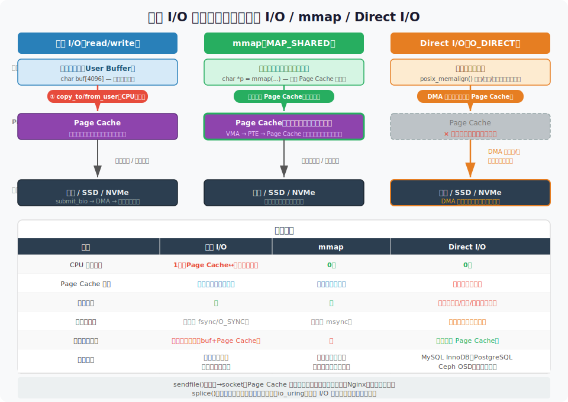

#### 8.1 两种路径的本质区别

```
不用 mmap（系统调用 I/O）：           用 mmap：
  用户缓冲区                            进程虚拟地址
      ↑                                     ↑
  copy_to/from_user（内存复制）         直接指向 Page Cache 物理页（共享映射）
      ↑                                     ↑
  Page Cache                            Page Cache
      ↑                                     ↑
  磁盘                                  磁盘

核心差异：系统调用 I/O 在用户缓冲区和 Page Cache 之间多一次 CPU 复制
```

---

#### 8.2 read() 完整路径

```
应用程序：n = read(fd, user_buf, 4096)
          │
          ▼ （陷入内核）
sys_read() → vfs_read() → file->f_op->read_iter()
          │
          ▼
  generic_file_read_iter()
          │
          ├── 在 Page Cache（address_space）中查找对应页
          │       │
          │      命中（页已在内存）
          │       │
          │       ▼
          │   copy_to_user(user_buf, page_addr + offset, len)
          │   └── CPU 将数据从 Page Cache 物理页复制到用户缓冲区
          │   └── 返回读取字节数
          │
          └──  未命中（Page Cache miss）
                  │
                  ▼
              分配新物理页，加入 Page Cache
                  │
                  ▼
              submit_bio() → 向块设备提交读请求
                  │
                  ▼
              进程进入睡眠（等待 I/O 完成）
                  │
                  ▼ （磁盘 DMA 将数据写入 Page Cache 物理页）
              进程被唤醒
                  │
                  ▼
              copy_to_user(user_buf, page_addr, len)  ← 再复制一次到用户空间
                  │
                  ▼
              返回用户空间
```

**内存视角：这条路径发生了多少次复制？**

```
磁盘 ──DMA──► Page Cache 物理页 ──CPU复制──► 用户缓冲区

共 2 次：
  1. DMA 复制（磁盘→Page Cache）：不占用 CPU
  2. CPU 复制（Page Cache→用户缓冲区）：占用 CPU，这是 mmap 省掉的那次
```

---

#### 8.3 write() 完整路径

```
应用程序：n = write(fd, user_buf, 4096)
          │
          ▼ （陷入内核）
sys_write() → vfs_write() → file->f_op->write_iter()
          │
          ▼
  generic_file_write_iter()
          │
          ▼
  在 Page Cache 中找到（或分配）对应页
          │
          ▼
  copy_from_user(page_addr + offset, user_buf, len)
  └── CPU 将数据从用户缓冲区复制到 Page Cache 物理页
          │
          ▼
  标记页为 Dirty（PG_dirty）
  将 inode 加入 writeback 队列
          │
          ▼
  返回用户空间（write() 完成，数据还在内存！）
          │
          │ ← 此后异步，应用感知不到
          ▼
  脏页回写（由 flusher/kworker 线程执行）：
    writeback_single_inode()
      → address_space->a_ops->writepage()
      → submit_bio()（提交写 I/O）
      → DMA 将 Page Cache 页数据写入磁盘
      → 清除 PG_dirty 标志
```

**write() 的关键特性：写完即返回，数据未必落盘**

```
write() 返回 ≠ 数据安全

进程崩溃：Page Cache 中的脏页不受影响，内核仍会回写 ✓
系统断电：Page Cache 中的脏页丢失                      ✗

确保落盘的方式：
  fsync(fd)      → 等待该文件所有脏页回写完成 + 刷新磁盘写缓冲
  fdatasync(fd)  → 同 fsync，但不更新 atime/mtime 等元数据（更快）
  sync()         → 全系统所有脏页回写
  O_SYNC 标志   → 每次 write() 自动等待落盘（同步写，最慢）
  O_DSYNC 标志  → 每次 write() 等待数据落盘，不等元数据（比 O_SYNC 快）
```

---

#### 8.4 缓冲 I/O 与 Direct I/O 对比

**默认模式：缓冲 I/O（Buffered I/O）**

```
应用 ──write()──► Page Cache ──异步──► 磁盘
应用 ◄──read()─── Page Cache ◄──按需──  磁盘

优点：
  ├── 写操作延迟低（写完即返回，不等磁盘）
  ├── 重复读命中 Page Cache，极快（纯内存操作）
  ├── 内核自动合并小 I/O、预读（readahead）
  └── 多进程共享同一份 Page Cache，节省内存

缺点：
  ├── read/write 各有一次 CPU 复制（Page Cache ↔ 用户缓冲区）
  └── 数据库等场景：自带缓存 + Page Cache = 双重缓存，内存浪费
```

**Direct I/O（绕过 Page Cache）**

```
open(path, O_RDWR | O_DIRECT)

应用 ──write()──► 直接 DMA 写入磁盘（绕过 Page Cache）
应用 ◄──read()─── 直接 DMA 读入用户缓冲区（绕过 Page Cache）

约束条件（必须满足，否则 EINVAL）：
  ├── 用户缓冲区地址必须按块大小对齐（通常 512B 或 4096B）
  ├── 文件偏移量必须对齐
  └── 读写长度必须对齐

优点：
  ├── 零 CPU 复制：DMA 直接在磁盘和用户缓冲区之间传输
  ├── 消除双重缓存（数据库自己管理 buffer pool）
  └── 写操作直接落盘（结合 O_SYNC），延迟可预测

缺点：
  ├── 每次 I/O 都要等磁盘（除非应用自己做异步 I/O）
  ├── 无法利用 Page Cache 的预读和缓存复用
  └── 对齐要求对应用开发不友好

典型用户：MySQL InnoDB（innodb_flush_method=O_DIRECT）、PostgreSQL、Ceph OSD
```

---

#### 8.5 预读机制（Readahead）

```
顺序读触发预读：

应用 read() 请求第 N 页
       │
       ▼
内核检测到顺序访问模式（连续 page 访问）
       │
       ▼
readahead 算法预先提交第 N+1 ~ N+K 页的磁盘读请求
（K 由 readahead_size 决定，默认 128KB，可调）
       │
       ▼
应用读第 N+1 页时，大概率已在 Page Cache → 无等待

调整预读大小：
  posix_fadvise(fd, 0, 0, POSIX_FADV_SEQUENTIAL)  → 提示内核增大预读
  posix_fadvise(fd, 0, 0, POSIX_FADV_RANDOM)      → 随机访问，关闭预读
  posix_fadvise(fd, offset, len, POSIX_FADV_WILLNEED) → 主动触发预读（异步）
  posix_fadvise(fd, offset, len, POSIX_FADV_DONTNEED) → 提示内核丢弃缓存
```

---

#### 8.6 各文件 I/O 方式全面对比

```
┌──────────────────┬───────────┬──────────┬───────────┬────────────────────────┐
│ 方式              │ CPU 复制  │ Page Cache│ 对齐要求  │ 典型场景               │
├──────────────────┼───────────┼──────────┼───────────┼────────────────────────┤
│ read/write       │ 1次       │ 使用     │ 无        │ 通用文件读写            │
│ mmap(MAP_SHARED) │ 0次       │ 直接映射 │ 无        │ 共享内存、大文件随机访问 │
│ mmap(MAP_PRIVATE)│ 0次(读)   │ COW      │ 无        │ 进程私有文件映射        │
│ O_DIRECT read    │ 0次       │ 绕过     │ 需对齐    │ 数据库 buffer pool      │
│ O_DIRECT write   │ 0次       │ 绕过     │ 需对齐    │ 数据库持久化            │
│ sendfile()       │ 0次(用户) │ 使用     │ 无        │ 文件→网络（HTTP 服务器）│
│ splice()         │ 0次       │ 管道传递 │ 无        │ 内核内数据移动          │
└──────────────────┴───────────┴──────────┴───────────┴────────────────────────┘

注：sendfile() 将文件内容直接从 Page Cache 发送到 socket，
    用户空间零参与，Nginx/Apache 静态文件服务的核心优化。
```

---

#### 8.7 Page Cache 对读写的加速效果（热点数据场景）

```
冷启动（Page Cache 为空）：
  read() → Page Cache miss → 磁盘 I/O → 填充 Page Cache → copy_to_user
  耗时：磁盘延迟（HDD ~10ms，SSD ~100μs）+ 复制开销

热读（Page Cache 命中）：
  read() → Page Cache hit → copy_to_user（纯内存操作）
  耗时：内存带宽级别（~10GB/s，约 10μs/MB）
  → 比冷读快 100x~1000x

写后立即读（Page Cache 写透效果）：
  write() → 写入 Page Cache
  read()  → 直接从 Page Cache 返回（不经过磁盘）
  → 写和读操作的 Page Cache 是同一份，天然一致
```

---

### Q9：Swap 交换针对的是 Page Cache 还是匿名页？

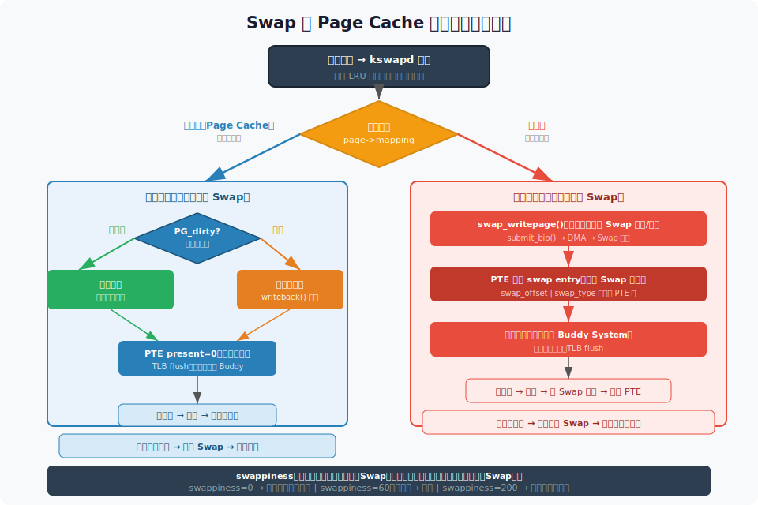

#### 结论先行

**Swap 只针对匿名页，不针对 Page Cache。**

两者的回收路径完全不同，背后逻辑是：Page Cache 有文件作为后端存储，可以直接丢弃；匿名页没有后端，必须先写到 Swap 才能释放物理页。

---

#### 两类页的本质区别

```
┌──────────────────┬────────────────────────────┬──────────────────────────────┐
│                  │ 文件页（Page Cache）         │ 匿名页                       │
├──────────────────┼────────────────────────────┼──────────────────────────────┤
│ 来源             │ read/write/mmap 文件产生     │ malloc/堆/栈/MAP_ANONYMOUS    │
│ 后端存储         │ 有（对应磁盘上的文件）        │ 无（纯内存数据）               │
│ 内存不足时       │ 直接丢弃（干净页）            │ 必须先写 Swap，才能释放        │
│                  │ 先回写再丢弃（脏页）          │                              │
│ 再次访问         │ 从文件重新读入               │ 从 Swap 换入                  │
│ 典型数据         │ 代码段、共享库、文件缓存      │ 进程堆、栈、匿名 mmap          │
└──────────────────┴────────────────────────────┴──────────────────────────────┘
```

---

#### 内存回收时的完整决策树

```
kswapd 扫描 LRU 链表，选出候选页
       │
       ├── 文件页（有 page->mapping 指向 address_space）
       │       │
       │       ├── 干净页（PG_dirty = 0，内容与磁盘一致）
       │       │       └──► 直接释放物理页，更新 PTE（present=0）
       │       │           进程再访问 → 缺页 → 从文件重新读入
       │       │
       │       └── 脏页（PG_dirty = 1，内容比磁盘新）
       │               └──► 触发回写（writeback）→ 等待写完
       │                   → 清除 PG_dirty → 释放物理页
       │
       └── 匿名页（page->mapping == NULL 或指向 anon_vma）
               │
               └──► 写入 Swap 分区/文件（swap_writepage）
                   → 在 PTE 中写入 swap entry（记录 Swap 位置）
                   → 释放物理页
                   进程再访问 → 缺页 → 从 Swap 读回 → 恢复 PTE
```

---

#### 为什么 Page Cache 不需要 Swap？

```
场景：/usr/bin/python 被加载到内存（Page Cache 文件页）
      内存紧张，kswapd 决定回收这些页

处理：
  这些页是干净的（只读代码，从未被修改）
  → 直接丢弃，无需写任何地方
  → PTE 的 present 位清零

下次访问 python 时：
  → 缺页中断 → filemap_fault()
  → 从 /usr/bin/python 文件重新读入对应页
  → 文件永远在磁盘上，是天然的"后端"

结论：文件就是 Page Cache 的 Swap，不需要额外的 Swap 分区
```

---

#### 特殊情况：mmap 文件的 MAP_PRIVATE 页

```
mmap(file, MAP_PRIVATE) + 写操作（触发 COW）：

COW 后的页：
  ├── 物理上：新分配的匿名页（内容来自文件，但已被进程修改）
  ├── 与原文件的关联断开
  └── 回收时：按匿名页处理 → 需要写 Swap

COW 前未修改的页：
  └── 仍然是文件页 → 可直接丢弃，不走 Swap
```

---

#### vm.swappiness 控制的是什么？

```
vm.swappiness（0~200，默认 60）：
  并不是"是否使用 Swap"的开关
  而是控制 kswapd 在回收内存时，
  优先回收匿名页（走 Swap）还是优先回收文件页（丢弃/回写）的倾向

  swappiness = 0  ：尽可能不换出匿名页，优先回收文件缓存
  swappiness = 60 ：默认，均衡策略
  swappiness = 200：积极换出匿名页，尽量保留文件缓存

内核计算公式（简化）：
  匿名页回收权重 = swappiness
  文件页回收权重 = 200 - swappiness

  → 两者权重之比决定 kswapd 从哪类 LRU 链表取候选页

Redis 常见配置：
  vm.swappiness = 1（不完全禁止，防止极端情况 OOM）
  原因：Redis 数据全在内存，一旦数据被换到 Swap，
        访问延迟从 μs 级跌到 ms 级，性能断崖式下跌
```

---

#### Swap 分区 vs Swap 文件

```
┌──────────────┬─────────────────────────┬──────────────────────────┐
│              │ Swap 分区               │ Swap 文件                │
├──────────────┼─────────────────────────┼──────────────────────────┤
│ 性能         │ 略优（直接块设备访问）   │ 略差（经过文件系统层）    │
│ 灵活性       │ 低（需提前规划分区）     │ 高（随时创建、调整大小）  │
│ 创建方式     │ fdisk + mkswap + swapon │ fallocate + mkswap + swapon│
│ 云环境       │ 不适合（磁盘固定）       │ 常用（动态扩容）          │
└──────────────┴─────────────────────────┴──────────────────────────┘

创建 Swap 文件示例：
  fallocate -l 4G /swapfile
  chmod 600 /swapfile
  mkswap /swapfile
  swapon /swapfile

查看 Swap 使用情况：
  swapon --show          # 查看所有 Swap 设备
  free -h                # 总览
  vmstat -s | grep swap  # Swap 换入/换出计数
  cat /proc/vmstat | grep pswp  # pswpin/pswpout 累计计数
```

---

### Q10：read/write 中的"用户缓冲区"是什么？

#### 结论

用户缓冲区就是**进程自己用 `malloc` 或栈声明的普通内存**，本质是进程虚拟地址空间里的一段匿名页，和你平时操作的任何变量没有区别。

```c
char buf[4096];           // 栈上分配，局部变量
char *buf = malloc(4096); // 堆上分配，匿名页

read(fd, buf, 4096);      // 内核把文件数据复制到这里
write(fd, buf, 4096);     // 内核从这里读数据写到文件
```

---

#### 内存视角的完整图景

```
进程虚拟地址空间
┌──────────────────────────────────────────┐
│  栈                                      │
│    char buf[4096]  ← 局部变量            │
│    虚拟地址：0x7fff_1234_0000            │
│         ↕ 页表映射                       │
│    物理页帧：0x3A8000（匿名页）           │
│                                          │
│  堆                                      │
│    malloc(4096) 的返回指针               │
│    虚拟地址：0x55a0_0000                 │
│         ↕ 页表映射                       │
│    物理页帧：0x7B2000（匿名页）           │
└──────────────────────────────────────────┘

Page Cache（内核管理）
┌──────────────────────────────────────────┐
│  文件 foo.txt 第 0 页                    │
│  物理页帧：0xC45000（文件页）            │
└──────────────────────────────────────────┘
```

`read(fd, buf, 4096)` 做的事：

```
内核执行 copy_to_user(buf, page_cache_page, 4096)
                          │                   │
                          │                   └── Page Cache 里的文件物理页
                          └── 进程虚拟地址（指向匿名页物理帧）

CPU 把数据从 0xC45000（文件页）复制到 0x3A8000（匿名页）
两块物理内存，真实的内存复制，这就是"那一次 CPU 复制"的来源
```

---

#### 为什么 mmap 能省掉这次复制？

```
缓冲 I/O（read）：
  物理内存                 物理内存
  Page Cache 文件页  ──►  用户缓冲区（匿名页）  ← 进程访问这里
  （内核管理）      CPU复制  （进程堆/栈）

mmap（MAP_SHARED）：
  物理内存
  Page Cache 文件页  ← 进程虚拟地址直接指向这里，无需复制
  （内核管理）
```

mmap 不是省掉了"某个步骤"，而是让进程的虚拟地址直接映射到 Page Cache 的物理页上，**用户缓冲区和 Page Cache 合并成同一块物理内存**，复制这个动作从根本上就不存在了。

---

#### copy_to_user / copy_from_user 做了什么

内核不能直接用指针访问用户内存，必须通过专用函数：

```
copy_to_user(user_ptr, kernel_ptr, len)
  ├── 验证 user_ptr 指向的虚拟地址确实属于该进程（防止越权访问）
  ├── 处理用户页可能未在内存（触发缺页，把用户匿名页换入）
  └── 执行实际的内存复制（CPU memcpy 级别操作）

copy_from_user(kernel_ptr, user_ptr, len)
  └── 同上，方向相反
```

这两个函数是缓冲 I/O 和 Direct I/O 之间最核心的区别点：
- **缓冲 I/O**：必须调用，Page Cache → 用户匿名页
- **mmap**：完全不调用，进程直接操作 Page Cache
- **Direct I/O**：也不调用，DMA 直接写入用户内存（物理地址），绕过整个内核缓冲层

---

### Q11：Java 进程的代码数据和虚拟地址空间中的段有什么映射关系？

#### 核心结论

Java 进程在 OS 眼中就是一个普通的 Linux 进程，虚拟地址空间的段结构完全一样。区别在于：**OS 的段是给 JVM 自身（C++ 程序）用的，Java 代码和对象活在 JVM 在堆/mmap 区内部自己管理的空间里，OS 感知不到 Java 类、方法、对象的存在。**

---

#### OS 视角：Java 进程的虚拟地址空间

```
Java 进程虚拟地址空间（OS 视角）

高地址
┌─────────────────────────────────────────┐
│  内核空间（所有进程共享）                │
├─────────────────────────────────────────┤  ← 0x7FFF_FFFF_FFFF
│  栈（Stack）                            │
│  JVM 自身 C++ 函数调用栈                │  ← JVM 内部线程、GC 线程等
│  Java 线程的内核栈（每线程 ~1MB）        │
├─────────────────────────────────────────┤
│                                         │
│  mmap 区                                │
│  ┌───────────────────────────────────┐  │
│  │ libjvm.so（JVM 本体，C++ 代码）   │  │  ← mmap 映射共享库
│  │ libc.so / libpthread.so 等        │  │
│  ├───────────────────────────────────┤  │
│  │ Java Heap（-Xms/-Xmx）           │  │  ← mmap(MAP_ANONYMOUS) 大块匿名区
│  │  Eden / Survivor / Old Gen       │  │     Java 对象全在这里
│  ├───────────────────────────────────┤  │
│  │ Metaspace（类元数据）             │  │  ← mmap(MAP_ANONYMOUS) 按需扩展
│  │  类结构、方法字节码、常量池        │  │
│  ├───────────────────────────────────┤  │
│  │ JIT 代码缓存（CodeCache）         │  │  ← mmap(MAP_ANONYMOUS|PROT_EXEC)
│  │  热点方法编译后的机器码           │  │
│  ├───────────────────────────────────┤  │
│  │ Direct ByteBuffer                │  │  ← mmap(MAP_ANONYMOUS)
│  │  NIO 堆外内存                    │  │
│  └───────────────────────────────────┘  │
│                                         │
├─────────────────────────────────────────┤
│  堆（Heap，OS视角）                     │
│  JVM 自身 C++ 对象、内部数据结构        │  ← 很小，非 Java 堆
├─────────────────────────────────────────┤
│  BSS / Data / Text                      │
│  JVM 可执行文件（java/libjvm.so）自身   │  ← JVM 的 C++ 代码和静态变量
│  的代码段、数据段、未初始化段           │
└─────────────────────────────────────────┘
低地址
```

---

#### JVM 内存区域与 OS 段的对应关系

```
┌────────────────────┬──────────────────────┬────────────────────────────────┐
│ JVM 内存区域        │ OS 段/区域           │ 说明                           │
├────────────────────┼──────────────────────┼────────────────────────────────┤
│ Java Heap          │ mmap 匿名区          │ JVM 启动时 mmap 一大块，自己    │
│ (Eden/Old Gen等)   │ (MAP_ANONYMOUS)      │ 用 GC 管理内部分代布局          │
├────────────────────┼──────────────────────┼────────────────────────────────┤
│ Metaspace          │ mmap 匿名区          │ 类加载时按需扩展；无上限（受    │
│ (类结构/方法/常量) │                      │ MaxMetaspaceSize 约束）         │
├────────────────────┼──────────────────────┼────────────────────────────────┤
│ JIT CodeCache      │ mmap 匿名区          │ PROT_READ|PROT_WRITE|PROT_EXEC  │
│ (编译后机器码)     │ 可执行               │ 热点方法编译后写入，CPU 直接执行 │
├────────────────────┼──────────────────────┼────────────────────────────────┤
│ Java 线程栈        │ mmap 匿名区          │ 每条 Java 线程对应一个 OS 线程  │
│ (-Xss，默认1MB)   │ (每线程独立)         │ JVM 用 mmap 为每线程分配栈空间  │
├────────────────────┼──────────────────────┼────────────────────────────────┤
│ Direct ByteBuffer  │ mmap 匿名区          │ allocateDirect() 调用 malloc/   │
│ (堆外内存)         │                      │ mmap，不受 GC 管理              │
├────────────────────┼──────────────────────┼────────────────────────────────┤
│ JVM 自身代码       │ Text 段（代码段）    │ libjvm.so 的 C++ 机器码         │
│                   │ mmap 文件映射        │ 多个 JVM 进程共享同一物理页      │
├────────────────────┼──────────────────────┼────────────────────────────────┤
│ JVM 静态变量       │ Data / BSS 段        │ JVM 内部 C++ 全局变量           │
├────────────────────┼──────────────────────┼────────────────────────────────┤
│ JVM C++ 调用栈     │ Stack 段             │ GC 线程、编译线程等 JVM 内部    │
│                   │                      │ 线程的栈（OS 原生栈）            │
└────────────────────┴──────────────────────┴────────────────────────────────┘
```

---

#### 关键洞察：Java 字节码 / 机器码在哪里？

```
.java 文件
    │ javac 编译
    ▼
.class 文件（字节码）─── 存放于磁盘 .jar/.class
    │
    │ ClassLoader.loadClass()
    ▼
类加载（OS 视角：read() 或 mmap 读取 .jar 文件）
    │
    ▼
解析后的类结构 ──► 存入 Metaspace（mmap 匿名区）
  ├── 方法字节码数组（byte[]）
  ├── 常量池
  └── 字段描述符

    │ JIT 编译（方法调用次数超过阈值）
    ▼
JIT 编译器（C2/Graal）将字节码编译为 x86 机器码
    │
    ▼
机器码写入 CodeCache（mmap 匿名区，PROT_EXEC）
    │
    ▼
CPU 直接执行 CodeCache 中的机器码（此时与 C 程序无本质区别）
```

**解释型阶段**（冷方法）：JVM 解释器逐条读取 Metaspace 中的字节码执行，字节码本身是数据，不是可执行代码。

**JIT 编译阶段**（热方法）：字节码被编译成真正的机器码，写入 CodeCache（一块有执行权限的 mmap 区），之后 CPU 直接执行，性能接近原生 C 代码。

---

#### Java 对象与 OS 物理内存的关系

```
Java 代码：
  MyObject obj = new MyObject();  // 在 Java Heap 分配

OS / 物理内存视角：
  Java Heap = 一块 mmap 匿名区（如 0x7f00_0000_0000 ~ 0x7f02_0000_0000）
                    │
                    ▼
  obj 对象头 + 字段 存放于这块 mmap 区的某个偏移处
                    │
                    ▼
  首次写入该地址 → 缺页中断 → 内核分配物理页（匿名页）→ 建立 PTE
  GC 移动对象    → JVM 内部更新引用指针，OS 毫不知情
  GC 回收对象    → JVM 标记空闲（不归还 OS）或 madvise(MADV_FREE) 归还
```

**OS 看到的是**：一块大匿名 mmap，里面有些物理页在用（RSS），有些没用。

**JVM 看到的是**：Eden、Survivor、Old Gen、各种对象的引用链。

两套视图完全独立，OS 感知不到任何 Java 对象的语义。

---

#### 用 /proc/pid/maps 验证

实际查看一个 Java 进程的内存段：

```bash
cat /proc/$(pgrep java)/maps | head -40

# 输出示例（简化）：
00400000-00401000 r-xp  /usr/bin/java          ← java 启动器 Text 段
00600000-00601000 r--p  /usr/bin/java          ← java 启动器 只读数据
00601000-00602000 rw-p  /usr/bin/java          ← java 启动器 Data 段

7f2a00000000-7f2c00000000 rw-p  anon           ← Java Heap（~2GB mmap匿名）
7f2c00000000-7f2c10000000 rw-p  anon           ← Metaspace（按需扩展）
7f3000000000-7f3001000000 rwxp  anon           ← JIT CodeCache（有执行权限！）
7f30a0000000-7f30b0000000 rw-p  anon           ← Java 线程栈（每线程~1MB）

7f3100000000-7f3180000000 r-xp  /path/libjvm.so  ← JVM 本体 Text 段（C++代码）
7f3180000000-7f3182000000 r--p  /path/libjvm.so  ← JVM 只读数据
7f3182000000-7f3183000000 rw-p  /path/libjvm.so  ← JVM Data 段
```

从这里可以清晰看到：Java Heap、Metaspace、CodeCache 全是 `anon`（匿名 mmap），OS 只认识这些，不知道里面装的是 Java 对象还是字节码。

---

### Q12：OOM 是 kswapd 回收不到内存后触发吗？优先杀什么进程？

#### OOM 触发的完整路径

不完全准确。OOM Killer 的触发不只是 kswapd 的事，有两条路径都会到达 OOM：

```
内存分配请求（任意进程 malloc/mmap/缺页）
        │
        ▼
    当前空闲页 > pages_min？
        │
       Yes ──► 直接分配，正常返回
        │
       No
        ▼
  直接内存回收（direct reclaim，在分配进程上下文执行）
  扫描 LRU，回收文件页/匿名页（走 Swap）
        │
   回收成功 ──► 分配，返回
        │
   回收失败
        ▼
  重试若干次（try_to_free_pages 循环）
        │
   仍然失败
        ▼
    out_of_memory()
        │
        ▼
    OOM Killer 选出受害者，发送 SIGKILL

─────────────────────────────────────────
并行路径：kswapd（后台）

空闲页 < pages_low
        │
        ▼
  kswapd 唤醒，后台异步回收
  目标：把空闲页恢复到 pages_high 以上

  kswapd 回收成功 ──► 正常，不触发 OOM
  kswapd 回收失败（内存真的耗尽）
        │
        ▼
  前台分配请求触发直接回收 → 失败 → OOM Killer
```

**关键区分**：kswapd 失败本身不直接触发 OOM，是**前台进程的分配请求**在直接回收也失败后才触发 OOM Killer。kswapd 只是后台保障，真正的触发点是某个进程的内存分配失败兜底。

---

#### OOM Killer 选谁杀？——oom_score 机制

内核给每个进程计算一个 `oom_score`（0~1000），**分数最高的进程被杀**。

**oom_score 计算公式（简化）：**

```
oom_score ≈ 进程占用的物理内存比例 × 1000
           + oom_score_adj 调整值（-1000 ~ +1000）
```

**物理内存占比部分：**

```
基础分 = (进程 RSS + Swap 占用) / 总物理内存 × 1000

RSS（Resident Set Size）= 进程当前实际占用的物理页数
包括：堆、栈、代码段、共享库的私有页

注意：共享库的共享页按"按比例摊分"计算，不完全算给任何一个进程
```

**oom_score_adj 调整（-1000 ~ +1000）：**

```
oom_score_adj = 0     默认，不调整
oom_score_adj = -1000 完全豁免，内核永远不杀（如 sshd 默认设置）
oom_score_adj = +1000 最优先被杀

查看：
  cat /proc/<pid>/oom_score        # 当前综合得分（只读，内核计算）
  cat /proc/<pid>/oom_score_adj    # 调整值（可写）

设置：
  echo -1000 > /proc/<pid>/oom_score_adj   # 保护进程
  echo 1000  > /proc/<pid>/oom_score_adj   # 标记为首选牺牲品
```

---

#### OOM Killer 的选择逻辑（oom_badness 函数）

```c
// 内核 mm/oom_kill.c（伪代码）
for each process:
    points = process->mm->total_vm  // 虚拟内存大小（字节→页数）
    points += process->mm->swap_usage
    points *= 1000 / total_memory_pages  // 归一化到 0~1000

    // 应用 oom_score_adj
    points += oom_score_adj * total_memory_pages / 1000

    if points > max_points:
        victim = process

send SIGKILL to victim
// 同时杀死 victim 的所有子进程（避免僵尸孤儿）
```

**优先杀的进程特征：**

```
① 占内存最多的进程（RSS + Swap 大）
   → Java 进程、数据库进程、大内存服务通常排名靠前

② oom_score_adj 高的进程
   → 容器环境中 OOM 优先杀容器内进程（cgroup OOM）

③ 刚 fork 出来的子进程
   → 子进程虚拟内存继承父进程（COW 未分裂），虚拟内存大
   → 但 RSS 小，实际得分不一定高

不会杀的进程：
  ① oom_score_adj = -1000（内核线程、sshd 等系统关键进程）
  ② 内核线程（没有 mm_struct）
  ③ 正在 vfork 的进程（会导致父进程崩溃）
```

---

#### 各类进程的典型 oom_score

```bash
# 查看系统所有进程的 oom_score（从高到低）
for pid in /proc/[0-9]*; do
    score=$(cat $pid/oom_score 2>/dev/null)
    comm=$(cat $pid/comm 2>/dev/null)
    echo "$score $comm $pid"
done | sort -rn | head -20

# 典型结果示例：
# 850  java      /proc/12345    ← JVM 进程，堆大，得分高
# 720  mysqld    /proc/23456    ← 数据库，内存大
# 300  nginx     /proc/34567
#   2  sshd      /proc/1234     ← oom_score_adj=-1000，几乎不会被杀
#   0  kthreadd  /proc/2        ← 内核线程，不参与 OOM
```

---

#### cgroup OOM（容器场景）

容器环境下（Docker/K8s），OOM Killer 在 **cgroup 级别**工作，与系统级不同：

```
容器设置 memory.limit_in_bytes = 512MB

容器内进程申请超过 512MB
        │
        ▼
cgroup 内存控制器触发 cgroup OOM
        │
        ▼
只在该 cgroup 内选受害者（不影响宿主机其他进程）
        │
        ▼
杀死 cgroup 内 oom_score 最高的进程

特点：
  ├── cgroup OOM 比系统 OOM 优先触发
  ├── K8s 中 Pod 的 OOM 就是 cgroup OOM，宿主机感知不到
  └── K8s 的 QoS 类别影响 oom_score_adj：
        Guaranteed（requests=limits）→ oom_score_adj = -998（最受保护）
        Burstable（requests<limits）  → oom_score_adj 按内存使用比例计算
        BestEffort（无 requests）     → oom_score_adj = 1000（最先被杀）
```

---

#### 调优手段

```bash
# 1. 保护关键进程（如数据库主进程）
echo -1000 > /proc/$(pgrep mysqld)/oom_score_adj

# 2. 标记可牺牲进程（如 worker 进程）
echo 500 > /proc/$(pgrep worker)/oom_score_adj

# 3. 关闭 OOM Killer（极端情况，不推荐）
# 效果：内存耗尽时进程 malloc 返回 NULL 而不是被杀
echo 2 > /proc/sys/vm/overcommit_memory
# vm.overcommit_memory=2 严格限制，不允许超量分配

# 4. OOM 时直接杀触发分配的进程（而非得分最高的）
echo 1 > /proc/sys/vm/oom_kill_allocating_task
# 优点：更快（不用扫描所有进程），避免误伤大内存进程
# 缺点：被杀的是触发 OOM 的进程，不一定是最合适的受害者

# 5. 查看 OOM 历史（内核日志）
dmesg | grep -A 20 "Out of memory"
# 会打印：触发进程、得分最高进程、最终被杀进程及其内存使用详情
```

---

#### 一图总结

```
空闲内存水位线与 OOM 触发关系：

可用内存
  │
  │████████████████████████████  pages_high  ← kswapd 停止
  │
  │▓▓▓▓▓▓▓▓▓▓▓▓▓▓▓▓▓▓▓▓▓▓▓▓▓▓  pages_low   ← kswapd 唤醒（后台回收）
  │
  │░░░░░░░░░░░░░░░░░░░░░░░░░░░░  pages_min   ← 直接回收（前台，阻塞分配者）
  │
  0 ────────────────────────────────────────  OOM Killer 出击

行动顺序：
  1. kswapd 后台默默回收（无感知）
  2. 低于 pages_min → 分配者自己阻塞做直接回收
  3. 直接回收多次失败 → out_of_memory() → 按 oom_score 选出受害者 → SIGKILL
  4. 受害者释放内存后 → 原分配请求重试 → 成功
```

---

### Q13：进程申请内存时的完整分配流程

整个分配过程分为四层：**用户库层 → 内核虚拟内存层 → 物理内存分配层 → NUMA/zone 选择层**。

---

#### 第一层：用户库（glibc ptmalloc）决策

```
malloc(size)
        │
        ├── size > MMAP_THRESHOLD（默认 128KB）？
        │       │
        │      Yes ──► mmap(MAP_ANONYMOUS|MAP_PRIVATE)
        │               直接向内核申请匿名 VMA，每次 free 归还给内核
        │       │
        │      No
        │       │
        │       ▼
        │   从当前线程的 arena（内存池）中分配
        │       │
        │       ├── arena 的 freelist 有合适块？
        │       │       └──► 直接返回（无系统调用，最快）
        │       │
        │       └── freelist 不够 → arena 需要扩展
        │               │
        │               ├── 主 arena（主线程）→ brk() 上移堆顶
        │               └── 非主 arena（其他线程）→ mmap() 新建 heap 段

ptmalloc arena 结构：
  每个线程有独立 arena（减少锁竞争）
  ┌─────────────────────────────────────┐
  │ arena                               │
  │  mutex（arena 级锁）                │
  │  bins[0..127]（不同大小的 freelist） │
  │   fastbin：< 80B，LIFO，无合并      │
  │   smallbin：< 512B，FIFO，双向链表  │
  │   largebin：≥ 512B，按大小排序      │
  │   unsorted bin：刚释放的块先放这里  │
  │  top chunk（arena 末尾空闲大块）    │
  └─────────────────────────────────────┘
```

---

#### 第二层：内核虚拟内存分配（VMA 建立）

无论是 `brk()` 还是 `mmap()`，内核做的事一样：**只建立虚拟地址映射，不分配物理内存**。

```
sys_brk(new_brk) 或 sys_mmap(...)
        │
        ▼
do_brk_flags() / do_mmap()
        │
        ├── 1. 检查虚拟地址空间是否足够（RLIMIT_AS）
        │
        ├── 2. Overcommit 检查（vm_overcommit_memory）
        │       ├── 模式 0（默认）：启发式，允许合理超量
        │       ├── 模式 1：始终允许
        │       └── 模式 2：严格检查 swap + 物理内存 × ratio
        │           → 失败返回 ENOMEM，malloc 返回 NULL
        │
        ├── 3. 在 mm_struct 红黑树中插入或扩展 VMA
        │       vm_start, vm_end, vm_flags, vm_pgoff
        │       尝试与相邻 VMA 合并（减少 VMA 数量）
        │
        └── 4. 返回虚拟地址给用户，此时：
                PTE 全部 not-present
                物理内存：0 字节被分配
                RSS 不变，VSZ 增加
```

---

#### 第三层：缺页中断触发物理内存分配

进程首次访问虚拟页时触发，**这才是物理内存真正分配的时刻**。

```
CPU 访问虚拟地址 VA
        │
        ▼
MMU 查页表 → PTE.present = 0 → 触发缺页异常（#PF）
        │
        ▼
do_page_fault() → handle_mm_fault()
        │
        ├── 找到包含 VA 的 VMA
        │
        ├── 判断缺页类型：
        │       │
        │       ├── 匿名页（堆/栈/MAP_ANONYMOUS）
        │       │       │
        │       │       ├── 首次访问 → do_anonymous_page()
        │       │       │       │
        │       │       │       ├── 读操作？→ 映射到全局零页（zero_page）
        │       │       │       │   推迟分配，写时再真正分配（零页优化）
        │       │       │       │
        │       │       │       └── 写操作？→ alloc_zeroed_page()
        │       │       │               分配真实物理页，清零，建立 PTE
        │       │       │
        │       │       └── COW 触发 → do_wp_page()
        │       │               refcount > 1 → 复制页，更新 PTE
        │       │               refcount = 1 → 直接改 PTE 为可写
        │       │
        │       └── 文件映射页 → filemap_fault()
        │               在 Page Cache 中查找
        │               未找到 → 从磁盘读入 Page Cache
        │               建立 PTE 指向 Page Cache 物理页
        │
        └── 返回，CPU 重试触发缺页的指令
```

---

#### 第四层：Buddy System 物理页分配

`alloc_page()` 是物理页的真正来源，内部走 Buddy System。

```
alloc_pages(gfp_flags, order)  // 申请 2^order 个连续物理页
        │
        ▼
  NUMA 节点选择（多 CPU 系统）
        ├── 优先本地 NUMA 节点（当前 CPU 所在节点，延迟最低）
        └── 本地不足 → 按 NUMA 距离远近依次尝试其他节点

        │
        ▼
  Zone 选择（同一 NUMA 节点内）
        ├── ZONE_DMA    （0 ~ 16MB，ISA DMA 设备用）
        ├── ZONE_DMA32  （0 ~ 4GB，32位DMA设备用）
        ├── ZONE_NORMAL （主要区域，内核直接映射）
        └── ZONE_HIGHMEM（32位系统专用，64位不存在）
        按 GFP 标志选 Zone，GFP_KERNEL → ZONE_NORMAL 优先

        │
        ▼
  per-CPU pageset（先查本 CPU 冷热页缓存）
        ├── 冷热页缓存命中（pcp freelist）
        │       └──► 直接弹出页帧，返回（无需锁，最快路径）
        │
        └── 缓存未命中 → 进入 Buddy System

        │
        ▼
  Buddy System 分配（order 阶）

  Buddy System 结构（每个 Zone 独立）：
  free_area[0]  → 空闲页链表（2^0 = 1 页）
  free_area[1]  → 空闲页链表（2^1 = 2 页连续）
  free_area[2]  → 空闲页链表（2^2 = 4 页连续）
  ...
  free_area[10] → 空闲页链表（2^10 = 4MB 连续）

  分配 order=0（1页）的过程：
        │
        ├── free_area[0] 有空闲？→ 取出，返回
        │
        └── free_area[0] 为空
                │
                ▼
            在 free_area[1] 找 2页块
                │
                ├── 找到 → 拆分：1页分配出去，1页放回 free_area[0]
                │
                └── 也没有 → 继续向上找 free_area[2]...
                        找到后逐级拆分，多余的页放回对应阶链表
```

---

#### 零页优化（BSS 段 / 首次读匿名页）

```
进程读取未初始化内存（首次读）：
        │
        ▼
do_anonymous_page() 检测到是读缺页
        │
        ▼
不分配新物理页！
映射到内核全局 zero_page（一个只读全零物理页）
所有进程共享这同一个物理页

        │
        ▼
进程对该地址执行写操作
        │
        ▼
写保护缺页 → do_wp_page()
        │
        ▼
alloc_zeroed_page() 分配真实物理页（内容已是全零）
更新 PTE 指向新页，设置可写

效果：BSS 段（未初始化全局变量）大量节省物理内存
      未被写入的 BSS 页全部映射到 zero_page，只有 1 个物理页的开销
```

---

#### 完整流程总览

```
malloc(size)
    │
    ▼
[第一层] glibc ptmalloc
    ├── size > 128KB → mmap(MAP_ANONYMOUS)   ┐
    ├── freelist 命中 → 直接返回（无syscall）│
    └── freelist 不足 → brk() / mmap()      ┘
                                              │
                                              ▼
                                    [第二层] 内核 VMA 层
                                    建立 VMA，Overcommit 检查
                                    返回虚拟地址（无物理内存）
                                              │
                                    进程访问该虚拟地址
                                              │
                                              ▼
                                    [第三层] 缺页中断
                                    do_page_fault()
                                    判断类型（匿名/文件/COW）
                                              │
                                              ▼
                                    [第四层] Buddy System
                                    NUMA 节点选择
                                    Zone 选择
                                    per-CPU pageset 缓存
                                    Buddy System 页帧分配
                                    建立 PTE，present=1
                                              │
                                              ▼
                                    进程拿到物理内存，继续执行
```

---

#### 各层延迟参考

```
┌──────────────────────────┬────────────────────────────────┐
│ 路径                     │ 延迟（数量级）                  │
├──────────────────────────┼────────────────────────────────┤
│ ptmalloc freelist 命中   │ ~10ns（纯用户态，无系统调用）   │
│ per-CPU pageset 命中     │ ~100ns（有系统调用，无锁）      │
│ Buddy System 分配        │ ~1μs（有锁，可能需要拆分合并）  │
│ 缺页（内存充足）         │ ~1~10μs（陷入内核+TLB填充）    │
│ 缺页（需从 Swap 换入）   │ ~1~10ms（磁盘 I/O）            │
│ 缺页（需从磁盘读文件页） │ ~100μs~10ms（SSD/HDD差异大）  │
└──────────────────────────┴────────────────────────────────┘
```

---

### Q14：为什么普通数据也存放在 mmap 区？mmap 区和堆映射物理页有什么区别？

#### 先澄清命名混淆

"mmap 区"是虚拟地址空间里一段地址范围的**名字**，不是说里面全是文件映射。这个区域里实际存放的东西非常杂：

```
虚拟地址空间中的 "mmap 区"（实际内容）

高地址  ┌──────────────────────────────┐
        │  匿名映射（MAP_ANONYMOUS）    │  ← malloc(>128KB)、线程栈、Java Heap
        │  → 和堆一样是匿名页，无文件  │
        ├──────────────────────────────┤
        │  文件映射（MAP_SHARED）       │  ← mmap() 映射真实文件
        │  → PTE 指向 Page Cache 物理页│
        ├──────────────────────────────┤
        │  共享库（libc.so 等）        │  ← 也是文件映射，只读共享
        ├──────────────────────────────┤
        │  ioremap / 设备内存          │  ← 内核驱动用
低地址  └──────────────────────────────┘

"mmap 区" 这个名字来源于它用 mmap() 系统调用来管理 VMA，
不代表其中的内容都是文件映射。
```

---

#### 堆（brk 管理）和 mmap 匿名区，物理内存映射机制完全一样

两者在物理内存层面**没有本质区别**，都是匿名页，缺页流程、物理页分配、Swap 回收路径完全相同。

```
堆（brk 管理的区域）：
  VMA：vm_start=heap_start, vm_end=brk, vm_flags=VM_ANON|VM_READ|VM_WRITE
  PTE：首次访问前 present=0，访问后指向匿名物理页
  page->mapping = NULL（匿名页标志）

mmap 匿名区（MAP_ANONYMOUS）：
  VMA：vm_start=0x7f00…, vm_end=0x7f10…, vm_flags=VM_ANON|VM_READ|VM_WRITE
  PTE：首次访问前 present=0，访问后指向匿名物理页
  page->mapping = NULL（匿名页标志）

两者物理内存行为：完全一致
  ├── 缺页路径：do_anonymous_page()  （相同）
  ├── COW 机制：do_wp_page()         （相同）
  ├── Swap 回收：写 Swap，释放物理页 （相同）
  └── 内核看它们：都是匿名页         （相同）
```

---

#### 那区别在哪里？——虚拟地址的管理方式不同

```
┌─────────────────┬──────────────────────────┬─────────────────────────────┐
│                 │ 堆（brk 管理）            │ mmap 匿名区（MAP_ANONYMOUS） │
├─────────────────┼──────────────────────────┼─────────────────────────────┤
│ 系统调用        │ brk(new_top)             │ mmap(MAP_ANONYMOUS)          │
│ 地址增长方向    │ 向高地址扩展（连续）      │ 向低地址扩展（离散）         │
│ VMA 数量        │ 通常 1 个大 VMA          │ 每次 mmap 一个新 VMA         │
│ 释放方式        │ free() 归还给 ptmalloc   │ munmap() 立即归还内核        │
│                 │ 堆顶才能缩 brk           │                              │
│ 碎片问题        │ 有（ptmalloc 内部碎片）   │ 无（整块归还，物理页即释放） │
│ 典型大小        │ 小块（< 128KB）          │ 大块（≥ 128KB）              │
│ 物理内存        │ 匿名页（相同）            │ 匿名页（相同）               │
└─────────────────┴──────────────────────────┴─────────────────────────────┘
```

**为什么大块内存用 mmap 而不是 brk 扩展堆？**

```
堆是连续的，brk 只能整体上移/下移堆顶：

堆内存示意：
  [已用 A][空闲][已用 B][已用 C]...[ top chunk ]──► brk

场景：释放中间的"已用 B"
  → 物理内存可以释放，但虚拟地址空洞卡在中间
  → brk 无法下移（B 后面还有 C）
  → 这块虚拟地址归还给 ptmalloc 的 freelist，等待复用
  → 若一直没有合适大小的请求，这块内存永远不归还 OS
  → 这就是堆内存碎片

大块用 mmap 的优点：
  mmap(MAP_ANONYMOUS, 2MB)  → 独立 VMA，地址空间任意位置
  munmap(ptr, 2MB)          → 立即归还，内核删除 VMA，物理页回收
  不影响堆的连续性，无碎片问题
```

---

#### 文件 mmap 和匿名 mmap 的区别（同在 mmap 区，物理页来源不同）

```
                   虚拟地址
                       │
          ┌────────────┴────────────┐
          │                         │
     匿名 mmap                  文件 mmap
  (MAP_ANONYMOUS)             (mmap 真实文件)
          │                         │
          ▼                         ▼
  缺页 → Buddy System       缺页 → Page Cache
  分配全新物理页（清零）     命中 → 直接映射 Page Cache 物理页
                             未命中 → 从磁盘读入 Page Cache → 映射
          │                         │
          ▼                         ▼
    page->mapping = NULL      page->mapping = address_space
    （匿名页，走 Swap）        （文件页，走文件回写/丢弃）
```

---

#### 一句话总结

```
"mmap 区"只是虚拟地址空间的一块地盘名称。

里面装的物理页分两类：
  匿名页（malloc大块、线程栈）= 和堆完全相同，只是虚拟地址管理不同
  文件页（mmap文件、共享库）  = PTE 直接指向 Page Cache，和匿名页不同

堆 vs mmap匿名 的本质区别：虚拟地址如何管理（brk连续 vs mmap离散）
匿名 vs 文件      的本质区别：物理页来自哪里（Buddy System vs Page Cache）
```

---

### Q15：JIT 编译后的机器码在 mmap 区就能直接执行吗？不需要放到代码段？

#### 结论

**完全可以，代码段不是执行的必要条件，页的执行权限才是。**

CPU 执行指令只看一件事：当前 PC 指针指向的页的 PTE 是否有 `PROT_EXEC` 标志位。它不关心这个页是在代码段、堆、还是 mmap 区——只要权限对，就能执行。

---

#### CPU 如何判断一段内存能否执行

```
CPU 取指（fetch 阶段）
        │
        ▼
MMU 查页表，找到对应 PTE
        │
        ├── PTE.NX（No-Execute）位 = 0 → 允许执行 ✓
        │
        └── PTE.NX 位 = 1 → 触发 #PF（执行保护异常）→ SIGSEGV

NX 位由 VMA 的 vm_flags 决定：
  vm_flags 有 VM_EXEC  → PTE.NX = 0（可执行）
  vm_flags 无 VM_EXEC  → PTE.NX = 1（不可执行）

vm_flags 由 mmap() 的 prot 参数设置：
  PROT_EXEC  → vm_flags |= VM_EXEC
  PROT_READ  → vm_flags |= VM_READ
  PROT_WRITE → vm_flags |= VM_WRITE
```

---

#### JIT CodeCache 的创建方式

```c
// JVM 内部（简化）创建 CodeCache 的方式：

void* code_buf = mmap(
    NULL,
    code_cache_size,            // 如 256MB
    PROT_READ | PROT_WRITE,     // 先只给读写权限
    MAP_ANONYMOUS | MAP_PRIVATE,
    -1, 0
);

// 写入编译好的机器码
memcpy(code_buf, compiled_code, code_size);

// 写完后加执行权限（W^X 安全实践：写和执行权限不同时存在）
mprotect(code_buf, code_size, PROT_READ | PROT_EXEC);

// CPU 跳转到这里执行，和执行任何函数没有区别
((void(*)())code_buf)();
```

在 `/proc/pid/maps` 里看到的就是：
```
7f3000000000-7f3001000000 r-xp  anon   ← rwx→rx 后的 CodeCache
                           ^^^
                           r-x = 可读可执行，不可写
```

---

#### "代码段"只是一个历史约定，不是硬件要求

```
传统 ELF 可执行文件加载时：

.text 段（代码）→ mmap 文件，权限 r-x（读+执行）
.data 段（数据）→ mmap 文件，权限 rw-（读+写）
.bss  段        → mmap 匿名，权限 rw-

"代码段"的本质：
  只是一块 prot=r-x 的 mmap 文件映射区域
  操作系统不知道也不关心它叫"代码段"
  内核只看 VMA 的 vm_flags 里有没有 VM_EXEC

所以任何区域，只要 mmap/mprotect 设置了 PROT_EXEC，CPU 就能在那里执行代码：
  代码段（.text）  ✓  r-x，传统方式
  mmap 匿名区     ✓  r-x，JIT、解释器、动态生成代码
  堆              ✗  rw-，默认无执行权限（可以改，但危险）
  栈              ✗  rw-，默认无执行权限（Stack NX 防护）
```

---

#### W^X 安全原则：为什么 JVM 先写后改权限

现代系统强制或建议 **W^X（Write XOR Execute）**：一块内存不能同时可写又可执行。

```
不安全做法（PROT_READ|PROT_WRITE|PROT_EXEC 同时存在）：
  攻击者利用漏洞写入恶意代码 → 直接执行
  → shellcode 注入攻击的基础

安全做法（JVM 遵循的 W^X）：
  阶段一：PROT_READ|PROT_WRITE      写入机器码（不可执行）
  阶段二：mprotect → PROT_READ|PROT_EXEC   去掉写权限，加执行权限
  → 执行期间无法修改代码，攻击者写入无效

Linux 内核强制 W^X 的机制：
  SELinux / seccomp 策略可以禁止 PROT_EXEC 的 mmap
  execmem / execstack 布尔值控制是否允许可写可执行页
```

---

#### 各类"代码"所在区域汇总

```
┌────────────────────────┬──────────────────┬───────────┬────────────────────┐
│ 代码类型               │ 所在区域          │ 权限      │ 物理页来源         │
├────────────────────────┼──────────────────┼───────────┼────────────────────┤
│ ELF .text（C程序代码） │ mmap 文件映射    │ r-x       │ Page Cache（文件页）│
│ 共享库代码（libc.so）  │ mmap 文件映射    │ r-x       │ Page Cache，多进程共享│
│ JIT 机器码（CodeCache）│ mmap 匿名区      │ r-x       │ Buddy System（匿名页）│
│ Java 字节码            │ mmap 匿名区      │ rw-       │ Buddy System（数据）│
│（Metaspace 中）        │ （Metaspace）    │（不可执行）│                    │
│ 解释器自身代码（JVM）  │ mmap 文件映射    │ r-x       │ Page Cache（libjvm）│
└────────────────────────┴──────────────────┴───────────┴────────────────────┘

关键区分：
  字节码 → 是数据，权限 rw-，解释器"读取"它，不是 CPU 直接执行它
  机器码 → 是指令，权限 r-x，CPU PC 指针跳进来直接执行
```

---

### Q13 补充：Buddy System 物理页分配过程 + Slab 分配器图解

#### Buddy System 分配过程

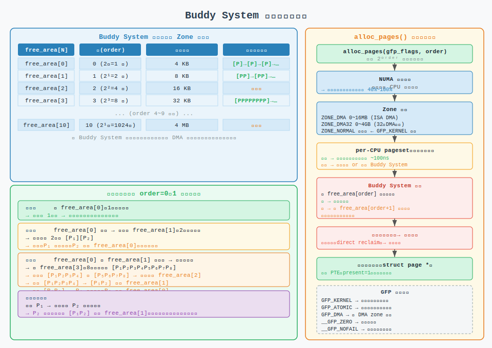

**核心思想**：物理页按 2 的幂次方大小（order 0~10）组织成空闲链表。分配时从对应阶取块，不够则从更大阶拆分；释放时检查"伙伴"（buddy，物理上对齐相邻的块）是否也空闲，若是则合并，递归向上归并，减少碎片。

```
Buddy System 的"伙伴"概念：
  order=1 的两个 1页块（地址为 0x0 和 0x1000）互为伙伴
  两者都空闲 → 合并为 order=1 的 2页块（地址 0x0）
  order=1 的 2页块（0x0~0x1FFF）与（0x2000~0x3FFF）互为伙伴
  都空闲 → 合并为 order=2 的 4页块 ...

判断伙伴的公式：
  buddy_pfn = pfn ^ (1 << order)
  （XOR 第 order 位，即翻转那一位）
```

**与 per-CPU pageset 的关系**：

```
alloc_pages(order=0) 快速路径：
  per-CPU pageset（每 CPU 一个小缓存，约 31 个单页）
       │
       ├── 有空闲页 → 无锁弹出，~100ns
       │
       └── 为空 → 从 Buddy System 批量补充（一次拿多页），~1μs
                  Buddy System 需要 zone->lock 自旋锁
```

---

#### Slab / SLUB 分配器

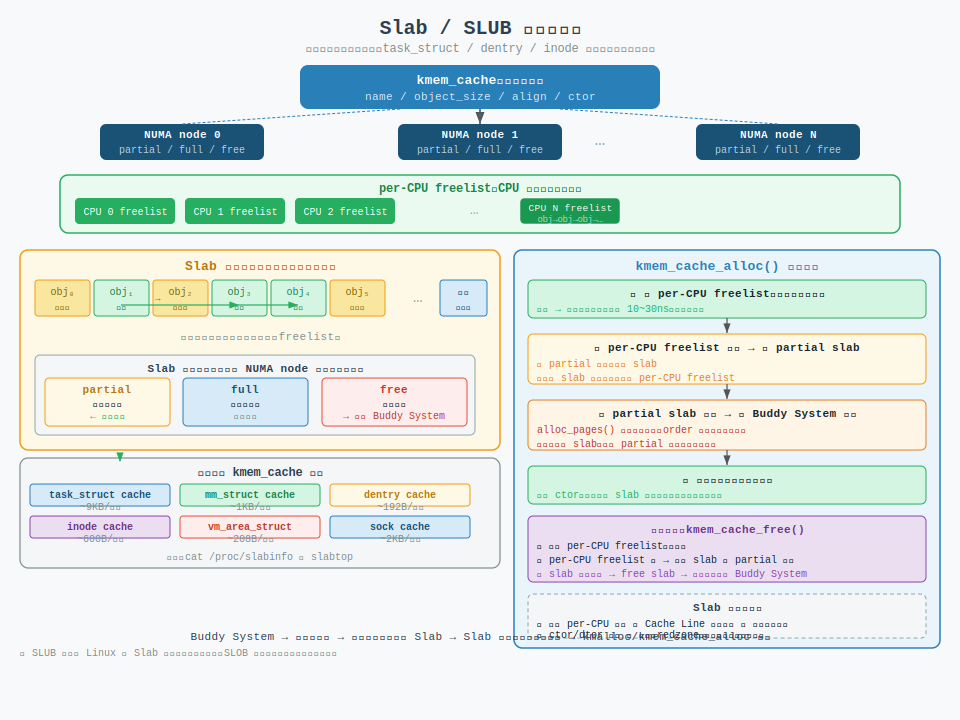

Slab 解决的问题：`kmalloc` 从 Buddy System 按页分配，但内核 99% 的分配需求都是**远小于一页的固定大小结构体**（如 `task_struct` ~9KB、`dentry` ~192B）。Slab 的做法是：

1. 从 Buddy System 批量申请若干物理页
2. 把这些页切割成固定大小的对象槽，串成空闲链表（freelist）
3. 分配时直接从 freelist 弹出对象，释放时放回

**分配路径延迟对比**：

```
路径                          延迟          锁
─────────────────────────────────────────────────────
per-CPU freelist 命中         ~10~30 ns     无锁（禁抢占）
从 partial slab 补充          ~100 ns       per-CPU slab 锁
向 Buddy System 申请新 slab   ~1 μs         zone->lock 自旋锁
```

**Buddy System 与 Slab 的分工**：

```
物理内存（页帧）
      │
      │  以页为单位（2ⁿ 页块）
      ▼
 Buddy System          ← alloc_pages() / __get_free_pages()
      │
      │  整页提供给 Slab
      ▼
 Slab / SLUB           ← kmem_cache_alloc() / kmalloc()
      │
      │  切割为小对象提供给内核代码
      ▼
 task_struct / dentry / inode / sock / vm_area_struct ...
```

---

### Q13 新增问题：kswapd 正常情况下只回收 Page Cache 吗？物理页正常不会 Swap？进程用完就交还给 Buddy System？

这三个问题都问到点子上了，分别回答：

#### 1. kswapd 正常情况下优先回收 Page Cache，Swap 是最后手段

```
内存回收时，kswapd 扫描 LRU 链表，按以下优先级决策：

优先级 高 → 低：
┌─────────────────────────────────────────────────────────────┐
│ ① 干净的文件页（Page Cache，未修改）                         │
│    → 直接丢弃，代价最低，Page Cache 可随时从磁盘重建          │
│                                                             │
│ ② 脏文件页（Page Cache，已修改）                            │
│    → 先回写到磁盘，再丢弃。有 I/O 代价但不需要 Swap 分区     │
│                                                             │
│ ③ 匿名页（堆/栈/MAP_ANONYMOUS）      ← 需要 Swap！          │
│    → 无法直接丢弃（没有后端文件），必须写入 Swap 分区才能释放  │
└─────────────────────────────────────────────────────────────┘

vm.swappiness = 60（默认）：
  内核倾向于先回收文件页（丢弃），再考虑换出匿名页（Swap）
  swappiness=1 时几乎只回收文件页，Swap 几乎不触发

结论：
  ✓ 正常内存够用时，kswapd 不会触发，根本没有回收行为
  ✓ 内存略紧时，优先回收不活跃的 Page Cache（冷文件缓存）
  ✓ 只有内存极度紧张且 Page Cache 已经很少时，才会 Swap 匿名页
  ✓ swappiness=0 的机器（如 Redis 服务器），正常运行几乎看不到 Swap
```

#### 2. 物理页正常不会 Swap — 正确

```
Swap 触发的前提条件（同时满足）：
  ① 空闲物理页 < pages_low（低水位线）
  ② Page Cache 已经很少，没什么可丢弃的
  ③ vm.swappiness > 0（允许换出匿名页）
  ④ 配置了 Swap 分区/文件

普通服务器（内存充足）的典型情况：
  free -h 输出：
    total  used   free   buff/cache
    32G    8G     2G     22G        ← 22GB 是 Page Cache，随时可丢
  
  此时 kswapd 基本沉睡，Swap = 0
  "used" 里的 8G 是进程真实使用的匿名页，完全在物理内存中
  不会被 Swap，因为内存压力不大

Swap 使用过多说明：
  → 内存真的不够用了
  → 或者配置了太多服务，内存超卖严重
  → Swap 中的匿名页被访问时要从磁盘读回，延迟从 μs 级跌到 ms 级
```

#### 3. 进程用完内存交还给 Buddy System — 分情况

```
情况一：进程主动 free() / munmap()
  free(ptr)（小块 < 128KB）：
    → 归还给 ptmalloc arena 的 freelist（不立即还给内核）
    → 堆顶连续空闲空间足够大时，ptmalloc 才调用 brk() 缩减堆
    → 物理页可能仍在进程 RSS 中（被 ptmalloc 保留备用）

  free(ptr)（大块 ≥ 128KB，原来是 mmap 分配的）：
    → 调用 munmap() → 内核删除 VMA → 立即释放物理页
    → 物理页归还 Buddy System ✓（立即！）

  munmap(ptr, size)：
    → 同上，立即归还 ✓

情况二：进程退出（exit() / 被 SIGKILL 杀死）
  内核 exit_mm() → 遍历所有 VMA → 释放所有物理页 → 归还 Buddy System
  → 所有物理页（堆、栈、mmap 区）全部归还 ✓

情况三：Page Cache 页
  进程读文件产生的 Page Cache 不属于进程私有
  进程退出后，Page Cache 仍保留在内存（供其他进程或下次访问复用）
  → 只有内存压力时才被 kswapd 丢弃，归还 Buddy System

总结：
  匿名页（堆/栈） → munmap/进程退出时归还 Buddy System
  Page Cache 页   → 进程退出不释放，内存紧张时由 kswapd 回收
  ptmalloc 小块   → free() 归还给 arena，不立即还内核（这是"内存泄漏假象"的来源）
```

---

### Q16：NUMA 是什么？和 Socket 有什么关系？

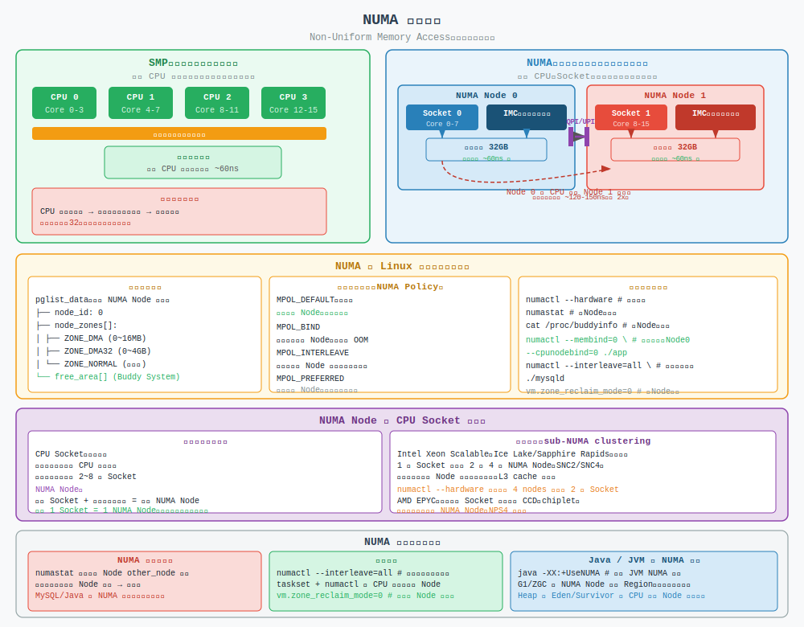

#### 为什么需要 NUMA？

从 SMP（对称多处理）说起。早期服务器所有 CPU 共享一条内存总线：

```
SMP 模型：
  CPU0 CPU1 CPU2 CPU3
       │    │    │    │
       └────┴────┴────┘
              │
         共享内存总线  ← 瓶颈！
              │
          统一内存
```

问题：CPU 核心越多，总线竞争越激烈，带宽成为天花板，**32 核以上性能几乎不再增长**。

NUMA 的解法：**给每个 CPU 配一个专属内存控制器和本地内存**，CPU 访问自己的内存不经过共享总线，CPU 之间通过高速互联（QPI/UPI）通信：

```
NUMA 模型：
  ┌────────────────────┐      QPI/UPI       ┌────────────────────┐
  │  Node 0            │◄──────────────────►│  Node 1            │
  │  Socket 0 (Core0-7)│                    │  Socket 1 (Core8-15)│
  │  IMC（内存控制器） │                    │  IMC（内存控制器） │
  │  本地内存 32GB     │                    │  本地内存 32GB     │
  └────────────────────┘                    └────────────────────┘

本地访问延迟：~60 ns     ← 快
跨节点访问延迟：~120 ns  ← 慢 2 倍！
```

#### NUMA Node 和 CPU Socket 的关系

**通常 1 个 Socket = 1 个 NUMA Node**，这是最常见的配置：

```
物理机器（2 Socket 双路服务器）：

  主板
  ┌─────────────────────────────────────────────┐
  │  [Socket 0 插槽]          [Socket 1 插槽]    │
  │  Intel Xeon CPU           Intel Xeon CPU     │
  │  Core 0~7                 Core 8~15          │
  │  ├── L1/L2 Cache          ├── L1/L2 Cache    │
  │  └── L3 Cache (共享)      └── L3 Cache (共享)│
  │  内存控制器 IMC            内存控制器 IMC     │
  │  │                        │                  │
  │  DIMM 插槽 (32GB)          DIMM 插槽 (32GB)  │
  └─────────────────────────────────────────────┘

OS 视角：
  NUMA Node 0 = Socket 0 + 它控制的 32GB 内存
  NUMA Node 1 = Socket 1 + 它控制的 32GB 内存
```

**特殊情况：一个 Socket 多个 NUMA Node**

现代高核数 CPU 因为内部 chiplet 设计，单个 Socket 也可能出现多个 NUMA Node：

```
AMD EPYC（Genoa，96 核，NPS4 模式）：
  1 个 Socket，但内部有 12 个 CCD（chiplet）
  划分为 4 个 NUMA Node，每个 Node 对应 3 个 CCD + 1/4 内存

  → numactl --hardware 显示 4 nodes，但 lscpu 只有 1 个 Socket

Intel Xeon（Ice Lake，SNC2 模式）：
  1 个 Socket，分成 2 个 sub-NUMA cluster
  → 2 nodes × 1 Socket，延迟比大 NUMA Node 更低
```

**验证方式：**

```bash
# 查看 NUMA 拓扑
numactl --hardware
# 输出示例：
# available: 2 nodes (0-1)
# node 0 cpus: 0 1 2 3 4 5 6 7
# node 0 size: 32160 MB
# node 0 free: 18432 MB
# node 1 cpus: 8 9 10 11 12 13 14 15
# node 1 size: 32255 MB
# node 1 free: 21000 MB
# node distances:     ← 关键！距离越大延迟越高
# node   0   1
#   0:  10  21        ← Node0 访问自己=10，访问Node1=21（约2.1倍延迟）
#   1:  21  10

# 查看每个 Node 的内存命中率
numastat
# numa_hit   = 本地分配成功次数（越高越好）
# numa_miss  = 本地不足，从远端分配次数（越低越好）
# other_node = 其他 Node 的进程用了本 Node 内存
```

#### Linux 内存分配如何感知 NUMA

内核对每个 NUMA Node 维护独立的 `pglist_data` 和 `Buddy System`：

```
alloc_pages(GFP_KERNEL, order) 流程：

  1. 确定当前 CPU 所在的 NUMA Node
  2. 优先从本地 Node 的 Buddy System 分配（延迟最低）
  3. 本地 Node 内存不足时：
     ├── vm.zone_reclaim_mode=1：先回收本地内存（Page Cache），不去远端
     └── vm.zone_reclaim_mode=0：允许去远端 Node 借内存（默认）

  内核 NUMA 策略（per 进程，可通过 mbind/set_mempolicy 设置）：
    MPOL_DEFAULT    → 优先本地，不足则远端
    MPOL_BIND       → 严格限制指定 Node，内存不足直接 OOM
    MPOL_INTERLEAVE → 轮询分配到多个 Node（大内存均衡带宽场景）
    MPOL_PREFERRED  → 优先某个 Node，失败则其他
```

#### NUMA 对 Java 应用的影响

```
问题：JVM 启动时大量分配堆内存，若 NUMA 感知不足
  → 所有 Heap 内存可能全部分配在 Node 0
  → Node 1 的 CPU 访问 Heap 全是远端访问（2x 延迟）

解决：开启 JVM NUMA 感知
  java -XX:+UseNUMA -XX:+UseG1GC MyApp

  效果：G1 GC 为每个 NUMA Node 分配独立的 Region 集合
  → Node 0 的 CPU 优先分配/访问 Node 0 的 Region
  → Node 1 的 CPU 优先分配/访问 Node 1 的 Region
  → 本地访问比例大幅提升，GC 停顿减少

验证 NUMA 均衡性：
  numastat -p $(pgrep java)
  # 若 numa_miss 很高 → 考虑开启 -XX:+UseNUMA 或 numactl --interleave
```

#### NUMA 与网络的交叉影响

```
高性能网络场景（10GbE/25GbE NIC）：

  NIC 的 DMA 内存 + 处理网络包的 CPU 应在同一 NUMA Node：

  ┌────────────────────────────────────────────────────┐
  │ Node 0                                             │
  │  CPU 0-7         NIC（PCIe 接在 Node 0 的根端口）  │
  │  sk_buff 内存  ◄──── DMA 写入（本地访问，快）       │
  └────────────────────────────────────────────────────┘

  ┌────────────────────────────────────────────────────┐
  │ Node 1                                             │
  │  CPU 8-15        （NIC 中断分配到这里，但 NIC 在    │
  │                   Node 0 → 跨 Node DMA，慢！）     │
  └────────────────────────────────────────────────────┘

最佳实践：
  # 查看 NIC 的 NUMA 亲和性
  cat /sys/class/net/eth0/device/numa_node   # 输出 0 或 1

  # 将网卡中断绑到同 Node 的 CPU
  irqbalance 或手动 /proc/irq/N/smp_affinity

  # 应用进程也绑到同 Node
  numactl --cpunodebind=0 --membind=0 ./your_network_app
```

#### 一句话总结

```
NUMA Node = CPU Socket + 该 Socket 直连的本地内存
  （现代高核数 CPU 例外：1个Socket可以有多个Node）

核心规律：
  访问本地 Node 内存 → ~60ns（快）
  访问远端 Node 内存 → ~120ns（慢 2x）

调优原则：让 CPU、内存、NIC 尽量在同一个 NUMA Node 内协作
```

---

### Q17：为什么 HeapByteBuffer 发送 Socket 数据要多一次复制？读写文件也要走堆外吗？

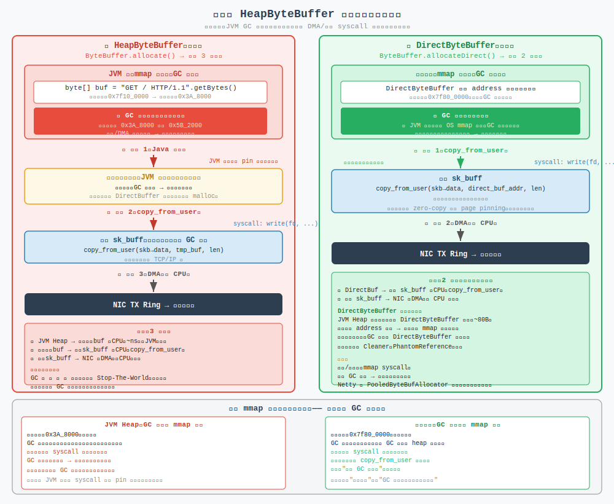

#### 根本原因：GC 会移动堆内对象地址

两者都在 mmap 区映射物理页，**物理内存结构上没有本质区别**。行为差异完全来自**是否被 GC 管理**：

```
JVM Heap（GC 管理的 mmap 区）：
  对象虚拟地址 → 物理地址的映射，GC 可以在任意时刻改变
  Young GC、Full GC 期间会移动存活对象（Copying GC）
  移动 = 物理页内容复制到新位置 + 更新所有引用

堆外内存（GC 不管理的 mmap 区）：
  通过 unsafe.allocateMemory() 或 mmap() 分配
  GC 完全不知道这块内存的存在，绝不会移动它
  地址从分配到释放始终固定
```

**问题的具体发生场景**：

```
线程调用 channel.write(heapByteBuffer)
    │
    ▼
JVM 内部调用 write(fd, buf.address, len)  ← 此时记录了地址 A
    │
    │  ← 在进入内核之前，GC 可能 STW（Stop-The-World）
    │  ← 把 buf 底层的 byte[] 从物理地址 A 移到了地址 B
    │
    ▼
内核 copy_from_user(skb, 地址A, len)  ← 地址 A 已失效！
    → 读到错误数据，或者 A 位置已被其他对象占用 → 数据损坏
```

所以 JVM 的解法：**syscall 前先把堆内数据复制到一块 GC 不会动的临时堆外区域**，再将稳定地址传给内核。

#### HeapByteBuffer 发送路径（2次CPU复制 + 1次DMA）

```
channel.write(heapByteBuffer)
    │
    ▼ JVM 内部 sun.nio.ch.IOUtil.write()
复制①：堆内 byte[] → 临时堆外 DirectBuffer（JVM 自动，线程局部缓存复用）
    │
    ▼ syscall write(fd, directBuf.address, len)
复制②：临时堆外 → 内核 sk_buff（copy_from_user，CPU）
    │
    ▼ NIC DMA
复制③：sk_buff → NIC TX FIFO（DMA，无CPU参与）
```

`Util.getTemporaryDirectBuffer()` 使用 `ThreadLocal<BufferCache>` 缓存，避免每次 malloc，但**复制本身无法省**。

#### DirectByteBuffer 发送路径（1次CPU复制 + 1次DMA）

```
channel.write(directByteBuffer)
    │
    ▼ JVM 内部检测到是 DirectBuffer，地址稳定，跳过预复制
复制①：DirectBuffer → 内核 sk_buff（copy_from_user，CPU）
    │
    ▼ NIC DMA
复制②：sk_buff → NIC TX FIFO（DMA，无CPU参与）
```

#### 读文件（FileChannel.read）也完全一样

方向相反，机制相同：

```
HeapByteBuffer 读文件：
  磁盘 ──DMA──► Page Cache ──copy_to_user──► 临时堆外buf ──JVM复制──► 堆内 HeapByteBuffer
  3步：DMA + CPU + CPU

DirectByteBuffer 读文件：
  磁盘 ──DMA──► Page Cache ──copy_to_user──► DirectByteBuffer
  2步：DMA + CPU
```

JDK 源码（`sun.nio.ch.FileChannelImpl.read()`，简化）：

```java
public int read(ByteBuffer dst) {
    if (dst instanceof DirectBuffer) {
        return readIntoNativeBuffer(fd, dst, ...);   // 直接读入，2步
    } else {
        ByteBuffer bb = Util.getTemporaryDirectBuffer(dst.remaining());
        try {
            int n = readIntoNativeBuffer(fd, bb, ...); // Page Cache → 堆外
            bb.flip();
            dst.put(bb);   // ← 堆外 → 堆内，这就是多出来的那次复制
            return n;
        } finally {
            Util.releaseTemporaryDirectBuffer(bb);
        }
    }
}
```

#### FileChannel.transferTo() — 文件到Socket的真正零拷贝

```java
// 底层是 sendfile() 系统调用，用户态完全不参与数据搬运
fileChannel.transferTo(0, fileChannel.size(), socketChannel);

// 路径：
// 磁盘 ──DMA──► Page Cache ──内核内部──► sk_buff ──DMA──► NIC
//                                ↑
//               不经过用户态，CPU 复制为 0（网卡支持 SG-DMA 时）
```

#### 完整对比表

```
┌─────────────────────────┬──────────┬──────────────────────────────────────┐
│ 操作                     │ CPU复制数 │ 路径                                 │
├─────────────────────────┼──────────┼──────────────────────────────────────┤
│ HeapBuf → Socket write  │ 2次      │ 堆→堆外(JVM) + 堆外→sk_buff(内核)   │
│ DirectBuf → Socket write│ 1次      │ 堆外→sk_buff(内核)                   │
│ Socket read → HeapBuf   │ 2次      │ sk_buff→堆外(内核) + 堆外→堆(JVM)   │
│ Socket read → DirectBuf │ 1次      │ sk_buff→堆外(内核)                   │
│ HeapBuf → File write    │ 2次      │ 堆→堆外(JVM) + 堆外→PageCache(内核) │
│ DirectBuf → File write  │ 1次      │ 堆外→PageCache(内核)                │
│ File read → HeapBuf     │ 2次      │ PageCache→堆外(内核) + 堆外→堆(JVM) │
│ File read → DirectBuf   │ 1次      │ PageCache→堆外(内核)                │
│ transferTo()（sendfile）│ 0次      │ PageCache→sk_buff（内核内部）        │
└─────────────────────────┴──────────┴──────────────────────────────────────┘
※ DMA复制（磁盘→PageCache，sk_buff→NIC）在所有路径都存在，无法消除，不计入上表。
```

#### Netty 的做法

```
Netty 完全围绕这套机制设计：

1. 默认 PooledDirectByteBuf（堆外 + 池化）
   → 避免额外复制 + 避免频繁 mmap/munmap

2. FileRegion（封装 transferTo）
   → 静态文件服务完全零拷贝

3. CompositeByteBuf（零复制合并）
   → 多个 buf 组合为逻辑整体，不实际复制数据

结论：
  本质不是"堆外内存更快"，
  而是"GC 不移动堆外内存，所以可以省掉移出GC危险区的那次复制"。
```

---

## Q18：从 JVM 物理页写出到网卡，到底发生了多少次 IO 复制？

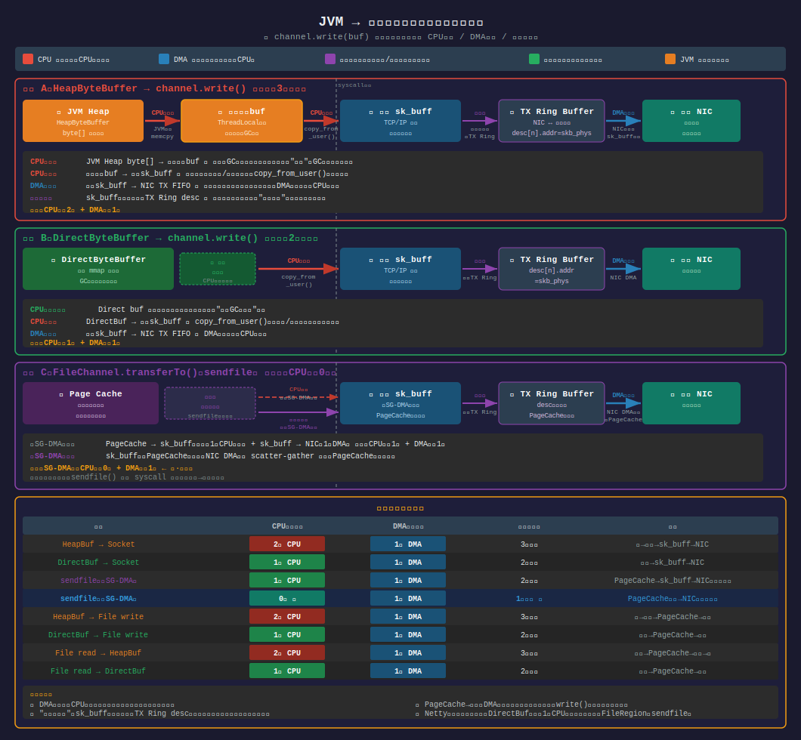

### 核心区分：CPU 复制 vs DMA 复制

| 复制类型 | 谁来做 | 占用 CPU | 典型场景 |
|---|---|---|---|
| CPU 复制 | CPU 执行 memcpy / copy_from_user | 是 | JVM堆→堆外、堆外→sk_buff |
| DMA 复制 | DMA 控制器（硬件） | 否（占内存总线带宽） | sk_buff→NIC TX Ring、磁盘→PageCache |

**DMA 复制在所有路径都存在且无法消除**，以下只统计 CPU 复制次数。

---

### 场景 A：HeapByteBuffer → Socket 写出

```
JVM Heap (byte[])
    │
    │ ① CPU 复制（JVM 内部，约几十纳秒）
    │   Util.getTemporaryDirectBuffer() 取出线程本地 DirectBuffer
    │   System.arraycopy(heapBuf → tempDirectBuf)
    ▼
临时堆外 DirectBuffer（地址固定，GC 不移动）
    │
    │ ② CPU 复制（copy_from_user，syscall: write/send）
    │   内核从用户态堆外地址读取数据，写入 sk_buff->data
    ▼
内核 sk_buff（sk_write_queue 中）
    │
    │ ③ DMA 复制（NIC DMA 控制器，无 CPU 参与）
    │   NIC 从 sk_buff 物理地址读数据，写入 TX Ring → 发出
    ▼
NIC TX Ring Buffer → 物理网络
```

**合计：CPU 复制 ×2，DMA 复制 ×1**

为什么必须有①？JVM Young GC / Full GC 会 Stop-The-World 并移动 byte[] 的物理地址。如果直接把堆内地址传给内核，GC 在 syscall 执行期间移动对象，内核会读到错误数据甚至崩溃。必须先把数据复制到 GC 不可触碰的堆外区域，再传给内核。

---

### 场景 B：DirectByteBuffer → Socket 写出

```
堆外 DirectBuffer（mmap 匿名区，GC 不移动，地址固定）
    │
    │ ① CPU 复制（copy_from_user，syscall: write/send）
    │   内核直接读取堆外固定地址，写入 sk_buff->data
    ▼
内核 sk_buff（sk_write_queue 中）
    │
    │ ② DMA 复制（NIC DMA 控制器）
    ▼
NIC TX Ring Buffer → 物理网络
```

**合计：CPU 复制 ×1，DMA 复制 ×1**

省去了场景 A 中的①，原因是堆外地址在 GC 期间保持稳定，内核可以直接使用。

---

### 场景 C：FileChannel.transferTo() / sendfile()

```
磁盘
    │
    │ ① DMA 复制（磁盘控制器 → PageCache）
    ▼
PageCache（内核页缓存，物理页）
    │
    │（无 SG-DMA）② CPU 复制（内核内部 memcpy，PageCache→sk_buff）
    │（有 SG-DMA）② 不复制数据，只将 PageCache 物理页地址写入 NIC 描述符
    ▼
内核 sk_buff（引用 PageCache 页 或 数据已复制）
    │
    │ ③ DMA 复制（NIC DMA 控制器）
    │   有 SG-DMA：NIC 直接从 PageCache 物理页读；无 SG-DMA：从 sk_buff 读
    ▼
NIC TX Ring Buffer → 物理网络
```

- **无 SG-DMA 网卡**：CPU 复制 ×1，DMA 复制 ×2（磁盘→PageCache + sk_buff→NIC）
- **有 SG-DMA 网卡**：CPU 复制 ×0，DMA 复制 ×2（磁盘→PageCache + PageCache→NIC）

Java 中 `FileChannel.transferTo()` 底层即 `sendfile()` 系统调用，整个过程用户态代码零参与，是静态文件服务的最优路径。

---

### 汇总表：所有路径的 CPU 复制次数

```
┌─────────────────────────┬──────────┬──────────────────────────────────────┐
│ 路径                    │ CPU复制  │ 步骤说明                              │
├─────────────────────────┼──────────┼──────────────────────────────────────┤
│ HeapBuf → Socket write  │ 2次      │ 堆→堆外(JVM) + 堆外→sk_buff(内核)   │
│ DirectBuf → Socket write│ 1次      │ 堆外→sk_buff(内核)                   │
│ Socket read → HeapBuf   │ 2次      │ sk_buff→堆外(内核) + 堆外→堆(JVM)   │
│ Socket read → DirectBuf │ 1次      │ sk_buff→堆外(内核)                   │
│ HeapBuf → File write    │ 2次      │ 堆→堆外(JVM) + 堆外→PageCache(内核) │
│ DirectBuf → File write  │ 1次      │ 堆外→PageCache(内核)                 │
│ File read → HeapBuf     │ 2次      │ PageCache→堆外(内核) + 堆外→堆(JVM) │
│ File read → DirectBuf   │ 1次      │ PageCache→堆外(内核)                 │
│ transferTo()（sendfile）│ 0次      │ PageCache→sk_buff（内核内部描述符）  │
└─────────────────────────┴──────────┴──────────────────────────────────────┘
※ DMA 复制（磁盘→PageCache，sk_buff→NIC）在所有路径都存在，无法消除，不计入上表。
※ "堆外→sk_buff" 这步的 copy_from_user 是内核代码执行的，但仍占用 CPU 周期。
```

### 关键结论

1. **能省的只有 JVM 内部那次**：GC 可移动性 → HeapByteBuffer 必须多一次 CPU 复制，DirectByteBuffer 可省。
2. **copy_from_user / copy_to_user 无法省**：用户态地址空间和内核地址空间隔离，内核不能直接访问用户页（除非 io_uring 的零拷贝模式）。
3. **sendfile 真正节省的是 copy_to_user**：文件数据不需要经过用户态，直接在内核内部流转（PageCache → sk_buff），用户态看不到这些数据。
4. **DMA 复制永远存在**：数据最终必须通过 DMA 从内存传到 NIC，这是物理约束。SG-DMA 可以让 NIC 直接读 PageCache，省掉 PageCache→sk_buff 的 CPU 复制，但磁盘→内存的 DMA 仍在。
