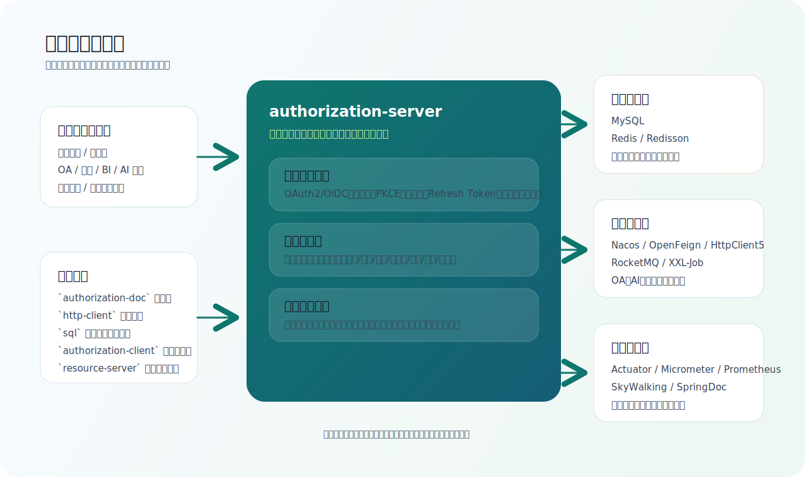
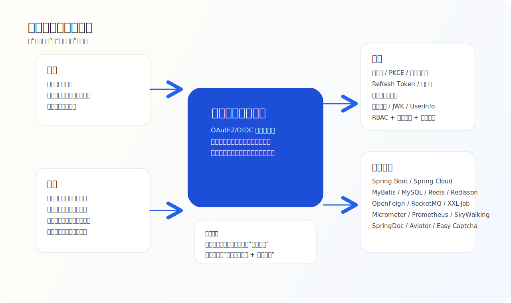

# 授权项目代码分析与梳理

> 本文基于仓库中的 `README.md`、`authorization-doc/doc/*.md`、`sql/*.sql`、`authorization-server`/`authorization-client` 源码结构整理，目标是从代码视角梳理项目定位、背景、痛点、现状与技术栈。

## 一、项目全景

## 二、项目简介

这个项目本质上是一个面向企业内部系统的统一认证与授权平台，代码中的命名更接近“企业服务平台”或“统一授权中心”。

从实现上看，它不是简单套用现成认证框架，而是以 OAuth 2.1 和 OpenID Connect Core 1.0 为基础，在 `authorization-server` 中自研了一套认证、授权、令牌、客户端管理和扩展能力体系。除了标准 OAuth2/OIDC 端点外，项目还叠加了企业微信登录、客户端管理、RBAC 权限模型、数据权限、限流、日志、监控、任务同步等企业级能力。

从仓库结构看，它由以下几部分组成：

| 模块/目录 | 作用 |
| --- | --- |
| `authorization-server` | 核心服务端，承载 OAuth2/OIDC、客户端管理、权限管理、数据权限、限流、日志和任务能力 |
| `authorization-client` | 极简客户端示例，用于接入和联调 |
| `authorization-doc` | 项目文档站资源，包含快速入门、授权模式、退出、验签、AI 服务等说明 |
| `http-client` | 接口联调脚本与 Elasticsearch 查询示例 |
| `sql` | OAuth2 表结构、RBAC 表结构和增量脚本 |
| `resource-server` | 当前仓库中仅看到编译产物，说明历史上存在资源服务示例或独立模块，但源码未一并保留 |

## 三、项目背景

结合文档《概述》和代码结构，这个项目的业务背景很明确：

1. 企业内部已经存在多个应用系统，如 OA、销售、BI、AI 等，需要统一登录、统一授权和统一令牌体系。
2. 不同系统如果各自维护账号体系、登录逻辑、密钥和接口鉴权，会导致重复建设、接入成本高、风险分散且难治理。
3. 企业内部既有面向人的登录场景，也有系统间调用、企业微信内嵌应用、设备终端登录等复杂场景，单一登录方案无法覆盖。
4. 随着内部开放接口增多，仅做“认证”不够，还需要逐步把客户端管理、资源范围、角色权限和数据权限纳入统一治理。

所以，这个项目要解决的不是单点登录一个点，而是把“身份认证 + 客户端授权 + 权限治理 + 接口接入规范”收敛到一个中心平台。

## 四、解决的核心痛点

### 1. 多系统账号与登录链路分散

项目通过标准端点和统一 issuer/JWKS 能力，集中处理登录、授权、签发令牌、退出与验签，避免各业务系统重复实现认证中心。

### 2. 多种终端和接入模式难统一

代码和文档都表明平台已支持：

- 授权码模式
- 授权码模式（PKCE）
- 客户端模式（`client_credentials`）
- 刷新令牌模式
- 设备码模式
- 企业微信授权码模式（自定义 `wecom_authorization_code`）

这让 PC Web、企业微信内嵌应用、后端服务调用、设备终端登录都能走统一平台。

### 3. 接入系统的客户端、密钥和回调治理复杂

`RegisteredClientServiceImpl` 提供了客户端新增、修改、重置密钥、绑定负责人、授权模式配置、回调地址校验、PKCE 开关、企业微信 agent 配置等能力，说明项目把“应用接入管理”纳入了平台治理，而不是只暴露一个 token 接口。

### 4. 认证通过后，权限仍然分散在各业务系统

项目并未停留在“只发 token”。服务端额外实现了：

- 角色、权限、菜单、操作、用户组管理
- 权限与菜单/操作/角色/数据集绑定
- 用户菜单树、用户操作权限、数据权限查询
- 外部权限查询接口

这意味着平台已经向统一权限中心演进。

### 5. 数据权限难以在查询层统一落地

`DataPermissionInterceptor` 通过 MyBatis 拦截器和 `@DatasetMapperAuth` 注解，把用户的数据范围自动拼入 SQL 条件，支持“全部、本部门、本部门及下级、仅自己、指定部门”等数据范围。这解决了很多系统里常见的“接口鉴权通过了，但数据查太多”的问题。

### 6. 高并发开放接口缺乏平台级保护

`FlowControlInterceptor` 实现了全局限流、用户限流、参数限流、黑白名单和验证码解锁策略，并把流控日志投递到 RocketMQ，说明平台不仅负责发 token，也承担开放接口入口治理职责。

## 五、项目现状

从当前仓库状态看，项目已经处于“可落地、可接入、能力较完整”的阶段，但仍保留一些继续演进的痕迹。

### 1. 已形成可用的认证中心骨架

服务端已实现并暴露了典型 OAuth2/OIDC 端点：

- `/.well-known/openid-configuration`
- `/oauth2/authorize`
- `/oauth2/token`
- `/oauth2/jwks`
- `/oauth2/introspect`
- `/oauth2/revoke`
- `/userinfo`
- `/connect/logout`
- `/oauth2/device_authorization`
- `/oauth2/device_verification`

同时文档中已经给出生产、沙箱、开发测试环境的接入地址，说明这套平台不是停留在本地 Demo。

### 2. 代码规模已经超过“简单认证样例”

仓库中可观察到：

- `authorization-server` 主代码约 `413` 个 Java 文件
- 测试代码约 `14` 个 Java 文件
- 控制器约 `36` 个
- 文档 Markdown 约 `18` 篇

这说明项目已经覆盖较多企业场景，服务端职责明显不只是一个轻量鉴权网关。

### 3. 平台能力已从认证扩展到权限治理

除 OAuth2/OIDC 以外，代码中已经稳定存在以下域模型：

- 用户
- 角色
- 用户组
- 权限
- 菜单
- 操作
- 数据集
- 授权记录
- 客户端及其负责人

这反映出平台正在从“统一登录中心”升级为“统一认证授权与权限治理中心”。

### 4. 监控、日志和运维能力比较完整

服务端已经接入：

- Prometheus 指标
- SkyWalking 链路与日志 trace
- RocketMQ 异步日志/告警消息
- XXL-Job 定时任务
- Nacos 配置与注册发现

说明项目已经按照长期运行的服务标准在建设，而不是单体工具型应用。

### 5. 仍存在一些工程层面的待完善点

代码里也能看到几个真实现状：

- `removeRegisteredClient` 中仍保留“删除授权表、删除授权同意表”的 TODO，说明客户端生命周期清理还没完全闭环。
- 文档《客户端模式》明确说明，平台目前更多做到 scope 级授权，业务系统级细粒度资源权限仍需各子系统继续控制。
- `resource-server` 目录当前只看到 `target` 产物，没有源码，说明示例资源服务并未完整纳入仓库。
- 根 POM 当前只纳入 `authorization-server` 和 `authorization-client` 两个 Maven 模块，文档、HTTP 脚本、SQL、资源服务示例是配套资产，但不在统一构建链路中。

### 6. AI 能力更像平台扩展场景，而非认证核心

文档里已经存在 `AI服务.md`，并提供了模型、聊天、嵌入、语音识别等接入说明；服务端代码中也有 `AiServerFeignService`，并在客户端生命周期里联动。可以判断该平台正在向“统一认证 + 平台能力聚合入口”方向扩展，但 AI 并不是当前仓库最核心的主实现。

## 六、运用技术栈

### 1. 后端基础框架

| 类别 | 技术 | 作用 |
| --- | --- | --- |
| 语言/版本 | Java 17 | 统一运行时 |
| 核心框架 | Spring Boot 3.4.8 | 服务启动、依赖注入、Web、配置管理 |
| 微服务能力 | Spring Cloud 2024.0.2 | 微服务基础设施 |
| 服务治理 | Nacos | 配置中心、服务发现 |
| HTTP 接口 | Spring MVC | OAuth2/OIDC 与管理端 API |
| 参数校验 | Spring Validation | 请求参数校验 |
| AOP | Spring AOP / AspectJ | 日志、数据权限、分页、锁等横切能力 |

### 2. 认证授权与安全

| 类别 | 技术/实现 | 作用 |
| --- | --- | --- |
| 标准协议 | OAuth 2.1、OpenID Connect Core 1.0 | 统一认证授权标准 |
| 自研实现 | `com.xkw.esp.oauth2.*` | 自定义授权类型、端点、令牌、配置、OIDC 支持 |
| JWT/JWK | Nimbus JOSE JWT | 令牌签发与验签 |
| 密码加密 | BCrypt | 客户端密钥与密码安全存储 |
| PKCE | 自研支持 | 支持公共客户端和移动端安全登录 |
| 单点退出 | OIDC Logout | 支持统一退出链路 |

### 3. 数据与缓存

| 类别 | 技术 | 作用 |
| --- | --- | --- |
| 关系型数据库 | MySQL 8 | OAuth2、用户、角色、权限、数据权限等持久化 |
| ORM/数据访问 | MyBatis | Mapper 与 SQL 管理 |
| 分页 | PageHelper | 管理端查询分页 |
| SQL 解析 | JSqlParser | 数据权限 SQL 重写 |
| 缓存 | Redis | 验证码、权限缓存、菜单缓存、授权辅助缓存 |
| 分布式锁 | Redisson | 企业微信 token、用户权限刷新、接口锁等 |

### 4. 集成与平台化能力

| 类别 | 技术 | 作用 |
| --- | --- | --- |
| 远程调用 | OpenFeign + HttpClient5 | 对接外部/内部服务 |
| 消息队列 | RocketMQ | API 日志、流控日志、告警消息 |
| 任务调度 | XXL-Job | 授权清理、OA 用户/部门同步、菜单树刷新 |
| API 文档 | SpringDoc OpenAPI | 管理端与开放接口文档 |
| 表达式引擎 | Aviator | 数据集表达式等动态逻辑 |
| 验证码 | Easy Captcha | 登录和流控验证码 |

### 5. 可观测性与运维

| 类别 | 技术 | 作用 |
| --- | --- | --- |
| 监控指标 | Spring Boot Actuator + Micrometer + Prometheus | 服务指标采集 |
| 链路追踪 | SkyWalking | Trace 与日志关联 |
| 日志 | Logback | 统一日志输出 |
| 配置加密 | Jasypt | 敏感配置保护 |

## 七、总结判断

如果用一句话概括，这个项目不是“单纯的 OAuth2 登录服务”，而是一个以 OAuth2/OIDC 为协议底座、面向企业内部多系统接入的统一认证授权平台，并且已经明显向“权限治理中心 + 平台能力入口”方向发展。

它已经解决了统一登录、统一客户端管理、统一令牌体系、多授权模式接入、企业微信登录、数据权限、限流治理等关键问题；当前阶段的主要特征是“核心能力成熟，外围能力持续扩展，工程细节还有继续收口空间”。
