# redis

## 缓存的基本思想

缓存的基本思想其实很简单，就是我们非常熟悉的 **空间换时间** 这一经典性能优化策略的运用。所谓空间换时间，也就是用更多的存储空间来存储一些可能重复使用或计算的数据，从而减少数据的重新获取或计算的时间。

- **索引**：索引是一种将数据库表中的某些列或字段按照一定的排序规则组织成一个单独的数据结构，虽然需要额外占用空间，但可以大大提高检索效率，降低数据排序成本。
- **数据库表字段冗余**：将经常联合查询的数据冗余存储在同一张表中，以减少对多张表的关联查询，进而提升查询性能，减轻数据库压力。
- **CDN（内容分发网络）**：将静态资源分发到多个边缘节点以实现就近访问，进而加快静态资源的访问速度，减轻源站服务器以及带宽的负担。

## 缓存的分类

### 本地缓存

这个实际在很多项目中用的蛮多，特别是单体架构的时候。数据量不大，并且没有分布式要求的话，使用本地缓存还是可以的。本地缓存位于应用内部，其最大的优点是应用存在于同一个进程内部，请求本地缓存的速度非常快，不存在额外的网络开销。

#### 本地缓存的方案有哪些？

**1、JDK 自带的 `HashMap` 和 `ConcurrentHashMap` 了。**

`ConcurrentHashMap` 可以看作是线程安全版本的 `HashMap` ，两者都是存放 key/value 形式的键值对。但是，大部分场景来说不会使用这两者当做缓存，因为只提供了缓存的功能，并没有提供其他诸如过期时间之类的功能。一个稍微完善一点的缓存框架至少要提供：**过期时间**、**淘汰机制**、**命中率统计**这三点。

**2、 `Ehcache` 、 `Guava Cache` 、 `Spring Cache` 这三者是使用的比较多的本地缓存框架。**

- `Ehcache` 的话相比于其他两者更加重量。不过，相比于 `Guava Cache` 、 `Spring Cache` 来说， `Ehcache` 支持可以嵌入到 hibernate 和 mybatis 作为多级缓存，并且可以将缓存的数据持久化到本地磁盘中、同时也提供了集群方案（比较鸡肋，可忽略）。
- `Guava Cache` 和 `Spring Cache` 两者的话比较像。`Guava` 相比于 `Spring Cache` 的话使用的更多一点，它提供了 API 非常方便我们使用，同时也提供了设置缓存有效时间等功能。它的内部实现也比较干净，很多地方都和 `ConcurrentHashMap` 的思想有异曲同工之妙。
- 使用 `Spring Cache` 的注解实现缓存的话，代码会看着很干净和优雅，但是很容易出现问题比如缓存穿透、内存溢出。

**3、后起之秀 Caffeine。**

相比于 `Guava` 来说 `Caffeine` 在各个方面比如性能都要更加优秀，一般建议使用其来替代 `Guava` 。并且， `Guava` 和 `Caffeine` 的使用方式很像！

使用 `Caffeine` 创建本地缓存的代码示例，用到了建造者模式：

```java
// 使用 Caffeine 创建本地缓存示例
Cache<String, String> cache = Caffeine.newBuilder()
        // 设置写入后 60 天过期
        .expireAfterWrite(60, TimeUnit.DAYS)
        // 初始容量
        .initialCapacity(100)
        // 最大条数限制
        .maximumSize(500)
        // 开启统计功能
        .recordStats()
        .build();
```

#### 本地缓存有什么痛点？

本地的缓存的优势非常明显：**低依赖**、**轻量**、**简单**、**成本低**。

但是，本地缓存存在下面这些缺陷：

- **本地缓存应用耦合，对分布式架构支持不友好**，比如同一个相同的服务部署在多台机器上的时候，各个服务之间的缓存是无法共享的，因为本地缓存只在当前机器上有。
- **本地缓存容量受服务部署所在的机器限制明显。** 如果当前系统服务所耗费的内存多，那么本地缓存可用的容量就很少。

### 分布式缓存

#### 什么是分布式缓存？

我们可以把分布式缓存（Distributed Cache） 看作是一种内存数据库的服务，它的最终作用就是提供缓存数据的服务。分布式缓存脱离于应用独立存在，多个应用可直接的共同使用同一个分布式缓存服务。使用分布式缓存之后，缓存服务可以部署在一台单独的服务器上，即使同一个相同的服务部署在多台机器上，也是使用的同一份缓存。 并且，单独的分布式缓存服务的性能、容量和提供的功能都要更加强大。

简单来说，为系统引入分布式缓存之后往往会带来下面这些问题：

- **系统复杂性增加** ：引入缓存之后，你要维护缓存和数据库的数据一致性、维护热点缓存、保证缓存服务的高可用等等。
- **系统开发成本往往会增加** ：引入缓存意味着系统需要一个单独的缓存服务，这是需要花费相应的成本的，并且这个成本还是很贵的，毕竟耗费的是宝贵的内存。

### 多级缓存

#### 什么是多级缓存？为什么要用？

本地缓存和分布式缓存虽然都属于缓存，但本地缓存的访问速度要远大于分布式缓存，这是因为访问本地缓存不存在额外的网络开销。

一般情况下，我们也是不建议使用多级缓存的，这会增加维护负担（比如你需要保证一级缓存和二级缓存的数据一致性）。而且，其实际带来的提升效果对于绝大部分业务场景来说其实并不是很大。

这里简单总结一下适合多级缓存的两种业务场景：

- 缓存的数据不会频繁修改，比较稳定；
- 数据访问量特别大比如秒杀场景。

多级缓存方案中，第一级缓存（L1）使用本地内存（比如 Caffeine)），第二级缓存（L2）使用分布式缓存（比如 Redis）。

#### 多级缓存一致性如何保证？

在多级缓存系统中，保证强一致性成本太高，业界的几个提供多级缓存功能的缓存框架基本都是最终一致性保证。例如，可以使用 Redis 的发布/订阅机制、Redis Stream 或者消息队列来确保当一个实例的本地缓存发生变化时，其他实例能够及时更新其本地缓存，以保持缓存一致性。

政采云技术的方案是 Canal + 广播消息，这里简单介绍一下：

1. DB 修改数据：首先在数据库中进行数据修改。
2. 通过监听 Canal 消息，触发缓存的更新：使用 Canal 监听数据库的变更操作，当检测到数据变化时，触发缓存更新。
3. 同步 Redis 缓存：对于 Redis 缓存，因为集群中只共享一份数据，所以直接同步缓存即可。
4. 同步本地缓存：由于本地缓存分布在不同的 JVM 实例中，需要借助广播消息队列（MQ）机制，将更新通知广播到各个业务实例，从而同步本地缓存。


## Redis

[Redis](https://redis.io/) （**RE**mote **DI**ctionary **S**erver）是一个基于 C 语言开发的开源 NoSQL 数据库（BSD 许可）。与传统数据库不同的是，Redis 的数据是保存在内存中的（内存数据库，支持持久化），因此读写速度非常快，被广泛应用于分布式缓存方向。并且，Redis 存储的是 KV 键值对数据。

为了满足不同的业务场景，Redis 内置了多种数据类型实现（比如 String、Hash、Sorted Set、Bitmap、HyperLogLog、GEO）。并且，Redis 还支持事务、持久化、Lua 脚本、发布订阅模型、多种开箱即用的集群方案（Redis Sentinel、Redis Cluster）。

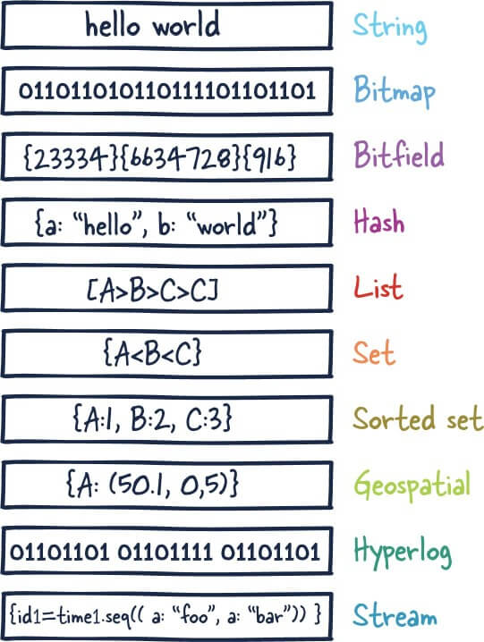

### Redis 为什么这么快？

- **纯内存操作 (Memory-Based Storage)** ：这是最主要的原因。Redis 数据读写操作都发生在内存中，访问速度是纳秒级别，而传统数据库频繁读写磁盘的速度是毫秒级别，两者相差数个数量级。
- **高效的 I/O 模型 (I/O Multiplexing & Single-Threaded Event Loop)** ：Redis 使用单线程事件循环配合 I/O 多路复用技术，让单个线程可以同时处理多个网络连接上的 I/O 事件（如读写），避免了多线程模型中的上下文切换和锁竞争问题。虽然是单线程，但结合内存操作的高效性和 I/O 多路复用，使得 Redis 能轻松处理大量并发请求（Redis 线程模型会在后文中详细介绍到）。
- **优化的内部数据结构 (Optimized Data Structures)** ：Redis 提供多种数据类型（如 String, List, Hash, Set, Sorted Set 等），其内部实现采用高度优化的编码方式（如 ziplist, quicklist, skiplist, hashtable 等）。Redis 会根据数据大小和类型动态选择最合适的内部编码，以在性能和空间效率之间取得最佳平衡。
- **简洁高效的通信协议 (Simple Protocol - RESP)** ：Redis 使用的是自己设计的 RESP (REdis Serialization Protocol) 协议。这个协议实现简单、解析性能好，并且是二进制安全的。客户端和服务端之间通信的序列化/反序列化开销很小，有助于提升整体的交互速度。

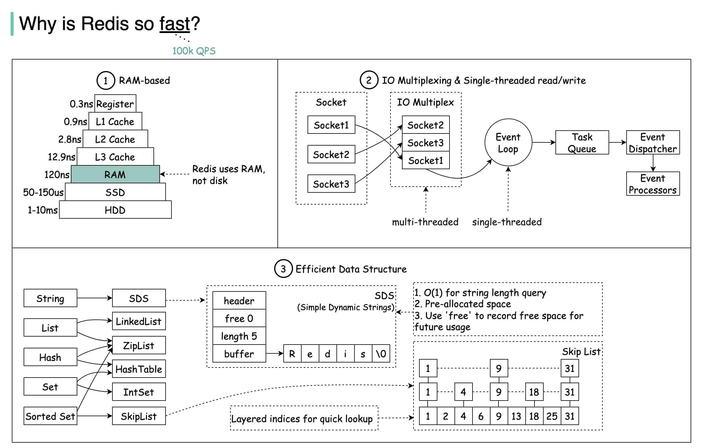

### 除了 Redis，你还知道其他分布式缓存方案吗？

分布式缓存的话，比较老牌同时也是使用的比较多的还是 **Memcached** 和 **Redis**。不过，现在基本没有看过还有项目使用 **Memcached** 来做缓存，都是直接用 **Redis**。Memcached 是分布式缓存最开始兴起的那会，比较常用的。后来，随着 Redis 的发展，大家慢慢都转而使用更加强大的 Redis 了。

目前，比较业界认可的 Redis 替代品还是下面这两个开源分布式缓存：

- [Dragonfly](https://github.com/dragonflydb/dragonfly)：一种针对现代应用程序负荷需求而构建的内存数据库，完全兼容 Redis 和 Memcached 的 API，迁移时无需修改任何代码，号称全世界最快的内存数据库。
- [KeyDB](https://github.com/Snapchat/KeyDB)：Redis 的一个高性能分支，专注于多线程、内存效率和高吞吐量。

### 说一下 Redis 和 Memcached 的区别和共同点

- **数据类型**：Redis 支持更丰富的数据类型（支持更复杂的应用场景）。Redis 不仅仅支持简单的 k/v 类型的数据，同时还提供 list、set、zset、hash 等数据结构的存储；而 Memcached 只支持最简单的 k/v 数据类型。
- **数据持久化**：Redis 支持数据的持久化，可以将内存中的数据保持在磁盘中，重启的时候可以再次加载进行使用；而 Memcached 把数据全部存在内存之中。也就是说，Redis 有灾难恢复机制，而 Memcached 没有。
- **集群模式支持**：Memcached 没有原生的集群模式，需要依靠客户端来实现往集群中分片写入数据；而 Redis 自 3.0 版本起是原生支持集群模式的。
- **线程模型**：Memcached 是多线程、非阻塞 IO 复用的网络模型；而 Redis 使用单线程的多路 IO 复用模型（Redis 6.0 针对网络数据的读写引入了多线程）。
- **特性支持**：Redis 支持发布订阅模型、Lua 脚本、事务等功能，而 Memcached 不支持。并且，Redis 支持更多的编程语言。
- **过期数据删除**：Memcached 过期数据的删除策略只用了惰性删除，而 Redis 同时使用了惰性删除与定期删除。

### 为什么要用 Redis？

**1、访问速度更快**

传统数据库数据保存在磁盘，而 Redis 基于内存，内存的访问速度比磁盘快很多。引入 Redis 之后，我们可以把一些高频访问的数据放到 Redis 中，这样下次就可以直接从内存中读取，速度可以提升几十倍甚至上百倍。

**2、高并发**

一般像 MySQL 这类的数据库的 QPS 大概都在 4k 左右（4 核 8g），但是使用 Redis 缓存之后很容易达到 5w+，甚至能达到 10w+（就单机 Redis 的情况，Redis 集群的话会更高）。

> QPS（Query Per Second）：服务器每秒可以执行的查询次数；

由此可见，直接操作缓存能够承受的数据库请求数量是远远大于直接访问数据库的，所以我们可以考虑把数据库中的部分数据转移到缓存中去，这样用户的一部分请求会直接到缓存这里而不用经过数据库。进而，我们也就提高了系统整体的并发。

**3、功能全面**

Redis 除了可以用作缓存之外，还可以用于分布式锁、限流、消息队列、延时队列等场景，功能强大！

### 为什么用 Redis 而不用本地缓存呢？

| 特性         | 本地缓存                             | Redis                            |
| ------------ | ------------------------------------ | -------------------------------- |
| 数据一致性   | 多服务器部署时存在数据不一致问题     | 数据一致                         |
| 内存限制     | 受限于单台服务器内存                 | 独立部署，内存空间更大           |
| 数据丢失风险 | 服务器宕机数据丢失                   | 可持久化，数据不易丢失           |
| 管理维护     | 分散，管理不便                       | 集中管理，提供丰富的管理工具     |
| 功能丰富性   | 功能有限，通常只提供简单的键值对存储 | 功能丰富，支持多种数据结构和功能 |

### 什么是 Redis Module？有什么用？

Redis 从 4.0 版本开始，支持通过 Module 来扩展其功能以满足特殊的需求。这些 Module 以动态链接库（so 文件）的形式被加载到 Redis 中，这是一种非常灵活的动态扩展功能的实现方式，我们每个人都可以基于 Redis 去定制化开发自己的 Module，比如实现搜索引擎功能、自定义分布式锁和分布式限流。

目前，被 Redis 官方推荐的 Module 有：

- [RediSearch](https://github.com/RediSearch/RediSearch)：用于实现搜索引擎的模块。
- [RedisJSON](https://github.com/RedisJSON/RedisJSON)：用于处理 JSON 数据的模块。
- [RedisGraph](https://github.com/RedisGraph/RedisGraph)：用于实现图形数据库的模块。
- [RedisTimeSeries](https://github.com/RedisTimeSeries/RedisTimeSeries)：用于处理时间序列数据的模块。
- [RedisBloom](https://github.com/RedisBloom/RedisBloom)：用于实现布隆过滤器的模块。
- [RedisAI](https://github.com/RedisAI/RedisAI)：用于执行深度学习/机器学习模型并管理其数据的模块。
- [RedisCell](https://github.com/brandur/redis-cell)：用于实现分布式限流的模块。

### Redis 除了做缓存，还能做什么？

- **分布式锁**：通过 Redis 来做分布式锁是一种比较常见的方式。通常情况下，我们都是基于 Redisson 来实现分布式锁。关于 Redis 实现分布式锁的详细介绍，可以看我写的这篇文章：[分布式锁详解](https://javaguide.cn/distributed-system/distributed-lock.html)。
- **限流**：一般是通过 Redis + Lua 脚本的方式来实现限流。如果不想自己写 Lua 脚本的话，也可以直接利用 Redisson 中的 `RRateLimiter` 来实现分布式限流，其底层实现就是基于 Lua 代码+令牌桶算法。
- **消息队列**：Redis 自带的 List 数据结构可以作为一个简单的队列使用。Redis 5.0 中增加的 Stream 类型的数据结构更加适合用来做消息队列。它比较类似于 Kafka，有主题和消费组的概念，支持消息持久化以及 ACK 机制。
- **延时队列**：Redisson 内置了延时队列（基于 Sorted Set 实现的）。
- **分布式 Session**：利用 String 或者 Hash 数据类型保存 Session 数据，所有的服务器都可以访问。
- **复杂业务场景**：通过 Redis 以及 Redis 扩展（比如 Redisson）提供的数据结构，我们可以很方便地完成很多复杂的业务场景，比如通过 Bitmap 统计活跃用户、通过 Sorted Set 维护排行榜、通过 HyperLogLog 统计网站 UV 和 PV。

### Redis 可以做消息队列么？怎么实现？

- **如果业务简单、量小、追求极致性能**，且能容忍极小概率的数据丢失，使用 **Redis Stream** 是最优解，因为它省去了部署维护 MQ 的成本，可以复用现有的 Redis 组件（大部分需要用到 MQ 的项目，通常都会需要 Redis）。
- **如果是金融级业务、海量数据、需要严格保证不丢消息**，必须选择 **Kafka、RabbitMQ** 等更成熟的 MQ。

### 如何基于 Redis 实现延时任务？

> 类似的问题：
>
> - 订单在 10 分钟后未支付就失效，如何用 Redis 实现？
> - 红包 24 小时未被查收自动退还，如何用 Redis 实现？

基于 Redis 实现延时任务的功能无非就下面两种方案：

1. Redis 过期事件监听。
2. Redisson 内置的延时队列。

Redis 过期事件监听存在时效性较差、丢消息、多服务实例下消息重复消费等问题，不被推荐使用。

Redisson 内置的延时队列具备下面这些优势：

1. **减少了丢消息的可能**：DelayedQueue 中的消息会被持久化，即使 Redis 宕机了，根据持久化机制，也只可能丢失一点消息，影响不大。当然了，你也可以使用扫描数据库的方法作为补偿机制。
2. **消息不存在重复消费问题**：每个客户端都是从同一个目标队列中获取任务的，不存在重复消费的问题。

## Redis 数据类型

### Redis 常用的数据类型有哪些？

Redis 中比较常见的数据类型有下面这些：

- **5 种基础数据类型**：String（字符串）、List（列表）、Set（集合）、Hash（散列）、Zset（有序集合）。
- **3 种特殊数据类型**：HyperLogLog（基数统计）、Bitmap （位图）、Geospatial (地理位置)。

除了上面提到的之外，还有一些其他的比如 [Bloom filter（布隆过滤器）](https://javaguide.cn/cs-basics/data-structure/bloom-filter.html)、Bitfield（位域）。

### String 的应用场景有哪些？

String 是 Redis 中最简单同时也是最常用的一个数据类型。它是一种二进制安全的数据类型，可以用来存储任何类型的数据比如字符串、整数、浮点数、图片（图片的 base64 编码或者解码或者图片的路径）、序列化后的对象。

- 常规数据（比如 Session、Token、序列化后的对象、图片的路径）的缓存；
- 计数比如用户单位时间的请求数（简单限流可以用到）、页面单位时间的访问数；
- 分布式锁（利用 `SETNX key value` 命令可以实现一个最简易的分布式锁）；

### String 还是 Hash 存储对象数据更好呢？

简单对比一下二者：

- **对象存储方式**：String 存储的是序列化后的对象数据，存放的是整个对象，操作简单直接。Hash 是对对象的每个字段单独存储，可以获取部分字段的信息，也可以修改或者添加部分字段，节省网络流量。如果对象中某些字段需要经常变动或者经常需要单独查询对象中的个别字段信息，Hash 就非常适合。
- **内存消耗**：Hash 通常比 String 更节省内存，特别是在字段较多且字段长度较短时。Redis 对小型 Hash 进行优化（如使用 ziplist 存储），进一步降低内存占用。
- **复杂对象存储**：String 在处理多层嵌套或复杂结构的对象时更方便，因为无需处理每个字段的独立存储和操作。
- **性能**：String 的操作通常具有 O(1) 的时间复杂度，因为它存储的是整个对象，操作简单直接，整体读写的性能较好。Hash 由于需要处理多个字段的增删改查操作，在字段较多且经常变动的情况下，可能会带来额外的性能开销。

- 在绝大多数情况下，**String** 更适合存储对象数据，尤其是当对象结构简单且整体读写是主要操作时。
- 如果你需要频繁操作对象的部分字段或节省内存，**Hash** 可能是更好的选择。

### String 的底层实现是什么？

Redis 是基于 C 语言编写的，但 Redis 的 String 类型的底层实现并不是 C 语言中的字符串（即以空字符 `\0` 结尾的字符数组），而是自己编写了 [SDS](https://github.com/antirez/sds)（Simple Dynamic String，简单动态字符串）来作为底层实现。

SDS 相比于 C 语言中的字符串有如下提升：

1. **可以避免缓冲区溢出**：C 语言中的字符串被修改（比如拼接）时，一旦没有分配足够长度的内存空间，就会造成缓冲区溢出。SDS 被修改时，会先根据 len 属性检查空间大小是否满足要求，如果不满足，则先扩展至所需大小再进行修改操作。
2. **获取字符串长度的复杂度较低**：C 语言中的字符串的长度通常是经过遍历计数来实现的，时间复杂度为 O(n)。SDS 的长度获取直接读取 len 属性即可，时间复杂度为 O(1)。
3. **减少内存分配次数**：为了避免修改（增加/减少）字符串时，每次都需要重新分配内存（C 语言的字符串是这样的），SDS 实现了空间预分配和惰性空间释放两种优化策略。当 SDS 需要增加字符串时，Redis 会为 SDS 分配好内存，并且根据特定的算法分配多余的内存，这样可以减少连续执行字符串增长操作所需的内存重分配次数。当 SDS 需要减少字符串时，这部分内存不会立即被回收，会被记录下来，等待后续使用（支持手动释放，有对应的 API）。
4. **二进制安全**：C 语言中的字符串以空字符 `\0` 作为字符串结束的标识，这存在一些问题，像一些二进制文件（比如图片、视频、音频）就可能包括空字符，C 字符串无法正确保存。SDS 使用 len 属性判断字符串是否结束，不存在这个问题。

### 购物车信息用 String 还是 Hash 存储更好呢?

由于购物车中的商品频繁修改和变动，购物车信息建议使用 Hash 存储：

- 用户 id 为 key
- 商品 id 为 field，商品数量为 value

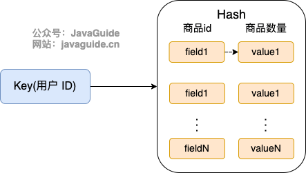

- 用户添加商品就是往 Hash 里面增加新的 field 与 value；
- 查询购物车信息就是遍历对应的 Hash；
- 更改商品数量直接修改对应的 value 值（直接 set 或者做运算皆可）；
- 删除商品就是删除 Hash 中对应的 field；
- 清空购物车直接删除对应的 key 即可。

### 使用 Redis 实现一个排行榜怎么做？

Redis 中有一个叫做 `Sorted Set`（有序集合）的数据类型经常被用在各种排行榜的场景，比如直播间送礼物的排行榜、朋友圈的微信步数排行榜、王者荣耀中的段位排行榜、话题热度排行榜等等。相关的一些 Redis 命令：`ZRANGE`（从小到大排序）、`ZREVRANGE`（从大到小排序）、`ZREVRANK`（指定元素排名）。

### Redis 的有序集合底层为什么要用跳表，而不用平衡树、红黑树或者 B+ 树？

- 平衡树 vs 跳表：平衡树的插入、删除和查询的时间复杂度和跳表一样都是 **O(log n)**。对于范围查询来说，平衡树也可以通过中序遍历的方式达到和跳表一样的效果。但是它的每一次插入或者删除操作都需要保证整颗树左右节点的绝对平衡，只要不平衡就要通过旋转操作来保持平衡，这个过程是比较耗时的。跳表诞生的初衷就是为了克服平衡树的一些缺点。跳表使用概率平衡而不是严格强制的平衡，因此，跳表中的插入和删除算法比平衡树的等效算法简单得多，速度也快得多。
- 红黑树 vs 跳表：相比较于红黑树来说，跳表的实现也更简单一些，不需要通过旋转和染色（红黑变换）来保证黑平衡。并且，按照区间来查找数据这个操作，红黑树的效率没有跳表高。
- B+ 树 vs 跳表：B+ 树更适合作为数据库和文件系统中常用的索引结构之一，它的核心思想是通过可能少的 IO 定位到尽可能多的索引来获得查询数据。对于 Redis 这种内存数据库来说，它对这些并不感冒，因为 Redis 作为内存数据库它不可能存储大量的数据，所以对于索引不需要通过 B+ 树这种方式进行维护，只需按照概率进行随机维护即可，节约内存。而且使用跳表实现 zset 时相较前者来说更简单一些，在进行插入时只需通过索引将数据插入到链表中合适的位置再随机维护一定高度的索引即可，也不需要像 B+ 树那样插入时发现失衡时还需要对节点分裂与合并。

### Set 的应用场景是什么？

Redis 中 `Set` 是一种无序集合，集合中的元素没有先后顺序但都唯一，有点类似于 Java 中的 `HashSet` 。

`Set` 的常见应用场景如下：

- 存放的数据不能重复的场景：网站 UV 统计（数据量巨大的场景还是 `HyperLogLog` 更适合一些）、文章点赞、动态点赞等等。
- 需要获取多个数据源交集、并集和差集的场景：共同好友（交集）、共同粉丝（交集）、共同关注（交集）、好友推荐（差集）、音乐推荐（差集）、订阅号推荐（差集+交集）等等。
- 需要随机获取数据源中的元素的场景：抽奖系统、随机点名等等。

### 使用 Set 实现抽奖系统怎么做？

如果想要使用 `Set` 实现一个简单的抽奖系统的话，直接使用下面这几个命令就可以了：

- `SADD key member1 member2 ...`：向指定集合添加一个或多个元素。
- `SPOP key count`：随机移除并获取指定集合中一个或多个元素，适合不允许重复中奖的场景。
- `SRANDMEMBER key count`：随机获取指定集合中指定数量的元素，适合允许重复中奖的场景。

### 使用 Bitmap 统计活跃用户怎么做？

Bitmap 存储的是连续的二进制数字（0 和 1），通过 Bitmap，只需要一个 bit 位来表示某个元素对应的值或者状态，key 就是对应元素本身。我们知道 8 个 bit 可以组成一个 byte，所以 Bitmap 本身会极大的节省储存空间。

你可以将 Bitmap 看作是一个存储二进制数字（0 和 1）的数组，数组中每个元素的下标叫做 offset（偏移量）。如果想要使用 Bitmap 统计活跃用户的话，可以使用日期（精确到天）作为 key，然后用户 ID 为 offset，如果当日活跃过就设置为 1。

### HyperLogLog 适合什么场景？

HyperLogLog (HLL) 是一种非常巧妙的概率性数据结构，它专门解决一类非常棘手的大数据问题：在海量数据中，用极小的内存，估算一个集合中不重复元素的数量，也就是我们常说的基数（Cardinality）

HLL 做的最核心的权衡，就是用一点点精确度的损失，来换取巨大的内存空间节省。它给出的不是一个 100%精确的数字，而是一个带有很小标准误差（Redis 中默认是 0.81%）的近似值。

**基于这个核心权衡，HyperLogLog 最适合以下特征的场景：**

1. **数据量巨大，内存敏感：** 这是 HLL 的主战场。比如，要统计一个亿级日活 App 的每日独立访客数。如果用传统的 Set 来存储用户 ID，一个 ID 占几十个字节，上亿个 ID 可能需要几个 GB 甚至几十 GB 的内存，这在很多场景下是不可接受的。而 HLL，在 Redis 中只需要固定的 12KB 内存，就能处理天文数字级别的基数，这是一个颠覆性的优势。
2. **对结果的精确度要求不是 100%：** 这是使用 HLL 的前提。比如，产品经理想知道一个热门帖子的 UV（独立访客数）是大约 1000 万还是 1010 万，这个细微的差别通常不影响商业决策。但如果场景是统计一个交易系统的准确交易笔数，那 HLL 就完全不适用，因为金融场景要求 100%的精确。

**所以，HyperLogLog 具体的应用场景就非常清晰了：**

- **网站/App 的 UV（Unique Visitor）统计：** 比如统计首页每天有多少个不同的 IP 或用户 ID 访问过。
- **搜索引擎关键词统计：** 统计每天有多少个不同的用户搜索了某个关键词。
- **社交网络互动统计：** 比如统计一条微博被多少个不同的用户转发过。

### 使用 HyperLogLog 统计页面 UV 怎么做？

使用 HyperLogLog 统计页面 UV 主要需要用到下面这两个命令：

- `PFADD key element1 element2 ...`：添加一个或多个元素到 HyperLogLog 中。
- `PFCOUNT key1 key2`：获取一个或者多个 HyperLogLog 的唯一计数。

### 如果我想判断一个元素是否不在海量元素集合中，用什么数据类型？

这是布隆过滤器的经典应用场景。布隆过滤器可以告诉你一个元素一定不存在或者可能存在，它也有极高的空间效率和一定的误判率，但绝不会漏报。也就是说，布隆过滤器说某个元素存在，小概率会误判。布隆过滤器说某个元素不在，那么这个元素一定不在。

Bloom Filter 的简单原理图如下：

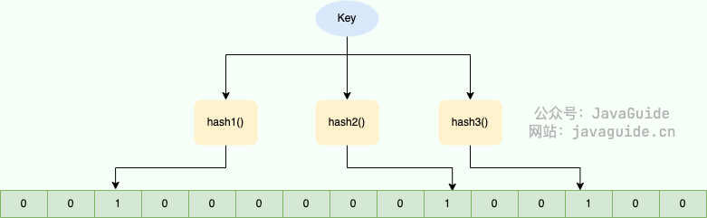

当字符串存储要加入到布隆过滤器中时，该字符串首先由多个哈希函数生成不同的哈希值，然后将对应的位数组的下标设置为 1（当位数组初始化时，所有位置均为 0）。当第二次存储相同字符串时，因为先前的对应位置已设置为 1，所以很容易知道此值已经存在（去重非常方便）。

如果我们需要判断某个字符串是否在布隆过滤器中时，只需要对给定字符串再次进行相同的哈希计算，得到值之后判断位数组中的每个元素是否都为 1，如果值都为 1，那么说明这个值在布隆过滤器中，如果存在一个值不为 1，说明该元素不在布隆过滤器中。

## Redis 线程模型

### Redis 单线程模型了解吗？

**Redis 基于 Reactor 模式设计开发了一套高效的事件处理模型**（Netty 的线程模型也基于 Reactor 模式，Reactor 模式不愧是高性能 IO 的基石），这套事件处理模型对应的是 Redis 中的文件事件处理器（file event handler）。由于文件事件处理器（file event handler）是单线程方式运行的，所以我们一般都说 Redis 是单线程模型。

> Redis 基于 Reactor 模式开发了自己的网络事件处理器：这个处理器被称为文件事件处理器（file event handler）。
>
> - 文件事件处理器使用 I/O 多路复用（multiplexing）程序来同时监听多个套接字，并根据套接字目前执行的任务来为套接字关联不同的事件处理器。
> - 当被监听的套接字准备好执行连接应答（accept）、读取（read）、写入（write）、关 闭（close）等操作时，与操作相对应的文件事件就会产生，这时文件事件处理器就会调用套接字之前关联好的事件处理器来处理这些事件。
>
> **虽然文件事件处理器以单线程方式运行，但通过使用 I/O 多路复用程序来监听多个套接字**，文件事件处理器既实现了高性能的网络通信模型，又可以很好地与 Redis 服务器中其他同样以单线程方式运行的模块进行对接，这保持了 Redis 内部单线程设计的简单性。

文件事件处理器（file event handler）主要是包含 4 个部分：

- 多个 socket（客户端连接）
- IO 多路复用程序（支持多个客户端连接的关键）
- 文件事件分派器（将 socket 关联到相应的事件处理器）
- 事件处理器（连接应答处理器、命令请求处理器、命令回复处理器）



### Redis6.0 之前为什么不使用多线程？

虽然说 Redis 是单线程模型，但实际上，**Redis 在 4.0 之后的版本中就已经加入了对多线程的支持。**

不过，Redis 4.0 增加的多线程主要是针对一些大键值对的删除操作的命令，使用这些命令就会使用主线程之外的其他线程来“异步处理”，从而减少对主线程的影响。

为此，Redis 4.0 之后新增了几个异步命令：

- `UNLINK`：可以看作是 `DEL` 命令的异步版本。
- `FLUSHALL ASYNC`：用于清空所有数据库的所有键，不限于当前 `SELECT` 的数据库。
- `FLUSHDB ASYNC`：用于清空当前 `SELECT` 数据库中的所有键。

### Redis 后台线程了解吗？

我们虽然经常说 Redis 是单线程模型（主要逻辑是单线程完成的），但实际还有一些后台线程用于执行一些比较耗时的操作：

- 通过 `bio_close_file` 后台线程来释放 AOF / RDB 等过程中产生的临时文件资源。
- 通过 `bio_aof_fsync` 后台线程调用 `fsync` 函数将系统内核缓冲区还未同步到到磁盘的数据强制刷到磁盘（AOF 文件）。
- 通过 `bio_lazy_free` 后台线程释放大对象（已删除）占用的内存空间.

## Redis 内存管理

### Redis 给缓存数据设置过期时间有什么用？

内存是有限且珍贵的，如果不对缓存数据设置过期时间，那内存占用就会一直增长，最终可能会导致 OOM 问题。通过设置合理的过期时间，Redis 会自动删除暂时不需要的数据，为新的缓存数据腾出空间。

```shell
127.0.0.1:6379> expire key 60 # 数据在 60s 后过期
(integer) 1
127.0.0.1:6379> setex key 60 value # 数据在 60s 后过期 (setex:[set] + [ex]pire)
OK
127.0.0.1:6379> ttl key # 查看数据还有多久过期
(integer) 56
```

注意 ⚠️：Redis 中除了字符串类型有自己独有设置过期时间的命令 `setex` 外，其他方法都需要依靠 `expire` 命令来设置过期时间 。另外，`persist` 命令可以移除一个键的过期时间。

**过期时间除了有助于缓解内存的消耗，还有什么其他用么？**

很多时候，我们的业务场景就是需要某个数据只在某一时间段内存在，比如我们的短信验证码可能只在 1 分钟内有效，用户登录的 Token 可能只在 1 天内有效。

如果使用传统的数据库来处理的话，一般都是自己判断过期，这样更麻烦并且性能要差很多。

### Redis 是如何判断数据是否过期的呢？

Redis 通过一个叫做过期字典（可以看作是 hash 表）来保存数据过期的时间。过期字典的键指向 Redis 数据库中的某个 key（键），过期字典的值是一个 long long 类型的整数，这个整数保存了 key 所指向的数据库键的过期时间（毫秒精度的 UNIX 时间戳）。

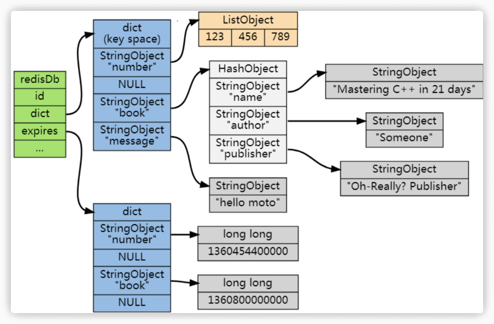

### Redis 过期 key 删除策略了解么？

1. **惰性删除**：只会在取出/查询 key 的时候才对数据进行过期检查。这种方式对 CPU 最友好，但是可能会造成太多过期 key 没有被删除。
2. **定期删除**：周期性地随机从设置了过期时间的 key 中抽查一批，然后逐个检查这些 key 是否过期，过期就删除 key。相比于惰性删除，定期删除对内存更友好，对 CPU 不太友好。

Redis 采用的是 **定期删除+惰性/懒汉式删除** 结合的策略，这也是大部分缓存框架的选择。定期删除对内存更加友好，惰性删除对 CPU 更加友好。两者各有千秋，结合起来使用既能兼顾 CPU 友好，又能兼顾内存友好。

Redis 的定期删除过程是随机的（周期性地随机从设置了过期时间的 key 中抽查一批），所以并不保证所有过期键都会被立即删除。这也就解释了为什么有的 key 过期了，并没有被删除。并且，Redis 底层会通过限制删除操作执行的时长和频率来减少删除操作对 CPU 时间的影响。

另外，定期删除还会受到执行时间和过期 key 的比例的影响：

- 执行时间已经超过了阈值，那么就中断这一次定期删除循环，以避免使用过多的 CPU 时间。
- 如果这一批过期的 key 比例超过一个比例，就会重复执行此删除流程，以更积极地清理过期 key。相应地，如果过期的 key 比例低于这个比例，就会中断这一次定期删除循环，避免做过多的工作而获得很少的内存回收。

Redis 7.2 版本的执行时间阈值是 **25ms**，过期 key 比例设定值是 **10%**。

```c
#define ACTIVE_EXPIRE_CYCLE_FAST_DURATION 1000 /* Microseconds. */
#define ACTIVE_EXPIRE_CYCLE_SLOW_TIME_PERC 25 /* Max % of CPU to use. */
#define ACTIVE_EXPIRE_CYCLE_ACCEPTABLE_STALE 10 /* % of stale keys after which 
                                                   we do extra efforts. */ 代表每秒执行 10 次，也就是每秒钟进行 10 次尝试来查找并删除过期的 key。
```

**为什么定期删除不是把所有过期 key 都删除呢？**

这样会对性能造成太大的影响。如果我们 key 数量非常庞大的话，挨个遍历检查是非常耗时的，会严重影响性能。Redis 设计这种策略的目的是为了平衡内存和性能。

**为什么 key 过期之后不立马把它删掉呢？这样不是会浪费很多内存空间吗？**

因为不太好办到，或者说这种删除方式的成本太高了。假如我们使用延迟队列作为删除策略，这样存在下面这些问题：

1. 队列本身的开销可能很大：key 多的情况下，一个延迟队列可能无法容纳。
2. 维护延迟队列太麻烦：修改 key 的过期时间就需要调整其在延迟队列中的位置，并且还需要引入并发控制。

### 大量 key 集中过期怎么办？

当 Redis 中存在大量 key 在同一时间点集中过期时，可能会导致以下问题：

- **请求延迟增加**：Redis 在处理过期 key 时需要消耗 CPU 资源，如果过期 key 数量庞大，会导致 Redis 实例的 CPU 占用率升高，进而影响其他请求的处理速度，造成延迟增加。
- **内存占用过高**：过期的 key 虽然已经失效，但在 Redis 真正删除它们之前，仍然会占用内存空间。如果过期 key 没有及时清理，可能会导致内存占用过高，甚至引发内存溢出。

为了避免这些问题，可以采取以下方案：

1. **尽量避免 key 集中过期**：在设置键的过期时间时尽量随机一点。
2. **开启 lazy free 机制**：修改 `redis.conf` 配置文件，将 `lazyfree-lazy-expire` 参数设置为 `yes`，即可开启 lazy free 机制。开启 lazy free 机制后，Redis 会在后台异步删除过期的 key，不会阻塞主线程的运行，从而降低对 Redis 性能的影响。

### Redis 内存淘汰策略了解么？

Redis 的内存淘汰策略只有在运行内存达到了配置的最大内存阈值时才会触发，这个阈值是通过 `redis.conf` 的 `maxmemory` 参数来定义的。64 位操作系统下，`maxmemory` 默认为 0，表示不限制内存大小。32 位操作系统下，默认的最大内存值是 3GB。

Redis 提供了 8 种内存淘汰策略：

1. **volatile-lru（least recently used）**：从已设置过期时间的数据集（`server.db[i].expires`）中挑选最近最少使用的数据淘汰。
2. **volatile-ttl**：从已设置过期时间的数据集（`server.db[i].expires`）中挑选将要过期的数据淘汰。
3. **volatile-random**：从已设置过期时间的数据集（`server.db[i].expires`）中任意选择数据淘汰。
4. **allkeys-lru（least recently used）**：从数据集（`server.db[i].dict`）中移除最近最少使用的数据淘汰。
5. **allkeys-random**：从数据集（`server.db[i].dict`）中任意选择数据淘汰。
6. **no-eviction**（默认内存淘汰策略）：禁止驱逐数据，当内存不足以容纳新写入数据时，新写入操作会报错。
7. **volatile-lfu（least frequently used）**：从已设置过期时间的数据集（`server.db[i].expires`）中挑选最不经常使用的数据淘汰。
8. **allkeys-lfu（least frequently used）**：从数据集（`server.db[i].dict`）中移除最不经常使用的数据淘汰。

`allkeys-xxx` 表示从所有的键值中淘汰数据，而 `volatile-xxx` 表示从设置了过期时间的键值中淘汰数据。

## Redis 事务

### 什么是 Redis 事务？

你可以将 Redis 中的事务理解为：**Redis 事务提供了一种将多个命令请求打包的功能。然后，再按顺序执行打包的所有命令，并且不会被中途打断。**

Redis 事务实际开发中使用的非常少，功能比较鸡肋，不要将其和我们平时理解的关系型数据库的事务混淆了。

除了不满足原子性和持久性之外，事务中的每条命令都会与 Redis 服务器进行网络交互，这是比较浪费资源的行为。明明一次批量执行多个命令就可以了，这种操作实在是看不懂。

因此，Redis 事务是不建议在日常开发中使用的。

### 如何使用 Redis 事务？

Redis 可以通过 **`MULTI`、`EXEC`、`DISCARD` 和 `WATCH`** 等命令来实现事务（Transaction）功能。

[`MULTI`](https://redis.io/commands/multi) 命令后可以输入多个命令，Redis 不会立即执行这些命令，而是将它们放到队列，当调用了 [`EXEC`](https://redis.io/commands/exec) 命令后，再执行所有的命令。

```bash
MULTI
OK
SET PROJECT "JavaGuide"
QUEUED
GET PROJECT
QUEUED
EXEC
1) OK
2) "JavaGuide"
```

1. 开始事务（`MULTI`）；
2. 命令入队（批量操作 Redis 的命令，先进先出（FIFO）的顺序执行）；
3. 执行事务（`EXEC`）。

你可以通过[`WATCH`](https://redis.io/commands/watch) 命令监听指定的 Key，当调用 `EXEC` 命令执行事务时，如果一个被 `WATCH` 命令监视的 Key 被 **其他客户端/Session** 修改的话，整个事务都不会被执行。

```bash
# 客户端 1
SET PROJECT "RustGuide"
OK
WATCH PROJECT
OK
MULTI
OK
SET PROJECT "JavaGuide"
QUEUED

# 客户端 2
# 在客户端 1 执行 EXEC 命令提交事务之前修改 PROJECT 的值
SET PROJECT "GoGuide"

# 客户端 1
# 修改失败，因为 PROJECT 的值被客户端2修改了
EXEC
(nil)
GET PROJECT
"GoGuide"
```

不过，如果 **WATCH** 与 **事务** 在同一个 Session 里，并且被 **WATCH** 监视的 Key 被修改的操作发生在事务内部，这个事务是可以被执行成功的

### Redis 事务支持原子性吗？

Redis 的事务和我们平时理解的关系型数据库的事务不同。我们知道事务具有四大特性：**1. 原子性**，**2. 隔离性**，**3. 持久性**，**4. 一致性**。

1. **原子性（Atomicity）**：事务是最小的执行单位，不允许分割。事务的原子性确保动作要么全部完成，要么完全不起作用；
2. **隔离性（Isolation）**：并发访问数据库时，一个用户的事务不被其他事务所干扰，各并发事务之间数据库是独立的；
3. **持久性（Durability）**：一个事务被提交之后。它对数据库中数据的改变是持久的，即使数据库发生故障也不应该对其有任何影响；
4. **一致性（Consistency）**：执行事务前后，数据保持一致，多个事务对同一个数据读取的结果是相同的。

Redis 事务在运行错误的情况下，除了执行过程中出现错误的命令外，其他命令都能正常执行。并且，Redis 事务是不支持回滚（roll back）操作的。因此，Redis 事务其实是不满足原子性的。

Redis 官网也解释了自己为啥不支持回滚。简单来说就是 Redis 开发者们觉得没必要支持回滚，这样更简单便捷并且性能更好。Redis 开发者觉得即使命令执行错误也应该在开发过程中就被发现而不是生产过程中。

### Redis 事务支持持久性吗？

Redis 不同于 Memcached 的很重要一点就是，Redis 支持持久化，而且支持 3 种持久化方式：

- 快照（snapshotting，RDB）；
- 只追加文件（append-only file，AOF）；
- RDB 和 AOF 的混合持久化（Redis 4.0 新增）。

与 RDB 持久化相比，AOF 持久化的实时性更好。在 Redis 的配置文件中存在三种不同的 AOF 持久化方式（`fsync` 策略），它们分别是：

```bash
appendfsync always    #每次有数据修改发生时，都会调用fsync函数同步AOF文件，fsync完成后线程返回，这样会严重降低Redis的速度
appendfsync everysec  #每秒钟调用fsync函数同步一次AOF文件
appendfsync no        #让操作系统决定何时进行同步，一般为30秒一次
```

AOF 持久化的 `fsync` 策略为 no、everysec 时都会存在数据丢失的情况。always 下可以基本是可以满足持久性要求的，但性能太差，实际开发过程中不会使用。

因此，Redis 事务的持久性也是没办法保证的。

### 如何解决 Redis 事务的缺陷？

Redis 从 2.6 版本开始支持执行 Lua 脚本，它的功能和事务非常类似。我们可以利用 Lua 脚本来批量执行多条 Redis 命令，这些 Redis 命令会被提交到 Redis 服务器一次性执行完成，大幅减小了网络开销。

一段 Lua 脚本可以视作一条命令执行，一段 Lua 脚本执行过程中不会有其他脚本或 Redis 命令同时执行，保证了操作不会被其他指令插入或打扰。

不过，如果 Lua 脚本运行时出错并中途结束，出错之后的命令是不会被执行的。并且，出错之前执行的命令是无法被撤销的，无法实现类似关系型数据库执行失败可以回滚的那种原子性效果。因此，**严格来说的话，通过 Lua 脚本来批量执行 Redis 命令实际也是不完全满足原子性的。**

如果想要让 Lua 脚本中的命令全部执行，必须保证语句语法和命令都是对的。

## Redis 性能优化

### 使用批量操作减少网络传输

一个 Redis 命令的执行可以简化为以下 4 步：

1. 发送命令；
2. 命令排队；
3. 命令执行；
4. 返回结果。

其中，第 1 步和第 4 步耗费时间之和称为 **Round Trip Time（RTT，往返时间）**，也就是数据在网络上传输的时间。

使用批量操作可以减少网络传输次数，进而有效减小网络开销，大幅减少 RTT。

另外，除了能减少 RTT 之外，发送一次命令的 socket I/O 成本也比较高（涉及上下文切换，存在 `read()` 和 `write()` 系统调用），批量操作还可以减少 socket I/O 成本。

#### 原生批量操作命令

Redis 中有一些原生支持批量操作的命令，比如：

- `MGET`（获取一个或多个指定 key 的值）、`MSET`（设置一个或多个指定 key 的值）、
- `HMGET`（获取指定哈希表中一个或者多个指定字段的值）、`HMSET`（同时将一个或多个 field-value 对设置到指定哈希表中）、
- `SADD`（向指定集合添加一个或多个元素）
- ……

不过，在 Redis 官方提供的分片集群解决方案 Redis Cluster 下，使用这些原生批量操作命令可能会存在一些小问题需要解决。就比如说 `MGET` 无法保证所有的 key 都在同一个 **hash slot（哈希槽）** 上，`MGET`可能还是需要多次网络传输，原子操作也无法保证了。不过，相较于非批量操作，还是可以节省不少网络传输次数。

整个步骤的简化版如下：

1. 找到 key 对应的所有 hash slot；
2. 分别向对应的 Redis 节点发起 `MGET` 请求获取数据；
3. 等待所有请求执行结束，重新组装结果数据，保持跟入参 key 的顺序一致，然后返回结果。

如果想要解决这个多次网络传输的问题，比较常用的办法是自己维护 key 与 slot 的关系。不过这样不太灵活，虽然带来了性能提升，但同样让系统复杂性提升。

#### pipeline

对于不支持批量操作的命令，我们可以利用 **pipeline（流水线）** 将一批 Redis 命令封装成一组，这些 Redis 命令会被一次性提交到 Redis 服务器，只需要一次网络传输。不过，需要注意控制一次批量操作的 **元素个数**（例如 500 以内，实际也和元素字节数有关），避免网络传输的数据量过大。

与 `MGET`、`MSET` 等原生批量操作命令一样，pipeline 同样在 Redis Cluster 上使用会存在一些小问题。原因类似，无法保证所有的 key 都在同一个 **hash slot（哈希槽）** 上。如果想要使用的话，客户端需要自己维护 key 与 slot 的关系。

原生批量操作命令和 pipeline 的是有区别的，使用的时候需要注意：

- 原生批量操作命令是原子操作，pipeline 是非原子操作。
- pipeline 可以打包不同的命令，原生批量操作命令不可以。
- 原生批量操作命令是 Redis 服务端支持实现的，而 pipeline 需要服务端和客户端的共同实现。

另外，pipeline 不适用于执行顺序有依赖关系的一批命令。就比如说，你需要将前一个命令的结果给后续的命令使用，pipeline 就没办法满足你的需求了。对于这种需求，我们可以使用 **Lua 脚本**。

#### Lua 脚本

Lua 脚本同样支持批量操作多条命令。一段 Lua 脚本可以视作一条命令执行，可以看作是 **原子操作**。也就是说，一段 Lua 脚本执行过程中不会有其他脚本或 Redis 命令同时执行，保证了操作不会被其他指令插入或打扰，这是 pipeline 所不具备的。

并且，Lua 脚本中支持一些简单的逻辑处理比如使用命令读取值并在 Lua 脚本中进行处理，这同样是 pipeline 所不具备的。

不过， Lua 脚本依然存在下面这些缺陷：

- 如果 Lua 脚本运行时出错并中途结束，之后的操作不会进行，但是之前已经发生的写操作不会撤销，所以即使使用了 Lua 脚本，也不能实现类似数据库回滚的原子性。
- Redis Cluster 下 Lua 脚本的原子操作也无法保证了，原因同样是无法保证所有的 key 都在同一个 **hash slot（哈希槽）** 上。

### Redis bigkey（大 Key）

#### 什么是 bigkey？

简单来说，如果一个 key 对应的 value 所占用的内存比较大，那这个 key 就可以看作是 bigkey。具体多大才算大呢？有一个不是特别精确的参考标准：

- String 类型的 value 超过 1MB
- 复合类型（List、Hash、Set、Sorted Set 等）的 value 包含的元素超过 5000 个（不过，对于复合类型的 value 来说，不一定包含的元素越多，占用的内存就越多）。


#### bigkey 是怎么产生的？有什么危害？

bigkey 通常是由于下面这些原因产生的：

- 程序设计不当，比如直接使用 String 类型存储较大的文件对应的二进制数据。
- 对于业务的数据规模考虑不周到，比如使用集合类型的时候没有考虑到数据量的快速增长。
- 未及时清理垃圾数据，比如哈希中冗余了大量的无用键值对。

大 key 还会造成阻塞问题。具体来说，主要体现在下面三个方面：

1. 客户端超时阻塞：由于 Redis 执行命令是单线程处理，然后在操作大 key 时会比较耗时，那么就会阻塞 Redis，从客户端这一视角看，就是很久很久都没有响应。
2. 网络阻塞：每次获取大 key 产生的网络流量较大，如果一个 key 的大小是 1 MB，每秒访问量为 1000，那么每秒会产生 1000MB 的流量，这对于普通千兆网卡的服务器来说是灾难性的。
3. 工作线程阻塞：如果使用 del 删除大 key 时，会阻塞工作线程，这样就没办法处理后续的命令。




#### 如何发现 bigkey？

**1、使用 Redis 自带的 `--bigkeys` 参数来查找。**

```bash
> redis-cli -p 6379 --bigkeys

# Scanning the entire keyspace to find biggest keys as well as
# average sizes per key type.  You can use -i 0.1 to sleep 0.1 sec
# per 100 SCAN commands (not usually needed).

[00.00%] Biggest string found so far '"ballcat:oauth:refresh_auth:f6cdb384-9a9d-4f2f-af01-dc3f28057c20"' with 4437 bytes
[00.00%] Biggest list   found so far '"my-list"' with 17 items

-------- summary -------

Sampled 5 keys in the keyspace!
Total key length in bytes is 264 (avg len 52.80)

Biggest   list found '"my-list"' has 17 items
Biggest string found '"ballcat:oauth:refresh_auth:f6cdb384-9a9d-4f2f-af01-dc3f28057c20"' has 4437 bytes

1 lists with 17 items (20.00% of keys, avg size 17.00)
0 hashs with 0 fields (00.00% of keys, avg size 0.00)
4 strings with 4831 bytes (80.00% of keys, avg size 1207.75)
0 streams with 0 entries (00.00% of keys, avg size 0.00)
0 sets with 0 members (00.00% of keys, avg size 0.00)
0 zsets with 0 members (00.00% of keys, avg size 0.00
```

**2、使用 Redis 自带的 SCAN 命令**

`SCAN` 命令可以按照一定的模式和数量返回匹配的 key。获取了 key 之后，可以利用 `STRLEN`、`HLEN`、`LLEN` 等命令返回其长度或成员数量。

| 数据结构   | 命令   | 复杂度 | 结果（对应 key）   |
| ---------- | ------ | ------ | ------------------ |
| String     | STRLEN | O(1)   | 字符串值的长度     |
| Hash       | HLEN   | O(1)   | 哈希表中字段的数量 |
| List       | LLEN   | O(1)   | 列表元素数量       |
| Set        | SCARD  | O(1)   | 集合元素数量       |
| Sorted Set | ZCARD  | O(1)   | 有序集合的元素数量 |

对于集合类型还可以使用 `MEMORY USAGE` 命令（Redis 4.0+），这个命令会返回键值对占用的内存空间。

**3、借助开源工具分析 RDB 文件。**

通过分析 RDB 文件来找出 big key。这种方案的前提是你的 Redis 采用的是 RDB 持久化。

#### 如何处理 bigkey？

bigkey 的常见处理以及优化办法如下（这些方法可以配合起来使用）：

- **分割 bigkey**：将一个 bigkey 分割为多个小 key。例如，将一个含有上万字段数量的 Hash 按照一定策略（比如二次哈希）拆分为多个 Hash。

- **手动清理**：Redis 4.0+ 可以使用 `UNLINK` 命令来异步删除一个或多个指定的 key。Redis 4.0 以下可以考虑使用 `SCAN` 命令结合 `DEL` 命令来分批次删除。

- **采用合适的数据结构**：例如，文件二进制数据不使用 String 保存、使用 HyperLogLog 统计页面 UV、Bitmap 保存状态信息（0/1）。

- **开启 lazy-free（惰性删除/延迟释放）**：lazy-free 特性是 Redis 4.0 开始引入的，指的是让 Redis 采用异步方式延迟释放 key 使用的内存，将该操作交给单独的子线程处理，避免阻塞主线程。

  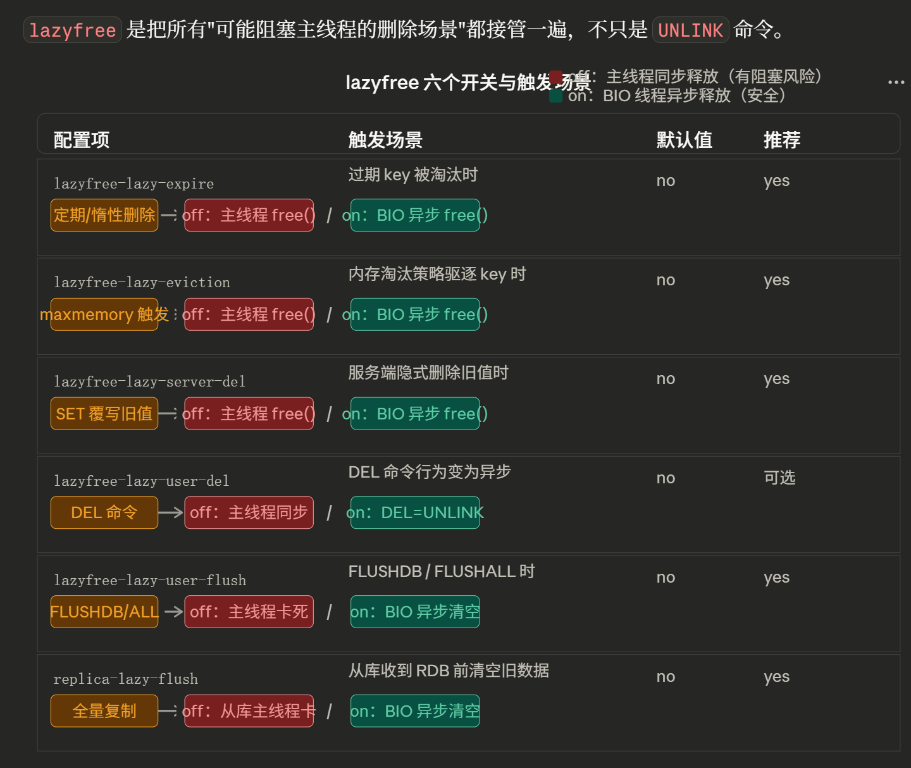


### Redis hotkey（热 Key）

#### 什么是 hotkey？

如果一个 key 的访问次数比较多且明显多于其他 key 的话，那这个 key 就可以看作是 **hotkey（热 Key）**。例如在 Redis 实例的每秒处理请求达到 5000 次，而其中某个 key 的每秒访问量就高达 2000 次，那这个 key 就可以看作是 hotkey。

hotkey 出现的原因主要是某个热点数据访问量暴增，如重大的热搜事件、参与秒杀的商品。

#### hotkey 有什么危害？

处理 hotkey 会占用大量的 CPU 和带宽，可能会影响 Redis 实例对其他请求的正常处理。此外，如果突然访问 hotkey 的请求超出了 Redis 的处理能力，Redis 就会直接宕机。这种情况下，大量请求将落到后面的数据库上，可能会导致数据库崩溃。

因此，hotkey 很可能成为系统性能的瓶颈点，需要单独对其进行优化，以确保系统的高可用性和稳定性。

#### 如何发现 hotkey？

**1、使用 Redis 自带的 `--hotkeys` 参数来查找。**

该参数能够返回所有 key 的被访问次数。使用该方案的前提条件是 Redis Server 的 `maxmemory-policy` 参数设置为 LFU 算法，不然就会出现如下所示的错误。

```bash
# redis-cli -p 6379 --hotkeys

# Scanning the entire keyspace to find hot keys as well as
# average sizes per key type.  You can use -i 0.1 to sleep 0.1 sec
# per 100 SCAN commands (not usually needed).

Error: ERR An LFU maxmemory policy is not selected, access frequency not tracked. Please note that when switching between policies at runtime LRU and LFU data will take some time to adjust.
```

- **volatile-lfu（least frequently used）**：从已设置过期时间的数据集（`server.db[i].expires`）中挑选最不经常使用的数据淘汰。
- **allkeys-lfu（least frequently used）**：当内存不足以容纳新写入数据时，在键空间中，移除最不经常使用的 key。

**2、使用 `MONITOR` 命令。**

`MONITOR` 命令是 Redis 提供的一种实时查看 Redis 的所有操作的方式，可以用于临时监控 Redis 实例的操作情况，包括读写、删除等操作。

由于该命令对 Redis 性能的影响比较大，因此禁止长时间开启 `MONITOR`（生产环境中建议谨慎使用该命令）。在发生紧急情况时，我们可以选择在合适的时机短暂执行 `MONITOR` 命令并将输出重定向至文件，在关闭 `MONITOR` 命令后通过对文件中请求进行归类分析即可找出这段时间中的 hotkey。

```bash
# redis-cli
127.0.0.1:6379> MONITOR
OK
1683638260.637378 [0 172.17.0.1:61516] "ping"
1683638267.144236 [0 172.17.0.1:61518] "smembers" "mySet"
1683638268.941863 [0 172.17.0.1:61518] "smembers" "mySet"
1683638269.551671 [0 172.17.0.1:61518] "smembers" "mySet"
1683638270.646256 [0 172.17.0.1:61516] "ping"
1683638270.849551 [0 172.17.0.1:61518] "smembers" "mySet"
1683638271.926945 [0 172.17.0.1:61518] "smembers" "mySet"
1683638274.276599 [0 172.17.0.1:61518] "smembers" "mySet2"
1683638276.327234 [0 172.17.0.1:61518] "smembers" "mySet"
```

**3、借助开源项目。**

京东零售的 [hotkey](https://gitee.com/jd-platform-opensource/hotkey) 这个项目不光支持 hotkey 的发现，还支持 hotkey 的处理。

#### 如何解决 hotkey？

hotkey 的常见处理以及优化办法如下（这些方法可以配合起来使用）：

- **读写分离**：主节点处理写请求，从节点处理读请求。
- **使用 Redis Cluster**：将热点数据分散存储在多个 Redis 节点上。
- **二级缓存**：hotkey 采用二级缓存的方式进行处理，将 hotkey 存放一份到 JVM 本地内存中（可以用 Caffeine）。

### 慢查询命令

#### 为什么会有慢查询命令？

我们知道一个 Redis 命令的执行可以简化为以下 4 步：

1. 发送命令；
2. 命令排队；
3. 命令执行；
4. 返回结果。

Redis 慢查询统计的是命令执行这一步骤的耗时，慢查询命令也就是那些命令执行时间较长的命令

edis 中的大部分命令都是 O(1) 时间复杂度，但也有少部分 O(n) 时间复杂度的命令，例如：

- `KEYS *`：会返回所有符合规则的 key。
- `HGETALL`：会返回一个 Hash 中所有的键值对。
- `LRANGE`：会返回 List 中指定范围内的元素。
- `SMEMBERS`：返回 Set 中的所有元素。
- `SINTER`/`SUNION`/`SDIFF`：计算多个 Set 的交集/并集/差集。

由于这些命令时间复杂度是 O(n)，有时候也会全表扫描，随着 n 的增大，执行耗时也会越长。不过， 这些命令并不是一定不能使用，但是需要明确 N 的值。另外，有遍历的需求可以使用 `HSCAN`、`SSCAN`、`ZSCAN` 代替。

除了这些 O(n) 时间复杂度的命令可能会导致慢查询之外，还有一些时间复杂度可能在 O(N) 以上的命令，例如：

- `ZRANGE`/`ZREVRANGE`：返回指定 Sorted Set 中指定排名范围内的所有元素。时间复杂度为 O(log(n)+m)，n 为所有元素的数量，m 为返回的元素数量，当 m 和 n 相当大时，O(n) 的时间复杂度更小。
- `ZREMRANGEBYRANK`/`ZREMRANGEBYSCORE`：移除 Sorted Set 中指定排名范围/指定 score 范围内的所有元素。时间复杂度为 O(log(n)+m)，n 为所有元素的数量，m 被删除元素的数量，当 m 和 n 相当大时，O(n) 的时间复杂度更小。

#### 如何找到慢查询命令？

Redis 提供了一个内置的**慢查询日志 (Slow Log)** 功能，专门用来记录执行时间超过指定阈值的命令。这对于排查性能瓶颈、找出导致 Redis 阻塞的“慢”操作非常有帮助，原理和 MySQL 的慢查询日志类似。

在 `redis.conf` 文件中，我们可以使用 `slowlog-log-slower-than` 参数设置耗时命令的阈值，并使用 `slowlog-max-len` 参数设置耗时命令的最大记录条数。

当 Redis 服务器检测到执行时间超过 `slowlog-log-slower-than` 阈值的命令时，就会将该命令记录在慢查询日志（slow log）中，这点和 MySQL 记录慢查询语句类似。当慢查询日志超过设定的最大记录条数之后，Redis 会把最早的执行命令依次舍弃。

由于慢查询日志会占用一定内存空间，如果设置最大记录条数过大，可能会导致内存占用过高的问题。

```properties
# The following time is expressed in microseconds, so 1000000 is equivalent
# to one second. Note that a negative number disables the slow log, while
# a value of zero forces the logging of every command.
slowlog-log-slower-than 10000

# There is no limit to this length. Just be aware that it will consume memory.
# You can reclaim memory used by the slow log with SLOWLOG RESET.
slowlog-max-len 128
```

获取慢查询日志的内容很简单，直接使用 `SLOWLOG GET` 命令即可。

```bash
127.0.0.1:6379> SLOWLOG GET #慢日志查询
 1) 1) (integer) 5
   2) (integer) 1684326682
   3) (integer) 12000
   4) 1) "KEYS"
      2) "*"
   5) "172.17.0.1:61152"
   6) ""
  // ...
```

慢查询日志中的每个条目都由以下六个值组成：

1. **唯一 ID**: 日志条目的唯一标识符。
2. **时间戳 (Timestamp)**: 命令执行完成时的 Unix 时间戳。
3. **耗时 (Duration)**: 命令执行所花费的时间，单位是**微秒**。
4. **命令及参数 (Command)**: 执行的具体命令及其参数数组。
5. **客户端信息 (Client IP:Port)**: 执行命令的客户端地址和端口。
6. **客户端名称 (Client Name)**: 如果客户端设置了名称 (CLIENT SETNAME)。

## Redis 生产问题（重要）

### 缓存穿透

缓存穿透说简单点就是大量请求的 key 是不合理的，**根本不存在于缓存中，也不存在于数据库中**。这就导致这些请求直接到了数据库上，根本没有经过缓存这一层，对数据库造成了巨大的压力，可能直接就被这么多请求弄宕机了。

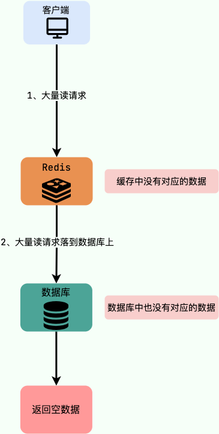

#### 有哪些解决办法？

最基本的就是首先做好参数校验，一些不合法的参数请求直接抛出异常信息返回给客户端。比如查询的数据库 id 不能小于 0、传入的邮箱格式不对的时候直接返回错误消息给客户端等等。

**1）缓存无效 key**

如果缓存和数据库都查不到某个 key 的数据，就写一个到 Redis 中去并设置过期时间，具体命令如下：`SET key value EX 10086`。这种方式可以解决请求的 key 变化不频繁的情况，如果黑客恶意攻击，每次构建不同的请求 key，会导致 Redis 中缓存大量无效的 key。很明显，这种方案并不能从根本上解决此问题。如果非要用这种方式来解决穿透问题的话，尽量将无效的 key 的过期时间设置短一点，比如 1 分钟。

**2）布隆过滤器**

布隆过滤器是一个非常神奇的数据结构，通过它我们可以非常方便地判断一个给定数据是否存在于海量数据中。我们可以把它看作由二进制向量（或者说位数组）和一系列随机映射函数（哈希函数）两部分组成的数据结构。相比于我们平时常用的 List、Map、Set 等数据结构，它占用空间更少并且效率更高，但是缺点是其返回的结果是概率性的，而不是非常准确的。理论情况下添加到集合中的元素越多，误报的可能性就越大。并且，存放在布隆过滤器的数据不容易删除。


Bloom Filter 会使用一个较大的 bit 数组来保存所有的数据，数组中的每个元素都只占用 1 bit ，并且每个元素只能是 0 或者 1（代表 false 或者 true），这也是 Bloom Filter 节省内存的核心所在。这样来算的话，申请一个 100w 个元素的位数组只占用 1000000Bit / 8 = 125000 Byte = 125000/1024 KB ≈ 122KB 的空间。


具体是这样做的：把所有可能存在的请求的值都存放在布隆过滤器中，当用户请求过来，先判断用户发来的请求的值是否存在于布隆过滤器中。不存在的话，直接返回请求参数错误信息给客户端，存在的话才会走下面的流程。

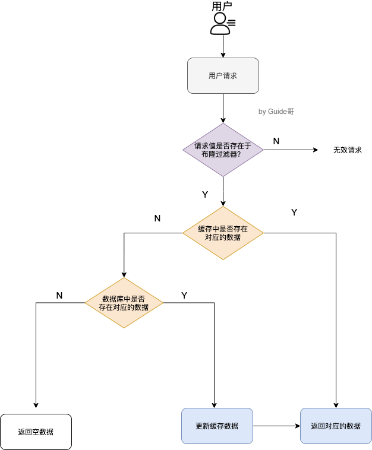

**3）接口限流**

根据用户或者 IP 对接口进行限流，对于异常频繁的访问行为，还可以采取黑名单机制，例如将异常 IP 列入黑名单。

后面提到的缓存击穿和雪崩都可以配合接口限流来解决，毕竟这些问题的关键都是有很多请求落到了数据库上造成数据库压力过大。

### 缓存击穿

#### 什么是缓存击穿？

缓存击穿中，请求的 key 对应的是 **热点数据**，该数据 **存在于数据库中，但不存在于缓存中（通常是因为缓存中的那份数据已经过期）**。这就可能会导致瞬时大量的请求直接打到了数据库上，对数据库造成了巨大的压力，可能直接就被这么多请求弄宕机了。

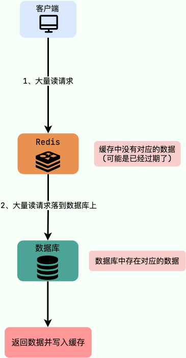

举个例子：秒杀进行过程中，缓存中的某个秒杀商品的数据突然过期，这就导致瞬时大量对该商品的请求直接落到数据库上，对数据库造成了巨大的压力。

#### 有哪些解决办法？

1. **永不过期**（不推荐）：设置热点数据永不过期或者过期时间比较长。
2. **提前预热**（推荐）：针对热点数据提前预热，将其存入缓存中并设置合理的过期时间比如秒杀场景下的数据在秒杀结束之前不过期。
3. **加锁**（看情况）：在缓存失效后，通过设置互斥锁确保只有一个请求去查询数据库并更新缓存。

#### 缓存穿透和缓存击穿有什么区别？

缓存穿透中，请求的 key 既不存在于缓存中，也不存在于数据库中。

缓存击穿中，请求的 key 对应的是 **热点数据** ，该数据 **存在于数据库中，但不存在于缓存中（通常是因为缓存中的那份数据已经过期）** 。

### 缓存雪崩

#### 什么是缓存雪崩？

实际上，缓存雪崩描述的就是这样一个简单的场景：**缓存在同一时间大面积的失效，导致大量的请求都直接落到了数据库上，对数据库造成了巨大的压力。** 这就好比雪崩一样，摧枯拉朽之势，数据库的压力可想而知，可能直接就被这么多请求弄宕机了。

另外，缓存服务宕机也会导致缓存雪崩现象，导致所有的请求都落到了数据库上。

#### 有哪些解决办法？

**针对 Redis 服务不可用的情况**：

1. **Redis 集群**：采用 Redis 集群，避免单机出现问题整个缓存服务都没办法使用。Redis Cluster 和 Redis Sentinel 是两种最常用的 Redis 集群实现方案
2. **多级缓存**：设置多级缓存，例如本地缓存+Redis 缓存的二级缓存组合，当 Redis 缓存出现问题时，还可以从本地缓存中获取到部分数据。

**针对大量缓存同时失效的情况**：

1. **设置随机失效时间**（可选）：为缓存设置随机的失效时间，例如在固定过期时间的基础上加上一个随机值，这样可以避免大量缓存同时到期，从而减少缓存雪崩的风险。
2. **提前预热**（推荐）：针对热点数据提前预热，将其存入缓存中并设置合理的过期时间，比如秒杀场景下的数据在秒杀结束之前不过期。
3. **持久缓存策略**（看情况）：虽然一般不推荐设置缓存永不过期，但对于某些关键性和变化不频繁的数据，可以考虑这种策略。

#### 缓存预热如何实现？

常见的缓存预热方式有两种：

1. 使用定时任务，比如 xxl-job，来定时触发缓存预热的逻辑，将数据库中的热点数据查询出来并存入缓存中。
2. 使用消息队列，比如 Kafka，来异步地进行缓存预热，将数据库中的热点数据的主键或者 ID 发送到消息队列中，然后由缓存服务消费消息队列中的数据，根据主键或者 ID 查询数据库并更新缓存。

#### 缓存雪崩和缓存击穿有什么区别？

缓存雪崩和缓存击穿比较像，但缓存雪崩导致的原因是缓存中的大量或者所有数据失效，缓存击穿导致的原因主要是某个热点数据不存在于缓存中（通常是因为缓存中的那份数据已经过期）。

### 如何保证缓存和数据库数据的一致性？

下面单独对 **Cache Aside Pattern（旁路缓存模式）** 来聊聊。这是非常常用的一种缓存读写策略，它的读写逻辑是这样的：

- 读操作： 
  1. 先尝试从缓存读取数据。
  2. 如果缓存命中，直接返回数据。
  3. 如果缓存未命中，从数据库查询数据，将查到的数据放入缓存并返回数据。
- 写操作： 
  1. 先更新数据库。
  2. 再直接删除缓存中对应的数据。

如果更新数据库成功，而删除缓存这一步失败的情况的话，简单说有两个解决方案：

1. **缓存失效时间（TTL - Time To Live）变短**（不推荐，治标不治本）：我们让缓存数据的过期时间变短，这样的话缓存就会从数据库中加载数据。另外，这种解决办法对于先操作缓存后操作数据库的场景不适用。
2. **增加缓存更新重试机制**（常用）：如果缓存服务当前不可用导致缓存删除失败的话，我们就隔一段时间进行重试，重试次数可以自己定。不过，这里更适合引入消息队列实现异步重试，将删除缓存重试的消息投递到消息队列，然后由专门的消费者来重试，直到成功。虽然说多引入了一个消息队列，但其整体带来的收益还是要更高一些。

**1. 为什么写操作是“先更新 DB，后删除 Cache”？顺序能反过来吗？**

**答：** 绝对不能。如果“先删 Cache，后更新 DB”，在高并发下会引入经典的数据不一致问题。

- 时序分析 (请求 A 写, 请求 B 读):
  1. 请求 A: 先将 Cache 中的数据删除。
  2. 请求 B: 此时发现 Cache 为空，于是去 DB 读取**旧值**，并准备写入 Cache。
  3. 请求 A : 将**新值**写入 DB。
  4. 请求 B: 将之前读到的**旧值**写入了 Cache。
- **结果：** DB 中是新值，而 Cache 中是旧值，数据不一致。

**2. 那“先更新 DB，后删除 Cache”就绝对安全吗？**

**答案：** 也不是绝对安全的！因为这样也可能会造成 **数据库和缓存数据不一致**的问题。

- 时序分析 (请求 A 读, 请求 B 写):
  1. 请求 A : 缓存未命中，从 DB 读取到**旧值**。
  2. 请求 B: 迅速完成了 DB 的更新，并将 Cache 删除。
  3. 请求 A : 将自己之前拿到的**旧值**写入了 Cache。
- **结果：** DB 中是新值，Cache 中又是旧值。
- **为什么概率极小？** 这个问题本质上是一个并发时序问题：只要“读 DB → 写 Cache”这段时间窗口内，恰好有写请求完成了 DB 更新，就有可能产生不一致。在大多数业务里，这个窗口时间相对较短，而且还需要与写请求并发“撞车”，所以发生概率不算高，但绝不是不可能。

**3. 为什么是“删除 Cache”，而不是“更新 Cache”？**

- **性能开销：** 写操作往往只更新了对象的部分字段，如果为了“更新 Cache”而去重新查询或计算整个缓存对象，开销可能很大。相比之下，“删除”是一个轻量级操作。
- **懒加载思想：** “删除”操作遵循懒加载原则。只有当数据下一次被真正需要（被读取）时，才触发从 DB 加载并写入缓存，避免了无效的缓存更新。
- **并发安全：** “更新缓存”在高并发下可能出现更新顺序错乱的问题导致脏数据的概率会更大。





### 哪些情况可能会导致 Redis 阻塞？

常见的导致 Redis 阻塞原因有：

- `O(n)` 复杂度命令执行（如 `KEYS *`、`HGETALL`、`LRANGE`、`SMEMBERS` 等），随着数据量增大导致执行时间过长。
- 执行 `SAVE` 命令生成 RDB 快照时同步阻塞主线程，而 `BGSAVE` 通过 `fork` 子进程避免阻塞。
- AOF 记录日志在主线程中进行，可能因命令执行后写日志而阻塞后续命令。
- AOF 刷盘（fsync）时后台线程同步到磁盘，磁盘压力大导致 `fsync` 阻塞，进而阻塞主线程 `write` 操作，尤其在 `appendfsync always` 或 `everysec` 配置下明显。
- AOF 重写过程中将重写缓冲区内容追加到新 AOF 文件时产生阻塞。
- 操作大 key（string > 1MB 或复合类型元素 > 5000）导致客户端超时、网络阻塞和工作线程阻塞。
- 使用 `flushdb` 或 `flushall` 清空数据库时涉及大量键值对删除和内存释放，造成主线程阻塞。
- 集群扩容缩容时数据迁移为同步操作，大 key 迁移导致两端节点长时间阻塞，可能触发故障转移
- 内存不足触发 Swap，操作系统将 Redis 内存换出到硬盘，读写性能急剧下降。
- 其他进程过度占用 CPU 导致 Redis 吞吐量下降。
- 网络问题如连接拒绝、延迟高、网卡软中断等导致 Redis 阻塞。

## Redis 使用规范

实际使用 Redis 的过程中，我们尽量要准守一些常见的规范，比如：

1. 使用连接池：避免频繁创建关闭客户端连接。
2. 尽量不使用 O(n) 指令，使用 O(n) 命令时要关注 n 的数量：像 `KEYS *`、`HGETALL`、`LRANGE`、`SMEMBERS`、`SINTER`/`SUNION`/`SDIFF` 等 O(n) 命令并非不能使用，但是需要明确 n 的值。另外，有遍历的需求可以使用 `HSCAN`、`SSCAN`、`ZSCAN` 代替。
3. 使用批量操作减少网络传输：原生批量操作命令（比如 `MGET`、`MSET` 等等）、pipeline、Lua 脚本。
4. 尽量不使用 Redis 事务：Redis 事务实现的功能比较鸡肋，可以使用 Lua 脚本代替。
5. 禁止长时间开启 monitor：对性能影响比较大。
6. 控制 key 的生命周期：避免 Redis 中存放了太多不经常被访问的数据。

## 如何基于Redis实现延时任务？

基于 Redis 实现延时任务的功能无非就下面两种方案：

1. Redis 过期事件监听
2. Redisson 内置的延时队列

### Redis 过期事件监听实现延时任务功能的原理？

Redis 2.0 引入了发布订阅 (pub/sub) 功能。在 pub/sub 中，引入了一个叫做 **channel（频道）** 的概念，有点类似于消息队列中的 **topic（主题）**。

pub/sub 涉及发布者（publisher）和订阅者（subscriber，也叫消费者）两个角色：

- 发布者通过 `PUBLISH` 投递消息给指定 channel。
- 订阅者通过`SUBSCRIBE`订阅它关心的 channel。并且，订阅者可以订阅一个或者多个 channel。

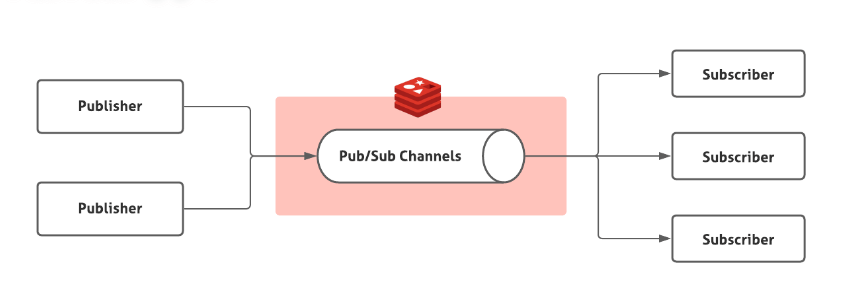

在 pub/sub 模式下，生产者需要指定消息发送到哪个 channel 中，而消费者则订阅对应的 channel 以获取消息。

Redis 中有很多默认的 channel，这些 channel 是由 Redis 本身向它们发送消息的，而不是我们自己编写的代码。其中，`__keyevent@0__:expired` 就是一个默认的 channel，负责监听 key 的过期事件。也就是说，当一个 key 过期之后，Redis 会发布一个 key 过期的事件到`__keyevent@<db>__:expired`这个 channel 中。

我们只需要监听这个 channel，就可以拿到过期的 key 的消息，进而实现了延时任务功能。

这个功能被 Redis 官方称为 **keyspace notifications** ，作用是实时监控 Redis 键和值的变化。

### Redis 过期事件监听实现延时任务功能有什么缺陷？

**1、时效性差**

过期事件消息是在 Redis 服务器删除 key 时发布的，而不是一个 key 过期之后就会就会直接发布。因此，就会存在我设置了 key 的过期时间，但到了指定时间 key 还未被删除，进而没有发布过期事件的情况。

**2、丢消息**

Redis 的 pub/sub 模式中的消息并不支持持久化，这与消息队列不同。在 Redis 的 pub/sub 模式中，发布者将消息发送给指定的频道，订阅者监听相应的频道以接收消息。当没有订阅者时，消息会被直接丢弃，在 Redis 中不会存储该消息。

**3、多服务实例下消息重复消费**

Redis 的 pub/sub 模式目前只有广播模式，这意味着当生产者向特定频道发布一条消息时，所有订阅相关频道的消费者都能够收到该消息。

### Redisson 延迟队列原理是什么？有什么优势？

Redisson 是一个开源的 Java 语言 Redis 客户端，提供了很多开箱即用的功能，比如多种分布式锁的实现、延时队列。

我们可以借助 Redisson 内置的延时队列 RDelayedQueue 来实现延时任务功能。

Redisson 的延迟队列 RDelayedQueue 是基于 Redis 的 SortedSet 来实现的。SortedSet 是一个有序集合，其中的每个元素都可以设置一个分数，代表该元素的权重。Redisson 利用这一特性，将需要延迟执行的任务插入到 SortedSet 中，并给它们设置相应的过期时间作为分数。

Redisson 定期使用 `zrangebyscore` 命令扫描 SortedSet 中过期的元素，然后将这些过期元素从 SortedSet 中移除，并将它们加入到就绪消息列表中。就绪消息列表是一个阻塞队列，有消息进入就会被消费者监听到。这样做可以避免消费者对整个 SortedSet 进行轮询，提高了执行效率。

相比于 Redis 过期事件监听实现延时任务功能，这种方式具备下面这些优势：

1. **减少了丢消息的可能**：DelayedQueue 中的消息会被持久化，即使 Redis 宕机了，根据持久化机制，也只可能丢失一点消息，影响不大。当然了，你也可以使用扫描数据库的方法作为补偿机制。
2. **消息不存在重复消费问题**：每个客户端都是从同一个目标队列中获取任务的，不存在重复消费的问题。

跟 Redisson 内置的延时队列相比，消息队列可以通过保障消息消费的可靠性、控制消息生产者和消费者的数量等手段来实现更高的吞吐量和更强的可靠性，实际项目中首选使用消息队列的延时消息这种方案。

## 如何基于Redis实现消息队列？

先说结论：**可以是可以，但要看具体场景。和专业的消息队列（如 Kafka、RabbitMQ）相比，还是有一些欠缺的地方。**

正式开始介绍之前，我们先来看看：**一个生产级 MQ 需要具备哪些核心能力？**

| 能力维度         | 定义                            | 关键指标/特征                       |
| :--------------- | :------------------------------ | :---------------------------------- |
| **持久化**       | 消息写入后不因进程/节点故障丢失 | 同步刷盘/多副本确认、RPO ≈ 0        |
| **至少一次投递** | 消息最终被消费，允许重复        | 需配合消费者幂等性                  |
| **消费确认**     | 消费者显式告知处理成功          | ACK 机制、超时重试、死信队列        |
| **消息重试**     | 消费失败可自动重新投递          | 退避策略、最大重试次数、死信转移    |
| **消费者组**     | 多消费者协作消费，故障自动转移  | 组内负载均衡、分区分配、Rebalance   |
| **消息堆积能力** | 生产速率 > 消费速率时的缓冲能力 | 磁盘存储、TTL、堆积告警             |
| **顺序保证**     | 消息按发送顺序被消费            | 分区有序/全局有序、乱序惩罚         |
| **可扩展性**     | 水平扩展以提升吞吐或容灾        | 分片机制、无状态 Broker、动态扩缩容 |

Redis 提供了多种实现 MQ 的方式，从早期的 `List` 到 `Pub/Sub`，再到 Redis 5.0 新增的 `Stream` 数据结构（基于有序链表实现，支持消费者组和 ACK 机制，可用于构建轻量级消息队列）。


## Redis 5 种基本数据类型

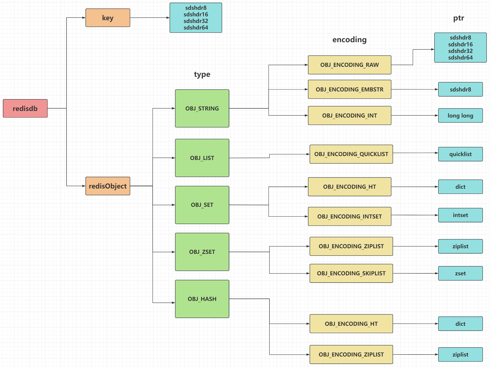

Redis 共有 5 种基本数据类型：String（字符串）、List（列表）、Set（集合）、Hash（散列）、Zset（有序集合）。

简单动态字符串（SDS）、LinkedList（双向链表）、Dict（哈希表/字典）、SkipList（跳跃表）、Intset（整数集合）、ZipList（压缩列表）、QuickList（快速列表）。

Redis 5 种基本数据类型对应的底层数据结构实现如下表所示：

| String | List                         | Hash          | Set          | Zset              |
| :----- | :--------------------------- | :------------ | :----------- | :---------------- |
| SDS    | LinkedList/ZipList/QuickList | Dict、ZipList | Dict、Intset | ZipList、SkipList |

### String

String 是 Redis 中最简单同时也是最常用的一个数据类型。

String 是一种二进制安全的数据类型，可以用来存储任何类型的数据比如字符串、整数、浮点数、图片（图片的 base64 编码或者解码或者图片的路径）、序列化后的对象。

- 在字符数组的基础上，增加了字符数组长度和分配空间大小等元数据。使得获取长度的时间复杂度为O(1)
- SDS 不通过字符串中的“\0”字符判断字符串结束，而是直接将其作为二进制数据处理，可以用来保存图片等二进制数据。
- SDS 中是通过设计不同 SDS 类型来表示不同大小的字符串，来节省sdshdr头部数据的内存。
- **attribute** ((**packed**))不会使sdshdr结构体按照8字节倍数对齐，节省内存。
- SDS 把目标字符串的**空间检查和扩容封装在了 sdsMakeRoomFor 函数中**，并且在涉及字符串空间变化的操作中，如追加、复制等，会直接调用该函数。

| 命令                            | 介绍                             |
| ------------------------------- | -------------------------------- |
| SET key value                   | 设置指定 key 的值                |
| SETNX key value                 | 只有在 key 不存在时设置 key 的值 |
| GET key                         | 获取指定 key 的值                |
| MSET key1 value1 key2 value2 …… | 设置一个或多个指定 key 的值      |
| MGET key1 key2 ...              | 获取一个或多个指定 key 的值      |
| STRLEN key                      | 返回 key 所储存的字符串值的长度  |
| INCR key                        | 将 key 中储存的数字值增一        |
| DECR key                        | 将 key 中储存的数字值减一        |
| EXISTS key                      | 判断指定 key 是否存在            |
| DEL key（通用）                 | 删除指定的 key                   |
| EXPIRE key seconds（通用）      | 给指定 key 设置过期时间          |

**编码格式**

- int：整数值，这个整数值可以使用long类型来表示

  如果是浮点数，那就用embstr或者raw编码。具体用哪个就看这个数的长度了

- embstr：字符串值，这个字符串值的长度小于44字节

- raw：字符串值，这个字符串值的长度大于44字节

### List

Redis 的 List 的实现为一个 **双向链表**，即可以支持反向查找和遍历

**常用命令**

| 命令                        | 介绍                                       |
| --------------------------- | ------------------------------------------ |
| RPUSH key value1 value2 ... | 在指定列表的尾部（右边）添加一个或多个元素 |
| LPUSH key value1 value2 ... | 在指定列表的头部（左边）添加一个或多个元素 |
| LSET key index value        | 将指定列表索引 index 位置的值设置为 value  |
| LPOP key                    | 移除并获取指定列表的第一个元素(最左边)     |
| RPOP key                    | 移除并获取指定列表的最后一个元素(最右边)   |
| LLEN key                    | 获取列表元素数量                           |
| LRANGE key start end        | 获取列表 start 和 end 之间 的元素          |

**编码**

quicklist

- quicklist = 双向链表 + 每个节点是一个 listpack（压缩数组）

### Hash

Redis 中的 Hash 是一个 String 类型的 field-value（键值对） 的映射表，Hash 类似于 JDK1.8 前的 `HashMap`，内部实现也差不多(数组 + 链表)。不过，Redis 的 Hash 做了更多优化。

**常用命令**

| 命令                                      | 介绍                                                     |
| ----------------------------------------- | -------------------------------------------------------- |
| HSET key field value                      | 设置指定哈希表中指定字段的值                             |
| HSETNX key field value                    | 只有指定字段不存在时设置指定字段的值                     |
| HMSET key field1 value1 field2 value2 ... | 同时将一个或多个 field-value (域-值)对设置到指定哈希表中 |
| HGET key field                            | 获取指定哈希表中指定字段的值                             |
| HMGET key field1 field2 ...               | 获取指定哈希表中一个或者多个指定字段的值                 |
| HGETALL key                               | 获取指定哈希表中所有的键值对                             |
| HEXISTS key field                         | 查看指定哈希表中指定的字段是否存在                       |
| HDEL key field1 field2 ...                | 删除一个或多个哈希表字段                                 |
| HLEN key                                  | 获取指定哈希表中字段的数量                               |
| HINCRBY key field increment               | 对指定哈希中的指定字段做运算操作（正数为加，负数为减）   |

### Set

Redis 中的 Set 类型是一种无序集合，集合中的元素没有先后顺序但都唯一，有点类似于 Java 中的 `HashSet` 。当你需要存储一个列表数据，又不希望出现重复数据时，Set 是一个很好的选择，并且 Set 提供了判断某个元素是否在一个 Set 集合内的重要接口，这个也是 List 所不能提供的。你可以基于 Set 轻易实现交集、并集、差集的操作

**常用命令**

| 命令                                  | 介绍                                      |
| ------------------------------------- | ----------------------------------------- |
| SADD key member1 member2 ...          | 向指定集合添加一个或多个元素              |
| SMEMBERS key                          | 获取指定集合中的所有元素                  |
| SCARD key                             | 获取指定集合的元素数量                    |
| SISMEMBER key member                  | 判断指定元素是否在指定集合中              |
| SINTER key1 key2 ...                  | 获取给定所有集合的交集                    |
| SINTERSTORE destination key1 key2 ... | 将给定所有集合的交集存储在 destination 中 |
| SUNION key1 key2 ...                  | 获取给定所有集合的并集                    |
| SUNIONSTORE destination key1 key2 ... | 将给定所有集合的并集存储在 destination 中 |
| SDIFF key1 key2 ...                   | 获取给定所有集合的差集                    |
| SDIFFSTORE destination key1 key2 ...  | 将给定所有集合的差集存储在 destination 中 |
| SPOP key count                        | 随机移除并获取指定集合中一个或多个元素    |
| SRANDMEMBER key count                 | 随机获取指定集合中指定数量的元素          |

**编码**

- intset
  - 所有元素都是**整数**
  - 元素数量较少
- dict
  - 出现**非整数元素**
  - 元素数量 > 512

### Sorted Set

Sorted Set 类似于 Set，但和 Set 相比，Sorted Set 增加了一个权重参数 `score`，使得集合中的元素能够按 `score` 进行有序排列，还可以通过 `score` 的范围来获取元素的列表。

**常用命令**

| 命令                                          | 介绍                                                         |
| --------------------------------------------- | ------------------------------------------------------------ |
| ZADD key score1 member1 score2 member2 ...    | 向指定有序集合添加一个或多个元素                             |
| ZCARD KEY                                     | 获取指定有序集合的元素数量                                   |
| ZSCORE key member                             | 获取指定有序集合中指定元素的 score 值                        |
| ZINTERSTORE destination numkeys key1 key2 ... | 将给定所有有序集合的交集存储在 destination 中，对相同元素对应的 score 值进行 SUM 聚合操作，numkeys 为集合数量 |
| ZUNIONSTORE destination numkeys key1 key2 ... | 求并集，其它和 ZINTERSTORE 类似                              |
| ZDIFFSTORE destination numkeys key1 key2 ...  | 求差集，其它和 ZINTERSTORE 类似                              |
| ZRANGE key start end                          | 获取指定有序集合 start 和 end 之间的元素（score 从低到高）   |
| ZREVRANGE key start end                       | 获取指定有序集合 start 和 end 之间的元素（score 从高到底）   |
| ZREVRANK key member                           | 获取指定有序集合中指定元素的排名(score 从大到小排序)         |

**编码**

- ziplist
- zskiplist

## Redis 3 种特殊数据类型

除了 5 种基本的数据类型之外，Redis 还支持 3 种特殊的数据类型：Bitmap、HyperLogLog、GEO。

### Bitmap

Bitmap 存储的是连续的二进制数字（0 和 1），通过 Bitmap, 只需要一个 bit 位来表示某个元素对应的值或者状态，key 就是对应元素本身 。我们知道 8 个 bit 可以组成一个 byte，所以 Bitmap 本身会极大的节省储存空间。

你可以将 Bitmap 看作是一个存储二进制数字（0 和 1）的数组，数组中每个元素的下标叫做 offset（偏移量）。

**常用命令**

| 命令                                  | 介绍                                                         |
| ------------------------------------- | ------------------------------------------------------------ |
| SETBIT key offset value               | 设置指定 offset 位置的值                                     |
| GETBIT key offset                     | 获取指定 offset 位置的值                                     |
| BITCOUNT key start end                | 获取 start 和 end 之间值为 1 的元素个数                      |
| BITOP operation destkey key1 key2 ... | 对一个或多个 Bitmap 进行运算，可用运算符有 AND, OR, XOR 以及 NOT |

### HyperLogLog

HyperLogLog 是一种有名的基数计数概率算法 ，基于 LogLog Counting(LLC)优化改进得来，并不是 Redis 特有的，Redis 只是实现了这个算法并提供了一些开箱即用的 API。Redis 提供的 HyperLogLog 占用空间非常非常小，只需要 12k 的空间就能存储接近`2^64`个不同元素。并且，Redis 对 HyperLogLog 的存储结构做了优化，采用两种方式计数：

- **稀疏矩阵**：计数较少的时候，占用空间很小。
- **稠密矩阵**：计数达到某个阈值的时候，占用 12k 的空间。

基数计数概率算法为了节省内存并不会直接存储元数据，而是通过一定的概率统计方法预估基数值（集合中包含元素的个数）。因此， HyperLogLog 的计数结果并不是一个精确值，存在一定的误差（标准误差为 `0.81%` ）。

**常用命令**

HyperLogLog 相关的命令非常少，最常用的也就 3 个。

| 命令                                      | 介绍                                                         |
| ----------------------------------------- | ------------------------------------------------------------ |
| PFADD key element1 element2 ...           | 添加一个或多个元素到 HyperLogLog 中                          |
| PFCOUNT key1 key2                         | 获取一个或者多个 HyperLogLog 的唯一计数。                    |
| PFMERGE destkey sourcekey1 sourcekey2 ... | 将多个 HyperLogLog 合并到 destkey 中，destkey 会结合多个源，算出对应的唯一计数。 |

### Geospatial 

Geospatial index（地理空间索引，简称 GEO） 主要用于存储地理位置信息，基于 Sorted Set 实现。通过 GEO 我们可以轻松实现两个位置距离的计算、获取指定位置附近的元素等功能。

**常用命令**

| 命令                                             | 介绍                                                         |
| ------------------------------------------------ | ------------------------------------------------------------ |
| GEOADD key longitude1 latitude1 member1 ...      | 添加一个或多个元素对应的经纬度信息到 GEO 中                  |
| GEOPOS key member1 member2 ...                   | 返回给定元素的经纬度信息                                     |
| GEODIST key member1 member2 M/KM/FT/MI           | 返回两个给定元素之间的距离                                   |
| GEORADIUS key longitude latitude radius distance | 获取指定位置附近 distance 范围内的其他元素，支持 ASC(由近到远)、DESC（由远到近）、Count(数量) 等参数 |
| GEORADIUSBYMEMBER key member radius distance     | 类似于 GEORADIUS 命令，只是参照的中心点是 GEO 中的元素       |

## Redis为什么用跳表实现有序集合

### 平衡树 vs 跳表

先来说说它和平衡树的比较，平衡树我们又会称之为 **AVL 树**，是一个严格的平衡二叉树，平衡条件必须满足（所有节点的左右子树高度差不超过 1，即平衡因子为范围为 `[-1,1]`）。平衡树的插入、删除和查询的时间复杂度和跳表一样都是 **O(log n)** 。

对于范围查询来说，它也可以通过中序遍历的方式达到和跳表一样的效果。但是它的每一次插入或者删除操作都需要保证整颗树左右节点的绝对平衡，只要不平衡就要通过旋转操作来保持平衡，这个过程是比较耗时的。

> 跳表是一种可以用来代替平衡树的数据结构。跳表使用概率平衡而不是严格强制的平衡，因此，跳表中的插入和删除算法比平衡树的等效算法简单得多，速度也快得多。

### 红黑树 vs 跳表

红黑树（Red Black Tree）也是一种自平衡二叉查找树，它的查询性能略微逊色于 AVL 树，但插入和删除效率更高。红黑树的插入、删除和查询的时间复杂度和跳表一样都是 **O(log n)** 。

红黑树是一个**黑平衡树**，即从任意节点到另外一个叶子叶子节点，它所经过的黑节点是一样的。当对它进行插入操作时，需要通过旋转和染色（红黑变换）来保证黑平衡。不过，相较于 AVL 树为了维持平衡的开销要小一些。

相比较于红黑树来说，跳表的实现也更简单一些。并且，按照区间来查找数据这个操作，红黑树的效率没有跳表高。

### B+树 vs 跳表

B+树是一种常用的数据结构，具有以下特点：

1. **多叉树结构**：它是一棵多叉树，每个节点可以包含多个子节点，减小了树的高度，查询效率高。
2. **存储效率高**: 其中非叶子节点存储多个 key，叶子节点存储 value，使得每个节点更够存储更多的键，根据索引进行范围查询时查询效率更高。
3. **平衡性**：它是绝对的平衡，即树的各个分支高度相差不大，确保查询和插入时间复杂度为 **O(log n)** 。
4. **顺序访问**：叶子节点间通过链表指针相连，范围查询表现出色。
5. **数据均匀分布**：B+树插入时可能会导致数据重新分布，使得数据在整棵树分布更加均匀，保证范围查询和删除效率。



- B+树的高扇出（一个节点存几十到几百个 key）是为了让一次磁盘 IO 读取尽量多的数据，因为磁盘寻道要几毫秒，能少寻道一次就赚了。内存访问延迟约 100 纳秒，磁盘寻道约 10 毫秒，差了 **10 万倍**。在内存里"减少访问层数"根本没有意义——跳表走 32 层还是 B+树走 3 层，对内存来说都是纳秒级，感知不到差别。
- 节点分裂和合并是 B+树维护代价最高的操作。插入一个 key 导致节点满了就要分裂，兄弟节点借 key 或合并，还要更新父节点，递归向上……这套逻辑在磁盘数据库里是值得的，因为换来的是极大减少 IO 次数。但在内存里，这套复杂度没有任何收益，纯粹是负担。
- 另外 B+树的页填充率通常只有 60~70%，剩余空间是预留给未来插入的——这在磁盘上是标准做法，但纯内存场景下这部分空间就是浪费。

## Redis持久化

Redis 支持持久化，而且支持 3 种持久化方式:

- 快照（snapshotting，RDB）
- 只追加文件（append-only file, AOF）
- RDB 和 AOF 的混合持久化(Redis 4.0 新增)

| 版本           | 持久化默认方式 | 重要特性                |
| -------------- | -------------- | ----------------------- |
| **Redis 4.0**  | RDB            | 引入 RDB+AOF 混合持久化 |
| **Redis 6.0**  | RDB            | AOF 仍需手动开启        |
| **Redis 7.0**  | RDB            | 引入 Multi-Part AOF     |
| **Redis 7.2+** | RDB            | 进一步优化持久化性能    |

- **AOF rewrite 内存占用**：Redis 7.0 之前重写期间增量数据需在内存中保留，7.0+ 使用 Multi-Part AOF 解决
- **混合持久化**：Redis 4.0-6.x 需手动开启，Redis 7.0+ 默认启用。

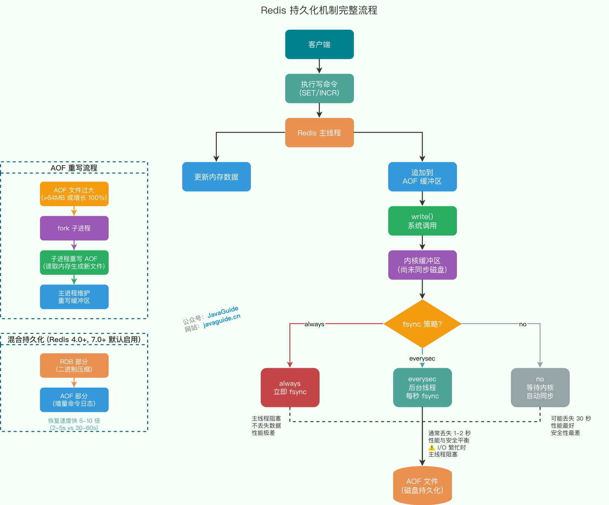

### RDB 持久化

#### 什么是 RDB 持久化？

Redis 可以通过创建快照来获得存储在内存里面的数据在 **某个时间点** 上的副本。Redis 创建快照之后，可以对快照进行备份，可以将快照复制到其他服务器从而创建具有相同数据的服务器副本（Redis 主从结构，主要用来提高 Redis 性能），还可以将快照留在原地以便重启服务器的时候使用。

快照持久化是 Redis 默认采用的持久化方式，在 `redis.conf` 配置文件中默认有此下配置：

```clojure
# Redis 7.0 默认配置（单行格式）
save 3600 1 300 100 60 10000

# 各条件含义：
# - 3600 秒（1 小时）内至少有 1 个 key 变化
# - 300 秒（5 分钟）内至少有 100 个 key 变化
# - 60 秒（1 分钟）内至少有 10000 个 key 变化

# 等价于旧版多行格式：
# save 3600 1
# save 300 100
# save 60 10000
```

#### RDB 创建快照时会阻塞主线程吗？

Redis 提供了两个命令来生成 RDB 快照文件：

- `save` : 同步保存操作，会阻塞 Redis 主线程；
- `bgsave` : fork 出一个子进程，子进程执行。

#### fork 性能开销分析






1. **fork 阻塞**：`fork()` 本身需要复制页表，内存越大耗时越长。10GB 内存大约阻塞 100ms~1s，这段时间主线程完全卡住，所有请求等待。可以通过 `info stats` 的 `latest_fork_usec` 字段监控。

   > `fork()` 后父子进程共享同一份物理内存，OS 把所有页表项标记为只读。这一步几乎是瞬间完成的——复制的是页表（几MB），不是实际数据（几GB）。子进程拿到的就是 fork 那一刻的内存镜像，主进程继续跑，互不干扰。

| 数据集大小 | fork 延迟 | 额外内存占用     | 风险等级 |
| ---------- | --------- | ---------------- | -------- |
| < 1GB      | < 10ms    | ~10MB (页表复制) | 低       |
| 1-10GB     | 10-100ms  | 10-100MB         | 中       |
| 10-50GB    | 100ms-1s  | 100-500MB        | 高       |
| > 50GB     | > 1s      | > 500MB          | 极高     |

2. **内存翻倍风险**：bgsave 期间如果写操作密集，大量页被 COW 复制，内存使用量可能接近翻倍。如果此时物理内存不足，OS 会 OOM Kill 子进程，导致 RDB 保存失败。生产环境要预留至少 1.5 倍的内存空间，并关闭透明大页（THP）——THP 把小页合并成 2MB 大页，COW 时一次复制 2MB 而不是 4KB，代价急剧上升。

   > **COW 何时触发**
   >
   > 主进程执行写命令，要修改某个内存页时，CPU 检测到页表是只读，触发缺页异常，OS 介入：把这个页复制一份给主进程，子进程的页表条目不变，仍然指向旧页。于是子进程始终在一个"冻结"的快照上工作，主进程在新副本上改数据。
   >
   > **THP（透明大页）导致的内存雪崩问题**
   >
   > Linux 发行版默认开启 **THP（Transparent Huge Pages，透明大页）**，大小为 2MB。THP 会增加大页被 COW 的概率，**最坏情况下**，如果内存被合并为 2MB 大页，即使客户端仅修改 10 字节的数据，内核也会复制完整的 2MB 内存页，导致 COW 的内存开销**放大 512 倍**（2MB / 4KB = 512）。

### AOF 持久化

#### 什么是 AOF 持久化？

与快照持久化相比，AOF 持久化的实时性更好。默认情况下 Redis 没有开启 AOF（append only file）方式的持久化，可以通过 `appendonly` 参数开启：

> **版本说明**：Redis 默认使用 RDB 持久化方式。若需使用 AOF，需要手动设置 `appendonly yes`。Redis 7.0 引入了 Multi-Part AOF 机制优化 AOF 性能，但并未改变默认持久化方式。

开启 AOF 持久化后每执行一条会更改 Redis 中的数据的命令，Redis 就会将该命令写入到 AOF 缓冲区 `server.aof_buf` 中，然后再写入到 AOF 文件中（此时还在系统内核缓存区未同步到磁盘），最后再根据持久化方式（ `fsync`策略）的配置来决定何时将系统内核缓存区的数据同步到硬盘中的。

只有同步到磁盘中才算持久化保存了，否则依然存在数据丢失的风险，比如说：系统内核缓存区的数据还未同步，磁盘机器就宕机了，那这部分数据就算丢失了。

AOF 文件的保存位置和 RDB 文件的位置相同，都是通过 `dir` 参数设置的，默认的文件名是 `appendonly.aof`。

#### AOF 工作基本流程是怎样的？

1. **命令追加（append）**：所有的写命令会追加到 AOF 缓冲区中。
2. **文件写入（write）**：将 AOF 缓冲区的数据写入到 AOF 文件中。这一步需要调用`write`函数（系统调用），`write`将数据写入到了系统内核缓冲区之后直接返回了（延迟写）。注意！！！此时并没有同步到磁盘。
3. **文件同步（fsync）**：这一步才是持久化的核心！根据你在 `redis.conf` 文件里 `appendfsync` 配置的策略，Redis 会在不同的时机，调用 `fsync` 函数（系统调用）。`fsync` 针对单个文件操作，对其进行强制硬盘同步(文件在内核缓冲区里的数据写到硬盘)，`fsync` 将阻塞直到写入磁盘完成后返回，保证了数据持久化。
4. **文件重写（rewrite）**：随着 AOF 文件越来越大，需要定期对 AOF 文件进行重写，达到压缩的目的。
5. **重启加载（load）**：当 Redis 重启时，可以加载 AOF 文件进行数据恢复。

> `write`：写入系统内核缓冲区之后直接返回（仅仅是写到缓冲区），不会立即同步到硬盘。虽然提高了效率，但也带来了数据丢失的风险。**同步硬盘操作取决于 Linux 内核的脏页回写策略（Dirty Page Writeback）**，主要受以下参数影响： 
>
> - `/proc/sys/vm/dirty_expire_centisecs`：脏页过期时间（默认 30 秒）
> - `/proc/sys/vm/dirty_writeback_centisecs`：内核回写线程的唤醒间隔（默认 5 秒）
> - 系统内存压力：内存不足时会更积极触发同步
>
> **这意味着 `appendfsync no` 模式下宕机时，可能丢失的数据量是不可控且不可预测的**，取决于上次内核同步的时间点。
>
> `fsync`：`fsync`用于强制刷新系统内核缓冲区（同步到磁盘），确保写磁盘操作结束才会返回。

#### AOF 持久化方式有哪些？

- `appendfsync always`：主线程调用 `write` 执行写操作后，会立刻调用 `fsync` 函数同步 AOF 文件（刷盘）。主线程会阻塞，直到 `fsync` 将数据完全刷到磁盘后才会返回。这种方式数据最安全，理论上不会有任何数据丢失。但因为每个写操作都会同步阻塞主线程，所以性能极差。
- `appendfsync everysec`：主线程调用 `write` 执行写操作后立即返回，由后台线程（ `aof_fsync` 线程）每秒钟调用 `fsync` 函数（系统调用）同步一次 AOF 文件（`write`+`fsync`，`fsync`间隔为 1 秒）。这种方式主线程的性能基本不受影响。在性能和数据安全之间做出了绝佳的平衡。不过，在 Redis 异常宕机时，通常可能丢失最近 1 秒内的数据。
- `appendfsync no`：主线程调用 `write` 执行写操作后立即返回，让操作系统决定何时进行同步，Linux 下一般为 30 秒一次（`write`但不`fsync`，`fsync` 的时机由操作系统决定）。 这种方式性能最好，因为避免了 `fsync` 的阻塞。但数据安全性最差，宕机时丢失的数据量不可控，取决于操作系统上一次同步的时间点。


#### AOF 为什么是在执行完命令之后记录日志？

关系型数据库（如 MySQL）通常都是执行命令之前记录日志（方便故障恢复），而 Redis AOF 持久化机制是在执行完命令之后再记录日志。

- 避免额外的检查开销，AOF 记录日志不会对命令进行语法检查；
- 在命令执行完之后再记录，不会阻塞当前的命令执行。

这样也带来了风险（我在前面介绍 AOF 持久化的时候也提到过）：

- 如果刚执行完命令 Redis 就宕机会导致对应的修改丢失；
- 可能会阻塞后续其他命令的执行（AOF 记录日志是在 Redis 主线程中进行的）。

#### AOF 重写了解吗？

当 AOF 变得太大时，Redis 能够在后台自动重写 AOF 产生一个新的 AOF 文件，这个新的 AOF 文件和原有的 AOF 文件所保存的数据库状态一样，但体积更小。

由于 AOF 重写会进行大量的写入操作，为了避免对 Redis 正常处理命令请求造成影响，Redis 将 AOF 重写程序`fork`子进程里执行。

AOF 文件重写期间，Redis 还会维护一个 **AOF 重写缓冲区**，该缓冲区会在子进程创建新 AOF 文件期间，记录服务器执行的所有写命令。当子进程完成创建新 AOF 文件的工作之后，服务器会将重写缓冲区中的所有内容追加到新 AOF 文件的末尾，使得新的 AOF 文件保存的数据库状态与现有的数据库状态一致。最后，服务器用新的 AOF 文件替换旧的 AOF 文件，以此来完成 AOF 文件重写操作。

开启 AOF 重写功能，可以调用 `BGREWRITEAOF` 命令手动执行，也可以设置下面两个配置项，让程序自动决定触发时机：

- `auto-aof-rewrite-min-size`：如果 AOF 文件大小小于该值，则不会触发 AOF 重写。默认值为 64 MB;
- `auto-aof-rewrite-percentage`：执行 AOF 重写时，当前 AOF 大小（aof_current_size）和上一次重写时 AOF 大小（aof_base_size）的比值。如果当前 AOF 文件大小增加了这个百分比值，将触发 AOF 重写。将此值设置为 0 将禁用自动 AOF 重写。默认值为 100。

虽然 AOF rewrite 放在子进程执行，但仍存在以下风险需要了解：

| 风险场景         | 影响                        | 触发条件                 | 应对措施                                    |
| ---------------- | --------------------------- | ------------------------ | ------------------------------------------- |
| **fork 失败**    | 无法创建 rewrite 子进程     | 内存不足、系统限制       | 监控内存使用率，设置 `maxmemory`            |
| **磁盘满**       | 新 AOF 文件写入失败         | rewrite 期间数据量增长快 | 监控磁盘使用率（`df -h`），设置告警阈值 70% |
| **inode 耗尽**   | 无法创建新文件              | 小文件过多的系统         | 监控 inode 使用率（`df -i`），清理临时文件  |
| **时间戳回拨**   | Multi-Part AOF 文件管理混乱 | 虚拟机时钟同步问题       | 配置 NTP 服务，设置 `aof-timestamp-enabled` |
| **SIGTERM 信号** | rewrite 被中断              | 运维人员手动重启         | 配置优雅关闭（`shutdown-timeout`）          |

#### AOF 文件如何验证数据完整性？

**核心结论**：纯 AOF 文件**没有**校验和机制，仅通过逐条命令解析验证；CRC64 校验和仅存在于混合持久化文件的 **RDB 部分**。

##### 纯 AOF 模式：无校验和，仅语法解析

纯 AOF 文件不会对整体或单条命令计算 CRC64 校验和，而是通过逐条解析文件中的命令来验证有效性。

AOF 是高频追加写入的文本日志。如果每次追加命令都要重新计算整个文件的 CRC64 校验和，会对主线程的 CPU 和磁盘 I/O 造成严重拖累。因此 Redis 选择了更轻量的方式：重启加载时逐条读取并解析命令语法。如果解析过程中发现语法错误（如命令不完整、格式错误），Redis 会终止加载并报错。

> **尾部截断容灾（自动恢复）**：
>
> 在遭遇意外断电或 `kill -9` 强制终止时，AOF 文件的最后一条命令极可能写入不完整（只写了一半）。此时的恢复行为由 **`aof-load-truncated`** 配置决定：
>
> | 配置值        | 行为                                                         | 适用场景                                 |
> | ------------- | ------------------------------------------------------------ | ---------------------------------------- |
> | `yes`（默认） | Redis 自动丢弃文件尾部不完整的命令，继续完成启动并在日志中打印警告信息 | 生产环境推荐，允许少量数据丢失换取可用性 |
> | `no`          | Redis 拒绝启动并直接报错，强制要求人工使用 `redis-check-aof` 工具确认并修复数据 | 金融等对数据完整性要求极高的场景         |

> **失败模式**：如果 AOF 文件的**中间部分**（而非尾部）因为磁盘静默损坏出现乱码，自动截断机制无效，Redis 将直接宕机拒绝服务。此时需要使用 `redis-check-aof --fix` 工具修复。

**redis-check-aof 工作原理**：

- **检测阶段**：根据 AOF 文件格式逐一读取命令，判断命令参数个数、参数字符串长度等，提供错误/不完整命令的文件位置
- **修复阶段**：从错误位置截断后续文件内容（**注意：会丢失截断点之后的所有数据**），原文件会被备份为 `appendonly.aof.broken`

##### 混合持久化模式：分段校验策略

在 **混合持久化模式**（Redis 4.0 引入）下，AOF 文件采用"分段治理"的校验策略：

```text
┌─────────────────────────────────────────────────────────┐
│                    混合持久化文件结构                    │
├─────────────────────────────────────────────────────────┤
│  RDB 快照部分（二进制）   ← CRC64 校验和保护这部分        │
│  ├── "REDIS" 头部                                       │
│  ├── 数据库编号、键值对...                               │
│  ├── EOF 标志                                           │
│  └── CRC64 校验和（8 字节）  ← 校验边界在这里            │
├─────────────────────────────────────────────────────────┤
│  AOF 增量部分（文本）     ← 无校验和，仅语法解析          │
│  ├── *3\r\n$3\r\nSET\r\n...                             │
│  └── ...                                                │
└─────────────────────────────────────────────────────────┘
```

- **RDB 快照部分**：以固定的 `REDIS` 字符开头，存储某一时刻的内存数据快照，并在快照数据末尾附带一个 CRC64 校验和。这个校验和**严格卡在 RDB 数据块的末尾**，仅保障这部分二进制快照的完整性。
- **AOF 增量部分**：紧随 RDB 快照之后，记录增量写命令。这部分**依然没有校验和**，采用与纯 AOF 相同的逐条语法解析验证。

**加载时的校验流程**：

1. Redis 首先校验 RDB 快照部分：计算该部分数据的 CRC64 校验和，与存储的校验和值比较。如果不匹配，Redis 拒绝启动。
2. RDB 部分校验通过后，逐条解析 AOF 增量命令。解析出错则停止加载后续命令（但此时 RDB 快照数据已成功加载）。

**配置项说明**

| 配置项               | 作用域                                 | 说明                                               |
| -------------------- | -------------------------------------- | -------------------------------------------------- |
| `rdbchecksum`        | RDB 文件、混合持久化的 RDB 部分        | 控制是否计算 CRC64 校验和，对纯 AOF 增量部分不生效 |
| `aof-load-truncated` | 纯 AOF 文件、混合持久化的 AOF 增量部分 | 控制尾部截断时是否自动丢弃并继续启动               |

### 如何选择 RDB 和 AOF？

| 场景                             | 推荐方案                                                     | 说明                                                        |
| -------------------------------- | ------------------------------------------------------------ | ----------------------------------------------------------- |
| **纯缓存（可丢失）**             | **关闭持久化** 或仅 RDB（低频）                              | 完全关闭开销最小；若需冷备则保留低频 RDB                    |
| **数据重要性中等**（会话、配置） | **RDB + AOF 混合持久化**（Redis 4.0+）                       | RDB 加速恢复，AOF 增量补充，`everysec` 最多丢 1s            |
| **数据重要性高**（业务核心数据） | **RDB + AOF（MP-AOF，Redis 7.0+）**，且 Redis 作为缓存层而非唯一存储 | MP-AOF 降低重写开销；真正的持久化由主数据库（MySQL 等）负责 |
| **主从架构**                     | **主节点关闭持久化，从节点开启 AOF**                         | 主节点禁止配置自动重启，防止空数据集覆盖从节点              |

## Redis 内存碎片

### 为什么会有 Redis 内存碎片?

**1、Redis 存储数据的时候向操作系统申请的内存空间可能会大于数据实际需要的存储空间。**

Redis 使用 `zmalloc` 方法(Redis 自己实现的内存分配方法)进行内存分配的时候，除了要分配 `size` 大小的内存之外，还会多分配 `PREFIX_SIZE` 大小的内存。

另外，Redis 可以使用多种内存分配器来分配内存（ libc、jemalloc、tcmalloc），默认使用 [jemalloc](https://github.com/jemalloc/jemalloc)，而 jemalloc 按照一系列固定的大小（8 字节、16 字节、32 字节……）来分配内存的。

当程序申请的内存最接近某个固定值时，jemalloc 会给它分配相应大小的空间，就比如说程序需要申请 17 字节的内存，jemalloc 会直接给它分配 32 字节的内存，这样会导致有 15 字节内存的浪费。不过，jemalloc 专门针对内存碎片问题做了优化，一般不会存在过度碎片化的问题。

**2、频繁修改 Redis 中的数据也会产生内存碎片。**

当 Redis 中的某个数据删除时，Redis 通常不会轻易释放内存给操作系统。

### 如何查看 Redis 内存碎片的信息？

```bash
redis-cli -p 6379 info | grep
mem_fragmentation_ratio:19.83
```


### 如何清理 Redis 内存碎片？

Redis4.0-RC3 版本以后自带了内存整理，可以避免内存碎片率过大的问题。

直接通过 `config set` 命令将 `activedefrag` 配置项设置为 `yes` 即可。

```bash
config set activedefrag yes
```

具体什么时候清理需要通过下面两个参数控制：

```bash
# 内存碎片占用空间达到 500mb 的时候开始清理
config set active-defrag-ignore-bytes 500mb
# 内存碎片率大于 1.5 的时候开始清理
config set active-defrag-threshold-lower 50
```

通过 Redis 自动内存碎片清理机制可能会对 Redis 的性能产生影响，我们可以通过下面两个参数来减少对 Redis 性能的影响：

```bash
# 内存碎片清理所占用 CPU 时间的比例不低于 20%
config set active-defrag-cycle-min 20
# 内存碎片清理所占用 CPU 时间的比例不高于 50%
config set active-defrag-cycle-max 50
```

另外，重启节点可以做到内存碎片重新整理。如果你采用的是高可用架构的 Redis 集群的话，你可以将碎片率过高的主节点转换为从节点，以便进行安全重启。


## Redis主从复制

单机 Redis 存在单点风险问题，也就是说，如果唯一的一个 Redis 节点宕机的话，就会导致大量的请求直接被打到数据库，严重的情况下，数据库很可能会直接被干宕机了。这个时候，保障 Redis 服务的高可用就成为了我们不得不面对的问题。

**如何保证 Redis 服务高可用？** 最简单的一种办法就是基于 **主从复制** 搭建一个 Redis 集群，master（主节点）主要负责处理写请求，slave（从节点）主要负责处理读请求。

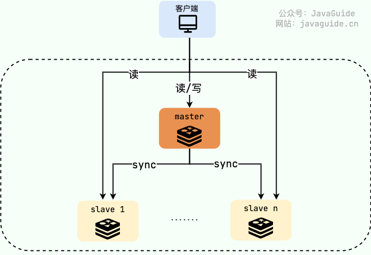

如果 master 宕机的话，从 slave 中选出一台作为 master 即可实现故障转移（Failover）。

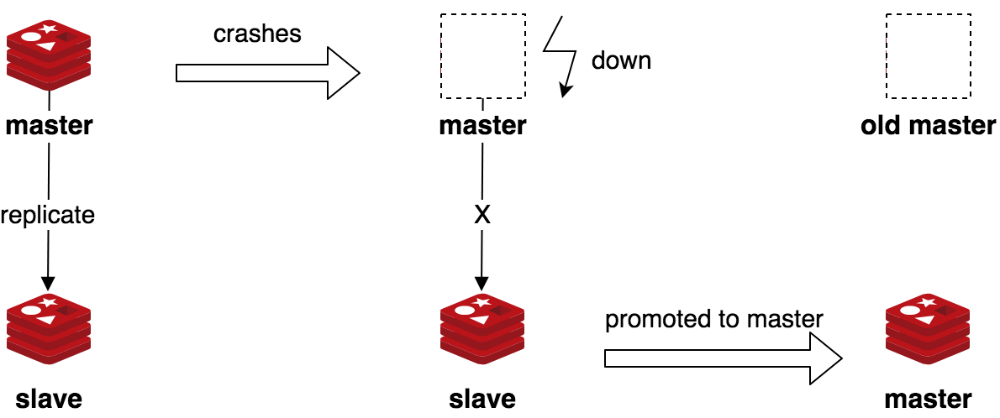

### 什么是主从复制？

简单来说，**主从复制** 就是将一台 Redis 主节点的数据复制到其他的 Redis 从节点中，尽最大可能保证 Redis 主节点和从节点的数据是一致的。主从复制是 Redis 高可用的基石，我们后面介绍到的 Redis Sentinel 以及 Redis Cluster 都依赖于主从复制。

**主从复制这种方案不仅保障了 Redis 服务的高可用，还实现了读写分离，提高了系统的并发量，尤其是读并发量。**

主从复制这种方案基于 [Redis replication](https://redis.io/docs/manual/replication/)（默认使用异步复制），开发者可以通过 `replicaof` （Redis 5.0 之前是 slaveof 命令）命令来配置各个 Redis 节点的主从关系。

```bash
# 在指定 redis 节点上执行 replicaof 命令就可以让其成为 master 的 slave
# ip port 是 master 的
replicaof ip port
```

配置完成之后，主从节点之间的数据同步会自动进行，不需要人为插手。至于具体要配置多少 slave 节点，主要取决于项目的读吞吐量，因为 slave 节点分担的是读请求，写请求由 master 节点负责。

### 主从复制下从节点会主动删除过期数据吗？

删除策略中， Redis 采用的是 **定期删除+惰性删除** 。

**那客户端读取从节点会读取到过期数据么？** 答案是：有可能，但要看具体的情况。

+ Redis 3.2 版本之前，客户端读从库并不会判断数据是否过期，有可能返回过期数据。Redis 3.2 版本及之后，客户端读从库会先判断数据是否过期，如果读取的数据已经过期了，从库虽然不会删除，但是会返回空值，这就避免了客户端读到过期数据。
+ 采用 `EXPIRE` 或者`PEXPIRE`设置过期时间的话，表示的是从执行这个命令开始往后 TTL 时间过期。如果从节点同步执行命令因为网络等原因延迟的话，客户端就可能会读取到过期的数据（如下图所示，客户端在 T3-T4 之间读取到的就是过期数据）。这种情况可以考虑使用 `EXPIREAT` 和 `PEXPIREAT`，这两个命令语义和效果和 `EXPIRE` 或者`PEXPIRE`类似，但不是指定 TTL（生存时间）的秒数/毫秒数，而是使用绝对的 [Unix 时间戳](http://en.wikipedia.org/wiki/Unix_time)（自 1970 年 1 月 1 日以来的秒数）。由于设置的是时间点，主从节点的时钟需要保持一致。

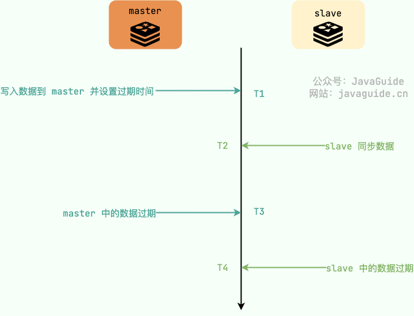

### 主从节点之间如何同步数据？

#### Redis 2.8 之前的 SYNC 方案

1. slave 向 master 发送 SYNC 命令请求启动复制流程；
2. master 收到 SYNC 命令之后执行 [BGSAVE](https://redis.io/commands/bgsave/) 命令（子线程执行，不会阻塞主线程）生成 RDB 文件（dump.rdb）；
3. master 将生成的 RDB 文件发送给 slave；
4. slave 收到 RDB 文件之后就开始加载解析 RDB 同步更新本地数据；
5. 更新完成之后，slave 的状态相当于是 master 执行 BGSAVE 命令时的状态。master 会将 BGSAVE 命令之后接受的写命令缓存起来，因为这部分写命令 slave 还未同步；
6. master 将自己缓存的这些写命令发送给 slave，slave 执行这些写命令同步 master 的最新状态；
7. slave 到这个时候已经完成全量复制，后续会通过和 master 维护的长连接来进行命令传播，同步最新的写命令。

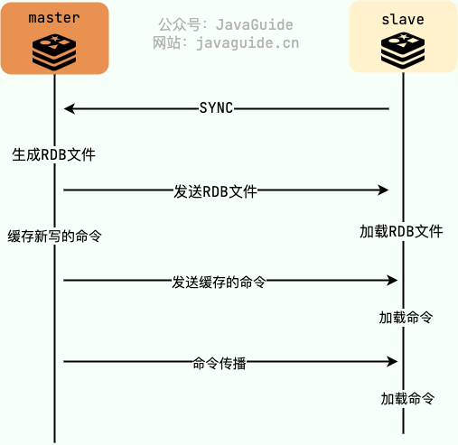

Redis 在 2.8 版本之前主从复制还存在下面这些迫切需要解决的问题：

+ slave 加载 RDB 的过程中不能对外提供读服务。
+ slave 和 master 断开连接之后，slave 重新连上 master 需要重新进行全量同步。

#### Redis 2.8 PSYNC 方案

PSYNC 解决了 slave 和 master 断开连接之后需要重新进行全量同步的问题。不过，部分情况（比如 slave 突然宕机或者被重启）重连之后依然需要进行全量同步。

slave 会记录 master 的运行 id （也就是 runid）和自己的复制进度/偏移量（slave_repl_offset）。每个 Redis 节点启动时都有一个 40 字节随机字符串作为运行 id，你可以通过 `info server` 命令查看 runid 的值。

master 也会记录自己写入缓冲区的偏移量（master_repl_offset），如果 runid 匹配的话，通过 slave_repl_offset 和 master_repl_offset 就可以确认 slave 缺少的数据是否在缓冲区中以及缺少的具体是哪一部分的数据。如果 master 发现 slave 缺少的数据自己刚好缓存了的话，就会直接发给 slave。

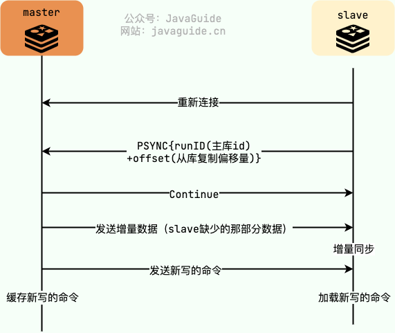

如果是首次连接的话，还是要进行全量复制。slave 向 master 发送 PSYNC 命令，由于当前是第一次进行主从复制，还不知道 master 的 runid，所以将 runid 设为“？”，将 offset 设为 -1。

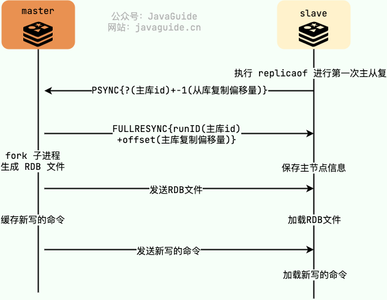

**master 如何通过复制偏移量找到 slave 缺少的数据从而避免全量复制呢？**

master 通过一个环形的 **复制积压缓冲区（repl_backlog_buffer）** 来记录从生成 RDB 文件开始收到的所有写命令。一个 master 中只有一个复制积压缓冲区，master 所有的 slave **共用**。repl_backlog_buffer 是一个固定长度的队列（FIFO，先进先出），默认为 1MB 大小，支持自定义大小。如果 slave 缺少的那部分数据存在这个队列中，可以进行增量同步。否则的话， 还是要进行全量同步操作。

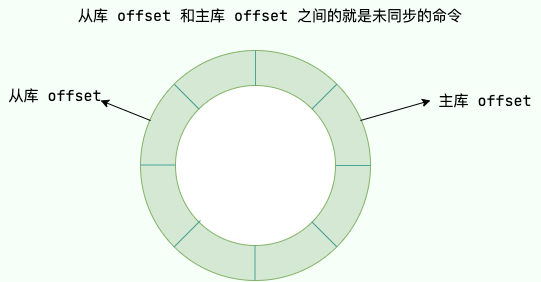

下面这些情况也还是需要进行全量同步：

+ slave 突然宕机或者被重启， runid、offset 都丢失了；
+ master 突然宕机，新选出来的 master 的 runid 和 offset 都会发生变化。

#### Redis 4.0 PSYNC2.0 方案

让“换主”之后也尽可能走增量复制（partial resync），PSYNC移除了`run_id`，新增了三个属性：

- `master_replid`（当前同步的主节点 ID）
- `master_replid2`（旧的同步的主节点 ID）
- `second_repl_offset`（旧 ID 对应的 offset 上限）

当发生主从选举后，如果新主节点的`master_replid2`和从节点的`master_replid2`相同，代表曾经隶属同一个主节点，并且主节点`offset`比从节点`second_repl_offset`大的情况下，可以进行增量同步，否则就进行全量同步


### 为什么主从全量复制使用 RDB 而不是 AOF？

+ RDB 文件存储的内容是经过压缩的二进制数据，文件很小。AOF 文件存储的是每一次写命令，类似于 MySQL 的 binlog 日志，通常会必 RDB 文件大很多。因此，传输 RDB 文件更节省带宽，速度也更快。
+ 使用 RDB 文件恢复数据，直接解析还原数据即可，不需要一条一条地执行命令，速度非常快。而 AOF 则需要依次执行每个写命令，速度非常慢。也就是说，与 AOF 相比，恢复大数据集的时候，RDB 速度更快。
+ AOF 需要选择合适的刷盘策略，如果刷盘策略选择不当的话，会影响 Redis 的正常运行。并且，根据所使用的刷盘策略，AOF 的速度可能会慢于 RDB。

### 主从复制方案有什么痛点？

主从复制方案下，master 发生宕机的话可以手动将某一台 slave 升级为 master，Redis 服务可用性提高。slave 可以分担读请求，读吞吐量大幅提高。

但其缺陷也很明显，一旦 master 宕机，我们需要从 slave 中手动选择一个新的 master，同时需要修改应用方的主节点地址，还需要命令所有从节点去复制新的主节点，整个过程需要人工干预。人工干预大大增加了问题的处理时间以及出错的可能性。

这个时候你肯定在想：如果能够自动化地完成故障切换就好了！我们后面介绍的 Redis Sentinel（哨兵）就可以帮助我们来解决这个痛点。

另外，主从复制方案在高并发场景下能力有限。如果缓存的数据量太大或者并发量要求太高，主从复制就没办法满足我们的要求了。

主从复制和 Redis Sentinel 这两种方案都不支持横向扩展来缓解写压力以及解决缓存数据量过大的问题。我们后面介绍的 Redis Cluster（官方切片集群解决方案）就可以帮助我们来解决这个痛点。


## Redis哨兵

普通的主从复制方案下，一旦 master 宕机，我们需要从 slave 中手动选择一个新的 master，同时需要修改应用方的主节点地址，还需要命令所有从节点去复制新的主节点，整个过程需要人工干预。人工干预大大增加了问题的处理时间以及出错的可能性。

我们可以借助 Redis 官方的 Sentinel（哨兵）方案来帮助我们解决这个痛点，实现自动化地故障切换。

### 什么是 Sentinel？

**Sentinel（哨兵）** 只是 Redis 的一种运行模式 ，不提供读写服务，默认运行在 26379 端口上，依赖于 Redis 工作。

Redis 在 Sentinel 这种特殊的运行模式下，使用专门的命令表，也就是说普通模式运行下的 Redis 命令将无法使用。

Redis Sentinel 在主从复制实现集群的基础下，多了一个 Sentinel 角色来帮助我们监控 Redis 节点的运行状态并自动实现故障转移。

通过下面的命令就可以让 Redis 以 Sentinel 的方式运行:

```bash
redis-sentinel /path/to/sentinel.conf
或者
redis-server /path/to/sentinel.conf --sentinel
```

Redis 源码中的`sentinel.conf`是用来配置 Sentinel 的，一个常见的最小配置如下所示：

```config
// 指定要监视的 master
// 127.0.0.1 6379 为 master 地址
// 2 表示当有 2 个 sentinel 认为 master 失效时，master 才算真正失效
sentinel monitor mymaster 127.0.0.1 6379 2
// master 节点宕机多长时间才会被 sentinel 认为是失效
sentinel down-after-milliseconds mymaster 60000
sentinel failover-timeout mymaster 180000
sentinel parallel-syncs mymaster 1

sentinel monitor resque 192.168.1.3 6380 4
sentinel down-after-milliseconds resque 10000
sentinel failover-timeout resque 180000
// 在发生主备切换时最多可以有 5 个 slave 同时对新的 master 进行同步
sentinel parallel-syncs resque 5
```

当 master 节点出现故障的时候， Sentinel 会帮助我们实现故障转移，自动根据一定的规则选出一个 slave 升级为 master，确保整个 Redis 系统的可用性。整个过程完全自动，不需要人工介入。

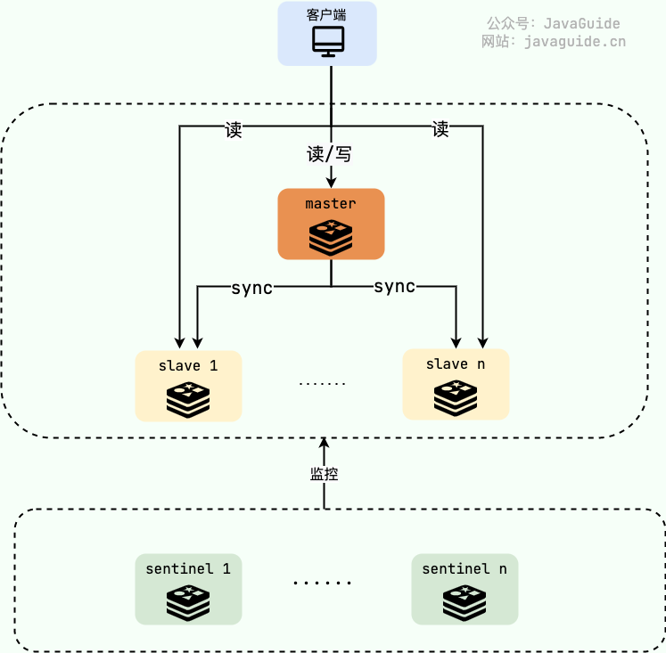

### Sentinel 有什么作用？

+ **监控**：监控所有 redis 节点（包括 sentinel 节点自身）的状态是否正常。
+ **故障转移**：如果一个 master 出现故障，Sentinel 会帮助我们实现故障转移，自动将某一台 slave 升级为 master，确保整个 Redis 系统的可用性。
+ **通知** ：通知 slave 新的 master 连接信息，让它们执行 replicaof 成为新的 master 的 slave。
+ **配置提供** ：客户端连接 sentinel 请求 master 的地址，如果发生故障转移，sentinel 会通知新的 master 链接信息给客户端。

Redis Sentinel 本身设计的就是一个分布式系统，建议多个 sentinel 节点协作运行。这样做的好处是：

+ **容错性增强:** 多个 sentinel 节点通过投票机制来判断 master 节点是否真正失效，避免了因网络波动等因素导致的误判。
+ **高可用性:** 即使某个 Sentinel 节点失效，其他节点仍然可以继续监控和执行故障转移，确保系统的可用性。

### Sentinel 如何检测节点是否下线？

Redis Sentinel 中有两个下线（Down）的概念：

+ **主观下线(SDOWN)** ：sentinel 节点认为某个 Redis 节点已经下线了（主观下线），但还不是很确定，需要其他 sentinel 节点的投票。
+ **客观下线(ODOWN)** ：法定数量（通常为过半）的 sentinel 节点认定某个 Redis 节点已经下线（客观下线），那它就算是真的下线了。

每个 sentinel 节点以每秒钟一次的频率向整个集群中的 master、slave 以及其他 sentinel 节点发送一个 PING 命令。

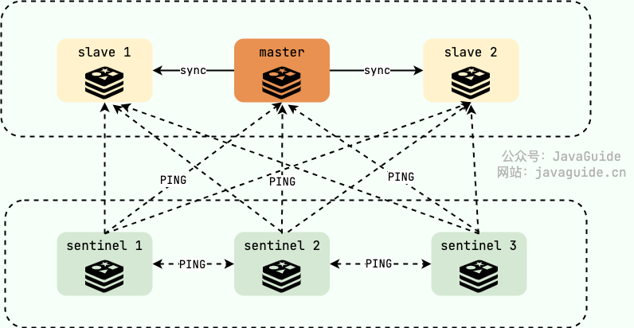

如果对应的节点超过规定的时间（down-after-millseconds）没有进行有效回复的话，就会被其认定为是 **主观下线(SDOWN)** 。

如果被认定为主观下线的是 slave 的话， sentinel 不会做什么事情，因为 slave 下线对 Redis 集群的影响不大，Redis 集群对外正常提供服务。但如果是 master 被认定为主观下线就不一样了，sentinel 整体还要对其进行进一步核实，确保 master 是真的下线了。

所有 sentinel 节点要以每秒一次的频率确认 master 的确下线了，当法定数量（通常为过半）的 sentinel 节点认定 master 已经下线， master 才被判定为 **客观下线(ODOWN)** 。这样做的目的是为了防止误判，毕竟故障转移的开销还是比较大的，这也是为什么 Redis 官方推荐部署多个 sentinel 节点（哨兵集群）。

随后， sentinel 中会有一个 Leader 的角色来负责故障转移，也就是自动地从 slave 中选出一个新的 master 并执行完相关的一些工作(比如通知 slave 新的 master 连接信息，让它们执行 replicaof 成为新的 master 的 slave)。

如果没有足够数量的 sentinel 节点认定 master 已经下线的话，当 master 能对 sentinel 的 PING 命令进行有效回复之后，master 也就不再被认定为主观下线，回归正常。

### Sentinel 如何选择出新的 master?

1. **slave 优先级** ：可以通过修改 `slave-priority`（`redis.conf`中配置，Redis5.0 后该配置属性名称被修改为 `replica-priority`） 配置的值来手动设置 slave 的优先级。`slave-priority`默认值为 100，其值越小得分越高，越有机会成为 master。比如说假设有三个优先级分别为 10,100,25 的 slave ，哨兵将选择优先级为 10 的。不过，0 是一个特殊的优先级值 ，如果一个 slave 的 `slave-priority`值为 0，代表其没有参加 master 选举的资格。如果没有优先级最高的，再判断复制进度。
2. **复制进度** ：Sentinel 总是希望选择出数据最完整（与旧 master 数据最接近）也就是复制进度最快的 slave 被提升为新的 master，复制进度越快得分也就越高。
3. **runid(运行 id)** ：通常经过前面两轮筛选已经成功选出来了新的 master，万一真有多个 slave 的优先级和复制进度一样的话，那就 runid 小的成为新的 master，每个 redis 节点启动时都有一个 40 字节随机字符串作为运行 id。

### 如何从 Sentinel 集群中选择出 Leader ？


我们前面说了，当 sentinel 集群确认有 master 客观下线了，就会开始故障转移流程，故障转移流程的第一步就是在 sentinel 集群选择一个 leader，让 leader 来负责完成故障转移。

**如何选择出 Leader 角色呢？**

这就需要用到分布式领域的 **共识算法** 了。简单来说，共识算法就是让分布式系统中的节点就一个问题达成共识。在 sentinel 选举 leader 这个场景下，这些 sentinel 要达成的共识就是谁才是 leader 。大部分共识算法都是基于 Paxos 算法改进而来，在 sentinel 选举 leader 这个场景下使用的是 [**Raft 算法**](https://javaguide.cn/distributed-system/theorem&algorithm&protocol/raft-algorithm.html)。

### Sentinel 可以防止脑裂吗？

+ **min-replicas-to-write 1**：用于配置写 master 至少写入的 slave 数量，设置为 0 表示关闭该功能。3 个节点的情况下，可以配置为 1 ，表示 master 必须写入至少 1 个 slave ，否则就停止接受新的写入命令请求。
+ **min-replicas-max-lag 10** ：用于配置 master 多长时间（秒）无法得到从节点的响应，就认为这个节点失联。我们这里配置的是 10 秒，也就是说 master 10 秒都得不到一个从节点的响应，就会认为这个从节点失联，停止接受新的写入命令请求。


## Redis集群

### 为什么需要 Redis Cluster？

1. **缓存的数据量太大** ：实际缓存的数据量可以达到几十 G，甚至是成百上千 G；
2. **并发量要求太大** ：虽然 Redis 号称单机可以支持 10w 并发，但实际项目中，不可靠因素太多，就比如一些复杂的写/读操作就可能会让这个并发量大打折扣。而且，就算真的可以实际支持 10w 并发，达到瓶颈了，可能也没办法满足系统的实际需求。

主从复制和 Redis Sentinel 这两种方案本质都是通过增加主库（master）的副本（slave）数量的方式来提高 Redis 服务的整体可用性和读吞吐量，都不支持横向扩展来缓解写压力以及解决缓存数据量过大的问题。

### 分片集群

Redis Cluster 通过 **分片（Sharding）** 来进行数据管理，提供 **主从复制（Master-Slave Replication）**、**故障转移（Failover）** 等开箱即用的功能，可以非常方便地帮助我们解决 Redis 大数据量缓存以及 Redis 服务高可用的问题。

Redis Cluster 这种方案可以很方便地进行 **横向拓展（Scale Out）**，内置了开箱即用的解决方案。当 Redis Cluster 的处理能力达到瓶颈无法满足系统要求的时候，直接动态添加 Redis 节点到集群中即可。根据官方文档中的介绍，Redis Cluster 支持扩展到 1000 个节点。反之，当 Redis Cluster 的处理能力远远满足系统要求，同样可以动态删除集群中 Redis 节点，节省资源。

可以说，**Redis Cluster 的动态扩容和缩容是其最大的优势。**虽说 Redis Cluster 可以扩展到 1000 个节点，但强烈不推荐这样做，应尽量避免集群中的节点过多。这是因为 Redis Cluster 中的各个节点基于 **Gossip 协议** 来进行通信共享信息，当节点过多时，Gossip 协议的效率会显著下降，通信成本剧增。

最后，总结一下 Redis Cluster 的主要优势：

+ 可以横向扩展缓解写压力和存储压力，支持动态扩容和缩容；
+ 具备主从复制、故障转移（内置了 Sentinel 机制，无需单独部署 Sentinel 集群）等开箱即用的功能。

### 一个最基本的 Redis Cluster 架构是怎样的？

为了保证高可用，Redis Cluster 至少需要 3 个 master 以及 3 个 slave，也就是说每个 master 必须有 1 个 slave。master 和 slave 之间做主从复制，slave 会实时同步 master 上的数据。

类似于 Redis 主从架构，这里的 slave 除了可以用来保障 master 的高可用之外，还可以对外提供读服务。slave 默认是可读的，不需要使用 `READONLY` 命令来设置从节点为只读模式。但在某些场景下，例如网络分区、手动故障转移，可能需要显式使用 `READONLY` 命令来确保从节点处于只读模式。另外，在 Redis 6 中，`replica-read-only` 参数默认为 `yes`，确保 slave 只能执行读操作，将其设置为 `no` 就是允许从节点执行写操作，但通常不推荐这样做。如果 master 只有一个 slave 的话，master 宕机之后就直接使用这个 slave 替代 master 继续提供服务。假设 master1 出现故障，slave1 会直接替代 master1，保证 Redis Cluster 的高可用。

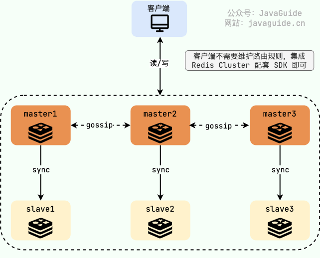

如果 master 有多个 slave 的话，Redis Cluster 中的其他节点会从这个 master 的所有 slave 中选出一个替代 master 继续提供服务。Redis Cluster 总是希望数据最完整的 slave 被提升为新的 master。

Redis Cluster 是去中心化的（各个节点基于 Gossip 进行通信），任何一个 master 出现故障，其它的 master 节点不受影响，因为 key 找的是哈希槽而不是 Redis 节点。不过，Redis Cluster 至少要保证宕机的 master 有一个 slave 可用。

如果宕机的 master 无 slave 的话，为了保障集群的完整性，保证所有的哈希槽都指派给了可用的 master ，整个集群将不可用。这种情况下，还是想让集群保持可用的话，可以将`cluster-require-full-coverage` 这个参数设置成 no，`cluster-require-full-coverage` 表示需要 16384 个 slot 都正常被分配的时候 Redis Cluster 才可以对外提供服务。

如果我们想要添加新的节点比如 master4、master5 进入 Redis Cluster 也非常方便，只需要重新分配哈希槽即可。


### Redis Cluster 是如何分片的？

Redis Cluster 采用的是 **哈希槽分区** ，每一个键值对都属于一个 **hash slot**（哈希槽） 。

Redis Cluster 通常有 **16384** 个哈希槽 ，要计算给定 key 应该分布到哪个哈希槽中，我们只需要先对每个 key 计算 CRC-16（XMODEM） 校验码，然后再对这个校验码对 16384(哈希槽的总数) 取模，得到的值即是 key 对应的哈希槽。

```c
HASH_SLOT = CRC16(key) mod NUMER_OF_SLOTS
```

创建并初始化 Redis Cluster 的时候，Redis 会自动平均分配这 16384 个哈希槽到各个节点，不需要我们手动分配。如果你想自己手动调整的话，Redis Cluster 也内置了相关的命令比如 `ADDSLOTS`、`ADDSLOTSRANGE`

在任意一个 master 节点上执行 `CLUSTER SLOTS`命令即可返回哈希槽和节点的映射关系：

```bash
127.0.0.1:7000>> CLUSTER SLOTS
# 哈希槽的范围
1) 1) (integer) 0
   2) (integer) 5500
   # master 的 ip 和端口号
   3) 1) "127.0.0.1"
      2) (integer) 7002
   # slave 的 ip 和端口号
   4) 1) "127.0.0.1"
      2) (integer) 8002
2) 1) (integer) 11001
   2) (integer) 16383
   3) 1) "127.0.0.1"
      2) (integer) 7000
   4) 1) "127.0.0.1"
      2) (integer) 8000
3) 1) (integer) 5501
   2) (integer) 11000
   3) 1) "127.0.0.1"
      2) (integer) 7001
   4) 1) "127.0.0.1"
      2) (integer) 8001
```

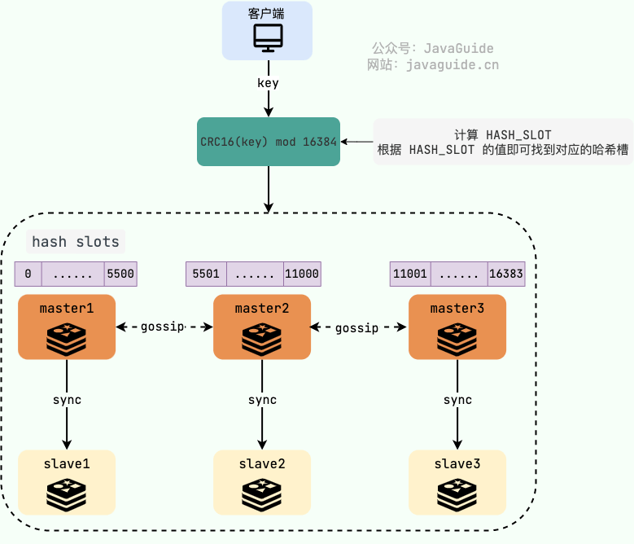


如果哈希槽确实是当前节点负责，那就直接响应客户端的请求返回结果，如果不由当前节点负责，就会返回 `-MOVED` 重定向错误，告知客户端当前哈希槽是由哪个节点负责，客户端向目标节点发送请求并更新缓存的哈希槽分配信息。

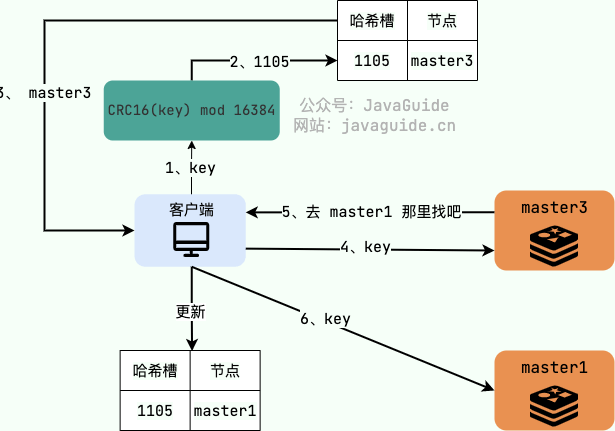

这个时候你可能就会疑问：**为什么还会存在找错节点的情况呢？根据公式计算难道还会出错？**

这是因为 Redis Cluster 内部可能会重新分配哈希槽比如扩容缩容的时候，这就可能会导致客户端缓存的哈希槽分配信息会有误。

### 为什么 Redis Cluster 的哈希槽是 16384 个?

CRC16 算法产生的校验码有 16 位，理论上可以产生 65536（2^16，0 ~ 65535）个值。为什么 Redis Cluster 的哈希槽偏偏选择的是 16384（2^14）个呢？

+ 在 Redis Cluster 中，节点之间通过 **gossip 协议**持续发送心跳（ping/pong）。这些心跳包会携带哈希槽分配位图（slot bitmap），假设哈希槽采用 16384 ,则占空间 2kb (16384/8)。假设哈希槽采用 65536， 则占空间 8kb (65536/8)，这是令人难以接受的内存占用。
+ 由于其他设计上的权衡，Redis Cluster 不太可能扩展到超过 1000 个主节点。

也就是说，65536 个固然可以确保每个主节点有足够的哈希槽，但其占用的空间太大。而且，Redis Cluster 的主节点通常不会扩展太多，16384 个哈希槽完全足够用了。

### Redis Cluster 如何重新分配哈希槽？

手动调整命令：

+ `CLUSTER ADDSLOTS slot [slot ...]` : 把一组 hash slots 分配给接收命令的节点，时间复杂度为 O(N)，其中 N 是 hash slot 的总数；
+ `CLUSTER ADDSLOTSRANGE start-slot end-slot [start-slot end-slot ...]` （Redis 7.0 后新加的命令）： 把指定范围的 hash slots 分配给接收命令的节点，类似于 `ADDSLOTS` 命令，时间复杂度为 O(N) 其中 N 是起始 hash slot 和结束 hash slot 之间的 hash slot 的总数。
+ `CLUSTER DELSLOTS slot [slot ...]` : 从接收命令的节点中删除一组 hash slots；
+ `CLUSTER FLUSHSLOTS` ：移除接受命令的节点中的所有 hash slot；
+ `CLUSTER SETSLOT slot MIGRATING node-id`： 迁移接受命令的节点的指定 hash slot 到目标节点（node_id 指定）中；
+ `CLUSTER SETSLOT slot IMPORTING node-id`： 将目标节点（node_id 指定）中的指定 hash slot 迁移到接受命令的节点中；

### Redis Cluster 扩容缩容期间可以提供服务吗？

**Redis Cluster 扩容和缩容本质是进行重新分片，动态迁移哈希槽。**为了保证 Redis Cluster 在扩容和缩容期间依然能够对外正常提供服务，Redis Cluster 提供了重定向机制，两种不同的类型：

+ **ASK 重定向** ：可以看做是临时重定向，后续查询仍然发送到旧节点。
+ **MOVED 重定向** ：可以看做是永久重定向，后续查询发送到新节点。

客户端向指定节点发送请求命令，从客户端的角度来看，先是ASK重定向阶段，迁移完成后是MOVED重定向阶段：

1. 如果请求的 key 对应的哈希槽还在当前节点的话，就直接响应客户端的请求。
2. 如果请求的 key 对应的哈希槽在迁移过程中，但是请求的 key 还未迁移走的话，说明当前节点任然可以处理当前请求，同样可以直接响应客户端的请求。
3. 如果客户端请求的 key 对应的哈希槽当前正在迁移至新的节点且请求的 key  已经被迁移走的话，就会返回 `-ASK` 重定向错误，告知客户端要将请求发送到哈希槽被迁移到的目标节点。 `-ASK` 重定向错误信息中包含请求 key 迁移到的新节点的信息。
4. 客户端收到 `-ASK` 重定向错误后，将会临时（一次性）重定向，自动向新节点发送一条 [ASKING](https://redis.io/commands/asking/) 命令。也就是说，接收到 ASKING 命令的节点会强制执行一次请求，下次再来需要重新提前发送 ASKING 命令。
5. 新节点在收到 ASKING 命令后可能会返回重试错误（TRYAGAIN），因为可能存在当前请求的 key 还在导入中但未导入完成的情况。
6. 客户端发送真正需要请求的命令。
7. ASK 重定向并不会同步更新客户端缓存的哈希槽分配信息，也就是说，客户端对正在迁移的相同哈希槽的请求依然会发送到旧节点而不是新节点。
8. 如果客户端请求的 key 对应的哈希槽已经迁移完成的话，就会返回 `-MOVED` 重定向错误，告知客户端当前哈希槽是由哪个节点负责，客户端向新节点发送请求并更新缓存的哈希槽分配信息，后续查询将被发送到新节点。

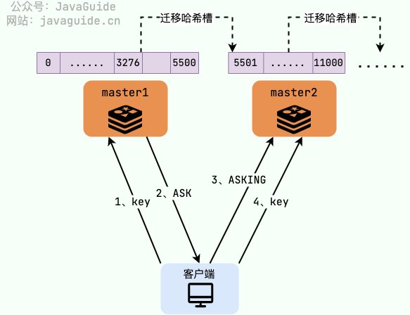


### Redis Cluster 中的节点是怎么进行通信的？

Redis Cluster 是一个典型的分布式系统，分布式系统中的各个节点需要互相通信。既然要相互通信就要遵循一致的通信协议，Redis Cluster 中的各个节点基于 **Gossip 协议** 来进行通信共享信息，每个 Redis 节点都维护了一份集群的状态信息。

Redis Cluster 的节点之间会相互发送多种 Gossip 消息：

+ **MEET** ：在 Redis Cluster 中的某个 Redis 节点上执行 `CLUSTER MEET ip port` 命令，可以向指定的 Redis 节点发送一条 MEET 信息，用于将其添加进 Redis Cluster 成为新的 Redis 节点。
+ **PING/PONG** ：Redis Cluster 中的节点都会定时地向其他节点发送 PING 消息，来交换各个节点状态信息，检查各个节点状态，包括在线状态、疑似下线状态 PFAIL 和已下线状态 FAIL。
+ **FAIL** ：Redis Cluster 中的节点 A 发现 B 节点 PFAIL ，并且在下线报告的有效期限内集群中半数以上的节点将 B 节点标记为 PFAIL，节点 A 就会向集群广播一条 FAIL 消息，通知其他节点将故障节点 B 标记为 FAIL 。

有了 Redis Cluster 之后，不需要专门部署 Sentinel 集群服务了。Redis Cluster 相当于是内置了 Sentinel 机制，Redis Cluster 内部的各个 Redis 节点通过 Gossip 协议互相探测健康状态，在故障时可以自动切换。


### 崩溃恢复

**故障检测**

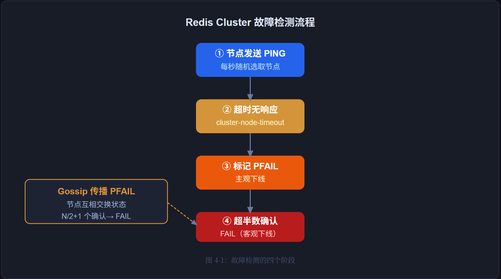

**触发选主（Failover Trigger）**

每个 slave 不会立刻抢主，而是基于延迟机制发起选举，延迟机制受以下两个属性影响：

- slave 的 **复制 offset（数据新旧）**
- slave 的 **priority（配置优先级）**

数据越新，优先级越高的slave越先发起选举广播`FAILOVER_AUTH_REQUEST`，包括自己的`node_id`和旧的`epoch`

**投票**

每个 master 节点，在一个 epoch 内 **只能投一票**

- 它认为原 master 已 FAIL
- 该 slave 的数据是“足够新”的
- 没有给其他人投过票

**晋升**

获得多数 master 节点投票，slave会晋升为新的master节点，epoch自增，广播通知集群

其他节点会：

- 更新 slot → node 映射
- 开始向新 master 同步

客户端会：

- 收到 `MOVED`
- 自动切换到新节点

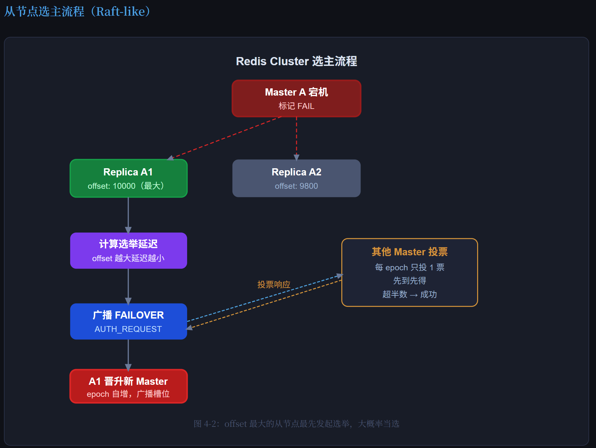


## 问题

### Redis内存满了怎么解决？

+ 根据应用场景和需求，设置合理的 `maxmemory` 和淘汰策略。
+ 如果 Redis 单节点的内存实在无法满足需求，可以使用 Redis 切片集群。
+ 对内存进行监控，例如使用 `info memory` 命令监控 Redis 的内存使用情况。或者，引入更完善的监控工具（如 Prometheus + Grafana）并设置内存预警。
+ 为了优化内存使用，还应该采用选择合适的数据类型、避免大 key，及时清理垃圾数据等手段。
