# 操作系统

## 什么是操作系统？

通过以下四点可以概括操作系统到底是什么：

1. 操作系统（Operating System，简称 OS）是管理计算机硬件与软件资源的程序，是计算机的基石。
2. 操作系统本质上是一个运行在计算机上的软件程序 ，主要用于管理计算机硬件和软件资源。 举例：运行在你电脑上的所有应用程序都通过操作系统来调用系统内存以及磁盘等等硬件。
3. 操作系统存在屏蔽了硬件层的复杂性。 操作系统就像是硬件使用的负责人，统筹着各种相关事项。
4. 操作系统的内核（Kernel）是操作系统的核心部分，它负责系统的内存管理，硬件设备的管理，文件系统的管理以及应用程序的管理。 内核是连接应用程序和硬件的桥梁，决定着系统的性能和稳定性。

很多人容易把操作系统的内核（Kernel）和中央处理器（CPU，Central Processing Unit）弄混。你可以简单从下面两点来区别：

1. 操作系统的内核（Kernel）属于操作系统层面，而 CPU 属于硬件。
2. CPU 主要提供运算，处理各种指令的能力。内核（Kernel）主要负责系统管理比如内存管理，它屏蔽了对硬件的操作。

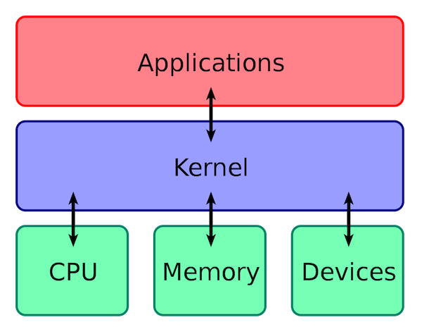

## 操作系统主要有哪些功能？

从资源管理的角度来看，操作系统有 6 大功能：

1. **进程和线程的管理**：进程的创建、撤销、阻塞、唤醒，进程间的通信等。
2. **存储管理**：内存的分配和管理、外存（磁盘等）的分配和管理等。
3. **文件管理**：文件的读、写、创建及删除等。
4. **设备管理**：完成设备（输入输出设备和外部存储设备等）的请求或释放，以及设备启动等功能。
5. **网络管理**：操作系统负责管理计算机网络的使用。网络是计算机系统中连接不同计算机的方式，操作系统需要管理计算机网络的配置、连接、通信和安全等，以提供高效可靠的网络服务。
6. **安全管理**：用户的身份认证、访问控制、文件加密等，以防止非法用户对系统资源的访问和操作。

## 什么是用户态和内核态？

根据进程访问资源的特点，我们可以把进程在系统上的运行分为两个级别：

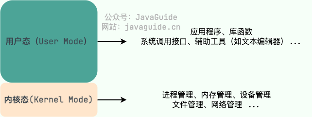

- **用户态(User Mode)** : 用户态运行的进程可以直接读取用户程序的数据，拥有较低的权限。当应用程序需要执行某些需要特殊权限的操作，例如读写磁盘、网络通信等，就需要向操作系统发起系统调用请求，进入内核态。
- **内核态(Kernel Mode)** ：内核态运行的进程几乎可以访问计算机的任何资源包括系统的内存空间、设备、驱动程序等，不受限制，拥有非常高的权限。当操作系统接收到进程的系统调用请求时，就会从用户态切换到内核态，执行相应的系统调用，并将结果返回给进程，最后再从内核态切换回用户态。

## 为什么要有用户态和内核态？只有一个内核态不行么？

这样设计主要是为了**安全**和**稳定**。

- 在 CPU 的所有指令中，有一些指令是比较危险的比如内存分配、设置时钟、IO 处理等，如果所有的程序都能使用这些指令的话，会对系统的正常运行造成灾难性地影响。因此，我们需要限制这些危险指令只能内核态运行。这些只能由操作系统内核态执行的指令也被叫做 **特权指令** 。
- 如果计算机系统中只有一个内核态，那么所有程序或进程都必须共享系统资源，例如内存、CPU、硬盘等，这将导致系统资源的竞争和冲突，从而影响系统性能和效率。并且，这样也会让系统的安全性降低，毕竟所有程序或进程都具有相同的特权级别和访问权限。

因此，同时具有用户态和内核态主要是为了保证计算机系统的安全性、稳定性和性能。

## 用户态和内核态是如何切换的？

用户态切换到内核态的 3 种方式：

1. **系统调用（Trap）**：这是最主要的方式，是应用程序**主动**发起的。比如，当我们的程序需要读取一个文件或者发送网络数据时，它无法直接操作磁盘或网卡，就必须调用操作系统提供的接口（如 `read()`,`send()`), 这会触发一次从用户态到内核态的切换。
2. **中断（Interrupt）**：这是**被动**的，由外部硬件设备触发。比如，当硬盘完成了数据读取，会向 CPU 发送一个中断信号，CPU 会暂停当前用户态的程序，切换到内核态去处理这个中断。
3. **异常（Exception）**：这也是**被动**的，由程序自身错误引起。比如，我们的代码执行了一个除以零的操作，或者访问了一个非法的内存地址（缺页异常），CPU 会捕获这个异常，并切换到内核态去处理它。

## 什么是系统调用？

在我们运行的用户程序中，凡是与系统态级别的资源有关的操作（如文件管理、进程控制、内存管理等)，都必须通过系统调用方式向操作系统提出服务请求，并由操作系统代为完成。

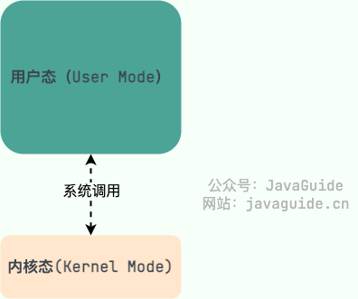

这些系统调用按功能大致可分为如下几类：

- 设备管理：完成设备（输入输出设备和外部存储设备等）的请求或释放，以及设备启动等功能。
- 文件管理：完成文件的读、写、创建及删除等功能。
- 进程管理：进程的创建、撤销、阻塞、唤醒，进程间的通信等功能。
- 内存管理：完成内存的分配、回收以及获取作业占用内存区大小及地址等功能。

## 系统调用的过程了解吗？

1. 用户态的程序发起系统调用，因为系统调用中涉及一些特权指令（只能由操作系统内核态执行的指令），用户态程序权限不足，因此会中断执行，也就是 Trap（Trap 是一种中断）。
2. 发生中断后，当前 CPU 执行的程序会中断，跳转到中断处理程序。内核程序开始执行，也就是开始处理系统调用。
3. 当系统调用处理完成后，操作系统使用特权指令（如 `iret`、`sysret` 或 `eret`）切换回用户态，恢复用户态的上下文，继续执行用户程序。

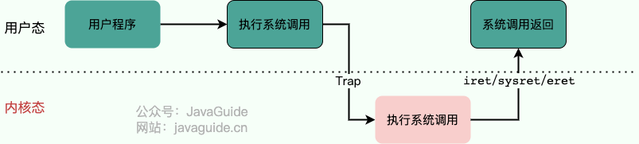

## 进程和线程的区别是什么？

进程和线程是操作系统中并发执行的两个核心概念，它们的关系可以理解为 **工厂和工人** 的关系。

- **进程（Process）就像一个工厂**。操作系统在分配资源时，是以进程为基本单位的。比如，当我启动一个微信，操作系统就为它建立了一个独立的工厂，分配给它专属的内存空间、文件句柄等资源。这个工厂与其他工厂（比如我打开的浏览器进程）是严格隔离的。
- **线程（Thread）则像是工厂里的工人**。一个工厂里可以有很多工人，他们共享这个工厂的资源，但每个工人有自己的工具箱和任务清单，让他们可以独立地执行不同的任务。比如微信这个工厂里，可以有一个工人（线程）负责接收消息，一个工人负责渲染界面。

线程和进程的核心区别：

- **资源所有权：** 进程是资源分配的基本单位，拥有独立的地址空间；而线程是 CPU 调度的基本单位，几乎不拥有系统资源，只保留少量私有数据（PC、栈、寄存器），主要共享其所属进程的资源。
- **开销：** 创建或销毁一个工厂（进程）的开销很大，需要分配独立的资源。而雇佣或解雇一个工人（线程）的开销就小得多。同理，进程间的上下文切换开销远大于线程间的切换。
- **健壮性：** 工厂之间是隔离的，一个工厂倒闭（进程崩溃）不会影响其他工厂。但一个工厂内的工人之间是共享资源的，一个工人操作失误（比如一个线程访问了非法内存）可能会导致整个工厂停工（整个进程崩溃）。

## 有了进程为什么还需要线程?

核心原因就是**为了在单个应用内实现低开销、高效率的并发**。如果我想让微信同时接收消息和发送文件，如果用两个进程来实现，不仅资源开销巨大，它们之间通信还非常麻烦（需要 IPC）。而使用两个线程，它们不仅切换成本低，还能直接通过共享内存高效通信，从而能更好地利用多核 CPU，提升应用的响应速度和吞吐量。

再那我们上面举的工厂和工人为例：线程=同一屋檐下的轻量级工人，切换成本低、共享内存零拷贝；若换成两个独立进程，就得各建一座工厂（独立地址空间），既费砖又费电（资源与 IPC 开销）。

## 为什么要使用多线程?

先从总体上来说：

- **从计算机底层来说：** 线程可以比作是轻量级的进程，是程序执行的最小单位,线程间的切换和调度的成本远远小于进程。另外，多核 CPU 时代意味着多个线程可以同时运行，这减少了线程上下文切换的开销。
- **从当代互联网发展趋势来说：** 现在的系统动不动就要求百万级甚至千万级的并发量，而多线程并发编程正是开发高并发系统的基础，利用好多线程机制可以大大提高系统整体的并发能力以及性能。

再深入到计算机底层来探讨：

- **单核时代**：在单核时代多线程主要是为了提高单进程利用 CPU 和 IO 系统的效率。 假设只运行了一个 Java 进程的情况，当我们请求 IO 的时候，如果 Java 进程中只有一个线程，此线程被 IO 阻塞则整个进程被阻塞。CPU 和 IO 设备只有一个在运行，那么可以简单地说系统整体效率只有 50%。当使用多线程的时候，一个线程被 IO 阻塞，其他线程还可以继续使用 CPU。从而提高了 Java 进程利用系统资源的整体效率。
- **多核时代**: 多核时代多线程主要是为了提高进程利用多核 CPU 的能力。举个例子：假如我们要计算一个复杂的任务，我们只用一个线程的话，不论系统有几个 CPU 核心，都只会有一个 CPU 核心被利用到。而创建多个线程，这些线程可以被映射到底层多个 CPU 上执行，在任务中的多个线程没有资源竞争的情况下，任务执行的效率会有显著性的提高，约等于（单核时执行时间/CPU 核心数）。

## 线程间的同步的方式有哪些？

- **互斥锁(Mutex)** ：采用互斥对象机制，只有拥有互斥对象的线程才有访问公共资源的权限。因为互斥对象只有一个，所以可以保证公共资源不会被多个线程同时访问。比如 Java 中的 `synchronized` 关键词和各种 `Lock` 都是这种机制。
- **读写锁（Read-Write Lock）** ：允许多个线程同时读取共享资源，但只有一个线程可以对共享资源进行写操作。
- **信号量(Semaphore)** ：它允许同一时刻多个线程访问同一资源，但是需要控制同一时刻访问此资源的最大线程数量。
- **屏障（Barrier）** ：屏障是一种同步原语，用于等待多个线程到达某个点再一起继续执行。当一个线程到达屏障时，它会停止执行并等待其他线程到达屏障，直到所有线程都到达屏障后，它们才会一起继续执行。比如 Java 中的 `CyclicBarrier` 是这种机制。
- **事件(Event)** :Wait/Notify：通过通知操作的方式来保持多线程同步，还可以方便的实现多线程优先级的比较操作。

## PCB 是什么？包含哪些信息？

**PCB（Process Control Block）** 即进程控制块，是操作系统中用来管理和跟踪进程的数据结构，每个进程都对应着一个独立的 PCB。你可以将 PCB 视为进程的大脑。

当操作系统创建一个新进程时，会为该进程分配一个唯一的进程 ID，并且为该进程创建一个对应的进程控制块。当进程执行时，PCB 中的信息会不断变化，操作系统会根据这些信息来管理和调度进程。

PCB 主要包含下面几部分的内容：

- 进程的描述信息，包括进程的名称、标识符等等；
- 进程的调度信息，包括进程阻塞原因、进程状态（就绪、运行、阻塞等）、进程优先级（标识进程的重要程度）等等；
- 进程对资源的需求情况，包括 CPU 时间、内存空间、I/O 设备等等。
- 进程打开的文件信息，包括文件描述符、文件类型、打开模式等等。
- 处理机的状态信息（由处理机的各种寄存器中的内容组成的），包括通用寄存器、指令计数器、程序状态字 PSW、用户栈指针。

## 进程有哪几种状态?

- **创建状态(new)**：进程正在被创建，尚未到就绪状态。
- **就绪状态(ready)**：进程已处于准备运行状态，即进程获得了除了处理器之外的一切所需资源，一旦得到处理器资源(处理器分配的时间片)即可运行。
- **运行状态(running)**：进程正在处理器上运行(单核 CPU 下任意时刻只有一个进程处于运行状态)。
- **阻塞状态(waiting)**：又称为等待状态，进程正在等待某一事件而暂停运行如等待某资源为可用或等待 IO 操作完成。即使处理器空闲，该进程也不能运行。
- **结束状态(terminated)**：进程正在从系统中消失。可能是进程正常结束或其他原因中断退出运行。

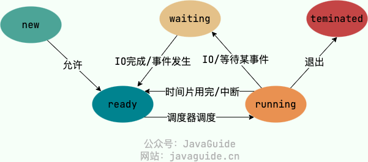

## 进程间的通信方式有哪些？

- **管道/匿名管道(Pipes)** ：用于具有亲缘关系的父子进程间或者兄弟进程之间的通信。
- **有名管道(Named Pipes)** : 匿名管道由于没有名字，只能用于亲缘关系的进程间通信。为了克服这个缺点，提出了有名管道。有名管道严格遵循 **先进先出(First In First Out)** 。有名管道以磁盘文件的方式存在，可以实现本机任意两个进程通信。
- **信号(Signal)** ：信号是一种比较复杂的通信方式，用于通知接收进程某个事件已经发生；
- **消息队列(Message Queuing)** ：消息队列是消息的链表,具有特定的格式,存放在内存中并由消息队列标识符标识。管道和消息队列的通信数据都是先进先出的原则。与管道（无名管道：只存在于内存中的文件；命名管道：存在于实际的磁盘介质或者文件系统）不同的是消息队列存放在内核中，只有在内核重启(即，操作系统重启)或者显式地删除一个消息队列时，该消息队列才会被真正的删除。消息队列可以实现消息的随机查询,消息不一定要以先进先出的次序读取,也可以按消息的类型读取.比 FIFO 更有优势。消息队列克服了信号承载信息量少，管道只能承载无格式字 节流以及缓冲区大小受限等缺点。
- **信号量(Semaphores)** ：信号量是一个计数器，用于多进程对共享数据的访问，信号量的意图在于进程间同步。这种通信方式主要用于解决与同步相关的问题并避免竞争条件。
- **共享内存(Shared memory)** ：使得多个进程可以访问同一块内存空间，不同进程可以及时看到对方进程中对共享内存中数据的更新。这种方式需要依靠某种同步操作，如互斥锁和信号量等。可以说这是最有用的进程间通信方式。
- **套接字(Sockets)** : 此方法主要用于在客户端和服务器之间通过网络进行通信。套接字是支持 TCP/IP 的网络通信的基本操作单元，可以看做是不同主机之间的进程进行双向通信的端点，简单的说就是通信的两方的一种约定，用套接字中的相关函数来完成通信过程。

## 进程的调度算法有哪些?

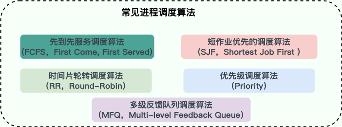

我习惯将这些算法分为两大类：**非抢占式**和**抢占式**。

**第一类：非抢占式调度 (Non-Preemptive)**

这种方式下，一旦 CPU 分配给一个进程，它就会一直运行下去，直到任务完成或主动放弃（比如等待 I/O）。

1. **先到先服务调度算法(FCFS，First Come, First Served)** : 这是最简单的，就像排队，谁先来谁先用。优点是公平、实现简单。但缺点很明显，如果一个很长的任务先到了，后面无数个短任务都得等着，这会导致平均等待时间很长，我们称之为“护航效应”。
2. **短作业优先的调度算法(SJF，Shortest Job First)** : 从就绪队列中选出一个估计运行时间最短的进程为之分配资源。理论上，它的平均等待时间是最短的，吞吐量很高。但缺点是，它需要预测运行时间，这很难做到，而且可能会导致长作业“饿死”，永远得不到执行。

**第二类：抢占式调度 (Preemptive)**

操作系统可以强制剥夺当前进程的 CPU 使用权，分配给其他更重要的进程。现代操作系统基本都采用这种方式。

- **时间片轮转调度算法（RR，Round-Robin）** : 这是最经典、最公平的抢占式算法。它给每个进程分配一个固定的时间片，用完了就把它放到队尾，切换到下一个进程。它非常适合分时系统，保证了每个进程都能得到响应，但时间片的设置很关键：太长了退化成 FCFS，太短了则会导致过于频繁的上下文切换，增加系统开销。
- **优先级调度算法（Priority）**：每个进程都有一个优先级，进程调度器总是选择优先级最高的进程，具有相同优先级的进程以 FCFS 方式执行。这很灵活，可以根据内存要求，时间要求或任何其他资源要求来确定优先级，但同样可能导致低优先级进程“饿死”。

**多级反馈队列调度算法（MFQ，Multi-level Feedback Queue）** 是现实世界中最常用的一种算法，比如早期的 UNIX。它非常聪明，结合了 RR 和优先级调度。它设置了多个不同优先级的队列，每个队列使用 RR 调度，时间片大小也不同。新进程先进入最高优先级队列；如果在一个时间片内没执行完，就会被降级到下一个队列。这样既照顾了短作业（在高优先级队列中快速完成），也保证了长作业不会饿死（最终会在低优先级队列中得到执行），是一种非常均衡的方案。

## 那究竟是谁来调度这个进程呢？

**调度程序 (Scheduler):** 可以看作是决策者。当需要进行调度时，调度程序会被激活，它会根据预设的调度算法（比如我们前面聊到的多级反馈队列），从就绪队列中挑选出下一个应该占用 CPU 的进程。

**分派程序 (Dispatcher)：** 可以看作是执行者。它负责完成具体的“交接”工作，也就是**上下文切换**。这个过程非常底层，主要包括： 

- 保存当前进程的上下文（CPU 寄存器状态、程序计数器等）到其进程控制块（PCB）中。
- 加载下一个被选中进程的上下文，从其 PCB 中读取状态，恢复到 CPU 寄存器。
- 将 CPU 的控制权正式移交给新进程，让它开始运行。

## 什么是死锁？

死锁（Deadlock）描述的是这样一种情况：多个进程/线程同时被阻塞，它们中的一个或者全部都在等待某个资源被释放。由于进程/线程被无限期地阻塞，因此程序不可能正常终止。

## 产生死锁的四个必要条件是什么?

- **互斥**：资源必须处于非共享模式，即一次只有一个进程可以使用。如果另一进程申请该资源，那么必须等待直到该资源被释放为止。
- **占有并等待**：一个进程至少应该占有一个资源，并等待另一资源，而该资源被其他进程所占有。
- **非抢占**：资源不能被抢占。只能在持有资源的进程完成任务后，该资源才会被释放。
- **循环等待**：有一组等待进程 {P0, P1,..., Pn}， P0 等待的资源被 P1 占有，P1 等待的资源被 P2 占有，……，Pn-1 等待的资源被 Pn 占有，Pn 等待的资源被 P0 占有。

### 解决死锁的方法

解决死锁的方法可以从多个角度去分析，一般的情况下，有**预防，避免，检测和解除四种**。

- **死锁预防：** 这是我们程序员最常用的方法。通过编码规范来破坏条件。最经典的就是**破坏循环等待**，比如规定所有线程都必须**按相同的顺序**来获取锁（比如先 A 后 B），这样就不会形成环路。
- **死锁避免：** 这是一种更动态的方法，比如操作系统的**银行家算法**。它会在分配资源前进行预测，如果这次分配可能导致未来发生死锁，就拒绝分配。但这种方法开销很大，在通用系统中用得比较少。
- **死锁检测与解除：** 这是一种“事后补救”的策略，就像乐观锁。系统允许死锁发生，但会有一个后台线程（或机制）定期检测是否存在死锁环路（比如通过分析线程等待图）。一旦发现，就会采取措施解除，比如**强制剥夺某个线程的资源或直接终止它**。数据库系统中的死锁处理就常常采用这种方式。

#### 死锁的预防

死锁四大必要条件上面都已经列出来了，很显然，只要破坏四个必要条件中的任何一个就能够预防死锁的发生。

破坏第一个条件 **互斥条件**：使得资源是可以同时访问的，这是种简单的方法，磁盘就可以用这种方法管理，但是我们要知道，有很多资源 **往往是不能同时访问的** ，所以这种做法在大多数的场合是行不通的。

破坏第三个条件 **非抢占**：也就是说可以采用 **剥夺式调度算法**，但剥夺式调度方法目前一般仅适用于 **主存资源** 和 **处理器资源** 的分配，并不适用于所有的资源，会导致 **资源利用率下降**。

所以一般比较实用的 **预防死锁的方法**，是通过考虑破坏第二个条件和第四个条件。

**1、静态分配策略**

静态分配策略可以破坏死锁产生的第二个条件（占有并等待）。所谓静态分配策略，就是指一个进程必须在执行前就申请到它所需要的全部资源，并且知道它所要的资源都得到满足之后才开始执行。进程要么占有所有的资源然后开始执行，要么不占有资源，不会出现占有一些资源等待一些资源的情况。

静态分配策略逻辑简单，实现也很容易，但这种策略 **严重地降低了资源利用率**，因为在每个进程所占有的资源中，有些资源是在比较靠后的执行时间里采用的，甚至有些资源是在额外的情况下才使用的，这样就可能造成一个进程占有了一些 **几乎不用的资源而使其他需要该资源的进程产生等待** 的情况。

**2、层次分配策略**

层次分配策略破坏了产生死锁的第四个条件(循环等待)。在层次分配策略下，所有的资源被分成了多个层次，一个进程得到某一次的一个资源后，它只能再申请较高一层的资源；当一个进程要释放某层的一个资源时，必须先释放所占用的较高层的资源，按这种策略，是不可能出现循环等待链的，因为那样的话，就出现了已经申请了较高层的资源，反而去申请了较低层的资源，不符合层次分配策略，证明略。

#### 死锁的避免

上面提到的 **破坏** 死锁产生的四个必要条件之一就可以成功 **预防系统发生死锁** ，但是会导致 **低效的进程运行** 和 **资源使用率** 。而死锁的避免相反，它的角度是允许系统中**同时存在四个必要条件** ，只要掌握并发进程中与每个进程有关的资源动态申请情况，做出 **明智和合理的选择** ，仍然可以避免死锁，因为四大条件仅仅是产生死锁的必要条件。

我们将系统的状态分为 **安全状态** 和 **不安全状态** ，每当在为申请者分配资源前先测试系统状态，若把系统资源分配给申请者会产生死锁，则拒绝分配，否则接受申请，并为它分配资源。

那么如何保证系统保持在安全状态呢？通过算法，其中最具有代表性的 **避免死锁算法** 就是 Dijkstra 的银行家算法，银行家算法用一句话表达就是：当一个进程申请使用资源的时候，**银行家算法** 通过先 **试探** 分配给该进程资源，然后通过 **安全性算法** 判断分配后系统是否处于安全状态，若不安全则试探分配作废，让该进程继续等待，若能够进入到安全的状态，则就 **真的分配资源给该进程**。

#### 死锁的检测

对资源的分配加以限制可以 **预防和避免** 死锁的发生，但是都不利于各进程对系统资源的**充分共享**。解决死锁问题的另一条途径是 **死锁检测和解除** (这里突然联想到了乐观锁和悲观锁，感觉死锁的检测和解除就像是 **乐观锁** ，分配资源时不去提前管会不会发生死锁了，等到真的死锁出现了再来解决嘛，而 **死锁的预防和避免** 更像是悲观锁，总是觉得死锁会出现，所以在分配资源的时候就很谨慎)。

这种方法对资源的分配不加以任何限制，也不采取死锁避免措施，但系统 **定时地运行一个 “死锁检测”** 的程序，判断系统内是否出现死锁，如果检测到系统发生了死锁，再采取措施去解除它。

##### 进程-资源分配图

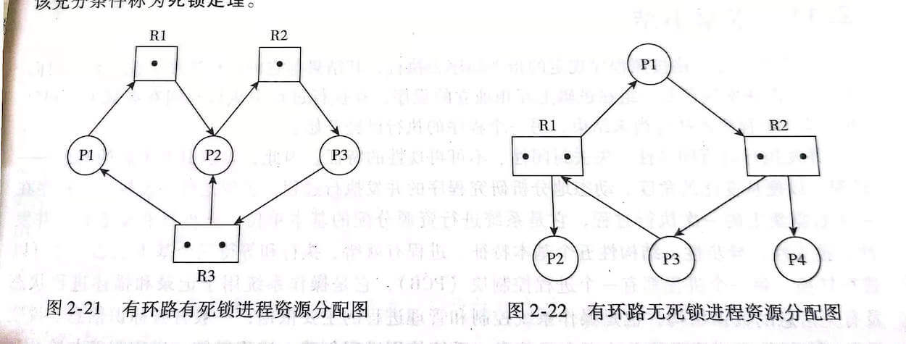

##### 死锁检测步骤

1. 如果进程-资源分配图中无环路，则此时系统没有发生死锁
2. 如果进程-资源分配图中有环路，且每个资源类仅有一个资源，则系统中已经发生了死锁。
3. 如果进程-资源分配图中有环路，且涉及到的资源类有多个资源，此时系统未必会发生死锁。如果能在进程-资源分配图中找出一个 **既不阻塞又非独立的进程** ，该进程能够在有限的时间内归还占有的资源，也就是把边给消除掉了，重复此过程，直到能在有限的时间内 **消除所有的边** ，则不会发生死锁，否则会发生死锁。(消除边的过程类似于 **拓扑排序**)

#### 死锁的解除

当死锁检测程序检测到存在死锁发生时，应设法让其解除，让系统从死锁状态中恢复过来，常用的解除死锁的方法有以下四种：

1. **立即结束所有进程的执行，重新启动操作系统**：这种方法简单，但以前所在的工作全部作废，损失很大。
2. **撤销涉及死锁的所有进程，解除死锁后继续运行**：这种方法能彻底打破**死锁的循环等待**条件，但将付出很大代价，例如有些进程可能已经计算了很长时间，由于被撤销而使产生的部分结果也被消除了，再重新执行时还要再次进行计算。
3. **逐个撤销涉及死锁的进程，回收其资源直至死锁解除。**
4. **抢占资源**：从涉及死锁的一个或几个进程中抢占资源，把夺得的资源再分配给涉及死锁的进程直至死锁解除。

## 内存管理

操作系统的内存管理非常重要，主要负责下面这些事情：

- **内存的分配与回收**：对进程所需的内存进行分配和释放，malloc 函数：申请内存，free 函数：释放内存。
- **地址转换**：将程序中的虚拟地址转换成内存中的物理地址。
- **内存扩充**：当系统没有足够的内存时，利用虚拟内存技术或自动覆盖技术，从逻辑上扩充内存。
- **内存映射**：将一个文件直接映射到进程的进程空间中，这样可以通过内存指针用读写内存的办法直接存取文件内容，速度更快。
- **内存优化**：通过调整内存分配策略和回收算法来优化内存使用效率。
- **内存安全**：保证进程之间使用内存互不干扰，避免一些恶意程序通过修改内存来破坏系统的安全性。

### 什么是内存碎片？

内存碎片是由内存的申请和释放产生的，通常分为下面两种：

- **内部内存碎片(Internal Memory Fragmentation，简称为内存碎片)**：已经分配给进程使用但未被使用的内存。导致内部内存碎片的主要原因是，当采用固定比例比如 2 的幂次方进行内存分配时，进程所分配的内存可能会比其实际所需要的大。举个例子，一个进程只需要 65 字节的内存，但为其分配了 128（2^7） 大小的内存，那 63 字节的内存就成为了内部内存碎片。
- **外部内存碎片(External Memory Fragmentation，简称为外部碎片)**：由于未分配的连续内存区域太小，以至于不能满足任意进程所需要的内存分配请求，这些小片段且不连续的内存空间被称为外部碎片。也就是说，外部内存碎片指的是那些并未分配给进程但又不能使用的内存。我们后面介绍的分段机制就会导致外部内存碎片。

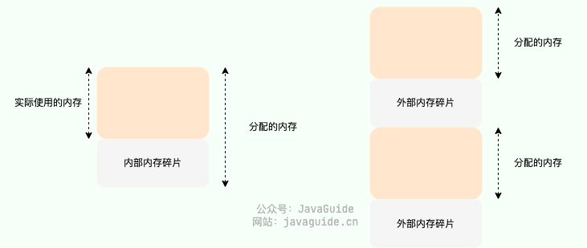

### 常见的内存管理方式有哪些？

内存管理方式可以简单分为下面两种：

- **连续内存管理**：为一个用户程序分配一个连续的内存空间，内存利用率一般不高。
- **非连续内存管理**：允许一个程序使用的内存分布在离散或者说不相邻的内存中，相对更加灵活一些。

#### 连续内存管理

**块式管理** 是早期计算机操作系统的一种连续内存管理方式，存在严重的内存碎片问题。块式管理会将内存分为几个固定大小的块，每个块中只包含一个进程。如果程序运行需要内存的话，操作系统就分配给它一块，如果程序运行只需要很小的空间的话，分配的这块内存很大一部分几乎被浪费了。这些在每个块中未被利用的空间，我们称之为内部内存碎片。除了内部内存碎片之外，由于两个内存块之间可能还会有外部内存碎片，这些不连续的外部内存碎片由于太小了无法再进行分配。

在 Linux 系统中，连续内存管理采用了 **伙伴系统（Buddy System）算法** 来实现，这是一种经典的连续内存分配算法，可以有效解决外部内存碎片的问题。伙伴系统的主要思想是将内存按 2 的幂次划分（每一块内存大小都是 2 的幂次比如 2^6=64 KB），并将相邻的内存块组合成一对伙伴

当进行内存分配时，伙伴系统会尝试找到大小最合适的内存块。如果找到的内存块过大，就将其一分为二，分成两个大小相等的伙伴块。如果还是大的话，就继续切分，直到到达合适的大小为止。

假设两块相邻的内存块都被释放，系统会将这两个内存块合并，进而形成一个更大的内存块，以便后续的内存分配。这样就可以减少内存碎片的问题，提高内存利用率。

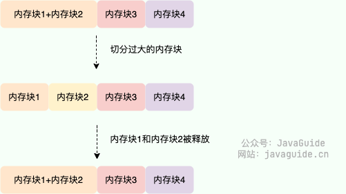

虽然解决了外部内存碎片的问题，但伙伴系统仍然存在内存利用率不高的问题（内部内存碎片）。这主要是因为伙伴系统只能分配大小为 2^n 的内存块，因此当需要分配的内存大小不是 2^n 的整数倍时，会浪费一定的内存空间。举个例子：如果要分配 65 大小的内存快，依然需要分配 2^7=128 大小的内存块。

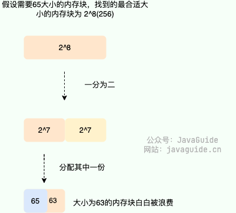

#### 非连续内存管理

非连续内存管理存在下面 3 种方式：

- **段式管理**：以段(一段连续的物理内存)的形式管理/分配物理内存。应用程序的虚拟地址空间被分为大小不等的段，段是有实际意义的，每个段定义了一组逻辑信息，例如有主程序段 MAIN、子程序段 X、数据段 D 及栈段 S 等。
- **页式管理**：把物理内存分为连续等长的物理页，应用程序的虚拟地址空间也被划分为连续等长的虚拟页，是现代操作系统广泛使用的一种内存管理方式。
- **段页式管理机制**：结合了段式管理和页式管理的一种内存管理机制，把物理内存先分成若干段，每个段又继续分成若干大小相等的页。

### 虚拟内存

#### 什么是虚拟内存?有什么用？

**虚拟内存(Virtual Memory)** 是计算机系统内存管理非常重要的一个技术，本质上来说它只是逻辑存在的，是一个假想出来的内存空间，主要作用是作为进程访问主存（物理内存）的桥梁并简化内存管理。

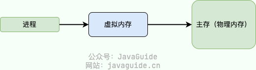

- **隔离进程**：物理内存通过虚拟地址空间访问，虚拟地址空间与进程一一对应。每个进程都认为自己拥有了整个物理内存，进程之间彼此隔离，一个进程中的代码无法更改正在由另一进程或操作系统使用的物理内存。
- **提升物理内存利用率**：有了虚拟地址空间后，操作系统只需要将进程当前正在使用的部分数据或指令加载入物理内存。
- **简化内存管理**：进程都有一个一致且私有的虚拟地址空间，程序员不用和真正的物理内存打交道，而是借助虚拟地址空间访问物理内存，从而简化了内存管理。
- **多个进程共享物理内存**：进程在运行过程中，会加载许多操作系统的动态库。这些库对于每个进程而言都是公用的，它们在内存中实际只会加载一份，这部分称为共享内存。
- **提高内存使用安全性**：控制进程对物理内存的访问，隔离不同进程的访问权限，提高系统的安全性。
- **提供更大的可使用内存空间**：可以让程序拥有超过系统物理内存大小的可用内存空间。这是因为当物理内存不够用时，可以利用磁盘充当，将物理内存页（通常大小为 4 KB）保存到磁盘文件（会影响读写速度），数据或代码页会根据需要在物理内存与磁盘之间移动。

#### 没有虚拟内存有什么问题？

如果没有虚拟内存的话，程序直接访问和操作的都是物理内存，看似少了一层中介，但多了很多问题。

**具体有什么问题呢？** 这里举几个例子说明(参考虚拟内存提供的能力回答这个问题)：

1. 用户程序可以访问任意物理内存，可能会不小心操作到系统运行必需的内存，进而造成操作系统崩溃，严重影响系统的安全。
2. 同时运行多个程序容易崩溃。比如你想同时运行一个微信和一个 QQ 音乐，微信在运行的时候给内存地址 1xxx 赋值后，QQ 音乐也同样给内存地址 1xxx 赋值，那么 QQ 音乐对内存的赋值就会覆盖微信之前所赋的值，这就可能会造成微信这个程序会崩溃。
3. 程序运行过程中使用的所有数据或指令都要载入物理内存，根据局部性原理，其中很大一部分可能都不会用到，白白占用了宝贵的物理内存资源。

#### 什么是虚拟地址和物理地址？

**物理地址（Physical Address）** 是真正的物理内存中地址，更具体点来说是内存地址寄存器中的地址。程序中访问的内存地址不是物理地址，而是 **虚拟地址（Virtual Address）** 。

也就是说，我们编程开发的时候实际就是在和虚拟地址打交道。比如在 C 语言中，指针里面存储的数值就可以理解成为内存里的一个地址，这个地址也就是我们说的虚拟地址。

操作系统一般通过 CPU 芯片中的一个重要组件 **MMU(Memory Management Unit，内存管理单元)** 将虚拟地址转换为物理地址，这个过程被称为 **地址翻译/地址转换（Address Translation）** 。

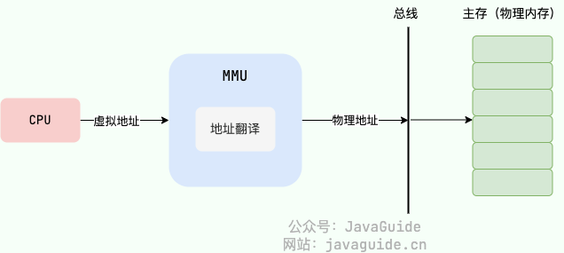

通过 MMU 将虚拟地址转换为物理地址后，再通过总线传到物理内存设备，进而完成相应的物理内存读写请求。

MMU 将虚拟地址翻译为物理地址的主要机制有两种: **分段机制** 和 **分页机制** 。

#### 什么是虚拟地址空间和物理地址空间？

- 虚拟地址空间是虚拟地址的集合，是虚拟内存的范围。每一个进程都有一个一致且私有的虚拟地址空间。
- 物理地址空间是物理地址的集合，是物理内存的范围。

#### 虚拟地址与物理内存地址是如何映射的？

MMU 将虚拟地址翻译为物理地址的主要机制有 3 种:

1. 分段机制
2. 分页机制
3. 段页机制

其中，现代操作系统广泛采用分页机制

### 分段机制

**分段机制（Segmentation）** 以段(一段 **连续** 的物理内存)的形式管理/分配物理内存。应用程序的虚拟地址空间被分为大小不等的段，段是有实际意义的，每个段定义了一组逻辑信息，例如有主程序段 MAIN、子程序段 X、数据段 D 及栈段 S 等。

#### 段表有什么用？地址翻译过程是怎样的？

分段管理通过 **段表（Segment Table）** 映射虚拟地址和物理地址。

分段机制下的虚拟地址由两部分组成：

- **段号**：标识着该虚拟地址属于整个虚拟地址空间中的哪一个段。
- **段内偏移量**：相对于该段起始地址的偏移量。

具体的地址翻译过程如下：

1. MMU 首先解析得到虚拟地址中的段号；
2. 通过段号去该应用程序的段表中取出对应的段信息（找到对应的段表项）；
3. 从段信息中取出该段的起始地址（物理地址）加上虚拟地址中的段内偏移量得到最终的物理地址。

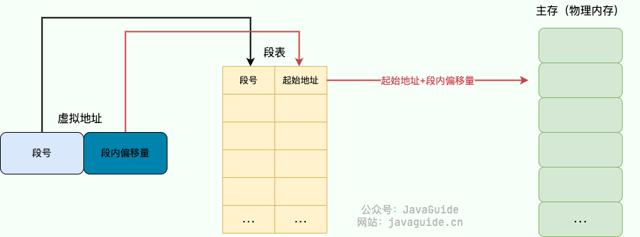

段表中还存有诸如段长(可用于检查虚拟地址是否超出合法范围)、段类型（该段的类型，例如代码段、数据段等）等信息。

#### 分段机制为什么会导致内存外部碎片？

分段机制容易出现外部内存碎片，即在段与段之间留下碎片空间(不足以映射给虚拟地址空间中的段)。从而造成物理内存资源利用率的降低。

举个例子：假设可用物理内存为 5G 的系统使用分段机制分配内存。现在有 4 个进程，每个进程的内存占用情况如下：

- 进程 1：0~1G（第 1 段）
- 进程 2：1~3G（第 2 段）
- 进程 3：3~4.5G（第 3 段）
- 进程 4：4.5~5G（第 4 段）

此时，我们关闭了进程 1 和进程 4，则第 1 段和第 4 段的内存会被释放，空闲物理内存还有 1.5G。由于这 1.5G 物理内存并不是连续的，导致没办法将空闲的物理内存分配给一个需要 1.5G 物理内存的进程。

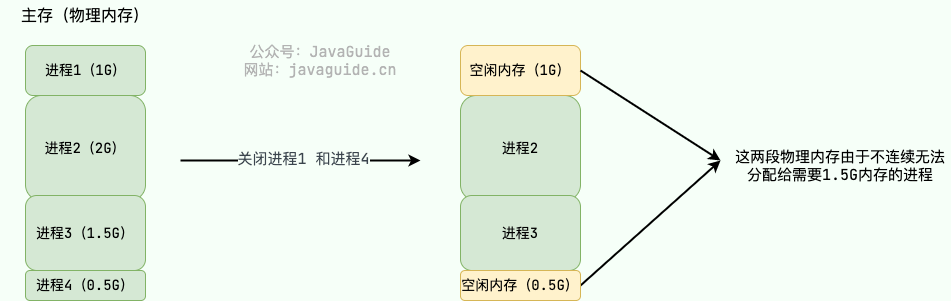

### 分页机制

**分页机制（Paging）** 把主存（物理内存）分为连续等长的物理页，应用程序的虚拟地址空间划也被分为连续等长的虚拟页。现代操作系统广泛采用分页机制。

**注意：这里的页是连续等长的，不同于分段机制下不同长度的段。**

在分页机制下，应用程序虚拟地址空间中的任意虚拟页可以被映射到物理内存中的任意物理页上，因此可以实现物理内存资源的离散分配。分页机制按照固定页大小分配物理内存，使得物理内存资源易于管理，可有效避免分段机制中外部内存碎片的问题。

#### 页表有什么用？地址翻译过程是怎样的？

分页管理通过 **页表（Page Table）** 映射虚拟地址和物理地址。我这里画了一张基于单级页表进行地址翻译的示意图。

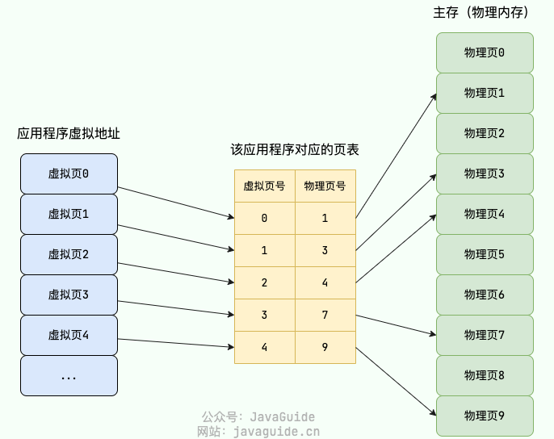

在分页机制下，每个进程都会有一个对应的页表。

分页机制下的虚拟地址由两部分组成：

- **页号**：通过虚拟页号可以从页表中取出对应的物理页号；
- **页内偏移量**：物理页起始地址+页内偏移量=物理内存地址。

具体的地址翻译过程如下：

1. MMU 首先解析得到虚拟地址中的虚拟页号；
2. 通过虚拟页号去该应用程序的页表中取出对应的物理页号（找到对应的页表项）；
3. 用该物理页号对应的物理页起始地址（物理地址）加上虚拟地址中的页内偏移量得到最终的物理地址。

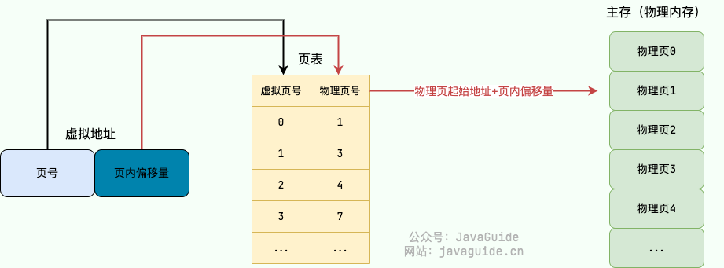

#### 单级页表有什么问题？为什么需要多级页表？

以 32 位的环境为例，虚拟地址空间范围共有 2^32（4G）。假设 一个页的大小是 2^12（4KB），那页表项共有 4G / 4K = 2^20 个。每个页表项为一个地址，占用 4 字节，`(2^20 * 2^2) / (1024 * 1024)= 4MB`。也就是说一个程序啥都不干，页表大小就得占用 4M。

系统运行的应用程序多起来的话，页表的开销还是非常大的。而且，绝大部分应用程序可能只能用到页表中的几项，其他的白白浪费了。

为了解决这个问题，操作系统引入了 **多级页表** ，多级页表对应多个页表，每个页表与前一个页表相关联。32 位系统一般为二级页表，64 位系统一般为四级页表。

这里以二级页表为例进行介绍：二级列表分为一级页表和二级页表。一级页表共有 1024 个页表项，一级页表又关联二级页表，二级页表同样共有 1024 个页表项。二级页表中的一级页表项是一对多的关系，二级页表按需加载（只会用到很少一部分二级页表），进而节省空间占用。

假设只需要 2 个二级页表，那两级页表的内存占用情况为: 4KB（一级页表占用） + 4KB * 2（二级页表占用） = 12 KB。

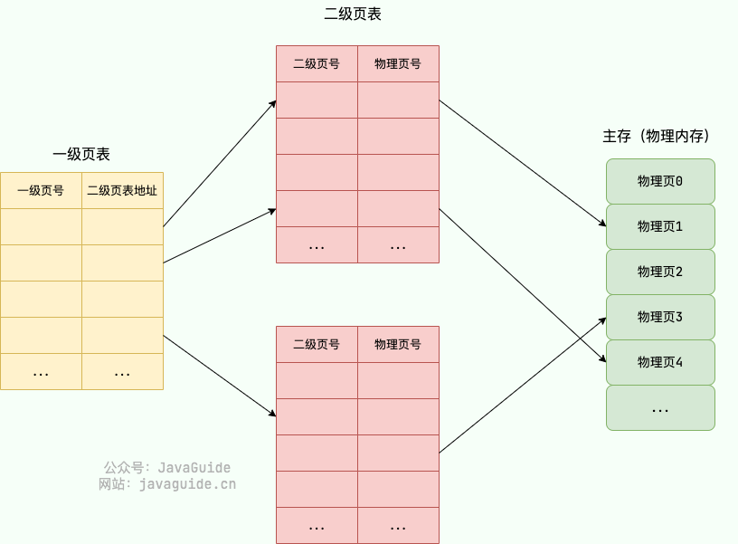

多级页表属于时间换空间的典型场景，利用增加页表查询的次数减少页表占用的空间。

#### TLB 有什么用？使用 TLB 之后的地址翻译流程是怎样的？

为了提高虚拟地址到物理地址的转换速度，操作系统在 **页表方案** 基础之上引入了 **转址旁路缓存(Translation Lookaside Buffer，TLB，也被称为快表)** 。

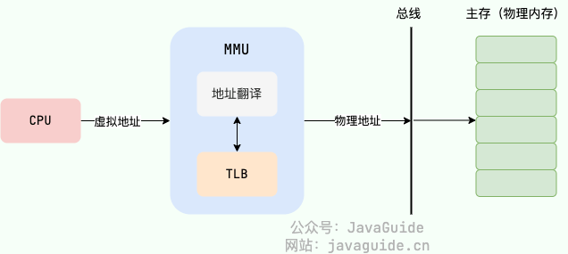

在主流的 AArch64 和 x86-64 体系结构下，TLB 属于 (Memory Management Unit，内存管理单元) 内部的单元，本质上就是一块高速缓存（Cache），缓存了虚拟页号到物理页号的映射关系，你可以将其简单看作是存储着键（虚拟页号）值（物理页号）对的哈希表。

使用 TLB 之后的地址翻译流程是这样的：

1. 用虚拟地址中的虚拟页号作为 key 去 TLB 中查询；
2. 如果能查到对应的物理页的话，就不用再查询页表了，这种情况称为 TLB 命中（TLB hit)。
3. 如果不能查到对应的物理页的话，还是需要去查询主存中的页表，同时将页表中的该映射表项添加到 TLB 中，这种情况称为 TLB 未命中（TLB miss)。
4. 当 TLB 填满后，又要登记新页时，就按照一定的淘汰策略淘汰掉快表中的一个页。

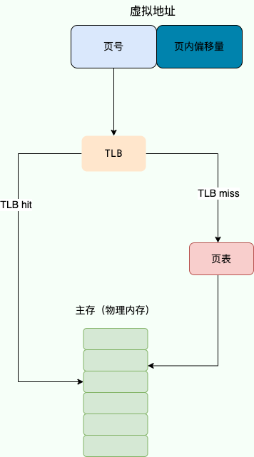

由于页表也在主存中，因此在没有 TLB 之前，每次读写内存数据时 CPU 要访问两次主存。有了 TLB 之后，对于存在于 TLB 中的页表数据只需要访问一次主存即可。TLB 的设计思想非常简单，但命中率往往非常高，效果很好。这就是因为被频繁访问的页就是其中的很小一部分。

#### 换页机制有什么用？

换页机制的思想是当物理内存不够用的时候，操作系统选择将一些物理页的内容放到磁盘上去，等要用到的时候再将它们读取到物理内存中。也就是说，换页机制利用磁盘这种较低廉的存储设备扩展的物理内存。

这也就解释了一个日常使用电脑常见的问题：为什么操作系统中所有进程运行所需的物理内存即使比真实的物理内存要大一些，这些进程也是可以正常运行的，只是运行速度会变慢。

这同样是一种时间换空间的策略，你用 CPU 的计算时间，页的调入调出花费的时间，换来了一个虚拟的更大的物理内存空间来支持程序的运行。

#### 什么是页缺失？

根据维基百科:

> 页缺失（Page Fault，又名硬错误、硬中断、分页错误、寻页缺失、缺页中断、页故障等）指的是当软件试图访问已映射在虚拟地址空间中，但是目前并未被加载在物理内存中的一个分页时，由 MMU 所发出的中断。

常见的页缺失有下面这两种：

- **硬性页缺失（Hard Page Fault）**：物理内存中没有对应的物理页。于是，Page Fault Handler 会指示 CPU 从已经打开的磁盘文件中读取相应的内容到物理内存，而后交由 MMU 建立相应的虚拟页和物理页的映射关系。
- **软性页缺失（Soft Page Fault）**：物理内存中有对应的物理页，但虚拟页还未和物理页建立映射。于是，Page Fault Handler 会指示 MMU 建立相应的虚拟页和物理页的映射关系。

发生上面这两种缺页错误的时候，应用程序访问的是有效的物理内存，只是出现了物理页缺失或者虚拟页和物理页的映射关系未建立的问题。如果应用程序访问的是无效的物理内存的话，还会出现 **无效缺页错误（Invalid Page Fault）** 。

#### 常见的页面置换算法有哪些?

当发生硬性页缺失时，如果物理内存中没有空闲的物理页面可用的话。操作系统就必须将物理内存中的一个物理页淘汰出去，这样就可以腾出空间来加载新的页面了。

用来选择淘汰哪一个物理页的规则叫做 **页面置换算法** ，我们可以把页面置换算法看成是淘汰物物理页的规则。

页缺失太频繁的发生会非常影响性能，一个好的页面置换算法应该是可以减少页缺失出现的次数。

常见的页面置换算法有下面这 5 种（其他还有很多页面置换算法都是基于这些算法改进得来的）：

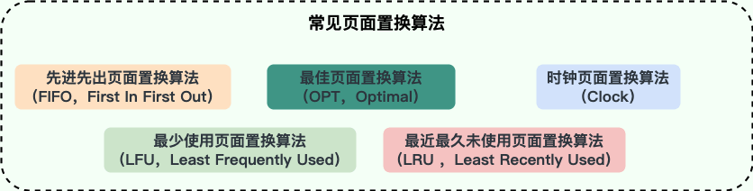

- **最佳页面置换算法（OPT，Optimal）**：优先选择淘汰的页面是以后永不使用的，或者是在最长时间内不再被访问的页面，这样可以保证获得最低的缺页率。但由于人们目前无法预知进程在内存下的若干页面中哪个是未来最长时间内不再被访问的，因而该算法无法实现，只是理论最优的页面置换算法，可以作为衡量其他置换算法优劣的标准。
- **先进先出页面置换算法（FIFO，First In First Out）** : 最简单的一种页面置换算法，总是淘汰最先进入内存的页面，即选择在内存中驻留时间最久的页面进行淘汰。该算法易于实现和理解，一般只需要通过一个 FIFO 队列即可满足需求。不过，它的性能并不是很好。
- **最近最久未使用页面置换算法（LRU ，Least Recently Used）**：LRU 算法赋予每个页面一个访问字段，用来记录一个页面自上次被访问以来所经历的时间 T，当须淘汰一个页面时，选择现有页面中其 T 值最大的，即最近最久未使用的页面予以淘汰。LRU 算法是根据各页之前的访问情况来实现，因此是易于实现的。OPT 算法是根据各页未来的访问情况来实现，因此是不可实现的。
- **最少使用页面置换算法（LFU，Least Frequently Used）** : 和 LRU 算法比较像，不过该置换算法选择的是之前一段时间内使用最少的页面作为淘汰页。
- **时钟页面置换算法（Clock）**：可以认为是一种最近未使用算法，即逐出的页面都是最近没有使用的那个。

**哪一种页面置换算法实际用的比较多？**

LRU 算法是实际使用中应用的比较多，也被认为是最接近 OPT 的页面置换算法。

### 分页机制和分段机制有哪些共同点和区别？

**共同点**：

- 都是非连续内存管理的方式。
- 都采用了地址映射的方法，将虚拟地址映射到物理地址，以实现对内存的管理和保护。

**区别**：

- 分页机制以页面为单位进行内存管理，而分段机制以段为单位进行内存管理。页的大小是固定的，由操作系统决定，通常为 2 的幂次方。而段的大小不固定，取决于我们当前运行的程序。
- 页是物理单位，即操作系统将物理内存划分成固定大小的页面，每个页面的大小通常是 2 的幂次方，例如 4KB、8KB 等等。而段则是逻辑单位，是为了满足程序对内存空间的逻辑需求而设计的，通常根据程序中数据和代码的逻辑结构来划分。
- 分段机制容易出现外部内存碎片，即在段与段之间留下碎片空间(不足以映射给虚拟地址空间中的段)。分页机制解决了外部内存碎片的问题，但仍然可能会出现内部内存碎片。
- 分页机制采用了页表来完成虚拟地址到物理地址的映射，页表通过一级页表和二级页表来实现多级映射；而分段机制则采用了段表来完成虚拟地址到物理地址的映射，每个段表项中记录了该段的起始地址和长度信息。
- 分页机制对程序没有任何要求，程序只需要按照虚拟地址进行访问即可；而分段机制需要程序员将程序分为多个段，并且显式地使用段寄存器来访问不同的段。

### 段页机制

结合了段式管理和页式管理的一种内存管理机制。程序视角中，内存被划分为多个逻辑段，每个逻辑段进一步被划分为固定大小的页。

在段页式机制下，地址翻译的过程分为两个步骤：

1. 段式地址映射（虚拟地址 → 线性地址）：
   - 虚拟地址 = 段选择符（段号）+ 段内偏移。
   - 根据段号查段表，找到段基址，加上段内偏移得到线性地址。
2. 页式地址映射（线性地址 → 物理地址）：
   - 线性地址 = 页号 + 页内偏移。
   - 根据页号查页表，找到物理页框号，加上页内偏移得到物理地址。

### 段页机制

结合了段式管理和页式管理的一种内存管理机制。程序视角中，内存被划分为多个逻辑段，每个逻辑段进一步被划分为固定大小的页。

在段页式机制下，地址翻译的过程分为两个步骤：

1. 段式地址映射（虚拟地址 → 线性地址）：
   - 虚拟地址 = 段选择符（段号）+ 段内偏移。
   - 根据段号查段表，找到段基址，加上段内偏移得到线性地址。
2. 页式地址映射（线性地址 → 物理地址）：
   - 线性地址 = 页号 + 页内偏移。
   - 根据页号查页表，找到物理页框号，加上页内偏移得到物理地址。

### 局部性原理

局部性原理是指在程序执行过程中，数据和指令的访问存在一定的空间和时间上的局部性特点。其中，时间局部性是指一个数据项或指令在一段时间内被反复使用的特点，空间局部性是指一个数据项或指令在一段时间内与其相邻的数据项或指令被反复使用的特点。

在分页机制中，页表的作用是将虚拟地址转换为物理地址，从而完成内存访问。在这个过程中，局部性原理的作用体现在两个方面：

- **时间局部性**：由于程序中存在一定的循环或者重复操作，因此会反复访问同一个页或一些特定的页，这就体现了时间局部性的特点。为了利用时间局部性，分页机制中通常采用缓存机制来提高页面的命中率，即将最近访问过的一些页放入缓存中，如果下一次访问的页已经在缓存中，就不需要再次访问内存，而是直接从缓存中读取。
- **空间局部性**：由于程序中数据和指令的访问通常是具有一定的空间连续性的，因此当访问某个页时，往往会顺带访问其相邻的一些页。为了利用空间局部性，分页机制中通常采用预取技术来预先将相邻的一些页读入内存缓存中，以便在未来访问时能够直接使用，从而提高访问速度。

## 文件系统

### 文件系统主要做了什么？

文件系统主要负责管理和组织计算机存储设备上的文件和目录，其功能包括以下几个方面：

- **存储管理**：将文件数据存储到物理存储介质中，并且管理空间分配，以确保每个文件都有足够的空间存储，并避免文件之间发生冲突。
- **文件管理**：文件的创建、删除、移动、重命名、压缩、加密、共享等等。
- **目录管理**：目录的创建、删除、移动、重命名等等。
- **文件访问控制**：管理不同用户或进程对文件的访问权限，以确保用户只能访问其被授权访问的文件，以保证文件的安全性和保密性。

### 硬链接和软链接有什么区别？

在 Linux/类 Unix 系统上，文件链接（File Link）是一种特殊的文件类型，可以在文件系统中指向另一个文件。常见的文件链接类型有两种：

**1、硬链接（Hard Link）**

- 在 Linux/类 Unix 文件系统中，每个文件和目录都有一个唯一的索引节点（inode）号，用来标识该文件或目录。硬链接通过 inode 节点号建立连接，硬链接和源文件的 inode 节点号相同，两者对文件系统来说是完全平等的（可以看作是互为硬链接，源头是同一份文件），删除其中任何一个对另外一个没有影响，可以通过给文件设置硬链接文件来防止重要文件被误删。
- 只有删除了源文件和所有对应的硬链接文件，该文件才会被真正删除。
- 硬链接具有一些限制，不能对目录以及不存在的文件创建硬链接，并且，硬链接也不能跨越文件系统。
- `ln` 命令用于创建硬链接。

**2、软链接（Symbolic Link 或 Symlink）**

- 软链接和源文件的 inode 节点号不同，而是指向一个文件路径。
- 源文件删除后，软链接依然存在，但是指向的是一个无效的文件路径。
- 软连接类似于 Windows 系统中的快捷方式。
- 不同于硬链接，可以对目录或者不存在的文件创建软链接，并且，软链接可以跨越文件系统。
- `ln -s` 命令用于创建软链接。

### 硬链接为什么不能跨文件系统？

我们之前提到过，硬链接是通过 inode 节点号建立连接的，而硬链接和源文件共享相同的 inode 节点号。

然而，每个文件系统都有自己的独立 inode 表，且每个 inode 表只维护该文件系统内的 inode。如果在不同的文件系统之间创建硬链接，可能会导致 inode 节点号冲突的问题，即目标文件的 inode 节点号已经在该文件系统中被使用。

### 提高文件系统性能的方式有哪些？

- **优化硬件**：使用高速硬件设备（如 SSD、NVMe）替代传统的机械硬盘，使用 RAID（Redundant Array of Independent Disks）等技术提高磁盘性能。
- **选择合适的文件系统选型**：不同的文件系统具有不同的特性，对于不同的应用场景选择合适的文件系统可以提高系统性能。
- **运用缓存**：访问磁盘的效率比较低，可以运用缓存来减少磁盘的访问次数。不过，需要注意缓存命中率，缓存命中率过低的话，效果太差。
- **避免磁盘过度使用**：注意磁盘的使用率，避免将磁盘用满，尽量留一些剩余空间，以免对文件系统的性能产生负面影响。
- **对磁盘进行合理的分区**：合理的磁盘分区方案，能够使文件系统在不同的区域存储文件，从而减少文件碎片，提高文件读写性能。

### 常见的磁盘调度算法有哪些？

磁盘调度算法是操作系统中对磁盘访问请求进行排序和调度的算法，其目的是提高磁盘的访问效率。

一次磁盘读写操作的时间由磁盘寻道/寻找时间、延迟时间和传输时间决定。磁盘调度算法可以通过改变到达磁盘请求的处理顺序，减少磁盘寻道时间和延迟时间。

常见的磁盘调度算法有下面这 6 种（其他还有很多磁盘调度算法都是基于这些算法改进得来的）：

- **先来先服务算法（First-Come First-Served，FCFS）**：按照请求到达磁盘调度器的顺序进行处理，先到达的请求的先被服务。FCFS 算法实现起来比较简单，不存在算法开销。不过，由于没有考虑磁头移动的路径和方向，平均寻道时间较长。同时，该算法容易出现饥饿问题，即一些后到的磁盘请求可能需要等待很长时间才能得到服务。
- **最短寻道时间优先算法（Shortest Seek Time First，SSTF）**：也被称为最佳服务优先（Shortest Service Time First，SSTF）算法，优先选择距离当前磁头位置最近的请求进行服务。SSTF 算法能够最小化磁头的寻道时间，但容易出现饥饿问题，即磁头附近的请求不断被服务，远离磁头的请求长时间得不到响应。实际应用中，需要优化一下该算法的实现，避免出现饥饿问题。
- **扫描算法（SCAN）**：也被称为电梯（Elevator）算法，基本思想和电梯非常类似。磁头沿着一个方向扫描磁盘，如果经过的磁道有请求就处理，直到到达磁盘的边界，然后改变移动方向，依此往复。SCAN 算法能够保证所有的请求得到服务，解决了饥饿问题。但是，如果磁头从一个方向刚扫描完，请求才到的话。这个请求就需要等到磁头从相反方向过来之后才能得到处理。
- **循环扫描算法（Circular Scan，C-SCAN）**：SCAN 算法的变体，只在磁盘的一侧进行扫描，并且只按照一个方向扫描，直到到达磁盘边界，然后回到磁盘起点，重新开始循环。
- **边扫描边观察算法（LOOK）**：SCAN 算法中磁头到了磁盘的边界才改变移动方向，这样可能会做很多无用功，因为磁头移动方向上可能已经没有请求需要处理了。LOOK 算法对 SCAN 算法进行了改进，如果磁头移动方向上已经没有别的请求，就可以立即改变磁头移动方向，依此往复。也就是边扫描边观察指定方向上还有无请求，因此叫 LOOK。
- **均衡循环扫描算法（C-LOOK）**：C-SCAN 只有到达磁盘边界时才能改变磁头移动方向，并且磁头返回时也需要返回到磁盘起点，这样可能会做很多无用功。C-LOOK 算法对 C-SCAN 算法进行了改进，如果磁头移动的方向上已经没有磁道访问请求了，就可以立即让磁头返回，并且磁头只需要返回到有磁道访问请求的位置即可。

### inode 介绍

inode 是 Linux/Unix 文件系统的基础。那 inode 到是什么?有什么作用呢?

通过以下五点可以概括 inode 到底是什么：

1. 硬盘以扇区 (Sector) 为最小物理存储单位，而操作系统和文件系统以块 (Block) 为单位进行读写，块由多个扇区组成。文件数据存储在这些块中。现代硬盘扇区通常为 4KB，与一些常见块大小相同，但操作系统也支持更大的块大小，以提升大文件读写性能。文件元信息（例如权限、大小、修改时间以及数据块位置）存储在 inode（索引节点）中。每个文件都有唯一的 inode。inode 本身不存储文件数据，而是存储指向数据块的指针，操作系统通过这些指针找到并读取文件数据。 固态硬盘 (SSD) 虽然没有物理扇区，但使用逻辑块，其概念与传统硬盘的块类似。
2. inode 是一种固定大小的数据结构，其大小在文件系统创建时就确定了，并且在文件的生命周期内保持不变。
3. inode 的访问速度非常快，因为系统可以直接通过 inode 号码定位到文件的元数据信息，无需遍历整个文件系统。
4. inode 的数量是有限的，每个文件系统只能包含固定数量的 inode。这意味着当文件系统中的 inode 用完时，无法再创建新的文件或目录，即使磁盘上还有可用空间。因此，在创建文件系统时，需要根据文件和目录的预期数量来合理分配 inode 的数量。
5. 可以使用 `stat` 命令可以查看文件的 inode 信息，包括文件的 inode 号、文件类型、权限、所有者、文件大小、修改时间。

简单来说：inode 就是用来维护某个文件被分成几块、每一块在的地址、文件拥有者，创建时间，权限，大小等信息。

再总结一下 inode 和 block：

- **inode**：记录文件的属性信息，可以使用 `stat` 命令查看 inode 信息。
- **block**：实际文件的内容，如果一个文件大于一个块时候，那么将占用多个 block，但是一个块只能存放一个文件。（因为数据是由 inode 指向的，如果有两个文件的数据存放在同一个块中，就会乱套了）

可以看出，Linux/Unix 操作系统使用 inode 区分不同的文件。这样做的好处是，即使文件名被修改或删除，文件的 inode 号码不会改变，从而可以避免一些因文件重命名、移动或删除导致的错误。同时，inode 也可以提供更高的文件系统性能，因为 inode 的访问速度非常快，可以直接通过 inode 号码定位到文件的元数据信息，无需遍历整个文件系统。

不过，使用 inode 号码也使得文件系统在用户和应用程序层面更加抽象和复杂，需要通过系统命令或文件系统接口来访问和管理文件的 inode 信息。

