# 数据库

## 数据库范式了解吗?

**第一范式（1NF）— 原子性**

**要求：** 每个字段的值必须是不可再分的原子值，不允许重复组或多值字段。

**第二范式（2NF）— 消除部分依赖**

**要求：** 在满足 1NF 的基础上，每个非主键字段必须**完全依赖**于整个主键（针对复合主键）。

**第三范式（3NF）— 消除传递依赖**

**要求：** 在满足 2NF 的基础上，非主键字段之间不能存在依赖关系（不能通过另一个非主键字段间接依赖主键）。

实际工程中有时会适当**反范式化**（如冗余某些字段），以换取查询性能，这是一种在规范性和性能之间的权衡。

### 三范式对比总结

| 范式 | 解决的问题 | 核心规则                     |
| ---- | ---------- | ---------------------------- |
| 1NF  | 字段不原子 | 字段值不可再分               |
| 2NF  | 部分依赖   | 非主键完全依赖主键           |
| 3NF  | 传递依赖   | 非主键只依赖主键，不互相依赖 |


## 主键和外键

**主键 (Primary Key):** 它的核心作用是唯一标识表中的每一行数据。因此，主键列的值必须是唯一的 (Unique) 且不能为空 (Not Null)。一张表只能有一个主键。主键保证了实体完整性。

**外键 (Foreign Key):** 它的核心作用是建立并强制两张表之间的关联关系。一张表中的外键列，其值必须对应另一张表中某行的候选键值（通常是主键，也可以是唯一键），或者是一个 NULL 值。因此，外键的值可以重复，也可以为空。一张表可以有多个外键，分别关联到不同的表。外键保证了引用完整性。

## 为什么不推荐使用外键与级联？

对于外键和级联，阿里巴巴开发手册这样说到：

> 【强制】不得使用外键与级联，一切外键概念必须在应用层解决。
>
> 说明: 以学生和成绩的关系为例，学生表中的 student_id 是主键，那么成绩表中的 student_id 则为外键。如果更新学生表中的 student_id，同时触发成绩表中的 student_id 更新，即为级联更新。外键与级联更新适用于单机低并发，不适合分布式、高并发集群；级联更新是强阻塞，存在数据库更新风暴的风险；外键影响数据库的插入速度


## 为什么不推荐使用存储过程？

然而，在现代互联网架构中，存储过程的使用越来越少。主要原因包括：调试困难，缺乏成熟的调试工具；扩展性差，修改业务逻辑需要直接修改数据库对象；移植性差，不同数据库系统的存储过程语法差异较大；占用数据库资源，增加数据库服务器负担；版本管理困难，不便于进行代码版本控制。

## DML 语句和 DDL 语句区别是？

- DML 是数据库操作语言（Data Manipulation Language）的缩写，是指对数据库中表记录的操作，主要包括表记录的插入、更新、删除和查询，是开发人员日常使用最频繁的操作。
- DDL （Data Definition Language）是数据定义语言的缩写，简单来说，就是对数据库内部的对象进行创建、删除、修改的操作语言。它和 DML 语言的最大区别是 DML 只是对表内部数据的操作，而不涉及到表的定义、结构的修改，更不会涉及到其他对象。DDL 语句更多的被数据库管理员（DBA）所使用，一般的开发人员很少使用。

## SQL 和 NoSQL 有什么区别？

|              | SQL 数据库                                                   | NoSQL 数据库                                                 |
| :----------- | ------------------------------------------------------------ | ------------------------------------------------------------ |
| 数据存储模型 | 结构化存储，具有固定行和列的表格                             | 非结构化存储。文档：JSON 文档，键值：键值对，宽列：包含行和动态列的表，图：节点和边 |
| 发展历程     | 开发于 1970 年代，重点是减少数据重复                         | 开发于 2000 年代后期，重点是提升可扩展性，减少大规模数据的存储成本 |
| 例子         | Oracle、MySQL、Microsoft SQL Server、PostgreSQL              | 文档：MongoDB、CouchDB，键值：Redis、DynamoDB，宽列：Cassandra、 HBase，图表：Neo4j、 Amazon Neptune、Giraph |
| ACID 属性    | 提供原子性、一致性、隔离性和持久性 (ACID) 属性               | 通常不支持 ACID 事务，为了可扩展、高性能进行了权衡，少部分支持比如 MongoDB 。不过，MongoDB 对 ACID 事务 的支持和 MySQL 还是有所区别的。 |
| 性能         | 性能通常取决于磁盘子系统。要获得最佳性能，通常需要优化查询、索引和表结构。 | 性能通常由底层硬件集群大小、网络延迟以及调用应用程序来决定。 |
| 扩展         | 垂直（使用性能更强大的服务器进行扩展）、读写分离、分库分表   | 横向（增加服务器的方式横向扩展，通常是基于分片机制）         |
| 用途         | 普通企业级的项目的数据存储                                   | 用途广泛比如图数据库支持分析和遍历连接数据之间的关系、键值数据库可以处理大量数据扩展和极高的状态变化 |
| 查询语法     | 结构化查询语言 (SQL)                                         | 数据访问语法可能因数据库而异                                 |

## NoSQL 数据库有什么优势？

- **灵活性：** NoSQL 数据库通常提供灵活的架构，以实现更快速、更多的迭代开发。灵活的数据模型使 NoSQL 数据库成为半结构化和非结构化数据的理想之选。
- **可扩展性：** NoSQL 数据库通常被设计为通过使用分布式硬件集群来横向扩展，而不是通过添加昂贵和强大的服务器来纵向扩展。
- **高性能：** NoSQL 数据库针对特定的数据模型和访问模式进行了优化，这与尝试使用关系数据库完成类似功能相比可实现更高的性能。
- **强大的功能：** NoSQL 数据库提供功能强大的 API 和数据类型，专门针对其各自的数据模型而构建。


## MySQL

**第一，从生态和成本角度看，它的护城河非常深。**

- **开源免费：** 这是它得以广泛普及的基石。任何公司和个人都可以免费使用，极大地降低了技术门槛和初期成本。
- **社区庞大，生态完善：** 经过几十年的发展，MySQL 拥有极其活跃的社区和丰富的生态系统。这意味着无论你遇到什么问题，几乎都能在网上找到解决方案；同时，市面上所有的主流编程语言、框架、ORM 工具、监控系统都对 MySQL 有完美的支持。它的文档也非常丰富，学习资源唾手可得。

**第二，从核心技术功能上看，它非常强大且均衡。**

- **强大的事务支持：** 这是它作为关系型数据库的立身之本。值得一提的是，InnoDB 默认的可重复读（REPEATABLE-READ）隔离级别，通过 MVCC 和 Next-Key Lock 机制，很大程度上避免了幻读问题，这在很多其他数据库中都需要更高的隔离级别才能做到，兼顾了性能和一致性。
- **优秀的性能和可扩展性：** MySQL 本身经过了海量互联网业务的严酷考验，单机性能非常出色。更重要的是，它围绕着水平扩展，形成了一套非常成熟的架构方案，比如主从复制、读写分离、以及通过中间件实现的分库分表。这让它能够支撑从初创公司到大型互联网平台的各种规模的业务。

**第三，从运维和使用角度看，它非常‘亲民’。**

- **开箱即用，上手简单：** 相比于 Oracle 等大型商业数据库，MySQL 的安装、配置和日常使用都非常简单直观，学习曲线平缓，对于开发者和初级 DBA 非常友好。
- **维护成本低：** 由于其简单性和庞大的社区，找到相关的运维人才和解决方案都相对容易，整体的维护成本也更低。

### MySQL 字段类型

**数值类型**：整型（TINYINT、SMALLINT、MEDIUMINT、INT 和 BIGINT）、浮点型（FLOAT 和 DOUBLE）、定点型（DECIMAL）

**字符串类型**：CHAR、VARCHAR、TINYTEXT、TEXT、MEDIUMTEXT、LONGTEXT、TINYBLOB、BLOB、MEDIUMBLOB 和 LONGBLOB 等，最常用的是 CHAR 和 VARCHAR。

**日期时间类型**：YEAR、TIME、DATE、DATETIME 和 TIMESTAMP 等。

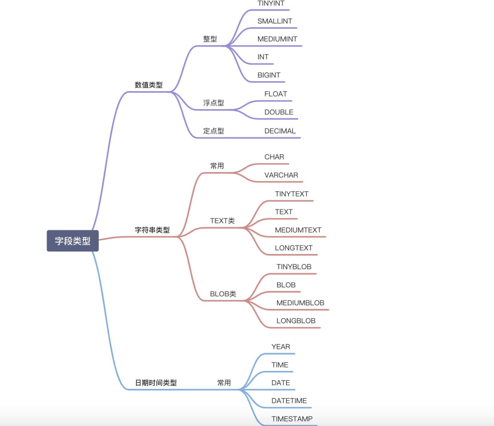


### 整数类型的 UNSIGNED 属性有什么用？

MySQL 中的整数类型可以使用可选的 UNSIGNED 属性来表示不允许负值的无符号整数。使用 UNSIGNED 属性可以将正整数的上限提高一倍，因为它不需要存储负数值。

例如， TINYINT UNSIGNED 类型的取值范围是 0 ~ 255，而普通的 TINYINT 类型的值范围是 -128 ~ 127。INT UNSIGNED 类型的取值范围是 0 ~ 4,294,967,295，而普通的 INT 类型的值范围是 -2,147,483,648 ~ 2,147,483,647。

对于从 0 开始递增的 ID 列，使用 UNSIGNED 属性可以非常适合，因为不允许负值并且可以拥有更大的上限范围，提供了更多的 ID 值可用。


### CHAR 和 VARCHAR 的区别是什么？

CHAR 和 VARCHAR 是最常用到的字符串类型，两者的主要区别在于：**CHAR 是定长字符串，VARCHAR 是变长字符串。**

CHAR 在存储时会在右边填充空格以达到指定的长度，检索时会去掉空格；VARCHAR 在存储时需要使用 1 或 2 个额外字节记录字符串的长度，检索时不需要处理。

CHAR 更适合存储长度较短或者长度都差不多的字符串，例如 Bcrypt 算法、MD5 算法加密后的密码、身份证号码。VARCHAR 类型适合存储长度不确定或者差异较大的字符串，例如用户昵称、文章标题等。

CHAR(M) 和 VARCHAR(M) 的 M 都代表能够保存的字符数的最大值，无论是字母、数字还是中文，每个都只占用一个字符。

### VARCHAR(100)和 VARCHAR(10)的区别是什么？

VARCHAR(100)和 VARCHAR(10)都是变长类型，表示能存储最多 100 个字符和 10 个字符。因此，VARCHAR (100) 可以满足更大范围的字符存储需求，有更好的业务拓展性。而 VARCHAR(10)存储超过 10 个字符时，就需要修改表结构才可以。

虽说 VARCHAR(100)和 VARCHAR(10)能存储的字符范围不同，但二者存储相同的字符串，所占用磁盘的存储空间其实是一样的，这也是很多人容易误解的一点。

不过，VARCHAR(100) 会消耗更多的内存。这是因为 VARCHAR 类型在内存中操作时，通常会分配固定大小的内存块来保存值，即使用字符类型中定义的长度。例如在进行排序的时候，VARCHAR(100)是按照 100 这个长度来进行的，也就会消耗更多内存。

### DECIMAL 和 FLOAT/DOUBLE 的区别是什么？

DECIMAL 和 FLOAT 的区别是：**DECIMAL 是定点数，FLOAT/DOUBLE 是浮点数。DECIMAL 可以存储精确的小数值，FLOAT/DOUBLE 只能存储近似的小数值。**

DECIMAL 用于存储具有精度要求的小数，例如与货币相关的数据，可以避免浮点数带来的精度损失。

### 为什么不推荐使用 TEXT 和 BLOB？

TEXT 类型类似于 CHAR（0-255 字节）和 VARCHAR（0-65,535 字节），但可以存储更长的字符串，即长文本数据，例如博客内容。

| 类型       | 可存储大小           | 用途           |
| ---------- | -------------------- | -------------- |
| TINYTEXT   | 0-255 字节           | 一般文本字符串 |
| TEXT       | 0-65,535 字节        | 长文本字符串   |
| MEDIUMTEXT | 0-16,772,150 字节    | 较大文本数据   |
| LONGTEXT   | 0-4,294,967,295 字节 | 极大文本数据   |

BLOB 类型主要用于存储二进制大对象，例如图片、音视频等文件。

| 类型       | 可存储大小 | 用途                     |
| ---------- | ---------- | ------------------------ |
| TINYBLOB   | 0-255 字节 | 短文本二进制字符串       |
| BLOB       | 0-65KB     | 二进制字符串             |
| MEDIUMBLOB | 0-16MB     | 二进制形式的长文本数据   |
| LONGBLOB   | 0-4GB      | 二进制形式的极大文本数据 |

在日常开发中，很少使用 TEXT 类型，但偶尔会用到，而 BLOB 类型则基本不常用。如果预期长度范围可以通过 VARCHAR 来满足，建议避免使用 TEXT。

数据库规范通常不推荐使用 BLOB 和 TEXT 类型，这两种类型具有一些缺点和限制，例如：

- 不能有默认值。
- 在使用临时表时无法使用内存临时表，只能在磁盘上创建临时表（《高性能 MySQL》书中有提到）。
- 检索效率较低。
- 不能直接创建索引，需要指定前缀长度。
- 可能会消耗大量的网络和 IO 带宽。
- 可能导致表上的 DML 操作变慢。

### DATETIME 和 TIMESTAMP 的区别是什么？如何选择？

DATETIME 类型没有时区信息，TIMESTAMP 和时区有关。

TIMESTAMP 只需要使用 4 个字节的存储空间，但是 DATETIME 需要耗费 8 个字节的存储空间。但是，这样同样造成了一个问题，Timestamp 表示的时间范围更小。

- DATETIME：'1000-01-01 00:00:00.000000' 到 '9999-12-31 23:59:59.999999'
- Timestamp：'1970-01-01 00:00:01.000000' UTC 到 '2038-01-19 03:14:07.999999' UTC

`TIMESTAMP` 的核心优势在于其内建的时区处理能力。数据库负责 UTC 存储和基于会话时区的自动转换，简化了需要处理多时区应用的开发。如果应用需要处理多时区，或者希望数据库能自动管理时区转换，`TIMESTAMP` 是自然的选择（注意其时间范围限制，也就是 2038 年问题）。

如果应用场景不涉及时区转换，或者希望应用程序完全控制时区逻辑，并且需要表示 2038 年之后的时间，`DATETIME` 是更稳妥的选择。

### NULL 和 '' 的区别是什么？

`NULL` 和 `''` (空字符串) 是两个完全不同的值，它们分别表示不同的含义，并在数据库中有着不同的行为。`NULL` 代表缺失或未知的数据，而 `''` 表示一个已知存在的空字符串。它们的主要区别如下：

1. 含义: 
   - `NULL` 代表一个不确定的值，它不等于任何值，包括它自身。因此，`SELECT NULL = NULL` 的结果是 `NULL`，而不是 `true` 或 `false`。 `NULL` 意味着缺失或未知的信息。虽然 `NULL` 不等于任何值，但在某些操作中，数据库系统会将 `NULL` 值视为相同的类别进行处理，例如：`DISTINCT`,`GROUP BY`,`ORDER BY`。需要注意的是，这些操作将 `NULL` 值视为相同的类别进行处理，并不意味着 `NULL` 值之间是相等的。 它们只是在特定操作中被特殊处理，以保证结果的正确性和一致性。 这种处理方式是为了方便数据操作，而不是改变了 `NULL` 的语义。
   - `''` 表示一个空字符串，它是一个已知的值。

2. **存储空间**: 

   - `NULL` 的存储空间占用取决于数据库的实现，通常需要一些空间来标记该值为空。

   - `''` 的存储空间占用通常较小，因为它只存储一个空字符串的标志，不需要存储实际的字符。

3. **比较运算**: 

   - 任何值与 `NULL` 进行比较（例如 `=`, `!=`, `>`, `<` 等）的结果都是 `NULL`，表示结果不确定。要判断一个值是否为 `NULL`，必须使用 `IS NULL` 或 `IS NOT NULL`。

   - `''` 可以像其他字符串一样进行比较运算。例如，`'' = ''` 的结果是 `true`。

4. **聚合函数**: 

   - 大多数聚合函数（例如 `SUM`, `AVG`, `MIN`, `MAX`）会忽略 `NULL` 值。

   - `COUNT(*)` 会统计所有行数，包括包含 `NULL` 值的行。`COUNT(列名)` 会统计指定列中非 `NULL` 值的行数。

   - 空字符串 `''` 会被聚合函数计算在内。例如，`SUM` 会将其视为 0，`MIN` 和 `MAX` 会将其视为一个空字符串。

### Boolean 类型如何表示？

MySQL 中没有专门的布尔类型，而是用 `TINYINT(1)` 类型来表示布尔值。`TINYINT(1)` 类型可以存储 0 或 1，分别对应 false 或 true。

### 手机号存储用 INT 还是 VARCHAR？

存储手机号，**强烈推荐使用 VARCHAR 类型**，而不是 INT 或 BIGINT。主要原因如下：

1. 格式兼容性与完整性：
   - 手机号可能包含前导零（如某些地区的固话区号）、国家代码前缀（'+'），甚至可能带有分隔符（'-' 或空格）。INT 或 BIGINT 这种数字类型会自动丢失这些重要的格式信息（比如前导零会被去掉，'+' 和 '-' 无法存储）。
   - VARCHAR 可以原样存储各种格式的号码，无论是国内的 11 位手机号，还是带有国家代码的国际号码，都能完美兼容。
2. **非算术性：** 手机号虽然看起来是数字，但我们从不对它进行数学运算（比如求和、平均值）。它本质上是一个标识符，更像是一个字符串。用 VARCHAR 更符合其数据性质。

3. **查询灵活性：**

   - 业务中常常需要根据号段（前缀）进行查询，例如查找所有 "138" 开头的用户。使用 VARCHAR 类型配合 `LIKE '138%'` 这样的 SQL 查询既直观又高效。

   - 如果使用数字类型，进行类似的前缀匹配通常需要复杂的函数转换（如 CAST 或 SUBSTRING），或者使用范围查询（如 `WHERE phone >= 13800000000 AND phone < 13900000000`），这不仅写法繁琐，而且可能无法有效利用索引，导致性能下降。

4. **加密存储的要求（非常关键）：**

   - 出于数据安全和隐私合规的要求，手机号这类敏感个人信息通常必须加密存储在数据库中。

   - 加密后的数据（密文）是一长串字符串（通常由字母、数字、符号组成，或经过 Base64/Hex 编码），INT 或 BIGINT 类型根本无法存储这种密文。只有 VARCHAR、TEXT 或 BLOB 等类型可以。

## MySQL 基础架构


### MyISAM 和 InnoDB 有什么区别？

- InnoDB 支持行级别的锁粒度，MyISAM 不支持，只支持表级别的锁粒度。
- MyISAM 不提供事务支持。InnoDB 提供事务支持，实现了 SQL 标准定义了四个隔离级别。
- MyISAM 不支持外键，而 InnoDB 支持。
- MyISAM 不支持 MVCC，而 InnoDB 支持。
- 虽然 MyISAM 引擎和 InnoDB 引擎都是使用 B+Tree 作为索引结构，但是两者的实现方式不太一样。
- MyISAM 不支持数据库异常崩溃后的安全恢复，而 InnoDB 支持。
- InnoDB 的性能比 MyISAM 更强大。

### 索引是什么？

**索引是一种用于快速查询和检索数据的数据结构，其本质可以看成是一种排序好的数据结构。**

- **查询速度起飞 (主要目的)**：通过索引，数据库可以**大幅减少需要扫描的数据量**，直接定位到符合条件的记录，从而显著加快数据检索速度，减少磁盘 I/O 次数。
- **保证数据唯一性**：通过创建**唯一索引 (Unique Index)**,可以确保表中的某一列（或几列组合）的值是独一无二的，比如用户 ID、邮箱等。主键本身就是一种唯一索引。
- **加速排序和分组**：如果查询中的 ORDER BY 或 GROUP BY 子句涉及的列建有索引，数据库往往可以直接利用索引已经排好序的特性，避免额外的排序操作，从而提升性能。

- **创建和维护耗时**：创建索引本身需要时间，特别是对大表操作时。更重要的是，当对表中的数据进行**增、删、改 (DML 操作)** 时，不仅要操作数据本身，相关的索引也必须动态更新和维护，这会**降低这些 DML 操作的执行效率**。
- **占用存储空间**：索引本质上也是一种数据结构，需要以物理文件（或内存结构）的形式存储，因此会**额外占用一定的磁盘空间**。索引越多、越大，占用的空间也就越多。
- **可能被误用或失效**：如果索引设计不当，或者查询语句写得不好，数据库优化器可能不会选择使用索引（或者选错索引），反而导致性能下降。


### 索引底层数据结构选型

#### Hash 表

哈希表是键值对的集合，通过键(key)即可快速取出对应的值(value)，因此哈希表可以快速检索数据（接近 O(1)）。

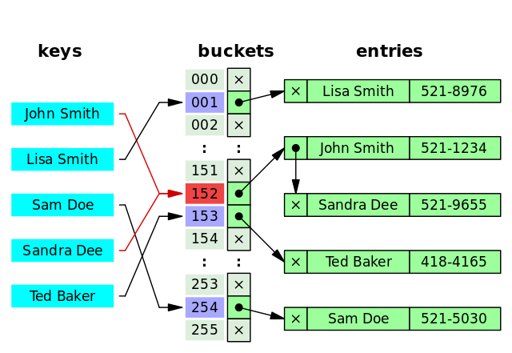


MySQL 的 InnoDB 存储引擎不直接支持常规的哈希索引，但是，InnoDB 存储引擎中存在一种特殊的“自适应哈希索引”（Adaptive Hash Index），自适应哈希索引并不是传统意义上的纯哈希索引，而是结合了 B+Tree 和哈希索引的特点，以便更好地适应实际应用中的数据访问模式和性能需求。自适应哈希索引的每个哈希桶实际上是一个小型的 B+Tree 结构。这个 B+Tree 结构可以存储多个键值对，而不仅仅是一个键。这有助于减少哈希冲突链的长度，提高了索引的效率。

既然哈希表这么快，**为什么 MySQL 没有使用其作为索引的数据结构呢？** 主要是因为 Hash 索引不支持顺序和范围查询。假如我们要对表中的数据进行排序或者进行范围查询，那 Hash 索引可就不行了。并且，每次 IO 只能取一个。

#### 二叉查找树（BST）

二叉查找树（Binary Search Tree）是一种基于二叉树的数据结构，它具有以下特点：

1. 左子树所有节点的值均小于根节点的值。
2. 右子树所有节点的值均大于根节点的值。
3. 左右子树也分别为二叉查找树。

当二叉查找树是平衡的时候，也就是树的每个节点的左右子树深度相差不超过 1 的时候，查询的时间复杂度为 O(log2(N))，具有比较高的效率。然而，当二叉查找树不平衡时，例如在最坏情况下（有序插入节点），树会退化成线性链表（也被称为斜树），导致查询效率急剧下降，时间复杂退化为 O(N)。

也就是说，**二叉查找树的性能非常依赖于它的平衡程度，这就导致其不适合作为 MySQL 底层索引的数据结构。**

为了解决这个问题，并提高查询效率，人们发明了多种在二叉查找树基础上的改进型数据结构，如平衡二叉树、B-Tree、B+Tree 等。


#### AVL 树

AVL 树是计算机科学中最早被发明的自平衡二叉查找树，它的名称来自于发明者 G.M. Adelson-Velsky 和 E.M. Landis 的名字缩写。AVL 树的特点是保证任何节点的左右子树高度之差不超过 1，因此也被称为高度平衡二叉树，它的查找、插入和删除在平均和最坏情况下的时间复杂度都是 O(logn)。

由于 AVL 树需要频繁地进行旋转操作来保持平衡，因此会有较大的计算开销进而降低了数据库写操作的性能。并且， 在使用 AVL 树时，每个树节点仅存储一个数据，而每次进行磁盘 IO 时只能读取一个节点的数据，如果需要查询的数据分布在多个节点上，那么就需要进行多次磁盘 IO。**磁盘 IO 是一项耗时的操作，在设计数据库索引时，我们需要优先考虑如何最大限度地减少磁盘 IO 操作的次数。**

#### 红黑树

红黑树是一种自平衡二叉查找树，通过在插入和删除节点时进行颜色变换和旋转操作，使得树始终保持平衡状态，它具有以下特点：

1. 每个节点非红即黑；
2. 根节点总是黑色的；
3. 每个叶子节点都是黑色的空节点（NIL 节点）；
4. 如果节点是红色的，则它的子节点必须是黑色的（反之不一定）；
5. 从任意节点到它的叶子节点或空子节点的每条路径，必须包含相同数目的黑色节点（即相同的黑色高度）。

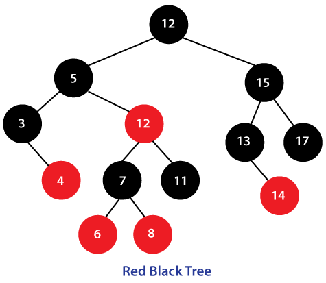

和 AVL 树不同的是，红黑树并不追求严格的平衡，而是大致的平衡。正因如此，红黑树的查询效率稍有下降，因为红黑树的平衡性相对较弱，可能会导致树的高度较高，这可能会导致一些数据需要进行多次磁盘 IO 操作才能查询到，这也是 MySQL 没有选择红黑树的主要原因。也正因如此，红黑树的插入和删除操作效率大大提高了，因为红黑树在插入和删除节点时只需进行 O(1) 次数的旋转和变色操作，即可保持基本平衡状态，而不需要像 AVL 树一样进行 O(logn) 次数的旋转操作。

#### B 树& B+ 树

B 树也称 B- 树，全称为 **多路平衡查找树**，B+ 树是 B 树的一种变体。B 树和 B+ 树中的 B 是 `Balanced`（平衡）的意思。

**B 树& B+ 树两者有何异同呢？**

- B 树的所有节点既存放键(key)也存放数据(data)，而 B+ 树只有叶子节点存放 key 和 data，其他内节点只存放 key。
- B 树的叶子节点都是独立的；B+ 树的叶子节点有一条引用链指向与它相邻的叶子节点。
- B 树的检索的过程相当于对范围内的每个节点的关键字做二分查找，可能还没有到达叶子节点，检索就结束了。而 B+ 树的检索效率就很稳定了，任何查找都是从根节点到叶子节点的过程，叶子节点的顺序检索很明显。
- 在 B 树中进行范围查询时，首先找到要查找的下限，然后对 B 树进行中序遍历，直到找到查找的上限；而 B+ 树的范围查询，只需要对链表进行遍历即可。

综上，B+ 树与 B 树相比，具备更少的 IO 次数、更稳定的查询效率和更适于范围查询这些优势。

### 正确使用索引的一些建议

#### 选择合适的字段创建索引

- **不为 NULL 的字段**：索引字段的数据应该尽量不为 NULL，因为对于数据为 NULL 的字段，数据库较难优化。如果字段频繁被查询，但又避免不了为 NULL，建议使用 0、1、true、false 这样语义较为清晰的短值或短字符作为替代。
- **被频繁查询的字段**：我们创建索引的字段应该是查询操作非常频繁的字段。
- **被作为条件查询的字段**：被作为 WHERE 条件查询的字段，应该被考虑建立索引。
- **频繁需要排序的字段**：索引已经排序，这样查询可以利用索引的排序，加快排序查询时间。
- **被经常频繁用于连接的字段**：经常用于连接的字段可能是一些外键列，对于外键列并不一定要建立外键，只是说该列涉及到表与表的关系。对于频繁被连接查询的字段，可以考虑建立索引，提高多表连接查询的效率。

#### 避免索引失效

**1. SQL 写法与底层逻辑冲突（破坏 B+Tree 有序性）**

此类问题最为常见，本质是查询条件让底层的 B+Tree 失去了“二分查找”的快速定位能力。

- **违背最左前缀原则**：跳过联合索引前导列，或遇到范围查询（如 `>`、`<`、`BETWEEN`、`LIKE "abc%"`）导致后续列中断精确定位，降级为范围扫描加过滤。
- **对索引列进行加工**：在 `WHERE` 左侧对索引列进行数学计算或应用函数，导致原始数据发生逻辑改变，在索引树中呈现无序状态。
- **隐式类型转换（隐蔽且致命）**：当“字符串类型的列”去比较“数字类型的值”时，MySQL 会默认在列上套用转换函数，直接破坏树的有序性。
- **LIKE 模糊查询前置通配符**：如 `LIKE "%abc"`，前缀字符的不确定性使得优化器无法锁定扫描区间的起始点。
- **ORDER BY 排序陷阱**：排序列未命中索引、排序方向与索引结构不一致等触发额外的内存或磁盘排序（`Using filesort`）。

**2. 优化器的成本决策（基于 I/O 成本妥协）**

此类问题并非索引本身不可用，而是 MySQL 优化器经过计算后，认为“不走普通索引”整体开销反而更小。

- **无脑 `SELECT \*` 导致回表成本超载**：查询大量非索引覆盖列时，若命中数据量较大（通常超 20%~30%），优化器会判定全表扫描的顺序 I/O 优于频繁回表的随机 I/O，从而主动放弃索引。
- **`OR` 条件导致全表扫描**：只要 `OR` 连接的任意一侧条件没有对应索引，就会触发全表扫描。即使两侧都有索引，若 Index Merge（索引合并）的预期成本过高，依然会被放弃。
- **`IN` 列表过长引发估算失真**：当 `IN` 列表长度超过系统阈值（默认 200）时，优化器会从精准的深入探测（Index Dive）切换为粗略的统计估算，极易因统计信息陈旧而产生执行成本的误判。

#### 被频繁更新的字段应该慎重建立索引

虽然索引能带来查询上的效率，但是维护索引的成本也是不小的。 如果一个字段不被经常查询，反而被经常修改，那么就更不应该在这种字段上建立索引了。

#### 尽可能的考虑建立联合索引而不是单列索引

因为索引是需要占用磁盘空间的，可以简单理解为每个索引都对应着一颗 B+ 树。如果一个表的字段过多，索引过多，那么当这个表的数据达到一个体量后，索引占用的空间也是很多的，且修改索引时，耗费的时间也是较多的。如果是联合索引，多个字段在一个索引上，那么将会节约很大磁盘空间，且修改数据的操作效率也会提升。


### 索引为什么快？

索引之所以快，核心原因是它**大大减少了磁盘 I/O 的次数**。

在 MySQL 中，这个数据结构是**B+树**。B+树结构主要从两方面做了优化：

1. B+树的特点是“矮胖”，一个千万数据的表，索引树的高度可能只有 3-4 层。这意味着，最多只需要**3-4 次磁盘 I/O**，就能精确定位到我想要的数据，而全表扫描可能需要成千上万次，所以速度极快。
2. B+树的叶子节点是**用链表连起来的**。找到开头后，就能顺着链表**顺序读**下去，这对磁盘非常友好，还能触发预读。

### 为什么 InnoDB 没有使用哈希作为索引的数据结构？

1. **不支持范围查询:** 这是最主要的原因。哈希函数的一个特点是它会把相邻的输入值（比如 `id=100` 和 `id=101`）映射到哈希表中完全不相邻的位置。这种顺序的破坏，使得我们无法处理像 `WHERE age > 30` 或 `BETWEEN 100 AND 200`这样的范围查询。要完成这种查询，哈希索引只能退化为全表扫描。
2. **不支持排序:** 同理，因为哈希值是无序的，所以我们无法利用哈希索引来优化 `ORDER BY` 子句。
3. **不支持部分索引键查询:** 对于联合索引，比如`(col1, col2)`，哈希索引必须使用所有索引列进行查询，它无法单独利用 `col1` 来加速查询。
4. **哈希冲突问题:** 当不同的键产生相同的哈希值时，需要额外的链表或开放寻址来解决，这会降低性能。

### 为什么 InnoDB 没有使用 B 树作为索引的数据结构？

B 树和 B+树都是优秀的多路平衡搜索树，非常适合磁盘存储，因为它们都很“矮胖”，能最大化地利用每一次磁盘 I/O。

但 B+树是 B 树的一个增强版，它针对数据库场景做了几个关键优化：

1. **I/O 效率更高:** 在 B+树中，只有叶子节点才存储数据（或数据指针），而非叶子节点只存储索引键。因为非叶子节点不存数据，所以它们可以容纳更多的索引键。这意味着 B+树的“扇出”更大，在同样的数据量下，B+树通常会比 B 树更矮，也就意味着查找数据所需的磁盘 I/O 次数更少。
2. **查询性能更稳定:** 在 B+树中，任何一次查询都必须从根节点走到叶子节点才能找到数据，所以查询路径的长度是固定的。而在 B 树中，如果运气好，可能在非叶子节点就找到了数据，但运气不好也得走到叶子，这导致查询性能不稳定。
3. **对范围查询极其友好:** 这是 B+树最核心的优势。它的所有叶子节点之间通过一个双向链表连接。当我们执行一个范围查询（比如 `WHERE id > 100`）时，只需要通过树形结构找到 `id=100` 的叶子节点，然后就可以沿着链表向后顺序扫描，而无需再回溯到上层节点。这使得范围查询的效率大大提高。

### 什么是覆盖索引？

如果一个索引包含（或者说覆盖）所有需要查询的字段的值，我们就称之为 **覆盖索引（Covering Index）**。


### 请解释一下 MySQL 的联合索引及其最左前缀原则

使用表中的多个字段创建索引，就是 **联合索引**，也叫 **组合索引** 或 **复合索引**。

```sql
ALTER TABLE `cus_order` ADD INDEX id_score_name(score, name);
```

最左前缀匹配原则指的是在使用联合索引时，MySQL 会根据索引中的字段顺序，从左到右依次匹配查询条件中的字段。如果查询条件与索引中的最左侧字段相匹配，那么 MySQL 就会使用索引来过滤数据，这样可以提高查询效率。

### 哪些字段适合创建索引？

- **不为 NULL 的字段**：索引字段的数据应该尽量不为 NULL，因为对于数据为 NULL 的字段，数据库较难优化。如果字段频繁被查询，但又避免不了为 NULL，建议使用 0,1,true,false 这样语义较为清晰的短值或短字符作为替代。
- **被频繁查询的字段**：我们创建索引的字段应该是查询操作非常频繁的字段。
- **被作为条件查询的字段**：被作为 WHERE 条件查询的字段，应该被考虑建立索引。
- **频繁需要排序的字段**：索引已经排序，这样查询可以利用索引的排序，加快排序查询时间。
- **被经常频繁用于连接的字段**：经常用于连接的字段可能是一些外键列，对于外键列并不一定要建立外键，只是说该列涉及到表与表的关系。对于频繁被连接查询的字段，可以考虑建立索引，提高多表连接查询的效率。

### 索引失效的原因有哪些？

1. 创建了组合索引，但查询条件未遵守最左匹配原则;
2. 在索引列上进行计算、函数、类型转换等操作;
3. 以 % 开头的 LIKE 查询比如 `LIKE '%abc';`;
4. 查询条件中使用 OR，且 OR 的前后条件中有一个列没有索引，涉及的索引都不会被使用到;
5. IN 的取值范围较大时会导致索引失效，走全表扫描(NOT IN 和 IN 的失效场景相同);
6. 发生[隐式转换](https://javaguide.cn/database/mysql/index-invalidation-caused-by-implicit-conversion.html);

**隐式类型转换**

这是开发中最隐蔽的坑，**转换的方向决定了索引的生死**。

| 场景                  | 示例                | 转换方向                     | 索引是否有效 |
| --------------------- | ------------------- | ---------------------------- | ------------ |
| **字符串列 + 数字值** | `varchar_col = 123` | 字符串转数字（发生在索引列） | ❌ 失效       |
| **数字列 + 字符串值** | `int_col = '123'`   | 字符串转数字（发生在常量）   | ✅ 有效       |

**关键点**：

- 只有当**转换发生在索引列上**时，索引才会失效。
- 当字符串与数字进行比较时，MySQL 默认将字符串转换为**浮点数（DOUBLE）**进行比较（详见 [MySQL 官方文档规则 7](https://dev.mysql.com/doc/refman/8.0/en/type-conversion.html)）。对索引列发生隐式类型转换等同于在索引列上应用了不可逆的转换函数，破坏了 B+ 树的有序性，导致只能走全表扫描。
- `int_col = '123'` 会被转换为 `int_col = CAST('123' AS DOUBLE)`，转换发生在常量侧，不影响索引使用。


### 不可重复读和幻读有什么区别？

- 不可重复读的重点是内容修改或者记录减少比如多次读取一条记录发现其中某些记录的值被修改；
- 幻读的重点在于记录新增比如多次执行同一条查询语句（DQL）时，发现查到的记录增加了。

幻读其实可以看作是不可重复读的一种特殊情况，单独把幻读区分出来的原因主要是解决幻读和不可重复读的方案不一样。

举个例子：执行 `delete` 和 `update` 操作的时候，可以直接对记录加锁，保证事务安全。而执行 `insert` 操作的时候，由于记录锁（Record Lock）只能锁住已经存在的记录，为了避免插入新记录，需要依赖间隙锁（Gap Lock）。也就是说执行 `insert` 操作的时候需要依赖 Next-Key Lock（Record Lock+Gap Lock） 进行加锁来保证不出现幻读。

### 自增锁有了解吗？

```sql
CREATE TABLE `sequence_id` (
  `id` BIGINT(20) UNSIGNED NOT NULL AUTO_INCREMENT,
  `stub` CHAR(10) NOT NULL DEFAULT '',
  PRIMARY KEY (`id`),
  UNIQUE KEY `stub` (`stub`)
) ENGINE=InnoDB DEFAULT CHARSET=utf8mb4;
```

更准确点来说，不仅仅是自增主键，`AUTO_INCREMENT`的列都会涉及到自增锁，毕竟非主键也可以设置自增长。

如果一个事务正在插入数据到有自增列的表时，会先获取自增锁，拿不到就可能会被阻塞住。这里的阻塞行为只是自增锁行为的其中一种，可以理解为自增锁就是一个接口，其具体的实现有多种。具体的配置项为 `innodb_autoinc_lock_mode` （MySQL 5.1.22 引入），可以选择的值如下：

| innodb_autoinc_lock_mode | 介绍                           |
| :----------------------- | :----------------------------- |
| 0                        | 传统模式                       |
| 1                        | 连续模式（MySQL 8.0 之前默认） |
| 2                        | 交错模式(MySQL 8.0 之后默认)   |

交错模式下，所有的“INSERT-LIKE”语句（所有的插入语句，包括：`INSERT`、`REPLACE`、`INSERT…SELECT`、`REPLACE…SELECT`、`LOAD DATA`等）都不使用表级锁，使用的是轻量级互斥锁实现，多条插入语句可以并发执行，速度更快，扩展性也更好。

不过，如果你的 MySQL 数据库有主从同步需求并且 Binlog 存储格式为 Statement 的话，不要将 InnoDB 自增锁模式设置为交叉模式，不然会有数据不一致性问题。这是因为并发情况下插入语句的执行顺序就无法得到保障。

> 如果 MySQL 采用的格式为 Statement ，那么 MySQL 的主从同步实际上同步的就是一条一条的 SQL 语句。

### MySQL 如何存储 IP 地址？

可以将 IP 地址转换成整形数据存储，性能更好，占用空间也更小。

MySQL 提供了两个方法来处理 ip 地址

- `INET_ATON()`：把 ip 转为无符号整型 (4-8 位)
- `INET_NTOA()` :把整型的 ip 转为地址

插入数据前，先用 `INET_ATON()` 把 ip 地址转为整型，显示数据时，使用 `INET_NTOA()` 把整型的 ip 地址转为地址显示即可。

### binlog

redo log 它是物理日志，记录内容是“在某个数据页上做了什么修改”，属于 InnoDB 存储引擎。

而 binlog 是逻辑日志，记录内容是语句的原始逻辑，类似于“给 ID=2 这一行的 c 字段加 1”，属于`MySQL Server` 层。

不管用什么存储引擎，只要发生了表数据更新，都会产生 binlog 日志。

那 binlog 到底是用来干嘛的？

可以说 MySQL 数据库的**数据备份、主备、主主、主从**都离不开 binlog，需要依靠 binlog 来同步数据，保证数据一致性。

binlog 会记录所有涉及更新数据的逻辑操作，并且是顺序写。

#### 记录格式

binlog 日志有三种格式，可以通过`binlog_format`参数指定。

- **statement**

  记录原始 SQL 语句，日志量小，但有不确定性风险：

  ```sql
  SET binlog_format = 'STATEMENT';
  
  UPDATE orders SET status = 'paid' WHERE created_at < NOW();
  -- binlog 里记录的就是这条 SQL 本身
  -- 问题：NOW() 在主从执行时可能不一样 → 数据不一致
  ```

- **row**

  记录每一行数据的前镜像和后镜像，精确但日志量大：

  ```MYSQL
  SET binlog_format = 'ROW';
  
  UPDATE orders SET status = 'paid' WHERE id = 100;
  -- binlog 记录：
  --   表名、操作类型(UPDATE)
  --   before: {id:100, status:'pending', ...}
  --   after:  {id:100, status:'paid',    ...}
  ```

- **mixed**

  默认用 STATEMENT，遇到不安全函数（`NOW()`、`UUID()` 等）自动切换为 ROW。

```SQL
-- 查看当前 binlog 配置
SHOW VARIABLES LIKE 'log_bin%';
SHOW VARIABLES LIKE 'binlog_format';

-- 查看所有 binlog 文件列表
SHOW BINARY LOGS;

-- 查看当前正在写入的 binlog 文件和位点
SHOW MASTER STATUS;

-- 查看 binlog 内容（人类可读）
SHOW BINLOG EVENTS IN 'mysql-bin.000003' LIMIT 20;
```

#### 事务提交时的写入流程（两阶段提交）

这是 binlog 最重要的机制之一，保证 binlog 和 redo log 的一致性：

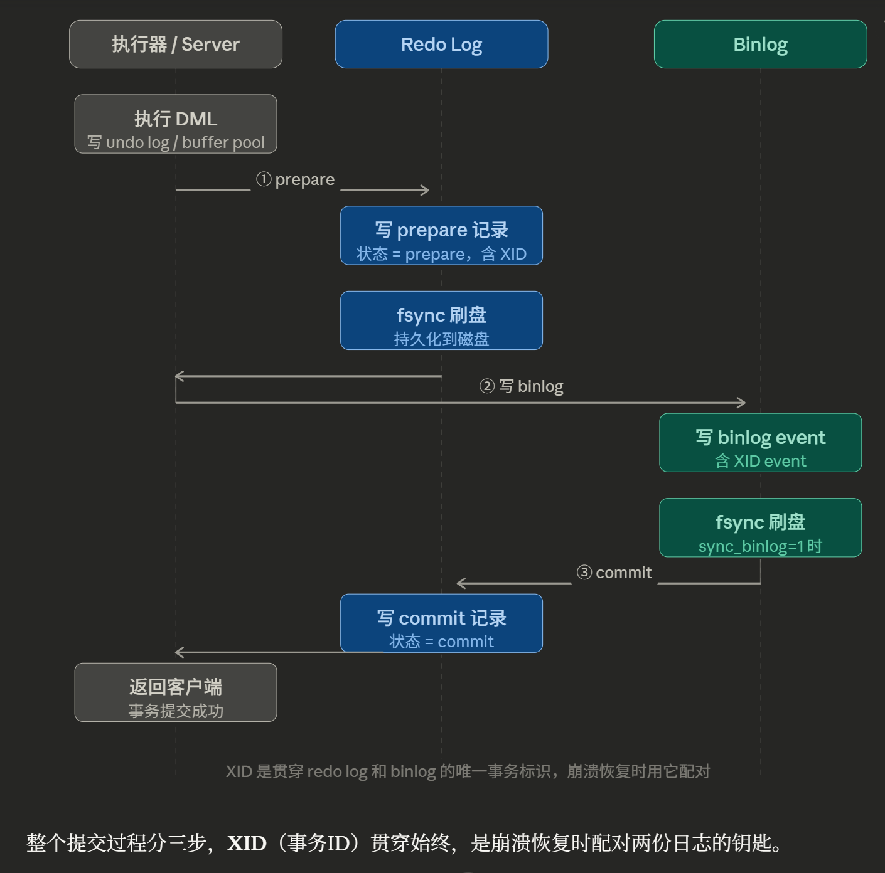

这个两阶段提交（2PC）确保即使崩溃，主库数据和 binlog 也能保持一致。

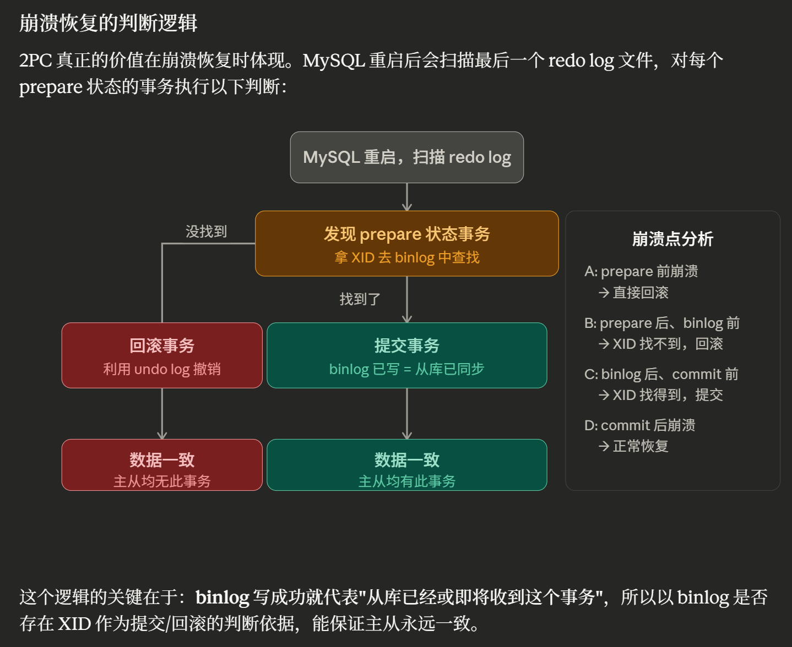

### MySQL 性能怎么优化？

**1. 抓住核心：慢 SQL 定位与分析**

性能优化的第一步永远是找到瓶颈。面试时，建议先从 **慢 SQL 定位和分析** 入手，这不仅能展示你解决问题的思路，还能体现你对数据库性能监控的熟练掌握：

- **监控工具：** 介绍常用的慢 SQL 监控工具，如 **MySQL 慢查询日志**、**Performance Schema** 等，说明你对这些工具的熟悉程度以及如何通过它们定位问题。

  ```SQL
  SHOW VARIABLES LIKE '%slow_query_log%'; #查看是否开启慢sql日志
  SHOW VARIABLES LIKE 'long_query_time'; #慢sql时间限制
  SHOW STATUS LIKE '%Slow_queries%'; # 当前慢sql的条数
  ```

- **EXPLAIN 命令：** 详细说明 `EXPLAIN` 命令的使用，分析查询计划、索引使用情况，可以结合实际案例展示如何解读分析结果，比如执行顺序、索引使用情况、全表扫描等。

**2. 由点及面：索引、表结构和 SQL 优化**

定位到慢 SQL 后，接下来就要针对具体问题进行优化。 这里可以重点介绍索引、表结构和 SQL 编写规范等方面的优化技巧：

- **索引优化：** 这是 MySQL 性能优化的重点，可以介绍索引的创建原则、覆盖索引、最左前缀匹配原则等。如果能结合你项目的实际应用来说明如何选择合适的索引，会更加分一些。
- **表结构优化：** 优化表结构设计，包括选择合适的字段类型、避免冗余字段、合理使用范式和反范式设计等等。
- **SQL 优化：** 避免使用 `SELECT *`、尽量使用具体字段、使用连接查询代替子查询、合理使用分页查询、批量操作等，都是 SQL 编写过程中需要注意的细节。

**3. 进阶方案：架构优化**

当面试官对基础优化知识比较满意时，可能会深入探讨一些架构层面的优化方案。以下是一些常见的架构优化策略：

- **读写分离：** 将读操作和写操作分离到不同的数据库实例，提升数据库的并发处理能力。
- **分库分表：** 将数据分散到多个数据库实例或数据表中，降低单表数据量，提升查询效率。但要权衡其带来的复杂性和维护成本，谨慎使用。
- **数据冷热分离**：根据数据的访问频率和业务重要性，将数据分为冷数据和热数据，冷数据一般存储在低成本、低性能的介质中，热数据存储在高性能存储介质中。
- **缓存机制：** 使用 Redis 等缓存中间件，将热点数据缓存到内存中，减轻数据库压力。这个非常常用，提升效果非常明显，性价比极高！


### 读写分离

**读写分离主要是为了将对数据库的读写操作分散到不同的数据库节点上。** 这样的话，就能够小幅提升写性能，大幅提升读性能。

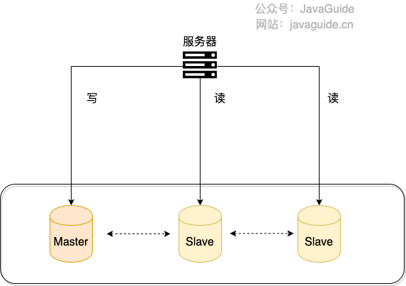

#### 如何实现读写分离？

不论是使用哪一种读写分离具体的实现方案，想要实现读写分离一般包含如下几步：

1. 部署多台数据库，选择其中的一台作为主数据库，其他的一台或者多台作为从数据库。
2. 保证主数据库和从数据库之间的数据是实时同步的，这个过程也就是我们常说的**主从复制**。
3. 系统将写请求交给主数据库处理，读请求交给从数据库处理。

**1. 代理方式**

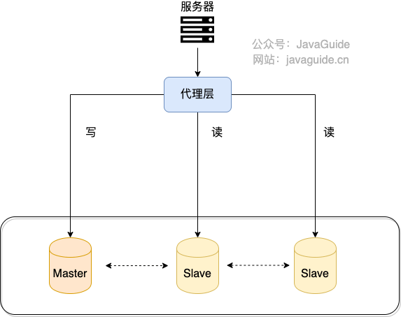

我们可以在应用和数据中间加了一个代理层。应用程序所有的数据请求都交给代理层处理，代理层负责分离读写请求，将它们路由到对应的数据库中。

提供类似功能的中间件有 **MySQL Router**（官方， MySQL Proxy 的替代方案）、**Atlas**（基于 MySQL Proxy）、**MaxScale**、**MyCat**。

**2. 组件方式**

在这种方式中，我们可以通过引入第三方组件来实现读写请求的路由。

这也是我比较推荐的一种方式。这种方式目前在各种互联网公司中用的最多的，相关的实际的案例也非常多。如果你要采用这种方式的话，推荐使用 **ShardingSphere-JDBC** ，直接引入 jar 包即可使用，非常方便。同时，也节省了很多运维的成本。


#### 主从复制原理是什么？

MySQL binlog(binary log 即二进制日志文件) 主要记录了 MySQL 数据库中数据的所有变化(数据库执行的所有 DDL 和 DML 语句)。因此，我们根据主库的 MySQL binlog 日志就能够将主库的数据同步到从库中。

**MySQL 主从复制是依赖于 binlog 。另外，常见的一些同步 MySQL 数据到其他数据源的工具（比如 canal）的底层一般也是依赖 binlog 。**


#### 如何避免主从延迟？

写分离对于提升数据库的并发非常有效，但是，同时也会引来一个问题：主库和从库的数据存在延迟，比如你写完主库之后，主库的数据同步到从库是需要时间的，这个时间差就导致了主库和从库的数据不一致性问题。这也就是我们经常说的 **主从同步延迟** 。

**强制将读请求路由到主库处理**

对于极少数必须强一致的业务（如支付后立刻查询余额），可以通过 Hint 强制查主库。

```java
// ShardingSphere-JDBC 强制读主库
HintManager hintManager = HintManager.getInstance();
hintManager.setMasterRouteOnly();
// 继续JDBC操作
```

**延迟读取**

还有一些朋友肯定会想既然主从同步存在延迟，那我就在延迟之后读取啊，比如主从同步延迟 0.5s,那我就 1s 之后再读取数据。

如果你是这样设计业务流程就会好很多：对于一些对数据比较敏感的场景，你可以在完成写请求之后，避免立即进行请求操作。比如你支付成功之后，跳转到一个支付成功的页面，当你点击返回之后才返回自己的账户。

#### 什么情况下会出现主从延迟？如何尽量减少延迟？

MySQL 主从同步延时是指从库的数据落后于主库的数据，这种情况可能由以下两个原因造成：

1. 从库 I/O 线程接收 binlog 的速度跟不上主库写入 binlog 的速度，导致从库 relay log 的数据滞后于主库 binlog 的数据；
2. 从库 SQL 线程执行 relay log 的速度跟不上从库 I/O 线程接收 binlog 的速度，导致从库的数据滞后于从库 relay log 的数据。

那什么情况下会出现出从延迟呢？这里列举几种常见的情况：

1. **从库机器性能比主库差**：从库接收 binlog 并写入 relay log 以及执行 SQL 语句的速度会比较慢（也就是 T2-T1 和 T3-T2 的值会较大），进而导致延迟。解决方法是选择与主库一样规格或更高规格的机器作为从库，或者对从库进行性能优化，比如调整参数、增加缓存、使用 SSD 等。

2. **从库处理的读请求过多**：从库需要执行主库的所有写操作，同时还要响应读请求，如果读请求过多，会占用从库的 CPU、内存、网络等资源，影响从库的复制效率（也就是 T2-T1 和 T3-T2 的值会较大，和前一种情况类似）。解决方法是引入缓存（推荐）、使用一主多从的架构，将读请求分散到不同的从库，或者使用其他系统来提供查询的能力，比如将 binlog 接入到 Hadoop、Elasticsearch 等系统中。

3. **大事务**：运行时间比较长，长时间未提交的事务就可以称为大事务。由于大事务执行时间长，并且从库上的大事务会比主库上的大事务花费更多的时间和资源，因此非常容易造成主从延迟。解决办法是避免大批量修改数据，尽量分批进行。类似的情况还有执行时间较长的慢 SQL ，实际项目遇到慢 SQL 应该进行优化。

4. **从库太多**：主库需要将 binlog 同步到所有的从库，如果从库数量太多，会增加同步的时间和开销（也就是 T2-T1 的值会比较大，但这里是因为主库同步压力大导致的）。解决方案是减少从库的数量，或者将从库分为不同的层级，让上层的从库再同步给下层的从库，减少主库的压力。

5. **网络延迟**：如果主从之间的网络传输速度慢，或者出现丢包、抖动等问题，那么就会影响 binlog 的传输效率，导致从库延迟。解决方法是优化网络环境，比如提升带宽、降低延迟、增加稳定性等。

6. **单线程复制**：MySQL 5.5 及之前，只支持单线程复制。为了优化复制性能，MySQL 5.6 引入了 **多线程复制**，但仅支持按库并行（`slave_parallel_type=DATABASE`）。MySQL 5.7 进一步完善，支持按组提交并行（`slave_parallel_type=LOGICAL_CLOCK`），大幅提升并行效率。建议在从库配置 `slave_parallel_workers > 0` 启用并行复制。

7. **复制模式**：MySQL 默认的复制是异步的，必然会存在延迟问题。全同步复制不存在延迟问题，但性能太差了。半同步复制是一种折中方案，相对于异步复制，半同步复制提高了数据的安全性，减少了主从延迟（还是有一定程度的延迟）。MySQL 5.5 开始，MySQL 以插件的形式支持 **semi-sync 半同步复制**。并且，MySQL 5.7 引入了 **增强半同步复制** 。

### 分库分表

读写分离主要应对的是数据库读并发，没有解决数据库存储问题。试想一下：**如果 MySQL 一张表的数据量过大怎么办?**

换言之，**我们该如何解决 MySQL 的存储压力呢？**

答案之一就是 **分库分表**。

#### 什么是分库？

**分库** 就是将数据库中的数据分散到不同的数据库上，可以垂直分库，也可以水平分库。

**垂直分库** 就是把单一数据库按照业务进行划分，不同的业务使用不同的数据库，进而将一个数据库的压力分担到多个数据库。

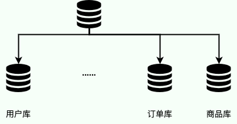

**水平分库** 是把同一个表按一定规则拆分到不同的数据库中，每个库可以位于不同的服务器上，这样就实现了水平扩展，解决了单表的存储和性能瓶颈的问题。

举个例子：订单表数据量太大，你对订单表进行了水平切分（水平分表），然后将切分后的 2 张订单表分别放在两个不同的数据库。

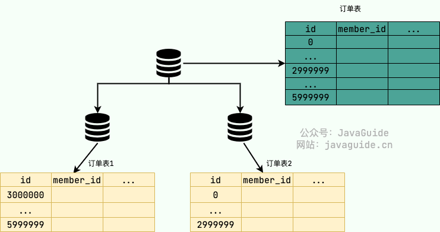

#### 什么是分表？

**分表** 就是对单表的数据进行拆分，可以是垂直拆分，也可以是水平拆分。

**垂直分表** 是对数据表列的拆分，把一张列比较多的表拆分为多张表。

举个例子：我们可以将用户信息表中的一些列单独抽出来作为一个表。

**水平分表** 是对数据表行的拆分，把一张行比较多的表拆分为多张表，可以解决单一表数据量过大的问题。

举个例子：我们可以将用户信息表拆分成多个用户信息表，这样就可以避免单一表数据量过大对性能造成影响。

水平拆分只能解决单表数据量大的问题，为了提升性能，我们通常会选择将拆分后的多张表放在不同的数据库中。也就是说，水平分表通常和水平分库同时出现。

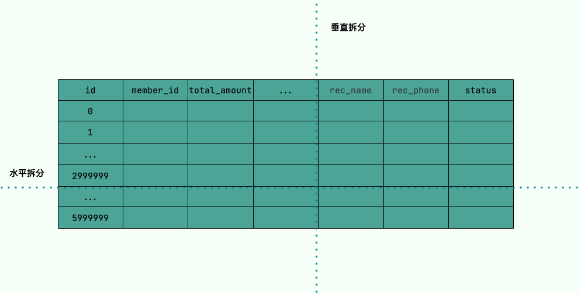

#### 什么情况下需要分库分表？

遇到下面几种场景可以考虑分库分表：

- 单表的数据量达到千万级别以上（具体阈值取决于表结构复杂度、索引数量、硬件配置等），数据库读写速度明显下降。
- 数据库中的数据占用的空间越来越大，备份时间越来越长。

#### 常见的分片算法有哪些？

分片算法主要解决了数据被水平分片之后，数据究竟该存放在哪个表的问题。

常见的分片算法有：

- **哈希分片**：求指定分片键的哈希，然后根据哈希值确定数据应被放置在哪个表中。哈希分片比较适合随机读写的场景，不太适合经常需要范围查询的场景。哈希分片可以使每个表的数据分布相对均匀，但对动态伸缩（例如新增一个表或者库）不友好。
- **范围分片**：按照特定的范围区间（比如时间区间、ID 区间）来分配数据，比如 将 `id` 为 `1~299999` 的记录分到第一个表， `300000~599999` 的分到第二个表。范围分片适合需要经常进行范围查找且数据分布均匀的场景，不太适合随机读写的场景（数据未被分散，容易出现热点数据的问题）。
- **一致性哈希分片**：将哈希空间组织成一个环形结构，将分片键和节点（数据库或表）都映射到这个环上，然后根据顺时针的规则确定数据或请求应该分配到哪个节点上，解决了传统哈希对动态伸缩不友好的问题。

#### 分片键如何选择？

分片键（Sharding Key）是数据分片的关键字段。分片键的选择非常重要，它关系着数据的分布和查询效率。一般来说，分片键应该具备以下特点：

- 具有共性，即能够覆盖绝大多数的查询场景，尽量减少单次查询所涉及的分片数量，降低数据库压力；
- 具有离散性，即能够将数据均匀地分散到各个分片上，避免数据倾斜和热点问题；
- 具有稳定性，即分片键的值不会发生变化，避免数据迁移和一致性问题；
- 具有扩展性，即能够支持分片的动态增加和减少，避免数据重新分片的开销。

实际项目中，分片键很难满足上面提到的所有特点，需要权衡一下。并且，分片键可以是表中多个字段的组合，例如取用户 ID 后四位作为订单 ID 后缀。

#### 分库分表会带来什么问题呢？

- **join 操作**：同一个数据库中的表分布在了不同的数据库中，导致无法使用 join 操作。这样就导致我们需要手动进行数据的封装，比如你在一个数据库中查询到一个数据之后，再根据这个数据去另外一个数据库中找对应的数据。不过，很多大厂的资深 DBA 都是建议尽量不要使用 join 操作。因为 join 的效率低，并且会对分库分表造成影响。对于需要用到 join 操作的地方，可以采用多次查询业务层进行数据组装的方法。不过，这种方法需要考虑业务上多次查询的事务性的容忍度。
- **事务问题**：同一个数据库中的表分布在了不同的数据库中，如果单个操作涉及到多个数据库，那么数据库自带的事务就无法满足我们的要求了。这个时候，我们就需要引入分布式事务了。
- **分布式 ID**：分库之后， 数据遍布在不同服务器上的数据库，数据库的自增主键已经没办法满足生成的主键唯一了。我们如何为不同的数据节点生成全局唯一主键呢？这个时候，我们就需要为我们的系统引入分布式 ID 了。关于分布式 ID 的详细介绍&实现方案总结，可以看我写的这篇文章：[分布式 ID 介绍&实现方案总结](https://javaguide.cn/distributed-system/distributed-id.html)。
- **跨库聚合查询问题**：分库分表会导致常规聚合查询操作，如 group by，order by 等变得异常复杂。这是因为这些操作需要在多个分片上进行数据汇总和排序，而不是在单个数据库上进行。为了实现这些操作，需要编写复杂的业务代码，或者使用中间件来协调分片间的通信和数据传输。这样会增加开发和维护的成本，以及影响查询的性能和可扩展性。
- **动态扩缩容困难（Resharding）**：尤其是采用传统 Hash 取模算法时，一旦现有分片容量打满需要增加新节点，会导致绝大多数数据的 Hash 映射失效，引发极其痛苦的全量数据洗牌与迁移。解决方案包括：预分足够的分片（如 1024 个逻辑分表）、采用一致性哈希、或使用支持自动 Rebalance 的分布式数据库（如 TiDB）。

#### 分库分表有没有什么比较推荐的方案？

Apache ShardingSphere 是一款分布式的数据库生态系统， 可以将任意数据库转换为分布式数据库，并通过数据分片、弹性伸缩、加密等能力对原有数据库进行增强。


#### 分库分表后，数据怎么迁移呢？

比较简单同时也是非常常用的方案就是**停机迁移**，写个脚本老库的数据写到新库中。比如你在凌晨 2 点，系统使用的人数非常少的时候，挂一个公告说系统要维护升级预计 1 小时。然后，你写一个脚本将老库的数据都同步到新库中。

如果你不想停机迁移数据的话，也可以考虑**双写方案**。双写方案是针对那种不能停机迁移的场景，实现起来要稍微麻烦一些。具体原理是这样的：

- 我们对老库的更新操作（增删改），同时也要写入新库（双写）。如果操作的数据在新库中不存在，则执行插入；若已存在，则执行更新。这样就能保证新库捕获到最新的变更。
- 在迁移过程，双写只会让被更新操作过的老库中的数据同步到新库，我们还需要自己写脚本将老库中的数据和新库的数据做比对。如果新库中没有，那咱们就把数据插入到新库。如果新库有，旧库没有，就把新库对应的数据删除（冗余数据清理）。
- 重复上一步的操作，直到老库和新库的数据一致为止。

**双写并发问题如何解决？** 在存量数据迁移和增量双写并行的阶段，极易发生旧数据覆盖新数据的并发问题。必须在新库表中引入 `update_time` 或 `version` 字段，无论是双写还是脚本补齐，写入新库前必须带上条件 `WHERE new_version < old_version`（乐观锁校验），确保只有较新的数据才能写入。

想要在项目中实施双写还是比较麻烦的，很容易会出现问题。我们可以借助上面提到的数据库同步工具 Canal 做增量数据迁移

### 数据冷热分离详解

数据冷热分离是指根据数据的**访问频率**和**业务重要性**，将数据划分为冷数据和热数据，并分别存储在不同性能和成本的存储介质中的架构策略。

- **提升查询性能**：热数据存储在高性能介质（如 SSD、内存）中，保障核心业务的响应速度。
- **降低存储成本**：冷数据迁移至低成本介质（如 HDD、对象存储），大幅削减存储开支。
- **满足合规要求**：部分行业（如金融、医疗）要求数据长期归档，冷热分离可兼顾合规与成本。

#### 冷数据和热数据

**热数据**是指被频繁访问和修改、且需要快速响应的数据；**冷数据**是指访问频率极低、对当前业务价值较小、但需要长期保留的数据。

- **时间维度区分**：按照数据的创建时间、更新时间或过期时间划分。例如，订单系统将一段时间前（如 90 天或 1 年）的订单数据标记为冷数据。该方法适用于**数据访问频率与时间强相关**的场景，实现简单、成本低。
- **访问频率区分**：将高频访问的数据视为热数据，低频访问的数据视为冷数据。例如，内容系统将**浏览量低于阈值**的文章标记为冷数据。该方法需要额外记录访问频率，适用于**访问频率与数据本身特性强相关**的场景。

#### 冷热分离的多级分层策略

实际落地时，"冷"与"热"往往不是非此即彼的二分法，而是**渐进式多级分层**：

| 层级         | 数据特性             | 判定规则示例                | 存储策略               |
| ------------ | -------------------- | --------------------------- | ---------------------- |
| **热数据**   | 高频访问、实时响应   | 最近 30 天 + 所有未完成订单 | MySQL 热库（SSD）      |
| **温数据**   | 中频访问、可能被查询 | 30~90 天前的订单            | MySQL 温库（HDD）      |
| **冷数据**   | 低频访问、偶发查询   | 90 天~3 年的历史订单        | 独立冷库或对象存储     |
| **归档数据** | 极少访问、仅合规留存 | 超过 3 年的订单             | 对象存储（仅保留汇总） |

#### 冷数据被访问后如何处理？

如果冷数据突然被访问（如用户查询 3 年前的订单），是否需要"热升级"？

| 策略         | 适用场景               | 优点                 | 缺点                         |
| ------------ | ---------------------- | -------------------- | ---------------------------- |
| **不回迁**   | 偶发查询、查询频率极低 | 实现简单             | 查询速度慢                   |
| **缓存层**   | 中等频率查询           | 加速查询、不改变存储 | 需要额外缓存组件             |
| **异步回迁** | 高频查询、需要持续访问 | 彻底解决性能问题     | 实现复杂、可能产生一致性问题 |

**推荐做法**：绝大多数场景采用"**不回迁 + 缓存层**"的组合方案。冷数据查询时，先查缓存，命中则直接返回；未命中则查冷库并将结果写入缓存

#### 数据冷热分离的优缺点

**优点：**

- **热数据查询性能优化**：热数据集中在高性能存储上，表数据量大幅减少，索引效率显著提升，用户的绝大部分操作体验会更好。
- **存储成本大幅降低**：冷数据可迁移至 HDD 或对象存储，**SSD 与 HDD 的单位成本差距可达 5~10 倍**，对于海量数据场景节省效果显著。
- **系统可维护性增强**：热库数据量可控，备份恢复速度更快，DDL 操作（如加索引）耗时更短。

**缺点：**

- **系统复杂性增加**：需要额外的迁移组件、路由逻辑和监控体系，数据一致性风险增加。
- **跨库查询效率低**：若业务需要同时查询冷热数据（如年度统计报表），需进行跨库关联或数据聚合，查询性能和开发成本均会上升。
- **迁移策略维护成本**：冷热数据的判定规则需要持续调优，避免误判导致热数据被错误迁移。

#### 冷数据如何迁移？

冷数据迁移是冷热分离的核心环节，主流方案有以下三种：

| 方案                | 实现原理                                 | 优点                   | 缺点                                         | 适用场景                     |
| ------------------- | ---------------------------------------- | ---------------------- | -------------------------------------------- | ---------------------------- |
| **业务层代码实现**  | 写操作时判断冷热，直接路由到对应库       | 实时性高               | 侵入业务代码、判定逻辑复杂                   | 几乎不使用                   |
| **任务调度迁移**    | 定时任务扫描热库，批量迁移符合条件的数据 | 实现简单               | 存在迁移延迟、扫表可能污染 Buffer Pool       | 时间维度区分场景             |
| **Binlog 监听迁移** | 监听数据库变更日志，实时或准实时迁移     | 实时性好、对业务无侵入 | 需要额外组件（如 Canal）、不适合时间维度判定 | **访问频率区分场景（推荐）** |

#### 迁移过程中如何保证数据一致性？

数据迁移过程中，最棘手的问题是：**如果数据在迁移过程中被更新，如何处理？**

| 方案                | 实现方式                               | 优点             | 缺点                                 |
| ------------------- | -------------------------------------- | ---------------- | ------------------------------------ |
| **迁移前锁定**      | 迁移前对记录加写锁，迁移完成后释放     | 一致性强         | 影响业务写入、吞吐量下降             |
| **版本号乐观锁**    | 迁移时记录版本，删除前校验版本是否变化 | 无锁、性能好     | 需要业务表增加版本字段、冲突时需重试 |
| **状态标记 + 幂等** | 热库增加迁移状态字段，先标记再迁移     | 可追溯、支持回滚 | 需要改造业务表                       |

#### 冷数据如何查询？

首先需要明确：**业务是否真的需要查询冷数据？**

- **不需要**：可将冷数据完全移出业务库，仅保留归档（如对象存储），需要时人工提取。
- **需要**：需设计合理的查询方案，平衡性能与成本。

| 优化手段             | 实现方式                                            | 适用场景       |
| -------------------- | --------------------------------------------------- | -------------- |
| **冷库独立只读实例** | 冷库部署只读副本，避免冷查询影响热库                | 高频冷查询场景 |
| **查询路由**         | 应用层根据时间范围自动路由到热库或冷库              | 跨冷热查询场景 |
| **预聚合**           | 定期对冷数据生成月度/季度报表，查询时直接查聚合结果 | 统计分析场景   |
| **列式存储**         | 冷库采用 ClickHouse、Doris 等 OLAP 引擎             | 大规模分析查询 |

**跨冷热查询的处理**：

若查询范围同时涉及冷热数据（如"查询近 2 年的订单"），有两种处理方式：

1. **拆分查询**：分别查询热库和冷库，应用层合并结果。
2. **限制范围**：提示用户缩小查询范围，避免跨库查询。

#### 应用层如何路由冷热数据？

| 方案         | 实现方式                                 | 优点               | 缺点                         |
| ------------ | ---------------------------------------- | ------------------ | ---------------------------- |
| **硬编码**   | 代码中直接判断路由                       | 实现简单           | 维护成本高、规则变更需改代码 |
| **配置中心** | 路由规则存入配置中心（如 Nacos、Apollo） | 动态调整、无需重启 | 需要额外组件支持             |
| **Proxy 层** | 引入 ShardingSphere、ProxySQL 等中间件   | 业务无感知         | 架构复杂度高                 |


### 深度分页

```mysql
# MySQL 在无法利用索引的情况下跳过1000000条记录后，再获取10条记录
SELECT * FROM t_order ORDER BY id LIMIT 1000000, 10
```

**深度分页变慢的根本原因**在于 MySQL 的执行机制：对于 `LIMIT offset, N`，MySQL 并非直接跳到 `offset` 处，而是必须从头扫描 `offset + N` 条记录。如果查询依赖二级索引且不满足覆盖索引，这意味着 MySQL 需要对前 `offset` 条记录执行毫无意义的**回表查询（产生海量的随机 I/O）**，最后再将这些辛苦查出的数据丢弃。即便优化器最终因代价过高退化为全表扫描，顺序扫描百万行的成本依然巨大。

#### 深度分页优化建议

**范围查询（游标分页）**

通过记录上一页最后一条记录的 ID，使用 `WHERE id > last_id LIMIT n` 获取下一页数据：

```MYSQL
# 通过记录上次查询结果的最后一条记录的 ID 进行下一页的查询
SELECT * FROM t_order WHERE id > 100000 ORDER BY id LIMIT 10
```

**游标分页的核心优势**：**不依赖 ID 的连续性**。MySQL 只需要在 B+ 树上定位到 `last_id` 的位置，然后顺序向后读取 `n` 条记录即可，中间是否有断层（如 ID 被删除）完全不影响结果的准确性和性能。

这种方式的限制：

1. **不支持跳页**：无法直接跳转到第 N 页，只能逐页向后（或向前）翻页。

2. **排序字段受限**：如果查询需要按照其他字段（如创建时间）排序而非 ID 排序，需使用联合游标 `(sort_field, id)` 保证唯一性和顺序。

3. 并发场景

   ：当分页查询期间有新数据插入或删除时，可能出现： 

   - **数据遗漏**：查询第二页时，有新数据插入到第一页范围内，导致该数据被"挤"到第二页，但第二页查询已基于旧的最后 ID 跳过它。
   - **数据重复**：查询第二页时，第一页末尾有数据被删除，原第二页的第一条数据"升"到第一页末尾，导致第二页查询再次返回它。

#### 子查询

我们先查询出 limit 第一个参数对应的主键值，再根据这个主键值再去过滤并 limit，这样效率会更快一些。

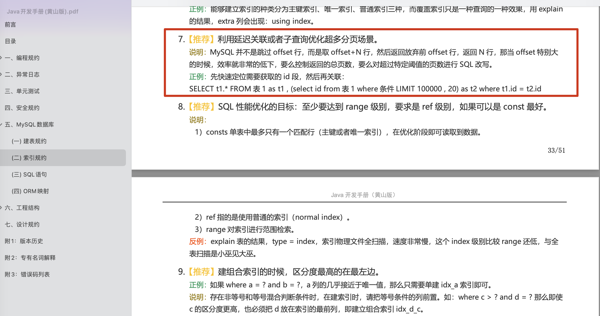

```sql
-- 先通过子查询在主键索引上进行偏移，快速找到起始ID
SELECT * FROM t_order
WHERE id >= (
    SELECT id FROM t_order ORDER BY id LIMIT 1000000, 1
) ORDER BY id LIMIT 10;
```

**工作原理**:

1. 子查询 `(SELECT id FROM t_order ORDER BY id LIMIT 1000000, 1)` 利用主键索引扫描并跳过前 1000000 条记录，返回第 1000001 条记录的主键值。
2. 主查询 `SELECT * FROM t_order WHERE id >= ... ORDER BY id LIMIT 10` 以该主键为起点，获取后续 10 条完整记录。

#### 延迟关联

延迟关联与子查询的优化思路类似，都是通过将 `LIMIT` 操作转移到主键索引树上，减少回表次数。相比直接使用子查询，延迟关联通过 `INNER JOIN` 将子查询结果集成到主查询中，避免了子查询可能产生的临时表。在执行 `INNER JOIN` 时，MySQL 优化器能够利用索引进行高效的连接操作（如索引扫描或其他优化策略），因此在深度分页场景下，性能通常优于直接使用子查询。

```sql
create table big_log
(
    id       int         not null
        primary key,
    user_id  int         null,
    action   varchar(50) null,
    log_time datetime    null
);

create index user_index
    on big_log (user_id, action, id);
    
explain
SELECT *
FROM big_log
WHERE user_id > 1
  and action = 'a'
order by user_id
limit 1000000,20;

explain
select *
from big_log b1,
     (SELECT id
      FROM big_log
      WHERE user_id > 1
        and action = 'a'
      order by user_id
      limit 100000,20) b2
where b1.id = b2.id
order by b1.user_id;
    
```

#### 覆盖索引

**覆盖索引的好处：**

- **避免 InnoDB 表进行索引的二次查询，也就是回表操作**：InnoDB 是以聚集索引的顺序来存储的，对于 InnoDB 来说，二级索引在叶子节点中所保存的是行的主键信息，如果是用二级索引查询数据的话，在查找到相应的键值后，还要通过主键进行二次查询才能获取我们真实所需要的数据。而在覆盖索引中，二级索引的键值中可以获取所有的数据，避免了对主键的二次查询（回表），减少了 IO 操作，提升了查询效率。
- **减少回表带来的随机 IO**：通过覆盖索引直接返回数据，避免了根据二级索引的主键值回表查询聚簇索引的随机 IO 操作。回表时每次按主键值查找聚簇索引，本质上是随机 IO。

```sql
# 在 InnoDB 中，辅助索引天然包含主键 id
# 如果只需要查询 id, code, type 这三列，只需建立 (code, type) 的联合索引即可实现覆盖
SELECT id, code, type FROM t_order
ORDER BY code
LIMIT 1000000, 10;
```

本文介绍了四种常见的深度分页优化方案，各方案的特点及适用场景对比如下：

| 优化方案     | 核心思路                                                     | 适用场景                       | 限制                                             |
| ------------ | ------------------------------------------------------------ | ------------------------------ | ------------------------------------------------ |
| **范围查询** | 记录上一页最后一条 ID，通过 `WHERE id > last_id LIMIT n` 获取下一页 | 按 ID 排序、允许游标式翻页     | 不支持跳页、非 ID 排序需使用联合游标             |
| **子查询**   | 先通过子查询获取起始主键，再根据主键过滤                     | 需要支持传统 OFFSET 翻页       | 子查询可能产生临时表、依赖排序字段的索引         |
| **延迟关联** | 用 `INNER JOIN` 将分页转移到主键索引，减少回表               | 大数据量分页、需要传统翻页逻辑 | SQL 相对复杂                                     |
| **覆盖索引** | 建立包含查询字段的联合索引，避免回表                         | 查询字段固定、可建立合适索引   | 字段较多时索引维护成本高、大结果集可能走全表扫描 |

**方案选择建议**：

- **优先使用延迟关联**：对于大多数需要支持传统 `LIMIT offset, size` 翻页逻辑的场景，延迟关联是性能和可维护性较好的选择。
- **考虑范围查询（游标分页）**：如果业务允许使用"下一页"式的游标翻页（如社交媒体 feed 流、无限滚动），范围查询性能最佳且稳定。
- **覆盖索引作为补充**：当查询字段固定且数量不多时，可配合其他方案建立覆盖索引进一步优化。


